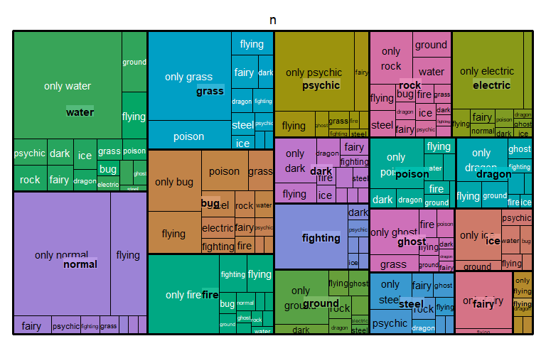

```r
# setup
pacman::p_load(highcharter, dplyr, tidyr, forcats, timetk, billboarder, data.table, DT)
pokemon <- pokemon
```

# Bar charts


```r
pokemon%>%
  count(type_1)%>%
  arrange(n)%>%
  hchart(type = "bar", hcaes(x = fct_reorder(type_1, n, .desc = T), y = n)) %>% 
  hc_exporting(enabled = TRUE) %>% 
  hc_tooltip(crosshairs = TRUE, backgroundColor = "#FCFFC5",
             shared = F, borderWidth = 2) %>%
  hc_title(text="Bar Plot",align="center") %>%
  hc_subtitle(text="Data Source: highcharts library",align="center") %>%
  hc_add_theme(hc_theme_economist()) %>% 
  hc_chart(zoomType = "x")
```

```{=html}
<div class="highchart html-widget html-fill-item-overflow-hidden html-fill-item" id="htmlwidget-a8c986a0970d553f1530" style="width:768px;height:480px;"></div>
<script type="application/json" data-for="htmlwidget-a8c986a0970d553f1530">{"x":{"hc_opts":{"chart":{"reflow":true,"zoomType":"x"},"title":{"text":"Bar Plot","align":"center"},"yAxis":{"title":{"text":"n"},"type":"linear"},"credits":{"enabled":false},"exporting":{"enabled":true},"boost":{"enabled":false},"plotOptions":{"series":{"label":{"enabled":false},"turboThreshold":0,"showInLegend":false},"treemap":{"layoutAlgorithm":"squarified"},"scatter":{"marker":{"symbol":"circle"}}},"series":[{"group":"group","data":[{"type_1":"flying","n":7,"y":7,"name":"flying"},{"type_1":"fairy","n":21,"y":21,"name":"fairy"},{"type_1":"ice","n":28,"y":28,"name":"ice"},{"type_1":"steel","n":30,"y":30,"name":"steel"},{"type_1":"dragon","n":31,"y":31,"name":"dragon"},{"type_1":"ghost","n":31,"y":31,"name":"ghost"},{"type_1":"ground","n":35,"y":35,"name":"ground"},{"type_1":"poison","n":35,"y":35,"name":"poison"},{"type_1":"dark","n":36,"y":36,"name":"dark"},{"type_1":"fighting","n":36,"y":36,"name":"fighting"},{"type_1":"electric","n":49,"y":49,"name":"electric"},{"type_1":"rock","n":50,"y":50,"name":"rock"},{"type_1":"fire","n":58,"y":58,"name":"fire"},{"type_1":"psychic","n":58,"y":58,"name":"psychic"},{"type_1":"bug","n":75,"y":75,"name":"bug"},{"type_1":"grass","n":86,"y":86,"name":"grass"},{"type_1":"normal","n":109,"y":109,"name":"normal"},{"type_1":"water","n":123,"y":123,"name":"water"}],"type":"bar"}],"xAxis":{"type":"category","title":{"text":["fct_reorder","type_1","n","T"]},"categories":null},"tooltip":{"crosshairs":true,"backgroundColor":"#FCFFC5","shared":false,"borderWidth":2},"subtitle":{"text":"Data Source: highcharts library","align":"center"}},"theme":{"colors":["#6794a7","#014d64","#76c0c1","#01a2d9","#7ad2f6","#00887d","#adadad","#7bd3f6","#7c260b","#ee8f71","#76c0c1","#a18376"],"chart":{"backgroundColor":"#d5e4eb","style":{"fontFamily":"Droid Sans","color":"#3C3C3C"}},"title":{"align":"left","style":{"fontWeight":"bold"}},"subtitle":{"align":"left"},"yAxis":{"gridLineColor":"#FFFFFF","lineColor":"#FFFFFF","minorGridLineColor":"#FFFFFF","tickColor":"#D7D7D8","tickWidth":1,"title":{"style":{"color":"#A0A0A3"}}},"tooltip":{"backgroundColor":"#FFFFFF","borderColor":"#76c0c1","style":{"color":"#000000"}},"legend":{"itemStyle":{"color":"#3C3C3C"},"itemHiddenStyle":{"color":"#606063"}},"credits":{"style":{"color":"#666"}},"labels":{"style":{"color":"#D7D7D8"}},"drilldown":{"activeAxisLabelStyle":{"color":"#F0F0F3"},"activeDataLabelStyle":{"color":"#F0F0F3"}},"navigation":{"buttonOptions":{"symbolStroke":"#DDDDDD","theme":{"fill":"#505053"}}},"legendBackgroundColor":"rgba(0, 0, 0, 0.5)","background2":"#505053","dataLabelsColor":"#B0B0B3","textColor":"#C0C0C0","contrastTextColor":"#F0F0F3","maskColor":"rgba(255,255,255,0.3)"},"conf_opts":{"global":{"Date":null,"VMLRadialGradientURL":"http =//code.highcharts.com/list(version)/gfx/vml-radial-gradient.png","canvasToolsURL":"http =//code.highcharts.com/list(version)/modules/canvas-tools.js","getTimezoneOffset":null,"timezoneOffset":0,"useUTC":true},"lang":{"contextButtonTitle":"Chart context menu","decimalPoint":".","downloadCSV":"Download CSV","downloadJPEG":"Download JPEG image","downloadPDF":"Download PDF document","downloadPNG":"Download PNG image","downloadSVG":"Download SVG vector image","downloadXLS":"Download XLS","drillUpText":"◁ Back to {series.name}","exitFullscreen":"Exit from full screen","exportData":{"annotationHeader":"Annotations","categoryDatetimeHeader":"DateTime","categoryHeader":"Category"},"hideData":"Hide data table","invalidDate":null,"loading":"Loading...","months":["January","February","March","April","May","June","July","August","September","October","November","December"],"noData":"No data to display","numericSymbolMagnitude":1000,"numericSymbols":["k","M","G","T","P","E"],"printChart":"Print chart","resetZoom":"Reset zoom","resetZoomTitle":"Reset zoom level 1:1","shortMonths":["Jan","Feb","Mar","Apr","May","Jun","Jul","Aug","Sep","Oct","Nov","Dec"],"shortWeekdays":["Sat","Sun","Mon","Tue","Wed","Thu","Fri"],"thousandsSep":" ","viewData":"View data table","viewFullscreen":"View in full screen","weekdays":["Sunday","Monday","Tuesday","Wednesday","Thursday","Friday","Saturday"]}},"type":"chart","fonts":"Droid+Sans","debug":false},"evals":[],"jsHooks":[]}</script>
```

# Histograms


```r
hchart(density(pokemon$weight), type = 'area', name = 'Weight', color = '#669900') %>% 
  hc_exporting(enabled = TRUE) %>% 
  hc_tooltip(crosshairs = TRUE, backgroundColor = "#FCFFC5",
             shared = TRUE, borderWidth = 2) %>%
  hc_title(text="Histogram", align="center") %>%
  hc_subtitle(text="Data Source: highcharts library",align="center") %>%
  hc_add_theme(hc_theme_economist()) %>% 
  hc_chart(zoomType = "x")
```

```{=html}
<div class="highchart html-widget html-fill-item-overflow-hidden html-fill-item" id="htmlwidget-c1ef0c920aa207451b9c" style="width:768px;height:480px;"></div>
<script type="application/json" data-for="htmlwidget-c1ef0c920aa207451b9c">{"x":{"hc_opts":{"chart":{"reflow":true,"zoomType":"x"},"title":{"text":"Histogram","align":"center"},"yAxis":{"title":{"text":null}},"credits":{"enabled":false},"exporting":{"enabled":true},"boost":{"enabled":false},"plotOptions":{"series":{"label":{"enabled":false},"turboThreshold":0},"treemap":{"layoutAlgorithm":"squarified"}},"series":[{"data":[{"x":-291.1811178328837,"y":4.977541761915921e-06},{"x":-270.471994084027,"y":9.559412620591098e-06},{"x":-249.7628703351703,"y":1.757518274122319e-05},{"x":-229.0537465863136,"y":3.096532735859531e-05},{"x":-208.3446228374569,"y":5.233799440361782e-05},{"x":-187.6354990886002,"y":8.495160303429228e-05},{"x":-166.9263753397435,"y":0.0001325443594044652},{"x":-146.2172515908868,"y":0.0001989619901808506},{"x":-125.5081278420301,"y":0.0002883208245164463},{"x":-104.7990040931735,"y":0.0004030487028358104},{"x":-84.08988034431678,"y":0.0005412656985112241},{"x":-63.38075659546007,"y":0.0006992235530577299},{"x":-42.67163284660339,"y":0.0008701438480289336},{"x":-21.9625090977467,"y":0.001044697229527636},{"x":-1.253385348889992,"y":0.001212029882365664},{"x":19.45573839996666,"y":0.001361176449711044},{"x":40.16486214882337,"y":0.001482591359182993},{"x":60.87398589768009,"y":0.00156948819574098},{"x":81.58310964653674,"y":0.001618712025299431},{"x":102.2922333953935,"y":0.001630973654531185},{"x":123.0013571442501,"y":0.00161042065281006},{"x":143.7104808931068,"y":0.001563669171403048},{"x":164.4196046419635,"y":0.001498533466298774},{"x":185.1287283908202,"y":0.001422517865134614},{"x":205.8378521396769,"y":0.001343047531592398},{"x":226.5469758885336,"y":0.00126455366635718},{"x":247.2560996373903,"y":0.001189470136190543},{"x":267.9652233862469,"y":0.001118706789126112},{"x":288.6743471351037,"y":0.001052134380027003},{"x":309.3834708839603,"y":0.0009891020462890524},{"x":330.092594632817,"y":0.0009288830418865442},{"x":350.8017183816738,"y":0.000870983104035663},{"x":371.5108421305304,"y":0.0008152859927420156},{"x":392.2199658793871,"y":0.0007620460388294618},{"x":412.9290896282438,"y":0.0007117639922426335},{"x":433.6382133771005,"y":0.0006649982096379672},{"x":454.3473371259572,"y":0.0006221680419486791},{"x":475.0564608748139,"y":0.0005834696691056033},{"x":495.7655846236706,"y":0.0005487671151620721},{"x":516.4747083725272,"y":0.0005171922985850668},{"x":537.1838321213838,"y":0.0004879925384947468},{"x":557.8929558702407,"y":0.0004604712736943901},{"x":578.6020796190974,"y":0.0004341602643325773},{"x":599.311203367954,"y":0.0004089304931269278},{"x":620.0203271168107,"y":0.0003850133340631571},{"x":640.7294508656673,"y":0.0003629260044135922},{"x":661.438574614524,"y":0.0003433191414846124},{"x":682.1476983633809,"y":0.0003267838900980938},{"x":702.8568221122375,"y":0.0003136664590569352},{"x":723.5659458610942,"y":0.0003039369740891834},{"x":744.2750696099508,"y":0.0002971464980992033},{"x":764.9841933588075,"y":0.0002924840308929244},{"x":785.6933171076641,"y":0.0002889155464078114},{"x":806.4024408565208,"y":0.0002852695637956779},{"x":827.1115646053775,"y":0.0002807084416677011},{"x":847.8206883542343,"y":0.0002747415237233431},{"x":868.529812103091,"y":0.0002672141329869575},{"x":889.2389358519476,"y":0.0002582554555742535},{"x":909.9480596008043,"y":0.0002481823333153807},{"x":930.657183349661,"y":0.0002373906904550972},{"x":951.3663070985176,"y":0.0002262626790204934},{"x":972.0754308473745,"y":0.0002151075511641333},{"x":992.7845545962311,"y":0.0002041414862220766},{"x":1013.493678345088,"y":0.0001934998282284102},{"x":1034.202802093944,"y":0.0001832673424413397},{"x":1054.911925842801,"y":0.0001735097652413985},{"x":1075.621049591658,"y":0.0001642962965572771},{"x":1096.330173340514,"y":0.0001557406272101049},{"x":1117.039297089371,"y":0.0001478467141742165},{"x":1137.748420838228,"y":0.0001406188700778332},{"x":1158.457544587085,"y":0.0001340140585693342},{"x":1179.166668335941,"y":0.0001279494529870692},{"x":1199.875792084798,"y":0.0001223223320158657},{"x":1220.584915833655,"y":0.0001170353613276568},{"x":1241.294039582511,"y":0.000112019378839151},{"x":1262.003163331368,"y":0.0001072477145748639},{"x":1282.712287080225,"y":0.0001027393924634664},{"x":1303.421410829081,"y":9.855167992963279e-05},{"x":1324.130534577938,"y":9.476427252144315e-05},{"x":1344.839658326795,"y":9.145770918553231e-05},{"x":1365.548782075651,"y":8.868814104775755e-05},{"x":1386.257905824508,"y":8.64778627897446e-05},{"x":1406.967029573365,"y":8.473471725911468e-05},{"x":1427.676153322222,"y":8.325331881139041e-05},{"x":1448.385277071078,"y":8.177601183364885e-05},{"x":1469.094400819935,"y":8.000934921834002e-05},{"x":1489.803524568792,"y":7.768029622999084e-05},{"x":1510.512648317648,"y":7.459722516004051e-05},{"x":1531.221772066505,"y":7.06998068931051e-05},{"x":1551.930895815362,"y":6.608387973522573e-05},{"x":1572.640019564218,"y":6.099368741673958e-05},{"x":1593.349143313075,"y":5.578242590851223e-05},{"x":1614.058267061932,"y":5.085019769857875e-05},{"x":1634.767390810789,"y":4.657390866082175e-05},{"x":1655.476514559645,"y":4.324496711392135e-05},{"x":1676.185638308502,"y":4.102780164102059e-05},{"x":1696.894762057359,"y":4.001826804610836e-05},{"x":1717.603885806215,"y":4.001939710993546e-05},{"x":1738.313009555072,"y":4.082861423259609e-05},{"x":1759.022133303929,"y":4.223601641078783e-05},{"x":1779.731257052785,"y":4.406162700714691e-05},{"x":1800.440380801642,"y":4.618768725956834e-05},{"x":1821.149504550499,"y":4.857138742734095e-05},{"x":1841.858628299355,"y":5.12361654148757e-05},{"x":1862.567752048212,"y":5.424405613276011e-05},{"x":1883.276875797069,"y":5.765570128253935e-05},{"x":1903.985999545925,"y":6.14876686775251e-05},{"x":1924.695123294782,"y":6.567785992461023e-05},{"x":1945.404247043639,"y":7.006845073150973e-05},{"x":1966.113370792496,"y":7.441195537214839e-05},{"x":1986.822494541352,"y":7.838229128734057e-05},{"x":2007.531618290209,"y":8.160564261714316e-05},{"x":2028.240742039066,"y":8.383707590320511e-05},{"x":2048.949865787923,"y":8.490151648103964e-05},{"x":2069.658989536779,"y":8.472978658887311e-05},{"x":2090.368113285636,"y":8.335592725579961e-05},{"x":2111.077237034493,"y":8.089969070296176e-05},{"x":2131.786360783349,"y":7.754023657996208e-05},{"x":2152.495484532206,"y":7.348701954081928e-05},{"x":2173.204608281063,"y":6.89527418318852e-05},{"x":2193.913732029919,"y":6.413184506620066e-05},{"x":2214.622855778776,"y":5.918678886443853e-05},{"x":2235.331979527633,"y":5.424336888326426e-05},{"x":2256.04110327649,"y":4.93953033716212e-05},{"x":2276.750227025346,"y":4.471690903049603e-05},{"x":2297.459350774203,"y":4.030118458586423e-05},{"x":2318.16847452306,"y":3.62411658506871e-05},{"x":2338.877598271916,"y":3.265141128716654e-05},{"x":2359.586722020773,"y":2.966784286642748e-05},{"x":2380.29584576963,"y":2.742051818062112e-05},{"x":2401.004969518486,"y":2.600385345682842e-05},{"x":2421.714093267343,"y":2.544691559960612e-05},{"x":2442.423217016199,"y":2.569202075430886e-05},{"x":2463.132340765056,"y":2.658809729444158e-05},{"x":2483.841464513913,"y":2.79018646933433e-05},{"x":2504.55058826277,"y":2.934577082420201e-05},{"x":2525.259712011627,"y":3.061781575715105e-05},{"x":2545.968835760483,"y":3.144572470018174e-05},{"x":2566.67795950934,"y":3.162696613776876e-05},{"x":2587.387083258197,"y":3.104792250608693e-05},{"x":2608.096207007053,"y":2.968524606669501e-05},{"x":2628.80533075591,"y":2.771789885945363e-05},{"x":2649.514454504766,"y":2.533990980125916e-05},{"x":2670.223578253623,"y":2.277613520396722e-05},{"x":2690.93270200248,"y":2.024861795166507e-05},{"x":2711.641825751336,"y":1.794932816073695e-05},{"x":2732.350949500193,"y":1.602253249627258e-05},{"x":2753.06007324905,"y":1.455772835945292e-05},{"x":2773.769196997907,"y":1.359204358470336e-05},{"x":2794.478320746764,"y":1.311952984391813e-05},{"x":2815.18744449562,"y":1.310400052938682e-05},{"x":2835.896568244477,"y":1.349199280972939e-05},{"x":2856.605691993333,"y":1.422299630659951e-05},{"x":2877.31481574219,"y":1.523516162023435e-05},{"x":2898.023939491047,"y":1.647261151782855e-05},{"x":2918.733063239903,"y":1.785751169868629e-05},{"x":2939.44218698876,"y":1.930643434992751e-05},{"x":2960.151310737617,"y":2.073448691314894e-05},{"x":2980.860434486473,"y":2.205275230920431e-05},{"x":3001.56955823533,"y":2.31779090153101e-05},{"x":3022.278681984187,"y":2.404496444343334e-05},{"x":3042.987805733044,"y":2.462013752955521e-05},{"x":3063.6969294819,"y":2.491046017704217e-05},{"x":3084.406053230757,"y":2.496703889451382e-05},{"x":3105.115176979614,"y":2.488006049174488e-05},{"x":3125.82430072847,"y":2.476532356593604e-05},{"x":3146.533424477327,"y":2.4744001515011e-05},{"x":3167.242548226184,"y":2.491909630583955e-05},{"x":3187.95167197504,"y":2.535321805112668e-05},{"x":3208.660795723897,"y":2.606745479701083e-05},{"x":3229.369919472754,"y":2.697059038567257e-05},{"x":3250.07904322161,"y":2.794323250230354e-05},{"x":3270.788166970467,"y":2.88394803997271e-05},{"x":3291.497290719324,"y":2.951259536644414e-05},{"x":3312.206414468181,"y":2.983975437590571e-05},{"x":3332.915538217037,"y":2.974094185710698e-05},{"x":3353.624661965894,"y":2.918877863714277e-05},{"x":3374.333785714751,"y":2.820819391675464e-05},{"x":3395.042909463607,"y":2.686698462252739e-05},{"x":3415.752033212464,"y":2.526002306244841e-05},{"x":3436.461156961321,"y":2.349085065174552e-05},{"x":3457.170280710177,"y":2.165450124619179e-05},{"x":3477.879404459034,"y":1.982470193061172e-05},{"x":3498.588528207891,"y":1.804962199644458e-05},{"x":3519.297651956747,"y":1.634779863312425e-05},{"x":3540.006775705604,"y":1.471010446876346e-05},{"x":3560.715899454461,"y":1.312181963545454e-05},{"x":3581.425023203318,"y":1.156991421132122e-05},{"x":3602.134146952174,"y":1.005047557934521e-05},{"x":3622.843270701031,"y":8.572638277492886e-06},{"x":3643.552394449888,"y":7.158777339297204e-06},{"x":3664.261518198744,"y":5.841595211255009e-06},{"x":3684.970641947601,"y":4.659359507805867e-06},{"x":3705.679765696458,"y":3.650788514544153e-06},{"x":3726.388889445314,"y":2.850878702085542e-06},{"x":3747.098013194171,"y":2.28838122555741e-06},{"x":3767.807136943028,"y":1.984831883175691e-06},{"x":3788.516260691884,"y":1.954277310548811e-06},{"x":3809.225384440741,"y":2.220115083195667e-06},{"x":3829.934508189598,"y":2.758793186149672e-06},{"x":3850.643631938455,"y":3.539310155719861e-06},{"x":3871.352755687311,"y":4.512151059764576e-06},{"x":3892.061879436168,"y":5.603838586317323e-06},{"x":3912.771003185025,"y":6.720563913181565e-06},{"x":3933.480126933881,"y":7.758008509466863e-06},{"x":3954.189250682738,"y":8.616348956827008e-06},{"x":3974.898374431595,"y":9.217525707270972e-06},{"x":3995.607498180451,"y":9.520611334809166e-06},{"x":4016.316621929308,"y":9.53100779824896e-06},{"x":4037.025745678165,"y":9.300386369245418e-06},{"x":4057.734869427021,"y":8.916526444780878e-06},{"x":4078.443993175878,"y":8.484922893789375e-06},{"x":4099.153116924735,"y":8.108963312691903e-06},{"x":4119.862240673591,"y":7.872024397356638e-06},{"x":4140.571364422448,"y":7.794329510567713e-06},{"x":4161.280488171305,"y":7.857275359429532e-06},{"x":4181.989611920161,"y":8.008861999889428e-06},{"x":4202.698735669018,"y":8.17748338180212e-06},{"x":4223.407859417875,"y":8.287306325502076e-06},{"x":4244.116983166732,"y":8.272298259351488e-06},{"x":4264.826106915589,"y":8.086932301261477e-06},{"x":4285.535230664445,"y":7.712595732781563e-06},{"x":4306.244354413302,"y":7.159531930793077e-06},{"x":4326.953478162159,"y":6.464688229170121e-06},{"x":4347.662601911015,"y":5.686164766242914e-06},{"x":4368.371725659872,"y":4.895152660205747e-06},{"x":4389.080849408729,"y":4.166388000391795e-06},{"x":4409.789973157585,"y":3.578100987805543e-06},{"x":4430.499096906442,"y":3.181622035419072e-06},{"x":4451.208220655299,"y":2.995771472807923e-06},{"x":4471.917344404155,"y":3.015445704501368e-06},{"x":4492.626468153012,"y":3.208670036371998e-06},{"x":4513.335591901869,"y":3.520796999507743e-06},{"x":4534.044715650725,"y":3.882024031072098e-06},{"x":4554.753839399582,"y":4.217423542848447e-06},{"x":4575.462963148439,"y":4.458080794174601e-06},{"x":4596.172086897295,"y":4.551483304409884e-06},{"x":4616.881210646152,"y":4.469205989831281e-06},{"x":4637.590334395009,"y":4.210316283910854e-06},{"x":4658.299458143865,"y":3.799772809196985e-06},{"x":4679.008581892722,"y":3.28223730431598e-06},{"x":4699.717705641579,"y":2.712902634197697e-06},{"x":4720.426829390435,"y":2.152201385560716e-06},{"x":4741.135953139292,"y":1.648531120310204e-06},{"x":4761.845076888149,"y":1.233589151899194e-06},{"x":4782.554200637006,"y":9.268010816200939e-07},{"x":4803.263324385863,"y":7.383081326873363e-07},{"x":4823.972448134719,"y":6.727058609930944e-07},{"x":4844.681571883576,"y":7.320935374426636e-07},{"x":4865.390695632433,"y":9.174526388475015e-07},{"x":4886.099819381289,"y":1.228022662388645e-06},{"x":4906.808943130146,"y":1.659031516292814e-06},{"x":4927.518066879003,"y":2.19871581298449e-06},{"x":4948.227190627859,"y":2.825894787377505e-06},{"x":4968.936314376716,"y":3.509331922448782e-06},{"x":4989.645438125573,"y":4.209679553990112e-06},{"x":5010.354561874429,"y":4.881206403179643e-06},{"x":5031.063685623286,"y":5.479686636377213e-06},{"x":5051.772809372143,"y":5.97732193130887e-06},{"x":5072.481933120999,"y":6.356837021130307e-06},{"x":5093.191056869856,"y":6.611098786297068e-06},{"x":5113.900180618713,"y":6.73939833222782e-06},{"x":5134.609304367569,"y":6.743417840182496e-06},{"x":5155.318428116426,"y":6.624809988201468e-06},{"x":5176.027551865282,"y":6.385544061406607e-06},{"x":5196.736675614139,"y":6.030963422455722e-06},{"x":5217.445799362996,"y":5.574327005891557e-06},{"x":5238.154923111852,"y":5.040896445199324e-06},{"x":5258.864046860709,"y":4.469623626593887e-06},{"x":5279.573170609567,"y":3.911181606147266e-06},{"x":5300.282294358423,"y":3.422203523735066e-06},{"x":5320.99141810728,"y":3.068970296042098e-06},{"x":5341.700541856137,"y":2.884531980471491e-06},{"x":5362.409665604993,"y":2.881798891761124e-06},{"x":5383.11878935385,"y":3.048167944938211e-06},{"x":5403.827913102707,"y":3.345410052130273e-06},{"x":5424.537036851563,"y":3.71471331108916e-06},{"x":5445.24616060042,"y":4.085439882794814e-06},{"x":5465.955284349277,"y":4.386257223617241e-06},{"x":5486.664408098133,"y":4.556701484819577e-06},{"x":5507.37353184699,"y":4.556952702235927e-06},{"x":5528.082655595847,"y":4.373808961077378e-06},{"x":5548.791779344703,"y":4.021578203032428e-06},{"x":5569.50090309356,"y":3.5377390766321e-06},{"x":5590.210026842416,"y":2.974477960617096e-06},{"x":5610.919150591273,"y":2.389060823315013e-06},{"x":5631.62827434013,"y":1.836960579605625e-06},{"x":5652.337398088986,"y":1.352717952067788e-06},{"x":5673.046521837843,"y":9.538470151109389e-07},{"x":5693.7556455867,"y":6.438141674217911e-07},{"x":5714.464769335556,"y":4.157432079782693e-07},{"x":5735.173893084413,"y":2.566768473962058e-07},{"x":5755.88301683327,"y":1.513977035016216e-07},{"x":5776.592140582126,"y":8.524641175415225e-08},{"x":5797.301264330983,"y":4.578324221887154e-08},{"x":5818.010388079841,"y":2.343528995259903e-08},{"x":5838.719511828697,"y":1.142478462096671e-08},{"x":5859.428635577554,"y":5.300879728430677e-09},{"x":5880.137759326411,"y":2.339433952476765e-09},{"x":5900.846883075267,"y":9.815621378588795e-10},{"x":5921.556006824124,"y":4.10652747093208e-10},{"x":5942.265130572981,"y":1.668058961412638e-10},{"x":5962.974254321837,"y":6.562998137852854e-11},{"x":5983.683378070694,"y":2.791399736689547e-11},{"x":6004.39250181955,"y":2.123074514716808e-11},{"x":6025.101625568407,"y":4.013808869635628e-11},{"x":6045.810749317264,"y":1.033619249362883e-10},{"x":6066.51987306612,"y":2.674075698748146e-10},{"x":6087.228996814977,"y":6.626431212104044e-10},{"x":6107.938120563834,"y":1.565025937920377e-09},{"x":6128.64724431269,"y":3.523999395436737e-09},{"x":6149.356368061547,"y":7.573005177662513e-09},{"x":6170.065491810404,"y":1.55500427283231e-08},{"x":6190.77461555926,"y":3.054624455158549e-08},{"x":6211.483739308117,"y":5.775229266170688e-08},{"x":6232.192863056974,"y":1.066888699674887e-07},{"x":6252.90198680583,"y":1.876927555246525e-07},{"x":6273.611110554687,"y":3.146538158570577e-07},{"x":6294.320234303544,"y":5.030047800460275e-07},{"x":6315.0293580524,"y":7.673101781920841e-07},{"x":6335.738481801257,"y":1.117722842975825e-06},{"x":6356.447605550115,"y":1.555790667157728e-06},{"x":6377.156729298971,"y":2.070531235375617e-06},{"x":6397.865853047828,"y":2.635976908780005e-06},{"x":6418.574976796684,"y":3.211373481892009e-06},{"x":6439.284100545541,"y":3.744806356621843e-06},{"x":6459.993224294398,"y":4.180256702943948e-06},{"x":6480.702348043254,"y":4.467113413382139e-06},{"x":6501.411471792111,"y":4.570257612099528e-06},{"x":6522.120595540968,"y":4.470258941432677e-06},{"x":6542.829719289824,"y":4.192713422920876e-06},{"x":6563.538843038681,"y":3.792387253405053e-06},{"x":6584.247966787538,"y":3.333995977274603e-06},{"x":6604.957090536394,"y":2.888184351981576e-06},{"x":6625.666214285251,"y":2.521134194132765e-06},{"x":6646.375338034108,"y":2.285711891817108e-06},{"x":6667.084461782964,"y":2.215038729654292e-06},{"x":6687.793585531821,"y":2.318782845213493e-06},{"x":6708.502709280678,"y":2.582168594946459e-06},{"x":6729.211833029534,"y":2.967650184343762e-06},{"x":6749.920956778391,"y":3.419244247956086e-06},{"x":6770.630080527248,"y":3.869457538393562e-06},{"x":6791.339204276104,"y":4.248427167952858e-06},{"x":6812.048328024961,"y":4.494179091303467e-06},{"x":6832.757451773818,"y":4.54772143198787e-06},{"x":6853.466575522674,"y":4.408518535906696e-06},{"x":6874.175699271532,"y":4.092565286176229e-06},{"x":6894.884823020388,"y":3.637927023856713e-06},{"x":6915.593946769245,"y":3.096195045927089e-06},{"x":6936.303070518102,"y":2.522569262671712e-06},{"x":6957.012194266958,"y":1.966837086726365e-06},{"x":6977.721318015815,"y":1.466957031887037e-06},{"x":6998.430441764672,"y":1.046054769836865e-06},{"x":7019.139565513528,"y":7.127076165060798e-07},{"x":7039.848689262385,"y":4.636821316313419e-07},{"x":7060.557813011242,"y":2.879408606904737e-07},{"x":7081.266936760098,"y":1.707648461281527e-07},{"x":7101.976060508955,"y":9.715492635182001e-08},{"x":7122.685184257812,"y":5.480093287833463e-08},{"x":7143.394308006668,"y":3.348315566156227e-08},{"x":7164.103431755525,"y":2.663511493750797e-08},{"x":7184.812555504382,"y":3.263360716350802e-08},{"x":7205.521679253238,"y":5.339039199021422e-08},{"x":7226.230803002095,"y":9.440304699679897e-08},{"x":7246.939926750952,"y":1.647523753573008e-07},{"x":7267.649050499808,"y":2.767710619046839e-07},{"x":7288.358174248665,"y":4.450380409322662e-07},{"x":7309.067297997522,"y":6.843962759907804e-07},{"x":7329.776421746378,"y":1.006878713487587e-06},{"x":7350.485545495235,"y":1.417755302028746e-06},{"x":7371.194669244092,"y":1.911331854546126e-06},{"x":7391.903792992948,"y":2.46753366035053e-06},{"x":7412.612916741806,"y":3.050540843543987e-06},{"x":7433.322040490662,"y":3.604642019525484e-06},{"x":7454.031164239519,"y":4.068301773900025e-06},{"x":7474.740287988376,"y":4.388682425237224e-06},{"x":7495.449411737232,"y":4.52732922744642e-06},{"x":7516.158535486089,"y":4.467873380007553e-06},{"x":7536.867659234946,"y":4.219022502810653e-06},{"x":7557.576782983802,"y":3.812518221676059e-06},{"x":7578.285906732659,"y":3.296757797985409e-06},{"x":7598.995030481516,"y":2.727848199655819e-06},{"x":7619.704154230372,"y":2.160368014677107e-06},{"x":7640.413277979229,"y":1.63997211367315e-06},{"x":7661.122401728086,"y":1.199293257887541e-06},{"x":7681.831525476942,"y":8.576178622124197e-07},{"x":7702.540649225799,"y":6.238384970133141e-07},{"x":7723.249772974656,"y":5.038917496199132e-07},{"x":7743.958896723512,"y":5.068723532339263e-07},{"x":7764.668020472369,"y":6.362046303411865e-07},{"x":7785.377144221226,"y":9.079447100848608e-07},{"x":7806.086267970082,"y":1.341413217312445e-06},{"x":7826.795391718939,"y":1.953266426034842e-06},{"x":7847.504515467795,"y":2.749468680137827e-06},{"x":7868.213639216652,"y":3.716964481630852e-06},{"x":7888.922762965509,"y":4.817425118455887e-06},{"x":7909.631886714366,"y":5.985502211940052e-06},{"x":7930.341010463223,"y":7.13335411947974e-06},{"x":7951.05013421208,"y":8.161815381528547e-06},{"x":7971.759257960936,"y":8.976699413748068e-06},{"x":7992.468381709793,"y":9.506841342331843e-06},{"x":8013.17750545865,"y":9.719234168675456e-06},{"x":8033.886629207506,"y":9.6137587752993e-06},{"x":8054.595752956363,"y":9.264844583054365e-06},{"x":8075.30487670522,"y":8.765142736896751e-06},{"x":8096.014000454076,"y":8.199395493628866e-06},{"x":8116.723124202933,"y":7.633583395179155e-06},{"x":8137.43224795179,"y":7.103882290682709e-06},{"x":8158.141371700646,"y":6.615166571380816e-06},{"x":8178.850495449503,"y":6.14817781978345e-06},{"x":8199.559619198359,"y":5.672151325908304e-06},{"x":8220.268742947215,"y":5.158587103895268e-06},{"x":8240.977866696072,"y":4.592117148020567e-06},{"x":8261.686990444929,"y":3.975808643749358e-06},{"x":8282.396114193785,"y":3.330222001617674e-06},{"x":8303.105237942642,"y":2.687461088857005e-06},{"x":8323.814361691499,"y":2.083279546720355e-06},{"x":8344.523485440355,"y":1.553974167148991e-06},{"x":8365.232609189212,"y":1.113143835652064e-06},{"x":8385.941732938069,"y":7.650595486294028e-07},{"x":8406.650856686925,"y":5.041107182128991e-07},{"x":8427.359980435782,"y":3.182267556482321e-07},{"x":8448.069104184638,"y":1.924101144022552e-07},{"x":8468.778227933495,"y":1.116430781100139e-07},{"x":8489.487351682352,"y":6.285199158713127e-08},{"x":8510.196475431208,"y":3.595466442271745e-08},{"x":8530.905599180065,"y":2.422771456236617e-08},{"x":8551.614722928922,"y":2.430687278026644e-08},{"x":8572.323846677778,"y":3.60998162766342e-08},{"x":8593.032970426635,"y":6.278464191838948e-08},{"x":8613.742094175492,"y":1.109223065503483e-07},{"x":8634.451217924348,"y":1.924784138783752e-07},{"x":8655.160341673205,"y":3.226857709269355e-07},{"x":8675.869465422062,"y":5.159007605339985e-07},{"x":8696.578589170918,"y":7.866529829254646e-07},{"x":8717.287712919775,"y":1.144654912355837e-06},{"x":8737.996836668633,"y":1.590473513747835e-06},{"x":8758.70596041749,"y":2.111637663564766e-06},{"x":8779.415084166347,"y":2.680447181698088e-06},{"x":8800.124207915203,"y":3.254651153603248e-06},{"x":8820.83333166406,"y":3.781649089405426e-06},{"x":8841.542455412917,"y":4.206019121742959e-06},{"x":8862.251579161773,"y":4.479202784092203e-06},{"x":8882.96070291063,"y":4.569364471147193e-06},{"x":8903.669826659487,"y":4.469085860087056e-06},{"x":8924.378950408343,"y":4.198847310261105e-06},{"x":8945.0880741572,"y":3.801799366406895e-06},{"x":8965.797197906057,"y":3.358873270440723e-06},{"x":8986.506321654913,"y":2.943120129308873e-06},{"x":9007.21544540377,"y":2.619971354447136e-06},{"x":9027.924569152627,"y":2.438634546629398e-06},{"x":9048.633692901483,"y":2.425719161352541e-06},{"x":9069.34281665034,"y":2.582111710215457e-06},{"x":9090.051940399197,"y":2.883210679104175e-06},{"x":9110.761064148053,"y":3.282494095744428e-06},{"x":9131.47018789691,"y":3.718242704983511e-06},{"x":9152.179311645767,"y":4.122941674152697e-06},{"x":9172.888435394623,"y":4.434402852593318e-06},{"x":9193.59755914348,"y":4.607087194821041e-06},{"x":9214.306682892337,"y":4.621671055970601e-06},{"x":9235.015806641193,"y":4.488265291765208e-06},{"x":9255.72493039005,"y":4.258560804806833e-06},{"x":9276.434054138907,"y":4.015924413923307e-06},{"x":9297.143177887763,"y":3.846369044279188e-06},{"x":9317.85230163662,"y":3.83093710787382e-06},{"x":9338.561425385476,"y":4.030732562368162e-06},{"x":9359.270549134333,"y":4.474238612688612e-06},{"x":9379.97967288319,"y":5.14900393339476e-06},{"x":9400.688796632046,"y":5.99945727259663e-06},{"x":9421.397920380903,"y":6.931968613539542e-06},{"x":9442.10704412976,"y":7.827213553835641e-06},{"x":9462.816167878616,"y":8.558471133922992e-06},{"x":9483.525291627473,"y":9.012948735403245e-06},{"x":9504.23441537633,"y":9.112009790628578e-06},{"x":9524.943539125186,"y":8.825785295361026e-06},{"x":9545.652662874043,"y":8.161803417680871e-06},{"x":9566.3617866229,"y":7.220809209358487e-06},{"x":9587.070910371756,"y":6.11704309422687e-06},{"x":9607.780034120613,"y":4.963000659691308e-06},{"x":9628.48915786947,"y":3.858226481992857e-06},{"x":9649.198281618326,"y":2.877813923130588e-06},{"x":9669.907405367183,"y":2.068322963968337e-06},{"x":9690.61652911604,"y":1.450394053504307e-06},{"x":9711.325652864896,"y":1.025991028990972e-06},{"x":9732.034776613753,"y":7.876156529651398e-07},{"x":9752.74390036261,"y":7.269158507767981e-07},{"x":9773.453024111466,"y":8.406502117130501e-07},{"x":9794.162147860325,"y":1.132739546282558e-06},{"x":9814.871271609181,"y":1.61195783024106e-06},{"x":9835.580395358038,"y":2.288446450911016e-06},{"x":9856.289519106895,"y":3.165169140415078e-06},{"x":9876.998642855751,"y":4.198206671660738e-06},{"x":9897.707766604608,"y":5.327328860212926e-06},{"x":9918.416890353465,"y":6.464688725303958e-06},{"x":9939.126014102321,"y":7.503457751253563e-06},{"x":9959.835137851178,"y":8.332858875725934e-06},{"x":9980.544261600035,"y":8.856609366159545e-06},{"x":10001.25338534889,"y":9.010518439831677e-06},{"x":10021.96250909775,"y":8.774882710431878e-06},{"x":10042.6716328466,"y":8.178473103398426e-06},{"x":10063.38075659546,"y":7.293006420097967e-06},{"x":10084.08988034432,"y":6.219447322866251e-06},{"x":10104.79900409317,"y":5.069569337970581e-06},{"x":10125.50812784203,"y":3.947277010256593e-06},{"x":10146.21725159089,"y":2.941725943596734e-06},{"x":10166.92637533974,"y":2.102981038392621e-06},{"x":10187.6354990886,"y":1.440639766643921e-06},{"x":10208.34462283746,"y":9.453918383053984e-07},{"x":10229.05374658631,"y":5.939841753776344e-07},{"x":10249.76287033517,"y":3.570695740602457e-07},{"x":10270.47199408403,"y":2.052165837540035e-07},{"x":10291.18111783288,"y":1.126675430577515e-07}],"type":"area","name":"Weight","color":"#669900"}],"tooltip":{"crosshairs":true,"backgroundColor":"#FCFFC5","shared":true,"borderWidth":2},"subtitle":{"text":"Data Source: highcharts library","align":"center"}},"theme":{"colors":["#6794a7","#014d64","#76c0c1","#01a2d9","#7ad2f6","#00887d","#adadad","#7bd3f6","#7c260b","#ee8f71","#76c0c1","#a18376"],"chart":{"backgroundColor":"#d5e4eb","style":{"fontFamily":"Droid Sans","color":"#3C3C3C"}},"title":{"align":"left","style":{"fontWeight":"bold"}},"subtitle":{"align":"left"},"yAxis":{"gridLineColor":"#FFFFFF","lineColor":"#FFFFFF","minorGridLineColor":"#FFFFFF","tickColor":"#D7D7D8","tickWidth":1,"title":{"style":{"color":"#A0A0A3"}}},"tooltip":{"backgroundColor":"#FFFFFF","borderColor":"#76c0c1","style":{"color":"#000000"}},"legend":{"itemStyle":{"color":"#3C3C3C"},"itemHiddenStyle":{"color":"#606063"}},"credits":{"style":{"color":"#666"}},"labels":{"style":{"color":"#D7D7D8"}},"drilldown":{"activeAxisLabelStyle":{"color":"#F0F0F3"},"activeDataLabelStyle":{"color":"#F0F0F3"}},"navigation":{"buttonOptions":{"symbolStroke":"#DDDDDD","theme":{"fill":"#505053"}}},"legendBackgroundColor":"rgba(0, 0, 0, 0.5)","background2":"#505053","dataLabelsColor":"#B0B0B3","textColor":"#C0C0C0","contrastTextColor":"#F0F0F3","maskColor":"rgba(255,255,255,0.3)"},"conf_opts":{"global":{"Date":null,"VMLRadialGradientURL":"http =//code.highcharts.com/list(version)/gfx/vml-radial-gradient.png","canvasToolsURL":"http =//code.highcharts.com/list(version)/modules/canvas-tools.js","getTimezoneOffset":null,"timezoneOffset":0,"useUTC":true},"lang":{"contextButtonTitle":"Chart context menu","decimalPoint":".","downloadCSV":"Download CSV","downloadJPEG":"Download JPEG image","downloadPDF":"Download PDF document","downloadPNG":"Download PNG image","downloadSVG":"Download SVG vector image","downloadXLS":"Download XLS","drillUpText":"◁ Back to {series.name}","exitFullscreen":"Exit from full screen","exportData":{"annotationHeader":"Annotations","categoryDatetimeHeader":"DateTime","categoryHeader":"Category"},"hideData":"Hide data table","invalidDate":null,"loading":"Loading...","months":["January","February","March","April","May","June","July","August","September","October","November","December"],"noData":"No data to display","numericSymbolMagnitude":1000,"numericSymbols":["k","M","G","T","P","E"],"printChart":"Print chart","resetZoom":"Reset zoom","resetZoomTitle":"Reset zoom level 1:1","shortMonths":["Jan","Feb","Mar","Apr","May","Jun","Jul","Aug","Sep","Oct","Nov","Dec"],"shortWeekdays":["Sat","Sun","Mon","Tue","Wed","Thu","Fri"],"thousandsSep":" ","viewData":"View data table","viewFullscreen":"View in full screen","weekdays":["Sunday","Monday","Tuesday","Wednesday","Thursday","Friday","Saturday"]}},"type":"chart","fonts":"Droid+Sans","debug":false},"evals":[],"jsHooks":[]}</script>
```


# Column Charts


```r
pokemon%>%
  count(type_1)%>%
  arrange(n)%>%
  hchart(type = "column", hcaes(x = fct_reorder(type_1, n, .desc = F), y = n)) %>% 
  hc_exporting(enabled = TRUE) %>% 
  hc_tooltip(crosshairs = TRUE, backgroundColor = "#FCFFC5",
             shared = TRUE, borderWidth = 2) %>%
  hc_title(text="Column Chart",align="center") %>%
  hc_subtitle(text="Data Source: highcharts library",align="center") %>%
  hc_add_theme(hc_theme_economist()) %>% 
  hc_chart(zoomType = "x")
```

```{=html}
<div class="highchart html-widget html-fill-item-overflow-hidden html-fill-item" id="htmlwidget-4ec9c0dd07a1883c14ba" style="width:768px;height:480px;"></div>
<script type="application/json" data-for="htmlwidget-4ec9c0dd07a1883c14ba">{"x":{"hc_opts":{"chart":{"reflow":true,"zoomType":"x"},"title":{"text":"Column Chart","align":"center"},"yAxis":{"title":{"text":"n"},"type":"linear"},"credits":{"enabled":false},"exporting":{"enabled":true},"boost":{"enabled":false},"plotOptions":{"series":{"label":{"enabled":false},"turboThreshold":0,"showInLegend":false},"treemap":{"layoutAlgorithm":"squarified"},"scatter":{"marker":{"symbol":"circle"}}},"series":[{"group":"group","data":[{"type_1":"flying","n":7,"y":7,"name":"flying"},{"type_1":"fairy","n":21,"y":21,"name":"fairy"},{"type_1":"ice","n":28,"y":28,"name":"ice"},{"type_1":"steel","n":30,"y":30,"name":"steel"},{"type_1":"dragon","n":31,"y":31,"name":"dragon"},{"type_1":"ghost","n":31,"y":31,"name":"ghost"},{"type_1":"ground","n":35,"y":35,"name":"ground"},{"type_1":"poison","n":35,"y":35,"name":"poison"},{"type_1":"dark","n":36,"y":36,"name":"dark"},{"type_1":"fighting","n":36,"y":36,"name":"fighting"},{"type_1":"electric","n":49,"y":49,"name":"electric"},{"type_1":"rock","n":50,"y":50,"name":"rock"},{"type_1":"fire","n":58,"y":58,"name":"fire"},{"type_1":"psychic","n":58,"y":58,"name":"psychic"},{"type_1":"bug","n":75,"y":75,"name":"bug"},{"type_1":"grass","n":86,"y":86,"name":"grass"},{"type_1":"normal","n":109,"y":109,"name":"normal"},{"type_1":"water","n":123,"y":123,"name":"water"}],"type":"column"}],"xAxis":{"type":"category","title":{"text":["fct_reorder","type_1","n","F"]},"categories":null},"tooltip":{"crosshairs":true,"backgroundColor":"#FCFFC5","shared":true,"borderWidth":2},"subtitle":{"text":"Data Source: highcharts library","align":"center"}},"theme":{"colors":["#6794a7","#014d64","#76c0c1","#01a2d9","#7ad2f6","#00887d","#adadad","#7bd3f6","#7c260b","#ee8f71","#76c0c1","#a18376"],"chart":{"backgroundColor":"#d5e4eb","style":{"fontFamily":"Droid Sans","color":"#3C3C3C"}},"title":{"align":"left","style":{"fontWeight":"bold"}},"subtitle":{"align":"left"},"yAxis":{"gridLineColor":"#FFFFFF","lineColor":"#FFFFFF","minorGridLineColor":"#FFFFFF","tickColor":"#D7D7D8","tickWidth":1,"title":{"style":{"color":"#A0A0A3"}}},"tooltip":{"backgroundColor":"#FFFFFF","borderColor":"#76c0c1","style":{"color":"#000000"}},"legend":{"itemStyle":{"color":"#3C3C3C"},"itemHiddenStyle":{"color":"#606063"}},"credits":{"style":{"color":"#666"}},"labels":{"style":{"color":"#D7D7D8"}},"drilldown":{"activeAxisLabelStyle":{"color":"#F0F0F3"},"activeDataLabelStyle":{"color":"#F0F0F3"}},"navigation":{"buttonOptions":{"symbolStroke":"#DDDDDD","theme":{"fill":"#505053"}}},"legendBackgroundColor":"rgba(0, 0, 0, 0.5)","background2":"#505053","dataLabelsColor":"#B0B0B3","textColor":"#C0C0C0","contrastTextColor":"#F0F0F3","maskColor":"rgba(255,255,255,0.3)"},"conf_opts":{"global":{"Date":null,"VMLRadialGradientURL":"http =//code.highcharts.com/list(version)/gfx/vml-radial-gradient.png","canvasToolsURL":"http =//code.highcharts.com/list(version)/modules/canvas-tools.js","getTimezoneOffset":null,"timezoneOffset":0,"useUTC":true},"lang":{"contextButtonTitle":"Chart context menu","decimalPoint":".","downloadCSV":"Download CSV","downloadJPEG":"Download JPEG image","downloadPDF":"Download PDF document","downloadPNG":"Download PNG image","downloadSVG":"Download SVG vector image","downloadXLS":"Download XLS","drillUpText":"◁ Back to {series.name}","exitFullscreen":"Exit from full screen","exportData":{"annotationHeader":"Annotations","categoryDatetimeHeader":"DateTime","categoryHeader":"Category"},"hideData":"Hide data table","invalidDate":null,"loading":"Loading...","months":["January","February","March","April","May","June","July","August","September","October","November","December"],"noData":"No data to display","numericSymbolMagnitude":1000,"numericSymbols":["k","M","G","T","P","E"],"printChart":"Print chart","resetZoom":"Reset zoom","resetZoomTitle":"Reset zoom level 1:1","shortMonths":["Jan","Feb","Mar","Apr","May","Jun","Jul","Aug","Sep","Oct","Nov","Dec"],"shortWeekdays":["Sat","Sun","Mon","Tue","Wed","Thu","Fri"],"thousandsSep":" ","viewData":"View data table","viewFullscreen":"View in full screen","weekdays":["Sunday","Monday","Tuesday","Wednesday","Thursday","Friday","Saturday"]}},"type":"chart","fonts":"Droid+Sans","debug":false},"evals":[],"jsHooks":[]}</script>
```


```r
bike_sharing_daily %>% 
  group_by(month = mnth) %>% 
  summarise(count = sum(cnt)) %>% 
  hchart(type = "column", hcaes(x = month, y = count)) %>% 
  hc_exporting(enabled = TRUE) %>% 
  hc_tooltip(crosshairs = TRUE, backgroundColor = "#FCFFC5",
             shared = TRUE, borderWidth = 2) %>%
  hc_title(text="Column Chart",align="center") %>%
  hc_subtitle(text="Data Source: timetk library",align="center") %>%
  hc_add_theme(hc_theme_economist()) %>% 
  hc_chart(zoomType = "x")
```

```{=html}
<div class="highchart html-widget html-fill-item-overflow-hidden html-fill-item" id="htmlwidget-8660a1b45cb6ffb395b5" style="width:768px;height:480px;"></div>
<script type="application/json" data-for="htmlwidget-8660a1b45cb6ffb395b5">{"x":{"hc_opts":{"chart":{"reflow":true,"zoomType":"x"},"title":{"text":"Column Chart","align":"center"},"yAxis":{"title":{"text":"count"},"type":"linear"},"credits":{"enabled":false},"exporting":{"enabled":true},"boost":{"enabled":false},"plotOptions":{"series":{"label":{"enabled":false},"turboThreshold":0,"showInLegend":false},"treemap":{"layoutAlgorithm":"squarified"},"scatter":{"marker":{"symbol":"circle"}}},"series":[{"group":"group","data":[{"month":1,"count":134933,"x":1,"y":134933},{"month":2,"count":151352,"x":2,"y":151352},{"month":3,"count":228920,"x":3,"y":228920},{"month":4,"count":269094,"x":4,"y":269094},{"month":5,"count":331686,"x":5,"y":331686},{"month":6,"count":346342,"x":6,"y":346342},{"month":7,"count":344948,"x":7,"y":344948},{"month":8,"count":351194,"x":8,"y":351194},{"month":9,"count":345991,"x":9,"y":345991},{"month":10,"count":322352,"x":10,"y":322352},{"month":11,"count":254831,"x":11,"y":254831},{"month":12,"count":211036,"x":12,"y":211036}],"type":"column"}],"xAxis":{"type":"linear","title":{"text":"month"},"categories":null},"tooltip":{"crosshairs":true,"backgroundColor":"#FCFFC5","shared":true,"borderWidth":2},"subtitle":{"text":"Data Source: timetk library","align":"center"}},"theme":{"colors":["#6794a7","#014d64","#76c0c1","#01a2d9","#7ad2f6","#00887d","#adadad","#7bd3f6","#7c260b","#ee8f71","#76c0c1","#a18376"],"chart":{"backgroundColor":"#d5e4eb","style":{"fontFamily":"Droid Sans","color":"#3C3C3C"}},"title":{"align":"left","style":{"fontWeight":"bold"}},"subtitle":{"align":"left"},"yAxis":{"gridLineColor":"#FFFFFF","lineColor":"#FFFFFF","minorGridLineColor":"#FFFFFF","tickColor":"#D7D7D8","tickWidth":1,"title":{"style":{"color":"#A0A0A3"}}},"tooltip":{"backgroundColor":"#FFFFFF","borderColor":"#76c0c1","style":{"color":"#000000"}},"legend":{"itemStyle":{"color":"#3C3C3C"},"itemHiddenStyle":{"color":"#606063"}},"credits":{"style":{"color":"#666"}},"labels":{"style":{"color":"#D7D7D8"}},"drilldown":{"activeAxisLabelStyle":{"color":"#F0F0F3"},"activeDataLabelStyle":{"color":"#F0F0F3"}},"navigation":{"buttonOptions":{"symbolStroke":"#DDDDDD","theme":{"fill":"#505053"}}},"legendBackgroundColor":"rgba(0, 0, 0, 0.5)","background2":"#505053","dataLabelsColor":"#B0B0B3","textColor":"#C0C0C0","contrastTextColor":"#F0F0F3","maskColor":"rgba(255,255,255,0.3)"},"conf_opts":{"global":{"Date":null,"VMLRadialGradientURL":"http =//code.highcharts.com/list(version)/gfx/vml-radial-gradient.png","canvasToolsURL":"http =//code.highcharts.com/list(version)/modules/canvas-tools.js","getTimezoneOffset":null,"timezoneOffset":0,"useUTC":true},"lang":{"contextButtonTitle":"Chart context menu","decimalPoint":".","downloadCSV":"Download CSV","downloadJPEG":"Download JPEG image","downloadPDF":"Download PDF document","downloadPNG":"Download PNG image","downloadSVG":"Download SVG vector image","downloadXLS":"Download XLS","drillUpText":"◁ Back to {series.name}","exitFullscreen":"Exit from full screen","exportData":{"annotationHeader":"Annotations","categoryDatetimeHeader":"DateTime","categoryHeader":"Category"},"hideData":"Hide data table","invalidDate":null,"loading":"Loading...","months":["January","February","March","April","May","June","July","August","September","October","November","December"],"noData":"No data to display","numericSymbolMagnitude":1000,"numericSymbols":["k","M","G","T","P","E"],"printChart":"Print chart","resetZoom":"Reset zoom","resetZoomTitle":"Reset zoom level 1:1","shortMonths":["Jan","Feb","Mar","Apr","May","Jun","Jul","Aug","Sep","Oct","Nov","Dec"],"shortWeekdays":["Sat","Sun","Mon","Tue","Wed","Thu","Fri"],"thousandsSep":" ","viewData":"View data table","viewFullscreen":"View in full screen","weekdays":["Sunday","Monday","Tuesday","Wednesday","Thursday","Friday","Saturday"]}},"type":"chart","fonts":"Droid+Sans","debug":false},"evals":[],"jsHooks":[]}</script>
```


# Time series Plot

```r
m4_daily %>% 
  filter(id %in% c("D160", "D500")) %>%
  group_by(id) %>% 
  hchart(type = "line", hcaes(x = date, y = value, group = id)) %>% 
  hc_exporting(enabled = TRUE) %>% 
  hc_tooltip(crosshairs = TRUE, backgroundColor = "#FCFFC5",
             shared = TRUE, borderWidth = 2) %>%
  hc_title(text="Time Plot",align="center") %>%
  hc_subtitle(text="Data Source: timetk library",align="center") %>%
  hc_add_theme(hc_theme_economist()) %>% 
  hc_chart(zoomType = "x")
```

```{=html}
<div class="highchart html-widget html-fill-item-overflow-hidden html-fill-item" id="htmlwidget-8c8e903ae4d30cc7e6dc" style="width:768px;height:480px;"></div>
<script type="application/json" data-for="htmlwidget-8c8e903ae4d30cc7e6dc">{"x":{"hc_opts":{"chart":{"reflow":true,"zoomType":"x"},"title":{"text":"Time Plot","align":"center"},"yAxis":{"title":{"text":"value"},"type":"linear"},"credits":{"enabled":false},"exporting":{"enabled":true},"boost":{"enabled":false},"plotOptions":{"series":{"label":{"enabled":false},"turboThreshold":0,"showInLegend":true},"treemap":{"layoutAlgorithm":"squarified"},"scatter":{"marker":{"symbol":"circle"}}},"series":[{"name":"D160","data":[{"id":"D160","date":"2000-01-03","value":1821.9,"x":946857600000,"y":1821.9},{"id":"D160","date":"2000-01-04","value":1821.9,"x":946944000000,"y":1821.9},{"id":"D160","date":"2000-01-05","value":1842.7,"x":947030400000,"y":1842.7},{"id":"D160","date":"2000-01-06","value":1853.2,"x":947116800000,"y":1853.2},{"id":"D160","date":"2000-01-07","value":1853.2,"x":947203200000,"y":1853.2},{"id":"D160","date":"2000-01-08","value":1884.4,"x":947289600000,"y":1884.4},{"id":"D160","date":"2000-01-09","value":1884.4,"x":947376000000,"y":1884.4},{"id":"D160","date":"2000-01-10","value":1863.6,"x":947462400000,"y":1863.6},{"id":"D160","date":"2000-01-11","value":1879.2,"x":947548800000,"y":1879.2},{"id":"D160","date":"2000-01-12","value":1863.6,"x":947635200000,"y":1863.6},{"id":"D160","date":"2000-01-13","value":1863.6,"x":947721600000,"y":1863.6},{"id":"D160","date":"2000-01-14","value":1863.6,"x":947808000000,"y":1863.6},{"id":"D160","date":"2000-01-15","value":1868.8,"x":947894400000,"y":1868.8},{"id":"D160","date":"2000-01-16","value":1879.2,"x":947980800000,"y":1879.2},{"id":"D160","date":"2000-01-17","value":1879.2,"x":948067200000,"y":1879.2},{"id":"D160","date":"2000-01-18","value":1884.4,"x":948153600000,"y":1884.4},{"id":"D160","date":"2000-01-19","value":1889.6,"x":948240000000,"y":1889.6},{"id":"D160","date":"2000-01-20","value":1894.8,"x":948326400000,"y":1894.8},{"id":"D160","date":"2000-01-21","value":1894.8,"x":948412800000,"y":1894.8},{"id":"D160","date":"2000-01-22","value":1915.6,"x":948499200000,"y":1915.6},{"id":"D160","date":"2000-01-23","value":1915.6,"x":948585600000,"y":1915.6},{"id":"D160","date":"2000-01-24","value":1900,"x":948672000000,"y":1900},{"id":"D160","date":"2000-01-25","value":1900,"x":948758400000,"y":1900},{"id":"D160","date":"2000-01-26","value":1915.6,"x":948844800000,"y":1915.6},{"id":"D160","date":"2000-01-27","value":1889.6,"x":948931200000,"y":1889.6},{"id":"D160","date":"2000-01-28","value":1910.4,"x":949017600000,"y":1910.4},{"id":"D160","date":"2000-01-29","value":1910.4,"x":949104000000,"y":1910.4},{"id":"D160","date":"2000-01-30","value":1894.8,"x":949190400000,"y":1894.8},{"id":"D160","date":"2000-01-31","value":1905.2,"x":949276800000,"y":1905.2},{"id":"D160","date":"2000-02-01","value":1905.2,"x":949363200000,"y":1905.2},{"id":"D160","date":"2000-02-02","value":1915.6,"x":949449600000,"y":1915.6},{"id":"D160","date":"2000-02-03","value":1910.4,"x":949536000000,"y":1910.4},{"id":"D160","date":"2000-02-04","value":1910.4,"x":949622400000,"y":1910.4},{"id":"D160","date":"2000-02-05","value":1910.4,"x":949708800000,"y":1910.4},{"id":"D160","date":"2000-02-06","value":1900,"x":949795200000,"y":1900},{"id":"D160","date":"2000-02-07","value":1900,"x":949881600000,"y":1900},{"id":"D160","date":"2000-02-08","value":1900,"x":949968000000,"y":1900},{"id":"D160","date":"2000-02-09","value":1894.8,"x":950054400000,"y":1894.8},{"id":"D160","date":"2000-02-10","value":1905.2,"x":950140800000,"y":1905.2},{"id":"D160","date":"2000-02-11","value":1900,"x":950227200000,"y":1900},{"id":"D160","date":"2000-02-12","value":1900,"x":950313600000,"y":1900},{"id":"D160","date":"2000-02-13","value":1900,"x":950400000000,"y":1900},{"id":"D160","date":"2000-02-14","value":1900,"x":950486400000,"y":1900},{"id":"D160","date":"2000-02-15","value":1900,"x":950572800000,"y":1900},{"id":"D160","date":"2000-02-16","value":1915.6,"x":950659200000,"y":1915.6},{"id":"D160","date":"2000-02-17","value":1915.6,"x":950745600000,"y":1915.6},{"id":"D160","date":"2000-02-18","value":1920.8,"x":950832000000,"y":1920.8},{"id":"D160","date":"2000-02-19","value":1920.8,"x":950918400000,"y":1920.8},{"id":"D160","date":"2000-02-20","value":1920.8,"x":951004800000,"y":1920.8},{"id":"D160","date":"2000-02-21","value":1939.2,"x":951091200000,"y":1939.2},{"id":"D160","date":"2000-02-22","value":1939.2,"x":951177600000,"y":1939.2},{"id":"D160","date":"2000-02-23","value":1923.6,"x":951264000000,"y":1923.6},{"id":"D160","date":"2000-02-24","value":1915.6,"x":951350400000,"y":1915.6},{"id":"D160","date":"2000-02-25","value":1910.4,"x":951436800000,"y":1910.4},{"id":"D160","date":"2000-02-26","value":1915.6,"x":951523200000,"y":1915.6},{"id":"D160","date":"2000-02-27","value":1920.8,"x":951609600000,"y":1920.8},{"id":"D160","date":"2000-02-28","value":1920.8,"x":951696000000,"y":1920.8},{"id":"D160","date":"2000-02-29","value":1920.8,"x":951782400000,"y":1920.8},{"id":"D160","date":"2000-03-01","value":1926,"x":951868800000,"y":1926},{"id":"D160","date":"2000-03-02","value":1920.8,"x":951955200000,"y":1920.8},{"id":"D160","date":"2000-03-03","value":1915.6,"x":952041600000,"y":1915.6},{"id":"D160","date":"2000-03-04","value":1926,"x":952128000000,"y":1926},{"id":"D160","date":"2000-03-05","value":1931.2,"x":952214400000,"y":1931.2},{"id":"D160","date":"2000-03-06","value":1926,"x":952300800000,"y":1926},{"id":"D160","date":"2000-03-07","value":1926,"x":952387200000,"y":1926},{"id":"D160","date":"2000-03-08","value":1936.4,"x":952473600000,"y":1936.4},{"id":"D160","date":"2000-03-09","value":1920.8,"x":952560000000,"y":1920.8},{"id":"D160","date":"2000-03-10","value":1920.8,"x":952646400000,"y":1920.8},{"id":"D160","date":"2000-03-11","value":1920.8,"x":952732800000,"y":1920.8},{"id":"D160","date":"2000-03-12","value":1920.8,"x":952819200000,"y":1920.8},{"id":"D160","date":"2000-03-13","value":1905.2,"x":952905600000,"y":1905.2},{"id":"D160","date":"2000-03-14","value":1905.2,"x":952992000000,"y":1905.2},{"id":"D160","date":"2000-03-15","value":1900,"x":953078400000,"y":1900},{"id":"D160","date":"2000-03-16","value":1931.2,"x":953164800000,"y":1931.2},{"id":"D160","date":"2000-03-17","value":1920.8,"x":953251200000,"y":1920.8},{"id":"D160","date":"2000-03-18","value":1920.8,"x":953337600000,"y":1920.8},{"id":"D160","date":"2000-03-19","value":1920.8,"x":953424000000,"y":1920.8},{"id":"D160","date":"2000-03-20","value":1920.8,"x":953510400000,"y":1920.8},{"id":"D160","date":"2000-03-21","value":1920.8,"x":953596800000,"y":1920.8},{"id":"D160","date":"2000-03-22","value":1920.8,"x":953683200000,"y":1920.8},{"id":"D160","date":"2000-03-23","value":1920.8,"x":953769600000,"y":1920.8},{"id":"D160","date":"2000-03-24","value":1920.8,"x":953856000000,"y":1920.8},{"id":"D160","date":"2000-03-25","value":1920.8,"x":953942400000,"y":1920.8},{"id":"D160","date":"2000-03-26","value":1920.8,"x":954028800000,"y":1920.8},{"id":"D160","date":"2000-03-27","value":1920.8,"x":954115200000,"y":1920.8},{"id":"D160","date":"2000-03-28","value":1920.8,"x":954201600000,"y":1920.8},{"id":"D160","date":"2000-03-29","value":1920.8,"x":954288000000,"y":1920.8},{"id":"D160","date":"2000-03-30","value":1900,"x":954374400000,"y":1900},{"id":"D160","date":"2000-03-31","value":1920.8,"x":954460800000,"y":1920.8},{"id":"D160","date":"2000-04-01","value":1920.8,"x":954547200000,"y":1920.8},{"id":"D160","date":"2000-04-02","value":1920.8,"x":954633600000,"y":1920.8},{"id":"D160","date":"2000-04-03","value":1920.8,"x":954720000000,"y":1920.8},{"id":"D160","date":"2000-04-04","value":1920.8,"x":954806400000,"y":1920.8},{"id":"D160","date":"2000-04-05","value":1920.8,"x":954892800000,"y":1920.8},{"id":"D160","date":"2000-04-06","value":1920.8,"x":954979200000,"y":1920.8},{"id":"D160","date":"2000-04-07","value":1920.8,"x":955065600000,"y":1920.8},{"id":"D160","date":"2000-04-08","value":1920.8,"x":955152000000,"y":1920.8},{"id":"D160","date":"2000-04-09","value":1915.6,"x":955238400000,"y":1915.6},{"id":"D160","date":"2000-04-10","value":1915.6,"x":955324800000,"y":1915.6},{"id":"D160","date":"2000-04-11","value":1915.6,"x":955411200000,"y":1915.6},{"id":"D160","date":"2000-04-12","value":1905.2,"x":955497600000,"y":1905.2},{"id":"D160","date":"2000-04-13","value":1905.2,"x":955584000000,"y":1905.2},{"id":"D160","date":"2000-04-14","value":1905.2,"x":955670400000,"y":1905.2},{"id":"D160","date":"2000-04-15","value":1900,"x":955756800000,"y":1900},{"id":"D160","date":"2000-04-16","value":1900,"x":955843200000,"y":1900},{"id":"D160","date":"2000-04-17","value":1894.8,"x":955929600000,"y":1894.8},{"id":"D160","date":"2000-04-18","value":1894.8,"x":956016000000,"y":1894.8},{"id":"D160","date":"2000-04-19","value":1894.8,"x":956102400000,"y":1894.8},{"id":"D160","date":"2000-04-20","value":1894.8,"x":956188800000,"y":1894.8},{"id":"D160","date":"2000-04-21","value":1894.8,"x":956275200000,"y":1894.8},{"id":"D160","date":"2000-04-22","value":1894.8,"x":956361600000,"y":1894.8},{"id":"D160","date":"2000-04-23","value":1894.8,"x":956448000000,"y":1894.8},{"id":"D160","date":"2000-04-24","value":1900,"x":956534400000,"y":1900},{"id":"D160","date":"2000-04-25","value":1905.2,"x":956620800000,"y":1905.2},{"id":"D160","date":"2000-04-26","value":1905.2,"x":956707200000,"y":1905.2},{"id":"D160","date":"2000-04-27","value":1894.8,"x":956793600000,"y":1894.8},{"id":"D160","date":"2000-04-28","value":1894.8,"x":956880000000,"y":1894.8},{"id":"D160","date":"2000-04-29","value":1894.8,"x":956966400000,"y":1894.8},{"id":"D160","date":"2000-04-30","value":1894.8,"x":957052800000,"y":1894.8},{"id":"D160","date":"2000-05-01","value":1894.8,"x":957139200000,"y":1894.8},{"id":"D160","date":"2000-05-02","value":1894.8,"x":957225600000,"y":1894.8},{"id":"D160","date":"2000-05-03","value":1894.8,"x":957312000000,"y":1894.8},{"id":"D160","date":"2000-05-04","value":1894.8,"x":957398400000,"y":1894.8},{"id":"D160","date":"2000-05-05","value":1894.8,"x":957484800000,"y":1894.8},{"id":"D160","date":"2000-05-06","value":1894.8,"x":957571200000,"y":1894.8},{"id":"D160","date":"2000-05-07","value":1894.8,"x":957657600000,"y":1894.8},{"id":"D160","date":"2000-05-08","value":1894.8,"x":957744000000,"y":1894.8},{"id":"D160","date":"2000-05-09","value":1878.3,"x":957830400000,"y":1878.3},{"id":"D160","date":"2000-05-10","value":1878.3,"x":957916800000,"y":1878.3},{"id":"D160","date":"2000-05-11","value":1878.3,"x":958003200000,"y":1878.3},{"id":"D160","date":"2000-05-12","value":1878.3,"x":958089600000,"y":1878.3},{"id":"D160","date":"2000-05-13","value":1878.3,"x":958176000000,"y":1878.3},{"id":"D160","date":"2000-05-14","value":1878.3,"x":958262400000,"y":1878.3},{"id":"D160","date":"2000-05-15","value":1878.3,"x":958348800000,"y":1878.3},{"id":"D160","date":"2000-05-16","value":1878.3,"x":958435200000,"y":1878.3},{"id":"D160","date":"2000-05-17","value":1878.3,"x":958521600000,"y":1878.3},{"id":"D160","date":"2000-05-18","value":1878.3,"x":958608000000,"y":1878.3},{"id":"D160","date":"2000-05-19","value":1878.3,"x":958694400000,"y":1878.3},{"id":"D160","date":"2000-05-20","value":1878.3,"x":958780800000,"y":1878.3},{"id":"D160","date":"2000-05-21","value":1878.3,"x":958867200000,"y":1878.3},{"id":"D160","date":"2000-05-22","value":1861.7,"x":958953600000,"y":1861.7},{"id":"D160","date":"2000-05-23","value":1878.3,"x":959040000000,"y":1878.3},{"id":"D160","date":"2000-05-24","value":1878.3,"x":959126400000,"y":1878.3},{"id":"D160","date":"2000-05-25","value":1878.3,"x":959212800000,"y":1878.3},{"id":"D160","date":"2000-05-26","value":1944.4,"x":959299200000,"y":1944.4},{"id":"D160","date":"2000-05-27","value":1960.9,"x":959385600000,"y":1960.9},{"id":"D160","date":"2000-05-28","value":1960.9,"x":959472000000,"y":1960.9},{"id":"D160","date":"2000-05-29","value":2043.5,"x":959558400000,"y":2043.5},{"id":"D160","date":"2000-05-30","value":1993.9,"x":959644800000,"y":1993.9},{"id":"D160","date":"2000-05-31","value":1993.9,"x":959731200000,"y":1993.9},{"id":"D160","date":"2000-06-01","value":1993.9,"x":959817600000,"y":1993.9},{"id":"D160","date":"2000-06-02","value":2043.5,"x":959904000000,"y":2043.5},{"id":"D160","date":"2000-06-03","value":2043.5,"x":959990400000,"y":2043.5},{"id":"D160","date":"2000-06-04","value":2043.5,"x":960076800000,"y":2043.5},{"id":"D160","date":"2000-06-05","value":1960.9,"x":960163200000,"y":1960.9},{"id":"D160","date":"2000-06-06","value":1960.9,"x":960249600000,"y":1960.9},{"id":"D160","date":"2000-06-07","value":1960.9,"x":960336000000,"y":1960.9},{"id":"D160","date":"2000-06-08","value":1960.9,"x":960422400000,"y":1960.9},{"id":"D160","date":"2000-06-09","value":1960.9,"x":960508800000,"y":1960.9},{"id":"D160","date":"2000-06-10","value":1960.9,"x":960595200000,"y":1960.9},{"id":"D160","date":"2000-06-11","value":1960.9,"x":960681600000,"y":1960.9},{"id":"D160","date":"2000-06-12","value":1960.9,"x":960768000000,"y":1960.9},{"id":"D160","date":"2000-06-13","value":1911.3,"x":960854400000,"y":1911.3},{"id":"D160","date":"2000-06-14","value":1927.8,"x":960940800000,"y":1927.8},{"id":"D160","date":"2000-06-15","value":1944.4,"x":961027200000,"y":1944.4},{"id":"D160","date":"2000-06-16","value":1960.9,"x":961113600000,"y":1960.9},{"id":"D160","date":"2000-06-17","value":1993.9,"x":961200000000,"y":1993.9},{"id":"D160","date":"2000-06-18","value":2010.5,"x":961286400000,"y":2010.5},{"id":"D160","date":"2000-06-19","value":1993.9,"x":961372800000,"y":1993.9},{"id":"D160","date":"2000-06-20","value":1977.4,"x":961459200000,"y":1977.4},{"id":"D160","date":"2000-06-21","value":1960.9,"x":961545600000,"y":1960.9},{"id":"D160","date":"2000-06-22","value":1993.9,"x":961632000000,"y":1993.9},{"id":"D160","date":"2000-06-23","value":2027,"x":961718400000,"y":2027},{"id":"D160","date":"2000-06-24","value":2060,"x":961804800000,"y":2060},{"id":"D160","date":"2000-06-25","value":2142.7,"x":961891200000,"y":2142.7},{"id":"D160","date":"2000-06-26","value":2175.7,"x":961977600000,"y":2175.7},{"id":"D160","date":"2000-06-27","value":2208.8,"x":962064000000,"y":2208.8},{"id":"D160","date":"2000-06-28","value":2274.9,"x":962150400000,"y":2274.9},{"id":"D160","date":"2000-06-29","value":2258.3,"x":962236800000,"y":2258.3},{"id":"D160","date":"2000-06-30","value":2341,"x":962323200000,"y":2341},{"id":"D160","date":"2000-07-01","value":2324.4,"x":962409600000,"y":2324.4},{"id":"D160","date":"2000-07-02","value":2291.4,"x":962496000000,"y":2291.4},{"id":"D160","date":"2000-07-03","value":2324.4,"x":962582400000,"y":2324.4},{"id":"D160","date":"2000-07-04","value":2357.5,"x":962668800000,"y":2357.5},{"id":"D160","date":"2000-07-05","value":2374,"x":962755200000,"y":2374},{"id":"D160","date":"2000-07-06","value":2407.1,"x":962841600000,"y":2407.1},{"id":"D160","date":"2000-07-07","value":2407.1,"x":962928000000,"y":2407.1},{"id":"D160","date":"2000-07-08","value":2407.1,"x":963014400000,"y":2407.1},{"id":"D160","date":"2000-07-09","value":2423.6,"x":963100800000,"y":2423.6},{"id":"D160","date":"2000-07-10","value":2407.1,"x":963187200000,"y":2407.1},{"id":"D160","date":"2000-07-11","value":2440.1,"x":963273600000,"y":2440.1},{"id":"D160","date":"2000-07-12","value":2441.5,"x":963360000000,"y":2441.5},{"id":"D160","date":"2000-07-13","value":2425.1,"x":963446400000,"y":2425.1},{"id":"D160","date":"2000-07-14","value":2425.1,"x":963532800000,"y":2425.1},{"id":"D160","date":"2000-07-15","value":2425.1,"x":963619200000,"y":2425.1},{"id":"D160","date":"2000-07-16","value":2425.1,"x":963705600000,"y":2425.1},{"id":"D160","date":"2000-07-17","value":2425.1,"x":963792000000,"y":2425.1},{"id":"D160","date":"2000-07-18","value":2425.1,"x":963878400000,"y":2425.1},{"id":"D160","date":"2000-07-19","value":2425.1,"x":963964800000,"y":2425.1},{"id":"D160","date":"2000-07-20","value":2425.1,"x":964051200000,"y":2425.1},{"id":"D160","date":"2000-07-21","value":2228.1,"x":964137600000,"y":2228.1},{"id":"D160","date":"2000-07-22","value":2359.4,"x":964224000000,"y":2359.4},{"id":"D160","date":"2000-07-23","value":2441.5,"x":964310400000,"y":2441.5},{"id":"D160","date":"2000-07-24","value":2441.5,"x":964396800000,"y":2441.5},{"id":"D160","date":"2000-07-25","value":2441.5,"x":964483200000,"y":2441.5},{"id":"D160","date":"2000-07-26","value":2441.5,"x":964569600000,"y":2441.5},{"id":"D160","date":"2000-07-27","value":2491.3,"x":964656000000,"y":2491.3},{"id":"D160","date":"2000-07-28","value":2474.9,"x":964742400000,"y":2474.9},{"id":"D160","date":"2000-07-29","value":2409.3,"x":964828800000,"y":2409.3},{"id":"D160","date":"2000-07-30","value":2409.3,"x":964915200000,"y":2409.3},{"id":"D160","date":"2000-07-31","value":2409.3,"x":965001600000,"y":2409.3},{"id":"D160","date":"2000-08-01","value":2458.5,"x":965088000000,"y":2458.5},{"id":"D160","date":"2000-08-02","value":2425.7,"x":965174400000,"y":2425.7},{"id":"D160","date":"2000-08-03","value":2425.7,"x":965260800000,"y":2425.7},{"id":"D160","date":"2000-08-04","value":2425.7,"x":965347200000,"y":2425.7},{"id":"D160","date":"2000-08-05","value":2425.7,"x":965433600000,"y":2425.7},{"id":"D160","date":"2000-08-06","value":2415,"x":965520000000,"y":2415},{"id":"D160","date":"2000-08-07","value":2415,"x":965606400000,"y":2415},{"id":"D160","date":"2000-08-08","value":2415,"x":965692800000,"y":2415},{"id":"D160","date":"2000-08-09","value":2415,"x":965779200000,"y":2415},{"id":"D160","date":"2000-08-10","value":2415,"x":965865600000,"y":2415},{"id":"D160","date":"2000-08-11","value":2415,"x":965952000000,"y":2415},{"id":"D160","date":"2000-08-12","value":2415,"x":966038400000,"y":2415},{"id":"D160","date":"2000-08-13","value":2415,"x":966124800000,"y":2415},{"id":"D160","date":"2000-08-14","value":2415,"x":966211200000,"y":2415},{"id":"D160","date":"2000-08-15","value":2415,"x":966297600000,"y":2415},{"id":"D160","date":"2000-08-16","value":2415,"x":966384000000,"y":2415},{"id":"D160","date":"2000-08-17","value":2415,"x":966470400000,"y":2415},{"id":"D160","date":"2000-08-18","value":2415,"x":966556800000,"y":2415},{"id":"D160","date":"2000-08-19","value":2415,"x":966643200000,"y":2415},{"id":"D160","date":"2000-08-20","value":2415,"x":966729600000,"y":2415},{"id":"D160","date":"2000-08-21","value":2415,"x":966816000000,"y":2415},{"id":"D160","date":"2000-08-22","value":2415,"x":966902400000,"y":2415},{"id":"D160","date":"2000-08-23","value":2415,"x":966988800000,"y":2415},{"id":"D160","date":"2000-08-24","value":2415,"x":967075200000,"y":2415},{"id":"D160","date":"2000-08-25","value":2410.6,"x":967161600000,"y":2410.6},{"id":"D160","date":"2000-08-26","value":2202.6,"x":967248000000,"y":2202.6},{"id":"D160","date":"2000-08-27","value":2210,"x":967334400000,"y":2210},{"id":"D160","date":"2000-08-28","value":2216.9,"x":967420800000,"y":2216.9},{"id":"D160","date":"2000-08-29","value":2223.4,"x":967507200000,"y":2223.4},{"id":"D160","date":"2000-08-30","value":2236.5,"x":967593600000,"y":2236.5},{"id":"D160","date":"2000-08-31","value":2264.3,"x":967680000000,"y":2264.3},{"id":"D160","date":"2000-09-01","value":2274,"x":967766400000,"y":2274},{"id":"D160","date":"2000-09-02","value":2284.6,"x":967852800000,"y":2284.6},{"id":"D160","date":"2000-09-03","value":2284.6,"x":967939200000,"y":2284.6},{"id":"D160","date":"2000-09-04","value":2284.6,"x":968025600000,"y":2284.6},{"id":"D160","date":"2000-09-05","value":2284.6,"x":968112000000,"y":2284.6},{"id":"D160","date":"2000-09-06","value":2284.6,"x":968198400000,"y":2284.6},{"id":"D160","date":"2000-09-07","value":2287.1,"x":968284800000,"y":2287.1},{"id":"D160","date":"2000-09-08","value":2295.8,"x":968371200000,"y":2295.8},{"id":"D160","date":"2000-09-09","value":2295.8,"x":968457600000,"y":2295.8},{"id":"D160","date":"2000-09-10","value":2295.8,"x":968544000000,"y":2295.8},{"id":"D160","date":"2000-09-11","value":2295.8,"x":968630400000,"y":2295.8},{"id":"D160","date":"2000-09-12","value":2295.8,"x":968716800000,"y":2295.8},{"id":"D160","date":"2000-09-13","value":2313.6,"x":968803200000,"y":2313.6},{"id":"D160","date":"2000-09-14","value":2313.6,"x":968889600000,"y":2313.6},{"id":"D160","date":"2000-09-15","value":2313.6,"x":968976000000,"y":2313.6},{"id":"D160","date":"2000-09-16","value":2313.6,"x":969062400000,"y":2313.6},{"id":"D160","date":"2000-09-17","value":2313.6,"x":969148800000,"y":2313.6},{"id":"D160","date":"2000-09-18","value":2313.6,"x":969235200000,"y":2313.6},{"id":"D160","date":"2000-09-19","value":2222,"x":969321600000,"y":2222},{"id":"D160","date":"2000-09-20","value":2222,"x":969408000000,"y":2222},{"id":"D160","date":"2000-09-21","value":2066.4,"x":969494400000,"y":2066.4},{"id":"D160","date":"2000-09-22","value":2151.9,"x":969580800000,"y":2151.9},{"id":"D160","date":"2000-09-23","value":2187.9,"x":969667200000,"y":2187.9},{"id":"D160","date":"2000-09-24","value":2187.9,"x":969753600000,"y":2187.9},{"id":"D160","date":"2000-09-25","value":2200.8,"x":969840000000,"y":2200.8},{"id":"D160","date":"2000-09-26","value":2238.7,"x":969926400000,"y":2238.7},{"id":"D160","date":"2000-09-27","value":2276.2,"x":970012800000,"y":2276.2},{"id":"D160","date":"2000-09-28","value":2390,"x":970099200000,"y":2390},{"id":"D160","date":"2000-09-29","value":2390,"x":970185600000,"y":2390},{"id":"D160","date":"2000-09-30","value":2364.3,"x":970272000000,"y":2364.3},{"id":"D160","date":"2000-10-01","value":2345.1,"x":970358400000,"y":2345.1},{"id":"D160","date":"2000-10-02","value":2454.9,"x":970444800000,"y":2454.9},{"id":"D160","date":"2000-10-03","value":2511.3,"x":970531200000,"y":2511.3},{"id":"D160","date":"2000-10-04","value":2433.8,"x":970617600000,"y":2433.8},{"id":"D160","date":"2000-10-05","value":2445.7,"x":970704000000,"y":2445.7},{"id":"D160","date":"2000-10-06","value":2445.7,"x":970790400000,"y":2445.7},{"id":"D160","date":"2000-10-07","value":2409.2,"x":970876800000,"y":2409.2},{"id":"D160","date":"2000-10-08","value":2434.9,"x":970963200000,"y":2434.9},{"id":"D160","date":"2000-10-09","value":2402.8,"x":971049600000,"y":2402.8},{"id":"D160","date":"2000-10-10","value":2402.8,"x":971136000000,"y":2402.8},{"id":"D160","date":"2000-10-11","value":2372.3,"x":971222400000,"y":2372.3},{"id":"D160","date":"2000-10-12","value":2359.5,"x":971308800000,"y":2359.5},{"id":"D160","date":"2000-10-13","value":2340.3,"x":971395200000,"y":2340.3},{"id":"D160","date":"2000-10-14","value":2327.4,"x":971481600000,"y":2327.4},{"id":"D160","date":"2000-10-15","value":2321,"x":971568000000,"y":2321},{"id":"D160","date":"2000-10-16","value":2327.4,"x":971654400000,"y":2327.4},{"id":"D160","date":"2000-10-17","value":2333.8,"x":971740800000,"y":2333.8},{"id":"D160","date":"2000-10-18","value":2314.6,"x":971827200000,"y":2314.6},{"id":"D160","date":"2000-10-19","value":2314.6,"x":971913600000,"y":2314.6},{"id":"D160","date":"2000-10-20","value":2292.1,"x":972000000000,"y":2292.1},{"id":"D160","date":"2000-10-21","value":2292.1,"x":972086400000,"y":2292.1},{"id":"D160","date":"2000-10-22","value":2279.3,"x":972172800000,"y":2279.3},{"id":"D160","date":"2000-10-23","value":2305.1,"x":972259200000,"y":2305.1},{"id":"D160","date":"2000-10-24","value":2305.1,"x":972345600000,"y":2305.1},{"id":"D160","date":"2000-10-25","value":2315.8,"x":972432000000,"y":2315.8},{"id":"D160","date":"2000-10-26","value":2309.4,"x":972518400000,"y":2309.4},{"id":"D160","date":"2000-10-27","value":2309.4,"x":972604800000,"y":2309.4},{"id":"D160","date":"2000-10-28","value":2208.2,"x":972691200000,"y":2208.2},{"id":"D160","date":"2000-10-29","value":2170.5,"x":972777600000,"y":2170.5},{"id":"D160","date":"2000-10-30","value":2196.1,"x":972864000000,"y":2196.1},{"id":"D160","date":"2000-10-31","value":2170.5,"x":972950400000,"y":2170.5},{"id":"D160","date":"2000-11-01","value":2244.6,"x":973036800000,"y":2244.6},{"id":"D160","date":"2000-11-02","value":2238.2,"x":973123200000,"y":2238.2},{"id":"D160","date":"2000-11-03","value":2244.6,"x":973209600000,"y":2244.6},{"id":"D160","date":"2000-11-04","value":2244.6,"x":973296000000,"y":2244.6},{"id":"D160","date":"2000-11-05","value":2225.7,"x":973382400000,"y":2225.7},{"id":"D160","date":"2000-11-06","value":2165.8,"x":973468800000,"y":2165.8},{"id":"D160","date":"2000-11-07","value":2166.4,"x":973555200000,"y":2166.4},{"id":"D160","date":"2000-11-08","value":2160,"x":973641600000,"y":2160},{"id":"D160","date":"2000-11-09","value":2153.6,"x":973728000000,"y":2153.6},{"id":"D160","date":"2000-11-10","value":2121.5,"x":973814400000,"y":2121.5},{"id":"D160","date":"2000-11-11","value":2172.8,"x":973900800000,"y":2172.8},{"id":"D160","date":"2000-11-12","value":2172.8,"x":973987200000,"y":2172.8},{"id":"D160","date":"2000-11-13","value":2249.7,"x":974073600000,"y":2249.7},{"id":"D160","date":"2000-11-14","value":2158.8,"x":974160000000,"y":2158.8},{"id":"D160","date":"2000-11-15","value":2211.7,"x":974246400000,"y":2211.7},{"id":"D160","date":"2000-11-16","value":2177.2,"x":974332800000,"y":2177.2},{"id":"D160","date":"2000-11-17","value":2138.8,"x":974419200000,"y":2138.8},{"id":"D160","date":"2000-11-18","value":2228.5,"x":974505600000,"y":2228.5},{"id":"D160","date":"2000-11-19","value":2170.8,"x":974592000000,"y":2170.8},{"id":"D160","date":"2000-11-20","value":2228.5,"x":974678400000,"y":2228.5},{"id":"D160","date":"2000-11-21","value":2170.8,"x":974764800000,"y":2170.8},{"id":"D160","date":"2000-11-22","value":2194.1,"x":974851200000,"y":2194.1},{"id":"D160","date":"2000-11-23","value":2174.9,"x":974937600000,"y":2174.9},{"id":"D160","date":"2000-11-24","value":2194.1,"x":975024000000,"y":2194.1},{"id":"D160","date":"2000-11-25","value":2148.3,"x":975110400000,"y":2148.3},{"id":"D160","date":"2000-11-26","value":2148.3,"x":975196800000,"y":2148.3},{"id":"D160","date":"2000-11-27","value":2141.9,"x":975283200000,"y":2141.9},{"id":"D160","date":"2000-11-28","value":2181,"x":975369600000,"y":2181},{"id":"D160","date":"2000-11-29","value":2174.5,"x":975456000000,"y":2174.5},{"id":"D160","date":"2000-11-30","value":2181,"x":975542400000,"y":2181},{"id":"D160","date":"2000-12-01","value":2191.6,"x":975628800000,"y":2191.6},{"id":"D160","date":"2000-12-02","value":2186.4,"x":975715200000,"y":2186.4},{"id":"D160","date":"2000-12-03","value":2173.6,"x":975801600000,"y":2173.6},{"id":"D160","date":"2000-12-04","value":2173.6,"x":975888000000,"y":2173.6},{"id":"D160","date":"2000-12-05","value":2103.2,"x":975974400000,"y":2103.2},{"id":"D160","date":"2000-12-06","value":2132.4,"x":976060800000,"y":2132.4},{"id":"D160","date":"2000-12-07","value":2122.6,"x":976147200000,"y":2122.6},{"id":"D160","date":"2000-12-08","value":2133.9,"x":976233600000,"y":2133.9},{"id":"D160","date":"2000-12-09","value":2172.3,"x":976320000000,"y":2172.3},{"id":"D160","date":"2000-12-10","value":2159.5,"x":976406400000,"y":2159.5},{"id":"D160","date":"2000-12-11","value":2172.3,"x":976492800000,"y":2172.3},{"id":"D160","date":"2000-12-12","value":2172.3,"x":976579200000,"y":2172.3},{"id":"D160","date":"2000-12-13","value":2172.3,"x":976665600000,"y":2172.3},{"id":"D160","date":"2000-12-14","value":2165.9,"x":976752000000,"y":2165.9},{"id":"D160","date":"2000-12-15","value":2172.3,"x":976838400000,"y":2172.3},{"id":"D160","date":"2000-12-16","value":2159.5,"x":976924800000,"y":2159.5},{"id":"D160","date":"2000-12-17","value":2159.5,"x":977011200000,"y":2159.5},{"id":"D160","date":"2000-12-18","value":2139.7,"x":977097600000,"y":2139.7},{"id":"D160","date":"2000-12-19","value":2164.4,"x":977184000000,"y":2164.4},{"id":"D160","date":"2000-12-20","value":2087.6,"x":977270400000,"y":2087.6},{"id":"D160","date":"2000-12-21","value":2087.6,"x":977356800000,"y":2087.6},{"id":"D160","date":"2000-12-22","value":2094,"x":977443200000,"y":2094},{"id":"D160","date":"2000-12-23","value":2076.3,"x":977529600000,"y":2076.3},{"id":"D160","date":"2000-12-24","value":2113.7,"x":977616000000,"y":2113.7},{"id":"D160","date":"2000-12-25","value":2113.7,"x":977702400000,"y":2113.7},{"id":"D160","date":"2000-12-26","value":2120.4,"x":977788800000,"y":2120.4},{"id":"D160","date":"2000-12-27","value":2130.1,"x":977875200000,"y":2130.1},{"id":"D160","date":"2000-12-28","value":2104.4,"x":977961600000,"y":2104.4},{"id":"D160","date":"2000-12-29","value":2087.9,"x":978048000000,"y":2087.9},{"id":"D160","date":"2000-12-30","value":2075,"x":978134400000,"y":2075},{"id":"D160","date":"2000-12-31","value":2094.3,"x":978220800000,"y":2094.3},{"id":"D160","date":"2001-01-01","value":2113.5,"x":978307200000,"y":2113.5},{"id":"D160","date":"2001-01-02","value":2094.3,"x":978393600000,"y":2094.3},{"id":"D160","date":"2001-01-03","value":2094.3,"x":978480000000,"y":2094.3},{"id":"D160","date":"2001-01-04","value":2094.3,"x":978566400000,"y":2094.3},{"id":"D160","date":"2001-01-05","value":2094.3,"x":978652800000,"y":2094.3},{"id":"D160","date":"2001-01-06","value":2094.3,"x":978739200000,"y":2094.3},{"id":"D160","date":"2001-01-07","value":2094.3,"x":978825600000,"y":2094.3},{"id":"D160","date":"2001-01-08","value":2094.3,"x":978912000000,"y":2094.3},{"id":"D160","date":"2001-01-09","value":2089.7,"x":978998400000,"y":2089.7},{"id":"D160","date":"2001-01-10","value":2057.7,"x":979084800000,"y":2057.7},{"id":"D160","date":"2001-01-11","value":2057.7,"x":979171200000,"y":2057.7},{"id":"D160","date":"2001-01-12","value":2057.7,"x":979257600000,"y":2057.7},{"id":"D160","date":"2001-01-13","value":1940.4,"x":979344000000,"y":1940.4},{"id":"D160","date":"2001-01-14","value":1908.3,"x":979430400000,"y":1908.3},{"id":"D160","date":"2001-01-15","value":1946.8,"x":979516800000,"y":1946.8},{"id":"D160","date":"2001-01-16","value":2095.8,"x":979603200000,"y":2095.8},{"id":"D160","date":"2001-01-17","value":2089.7,"x":979689600000,"y":2089.7},{"id":"D160","date":"2001-01-18","value":2095.8,"x":979776000000,"y":2095.8},{"id":"D160","date":"2001-01-19","value":2070.2,"x":979862400000,"y":2070.2},{"id":"D160","date":"2001-01-20","value":2034.6,"x":979948800000,"y":2034.6},{"id":"D160","date":"2001-01-21","value":2028.2,"x":980035200000,"y":2028.2},{"id":"D160","date":"2001-01-22","value":2003.4,"x":980121600000,"y":2003.4},{"id":"D160","date":"2001-01-23","value":1968.9,"x":980208000000,"y":1968.9},{"id":"D160","date":"2001-01-24","value":1962.7,"x":980294400000,"y":1962.7},{"id":"D160","date":"2001-01-25","value":1931.7,"x":980380800000,"y":1931.7},{"id":"D160","date":"2001-01-26","value":1931.7,"x":980467200000,"y":1931.7},{"id":"D160","date":"2001-01-27","value":1931.7,"x":980553600000,"y":1931.7},{"id":"D160","date":"2001-01-28","value":1931.7,"x":980640000000,"y":1931.7},{"id":"D160","date":"2001-01-29","value":1931.7,"x":980726400000,"y":1931.7},{"id":"D160","date":"2001-01-30","value":1931.7,"x":980812800000,"y":1931.7},{"id":"D160","date":"2001-01-31","value":1931.7,"x":980899200000,"y":1931.7},{"id":"D160","date":"2001-02-01","value":1931.7,"x":980985600000,"y":1931.7},{"id":"D160","date":"2001-02-02","value":1931.7,"x":981072000000,"y":1931.7},{"id":"D160","date":"2001-02-03","value":1944.1,"x":981158400000,"y":1944.1},{"id":"D160","date":"2001-02-04","value":1944.1,"x":981244800000,"y":1944.1},{"id":"D160","date":"2001-02-05","value":1944.1,"x":981331200000,"y":1944.1},{"id":"D160","date":"2001-02-06","value":1968.9,"x":981417600000,"y":1968.9},{"id":"D160","date":"2001-02-07","value":1968.9,"x":981504000000,"y":1968.9},{"id":"D160","date":"2001-02-08","value":1959.5,"x":981590400000,"y":1959.5},{"id":"D160","date":"2001-02-09","value":1948.1,"x":981676800000,"y":1948.1},{"id":"D160","date":"2001-02-10","value":1935.7,"x":981763200000,"y":1935.7},{"id":"D160","date":"2001-02-11","value":1935.7,"x":981849600000,"y":1935.7},{"id":"D160","date":"2001-02-12","value":1966.7,"x":981936000000,"y":1966.7},{"id":"D160","date":"2001-02-13","value":1966.7,"x":982022400000,"y":1966.7},{"id":"D160","date":"2001-02-14","value":1966.7,"x":982108800000,"y":1966.7},{"id":"D160","date":"2001-02-15","value":1979.1,"x":982195200000,"y":1979.1},{"id":"D160","date":"2001-02-16","value":1972.9,"x":982281600000,"y":1972.9},{"id":"D160","date":"2001-02-17","value":1948.1,"x":982368000000,"y":1948.1},{"id":"D160","date":"2001-02-18","value":2028.7,"x":982454400000,"y":2028.7},{"id":"D160","date":"2001-02-19","value":1997.7,"x":982540800000,"y":1997.7},{"id":"D160","date":"2001-02-20","value":2010.1,"x":982627200000,"y":2010.1},{"id":"D160","date":"2001-02-21","value":1997.7,"x":982713600000,"y":1997.7},{"id":"D160","date":"2001-02-22","value":1985.3,"x":982800000000,"y":1985.3},{"id":"D160","date":"2001-02-23","value":1979.1,"x":982886400000,"y":1979.1},{"id":"D160","date":"2001-02-24","value":1894.8,"x":982972800000,"y":1894.8},{"id":"D160","date":"2001-02-25","value":1846.8,"x":983059200000,"y":1846.8},{"id":"D160","date":"2001-02-26","value":1818.8,"x":983145600000,"y":1818.8},{"id":"D160","date":"2001-02-27","value":1799.2,"x":983232000000,"y":1799.2},{"id":"D160","date":"2001-02-28","value":1734.9,"x":983318400000,"y":1734.9},{"id":"D160","date":"2001-03-01","value":1785.6,"x":983404800000,"y":1785.6},{"id":"D160","date":"2001-03-02","value":1773.2,"x":983491200000,"y":1773.2},{"id":"D160","date":"2001-03-03","value":1762.7,"x":983577600000,"y":1762.7},{"id":"D160","date":"2001-03-04","value":1750.3,"x":983664000000,"y":1750.3},{"id":"D160","date":"2001-03-05","value":1756.5,"x":983750400000,"y":1756.5},{"id":"D160","date":"2001-03-06","value":1820.7,"x":983836800000,"y":1820.7},{"id":"D160","date":"2001-03-07","value":1851.7,"x":983923200000,"y":1851.7},{"id":"D160","date":"2001-03-08","value":1870.3,"x":984009600000,"y":1870.3},{"id":"D160","date":"2001-03-09","value":1958.3,"x":984096000000,"y":1958.3},{"id":"D160","date":"2001-03-10","value":1993.4,"x":984182400000,"y":1993.4},{"id":"D160","date":"2001-03-11","value":1993.4,"x":984268800000,"y":1993.4},{"id":"D160","date":"2001-03-12","value":1999.6,"x":984355200000,"y":1999.6},{"id":"D160","date":"2001-03-13","value":1954.7,"x":984441600000,"y":1954.7},{"id":"D160","date":"2001-03-14","value":1948.5,"x":984528000000,"y":1948.5},{"id":"D160","date":"2001-03-15","value":1929.9,"x":984614400000,"y":1929.9},{"id":"D160","date":"2001-03-16","value":1914.6,"x":984700800000,"y":1914.6},{"id":"D160","date":"2001-03-17","value":1902.2,"x":984787200000,"y":1902.2},{"id":"D160","date":"2001-03-18","value":1914.6,"x":984873600000,"y":1914.6},{"id":"D160","date":"2001-03-19","value":1914.6,"x":984960000000,"y":1914.6},{"id":"D160","date":"2001-03-20","value":1962.9,"x":985046400000,"y":1962.9},{"id":"D160","date":"2001-03-21","value":2027.9,"x":985132800000,"y":2027.9},{"id":"D160","date":"2001-03-22","value":2076.9,"x":985219200000,"y":2076.9},{"id":"D160","date":"2001-03-23","value":2169.9,"x":985305600000,"y":2169.9},{"id":"D160","date":"2001-03-24","value":2200.9,"x":985392000000,"y":2200.9},{"id":"D160","date":"2001-03-25","value":2152.7,"x":985478400000,"y":2152.7},{"id":"D160","date":"2001-03-26","value":2316.6,"x":985564800000,"y":2316.6},{"id":"D160","date":"2001-03-27","value":2217.4,"x":985651200000,"y":2217.4},{"id":"D160","date":"2001-03-28","value":2188.7,"x":985737600000,"y":2188.7},{"id":"D160","date":"2001-03-29","value":2108.8,"x":985824000000,"y":2108.8},{"id":"D160","date":"2001-03-30","value":2182.5,"x":985910400000,"y":2182.5},{"id":"D160","date":"2001-03-31","value":2091.5,"x":985996800000,"y":2091.5},{"id":"D160","date":"2001-04-01","value":2182.5,"x":986083200000,"y":2182.5},{"id":"D160","date":"2001-04-02","value":2182.5,"x":986169600000,"y":2182.5},{"id":"D160","date":"2001-04-03","value":2152.2,"x":986256000000,"y":2152.2},{"id":"D160","date":"2001-04-04","value":2170.3,"x":986342400000,"y":2170.3},{"id":"D160","date":"2001-04-05","value":2176.4,"x":986428800000,"y":2176.4},{"id":"D160","date":"2001-04-06","value":2188.5,"x":986515200000,"y":2188.5},{"id":"D160","date":"2001-04-07","value":2200.7,"x":986601600000,"y":2200.7},{"id":"D160","date":"2001-04-08","value":2281,"x":986688000000,"y":2281},{"id":"D160","date":"2001-04-09","value":2293.2,"x":986774400000,"y":2293.2},{"id":"D160","date":"2001-04-10","value":2270.2,"x":986860800000,"y":2270.2},{"id":"D160","date":"2001-04-11","value":2264.1,"x":986947200000,"y":2264.1},{"id":"D160","date":"2001-04-12","value":2364.1,"x":987033600000,"y":2364.1},{"id":"D160","date":"2001-04-13","value":2400.1,"x":987120000000,"y":2400.1},{"id":"D160","date":"2001-04-14","value":2302.2,"x":987206400000,"y":2302.2},{"id":"D160","date":"2001-04-15","value":2389.1,"x":987292800000,"y":2389.1},{"id":"D160","date":"2001-04-16","value":2413.4,"x":987379200000,"y":2413.4},{"id":"D160","date":"2001-04-17","value":2401.3,"x":987465600000,"y":2401.3},{"id":"D160","date":"2001-04-18","value":2401.3,"x":987552000000,"y":2401.3},{"id":"D160","date":"2001-04-19","value":2389.1,"x":987638400000,"y":2389.1},{"id":"D160","date":"2001-04-20","value":2389.1,"x":987724800000,"y":2389.1},{"id":"D160","date":"2001-04-21","value":2389.1,"x":987811200000,"y":2389.1},{"id":"D160","date":"2001-04-22","value":2389.1,"x":987897600000,"y":2389.1},{"id":"D160","date":"2001-04-23","value":2401.3,"x":987984000000,"y":2401.3},{"id":"D160","date":"2001-04-24","value":2401.3,"x":988070400000,"y":2401.3},{"id":"D160","date":"2001-04-25","value":2401.3,"x":988156800000,"y":2401.3},{"id":"D160","date":"2001-04-26","value":2413.4,"x":988243200000,"y":2413.4},{"id":"D160","date":"2001-04-27","value":2413.4,"x":988329600000,"y":2413.4},{"id":"D160","date":"2001-04-28","value":2419.5,"x":988416000000,"y":2419.5},{"id":"D160","date":"2001-04-29","value":2425.5,"x":988502400000,"y":2425.5},{"id":"D160","date":"2001-04-30","value":2425.5,"x":988588800000,"y":2425.5},{"id":"D160","date":"2001-05-01","value":2437.6,"x":988675200000,"y":2437.6},{"id":"D160","date":"2001-05-02","value":2449.7,"x":988761600000,"y":2449.7},{"id":"D160","date":"2001-05-03","value":2455.8,"x":988848000000,"y":2455.8},{"id":"D160","date":"2001-05-04","value":2480,"x":988934400000,"y":2480},{"id":"D160","date":"2001-05-05","value":2492.2,"x":989020800000,"y":2492.2},{"id":"D160","date":"2001-05-06","value":2492.2,"x":989107200000,"y":2492.2},{"id":"D160","date":"2001-05-07","value":2480,"x":989193600000,"y":2480},{"id":"D160","date":"2001-05-08","value":2480,"x":989280000000,"y":2480},{"id":"D160","date":"2001-05-09","value":2498.2,"x":989366400000,"y":2498.2},{"id":"D160","date":"2001-05-10","value":2492.2,"x":989452800000,"y":2492.2},{"id":"D160","date":"2001-05-11","value":2540.7,"x":989539200000,"y":2540.7},{"id":"D160","date":"2001-05-12","value":2571,"x":989625600000,"y":2571},{"id":"D160","date":"2001-05-13","value":2571,"x":989712000000,"y":2571},{"id":"D160","date":"2001-05-14","value":2558.9,"x":989798400000,"y":2558.9},{"id":"D160","date":"2001-05-15","value":2607.4,"x":989884800000,"y":2607.4},{"id":"D160","date":"2001-05-16","value":2601.3,"x":989971200000,"y":2601.3},{"id":"D160","date":"2001-05-17","value":2601.3,"x":990057600000,"y":2601.3},{"id":"D160","date":"2001-05-18","value":2601.3,"x":990144000000,"y":2601.3},{"id":"D160","date":"2001-05-19","value":2571,"x":990230400000,"y":2571},{"id":"D160","date":"2001-05-20","value":2595.2,"x":990316800000,"y":2595.2},{"id":"D160","date":"2001-05-21","value":2595.2,"x":990403200000,"y":2595.2},{"id":"D160","date":"2001-05-22","value":2571,"x":990489600000,"y":2571},{"id":"D160","date":"2001-05-23","value":2540.7,"x":990576000000,"y":2540.7},{"id":"D160","date":"2001-05-24","value":2504.3,"x":990662400000,"y":2504.3},{"id":"D160","date":"2001-05-25","value":2449.7,"x":990748800000,"y":2449.7},{"id":"D160","date":"2001-05-26","value":2449.7,"x":990835200000,"y":2449.7},{"id":"D160","date":"2001-05-27","value":2449.7,"x":990921600000,"y":2449.7},{"id":"D160","date":"2001-05-28","value":2449.7,"x":991008000000,"y":2449.7},{"id":"D160","date":"2001-05-29","value":2449.7,"x":991094400000,"y":2449.7},{"id":"D160","date":"2001-05-30","value":2449.7,"x":991180800000,"y":2449.7},{"id":"D160","date":"2001-05-31","value":2449.7,"x":991267200000,"y":2449.7},{"id":"D160","date":"2001-06-01","value":2449.7,"x":991353600000,"y":2449.7},{"id":"D160","date":"2001-06-02","value":2449.7,"x":991440000000,"y":2449.7},{"id":"D160","date":"2001-06-03","value":2449.7,"x":991526400000,"y":2449.7},{"id":"D160","date":"2001-06-04","value":2449.7,"x":991612800000,"y":2449.7},{"id":"D160","date":"2001-06-05","value":2499.8,"x":991699200000,"y":2499.8},{"id":"D160","date":"2001-06-06","value":2562.5,"x":991785600000,"y":2562.5},{"id":"D160","date":"2001-06-07","value":2655.8,"x":991872000000,"y":2655.8},{"id":"D160","date":"2001-06-08","value":2643.2,"x":991958400000,"y":2643.2},{"id":"D160","date":"2001-06-09","value":2624.4,"x":992044800000,"y":2624.4},{"id":"D160","date":"2001-06-10","value":2655.8,"x":992131200000,"y":2655.8},{"id":"D160","date":"2001-06-11","value":2624.4,"x":992217600000,"y":2624.4},{"id":"D160","date":"2001-06-12","value":2655.8,"x":992304000000,"y":2655.8},{"id":"D160","date":"2001-06-13","value":2655.8,"x":992390400000,"y":2655.8},{"id":"D160","date":"2001-06-14","value":2630.7,"x":992476800000,"y":2630.7},{"id":"D160","date":"2001-06-15","value":2624.4,"x":992563200000,"y":2624.4},{"id":"D160","date":"2001-06-16","value":2624.4,"x":992649600000,"y":2624.4},{"id":"D160","date":"2001-06-17","value":2624.4,"x":992736000000,"y":2624.4},{"id":"D160","date":"2001-06-18","value":2624.4,"x":992822400000,"y":2624.4},{"id":"D160","date":"2001-06-19","value":2630.7,"x":992908800000,"y":2630.7},{"id":"D160","date":"2001-06-20","value":2637,"x":992995200000,"y":2637},{"id":"D160","date":"2001-06-21","value":2624.4,"x":993081600000,"y":2624.4},{"id":"D160","date":"2001-06-22","value":2630.7,"x":993168000000,"y":2630.7},{"id":"D160","date":"2001-06-23","value":2630.7,"x":993254400000,"y":2630.7},{"id":"D160","date":"2001-06-24","value":2643.2,"x":993340800000,"y":2643.2},{"id":"D160","date":"2001-06-25","value":2624.4,"x":993427200000,"y":2624.4},{"id":"D160","date":"2001-06-26","value":2624.4,"x":993513600000,"y":2624.4},{"id":"D160","date":"2001-06-27","value":2593.1,"x":993600000000,"y":2593.1},{"id":"D160","date":"2001-06-28","value":2593.1,"x":993686400000,"y":2593.1},{"id":"D160","date":"2001-06-29","value":2580.6,"x":993772800000,"y":2580.6},{"id":"D160","date":"2001-06-30","value":2574.3,"x":993859200000,"y":2574.3},{"id":"D160","date":"2001-07-01","value":2637,"x":993945600000,"y":2637},{"id":"D160","date":"2001-07-02","value":2655.8,"x":994032000000,"y":2655.8},{"id":"D160","date":"2001-07-03","value":2655.8,"x":994118400000,"y":2655.8},{"id":"D160","date":"2001-07-04","value":2687.1,"x":994204800000,"y":2687.1},{"id":"D160","date":"2001-07-05","value":2687.1,"x":994291200000,"y":2687.1},{"id":"D160","date":"2001-07-06","value":2687.1,"x":994377600000,"y":2687.1},{"id":"D160","date":"2001-07-07","value":2680.8,"x":994464000000,"y":2680.8},{"id":"D160","date":"2001-07-08","value":2687.1,"x":994550400000,"y":2687.1},{"id":"D160","date":"2001-07-09","value":2624.4,"x":994636800000,"y":2624.4},{"id":"D160","date":"2001-07-10","value":2624.4,"x":994723200000,"y":2624.4},{"id":"D160","date":"2001-07-11","value":2624.4,"x":994809600000,"y":2624.4},{"id":"D160","date":"2001-07-12","value":2655.8,"x":994896000000,"y":2655.8},{"id":"D160","date":"2001-07-13","value":2655.8,"x":994982400000,"y":2655.8},{"id":"D160","date":"2001-07-14","value":2655.8,"x":995068800000,"y":2655.8},{"id":"D160","date":"2001-07-15","value":2624.4,"x":995155200000,"y":2624.4},{"id":"D160","date":"2001-07-16","value":2624.4,"x":995241600000,"y":2624.4},{"id":"D160","date":"2001-07-17","value":2628.1,"x":995328000000,"y":2628.1},{"id":"D160","date":"2001-07-18","value":2628.1,"x":995414400000,"y":2628.1},{"id":"D160","date":"2001-07-19","value":2596.8,"x":995500800000,"y":2596.8},{"id":"D160","date":"2001-07-20","value":2596.8,"x":995587200000,"y":2596.8},{"id":"D160","date":"2001-07-21","value":2596.8,"x":995673600000,"y":2596.8},{"id":"D160","date":"2001-07-22","value":2596.8,"x":995760000000,"y":2596.8},{"id":"D160","date":"2001-07-23","value":2552.9,"x":995846400000,"y":2552.9},{"id":"D160","date":"2001-07-24","value":2552.9,"x":995932800000,"y":2552.9},{"id":"D160","date":"2001-07-25","value":2552.9,"x":996019200000,"y":2552.9},{"id":"D160","date":"2001-07-26","value":2552.9,"x":996105600000,"y":2552.9},{"id":"D160","date":"2001-07-27","value":2565.5,"x":996192000000,"y":2565.5},{"id":"D160","date":"2001-07-28","value":2565.5,"x":996278400000,"y":2565.5},{"id":"D160","date":"2001-07-29","value":2612.9,"x":996364800000,"y":2612.9},{"id":"D160","date":"2001-07-30","value":2612.9,"x":996451200000,"y":2612.9},{"id":"D160","date":"2001-07-31","value":2314.3,"x":996537600000,"y":2314.3},{"id":"D160","date":"2001-08-01","value":2316.1,"x":996624000000,"y":2316.1},{"id":"D160","date":"2001-08-02","value":2415.8,"x":996710400000,"y":2415.8},{"id":"D160","date":"2001-08-03","value":2397,"x":996796800000,"y":2397},{"id":"D160","date":"2001-08-04","value":2397,"x":996883200000,"y":2397},{"id":"D160","date":"2001-08-05","value":2397,"x":996969600000,"y":2397},{"id":"D160","date":"2001-08-06","value":2466.5,"x":997056000000,"y":2466.5},{"id":"D160","date":"2001-08-07","value":2453.3,"x":997142400000,"y":2453.3},{"id":"D160","date":"2001-08-08","value":2423.8,"x":997228800000,"y":2423.8},{"id":"D160","date":"2001-08-09","value":2412.9,"x":997315200000,"y":2412.9},{"id":"D160","date":"2001-08-10","value":2301.5,"x":997401600000,"y":2301.5},{"id":"D160","date":"2001-08-11","value":2311,"x":997488000000,"y":2311},{"id":"D160","date":"2001-08-12","value":2255,"x":997574400000,"y":2255},{"id":"D160","date":"2001-08-13","value":2230.9,"x":997660800000,"y":2230.9},{"id":"D160","date":"2001-08-14","value":2279.1,"x":997747200000,"y":2279.1},{"id":"D160","date":"2001-08-15","value":2389.1,"x":997833600000,"y":2389.1},{"id":"D160","date":"2001-08-16","value":2381.3,"x":997920000000,"y":2381.3},{"id":"D160","date":"2001-08-17","value":2465,"x":998006400000,"y":2465},{"id":"D160","date":"2001-08-18","value":2477,"x":998092800000,"y":2477},{"id":"D160","date":"2001-08-19","value":2570.3,"x":998179200000,"y":2570.3},{"id":"D160","date":"2001-08-20","value":2687.3,"x":998265600000,"y":2687.3},{"id":"D160","date":"2001-08-21","value":2712.2,"x":998352000000,"y":2712.2},{"id":"D160","date":"2001-08-22","value":2779.3,"x":998438400000,"y":2779.3},{"id":"D160","date":"2001-08-23","value":2896.4,"x":998524800000,"y":2896.4},{"id":"D160","date":"2001-08-24","value":2920.1,"x":998611200000,"y":2920.1},{"id":"D160","date":"2001-08-25","value":2841.7,"x":998697600000,"y":2841.7},{"id":"D160","date":"2001-08-26","value":2841.7,"x":998784000000,"y":2841.7},{"id":"D160","date":"2001-08-27","value":2848.5,"x":998870400000,"y":2848.5},{"id":"D160","date":"2001-08-28","value":2852.6,"x":998956800000,"y":2852.6},{"id":"D160","date":"2001-08-29","value":2853.5,"x":999043200000,"y":2853.5},{"id":"D160","date":"2001-08-30","value":2765.3,"x":999129600000,"y":2765.3},{"id":"D160","date":"2001-08-31","value":2772.3,"x":999216000000,"y":2772.3},{"id":"D160","date":"2001-09-01","value":2744.1,"x":999302400000,"y":2744.1},{"id":"D160","date":"2001-09-02","value":2649.3,"x":999388800000,"y":2649.3},{"id":"D160","date":"2001-09-03","value":2632.4,"x":999475200000,"y":2632.4},{"id":"D160","date":"2001-09-04","value":2488.2,"x":999561600000,"y":2488.2},{"id":"D160","date":"2001-09-05","value":2504.5,"x":999648000000,"y":2504.5},{"id":"D160","date":"2001-09-06","value":2431,"x":999734400000,"y":2431},{"id":"D160","date":"2001-09-07","value":2490.9,"x":999820800000,"y":2490.9},{"id":"D160","date":"2001-09-08","value":2370.1,"x":999907200000,"y":2370.1},{"id":"D160","date":"2001-09-09","value":2428.8,"x":999993600000,"y":2428.8},{"id":"D160","date":"2001-09-10","value":2329.1,"x":1000080000000,"y":2329.1},{"id":"D160","date":"2001-09-11","value":2411.7,"x":1000166400000,"y":2411.7},{"id":"D160","date":"2001-09-12","value":2458.8,"x":1000252800000,"y":2458.8},{"id":"D160","date":"2001-09-13","value":2417.8,"x":1000339200000,"y":2417.8},{"id":"D160","date":"2001-09-14","value":2442.9,"x":1000425600000,"y":2442.9},{"id":"D160","date":"2001-09-15","value":2420.4,"x":1000512000000,"y":2420.4},{"id":"D160","date":"2001-09-16","value":2392.5,"x":1000598400000,"y":2392.5},{"id":"D160","date":"2001-09-17","value":2404.8,"x":1000684800000,"y":2404.8},{"id":"D160","date":"2001-09-18","value":2317.3,"x":1000771200000,"y":2317.3},{"id":"D160","date":"2001-09-19","value":2382.8,"x":1000857600000,"y":2382.8},{"id":"D160","date":"2001-09-20","value":2410.8,"x":1000944000000,"y":2410.8},{"id":"D160","date":"2001-09-21","value":2397.9,"x":1001030400000,"y":2397.9},{"id":"D160","date":"2001-09-22","value":2374.4,"x":1001116800000,"y":2374.4},{"id":"D160","date":"2001-09-23","value":2326.5,"x":1001203200000,"y":2326.5},{"id":"D160","date":"2001-09-24","value":2321.9,"x":1001289600000,"y":2321.9},{"id":"D160","date":"2001-09-25","value":2324.7,"x":1001376000000,"y":2324.7},{"id":"D160","date":"2001-09-26","value":2331,"x":1001462400000,"y":2331},{"id":"D160","date":"2001-09-27","value":2330.5,"x":1001548800000,"y":2330.5},{"id":"D160","date":"2001-09-28","value":2360,"x":1001635200000,"y":2360},{"id":"D160","date":"2001-09-29","value":2360,"x":1001721600000,"y":2360},{"id":"D160","date":"2001-09-30","value":2350.5,"x":1001808000000,"y":2350.5},{"id":"D160","date":"2001-10-01","value":2370.4,"x":1001894400000,"y":2370.4},{"id":"D160","date":"2001-10-02","value":2327.7,"x":1001980800000,"y":2327.7},{"id":"D160","date":"2001-10-03","value":2329.1,"x":1002067200000,"y":2329.1},{"id":"D160","date":"2001-10-04","value":2338.6,"x":1002153600000,"y":2338.6},{"id":"D160","date":"2001-10-05","value":2301.5,"x":1002240000000,"y":2301.5},{"id":"D160","date":"2001-10-06","value":2316.5,"x":1002326400000,"y":2316.5},{"id":"D160","date":"2001-10-07","value":2314,"x":1002412800000,"y":2314},{"id":"D160","date":"2001-10-08","value":2314,"x":1002499200000,"y":2314},{"id":"D160","date":"2001-10-09","value":2310.4,"x":1002585600000,"y":2310.4},{"id":"D160","date":"2001-10-10","value":2315.8,"x":1002672000000,"y":2315.8},{"id":"D160","date":"2001-10-11","value":2320.3,"x":1002758400000,"y":2320.3},{"id":"D160","date":"2001-10-12","value":2343.3,"x":1002844800000,"y":2343.3},{"id":"D160","date":"2001-10-13","value":2343.3,"x":1002931200000,"y":2343.3},{"id":"D160","date":"2001-10-14","value":2404.9,"x":1003017600000,"y":2404.9},{"id":"D160","date":"2001-10-15","value":2462.1,"x":1003104000000,"y":2462.1},{"id":"D160","date":"2001-10-16","value":2419.7,"x":1003190400000,"y":2419.7},{"id":"D160","date":"2001-10-17","value":2447.4,"x":1003276800000,"y":2447.4},{"id":"D160","date":"2001-10-18","value":2441.7,"x":1003363200000,"y":2441.7},{"id":"D160","date":"2001-10-19","value":2430.5,"x":1003449600000,"y":2430.5},{"id":"D160","date":"2001-10-20","value":2415.3,"x":1003536000000,"y":2415.3},{"id":"D160","date":"2001-10-21","value":2413.1,"x":1003622400000,"y":2413.1},{"id":"D160","date":"2001-10-22","value":2412.3,"x":1003708800000,"y":2412.3},{"id":"D160","date":"2001-10-23","value":2405.6,"x":1003795200000,"y":2405.6},{"id":"D160","date":"2001-10-24","value":2412.5,"x":1003881600000,"y":2412.5},{"id":"D160","date":"2001-10-25","value":2419.4,"x":1003968000000,"y":2419.4},{"id":"D160","date":"2001-10-26","value":2418.1,"x":1004054400000,"y":2418.1},{"id":"D160","date":"2001-10-27","value":2407,"x":1004140800000,"y":2407},{"id":"D160","date":"2001-10-28","value":2407,"x":1004227200000,"y":2407},{"id":"D160","date":"2001-10-29","value":2393.4,"x":1004313600000,"y":2393.4},{"id":"D160","date":"2001-10-30","value":2457.7,"x":1004400000000,"y":2457.7},{"id":"D160","date":"2001-10-31","value":2487.8,"x":1004486400000,"y":2487.8},{"id":"D160","date":"2001-11-01","value":2427.4,"x":1004572800000,"y":2427.4},{"id":"D160","date":"2001-11-02","value":2427.6,"x":1004659200000,"y":2427.6},{"id":"D160","date":"2001-11-03","value":2476.3,"x":1004745600000,"y":2476.3},{"id":"D160","date":"2001-11-04","value":2503,"x":1004832000000,"y":2503},{"id":"D160","date":"2001-11-05","value":2515.8,"x":1004918400000,"y":2515.8},{"id":"D160","date":"2001-11-06","value":2585.5,"x":1005004800000,"y":2585.5},{"id":"D160","date":"2001-11-07","value":2619.7,"x":1005091200000,"y":2619.7},{"id":"D160","date":"2001-11-08","value":2622.4,"x":1005177600000,"y":2622.4},{"id":"D160","date":"2001-11-09","value":2616.8,"x":1005264000000,"y":2616.8},{"id":"D160","date":"2001-11-10","value":2635.6,"x":1005350400000,"y":2635.6},{"id":"D160","date":"2001-11-11","value":2635.6,"x":1005436800000,"y":2635.6},{"id":"D160","date":"2001-11-12","value":2630.3,"x":1005523200000,"y":2630.3},{"id":"D160","date":"2001-11-13","value":2588.4,"x":1005609600000,"y":2588.4},{"id":"D160","date":"2001-11-14","value":2585.3,"x":1005696000000,"y":2585.3},{"id":"D160","date":"2001-11-15","value":2598.7,"x":1005782400000,"y":2598.7},{"id":"D160","date":"2001-11-16","value":2603,"x":1005868800000,"y":2603},{"id":"D160","date":"2001-11-17","value":2611.6,"x":1005955200000,"y":2611.6},{"id":"D160","date":"2001-11-18","value":2614.4,"x":1006041600000,"y":2614.4},{"id":"D160","date":"2001-11-19","value":2606.1,"x":1006128000000,"y":2606.1},{"id":"D160","date":"2001-11-20","value":2605.9,"x":1006214400000,"y":2605.9},{"id":"D160","date":"2001-11-21","value":2610.4,"x":1006300800000,"y":2610.4},{"id":"D160","date":"2001-11-22","value":2610.4,"x":1006387200000,"y":2610.4},{"id":"D160","date":"2001-11-23","value":2603.3,"x":1006473600000,"y":2603.3},{"id":"D160","date":"2001-11-24","value":2584.9,"x":1006560000000,"y":2584.9},{"id":"D160","date":"2001-11-25","value":2617.7,"x":1006646400000,"y":2617.7},{"id":"D160","date":"2001-11-26","value":2575.5,"x":1006732800000,"y":2575.5},{"id":"D160","date":"2001-11-27","value":2595.9,"x":1006819200000,"y":2595.9},{"id":"D160","date":"2001-11-28","value":2610.9,"x":1006905600000,"y":2610.9},{"id":"D160","date":"2001-11-29","value":2594.5,"x":1006992000000,"y":2594.5},{"id":"D160","date":"2001-11-30","value":2594.5,"x":1007078400000,"y":2594.5},{"id":"D160","date":"2001-12-01","value":2578.6,"x":1007164800000,"y":2578.6},{"id":"D160","date":"2001-12-02","value":2602.2,"x":1007251200000,"y":2602.2},{"id":"D160","date":"2001-12-03","value":2599,"x":1007337600000,"y":2599},{"id":"D160","date":"2001-12-04","value":2614.1,"x":1007424000000,"y":2614.1},{"id":"D160","date":"2001-12-05","value":2628.3,"x":1007510400000,"y":2628.3},{"id":"D160","date":"2001-12-06","value":2620.4,"x":1007596800000,"y":2620.4},{"id":"D160","date":"2001-12-07","value":2658.2,"x":1007683200000,"y":2658.2},{"id":"D160","date":"2001-12-08","value":2621.5,"x":1007769600000,"y":2621.5},{"id":"D160","date":"2001-12-09","value":2621.5,"x":1007856000000,"y":2621.5},{"id":"D160","date":"2001-12-10","value":2656.2,"x":1007942400000,"y":2656.2},{"id":"D160","date":"2001-12-11","value":2675.5,"x":1008028800000,"y":2675.5},{"id":"D160","date":"2001-12-12","value":2683.7,"x":1008115200000,"y":2683.7},{"id":"D160","date":"2001-12-13","value":2751.7,"x":1008201600000,"y":2751.7},{"id":"D160","date":"2001-12-14","value":2723,"x":1008288000000,"y":2723},{"id":"D160","date":"2001-12-15","value":2720.5,"x":1008374400000,"y":2720.5},{"id":"D160","date":"2001-12-16","value":2720,"x":1008460800000,"y":2720},{"id":"D160","date":"2001-12-17","value":2731.6,"x":1008547200000,"y":2731.6},{"id":"D160","date":"2001-12-18","value":2724.6,"x":1008633600000,"y":2724.6},{"id":"D160","date":"2001-12-19","value":2724.4,"x":1008720000000,"y":2724.4},{"id":"D160","date":"2001-12-20","value":2720.4,"x":1008806400000,"y":2720.4},{"id":"D160","date":"2001-12-21","value":2713.8,"x":1008892800000,"y":2713.8},{"id":"D160","date":"2001-12-22","value":2706.2,"x":1008979200000,"y":2706.2},{"id":"D160","date":"2001-12-23","value":2727.1,"x":1009065600000,"y":2727.1},{"id":"D160","date":"2001-12-24","value":2720.5,"x":1009152000000,"y":2720.5},{"id":"D160","date":"2001-12-25","value":2720.7,"x":1009238400000,"y":2720.7},{"id":"D160","date":"2001-12-26","value":2718.2,"x":1009324800000,"y":2718.2},{"id":"D160","date":"2001-12-27","value":2685.5,"x":1009411200000,"y":2685.5},{"id":"D160","date":"2001-12-28","value":2691.2,"x":1009497600000,"y":2691.2},{"id":"D160","date":"2001-12-29","value":2698.6,"x":1009584000000,"y":2698.6},{"id":"D160","date":"2001-12-30","value":2698.6,"x":1009670400000,"y":2698.6},{"id":"D160","date":"2001-12-31","value":2705.5,"x":1009756800000,"y":2705.5},{"id":"D160","date":"2002-01-01","value":2727.1,"x":1009843200000,"y":2727.1},{"id":"D160","date":"2002-01-02","value":2717.7,"x":1009929600000,"y":2717.7},{"id":"D160","date":"2002-01-03","value":2705,"x":1010016000000,"y":2705},{"id":"D160","date":"2002-01-04","value":2732.5,"x":1010102400000,"y":2732.5},{"id":"D160","date":"2002-01-05","value":2723.1,"x":1010188800000,"y":2723.1},{"id":"D160","date":"2002-01-06","value":2713.2,"x":1010275200000,"y":2713.2},{"id":"D160","date":"2002-01-07","value":2690.3,"x":1010361600000,"y":2690.3},{"id":"D160","date":"2002-01-08","value":2678,"x":1010448000000,"y":2678},{"id":"D160","date":"2002-01-09","value":2687.3,"x":1010534400000,"y":2687.3},{"id":"D160","date":"2002-01-10","value":2720,"x":1010620800000,"y":2720},{"id":"D160","date":"2002-01-11","value":2705,"x":1010707200000,"y":2705},{"id":"D160","date":"2002-01-12","value":2658.7,"x":1010793600000,"y":2658.7},{"id":"D160","date":"2002-01-13","value":2689.1,"x":1010880000000,"y":2689.1},{"id":"D160","date":"2002-01-14","value":2680.1,"x":1010966400000,"y":2680.1},{"id":"D160","date":"2002-01-15","value":2679.2,"x":1011052800000,"y":2679.2},{"id":"D160","date":"2002-01-16","value":2698.7,"x":1011139200000,"y":2698.7},{"id":"D160","date":"2002-01-17","value":2731.3,"x":1011225600000,"y":2731.3},{"id":"D160","date":"2002-01-18","value":2686.3,"x":1011312000000,"y":2686.3},{"id":"D160","date":"2002-01-19","value":2702.9,"x":1011398400000,"y":2702.9},{"id":"D160","date":"2002-01-20","value":2690.5,"x":1011484800000,"y":2690.5},{"id":"D160","date":"2002-01-21","value":2657.6,"x":1011571200000,"y":2657.6},{"id":"D160","date":"2002-01-22","value":2716.2,"x":1011657600000,"y":2716.2},{"id":"D160","date":"2002-01-23","value":2728.5,"x":1011744000000,"y":2728.5},{"id":"D160","date":"2002-01-24","value":2706.5,"x":1011830400000,"y":2706.5},{"id":"D160","date":"2002-01-25","value":2722.5,"x":1011916800000,"y":2722.5},{"id":"D160","date":"2002-01-26","value":2695.9,"x":1012003200000,"y":2695.9},{"id":"D160","date":"2002-01-27","value":2689.1,"x":1012089600000,"y":2689.1},{"id":"D160","date":"2002-01-28","value":2671.9,"x":1012176000000,"y":2671.9},{"id":"D160","date":"2002-01-29","value":2665.7,"x":1012262400000,"y":2665.7},{"id":"D160","date":"2002-01-30","value":2667.4,"x":1012348800000,"y":2667.4},{"id":"D160","date":"2002-01-31","value":2667.4,"x":1012435200000,"y":2667.4},{"id":"D160","date":"2002-02-01","value":2644.9,"x":1012521600000,"y":2644.9},{"id":"D160","date":"2002-02-02","value":2689.1,"x":1012608000000,"y":2689.1},{"id":"D160","date":"2002-02-03","value":2691,"x":1012694400000,"y":2691},{"id":"D160","date":"2002-02-04","value":2643.3,"x":1012780800000,"y":2643.3},{"id":"D160","date":"2002-02-05","value":2579.1,"x":1012867200000,"y":2579.1},{"id":"D160","date":"2002-02-06","value":2560.6,"x":1012953600000,"y":2560.6},{"id":"D160","date":"2002-02-07","value":2545.3,"x":1013040000000,"y":2545.3},{"id":"D160","date":"2002-02-08","value":2545.2,"x":1013126400000,"y":2545.2},{"id":"D160","date":"2002-02-09","value":2551,"x":1013212800000,"y":2551},{"id":"D160","date":"2002-02-10","value":2548.9,"x":1013299200000,"y":2548.9},{"id":"D160","date":"2002-02-11","value":2547.9,"x":1013385600000,"y":2547.9},{"id":"D160","date":"2002-02-12","value":2538.5,"x":1013472000000,"y":2538.5},{"id":"D160","date":"2002-02-13","value":2538.5,"x":1013558400000,"y":2538.5},{"id":"D160","date":"2002-02-14","value":2538.5,"x":1013644800000,"y":2538.5},{"id":"D160","date":"2002-02-15","value":2544.2,"x":1013731200000,"y":2544.2},{"id":"D160","date":"2002-02-16","value":2554.9,"x":1013817600000,"y":2554.9},{"id":"D160","date":"2002-02-17","value":2570.6,"x":1013904000000,"y":2570.6},{"id":"D160","date":"2002-02-18","value":2614.8,"x":1013990400000,"y":2614.8},{"id":"D160","date":"2002-02-19","value":2599.9,"x":1014076800000,"y":2599.9},{"id":"D160","date":"2002-02-20","value":2636.9,"x":1014163200000,"y":2636.9},{"id":"D160","date":"2002-02-21","value":2697.9,"x":1014249600000,"y":2697.9},{"id":"D160","date":"2002-02-22","value":2681.1,"x":1014336000000,"y":2681.1},{"id":"D160","date":"2002-02-23","value":2650.9,"x":1014422400000,"y":2650.9},{"id":"D160","date":"2002-02-24","value":2648.9,"x":1014508800000,"y":2648.9},{"id":"D160","date":"2002-02-25","value":2639.2,"x":1014595200000,"y":2639.2},{"id":"D160","date":"2002-02-26","value":2668.6,"x":1014681600000,"y":2668.6},{"id":"D160","date":"2002-02-27","value":2679.2,"x":1014768000000,"y":2679.2},{"id":"D160","date":"2002-02-28","value":2703.5,"x":1014854400000,"y":2703.5},{"id":"D160","date":"2002-03-01","value":2690.4,"x":1014940800000,"y":2690.4},{"id":"D160","date":"2002-03-02","value":2695.6,"x":1015027200000,"y":2695.6},{"id":"D160","date":"2002-03-03","value":2700.6,"x":1015113600000,"y":2700.6},{"id":"D160","date":"2002-03-04","value":2705,"x":1015200000000,"y":2705},{"id":"D160","date":"2002-03-05","value":2700.4,"x":1015286400000,"y":2700.4},{"id":"D160","date":"2002-03-06","value":2672.7,"x":1015372800000,"y":2672.7},{"id":"D160","date":"2002-03-07","value":2711.6,"x":1015459200000,"y":2711.6},{"id":"D160","date":"2002-03-08","value":2726.8,"x":1015545600000,"y":2726.8},{"id":"D160","date":"2002-03-09","value":2707.9,"x":1015632000000,"y":2707.9},{"id":"D160","date":"2002-03-10","value":2676.5,"x":1015718400000,"y":2676.5},{"id":"D160","date":"2002-03-11","value":2678.9,"x":1015804800000,"y":2678.9},{"id":"D160","date":"2002-03-12","value":2702.5,"x":1015891200000,"y":2702.5},{"id":"D160","date":"2002-03-13","value":2709.2,"x":1015977600000,"y":2709.2},{"id":"D160","date":"2002-03-14","value":2765.5,"x":1016064000000,"y":2765.5},{"id":"D160","date":"2002-03-15","value":2805.3,"x":1016150400000,"y":2805.3},{"id":"D160","date":"2002-03-16","value":2795.2,"x":1016236800000,"y":2795.2},{"id":"D160","date":"2002-03-17","value":2758.6,"x":1016323200000,"y":2758.6},{"id":"D160","date":"2002-03-18","value":2746.7,"x":1016409600000,"y":2746.7},{"id":"D160","date":"2002-03-19","value":2785.8,"x":1016496000000,"y":2785.8},{"id":"D160","date":"2002-03-20","value":2739.7,"x":1016582400000,"y":2739.7},{"id":"D160","date":"2002-03-21","value":2761.1,"x":1016668800000,"y":2761.1},{"id":"D160","date":"2002-03-22","value":2734.7,"x":1016755200000,"y":2734.7},{"id":"D160","date":"2002-03-23","value":2758.6,"x":1016841600000,"y":2758.6},{"id":"D160","date":"2002-03-24","value":2787.2,"x":1016928000000,"y":2787.2},{"id":"D160","date":"2002-03-25","value":2854.1,"x":1017014400000,"y":2854.1},{"id":"D160","date":"2002-03-26","value":2829.9,"x":1017100800000,"y":2829.9},{"id":"D160","date":"2002-03-27","value":2822.9,"x":1017187200000,"y":2822.9},{"id":"D160","date":"2002-03-28","value":2813.3,"x":1017273600000,"y":2813.3},{"id":"D160","date":"2002-03-29","value":2802.6,"x":1017360000000,"y":2802.6},{"id":"D160","date":"2002-03-30","value":2820.2,"x":1017446400000,"y":2820.2},{"id":"D160","date":"2002-03-31","value":2822.9,"x":1017532800000,"y":2822.9},{"id":"D160","date":"2002-04-01","value":2824.2,"x":1017619200000,"y":2824.2},{"id":"D160","date":"2002-04-02","value":2840.1,"x":1017705600000,"y":2840.1},{"id":"D160","date":"2002-04-03","value":2899.9,"x":1017792000000,"y":2899.9},{"id":"D160","date":"2002-04-04","value":2880.3,"x":1017878400000,"y":2880.3},{"id":"D160","date":"2002-04-05","value":2852.2,"x":1017964800000,"y":2852.2},{"id":"D160","date":"2002-04-06","value":2875.9,"x":1018051200000,"y":2875.9},{"id":"D160","date":"2002-04-07","value":2863.4,"x":1018137600000,"y":2863.4},{"id":"D160","date":"2002-04-08","value":2854.4,"x":1018224000000,"y":2854.4},{"id":"D160","date":"2002-04-09","value":2861.1,"x":1018310400000,"y":2861.1},{"id":"D160","date":"2002-04-10","value":2850.2,"x":1018396800000,"y":2850.2},{"id":"D160","date":"2002-04-11","value":2811.4,"x":1018483200000,"y":2811.4},{"id":"D160","date":"2002-04-12","value":2831.6,"x":1018569600000,"y":2831.6},{"id":"D160","date":"2002-04-13","value":2881.3,"x":1018656000000,"y":2881.3},{"id":"D160","date":"2002-04-14","value":2821.6,"x":1018742400000,"y":2821.6},{"id":"D160","date":"2002-04-15","value":2828,"x":1018828800000,"y":2828},{"id":"D160","date":"2002-04-16","value":2818.8,"x":1018915200000,"y":2818.8},{"id":"D160","date":"2002-04-17","value":2849.8,"x":1019001600000,"y":2849.8},{"id":"D160","date":"2002-04-18","value":2845.2,"x":1019088000000,"y":2845.2},{"id":"D160","date":"2002-04-19","value":2845.4,"x":1019174400000,"y":2845.4},{"id":"D160","date":"2002-04-20","value":2900.2,"x":1019260800000,"y":2900.2},{"id":"D160","date":"2002-04-21","value":2888,"x":1019347200000,"y":2888},{"id":"D160","date":"2002-04-22","value":2875.9,"x":1019433600000,"y":2875.9},{"id":"D160","date":"2002-04-23","value":2922.5,"x":1019520000000,"y":2922.5},{"id":"D160","date":"2002-04-24","value":2898.3,"x":1019606400000,"y":2898.3},{"id":"D160","date":"2002-04-25","value":2907.2,"x":1019692800000,"y":2907.2},{"id":"D160","date":"2002-04-26","value":2930.2,"x":1019779200000,"y":2930.2},{"id":"D160","date":"2002-04-27","value":2986.3,"x":1019865600000,"y":2986.3},{"id":"D160","date":"2002-04-28","value":3039.9,"x":1019952000000,"y":3039.9},{"id":"D160","date":"2002-04-29","value":3000.9,"x":1020038400000,"y":3000.9},{"id":"D160","date":"2002-04-30","value":3026.3,"x":1020124800000,"y":3026.3},{"id":"D160","date":"2002-05-01","value":2996.7,"x":1020211200000,"y":2996.7},{"id":"D160","date":"2002-05-02","value":2996.8,"x":1020297600000,"y":2996.8},{"id":"D160","date":"2002-05-03","value":3009.2,"x":1020384000000,"y":3009.2},{"id":"D160","date":"2002-05-04","value":2920.4,"x":1020470400000,"y":2920.4},{"id":"D160","date":"2002-05-05","value":2986.7,"x":1020556800000,"y":2986.7},{"id":"D160","date":"2002-05-06","value":2993.8,"x":1020643200000,"y":2993.8},{"id":"D160","date":"2002-05-07","value":2992.2,"x":1020729600000,"y":2992.2},{"id":"D160","date":"2002-05-08","value":2991.3,"x":1020816000000,"y":2991.3},{"id":"D160","date":"2002-05-09","value":2981.7,"x":1020902400000,"y":2981.7},{"id":"D160","date":"2002-05-10","value":2979.6,"x":1020988800000,"y":2979.6},{"id":"D160","date":"2002-05-11","value":2984,"x":1021075200000,"y":2984},{"id":"D160","date":"2002-05-12","value":2989.6,"x":1021161600000,"y":2989.6},{"id":"D160","date":"2002-05-13","value":2989.6,"x":1021248000000,"y":2989.6},{"id":"D160","date":"2002-05-14","value":2993.7,"x":1021334400000,"y":2993.7},{"id":"D160","date":"2002-05-15","value":3000.6,"x":1021420800000,"y":3000.6},{"id":"D160","date":"2002-05-16","value":3000.8,"x":1021507200000,"y":3000.8},{"id":"D160","date":"2002-05-17","value":3078.8,"x":1021593600000,"y":3078.8},{"id":"D160","date":"2002-05-18","value":3124.7,"x":1021680000000,"y":3124.7},{"id":"D160","date":"2002-05-19","value":3135.3,"x":1021766400000,"y":3135.3},{"id":"D160","date":"2002-05-20","value":3094.6,"x":1021852800000,"y":3094.6},{"id":"D160","date":"2002-05-21","value":3148.4,"x":1021939200000,"y":3148.4},{"id":"D160","date":"2002-05-22","value":3124.3,"x":1022025600000,"y":3124.3},{"id":"D160","date":"2002-05-23","value":3165,"x":1022112000000,"y":3165},{"id":"D160","date":"2002-05-24","value":3197.2,"x":1022198400000,"y":3197.2},{"id":"D160","date":"2002-05-25","value":3236.1,"x":1022284800000,"y":3236.1},{"id":"D160","date":"2002-05-26","value":3219.4,"x":1022371200000,"y":3219.4},{"id":"D160","date":"2002-05-27","value":3228.2,"x":1022457600000,"y":3228.2},{"id":"D160","date":"2002-05-28","value":3266.3,"x":1022544000000,"y":3266.3},{"id":"D160","date":"2002-05-29","value":3211.5,"x":1022630400000,"y":3211.5},{"id":"D160","date":"2002-05-30","value":3207.1,"x":1022716800000,"y":3207.1},{"id":"D160","date":"2002-05-31","value":3271.1,"x":1022803200000,"y":3271.1},{"id":"D160","date":"2002-06-01","value":3300,"x":1022889600000,"y":3300},{"id":"D160","date":"2002-06-02","value":3297,"x":1022976000000,"y":3297},{"id":"D160","date":"2002-06-03","value":3438.1,"x":1023062400000,"y":3438.1},{"id":"D160","date":"2002-06-04","value":3391.4,"x":1023148800000,"y":3391.4},{"id":"D160","date":"2002-06-05","value":3384.6,"x":1023235200000,"y":3384.6},{"id":"D160","date":"2002-06-06","value":3469.8,"x":1023321600000,"y":3469.8},{"id":"D160","date":"2002-06-07","value":3471.8,"x":1023408000000,"y":3471.8},{"id":"D160","date":"2002-06-08","value":3458.5,"x":1023494400000,"y":3458.5},{"id":"D160","date":"2002-06-09","value":3451.1,"x":1023580800000,"y":3451.1},{"id":"D160","date":"2002-06-10","value":3494.5,"x":1023667200000,"y":3494.5},{"id":"D160","date":"2002-06-11","value":3546.9,"x":1023753600000,"y":3546.9},{"id":"D160","date":"2002-06-12","value":3659.2,"x":1023840000000,"y":3659.2},{"id":"D160","date":"2002-06-13","value":3619.7,"x":1023926400000,"y":3619.7},{"id":"D160","date":"2002-06-14","value":3696.2,"x":1024012800000,"y":3696.2},{"id":"D160","date":"2002-06-15","value":3778.2,"x":1024099200000,"y":3778.2},{"id":"D160","date":"2002-06-16","value":3733.7,"x":1024185600000,"y":3733.7},{"id":"D160","date":"2002-06-17","value":3758,"x":1024272000000,"y":3758},{"id":"D160","date":"2002-06-18","value":3796.6,"x":1024358400000,"y":3796.6},{"id":"D160","date":"2002-06-19","value":3778.4,"x":1024444800000,"y":3778.4},{"id":"D160","date":"2002-06-20","value":3773.1,"x":1024531200000,"y":3773.1},{"id":"D160","date":"2002-06-21","value":3785.6,"x":1024617600000,"y":3785.6},{"id":"D160","date":"2002-06-22","value":3767.5,"x":1024704000000,"y":3767.5},{"id":"D160","date":"2002-06-23","value":3741.3,"x":1024790400000,"y":3741.3},{"id":"D160","date":"2002-06-24","value":3707.5,"x":1024876800000,"y":3707.5},{"id":"D160","date":"2002-06-25","value":3709.7,"x":1024963200000,"y":3709.7},{"id":"D160","date":"2002-06-26","value":3690.1,"x":1025049600000,"y":3690.1},{"id":"D160","date":"2002-06-27","value":3728,"x":1025136000000,"y":3728},{"id":"D160","date":"2002-06-28","value":3756.4,"x":1025222400000,"y":3756.4},{"id":"D160","date":"2002-06-29","value":3772.8,"x":1025308800000,"y":3772.8},{"id":"D160","date":"2002-06-30","value":3757.6,"x":1025395200000,"y":3757.6},{"id":"D160","date":"2002-07-01","value":3769.1,"x":1025481600000,"y":3769.1},{"id":"D160","date":"2002-07-02","value":3776.3,"x":1025568000000,"y":3776.3},{"id":"D160","date":"2002-07-03","value":3760,"x":1025654400000,"y":3760},{"id":"D160","date":"2002-07-04","value":3793.6,"x":1025740800000,"y":3793.6},{"id":"D160","date":"2002-07-05","value":3785.5,"x":1025827200000,"y":3785.5},{"id":"D160","date":"2002-07-06","value":3793.9,"x":1025913600000,"y":3793.9},{"id":"D160","date":"2002-07-07","value":3790.5,"x":1026000000000,"y":3790.5},{"id":"D160","date":"2002-07-08","value":3865,"x":1026086400000,"y":3865},{"id":"D160","date":"2002-07-09","value":3978.6,"x":1026172800000,"y":3978.6},{"id":"D160","date":"2002-07-10","value":3977.4,"x":1026259200000,"y":3977.4},{"id":"D160","date":"2002-07-11","value":3976.8,"x":1026345600000,"y":3976.8},{"id":"D160","date":"2002-07-12","value":4083.3,"x":1026432000000,"y":4083.3},{"id":"D160","date":"2002-07-13","value":4064.9,"x":1026518400000,"y":4064.9},{"id":"D160","date":"2002-07-14","value":4094.9,"x":1026604800000,"y":4094.9},{"id":"D160","date":"2002-07-15","value":4161.2,"x":1026691200000,"y":4161.2},{"id":"D160","date":"2002-07-16","value":4243.1,"x":1026777600000,"y":4243.1},{"id":"D160","date":"2002-07-17","value":4350.7,"x":1026864000000,"y":4350.7},{"id":"D160","date":"2002-07-18","value":4431.4,"x":1026950400000,"y":4431.4},{"id":"D160","date":"2002-07-19","value":4455.6,"x":1027036800000,"y":4455.6},{"id":"D160","date":"2002-07-20","value":4573.7,"x":1027123200000,"y":4573.7},{"id":"D160","date":"2002-07-21","value":4607.9,"x":1027209600000,"y":4607.9},{"id":"D160","date":"2002-07-22","value":4680,"x":1027296000000,"y":4680},{"id":"D160","date":"2002-07-23","value":4673.6,"x":1027382400000,"y":4673.6},{"id":"D160","date":"2002-07-24","value":4664.7,"x":1027468800000,"y":4664.7},{"id":"D160","date":"2002-07-25","value":4585.6,"x":1027555200000,"y":4585.6},{"id":"D160","date":"2002-07-26","value":4437.8,"x":1027641600000,"y":4437.8},{"id":"D160","date":"2002-07-27","value":4449.4,"x":1027728000000,"y":4449.4},{"id":"D160","date":"2002-07-28","value":4602.6,"x":1027814400000,"y":4602.6},{"id":"D160","date":"2002-07-29","value":4664.2,"x":1027900800000,"y":4664.2},{"id":"D160","date":"2002-07-30","value":4750.4,"x":1027987200000,"y":4750.4},{"id":"D160","date":"2002-07-31","value":4734.2,"x":1028073600000,"y":4734.2},{"id":"D160","date":"2002-08-01","value":4734.2,"x":1028160000000,"y":4734.2},{"id":"D160","date":"2002-08-02","value":4725.9,"x":1028246400000,"y":4725.9},{"id":"D160","date":"2002-08-03","value":4739.7,"x":1028332800000,"y":4739.7},{"id":"D160","date":"2002-08-04","value":4745.3,"x":1028419200000,"y":4745.3},{"id":"D160","date":"2002-08-05","value":4716,"x":1028505600000,"y":4716},{"id":"D160","date":"2002-08-06","value":4701.4,"x":1028592000000,"y":4701.4},{"id":"D160","date":"2002-08-07","value":4672.7,"x":1028678400000,"y":4672.7},{"id":"D160","date":"2002-08-08","value":4735.2,"x":1028764800000,"y":4735.2},{"id":"D160","date":"2002-08-09","value":4750.4,"x":1028851200000,"y":4750.4},{"id":"D160","date":"2002-08-10","value":4757.5,"x":1028937600000,"y":4757.5},{"id":"D160","date":"2002-08-11","value":4857.3,"x":1029024000000,"y":4857.3},{"id":"D160","date":"2002-08-12","value":4966.7,"x":1029110400000,"y":4966.7},{"id":"D160","date":"2002-08-13","value":5110.2,"x":1029196800000,"y":5110.2},{"id":"D160","date":"2002-08-14","value":5125.9,"x":1029283200000,"y":5125.9},{"id":"D160","date":"2002-08-15","value":5244.6,"x":1029369600000,"y":5244.6},{"id":"D160","date":"2002-08-16","value":5227.1,"x":1029456000000,"y":5227.1},{"id":"D160","date":"2002-08-17","value":5157.7,"x":1029542400000,"y":5157.7},{"id":"D160","date":"2002-08-18","value":5186,"x":1029628800000,"y":5186},{"id":"D160","date":"2002-08-19","value":5182.3,"x":1029715200000,"y":5182.3},{"id":"D160","date":"2002-08-20","value":5238.7,"x":1029801600000,"y":5238.7},{"id":"D160","date":"2002-08-21","value":5193.8,"x":1029888000000,"y":5193.8},{"id":"D160","date":"2002-08-22","value":5196.4,"x":1029974400000,"y":5196.4},{"id":"D160","date":"2002-08-23","value":5310.2,"x":1030060800000,"y":5310.2},{"id":"D160","date":"2002-08-24","value":5295.6,"x":1030147200000,"y":5295.6},{"id":"D160","date":"2002-08-25","value":5507.6,"x":1030233600000,"y":5507.6},{"id":"D160","date":"2002-08-26","value":5347,"x":1030320000000,"y":5347},{"id":"D160","date":"2002-08-27","value":5419.8,"x":1030406400000,"y":5419.8},{"id":"D160","date":"2002-08-28","value":5236.1,"x":1030492800000,"y":5236.1},{"id":"D160","date":"2002-08-29","value":5158.5,"x":1030579200000,"y":5158.5},{"id":"D160","date":"2002-08-30","value":5095.3,"x":1030665600000,"y":5095.3},{"id":"D160","date":"2002-08-31","value":5110.3,"x":1030752000000,"y":5110.3},{"id":"D160","date":"2002-09-01","value":5095.8,"x":1030838400000,"y":5095.8},{"id":"D160","date":"2002-09-02","value":5049,"x":1030924800000,"y":5049},{"id":"D160","date":"2002-09-03","value":5067.6,"x":1031011200000,"y":5067.6},{"id":"D160","date":"2002-09-04","value":5121.4,"x":1031097600000,"y":5121.4},{"id":"D160","date":"2002-09-05","value":5204.5,"x":1031184000000,"y":5204.5},{"id":"D160","date":"2002-09-06","value":5256.5,"x":1031270400000,"y":5256.5},{"id":"D160","date":"2002-09-07","value":5167.4,"x":1031356800000,"y":5167.4},{"id":"D160","date":"2002-09-08","value":5159.9,"x":1031443200000,"y":5159.9},{"id":"D160","date":"2002-09-09","value":5072.7,"x":1031529600000,"y":5072.7},{"id":"D160","date":"2002-09-10","value":5135.6,"x":1031616000000,"y":5135.6},{"id":"D160","date":"2002-09-11","value":5135.6,"x":1031702400000,"y":5135.6},{"id":"D160","date":"2002-09-12","value":5135.8,"x":1031788800000,"y":5135.8},{"id":"D160","date":"2002-09-13","value":5141,"x":1031875200000,"y":5141},{"id":"D160","date":"2002-09-14","value":5162.1,"x":1031961600000,"y":5162.1},{"id":"D160","date":"2002-09-15","value":5140.7,"x":1032048000000,"y":5140.7},{"id":"D160","date":"2002-09-16","value":5120.7,"x":1032134400000,"y":5120.7},{"id":"D160","date":"2002-09-17","value":5101.3,"x":1032220800000,"y":5101.3},{"id":"D160","date":"2002-09-18","value":5021.5,"x":1032307200000,"y":5021.5},{"id":"D160","date":"2002-09-19","value":5009.8,"x":1032393600000,"y":5009.8},{"id":"D160","date":"2002-09-20","value":4975.7,"x":1032480000000,"y":4975.7},{"id":"D160","date":"2002-09-21","value":4847.8,"x":1032566400000,"y":4847.8},{"id":"D160","date":"2002-09-22","value":5002.3,"x":1032652800000,"y":5002.3},{"id":"D160","date":"2002-09-23","value":4934.3,"x":1032739200000,"y":4934.3},{"id":"D160","date":"2002-09-24","value":4950.3,"x":1032825600000,"y":4950.3},{"id":"D160","date":"2002-09-25","value":4979.7,"x":1032912000000,"y":4979.7},{"id":"D160","date":"2002-09-26","value":4960.1,"x":1032998400000,"y":4960.1},{"id":"D160","date":"2002-09-27","value":4960.3,"x":1033084800000,"y":4960.3},{"id":"D160","date":"2002-09-28","value":4934.9,"x":1033171200000,"y":4934.9},{"id":"D160","date":"2002-09-29","value":4832.5,"x":1033257600000,"y":4832.5},{"id":"D160","date":"2002-09-30","value":4809.6,"x":1033344000000,"y":4809.6},{"id":"D160","date":"2002-10-01","value":4771.5,"x":1033430400000,"y":4771.5},{"id":"D160","date":"2002-10-02","value":4591.3,"x":1033516800000,"y":4591.3},{"id":"D160","date":"2002-10-03","value":4779,"x":1033603200000,"y":4779},{"id":"D160","date":"2002-10-04","value":4837.9,"x":1033689600000,"y":4837.9},{"id":"D160","date":"2002-10-05","value":5042.2,"x":1033776000000,"y":5042.2},{"id":"D160","date":"2002-10-06","value":4896,"x":1033862400000,"y":4896},{"id":"D160","date":"2002-10-07","value":4920.1,"x":1033948800000,"y":4920.1},{"id":"D160","date":"2002-10-08","value":5024.8,"x":1034035200000,"y":5024.8},{"id":"D160","date":"2002-10-09","value":5030.1,"x":1034121600000,"y":5030.1},{"id":"D160","date":"2002-10-10","value":4959.6,"x":1034208000000,"y":4959.6},{"id":"D160","date":"2002-10-11","value":4970.8,"x":1034294400000,"y":4970.8},{"id":"D160","date":"2002-10-12","value":4958.2,"x":1034380800000,"y":4958.2},{"id":"D160","date":"2002-10-13","value":4956.5,"x":1034467200000,"y":4956.5},{"id":"D160","date":"2002-10-14","value":4952.9,"x":1034553600000,"y":4952.9},{"id":"D160","date":"2002-10-15","value":4962.9,"x":1034640000000,"y":4962.9},{"id":"D160","date":"2002-10-16","value":4966.7,"x":1034726400000,"y":4966.7},{"id":"D160","date":"2002-10-17","value":5056.3,"x":1034812800000,"y":5056.3},{"id":"D160","date":"2002-10-18","value":5100.4,"x":1034899200000,"y":5100.4},{"id":"D160","date":"2002-10-19","value":5098.3,"x":1034985600000,"y":5098.3},{"id":"D160","date":"2002-10-20","value":5148.3,"x":1035072000000,"y":5148.3},{"id":"D160","date":"2002-10-21","value":5155.3,"x":1035158400000,"y":5155.3},{"id":"D160","date":"2002-10-22","value":5180.5,"x":1035244800000,"y":5180.5},{"id":"D160","date":"2002-10-23","value":5164.5,"x":1035331200000,"y":5164.5},{"id":"D160","date":"2002-10-24","value":5169.9,"x":1035417600000,"y":5169.9},{"id":"D160","date":"2002-10-25","value":5258.6,"x":1035504000000,"y":5258.6},{"id":"D160","date":"2002-10-26","value":5244.7,"x":1035590400000,"y":5244.7},{"id":"D160","date":"2002-10-27","value":5219.8,"x":1035676800000,"y":5219.8},{"id":"D160","date":"2002-10-28","value":5254.2,"x":1035763200000,"y":5254.2},{"id":"D160","date":"2002-10-29","value":5223.3,"x":1035849600000,"y":5223.3},{"id":"D160","date":"2002-10-30","value":5213.6,"x":1035936000000,"y":5213.6},{"id":"D160","date":"2002-10-31","value":5213.6,"x":1036022400000,"y":5213.6},{"id":"D160","date":"2002-11-01","value":5230.4,"x":1036108800000,"y":5230.4},{"id":"D160","date":"2002-11-02","value":5206.6,"x":1036195200000,"y":5206.6},{"id":"D160","date":"2002-11-03","value":5229.8,"x":1036281600000,"y":5229.8},{"id":"D160","date":"2002-11-04","value":5240,"x":1036368000000,"y":5240},{"id":"D160","date":"2002-11-05","value":5266.6,"x":1036454400000,"y":5266.6},{"id":"D160","date":"2002-11-06","value":5352.2,"x":1036540800000,"y":5352.2},{"id":"D160","date":"2002-11-07","value":5432.8,"x":1036627200000,"y":5432.8},{"id":"D160","date":"2002-11-08","value":5402.5,"x":1036713600000,"y":5402.5},{"id":"D160","date":"2002-11-09","value":5399.9,"x":1036800000000,"y":5399.9},{"id":"D160","date":"2002-11-10","value":5410.9,"x":1036886400000,"y":5410.9},{"id":"D160","date":"2002-11-11","value":5389.7,"x":1036972800000,"y":5389.7},{"id":"D160","date":"2002-11-12","value":5421.3,"x":1037059200000,"y":5421.3},{"id":"D160","date":"2002-11-13","value":5469.4,"x":1037145600000,"y":5469.4},{"id":"D160","date":"2002-11-14","value":5469.3,"x":1037232000000,"y":5469.3},{"id":"D160","date":"2002-11-15","value":5508.2,"x":1037318400000,"y":5508.2},{"id":"D160","date":"2002-11-16","value":5510,"x":1037404800000,"y":5510},{"id":"D160","date":"2002-11-17","value":5564.2,"x":1037491200000,"y":5564.2},{"id":"D160","date":"2002-11-18","value":5615.7,"x":1037577600000,"y":5615.7},{"id":"D160","date":"2002-11-19","value":5632.2,"x":1037664000000,"y":5632.2},{"id":"D160","date":"2002-11-20","value":5620.1,"x":1037750400000,"y":5620.1},{"id":"D160","date":"2002-11-21","value":5614.8,"x":1037836800000,"y":5614.8},{"id":"D160","date":"2002-11-22","value":5568.5,"x":1037923200000,"y":5568.5},{"id":"D160","date":"2002-11-23","value":5554.2,"x":1038009600000,"y":5554.2},{"id":"D160","date":"2002-11-24","value":5554.3,"x":1038096000000,"y":5554.3},{"id":"D160","date":"2002-11-25","value":5548.3,"x":1038182400000,"y":5548.3},{"id":"D160","date":"2002-11-26","value":5564.5,"x":1038268800000,"y":5564.5},{"id":"D160","date":"2002-11-27","value":5562.6,"x":1038355200000,"y":5562.6},{"id":"D160","date":"2002-11-28","value":5530.3,"x":1038441600000,"y":5530.3},{"id":"D160","date":"2002-11-29","value":5494.5,"x":1038528000000,"y":5494.5},{"id":"D160","date":"2002-11-30","value":5551.6,"x":1038614400000,"y":5551.6},{"id":"D160","date":"2002-12-01","value":5552.9,"x":1038700800000,"y":5552.9},{"id":"D160","date":"2002-12-02","value":5553,"x":1038787200000,"y":5553},{"id":"D160","date":"2002-12-03","value":5595.8,"x":1038873600000,"y":5595.8},{"id":"D160","date":"2002-12-04","value":5575.3,"x":1038960000000,"y":5575.3},{"id":"D160","date":"2002-12-05","value":5561.1,"x":1039046400000,"y":5561.1},{"id":"D160","date":"2002-12-06","value":5571.2,"x":1039132800000,"y":5571.2},{"id":"D160","date":"2002-12-07","value":5564,"x":1039219200000,"y":5564},{"id":"D160","date":"2002-12-08","value":5518.7,"x":1039305600000,"y":5518.7},{"id":"D160","date":"2002-12-09","value":5508.7,"x":1039392000000,"y":5508.7},{"id":"D160","date":"2002-12-10","value":5529.3,"x":1039478400000,"y":5529.3},{"id":"D160","date":"2002-12-11","value":5487.5,"x":1039564800000,"y":5487.5},{"id":"D160","date":"2002-12-12","value":5515.2,"x":1039651200000,"y":5515.2},{"id":"D160","date":"2002-12-13","value":5501.3,"x":1039737600000,"y":5501.3},{"id":"D160","date":"2002-12-14","value":5437.2,"x":1039824000000,"y":5437.2},{"id":"D160","date":"2002-12-15","value":5434.2,"x":1039910400000,"y":5434.2},{"id":"D160","date":"2002-12-16","value":5486.3,"x":1039996800000,"y":5486.3},{"id":"D160","date":"2002-12-17","value":5515.5,"x":1040083200000,"y":5515.5},{"id":"D160","date":"2002-12-18","value":5550.1,"x":1040169600000,"y":5550.1},{"id":"D160","date":"2002-12-19","value":5539.9,"x":1040256000000,"y":5539.9},{"id":"D160","date":"2002-12-20","value":5551.6,"x":1040342400000,"y":5551.6},{"id":"D160","date":"2002-12-21","value":5550.3,"x":1040428800000,"y":5550.3},{"id":"D160","date":"2002-12-22","value":5565.4,"x":1040515200000,"y":5565.4},{"id":"D160","date":"2002-12-23","value":5565.4,"x":1040601600000,"y":5565.4},{"id":"D160","date":"2002-12-24","value":5554.6,"x":1040688000000,"y":5554.6},{"id":"D160","date":"2002-12-25","value":5554.6,"x":1040774400000,"y":5554.6},{"id":"D160","date":"2002-12-26","value":5554,"x":1040860800000,"y":5554},{"id":"D160","date":"2002-12-27","value":5564.2,"x":1040947200000,"y":5564.2},{"id":"D160","date":"2002-12-28","value":5551.1,"x":1041033600000,"y":5551.1},{"id":"D160","date":"2002-12-29","value":5606.9,"x":1041120000000,"y":5606.9},{"id":"D160","date":"2002-12-30","value":5671.4,"x":1041206400000,"y":5671.4},{"id":"D160","date":"2002-12-31","value":5664.1,"x":1041292800000,"y":5664.1},{"id":"D160","date":"2003-01-01","value":5672.8,"x":1041379200000,"y":5672.8},{"id":"D160","date":"2003-01-02","value":5657.2,"x":1041465600000,"y":5657.2},{"id":"D160","date":"2003-01-03","value":5657.1,"x":1041552000000,"y":5657.1},{"id":"D160","date":"2003-01-04","value":5621.6,"x":1041638400000,"y":5621.6},{"id":"D160","date":"2003-01-05","value":5611.4,"x":1041724800000,"y":5611.4},{"id":"D160","date":"2003-01-06","value":5593.2,"x":1041811200000,"y":5593.2},{"id":"D160","date":"2003-01-07","value":5586.3,"x":1041897600000,"y":5586.3},{"id":"D160","date":"2003-01-08","value":5765.7,"x":1041984000000,"y":5765.7},{"id":"D160","date":"2003-01-09","value":5873.3,"x":1042070400000,"y":5873.3},{"id":"D160","date":"2003-01-10","value":5774.7,"x":1042156800000,"y":5774.7},{"id":"D160","date":"2003-01-11","value":5805.1,"x":1042243200000,"y":5805.1},{"id":"D160","date":"2003-01-12","value":5815.3,"x":1042329600000,"y":5815.3},{"id":"D160","date":"2003-01-13","value":5809.5,"x":1042416000000,"y":5809.5},{"id":"D160","date":"2003-01-14","value":5716.8,"x":1042502400000,"y":5716.8},{"id":"D160","date":"2003-01-15","value":5735.4,"x":1042588800000,"y":5735.4},{"id":"D160","date":"2003-01-16","value":5807.8,"x":1042675200000,"y":5807.8},{"id":"D160","date":"2003-01-17","value":5825.9,"x":1042761600000,"y":5825.9},{"id":"D160","date":"2003-01-18","value":5907.6,"x":1042848000000,"y":5907.6},{"id":"D160","date":"2003-01-19","value":5997.2,"x":1042934400000,"y":5997.2},{"id":"D160","date":"2003-01-20","value":5993.1,"x":1043020800000,"y":5993.1},{"id":"D160","date":"2003-01-21","value":5996.4,"x":1043107200000,"y":5996.4},{"id":"D160","date":"2003-01-22","value":5978.7,"x":1043193600000,"y":5978.7},{"id":"D160","date":"2003-01-23","value":5768.1,"x":1043280000000,"y":5768.1},{"id":"D160","date":"2003-01-24","value":5769.1,"x":1043366400000,"y":5769.1},{"id":"D160","date":"2003-01-25","value":5696.9,"x":1043452800000,"y":5696.9},{"id":"D160","date":"2003-01-26","value":5560.7,"x":1043539200000,"y":5560.7},{"id":"D160","date":"2003-01-27","value":5560.6,"x":1043625600000,"y":5560.6},{"id":"D160","date":"2003-01-28","value":5560.7,"x":1043712000000,"y":5560.7},{"id":"D160","date":"2003-01-29","value":5564.6,"x":1043798400000,"y":5564.6},{"id":"D160","date":"2003-01-30","value":5504.5,"x":1043884800000,"y":5504.5},{"id":"D160","date":"2003-01-31","value":5386.4,"x":1043971200000,"y":5386.4},{"id":"D160","date":"2003-02-01","value":5312.8,"x":1044057600000,"y":5312.8},{"id":"D160","date":"2003-02-02","value":5305.6,"x":1044144000000,"y":5305.6},{"id":"D160","date":"2003-02-03","value":5202.7,"x":1044230400000,"y":5202.7},{"id":"D160","date":"2003-02-04","value":5195.6,"x":1044316800000,"y":5195.6},{"id":"D160","date":"2003-02-05","value":5309.7,"x":1044403200000,"y":5309.7},{"id":"D160","date":"2003-02-06","value":5360.3,"x":1044489600000,"y":5360.3},{"id":"D160","date":"2003-02-07","value":5395.9,"x":1044576000000,"y":5395.9},{"id":"D160","date":"2003-02-08","value":5336.7,"x":1044662400000,"y":5336.7},{"id":"D160","date":"2003-02-09","value":5311.2,"x":1044748800000,"y":5311.2},{"id":"D160","date":"2003-02-10","value":5381.1,"x":1044835200000,"y":5381.1},{"id":"D160","date":"2003-02-11","value":5366.7,"x":1044921600000,"y":5366.7},{"id":"D160","date":"2003-02-12","value":5363.5,"x":1045008000000,"y":5363.5},{"id":"D160","date":"2003-02-13","value":5353.3,"x":1045094400000,"y":5353.3},{"id":"D160","date":"2003-02-14","value":5324.7,"x":1045180800000,"y":5324.7},{"id":"D160","date":"2003-02-15","value":5324.7,"x":1045267200000,"y":5324.7},{"id":"D160","date":"2003-02-16","value":5307.3,"x":1045353600000,"y":5307.3},{"id":"D160","date":"2003-02-17","value":5243.2,"x":1045440000000,"y":5243.2},{"id":"D160","date":"2003-02-18","value":5250.3,"x":1045526400000,"y":5250.3},{"id":"D160","date":"2003-02-19","value":5260.6,"x":1045612800000,"y":5260.6},{"id":"D160","date":"2003-02-20","value":5257.4,"x":1045699200000,"y":5257.4},{"id":"D160","date":"2003-02-21","value":5278,"x":1045785600000,"y":5278},{"id":"D160","date":"2003-02-22","value":5263.7,"x":1045872000000,"y":5263.7},{"id":"D160","date":"2003-02-23","value":5247.3,"x":1045958400000,"y":5247.3},{"id":"D160","date":"2003-02-24","value":5278.4,"x":1046044800000,"y":5278.4},{"id":"D160","date":"2003-02-25","value":5255.2,"x":1046131200000,"y":5255.2},{"id":"D160","date":"2003-02-26","value":5255.2,"x":1046217600000,"y":5255.2},{"id":"D160","date":"2003-02-27","value":5208.7,"x":1046304000000,"y":5208.7},{"id":"D160","date":"2003-02-28","value":5229.3,"x":1046390400000,"y":5229.3},{"id":"D160","date":"2003-03-01","value":5246.6,"x":1046476800000,"y":5246.6},{"id":"D160","date":"2003-03-02","value":5264.8,"x":1046563200000,"y":5264.8},{"id":"D160","date":"2003-03-03","value":5161.8,"x":1046649600000,"y":5161.8},{"id":"D160","date":"2003-03-04","value":5187.1,"x":1046736000000,"y":5187.1},{"id":"D160","date":"2003-03-05","value":5123.1,"x":1046822400000,"y":5123.1},{"id":"D160","date":"2003-03-06","value":5118.6,"x":1046908800000,"y":5118.6},{"id":"D160","date":"2003-03-07","value":5109.5,"x":1046995200000,"y":5109.5},{"id":"D160","date":"2003-03-08","value":5073.9,"x":1047081600000,"y":5073.9},{"id":"D160","date":"2003-03-09","value":5073.9,"x":1047168000000,"y":5073.9},{"id":"D160","date":"2003-03-10","value":5063.7,"x":1047254400000,"y":5063.7},{"id":"D160","date":"2003-03-11","value":5063.6,"x":1047340800000,"y":5063.6},{"id":"D160","date":"2003-03-12","value":5063.5,"x":1047427200000,"y":5063.5},{"id":"D160","date":"2003-03-13","value":5047.8,"x":1047513600000,"y":5047.8},{"id":"D160","date":"2003-03-14","value":5044.6,"x":1047600000000,"y":5044.6},{"id":"D160","date":"2003-03-15","value":4997.4,"x":1047686400000,"y":4997.4},{"id":"D160","date":"2003-03-16","value":4926.1,"x":1047772800000,"y":4926.1},{"id":"D160","date":"2003-03-17","value":4926.1,"x":1047859200000,"y":4926.1},{"id":"D160","date":"2003-03-18","value":4998.5,"x":1047945600000,"y":4998.5},{"id":"D160","date":"2003-03-19","value":5002.9,"x":1048032000000,"y":5002.9},{"id":"D160","date":"2003-03-20","value":5040.8,"x":1048118400000,"y":5040.8},{"id":"D160","date":"2003-03-21","value":5055.7,"x":1048204800000,"y":5055.7},{"id":"D160","date":"2003-03-22","value":5106,"x":1048291200000,"y":5106},{"id":"D160","date":"2003-03-23","value":5116.3,"x":1048377600000,"y":5116.3},{"id":"D160","date":"2003-03-24","value":4963.2,"x":1048464000000,"y":4963.2},{"id":"D160","date":"2003-03-25","value":5105.9,"x":1048550400000,"y":5105.9},{"id":"D160","date":"2003-03-26","value":5093.2,"x":1048636800000,"y":5093.2},{"id":"D160","date":"2003-03-27","value":5127.4,"x":1048723200000,"y":5127.4},{"id":"D160","date":"2003-03-28","value":5045.9,"x":1048809600000,"y":5045.9},{"id":"D160","date":"2003-03-29","value":5084.8,"x":1048896000000,"y":5084.8},{"id":"D160","date":"2003-03-30","value":5126.1,"x":1048982400000,"y":5126.1},{"id":"D160","date":"2003-03-31","value":5097.7,"x":1049068800000,"y":5097.7},{"id":"D160","date":"2003-04-01","value":5087.4,"x":1049155200000,"y":5087.4},{"id":"D160","date":"2003-04-02","value":5087.4,"x":1049241600000,"y":5087.4},{"id":"D160","date":"2003-04-03","value":5098,"x":1049328000000,"y":5098},{"id":"D160","date":"2003-04-04","value":5051.9,"x":1049414400000,"y":5051.9},{"id":"D160","date":"2003-04-05","value":5097.6,"x":1049500800000,"y":5097.6},{"id":"D160","date":"2003-04-06","value":5084.7,"x":1049587200000,"y":5084.7},{"id":"D160","date":"2003-04-07","value":5070.8,"x":1049673600000,"y":5070.8},{"id":"D160","date":"2003-04-08","value":5129.4,"x":1049760000000,"y":5129.4},{"id":"D160","date":"2003-04-09","value":5119.1,"x":1049846400000,"y":5119.1},{"id":"D160","date":"2003-04-10","value":5315.4,"x":1049932800000,"y":5315.4},{"id":"D160","date":"2003-04-11","value":5219,"x":1050019200000,"y":5219},{"id":"D160","date":"2003-04-12","value":5342.7,"x":1050105600000,"y":5342.7},{"id":"D160","date":"2003-04-13","value":5321.4,"x":1050192000000,"y":5321.4},{"id":"D160","date":"2003-04-14","value":5627.1,"x":1050278400000,"y":5627.1},{"id":"D160","date":"2003-04-15","value":5586.6,"x":1050364800000,"y":5586.6},{"id":"D160","date":"2003-04-16","value":5588.2,"x":1050451200000,"y":5588.2},{"id":"D160","date":"2003-04-17","value":5545.4,"x":1050537600000,"y":5545.4},{"id":"D160","date":"2003-04-18","value":5527.9,"x":1050624000000,"y":5527.9},{"id":"D160","date":"2003-04-19","value":5576,"x":1050710400000,"y":5576},{"id":"D160","date":"2003-04-20","value":5481,"x":1050796800000,"y":5481},{"id":"D160","date":"2003-04-21","value":5481,"x":1050883200000,"y":5481},{"id":"D160","date":"2003-04-22","value":5377.3,"x":1050969600000,"y":5377.3},{"id":"D160","date":"2003-04-23","value":5289.3,"x":1051056000000,"y":5289.3},{"id":"D160","date":"2003-04-24","value":5289.3,"x":1051142400000,"y":5289.3},{"id":"D160","date":"2003-04-25","value":5362.6,"x":1051228800000,"y":5362.6},{"id":"D160","date":"2003-04-26","value":5501.6,"x":1051315200000,"y":5501.6},{"id":"D160","date":"2003-04-27","value":5600.5,"x":1051401600000,"y":5600.5},{"id":"D160","date":"2003-04-28","value":5729.6,"x":1051488000000,"y":5729.6},{"id":"D160","date":"2003-04-29","value":5630.1,"x":1051574400000,"y":5630.1},{"id":"D160","date":"2003-04-30","value":5568,"x":1051660800000,"y":5568},{"id":"D160","date":"2003-05-01","value":5630.1,"x":1051747200000,"y":5630.1},{"id":"D160","date":"2003-05-02","value":5568,"x":1051833600000,"y":5568},{"id":"D160","date":"2003-05-03","value":5592.6,"x":1051920000000,"y":5592.6},{"id":"D160","date":"2003-05-04","value":5559.5,"x":1052006400000,"y":5559.5},{"id":"D160","date":"2003-05-05","value":5585.5,"x":1052092800000,"y":5585.5},{"id":"D160","date":"2003-05-06","value":5668.3,"x":1052179200000,"y":5668.3},{"id":"D160","date":"2003-05-07","value":5637.7,"x":1052265600000,"y":5637.7},{"id":"D160","date":"2003-05-08","value":5639.5,"x":1052352000000,"y":5639.5},{"id":"D160","date":"2003-05-09","value":5602,"x":1052438400000,"y":5602},{"id":"D160","date":"2003-05-10","value":5555.8,"x":1052524800000,"y":5555.8},{"id":"D160","date":"2003-05-11","value":5556.3,"x":1052611200000,"y":5556.3},{"id":"D160","date":"2003-05-12","value":5594.3,"x":1052697600000,"y":5594.3},{"id":"D160","date":"2003-05-13","value":5566.6,"x":1052784000000,"y":5566.6},{"id":"D160","date":"2003-05-14","value":5582.9,"x":1052870400000,"y":5582.9},{"id":"D160","date":"2003-05-15","value":5543.1,"x":1052956800000,"y":5543.1},{"id":"D160","date":"2003-05-16","value":5730.3,"x":1053043200000,"y":5730.3},{"id":"D160","date":"2003-05-17","value":5894.2,"x":1053129600000,"y":5894.2},{"id":"D160","date":"2003-05-18","value":5901.9,"x":1053216000000,"y":5901.9},{"id":"D160","date":"2003-05-19","value":5867.9,"x":1053302400000,"y":5867.9},{"id":"D160","date":"2003-05-20","value":5886.6,"x":1053388800000,"y":5886.6},{"id":"D160","date":"2003-05-21","value":5900.8,"x":1053475200000,"y":5900.8},{"id":"D160","date":"2003-05-22","value":5983.8,"x":1053561600000,"y":5983.8},{"id":"D160","date":"2003-05-23","value":5986.3,"x":1053648000000,"y":5986.3},{"id":"D160","date":"2003-05-24","value":6054,"x":1053734400000,"y":6054},{"id":"D160","date":"2003-05-25","value":6013.5,"x":1053820800000,"y":6013.5},{"id":"D160","date":"2003-05-26","value":6018,"x":1053907200000,"y":6018},{"id":"D160","date":"2003-05-27","value":6142.4,"x":1053993600000,"y":6142.4},{"id":"D160","date":"2003-05-28","value":6125.7,"x":1054080000000,"y":6125.7},{"id":"D160","date":"2003-05-29","value":6089.2,"x":1054166400000,"y":6089.2},{"id":"D160","date":"2003-05-30","value":6089,"x":1054252800000,"y":6089},{"id":"D160","date":"2003-05-31","value":6153.5,"x":1054339200000,"y":6153.5},{"id":"D160","date":"2003-06-01","value":6149.3,"x":1054425600000,"y":6149.3},{"id":"D160","date":"2003-06-02","value":6177.8,"x":1054512000000,"y":6177.8},{"id":"D160","date":"2003-06-03","value":6176.4,"x":1054598400000,"y":6176.4},{"id":"D160","date":"2003-06-04","value":6173.7,"x":1054684800000,"y":6173.7},{"id":"D160","date":"2003-06-05","value":6129.5,"x":1054771200000,"y":6129.5},{"id":"D160","date":"2003-06-06","value":6157.2,"x":1054857600000,"y":6157.2},{"id":"D160","date":"2003-06-07","value":6113.8,"x":1054944000000,"y":6113.8},{"id":"D160","date":"2003-06-08","value":6121,"x":1055030400000,"y":6121},{"id":"D160","date":"2003-06-09","value":6110.6,"x":1055116800000,"y":6110.6},{"id":"D160","date":"2003-06-10","value":6090.1,"x":1055203200000,"y":6090.1},{"id":"D160","date":"2003-06-11","value":6121.2,"x":1055289600000,"y":6121.2},{"id":"D160","date":"2003-06-12","value":7045.7,"x":1055376000000,"y":7045.7},{"id":"D160","date":"2003-06-13","value":7047.3,"x":1055462400000,"y":7047.3},{"id":"D160","date":"2003-06-14","value":7026.9,"x":1055548800000,"y":7026.9},{"id":"D160","date":"2003-06-15","value":6986.4,"x":1055635200000,"y":6986.4},{"id":"D160","date":"2003-06-16","value":6996.9,"x":1055721600000,"y":6996.9},{"id":"D160","date":"2003-06-17","value":7097.6,"x":1055808000000,"y":7097.6},{"id":"D160","date":"2003-06-18","value":7137.2,"x":1055894400000,"y":7137.2},{"id":"D160","date":"2003-06-19","value":7259.6,"x":1055980800000,"y":7259.6},{"id":"D160","date":"2003-06-20","value":7512.1,"x":1056067200000,"y":7512.1},{"id":"D160","date":"2003-06-21","value":7598.2,"x":1056153600000,"y":7598.2},{"id":"D160","date":"2003-06-22","value":7566.4,"x":1056240000000,"y":7566.4},{"id":"D160","date":"2003-06-23","value":7538.5,"x":1056326400000,"y":7538.5},{"id":"D160","date":"2003-06-24","value":7564.2,"x":1056412800000,"y":7564.2},{"id":"D160","date":"2003-06-25","value":7720,"x":1056499200000,"y":7720},{"id":"D160","date":"2003-06-26","value":7846.1,"x":1056585600000,"y":7846.1},{"id":"D160","date":"2003-06-27","value":7915.1,"x":1056672000000,"y":7915.1},{"id":"D160","date":"2003-06-28","value":8135.2,"x":1056758400000,"y":8135.2},{"id":"D160","date":"2003-06-29","value":7306.4,"x":1056844800000,"y":7306.4},{"id":"D160","date":"2003-06-30","value":7205.1,"x":1056931200000,"y":7205.1},{"id":"D160","date":"2003-07-01","value":7037.2,"x":1057017600000,"y":7037.2},{"id":"D160","date":"2003-07-02","value":7067.5,"x":1057104000000,"y":7067.5},{"id":"D160","date":"2003-07-03","value":7037.2,"x":1057190400000,"y":7037.2},{"id":"D160","date":"2003-07-04","value":6966.2,"x":1057276800000,"y":6966.2},{"id":"D160","date":"2003-07-05","value":7129.8,"x":1057363200000,"y":7129.8},{"id":"D160","date":"2003-07-06","value":7274.3,"x":1057449600000,"y":7274.3},{"id":"D160","date":"2003-07-07","value":7522.6,"x":1057536000000,"y":7522.6},{"id":"D160","date":"2003-07-08","value":7747.5,"x":1057622400000,"y":7747.5},{"id":"D160","date":"2003-07-09","value":7719,"x":1057708800000,"y":7719},{"id":"D160","date":"2003-07-10","value":7824.1,"x":1057795200000,"y":7824.1},{"id":"D160","date":"2003-07-11","value":7791.8,"x":1057881600000,"y":7791.8},{"id":"D160","date":"2003-07-12","value":7802,"x":1057968000000,"y":7802},{"id":"D160","date":"2003-07-13","value":7845.9,"x":1058054400000,"y":7845.9},{"id":"D160","date":"2003-07-14","value":7858.3,"x":1058140800000,"y":7858.3},{"id":"D160","date":"2003-07-15","value":7879.3,"x":1058227200000,"y":7879.3},{"id":"D160","date":"2003-07-16","value":7932,"x":1058313600000,"y":7932},{"id":"D160","date":"2003-07-17","value":7984.6,"x":1058400000000,"y":7984.6},{"id":"D160","date":"2003-07-18","value":8056.5,"x":1058486400000,"y":8056.5},{"id":"D160","date":"2003-07-19","value":8242.5,"x":1058572800000,"y":8242.5},{"id":"D160","date":"2003-07-20","value":8243.4,"x":1058659200000,"y":8243.4},{"id":"D160","date":"2003-07-21","value":8369.700000000001,"x":1058745600000,"y":8369.700000000001},{"id":"D160","date":"2003-07-22","value":8611,"x":1058832000000,"y":8611},{"id":"D160","date":"2003-07-23","value":8990.299999999999,"x":1058918400000,"y":8990.299999999999},{"id":"D160","date":"2003-07-24","value":9853.6,"x":1059004800000,"y":9853.6},{"id":"D160","date":"2003-07-25","value":10244.6,"x":1059091200000,"y":10244.6},{"id":"D160","date":"2003-07-26","value":10729,"x":1059177600000,"y":10729},{"id":"D160","date":"2003-07-27","value":10441.4,"x":1059264000000,"y":10441.4},{"id":"D160","date":"2003-07-28","value":10082,"x":1059350400000,"y":10082},{"id":"D160","date":"2003-07-29","value":10261.6,"x":1059436800000,"y":10261.6},{"id":"D160","date":"2003-07-30","value":10440.8,"x":1059523200000,"y":10440.8},{"id":"D160","date":"2003-07-31","value":10333.5,"x":1059609600000,"y":10333.5},{"id":"D160","date":"2003-08-01","value":10081.8,"x":1059696000000,"y":10081.8},{"id":"D160","date":"2003-08-02","value":10333.7,"x":1059782400000,"y":10333.7},{"id":"D160","date":"2003-08-03","value":10333.7,"x":1059868800000,"y":10333.7},{"id":"D160","date":"2003-08-04","value":10261.3,"x":1059955200000,"y":10261.3},{"id":"D160","date":"2003-08-05","value":10261.2,"x":1060041600000,"y":10261.2},{"id":"D160","date":"2003-08-06","value":10261.4,"x":1060128000000,"y":10261.4},{"id":"D160","date":"2003-08-07","value":10074.3,"x":1060214400000,"y":10074.3},{"id":"D160","date":"2003-08-08","value":10254.3,"x":1060300800000,"y":10254.3},{"id":"D160","date":"2003-08-09","value":10253.8,"x":1060387200000,"y":10253.8},{"id":"D160","date":"2003-08-10","value":10290,"x":1060473600000,"y":10290},{"id":"D160","date":"2003-08-11","value":10793.5,"x":1060560000000,"y":10793.5},{"id":"D160","date":"2003-08-12","value":10991.4,"x":1060646400000,"y":10991.4},{"id":"D160","date":"2003-08-13","value":11009.8,"x":1060732800000,"y":11009.8},{"id":"D160","date":"2003-08-14","value":11030.2,"x":1060819200000,"y":11030.2},{"id":"D160","date":"2003-08-15","value":10942.5,"x":1060905600000,"y":10942.5},{"id":"D160","date":"2003-08-16","value":10942.5,"x":1060992000000,"y":10942.5},{"id":"D160","date":"2003-08-17","value":10941.9,"x":1061078400000,"y":10941.9},{"id":"D160","date":"2003-08-18","value":11230.1,"x":1061164800000,"y":11230.1},{"id":"D160","date":"2003-08-19","value":11567.8,"x":1061251200000,"y":11567.8},{"id":"D160","date":"2003-08-20","value":11748.1,"x":1061337600000,"y":11748.1},{"id":"D160","date":"2003-08-21","value":11766,"x":1061424000000,"y":11766},{"id":"D160","date":"2003-08-22","value":11604.2,"x":1061510400000,"y":11604.2},{"id":"D160","date":"2003-08-23","value":11424,"x":1061596800000,"y":11424},{"id":"D160","date":"2003-08-24","value":11424,"x":1061683200000,"y":11424},{"id":"D160","date":"2003-08-25","value":11446.3,"x":1061769600000,"y":11446.3},{"id":"D160","date":"2003-08-26","value":11626.1,"x":1061856000000,"y":11626.1},{"id":"D160","date":"2003-08-27","value":11314,"x":1061942400000,"y":11314},{"id":"D160","date":"2003-08-28","value":11545,"x":1062028800000,"y":11545},{"id":"D160","date":"2003-08-29","value":11608.9,"x":1062115200000,"y":11608.9},{"id":"D160","date":"2003-08-30","value":11543.9,"x":1062201600000,"y":11543.9},{"id":"D160","date":"2003-08-31","value":11700.2,"x":1062288000000,"y":11700.2},{"id":"D160","date":"2003-09-01","value":11789.4,"x":1062374400000,"y":11789.4},{"id":"D160","date":"2003-09-02","value":11882.8,"x":1062460800000,"y":11882.8},{"id":"D160","date":"2003-09-03","value":11889.4,"x":1062547200000,"y":11889.4},{"id":"D160","date":"2003-09-04","value":11850.6,"x":1062633600000,"y":11850.6},{"id":"D160","date":"2003-09-05","value":11753.7,"x":1062720000000,"y":11753.7},{"id":"D160","date":"2003-09-06","value":11855.1,"x":1062806400000,"y":11855.1},{"id":"D160","date":"2003-09-07","value":11730.4,"x":1062892800000,"y":11730.4},{"id":"D160","date":"2003-09-08","value":11528.4,"x":1062979200000,"y":11528.4},{"id":"D160","date":"2003-09-09","value":12092.8,"x":1063065600000,"y":12092.8},{"id":"D160","date":"2003-09-10","value":12092.8,"x":1063152000000,"y":12092.8},{"id":"D160","date":"2003-09-11","value":11949.6,"x":1063238400000,"y":11949.6},{"id":"D160","date":"2003-09-12","value":12291.7,"x":1063324800000,"y":12291.7},{"id":"D160","date":"2003-09-13","value":12597.1,"x":1063411200000,"y":12597.1},{"id":"D160","date":"2003-09-14","value":12599,"x":1063497600000,"y":12599},{"id":"D160","date":"2003-09-15","value":12435.1,"x":1063584000000,"y":12435.1},{"id":"D160","date":"2003-09-16","value":12490.1,"x":1063670400000,"y":12490.1},{"id":"D160","date":"2003-09-17","value":12688.3,"x":1063756800000,"y":12688.3},{"id":"D160","date":"2003-09-18","value":12580.2,"x":1063843200000,"y":12580.2},{"id":"D160","date":"2003-09-19","value":12592.8,"x":1063929600000,"y":12592.8},{"id":"D160","date":"2003-09-20","value":12623.7,"x":1064016000000,"y":12623.7},{"id":"D160","date":"2003-09-21","value":12623.7,"x":1064102400000,"y":12623.7},{"id":"D160","date":"2003-09-22","value":12603.5,"x":1064188800000,"y":12603.5},{"id":"D160","date":"2003-09-23","value":13272.6,"x":1064275200000,"y":13272.6},{"id":"D160","date":"2003-09-24","value":13268.9,"x":1064361600000,"y":13268.9},{"id":"D160","date":"2003-09-25","value":13272.6,"x":1064448000000,"y":13272.6},{"id":"D160","date":"2003-09-26","value":13268.9,"x":1064534400000,"y":13268.9},{"id":"D160","date":"2003-09-27","value":12406.7,"x":1064620800000,"y":12406.7},{"id":"D160","date":"2003-09-28","value":12362.3,"x":1064707200000,"y":12362.3},{"id":"D160","date":"2003-09-29","value":12759.8,"x":1064793600000,"y":12759.8},{"id":"D160","date":"2003-09-30","value":13342.9,"x":1064880000000,"y":13342.9},{"id":"D160","date":"2003-10-01","value":13279.1,"x":1064966400000,"y":13279.1},{"id":"D160","date":"2003-10-02","value":13279.1,"x":1065052800000,"y":13279.1},{"id":"D160","date":"2003-10-03","value":12653.9,"x":1065139200000,"y":12653.9},{"id":"D160","date":"2003-10-04","value":12431.3,"x":1065225600000,"y":12431.3},{"id":"D160","date":"2003-10-05","value":12430.7,"x":1065312000000,"y":12430.7},{"id":"D160","date":"2003-10-06","value":12449.8,"x":1065398400000,"y":12449.8},{"id":"D160","date":"2003-10-07","value":12469.9,"x":1065484800000,"y":12469.9},{"id":"D160","date":"2003-10-08","value":12469.9,"x":1065571200000,"y":12469.9},{"id":"D160","date":"2003-10-09","value":12469.9,"x":1065657600000,"y":12469.9},{"id":"D160","date":"2003-10-10","value":12469.9,"x":1065744000000,"y":12469.9},{"id":"D160","date":"2003-10-11","value":12416.7,"x":1065830400000,"y":12416.7},{"id":"D160","date":"2003-10-12","value":12416.7,"x":1065916800000,"y":12416.7},{"id":"D160","date":"2003-10-13","value":12416.7,"x":1066003200000,"y":12416.7},{"id":"D160","date":"2003-10-14","value":12398.3,"x":1066089600000,"y":12398.3},{"id":"D160","date":"2003-10-15","value":12398.3,"x":1066176000000,"y":12398.3},{"id":"D160","date":"2003-10-16","value":12469.8,"x":1066262400000,"y":12469.8},{"id":"D160","date":"2003-10-17","value":12436.9,"x":1066348800000,"y":12436.9},{"id":"D160","date":"2003-10-18","value":12438.7,"x":1066435200000,"y":12438.7},{"id":"D160","date":"2003-10-19","value":12416.7,"x":1066521600000,"y":12416.7},{"id":"D160","date":"2003-10-20","value":12416.6,"x":1066608000000,"y":12416.6},{"id":"D160","date":"2003-10-21","value":12416.7,"x":1066694400000,"y":12416.7},{"id":"D160","date":"2003-10-22","value":12438.7,"x":1066780800000,"y":12438.7},{"id":"D160","date":"2003-10-23","value":12416.7,"x":1066867200000,"y":12416.7},{"id":"D160","date":"2003-10-24","value":12425.8,"x":1066953600000,"y":12425.8},{"id":"D160","date":"2003-10-25","value":12438.7,"x":1067040000000,"y":12438.7},{"id":"D160","date":"2003-10-26","value":12438.7,"x":1067126400000,"y":12438.7},{"id":"D160","date":"2003-10-27","value":12416.7,"x":1067212800000,"y":12416.7},{"id":"D160","date":"2003-10-28","value":12416.7,"x":1067299200000,"y":12416.7},{"id":"D160","date":"2003-10-29","value":12416.8,"x":1067385600000,"y":12416.8},{"id":"D160","date":"2003-10-30","value":12416.7,"x":1067472000000,"y":12416.7},{"id":"D160","date":"2003-10-31","value":12416.7,"x":1067558400000,"y":12416.7},{"id":"D160","date":"2003-11-01","value":12416.7,"x":1067644800000,"y":12416.7},{"id":"D160","date":"2003-11-02","value":12236.7,"x":1067731200000,"y":12236.7},{"id":"D160","date":"2003-11-03","value":12236.5,"x":1067817600000,"y":12236.5},{"id":"D160","date":"2003-11-04","value":12254.9,"x":1067904000000,"y":12254.9},{"id":"D160","date":"2003-11-05","value":12254.9,"x":1067990400000,"y":12254.9},{"id":"D160","date":"2003-11-06","value":12236.4,"x":1068076800000,"y":12236.4},{"id":"D160","date":"2003-11-07","value":12236.3,"x":1068163200000,"y":12236.3},{"id":"D160","date":"2003-11-08","value":12236.9,"x":1068249600000,"y":12236.9},{"id":"D160","date":"2003-11-09","value":12236.5,"x":1068336000000,"y":12236.5},{"id":"D160","date":"2003-11-10","value":12236.8,"x":1068422400000,"y":12236.8},{"id":"D160","date":"2003-11-11","value":12128.6,"x":1068508800000,"y":12128.6},{"id":"D160","date":"2003-11-12","value":12236.5,"x":1068595200000,"y":12236.5},{"id":"D160","date":"2003-11-13","value":12137.7,"x":1068681600000,"y":12137.7},{"id":"D160","date":"2003-11-14","value":12164.8,"x":1068768000000,"y":12164.8},{"id":"D160","date":"2003-11-15","value":12236.9,"x":1068854400000,"y":12236.9},{"id":"D160","date":"2003-11-16","value":12166.8,"x":1068940800000,"y":12166.8},{"id":"D160","date":"2003-11-17","value":12128.8,"x":1069027200000,"y":12128.8},{"id":"D160","date":"2003-11-18","value":12236.7,"x":1069113600000,"y":12236.7},{"id":"D160","date":"2003-11-19","value":12272.6,"x":1069200000000,"y":12272.6},{"id":"D160","date":"2003-11-20","value":12416.4,"x":1069286400000,"y":12416.4},{"id":"D160","date":"2003-11-21","value":12398,"x":1069372800000,"y":12398},{"id":"D160","date":"2003-11-22","value":12397.6,"x":1069459200000,"y":12397.6},{"id":"D160","date":"2003-11-23","value":12443.8,"x":1069545600000,"y":12443.8},{"id":"D160","date":"2003-11-24","value":12443.8,"x":1069632000000,"y":12443.8},{"id":"D160","date":"2003-11-25","value":12336.3,"x":1069718400000,"y":12336.3},{"id":"D160","date":"2003-11-26","value":12236.8,"x":1069804800000,"y":12236.8},{"id":"D160","date":"2003-11-27","value":12426,"x":1069891200000,"y":12426},{"id":"D160","date":"2003-11-28","value":12462.5,"x":1069977600000,"y":12462.5},{"id":"D160","date":"2003-11-29","value":12375.9,"x":1070064000000,"y":12375.9},{"id":"D160","date":"2003-11-30","value":12280.5,"x":1070150400000,"y":12280.5},{"id":"D160","date":"2003-12-01","value":12268,"x":1070236800000,"y":12268},{"id":"D160","date":"2003-12-02","value":12272.2,"x":1070323200000,"y":12272.2},{"id":"D160","date":"2003-12-03","value":12375.6,"x":1070409600000,"y":12375.6},{"id":"D160","date":"2003-12-04","value":12335.3,"x":1070496000000,"y":12335.3},{"id":"D160","date":"2003-12-05","value":12335.2,"x":1070582400000,"y":12335.2},{"id":"D160","date":"2003-12-06","value":12276.4,"x":1070668800000,"y":12276.4},{"id":"D160","date":"2003-12-07","value":12290.7,"x":1070755200000,"y":12290.7},{"id":"D160","date":"2003-12-08","value":12314.3,"x":1070841600000,"y":12314.3},{"id":"D160","date":"2003-12-09","value":12348.4,"x":1070928000000,"y":12348.4},{"id":"D160","date":"2003-12-10","value":12333.4,"x":1071014400000,"y":12333.4},{"id":"D160","date":"2003-12-11","value":12448.1,"x":1071100800000,"y":12448.1},{"id":"D160","date":"2003-12-12","value":12475.6,"x":1071187200000,"y":12475.6},{"id":"D160","date":"2003-12-13","value":12431.7,"x":1071273600000,"y":12431.7},{"id":"D160","date":"2003-12-14","value":12508.8,"x":1071360000000,"y":12508.8},{"id":"D160","date":"2003-12-15","value":12512,"x":1071446400000,"y":12512},{"id":"D160","date":"2003-12-16","value":12516.2,"x":1071532800000,"y":12516.2},{"id":"D160","date":"2003-12-17","value":12679.3,"x":1071619200000,"y":12679.3},{"id":"D160","date":"2003-12-18","value":13014.3,"x":1071705600000,"y":13014.3},{"id":"D160","date":"2003-12-19","value":12881.2,"x":1071792000000,"y":12881.2},{"id":"D160","date":"2003-12-20","value":13059.7,"x":1071878400000,"y":13059.7},{"id":"D160","date":"2003-12-21","value":13015.3,"x":1071964800000,"y":13015.3},{"id":"D160","date":"2003-12-22","value":13052.7,"x":1072051200000,"y":13052.7},{"id":"D160","date":"2003-12-23","value":13070.1,"x":1072137600000,"y":13070.1},{"id":"D160","date":"2003-12-24","value":13320.5,"x":1072224000000,"y":13320.5},{"id":"D160","date":"2003-12-25","value":13167.9,"x":1072310400000,"y":13167.9},{"id":"D160","date":"2003-12-26","value":13207.7,"x":1072396800000,"y":13207.7},{"id":"D160","date":"2003-12-27","value":13259.5,"x":1072483200000,"y":13259.5},{"id":"D160","date":"2003-12-28","value":13986.6,"x":1072569600000,"y":13986.6},{"id":"D160","date":"2003-12-29","value":14194.6,"x":1072656000000,"y":14194.6},{"id":"D160","date":"2003-12-30","value":14202.9,"x":1072742400000,"y":14202.9},{"id":"D160","date":"2003-12-31","value":14179.4,"x":1072828800000,"y":14179.4},{"id":"D160","date":"2004-01-01","value":14193,"x":1072915200000,"y":14193},{"id":"D160","date":"2004-01-02","value":14451.8,"x":1073001600000,"y":14451.8},{"id":"D160","date":"2004-01-03","value":14452.4,"x":1073088000000,"y":14452.4},{"id":"D160","date":"2004-01-04","value":14416.4,"x":1073174400000,"y":14416.4},{"id":"D160","date":"2004-01-05","value":14215.9,"x":1073260800000,"y":14215.9},{"id":"D160","date":"2004-01-06","value":14256.5,"x":1073347200000,"y":14256.5},{"id":"D160","date":"2004-01-07","value":14272.9,"x":1073433600000,"y":14272.9},{"id":"D160","date":"2004-01-08","value":14722.7,"x":1073520000000,"y":14722.7},{"id":"D160","date":"2004-01-09","value":14754,"x":1073606400000,"y":14754},{"id":"D160","date":"2004-01-10","value":14419.2,"x":1073692800000,"y":14419.2},{"id":"D160","date":"2004-01-11","value":14460.8,"x":1073779200000,"y":14460.8},{"id":"D160","date":"2004-01-12","value":14482.1,"x":1073865600000,"y":14482.1},{"id":"D160","date":"2004-01-13","value":14549.6,"x":1073952000000,"y":14549.6},{"id":"D160","date":"2004-01-14","value":14527.4,"x":1074038400000,"y":14527.4},{"id":"D160","date":"2004-01-15","value":14741.1,"x":1074124800000,"y":14741.1},{"id":"D160","date":"2004-01-16","value":14691.2,"x":1074211200000,"y":14691.2},{"id":"D160","date":"2004-01-17","value":14891,"x":1074297600000,"y":14891},{"id":"D160","date":"2004-01-18","value":14905.1,"x":1074384000000,"y":14905.1},{"id":"D160","date":"2004-01-19","value":14946.7,"x":1074470400000,"y":14946.7},{"id":"D160","date":"2004-01-20","value":14948,"x":1074556800000,"y":14948},{"id":"D160","date":"2004-01-21","value":15000.1,"x":1074643200000,"y":15000.1},{"id":"D160","date":"2004-01-22","value":15008.2,"x":1074729600000,"y":15008.2},{"id":"D160","date":"2004-01-23","value":14900.3,"x":1074816000000,"y":14900.3},{"id":"D160","date":"2004-01-24","value":15081.7,"x":1074902400000,"y":15081.7},{"id":"D160","date":"2004-01-25","value":15120,"x":1074988800000,"y":15120},{"id":"D160","date":"2004-01-26","value":15162.1,"x":1075075200000,"y":15162.1},{"id":"D160","date":"2004-01-27","value":15206.8,"x":1075161600000,"y":15206.8},{"id":"D160","date":"2004-01-28","value":15450,"x":1075248000000,"y":15450},{"id":"D160","date":"2004-01-29","value":15403.4,"x":1075334400000,"y":15403.4},{"id":"D160","date":"2004-01-30","value":15449,"x":1075420800000,"y":15449},{"id":"D160","date":"2004-01-31","value":15456.6,"x":1075507200000,"y":15456.6},{"id":"D160","date":"2004-02-01","value":15602.5,"x":1075593600000,"y":15602.5},{"id":"D160","date":"2004-02-02","value":15664.8,"x":1075680000000,"y":15664.8},{"id":"D160","date":"2004-02-03","value":16006.5,"x":1075766400000,"y":16006.5},{"id":"D160","date":"2004-02-04","value":16139.4,"x":1075852800000,"y":16139.4},{"id":"D160","date":"2004-02-05","value":16152,"x":1075939200000,"y":16152},{"id":"D160","date":"2004-02-06","value":16056.1,"x":1076025600000,"y":16056.1},{"id":"D160","date":"2004-02-07","value":15798.6,"x":1076112000000,"y":15798.6},{"id":"D160","date":"2004-02-08","value":15904.2,"x":1076198400000,"y":15904.2},{"id":"D160","date":"2004-02-09","value":15840.7,"x":1076284800000,"y":15840.7},{"id":"D160","date":"2004-02-10","value":15966.4,"x":1076371200000,"y":15966.4},{"id":"D160","date":"2004-02-11","value":15966.5,"x":1076457600000,"y":15966.5},{"id":"D160","date":"2004-02-12","value":16049.6,"x":1076544000000,"y":16049.6},{"id":"D160","date":"2004-02-13","value":16022.6,"x":1076630400000,"y":16022.6},{"id":"D160","date":"2004-02-14","value":15970.2,"x":1076716800000,"y":15970.2},{"id":"D160","date":"2004-02-15","value":15724.5,"x":1076803200000,"y":15724.5},{"id":"D160","date":"2004-02-16","value":15620.6,"x":1076889600000,"y":15620.6},{"id":"D160","date":"2004-02-17","value":15641.9,"x":1076976000000,"y":15641.9},{"id":"D160","date":"2004-02-18","value":15623.7,"x":1077062400000,"y":15623.7},{"id":"D160","date":"2004-02-19","value":15632.1,"x":1077148800000,"y":15632.1},{"id":"D160","date":"2004-02-20","value":15677.8,"x":1077235200000,"y":15677.8},{"id":"D160","date":"2004-02-21","value":15683.6,"x":1077321600000,"y":15683.6},{"id":"D160","date":"2004-02-22","value":15676.8,"x":1077408000000,"y":15676.8},{"id":"D160","date":"2004-02-23","value":15697.6,"x":1077494400000,"y":15697.6},{"id":"D160","date":"2004-02-24","value":15730.8,"x":1077580800000,"y":15730.8},{"id":"D160","date":"2004-02-25","value":15645.2,"x":1077667200000,"y":15645.2},{"id":"D160","date":"2004-02-26","value":15319.2,"x":1077753600000,"y":15319.2},{"id":"D160","date":"2004-02-27","value":15200.8,"x":1077840000000,"y":15200.8},{"id":"D160","date":"2004-02-28","value":15153.6,"x":1077926400000,"y":15153.6},{"id":"D160","date":"2004-02-29","value":15095.7,"x":1078012800000,"y":15095.7},{"id":"D160","date":"2004-03-01","value":15136.9,"x":1078099200000,"y":15136.9},{"id":"D160","date":"2004-03-02","value":15128.6,"x":1078185600000,"y":15128.6},{"id":"D160","date":"2004-03-03","value":15046.5,"x":1078272000000,"y":15046.5},{"id":"D160","date":"2004-03-04","value":15158.2,"x":1078358400000,"y":15158.2},{"id":"D160","date":"2004-03-05","value":15158.3,"x":1078444800000,"y":15158.3},{"id":"D160","date":"2004-03-06","value":15137.5,"x":1078531200000,"y":15137.5},{"id":"D160","date":"2004-03-07","value":15160.4,"x":1078617600000,"y":15160.4},{"id":"D160","date":"2004-03-08","value":15172.8,"x":1078704000000,"y":15172.8},{"id":"D160","date":"2004-03-09","value":15091.4,"x":1078790400000,"y":15091.4},{"id":"D160","date":"2004-03-10","value":15239.4,"x":1078876800000,"y":15239.4},{"id":"D160","date":"2004-03-11","value":15148.4,"x":1078963200000,"y":15148.4},{"id":"D160","date":"2004-03-12","value":15036.3,"x":1079049600000,"y":15036.3},{"id":"D160","date":"2004-03-13","value":14700.5,"x":1079136000000,"y":14700.5},{"id":"D160","date":"2004-03-14","value":14497.5,"x":1079222400000,"y":14497.5},{"id":"D160","date":"2004-03-15","value":15146.3,"x":1079308800000,"y":15146.3},{"id":"D160","date":"2004-03-16","value":15137.6,"x":1079395200000,"y":15137.6},{"id":"D160","date":"2004-03-17","value":15154.3,"x":1079481600000,"y":15154.3},{"id":"D160","date":"2004-03-18","value":15146,"x":1079568000000,"y":15146},{"id":"D160","date":"2004-03-19","value":15025.8,"x":1079654400000,"y":15025.8},{"id":"D160","date":"2004-03-20","value":14930.3,"x":1079740800000,"y":14930.3},{"id":"D160","date":"2004-03-21","value":14855.2,"x":1079827200000,"y":14855.2},{"id":"D160","date":"2004-03-22","value":14925.5,"x":1079913600000,"y":14925.5},{"id":"D160","date":"2004-03-23","value":14983.9,"x":1080000000000,"y":14983.9},{"id":"D160","date":"2004-03-24","value":15013,"x":1080086400000,"y":15013},{"id":"D160","date":"2004-03-25","value":15008.8,"x":1080172800000,"y":15008.8},{"id":"D160","date":"2004-03-26","value":15004,"x":1080259200000,"y":15004},{"id":"D160","date":"2004-03-27","value":15027.8,"x":1080345600000,"y":15027.8},{"id":"D160","date":"2004-03-28","value":15015.3,"x":1080432000000,"y":15015.3},{"id":"D160","date":"2004-03-29","value":15015.3,"x":1080518400000,"y":15015.3},{"id":"D160","date":"2004-03-30","value":15002.9,"x":1080604800000,"y":15002.9},{"id":"D160","date":"2004-03-31","value":14850.5,"x":1080691200000,"y":14850.5},{"id":"D160","date":"2004-04-01","value":14779.3,"x":1080777600000,"y":14779.3},{"id":"D160","date":"2004-04-02","value":14787.6,"x":1080864000000,"y":14787.6},{"id":"D160","date":"2004-04-03","value":14787.6,"x":1080950400000,"y":14787.6},{"id":"D160","date":"2004-04-04","value":14775.1,"x":1081036800000,"y":14775.1},{"id":"D160","date":"2004-04-05","value":14794.3,"x":1081123200000,"y":14794.3},{"id":"D160","date":"2004-04-06","value":14905.4,"x":1081209600000,"y":14905.4},{"id":"D160","date":"2004-04-07","value":15003.1,"x":1081296000000,"y":15003.1},{"id":"D160","date":"2004-04-08","value":14930.5,"x":1081382400000,"y":14930.5},{"id":"D160","date":"2004-04-09","value":14982.3,"x":1081468800000,"y":14982.3},{"id":"D160","date":"2004-04-10","value":15142,"x":1081555200000,"y":15142},{"id":"D160","date":"2004-04-11","value":15144.9,"x":1081641600000,"y":15144.9},{"id":"D160","date":"2004-04-12","value":15154,"x":1081728000000,"y":15154},{"id":"D160","date":"2004-04-13","value":15125.1,"x":1081814400000,"y":15125.1},{"id":"D160","date":"2004-04-14","value":15028.1,"x":1081900800000,"y":15028.1},{"id":"D160","date":"2004-04-15","value":14960.7,"x":1081987200000,"y":14960.7},{"id":"D160","date":"2004-04-16","value":15031.7,"x":1082073600000,"y":15031.7},{"id":"D160","date":"2004-04-17","value":15080,"x":1082160000000,"y":15080},{"id":"D160","date":"2004-04-18","value":15126.9,"x":1082246400000,"y":15126.9},{"id":"D160","date":"2004-04-19","value":15123.7,"x":1082332800000,"y":15123.7},{"id":"D160","date":"2004-04-20","value":14971.8,"x":1082419200000,"y":14971.8},{"id":"D160","date":"2004-04-21","value":15025.4,"x":1082505600000,"y":15025.4},{"id":"D160","date":"2004-04-22","value":15056,"x":1082592000000,"y":15056},{"id":"D160","date":"2004-04-23","value":15064.7,"x":1082678400000,"y":15064.7},{"id":"D160","date":"2004-04-24","value":14896.5,"x":1082764800000,"y":14896.5},{"id":"D160","date":"2004-04-25","value":15011.5,"x":1082851200000,"y":15011.5},{"id":"D160","date":"2004-04-26","value":14947.8,"x":1082937600000,"y":14947.8},{"id":"D160","date":"2004-04-27","value":14817.7,"x":1083024000000,"y":14817.7},{"id":"D160","date":"2004-04-28","value":14694.2,"x":1083110400000,"y":14694.2},{"id":"D160","date":"2004-04-29","value":14235.2,"x":1083196800000,"y":14235.2},{"id":"D160","date":"2004-04-30","value":14184.5,"x":1083283200000,"y":14184.5},{"id":"D160","date":"2004-05-01","value":14031.2,"x":1083369600000,"y":14031.2},{"id":"D160","date":"2004-05-02","value":13782.3,"x":1083456000000,"y":13782.3},{"id":"D160","date":"2004-05-03","value":13858,"x":1083542400000,"y":13858},{"id":"D160","date":"2004-05-04","value":13938.8,"x":1083628800000,"y":13938.8},{"id":"D160","date":"2004-05-05","value":13884.5,"x":1083715200000,"y":13884.5},{"id":"D160","date":"2004-05-06","value":13814.2,"x":1083801600000,"y":13814.2},{"id":"D160","date":"2004-05-07","value":13880.9,"x":1083888000000,"y":13880.9},{"id":"D160","date":"2004-05-08","value":13790.8,"x":1083974400000,"y":13790.8},{"id":"D160","date":"2004-05-09","value":13396.4,"x":1084060800000,"y":13396.4},{"id":"D160","date":"2004-05-10","value":13651.5,"x":1084147200000,"y":13651.5},{"id":"D160","date":"2004-05-11","value":13646.1,"x":1084233600000,"y":13646.1},{"id":"D160","date":"2004-05-12","value":13647.9,"x":1084320000000,"y":13647.9},{"id":"D160","date":"2004-05-13","value":13673.2,"x":1084406400000,"y":13673.2},{"id":"D160","date":"2004-05-14","value":13575.5,"x":1084492800000,"y":13575.5},{"id":"D160","date":"2004-05-15","value":13483.8,"x":1084579200000,"y":13483.8},{"id":"D160","date":"2004-05-16","value":13108.4,"x":1084665600000,"y":13108.4},{"id":"D160","date":"2004-05-17","value":13177.5,"x":1084752000000,"y":13177.5},{"id":"D160","date":"2004-05-18","value":13255,"x":1084838400000,"y":13255},{"id":"D160","date":"2004-05-19","value":13348.3,"x":1084924800000,"y":13348.3},{"id":"D160","date":"2004-05-20","value":13458.7,"x":1085011200000,"y":13458.7},{"id":"D160","date":"2004-05-21","value":13489.3,"x":1085097600000,"y":13489.3},{"id":"D160","date":"2004-05-22","value":13479.9,"x":1085184000000,"y":13479.9},{"id":"D160","date":"2004-05-23","value":13458.5,"x":1085270400000,"y":13458.5},{"id":"D160","date":"2004-05-24","value":13397,"x":1085356800000,"y":13397},{"id":"D160","date":"2004-05-25","value":13373.9,"x":1085443200000,"y":13373.9},{"id":"D160","date":"2004-05-26","value":13496.7,"x":1085529600000,"y":13496.7},{"id":"D160","date":"2004-05-27","value":13641.2,"x":1085616000000,"y":13641.2},{"id":"D160","date":"2004-05-28","value":13639.4,"x":1085702400000,"y":13639.4},{"id":"D160","date":"2004-05-29","value":13562.7,"x":1085788800000,"y":13562.7},{"id":"D160","date":"2004-05-30","value":13635,"x":1085875200000,"y":13635},{"id":"D160","date":"2004-05-31","value":13654.7,"x":1085961600000,"y":13654.7},{"id":"D160","date":"2004-06-01","value":13740.7,"x":1086048000000,"y":13740.7},{"id":"D160","date":"2004-06-02","value":13941.8,"x":1086134400000,"y":13941.8},{"id":"D160","date":"2004-06-03","value":14224.2,"x":1086220800000,"y":14224.2},{"id":"D160","date":"2004-06-04","value":14613.9,"x":1086307200000,"y":14613.9},{"id":"D160","date":"2004-06-05","value":14690.4,"x":1086393600000,"y":14690.4},{"id":"D160","date":"2004-06-06","value":14544.3,"x":1086480000000,"y":14544.3},{"id":"D160","date":"2004-06-07","value":14500.4,"x":1086566400000,"y":14500.4},{"id":"D160","date":"2004-06-08","value":14702.1,"x":1086652800000,"y":14702.1},{"id":"D160","date":"2004-06-09","value":14615.5,"x":1086739200000,"y":14615.5},{"id":"D160","date":"2004-06-10","value":14684.7,"x":1086825600000,"y":14684.7},{"id":"D160","date":"2004-06-11","value":14734,"x":1086912000000,"y":14734},{"id":"D160","date":"2004-06-12","value":14694.8,"x":1086998400000,"y":14694.8},{"id":"D160","date":"2004-06-13","value":14805.3,"x":1087084800000,"y":14805.3},{"id":"D160","date":"2004-06-14","value":14744.3,"x":1087171200000,"y":14744.3},{"id":"D160","date":"2004-06-15","value":14691.6,"x":1087257600000,"y":14691.6},{"id":"D160","date":"2004-06-16","value":14634.2,"x":1087344000000,"y":14634.2},{"id":"D160","date":"2004-06-17","value":14619.9,"x":1087430400000,"y":14619.9},{"id":"D160","date":"2004-06-18","value":14643,"x":1087516800000,"y":14643},{"id":"D160","date":"2004-06-19","value":14641.5,"x":1087603200000,"y":14641.5},{"id":"D160","date":"2004-06-20","value":14686.2,"x":1087689600000,"y":14686.2},{"id":"D160","date":"2004-06-21","value":14686.2,"x":1087776000000,"y":14686.2},{"id":"D160","date":"2004-06-22","value":14686.2,"x":1087862400000,"y":14686.2},{"id":"D160","date":"2004-06-23","value":14679,"x":1087948800000,"y":14679},{"id":"D160","date":"2004-06-24","value":14665.4,"x":1088035200000,"y":14665.4},{"id":"D160","date":"2004-06-25","value":14562.5,"x":1088121600000,"y":14562.5},{"id":"D160","date":"2004-06-26","value":14786.3,"x":1088208000000,"y":14786.3},{"id":"D160","date":"2004-06-27","value":14605.5,"x":1088294400000,"y":14605.5},{"id":"D160","date":"2004-06-28","value":14588.5,"x":1088380800000,"y":14588.5},{"id":"D160","date":"2004-06-29","value":14500.7,"x":1088467200000,"y":14500.7},{"id":"D160","date":"2004-06-30","value":14536.1,"x":1088553600000,"y":14536.1},{"id":"D160","date":"2004-07-01","value":14668.1,"x":1088640000000,"y":14668.1},{"id":"D160","date":"2004-07-02","value":14668.1,"x":1088726400000,"y":14668.1},{"id":"D160","date":"2004-07-03","value":14574,"x":1088812800000,"y":14574},{"id":"D160","date":"2004-07-04","value":14576.2,"x":1088899200000,"y":14576.2},{"id":"D160","date":"2004-07-05","value":14638.8,"x":1088985600000,"y":14638.8},{"id":"D160","date":"2004-07-06","value":14581.4,"x":1089072000000,"y":14581.4},{"id":"D160","date":"2004-07-07","value":14577.8,"x":1089158400000,"y":14577.8},{"id":"D160","date":"2004-07-08","value":14492.9,"x":1089244800000,"y":14492.9},{"id":"D160","date":"2004-07-09","value":14477.3,"x":1089331200000,"y":14477.3},{"id":"D160","date":"2004-07-10","value":14399.1,"x":1089417600000,"y":14399.1},{"id":"D160","date":"2004-07-11","value":14360.5,"x":1089504000000,"y":14360.5},{"id":"D160","date":"2004-07-12","value":14343.2,"x":1089590400000,"y":14343.2},{"id":"D160","date":"2004-07-13","value":14292.2,"x":1089676800000,"y":14292.2},{"id":"D160","date":"2004-07-14","value":14283.6,"x":1089763200000,"y":14283.6},{"id":"D160","date":"2004-07-15","value":14263.3,"x":1089849600000,"y":14263.3},{"id":"D160","date":"2004-07-16","value":14225.7,"x":1089936000000,"y":14225.7},{"id":"D160","date":"2004-07-17","value":14061.2,"x":1090022400000,"y":14061.2},{"id":"D160","date":"2004-07-18","value":13776.7,"x":1090108800000,"y":13776.7},{"id":"D160","date":"2004-07-19","value":13491.7,"x":1090195200000,"y":13491.7},{"id":"D160","date":"2004-07-20","value":13491.7,"x":1090281600000,"y":13491.7},{"id":"D160","date":"2004-07-21","value":13584.8,"x":1090368000000,"y":13584.8},{"id":"D160","date":"2004-07-22","value":13863.3,"x":1090454400000,"y":13863.3},{"id":"D160","date":"2004-07-23","value":14113.8,"x":1090540800000,"y":14113.8},{"id":"D160","date":"2004-07-24","value":14004.9,"x":1090627200000,"y":14004.9},{"id":"D160","date":"2004-07-25","value":13962.4,"x":1090713600000,"y":13962.4},{"id":"D160","date":"2004-07-26","value":13968,"x":1090800000000,"y":13968},{"id":"D160","date":"2004-07-27","value":13843.6,"x":1090886400000,"y":13843.6},{"id":"D160","date":"2004-07-28","value":14056.8,"x":1090972800000,"y":14056.8},{"id":"D160","date":"2004-07-29","value":13856.1,"x":1091059200000,"y":13856.1},{"id":"D160","date":"2004-07-30","value":13703.5,"x":1091145600000,"y":13703.5},{"id":"D160","date":"2004-07-31","value":13591.4,"x":1091232000000,"y":13591.4},{"id":"D160","date":"2004-08-01","value":13496.3,"x":1091318400000,"y":13496.3},{"id":"D160","date":"2004-08-02","value":13238.8,"x":1091404800000,"y":13238.8},{"id":"D160","date":"2004-08-03","value":13061.1,"x":1091491200000,"y":13061.1},{"id":"D160","date":"2004-08-04","value":13006.6,"x":1091577600000,"y":13006.6},{"id":"D160","date":"2004-08-05","value":13463,"x":1091664000000,"y":13463},{"id":"D160","date":"2004-08-06","value":13478.5,"x":1091750400000,"y":13478.5},{"id":"D160","date":"2004-08-07","value":13184.9,"x":1091836800000,"y":13184.9},{"id":"D160","date":"2004-08-08","value":13200.5,"x":1091923200000,"y":13200.5},{"id":"D160","date":"2004-08-09","value":13536.8,"x":1092009600000,"y":13536.8},{"id":"D160","date":"2004-08-10","value":13549.6,"x":1092096000000,"y":13549.6},{"id":"D160","date":"2004-08-11","value":13549.6,"x":1092182400000,"y":13549.6},{"id":"D160","date":"2004-08-12","value":13553.2,"x":1092268800000,"y":13553.2},{"id":"D160","date":"2004-08-13","value":13563,"x":1092355200000,"y":13563},{"id":"D160","date":"2004-08-14","value":13586.7,"x":1092441600000,"y":13586.7},{"id":"D160","date":"2004-08-15","value":13969.7,"x":1092528000000,"y":13969.7},{"id":"D160","date":"2004-08-16","value":14075.6,"x":1092614400000,"y":14075.6},{"id":"D160","date":"2004-08-17","value":14234.8,"x":1092700800000,"y":14234.8},{"id":"D160","date":"2004-08-18","value":14206.3,"x":1092787200000,"y":14206.3},{"id":"D160","date":"2004-08-19","value":14199.1,"x":1092873600000,"y":14199.1},{"id":"D160","date":"2004-08-20","value":14217,"x":1092960000000,"y":14217},{"id":"D160","date":"2004-08-21","value":14117.8,"x":1093046400000,"y":14117.8},{"id":"D160","date":"2004-08-22","value":14175.9,"x":1093132800000,"y":14175.9},{"id":"D160","date":"2004-08-23","value":13945.2,"x":1093219200000,"y":13945.2},{"id":"D160","date":"2004-08-24","value":14183.5,"x":1093305600000,"y":14183.5},{"id":"D160","date":"2004-08-25","value":14068.9,"x":1093392000000,"y":14068.9},{"id":"D160","date":"2004-08-26","value":13880.7,"x":1093478400000,"y":13880.7},{"id":"D160","date":"2004-08-27","value":13879.6,"x":1093564800000,"y":13879.6},{"id":"D160","date":"2004-08-28","value":13965.3,"x":1093651200000,"y":13965.3},{"id":"D160","date":"2004-08-29","value":14136.6,"x":1093737600000,"y":14136.6},{"id":"D160","date":"2004-08-30","value":14015,"x":1093824000000,"y":14015},{"id":"D160","date":"2004-08-31","value":14088.4,"x":1093910400000,"y":14088.4},{"id":"D160","date":"2004-09-01","value":14358.5,"x":1093996800000,"y":14358.5},{"id":"D160","date":"2004-09-02","value":14462.3,"x":1094083200000,"y":14462.3},{"id":"D160","date":"2004-09-03","value":14344.6,"x":1094169600000,"y":14344.6},{"id":"D160","date":"2004-09-04","value":14371.4,"x":1094256000000,"y":14371.4},{"id":"D160","date":"2004-09-05","value":14272.5,"x":1094342400000,"y":14272.5},{"id":"D160","date":"2004-09-06","value":14247.3,"x":1094428800000,"y":14247.3},{"id":"D160","date":"2004-09-07","value":14191.1,"x":1094515200000,"y":14191.1},{"id":"D160","date":"2004-09-08","value":14213.6,"x":1094601600000,"y":14213.6},{"id":"D160","date":"2004-09-09","value":14182.4,"x":1094688000000,"y":14182.4},{"id":"D160","date":"2004-09-10","value":14249.2,"x":1094774400000,"y":14249.2},{"id":"D160","date":"2004-09-11","value":14258.6,"x":1094860800000,"y":14258.6},{"id":"D160","date":"2004-09-12","value":14232.1,"x":1094947200000,"y":14232.1},{"id":"D160","date":"2004-09-13","value":14270.2,"x":1095033600000,"y":14270.2},{"id":"D160","date":"2004-09-14","value":14277.1,"x":1095120000000,"y":14277.1},{"id":"D160","date":"2004-09-15","value":14284.2,"x":1095206400000,"y":14284.2},{"id":"D160","date":"2004-09-16","value":14284.2,"x":1095292800000,"y":14284.2},{"id":"D160","date":"2004-09-17","value":14276.8,"x":1095379200000,"y":14276.8},{"id":"D160","date":"2004-09-18","value":14308.4,"x":1095465600000,"y":14308.4},{"id":"D160","date":"2004-09-19","value":14321.2,"x":1095552000000,"y":14321.2},{"id":"D160","date":"2004-09-20","value":14361.1,"x":1095638400000,"y":14361.1},{"id":"D160","date":"2004-09-21","value":14335.9,"x":1095724800000,"y":14335.9},{"id":"D160","date":"2004-09-22","value":14364.5,"x":1095811200000,"y":14364.5},{"id":"D160","date":"2004-09-23","value":14242,"x":1095897600000,"y":14242},{"id":"D160","date":"2004-09-24","value":14251.4,"x":1095984000000,"y":14251.4},{"id":"D160","date":"2004-09-25","value":14350.1,"x":1096070400000,"y":14350.1},{"id":"D160","date":"2004-09-26","value":14560.2,"x":1096156800000,"y":14560.2},{"id":"D160","date":"2004-09-27","value":14728.7,"x":1096243200000,"y":14728.7},{"id":"D160","date":"2004-09-28","value":14879.6,"x":1096329600000,"y":14879.6},{"id":"D160","date":"2004-09-29","value":14963.6,"x":1096416000000,"y":14963.6},{"id":"D160","date":"2004-09-30","value":14932.6,"x":1096502400000,"y":14932.6},{"id":"D160","date":"2004-10-01","value":14915.8,"x":1096588800000,"y":14915.8},{"id":"D160","date":"2004-10-02","value":14972.7,"x":1096675200000,"y":14972.7},{"id":"D160","date":"2004-10-03","value":15126.7,"x":1096761600000,"y":15126.7},{"id":"D160","date":"2004-10-04","value":15159.4,"x":1096848000000,"y":15159.4},{"id":"D160","date":"2004-10-05","value":15195.6,"x":1096934400000,"y":15195.6},{"id":"D160","date":"2004-10-06","value":15225.1,"x":1097020800000,"y":15225.1},{"id":"D160","date":"2004-10-07","value":15265.1,"x":1097107200000,"y":15265.1},{"id":"D160","date":"2004-10-08","value":15267.1,"x":1097193600000,"y":15267.1},{"id":"D160","date":"2004-10-09","value":15228,"x":1097280000000,"y":15228},{"id":"D160","date":"2004-10-10","value":15176.5,"x":1097366400000,"y":15176.5},{"id":"D160","date":"2004-10-11","value":15010,"x":1097452800000,"y":15010},{"id":"D160","date":"2004-10-12","value":15168.7,"x":1097539200000,"y":15168.7},{"id":"D160","date":"2004-10-13","value":15201.9,"x":1097625600000,"y":15201.9},{"id":"D160","date":"2004-10-14","value":15369.3,"x":1097712000000,"y":15369.3},{"id":"D160","date":"2004-10-15","value":15251.2,"x":1097798400000,"y":15251.2},{"id":"D160","date":"2004-10-16","value":15103.2,"x":1097884800000,"y":15103.2},{"id":"D160","date":"2004-10-17","value":15232.7,"x":1097971200000,"y":15232.7},{"id":"D160","date":"2004-10-18","value":15098.4,"x":1098057600000,"y":15098.4},{"id":"D160","date":"2004-10-19","value":15210.8,"x":1098144000000,"y":15210.8},{"id":"D160","date":"2004-10-20","value":15266.4,"x":1098230400000,"y":15266.4},{"id":"D160","date":"2004-10-21","value":15194.7,"x":1098316800000,"y":15194.7},{"id":"D160","date":"2004-10-22","value":15223.8,"x":1098403200000,"y":15223.8},{"id":"D160","date":"2004-10-23","value":15274,"x":1098489600000,"y":15274},{"id":"D160","date":"2004-10-24","value":15204,"x":1098576000000,"y":15204},{"id":"D160","date":"2004-10-25","value":15233.7,"x":1098662400000,"y":15233.7},{"id":"D160","date":"2004-10-26","value":15230.5,"x":1098748800000,"y":15230.5},{"id":"D160","date":"2004-10-27","value":15191.9,"x":1098835200000,"y":15191.9},{"id":"D160","date":"2004-10-28","value":15093.7,"x":1098921600000,"y":15093.7},{"id":"D160","date":"2004-10-29","value":15123.6,"x":1099008000000,"y":15123.6},{"id":"D160","date":"2004-10-30","value":15128.7,"x":1099094400000,"y":15128.7},{"id":"D160","date":"2004-10-31","value":15153.2,"x":1099180800000,"y":15153.2},{"id":"D160","date":"2004-11-01","value":15170.3,"x":1099267200000,"y":15170.3},{"id":"D160","date":"2004-11-02","value":15220.8,"x":1099353600000,"y":15220.8},{"id":"D160","date":"2004-11-03","value":15258.4,"x":1099440000000,"y":15258.4},{"id":"D160","date":"2004-11-04","value":15344.3,"x":1099526400000,"y":15344.3},{"id":"D160","date":"2004-11-05","value":15198.8,"x":1099612800000,"y":15198.8},{"id":"D160","date":"2004-11-06","value":15179.7,"x":1099699200000,"y":15179.7},{"id":"D160","date":"2004-11-07","value":15204.9,"x":1099785600000,"y":15204.9},{"id":"D160","date":"2004-11-08","value":15208.6,"x":1099872000000,"y":15208.6},{"id":"D160","date":"2004-11-09","value":15194.3,"x":1099958400000,"y":15194.3},{"id":"D160","date":"2004-11-10","value":15188.4,"x":1100044800000,"y":15188.4},{"id":"D160","date":"2004-11-11","value":15181.3,"x":1100131200000,"y":15181.3},{"id":"D160","date":"2004-11-12","value":15134.9,"x":1100217600000,"y":15134.9},{"id":"D160","date":"2004-11-13","value":15010.3,"x":1100304000000,"y":15010.3},{"id":"D160","date":"2004-11-14","value":15011,"x":1100390400000,"y":15011},{"id":"D160","date":"2004-11-15","value":14950.2,"x":1100476800000,"y":14950.2},{"id":"D160","date":"2004-11-16","value":15130.7,"x":1100563200000,"y":15130.7},{"id":"D160","date":"2004-11-17","value":15117.8,"x":1100649600000,"y":15117.8},{"id":"D160","date":"2004-11-18","value":15156.5,"x":1100736000000,"y":15156.5},{"id":"D160","date":"2004-11-19","value":15151.7,"x":1100822400000,"y":15151.7},{"id":"D160","date":"2004-11-20","value":15100,"x":1100908800000,"y":15100},{"id":"D160","date":"2004-11-21","value":15032.8,"x":1100995200000,"y":15032.8},{"id":"D160","date":"2004-11-22","value":15323.6,"x":1101081600000,"y":15323.6},{"id":"D160","date":"2004-11-23","value":15332.3,"x":1101168000000,"y":15332.3},{"id":"D160","date":"2004-11-24","value":15308.4,"x":1101254400000,"y":15308.4},{"id":"D160","date":"2004-11-25","value":15311.2,"x":1101340800000,"y":15311.2},{"id":"D160","date":"2004-11-26","value":15371.7,"x":1101427200000,"y":15371.7},{"id":"D160","date":"2004-11-27","value":15638,"x":1101513600000,"y":15638},{"id":"D160","date":"2004-11-28","value":15641.1,"x":1101600000000,"y":15641.1},{"id":"D160","date":"2004-11-29","value":15670.3,"x":1101686400000,"y":15670.3},{"id":"D160","date":"2004-11-30","value":15751.9,"x":1101772800000,"y":15751.9},{"id":"D160","date":"2004-12-01","value":15988.7,"x":1101859200000,"y":15988.7},{"id":"D160","date":"2004-12-02","value":15979.9,"x":1101945600000,"y":15979.9},{"id":"D160","date":"2004-12-03","value":15870.8,"x":1102032000000,"y":15870.8},{"id":"D160","date":"2004-12-04","value":15676.9,"x":1102118400000,"y":15676.9},{"id":"D160","date":"2004-12-05","value":15729,"x":1102204800000,"y":15729},{"id":"D160","date":"2004-12-06","value":15828.6,"x":1102291200000,"y":15828.6},{"id":"D160","date":"2004-12-07","value":16058.9,"x":1102377600000,"y":16058.9},{"id":"D160","date":"2004-12-08","value":16023,"x":1102464000000,"y":16023},{"id":"D160","date":"2004-12-09","value":16022.8,"x":1102550400000,"y":16022.8},{"id":"D160","date":"2004-12-10","value":16257.5,"x":1102636800000,"y":16257.5},{"id":"D160","date":"2004-12-11","value":16131.3,"x":1102723200000,"y":16131.3},{"id":"D160","date":"2004-12-12","value":16161.9,"x":1102809600000,"y":16161.9},{"id":"D160","date":"2004-12-13","value":16212.8,"x":1102896000000,"y":16212.8},{"id":"D160","date":"2004-12-14","value":16307.8,"x":1102982400000,"y":16307.8},{"id":"D160","date":"2004-12-15","value":16341.6,"x":1103068800000,"y":16341.6},{"id":"D160","date":"2004-12-16","value":16386,"x":1103155200000,"y":16386},{"id":"D160","date":"2004-12-17","value":16539.6,"x":1103241600000,"y":16539.6},{"id":"D160","date":"2004-12-18","value":16552.3,"x":1103328000000,"y":16552.3},{"id":"D160","date":"2004-12-19","value":16552.3,"x":1103414400000,"y":16552.3},{"id":"D160","date":"2004-12-20","value":16552.3,"x":1103500800000,"y":16552.3},{"id":"D160","date":"2004-12-21","value":16738.8,"x":1103587200000,"y":16738.8},{"id":"D160","date":"2004-12-22","value":16858,"x":1103673600000,"y":16858},{"id":"D160","date":"2004-12-23","value":16769.6,"x":1103760000000,"y":16769.6},{"id":"D160","date":"2004-12-24","value":16649.7,"x":1103846400000,"y":16649.7},{"id":"D160","date":"2004-12-25","value":17005.8,"x":1103932800000,"y":17005.8},{"id":"D160","date":"2004-12-26","value":17228.8,"x":1104019200000,"y":17228.8},{"id":"D160","date":"2004-12-27","value":17471.6,"x":1104105600000,"y":17471.6},{"id":"D160","date":"2004-12-28","value":17512.6,"x":1104192000000,"y":17512.6},{"id":"D160","date":"2004-12-29","value":17743.2,"x":1104278400000,"y":17743.2},{"id":"D160","date":"2004-12-30","value":17797.6,"x":1104364800000,"y":17797.6},{"id":"D160","date":"2004-12-31","value":17820.9,"x":1104451200000,"y":17820.9},{"id":"D160","date":"2005-01-01","value":17762.6,"x":1104537600000,"y":17762.6},{"id":"D160","date":"2005-01-02","value":17849.3,"x":1104624000000,"y":17849.3},{"id":"D160","date":"2005-01-03","value":17942.5,"x":1104710400000,"y":17942.5},{"id":"D160","date":"2005-01-04","value":17959.3,"x":1104796800000,"y":17959.3},{"id":"D160","date":"2005-01-05","value":17990.4,"x":1104883200000,"y":17990.4},{"id":"D160","date":"2005-01-06","value":18058.5,"x":1104969600000,"y":18058.5},{"id":"D160","date":"2005-01-07","value":18180.1,"x":1105056000000,"y":18180.1},{"id":"D160","date":"2005-01-08","value":18074.3,"x":1105142400000,"y":18074.3},{"id":"D160","date":"2005-01-09","value":18089,"x":1105228800000,"y":18089},{"id":"D160","date":"2005-01-10","value":18092.7,"x":1105315200000,"y":18092.7},{"id":"D160","date":"2005-01-11","value":18130.7,"x":1105401600000,"y":18130.7},{"id":"D160","date":"2005-01-12","value":18106.8,"x":1105488000000,"y":18106.8},{"id":"D160","date":"2005-01-13","value":18091.2,"x":1105574400000,"y":18091.2},{"id":"D160","date":"2005-01-14","value":18358.7,"x":1105660800000,"y":18358.7},{"id":"D160","date":"2005-01-15","value":18378.2,"x":1105747200000,"y":18378.2},{"id":"D160","date":"2005-01-16","value":18410.4,"x":1105833600000,"y":18410.4},{"id":"D160","date":"2005-01-17","value":18504.9,"x":1105920000000,"y":18504.9},{"id":"D160","date":"2005-01-18","value":18525,"x":1106006400000,"y":18525},{"id":"D160","date":"2005-01-19","value":18407.3,"x":1106092800000,"y":18407.3},{"id":"D160","date":"2005-01-20","value":18046.5,"x":1106179200000,"y":18046.5},{"id":"D160","date":"2005-01-21","value":18294.7,"x":1106265600000,"y":18294.7},{"id":"D160","date":"2005-01-22","value":18217.3,"x":1106352000000,"y":18217.3},{"id":"D160","date":"2005-01-23","value":18021.7,"x":1106438400000,"y":18021.7},{"id":"D160","date":"2005-01-24","value":18181.7,"x":1106524800000,"y":18181.7},{"id":"D160","date":"2005-01-25","value":18074.2,"x":1106611200000,"y":18074.2},{"id":"D160","date":"2005-01-26","value":18095.8,"x":1106697600000,"y":18095.8},{"id":"D160","date":"2005-01-27","value":18174.2,"x":1106784000000,"y":18174.2},{"id":"D160","date":"2005-01-28","value":18152.6,"x":1106870400000,"y":18152.6},{"id":"D160","date":"2005-01-29","value":18084,"x":1106956800000,"y":18084},{"id":"D160","date":"2005-01-30","value":18027.8,"x":1107043200000,"y":18027.8},{"id":"D160","date":"2005-01-31","value":17906.4,"x":1107129600000,"y":17906.4},{"id":"D160","date":"2005-02-01","value":17549.6,"x":1107216000000,"y":17549.6},{"id":"D160","date":"2005-02-02","value":16856.5,"x":1107302400000,"y":16856.5},{"id":"D160","date":"2005-02-03","value":16226.3,"x":1107388800000,"y":16226.3},{"id":"D160","date":"2005-02-04","value":16825.4,"x":1107475200000,"y":16825.4},{"id":"D160","date":"2005-02-05","value":16428.2,"x":1107561600000,"y":16428.2},{"id":"D160","date":"2005-02-06","value":15565.9,"x":1107648000000,"y":15565.9},{"id":"D160","date":"2005-02-07","value":15939,"x":1107734400000,"y":15939},{"id":"D160","date":"2005-02-08","value":16205.2,"x":1107820800000,"y":16205.2},{"id":"D160","date":"2005-02-09","value":16203.3,"x":1107907200000,"y":16203.3},{"id":"D160","date":"2005-02-10","value":16386,"x":1107993600000,"y":16386},{"id":"D160","date":"2005-02-11","value":16410,"x":1108080000000,"y":16410},{"id":"D160","date":"2005-02-12","value":16664.1,"x":1108166400000,"y":16664.1},{"id":"D160","date":"2005-02-13","value":16189.8,"x":1108252800000,"y":16189.8},{"id":"D160","date":"2005-02-14","value":16444.1,"x":1108339200000,"y":16444.1},{"id":"D160","date":"2005-02-15","value":16436.8,"x":1108425600000,"y":16436.8},{"id":"D160","date":"2005-02-16","value":16343.8,"x":1108512000000,"y":16343.8},{"id":"D160","date":"2005-02-17","value":16213.8,"x":1108598400000,"y":16213.8},{"id":"D160","date":"2005-02-18","value":16005,"x":1108684800000,"y":16005},{"id":"D160","date":"2005-02-19","value":16050.1,"x":1108771200000,"y":16050.1},{"id":"D160","date":"2005-02-20","value":16071.1,"x":1108857600000,"y":16071.1},{"id":"D160","date":"2005-02-21","value":15993.3,"x":1108944000000,"y":15993.3},{"id":"D160","date":"2005-02-22","value":16074.2,"x":1109030400000,"y":16074.2},{"id":"D160","date":"2005-02-23","value":15805.9,"x":1109116800000,"y":15805.9},{"id":"D160","date":"2005-02-24","value":15947.9,"x":1109203200000,"y":15947.9},{"id":"D160","date":"2005-02-25","value":16306.7,"x":1109289600000,"y":16306.7},{"id":"D160","date":"2005-02-26","value":16302.8,"x":1109376000000,"y":16302.8},{"id":"D160","date":"2005-02-27","value":16293.1,"x":1109462400000,"y":16293.1},{"id":"D160","date":"2005-02-28","value":16395.3,"x":1109548800000,"y":16395.3},{"id":"D160","date":"2005-03-01","value":16585.6,"x":1109635200000,"y":16585.6},{"id":"D160","date":"2005-03-02","value":16585.6,"x":1109721600000,"y":16585.6},{"id":"D160","date":"2005-03-03","value":16585.6,"x":1109808000000,"y":16585.6},{"id":"D160","date":"2005-03-04","value":16585.6,"x":1109894400000,"y":16585.6},{"id":"D160","date":"2005-03-05","value":16824.1,"x":1109980800000,"y":16824.1},{"id":"D160","date":"2005-03-06","value":16540.4,"x":1110067200000,"y":16540.4},{"id":"D160","date":"2005-03-07","value":16553.7,"x":1110153600000,"y":16553.7},{"id":"D160","date":"2005-03-08","value":16494.1,"x":1110240000000,"y":16494.1},{"id":"D160","date":"2005-03-09","value":16388.6,"x":1110326400000,"y":16388.6},{"id":"D160","date":"2005-03-10","value":16383.9,"x":1110412800000,"y":16383.9},{"id":"D160","date":"2005-03-11","value":16063.1,"x":1110499200000,"y":16063.1},{"id":"D160","date":"2005-03-12","value":16062.9,"x":1110585600000,"y":16062.9},{"id":"D160","date":"2005-03-13","value":15904.7,"x":1110672000000,"y":15904.7},{"id":"D160","date":"2005-03-14","value":15870.1,"x":1110758400000,"y":15870.1},{"id":"D160","date":"2005-03-15","value":15987.5,"x":1110844800000,"y":15987.5},{"id":"D160","date":"2005-03-16","value":15979.9,"x":1110931200000,"y":15979.9},{"id":"D160","date":"2005-03-17","value":15818.7,"x":1111017600000,"y":15818.7},{"id":"D160","date":"2005-03-18","value":15674.4,"x":1111104000000,"y":15674.4},{"id":"D160","date":"2005-03-19","value":15674.4,"x":1111190400000,"y":15674.4},{"id":"D160","date":"2005-03-20","value":15439.8,"x":1111276800000,"y":15439.8},{"id":"D160","date":"2005-03-21","value":15452.5,"x":1111363200000,"y":15452.5},{"id":"D160","date":"2005-03-22","value":15523,"x":1111449600000,"y":15523},{"id":"D160","date":"2005-03-23","value":15508.6,"x":1111536000000,"y":15508.6},{"id":"D160","date":"2005-03-24","value":15472,"x":1111622400000,"y":15472},{"id":"D160","date":"2005-03-25","value":15592.7,"x":1111708800000,"y":15592.7},{"id":"D160","date":"2005-03-26","value":15426.4,"x":1111795200000,"y":15426.4},{"id":"D160","date":"2005-03-27","value":15216.4,"x":1111881600000,"y":15216.4},{"id":"D160","date":"2005-03-28","value":15391,"x":1111968000000,"y":15391},{"id":"D160","date":"2005-03-29","value":15418.1,"x":1112054400000,"y":15418.1},{"id":"D160","date":"2005-03-30","value":15379.9,"x":1112140800000,"y":15379.9},{"id":"D160","date":"2005-03-31","value":15379.9,"x":1112227200000,"y":15379.9},{"id":"D160","date":"2005-04-01","value":15562.8,"x":1112313600000,"y":15562.8},{"id":"D160","date":"2005-04-02","value":15514.2,"x":1112400000000,"y":15514.2},{"id":"D160","date":"2005-04-03","value":15424.4,"x":1112486400000,"y":15424.4},{"id":"D160","date":"2005-04-04","value":15515.4,"x":1112572800000,"y":15515.4},{"id":"D160","date":"2005-04-05","value":15449.9,"x":1112659200000,"y":15449.9},{"id":"D160","date":"2005-04-06","value":15395.2,"x":1112745600000,"y":15395.2},{"id":"D160","date":"2005-04-07","value":15300.6,"x":1112832000000,"y":15300.6},{"id":"D160","date":"2005-04-08","value":15317.4,"x":1112918400000,"y":15317.4},{"id":"D160","date":"2005-04-09","value":15370.4,"x":1113004800000,"y":15370.4},{"id":"D160","date":"2005-04-10","value":15460.9,"x":1113091200000,"y":15460.9},{"id":"D160","date":"2005-04-11","value":15419,"x":1113177600000,"y":15419},{"id":"D160","date":"2005-04-12","value":15554.7,"x":1113264000000,"y":15554.7},{"id":"D160","date":"2005-04-13","value":15593.6,"x":1113350400000,"y":15593.6},{"id":"D160","date":"2005-04-14","value":15733.1,"x":1113436800000,"y":15733.1},{"id":"D160","date":"2005-04-15","value":15691.3,"x":1113523200000,"y":15691.3},{"id":"D160","date":"2005-04-16","value":15569.1,"x":1113609600000,"y":15569.1},{"id":"D160","date":"2005-04-17","value":15510.8,"x":1113696000000,"y":15510.8},{"id":"D160","date":"2005-04-18","value":15376.8,"x":1113782400000,"y":15376.8},{"id":"D160","date":"2005-04-19","value":15457.3,"x":1113868800000,"y":15457.3},{"id":"D160","date":"2005-04-20","value":15613.5,"x":1113955200000,"y":15613.5},{"id":"D160","date":"2005-04-21","value":15486.5,"x":1114041600000,"y":15486.5},{"id":"D160","date":"2005-04-22","value":15735.9,"x":1114128000000,"y":15735.9},{"id":"D160","date":"2005-04-23","value":15510.8,"x":1114214400000,"y":15510.8},{"id":"D160","date":"2005-04-24","value":15527,"x":1114300800000,"y":15527},{"id":"D160","date":"2005-04-25","value":15494.3,"x":1114387200000,"y":15494.3},{"id":"D160","date":"2005-04-26","value":15539,"x":1114473600000,"y":15539},{"id":"D160","date":"2005-04-27","value":15526.9,"x":1114560000000,"y":15526.9},{"id":"D160","date":"2005-04-28","value":15982.5,"x":1114646400000,"y":15982.5},{"id":"D160","date":"2005-04-29","value":16168.8,"x":1114732800000,"y":16168.8},{"id":"D160","date":"2005-04-30","value":16079.5,"x":1114819200000,"y":16079.5},{"id":"D160","date":"2005-05-01","value":16114.9,"x":1114905600000,"y":16114.9},{"id":"D160","date":"2005-05-02","value":15890,"x":1114992000000,"y":15890},{"id":"D160","date":"2005-05-03","value":16263.3,"x":1115078400000,"y":16263.3},{"id":"D160","date":"2005-05-04","value":16488.1,"x":1115164800000,"y":16488.1},{"id":"D160","date":"2005-05-05","value":16342.2,"x":1115251200000,"y":16342.2},{"id":"D160","date":"2005-05-06","value":16294.1,"x":1115337600000,"y":16294.1},{"id":"D160","date":"2005-05-07","value":16400.2,"x":1115424000000,"y":16400.2},{"id":"D160","date":"2005-05-08","value":16236,"x":1115510400000,"y":16236},{"id":"D160","date":"2005-05-09","value":16075.3,"x":1115596800000,"y":16075.3},{"id":"D160","date":"2005-05-10","value":16328.7,"x":1115683200000,"y":16328.7},{"id":"D160","date":"2005-05-11","value":16474,"x":1115769600000,"y":16474},{"id":"D160","date":"2005-05-12","value":16506,"x":1115856000000,"y":16506},{"id":"D160","date":"2005-05-13","value":16587.8,"x":1115942400000,"y":16587.8},{"id":"D160","date":"2005-05-14","value":16692,"x":1116028800000,"y":16692},{"id":"D160","date":"2005-05-15","value":16634,"x":1116115200000,"y":16634},{"id":"D160","date":"2005-05-16","value":16691.9,"x":1116201600000,"y":16691.9},{"id":"D160","date":"2005-05-17","value":16762.1,"x":1116288000000,"y":16762.1},{"id":"D160","date":"2005-05-18","value":16888.9,"x":1116374400000,"y":16888.9},{"id":"D160","date":"2005-05-19","value":16909.7,"x":1116460800000,"y":16909.7},{"id":"D160","date":"2005-05-20","value":16917.6,"x":1116547200000,"y":16917.6},{"id":"D160","date":"2005-05-21","value":16547.6,"x":1116633600000,"y":16547.6},{"id":"D160","date":"2005-05-22","value":16447.9,"x":1116720000000,"y":16447.9},{"id":"D160","date":"2005-05-23","value":16573.2,"x":1116806400000,"y":16573.2},{"id":"D160","date":"2005-05-24","value":16451.9,"x":1116892800000,"y":16451.9},{"id":"D160","date":"2005-05-25","value":16497.6,"x":1116979200000,"y":16497.6},{"id":"D160","date":"2005-05-26","value":16635,"x":1117065600000,"y":16635},{"id":"D160","date":"2005-05-27","value":16568,"x":1117152000000,"y":16568},{"id":"D160","date":"2005-05-28","value":16580.7,"x":1117238400000,"y":16580.7},{"id":"D160","date":"2005-05-29","value":16626.5,"x":1117324800000,"y":16626.5},{"id":"D160","date":"2005-05-30","value":16679.6,"x":1117411200000,"y":16679.6},{"id":"D160","date":"2005-05-31","value":16441.5,"x":1117497600000,"y":16441.5},{"id":"D160","date":"2005-06-01","value":16655.3,"x":1117584000000,"y":16655.3},{"id":"D160","date":"2005-06-02","value":16650.3,"x":1117670400000,"y":16650.3},{"id":"D160","date":"2005-06-03","value":16638.2,"x":1117756800000,"y":16638.2},{"id":"D160","date":"2005-06-04","value":16250.4,"x":1117843200000,"y":16250.4},{"id":"D160","date":"2005-06-05","value":15995.9,"x":1117929600000,"y":15995.9},{"id":"D160","date":"2005-06-06","value":16186.5,"x":1118016000000,"y":16186.5},{"id":"D160","date":"2005-06-07","value":16348.1,"x":1118102400000,"y":16348.1},{"id":"D160","date":"2005-06-08","value":16341.6,"x":1118188800000,"y":16341.6},{"id":"D160","date":"2005-06-09","value":16378.1,"x":1118275200000,"y":16378.1},{"id":"D160","date":"2005-06-10","value":16210.5,"x":1118361600000,"y":16210.5},{"id":"D160","date":"2005-06-11","value":16361.2,"x":1118448000000,"y":16361.2},{"id":"D160","date":"2005-06-12","value":16336.6,"x":1118534400000,"y":16336.6},{"id":"D160","date":"2005-06-13","value":16311,"x":1118620800000,"y":16311},{"id":"D160","date":"2005-06-14","value":16203.3,"x":1118707200000,"y":16203.3},{"id":"D160","date":"2005-06-15","value":16230.3,"x":1118793600000,"y":16230.3},{"id":"D160","date":"2005-06-16","value":16196.8,"x":1118880000000,"y":16196.8},{"id":"D160","date":"2005-06-17","value":16016.4,"x":1118966400000,"y":16016.4},{"id":"D160","date":"2005-06-18","value":16125.2,"x":1119052800000,"y":16125.2},{"id":"D160","date":"2005-06-19","value":16149,"x":1119139200000,"y":16149},{"id":"D160","date":"2005-06-20","value":16131,"x":1119225600000,"y":16131},{"id":"D160","date":"2005-06-21","value":16154.8,"x":1119312000000,"y":16154.8},{"id":"D160","date":"2005-06-22","value":16256,"x":1119398400000,"y":16256},{"id":"D160","date":"2005-06-23","value":16199.5,"x":1119484800000,"y":16199.5},{"id":"D160","date":"2005-06-24","value":16122.2,"x":1119571200000,"y":16122.2},{"id":"D160","date":"2005-06-25","value":16237.6,"x":1119657600000,"y":16237.6},{"id":"D160","date":"2005-06-26","value":16288.2,"x":1119744000000,"y":16288.2},{"id":"D160","date":"2005-06-27","value":16210.9,"x":1119830400000,"y":16210.9},{"id":"D160","date":"2005-06-28","value":16281.4,"x":1119916800000,"y":16281.4},{"id":"D160","date":"2005-06-29","value":16216.6,"x":1120003200000,"y":16216.6},{"id":"D160","date":"2005-06-30","value":16243.5,"x":1120089600000,"y":16243.5},{"id":"D160","date":"2005-07-01","value":16320.1,"x":1120176000000,"y":16320.1},{"id":"D160","date":"2005-07-02","value":16413.5,"x":1120262400000,"y":16413.5},{"id":"D160","date":"2005-07-03","value":16771.7,"x":1120348800000,"y":16771.7},{"id":"D160","date":"2005-07-04","value":16891.7,"x":1120435200000,"y":16891.7},{"id":"D160","date":"2005-07-05","value":17022.7,"x":1120521600000,"y":17022.7},{"id":"D160","date":"2005-07-06","value":17086.5,"x":1120608000000,"y":17086.5},{"id":"D160","date":"2005-07-07","value":17666.4,"x":1120694400000,"y":17666.4},{"id":"D160","date":"2005-07-08","value":17932.5,"x":1120780800000,"y":17932.5},{"id":"D160","date":"2005-07-09","value":18232.2,"x":1120867200000,"y":18232.2},{"id":"D160","date":"2005-07-10","value":18257.6,"x":1120953600000,"y":18257.6},{"id":"D160","date":"2005-07-11","value":18537.2,"x":1121040000000,"y":18537.2},{"id":"D160","date":"2005-07-12","value":18465.2,"x":1121126400000,"y":18465.2},{"id":"D160","date":"2005-07-13","value":18056.3,"x":1121212800000,"y":18056.3},{"id":"D160","date":"2005-07-14","value":17931.3,"x":1121299200000,"y":17931.3},{"id":"D160","date":"2005-07-15","value":17008.6,"x":1121385600000,"y":17008.6},{"id":"D160","date":"2005-07-16","value":17988.8,"x":1121472000000,"y":17988.8},{"id":"D160","date":"2005-07-17","value":18235.5,"x":1121558400000,"y":18235.5},{"id":"D160","date":"2005-07-18","value":18254.7,"x":1121644800000,"y":18254.7},{"id":"D160","date":"2005-07-19","value":18396.7,"x":1121731200000,"y":18396.7},{"id":"D160","date":"2005-07-20","value":18313.3,"x":1121817600000,"y":18313.3},{"id":"D160","date":"2005-07-21","value":18131.1,"x":1121904000000,"y":18131.1},{"id":"D160","date":"2005-07-22","value":18275.4,"x":1121990400000,"y":18275.4},{"id":"D160","date":"2005-07-23","value":19432.5,"x":1122076800000,"y":19432.5},{"id":"D160","date":"2005-07-24","value":19285.9,"x":1122163200000,"y":19285.9},{"id":"D160","date":"2005-07-25","value":19067.3,"x":1122249600000,"y":19067.3},{"id":"D160","date":"2005-07-26","value":18913.7,"x":1122336000000,"y":18913.7},{"id":"D160","date":"2005-07-27","value":18763.2,"x":1122422400000,"y":18763.2},{"id":"D160","date":"2005-07-28","value":18846.8,"x":1122508800000,"y":18846.8},{"id":"D160","date":"2005-07-29","value":18867.1,"x":1122595200000,"y":18867.1},{"id":"D160","date":"2005-07-30","value":18945.9,"x":1122681600000,"y":18945.9},{"id":"D160","date":"2005-07-31","value":17558.1,"x":1122768000000,"y":17558.1},{"id":"D160","date":"2005-08-01","value":17627.4,"x":1122854400000,"y":17627.4},{"id":"D160","date":"2005-08-02","value":18484.8,"x":1122940800000,"y":18484.8},{"id":"D160","date":"2005-08-03","value":17997.9,"x":1123027200000,"y":17997.9},{"id":"D160","date":"2005-08-04","value":18087.4,"x":1123113600000,"y":18087.4},{"id":"D160","date":"2005-08-05","value":18462.3,"x":1123200000000,"y":18462.3},{"id":"D160","date":"2005-08-06","value":18455.2,"x":1123286400000,"y":18455.2},{"id":"D160","date":"2005-08-07","value":18358.2,"x":1123372800000,"y":18358.2},{"id":"D160","date":"2005-08-08","value":18329.4,"x":1123459200000,"y":18329.4},{"id":"D160","date":"2005-08-09","value":18503.8,"x":1123545600000,"y":18503.8},{"id":"D160","date":"2005-08-10","value":18495.7,"x":1123632000000,"y":18495.7},{"id":"D160","date":"2005-08-11","value":18074.2,"x":1123718400000,"y":18074.2},{"id":"D160","date":"2005-08-12","value":17747.8,"x":1123804800000,"y":17747.8},{"id":"D160","date":"2005-08-13","value":17488.8,"x":1123891200000,"y":17488.8},{"id":"D160","date":"2005-08-14","value":17624.3,"x":1123977600000,"y":17624.3},{"id":"D160","date":"2005-08-15","value":17873.6,"x":1124064000000,"y":17873.6},{"id":"D160","date":"2005-08-16","value":17492.8,"x":1124150400000,"y":17492.8},{"id":"D160","date":"2005-08-17","value":17503.3,"x":1124236800000,"y":17503.3},{"id":"D160","date":"2005-08-18","value":17506.3,"x":1124323200000,"y":17506.3},{"id":"D160","date":"2005-08-19","value":17479.5,"x":1124409600000,"y":17479.5},{"id":"D160","date":"2005-08-20","value":17346.1,"x":1124496000000,"y":17346.1},{"id":"D160","date":"2005-08-21","value":17514.6,"x":1124582400000,"y":17514.6},{"id":"D160","date":"2005-08-22","value":17390.3,"x":1124668800000,"y":17390.3},{"id":"D160","date":"2005-08-23","value":17353.8,"x":1124755200000,"y":17353.8},{"id":"D160","date":"2005-08-24","value":17334.9,"x":1124841600000,"y":17334.9},{"id":"D160","date":"2005-08-25","value":17250.9,"x":1124928000000,"y":17250.9},{"id":"D160","date":"2005-08-26","value":17008.8,"x":1125014400000,"y":17008.8},{"id":"D160","date":"2005-08-27","value":17175.3,"x":1125100800000,"y":17175.3},{"id":"D160","date":"2005-08-28","value":17204.6,"x":1125187200000,"y":17204.6},{"id":"D160","date":"2005-08-29","value":17601.6,"x":1125273600000,"y":17601.6},{"id":"D160","date":"2005-08-30","value":17897.3,"x":1125360000000,"y":17897.3},{"id":"D160","date":"2005-08-31","value":17995.4,"x":1125446400000,"y":17995.4},{"id":"D160","date":"2005-09-01","value":17948.6,"x":1125532800000,"y":17948.6},{"id":"D160","date":"2005-09-02","value":17532.1,"x":1125619200000,"y":17532.1},{"id":"D160","date":"2005-09-03","value":17455.4,"x":1125705600000,"y":17455.4},{"id":"D160","date":"2005-09-04","value":17408.1,"x":1125792000000,"y":17408.1},{"id":"D160","date":"2005-09-05","value":17408.1,"x":1125878400000,"y":17408.1},{"id":"D160","date":"2005-09-06","value":17409,"x":1125964800000,"y":17409},{"id":"D160","date":"2005-09-07","value":17387.6,"x":1126051200000,"y":17387.6},{"id":"D160","date":"2005-09-08","value":17563.8,"x":1126137600000,"y":17563.8},{"id":"D160","date":"2005-09-09","value":17519,"x":1126224000000,"y":17519},{"id":"D160","date":"2005-09-10","value":17671.5,"x":1126310400000,"y":17671.5},{"id":"D160","date":"2005-09-11","value":17632.9,"x":1126396800000,"y":17632.9},{"id":"D160","date":"2005-09-12","value":17933.6,"x":1126483200000,"y":17933.6},{"id":"D160","date":"2005-09-13","value":17678.4,"x":1126569600000,"y":17678.4},{"id":"D160","date":"2005-09-14","value":17652.5,"x":1126656000000,"y":17652.5},{"id":"D160","date":"2005-09-15","value":18481.7,"x":1126742400000,"y":18481.7},{"id":"D160","date":"2005-09-16","value":18426.9,"x":1126828800000,"y":18426.9},{"id":"D160","date":"2005-09-17","value":18258.1,"x":1126915200000,"y":18258.1},{"id":"D160","date":"2005-09-18","value":17942.1,"x":1127001600000,"y":17942.1},{"id":"D160","date":"2005-09-19","value":17948.2,"x":1127088000000,"y":17948.2},{"id":"D160","date":"2005-09-20","value":17270.2,"x":1127174400000,"y":17270.2},{"id":"D160","date":"2005-09-21","value":17510.1,"x":1127260800000,"y":17510.1},{"id":"D160","date":"2005-09-22","value":17292.3,"x":1127347200000,"y":17292.3},{"id":"D160","date":"2005-09-23","value":17025.2,"x":1127433600000,"y":17025.2},{"id":"D160","date":"2005-09-24","value":16662.8,"x":1127520000000,"y":16662.8},{"id":"D160","date":"2005-09-25","value":16326,"x":1127606400000,"y":16326},{"id":"D160","date":"2005-09-26","value":16263.2,"x":1127692800000,"y":16263.2},{"id":"D160","date":"2005-09-27","value":16498.3,"x":1127779200000,"y":16498.3},{"id":"D160","date":"2005-09-28","value":16462.9,"x":1127865600000,"y":16462.9},{"id":"D160","date":"2005-09-29","value":16373.9,"x":1127952000000,"y":16373.9},{"id":"D160","date":"2005-09-30","value":16717.8,"x":1128038400000,"y":16717.8},{"id":"D160","date":"2005-10-01","value":16437.3,"x":1128124800000,"y":16437.3},{"id":"D160","date":"2005-10-02","value":16903.3,"x":1128211200000,"y":16903.3},{"id":"D160","date":"2005-10-03","value":17178.1,"x":1128297600000,"y":17178.1},{"id":"D160","date":"2005-10-04","value":17005.4,"x":1128384000000,"y":17005.4},{"id":"D160","date":"2005-10-05","value":16824.7,"x":1128470400000,"y":16824.7},{"id":"D160","date":"2005-10-06","value":16982,"x":1128556800000,"y":16982},{"id":"D160","date":"2005-10-07","value":17064.8,"x":1128643200000,"y":17064.8},{"id":"D160","date":"2005-10-08","value":16674.8,"x":1128729600000,"y":16674.8},{"id":"D160","date":"2005-10-09","value":17528,"x":1128816000000,"y":17528},{"id":"D160","date":"2005-10-10","value":17365.7,"x":1128902400000,"y":17365.7},{"id":"D160","date":"2005-10-11","value":17468.4,"x":1128988800000,"y":17468.4},{"id":"D160","date":"2005-10-12","value":17386.6,"x":1129075200000,"y":17386.6},{"id":"D160","date":"2005-10-13","value":17508.1,"x":1129161600000,"y":17508.1},{"id":"D160","date":"2005-10-14","value":17516.1,"x":1129248000000,"y":17516.1},{"id":"D160","date":"2005-10-15","value":17608.3,"x":1129334400000,"y":17608.3},{"id":"D160","date":"2005-10-16","value":17547.1,"x":1129420800000,"y":17547.1},{"id":"D160","date":"2005-10-17","value":17477.3,"x":1129507200000,"y":17477.3},{"id":"D160","date":"2005-10-18","value":17637.8,"x":1129593600000,"y":17637.8},{"id":"D160","date":"2005-10-19","value":17757.7,"x":1129680000000,"y":17757.7},{"id":"D160","date":"2005-10-20","value":17550.1,"x":1129766400000,"y":17550.1},{"id":"D160","date":"2005-10-21","value":17502.1,"x":1129852800000,"y":17502.1},{"id":"D160","date":"2005-10-22","value":17780.8,"x":1129939200000,"y":17780.8},{"id":"D160","date":"2005-10-23","value":17555.2,"x":1130025600000,"y":17555.2},{"id":"D160","date":"2005-10-24","value":17346.6,"x":1130112000000,"y":17346.6},{"id":"D160","date":"2005-10-25","value":17604.2,"x":1130198400000,"y":17604.2},{"id":"D160","date":"2005-10-26","value":17485.5,"x":1130284800000,"y":17485.5},{"id":"D160","date":"2005-10-27","value":17454.4,"x":1130371200000,"y":17454.4},{"id":"D160","date":"2005-10-28","value":17429.6,"x":1130457600000,"y":17429.6},{"id":"D160","date":"2005-10-29","value":17432.1,"x":1130544000000,"y":17432.1},{"id":"D160","date":"2005-10-30","value":17597.8,"x":1130630400000,"y":17597.8},{"id":"D160","date":"2005-10-31","value":17284.5,"x":1130716800000,"y":17284.5},{"id":"D160","date":"2005-11-01","value":17201.6,"x":1130803200000,"y":17201.6},{"id":"D160","date":"2005-11-02","value":16946.3,"x":1130889600000,"y":16946.3},{"id":"D160","date":"2005-11-03","value":16999.2,"x":1130976000000,"y":16999.2},{"id":"D160","date":"2005-11-04","value":16879.5,"x":1131062400000,"y":16879.5},{"id":"D160","date":"2005-11-05","value":17019.1,"x":1131148800000,"y":17019.1},{"id":"D160","date":"2005-11-06","value":17019.1,"x":1131235200000,"y":17019.1},{"id":"D160","date":"2005-11-07","value":17019.1,"x":1131321600000,"y":17019.1},{"id":"D160","date":"2005-11-08","value":17019.1,"x":1131408000000,"y":17019.1},{"id":"D160","date":"2005-11-09","value":16888.3,"x":1131494400000,"y":16888.3},{"id":"D160","date":"2005-11-10","value":16852.3,"x":1131580800000,"y":16852.3},{"id":"D160","date":"2005-11-11","value":16889.4,"x":1131667200000,"y":16889.4},{"id":"D160","date":"2005-11-12","value":16914.1,"x":1131753600000,"y":16914.1},{"id":"D160","date":"2005-11-13","value":16889.4,"x":1131840000000,"y":16889.4},{"id":"D160","date":"2005-11-14","value":16914.1,"x":1131926400000,"y":16914.1},{"id":"D160","date":"2005-11-15","value":16863.4,"x":1132012800000,"y":16863.4},{"id":"D160","date":"2005-11-16","value":16914,"x":1132099200000,"y":16914},{"id":"D160","date":"2005-11-17","value":16993.5,"x":1132185600000,"y":16993.5},{"id":"D160","date":"2005-11-18","value":16755.3,"x":1132272000000,"y":16755.3},{"id":"D160","date":"2005-11-19","value":16657.5,"x":1132358400000,"y":16657.5},{"id":"D160","date":"2005-11-20","value":16341.9,"x":1132444800000,"y":16341.9},{"id":"D160","date":"2005-11-21","value":16609.4,"x":1132531200000,"y":16609.4},{"id":"D160","date":"2005-11-22","value":16834.3,"x":1132617600000,"y":16834.3},{"id":"D160","date":"2005-11-23","value":16892.7,"x":1132704000000,"y":16892.7},{"id":"D160","date":"2005-11-24","value":16670.6,"x":1132790400000,"y":16670.6},{"id":"D160","date":"2005-11-25","value":16767.2,"x":1132876800000,"y":16767.2},{"id":"D160","date":"2005-11-26","value":16758.8,"x":1132963200000,"y":16758.8},{"id":"D160","date":"2005-11-27","value":16509.9,"x":1133049600000,"y":16509.9},{"id":"D160","date":"2005-11-28","value":16277.7,"x":1133136000000,"y":16277.7},{"id":"D160","date":"2005-11-29","value":15909.2,"x":1133222400000,"y":15909.2},{"id":"D160","date":"2005-11-30","value":15820.1,"x":1133308800000,"y":15820.1},{"id":"D160","date":"2005-12-01","value":15887.4,"x":1133395200000,"y":15887.4},{"id":"D160","date":"2005-12-02","value":15725,"x":1133481600000,"y":15725},{"id":"D160","date":"2005-12-03","value":16334.6,"x":1133568000000,"y":16334.6},{"id":"D160","date":"2005-12-04","value":16070.7,"x":1133654400000,"y":16070.7},{"id":"D160","date":"2005-12-05","value":16070.7,"x":1133740800000,"y":16070.7},{"id":"D160","date":"2005-12-06","value":16070.7,"x":1133827200000,"y":16070.7},{"id":"D160","date":"2005-12-07","value":16070.7,"x":1133913600000,"y":16070.7},{"id":"D160","date":"2005-12-08","value":15804.5,"x":1134000000000,"y":15804.5},{"id":"D160","date":"2005-12-09","value":15761.6,"x":1134086400000,"y":15761.6},{"id":"D160","date":"2005-12-10","value":15669,"x":1134172800000,"y":15669},{"id":"D160","date":"2005-12-11","value":15832.9,"x":1134259200000,"y":15832.9},{"id":"D160","date":"2005-12-12","value":15543.4,"x":1134345600000,"y":15543.4},{"id":"D160","date":"2005-12-13","value":15333.4,"x":1134432000000,"y":15333.4},{"id":"D160","date":"2005-12-14","value":15050,"x":1134518400000,"y":15050},{"id":"D160","date":"2005-12-15","value":15466.6,"x":1134604800000,"y":15466.6},{"id":"D160","date":"2005-12-16","value":15161.6,"x":1134691200000,"y":15161.6},{"id":"D160","date":"2005-12-17","value":14849.3,"x":1134777600000,"y":14849.3},{"id":"D160","date":"2005-12-18","value":14956,"x":1134864000000,"y":14956},{"id":"D160","date":"2005-12-19","value":14980,"x":1134950400000,"y":14980},{"id":"D160","date":"2005-12-20","value":14539.5,"x":1135036800000,"y":14539.5},{"id":"D160","date":"2005-12-21","value":14858.6,"x":1135123200000,"y":14858.6},{"id":"D160","date":"2005-12-22","value":15038.4,"x":1135209600000,"y":15038.4},{"id":"D160","date":"2005-12-23","value":14807.2,"x":1135296000000,"y":14807.2},{"id":"D160","date":"2005-12-24","value":15212.2,"x":1135382400000,"y":15212.2},{"id":"D160","date":"2005-12-25","value":15532.2,"x":1135468800000,"y":15532.2},{"id":"D160","date":"2005-12-26","value":15579.9,"x":1135555200000,"y":15579.9},{"id":"D160","date":"2005-12-27","value":15636.7,"x":1135641600000,"y":15636.7},{"id":"D160","date":"2005-12-28","value":14555.4,"x":1135728000000,"y":14555.4},{"id":"D160","date":"2005-12-29","value":14595.4,"x":1135814400000,"y":14595.4},{"id":"D160","date":"2005-12-30","value":14685.9,"x":1135900800000,"y":14685.9},{"id":"D160","date":"2005-12-31","value":14759,"x":1135987200000,"y":14759},{"id":"D160","date":"2006-01-01","value":14665.4,"x":1136073600000,"y":14665.4},{"id":"D160","date":"2006-01-02","value":14739.1,"x":1136160000000,"y":14739.1},{"id":"D160","date":"2006-01-03","value":14600.8,"x":1136246400000,"y":14600.8},{"id":"D160","date":"2006-01-04","value":14742.4,"x":1136332800000,"y":14742.4},{"id":"D160","date":"2006-01-05","value":14718.3,"x":1136419200000,"y":14718.3},{"id":"D160","date":"2006-01-06","value":14497.9,"x":1136505600000,"y":14497.9},{"id":"D160","date":"2006-01-07","value":14683.8,"x":1136592000000,"y":14683.8},{"id":"D160","date":"2006-01-08","value":14764.9,"x":1136678400000,"y":14764.9},{"id":"D160","date":"2006-01-09","value":14726.7,"x":1136764800000,"y":14726.7},{"id":"D160","date":"2006-01-10","value":14580.8,"x":1136851200000,"y":14580.8},{"id":"D160","date":"2006-01-11","value":14580.8,"x":1136937600000,"y":14580.8},{"id":"D160","date":"2006-01-12","value":14580.8,"x":1137024000000,"y":14580.8},{"id":"D160","date":"2006-01-13","value":14846.5,"x":1137110400000,"y":14846.5},{"id":"D160","date":"2006-01-14","value":14812.4,"x":1137196800000,"y":14812.4},{"id":"D160","date":"2006-01-15","value":14717,"x":1137283200000,"y":14717},{"id":"D160","date":"2006-01-16","value":14455.4,"x":1137369600000,"y":14455.4},{"id":"D160","date":"2006-01-17","value":14362.4,"x":1137456000000,"y":14362.4},{"id":"D160","date":"2006-01-18","value":14107,"x":1137542400000,"y":14107},{"id":"D160","date":"2006-01-19","value":14107,"x":1137628800000,"y":14107},{"id":"D160","date":"2006-01-20","value":14107,"x":1137715200000,"y":14107},{"id":"D160","date":"2006-01-21","value":14176.4,"x":1137801600000,"y":14176.4},{"id":"D160","date":"2006-01-22","value":14154.8,"x":1137888000000,"y":14154.8},{"id":"D160","date":"2006-01-23","value":14020,"x":1137974400000,"y":14020},{"id":"D160","date":"2006-01-24","value":13997,"x":1138060800000,"y":13997},{"id":"D160","date":"2006-01-25","value":13997,"x":1138147200000,"y":13997},{"id":"D160","date":"2006-01-26","value":14265.7,"x":1138233600000,"y":14265.7},{"id":"D160","date":"2006-01-27","value":14344.8,"x":1138320000000,"y":14344.8},{"id":"D160","date":"2006-01-28","value":14054.6,"x":1138406400000,"y":14054.6},{"id":"D160","date":"2006-01-29","value":14038.7,"x":1138492800000,"y":14038.7},{"id":"D160","date":"2006-01-30","value":13898.1,"x":1138579200000,"y":13898.1},{"id":"D160","date":"2006-01-31","value":13769.8,"x":1138665600000,"y":13769.8},{"id":"D160","date":"2006-02-01","value":13850,"x":1138752000000,"y":13850},{"id":"D160","date":"2006-02-02","value":13714.1,"x":1138838400000,"y":13714.1},{"id":"D160","date":"2006-02-03","value":13623.8,"x":1138924800000,"y":13623.8},{"id":"D160","date":"2006-02-04","value":13596.3,"x":1139011200000,"y":13596.3},{"id":"D160","date":"2006-02-05","value":13265.5,"x":1139097600000,"y":13265.5},{"id":"D160","date":"2006-02-06","value":13224.1,"x":1139184000000,"y":13224.1},{"id":"D160","date":"2006-02-07","value":13409.9,"x":1139270400000,"y":13409.9},{"id":"D160","date":"2006-02-08","value":13216.6,"x":1139356800000,"y":13216.6},{"id":"D160","date":"2006-02-09","value":13119.8,"x":1139443200000,"y":13119.8},{"id":"D160","date":"2006-02-10","value":13218.1,"x":1139529600000,"y":13218.1},{"id":"D160","date":"2006-02-11","value":13304.7,"x":1139616000000,"y":13304.7},{"id":"D160","date":"2006-02-12","value":13288.9,"x":1139702400000,"y":13288.9},{"id":"D160","date":"2006-02-13","value":13236.2,"x":1139788800000,"y":13236.2},{"id":"D160","date":"2006-02-14","value":13444.4,"x":1139875200000,"y":13444.4},{"id":"D160","date":"2006-02-15","value":13578.4,"x":1139961600000,"y":13578.4},{"id":"D160","date":"2006-02-16","value":13464.4,"x":1140048000000,"y":13464.4},{"id":"D160","date":"2006-02-17","value":13404.1,"x":1140134400000,"y":13404.1},{"id":"D160","date":"2006-02-18","value":13490.9,"x":1140220800000,"y":13490.9},{"id":"D160","date":"2006-02-19","value":13490.6,"x":1140307200000,"y":13490.6},{"id":"D160","date":"2006-02-20","value":13318.9,"x":1140393600000,"y":13318.9},{"id":"D160","date":"2006-02-21","value":13234.9,"x":1140480000000,"y":13234.9},{"id":"D160","date":"2006-02-22","value":13217.2,"x":1140566400000,"y":13217.2},{"id":"D160","date":"2006-02-23","value":13287.4,"x":1140652800000,"y":13287.4},{"id":"D160","date":"2006-02-24","value":13301.8,"x":1140739200000,"y":13301.8},{"id":"D160","date":"2006-02-25","value":13435.6,"x":1140825600000,"y":13435.6},{"id":"D160","date":"2006-02-26","value":13747.9,"x":1140912000000,"y":13747.9},{"id":"D160","date":"2006-02-27","value":13890.2,"x":1140998400000,"y":13890.2},{"id":"D160","date":"2006-02-28","value":14134.1,"x":1141084800000,"y":14134.1},{"id":"D160","date":"2006-03-01","value":14101.3,"x":1141171200000,"y":14101.3},{"id":"D160","date":"2006-03-02","value":14040.4,"x":1141257600000,"y":14040.4},{"id":"D160","date":"2006-03-03","value":13970.6,"x":1141344000000,"y":13970.6},{"id":"D160","date":"2006-03-04","value":13954.7,"x":1141430400000,"y":13954.7},{"id":"D160","date":"2006-03-05","value":14009.3,"x":1141516800000,"y":14009.3},{"id":"D160","date":"2006-03-06","value":14099.2,"x":1141603200000,"y":14099.2},{"id":"D160","date":"2006-03-07","value":13978.9,"x":1141689600000,"y":13978.9},{"id":"D160","date":"2006-03-08","value":14218.6,"x":1141776000000,"y":14218.6},{"id":"D160","date":"2006-03-09","value":14642.2,"x":1141862400000,"y":14642.2},{"id":"D160","date":"2006-03-10","value":14333,"x":1141948800000,"y":14333},{"id":"D160","date":"2006-03-11","value":14605.1,"x":1142035200000,"y":14605.1},{"id":"D160","date":"2006-03-12","value":14509.9,"x":1142121600000,"y":14509.9},{"id":"D160","date":"2006-03-13","value":14495.8,"x":1142208000000,"y":14495.8},{"id":"D160","date":"2006-03-14","value":14220.8,"x":1142294400000,"y":14220.8},{"id":"D160","date":"2006-03-15","value":14154.9,"x":1142380800000,"y":14154.9},{"id":"D160","date":"2006-03-16","value":13333.6,"x":1142467200000,"y":13333.6},{"id":"D160","date":"2006-03-17","value":13422.7,"x":1142553600000,"y":13422.7},{"id":"D160","date":"2006-03-18","value":13239.2,"x":1142640000000,"y":13239.2},{"id":"D160","date":"2006-03-19","value":13190.9,"x":1142726400000,"y":13190.9},{"id":"D160","date":"2006-03-20","value":13014.1,"x":1142812800000,"y":13014.1},{"id":"D160","date":"2006-03-21","value":13416,"x":1142899200000,"y":13416},{"id":"D160","date":"2006-03-22","value":13211.9,"x":1142985600000,"y":13211.9},{"id":"D160","date":"2006-03-23","value":12868.2,"x":1143072000000,"y":12868.2},{"id":"D160","date":"2006-03-24","value":13076.1,"x":1143158400000,"y":13076.1},{"id":"D160","date":"2006-03-25","value":12984,"x":1143244800000,"y":12984},{"id":"D160","date":"2006-03-26","value":12637.4,"x":1143331200000,"y":12637.4},{"id":"D160","date":"2006-03-27","value":11848.7,"x":1143417600000,"y":11848.7},{"id":"D160","date":"2006-03-28","value":10857.5,"x":1143504000000,"y":10857.5},{"id":"D160","date":"2006-03-29","value":10227.7,"x":1143590400000,"y":10227.7},{"id":"D160","date":"2006-03-30","value":11462.6,"x":1143676800000,"y":11462.6},{"id":"D160","date":"2006-03-31","value":10817.3,"x":1143763200000,"y":10817.3},{"id":"D160","date":"2006-04-01","value":11686.8,"x":1143849600000,"y":11686.8},{"id":"D160","date":"2006-04-02","value":12476,"x":1143936000000,"y":12476},{"id":"D160","date":"2006-04-03","value":12056.3,"x":1144022400000,"y":12056.3},{"id":"D160","date":"2006-04-04","value":11744.7,"x":1144108800000,"y":11744.7},{"id":"D160","date":"2006-04-05","value":11857.2,"x":1144195200000,"y":11857.2},{"id":"D160","date":"2006-04-06","value":11934.3,"x":1144281600000,"y":11934.3},{"id":"D160","date":"2006-04-07","value":11756.8,"x":1144368000000,"y":11756.8},{"id":"D160","date":"2006-04-08","value":11451.7,"x":1144454400000,"y":11451.7},{"id":"D160","date":"2006-04-09","value":11388,"x":1144540800000,"y":11388},{"id":"D160","date":"2006-04-10","value":10464.7,"x":1144627200000,"y":10464.7},{"id":"D160","date":"2006-04-11","value":10079.5,"x":1144713600000,"y":10079.5},{"id":"D160","date":"2006-04-12","value":10254.1,"x":1144800000000,"y":10254.1},{"id":"D160","date":"2006-04-13","value":10437.7,"x":1144886400000,"y":10437.7},{"id":"D160","date":"2006-04-14","value":10384.3,"x":1144972800000,"y":10384.3},{"id":"D160","date":"2006-04-15","value":10255,"x":1145059200000,"y":10255},{"id":"D160","date":"2006-04-16","value":10317.3,"x":1145145600000,"y":10317.3},{"id":"D160","date":"2006-04-17","value":10337.1,"x":1145232000000,"y":10337.1},{"id":"D160","date":"2006-04-18","value":10317.7,"x":1145318400000,"y":10317.7},{"id":"D160","date":"2006-04-19","value":10438.1,"x":1145404800000,"y":10438.1},{"id":"D160","date":"2006-04-20","value":10261.7,"x":1145491200000,"y":10261.7},{"id":"D160","date":"2006-04-21","value":10164.9,"x":1145577600000,"y":10164.9},{"id":"D160","date":"2006-04-22","value":9940.700000000001,"x":1145664000000,"y":9940.700000000001},{"id":"D160","date":"2006-04-23","value":9454.4,"x":1145750400000,"y":9454.4},{"id":"D160","date":"2006-04-24","value":9558.4,"x":1145836800000,"y":9558.4},{"id":"D160","date":"2006-04-25","value":9450.1,"x":1145923200000,"y":9450.1},{"id":"D160","date":"2006-04-26","value":9543.1,"x":1146009600000,"y":9543.1},{"id":"D160","date":"2006-04-27","value":9223.799999999999,"x":1146096000000,"y":9223.799999999999},{"id":"D160","date":"2006-04-28","value":9029.1,"x":1146182400000,"y":9029.1},{"id":"D160","date":"2006-04-29","value":8485.5,"x":1146268800000,"y":8485.5},{"id":"D160","date":"2006-04-30","value":9154.9,"x":1146355200000,"y":9154.9},{"id":"D160","date":"2006-05-01","value":8770.799999999999,"x":1146441600000,"y":8770.799999999999},{"id":"D160","date":"2006-05-02","value":8860.799999999999,"x":1146528000000,"y":8860.799999999999},{"id":"D160","date":"2006-05-03","value":9295.700000000001,"x":1146614400000,"y":9295.700000000001},{"id":"D160","date":"2006-05-04","value":9112.799999999999,"x":1146700800000,"y":9112.799999999999},{"id":"D160","date":"2006-05-05","value":9146.5,"x":1146787200000,"y":9146.5},{"id":"D160","date":"2006-05-06","value":9021.700000000001,"x":1146873600000,"y":9021.700000000001},{"id":"D160","date":"2006-05-07","value":8688.1,"x":1146960000000,"y":8688.1},{"id":"D160","date":"2006-05-08","value":8465.1,"x":1147046400000,"y":8465.1},{"id":"D160","date":"2006-05-09","value":8524.6,"x":1147132800000,"y":8524.6},{"id":"D160","date":"2006-05-10","value":8621.200000000001,"x":1147219200000,"y":8621.200000000001},{"id":"D160","date":"2006-05-11","value":8405.700000000001,"x":1147305600000,"y":8405.700000000001},{"id":"D160","date":"2006-05-12","value":8641.9,"x":1147392000000,"y":8641.9},{"id":"D160","date":"2006-05-13","value":8326.4,"x":1147478400000,"y":8326.4},{"id":"D160","date":"2006-05-14","value":8186.6,"x":1147564800000,"y":8186.6},{"id":"D160","date":"2006-05-15","value":8132.8,"x":1147651200000,"y":8132.8},{"id":"D160","date":"2006-05-16","value":8410.4,"x":1147737600000,"y":8410.4},{"id":"D160","date":"2006-05-17","value":8594.799999999999,"x":1147824000000,"y":8594.799999999999},{"id":"D160","date":"2006-05-18","value":8523,"x":1147910400000,"y":8523},{"id":"D160","date":"2006-05-19","value":8618.6,"x":1147996800000,"y":8618.6},{"id":"D160","date":"2006-05-20","value":8371.9,"x":1148083200000,"y":8371.9},{"id":"D160","date":"2006-05-21","value":8329.4,"x":1148169600000,"y":8329.4},{"id":"D160","date":"2006-05-22","value":8319.700000000001,"x":1148256000000,"y":8319.700000000001},{"id":"D160","date":"2006-05-23","value":8319.700000000001,"x":1148342400000,"y":8319.700000000001},{"id":"D160","date":"2006-05-24","value":8319.700000000001,"x":1148428800000,"y":8319.700000000001},{"id":"D160","date":"2006-05-25","value":8319.700000000001,"x":1148515200000,"y":8319.700000000001},{"id":"D160","date":"2006-05-26","value":8442.5,"x":1148601600000,"y":8442.5},{"id":"D160","date":"2006-05-27","value":8805.700000000001,"x":1148688000000,"y":8805.700000000001},{"id":"D160","date":"2006-05-28","value":8805.700000000001,"x":1148774400000,"y":8805.700000000001},{"id":"D160","date":"2006-05-29","value":8808.4,"x":1148860800000,"y":8808.4},{"id":"D160","date":"2006-05-30","value":8653.4,"x":1148947200000,"y":8653.4},{"id":"D160","date":"2006-05-31","value":8883.1,"x":1149033600000,"y":8883.1},{"id":"D160","date":"2006-06-01","value":8988.200000000001,"x":1149120000000,"y":8988.200000000001},{"id":"D160","date":"2006-06-02","value":8689.299999999999,"x":1149206400000,"y":8689.299999999999},{"id":"D160","date":"2006-06-03","value":8846.299999999999,"x":1149292800000,"y":8846.299999999999},{"id":"D160","date":"2006-06-04","value":8759.9,"x":1149379200000,"y":8759.9},{"id":"D160","date":"2006-06-05","value":8728,"x":1149465600000,"y":8728},{"id":"D160","date":"2006-06-06","value":8805.1,"x":1149552000000,"y":8805.1},{"id":"D160","date":"2006-06-07","value":8681,"x":1149638400000,"y":8681},{"id":"D160","date":"2006-06-08","value":8678.799999999999,"x":1149724800000,"y":8678.799999999999},{"id":"D160","date":"2006-06-09","value":8620.799999999999,"x":1149811200000,"y":8620.799999999999},{"id":"D160","date":"2006-06-10","value":8575.299999999999,"x":1149897600000,"y":8575.299999999999},{"id":"D160","date":"2006-06-11","value":8482.1,"x":1149984000000,"y":8482.1},{"id":"D160","date":"2006-06-12","value":8525.799999999999,"x":1150070400000,"y":8525.799999999999},{"id":"D160","date":"2006-06-13","value":8441,"x":1150156800000,"y":8441},{"id":"D160","date":"2006-06-14","value":8525.200000000001,"x":1150243200000,"y":8525.200000000001},{"id":"D160","date":"2006-06-15","value":8621.200000000001,"x":1150329600000,"y":8621.200000000001},{"id":"D160","date":"2006-06-16","value":8658,"x":1150416000000,"y":8658},{"id":"D160","date":"2006-06-17","value":8607.6,"x":1150502400000,"y":8607.6},{"id":"D160","date":"2006-06-18","value":8618.700000000001,"x":1150588800000,"y":8618.700000000001},{"id":"D160","date":"2006-06-19","value":8694.9,"x":1150675200000,"y":8694.9},{"id":"D160","date":"2006-06-20","value":8613.9,"x":1150761600000,"y":8613.9},{"id":"D160","date":"2006-06-21","value":8557.700000000001,"x":1150848000000,"y":8557.700000000001},{"id":"D160","date":"2006-06-22","value":8555.5,"x":1150934400000,"y":8555.5},{"id":"D160","date":"2006-06-23","value":8391.1,"x":1151020800000,"y":8391.1},{"id":"D160","date":"2006-06-24","value":8507,"x":1151107200000,"y":8507},{"id":"D160","date":"2006-06-25","value":8297.299999999999,"x":1151193600000,"y":8297.299999999999},{"id":"D160","date":"2006-06-26","value":8376.5,"x":1151280000000,"y":8376.5},{"id":"D160","date":"2006-06-27","value":8201.5,"x":1151366400000,"y":8201.5},{"id":"D160","date":"2006-06-28","value":8317.700000000001,"x":1151452800000,"y":8317.700000000001},{"id":"D160","date":"2006-06-29","value":8317.700000000001,"x":1151539200000,"y":8317.700000000001},{"id":"D160","date":"2006-06-30","value":8259.799999999999,"x":1151625600000,"y":8259.799999999999},{"id":"D160","date":"2006-07-01","value":8036.1,"x":1151712000000,"y":8036.1},{"id":"D160","date":"2006-07-02","value":7820.7,"x":1151798400000,"y":7820.7},{"id":"D160","date":"2006-07-03","value":7424.9,"x":1151884800000,"y":7424.9},{"id":"D160","date":"2006-07-04","value":7402.7,"x":1151971200000,"y":7402.7},{"id":"D160","date":"2006-07-05","value":7098.1,"x":1152057600000,"y":7098.1},{"id":"D160","date":"2006-07-06","value":7167.7,"x":1152144000000,"y":7167.7},{"id":"D160","date":"2006-07-07","value":7204.4,"x":1152230400000,"y":7204.4},{"id":"D160","date":"2006-07-08","value":7246.2,"x":1152316800000,"y":7246.2},{"id":"D160","date":"2006-07-09","value":7061.5,"x":1152403200000,"y":7061.5},{"id":"D160","date":"2006-07-10","value":7050.8,"x":1152489600000,"y":7050.8},{"id":"D160","date":"2006-07-11","value":7050.9,"x":1152576000000,"y":7050.9},{"id":"D160","date":"2006-07-12","value":6999.4,"x":1152662400000,"y":6999.4},{"id":"D160","date":"2006-07-13","value":6959.8,"x":1152748800000,"y":6959.8},{"id":"D160","date":"2006-07-14","value":6873.7,"x":1152835200000,"y":6873.7},{"id":"D160","date":"2006-07-15","value":6785,"x":1152921600000,"y":6785},{"id":"D160","date":"2006-07-16","value":6785,"x":1153008000000,"y":6785},{"id":"D160","date":"2006-07-17","value":6878,"x":1153094400000,"y":6878},{"id":"D160","date":"2006-07-18","value":6981.4,"x":1153180800000,"y":6981.4},{"id":"D160","date":"2006-07-19","value":7121.9,"x":1153267200000,"y":7121.9},{"id":"D160","date":"2006-07-20","value":6960.3,"x":1153353600000,"y":6960.3},{"id":"D160","date":"2006-07-21","value":7103.6,"x":1153440000000,"y":7103.6},{"id":"D160","date":"2006-07-22","value":7066.6,"x":1153526400000,"y":7066.6},{"id":"D160","date":"2006-07-23","value":6971,"x":1153612800000,"y":6971},{"id":"D160","date":"2006-07-24","value":6659.7,"x":1153699200000,"y":6659.7},{"id":"D160","date":"2006-07-25","value":6728.3,"x":1153785600000,"y":6728.3},{"id":"D160","date":"2006-07-26","value":7033.8,"x":1153872000000,"y":7033.8},{"id":"D160","date":"2006-07-27","value":7096.8,"x":1153958400000,"y":7096.8},{"id":"D160","date":"2006-07-28","value":7063.7,"x":1154044800000,"y":7063.7},{"id":"D160","date":"2006-07-29","value":6992.5,"x":1154131200000,"y":6992.5},{"id":"D160","date":"2006-07-30","value":6992.4,"x":1154217600000,"y":6992.4},{"id":"D160","date":"2006-07-31","value":7080.4,"x":1154304000000,"y":7080.4},{"id":"D160","date":"2006-08-01","value":7005.1,"x":1154390400000,"y":7005.1},{"id":"D160","date":"2006-08-02","value":7018.9,"x":1154476800000,"y":7018.9},{"id":"D160","date":"2006-08-03","value":6800.6,"x":1154563200000,"y":6800.6},{"id":"D160","date":"2006-08-04","value":6861.7,"x":1154649600000,"y":6861.7},{"id":"D160","date":"2006-08-05","value":7010.3,"x":1154736000000,"y":7010.3},{"id":"D160","date":"2006-08-06","value":7053.7,"x":1154822400000,"y":7053.7},{"id":"D160","date":"2006-08-07","value":7093.4,"x":1154908800000,"y":7093.4},{"id":"D160","date":"2006-08-08","value":6977,"x":1154995200000,"y":6977},{"id":"D160","date":"2006-08-09","value":7003.6,"x":1155081600000,"y":7003.6},{"id":"D160","date":"2006-08-10","value":7075,"x":1155168000000,"y":7075},{"id":"D160","date":"2006-08-11","value":7122.5,"x":1155254400000,"y":7122.5},{"id":"D160","date":"2006-08-12","value":7064.6,"x":1155340800000,"y":7064.6},{"id":"D160","date":"2006-08-13","value":7064.6,"x":1155427200000,"y":7064.6},{"id":"D160","date":"2006-08-14","value":7082,"x":1155513600000,"y":7082},{"id":"D160","date":"2006-08-15","value":7044.3,"x":1155600000000,"y":7044.3},{"id":"D160","date":"2006-08-16","value":7030.5,"x":1155686400000,"y":7030.5},{"id":"D160","date":"2006-08-17","value":7044.4,"x":1155772800000,"y":7044.4},{"id":"D160","date":"2006-08-18","value":7025.9,"x":1155859200000,"y":7025.9},{"id":"D160","date":"2006-08-19","value":7093.6,"x":1155945600000,"y":7093.6},{"id":"D160","date":"2006-08-20","value":7063.6,"x":1156032000000,"y":7063.6},{"id":"D160","date":"2006-08-21","value":6916.8,"x":1156118400000,"y":6916.8},{"id":"D160","date":"2006-08-22","value":6915.8,"x":1156204800000,"y":6915.8},{"id":"D160","date":"2006-08-23","value":6973.8,"x":1156291200000,"y":6973.8},{"id":"D160","date":"2006-08-24","value":6872.9,"x":1156377600000,"y":6872.9},{"id":"D160","date":"2006-08-25","value":6934.7,"x":1156464000000,"y":6934.7},{"id":"D160","date":"2006-08-26","value":6954.1,"x":1156550400000,"y":6954.1},{"id":"D160","date":"2006-08-27","value":6929.9,"x":1156636800000,"y":6929.9},{"id":"D160","date":"2006-08-28","value":6902.7,"x":1156723200000,"y":6902.7},{"id":"D160","date":"2006-08-29","value":6972.9,"x":1156809600000,"y":6972.9},{"id":"D160","date":"2006-08-30","value":6945.6,"x":1156896000000,"y":6945.6},{"id":"D160","date":"2006-08-31","value":7051.7,"x":1156982400000,"y":7051.7},{"id":"D160","date":"2006-09-01","value":7211,"x":1157068800000,"y":7211},{"id":"D160","date":"2006-09-02","value":7177.2,"x":1157155200000,"y":7177.2},{"id":"D160","date":"2006-09-03","value":7275.8,"x":1157241600000,"y":7275.8},{"id":"D160","date":"2006-09-04","value":7243,"x":1157328000000,"y":7243},{"id":"D160","date":"2006-09-05","value":7311.7,"x":1157414400000,"y":7311.7},{"id":"D160","date":"2006-09-06","value":7349.3,"x":1157500800000,"y":7349.3},{"id":"D160","date":"2006-09-07","value":7474,"x":1157587200000,"y":7474},{"id":"D160","date":"2006-09-08","value":7870,"x":1157673600000,"y":7870},{"id":"D160","date":"2006-09-09","value":8385.200000000001,"x":1157760000000,"y":8385.200000000001},{"id":"D160","date":"2006-09-10","value":8339.1,"x":1157846400000,"y":8339.1},{"id":"D160","date":"2006-09-11","value":8203,"x":1157932800000,"y":8203},{"id":"D160","date":"2006-09-12","value":8232.200000000001,"x":1158019200000,"y":8232.200000000001},{"id":"D160","date":"2006-09-13","value":8314.5,"x":1158105600000,"y":8314.5},{"id":"D160","date":"2006-09-14","value":8246.4,"x":1158192000000,"y":8246.4},{"id":"D160","date":"2006-09-15","value":8127.8,"x":1158278400000,"y":8127.8},{"id":"D160","date":"2006-09-16","value":8072.6,"x":1158364800000,"y":8072.6},{"id":"D160","date":"2006-09-17","value":8166.1,"x":1158451200000,"y":8166.1},{"id":"D160","date":"2006-09-18","value":8137.5,"x":1158537600000,"y":8137.5},{"id":"D160","date":"2006-09-19","value":8007.5,"x":1158624000000,"y":8007.5},{"id":"D160","date":"2006-09-20","value":7709.4,"x":1158710400000,"y":7709.4},{"id":"D160","date":"2006-09-21","value":7662.1,"x":1158796800000,"y":7662.1},{"id":"D160","date":"2006-09-22","value":7717.3,"x":1158883200000,"y":7717.3},{"id":"D160","date":"2006-09-23","value":7610,"x":1158969600000,"y":7610},{"id":"D160","date":"2006-09-24","value":7648.5,"x":1159056000000,"y":7648.5},{"id":"D160","date":"2006-09-25","value":7674.7,"x":1159142400000,"y":7674.7},{"id":"D160","date":"2006-09-26","value":7674.8,"x":1159228800000,"y":7674.8},{"id":"D160","date":"2006-09-27","value":7613.7,"x":1159315200000,"y":7613.7},{"id":"D160","date":"2006-09-28","value":7520.6,"x":1159401600000,"y":7520.6},{"id":"D160","date":"2006-09-29","value":7520.6,"x":1159488000000,"y":7520.6},{"id":"D160","date":"2006-09-30","value":7520.6,"x":1159574400000,"y":7520.6},{"id":"D160","date":"2006-10-01","value":7728.3,"x":1159660800000,"y":7728.3},{"id":"D160","date":"2006-10-02","value":7634.6,"x":1159747200000,"y":7634.6},{"id":"D160","date":"2006-10-03","value":7680.1,"x":1159833600000,"y":7680.1},{"id":"D160","date":"2006-10-04","value":7707.2,"x":1159920000000,"y":7707.2},{"id":"D160","date":"2006-10-05","value":7670.4,"x":1160006400000,"y":7670.4},{"id":"D160","date":"2006-10-06","value":7592.5,"x":1160092800000,"y":7592.5},{"id":"D160","date":"2006-10-07","value":7625.2,"x":1160179200000,"y":7625.2},{"id":"D160","date":"2006-10-08","value":7651.6,"x":1160265600000,"y":7651.6},{"id":"D160","date":"2006-10-09","value":7652,"x":1160352000000,"y":7652},{"id":"D160","date":"2006-10-10","value":7642.2,"x":1160438400000,"y":7642.2},{"id":"D160","date":"2006-10-11","value":7613.3,"x":1160524800000,"y":7613.3},{"id":"D160","date":"2006-10-12","value":7593.1,"x":1160611200000,"y":7593.1},{"id":"D160","date":"2006-10-13","value":7615.1,"x":1160697600000,"y":7615.1},{"id":"D160","date":"2006-10-14","value":7697,"x":1160784000000,"y":7697},{"id":"D160","date":"2006-10-15","value":7653.6,"x":1160870400000,"y":7653.6},{"id":"D160","date":"2006-10-16","value":7634.3,"x":1160956800000,"y":7634.3},{"id":"D160","date":"2006-10-17","value":7608.2,"x":1161043200000,"y":7608.2},{"id":"D160","date":"2006-10-18","value":7725,"x":1161129600000,"y":7725},{"id":"D160","date":"2006-10-19","value":8009.2,"x":1161216000000,"y":8009.2},{"id":"D160","date":"2006-10-20","value":8027.5,"x":1161302400000,"y":8027.5},{"id":"D160","date":"2006-10-21","value":7956.2,"x":1161388800000,"y":7956.2},{"id":"D160","date":"2006-10-22","value":7974.4,"x":1161475200000,"y":7974.4},{"id":"D160","date":"2006-10-23","value":8051.7,"x":1161561600000,"y":8051.7},{"id":"D160","date":"2006-10-24","value":8347.5,"x":1161648000000,"y":8347.5},{"id":"D160","date":"2006-10-25","value":8514.1,"x":1161734400000,"y":8514.1},{"id":"D160","date":"2006-10-26","value":8759.6,"x":1161820800000,"y":8759.6},{"id":"D160","date":"2006-10-27","value":9073.700000000001,"x":1161907200000,"y":9073.700000000001},{"id":"D160","date":"2006-10-28","value":9171.200000000001,"x":1161993600000,"y":9171.200000000001},{"id":"D160","date":"2006-10-29","value":9289,"x":1162080000000,"y":9289},{"id":"D160","date":"2006-10-30","value":9317.700000000001,"x":1162166400000,"y":9317.700000000001},{"id":"D160","date":"2006-10-31","value":9460.700000000001,"x":1162252800000,"y":9460.700000000001},{"id":"D160","date":"2006-11-01","value":9886.6,"x":1162339200000,"y":9886.6},{"id":"D160","date":"2006-11-02","value":10130.6,"x":1162425600000,"y":10130.6},{"id":"D160","date":"2006-11-03","value":10130.6,"x":1162512000000,"y":10130.6},{"id":"D160","date":"2006-11-04","value":9967.1,"x":1162598400000,"y":9967.1},{"id":"D160","date":"2006-11-05","value":9921.1,"x":1162684800000,"y":9921.1},{"id":"D160","date":"2006-11-06","value":9983.299999999999,"x":1162771200000,"y":9983.299999999999},{"id":"D160","date":"2006-11-07","value":10101.1,"x":1162857600000,"y":10101.1},{"id":"D160","date":"2006-11-08","value":10896.8,"x":1162944000000,"y":10896.8},{"id":"D160","date":"2006-11-09","value":12113.5,"x":1163030400000,"y":12113.5},{"id":"D160","date":"2006-11-10","value":11905.3,"x":1163116800000,"y":11905.3},{"id":"D160","date":"2006-11-11","value":12277.4,"x":1163203200000,"y":12277.4},{"id":"D160","date":"2006-11-12","value":12510.7,"x":1163289600000,"y":12510.7},{"id":"D160","date":"2006-11-13","value":11924.8,"x":1163376000000,"y":11924.8},{"id":"D160","date":"2006-11-14","value":11519.5,"x":1163462400000,"y":11519.5},{"id":"D160","date":"2006-11-15","value":11244,"x":1163548800000,"y":11244},{"id":"D160","date":"2006-11-16","value":11278.1,"x":1163635200000,"y":11278.1},{"id":"D160","date":"2006-11-17","value":11933.2,"x":1163721600000,"y":11933.2},{"id":"D160","date":"2006-11-18","value":12387.8,"x":1163808000000,"y":12387.8},{"id":"D160","date":"2006-11-19","value":12294.4,"x":1163894400000,"y":12294.4},{"id":"D160","date":"2006-11-20","value":12406.6,"x":1163980800000,"y":12406.6},{"id":"D160","date":"2006-11-21","value":12231.5,"x":1164067200000,"y":12231.5},{"id":"D160","date":"2006-11-22","value":12096.3,"x":1164153600000,"y":12096.3},{"id":"D160","date":"2006-11-23","value":11615.2,"x":1164240000000,"y":11615.2},{"id":"D160","date":"2006-11-24","value":11940.6,"x":1164326400000,"y":11940.6},{"id":"D160","date":"2006-11-25","value":12262.6,"x":1164412800000,"y":12262.6},{"id":"D160","date":"2006-11-26","value":12110,"x":1164499200000,"y":12110},{"id":"D160","date":"2006-11-27","value":12214.3,"x":1164585600000,"y":12214.3},{"id":"D160","date":"2006-11-28","value":12473.8,"x":1164672000000,"y":12473.8},{"id":"D160","date":"2006-11-29","value":12246,"x":1164758400000,"y":12246},{"id":"D160","date":"2006-11-30","value":12870.1,"x":1164844800000,"y":12870.1},{"id":"D160","date":"2006-12-01","value":13036.1,"x":1164931200000,"y":13036.1},{"id":"D160","date":"2006-12-02","value":12803.2,"x":1165017600000,"y":12803.2},{"id":"D160","date":"2006-12-03","value":12386,"x":1165104000000,"y":12386},{"id":"D160","date":"2006-12-04","value":12401.3,"x":1165190400000,"y":12401.3},{"id":"D160","date":"2006-12-05","value":11990.5,"x":1165276800000,"y":11990.5},{"id":"D160","date":"2006-12-06","value":11522.6,"x":1165363200000,"y":11522.6},{"id":"D160","date":"2006-12-07","value":11711.6,"x":1165449600000,"y":11711.6},{"id":"D160","date":"2006-12-08","value":11791.8,"x":1165536000000,"y":11791.8},{"id":"D160","date":"2006-12-09","value":11618.1,"x":1165622400000,"y":11618.1},{"id":"D160","date":"2006-12-10","value":11512.2,"x":1165708800000,"y":11512.2},{"id":"D160","date":"2006-12-11","value":11415.4,"x":1165795200000,"y":11415.4},{"id":"D160","date":"2006-12-12","value":11251.1,"x":1165881600000,"y":11251.1},{"id":"D160","date":"2006-12-13","value":11369.1,"x":1165968000000,"y":11369.1},{"id":"D160","date":"2006-12-14","value":11253.6,"x":1166054400000,"y":11253.6},{"id":"D160","date":"2006-12-15","value":11299.1,"x":1166140800000,"y":11299.1},{"id":"D160","date":"2006-12-16","value":11041.6,"x":1166227200000,"y":11041.6},{"id":"D160","date":"2006-12-17","value":10990,"x":1166313600000,"y":10990},{"id":"D160","date":"2006-12-18","value":10816.9,"x":1166400000000,"y":10816.9},{"id":"D160","date":"2006-12-19","value":10840.9,"x":1166486400000,"y":10840.9},{"id":"D160","date":"2006-12-20","value":11364.4,"x":1166572800000,"y":11364.4},{"id":"D160","date":"2006-12-21","value":11536.1,"x":1166659200000,"y":11536.1},{"id":"D160","date":"2006-12-22","value":11551.8,"x":1166745600000,"y":11551.8},{"id":"D160","date":"2006-12-23","value":11305.2,"x":1166832000000,"y":11305.2},{"id":"D160","date":"2006-12-24","value":11225.7,"x":1166918400000,"y":11225.7},{"id":"D160","date":"2006-12-25","value":11134.8,"x":1167004800000,"y":11134.8},{"id":"D160","date":"2006-12-26","value":11193.1,"x":1167091200000,"y":11193.1},{"id":"D160","date":"2006-12-27","value":11071.2,"x":1167177600000,"y":11071.2},{"id":"D160","date":"2006-12-28","value":11002.5,"x":1167264000000,"y":11002.5},{"id":"D160","date":"2006-12-29","value":10947.8,"x":1167350400000,"y":10947.8},{"id":"D160","date":"2006-12-30","value":11089.7,"x":1167436800000,"y":11089.7},{"id":"D160","date":"2006-12-31","value":10931.8,"x":1167523200000,"y":10931.8},{"id":"D160","date":"2007-01-01","value":10909.1,"x":1167609600000,"y":10909.1},{"id":"D160","date":"2007-01-02","value":10738.3,"x":1167696000000,"y":10738.3},{"id":"D160","date":"2007-01-03","value":10702.1,"x":1167782400000,"y":10702.1},{"id":"D160","date":"2007-01-04","value":10645.3,"x":1167868800000,"y":10645.3},{"id":"D160","date":"2007-01-05","value":10604.1,"x":1167955200000,"y":10604.1},{"id":"D160","date":"2007-01-06","value":10602.5,"x":1168041600000,"y":10602.5},{"id":"D160","date":"2007-01-07","value":10540.1,"x":1168128000000,"y":10540.1},{"id":"D160","date":"2007-01-08","value":10489,"x":1168214400000,"y":10489},{"id":"D160","date":"2007-01-09","value":10427.1,"x":1168300800000,"y":10427.1},{"id":"D160","date":"2007-01-10","value":10520.6,"x":1168387200000,"y":10520.6},{"id":"D160","date":"2007-01-11","value":10580.9,"x":1168473600000,"y":10580.9},{"id":"D160","date":"2007-01-12","value":10656.6,"x":1168560000000,"y":10656.6},{"id":"D160","date":"2007-01-13","value":10705.8,"x":1168646400000,"y":10705.8},{"id":"D160","date":"2007-01-14","value":10270.6,"x":1168732800000,"y":10270.6},{"id":"D160","date":"2007-01-15","value":10179.7,"x":1168819200000,"y":10179.7},{"id":"D160","date":"2007-01-16","value":10297.2,"x":1168905600000,"y":10297.2},{"id":"D160","date":"2007-01-17","value":10246.1,"x":1168992000000,"y":10246.1},{"id":"D160","date":"2007-01-18","value":10422.7,"x":1169078400000,"y":10422.7},{"id":"D160","date":"2007-01-19","value":10444.3,"x":1169164800000,"y":10444.3},{"id":"D160","date":"2007-01-20","value":10540.7,"x":1169251200000,"y":10540.7},{"id":"D160","date":"2007-01-21","value":10379.9,"x":1169337600000,"y":10379.9},{"id":"D160","date":"2007-01-22","value":10337.3,"x":1169424000000,"y":10337.3},{"id":"D160","date":"2007-01-23","value":10176.7,"x":1169510400000,"y":10176.7},{"id":"D160","date":"2007-01-24","value":10340.8,"x":1169596800000,"y":10340.8},{"id":"D160","date":"2007-01-25","value":10337.4,"x":1169683200000,"y":10337.4},{"id":"D160","date":"2007-01-26","value":10182.2,"x":1169769600000,"y":10182.2},{"id":"D160","date":"2007-01-27","value":10226.2,"x":1169856000000,"y":10226.2},{"id":"D160","date":"2007-01-28","value":10208.2,"x":1169942400000,"y":10208.2},{"id":"D160","date":"2007-01-29","value":10076,"x":1170028800000,"y":10076},{"id":"D160","date":"2007-01-30","value":9926.700000000001,"x":1170115200000,"y":9926.700000000001},{"id":"D160","date":"2007-01-31","value":9945.200000000001,"x":1170201600000,"y":9945.200000000001},{"id":"D160","date":"2007-02-01","value":9899.799999999999,"x":1170288000000,"y":9899.799999999999},{"id":"D160","date":"2007-02-02","value":9875.9,"x":1170374400000,"y":9875.9},{"id":"D160","date":"2007-02-03","value":9958.799999999999,"x":1170460800000,"y":9958.799999999999},{"id":"D160","date":"2007-02-04","value":10068.3,"x":1170547200000,"y":10068.3},{"id":"D160","date":"2007-02-05","value":10138.7,"x":1170633600000,"y":10138.7},{"id":"D160","date":"2007-02-06","value":10212.4,"x":1170720000000,"y":10212.4},{"id":"D160","date":"2007-02-07","value":10195.6,"x":1170806400000,"y":10195.6},{"id":"D160","date":"2007-02-08","value":10304.4,"x":1170892800000,"y":10304.4},{"id":"D160","date":"2007-02-09","value":10357.1,"x":1170979200000,"y":10357.1},{"id":"D160","date":"2007-02-10","value":10442.3,"x":1171065600000,"y":10442.3},{"id":"D160","date":"2007-02-11","value":10554.3,"x":1171152000000,"y":10554.3},{"id":"D160","date":"2007-02-12","value":10725,"x":1171238400000,"y":10725},{"id":"D160","date":"2007-02-13","value":10896,"x":1171324800000,"y":10896},{"id":"D160","date":"2007-02-14","value":11125.9,"x":1171411200000,"y":11125.9},{"id":"D160","date":"2007-02-15","value":11541,"x":1171497600000,"y":11541},{"id":"D160","date":"2007-02-16","value":11371.6,"x":1171584000000,"y":11371.6},{"id":"D160","date":"2007-02-17","value":11384.5,"x":1171670400000,"y":11384.5},{"id":"D160","date":"2007-02-18","value":11385.7,"x":1171756800000,"y":11385.7},{"id":"D160","date":"2007-02-19","value":11267.5,"x":1171843200000,"y":11267.5},{"id":"D160","date":"2007-02-20","value":11400.8,"x":1171929600000,"y":11400.8},{"id":"D160","date":"2007-02-21","value":11690.6,"x":1172016000000,"y":11690.6},{"id":"D160","date":"2007-02-22","value":11676.2,"x":1172102400000,"y":11676.2},{"id":"D160","date":"2007-02-23","value":11897.2,"x":1172188800000,"y":11897.2},{"id":"D160","date":"2007-02-24","value":12151.9,"x":1172275200000,"y":12151.9},{"id":"D160","date":"2007-02-25","value":12067.6,"x":1172361600000,"y":12067.6},{"id":"D160","date":"2007-02-26","value":12098.2,"x":1172448000000,"y":12098.2},{"id":"D160","date":"2007-02-27","value":12112.3,"x":1172534400000,"y":12112.3},{"id":"D160","date":"2007-02-28","value":11962.2,"x":1172620800000,"y":11962.2},{"id":"D160","date":"2007-03-01","value":11444.6,"x":1172707200000,"y":11444.6},{"id":"D160","date":"2007-03-02","value":11753.8,"x":1172793600000,"y":11753.8},{"id":"D160","date":"2007-03-03","value":11754.8,"x":1172880000000,"y":11754.8},{"id":"D160","date":"2007-03-04","value":11918.3,"x":1172966400000,"y":11918.3},{"id":"D160","date":"2007-03-05","value":11897.8,"x":1173052800000,"y":11897.8},{"id":"D160","date":"2007-03-06","value":11800.1,"x":1173139200000,"y":11800.1},{"id":"D160","date":"2007-03-07","value":11800.1,"x":1173225600000,"y":11800.1},{"id":"D160","date":"2007-03-08","value":11800.1,"x":1173312000000,"y":11800.1},{"id":"D160","date":"2007-03-09","value":11751.9,"x":1173398400000,"y":11751.9},{"id":"D160","date":"2007-03-10","value":11602.8,"x":1173484800000,"y":11602.8},{"id":"D160","date":"2007-03-11","value":11455.4,"x":1173571200000,"y":11455.4},{"id":"D160","date":"2007-03-12","value":11439.5,"x":1173657600000,"y":11439.5},{"id":"D160","date":"2007-03-13","value":11338.1,"x":1173744000000,"y":11338.1},{"id":"D160","date":"2007-03-14","value":11246.6,"x":1173830400000,"y":11246.6},{"id":"D160","date":"2007-03-15","value":11107.7,"x":1173916800000,"y":11107.7},{"id":"D160","date":"2007-03-16","value":11138.4,"x":1174003200000,"y":11138.4},{"id":"D160","date":"2007-03-17","value":11477.5,"x":1174089600000,"y":11477.5},{"id":"D160","date":"2007-03-18","value":11426.9,"x":1174176000000,"y":11426.9},{"id":"D160","date":"2007-03-19","value":11413.9,"x":1174262400000,"y":11413.9},{"id":"D160","date":"2007-03-20","value":11414,"x":1174348800000,"y":11414},{"id":"D160","date":"2007-03-21","value":11356.5,"x":1174435200000,"y":11356.5},{"id":"D160","date":"2007-03-22","value":11406,"x":1174521600000,"y":11406},{"id":"D160","date":"2007-03-23","value":11092,"x":1174608000000,"y":11092},{"id":"D160","date":"2007-03-24","value":11031.8,"x":1174694400000,"y":11031.8},{"id":"D160","date":"2007-03-25","value":11057.7,"x":1174780800000,"y":11057.7},{"id":"D160","date":"2007-03-26","value":11083.8,"x":1174867200000,"y":11083.8},{"id":"D160","date":"2007-03-27","value":11224.1,"x":1174953600000,"y":11224.1},{"id":"D160","date":"2007-03-28","value":11387.7,"x":1175040000000,"y":11387.7},{"id":"D160","date":"2007-03-29","value":11580.8,"x":1175126400000,"y":11580.8},{"id":"D160","date":"2007-03-30","value":11458.1,"x":1175212800000,"y":11458.1},{"id":"D160","date":"2007-03-31","value":11611.5,"x":1175299200000,"y":11611.5},{"id":"D160","date":"2007-04-01","value":11400.1,"x":1175385600000,"y":11400.1},{"id":"D160","date":"2007-04-02","value":11344.5,"x":1175472000000,"y":11344.5},{"id":"D160","date":"2007-04-03","value":11076.5,"x":1175558400000,"y":11076.5},{"id":"D160","date":"2007-04-04","value":11051.9,"x":1175644800000,"y":11051.9},{"id":"D160","date":"2007-04-05","value":11037.4,"x":1175731200000,"y":11037.4},{"id":"D160","date":"2007-04-06","value":11016.8,"x":1175817600000,"y":11016.8},{"id":"D160","date":"2007-04-07","value":10964.8,"x":1175904000000,"y":10964.8},{"id":"D160","date":"2007-04-08","value":11065.5,"x":1175990400000,"y":11065.5},{"id":"D160","date":"2007-04-09","value":11286.6,"x":1176076800000,"y":11286.6},{"id":"D160","date":"2007-04-10","value":11385.4,"x":1176163200000,"y":11385.4},{"id":"D160","date":"2007-04-11","value":11316.9,"x":1176249600000,"y":11316.9},{"id":"D160","date":"2007-04-12","value":11342.9,"x":1176336000000,"y":11342.9},{"id":"D160","date":"2007-04-13","value":11396.4,"x":1176422400000,"y":11396.4},{"id":"D160","date":"2007-04-14","value":11471.5,"x":1176508800000,"y":11471.5},{"id":"D160","date":"2007-04-15","value":11473.3,"x":1176595200000,"y":11473.3},{"id":"D160","date":"2007-04-16","value":11778.4,"x":1176681600000,"y":11778.4},{"id":"D160","date":"2007-04-17","value":11774.8,"x":1176768000000,"y":11774.8},{"id":"D160","date":"2007-04-18","value":11775.6,"x":1176854400000,"y":11775.6},{"id":"D160","date":"2007-04-19","value":11759,"x":1176940800000,"y":11759},{"id":"D160","date":"2007-04-20","value":11737.1,"x":1177027200000,"y":11737.1},{"id":"D160","date":"2007-04-21","value":11639.1,"x":1177113600000,"y":11639.1},{"id":"D160","date":"2007-04-22","value":11570.9,"x":1177200000000,"y":11570.9},{"id":"D160","date":"2007-04-23","value":11488.4,"x":1177286400000,"y":11488.4},{"id":"D160","date":"2007-04-24","value":11574.4,"x":1177372800000,"y":11574.4},{"id":"D160","date":"2007-04-25","value":11554.4,"x":1177459200000,"y":11554.4},{"id":"D160","date":"2007-04-26","value":11379.2,"x":1177545600000,"y":11379.2},{"id":"D160","date":"2007-04-27","value":11273.7,"x":1177632000000,"y":11273.7},{"id":"D160","date":"2007-04-28","value":11465.2,"x":1177718400000,"y":11465.2},{"id":"D160","date":"2007-04-29","value":11530.2,"x":1177804800000,"y":11530.2},{"id":"D160","date":"2007-04-30","value":11362.4,"x":1177891200000,"y":11362.4},{"id":"D160","date":"2007-05-01","value":11069,"x":1177977600000,"y":11069},{"id":"D160","date":"2007-05-02","value":10996,"x":1178064000000,"y":10996},{"id":"D160","date":"2007-05-03","value":10724.4,"x":1178150400000,"y":10724.4},{"id":"D160","date":"2007-05-04","value":10953.4,"x":1178236800000,"y":10953.4},{"id":"D160","date":"2007-05-05","value":11032.5,"x":1178323200000,"y":11032.5},{"id":"D160","date":"2007-05-06","value":10948.7,"x":1178409600000,"y":10948.7},{"id":"D160","date":"2007-05-07","value":10944.1,"x":1178496000000,"y":10944.1},{"id":"D160","date":"2007-05-08","value":10860.1,"x":1178582400000,"y":10860.1},{"id":"D160","date":"2007-05-09","value":10808.4,"x":1178668800000,"y":10808.4},{"id":"D160","date":"2007-05-10","value":10734,"x":1178755200000,"y":10734},{"id":"D160","date":"2007-05-11","value":10567,"x":1178841600000,"y":10567},{"id":"D160","date":"2007-05-12","value":10563.9,"x":1178928000000,"y":10563.9},{"id":"D160","date":"2007-05-13","value":10671.4,"x":1179014400000,"y":10671.4},{"id":"D160","date":"2007-05-14","value":10592.9,"x":1179100800000,"y":10592.9},{"id":"D160","date":"2007-05-15","value":10491,"x":1179187200000,"y":10491},{"id":"D160","date":"2007-05-16","value":10729.3,"x":1179273600000,"y":10729.3},{"id":"D160","date":"2007-05-17","value":10638.8,"x":1179360000000,"y":10638.8},{"id":"D160","date":"2007-05-18","value":10648,"x":1179446400000,"y":10648},{"id":"D160","date":"2007-05-19","value":10400.7,"x":1179532800000,"y":10400.7},{"id":"D160","date":"2007-05-20","value":10092.7,"x":1179619200000,"y":10092.7},{"id":"D160","date":"2007-05-21","value":10264.8,"x":1179705600000,"y":10264.8},{"id":"D160","date":"2007-05-22","value":10115.6,"x":1179792000000,"y":10115.6},{"id":"D160","date":"2007-05-23","value":10094.3,"x":1179878400000,"y":10094.3},{"id":"D160","date":"2007-05-24","value":10055.3,"x":1179964800000,"y":10055.3},{"id":"D160","date":"2007-05-25","value":10141,"x":1180051200000,"y":10141},{"id":"D160","date":"2007-05-26","value":10088.5,"x":1180137600000,"y":10088.5},{"id":"D160","date":"2007-05-27","value":10086,"x":1180224000000,"y":10086},{"id":"D160","date":"2007-05-28","value":10190.4,"x":1180310400000,"y":10190.4},{"id":"D160","date":"2007-05-29","value":10236.1,"x":1180396800000,"y":10236.1},{"id":"D160","date":"2007-05-30","value":10316.2,"x":1180483200000,"y":10316.2},{"id":"D160","date":"2007-05-31","value":10181.9,"x":1180569600000,"y":10181.9},{"id":"D160","date":"2007-06-01","value":10318.4,"x":1180656000000,"y":10318.4},{"id":"D160","date":"2007-06-02","value":10331.8,"x":1180742400000,"y":10331.8},{"id":"D160","date":"2007-06-03","value":10167.3,"x":1180828800000,"y":10167.3},{"id":"D160","date":"2007-06-04","value":10241.2,"x":1180915200000,"y":10241.2},{"id":"D160","date":"2007-06-05","value":10249.1,"x":1181001600000,"y":10249.1},{"id":"D160","date":"2007-06-06","value":10175.9,"x":1181088000000,"y":10175.9},{"id":"D160","date":"2007-06-07","value":10187.5,"x":1181174400000,"y":10187.5},{"id":"D160","date":"2007-06-08","value":10024.4,"x":1181260800000,"y":10024.4},{"id":"D160","date":"2007-06-09","value":10073.1,"x":1181347200000,"y":10073.1},{"id":"D160","date":"2007-06-10","value":10119.5,"x":1181433600000,"y":10119.5},{"id":"D160","date":"2007-06-11","value":10098.7,"x":1181520000000,"y":10098.7},{"id":"D160","date":"2007-06-12","value":10096.1,"x":1181606400000,"y":10096.1},{"id":"D160","date":"2007-06-13","value":10024.8,"x":1181692800000,"y":10024.8},{"id":"D160","date":"2007-06-14","value":10019.7,"x":1181779200000,"y":10019.7},{"id":"D160","date":"2007-06-15","value":9988.6,"x":1181865600000,"y":9988.6},{"id":"D160","date":"2007-06-16","value":10008.1,"x":1181952000000,"y":10008.1},{"id":"D160","date":"2007-06-17","value":9919.799999999999,"x":1182038400000,"y":9919.799999999999},{"id":"D160","date":"2007-06-18","value":9901.5,"x":1182124800000,"y":9901.5},{"id":"D160","date":"2007-06-19","value":9894.299999999999,"x":1182211200000,"y":9894.299999999999},{"id":"D160","date":"2007-06-20","value":9894.299999999999,"x":1182297600000,"y":9894.299999999999},{"id":"D160","date":"2007-06-21","value":9927.9,"x":1182384000000,"y":9927.9},{"id":"D160","date":"2007-06-22","value":9857.200000000001,"x":1182470400000,"y":9857.200000000001},{"id":"D160","date":"2007-06-23","value":9911.200000000001,"x":1182556800000,"y":9911.200000000001},{"id":"D160","date":"2007-06-24","value":9759.299999999999,"x":1182643200000,"y":9759.299999999999},{"id":"D160","date":"2007-06-25","value":9798.9,"x":1182729600000,"y":9798.9},{"id":"D160","date":"2007-06-26","value":9776.299999999999,"x":1182816000000,"y":9776.299999999999},{"id":"D160","date":"2007-06-27","value":9776.1,"x":1182902400000,"y":9776.1},{"id":"D160","date":"2007-06-28","value":9819.200000000001,"x":1182988800000,"y":9819.200000000001},{"id":"D160","date":"2007-06-29","value":9820.1,"x":1183075200000,"y":9820.1},{"id":"D160","date":"2007-06-30","value":9801.5,"x":1183161600000,"y":9801.5},{"id":"D160","date":"2007-07-01","value":9783.9,"x":1183248000000,"y":9783.9},{"id":"D160","date":"2007-07-02","value":9764.5,"x":1183334400000,"y":9764.5},{"id":"D160","date":"2007-07-03","value":9772.299999999999,"x":1183420800000,"y":9772.299999999999},{"id":"D160","date":"2007-07-04","value":9764.5,"x":1183507200000,"y":9764.5},{"id":"D160","date":"2007-07-05","value":9717.5,"x":1183593600000,"y":9717.5},{"id":"D160","date":"2007-07-06","value":9704,"x":1183680000000,"y":9704},{"id":"D160","date":"2007-07-07","value":9663.1,"x":1183766400000,"y":9663.1},{"id":"D160","date":"2007-07-08","value":9650.799999999999,"x":1183852800000,"y":9650.799999999999},{"id":"D160","date":"2007-07-09","value":9627.799999999999,"x":1183939200000,"y":9627.799999999999},{"id":"D160","date":"2007-07-10","value":9662.5,"x":1184025600000,"y":9662.5},{"id":"D160","date":"2007-07-11","value":9708,"x":1184112000000,"y":9708},{"id":"D160","date":"2007-07-12","value":9621.9,"x":1184198400000,"y":9621.9},{"id":"D160","date":"2007-07-13","value":9634.4,"x":1184284800000,"y":9634.4},{"id":"D160","date":"2007-07-14","value":9579.200000000001,"x":1184371200000,"y":9579.200000000001},{"id":"D160","date":"2007-07-15","value":9578.4,"x":1184457600000,"y":9578.4},{"id":"D160","date":"2007-07-16","value":9658.1,"x":1184544000000,"y":9658.1},{"id":"D160","date":"2007-07-17","value":9567.299999999999,"x":1184630400000,"y":9567.299999999999},{"id":"D160","date":"2007-07-18","value":9576.5,"x":1184716800000,"y":9576.5},{"id":"D160","date":"2007-07-19","value":9608.4,"x":1184803200000,"y":9608.4},{"id":"D160","date":"2007-07-20","value":9664.4,"x":1184889600000,"y":9664.4},{"id":"D160","date":"2007-07-21","value":9583.4,"x":1184976000000,"y":9583.4},{"id":"D160","date":"2007-07-22","value":9616.1,"x":1185062400000,"y":9616.1},{"id":"D160","date":"2007-07-23","value":9622.4,"x":1185148800000,"y":9622.4},{"id":"D160","date":"2007-07-24","value":9678,"x":1185235200000,"y":9678},{"id":"D160","date":"2007-07-25","value":9723.9,"x":1185321600000,"y":9723.9},{"id":"D160","date":"2007-07-26","value":9765,"x":1185408000000,"y":9765},{"id":"D160","date":"2007-07-27","value":10892,"x":1185494400000,"y":10892},{"id":"D160","date":"2007-07-28","value":10594.3,"x":1185580800000,"y":10594.3},{"id":"D160","date":"2007-07-29","value":10735.8,"x":1185667200000,"y":10735.8},{"id":"D160","date":"2007-07-30","value":10712.6,"x":1185753600000,"y":10712.6},{"id":"D160","date":"2007-07-31","value":10603.4,"x":1185840000000,"y":10603.4},{"id":"D160","date":"2007-08-01","value":10402.5,"x":1185926400000,"y":10402.5},{"id":"D160","date":"2007-08-02","value":10426.4,"x":1186012800000,"y":10426.4},{"id":"D160","date":"2007-08-03","value":10453.2,"x":1186099200000,"y":10453.2},{"id":"D160","date":"2007-08-04","value":10452.5,"x":1186185600000,"y":10452.5},{"id":"D160","date":"2007-08-05","value":10396.3,"x":1186272000000,"y":10396.3},{"id":"D160","date":"2007-08-06","value":10315,"x":1186358400000,"y":10315},{"id":"D160","date":"2007-08-07","value":10280.9,"x":1186444800000,"y":10280.9},{"id":"D160","date":"2007-08-08","value":10249.1,"x":1186531200000,"y":10249.1},{"id":"D160","date":"2007-08-09","value":10303,"x":1186617600000,"y":10303},{"id":"D160","date":"2007-08-10","value":10361.4,"x":1186704000000,"y":10361.4},{"id":"D160","date":"2007-08-11","value":10358.6,"x":1186790400000,"y":10358.6},{"id":"D160","date":"2007-08-12","value":10402,"x":1186876800000,"y":10402},{"id":"D160","date":"2007-08-13","value":10402.2,"x":1186963200000,"y":10402.2},{"id":"D160","date":"2007-08-14","value":10414,"x":1187049600000,"y":10414},{"id":"D160","date":"2007-08-15","value":10451,"x":1187136000000,"y":10451},{"id":"D160","date":"2007-08-16","value":10481.7,"x":1187222400000,"y":10481.7},{"id":"D160","date":"2007-08-17","value":10519.7,"x":1187308800000,"y":10519.7},{"id":"D160","date":"2007-08-18","value":10537.3,"x":1187395200000,"y":10537.3},{"id":"D160","date":"2007-08-19","value":10468.4,"x":1187481600000,"y":10468.4},{"id":"D160","date":"2007-08-20","value":10668.7,"x":1187568000000,"y":10668.7},{"id":"D160","date":"2007-08-21","value":10648.4,"x":1187654400000,"y":10648.4},{"id":"D160","date":"2007-08-22","value":10629,"x":1187740800000,"y":10629},{"id":"D160","date":"2007-08-23","value":10586.3,"x":1187827200000,"y":10586.3},{"id":"D160","date":"2007-08-24","value":10596.5,"x":1187913600000,"y":10596.5},{"id":"D160","date":"2007-08-25","value":10541.8,"x":1188000000000,"y":10541.8},{"id":"D160","date":"2007-08-26","value":10585.3,"x":1188086400000,"y":10585.3},{"id":"D160","date":"2007-08-27","value":10593.7,"x":1188172800000,"y":10593.7},{"id":"D160","date":"2007-08-28","value":10637.2,"x":1188259200000,"y":10637.2},{"id":"D160","date":"2007-08-29","value":10746.1,"x":1188345600000,"y":10746.1},{"id":"D160","date":"2007-08-30","value":10655.7,"x":1188432000000,"y":10655.7},{"id":"D160","date":"2007-08-31","value":10695.3,"x":1188518400000,"y":10695.3},{"id":"D160","date":"2007-09-01","value":10617.2,"x":1188604800000,"y":10617.2},{"id":"D160","date":"2007-09-02","value":10644.1,"x":1188691200000,"y":10644.1},{"id":"D160","date":"2007-09-03","value":10618.6,"x":1188777600000,"y":10618.6},{"id":"D160","date":"2007-09-04","value":10616,"x":1188864000000,"y":10616},{"id":"D160","date":"2007-09-05","value":10613.8,"x":1188950400000,"y":10613.8},{"id":"D160","date":"2007-09-06","value":10599.9,"x":1189036800000,"y":10599.9},{"id":"D160","date":"2007-09-07","value":10611.1,"x":1189123200000,"y":10611.1},{"id":"D160","date":"2007-09-08","value":10649.9,"x":1189209600000,"y":10649.9},{"id":"D160","date":"2007-09-09","value":10692.8,"x":1189296000000,"y":10692.8},{"id":"D160","date":"2007-09-10","value":10704.3,"x":1189382400000,"y":10704.3},{"id":"D160","date":"2007-09-11","value":10694.1,"x":1189468800000,"y":10694.1},{"id":"D160","date":"2007-09-12","value":10592.4,"x":1189555200000,"y":10592.4},{"id":"D160","date":"2007-09-13","value":10573.8,"x":1189641600000,"y":10573.8},{"id":"D160","date":"2007-09-14","value":10584.4,"x":1189728000000,"y":10584.4},{"id":"D160","date":"2007-09-15","value":10507.1,"x":1189814400000,"y":10507.1},{"id":"D160","date":"2007-09-16","value":10461.9,"x":1189900800000,"y":10461.9},{"id":"D160","date":"2007-09-17","value":10555.9,"x":1189987200000,"y":10555.9},{"id":"D160","date":"2007-09-18","value":10623.7,"x":1190073600000,"y":10623.7},{"id":"D160","date":"2007-09-19","value":10625,"x":1190160000000,"y":10625},{"id":"D160","date":"2007-09-20","value":10499.1,"x":1190246400000,"y":10499.1},{"id":"D160","date":"2007-09-21","value":10571.4,"x":1190332800000,"y":10571.4},{"id":"D160","date":"2007-09-22","value":10748.8,"x":1190419200000,"y":10748.8},{"id":"D160","date":"2007-09-23","value":11000.9,"x":1190505600000,"y":11000.9},{"id":"D160","date":"2007-09-24","value":11058.6,"x":1190592000000,"y":11058.6},{"id":"D160","date":"2007-09-25","value":11072.4,"x":1190678400000,"y":11072.4},{"id":"D160","date":"2007-09-26","value":11055.1,"x":1190764800000,"y":11055.1},{"id":"D160","date":"2007-09-27","value":11002.6,"x":1190851200000,"y":11002.6},{"id":"D160","date":"2007-09-28","value":10963.4,"x":1190937600000,"y":10963.4},{"id":"D160","date":"2007-09-29","value":10981.3,"x":1191024000000,"y":10981.3},{"id":"D160","date":"2007-09-30","value":10942.9,"x":1191110400000,"y":10942.9},{"id":"D160","date":"2007-10-01","value":10821.6,"x":1191196800000,"y":10821.6},{"id":"D160","date":"2007-10-02","value":10729.4,"x":1191283200000,"y":10729.4},{"id":"D160","date":"2007-10-03","value":10823.1,"x":1191369600000,"y":10823.1},{"id":"D160","date":"2007-10-04","value":10790.1,"x":1191456000000,"y":10790.1},{"id":"D160","date":"2007-10-05","value":10697.1,"x":1191542400000,"y":10697.1},{"id":"D160","date":"2007-10-06","value":10655.9,"x":1191628800000,"y":10655.9},{"id":"D160","date":"2007-10-07","value":10873.2,"x":1191715200000,"y":10873.2},{"id":"D160","date":"2007-10-08","value":10835,"x":1191801600000,"y":10835},{"id":"D160","date":"2007-10-09","value":10927.2,"x":1191888000000,"y":10927.2},{"id":"D160","date":"2007-10-10","value":10878.5,"x":1191974400000,"y":10878.5},{"id":"D160","date":"2007-10-11","value":10867.8,"x":1192060800000,"y":10867.8},{"id":"D160","date":"2007-10-12","value":10863.3,"x":1192147200000,"y":10863.3},{"id":"D160","date":"2007-10-13","value":10835.1,"x":1192233600000,"y":10835.1},{"id":"D160","date":"2007-10-14","value":10800.4,"x":1192320000000,"y":10800.4},{"id":"D160","date":"2007-10-15","value":10878.5,"x":1192406400000,"y":10878.5},{"id":"D160","date":"2007-10-16","value":10931.6,"x":1192492800000,"y":10931.6},{"id":"D160","date":"2007-10-17","value":11063.9,"x":1192579200000,"y":11063.9},{"id":"D160","date":"2007-10-18","value":11132,"x":1192665600000,"y":11132},{"id":"D160","date":"2007-10-19","value":11058.8,"x":1192752000000,"y":11058.8},{"id":"D160","date":"2007-10-20","value":11193,"x":1192838400000,"y":11193},{"id":"D160","date":"2007-10-21","value":11211.4,"x":1192924800000,"y":11211.4},{"id":"D160","date":"2007-10-22","value":11226.6,"x":1193011200000,"y":11226.6},{"id":"D160","date":"2007-10-23","value":11287.8,"x":1193097600000,"y":11287.8},{"id":"D160","date":"2007-10-24","value":11338,"x":1193184000000,"y":11338},{"id":"D160","date":"2007-10-25","value":11365.3,"x":1193270400000,"y":11365.3},{"id":"D160","date":"2007-10-26","value":11294.4,"x":1193356800000,"y":11294.4},{"id":"D160","date":"2007-10-27","value":11315,"x":1193443200000,"y":11315},{"id":"D160","date":"2007-10-28","value":11312.3,"x":1193529600000,"y":11312.3},{"id":"D160","date":"2007-10-29","value":11249.5,"x":1193616000000,"y":11249.5},{"id":"D160","date":"2007-10-30","value":11303.9,"x":1193702400000,"y":11303.9},{"id":"D160","date":"2007-10-31","value":11330.9,"x":1193788800000,"y":11330.9},{"id":"D160","date":"2007-11-01","value":11314.8,"x":1193875200000,"y":11314.8},{"id":"D160","date":"2007-11-02","value":11296.7,"x":1193961600000,"y":11296.7},{"id":"D160","date":"2007-11-03","value":11286.7,"x":1194048000000,"y":11286.7},{"id":"D160","date":"2007-11-04","value":11230.4,"x":1194134400000,"y":11230.4},{"id":"D160","date":"2007-11-05","value":11393.7,"x":1194220800000,"y":11393.7},{"id":"D160","date":"2007-11-06","value":11281,"x":1194307200000,"y":11281},{"id":"D160","date":"2007-11-07","value":11362.4,"x":1194393600000,"y":11362.4},{"id":"D160","date":"2007-11-08","value":11359.4,"x":1194480000000,"y":11359.4},{"id":"D160","date":"2007-11-09","value":11331,"x":1194566400000,"y":11331},{"id":"D160","date":"2007-11-10","value":11401.9,"x":1194652800000,"y":11401.9},{"id":"D160","date":"2007-11-11","value":11364.3,"x":1194739200000,"y":11364.3},{"id":"D160","date":"2007-11-12","value":11208,"x":1194825600000,"y":11208},{"id":"D160","date":"2007-11-13","value":11337.4,"x":1194912000000,"y":11337.4},{"id":"D160","date":"2007-11-14","value":11249.4,"x":1194998400000,"y":11249.4},{"id":"D160","date":"2007-11-15","value":11337.9,"x":1195084800000,"y":11337.9},{"id":"D160","date":"2007-11-16","value":11416.5,"x":1195171200000,"y":11416.5},{"id":"D160","date":"2007-11-17","value":11638.2,"x":1195257600000,"y":11638.2},{"id":"D160","date":"2007-11-18","value":11625.4,"x":1195344000000,"y":11625.4},{"id":"D160","date":"2007-11-19","value":11625.4,"x":1195430400000,"y":11625.4},{"id":"D160","date":"2007-11-20","value":11638.2,"x":1195516800000,"y":11638.2},{"id":"D160","date":"2007-11-21","value":11533.2,"x":1195603200000,"y":11533.2},{"id":"D160","date":"2007-11-22","value":11512.3,"x":1195689600000,"y":11512.3},{"id":"D160","date":"2007-11-23","value":11470.9,"x":1195776000000,"y":11470.9},{"id":"D160","date":"2007-11-24","value":11420.9,"x":1195862400000,"y":11420.9},{"id":"D160","date":"2007-11-25","value":11502.6,"x":1195948800000,"y":11502.6},{"id":"D160","date":"2007-11-26","value":11548.8,"x":1196035200000,"y":11548.8},{"id":"D160","date":"2007-11-27","value":11577.5,"x":1196121600000,"y":11577.5},{"id":"D160","date":"2007-11-28","value":11516.6,"x":1196208000000,"y":11516.6},{"id":"D160","date":"2007-11-29","value":11484.6,"x":1196294400000,"y":11484.6},{"id":"D160","date":"2007-11-30","value":11477.4,"x":1196380800000,"y":11477.4},{"id":"D160","date":"2007-12-01","value":11357.3,"x":1196467200000,"y":11357.3},{"id":"D160","date":"2007-12-02","value":11438.1,"x":1196553600000,"y":11438.1},{"id":"D160","date":"2007-12-03","value":11526.9,"x":1196640000000,"y":11526.9},{"id":"D160","date":"2007-12-04","value":11440.3,"x":1196726400000,"y":11440.3},{"id":"D160","date":"2007-12-05","value":11456.1,"x":1196812800000,"y":11456.1},{"id":"D160","date":"2007-12-06","value":11244.2,"x":1196899200000,"y":11244.2},{"id":"D160","date":"2007-12-07","value":10843.6,"x":1196985600000,"y":10843.6},{"id":"D160","date":"2007-12-08","value":11049.1,"x":1197072000000,"y":11049.1},{"id":"D160","date":"2007-12-09","value":11284.6,"x":1197158400000,"y":11284.6},{"id":"D160","date":"2007-12-10","value":11265,"x":1197244800000,"y":11265},{"id":"D160","date":"2007-12-11","value":11365,"x":1197331200000,"y":11365},{"id":"D160","date":"2007-12-12","value":11556.4,"x":1197417600000,"y":11556.4},{"id":"D160","date":"2007-12-13","value":11465.9,"x":1197504000000,"y":11465.9},{"id":"D160","date":"2007-12-14","value":11415.1,"x":1197590400000,"y":11415.1},{"id":"D160","date":"2007-12-15","value":11955.6,"x":1197676800000,"y":11955.6},{"id":"D160","date":"2007-12-16","value":12057.1,"x":1197763200000,"y":12057.1},{"id":"D160","date":"2007-12-17","value":11803.5,"x":1197849600000,"y":11803.5},{"id":"D160","date":"2007-12-18","value":11887,"x":1197936000000,"y":11887},{"id":"D160","date":"2007-12-19","value":11917.7,"x":1198022400000,"y":11917.7},{"id":"D160","date":"2007-12-20","value":11926.9,"x":1198108800000,"y":11926.9},{"id":"D160","date":"2007-12-21","value":11887,"x":1198195200000,"y":11887},{"id":"D160","date":"2007-12-22","value":11877.3,"x":1198281600000,"y":11877.3},{"id":"D160","date":"2007-12-23","value":11917.4,"x":1198368000000,"y":11917.4},{"id":"D160","date":"2007-12-24","value":11919.7,"x":1198454400000,"y":11919.7},{"id":"D160","date":"2007-12-25","value":11936,"x":1198540800000,"y":11936},{"id":"D160","date":"2007-12-26","value":11988.3,"x":1198627200000,"y":11988.3},{"id":"D160","date":"2007-12-27","value":11912.5,"x":1198713600000,"y":11912.5},{"id":"D160","date":"2007-12-28","value":11922.5,"x":1198800000000,"y":11922.5},{"id":"D160","date":"2007-12-29","value":11928,"x":1198886400000,"y":11928},{"id":"D160","date":"2007-12-30","value":11802.8,"x":1198972800000,"y":11802.8},{"id":"D160","date":"2007-12-31","value":11791.1,"x":1199059200000,"y":11791.1},{"id":"D160","date":"2008-01-01","value":11815.2,"x":1199145600000,"y":11815.2},{"id":"D160","date":"2008-01-02","value":11875,"x":1199232000000,"y":11875},{"id":"D160","date":"2008-01-03","value":11744.9,"x":1199318400000,"y":11744.9},{"id":"D160","date":"2008-01-04","value":11674.2,"x":1199404800000,"y":11674.2},{"id":"D160","date":"2008-01-05","value":11674.2,"x":1199491200000,"y":11674.2},{"id":"D160","date":"2008-01-06","value":11835.7,"x":1199577600000,"y":11835.7},{"id":"D160","date":"2008-01-07","value":11980.1,"x":1199664000000,"y":11980.1},{"id":"D160","date":"2008-01-08","value":11933.7,"x":1199750400000,"y":11933.7},{"id":"D160","date":"2008-01-09","value":11161.3,"x":1199836800000,"y":11161.3},{"id":"D160","date":"2008-01-10","value":11012.2,"x":1199923200000,"y":11012.2},{"id":"D160","date":"2008-01-11","value":10969.6,"x":1200009600000,"y":10969.6},{"id":"D160","date":"2008-01-12","value":10869.4,"x":1200096000000,"y":10869.4},{"id":"D160","date":"2008-01-13","value":10583.9,"x":1200182400000,"y":10583.9},{"id":"D160","date":"2008-01-14","value":10643.6,"x":1200268800000,"y":10643.6},{"id":"D160","date":"2008-01-15","value":10769.3,"x":1200355200000,"y":10769.3},{"id":"D160","date":"2008-01-16","value":10961.4,"x":1200441600000,"y":10961.4},{"id":"D160","date":"2008-01-17","value":10914.3,"x":1200528000000,"y":10914.3},{"id":"D160","date":"2008-01-18","value":10820.7,"x":1200614400000,"y":10820.7},{"id":"D160","date":"2008-01-19","value":10790.7,"x":1200700800000,"y":10790.7},{"id":"D160","date":"2008-01-20","value":10729.3,"x":1200787200000,"y":10729.3},{"id":"D160","date":"2008-01-21","value":10773.6,"x":1200873600000,"y":10773.6},{"id":"D160","date":"2008-01-22","value":10796.7,"x":1200960000000,"y":10796.7},{"id":"D160","date":"2008-01-23","value":10835.3,"x":1201046400000,"y":10835.3},{"id":"D160","date":"2008-01-24","value":10852.4,"x":1201132800000,"y":10852.4},{"id":"D160","date":"2008-01-25","value":10856.6,"x":1201219200000,"y":10856.6},{"id":"D160","date":"2008-01-26","value":10805.4,"x":1201305600000,"y":10805.4},{"id":"D160","date":"2008-01-27","value":10847.7,"x":1201392000000,"y":10847.7},{"id":"D160","date":"2008-01-28","value":10848.1,"x":1201478400000,"y":10848.1},{"id":"D160","date":"2008-01-29","value":10643.2,"x":1201564800000,"y":10643.2},{"id":"D160","date":"2008-01-30","value":10596.7,"x":1201651200000,"y":10596.7},{"id":"D160","date":"2008-01-31","value":10643.2,"x":1201737600000,"y":10643.2},{"id":"D160","date":"2008-02-01","value":10327.8,"x":1201824000000,"y":10327.8},{"id":"D160","date":"2008-02-02","value":10295.4,"x":1201910400000,"y":10295.4},{"id":"D160","date":"2008-02-03","value":10242.4,"x":1201996800000,"y":10242.4},{"id":"D160","date":"2008-02-04","value":10116.9,"x":1202083200000,"y":10116.9},{"id":"D160","date":"2008-02-05","value":10137.3,"x":1202169600000,"y":10137.3},{"id":"D160","date":"2008-02-06","value":10161.4,"x":1202256000000,"y":10161.4},{"id":"D160","date":"2008-02-07","value":10132.7,"x":1202342400000,"y":10132.7},{"id":"D160","date":"2008-02-08","value":10256.3,"x":1202428800000,"y":10256.3},{"id":"D160","date":"2008-02-09","value":10214.1,"x":1202515200000,"y":10214.1},{"id":"D160","date":"2008-02-10","value":10406.9,"x":1202601600000,"y":10406.9},{"id":"D160","date":"2008-02-11","value":10305.5,"x":1202688000000,"y":10305.5},{"id":"D160","date":"2008-02-12","value":10304.2,"x":1202774400000,"y":10304.2},{"id":"D160","date":"2008-02-13","value":10281.2,"x":1202860800000,"y":10281.2},{"id":"D160","date":"2008-02-14","value":10101,"x":1202947200000,"y":10101},{"id":"D160","date":"2008-02-15","value":10097.3,"x":1203033600000,"y":10097.3},{"id":"D160","date":"2008-02-16","value":10101.3,"x":1203120000000,"y":10101.3},{"id":"D160","date":"2008-02-17","value":10117.1,"x":1203206400000,"y":10117.1},{"id":"D160","date":"2008-02-18","value":10000,"x":1203292800000,"y":10000},{"id":"D160","date":"2008-02-19","value":9989.4,"x":1203379200000,"y":9989.4},{"id":"D160","date":"2008-02-20","value":9967.200000000001,"x":1203465600000,"y":9967.200000000001},{"id":"D160","date":"2008-02-21","value":10103.8,"x":1203552000000,"y":10103.8},{"id":"D160","date":"2008-02-22","value":10111.8,"x":1203638400000,"y":10111.8},{"id":"D160","date":"2008-02-23","value":10124.6,"x":1203724800000,"y":10124.6},{"id":"D160","date":"2008-02-24","value":10087.9,"x":1203811200000,"y":10087.9},{"id":"D160","date":"2008-02-25","value":9957.700000000001,"x":1203897600000,"y":9957.700000000001},{"id":"D160","date":"2008-02-26","value":9894.299999999999,"x":1203984000000,"y":9894.299999999999},{"id":"D160","date":"2008-02-27","value":9976.4,"x":1204070400000,"y":9976.4},{"id":"D160","date":"2008-02-28","value":9980.700000000001,"x":1204156800000,"y":9980.700000000001},{"id":"D160","date":"2008-02-29","value":9978.6,"x":1204243200000,"y":9978.6},{"id":"D160","date":"2008-03-01","value":9899.6,"x":1204329600000,"y":9899.6},{"id":"D160","date":"2008-03-02","value":9850.9,"x":1204416000000,"y":9850.9},{"id":"D160","date":"2008-03-03","value":9852.700000000001,"x":1204502400000,"y":9852.700000000001},{"id":"D160","date":"2008-03-04","value":9924.799999999999,"x":1204588800000,"y":9924.799999999999},{"id":"D160","date":"2008-03-05","value":10027.2,"x":1204675200000,"y":10027.2},{"id":"D160","date":"2008-03-06","value":9975.6,"x":1204761600000,"y":9975.6},{"id":"D160","date":"2008-03-07","value":9988.4,"x":1204848000000,"y":9988.4},{"id":"D160","date":"2008-03-08","value":9938.700000000001,"x":1204934400000,"y":9938.700000000001},{"id":"D160","date":"2008-03-09","value":9952.200000000001,"x":1205020800000,"y":9952.200000000001},{"id":"D160","date":"2008-03-10","value":9905.799999999999,"x":1205107200000,"y":9905.799999999999},{"id":"D160","date":"2008-03-11","value":9998.5,"x":1205193600000,"y":9998.5},{"id":"D160","date":"2008-03-12","value":10000.7,"x":1205280000000,"y":10000.7},{"id":"D160","date":"2008-03-13","value":9842.200000000001,"x":1205366400000,"y":9842.200000000001},{"id":"D160","date":"2008-03-14","value":9818.200000000001,"x":1205452800000,"y":9818.200000000001},{"id":"D160","date":"2008-03-15","value":9595.700000000001,"x":1205539200000,"y":9595.700000000001},{"id":"D160","date":"2008-03-16","value":9075.799999999999,"x":1205625600000,"y":9075.799999999999},{"id":"D160","date":"2008-03-17","value":8577,"x":1205712000000,"y":8577},{"id":"D160","date":"2008-03-18","value":9041.9,"x":1205798400000,"y":9041.9},{"id":"D160","date":"2008-03-19","value":8933.700000000001,"x":1205884800000,"y":8933.700000000001},{"id":"D160","date":"2008-03-20","value":9100.1,"x":1205971200000,"y":9100.1},{"id":"D160","date":"2008-03-21","value":9126.1,"x":1206057600000,"y":9126.1},{"id":"D160","date":"2008-03-22","value":9121.799999999999,"x":1206144000000,"y":9121.799999999999},{"id":"D160","date":"2008-03-23","value":9364.5,"x":1206230400000,"y":9364.5},{"id":"D160","date":"2008-03-24","value":9197.299999999999,"x":1206316800000,"y":9197.299999999999},{"id":"D160","date":"2008-03-25","value":8918.5,"x":1206403200000,"y":8918.5},{"id":"D160","date":"2008-03-26","value":8999.200000000001,"x":1206489600000,"y":8999.200000000001},{"id":"D160","date":"2008-03-27","value":9240.700000000001,"x":1206576000000,"y":9240.700000000001},{"id":"D160","date":"2008-03-28","value":9041.5,"x":1206662400000,"y":9041.5},{"id":"D160","date":"2008-03-29","value":9237,"x":1206748800000,"y":9237},{"id":"D160","date":"2008-03-30","value":9132.200000000001,"x":1206835200000,"y":9132.200000000001},{"id":"D160","date":"2008-03-31","value":9113.9,"x":1206921600000,"y":9113.9},{"id":"D160","date":"2008-04-01","value":9225,"x":1207008000000,"y":9225},{"id":"D160","date":"2008-04-02","value":9286.799999999999,"x":1207094400000,"y":9286.799999999999},{"id":"D160","date":"2008-04-03","value":9054.6,"x":1207180800000,"y":9054.6},{"id":"D160","date":"2008-04-04","value":8873.299999999999,"x":1207267200000,"y":8873.299999999999},{"id":"D160","date":"2008-04-05","value":8753.700000000001,"x":1207353600000,"y":8753.700000000001},{"id":"D160","date":"2008-04-06","value":8633.9,"x":1207440000000,"y":8633.9},{"id":"D160","date":"2008-04-07","value":8732.1,"x":1207526400000,"y":8732.1},{"id":"D160","date":"2008-04-08","value":8689.200000000001,"x":1207612800000,"y":8689.200000000001},{"id":"D160","date":"2008-04-09","value":8666,"x":1207699200000,"y":8666},{"id":"D160","date":"2008-04-10","value":8471.1,"x":1207785600000,"y":8471.1},{"id":"D160","date":"2008-04-11","value":8539.4,"x":1207872000000,"y":8539.4},{"id":"D160","date":"2008-04-12","value":8507.9,"x":1207958400000,"y":8507.9},{"id":"D160","date":"2008-04-13","value":8542.799999999999,"x":1208044800000,"y":8542.799999999999},{"id":"D160","date":"2008-04-14","value":8592.1,"x":1208131200000,"y":8592.1},{"id":"D160","date":"2008-04-15","value":8448.6,"x":1208217600000,"y":8448.6},{"id":"D160","date":"2008-04-16","value":8421,"x":1208304000000,"y":8421},{"id":"D160","date":"2008-04-17","value":8369.5,"x":1208390400000,"y":8369.5},{"id":"D160","date":"2008-04-18","value":8055.8,"x":1208476800000,"y":8055.8},{"id":"D160","date":"2008-04-19","value":8048.6,"x":1208563200000,"y":8048.6},{"id":"D160","date":"2008-04-20","value":8090.7,"x":1208649600000,"y":8090.7},{"id":"D160","date":"2008-04-21","value":8428.4,"x":1208736000000,"y":8428.4},{"id":"D160","date":"2008-04-22","value":8354.1,"x":1208822400000,"y":8354.1},{"id":"D160","date":"2008-04-23","value":8262.200000000001,"x":1208908800000,"y":8262.200000000001},{"id":"D160","date":"2008-04-24","value":8153.1,"x":1208995200000,"y":8153.1},{"id":"D160","date":"2008-04-25","value":7984.1,"x":1209081600000,"y":7984.1},{"id":"D160","date":"2008-04-26","value":7948.8,"x":1209168000000,"y":7948.8},{"id":"D160","date":"2008-04-27","value":7779.9,"x":1209254400000,"y":7779.9},{"id":"D160","date":"2008-04-28","value":8052,"x":1209340800000,"y":8052},{"id":"D160","date":"2008-04-29","value":8070.7,"x":1209427200000,"y":8070.7},{"id":"D160","date":"2008-04-30","value":8259.4,"x":1209513600000,"y":8259.4},{"id":"D160","date":"2008-05-01","value":8241.1,"x":1209600000000,"y":8241.1},{"id":"D160","date":"2008-05-02","value":8196.5,"x":1209686400000,"y":8196.5},{"id":"D160","date":"2008-05-03","value":8168.9,"x":1209772800000,"y":8168.9},{"id":"D160","date":"2008-05-04","value":8264.299999999999,"x":1209859200000,"y":8264.299999999999},{"id":"D160","date":"2008-05-05","value":8341.5,"x":1209945600000,"y":8341.5},{"id":"D160","date":"2008-05-06","value":8242.4,"x":1210032000000,"y":8242.4},{"id":"D160","date":"2008-05-07","value":8322,"x":1210118400000,"y":8322},{"id":"D160","date":"2008-05-08","value":8316.200000000001,"x":1210204800000,"y":8316.200000000001},{"id":"D160","date":"2008-05-09","value":8467.1,"x":1210291200000,"y":8467.1},{"id":"D160","date":"2008-05-10","value":8426.200000000001,"x":1210377600000,"y":8426.200000000001},{"id":"D160","date":"2008-05-11","value":8413.9,"x":1210464000000,"y":8413.9},{"id":"D160","date":"2008-05-12","value":8431.4,"x":1210550400000,"y":8431.4},{"id":"D160","date":"2008-05-13","value":8579.1,"x":1210636800000,"y":8579.1},{"id":"D160","date":"2008-05-14","value":8588.700000000001,"x":1210723200000,"y":8588.700000000001},{"id":"D160","date":"2008-05-15","value":8580.6,"x":1210809600000,"y":8580.6},{"id":"D160","date":"2008-05-16","value":8580.9,"x":1210896000000,"y":8580.9},{"id":"D160","date":"2008-05-17","value":8363,"x":1210982400000,"y":8363},{"id":"D160","date":"2008-05-18","value":8309.200000000001,"x":1211068800000,"y":8309.200000000001},{"id":"D160","date":"2008-05-19","value":8355.700000000001,"x":1211155200000,"y":8355.700000000001},{"id":"D160","date":"2008-05-20","value":8351.700000000001,"x":1211241600000,"y":8351.700000000001},{"id":"D160","date":"2008-05-21","value":8356.4,"x":1211328000000,"y":8356.4},{"id":"D160","date":"2008-05-22","value":8356.5,"x":1211414400000,"y":8356.5},{"id":"D160","date":"2008-05-23","value":8310,"x":1211500800000,"y":8310},{"id":"D160","date":"2008-05-24","value":8331,"x":1211587200000,"y":8331},{"id":"D160","date":"2008-05-25","value":8285.200000000001,"x":1211673600000,"y":8285.200000000001},{"id":"D160","date":"2008-05-26","value":8271.4,"x":1211760000000,"y":8271.4},{"id":"D160","date":"2008-05-27","value":8357.9,"x":1211846400000,"y":8357.9},{"id":"D160","date":"2008-05-28","value":8193.5,"x":1211932800000,"y":8193.5},{"id":"D160","date":"2008-05-29","value":8221.1,"x":1212019200000,"y":8221.1},{"id":"D160","date":"2008-05-30","value":8126.5,"x":1212105600000,"y":8126.5},{"id":"D160","date":"2008-05-31","value":7909.4,"x":1212192000000,"y":7909.4},{"id":"D160","date":"2008-06-01","value":7880.6,"x":1212278400000,"y":7880.6},{"id":"D160","date":"2008-06-02","value":7835.5,"x":1212364800000,"y":7835.5},{"id":"D160","date":"2008-06-03","value":7622.7,"x":1212451200000,"y":7622.7},{"id":"D160","date":"2008-06-04","value":7928.6,"x":1212537600000,"y":7928.6},{"id":"D160","date":"2008-06-05","value":7871.1,"x":1212624000000,"y":7871.1},{"id":"D160","date":"2008-06-06","value":8089.9,"x":1212710400000,"y":8089.9},{"id":"D160","date":"2008-06-07","value":8072.5,"x":1212796800000,"y":8072.5},{"id":"D160","date":"2008-06-08","value":8136.1,"x":1212883200000,"y":8136.1},{"id":"D160","date":"2008-06-09","value":8081.2,"x":1212969600000,"y":8081.2},{"id":"D160","date":"2008-06-10","value":8113.3,"x":1213056000000,"y":8113.3},{"id":"D160","date":"2008-06-11","value":8126.4,"x":1213142400000,"y":8126.4},{"id":"D160","date":"2008-06-12","value":7997.6,"x":1213228800000,"y":7997.6},{"id":"D160","date":"2008-06-13","value":8105.4,"x":1213315200000,"y":8105.4},{"id":"D160","date":"2008-06-14","value":8117.3,"x":1213401600000,"y":8117.3},{"id":"D160","date":"2008-06-15","value":8016.5,"x":1213488000000,"y":8016.5},{"id":"D160","date":"2008-06-16","value":7931.4,"x":1213574400000,"y":7931.4},{"id":"D160","date":"2008-06-17","value":7845.1,"x":1213660800000,"y":7845.1},{"id":"D160","date":"2008-06-18","value":7893.9,"x":1213747200000,"y":7893.9},{"id":"D160","date":"2008-06-19","value":7912.6,"x":1213833600000,"y":7912.6},{"id":"D160","date":"2008-06-20","value":7971.6,"x":1213920000000,"y":7971.6},{"id":"D160","date":"2008-06-21","value":8056.2,"x":1214006400000,"y":8056.2},{"id":"D160","date":"2008-06-22","value":8100.9,"x":1214092800000,"y":8100.9},{"id":"D160","date":"2008-06-23","value":8100.9,"x":1214179200000,"y":8100.9},{"id":"D160","date":"2008-06-24","value":8035.9,"x":1214265600000,"y":8035.9},{"id":"D160","date":"2008-06-25","value":7979,"x":1214352000000,"y":7979},{"id":"D160","date":"2008-06-26","value":8090.1,"x":1214438400000,"y":8090.1},{"id":"D160","date":"2008-06-27","value":8082.8,"x":1214524800000,"y":8082.8},{"id":"D160","date":"2008-06-28","value":8082,"x":1214611200000,"y":8082},{"id":"D160","date":"2008-06-29","value":8209.299999999999,"x":1214697600000,"y":8209.299999999999},{"id":"D160","date":"2008-06-30","value":8144.5,"x":1214784000000,"y":8144.5},{"id":"D160","date":"2008-07-01","value":8183.1,"x":1214870400000,"y":8183.1},{"id":"D160","date":"2008-07-02","value":8228.9,"x":1214956800000,"y":8228.9},{"id":"D160","date":"2008-07-03","value":8222.1,"x":1215043200000,"y":8222.1},{"id":"D160","date":"2008-07-04","value":8311.1,"x":1215129600000,"y":8311.1},{"id":"D160","date":"2008-07-05","value":8269.700000000001,"x":1215216000000,"y":8269.700000000001},{"id":"D160","date":"2008-07-06","value":8258.5,"x":1215302400000,"y":8258.5},{"id":"D160","date":"2008-07-07","value":8273.299999999999,"x":1215388800000,"y":8273.299999999999},{"id":"D160","date":"2008-07-08","value":8253.6,"x":1215475200000,"y":8253.6},{"id":"D160","date":"2008-07-09","value":8463.299999999999,"x":1215561600000,"y":8463.299999999999},{"id":"D160","date":"2008-07-10","value":8541.9,"x":1215648000000,"y":8541.9},{"id":"D160","date":"2008-07-11","value":8514.9,"x":1215734400000,"y":8514.9},{"id":"D160","date":"2008-07-12","value":8480.700000000001,"x":1215820800000,"y":8480.700000000001},{"id":"D160","date":"2008-07-13","value":8463.200000000001,"x":1215907200000,"y":8463.200000000001},{"id":"D160","date":"2008-07-14","value":8435.6,"x":1215993600000,"y":8435.6},{"id":"D160","date":"2008-07-15","value":8442.1,"x":1216080000000,"y":8442.1},{"id":"D160","date":"2008-07-16","value":8501.1,"x":1216166400000,"y":8501.1},{"id":"D160","date":"2008-07-17","value":8507.799999999999,"x":1216252800000,"y":8507.799999999999},{"id":"D160","date":"2008-07-18","value":8503.299999999999,"x":1216339200000,"y":8503.299999999999},{"id":"D160","date":"2008-07-19","value":8484.700000000001,"x":1216425600000,"y":8484.700000000001},{"id":"D160","date":"2008-07-20","value":8515.9,"x":1216512000000,"y":8515.9},{"id":"D160","date":"2008-07-21","value":8574.799999999999,"x":1216598400000,"y":8574.799999999999},{"id":"D160","date":"2008-07-22","value":8614,"x":1216684800000,"y":8614},{"id":"D160","date":"2008-07-23","value":8611.299999999999,"x":1216771200000,"y":8611.299999999999},{"id":"D160","date":"2008-07-24","value":8825.700000000001,"x":1216857600000,"y":8825.700000000001},{"id":"D160","date":"2008-07-25","value":8772.6,"x":1216944000000,"y":8772.6},{"id":"D160","date":"2008-07-26","value":8729.299999999999,"x":1217030400000,"y":8729.299999999999},{"id":"D160","date":"2008-07-27","value":8767,"x":1217116800000,"y":8767},{"id":"D160","date":"2008-07-28","value":8771.799999999999,"x":1217203200000,"y":8771.799999999999},{"id":"D160","date":"2008-07-29","value":8773.700000000001,"x":1217289600000,"y":8773.700000000001},{"id":"D160","date":"2008-07-30","value":8808.799999999999,"x":1217376000000,"y":8808.799999999999},{"id":"D160","date":"2008-07-31","value":8760.4,"x":1217462400000,"y":8760.4},{"id":"D160","date":"2008-08-01","value":8753.9,"x":1217548800000,"y":8753.9},{"id":"D160","date":"2008-08-02","value":8788.200000000001,"x":1217635200000,"y":8788.200000000001},{"id":"D160","date":"2008-08-03","value":8720.299999999999,"x":1217721600000,"y":8720.299999999999},{"id":"D160","date":"2008-08-04","value":8698.799999999999,"x":1217808000000,"y":8698.799999999999},{"id":"D160","date":"2008-08-05","value":8699.700000000001,"x":1217894400000,"y":8699.700000000001},{"id":"D160","date":"2008-08-06","value":8675.4,"x":1217980800000,"y":8675.4},{"id":"D160","date":"2008-08-07","value":8770.9,"x":1218067200000,"y":8770.9},{"id":"D160","date":"2008-08-08","value":8714.799999999999,"x":1218153600000,"y":8714.799999999999},{"id":"D160","date":"2008-08-09","value":8652.299999999999,"x":1218240000000,"y":8652.299999999999},{"id":"D160","date":"2008-08-10","value":8726.700000000001,"x":1218326400000,"y":8726.700000000001},{"id":"D160","date":"2008-08-11","value":8855.700000000001,"x":1218412800000,"y":8855.700000000001},{"id":"D160","date":"2008-08-12","value":8704.700000000001,"x":1218499200000,"y":8704.700000000001},{"id":"D160","date":"2008-08-13","value":8691.9,"x":1218585600000,"y":8691.9},{"id":"D160","date":"2008-08-14","value":8697.1,"x":1218672000000,"y":8697.1},{"id":"D160","date":"2008-08-15","value":8739,"x":1218758400000,"y":8739},{"id":"D160","date":"2008-08-16","value":8683.5,"x":1218844800000,"y":8683.5},{"id":"D160","date":"2008-08-17","value":8659.9,"x":1218931200000,"y":8659.9},{"id":"D160","date":"2008-08-18","value":8734.6,"x":1219017600000,"y":8734.6},{"id":"D160","date":"2008-08-19","value":8761.1,"x":1219104000000,"y":8761.1},{"id":"D160","date":"2008-08-20","value":8731.299999999999,"x":1219190400000,"y":8731.299999999999},{"id":"D160","date":"2008-08-21","value":8738.700000000001,"x":1219276800000,"y":8738.700000000001},{"id":"D160","date":"2008-08-22","value":8728.9,"x":1219363200000,"y":8728.9},{"id":"D160","date":"2008-08-23","value":8746.5,"x":1219449600000,"y":8746.5},{"id":"D160","date":"2008-08-24","value":8759,"x":1219536000000,"y":8759},{"id":"D160","date":"2008-08-25","value":8706.6,"x":1219622400000,"y":8706.6},{"id":"D160","date":"2008-08-26","value":8644.200000000001,"x":1219708800000,"y":8644.200000000001},{"id":"D160","date":"2008-08-27","value":8648.200000000001,"x":1219795200000,"y":8648.200000000001},{"id":"D160","date":"2008-08-28","value":8647.1,"x":1219881600000,"y":8647.1},{"id":"D160","date":"2008-08-29","value":8624.200000000001,"x":1219968000000,"y":8624.200000000001},{"id":"D160","date":"2008-08-30","value":8635.799999999999,"x":1220054400000,"y":8635.799999999999},{"id":"D160","date":"2008-08-31","value":8641.1,"x":1220140800000,"y":8641.1},{"id":"D160","date":"2008-09-01","value":8684,"x":1220227200000,"y":8684},{"id":"D160","date":"2008-09-02","value":8598.1,"x":1220313600000,"y":8598.1},{"id":"D160","date":"2008-09-03","value":8627.299999999999,"x":1220400000000,"y":8627.299999999999},{"id":"D160","date":"2008-09-04","value":8539.4,"x":1220486400000,"y":8539.4},{"id":"D160","date":"2008-09-05","value":8533.6,"x":1220572800000,"y":8533.6},{"id":"D160","date":"2008-09-06","value":8593.6,"x":1220659200000,"y":8593.6},{"id":"D160","date":"2008-09-07","value":8595.700000000001,"x":1220745600000,"y":8595.700000000001},{"id":"D160","date":"2008-09-08","value":8588.9,"x":1220832000000,"y":8588.9},{"id":"D160","date":"2008-09-09","value":8626.9,"x":1220918400000,"y":8626.9},{"id":"D160","date":"2008-09-10","value":8663.700000000001,"x":1221004800000,"y":8663.700000000001},{"id":"D160","date":"2008-09-11","value":8696.200000000001,"x":1221091200000,"y":8696.200000000001},{"id":"D160","date":"2008-09-12","value":8734.5,"x":1221177600000,"y":8734.5},{"id":"D160","date":"2008-09-13","value":8717.200000000001,"x":1221264000000,"y":8717.200000000001},{"id":"D160","date":"2008-09-14","value":8646.299999999999,"x":1221350400000,"y":8646.299999999999},{"id":"D160","date":"2008-09-15","value":8676.4,"x":1221436800000,"y":8676.4},{"id":"D160","date":"2008-09-16","value":8655.5,"x":1221523200000,"y":8655.5},{"id":"D160","date":"2008-09-17","value":8936.799999999999,"x":1221609600000,"y":8936.799999999999},{"id":"D160","date":"2008-09-18","value":8979.799999999999,"x":1221696000000,"y":8979.799999999999},{"id":"D160","date":"2008-09-19","value":9014.700000000001,"x":1221782400000,"y":9014.700000000001},{"id":"D160","date":"2008-09-20","value":8962.4,"x":1221868800000,"y":8962.4},{"id":"D160","date":"2008-09-21","value":8840.299999999999,"x":1221955200000,"y":8840.299999999999},{"id":"D160","date":"2008-09-22","value":8827.700000000001,"x":1222041600000,"y":8827.700000000001},{"id":"D160","date":"2008-09-23","value":8827.9,"x":1222128000000,"y":8827.9},{"id":"D160","date":"2008-09-24","value":8834.5,"x":1222214400000,"y":8834.5},{"id":"D160","date":"2008-09-25","value":8564.299999999999,"x":1222300800000,"y":8564.299999999999},{"id":"D160","date":"2008-09-26","value":8594.1,"x":1222387200000,"y":8594.1},{"id":"D160","date":"2008-09-27","value":8532.9,"x":1222473600000,"y":8532.9},{"id":"D160","date":"2008-09-28","value":8515.299999999999,"x":1222560000000,"y":8515.299999999999},{"id":"D160","date":"2008-09-29","value":8393,"x":1222646400000,"y":8393},{"id":"D160","date":"2008-09-30","value":8442.200000000001,"x":1222732800000,"y":8442.200000000001},{"id":"D160","date":"2008-10-01","value":8423.5,"x":1222819200000,"y":8423.5},{"id":"D160","date":"2008-10-02","value":8507.1,"x":1222905600000,"y":8507.1},{"id":"D160","date":"2008-10-03","value":8416.200000000001,"x":1222992000000,"y":8416.200000000001},{"id":"D160","date":"2008-10-04","value":8443.799999999999,"x":1223078400000,"y":8443.799999999999},{"id":"D160","date":"2008-10-05","value":8450,"x":1223164800000,"y":8450},{"id":"D160","date":"2008-10-06","value":8462.200000000001,"x":1223251200000,"y":8462.200000000001},{"id":"D160","date":"2008-10-07","value":8473.6,"x":1223337600000,"y":8473.6},{"id":"D160","date":"2008-10-08","value":8498,"x":1223424000000,"y":8498},{"id":"D160","date":"2008-10-09","value":8502.6,"x":1223510400000,"y":8502.6},{"id":"D160","date":"2008-10-10","value":8267.200000000001,"x":1223596800000,"y":8267.200000000001},{"id":"D160","date":"2008-10-11","value":8145.6,"x":1223683200000,"y":8145.6},{"id":"D160","date":"2008-10-12","value":8189.9,"x":1223769600000,"y":8189.9},{"id":"D160","date":"2008-10-13","value":8222.9,"x":1223856000000,"y":8222.9},{"id":"D160","date":"2008-10-14","value":8344.9,"x":1223942400000,"y":8344.9},{"id":"D160","date":"2008-10-15","value":8289.1,"x":1224028800000,"y":8289.1},{"id":"D160","date":"2008-10-16","value":8328.5,"x":1224115200000,"y":8328.5},{"id":"D160","date":"2008-10-17","value":8365.4,"x":1224201600000,"y":8365.4},{"id":"D160","date":"2008-10-18","value":8303.1,"x":1224288000000,"y":8303.1},{"id":"D160","date":"2008-10-19","value":8368.5,"x":1224374400000,"y":8368.5},{"id":"D160","date":"2008-10-20","value":8342.200000000001,"x":1224460800000,"y":8342.200000000001},{"id":"D160","date":"2008-10-21","value":8391.6,"x":1224547200000,"y":8391.6},{"id":"D160","date":"2008-10-22","value":8429.700000000001,"x":1224633600000,"y":8429.700000000001},{"id":"D160","date":"2008-10-23","value":8453.4,"x":1224720000000,"y":8453.4},{"id":"D160","date":"2008-10-24","value":8396.700000000001,"x":1224806400000,"y":8396.700000000001},{"id":"D160","date":"2008-10-25","value":8407.1,"x":1224892800000,"y":8407.1},{"id":"D160","date":"2008-10-26","value":8415.700000000001,"x":1224979200000,"y":8415.700000000001},{"id":"D160","date":"2008-10-27","value":8427.1,"x":1225065600000,"y":8427.1},{"id":"D160","date":"2008-10-28","value":8378.299999999999,"x":1225152000000,"y":8378.299999999999},{"id":"D160","date":"2008-10-29","value":8388.200000000001,"x":1225238400000,"y":8388.200000000001},{"id":"D160","date":"2008-10-30","value":8443.299999999999,"x":1225324800000,"y":8443.299999999999},{"id":"D160","date":"2008-10-31","value":8445.6,"x":1225411200000,"y":8445.6},{"id":"D160","date":"2008-11-01","value":8450.299999999999,"x":1225497600000,"y":8450.299999999999},{"id":"D160","date":"2008-11-02","value":8443.4,"x":1225584000000,"y":8443.4},{"id":"D160","date":"2008-11-03","value":8458.4,"x":1225670400000,"y":8458.4},{"id":"D160","date":"2008-11-04","value":8492.299999999999,"x":1225756800000,"y":8492.299999999999},{"id":"D160","date":"2008-11-05","value":8505.299999999999,"x":1225843200000,"y":8505.299999999999},{"id":"D160","date":"2008-11-06","value":8500.5,"x":1225929600000,"y":8500.5},{"id":"D160","date":"2008-11-07","value":8461.1,"x":1226016000000,"y":8461.1},{"id":"D160","date":"2008-11-08","value":8451.299999999999,"x":1226102400000,"y":8451.299999999999},{"id":"D160","date":"2008-11-09","value":8446.6,"x":1226188800000,"y":8446.6},{"id":"D160","date":"2008-11-10","value":8458.5,"x":1226275200000,"y":8458.5},{"id":"D160","date":"2008-11-11","value":8363.4,"x":1226361600000,"y":8363.4},{"id":"D160","date":"2008-11-12","value":8214,"x":1226448000000,"y":8214},{"id":"D160","date":"2008-11-13","value":8282.1,"x":1226534400000,"y":8282.1},{"id":"D160","date":"2008-11-14","value":8261.5,"x":1226620800000,"y":8261.5},{"id":"D160","date":"2008-11-15","value":8265.9,"x":1226707200000,"y":8265.9},{"id":"D160","date":"2008-11-16","value":8356.1,"x":1226793600000,"y":8356.1},{"id":"D160","date":"2008-11-17","value":8359,"x":1226880000000,"y":8359},{"id":"D160","date":"2008-11-18","value":8341.5,"x":1226966400000,"y":8341.5},{"id":"D160","date":"2008-11-19","value":8442.700000000001,"x":1227052800000,"y":8442.700000000001},{"id":"D160","date":"2008-11-20","value":8418.700000000001,"x":1227139200000,"y":8418.700000000001},{"id":"D160","date":"2008-11-21","value":8418.4,"x":1227225600000,"y":8418.4},{"id":"D160","date":"2008-11-22","value":8439.9,"x":1227312000000,"y":8439.9},{"id":"D160","date":"2008-11-23","value":8423.5,"x":1227398400000,"y":8423.5},{"id":"D160","date":"2008-11-24","value":8511.6,"x":1227484800000,"y":8511.6},{"id":"D160","date":"2008-11-25","value":8507.200000000001,"x":1227571200000,"y":8507.200000000001},{"id":"D160","date":"2008-11-26","value":8528.200000000001,"x":1227657600000,"y":8528.200000000001},{"id":"D160","date":"2008-11-27","value":8508.5,"x":1227744000000,"y":8508.5},{"id":"D160","date":"2008-11-28","value":8497.5,"x":1227830400000,"y":8497.5},{"id":"D160","date":"2008-11-29","value":8564.6,"x":1227916800000,"y":8564.6},{"id":"D160","date":"2008-11-30","value":8514.799999999999,"x":1228003200000,"y":8514.799999999999},{"id":"D160","date":"2008-12-01","value":8472.299999999999,"x":1228089600000,"y":8472.299999999999},{"id":"D160","date":"2008-12-02","value":8448.200000000001,"x":1228176000000,"y":8448.200000000001},{"id":"D160","date":"2008-12-03","value":8528.5,"x":1228262400000,"y":8528.5},{"id":"D160","date":"2008-12-04","value":8523.700000000001,"x":1228348800000,"y":8523.700000000001},{"id":"D160","date":"2008-12-05","value":8548.299999999999,"x":1228435200000,"y":8548.299999999999},{"id":"D160","date":"2008-12-06","value":8542.6,"x":1228521600000,"y":8542.6},{"id":"D160","date":"2008-12-07","value":8509.299999999999,"x":1228608000000,"y":8509.299999999999},{"id":"D160","date":"2008-12-08","value":8534.6,"x":1228694400000,"y":8534.6},{"id":"D160","date":"2008-12-09","value":8527.4,"x":1228780800000,"y":8527.4},{"id":"D160","date":"2008-12-10","value":8623.1,"x":1228867200000,"y":8623.1},{"id":"D160","date":"2008-12-11","value":8605.200000000001,"x":1228953600000,"y":8605.200000000001},{"id":"D160","date":"2008-12-12","value":8564.5,"x":1229040000000,"y":8564.5},{"id":"D160","date":"2008-12-13","value":8596.799999999999,"x":1229126400000,"y":8596.799999999999},{"id":"D160","date":"2008-12-14","value":8587.799999999999,"x":1229212800000,"y":8587.799999999999},{"id":"D160","date":"2008-12-15","value":8680.299999999999,"x":1229299200000,"y":8680.299999999999},{"id":"D160","date":"2008-12-16","value":8658.799999999999,"x":1229385600000,"y":8658.799999999999},{"id":"D160","date":"2008-12-17","value":8630.799999999999,"x":1229472000000,"y":8630.799999999999},{"id":"D160","date":"2008-12-18","value":8683.4,"x":1229558400000,"y":8683.4},{"id":"D160","date":"2008-12-19","value":8806.6,"x":1229644800000,"y":8806.6},{"id":"D160","date":"2008-12-20","value":8750.5,"x":1229731200000,"y":8750.5},{"id":"D160","date":"2008-12-21","value":8799.700000000001,"x":1229817600000,"y":8799.700000000001},{"id":"D160","date":"2008-12-22","value":8779.799999999999,"x":1229904000000,"y":8779.799999999999},{"id":"D160","date":"2008-12-23","value":8780.799999999999,"x":1229990400000,"y":8780.799999999999},{"id":"D160","date":"2008-12-24","value":8693,"x":1230076800000,"y":8693},{"id":"D160","date":"2008-12-25","value":8657.5,"x":1230163200000,"y":8657.5},{"id":"D160","date":"2008-12-26","value":8637.9,"x":1230249600000,"y":8637.9},{"id":"D160","date":"2008-12-27","value":8729,"x":1230336000000,"y":8729},{"id":"D160","date":"2008-12-28","value":8801.799999999999,"x":1230422400000,"y":8801.799999999999},{"id":"D160","date":"2008-12-29","value":8777.9,"x":1230508800000,"y":8777.9},{"id":"D160","date":"2008-12-30","value":8765.9,"x":1230595200000,"y":8765.9},{"id":"D160","date":"2008-12-31","value":8698.5,"x":1230681600000,"y":8698.5},{"id":"D160","date":"2009-01-01","value":8639.9,"x":1230768000000,"y":8639.9},{"id":"D160","date":"2009-01-02","value":8649.799999999999,"x":1230854400000,"y":8649.799999999999},{"id":"D160","date":"2009-01-03","value":8679.799999999999,"x":1230940800000,"y":8679.799999999999},{"id":"D160","date":"2009-01-04","value":8709.1,"x":1231027200000,"y":8709.1},{"id":"D160","date":"2009-01-05","value":8762.200000000001,"x":1231113600000,"y":8762.200000000001},{"id":"D160","date":"2009-01-06","value":8729.5,"x":1231200000000,"y":8729.5},{"id":"D160","date":"2009-01-07","value":8735.5,"x":1231286400000,"y":8735.5},{"id":"D160","date":"2009-01-08","value":8784.799999999999,"x":1231372800000,"y":8784.799999999999},{"id":"D160","date":"2009-01-09","value":8829.200000000001,"x":1231459200000,"y":8829.200000000001},{"id":"D160","date":"2009-01-10","value":8797.799999999999,"x":1231545600000,"y":8797.799999999999},{"id":"D160","date":"2009-01-11","value":8862,"x":1231632000000,"y":8862},{"id":"D160","date":"2009-01-12","value":8988.4,"x":1231718400000,"y":8988.4},{"id":"D160","date":"2009-01-13","value":9034.9,"x":1231804800000,"y":9034.9},{"id":"D160","date":"2009-01-14","value":8953.9,"x":1231891200000,"y":8953.9},{"id":"D160","date":"2009-01-15","value":8992.5,"x":1231977600000,"y":8992.5},{"id":"D160","date":"2009-01-16","value":8937.299999999999,"x":1232064000000,"y":8937.299999999999},{"id":"D160","date":"2009-01-17","value":8991.299999999999,"x":1232150400000,"y":8991.299999999999},{"id":"D160","date":"2009-01-18","value":8951.6,"x":1232236800000,"y":8951.6},{"id":"D160","date":"2009-01-19","value":8957.299999999999,"x":1232323200000,"y":8957.299999999999},{"id":"D160","date":"2009-01-20","value":8915,"x":1232409600000,"y":8915},{"id":"D160","date":"2009-01-21","value":8882.4,"x":1232496000000,"y":8882.4},{"id":"D160","date":"2009-01-22","value":8911.799999999999,"x":1232582400000,"y":8911.799999999999},{"id":"D160","date":"2009-01-23","value":8944.6,"x":1232668800000,"y":8944.6},{"id":"D160","date":"2009-01-24","value":8962,"x":1232755200000,"y":8962},{"id":"D160","date":"2009-01-25","value":8907.799999999999,"x":1232841600000,"y":8907.799999999999},{"id":"D160","date":"2009-01-26","value":8900.299999999999,"x":1232928000000,"y":8900.299999999999},{"id":"D160","date":"2009-01-27","value":8929.799999999999,"x":1233014400000,"y":8929.799999999999},{"id":"D160","date":"2009-01-28","value":8961,"x":1233100800000,"y":8961},{"id":"D160","date":"2009-01-29","value":8916,"x":1233187200000,"y":8916},{"id":"D160","date":"2009-01-30","value":8926.4,"x":1233273600000,"y":8926.4},{"id":"D160","date":"2009-01-31","value":8891.9,"x":1233360000000,"y":8891.9},{"id":"D160","date":"2009-02-01","value":8865.299999999999,"x":1233446400000,"y":8865.299999999999},{"id":"D160","date":"2009-02-02","value":8858.5,"x":1233532800000,"y":8858.5},{"id":"D160","date":"2009-02-03","value":8842.799999999999,"x":1233619200000,"y":8842.799999999999},{"id":"D160","date":"2009-02-04","value":8830.4,"x":1233705600000,"y":8830.4},{"id":"D160","date":"2009-02-05","value":8867.200000000001,"x":1233792000000,"y":8867.200000000001},{"id":"D160","date":"2009-02-06","value":8846.200000000001,"x":1233878400000,"y":8846.200000000001},{"id":"D160","date":"2009-02-07","value":8806.4,"x":1233964800000,"y":8806.4},{"id":"D160","date":"2009-02-08","value":8859.5,"x":1234051200000,"y":8859.5},{"id":"D160","date":"2009-02-09","value":8896.700000000001,"x":1234137600000,"y":8896.700000000001},{"id":"D160","date":"2009-02-10","value":8896.299999999999,"x":1234224000000,"y":8896.299999999999},{"id":"D160","date":"2009-02-11","value":8979,"x":1234310400000,"y":8979},{"id":"D160","date":"2009-02-12","value":8973.799999999999,"x":1234396800000,"y":8973.799999999999},{"id":"D160","date":"2009-02-13","value":8877,"x":1234483200000,"y":8877},{"id":"D160","date":"2009-02-14","value":8871.6,"x":1234569600000,"y":8871.6},{"id":"D160","date":"2009-02-15","value":8817.6,"x":1234656000000,"y":8817.6},{"id":"D160","date":"2009-02-16","value":8826.200000000001,"x":1234742400000,"y":8826.200000000001},{"id":"D160","date":"2009-02-17","value":8865.9,"x":1234828800000,"y":8865.9},{"id":"D160","date":"2009-02-18","value":8861.700000000001,"x":1234915200000,"y":8861.700000000001},{"id":"D160","date":"2009-02-19","value":8936,"x":1235001600000,"y":8936},{"id":"D160","date":"2009-02-20","value":8792.200000000001,"x":1235088000000,"y":8792.200000000001},{"id":"D160","date":"2009-02-21","value":8827,"x":1235174400000,"y":8827},{"id":"D160","date":"2009-02-22","value":8890.799999999999,"x":1235260800000,"y":8890.799999999999},{"id":"D160","date":"2009-02-23","value":8816.1,"x":1235347200000,"y":8816.1},{"id":"D160","date":"2009-02-24","value":8815.4,"x":1235433600000,"y":8815.4},{"id":"D160","date":"2009-02-25","value":8870,"x":1235520000000,"y":8870},{"id":"D160","date":"2009-02-26","value":8860.5,"x":1235606400000,"y":8860.5},{"id":"D160","date":"2009-02-27","value":8896.700000000001,"x":1235692800000,"y":8896.700000000001},{"id":"D160","date":"2009-02-28","value":8799,"x":1235779200000,"y":8799},{"id":"D160","date":"2009-03-01","value":8819.200000000001,"x":1235865600000,"y":8819.200000000001},{"id":"D160","date":"2009-03-02","value":8806.799999999999,"x":1235952000000,"y":8806.799999999999},{"id":"D160","date":"2009-03-03","value":8843.700000000001,"x":1236038400000,"y":8843.700000000001},{"id":"D160","date":"2009-03-04","value":8905.200000000001,"x":1236124800000,"y":8905.200000000001},{"id":"D160","date":"2009-03-05","value":8899.9,"x":1236211200000,"y":8899.9},{"id":"D160","date":"2009-03-06","value":8862.799999999999,"x":1236297600000,"y":8862.799999999999},{"id":"D160","date":"2009-03-07","value":9039.299999999999,"x":1236384000000,"y":9039.299999999999},{"id":"D160","date":"2009-03-08","value":9039.5,"x":1236470400000,"y":9039.5},{"id":"D160","date":"2009-03-09","value":8953.700000000001,"x":1236556800000,"y":8953.700000000001},{"id":"D160","date":"2009-03-10","value":9039.700000000001,"x":1236643200000,"y":9039.700000000001},{"id":"D160","date":"2009-03-11","value":9008.6,"x":1236729600000,"y":9008.6},{"id":"D160","date":"2009-03-12","value":9018.1,"x":1236816000000,"y":9018.1},{"id":"D160","date":"2009-03-13","value":9075.6,"x":1236902400000,"y":9075.6},{"id":"D160","date":"2009-03-14","value":9128.1,"x":1236988800000,"y":9128.1},{"id":"D160","date":"2009-03-15","value":9059.1,"x":1237075200000,"y":9059.1},{"id":"D160","date":"2009-03-16","value":9060,"x":1237161600000,"y":9060},{"id":"D160","date":"2009-03-17","value":9100.700000000001,"x":1237248000000,"y":9100.700000000001},{"id":"D160","date":"2009-03-18","value":9085.799999999999,"x":1237334400000,"y":9085.799999999999},{"id":"D160","date":"2009-03-19","value":9078.4,"x":1237420800000,"y":9078.4},{"id":"D160","date":"2009-03-20","value":9086.299999999999,"x":1237507200000,"y":9086.299999999999},{"id":"D160","date":"2009-03-21","value":9096.6,"x":1237593600000,"y":9096.6},{"id":"D160","date":"2009-03-22","value":9134.5,"x":1237680000000,"y":9134.5},{"id":"D160","date":"2009-03-23","value":9226.6,"x":1237766400000,"y":9226.6},{"id":"D160","date":"2009-03-24","value":9292.700000000001,"x":1237852800000,"y":9292.700000000001},{"id":"D160","date":"2009-03-25","value":9260.299999999999,"x":1237939200000,"y":9260.299999999999},{"id":"D160","date":"2009-03-26","value":9274.4,"x":1238025600000,"y":9274.4},{"id":"D160","date":"2009-03-27","value":9230.700000000001,"x":1238112000000,"y":9230.700000000001},{"id":"D160","date":"2009-03-28","value":9209.4,"x":1238198400000,"y":9209.4},{"id":"D160","date":"2009-03-29","value":9245.700000000001,"x":1238284800000,"y":9245.700000000001},{"id":"D160","date":"2009-03-30","value":9192.799999999999,"x":1238371200000,"y":9192.799999999999},{"id":"D160","date":"2009-03-31","value":9210.799999999999,"x":1238457600000,"y":9210.799999999999},{"id":"D160","date":"2009-04-01","value":9245.299999999999,"x":1238544000000,"y":9245.299999999999},{"id":"D160","date":"2009-04-02","value":9275.4,"x":1238630400000,"y":9275.4},{"id":"D160","date":"2009-04-03","value":9290.700000000001,"x":1238716800000,"y":9290.700000000001},{"id":"D160","date":"2009-04-04","value":9330.799999999999,"x":1238803200000,"y":9330.799999999999},{"id":"D160","date":"2009-04-05","value":9232,"x":1238889600000,"y":9232},{"id":"D160","date":"2009-04-06","value":9238.4,"x":1238976000000,"y":9238.4},{"id":"D160","date":"2009-04-07","value":9218.799999999999,"x":1239062400000,"y":9218.799999999999},{"id":"D160","date":"2009-04-08","value":9214.1,"x":1239148800000,"y":9214.1},{"id":"D160","date":"2009-04-09","value":9248.1,"x":1239235200000,"y":9248.1},{"id":"D160","date":"2009-04-10","value":9218,"x":1239321600000,"y":9218},{"id":"D160","date":"2009-04-11","value":9208.4,"x":1239408000000,"y":9208.4},{"id":"D160","date":"2009-04-12","value":9198.9,"x":1239494400000,"y":9198.9},{"id":"D160","date":"2009-04-13","value":9161.1,"x":1239580800000,"y":9161.1},{"id":"D160","date":"2009-04-14","value":9189.6,"x":1239667200000,"y":9189.6},{"id":"D160","date":"2009-04-15","value":9208.200000000001,"x":1239753600000,"y":9208.200000000001},{"id":"D160","date":"2009-04-16","value":9225.5,"x":1239840000000,"y":9225.5},{"id":"D160","date":"2009-04-17","value":9167.6,"x":1239926400000,"y":9167.6},{"id":"D160","date":"2009-04-18","value":9124.299999999999,"x":1240012800000,"y":9124.299999999999},{"id":"D160","date":"2009-04-19","value":9232.200000000001,"x":1240099200000,"y":9232.200000000001},{"id":"D160","date":"2009-04-20","value":9229,"x":1240185600000,"y":9229},{"id":"D160","date":"2009-04-21","value":9229.200000000001,"x":1240272000000,"y":9229.200000000001},{"id":"D160","date":"2009-04-22","value":9541.799999999999,"x":1240358400000,"y":9541.799999999999},{"id":"D160","date":"2009-04-23","value":9523.700000000001,"x":1240444800000,"y":9523.700000000001},{"id":"D160","date":"2009-04-24","value":9535.299999999999,"x":1240531200000,"y":9535.299999999999},{"id":"D160","date":"2009-04-25","value":9595.6,"x":1240617600000,"y":9595.6},{"id":"D160","date":"2009-04-26","value":9668.700000000001,"x":1240704000000,"y":9668.700000000001},{"id":"D160","date":"2009-04-27","value":9687.700000000001,"x":1240790400000,"y":9687.700000000001},{"id":"D160","date":"2009-04-28","value":9776,"x":1240876800000,"y":9776},{"id":"D160","date":"2009-04-29","value":9753.9,"x":1240963200000,"y":9753.9},{"id":"D160","date":"2009-04-30","value":9752.799999999999,"x":1241049600000,"y":9752.799999999999},{"id":"D160","date":"2009-05-01","value":9749.700000000001,"x":1241136000000,"y":9749.700000000001},{"id":"D160","date":"2009-05-02","value":9744.4,"x":1241222400000,"y":9744.4},{"id":"D160","date":"2009-05-03","value":9738.1,"x":1241308800000,"y":9738.1},{"id":"D160","date":"2009-05-04","value":9785.1,"x":1241395200000,"y":9785.1},{"id":"D160","date":"2009-05-05","value":9872.9,"x":1241481600000,"y":9872.9},{"id":"D160","date":"2009-05-06","value":10088.1,"x":1241568000000,"y":10088.1},{"id":"D160","date":"2009-05-07","value":10138.6,"x":1241654400000,"y":10138.6},{"id":"D160","date":"2009-05-08","value":10062.4,"x":1241740800000,"y":10062.4},{"id":"D160","date":"2009-05-09","value":10156.3,"x":1241827200000,"y":10156.3},{"id":"D160","date":"2009-05-10","value":10222.3,"x":1241913600000,"y":10222.3},{"id":"D160","date":"2009-05-11","value":10168,"x":1242000000000,"y":10168},{"id":"D160","date":"2009-05-12","value":10148.1,"x":1242086400000,"y":10148.1},{"id":"D160","date":"2009-05-13","value":10177.6,"x":1242172800000,"y":10177.6},{"id":"D160","date":"2009-05-14","value":10173.2,"x":1242259200000,"y":10173.2},{"id":"D160","date":"2009-05-15","value":10188.1,"x":1242345600000,"y":10188.1},{"id":"D160","date":"2009-05-16","value":10206.2,"x":1242432000000,"y":10206.2},{"id":"D160","date":"2009-05-17","value":10183,"x":1242518400000,"y":10183},{"id":"D160","date":"2009-05-18","value":10169.7,"x":1242604800000,"y":10169.7},{"id":"D160","date":"2009-05-19","value":10128,"x":1242691200000,"y":10128},{"id":"D160","date":"2009-05-20","value":10157,"x":1242777600000,"y":10157},{"id":"D160","date":"2009-05-21","value":10180.1,"x":1242864000000,"y":10180.1},{"id":"D160","date":"2009-05-22","value":10229,"x":1242950400000,"y":10229},{"id":"D160","date":"2009-05-23","value":10253,"x":1243036800000,"y":10253},{"id":"D160","date":"2009-05-24","value":10235.1,"x":1243123200000,"y":10235.1},{"id":"D160","date":"2009-05-25","value":10260.4,"x":1243209600000,"y":10260.4},{"id":"D160","date":"2009-05-26","value":10322,"x":1243296000000,"y":10322},{"id":"D160","date":"2009-05-27","value":10295.5,"x":1243382400000,"y":10295.5},{"id":"D160","date":"2009-05-28","value":10357.5,"x":1243468800000,"y":10357.5},{"id":"D160","date":"2009-05-29","value":10335.5,"x":1243555200000,"y":10335.5},{"id":"D160","date":"2009-05-30","value":10295.8,"x":1243641600000,"y":10295.8},{"id":"D160","date":"2009-05-31","value":10293.1,"x":1243728000000,"y":10293.1},{"id":"D160","date":"2009-06-01","value":10237.8,"x":1243814400000,"y":10237.8},{"id":"D160","date":"2009-06-02","value":9769.5,"x":1243900800000,"y":9769.5},{"id":"D160","date":"2009-06-03","value":9758.299999999999,"x":1243987200000,"y":9758.299999999999},{"id":"D160","date":"2009-06-04","value":9755.1,"x":1244073600000,"y":9755.1},{"id":"D160","date":"2009-06-05","value":9598.1,"x":1244160000000,"y":9598.1},{"id":"D160","date":"2009-06-06","value":9618.6,"x":1244246400000,"y":9618.6},{"id":"D160","date":"2009-06-07","value":9522.1,"x":1244332800000,"y":9522.1},{"id":"D160","date":"2009-06-08","value":9533.9,"x":1244419200000,"y":9533.9},{"id":"D160","date":"2009-06-09","value":9535,"x":1244505600000,"y":9535},{"id":"D160","date":"2009-06-10","value":9532.9,"x":1244592000000,"y":9532.9},{"id":"D160","date":"2009-06-11","value":9533.5,"x":1244678400000,"y":9533.5},{"id":"D160","date":"2009-06-12","value":9379.299999999999,"x":1244764800000,"y":9379.299999999999},{"id":"D160","date":"2009-06-13","value":9426,"x":1244851200000,"y":9426},{"id":"D160","date":"2009-06-14","value":9389.299999999999,"x":1244937600000,"y":9389.299999999999},{"id":"D160","date":"2009-06-15","value":9357.799999999999,"x":1245024000000,"y":9357.799999999999},{"id":"D160","date":"2009-06-16","value":9380,"x":1245110400000,"y":9380},{"id":"D160","date":"2009-06-17","value":9411.700000000001,"x":1245196800000,"y":9411.700000000001},{"id":"D160","date":"2009-06-18","value":9438.6,"x":1245283200000,"y":9438.6},{"id":"D160","date":"2009-06-19","value":9402.5,"x":1245369600000,"y":9402.5},{"id":"D160","date":"2009-06-20","value":9373.299999999999,"x":1245456000000,"y":9373.299999999999},{"id":"D160","date":"2009-06-21","value":9372.9,"x":1245542400000,"y":9372.9},{"id":"D160","date":"2009-06-22","value":9319.299999999999,"x":1245628800000,"y":9319.299999999999},{"id":"D160","date":"2009-06-23","value":9308,"x":1245715200000,"y":9308},{"id":"D160","date":"2009-06-24","value":9318.200000000001,"x":1245801600000,"y":9318.200000000001},{"id":"D160","date":"2009-06-25","value":9302.299999999999,"x":1245888000000,"y":9302.299999999999},{"id":"D160","date":"2009-06-26","value":9336.700000000001,"x":1245974400000,"y":9336.700000000001},{"id":"D160","date":"2009-06-27","value":9349.799999999999,"x":1246060800000,"y":9349.799999999999},{"id":"D160","date":"2009-06-28","value":9375.1,"x":1246147200000,"y":9375.1},{"id":"D160","date":"2009-06-29","value":9448.6,"x":1246233600000,"y":9448.6},{"id":"D160","date":"2009-06-30","value":9511.4,"x":1246320000000,"y":9511.4},{"id":"D160","date":"2009-07-01","value":9509.799999999999,"x":1246406400000,"y":9509.799999999999},{"id":"D160","date":"2009-07-02","value":9483.4,"x":1246492800000,"y":9483.4},{"id":"D160","date":"2009-07-03","value":9527.200000000001,"x":1246579200000,"y":9527.200000000001},{"id":"D160","date":"2009-07-04","value":9476.700000000001,"x":1246665600000,"y":9476.700000000001},{"id":"D160","date":"2009-07-05","value":9496.200000000001,"x":1246752000000,"y":9496.200000000001},{"id":"D160","date":"2009-07-06","value":9543.6,"x":1246838400000,"y":9543.6},{"id":"D160","date":"2009-07-07","value":9584.9,"x":1246924800000,"y":9584.9},{"id":"D160","date":"2009-07-08","value":9621.299999999999,"x":1247011200000,"y":9621.299999999999},{"id":"D160","date":"2009-07-09","value":9619.700000000001,"x":1247097600000,"y":9619.700000000001},{"id":"D160","date":"2009-07-10","value":9593.5,"x":1247184000000,"y":9593.5},{"id":"D160","date":"2009-07-11","value":9660.5,"x":1247270400000,"y":9660.5},{"id":"D160","date":"2009-07-12","value":9808.9,"x":1247356800000,"y":9808.9},{"id":"D160","date":"2009-07-13","value":9796.799999999999,"x":1247443200000,"y":9796.799999999999},{"id":"D160","date":"2009-07-14","value":9824.299999999999,"x":1247529600000,"y":9824.299999999999},{"id":"D160","date":"2009-07-15","value":9770.6,"x":1247616000000,"y":9770.6},{"id":"D160","date":"2009-07-16","value":9828.799999999999,"x":1247702400000,"y":9828.799999999999},{"id":"D160","date":"2009-07-17","value":9789.6,"x":1247788800000,"y":9789.6},{"id":"D160","date":"2009-07-18","value":9778,"x":1247875200000,"y":9778},{"id":"D160","date":"2009-07-19","value":9780.6,"x":1247961600000,"y":9780.6},{"id":"D160","date":"2009-07-20","value":9775.799999999999,"x":1248048000000,"y":9775.799999999999},{"id":"D160","date":"2009-07-21","value":9649,"x":1248134400000,"y":9649},{"id":"D160","date":"2009-07-22","value":9730.299999999999,"x":1248220800000,"y":9730.299999999999},{"id":"D160","date":"2009-07-23","value":9607.5,"x":1248307200000,"y":9607.5},{"id":"D160","date":"2009-07-24","value":9651,"x":1248393600000,"y":9651},{"id":"D160","date":"2009-07-25","value":9663.5,"x":1248480000000,"y":9663.5},{"id":"D160","date":"2009-07-26","value":9584,"x":1248566400000,"y":9584},{"id":"D160","date":"2009-07-27","value":9633.1,"x":1248652800000,"y":9633.1},{"id":"D160","date":"2009-07-28","value":9615.200000000001,"x":1248739200000,"y":9615.200000000001},{"id":"D160","date":"2009-07-29","value":9654.700000000001,"x":1248825600000,"y":9654.700000000001},{"id":"D160","date":"2009-07-30","value":9698.799999999999,"x":1248912000000,"y":9698.799999999999},{"id":"D160","date":"2009-07-31","value":9652.6,"x":1248998400000,"y":9652.6},{"id":"D160","date":"2009-08-01","value":9654.1,"x":1249084800000,"y":9654.1},{"id":"D160","date":"2009-08-02","value":9668.9,"x":1249171200000,"y":9668.9},{"id":"D160","date":"2009-08-03","value":9658.5,"x":1249257600000,"y":9658.5},{"id":"D160","date":"2009-08-04","value":9684.5,"x":1249344000000,"y":9684.5},{"id":"D160","date":"2009-08-05","value":9637.700000000001,"x":1249430400000,"y":9637.700000000001},{"id":"D160","date":"2009-08-06","value":9684.6,"x":1249516800000,"y":9684.6},{"id":"D160","date":"2009-08-07","value":9651.4,"x":1249603200000,"y":9651.4},{"id":"D160","date":"2009-08-08","value":9729.700000000001,"x":1249689600000,"y":9729.700000000001},{"id":"D160","date":"2009-08-09","value":9743.200000000001,"x":1249776000000,"y":9743.200000000001},{"id":"D160","date":"2009-08-10","value":9714.200000000001,"x":1249862400000,"y":9714.200000000001},{"id":"D160","date":"2009-08-11","value":9654.5,"x":1249948800000,"y":9654.5},{"id":"D160","date":"2009-08-12","value":9765.1,"x":1250035200000,"y":9765.1},{"id":"D160","date":"2009-08-13","value":9736.4,"x":1250121600000,"y":9736.4},{"id":"D160","date":"2009-08-14","value":9707.4,"x":1250208000000,"y":9707.4},{"id":"D160","date":"2009-08-15","value":9665,"x":1250294400000,"y":9665},{"id":"D160","date":"2009-08-16","value":9705.1,"x":1250380800000,"y":9705.1},{"id":"D160","date":"2009-08-17","value":9707.299999999999,"x":1250467200000,"y":9707.299999999999},{"id":"D160","date":"2009-08-18","value":9685.4,"x":1250553600000,"y":9685.4},{"id":"D160","date":"2009-08-19","value":9658.4,"x":1250640000000,"y":9658.4},{"id":"D160","date":"2009-08-20","value":9725.6,"x":1250726400000,"y":9725.6},{"id":"D160","date":"2009-08-21","value":9803.799999999999,"x":1250812800000,"y":9803.799999999999},{"id":"D160","date":"2009-08-22","value":9793.9,"x":1250899200000,"y":9793.9},{"id":"D160","date":"2009-08-23","value":9798.6,"x":1250985600000,"y":9798.6},{"id":"D160","date":"2009-08-24","value":9826.299999999999,"x":1251072000000,"y":9826.299999999999},{"id":"D160","date":"2009-08-25","value":9878.4,"x":1251158400000,"y":9878.4},{"id":"D160","date":"2009-08-26","value":9856.700000000001,"x":1251244800000,"y":9856.700000000001},{"id":"D160","date":"2009-08-27","value":9938.299999999999,"x":1251331200000,"y":9938.299999999999},{"id":"D160","date":"2009-08-28","value":9937.299999999999,"x":1251417600000,"y":9937.299999999999},{"id":"D160","date":"2009-08-29","value":9892.799999999999,"x":1251504000000,"y":9892.799999999999},{"id":"D160","date":"2009-08-30","value":9923,"x":1251590400000,"y":9923},{"id":"D160","date":"2009-08-31","value":9819.200000000001,"x":1251676800000,"y":9819.200000000001},{"id":"D160","date":"2009-09-01","value":9957.200000000001,"x":1251763200000,"y":9957.200000000001},{"id":"D160","date":"2009-09-02","value":9861.799999999999,"x":1251849600000,"y":9861.799999999999},{"id":"D160","date":"2009-09-03","value":9960.1,"x":1251936000000,"y":9960.1},{"id":"D160","date":"2009-09-04","value":9937.4,"x":1252022400000,"y":9937.4},{"id":"D160","date":"2009-09-05","value":9979.1,"x":1252108800000,"y":9979.1},{"id":"D160","date":"2009-09-06","value":10001.1,"x":1252195200000,"y":10001.1},{"id":"D160","date":"2009-09-07","value":10212.9,"x":1252281600000,"y":10212.9},{"id":"D160","date":"2009-09-08","value":10325.3,"x":1252368000000,"y":10325.3},{"id":"D160","date":"2009-09-09","value":10226.6,"x":1252454400000,"y":10226.6},{"id":"D160","date":"2009-09-10","value":10207.7,"x":1252540800000,"y":10207.7},{"id":"D160","date":"2009-09-11","value":10296.9,"x":1252627200000,"y":10296.9},{"id":"D160","date":"2009-09-12","value":10226.7,"x":1252713600000,"y":10226.7},{"id":"D160","date":"2009-09-13","value":10153.3,"x":1252800000000,"y":10153.3},{"id":"D160","date":"2009-09-14","value":10189.5,"x":1252886400000,"y":10189.5},{"id":"D160","date":"2009-09-15","value":10187.7,"x":1252972800000,"y":10187.7},{"id":"D160","date":"2009-09-16","value":10247.3,"x":1253059200000,"y":10247.3},{"id":"D160","date":"2009-09-17","value":10283.5,"x":1253145600000,"y":10283.5},{"id":"D160","date":"2009-09-18","value":10274.1,"x":1253232000000,"y":10274.1},{"id":"D160","date":"2009-09-19","value":10252.4,"x":1253318400000,"y":10252.4},{"id":"D160","date":"2009-09-20","value":10374.5,"x":1253404800000,"y":10374.5},{"id":"D160","date":"2009-09-21","value":10354.8,"x":1253491200000,"y":10354.8},{"id":"D160","date":"2009-09-22","value":10356.2,"x":1253577600000,"y":10356.2},{"id":"D160","date":"2009-09-23","value":10280,"x":1253664000000,"y":10280},{"id":"D160","date":"2009-09-24","value":10386.7,"x":1253750400000,"y":10386.7},{"id":"D160","date":"2009-09-25","value":10322.7,"x":1253836800000,"y":10322.7},{"id":"D160","date":"2009-09-26","value":10307.5,"x":1253923200000,"y":10307.5},{"id":"D160","date":"2009-09-27","value":10372.1,"x":1254009600000,"y":10372.1},{"id":"D160","date":"2009-09-28","value":10373.5,"x":1254096000000,"y":10373.5},{"id":"D160","date":"2009-09-29","value":10324.9,"x":1254182400000,"y":10324.9},{"id":"D160","date":"2009-09-30","value":10372.4,"x":1254268800000,"y":10372.4},{"id":"D160","date":"2009-10-01","value":10344.2,"x":1254355200000,"y":10344.2},{"id":"D160","date":"2009-10-02","value":10382.1,"x":1254441600000,"y":10382.1},{"id":"D160","date":"2009-10-03","value":10296.3,"x":1254528000000,"y":10296.3},{"id":"D160","date":"2009-10-04","value":10346.1,"x":1254614400000,"y":10346.1},{"id":"D160","date":"2009-10-05","value":10343.6,"x":1254700800000,"y":10343.6},{"id":"D160","date":"2009-10-06","value":10331.1,"x":1254787200000,"y":10331.1},{"id":"D160","date":"2009-10-07","value":10318,"x":1254873600000,"y":10318},{"id":"D160","date":"2009-10-08","value":10292.7,"x":1254960000000,"y":10292.7},{"id":"D160","date":"2009-10-09","value":10353.9,"x":1255046400000,"y":10353.9},{"id":"D160","date":"2009-10-10","value":10320.4,"x":1255132800000,"y":10320.4},{"id":"D160","date":"2009-10-11","value":10268.8,"x":1255219200000,"y":10268.8},{"id":"D160","date":"2009-10-12","value":10343.5,"x":1255305600000,"y":10343.5},{"id":"D160","date":"2009-10-13","value":10302.1,"x":1255392000000,"y":10302.1},{"id":"D160","date":"2009-10-14","value":10330.1,"x":1255478400000,"y":10330.1},{"id":"D160","date":"2009-10-15","value":10276.2,"x":1255564800000,"y":10276.2},{"id":"D160","date":"2009-10-16","value":10252.8,"x":1255651200000,"y":10252.8},{"id":"D160","date":"2009-10-17","value":10255.3,"x":1255737600000,"y":10255.3},{"id":"D160","date":"2009-10-18","value":10237.6,"x":1255824000000,"y":10237.6},{"id":"D160","date":"2009-10-19","value":10283,"x":1255910400000,"y":10283},{"id":"D160","date":"2009-10-20","value":10255.2,"x":1255996800000,"y":10255.2},{"id":"D160","date":"2009-10-21","value":10228.6,"x":1256083200000,"y":10228.6},{"id":"D160","date":"2009-10-22","value":10262.8,"x":1256169600000,"y":10262.8},{"id":"D160","date":"2009-10-23","value":10302.4,"x":1256256000000,"y":10302.4},{"id":"D160","date":"2009-10-24","value":10257.4,"x":1256342400000,"y":10257.4},{"id":"D160","date":"2009-10-25","value":10369.2,"x":1256428800000,"y":10369.2},{"id":"D160","date":"2009-10-26","value":10318,"x":1256515200000,"y":10318},{"id":"D160","date":"2009-10-27","value":10307.6,"x":1256601600000,"y":10307.6},{"id":"D160","date":"2009-10-28","value":10206.4,"x":1256688000000,"y":10206.4},{"id":"D160","date":"2009-10-29","value":10236.7,"x":1256774400000,"y":10236.7},{"id":"D160","date":"2009-10-30","value":10236.4,"x":1256860800000,"y":10236.4},{"id":"D160","date":"2009-10-31","value":10269.9,"x":1256947200000,"y":10269.9},{"id":"D160","date":"2009-11-01","value":10279,"x":1257033600000,"y":10279},{"id":"D160","date":"2009-11-02","value":10260.3,"x":1257120000000,"y":10260.3},{"id":"D160","date":"2009-11-03","value":10261.8,"x":1257206400000,"y":10261.8},{"id":"D160","date":"2009-11-04","value":10297.1,"x":1257292800000,"y":10297.1},{"id":"D160","date":"2009-11-05","value":10243.9,"x":1257379200000,"y":10243.9},{"id":"D160","date":"2009-11-06","value":10177.5,"x":1257465600000,"y":10177.5},{"id":"D160","date":"2009-11-07","value":10246.6,"x":1257552000000,"y":10246.6},{"id":"D160","date":"2009-11-08","value":10284.1,"x":1257638400000,"y":10284.1},{"id":"D160","date":"2009-11-09","value":10330,"x":1257724800000,"y":10330},{"id":"D160","date":"2009-11-10","value":10351.8,"x":1257811200000,"y":10351.8},{"id":"D160","date":"2009-11-11","value":10548,"x":1257897600000,"y":10548},{"id":"D160","date":"2009-11-12","value":10748.4,"x":1257984000000,"y":10748.4},{"id":"D160","date":"2009-11-13","value":11056.5,"x":1258070400000,"y":11056.5},{"id":"D160","date":"2009-11-14","value":11118.5,"x":1258156800000,"y":11118.5},{"id":"D160","date":"2009-11-15","value":11179,"x":1258243200000,"y":11179},{"id":"D160","date":"2009-11-16","value":11129.5,"x":1258329600000,"y":11129.5},{"id":"D160","date":"2009-11-17","value":11115,"x":1258416000000,"y":11115},{"id":"D160","date":"2009-11-18","value":11096.3,"x":1258502400000,"y":11096.3},{"id":"D160","date":"2009-11-19","value":11163.2,"x":1258588800000,"y":11163.2},{"id":"D160","date":"2009-11-20","value":11256.7,"x":1258675200000,"y":11256.7},{"id":"D160","date":"2009-11-21","value":11275.8,"x":1258761600000,"y":11275.8},{"id":"D160","date":"2009-11-22","value":11398.6,"x":1258848000000,"y":11398.6},{"id":"D160","date":"2009-11-23","value":11466.6,"x":1258934400000,"y":11466.6},{"id":"D160","date":"2009-11-24","value":11453.9,"x":1259020800000,"y":11453.9},{"id":"D160","date":"2009-11-25","value":11489,"x":1259107200000,"y":11489},{"id":"D160","date":"2009-11-26","value":11565.2,"x":1259193600000,"y":11565.2},{"id":"D160","date":"2009-11-27","value":11645.8,"x":1259280000000,"y":11645.8},{"id":"D160","date":"2009-11-28","value":11837.3,"x":1259366400000,"y":11837.3},{"id":"D160","date":"2009-11-29","value":11709.4,"x":1259452800000,"y":11709.4},{"id":"D160","date":"2009-11-30","value":11561.2,"x":1259539200000,"y":11561.2},{"id":"D160","date":"2009-12-01","value":11627,"x":1259625600000,"y":11627},{"id":"D160","date":"2009-12-02","value":11805.7,"x":1259712000000,"y":11805.7},{"id":"D160","date":"2009-12-03","value":11812.3,"x":1259798400000,"y":11812.3},{"id":"D160","date":"2009-12-04","value":11817.7,"x":1259884800000,"y":11817.7},{"id":"D160","date":"2009-12-05","value":11763.1,"x":1259971200000,"y":11763.1},{"id":"D160","date":"2009-12-06","value":11669.7,"x":1260057600000,"y":11669.7},{"id":"D160","date":"2009-12-07","value":11655.5,"x":1260144000000,"y":11655.5},{"id":"D160","date":"2009-12-08","value":11677.5,"x":1260230400000,"y":11677.5},{"id":"D160","date":"2009-12-09","value":11769.7,"x":1260316800000,"y":11769.7},{"id":"D160","date":"2009-12-10","value":11749.8,"x":1260403200000,"y":11749.8},{"id":"D160","date":"2009-12-11","value":11816.1,"x":1260489600000,"y":11816.1},{"id":"D160","date":"2009-12-12","value":11784.2,"x":1260576000000,"y":11784.2},{"id":"D160","date":"2009-12-13","value":11789.4,"x":1260662400000,"y":11789.4},{"id":"D160","date":"2009-12-14","value":11782.9,"x":1260748800000,"y":11782.9},{"id":"D160","date":"2009-12-15","value":11801,"x":1260835200000,"y":11801},{"id":"D160","date":"2009-12-16","value":11874.5,"x":1260921600000,"y":11874.5},{"id":"D160","date":"2009-12-17","value":11859,"x":1261008000000,"y":11859},{"id":"D160","date":"2009-12-18","value":11832.4,"x":1261094400000,"y":11832.4},{"id":"D160","date":"2009-12-19","value":11842,"x":1261180800000,"y":11842},{"id":"D160","date":"2009-12-20","value":11874.2,"x":1261267200000,"y":11874.2},{"id":"D160","date":"2009-12-21","value":11887.5,"x":1261353600000,"y":11887.5},{"id":"D160","date":"2009-12-22","value":11862.1,"x":1261440000000,"y":11862.1},{"id":"D160","date":"2009-12-23","value":11867.9,"x":1261526400000,"y":11867.9},{"id":"D160","date":"2009-12-24","value":11960.9,"x":1261612800000,"y":11960.9},{"id":"D160","date":"2009-12-25","value":11576.6,"x":1261699200000,"y":11576.6},{"id":"D160","date":"2009-12-26","value":11771.9,"x":1261785600000,"y":11771.9},{"id":"D160","date":"2009-12-27","value":11710.4,"x":1261872000000,"y":11710.4},{"id":"D160","date":"2009-12-28","value":11714.1,"x":1261958400000,"y":11714.1},{"id":"D160","date":"2009-12-29","value":11762.3,"x":1262044800000,"y":11762.3},{"id":"D160","date":"2009-12-30","value":11644.2,"x":1262131200000,"y":11644.2},{"id":"D160","date":"2009-12-31","value":11547.9,"x":1262217600000,"y":11547.9},{"id":"D160","date":"2010-01-01","value":11552.7,"x":1262304000000,"y":11552.7},{"id":"D160","date":"2010-01-02","value":11629.4,"x":1262390400000,"y":11629.4},{"id":"D160","date":"2010-01-03","value":11376.2,"x":1262476800000,"y":11376.2},{"id":"D160","date":"2010-01-04","value":11470.2,"x":1262563200000,"y":11470.2},{"id":"D160","date":"2010-01-05","value":11530.7,"x":1262649600000,"y":11530.7},{"id":"D160","date":"2010-01-06","value":11519.4,"x":1262736000000,"y":11519.4},{"id":"D160","date":"2010-01-07","value":11528.5,"x":1262822400000,"y":11528.5},{"id":"D160","date":"2010-01-08","value":11558.1,"x":1262908800000,"y":11558.1},{"id":"D160","date":"2010-01-09","value":11627.5,"x":1262995200000,"y":11627.5},{"id":"D160","date":"2010-01-10","value":11677.6,"x":1263081600000,"y":11677.6},{"id":"D160","date":"2010-01-11","value":11654.4,"x":1263168000000,"y":11654.4},{"id":"D160","date":"2010-01-12","value":11779.3,"x":1263254400000,"y":11779.3},{"id":"D160","date":"2010-01-13","value":11715.3,"x":1263340800000,"y":11715.3},{"id":"D160","date":"2010-01-14","value":11696.4,"x":1263427200000,"y":11696.4},{"id":"D160","date":"2010-01-15","value":11698.2,"x":1263513600000,"y":11698.2},{"id":"D160","date":"2010-01-16","value":11806.2,"x":1263600000000,"y":11806.2},{"id":"D160","date":"2010-01-17","value":11851.6,"x":1263686400000,"y":11851.6},{"id":"D160","date":"2010-01-18","value":11872.4,"x":1263772800000,"y":11872.4},{"id":"D160","date":"2010-01-19","value":11790.6,"x":1263859200000,"y":11790.6},{"id":"D160","date":"2010-01-20","value":11864.3,"x":1263945600000,"y":11864.3},{"id":"D160","date":"2010-01-21","value":11911.7,"x":1264032000000,"y":11911.7},{"id":"D160","date":"2010-01-22","value":11866.1,"x":1264118400000,"y":11866.1},{"id":"D160","date":"2010-01-23","value":11927.3,"x":1264204800000,"y":11927.3},{"id":"D160","date":"2010-01-24","value":11789.4,"x":1264291200000,"y":11789.4},{"id":"D160","date":"2010-01-25","value":11801.5,"x":1264377600000,"y":11801.5},{"id":"D160","date":"2010-01-26","value":11611.8,"x":1264464000000,"y":11611.8},{"id":"D160","date":"2010-01-27","value":11638.8,"x":1264550400000,"y":11638.8},{"id":"D160","date":"2010-01-28","value":11611,"x":1264636800000,"y":11611},{"id":"D160","date":"2010-01-29","value":11699.3,"x":1264723200000,"y":11699.3},{"id":"D160","date":"2010-01-30","value":11644.6,"x":1264809600000,"y":11644.6},{"id":"D160","date":"2010-01-31","value":11608.3,"x":1264896000000,"y":11608.3},{"id":"D160","date":"2010-02-01","value":11641.3,"x":1264982400000,"y":11641.3},{"id":"D160","date":"2010-02-02","value":11613.6,"x":1265068800000,"y":11613.6},{"id":"D160","date":"2010-02-03","value":11587.3,"x":1265155200000,"y":11587.3},{"id":"D160","date":"2010-02-04","value":11657.8,"x":1265241600000,"y":11657.8},{"id":"D160","date":"2010-02-05","value":11593.7,"x":1265328000000,"y":11593.7},{"id":"D160","date":"2010-02-06","value":11607.5,"x":1265414400000,"y":11607.5},{"id":"D160","date":"2010-02-07","value":11761.8,"x":1265500800000,"y":11761.8},{"id":"D160","date":"2010-02-08","value":11616,"x":1265587200000,"y":11616},{"id":"D160","date":"2010-02-09","value":11702.5,"x":1265673600000,"y":11702.5},{"id":"D160","date":"2010-02-10","value":11779.6,"x":1265760000000,"y":11779.6},{"id":"D160","date":"2010-02-11","value":11753.5,"x":1265846400000,"y":11753.5},{"id":"D160","date":"2010-02-12","value":11740.4,"x":1265932800000,"y":11740.4},{"id":"D160","date":"2010-02-13","value":11661.6,"x":1266019200000,"y":11661.6},{"id":"D160","date":"2010-02-14","value":11720.9,"x":1266105600000,"y":11720.9},{"id":"D160","date":"2010-02-15","value":11720.8,"x":1266192000000,"y":11720.8},{"id":"D160","date":"2010-02-16","value":11686.9,"x":1266278400000,"y":11686.9},{"id":"D160","date":"2010-02-17","value":11679.9,"x":1266364800000,"y":11679.9},{"id":"D160","date":"2010-02-18","value":11464.9,"x":1266451200000,"y":11464.9},{"id":"D160","date":"2010-02-19","value":11450.5,"x":1266537600000,"y":11450.5},{"id":"D160","date":"2010-02-20","value":11471,"x":1266624000000,"y":11471},{"id":"D160","date":"2010-02-21","value":11298.3,"x":1266710400000,"y":11298.3},{"id":"D160","date":"2010-02-22","value":11340.4,"x":1266796800000,"y":11340.4},{"id":"D160","date":"2010-02-23","value":11499.1,"x":1266883200000,"y":11499.1},{"id":"D160","date":"2010-02-24","value":11622.1,"x":1266969600000,"y":11622.1},{"id":"D160","date":"2010-02-25","value":11690.5,"x":1267056000000,"y":11690.5},{"id":"D160","date":"2010-02-26","value":11670.9,"x":1267142400000,"y":11670.9},{"id":"D160","date":"2010-02-27","value":11624.3,"x":1267228800000,"y":11624.3},{"id":"D160","date":"2010-02-28","value":11629.9,"x":1267315200000,"y":11629.9},{"id":"D160","date":"2010-03-01","value":11600.1,"x":1267401600000,"y":11600.1},{"id":"D160","date":"2010-03-02","value":11621.6,"x":1267488000000,"y":11621.6},{"id":"D160","date":"2010-03-03","value":11600.8,"x":1267574400000,"y":11600.8},{"id":"D160","date":"2010-03-04","value":11723.3,"x":1267660800000,"y":11723.3},{"id":"D160","date":"2010-03-05","value":11683.1,"x":1267747200000,"y":11683.1},{"id":"D160","date":"2010-03-06","value":11698.9,"x":1267833600000,"y":11698.9},{"id":"D160","date":"2010-03-07","value":11595.7,"x":1267920000000,"y":11595.7},{"id":"D160","date":"2010-03-08","value":11655.6,"x":1268006400000,"y":11655.6},{"id":"D160","date":"2010-03-09","value":11619.4,"x":1268092800000,"y":11619.4},{"id":"D160","date":"2010-03-10","value":11696.7,"x":1268179200000,"y":11696.7},{"id":"D160","date":"2010-03-11","value":11770,"x":1268265600000,"y":11770},{"id":"D160","date":"2010-03-12","value":11816.3,"x":1268352000000,"y":11816.3},{"id":"D160","date":"2010-03-13","value":11826.6,"x":1268438400000,"y":11826.6},{"id":"D160","date":"2010-03-14","value":11826.6,"x":1268524800000,"y":11826.6},{"id":"D160","date":"2010-03-15","value":11872.5,"x":1268611200000,"y":11872.5},{"id":"D160","date":"2010-03-16","value":12010.2,"x":1268697600000,"y":12010.2},{"id":"D160","date":"2010-03-17","value":12022.5,"x":1268784000000,"y":12022.5},{"id":"D160","date":"2010-03-18","value":12022.5,"x":1268870400000,"y":12022.5},{"id":"D160","date":"2010-03-19","value":12080.6,"x":1268956800000,"y":12080.6},{"id":"D160","date":"2010-03-20","value":12080.6,"x":1269043200000,"y":12080.6},{"id":"D160","date":"2010-03-21","value":12034.7,"x":1269129600000,"y":12034.7},{"id":"D160","date":"2010-03-22","value":12034.7,"x":1269216000000,"y":12034.7},{"id":"D160","date":"2010-03-23","value":12092.8,"x":1269302400000,"y":12092.8},{"id":"D160","date":"2010-03-24","value":11976.6,"x":1269388800000,"y":11976.6},{"id":"D160","date":"2010-03-25","value":12092.8,"x":1269475200000,"y":12092.8},{"id":"D160","date":"2010-03-26","value":12092.8,"x":1269561600000,"y":12092.8},{"id":"D160","date":"2010-03-27","value":11785.3,"x":1269648000000,"y":11785.3},{"id":"D160","date":"2010-03-28","value":11797,"x":1269734400000,"y":11797},{"id":"D160","date":"2010-03-29","value":11685.9,"x":1269820800000,"y":11685.9},{"id":"D160","date":"2010-03-30","value":11733.6,"x":1269907200000,"y":11733.6},{"id":"D160","date":"2010-03-31","value":11547.6,"x":1269993600000,"y":11547.6},{"id":"D160","date":"2010-04-01","value":11605.1,"x":1270080000000,"y":11605.1},{"id":"D160","date":"2010-04-02","value":11651,"x":1270166400000,"y":11651},{"id":"D160","date":"2010-04-03","value":11656.8,"x":1270252800000,"y":11656.8},{"id":"D160","date":"2010-04-04","value":11565,"x":1270339200000,"y":11565},{"id":"D160","date":"2010-04-05","value":11623.2,"x":1270425600000,"y":11623.2},{"id":"D160","date":"2010-04-06","value":11599.3,"x":1270512000000,"y":11599.3},{"id":"D160","date":"2010-04-07","value":11565,"x":1270598400000,"y":11565},{"id":"D160","date":"2010-04-08","value":11536,"x":1270684800000,"y":11536},{"id":"D160","date":"2010-04-09","value":11517.9,"x":1270771200000,"y":11517.9},{"id":"D160","date":"2010-04-10","value":11524.3,"x":1270857600000,"y":11524.3},{"id":"D160","date":"2010-04-11","value":11448.8,"x":1270944000000,"y":11448.8},{"id":"D160","date":"2010-04-12","value":11373.8,"x":1271030400000,"y":11373.8},{"id":"D160","date":"2010-04-13","value":11119.8,"x":1271116800000,"y":11119.8},{"id":"D160","date":"2010-04-14","value":11159.3,"x":1271203200000,"y":11159.3},{"id":"D160","date":"2010-04-15","value":11340.1,"x":1271289600000,"y":11340.1},{"id":"D160","date":"2010-04-16","value":11257.5,"x":1271376000000,"y":11257.5},{"id":"D160","date":"2010-04-17","value":11199.4,"x":1271462400000,"y":11199.4},{"id":"D160","date":"2010-04-18","value":11130.2,"x":1271548800000,"y":11130.2},{"id":"D160","date":"2010-04-19","value":11344.7,"x":1271635200000,"y":11344.7},{"id":"D160","date":"2010-04-20","value":11397.7,"x":1271721600000,"y":11397.7},{"id":"D160","date":"2010-04-21","value":11153.5,"x":1271808000000,"y":11153.5},{"id":"D160","date":"2010-04-22","value":11292.4,"x":1271894400000,"y":11292.4},{"id":"D160","date":"2010-04-23","value":11246.5,"x":1271980800000,"y":11246.5},{"id":"D160","date":"2010-04-24","value":11240.7,"x":1272067200000,"y":11240.7},{"id":"D160","date":"2010-04-25","value":11327.9,"x":1272153600000,"y":11327.9},{"id":"D160","date":"2010-04-26","value":11246.5,"x":1272240000000,"y":11246.5},{"id":"D160","date":"2010-04-27","value":11170.9,"x":1272326400000,"y":11170.9},{"id":"D160","date":"2010-04-28","value":11211.6,"x":1272412800000,"y":11211.6},{"id":"D160","date":"2010-04-29","value":11130.8,"x":1272499200000,"y":11130.8},{"id":"D160","date":"2010-04-30","value":11298.8,"x":1272585600000,"y":11298.8},{"id":"D160","date":"2010-05-01","value":11183.2,"x":1272672000000,"y":11183.2},{"id":"D160","date":"2010-05-02","value":11132.1,"x":1272758400000,"y":11132.1},{"id":"D160","date":"2010-05-03","value":11282,"x":1272844800000,"y":11282},{"id":"D160","date":"2010-05-04","value":11178,"x":1272931200000,"y":11178},{"id":"D160","date":"2010-05-05","value":11132.1,"x":1273017600000,"y":11132.1},{"id":"D160","date":"2010-05-06","value":11085.5,"x":1273104000000,"y":11085.5},{"id":"D160","date":"2010-05-07","value":11282.6,"x":1273190400000,"y":11282.6},{"id":"D160","date":"2010-05-08","value":11229.7,"x":1273276800000,"y":11229.7},{"id":"D160","date":"2010-05-09","value":11322.7,"x":1273363200000,"y":11322.7},{"id":"D160","date":"2010-05-10","value":11178,"x":1273449600000,"y":11178},{"id":"D160","date":"2010-05-11","value":11252.9,"x":1273536000000,"y":11252.9},{"id":"D160","date":"2010-05-12","value":11178,"x":1273622400000,"y":11178},{"id":"D160","date":"2010-05-13","value":11230.3,"x":1273708800000,"y":11230.3},{"id":"D160","date":"2010-05-14","value":11282,"x":1273795200000,"y":11282},{"id":"D160","date":"2010-05-15","value":11236.1,"x":1273881600000,"y":11236.1},{"id":"D160","date":"2010-05-16","value":11276.8,"x":1273968000000,"y":11276.8},{"id":"D160","date":"2010-05-17","value":11340.1,"x":1274054400000,"y":11340.1},{"id":"D160","date":"2010-05-18","value":11340.1,"x":1274140800000,"y":11340.1},{"id":"D160","date":"2010-05-19","value":11241.9,"x":1274227200000,"y":11241.9},{"id":"D160","date":"2010-05-20","value":11294.2,"x":1274313600000,"y":11294.2},{"id":"D160","date":"2010-05-21","value":11259.3,"x":1274400000000,"y":11259.3},{"id":"D160","date":"2010-05-22","value":11294.2,"x":1274486400000,"y":11294.2},{"id":"D160","date":"2010-05-23","value":11259.3,"x":1274572800000,"y":11259.3},{"id":"D160","date":"2010-05-24","value":11259.3,"x":1274659200000,"y":11259.3},{"id":"D160","date":"2010-05-25","value":11380.8,"x":1274745600000,"y":11380.8},{"id":"D160","date":"2010-05-26","value":11392.4,"x":1274832000000,"y":11392.4},{"id":"D160","date":"2010-05-27","value":11225.1,"x":1274918400000,"y":11225.1},{"id":"D160","date":"2010-05-28","value":11352.4,"x":1275004800000,"y":11352.4},{"id":"D160","date":"2010-05-29","value":11248.3,"x":1275091200000,"y":11248.3},{"id":"D160","date":"2010-05-30","value":11306.5,"x":1275177600000,"y":11306.5},{"id":"D160","date":"2010-05-31","value":11218.6,"x":1275264000000,"y":11218.6},{"id":"D160","date":"2010-06-01","value":11172.7,"x":1275350400000,"y":11172.7},{"id":"D160","date":"2010-06-02","value":11254.1,"x":1275436800000,"y":11254.1},{"id":"D160","date":"2010-06-03","value":11271.6,"x":1275523200000,"y":11271.6},{"id":"D160","date":"2010-06-04","value":11166.9,"x":1275609600000,"y":11166.9},{"id":"D160","date":"2010-06-05","value":11166.9,"x":1275696000000,"y":11166.9},{"id":"D160","date":"2010-06-06","value":11305.8,"x":1275782400000,"y":11305.8},{"id":"D160","date":"2010-06-07","value":11282.6,"x":1275868800000,"y":11282.6},{"id":"D160","date":"2010-06-08","value":11265.2,"x":1275955200000,"y":11265.2},{"id":"D160","date":"2010-06-09","value":11219.3,"x":1276041600000,"y":11219.3},{"id":"D160","date":"2010-06-10","value":11201.8,"x":1276128000000,"y":11201.8},{"id":"D160","date":"2010-06-11","value":11351.8,"x":1276214400000,"y":11351.8},{"id":"D160","date":"2010-06-12","value":11397.7,"x":1276300800000,"y":11397.7},{"id":"D160","date":"2010-06-13","value":11420.3,"x":1276387200000,"y":11420.3},{"id":"D160","date":"2010-06-14","value":11414.5,"x":1276473600000,"y":11414.5},{"id":"D160","date":"2010-06-15","value":11368,"x":1276560000000,"y":11368},{"id":"D160","date":"2010-06-16","value":11414.5,"x":1276646400000,"y":11414.5},{"id":"D160","date":"2010-06-17","value":11414.5,"x":1276732800000,"y":11414.5},{"id":"D160","date":"2010-06-18","value":11408.1,"x":1276819200000,"y":11408.1},{"id":"D160","date":"2010-06-19","value":11396.4,"x":1276905600000,"y":11396.4},{"id":"D160","date":"2010-06-20","value":11350.5,"x":1276992000000,"y":11350.5},{"id":"D160","date":"2010-06-21","value":11437.1,"x":1277078400000,"y":11437.1},{"id":"D160","date":"2010-06-22","value":11472,"x":1277164800000,"y":11472},{"id":"D160","date":"2010-06-23","value":11472,"x":1277251200000,"y":11472},{"id":"D160","date":"2010-06-24","value":11426.1,"x":1277337600000,"y":11426.1},{"id":"D160","date":"2010-06-25","value":11402.9,"x":1277424000000,"y":11402.9},{"id":"D160","date":"2010-06-26","value":11448.8,"x":1277510400000,"y":11448.8},{"id":"D160","date":"2010-06-27","value":11477.8,"x":1277596800000,"y":11477.8},{"id":"D160","date":"2010-06-28","value":11408.1,"x":1277683200000,"y":11408.1},{"id":"D160","date":"2010-06-29","value":11448.8,"x":1277769600000,"y":11448.8},{"id":"D160","date":"2010-06-30","value":11448.8,"x":1277856000000,"y":11448.8},{"id":"D160","date":"2010-07-01","value":11465.6,"x":1277942400000,"y":11465.6},{"id":"D160","date":"2010-07-02","value":11471.4,"x":1278028800000,"y":11471.4},{"id":"D160","date":"2010-07-03","value":11558.6,"x":1278115200000,"y":11558.6},{"id":"D160","date":"2010-07-04","value":11443.6,"x":1278201600000,"y":11443.6},{"id":"D160","date":"2010-07-05","value":11431.3,"x":1278288000000,"y":11431.3},{"id":"D160","date":"2010-07-06","value":11455.2,"x":1278374400000,"y":11455.2},{"id":"D160","date":"2010-07-07","value":11419.7,"x":1278460800000,"y":11419.7},{"id":"D160","date":"2010-07-08","value":11419.7,"x":1278547200000,"y":11419.7},{"id":"D160","date":"2010-07-09","value":11419.7,"x":1278633600000,"y":11419.7},{"id":"D160","date":"2010-07-10","value":11461,"x":1278720000000,"y":11461},{"id":"D160","date":"2010-07-11","value":11419.7,"x":1278806400000,"y":11419.7},{"id":"D160","date":"2010-07-12","value":11373.8,"x":1278892800000,"y":11373.8},{"id":"D160","date":"2010-07-13","value":11373.8,"x":1278979200000,"y":11373.8},{"id":"D160","date":"2010-07-14","value":11461,"x":1279065600000,"y":11461},{"id":"D160","date":"2010-07-15","value":11321.5,"x":1279152000000,"y":11321.5},{"id":"D160","date":"2010-07-16","value":11321.5,"x":1279238400000,"y":11321.5},{"id":"D160","date":"2010-07-17","value":11465.6,"x":1279324800000,"y":11465.6},{"id":"D160","date":"2010-07-18","value":11465.6,"x":1279411200000,"y":11465.6},{"id":"D160","date":"2010-07-19","value":11373.8,"x":1279497600000,"y":11373.8},{"id":"D160","date":"2010-07-20","value":11368,"x":1279584000000,"y":11368},{"id":"D160","date":"2010-07-21","value":11326.7,"x":1279670400000,"y":11326.7},{"id":"D160","date":"2010-07-22","value":11326.7,"x":1279756800000,"y":11326.7},{"id":"D160","date":"2010-07-23","value":11280.8,"x":1279843200000,"y":11280.8},{"id":"D160","date":"2010-07-24","value":11326.7,"x":1279929600000,"y":11326.7},{"id":"D160","date":"2010-07-25","value":11326.7,"x":1280016000000,"y":11326.7},{"id":"D160","date":"2010-07-26","value":11332.5,"x":1280102400000,"y":11332.5},{"id":"D160","date":"2010-07-27","value":11332.5,"x":1280188800000,"y":11332.5},{"id":"D160","date":"2010-07-28","value":11390.6,"x":1280275200000,"y":11390.6},{"id":"D160","date":"2010-07-29","value":11430.7,"x":1280361600000,"y":11430.7},{"id":"D160","date":"2010-07-30","value":11418.5,"x":1280448000000,"y":11418.5},{"id":"D160","date":"2010-07-31","value":11470.2,"x":1280534400000,"y":11470.2},{"id":"D160","date":"2010-08-01","value":11568.4,"x":1280620800000,"y":11568.4},{"id":"D160","date":"2010-08-02","value":11653.8,"x":1280707200000,"y":11653.8},{"id":"D160","date":"2010-08-03","value":11751.4,"x":1280793600000,"y":11751.4},{"id":"D160","date":"2010-08-04","value":11728.8,"x":1280880000000,"y":11728.8},{"id":"D160","date":"2010-08-05","value":11820.6,"x":1280966400000,"y":11820.6},{"id":"D160","date":"2010-08-06","value":11820.6,"x":1281052800000,"y":11820.6},{"id":"D160","date":"2010-08-07","value":11832.8,"x":1281139200000,"y":11832.8},{"id":"D160","date":"2010-08-08","value":11734.6,"x":1281225600000,"y":11734.6},{"id":"D160","date":"2010-08-09","value":11803.2,"x":1281312000000,"y":11803.2},{"id":"D160","date":"2010-08-10","value":11993.8,"x":1281398400000,"y":11993.8},{"id":"D160","date":"2010-08-11","value":11913.6,"x":1281484800000,"y":11913.6},{"id":"D160","date":"2010-08-12","value":11913.6,"x":1281571200000,"y":11913.6},{"id":"D160","date":"2010-08-13","value":11907.8,"x":1281657600000,"y":11907.8},{"id":"D160","date":"2010-08-14","value":11832.2,"x":1281744000000,"y":11832.2},{"id":"D160","date":"2010-08-15","value":11878.7,"x":1281830400000,"y":11878.7},{"id":"D160","date":"2010-08-16","value":11849.7,"x":1281916800000,"y":11849.7},{"id":"D160","date":"2010-08-17","value":11849.7,"x":1282003200000,"y":11849.7},{"id":"D160","date":"2010-08-18","value":11936.9,"x":1282089600000,"y":11936.9},{"id":"D160","date":"2010-08-19","value":11936.9,"x":1282176000000,"y":11936.9},{"id":"D160","date":"2010-08-20","value":11890.4,"x":1282262400000,"y":11890.4},{"id":"D160","date":"2010-08-21","value":11936.9,"x":1282348800000,"y":11936.9},{"id":"D160","date":"2010-08-22","value":11774.7,"x":1282435200000,"y":11774.7},{"id":"D160","date":"2010-08-23","value":11803.8,"x":1282521600000,"y":11803.8},{"id":"D160","date":"2010-08-24","value":11844.5,"x":1282608000000,"y":11844.5},{"id":"D160","date":"2010-08-25","value":11838.6,"x":1282694400000,"y":11838.6},{"id":"D160","date":"2010-08-26","value":11804.4,"x":1282780800000,"y":11804.4},{"id":"D160","date":"2010-08-27","value":11890.4,"x":1282867200000,"y":11890.4},{"id":"D160","date":"2010-08-28","value":11890.4,"x":1282953600000,"y":11890.4},{"id":"D160","date":"2010-08-29","value":11936.9,"x":1283040000000,"y":11936.9},{"id":"D160","date":"2010-08-30","value":11878.7,"x":1283126400000,"y":11878.7},{"id":"D160","date":"2010-08-31","value":11878.7,"x":1283212800000,"y":11878.7},{"id":"D160","date":"2010-09-01","value":11954.3,"x":1283299200000,"y":11954.3},{"id":"D160","date":"2010-09-02","value":11954.3,"x":1283385600000,"y":11954.3},{"id":"D160","date":"2010-09-03","value":11936.9,"x":1283472000000,"y":11936.9},{"id":"D160","date":"2010-09-04","value":11965.9,"x":1283558400000,"y":11965.9},{"id":"D160","date":"2010-09-05","value":11965.9,"x":1283644800000,"y":11965.9},{"id":"D160","date":"2010-09-06","value":12024.7,"x":1283731200000,"y":12024.7},{"id":"D160","date":"2010-09-07","value":11936.9,"x":1283817600000,"y":11936.9},{"id":"D160","date":"2010-09-08","value":11949.1,"x":1283904000000,"y":11949.1},{"id":"D160","date":"2010-09-09","value":11972.4,"x":1283990400000,"y":11972.4},{"id":"D160","date":"2010-09-10","value":12030.5,"x":1284076800000,"y":12030.5},{"id":"D160","date":"2010-09-11","value":12088.6,"x":1284163200000,"y":12088.6},{"id":"D160","date":"2010-09-12","value":12123.5,"x":1284249600000,"y":12123.5},{"id":"D160","date":"2010-09-13","value":12181.6,"x":1284336000000,"y":12181.6},{"id":"D160","date":"2010-09-14","value":12129.9,"x":1284422400000,"y":12129.9},{"id":"D160","date":"2010-09-15","value":12117.7,"x":1284508800000,"y":12117.7},{"id":"D160","date":"2010-09-16","value":12058.9,"x":1284595200000,"y":12058.9},{"id":"D160","date":"2010-09-17","value":12036.3,"x":1284681600000,"y":12036.3},{"id":"D160","date":"2010-09-18","value":12100.2,"x":1284768000000,"y":12100.2},{"id":"D160","date":"2010-09-19","value":12088,"x":1284854400000,"y":12088},{"id":"D160","date":"2010-09-20","value":12088,"x":1284940800000,"y":12088},{"id":"D160","date":"2010-09-21","value":12140.3,"x":1285027200000,"y":12140.3},{"id":"D160","date":"2010-09-22","value":12111.3,"x":1285113600000,"y":12111.3},{"id":"D160","date":"2010-09-23","value":12163,"x":1285200000000,"y":12163},{"id":"D160","date":"2010-09-24","value":12296.1,"x":1285286400000,"y":12296.1},{"id":"D160","date":"2010-09-25","value":12313.5,"x":1285372800000,"y":12313.5},{"id":"D160","date":"2010-09-26","value":12411.1,"x":1285459200000,"y":12411.1},{"id":"D160","date":"2010-09-27","value":12503,"x":1285545600000,"y":12503},{"id":"D160","date":"2010-09-28","value":12594.8,"x":1285632000000,"y":12594.8},{"id":"D160","date":"2010-09-29","value":12595.4,"x":1285718400000,"y":12595.4},{"id":"D160","date":"2010-09-30","value":12537.2,"x":1285804800000,"y":12537.2},{"id":"D160","date":"2010-10-01","value":12503,"x":1285891200000,"y":12503},{"id":"D160","date":"2010-10-02","value":12537.2,"x":1285977600000,"y":12537.2},{"id":"D160","date":"2010-10-03","value":12537.2,"x":1286064000000,"y":12537.2},{"id":"D160","date":"2010-10-04","value":12549.5,"x":1286150400000,"y":12549.5},{"id":"D160","date":"2010-10-05","value":12652.9,"x":1286236800000,"y":12652.9},{"id":"D160","date":"2010-10-06","value":12802.8,"x":1286323200000,"y":12802.8},{"id":"D160","date":"2010-10-07","value":12698.8,"x":1286409600000,"y":12698.8},{"id":"D160","date":"2010-10-08","value":12715.6,"x":1286496000000,"y":12715.6},{"id":"D160","date":"2010-10-09","value":12698.8,"x":1286582400000,"y":12698.8},{"id":"D160","date":"2010-10-10","value":12623.8,"x":1286668800000,"y":12623.8},{"id":"D160","date":"2010-10-11","value":12554.7,"x":1286755200000,"y":12554.7},{"id":"D160","date":"2010-10-12","value":12577.9,"x":1286841600000,"y":12577.9},{"id":"D160","date":"2010-10-13","value":12669.7,"x":1286928000000,"y":12669.7},{"id":"D160","date":"2010-10-14","value":12698.8,"x":1287014400000,"y":12698.8},{"id":"D160","date":"2010-10-15","value":12698.8,"x":1287100800000,"y":12698.8},{"id":"D160","date":"2010-10-16","value":12589.5,"x":1287187200000,"y":12589.5},{"id":"D160","date":"2010-10-17","value":12595.4,"x":1287273600000,"y":12595.4},{"id":"D160","date":"2010-10-18","value":12641.3,"x":1287360000000,"y":12641.3},{"id":"D160","date":"2010-10-19","value":12595.4,"x":1287446400000,"y":12595.4},{"id":"D160","date":"2010-10-20","value":12641.3,"x":1287532800000,"y":12641.3},{"id":"D160","date":"2010-10-21","value":12698.8,"x":1287619200000,"y":12698.8},{"id":"D160","date":"2010-10-22","value":12681.4,"x":1287705600000,"y":12681.4},{"id":"D160","date":"2010-10-23","value":12698.8,"x":1287792000000,"y":12698.8},{"id":"D160","date":"2010-10-24","value":12698.8,"x":1287878400000,"y":12698.8},{"id":"D160","date":"2010-10-25","value":12848.7,"x":1287964800000,"y":12848.7},{"id":"D160","date":"2010-10-26","value":12848.7,"x":1288051200000,"y":12848.7},{"id":"D160","date":"2010-10-27","value":12836.5,"x":1288137600000,"y":12836.5},{"id":"D160","date":"2010-10-28","value":12882.4,"x":1288224000000,"y":12882.4},{"id":"D160","date":"2010-10-29","value":13044.6,"x":1288310400000,"y":13044.6},{"id":"D160","date":"2010-10-30","value":13206.7,"x":1288396800000,"y":13206.7},{"id":"D160","date":"2010-10-31","value":12910.9,"x":1288483200000,"y":12910.9},{"id":"D160","date":"2010-11-01","value":12910.9,"x":1288569600000,"y":12910.9},{"id":"D160","date":"2010-11-02","value":12905.1,"x":1288656000000,"y":12905.1},{"id":"D160","date":"2010-11-03","value":12899.2,"x":1288742400000,"y":12899.2},{"id":"D160","date":"2010-11-04","value":12864.4,"x":1288828800000,"y":12864.4},{"id":"D160","date":"2010-11-05","value":12916.1,"x":1288915200000,"y":12916.1},{"id":"D160","date":"2010-11-06","value":12348.4,"x":1289001600000,"y":12348.4},{"id":"D160","date":"2010-11-07","value":11647.6,"x":1289088000000,"y":11647.6},{"id":"D160","date":"2010-11-08","value":11676.7,"x":1289174400000,"y":11676.7},{"id":"D160","date":"2010-11-09","value":11630.8,"x":1289260800000,"y":11630.8},{"id":"D160","date":"2010-11-10","value":11843.5,"x":1289347200000,"y":11843.5},{"id":"D160","date":"2010-11-11","value":11860.3,"x":1289433600000,"y":11860.3},{"id":"D160","date":"2010-11-12","value":11814.4,"x":1289520000000,"y":11814.4},{"id":"D160","date":"2010-11-13","value":11871.3,"x":1289606400000,"y":11871.3},{"id":"D160","date":"2010-11-14","value":11779.5,"x":1289692800000,"y":11779.5},{"id":"D160","date":"2010-11-15","value":11768.5,"x":1289779200000,"y":11768.5},{"id":"D160","date":"2010-11-16","value":11860.3,"x":1289865600000,"y":11860.3},{"id":"D160","date":"2010-11-17","value":11860.3,"x":1289952000000,"y":11860.3},{"id":"D160","date":"2010-11-18","value":11889.4,"x":1290038400000,"y":11889.4},{"id":"D160","date":"2010-11-19","value":11889.4,"x":1290124800000,"y":11889.4},{"id":"D160","date":"2010-11-20","value":11768.5,"x":1290211200000,"y":11768.5},{"id":"D160","date":"2010-11-21","value":11815,"x":1290297600000,"y":11815},{"id":"D160","date":"2010-11-22","value":11843.5,"x":1290384000000,"y":11843.5},{"id":"D160","date":"2010-11-23","value":11843.5,"x":1290470400000,"y":11843.5},{"id":"D160","date":"2010-11-24","value":11716.2,"x":1290556800000,"y":11716.2},{"id":"D160","date":"2010-11-25","value":11820.8,"x":1290643200000,"y":11820.8},{"id":"D160","date":"2010-11-26","value":11826,"x":1290729600000,"y":11826},{"id":"D160","date":"2010-11-27","value":11826.6,"x":1290816000000,"y":11826.6},{"id":"D160","date":"2010-11-28","value":11780.7,"x":1290902400000,"y":11780.7},{"id":"D160","date":"2010-11-29","value":11768.5,"x":1290988800000,"y":11768.5},{"id":"D160","date":"2010-11-30","value":11820.8,"x":1291075200000,"y":11820.8},{"id":"D160","date":"2010-12-01","value":11843.5,"x":1291161600000,"y":11843.5},{"id":"D160","date":"2010-12-02","value":11849.3,"x":1291248000000,"y":11849.3},{"id":"D160","date":"2010-12-03","value":11373.2,"x":1291334400000,"y":11373.2},{"id":"D160","date":"2010-12-04","value":11332.5,"x":1291420800000,"y":11332.5},{"id":"D160","date":"2010-12-05","value":11419.1,"x":1291507200000,"y":11419.1},{"id":"D160","date":"2010-12-06","value":11402.3,"x":1291593600000,"y":11402.3},{"id":"D160","date":"2010-12-07","value":11454,"x":1291680000000,"y":11454},{"id":"D160","date":"2010-12-08","value":11499.9,"x":1291766400000,"y":11499.9},{"id":"D160","date":"2010-12-09","value":11482.4,"x":1291852800000,"y":11482.4},{"id":"D160","date":"2010-12-10","value":11557.4,"x":1291939200000,"y":11557.4},{"id":"D160","date":"2010-12-11","value":11453.4,"x":1292025600000,"y":11453.4},{"id":"D160","date":"2010-12-12","value":11557.4,"x":1292112000000,"y":11557.4},{"id":"D160","date":"2010-12-13","value":11557.4,"x":1292198400000,"y":11557.4},{"id":"D160","date":"2010-12-14","value":11511.5,"x":1292284800000,"y":11511.5},{"id":"D160","date":"2010-12-15","value":11511.5,"x":1292371200000,"y":11511.5},{"id":"D160","date":"2010-12-16","value":11569,"x":1292457600000,"y":11569},{"id":"D160","date":"2010-12-17","value":11620.8,"x":1292544000000,"y":11620.8},{"id":"D160","date":"2010-12-18","value":11620.8,"x":1292630400000,"y":11620.8},{"id":"D160","date":"2010-12-19","value":11540,"x":1292716800000,"y":11540},{"id":"D160","date":"2010-12-20","value":11591.7,"x":1292803200000,"y":11591.7},{"id":"D160","date":"2010-12-21","value":11649.2,"x":1292889600000,"y":11649.2},{"id":"D160","date":"2010-12-22","value":11689.3,"x":1292976000000,"y":11689.3},{"id":"D160","date":"2010-12-23","value":11735.2,"x":1293062400000,"y":11735.2},{"id":"D160","date":"2010-12-24","value":11735.2,"x":1293148800000,"y":11735.2},{"id":"D160","date":"2010-12-25","value":11833.4,"x":1293235200000,"y":11833.4},{"id":"D160","date":"2010-12-26","value":11735.2,"x":1293321600000,"y":11735.2},{"id":"D160","date":"2010-12-27","value":11781.1,"x":1293408000000,"y":11781.1},{"id":"D160","date":"2010-12-28","value":11827.6,"x":1293494400000,"y":11827.6},{"id":"D160","date":"2010-12-29","value":11701.5,"x":1293580800000,"y":11701.5},{"id":"D160","date":"2010-12-30","value":11419.1,"x":1293667200000,"y":11419.1},{"id":"D160","date":"2010-12-31","value":11528.3,"x":1293753600000,"y":11528.3},{"id":"D160","date":"2011-01-01","value":11597.5,"x":1293840000000,"y":11597.5},{"id":"D160","date":"2011-01-02","value":11689.3,"x":1293926400000,"y":11689.3},{"id":"D160","date":"2011-01-03","value":11735.2,"x":1294012800000,"y":11735.2},{"id":"D160","date":"2011-01-04","value":11689.3,"x":1294099200000,"y":11689.3},{"id":"D160","date":"2011-01-05","value":11689.9,"x":1294185600000,"y":11689.9},{"id":"D160","date":"2011-01-06","value":11695.1,"x":1294272000000,"y":11695.1},{"id":"D160","date":"2011-01-07","value":11695.1,"x":1294358400000,"y":11695.1},{"id":"D160","date":"2011-01-08","value":11649.2,"x":1294444800000,"y":11649.2},{"id":"D160","date":"2011-01-09","value":11764.3,"x":1294531200000,"y":11764.3},{"id":"D160","date":"2011-01-10","value":11723.6,"x":1294617600000,"y":11723.6},{"id":"D160","date":"2011-01-11","value":11671.9,"x":1294704000000,"y":11671.9},{"id":"D160","date":"2011-01-12","value":11671.9,"x":1294790400000,"y":11671.9},{"id":"D160","date":"2011-01-13","value":11694.5,"x":1294876800000,"y":11694.5},{"id":"D160","date":"2011-01-14","value":11648.6,"x":1294963200000,"y":11648.6},{"id":"D160","date":"2011-01-15","value":11648.6,"x":1295049600000,"y":11648.6},{"id":"D160","date":"2011-01-16","value":11706.1,"x":1295136000000,"y":11706.1},{"id":"D160","date":"2011-01-17","value":11613.7,"x":1295222400000,"y":11613.7},{"id":"D160","date":"2011-01-18","value":11607.9,"x":1295308800000,"y":11607.9},{"id":"D160","date":"2011-01-19","value":11706.1,"x":1295395200000,"y":11706.1},{"id":"D160","date":"2011-01-20","value":11596.3,"x":1295481600000,"y":11596.3},{"id":"D160","date":"2011-01-21","value":11596.3,"x":1295568000000,"y":11596.3},{"id":"D160","date":"2011-01-22","value":11596.3,"x":1295654400000,"y":11596.3},{"id":"D160","date":"2011-01-23","value":11637,"x":1295740800000,"y":11637},{"id":"D160","date":"2011-01-24","value":11637,"x":1295827200000,"y":11637},{"id":"D160","date":"2011-01-25","value":11682.9,"x":1295913600000,"y":11682.9},{"id":"D160","date":"2011-01-26","value":11671.3,"x":1296000000000,"y":11671.3},{"id":"D160","date":"2011-01-27","value":11625.4,"x":1296086400000,"y":11625.4},{"id":"D160","date":"2011-01-28","value":11625.4,"x":1296172800000,"y":11625.4},{"id":"D160","date":"2011-01-29","value":11637,"x":1296259200000,"y":11637},{"id":"D160","date":"2011-01-30","value":11499.3,"x":1296345600000,"y":11499.3},{"id":"D160","date":"2011-01-31","value":11545.2,"x":1296432000000,"y":11545.2},{"id":"D160","date":"2011-02-01","value":11637,"x":1296518400000,"y":11637},{"id":"D160","date":"2011-02-02","value":11637,"x":1296604800000,"y":11637},{"id":"D160","date":"2011-02-03","value":11614.3,"x":1296691200000,"y":11614.3},{"id":"D160","date":"2011-02-04","value":11637,"x":1296777600000,"y":11637},{"id":"D160","date":"2011-02-05","value":11591.1,"x":1296864000000,"y":11591.1},{"id":"D160","date":"2011-02-06","value":11637,"x":1296950400000,"y":11637},{"id":"D160","date":"2011-02-07","value":11620.2,"x":1297036800000,"y":11620.2},{"id":"D160","date":"2011-02-08","value":11642.8,"x":1297123200000,"y":11642.8},{"id":"D160","date":"2011-02-09","value":11642.8,"x":1297209600000,"y":11642.8},{"id":"D160","date":"2011-02-10","value":11596.9,"x":1297296000000,"y":11596.9},{"id":"D160","date":"2011-02-11","value":11642.8,"x":1297382400000,"y":11642.8},{"id":"D160","date":"2011-02-12","value":11637,"x":1297468800000,"y":11637},{"id":"D160","date":"2011-02-13","value":11688.7,"x":1297555200000,"y":11688.7},{"id":"D160","date":"2011-02-14","value":11642.8,"x":1297641600000,"y":11642.8},{"id":"D160","date":"2011-02-15","value":11688.7,"x":1297728000000,"y":11688.7},{"id":"D160","date":"2011-02-16","value":11671.9,"x":1297814400000,"y":11671.9},{"id":"D160","date":"2011-02-17","value":11688.7,"x":1297900800000,"y":11688.7},{"id":"D160","date":"2011-02-18","value":11602.7,"x":1297987200000,"y":11602.7},{"id":"D160","date":"2011-02-19","value":11602.7,"x":1298073600000,"y":11602.7},{"id":"D160","date":"2011-02-20","value":11648.6,"x":1298160000000,"y":11648.6},{"id":"D160","date":"2011-02-21","value":11671.9,"x":1298246400000,"y":11671.9},{"id":"D160","date":"2011-02-22","value":11580.1,"x":1298332800000,"y":11580.1},{"id":"D160","date":"2011-02-23","value":11614.3,"x":1298419200000,"y":11614.3},{"id":"D160","date":"2011-02-24","value":11671.9,"x":1298505600000,"y":11671.9},{"id":"D160","date":"2011-02-25","value":11649.8,"x":1298592000000,"y":11649.8},{"id":"D160","date":"2011-02-26","value":11724.2,"x":1298678400000,"y":11724.2},{"id":"D160","date":"2011-02-27","value":11806.2,"x":1298764800000,"y":11806.2},{"id":"D160","date":"2011-02-28","value":11742.2,"x":1298851200000,"y":11742.2},{"id":"D160","date":"2011-03-01","value":11707.4,"x":1298937600000,"y":11707.4},{"id":"D160","date":"2011-03-02","value":11661.4,"x":1299024000000,"y":11661.4},{"id":"D160","date":"2011-03-03","value":11644,"x":1299110400000,"y":11644},{"id":"D160","date":"2011-03-04","value":11719.6,"x":1299196800000,"y":11719.6},{"id":"D160","date":"2011-03-05","value":11615.5,"x":1299283200000,"y":11615.5},{"id":"D160","date":"2011-03-06","value":11649.8,"x":1299369600000,"y":11649.8},{"id":"D160","date":"2011-03-07","value":11638.2,"x":1299456000000,"y":11638.2},{"id":"D160","date":"2011-03-08","value":11666.7,"x":1299542400000,"y":11666.7},{"id":"D160","date":"2011-03-09","value":11724.8,"x":1299628800000,"y":11724.8},{"id":"D160","date":"2011-03-10","value":11730,"x":1299715200000,"y":11730},{"id":"D160","date":"2011-03-11","value":11777.1,"x":1299801600000,"y":11777.1},{"id":"D160","date":"2011-03-12","value":11777.1,"x":1299888000000,"y":11777.1},{"id":"D160","date":"2011-03-13","value":11811.4,"x":1299974400000,"y":11811.4},{"id":"D160","date":"2011-03-14","value":11793.9,"x":1300060800000,"y":11793.9},{"id":"D160","date":"2011-03-15","value":11793.9,"x":1300147200000,"y":11793.9},{"id":"D160","date":"2011-03-16","value":11748,"x":1300233600000,"y":11748},{"id":"D160","date":"2011-03-17","value":11811.4,"x":1300320000000,"y":11811.4},{"id":"D160","date":"2011-03-18","value":11793.9,"x":1300406400000,"y":11793.9},{"id":"D160","date":"2011-03-19","value":11823,"x":1300492800000,"y":11823},{"id":"D160","date":"2011-03-20","value":11828.8,"x":1300579200000,"y":11828.8},{"id":"D160","date":"2011-03-21","value":11799.8,"x":1300665600000,"y":11799.8},{"id":"D160","date":"2011-03-22","value":11753.9,"x":1300752000000,"y":11753.9},{"id":"D160","date":"2011-03-23","value":11939.3,"x":1300838400000,"y":11939.3},{"id":"D160","date":"2011-03-24","value":11939.9,"x":1300924800000,"y":11939.9},{"id":"D160","date":"2011-03-25","value":11927.7,"x":1301011200000,"y":11927.7},{"id":"D160","date":"2011-03-26","value":11927.7,"x":1301097600000,"y":11927.7},{"id":"D160","date":"2011-03-27","value":11927.7,"x":1301184000000,"y":11927.7},{"id":"D160","date":"2011-03-28","value":11939.3,"x":1301270400000,"y":11939.3},{"id":"D160","date":"2011-03-29","value":11962.5,"x":1301356800000,"y":11962.5},{"id":"D160","date":"2011-03-30","value":12008.4,"x":1301443200000,"y":12008.4},{"id":"D160","date":"2011-03-31","value":12002.6,"x":1301529600000,"y":12002.6},{"id":"D160","date":"2011-04-01","value":11956.7,"x":1301616000000,"y":11956.7},{"id":"D160","date":"2011-04-02","value":12118.9,"x":1301702400000,"y":12118.9},{"id":"D160","date":"2011-04-03","value":12084,"x":1301788800000,"y":12084},{"id":"D160","date":"2011-04-04","value":12113.1,"x":1301875200000,"y":12113.1},{"id":"D160","date":"2011-04-05","value":12136.3,"x":1301961600000,"y":12136.3},{"id":"D160","date":"2011-04-06","value":12322.4,"x":1302048000000,"y":12322.4},{"id":"D160","date":"2011-04-07","value":12160.2,"x":1302134400000,"y":12160.2},{"id":"D160","date":"2011-04-08","value":12276.5,"x":1302220800000,"y":12276.5},{"id":"D160","date":"2011-04-09","value":12160.2,"x":1302307200000,"y":12160.2},{"id":"D160","date":"2011-04-10","value":12090.4,"x":1302393600000,"y":12090.4},{"id":"D160","date":"2011-04-11","value":12056.1,"x":1302480000000,"y":12056.1},{"id":"D160","date":"2011-04-12","value":12056.1,"x":1302566400000,"y":12056.1},{"id":"D160","date":"2011-04-13","value":11866.1,"x":1302652800000,"y":11866.1},{"id":"D160","date":"2011-04-14","value":11998.6,"x":1302739200000,"y":11998.6},{"id":"D160","date":"2011-04-15","value":11974.8,"x":1302825600000,"y":11974.8},{"id":"D160","date":"2011-04-16","value":11883,"x":1302912000000,"y":11883},{"id":"D160","date":"2011-04-17","value":12027.1,"x":1302998400000,"y":12027.1},{"id":"D160","date":"2011-04-18","value":11951.5,"x":1303084800000,"y":11951.5},{"id":"D160","date":"2011-04-19","value":11968.9,"x":1303171200000,"y":11968.9},{"id":"D160","date":"2011-04-20","value":11968.9,"x":1303257600000,"y":11968.9},{"id":"D160","date":"2011-04-21","value":11951.5,"x":1303344000000,"y":11951.5},{"id":"D160","date":"2011-04-22","value":12014.9,"x":1303430400000,"y":12014.9},{"id":"D160","date":"2011-04-23","value":11985.8,"x":1303516800000,"y":11985.8},{"id":"D160","date":"2011-04-24","value":11991.6,"x":1303603200000,"y":11991.6},{"id":"D160","date":"2011-04-25","value":12118.9,"x":1303689600000,"y":12118.9},{"id":"D160","date":"2011-04-26","value":12067.2,"x":1303776000000,"y":12067.2},{"id":"D160","date":"2011-04-27","value":12101.4,"x":1303862400000,"y":12101.4},{"id":"D160","date":"2011-04-28","value":11951.5,"x":1303948800000,"y":11951.5},{"id":"D160","date":"2011-04-29","value":11968.3,"x":1304035200000,"y":11968.3},{"id":"D160","date":"2011-04-30","value":11961.9,"x":1304121600000,"y":11961.9},{"id":"D160","date":"2011-05-01","value":11979.4,"x":1304208000000,"y":11979.4},{"id":"D160","date":"2011-05-02","value":12031.1,"x":1304294400000,"y":12031.1},{"id":"D160","date":"2011-05-03","value":12025.3,"x":1304380800000,"y":12025.3},{"id":"D160","date":"2011-05-04","value":12031.1,"x":1304467200000,"y":12031.1},{"id":"D160","date":"2011-05-05","value":12036.9,"x":1304553600000,"y":12036.9},{"id":"D160","date":"2011-05-06","value":12128.7,"x":1304640000000,"y":12128.7},{"id":"D160","date":"2011-05-07","value":12128.7,"x":1304726400000,"y":12128.7},{"id":"D160","date":"2011-05-08","value":12140.3,"x":1304812800000,"y":12140.3},{"id":"D160","date":"2011-05-09","value":12312.9,"x":1304899200000,"y":12312.9},{"id":"D160","date":"2011-05-10","value":12405.3,"x":1304985600000,"y":12405.3},{"id":"D160","date":"2011-05-11","value":12422.2,"x":1305072000000,"y":12422.2},{"id":"D160","date":"2011-05-12","value":12595.4,"x":1305158400000,"y":12595.4},{"id":"D160","date":"2011-05-13","value":12669.1,"x":1305244800000,"y":12669.1},{"id":"D160","date":"2011-05-14","value":12711,"x":1305331200000,"y":12711},{"id":"D160","date":"2011-05-15","value":12665.1,"x":1305417600000,"y":12665.1},{"id":"D160","date":"2011-05-16","value":12827.3,"x":1305504000000,"y":12827.3},{"id":"D160","date":"2011-05-17","value":12735.5,"x":1305590400000,"y":12735.5},{"id":"D160","date":"2011-05-18","value":12827.3,"x":1305676800000,"y":12827.3},{"id":"D160","date":"2011-05-19","value":12711,"x":1305763200000,"y":12711},{"id":"D160","date":"2011-05-20","value":12665.1,"x":1305849600000,"y":12665.1},{"id":"D160","date":"2011-05-21","value":12607,"x":1305936000000,"y":12607},{"id":"D160","date":"2011-05-22","value":12711,"x":1306022400000,"y":12711},{"id":"D160","date":"2011-05-23","value":12756.9,"x":1306108800000,"y":12756.9},{"id":"D160","date":"2011-05-24","value":12769.2,"x":1306195200000,"y":12769.2},{"id":"D160","date":"2011-05-25","value":12652.9,"x":1306281600000,"y":12652.9},{"id":"D160","date":"2011-05-26","value":12652.9,"x":1306368000000,"y":12652.9},{"id":"D160","date":"2011-05-27","value":12663.9,"x":1306454400000,"y":12663.9},{"id":"D160","date":"2011-05-28","value":12687.2,"x":1306540800000,"y":12687.2},{"id":"D160","date":"2011-05-29","value":12687.2,"x":1306627200000,"y":12687.2},{"id":"D160","date":"2011-05-30","value":12641.3,"x":1306713600000,"y":12641.3},{"id":"D160","date":"2011-05-31","value":12723.3,"x":1306800000000,"y":12723.3},{"id":"D160","date":"2011-06-01","value":12769.2,"x":1306886400000,"y":12769.2},{"id":"D160","date":"2011-06-02","value":12652.9,"x":1306972800000,"y":12652.9},{"id":"D160","date":"2011-06-03","value":12652.9,"x":1307059200000,"y":12652.9},{"id":"D160","date":"2011-06-04","value":12665.1,"x":1307145600000,"y":12665.1},{"id":"D160","date":"2011-06-05","value":12723.3,"x":1307232000000,"y":12723.3},{"id":"D160","date":"2011-06-06","value":12769.2,"x":1307318400000,"y":12769.2},{"id":"D160","date":"2011-06-07","value":12723.3,"x":1307404800000,"y":12723.3},{"id":"D160","date":"2011-06-08","value":12677.4,"x":1307491200000,"y":12677.4},{"id":"D160","date":"2011-06-09","value":12689.6,"x":1307577600000,"y":12689.6},{"id":"D160","date":"2011-06-10","value":12839.5,"x":1307664000000,"y":12839.5},{"id":"D160","date":"2011-06-11","value":12781.4,"x":1307750400000,"y":12781.4},{"id":"D160","date":"2011-06-12","value":12735.5,"x":1307836800000,"y":12735.5},{"id":"D160","date":"2011-06-13","value":12677.4,"x":1307923200000,"y":12677.4},{"id":"D160","date":"2011-06-14","value":12781.4,"x":1308009600000,"y":12781.4},{"id":"D160","date":"2011-06-15","value":12723.3,"x":1308096000000,"y":12723.3},{"id":"D160","date":"2011-06-16","value":12781.4,"x":1308182400000,"y":12781.4},{"id":"D160","date":"2011-06-17","value":12619.2,"x":1308268800000,"y":12619.2},{"id":"D160","date":"2011-06-18","value":12723.3,"x":1308355200000,"y":12723.3},{"id":"D160","date":"2011-06-19","value":12723.3,"x":1308441600000,"y":12723.3},{"id":"D160","date":"2011-06-20","value":12665.1,"x":1308528000000,"y":12665.1},{"id":"D160","date":"2011-06-21","value":12723.3,"x":1308614400000,"y":12723.3},{"id":"D160","date":"2011-06-22","value":12723.3,"x":1308700800000,"y":12723.3},{"id":"D160","date":"2011-06-23","value":12677.4,"x":1308787200000,"y":12677.4},{"id":"D160","date":"2011-06-24","value":12677.4,"x":1308873600000,"y":12677.4},{"id":"D160","date":"2011-06-25","value":12665.1,"x":1308960000000,"y":12665.1},{"id":"D160","date":"2011-06-26","value":12781.4,"x":1309046400000,"y":12781.4},{"id":"D160","date":"2011-06-27","value":12781.4,"x":1309132800000,"y":12781.4},{"id":"D160","date":"2011-06-28","value":12827.3,"x":1309219200000,"y":12827.3},{"id":"D160","date":"2011-06-29","value":12781.4,"x":1309305600000,"y":12781.4},{"id":"D160","date":"2011-06-30","value":12781.4,"x":1309392000000,"y":12781.4}],"type":"line"},{"name":"D500","data":[{"id":"D500","date":"2001-03-30","value":5647.3,"x":985910400000,"y":5647.3},{"id":"D500","date":"2001-03-31","value":5692,"x":985996800000,"y":5692},{"id":"D500","date":"2001-04-01","value":5670.3,"x":986083200000,"y":5670.3},{"id":"D500","date":"2001-04-02","value":5683,"x":986169600000,"y":5683},{"id":"D500","date":"2001-04-03","value":5627.3,"x":986256000000,"y":5627.3},{"id":"D500","date":"2001-04-04","value":5678.7,"x":986342400000,"y":5678.7},{"id":"D500","date":"2001-04-05","value":5870.5,"x":986428800000,"y":5870.5},{"id":"D500","date":"2001-04-06","value":5713.2,"x":986515200000,"y":5713.2},{"id":"D500","date":"2001-04-07","value":5725.2,"x":986601600000,"y":5725.2},{"id":"D500","date":"2001-04-08","value":5624.6,"x":986688000000,"y":5624.6},{"id":"D500","date":"2001-04-09","value":5634.8,"x":986774400000,"y":5634.8},{"id":"D500","date":"2001-04-10","value":5684.5,"x":986860800000,"y":5684.5},{"id":"D500","date":"2001-04-11","value":5631.6,"x":986947200000,"y":5631.6},{"id":"D500","date":"2001-04-12","value":5544.3,"x":987033600000,"y":5544.3},{"id":"D500","date":"2001-04-13","value":5629.1,"x":987120000000,"y":5629.1},{"id":"D500","date":"2001-04-14","value":5542,"x":987206400000,"y":5542},{"id":"D500","date":"2001-04-15","value":5598.3,"x":987292800000,"y":5598.3},{"id":"D500","date":"2001-04-16","value":5549,"x":987379200000,"y":5549},{"id":"D500","date":"2001-04-17","value":5627.5,"x":987465600000,"y":5627.5},{"id":"D500","date":"2001-04-18","value":5709.8,"x":987552000000,"y":5709.8},{"id":"D500","date":"2001-04-19","value":5596.7,"x":987638400000,"y":5596.7},{"id":"D500","date":"2001-04-20","value":5481.1,"x":987724800000,"y":5481.1},{"id":"D500","date":"2001-04-21","value":5419.2,"x":987811200000,"y":5419.2},{"id":"D500","date":"2001-04-22","value":5382.5,"x":987897600000,"y":5382.5},{"id":"D500","date":"2001-04-23","value":5480.3,"x":987984000000,"y":5480.3},{"id":"D500","date":"2001-04-24","value":5481,"x":988070400000,"y":5481},{"id":"D500","date":"2001-04-25","value":5504.3,"x":988156800000,"y":5504.3},{"id":"D500","date":"2001-04-26","value":5512,"x":988243200000,"y":5512},{"id":"D500","date":"2001-04-27","value":5570.4,"x":988329600000,"y":5570.4},{"id":"D500","date":"2001-04-28","value":5506.7,"x":988416000000,"y":5506.7},{"id":"D500","date":"2001-04-29","value":5434.9,"x":988502400000,"y":5434.9},{"id":"D500","date":"2001-04-30","value":5495.7,"x":988588800000,"y":5495.7},{"id":"D500","date":"2001-05-01","value":5576.2,"x":988675200000,"y":5576.2},{"id":"D500","date":"2001-05-02","value":5574.4,"x":988761600000,"y":5574.4},{"id":"D500","date":"2001-05-03","value":5625,"x":988848000000,"y":5625},{"id":"D500","date":"2001-05-04","value":5590.3,"x":988934400000,"y":5590.3},{"id":"D500","date":"2001-05-05","value":5589.9,"x":989020800000,"y":5589.9},{"id":"D500","date":"2001-05-06","value":5450.9,"x":989107200000,"y":5450.9},{"id":"D500","date":"2001-05-07","value":5396.1,"x":989193600000,"y":5396.1},{"id":"D500","date":"2001-05-08","value":5434.2,"x":989280000000,"y":5434.2},{"id":"D500","date":"2001-05-09","value":5459.3,"x":989366400000,"y":5459.3},{"id":"D500","date":"2001-05-10","value":5505.9,"x":989452800000,"y":5505.9},{"id":"D500","date":"2001-05-11","value":5423,"x":989539200000,"y":5423},{"id":"D500","date":"2001-05-12","value":5403.4,"x":989625600000,"y":5403.4},{"id":"D500","date":"2001-05-13","value":5453.4,"x":989712000000,"y":5453.4},{"id":"D500","date":"2001-05-14","value":5529.6,"x":989798400000,"y":5529.6},{"id":"D500","date":"2001-05-15","value":5464.3,"x":989884800000,"y":5464.3},{"id":"D500","date":"2001-05-16","value":5455.3,"x":989971200000,"y":5455.3},{"id":"D500","date":"2001-05-17","value":5438.3,"x":990057600000,"y":5438.3},{"id":"D500","date":"2001-05-18","value":5461,"x":990144000000,"y":5461},{"id":"D500","date":"2001-05-19","value":5482,"x":990230400000,"y":5482},{"id":"D500","date":"2001-05-20","value":5510.5,"x":990316800000,"y":5510.5},{"id":"D500","date":"2001-05-21","value":5492,"x":990403200000,"y":5492},{"id":"D500","date":"2001-05-22","value":5477.9,"x":990489600000,"y":5477.9},{"id":"D500","date":"2001-05-23","value":5444.5,"x":990576000000,"y":5444.5},{"id":"D500","date":"2001-05-24","value":5466.5,"x":990662400000,"y":5466.5},{"id":"D500","date":"2001-05-25","value":5500.6,"x":990748800000,"y":5500.6},{"id":"D500","date":"2001-05-26","value":5576.5,"x":990835200000,"y":5576.5},{"id":"D500","date":"2001-05-27","value":5628.1,"x":990921600000,"y":5628.1},{"id":"D500","date":"2001-05-28","value":5644.9,"x":991008000000,"y":5644.9},{"id":"D500","date":"2001-05-29","value":5655.4,"x":991094400000,"y":5655.4},{"id":"D500","date":"2001-05-30","value":5736.2,"x":991180800000,"y":5736.2},{"id":"D500","date":"2001-05-31","value":5728,"x":991267200000,"y":5728},{"id":"D500","date":"2001-06-01","value":5651.1,"x":991353600000,"y":5651.1},{"id":"D500","date":"2001-06-02","value":5648.5,"x":991440000000,"y":5648.5},{"id":"D500","date":"2001-06-03","value":5565.7,"x":991526400000,"y":5565.7},{"id":"D500","date":"2001-06-04","value":5615.3,"x":991612800000,"y":5615.3},{"id":"D500","date":"2001-06-05","value":5728,"x":991699200000,"y":5728},{"id":"D500","date":"2001-06-06","value":5623.4,"x":991785600000,"y":5623.4},{"id":"D500","date":"2001-06-07","value":5621.8,"x":991872000000,"y":5621.8},{"id":"D500","date":"2001-06-08","value":5599.5,"x":991958400000,"y":5599.5},{"id":"D500","date":"2001-06-09","value":5556.2,"x":992044800000,"y":5556.2},{"id":"D500","date":"2001-06-10","value":5555.7,"x":992131200000,"y":5555.7},{"id":"D500","date":"2001-06-11","value":5546.1,"x":992217600000,"y":5546.1},{"id":"D500","date":"2001-06-12","value":5491.5,"x":992304000000,"y":5491.5},{"id":"D500","date":"2001-06-13","value":5573.9,"x":992390400000,"y":5573.9},{"id":"D500","date":"2001-06-14","value":5507.2,"x":992476800000,"y":5507.2},{"id":"D500","date":"2001-06-15","value":5542.6,"x":992563200000,"y":5542.6},{"id":"D500","date":"2001-06-16","value":5580.7,"x":992649600000,"y":5580.7},{"id":"D500","date":"2001-06-17","value":5537.7,"x":992736000000,"y":5537.7},{"id":"D500","date":"2001-06-18","value":5441.9,"x":992822400000,"y":5441.9},{"id":"D500","date":"2001-06-19","value":5388.7,"x":992908800000,"y":5388.7},{"id":"D500","date":"2001-06-20","value":5417.4,"x":992995200000,"y":5417.4},{"id":"D500","date":"2001-06-21","value":5497.9,"x":993081600000,"y":5497.9},{"id":"D500","date":"2001-06-22","value":5596.2,"x":993168000000,"y":5596.2},{"id":"D500","date":"2001-06-23","value":5601.6,"x":993254400000,"y":5601.6},{"id":"D500","date":"2001-06-24","value":5544.8,"x":993340800000,"y":5544.8},{"id":"D500","date":"2001-06-25","value":5511.3,"x":993427200000,"y":5511.3},{"id":"D500","date":"2001-06-26","value":5455.8,"x":993513600000,"y":5455.8},{"id":"D500","date":"2001-06-27","value":5430.6,"x":993600000000,"y":5430.6},{"id":"D500","date":"2001-06-28","value":5399.3,"x":993686400000,"y":5399.3},{"id":"D500","date":"2001-06-29","value":5337.7,"x":993772800000,"y":5337.7},{"id":"D500","date":"2001-06-30","value":5391,"x":993859200000,"y":5391},{"id":"D500","date":"2001-07-01","value":5420.5,"x":993945600000,"y":5420.5},{"id":"D500","date":"2001-07-02","value":5423.7,"x":994032000000,"y":5423.7},{"id":"D500","date":"2001-07-03","value":5414.3,"x":994118400000,"y":5414.3},{"id":"D500","date":"2001-07-04","value":5408.6,"x":994204800000,"y":5408.6},{"id":"D500","date":"2001-07-05","value":5446.4,"x":994291200000,"y":5446.4},{"id":"D500","date":"2001-07-06","value":5463.8,"x":994377600000,"y":5463.8},{"id":"D500","date":"2001-07-07","value":5498.3,"x":994464000000,"y":5498.3},{"id":"D500","date":"2001-07-08","value":5517,"x":994550400000,"y":5517},{"id":"D500","date":"2001-07-09","value":5464,"x":994636800000,"y":5464},{"id":"D500","date":"2001-07-10","value":5515.7,"x":994723200000,"y":5515.7},{"id":"D500","date":"2001-07-11","value":5496.9,"x":994809600000,"y":5496.9},{"id":"D500","date":"2001-07-12","value":5500.8,"x":994896000000,"y":5500.8},{"id":"D500","date":"2001-07-13","value":5504.8,"x":994982400000,"y":5504.8},{"id":"D500","date":"2001-07-14","value":5418.6,"x":995068800000,"y":5418.6},{"id":"D500","date":"2001-07-15","value":5425.5,"x":995155200000,"y":5425.5},{"id":"D500","date":"2001-07-16","value":5440.1,"x":995241600000,"y":5440.1},{"id":"D500","date":"2001-07-17","value":5414.3,"x":995328000000,"y":5414.3},{"id":"D500","date":"2001-07-18","value":5291.1,"x":995414400000,"y":5291.1},{"id":"D500","date":"2001-07-19","value":5244.4,"x":995500800000,"y":5244.4},{"id":"D500","date":"2001-07-20","value":5176.2,"x":995587200000,"y":5176.2},{"id":"D500","date":"2001-07-21","value":4964.7,"x":995673600000,"y":4964.7},{"id":"D500","date":"2001-07-22","value":4864.3,"x":995760000000,"y":4864.3},{"id":"D500","date":"2001-07-23","value":4908.1,"x":995846400000,"y":4908.1},{"id":"D500","date":"2001-07-24","value":4741.3,"x":995932800000,"y":4741.3},{"id":"D500","date":"2001-07-25","value":4625.2,"x":996019200000,"y":4625.2},{"id":"D500","date":"2001-07-26","value":4822.7,"x":996105600000,"y":4822.7},{"id":"D500","date":"2001-07-27","value":4887.2,"x":996192000000,"y":4887.2},{"id":"D500","date":"2001-07-28","value":4911.1,"x":996278400000,"y":4911.1},{"id":"D500","date":"2001-07-29","value":5070.3,"x":996364800000,"y":5070.3},{"id":"D500","date":"2001-07-30","value":5173.8,"x":996451200000,"y":5173.8},{"id":"D500","date":"2001-07-31","value":5224.8,"x":996537600000,"y":5224.8},{"id":"D500","date":"2001-08-01","value":5275.8,"x":996624000000,"y":5275.8},{"id":"D500","date":"2001-08-02","value":5371.6,"x":996710400000,"y":5371.6},{"id":"D500","date":"2001-08-03","value":5502,"x":996796800000,"y":5502},{"id":"D500","date":"2001-08-04","value":5429.7,"x":996883200000,"y":5429.7},{"id":"D500","date":"2001-08-05","value":5337,"x":996969600000,"y":5337},{"id":"D500","date":"2001-08-06","value":5393.7,"x":997056000000,"y":5393.7},{"id":"D500","date":"2001-08-07","value":5350,"x":997142400000,"y":5350},{"id":"D500","date":"2001-08-08","value":5449.3,"x":997228800000,"y":5449.3},{"id":"D500","date":"2001-08-09","value":5497.2,"x":997315200000,"y":5497.2},{"id":"D500","date":"2001-08-10","value":5319.7,"x":997401600000,"y":5319.7},{"id":"D500","date":"2001-08-11","value":5330.1,"x":997488000000,"y":5330.1},{"id":"D500","date":"2001-08-12","value":5406.9,"x":997574400000,"y":5406.9},{"id":"D500","date":"2001-08-13","value":5384.9,"x":997660800000,"y":5384.9},{"id":"D500","date":"2001-08-14","value":5303.4,"x":997747200000,"y":5303.4},{"id":"D500","date":"2001-08-15","value":5328,"x":997833600000,"y":5328},{"id":"D500","date":"2001-08-16","value":5275,"x":997920000000,"y":5275},{"id":"D500","date":"2001-08-17","value":5325.5,"x":998006400000,"y":5325.5},{"id":"D500","date":"2001-08-18","value":5357,"x":998092800000,"y":5357},{"id":"D500","date":"2001-08-19","value":5432,"x":998179200000,"y":5432},{"id":"D500","date":"2001-08-20","value":5369.4,"x":998265600000,"y":5369.4},{"id":"D500","date":"2001-08-21","value":5390.1,"x":998352000000,"y":5390.1},{"id":"D500","date":"2001-08-22","value":5375.9,"x":998438400000,"y":5375.9},{"id":"D500","date":"2001-08-23","value":5441.3,"x":998524800000,"y":5441.3},{"id":"D500","date":"2001-08-24","value":5495.3,"x":998611200000,"y":5495.3},{"id":"D500","date":"2001-08-25","value":5487.3,"x":998697600000,"y":5487.3},{"id":"D500","date":"2001-08-26","value":5515.4,"x":998784000000,"y":5515.4},{"id":"D500","date":"2001-08-27","value":5497,"x":998870400000,"y":5497},{"id":"D500","date":"2001-08-28","value":5535.7,"x":998956800000,"y":5535.7},{"id":"D500","date":"2001-08-29","value":5562.6,"x":999043200000,"y":5562.6},{"id":"D500","date":"2001-08-30","value":5510,"x":999129600000,"y":5510},{"id":"D500","date":"2001-08-31","value":5568.4,"x":999216000000,"y":5568.4},{"id":"D500","date":"2001-09-01","value":5589.6,"x":999302400000,"y":5589.6},{"id":"D500","date":"2001-09-02","value":5636.4,"x":999388800000,"y":5636.4},{"id":"D500","date":"2001-09-03","value":5635.2,"x":999475200000,"y":5635.2},{"id":"D500","date":"2001-09-04","value":5600.7,"x":999561600000,"y":5600.7},{"id":"D500","date":"2001-09-05","value":5547.7,"x":999648000000,"y":5547.7},{"id":"D500","date":"2001-09-06","value":5667,"x":999734400000,"y":5667},{"id":"D500","date":"2001-09-07","value":5653.1,"x":999820800000,"y":5653.1},{"id":"D500","date":"2001-09-08","value":5696.6,"x":999907200000,"y":5696.6},{"id":"D500","date":"2001-09-09","value":5677.9,"x":999993600000,"y":5677.9},{"id":"D500","date":"2001-09-10","value":5643.5,"x":1000080000000,"y":5643.5},{"id":"D500","date":"2001-09-11","value":5660.8,"x":1000166400000,"y":5660.8},{"id":"D500","date":"2001-09-12","value":5696.4,"x":1000252800000,"y":5696.4},{"id":"D500","date":"2001-09-13","value":5661.2,"x":1000339200000,"y":5661.2},{"id":"D500","date":"2001-09-14","value":5706.3,"x":1000425600000,"y":5706.3},{"id":"D500","date":"2001-09-15","value":5716.8,"x":1000512000000,"y":5716.8},{"id":"D500","date":"2001-09-16","value":5824.6,"x":1000598400000,"y":5824.6},{"id":"D500","date":"2001-09-17","value":5792.7,"x":1000684800000,"y":5792.7},{"id":"D500","date":"2001-09-18","value":5753.8,"x":1000771200000,"y":5753.8},{"id":"D500","date":"2001-09-19","value":5734.5,"x":1000857600000,"y":5734.5},{"id":"D500","date":"2001-09-20","value":5765.6,"x":1000944000000,"y":5765.6},{"id":"D500","date":"2001-09-21","value":5827.5,"x":1001030400000,"y":5827.5},{"id":"D500","date":"2001-09-22","value":5868.7,"x":1001116800000,"y":5868.7},{"id":"D500","date":"2001-09-23","value":5956.8,"x":1001203200000,"y":5956.8},{"id":"D500","date":"2001-09-24","value":5980.9,"x":1001289600000,"y":5980.9},{"id":"D500","date":"2001-09-25","value":5925,"x":1001376000000,"y":5925},{"id":"D500","date":"2001-09-26","value":5961.2,"x":1001462400000,"y":5961.2},{"id":"D500","date":"2001-09-27","value":6083.4,"x":1001548800000,"y":6083.4},{"id":"D500","date":"2001-09-28","value":6110.6,"x":1001635200000,"y":6110.6},{"id":"D500","date":"2001-09-29","value":6190.7,"x":1001721600000,"y":6190.7},{"id":"D500","date":"2001-09-30","value":6304.3,"x":1001808000000,"y":6304.3},{"id":"D500","date":"2001-10-01","value":6243.8,"x":1001894400000,"y":6243.8},{"id":"D500","date":"2001-10-02","value":6314.7,"x":1001980800000,"y":6314.7},{"id":"D500","date":"2001-10-03","value":6314.5,"x":1002067200000,"y":6314.5},{"id":"D500","date":"2001-10-04","value":6383.8,"x":1002153600000,"y":6383.8},{"id":"D500","date":"2001-10-05","value":6377.4,"x":1002240000000,"y":6377.4},{"id":"D500","date":"2001-10-06","value":6275.7,"x":1002326400000,"y":6275.7},{"id":"D500","date":"2001-10-07","value":6287.3,"x":1002412800000,"y":6287.3},{"id":"D500","date":"2001-10-08","value":6192.5,"x":1002499200000,"y":6192.5},{"id":"D500","date":"2001-10-09","value":6171.1,"x":1002585600000,"y":6171.1},{"id":"D500","date":"2001-10-10","value":6211.9,"x":1002672000000,"y":6211.9},{"id":"D500","date":"2001-10-11","value":6176.5,"x":1002758400000,"y":6176.5},{"id":"D500","date":"2001-10-12","value":6162,"x":1002844800000,"y":6162},{"id":"D500","date":"2001-10-13","value":6123.9,"x":1002931200000,"y":6123.9},{"id":"D500","date":"2001-10-14","value":6192.9,"x":1003017600000,"y":6192.9},{"id":"D500","date":"2001-10-15","value":6123.3,"x":1003104000000,"y":6123.3},{"id":"D500","date":"2001-10-16","value":6179.2,"x":1003190400000,"y":6179.2},{"id":"D500","date":"2001-10-17","value":6217.5,"x":1003276800000,"y":6217.5},{"id":"D500","date":"2001-10-18","value":6223.2,"x":1003363200000,"y":6223.2},{"id":"D500","date":"2001-10-19","value":6139.9,"x":1003449600000,"y":6139.9},{"id":"D500","date":"2001-10-20","value":6135.3,"x":1003536000000,"y":6135.3},{"id":"D500","date":"2001-10-21","value":6092.9,"x":1003622400000,"y":6092.9},{"id":"D500","date":"2001-10-22","value":6072.2,"x":1003708800000,"y":6072.2},{"id":"D500","date":"2001-10-23","value":6234.4,"x":1003795200000,"y":6234.4},{"id":"D500","date":"2001-10-24","value":6181.2,"x":1003881600000,"y":6181.2},{"id":"D500","date":"2001-10-25","value":6215.6,"x":1003968000000,"y":6215.6},{"id":"D500","date":"2001-10-26","value":6251.3,"x":1004054400000,"y":6251.3},{"id":"D500","date":"2001-10-27","value":6201.6,"x":1004140800000,"y":6201.6},{"id":"D500","date":"2001-10-28","value":6247,"x":1004227200000,"y":6247},{"id":"D500","date":"2001-10-29","value":6295,"x":1004313600000,"y":6295},{"id":"D500","date":"2001-10-30","value":6379.4,"x":1004400000000,"y":6379.4},{"id":"D500","date":"2001-10-31","value":6352,"x":1004486400000,"y":6352},{"id":"D500","date":"2001-11-01","value":6407.8,"x":1004572800000,"y":6407.8},{"id":"D500","date":"2001-11-02","value":6389.2,"x":1004659200000,"y":6389.2},{"id":"D500","date":"2001-11-03","value":6404.8,"x":1004745600000,"y":6404.8},{"id":"D500","date":"2001-11-04","value":6346.5,"x":1004832000000,"y":6346.5},{"id":"D500","date":"2001-11-05","value":6312.1,"x":1004918400000,"y":6312.1},{"id":"D500","date":"2001-11-06","value":6369.2,"x":1005004800000,"y":6369.2},{"id":"D500","date":"2001-11-07","value":6428.7,"x":1005091200000,"y":6428.7},{"id":"D500","date":"2001-11-08","value":6405.9,"x":1005177600000,"y":6405.9},{"id":"D500","date":"2001-11-09","value":6404.8,"x":1005264000000,"y":6404.8},{"id":"D500","date":"2001-11-10","value":6399.2,"x":1005350400000,"y":6399.2},{"id":"D500","date":"2001-11-11","value":6392,"x":1005436800000,"y":6392},{"id":"D500","date":"2001-11-12","value":6454.8,"x":1005523200000,"y":6454.8},{"id":"D500","date":"2001-11-13","value":6421.8,"x":1005609600000,"y":6421.8},{"id":"D500","date":"2001-11-14","value":6427.5,"x":1005696000000,"y":6427.5},{"id":"D500","date":"2001-11-15","value":6360.2,"x":1005782400000,"y":6360.2},{"id":"D500","date":"2001-11-16","value":6092,"x":1005868800000,"y":6092},{"id":"D500","date":"2001-11-17","value":6063.5,"x":1005955200000,"y":6063.5},{"id":"D500","date":"2001-11-18","value":6010.1,"x":1006041600000,"y":6010.1},{"id":"D500","date":"2001-11-19","value":6006.4,"x":1006128000000,"y":6006.4},{"id":"D500","date":"2001-11-20","value":6046.6,"x":1006214400000,"y":6046.6},{"id":"D500","date":"2001-11-21","value":6074.6,"x":1006300800000,"y":6074.6},{"id":"D500","date":"2001-11-22","value":6158.6,"x":1006387200000,"y":6158.6},{"id":"D500","date":"2001-11-23","value":6295.7,"x":1006473600000,"y":6295.7},{"id":"D500","date":"2001-11-24","value":6292.7,"x":1006560000000,"y":6292.7},{"id":"D500","date":"2001-11-25","value":6248,"x":1006646400000,"y":6248},{"id":"D500","date":"2001-11-26","value":6403.6,"x":1006732800000,"y":6403.6},{"id":"D500","date":"2001-11-27","value":6479.7,"x":1006819200000,"y":6479.7},{"id":"D500","date":"2001-11-28","value":6460,"x":1006905600000,"y":6460},{"id":"D500","date":"2001-11-29","value":6481.6,"x":1006992000000,"y":6481.6},{"id":"D500","date":"2001-11-30","value":6419.1,"x":1007078400000,"y":6419.1},{"id":"D500","date":"2001-12-01","value":6452.8,"x":1007164800000,"y":6452.8},{"id":"D500","date":"2001-12-02","value":6553.4,"x":1007251200000,"y":6553.4},{"id":"D500","date":"2001-12-03","value":6602.3,"x":1007337600000,"y":6602.3},{"id":"D500","date":"2001-12-04","value":6574,"x":1007424000000,"y":6574},{"id":"D500","date":"2001-12-05","value":6576.2,"x":1007510400000,"y":6576.2},{"id":"D500","date":"2001-12-06","value":6550.3,"x":1007596800000,"y":6550.3},{"id":"D500","date":"2001-12-07","value":6533,"x":1007683200000,"y":6533},{"id":"D500","date":"2001-12-08","value":6505.8,"x":1007769600000,"y":6505.8},{"id":"D500","date":"2001-12-09","value":6612.9,"x":1007856000000,"y":6612.9},{"id":"D500","date":"2001-12-10","value":6694.7,"x":1007942400000,"y":6694.7},{"id":"D500","date":"2001-12-11","value":6730.7,"x":1008028800000,"y":6730.7},{"id":"D500","date":"2001-12-12","value":6724.9,"x":1008115200000,"y":6724.9},{"id":"D500","date":"2001-12-13","value":6691.1,"x":1008201600000,"y":6691.1},{"id":"D500","date":"2001-12-14","value":6617.1,"x":1008288000000,"y":6617.1},{"id":"D500","date":"2001-12-15","value":6574.9,"x":1008374400000,"y":6574.9},{"id":"D500","date":"2001-12-16","value":6637,"x":1008460800000,"y":6637},{"id":"D500","date":"2001-12-17","value":6650.2,"x":1008547200000,"y":6650.2},{"id":"D500","date":"2001-12-18","value":6640,"x":1008633600000,"y":6640},{"id":"D500","date":"2001-12-19","value":6587.2,"x":1008720000000,"y":6587.2},{"id":"D500","date":"2001-12-20","value":6530.5,"x":1008806400000,"y":6530.5},{"id":"D500","date":"2001-12-21","value":6482.1,"x":1008892800000,"y":6482.1},{"id":"D500","date":"2001-12-22","value":6458.8,"x":1008979200000,"y":6458.8},{"id":"D500","date":"2001-12-23","value":6540.8,"x":1009065600000,"y":6540.8},{"id":"D500","date":"2001-12-24","value":6470.7,"x":1009152000000,"y":6470.7},{"id":"D500","date":"2001-12-25","value":6508.5,"x":1009238400000,"y":6508.5},{"id":"D500","date":"2001-12-26","value":6563.6,"x":1009324800000,"y":6563.6},{"id":"D500","date":"2001-12-27","value":6569.4,"x":1009411200000,"y":6569.4},{"id":"D500","date":"2001-12-28","value":6538.3,"x":1009497600000,"y":6538.3},{"id":"D500","date":"2001-12-29","value":6607.4,"x":1009584000000,"y":6607.4},{"id":"D500","date":"2001-12-30","value":6548.4,"x":1009670400000,"y":6548.4},{"id":"D500","date":"2001-12-31","value":6543.9,"x":1009756800000,"y":6543.9},{"id":"D500","date":"2002-01-01","value":6592.6,"x":1009843200000,"y":6592.6},{"id":"D500","date":"2002-01-02","value":6569.6,"x":1009929600000,"y":6569.6},{"id":"D500","date":"2002-01-03","value":6554.1,"x":1010016000000,"y":6554.1},{"id":"D500","date":"2002-01-04","value":6526.3,"x":1010102400000,"y":6526.3},{"id":"D500","date":"2002-01-05","value":6434.9,"x":1010188800000,"y":6434.9},{"id":"D500","date":"2002-01-06","value":6365.8,"x":1010275200000,"y":6365.8},{"id":"D500","date":"2002-01-07","value":6214.7,"x":1010361600000,"y":6214.7},{"id":"D500","date":"2002-01-08","value":6145.6,"x":1010448000000,"y":6145.6},{"id":"D500","date":"2002-01-09","value":6193.6,"x":1010534400000,"y":6193.6},{"id":"D500","date":"2002-01-10","value":6156.3,"x":1010620800000,"y":6156.3},{"id":"D500","date":"2002-01-11","value":6077.1,"x":1010707200000,"y":6077.1},{"id":"D500","date":"2002-01-12","value":6090.4,"x":1010793600000,"y":6090.4},{"id":"D500","date":"2002-01-13","value":6031.4,"x":1010880000000,"y":6031.4},{"id":"D500","date":"2002-01-14","value":6170.5,"x":1010966400000,"y":6170.5},{"id":"D500","date":"2002-01-15","value":6132,"x":1011052800000,"y":6132},{"id":"D500","date":"2002-01-16","value":6167,"x":1011139200000,"y":6167},{"id":"D500","date":"2002-01-17","value":6032.5,"x":1011225600000,"y":6032.5},{"id":"D500","date":"2002-01-18","value":6105.4,"x":1011312000000,"y":6105.4},{"id":"D500","date":"2002-01-19","value":6103.5,"x":1011398400000,"y":6103.5},{"id":"D500","date":"2002-01-20","value":6082.6,"x":1011484800000,"y":6082.6},{"id":"D500","date":"2002-01-21","value":6175.5,"x":1011571200000,"y":6175.5},{"id":"D500","date":"2002-01-22","value":6174.1,"x":1011657600000,"y":6174.1},{"id":"D500","date":"2002-01-23","value":6126.8,"x":1011744000000,"y":6126.8},{"id":"D500","date":"2002-01-24","value":5796.1,"x":1011830400000,"y":5796.1},{"id":"D500","date":"2002-01-25","value":5960.4,"x":1011916800000,"y":5960.4},{"id":"D500","date":"2002-01-26","value":5957.1,"x":1012003200000,"y":5957.1},{"id":"D500","date":"2002-01-27","value":5931.1,"x":1012089600000,"y":5931.1},{"id":"D500","date":"2002-01-28","value":5839.9,"x":1012176000000,"y":5839.9},{"id":"D500","date":"2002-01-29","value":5704,"x":1012262400000,"y":5704},{"id":"D500","date":"2002-01-30","value":5714.3,"x":1012348800000,"y":5714.3},{"id":"D500","date":"2002-01-31","value":5752.7,"x":1012435200000,"y":5752.7},{"id":"D500","date":"2002-02-01","value":5723.5,"x":1012521600000,"y":5723.5},{"id":"D500","date":"2002-02-02","value":5675.8,"x":1012608000000,"y":5675.8},{"id":"D500","date":"2002-02-03","value":5768.8,"x":1012694400000,"y":5768.8},{"id":"D500","date":"2002-02-04","value":5910.2,"x":1012780800000,"y":5910.2},{"id":"D500","date":"2002-02-05","value":5783.7,"x":1012867200000,"y":5783.7},{"id":"D500","date":"2002-02-06","value":5629.3,"x":1012953600000,"y":5629.3},{"id":"D500","date":"2002-02-07","value":5828,"x":1013040000000,"y":5828},{"id":"D500","date":"2002-02-08","value":5806.1,"x":1013126400000,"y":5806.1},{"id":"D500","date":"2002-02-09","value":5714.8,"x":1013212800000,"y":5714.8},{"id":"D500","date":"2002-02-10","value":5577.3,"x":1013299200000,"y":5577.3},{"id":"D500","date":"2002-02-11","value":5318.1,"x":1013385600000,"y":5318.1},{"id":"D500","date":"2002-02-12","value":5293.8,"x":1013472000000,"y":5293.8},{"id":"D500","date":"2002-02-13","value":5104.9,"x":1013558400000,"y":5104.9},{"id":"D500","date":"2002-02-14","value":5034.3,"x":1013644800000,"y":5034.3},{"id":"D500","date":"2002-02-15","value":5155.6,"x":1013731200000,"y":5155.6},{"id":"D500","date":"2002-02-16","value":5273.3,"x":1013817600000,"y":5273.3},{"id":"D500","date":"2002-02-17","value":5207.5,"x":1013904000000,"y":5207.5},{"id":"D500","date":"2002-02-18","value":4907.8,"x":1013990400000,"y":4907.8},{"id":"D500","date":"2002-02-19","value":4879,"x":1014076800000,"y":4879},{"id":"D500","date":"2002-02-20","value":4652.9,"x":1014163200000,"y":4652.9},{"id":"D500","date":"2002-02-21","value":5010,"x":1014249600000,"y":5010},{"id":"D500","date":"2002-02-22","value":4999.6,"x":1014336000000,"y":4999.6},{"id":"D500","date":"2002-02-23","value":5215.7,"x":1014422400000,"y":5215.7},{"id":"D500","date":"2002-02-24","value":5321.8,"x":1014508800000,"y":5321.8},{"id":"D500","date":"2002-02-25","value":5318.1,"x":1014595200000,"y":5318.1},{"id":"D500","date":"2002-02-26","value":5079.4,"x":1014681600000,"y":5079.4},{"id":"D500","date":"2002-02-27","value":5216.7,"x":1014768000000,"y":5216.7},{"id":"D500","date":"2002-02-28","value":5030.9,"x":1014854400000,"y":5030.9},{"id":"D500","date":"2002-03-01","value":5113.6,"x":1014940800000,"y":5113.6},{"id":"D500","date":"2002-03-02","value":5067.4,"x":1015027200000,"y":5067.4},{"id":"D500","date":"2002-03-03","value":5180.7,"x":1015113600000,"y":5180.7},{"id":"D500","date":"2002-03-04","value":5234.8,"x":1015200000000,"y":5234.8},{"id":"D500","date":"2002-03-05","value":5142,"x":1015286400000,"y":5142},{"id":"D500","date":"2002-03-06","value":5207.5,"x":1015372800000,"y":5207.5},{"id":"D500","date":"2002-03-07","value":5165.4,"x":1015459200000,"y":5165.4},{"id":"D500","date":"2002-03-08","value":5303,"x":1015545600000,"y":5303},{"id":"D500","date":"2002-03-09","value":5347,"x":1015632000000,"y":5347},{"id":"D500","date":"2002-03-10","value":5439.1,"x":1015718400000,"y":5439.1},{"id":"D500","date":"2002-03-11","value":5338.8,"x":1015804800000,"y":5338.8},{"id":"D500","date":"2002-03-12","value":5373.6,"x":1015891200000,"y":5373.6},{"id":"D500","date":"2002-03-13","value":5447.3,"x":1015977600000,"y":5447.3},{"id":"D500","date":"2002-03-14","value":5354.5,"x":1016064000000,"y":5354.5},{"id":"D500","date":"2002-03-15","value":5368.4,"x":1016150400000,"y":5368.4},{"id":"D500","date":"2002-03-16","value":5323.3,"x":1016236800000,"y":5323.3},{"id":"D500","date":"2002-03-17","value":5222.8,"x":1016323200000,"y":5222.8},{"id":"D500","date":"2002-03-18","value":5152,"x":1016409600000,"y":5152},{"id":"D500","date":"2002-03-19","value":5216.8,"x":1016496000000,"y":5216.8},{"id":"D500","date":"2002-03-20","value":5024.7,"x":1016582400000,"y":5024.7},{"id":"D500","date":"2002-03-21","value":5162.8,"x":1016668800000,"y":5162.8},{"id":"D500","date":"2002-03-22","value":5168.3,"x":1016755200000,"y":5168.3},{"id":"D500","date":"2002-03-23","value":5292.2,"x":1016841600000,"y":5292.2},{"id":"D500","date":"2002-03-24","value":5269.9,"x":1016928000000,"y":5269.9},{"id":"D500","date":"2002-03-25","value":5495.2,"x":1017014400000,"y":5495.2},{"id":"D500","date":"2002-03-26","value":5510.6,"x":1017100800000,"y":5510.6},{"id":"D500","date":"2002-03-27","value":5471.9,"x":1017187200000,"y":5471.9},{"id":"D500","date":"2002-03-28","value":5507,"x":1017273600000,"y":5507},{"id":"D500","date":"2002-03-29","value":5562.8,"x":1017360000000,"y":5562.8},{"id":"D500","date":"2002-03-30","value":5426.4,"x":1017446400000,"y":5426.4},{"id":"D500","date":"2002-03-31","value":5337.8,"x":1017532800000,"y":5337.8},{"id":"D500","date":"2002-04-01","value":5354.6,"x":1017619200000,"y":5354.6},{"id":"D500","date":"2002-04-02","value":5499.6,"x":1017705600000,"y":5499.6},{"id":"D500","date":"2002-04-03","value":5345.3,"x":1017792000000,"y":5345.3},{"id":"D500","date":"2002-04-04","value":5210.1,"x":1017878400000,"y":5210.1},{"id":"D500","date":"2002-04-05","value":5286.4,"x":1017964800000,"y":5286.4},{"id":"D500","date":"2002-04-06","value":5386,"x":1018051200000,"y":5386},{"id":"D500","date":"2002-04-07","value":5417.1,"x":1018137600000,"y":5417.1},{"id":"D500","date":"2002-04-08","value":5298.3,"x":1018224000000,"y":5298.3},{"id":"D500","date":"2002-04-09","value":5254.9,"x":1018310400000,"y":5254.9},{"id":"D500","date":"2002-04-10","value":5273.1,"x":1018396800000,"y":5273.1},{"id":"D500","date":"2002-04-11","value":5075.2,"x":1018483200000,"y":5075.2},{"id":"D500","date":"2002-04-12","value":5150.2,"x":1018569600000,"y":5150.2},{"id":"D500","date":"2002-04-13","value":5114.6,"x":1018656000000,"y":5114.6},{"id":"D500","date":"2002-04-14","value":5070.2,"x":1018742400000,"y":5070.2},{"id":"D500","date":"2002-04-15","value":5071.6,"x":1018828800000,"y":5071.6},{"id":"D500","date":"2002-04-16","value":5114.8,"x":1018915200000,"y":5114.8},{"id":"D500","date":"2002-04-17","value":5413.5,"x":1019001600000,"y":5413.5},{"id":"D500","date":"2002-04-18","value":5269.4,"x":1019088000000,"y":5269.4},{"id":"D500","date":"2002-04-19","value":5411.1,"x":1019174400000,"y":5411.1},{"id":"D500","date":"2002-04-20","value":5406.1,"x":1019260800000,"y":5406.1},{"id":"D500","date":"2002-04-21","value":5463.4,"x":1019347200000,"y":5463.4},{"id":"D500","date":"2002-04-22","value":5440.9,"x":1019433600000,"y":5440.9},{"id":"D500","date":"2002-04-23","value":5453.7,"x":1019520000000,"y":5453.7},{"id":"D500","date":"2002-04-24","value":5492.5,"x":1019606400000,"y":5492.5},{"id":"D500","date":"2002-04-25","value":5388.2,"x":1019692800000,"y":5388.2},{"id":"D500","date":"2002-04-26","value":5558.3,"x":1019779200000,"y":5558.3},{"id":"D500","date":"2002-04-27","value":5522.1,"x":1019865600000,"y":5522.1},{"id":"D500","date":"2002-04-28","value":5519.9,"x":1019952000000,"y":5519.9},{"id":"D500","date":"2002-04-29","value":5413,"x":1020038400000,"y":5413},{"id":"D500","date":"2002-04-30","value":5358.6,"x":1020124800000,"y":5358.6},{"id":"D500","date":"2002-05-01","value":5492.6,"x":1020211200000,"y":5492.6},{"id":"D500","date":"2002-05-02","value":5467.6,"x":1020297600000,"y":5467.6},{"id":"D500","date":"2002-05-03","value":5581,"x":1020384000000,"y":5581},{"id":"D500","date":"2002-05-04","value":5501.6,"x":1020470400000,"y":5501.6},{"id":"D500","date":"2002-05-05","value":5489.5,"x":1020556800000,"y":5489.5},{"id":"D500","date":"2002-05-06","value":5498.5,"x":1020643200000,"y":5498.5},{"id":"D500","date":"2002-05-07","value":5375.6,"x":1020729600000,"y":5375.6},{"id":"D500","date":"2002-05-08","value":5381.2,"x":1020816000000,"y":5381.2},{"id":"D500","date":"2002-05-09","value":5453.9,"x":1020902400000,"y":5453.9},{"id":"D500","date":"2002-05-10","value":5400.8,"x":1020988800000,"y":5400.8},{"id":"D500","date":"2002-05-11","value":5441.5,"x":1021075200000,"y":5441.5},{"id":"D500","date":"2002-05-12","value":5461.6,"x":1021161600000,"y":5461.6},{"id":"D500","date":"2002-05-13","value":5543.6,"x":1021248000000,"y":5543.6},{"id":"D500","date":"2002-05-14","value":5569.7,"x":1021334400000,"y":5569.7},{"id":"D500","date":"2002-05-15","value":5514.5,"x":1021420800000,"y":5514.5},{"id":"D500","date":"2002-05-16","value":5610.3,"x":1021507200000,"y":5610.3},{"id":"D500","date":"2002-05-17","value":5587.7,"x":1021593600000,"y":5587.7},{"id":"D500","date":"2002-05-18","value":5482.5,"x":1021680000000,"y":5482.5},{"id":"D500","date":"2002-05-19","value":5398.9,"x":1021766400000,"y":5398.9},{"id":"D500","date":"2002-05-20","value":5440.2,"x":1021852800000,"y":5440.2},{"id":"D500","date":"2002-05-21","value":5405.2,"x":1021939200000,"y":5405.2},{"id":"D500","date":"2002-05-22","value":5474.9,"x":1022025600000,"y":5474.9},{"id":"D500","date":"2002-05-23","value":5390.8,"x":1022112000000,"y":5390.8},{"id":"D500","date":"2002-05-24","value":5398,"x":1022198400000,"y":5398},{"id":"D500","date":"2002-05-25","value":5401.4,"x":1022284800000,"y":5401.4},{"id":"D500","date":"2002-05-26","value":5284.9,"x":1022371200000,"y":5284.9},{"id":"D500","date":"2002-05-27","value":5224.4,"x":1022457600000,"y":5224.4},{"id":"D500","date":"2002-05-28","value":5201.3,"x":1022544000000,"y":5201.3},{"id":"D500","date":"2002-05-29","value":5332.3,"x":1022630400000,"y":5332.3},{"id":"D500","date":"2002-05-30","value":5303.7,"x":1022716800000,"y":5303.7},{"id":"D500","date":"2002-05-31","value":5169.4,"x":1022803200000,"y":5169.4},{"id":"D500","date":"2002-06-01","value":5233.9,"x":1022889600000,"y":5233.9},{"id":"D500","date":"2002-06-02","value":5112.2,"x":1022976000000,"y":5112.2},{"id":"D500","date":"2002-06-03","value":4982.2,"x":1023062400000,"y":4982.2},{"id":"D500","date":"2002-06-04","value":5054,"x":1023148800000,"y":5054},{"id":"D500","date":"2002-06-05","value":5059,"x":1023235200000,"y":5059},{"id":"D500","date":"2002-06-06","value":5071.9,"x":1023321600000,"y":5071.9},{"id":"D500","date":"2002-06-07","value":5037.4,"x":1023408000000,"y":5037.4},{"id":"D500","date":"2002-06-08","value":5022.6,"x":1023494400000,"y":5022.6},{"id":"D500","date":"2002-06-09","value":4975.1,"x":1023580800000,"y":4975.1},{"id":"D500","date":"2002-06-10","value":5051,"x":1023667200000,"y":5051},{"id":"D500","date":"2002-06-11","value":5114.8,"x":1023753600000,"y":5114.8},{"id":"D500","date":"2002-06-12","value":5204.5,"x":1023840000000,"y":5204.5},{"id":"D500","date":"2002-06-13","value":5110.9,"x":1023926400000,"y":5110.9},{"id":"D500","date":"2002-06-14","value":5171.3,"x":1024012800000,"y":5171.3},{"id":"D500","date":"2002-06-15","value":5229.3,"x":1024099200000,"y":5229.3},{"id":"D500","date":"2002-06-16","value":5001.1,"x":1024185600000,"y":5001.1},{"id":"D500","date":"2002-06-17","value":4922.5,"x":1024272000000,"y":4922.5},{"id":"D500","date":"2002-06-18","value":4949.9,"x":1024358400000,"y":4949.9},{"id":"D500","date":"2002-06-19","value":4856,"x":1024444800000,"y":4856},{"id":"D500","date":"2002-06-20","value":4786.8,"x":1024531200000,"y":4786.8},{"id":"D500","date":"2002-06-21","value":4614.9,"x":1024617600000,"y":4614.9},{"id":"D500","date":"2002-06-22","value":4683,"x":1024704000000,"y":4683},{"id":"D500","date":"2002-06-23","value":4748.6,"x":1024790400000,"y":4748.6},{"id":"D500","date":"2002-06-24","value":4755.2,"x":1024876800000,"y":4755.2},{"id":"D500","date":"2002-06-25","value":4698.7,"x":1024963200000,"y":4698.7},{"id":"D500","date":"2002-06-26","value":4657.3,"x":1025049600000,"y":4657.3},{"id":"D500","date":"2002-06-27","value":4626.7,"x":1025136000000,"y":4626.7},{"id":"D500","date":"2002-06-28","value":4481.2,"x":1025222400000,"y":4481.2},{"id":"D500","date":"2002-06-29","value":4523,"x":1025308800000,"y":4523},{"id":"D500","date":"2002-06-30","value":4450.1,"x":1025395200000,"y":4450.1},{"id":"D500","date":"2002-07-01","value":4586.5,"x":1025481600000,"y":4586.5},{"id":"D500","date":"2002-07-02","value":4569.4,"x":1025568000000,"y":4569.4},{"id":"D500","date":"2002-07-03","value":4750.3,"x":1025654400000,"y":4750.3},{"id":"D500","date":"2002-07-04","value":4635.9,"x":1025740800000,"y":4635.9},{"id":"D500","date":"2002-07-05","value":4782.4,"x":1025827200000,"y":4782.4},{"id":"D500","date":"2002-07-06","value":4734.9,"x":1025913600000,"y":4734.9},{"id":"D500","date":"2002-07-07","value":4736.2,"x":1026000000000,"y":4736.2},{"id":"D500","date":"2002-07-08","value":4711.1,"x":1026086400000,"y":4711.1},{"id":"D500","date":"2002-07-09","value":4731.3,"x":1026172800000,"y":4731.3},{"id":"D500","date":"2002-07-10","value":4599,"x":1026259200000,"y":4599},{"id":"D500","date":"2002-07-11","value":4542.6,"x":1026345600000,"y":4542.6},{"id":"D500","date":"2002-07-12","value":4515.5,"x":1026432000000,"y":4515.5},{"id":"D500","date":"2002-07-13","value":4572.8,"x":1026518400000,"y":4572.8},{"id":"D500","date":"2002-07-14","value":4482.8,"x":1026604800000,"y":4482.8},{"id":"D500","date":"2002-07-15","value":4512.5,"x":1026691200000,"y":4512.5},{"id":"D500","date":"2002-07-16","value":4578.4,"x":1026777600000,"y":4578.4},{"id":"D500","date":"2002-07-17","value":4487.5,"x":1026864000000,"y":4487.5},{"id":"D500","date":"2002-07-18","value":4337.1,"x":1026950400000,"y":4337.1},{"id":"D500","date":"2002-07-19","value":4320.8,"x":1027036800000,"y":4320.8},{"id":"D500","date":"2002-07-20","value":4339.5,"x":1027123200000,"y":4339.5},{"id":"D500","date":"2002-07-21","value":4406.8,"x":1027209600000,"y":4406.8},{"id":"D500","date":"2002-07-22","value":4431.7,"x":1027296000000,"y":4431.7},{"id":"D500","date":"2002-07-23","value":4357.5,"x":1027382400000,"y":4357.5},{"id":"D500","date":"2002-07-24","value":4315.2,"x":1027468800000,"y":4315.2},{"id":"D500","date":"2002-07-25","value":4319,"x":1027555200000,"y":4319},{"id":"D500","date":"2002-07-26","value":4253.7,"x":1027641600000,"y":4253.7},{"id":"D500","date":"2002-07-27","value":4172.1,"x":1027728000000,"y":4172.1},{"id":"D500","date":"2002-07-28","value":4302.3,"x":1027814400000,"y":4302.3},{"id":"D500","date":"2002-07-29","value":4204.3,"x":1027900800000,"y":4204.3},{"id":"D500","date":"2002-07-30","value":4465,"x":1027987200000,"y":4465},{"id":"D500","date":"2002-07-31","value":4497.5,"x":1028073600000,"y":4497.5},{"id":"D500","date":"2002-08-01","value":4538.8,"x":1028160000000,"y":4538.8},{"id":"D500","date":"2002-08-02","value":4600,"x":1028246400000,"y":4600},{"id":"D500","date":"2002-08-03","value":4726.3,"x":1028332800000,"y":4726.3},{"id":"D500","date":"2002-08-04","value":4701.5,"x":1028419200000,"y":4701.5},{"id":"D500","date":"2002-08-05","value":4829.2,"x":1028505600000,"y":4829.2},{"id":"D500","date":"2002-08-06","value":4722.3,"x":1028592000000,"y":4722.3},{"id":"D500","date":"2002-08-07","value":4639.9,"x":1028678400000,"y":4639.9},{"id":"D500","date":"2002-08-08","value":4735.7,"x":1028764800000,"y":4735.7},{"id":"D500","date":"2002-08-09","value":4618.9,"x":1028851200000,"y":4618.9},{"id":"D500","date":"2002-08-10","value":4658.4,"x":1028937600000,"y":4658.4},{"id":"D500","date":"2002-08-11","value":4516,"x":1029024000000,"y":4516},{"id":"D500","date":"2002-08-12","value":4490.6,"x":1029110400000,"y":4490.6},{"id":"D500","date":"2002-08-13","value":4607.5,"x":1029196800000,"y":4607.5},{"id":"D500","date":"2002-08-14","value":4636.9,"x":1029283200000,"y":4636.9},{"id":"D500","date":"2002-08-15","value":4723.9,"x":1029369600000,"y":4723.9},{"id":"D500","date":"2002-08-16","value":4749.4,"x":1029456000000,"y":4749.4},{"id":"D500","date":"2002-08-17","value":4725.9,"x":1029542400000,"y":4725.9},{"id":"D500","date":"2002-08-18","value":4762.3,"x":1029628800000,"y":4762.3},{"id":"D500","date":"2002-08-19","value":4755.4,"x":1029715200000,"y":4755.4},{"id":"D500","date":"2002-08-20","value":4835.9,"x":1029801600000,"y":4835.9},{"id":"D500","date":"2002-08-21","value":4869.7,"x":1029888000000,"y":4869.7},{"id":"D500","date":"2002-08-22","value":4939.6,"x":1029974400000,"y":4939.6},{"id":"D500","date":"2002-08-23","value":4854.4,"x":1030060800000,"y":4854.4},{"id":"D500","date":"2002-08-24","value":4919.2,"x":1030147200000,"y":4919.2},{"id":"D500","date":"2002-08-25","value":4907.6,"x":1030233600000,"y":4907.6},{"id":"D500","date":"2002-08-26","value":4979.6,"x":1030320000000,"y":4979.6},{"id":"D500","date":"2002-08-27","value":5107.4,"x":1030406400000,"y":5107.4},{"id":"D500","date":"2002-08-28","value":5006.2,"x":1030492800000,"y":5006.2},{"id":"D500","date":"2002-08-29","value":5028.5,"x":1030579200000,"y":5028.5},{"id":"D500","date":"2002-08-30","value":5065,"x":1030665600000,"y":5065},{"id":"D500","date":"2002-08-31","value":5037.9,"x":1030752000000,"y":5037.9},{"id":"D500","date":"2002-09-01","value":5063.4,"x":1030838400000,"y":5063.4},{"id":"D500","date":"2002-09-02","value":5013.1,"x":1030924800000,"y":5013.1},{"id":"D500","date":"2002-09-03","value":5117.1,"x":1031011200000,"y":5117.1},{"id":"D500","date":"2002-09-04","value":5104.3,"x":1031097600000,"y":5104.3},{"id":"D500","date":"2002-09-05","value":5216.7,"x":1031184000000,"y":5216.7},{"id":"D500","date":"2002-09-06","value":5044.6,"x":1031270400000,"y":5044.6},{"id":"D500","date":"2002-09-07","value":5038.7,"x":1031356800000,"y":5038.7},{"id":"D500","date":"2002-09-08","value":5089.3,"x":1031443200000,"y":5089.3},{"id":"D500","date":"2002-09-09","value":5212.5,"x":1031529600000,"y":5212.5},{"id":"D500","date":"2002-09-10","value":5212,"x":1031616000000,"y":5212},{"id":"D500","date":"2002-09-11","value":5239,"x":1031702400000,"y":5239},{"id":"D500","date":"2002-09-12","value":5331.9,"x":1031788800000,"y":5331.9},{"id":"D500","date":"2002-09-13","value":5432.7,"x":1031875200000,"y":5432.7},{"id":"D500","date":"2002-09-14","value":5366.8,"x":1031961600000,"y":5366.8},{"id":"D500","date":"2002-09-15","value":5372.8,"x":1032048000000,"y":5372.8},{"id":"D500","date":"2002-09-16","value":5349.9,"x":1032134400000,"y":5349.9},{"id":"D500","date":"2002-09-17","value":5361.4,"x":1032220800000,"y":5361.4},{"id":"D500","date":"2002-09-18","value":5333.2,"x":1032307200000,"y":5333.2},{"id":"D500","date":"2002-09-19","value":5393.9,"x":1032393600000,"y":5393.9},{"id":"D500","date":"2002-09-20","value":5550.6,"x":1032480000000,"y":5550.6},{"id":"D500","date":"2002-09-21","value":5573.2,"x":1032566400000,"y":5573.2},{"id":"D500","date":"2002-09-22","value":5501.4,"x":1032652800000,"y":5501.4},{"id":"D500","date":"2002-09-23","value":5544.1,"x":1032739200000,"y":5544.1},{"id":"D500","date":"2002-09-24","value":5586.6,"x":1032825600000,"y":5586.6},{"id":"D500","date":"2002-09-25","value":5573.6,"x":1032912000000,"y":5573.6},{"id":"D500","date":"2002-09-26","value":5556.7,"x":1032998400000,"y":5556.7},{"id":"D500","date":"2002-09-27","value":5700.4,"x":1033084800000,"y":5700.4},{"id":"D500","date":"2002-09-28","value":5584.5,"x":1033171200000,"y":5584.5},{"id":"D500","date":"2002-09-29","value":5531.1,"x":1033257600000,"y":5531.1},{"id":"D500","date":"2002-09-30","value":5672.8,"x":1033344000000,"y":5672.8},{"id":"D500","date":"2002-10-01","value":5627.9,"x":1033430400000,"y":5627.9},{"id":"D500","date":"2002-10-02","value":5664.8,"x":1033516800000,"y":5664.8},{"id":"D500","date":"2002-10-03","value":5753.2,"x":1033603200000,"y":5753.2},{"id":"D500","date":"2002-10-04","value":5872.8,"x":1033689600000,"y":5872.8},{"id":"D500","date":"2002-10-05","value":5789.6,"x":1033776000000,"y":5789.6},{"id":"D500","date":"2002-10-06","value":5740.3,"x":1033862400000,"y":5740.3},{"id":"D500","date":"2002-10-07","value":5745.8,"x":1033948800000,"y":5745.8},{"id":"D500","date":"2002-10-08","value":5658.9,"x":1034035200000,"y":5658.9},{"id":"D500","date":"2002-10-09","value":5622.7,"x":1034121600000,"y":5622.7},{"id":"D500","date":"2002-10-10","value":5797.6,"x":1034208000000,"y":5797.6},{"id":"D500","date":"2002-10-11","value":5864.1,"x":1034294400000,"y":5864.1},{"id":"D500","date":"2002-10-12","value":5891.9,"x":1034380800000,"y":5891.9},{"id":"D500","date":"2002-10-13","value":5889.1,"x":1034467200000,"y":5889.1},{"id":"D500","date":"2002-10-14","value":5831.8,"x":1034553600000,"y":5831.8},{"id":"D500","date":"2002-10-15","value":5815.8,"x":1034640000000,"y":5815.8},{"id":"D500","date":"2002-10-16","value":5873.6,"x":1034726400000,"y":5873.6},{"id":"D500","date":"2002-10-17","value":5834.5,"x":1034812800000,"y":5834.5},{"id":"D500","date":"2002-10-18","value":5822.4,"x":1034899200000,"y":5822.4},{"id":"D500","date":"2002-10-19","value":5747.8,"x":1034985600000,"y":5747.8},{"id":"D500","date":"2002-10-20","value":5710.8,"x":1035072000000,"y":5710.8},{"id":"D500","date":"2002-10-21","value":5786.1,"x":1035158400000,"y":5786.1},{"id":"D500","date":"2002-10-22","value":5892.8,"x":1035244800000,"y":5892.8},{"id":"D500","date":"2002-10-23","value":5796.1,"x":1035331200000,"y":5796.1},{"id":"D500","date":"2002-10-24","value":5648,"x":1035417600000,"y":5648},{"id":"D500","date":"2002-10-25","value":5643.7,"x":1035504000000,"y":5643.7},{"id":"D500","date":"2002-10-26","value":5698.6,"x":1035590400000,"y":5698.6},{"id":"D500","date":"2002-10-27","value":5707,"x":1035676800000,"y":5707},{"id":"D500","date":"2002-10-28","value":5810.2,"x":1035763200000,"y":5810.2},{"id":"D500","date":"2002-10-29","value":5818.3,"x":1035849600000,"y":5818.3},{"id":"D500","date":"2002-10-30","value":5969.6,"x":1035936000000,"y":5969.6},{"id":"D500","date":"2002-10-31","value":5929.5,"x":1036022400000,"y":5929.5},{"id":"D500","date":"2002-11-01","value":5969.5,"x":1036108800000,"y":5969.5},{"id":"D500","date":"2002-11-02","value":5963.8,"x":1036195200000,"y":5963.8},{"id":"D500","date":"2002-11-03","value":5942.7,"x":1036281600000,"y":5942.7},{"id":"D500","date":"2002-11-04","value":5895.4,"x":1036368000000,"y":5895.4},{"id":"D500","date":"2002-11-05","value":5786,"x":1036454400000,"y":5786},{"id":"D500","date":"2002-11-06","value":5825.4,"x":1036540800000,"y":5825.4},{"id":"D500","date":"2002-11-07","value":5815.3,"x":1036627200000,"y":5815.3},{"id":"D500","date":"2002-11-08","value":5848.4,"x":1036713600000,"y":5848.4},{"id":"D500","date":"2002-11-09","value":5824.2,"x":1036800000000,"y":5824.2},{"id":"D500","date":"2002-11-10","value":5871.9,"x":1036886400000,"y":5871.9},{"id":"D500","date":"2002-11-11","value":5830.6,"x":1036972800000,"y":5830.6},{"id":"D500","date":"2002-11-12","value":5875,"x":1037059200000,"y":5875},{"id":"D500","date":"2002-11-13","value":5942,"x":1037145600000,"y":5942},{"id":"D500","date":"2002-11-14","value":5935.1,"x":1037232000000,"y":5935.1},{"id":"D500","date":"2002-11-15","value":5894.5,"x":1037318400000,"y":5894.5},{"id":"D500","date":"2002-11-16","value":5896.6,"x":1037404800000,"y":5896.6},{"id":"D500","date":"2002-11-17","value":5819.4,"x":1037491200000,"y":5819.4},{"id":"D500","date":"2002-11-18","value":5832.2,"x":1037577600000,"y":5832.2},{"id":"D500","date":"2002-11-19","value":5794.1,"x":1037664000000,"y":5794.1},{"id":"D500","date":"2002-11-20","value":5745.5,"x":1037750400000,"y":5745.5},{"id":"D500","date":"2002-11-21","value":5739,"x":1037836800000,"y":5739},{"id":"D500","date":"2002-11-22","value":5677.6,"x":1037923200000,"y":5677.6},{"id":"D500","date":"2002-11-23","value":5684.2,"x":1038009600000,"y":5684.2},{"id":"D500","date":"2002-11-24","value":5669.3,"x":1038096000000,"y":5669.3},{"id":"D500","date":"2002-11-25","value":5680.8,"x":1038182400000,"y":5680.8},{"id":"D500","date":"2002-11-26","value":5688.7,"x":1038268800000,"y":5688.7},{"id":"D500","date":"2002-11-27","value":5676.5,"x":1038355200000,"y":5676.5},{"id":"D500","date":"2002-11-28","value":5761.6,"x":1038441600000,"y":5761.6},{"id":"D500","date":"2002-11-29","value":5802.4,"x":1038528000000,"y":5802.4},{"id":"D500","date":"2002-11-30","value":5834.3,"x":1038614400000,"y":5834.3},{"id":"D500","date":"2002-12-01","value":5798,"x":1038700800000,"y":5798},{"id":"D500","date":"2002-12-02","value":5831.3,"x":1038787200000,"y":5831.3},{"id":"D500","date":"2002-12-03","value":5860.6,"x":1038873600000,"y":5860.6},{"id":"D500","date":"2002-12-04","value":5932.6,"x":1038960000000,"y":5932.6},{"id":"D500","date":"2002-12-05","value":6018.1,"x":1039046400000,"y":6018.1},{"id":"D500","date":"2002-12-06","value":6089.4,"x":1039132800000,"y":6089.4},{"id":"D500","date":"2002-12-07","value":6088.5,"x":1039219200000,"y":6088.5},{"id":"D500","date":"2002-12-08","value":6165.1,"x":1039305600000,"y":6165.1},{"id":"D500","date":"2002-12-09","value":6106.6,"x":1039392000000,"y":6106.6},{"id":"D500","date":"2002-12-10","value":6037.5,"x":1039478400000,"y":6037.5},{"id":"D500","date":"2002-12-11","value":6100.8,"x":1039564800000,"y":6100.8},{"id":"D500","date":"2002-12-12","value":6085.5,"x":1039651200000,"y":6085.5},{"id":"D500","date":"2002-12-13","value":6013.5,"x":1039737600000,"y":6013.5},{"id":"D500","date":"2002-12-14","value":5991.7,"x":1039824000000,"y":5991.7},{"id":"D500","date":"2002-12-15","value":5914.8,"x":1039910400000,"y":5914.8},{"id":"D500","date":"2002-12-16","value":5926,"x":1039996800000,"y":5926},{"id":"D500","date":"2002-12-17","value":5926,"x":1040083200000,"y":5926},{"id":"D500","date":"2002-12-18","value":5978.6,"x":1040169600000,"y":5978.6},{"id":"D500","date":"2002-12-19","value":6039,"x":1040256000000,"y":6039},{"id":"D500","date":"2002-12-20","value":6097.7,"x":1040342400000,"y":6097.7},{"id":"D500","date":"2002-12-21","value":6014.6,"x":1040428800000,"y":6014.6},{"id":"D500","date":"2002-12-22","value":5949.6,"x":1040515200000,"y":5949.6},{"id":"D500","date":"2002-12-23","value":5921.1,"x":1040601600000,"y":5921.1},{"id":"D500","date":"2002-12-24","value":5878.5,"x":1040688000000,"y":5878.5},{"id":"D500","date":"2002-12-25","value":5941.9,"x":1040774400000,"y":5941.9},{"id":"D500","date":"2002-12-26","value":5894.9,"x":1040860800000,"y":5894.9},{"id":"D500","date":"2002-12-27","value":5991.5,"x":1040947200000,"y":5991.5},{"id":"D500","date":"2002-12-28","value":6032.3,"x":1041033600000,"y":6032.3},{"id":"D500","date":"2002-12-29","value":5982.1,"x":1041120000000,"y":5982.1},{"id":"D500","date":"2002-12-30","value":6049.8,"x":1041206400000,"y":6049.8},{"id":"D500","date":"2002-12-31","value":5961.2,"x":1041292800000,"y":5961.2},{"id":"D500","date":"2003-01-01","value":5909.2,"x":1041379200000,"y":5909.2},{"id":"D500","date":"2003-01-02","value":5904.2,"x":1041465600000,"y":5904.2},{"id":"D500","date":"2003-01-03","value":5918.6,"x":1041552000000,"y":5918.6},{"id":"D500","date":"2003-01-04","value":5929.4,"x":1041638400000,"y":5929.4},{"id":"D500","date":"2003-01-05","value":5910.5,"x":1041724800000,"y":5910.5},{"id":"D500","date":"2003-01-06","value":5966.2,"x":1041811200000,"y":5966.2},{"id":"D500","date":"2003-01-07","value":6011.5,"x":1041897600000,"y":6011.5},{"id":"D500","date":"2003-01-08","value":6026,"x":1041984000000,"y":6026},{"id":"D500","date":"2003-01-09","value":6062.8,"x":1042070400000,"y":6062.8},{"id":"D500","date":"2003-01-10","value":5969.5,"x":1042156800000,"y":5969.5},{"id":"D500","date":"2003-01-11","value":5969.7,"x":1042243200000,"y":5969.7},{"id":"D500","date":"2003-01-12","value":5959.1,"x":1042329600000,"y":5959.1},{"id":"D500","date":"2003-01-13","value":5963,"x":1042416000000,"y":5963},{"id":"D500","date":"2003-01-14","value":5925.6,"x":1042502400000,"y":5925.6},{"id":"D500","date":"2003-01-15","value":5879.2,"x":1042588800000,"y":5879.2},{"id":"D500","date":"2003-01-16","value":6005.7,"x":1042675200000,"y":6005.7},{"id":"D500","date":"2003-01-17","value":5972.1,"x":1042761600000,"y":5972.1},{"id":"D500","date":"2003-01-18","value":6009.9,"x":1042848000000,"y":6009.9},{"id":"D500","date":"2003-01-19","value":5975.2,"x":1042934400000,"y":5975.2},{"id":"D500","date":"2003-01-20","value":5896,"x":1043020800000,"y":5896},{"id":"D500","date":"2003-01-21","value":5957.8,"x":1043107200000,"y":5957.8},{"id":"D500","date":"2003-01-22","value":5927,"x":1043193600000,"y":5927},{"id":"D500","date":"2003-01-23","value":5895.9,"x":1043280000000,"y":5895.9},{"id":"D500","date":"2003-01-24","value":5999.8,"x":1043366400000,"y":5999.8},{"id":"D500","date":"2003-01-25","value":6069.2,"x":1043452800000,"y":6069.2},{"id":"D500","date":"2003-01-26","value":6046.8,"x":1043539200000,"y":6046.8},{"id":"D500","date":"2003-01-27","value":6109.7,"x":1043625600000,"y":6109.7},{"id":"D500","date":"2003-01-28","value":6160,"x":1043712000000,"y":6160},{"id":"D500","date":"2003-01-29","value":6111,"x":1043798400000,"y":6111},{"id":"D500","date":"2003-01-30","value":6141.4,"x":1043884800000,"y":6141.4},{"id":"D500","date":"2003-01-31","value":6129.2,"x":1043971200000,"y":6129.2},{"id":"D500","date":"2003-02-01","value":6055.1,"x":1044057600000,"y":6055.1},{"id":"D500","date":"2003-02-02","value":6063.1,"x":1044144000000,"y":6063.1},{"id":"D500","date":"2003-02-03","value":6085.8,"x":1044230400000,"y":6085.8},{"id":"D500","date":"2003-02-04","value":6125,"x":1044316800000,"y":6125},{"id":"D500","date":"2003-02-05","value":6044.4,"x":1044403200000,"y":6044.4},{"id":"D500","date":"2003-02-06","value":6061.4,"x":1044489600000,"y":6061.4},{"id":"D500","date":"2003-02-07","value":6042.9,"x":1044576000000,"y":6042.9},{"id":"D500","date":"2003-02-08","value":6030.1,"x":1044662400000,"y":6030.1},{"id":"D500","date":"2003-02-09","value":6078,"x":1044748800000,"y":6078},{"id":"D500","date":"2003-02-10","value":6158.1,"x":1044835200000,"y":6158.1},{"id":"D500","date":"2003-02-11","value":6185.9,"x":1044921600000,"y":6185.9},{"id":"D500","date":"2003-02-12","value":6109.8,"x":1045008000000,"y":6109.8},{"id":"D500","date":"2003-02-13","value":6200,"x":1045094400000,"y":6200},{"id":"D500","date":"2003-02-14","value":6231.4,"x":1045180800000,"y":6231.4},{"id":"D500","date":"2003-02-15","value":6244.1,"x":1045267200000,"y":6244.1},{"id":"D500","date":"2003-02-16","value":6258.4,"x":1045353600000,"y":6258.4},{"id":"D500","date":"2003-02-17","value":6319,"x":1045440000000,"y":6319},{"id":"D500","date":"2003-02-18","value":6408.6,"x":1045526400000,"y":6408.6},{"id":"D500","date":"2003-02-19","value":6384.9,"x":1045612800000,"y":6384.9},{"id":"D500","date":"2003-02-20","value":6357.5,"x":1045699200000,"y":6357.5},{"id":"D500","date":"2003-02-21","value":6512.5,"x":1045785600000,"y":6512.5},{"id":"D500","date":"2003-02-22","value":6517.4,"x":1045872000000,"y":6517.4},{"id":"D500","date":"2003-02-23","value":6585.4,"x":1045958400000,"y":6585.4},{"id":"D500","date":"2003-02-24","value":6672.8,"x":1046044800000,"y":6672.8},{"id":"D500","date":"2003-02-25","value":6660.9,"x":1046131200000,"y":6660.9},{"id":"D500","date":"2003-02-26","value":6500.8,"x":1046217600000,"y":6500.8},{"id":"D500","date":"2003-02-27","value":6495.7,"x":1046304000000,"y":6495.7},{"id":"D500","date":"2003-02-28","value":6389.6,"x":1046390400000,"y":6389.6},{"id":"D500","date":"2003-03-01","value":6400.1,"x":1046476800000,"y":6400.1},{"id":"D500","date":"2003-03-02","value":6460.2,"x":1046563200000,"y":6460.2},{"id":"D500","date":"2003-03-03","value":6562.3,"x":1046649600000,"y":6562.3},{"id":"D500","date":"2003-03-04","value":6493.5,"x":1046736000000,"y":6493.5},{"id":"D500","date":"2003-03-05","value":6427.7,"x":1046822400000,"y":6427.7},{"id":"D500","date":"2003-03-06","value":6353,"x":1046908800000,"y":6353},{"id":"D500","date":"2003-03-07","value":6303.5,"x":1046995200000,"y":6303.5},{"id":"D500","date":"2003-03-08","value":6376.1,"x":1047081600000,"y":6376.1},{"id":"D500","date":"2003-03-09","value":6224.4,"x":1047168000000,"y":6224.4},{"id":"D500","date":"2003-03-10","value":6259.1,"x":1047254400000,"y":6259.1},{"id":"D500","date":"2003-03-11","value":6255.8,"x":1047340800000,"y":6255.8},{"id":"D500","date":"2003-03-12","value":6368.3,"x":1047427200000,"y":6368.3},{"id":"D500","date":"2003-03-13","value":6351.5,"x":1047513600000,"y":6351.5},{"id":"D500","date":"2003-03-14","value":6377.2,"x":1047600000000,"y":6377.2},{"id":"D500","date":"2003-03-15","value":6456.3,"x":1047686400000,"y":6456.3},{"id":"D500","date":"2003-03-16","value":6530.1,"x":1047772800000,"y":6530.1},{"id":"D500","date":"2003-03-17","value":6514.5,"x":1047859200000,"y":6514.5},{"id":"D500","date":"2003-03-18","value":6555.2,"x":1047945600000,"y":6555.2},{"id":"D500","date":"2003-03-19","value":6671.5,"x":1048032000000,"y":6671.5},{"id":"D500","date":"2003-03-20","value":6718.7,"x":1048118400000,"y":6718.7},{"id":"D500","date":"2003-03-21","value":6924.3,"x":1048204800000,"y":6924.3},{"id":"D500","date":"2003-03-22","value":7075.1,"x":1048291200000,"y":7075.1},{"id":"D500","date":"2003-03-23","value":7126.6,"x":1048377600000,"y":7126.6},{"id":"D500","date":"2003-03-24","value":7154,"x":1048464000000,"y":7154},{"id":"D500","date":"2003-03-25","value":7109.3,"x":1048550400000,"y":7109.3},{"id":"D500","date":"2003-03-26","value":7123.3,"x":1048636800000,"y":7123.3},{"id":"D500","date":"2003-03-27","value":7157.1,"x":1048723200000,"y":7157.1},{"id":"D500","date":"2003-03-28","value":7111.8,"x":1048809600000,"y":7111.8},{"id":"D500","date":"2003-03-29","value":7093.7,"x":1048896000000,"y":7093.7},{"id":"D500","date":"2003-03-30","value":7196.9,"x":1048982400000,"y":7196.9},{"id":"D500","date":"2003-03-31","value":7182.3,"x":1049068800000,"y":7182.3},{"id":"D500","date":"2003-04-01","value":7063.1,"x":1049155200000,"y":7063.1},{"id":"D500","date":"2003-04-02","value":7122.4,"x":1049241600000,"y":7122.4},{"id":"D500","date":"2003-04-03","value":7244.4,"x":1049328000000,"y":7244.4},{"id":"D500","date":"2003-04-04","value":7250.9,"x":1049414400000,"y":7250.9},{"id":"D500","date":"2003-04-05","value":7199.4,"x":1049500800000,"y":7199.4},{"id":"D500","date":"2003-04-06","value":7053.2,"x":1049587200000,"y":7053.2},{"id":"D500","date":"2003-04-07","value":6887.4,"x":1049673600000,"y":6887.4},{"id":"D500","date":"2003-04-08","value":6884.6,"x":1049760000000,"y":6884.6},{"id":"D500","date":"2003-04-09","value":6794.7,"x":1049846400000,"y":6794.7},{"id":"D500","date":"2003-04-10","value":6828.6,"x":1049932800000,"y":6828.6},{"id":"D500","date":"2003-04-11","value":6789,"x":1050019200000,"y":6789},{"id":"D500","date":"2003-04-12","value":6771,"x":1050105600000,"y":6771},{"id":"D500","date":"2003-04-13","value":6846.6,"x":1050192000000,"y":6846.6},{"id":"D500","date":"2003-04-14","value":6729,"x":1050278400000,"y":6729},{"id":"D500","date":"2003-04-15","value":6675.8,"x":1050364800000,"y":6675.8},{"id":"D500","date":"2003-04-16","value":6568,"x":1050451200000,"y":6568},{"id":"D500","date":"2003-04-17","value":6617.2,"x":1050537600000,"y":6617.2},{"id":"D500","date":"2003-04-18","value":6465.4,"x":1050624000000,"y":6465.4},{"id":"D500","date":"2003-04-19","value":6501.9,"x":1050710400000,"y":6501.9},{"id":"D500","date":"2003-04-20","value":6551.9,"x":1050796800000,"y":6551.9},{"id":"D500","date":"2003-04-21","value":6492.6,"x":1050883200000,"y":6492.6},{"id":"D500","date":"2003-04-22","value":6554.1,"x":1050969600000,"y":6554.1},{"id":"D500","date":"2003-04-23","value":6533,"x":1051056000000,"y":6533},{"id":"D500","date":"2003-04-24","value":6516.4,"x":1051142400000,"y":6516.4},{"id":"D500","date":"2003-04-25","value":6634.8,"x":1051228800000,"y":6634.8},{"id":"D500","date":"2003-04-26","value":6499.6,"x":1051315200000,"y":6499.6},{"id":"D500","date":"2003-04-27","value":6648.6,"x":1051401600000,"y":6648.6},{"id":"D500","date":"2003-04-28","value":6592.3,"x":1051488000000,"y":6592.3},{"id":"D500","date":"2003-04-29","value":6628.1,"x":1051574400000,"y":6628.1},{"id":"D500","date":"2003-04-30","value":6554.1,"x":1051660800000,"y":6554.1},{"id":"D500","date":"2003-05-01","value":6534.7,"x":1051747200000,"y":6534.7},{"id":"D500","date":"2003-05-02","value":6582.8,"x":1051833600000,"y":6582.8},{"id":"D500","date":"2003-05-03","value":6821.2,"x":1051920000000,"y":6821.2},{"id":"D500","date":"2003-05-04","value":6749.4,"x":1052006400000,"y":6749.4},{"id":"D500","date":"2003-05-05","value":6652.7,"x":1052092800000,"y":6652.7},{"id":"D500","date":"2003-05-06","value":6699.2,"x":1052179200000,"y":6699.2},{"id":"D500","date":"2003-05-07","value":6698.6,"x":1052265600000,"y":6698.6},{"id":"D500","date":"2003-05-08","value":6751,"x":1052352000000,"y":6751},{"id":"D500","date":"2003-05-09","value":6788.1,"x":1052438400000,"y":6788.1},{"id":"D500","date":"2003-05-10","value":6790.5,"x":1052524800000,"y":6790.5},{"id":"D500","date":"2003-05-11","value":6752.5,"x":1052611200000,"y":6752.5},{"id":"D500","date":"2003-05-12","value":6734.6,"x":1052697600000,"y":6734.6},{"id":"D500","date":"2003-05-13","value":6728.5,"x":1052784000000,"y":6728.5},{"id":"D500","date":"2003-05-14","value":6798.6,"x":1052870400000,"y":6798.6},{"id":"D500","date":"2003-05-15","value":6804,"x":1052956800000,"y":6804},{"id":"D500","date":"2003-05-16","value":6805.2,"x":1053043200000,"y":6805.2},{"id":"D500","date":"2003-05-17","value":6864.2,"x":1053129600000,"y":6864.2},{"id":"D500","date":"2003-05-18","value":6793.3,"x":1053216000000,"y":6793.3},{"id":"D500","date":"2003-05-19","value":6722.6,"x":1053302400000,"y":6722.6},{"id":"D500","date":"2003-05-20","value":6742,"x":1053388800000,"y":6742},{"id":"D500","date":"2003-05-21","value":6863.6,"x":1053475200000,"y":6863.6},{"id":"D500","date":"2003-05-22","value":6837.7,"x":1053561600000,"y":6837.7},{"id":"D500","date":"2003-05-23","value":6849.6,"x":1053648000000,"y":6849.6},{"id":"D500","date":"2003-05-24","value":6898.2,"x":1053734400000,"y":6898.2},{"id":"D500","date":"2003-05-25","value":6937.3,"x":1053820800000,"y":6937.3},{"id":"D500","date":"2003-05-26","value":6795.3,"x":1053907200000,"y":6795.3},{"id":"D500","date":"2003-05-27","value":6840.4,"x":1053993600000,"y":6840.4},{"id":"D500","date":"2003-05-28","value":6876.2,"x":1054080000000,"y":6876.2},{"id":"D500","date":"2003-05-29","value":6878.7,"x":1054166400000,"y":6878.7},{"id":"D500","date":"2003-05-30","value":6964.5,"x":1054252800000,"y":6964.5},{"id":"D500","date":"2003-05-31","value":7194.9,"x":1054339200000,"y":7194.9},{"id":"D500","date":"2003-06-01","value":7139.9,"x":1054425600000,"y":7139.9},{"id":"D500","date":"2003-06-02","value":7181.3,"x":1054512000000,"y":7181.3},{"id":"D500","date":"2003-06-03","value":7251.6,"x":1054598400000,"y":7251.6},{"id":"D500","date":"2003-06-04","value":7318.6,"x":1054684800000,"y":7318.6},{"id":"D500","date":"2003-06-05","value":7368.2,"x":1054771200000,"y":7368.2},{"id":"D500","date":"2003-06-06","value":7321.4,"x":1054857600000,"y":7321.4},{"id":"D500","date":"2003-06-07","value":7348.3,"x":1054944000000,"y":7348.3},{"id":"D500","date":"2003-06-08","value":7325.7,"x":1055030400000,"y":7325.7},{"id":"D500","date":"2003-06-09","value":7289.7,"x":1055116800000,"y":7289.7},{"id":"D500","date":"2003-06-10","value":7301,"x":1055203200000,"y":7301},{"id":"D500","date":"2003-06-11","value":7209.7,"x":1055289600000,"y":7209.7},{"id":"D500","date":"2003-06-12","value":7346.1,"x":1055376000000,"y":7346.1},{"id":"D500","date":"2003-06-13","value":7380.8,"x":1055462400000,"y":7380.8},{"id":"D500","date":"2003-06-14","value":7408.7,"x":1055548800000,"y":7408.7},{"id":"D500","date":"2003-06-15","value":7418.7,"x":1055635200000,"y":7418.7},{"id":"D500","date":"2003-06-16","value":7365.1,"x":1055721600000,"y":7365.1},{"id":"D500","date":"2003-06-17","value":7330,"x":1055808000000,"y":7330},{"id":"D500","date":"2003-06-18","value":7247.3,"x":1055894400000,"y":7247.3},{"id":"D500","date":"2003-06-19","value":7280.8,"x":1055980800000,"y":7280.8},{"id":"D500","date":"2003-06-20","value":7339.8,"x":1056067200000,"y":7339.8},{"id":"D500","date":"2003-06-21","value":7267.8,"x":1056153600000,"y":7267.8},{"id":"D500","date":"2003-06-22","value":7274.1,"x":1056240000000,"y":7274.1},{"id":"D500","date":"2003-06-23","value":7164.2,"x":1056326400000,"y":7164.2},{"id":"D500","date":"2003-06-24","value":7100.6,"x":1056412800000,"y":7100.6},{"id":"D500","date":"2003-06-25","value":7176.1,"x":1056499200000,"y":7176.1},{"id":"D500","date":"2003-06-26","value":7184.5,"x":1056585600000,"y":7184.5},{"id":"D500","date":"2003-06-27","value":7231.9,"x":1056672000000,"y":7231.9},{"id":"D500","date":"2003-06-28","value":7164.4,"x":1056758400000,"y":7164.4},{"id":"D500","date":"2003-06-29","value":7191.6,"x":1056844800000,"y":7191.6},{"id":"D500","date":"2003-06-30","value":7168,"x":1056931200000,"y":7168},{"id":"D500","date":"2003-07-01","value":7182.5,"x":1057017600000,"y":7182.5},{"id":"D500","date":"2003-07-02","value":7101.8,"x":1057104000000,"y":7101.8},{"id":"D500","date":"2003-07-03","value":7140.5,"x":1057190400000,"y":7140.5},{"id":"D500","date":"2003-07-04","value":7071.8,"x":1057276800000,"y":7071.8},{"id":"D500","date":"2003-07-05","value":7023.1,"x":1057363200000,"y":7023.1},{"id":"D500","date":"2003-07-06","value":7066.5,"x":1057449600000,"y":7066.5},{"id":"D500","date":"2003-07-07","value":7045.6,"x":1057536000000,"y":7045.6},{"id":"D500","date":"2003-07-08","value":6963.6,"x":1057622400000,"y":6963.6},{"id":"D500","date":"2003-07-09","value":6949.9,"x":1057708800000,"y":6949.9},{"id":"D500","date":"2003-07-10","value":6999,"x":1057795200000,"y":6999},{"id":"D500","date":"2003-07-11","value":7032.7,"x":1057881600000,"y":7032.7},{"id":"D500","date":"2003-07-12","value":7144.1,"x":1057968000000,"y":7144.1},{"id":"D500","date":"2003-07-13","value":7080.3,"x":1058054400000,"y":7080.3},{"id":"D500","date":"2003-07-14","value":7044.8,"x":1058140800000,"y":7044.8},{"id":"D500","date":"2003-07-15","value":7046.8,"x":1058227200000,"y":7046.8},{"id":"D500","date":"2003-07-16","value":7107,"x":1058313600000,"y":7107},{"id":"D500","date":"2003-07-17","value":7183.3,"x":1058400000000,"y":7183.3},{"id":"D500","date":"2003-07-18","value":7071.5,"x":1058486400000,"y":7071.5},{"id":"D500","date":"2003-07-19","value":6991.8,"x":1058572800000,"y":6991.8},{"id":"D500","date":"2003-07-20","value":7096.7,"x":1058659200000,"y":7096.7},{"id":"D500","date":"2003-07-21","value":7008.9,"x":1058745600000,"y":7008.9},{"id":"D500","date":"2003-07-22","value":6989.7,"x":1058832000000,"y":6989.7},{"id":"D500","date":"2003-07-23","value":7038.3,"x":1058918400000,"y":7038.3},{"id":"D500","date":"2003-07-24","value":7067.1,"x":1059004800000,"y":7067.1},{"id":"D500","date":"2003-07-25","value":7043,"x":1059091200000,"y":7043},{"id":"D500","date":"2003-07-26","value":6961,"x":1059177600000,"y":6961},{"id":"D500","date":"2003-07-27","value":7011.8,"x":1059264000000,"y":7011.8},{"id":"D500","date":"2003-07-28","value":6940.1,"x":1059350400000,"y":6940.1},{"id":"D500","date":"2003-07-29","value":7012.5,"x":1059436800000,"y":7012.5},{"id":"D500","date":"2003-07-30","value":6917,"x":1059523200000,"y":6917},{"id":"D500","date":"2003-07-31","value":6990.3,"x":1059609600000,"y":6990.3},{"id":"D500","date":"2003-08-01","value":6964.6,"x":1059696000000,"y":6964.6},{"id":"D500","date":"2003-08-02","value":6983.4,"x":1059782400000,"y":6983.4},{"id":"D500","date":"2003-08-03","value":6993.5,"x":1059868800000,"y":6993.5},{"id":"D500","date":"2003-08-04","value":6939.9,"x":1059955200000,"y":6939.9},{"id":"D500","date":"2003-08-05","value":6939.7,"x":1060041600000,"y":6939.7},{"id":"D500","date":"2003-08-06","value":6976.5,"x":1060128000000,"y":6976.5},{"id":"D500","date":"2003-08-07","value":7049.9,"x":1060214400000,"y":7049.9},{"id":"D500","date":"2003-08-08","value":6973.5,"x":1060300800000,"y":6973.5},{"id":"D500","date":"2003-08-09","value":7014.2,"x":1060387200000,"y":7014.2},{"id":"D500","date":"2003-08-10","value":7040.4,"x":1060473600000,"y":7040.4},{"id":"D500","date":"2003-08-11","value":7149.2,"x":1060560000000,"y":7149.2},{"id":"D500","date":"2003-08-12","value":7157,"x":1060646400000,"y":7157},{"id":"D500","date":"2003-08-13","value":7148.1,"x":1060732800000,"y":7148.1},{"id":"D500","date":"2003-08-14","value":7083.7,"x":1060819200000,"y":7083.7},{"id":"D500","date":"2003-08-15","value":7169.1,"x":1060905600000,"y":7169.1},{"id":"D500","date":"2003-08-16","value":7261,"x":1060992000000,"y":7261},{"id":"D500","date":"2003-08-17","value":7212.3,"x":1061078400000,"y":7212.3},{"id":"D500","date":"2003-08-18","value":7311,"x":1061164800000,"y":7311},{"id":"D500","date":"2003-08-19","value":7326.7,"x":1061251200000,"y":7326.7},{"id":"D500","date":"2003-08-20","value":7368.9,"x":1061337600000,"y":7368.9},{"id":"D500","date":"2003-08-21","value":7388.2,"x":1061424000000,"y":7388.2},{"id":"D500","date":"2003-08-22","value":7462.6,"x":1061510400000,"y":7462.6},{"id":"D500","date":"2003-08-23","value":7495.3,"x":1061596800000,"y":7495.3},{"id":"D500","date":"2003-08-24","value":7432.9,"x":1061683200000,"y":7432.9},{"id":"D500","date":"2003-08-25","value":7391.7,"x":1061769600000,"y":7391.7},{"id":"D500","date":"2003-08-26","value":7455,"x":1061856000000,"y":7455},{"id":"D500","date":"2003-08-27","value":7496.6,"x":1061942400000,"y":7496.6},{"id":"D500","date":"2003-08-28","value":7488.3,"x":1062028800000,"y":7488.3},{"id":"D500","date":"2003-08-29","value":7470.4,"x":1062115200000,"y":7470.4},{"id":"D500","date":"2003-08-30","value":7438.3,"x":1062201600000,"y":7438.3},{"id":"D500","date":"2003-08-31","value":7390.5,"x":1062288000000,"y":7390.5},{"id":"D500","date":"2003-09-01","value":7348.9,"x":1062374400000,"y":7348.9},{"id":"D500","date":"2003-09-02","value":7337.8,"x":1062460800000,"y":7337.8},{"id":"D500","date":"2003-09-03","value":7357.3,"x":1062547200000,"y":7357.3},{"id":"D500","date":"2003-09-04","value":7373.6,"x":1062633600000,"y":7373.6},{"id":"D500","date":"2003-09-05","value":7369.9,"x":1062720000000,"y":7369.9},{"id":"D500","date":"2003-09-06","value":7308.9,"x":1062806400000,"y":7308.9},{"id":"D500","date":"2003-09-07","value":7334.3,"x":1062892800000,"y":7334.3},{"id":"D500","date":"2003-09-08","value":7324.9,"x":1062979200000,"y":7324.9},{"id":"D500","date":"2003-09-09","value":7421.9,"x":1063065600000,"y":7421.9},{"id":"D500","date":"2003-09-10","value":7370.8,"x":1063152000000,"y":7370.8},{"id":"D500","date":"2003-09-11","value":7322,"x":1063238400000,"y":7322},{"id":"D500","date":"2003-09-12","value":7377.6,"x":1063324800000,"y":7377.6},{"id":"D500","date":"2003-09-13","value":7438.7,"x":1063411200000,"y":7438.7},{"id":"D500","date":"2003-09-14","value":7403.8,"x":1063497600000,"y":7403.8},{"id":"D500","date":"2003-09-15","value":7352.3,"x":1063584000000,"y":7352.3},{"id":"D500","date":"2003-09-16","value":7485.8,"x":1063670400000,"y":7485.8},{"id":"D500","date":"2003-09-17","value":7471.2,"x":1063756800000,"y":7471.2},{"id":"D500","date":"2003-09-18","value":7558.8,"x":1063843200000,"y":7558.8},{"id":"D500","date":"2003-09-19","value":7487.1,"x":1063929600000,"y":7487.1},{"id":"D500","date":"2003-09-20","value":7520.3,"x":1064016000000,"y":7520.3},{"id":"D500","date":"2003-09-21","value":7536.1,"x":1064102400000,"y":7536.1},{"id":"D500","date":"2003-09-22","value":7555.8,"x":1064188800000,"y":7555.8},{"id":"D500","date":"2003-09-23","value":7624.1,"x":1064275200000,"y":7624.1},{"id":"D500","date":"2003-09-24","value":7620,"x":1064361600000,"y":7620},{"id":"D500","date":"2003-09-25","value":7608.8,"x":1064448000000,"y":7608.8},{"id":"D500","date":"2003-09-26","value":7589,"x":1064534400000,"y":7589},{"id":"D500","date":"2003-09-27","value":7582,"x":1064620800000,"y":7582},{"id":"D500","date":"2003-09-28","value":7443.4,"x":1064707200000,"y":7443.4},{"id":"D500","date":"2003-09-29","value":7415.6,"x":1064793600000,"y":7415.6},{"id":"D500","date":"2003-09-30","value":7292.4,"x":1064880000000,"y":7292.4},{"id":"D500","date":"2003-10-01","value":7265,"x":1064966400000,"y":7265},{"id":"D500","date":"2003-10-02","value":7319.7,"x":1065052800000,"y":7319.7},{"id":"D500","date":"2003-10-03","value":7327.8,"x":1065139200000,"y":7327.8},{"id":"D500","date":"2003-10-04","value":7429.9,"x":1065225600000,"y":7429.9},{"id":"D500","date":"2003-10-05","value":7417.2,"x":1065312000000,"y":7417.2},{"id":"D500","date":"2003-10-06","value":7460.6,"x":1065398400000,"y":7460.6},{"id":"D500","date":"2003-10-07","value":7563.6,"x":1065484800000,"y":7563.6},{"id":"D500","date":"2003-10-08","value":7666.8,"x":1065571200000,"y":7666.8},{"id":"D500","date":"2003-10-09","value":7658,"x":1065657600000,"y":7658},{"id":"D500","date":"2003-10-10","value":7697.7,"x":1065744000000,"y":7697.7},{"id":"D500","date":"2003-10-11","value":7669.6,"x":1065830400000,"y":7669.6},{"id":"D500","date":"2003-10-12","value":7687.1,"x":1065916800000,"y":7687.1},{"id":"D500","date":"2003-10-13","value":7719.2,"x":1066003200000,"y":7719.2},{"id":"D500","date":"2003-10-14","value":7721.5,"x":1066089600000,"y":7721.5},{"id":"D500","date":"2003-10-15","value":7756.3,"x":1066176000000,"y":7756.3},{"id":"D500","date":"2003-10-16","value":7858,"x":1066262400000,"y":7858},{"id":"D500","date":"2003-10-17","value":7848.4,"x":1066348800000,"y":7848.4},{"id":"D500","date":"2003-10-18","value":7918.5,"x":1066435200000,"y":7918.5},{"id":"D500","date":"2003-10-19","value":7860.7,"x":1066521600000,"y":7860.7},{"id":"D500","date":"2003-10-20","value":7953.2,"x":1066608000000,"y":7953.2},{"id":"D500","date":"2003-10-21","value":7832.1,"x":1066694400000,"y":7832.1},{"id":"D500","date":"2003-10-22","value":7870,"x":1066780800000,"y":7870},{"id":"D500","date":"2003-10-23","value":7821.2,"x":1066867200000,"y":7821.2},{"id":"D500","date":"2003-10-24","value":7859.9,"x":1066953600000,"y":7859.9},{"id":"D500","date":"2003-10-25","value":7839.8,"x":1067040000000,"y":7839.8},{"id":"D500","date":"2003-10-26","value":7859.3,"x":1067126400000,"y":7859.3},{"id":"D500","date":"2003-10-27","value":7843,"x":1067212800000,"y":7843},{"id":"D500","date":"2003-10-28","value":7806.8,"x":1067299200000,"y":7806.8},{"id":"D500","date":"2003-10-29","value":7750,"x":1067385600000,"y":7750},{"id":"D500","date":"2003-10-30","value":7829.6,"x":1067472000000,"y":7829.6},{"id":"D500","date":"2003-10-31","value":7700,"x":1067558400000,"y":7700},{"id":"D500","date":"2003-11-01","value":7772.4,"x":1067644800000,"y":7772.4},{"id":"D500","date":"2003-11-02","value":7781.7,"x":1067731200000,"y":7781.7},{"id":"D500","date":"2003-11-03","value":7764.5,"x":1067817600000,"y":7764.5},{"id":"D500","date":"2003-11-04","value":7652,"x":1067904000000,"y":7652},{"id":"D500","date":"2003-11-05","value":7596.4,"x":1067990400000,"y":7596.4},{"id":"D500","date":"2003-11-06","value":7572.3,"x":1068076800000,"y":7572.3},{"id":"D500","date":"2003-11-07","value":7546.4,"x":1068163200000,"y":7546.4},{"id":"D500","date":"2003-11-08","value":7532.3,"x":1068249600000,"y":7532.3},{"id":"D500","date":"2003-11-09","value":7619.4,"x":1068336000000,"y":7619.4},{"id":"D500","date":"2003-11-10","value":7669.4,"x":1068422400000,"y":7669.4},{"id":"D500","date":"2003-11-11","value":7581.4,"x":1068508800000,"y":7581.4},{"id":"D500","date":"2003-11-12","value":7600.4,"x":1068595200000,"y":7600.4},{"id":"D500","date":"2003-11-13","value":7655.4,"x":1068681600000,"y":7655.4},{"id":"D500","date":"2003-11-14","value":7640,"x":1068768000000,"y":7640},{"id":"D500","date":"2003-11-15","value":7645.6,"x":1068854400000,"y":7645.6},{"id":"D500","date":"2003-11-16","value":7663,"x":1068940800000,"y":7663},{"id":"D500","date":"2003-11-17","value":7733.9,"x":1069027200000,"y":7733.9},{"id":"D500","date":"2003-11-18","value":7749.7,"x":1069113600000,"y":7749.7},{"id":"D500","date":"2003-11-19","value":7806,"x":1069200000000,"y":7806},{"id":"D500","date":"2003-11-20","value":7911.6,"x":1069286400000,"y":7911.6},{"id":"D500","date":"2003-11-21","value":7876.2,"x":1069372800000,"y":7876.2},{"id":"D500","date":"2003-11-22","value":7873.4,"x":1069459200000,"y":7873.4},{"id":"D500","date":"2003-11-23","value":7926.5,"x":1069545600000,"y":7926.5},{"id":"D500","date":"2003-11-24","value":7880.3,"x":1069632000000,"y":7880.3},{"id":"D500","date":"2003-11-25","value":7954.3,"x":1069718400000,"y":7954.3},{"id":"D500","date":"2003-11-26","value":7996.7,"x":1069804800000,"y":7996.7},{"id":"D500","date":"2003-11-27","value":8010.5,"x":1069891200000,"y":8010.5},{"id":"D500","date":"2003-11-28","value":7969.5,"x":1069977600000,"y":7969.5},{"id":"D500","date":"2003-11-29","value":8026,"x":1070064000000,"y":8026},{"id":"D500","date":"2003-11-30","value":8034.5,"x":1070150400000,"y":8034.5},{"id":"D500","date":"2003-12-01","value":8053.9,"x":1070236800000,"y":8053.9},{"id":"D500","date":"2003-12-02","value":7872.9,"x":1070323200000,"y":7872.9},{"id":"D500","date":"2003-12-03","value":7904.2,"x":1070409600000,"y":7904.2},{"id":"D500","date":"2003-12-04","value":7973.9,"x":1070496000000,"y":7973.9},{"id":"D500","date":"2003-12-05","value":8019.9,"x":1070582400000,"y":8019.9},{"id":"D500","date":"2003-12-06","value":7964.7,"x":1070668800000,"y":7964.7},{"id":"D500","date":"2003-12-07","value":7924.7,"x":1070755200000,"y":7924.7},{"id":"D500","date":"2003-12-08","value":7949,"x":1070841600000,"y":7949},{"id":"D500","date":"2003-12-09","value":7952.9,"x":1070928000000,"y":7952.9},{"id":"D500","date":"2003-12-10","value":7997.7,"x":1071014400000,"y":7997.7},{"id":"D500","date":"2003-12-11","value":7937.3,"x":1071100800000,"y":7937.3},{"id":"D500","date":"2003-12-12","value":7936.1,"x":1071187200000,"y":7936.1},{"id":"D500","date":"2003-12-13","value":7855.3,"x":1071273600000,"y":7855.3},{"id":"D500","date":"2003-12-14","value":7956.6,"x":1071360000000,"y":7956.6},{"id":"D500","date":"2003-12-15","value":7998.2,"x":1071446400000,"y":7998.2},{"id":"D500","date":"2003-12-16","value":7961.6,"x":1071532800000,"y":7961.6},{"id":"D500","date":"2003-12-17","value":7931.4,"x":1071619200000,"y":7931.4},{"id":"D500","date":"2003-12-18","value":7925.3,"x":1071705600000,"y":7925.3},{"id":"D500","date":"2003-12-19","value":7911.8,"x":1071792000000,"y":7911.8},{"id":"D500","date":"2003-12-20","value":7928,"x":1071878400000,"y":7928},{"id":"D500","date":"2003-12-21","value":7866.3,"x":1071964800000,"y":7866.3},{"id":"D500","date":"2003-12-22","value":7948.8,"x":1072051200000,"y":7948.8},{"id":"D500","date":"2003-12-23","value":7812,"x":1072137600000,"y":7812},{"id":"D500","date":"2003-12-24","value":7813.3,"x":1072224000000,"y":7813.3},{"id":"D500","date":"2003-12-25","value":7857.8,"x":1072310400000,"y":7857.8},{"id":"D500","date":"2003-12-26","value":7917.3,"x":1072396800000,"y":7917.3},{"id":"D500","date":"2003-12-27","value":7977.7,"x":1072483200000,"y":7977.7},{"id":"D500","date":"2003-12-28","value":7952,"x":1072569600000,"y":7952},{"id":"D500","date":"2003-12-29","value":8010.8,"x":1072656000000,"y":8010.8},{"id":"D500","date":"2003-12-30","value":7910,"x":1072742400000,"y":7910},{"id":"D500","date":"2003-12-31","value":7933.1,"x":1072828800000,"y":7933.1},{"id":"D500","date":"2004-01-01","value":7983.2,"x":1072915200000,"y":7983.2},{"id":"D500","date":"2004-01-02","value":8000.8,"x":1073001600000,"y":8000.8},{"id":"D500","date":"2004-01-03","value":7985.9,"x":1073088000000,"y":7985.9},{"id":"D500","date":"2004-01-04","value":8034.4,"x":1073174400000,"y":8034.4},{"id":"D500","date":"2004-01-05","value":8034.7,"x":1073260800000,"y":8034.7},{"id":"D500","date":"2004-01-06","value":8109.1,"x":1073347200000,"y":8109.1},{"id":"D500","date":"2004-01-07","value":8091.9,"x":1073433600000,"y":8091.9},{"id":"D500","date":"2004-01-08","value":8065.2,"x":1073520000000,"y":8065.2},{"id":"D500","date":"2004-01-09","value":7990.1,"x":1073606400000,"y":7990.1},{"id":"D500","date":"2004-01-10","value":8045.4,"x":1073692800000,"y":8045.4},{"id":"D500","date":"2004-01-11","value":8004.6,"x":1073779200000,"y":8004.6},{"id":"D500","date":"2004-01-12","value":7965.5,"x":1073865600000,"y":7965.5},{"id":"D500","date":"2004-01-13","value":7932.6,"x":1073952000000,"y":7932.6},{"id":"D500","date":"2004-01-14","value":7873.9,"x":1074038400000,"y":7873.9},{"id":"D500","date":"2004-01-15","value":7790.1,"x":1074124800000,"y":7790.1},{"id":"D500","date":"2004-01-16","value":7600.3,"x":1074211200000,"y":7600.3},{"id":"D500","date":"2004-01-17","value":7560.7,"x":1074297600000,"y":7560.7},{"id":"D500","date":"2004-01-18","value":7478,"x":1074384000000,"y":7478},{"id":"D500","date":"2004-01-19","value":7432.6,"x":1074470400000,"y":7432.6},{"id":"D500","date":"2004-01-20","value":7538.6,"x":1074556800000,"y":7538.6},{"id":"D500","date":"2004-01-21","value":7514.5,"x":1074643200000,"y":7514.5},{"id":"D500","date":"2004-01-22","value":7504.8,"x":1074729600000,"y":7504.8},{"id":"D500","date":"2004-01-23","value":7507.4,"x":1074816000000,"y":7507.4},{"id":"D500","date":"2004-01-24","value":7502.8,"x":1074902400000,"y":7502.8},{"id":"D500","date":"2004-01-25","value":7431.5,"x":1074988800000,"y":7431.5},{"id":"D500","date":"2004-01-26","value":7426,"x":1075075200000,"y":7426},{"id":"D500","date":"2004-01-27","value":7452.7,"x":1075161600000,"y":7452.7},{"id":"D500","date":"2004-01-28","value":7469.2,"x":1075248000000,"y":7469.2},{"id":"D500","date":"2004-01-29","value":7379.6,"x":1075334400000,"y":7379.6},{"id":"D500","date":"2004-01-30","value":7460.6,"x":1075420800000,"y":7460.6},{"id":"D500","date":"2004-01-31","value":7470.3,"x":1075507200000,"y":7470.3},{"id":"D500","date":"2004-02-01","value":7565.8,"x":1075593600000,"y":7565.8},{"id":"D500","date":"2004-02-02","value":7553.2,"x":1075680000000,"y":7553.2},{"id":"D500","date":"2004-02-03","value":7539.7,"x":1075766400000,"y":7539.7},{"id":"D500","date":"2004-02-04","value":7540.4,"x":1075852800000,"y":7540.4},{"id":"D500","date":"2004-02-05","value":7492.4,"x":1075939200000,"y":7492.4},{"id":"D500","date":"2004-02-06","value":7532.9,"x":1076025600000,"y":7532.9},{"id":"D500","date":"2004-02-07","value":7571.9,"x":1076112000000,"y":7571.9},{"id":"D500","date":"2004-02-08","value":7563,"x":1076198400000,"y":7563},{"id":"D500","date":"2004-02-09","value":7586.4,"x":1076284800000,"y":7586.4},{"id":"D500","date":"2004-02-10","value":7545.9,"x":1076371200000,"y":7545.9},{"id":"D500","date":"2004-02-11","value":7547.8,"x":1076457600000,"y":7547.8},{"id":"D500","date":"2004-02-12","value":7456,"x":1076544000000,"y":7456},{"id":"D500","date":"2004-02-13","value":7519.1,"x":1076630400000,"y":7519.1},{"id":"D500","date":"2004-02-14","value":7585.1,"x":1076716800000,"y":7585.1},{"id":"D500","date":"2004-02-15","value":7480,"x":1076803200000,"y":7480},{"id":"D500","date":"2004-02-16","value":7575.2,"x":1076889600000,"y":7575.2},{"id":"D500","date":"2004-02-17","value":7594.9,"x":1076976000000,"y":7594.9},{"id":"D500","date":"2004-02-18","value":7574.6,"x":1077062400000,"y":7574.6},{"id":"D500","date":"2004-02-19","value":7605.6,"x":1077148800000,"y":7605.6},{"id":"D500","date":"2004-02-20","value":7591.7,"x":1077235200000,"y":7591.7},{"id":"D500","date":"2004-02-21","value":7619.5,"x":1077321600000,"y":7619.5},{"id":"D500","date":"2004-02-22","value":7638.1,"x":1077408000000,"y":7638.1},{"id":"D500","date":"2004-02-23","value":7602.6,"x":1077494400000,"y":7602.6},{"id":"D500","date":"2004-02-24","value":7764.8,"x":1077580800000,"y":7764.8},{"id":"D500","date":"2004-02-25","value":7745.1,"x":1077667200000,"y":7745.1},{"id":"D500","date":"2004-02-26","value":7702.9,"x":1077753600000,"y":7702.9},{"id":"D500","date":"2004-02-27","value":7691.9,"x":1077840000000,"y":7691.9},{"id":"D500","date":"2004-02-28","value":7770.8,"x":1077926400000,"y":7770.8},{"id":"D500","date":"2004-02-29","value":7790.5,"x":1078012800000,"y":7790.5},{"id":"D500","date":"2004-03-01","value":7769.8,"x":1078099200000,"y":7769.8},{"id":"D500","date":"2004-03-02","value":7793.5,"x":1078185600000,"y":7793.5},{"id":"D500","date":"2004-03-03","value":7602,"x":1078272000000,"y":7602},{"id":"D500","date":"2004-03-04","value":7658.9,"x":1078358400000,"y":7658.9},{"id":"D500","date":"2004-03-05","value":7424.7,"x":1078444800000,"y":7424.7},{"id":"D500","date":"2004-03-06","value":7515.6,"x":1078531200000,"y":7515.6},{"id":"D500","date":"2004-03-07","value":7622.6,"x":1078617600000,"y":7622.6},{"id":"D500","date":"2004-03-08","value":7650.3,"x":1078704000000,"y":7650.3},{"id":"D500","date":"2004-03-09","value":7736,"x":1078790400000,"y":7736},{"id":"D500","date":"2004-03-10","value":7799.4,"x":1078876800000,"y":7799.4},{"id":"D500","date":"2004-03-11","value":7758.2,"x":1078963200000,"y":7758.2},{"id":"D500","date":"2004-03-12","value":7682.3,"x":1079049600000,"y":7682.3},{"id":"D500","date":"2004-03-13","value":7596.5,"x":1079136000000,"y":7596.5},{"id":"D500","date":"2004-03-14","value":7601.4,"x":1079222400000,"y":7601.4},{"id":"D500","date":"2004-03-15","value":7531.4,"x":1079308800000,"y":7531.4},{"id":"D500","date":"2004-03-16","value":7634.2,"x":1079395200000,"y":7634.2},{"id":"D500","date":"2004-03-17","value":7642.1,"x":1079481600000,"y":7642.1},{"id":"D500","date":"2004-03-18","value":7651.1,"x":1079568000000,"y":7651.1},{"id":"D500","date":"2004-03-19","value":7674.5,"x":1079654400000,"y":7674.5},{"id":"D500","date":"2004-03-20","value":7760.1,"x":1079740800000,"y":7760.1},{"id":"D500","date":"2004-03-21","value":7869,"x":1079827200000,"y":7869},{"id":"D500","date":"2004-03-22","value":7929.8,"x":1079913600000,"y":7929.8},{"id":"D500","date":"2004-03-23","value":7897,"x":1080000000000,"y":7897},{"id":"D500","date":"2004-03-24","value":7952.6,"x":1080086400000,"y":7952.6},{"id":"D500","date":"2004-03-25","value":7958.4,"x":1080172800000,"y":7958.4},{"id":"D500","date":"2004-03-26","value":7894.3,"x":1080259200000,"y":7894.3},{"id":"D500","date":"2004-03-27","value":7997.6,"x":1080345600000,"y":7997.6},{"id":"D500","date":"2004-03-28","value":7914.4,"x":1080432000000,"y":7914.4},{"id":"D500","date":"2004-03-29","value":7930.3,"x":1080518400000,"y":7930.3},{"id":"D500","date":"2004-03-30","value":7886.8,"x":1080604800000,"y":7886.8},{"id":"D500","date":"2004-03-31","value":7908.9,"x":1080691200000,"y":7908.9},{"id":"D500","date":"2004-04-01","value":7825.5,"x":1080777600000,"y":7825.5},{"id":"D500","date":"2004-04-02","value":7862.8,"x":1080864000000,"y":7862.8},{"id":"D500","date":"2004-04-03","value":7868.8,"x":1080950400000,"y":7868.8},{"id":"D500","date":"2004-04-04","value":7858,"x":1081036800000,"y":7858},{"id":"D500","date":"2004-04-05","value":7895.4,"x":1081123200000,"y":7895.4},{"id":"D500","date":"2004-04-06","value":7875.1,"x":1081209600000,"y":7875.1},{"id":"D500","date":"2004-04-07","value":7863.8,"x":1081296000000,"y":7863.8},{"id":"D500","date":"2004-04-08","value":7890.5,"x":1081382400000,"y":7890.5},{"id":"D500","date":"2004-04-09","value":7938.4,"x":1081468800000,"y":7938.4},{"id":"D500","date":"2004-04-10","value":7917.3,"x":1081555200000,"y":7917.3},{"id":"D500","date":"2004-04-11","value":7922.5,"x":1081641600000,"y":7922.5},{"id":"D500","date":"2004-04-12","value":7847.1,"x":1081728000000,"y":7847.1},{"id":"D500","date":"2004-04-13","value":7875.7,"x":1081814400000,"y":7875.7},{"id":"D500","date":"2004-04-14","value":7957.6,"x":1081900800000,"y":7957.6},{"id":"D500","date":"2004-04-15","value":8019.7,"x":1081987200000,"y":8019.7},{"id":"D500","date":"2004-04-16","value":8079.8,"x":1082073600000,"y":8079.8},{"id":"D500","date":"2004-04-17","value":8094.2,"x":1082160000000,"y":8094.2},{"id":"D500","date":"2004-04-18","value":8090.4,"x":1082246400000,"y":8090.4},{"id":"D500","date":"2004-04-19","value":8005.6,"x":1082332800000,"y":8005.6},{"id":"D500","date":"2004-04-20","value":8004.2,"x":1082419200000,"y":8004.2},{"id":"D500","date":"2004-04-21","value":7971.1,"x":1082505600000,"y":7971.1},{"id":"D500","date":"2004-04-22","value":7986.2,"x":1082592000000,"y":7986.2},{"id":"D500","date":"2004-04-23","value":7782.1,"x":1082678400000,"y":7782.1},{"id":"D500","date":"2004-04-24","value":7861.7,"x":1082764800000,"y":7861.7},{"id":"D500","date":"2004-04-25","value":7884.2,"x":1082851200000,"y":7884.2},{"id":"D500","date":"2004-04-26","value":7733.1,"x":1082937600000,"y":7733.1},{"id":"D500","date":"2004-04-27","value":7701.5,"x":1083024000000,"y":7701.5},{"id":"D500","date":"2004-04-28","value":7676.8,"x":1083110400000,"y":7676.8},{"id":"D500","date":"2004-04-29","value":7680.4,"x":1083196800000,"y":7680.4},{"id":"D500","date":"2004-04-30","value":7713.7,"x":1083283200000,"y":7713.7},{"id":"D500","date":"2004-05-01","value":7692.5,"x":1083369600000,"y":7692.5},{"id":"D500","date":"2004-05-02","value":7680.3,"x":1083456000000,"y":7680.3},{"id":"D500","date":"2004-05-03","value":7587.6,"x":1083542400000,"y":7587.6},{"id":"D500","date":"2004-05-04","value":7652.3,"x":1083628800000,"y":7652.3},{"id":"D500","date":"2004-05-05","value":7662.3,"x":1083715200000,"y":7662.3},{"id":"D500","date":"2004-05-06","value":7696.6,"x":1083801600000,"y":7696.6},{"id":"D500","date":"2004-05-07","value":7613.1,"x":1083888000000,"y":7613.1},{"id":"D500","date":"2004-05-08","value":7537.3,"x":1083974400000,"y":7537.3},{"id":"D500","date":"2004-05-09","value":7517.1,"x":1084060800000,"y":7517.1},{"id":"D500","date":"2004-05-10","value":7479.2,"x":1084147200000,"y":7479.2},{"id":"D500","date":"2004-05-11","value":7542.7,"x":1084233600000,"y":7542.7},{"id":"D500","date":"2004-05-12","value":7508.5,"x":1084320000000,"y":7508.5},{"id":"D500","date":"2004-05-13","value":7465.5,"x":1084406400000,"y":7465.5},{"id":"D500","date":"2004-05-14","value":7609.8,"x":1084492800000,"y":7609.8},{"id":"D500","date":"2004-05-15","value":7558.6,"x":1084579200000,"y":7558.6},{"id":"D500","date":"2004-05-16","value":7567,"x":1084665600000,"y":7567},{"id":"D500","date":"2004-05-17","value":7490.9,"x":1084752000000,"y":7490.9},{"id":"D500","date":"2004-05-18","value":7569.9,"x":1084838400000,"y":7569.9},{"id":"D500","date":"2004-05-19","value":7560.9,"x":1084924800000,"y":7560.9},{"id":"D500","date":"2004-05-20","value":7534.2,"x":1085011200000,"y":7534.2},{"id":"D500","date":"2004-05-21","value":7557.3,"x":1085097600000,"y":7557.3},{"id":"D500","date":"2004-05-22","value":7616,"x":1085184000000,"y":7616},{"id":"D500","date":"2004-05-23","value":7543.6,"x":1085270400000,"y":7543.6},{"id":"D500","date":"2004-05-24","value":7566,"x":1085356800000,"y":7566},{"id":"D500","date":"2004-05-25","value":7698.4,"x":1085443200000,"y":7698.4},{"id":"D500","date":"2004-05-26","value":7678.1,"x":1085529600000,"y":7678.1},{"id":"D500","date":"2004-05-27","value":7795.1,"x":1085616000000,"y":7795.1},{"id":"D500","date":"2004-05-28","value":8002.7,"x":1085702400000,"y":8002.7},{"id":"D500","date":"2004-05-29","value":7979.9,"x":1085788800000,"y":7979.9},{"id":"D500","date":"2004-05-30","value":7951.5,"x":1085875200000,"y":7951.5},{"id":"D500","date":"2004-05-31","value":7921.9,"x":1085961600000,"y":7921.9},{"id":"D500","date":"2004-06-01","value":7890.4,"x":1086048000000,"y":7890.4},{"id":"D500","date":"2004-06-02","value":7994,"x":1086134400000,"y":7994},{"id":"D500","date":"2004-06-03","value":7943.1,"x":1086220800000,"y":7943.1},{"id":"D500","date":"2004-06-04","value":7992.4,"x":1086307200000,"y":7992.4},{"id":"D500","date":"2004-06-05","value":7978.9,"x":1086393600000,"y":7978.9},{"id":"D500","date":"2004-06-06","value":7913.3,"x":1086480000000,"y":7913.3},{"id":"D500","date":"2004-06-07","value":7888.6,"x":1086566400000,"y":7888.6},{"id":"D500","date":"2004-06-08","value":7923.1,"x":1086652800000,"y":7923.1},{"id":"D500","date":"2004-06-09","value":7988.8,"x":1086739200000,"y":7988.8},{"id":"D500","date":"2004-06-10","value":7966.3,"x":1086825600000,"y":7966.3},{"id":"D500","date":"2004-06-11","value":8074.5,"x":1086912000000,"y":8074.5},{"id":"D500","date":"2004-06-12","value":8088.2,"x":1086998400000,"y":8088.2},{"id":"D500","date":"2004-06-13","value":7993.5,"x":1087084800000,"y":7993.5},{"id":"D500","date":"2004-06-14","value":8066.7,"x":1087171200000,"y":8066.7},{"id":"D500","date":"2004-06-15","value":8090,"x":1087257600000,"y":8090},{"id":"D500","date":"2004-06-16","value":8234.6,"x":1087344000000,"y":8234.6},{"id":"D500","date":"2004-06-17","value":8251,"x":1087430400000,"y":8251},{"id":"D500","date":"2004-06-18","value":8247.700000000001,"x":1087516800000,"y":8247.700000000001},{"id":"D500","date":"2004-06-19","value":8354.700000000001,"x":1087603200000,"y":8354.700000000001},{"id":"D500","date":"2004-06-20","value":8345.200000000001,"x":1087689600000,"y":8345.200000000001},{"id":"D500","date":"2004-06-21","value":8497.4,"x":1087776000000,"y":8497.4},{"id":"D500","date":"2004-06-22","value":8701.5,"x":1087862400000,"y":8701.5},{"id":"D500","date":"2004-06-23","value":8759.299999999999,"x":1087948800000,"y":8759.299999999999},{"id":"D500","date":"2004-06-24","value":8724,"x":1088035200000,"y":8724},{"id":"D500","date":"2004-06-25","value":8607.5,"x":1088121600000,"y":8607.5},{"id":"D500","date":"2004-06-26","value":8468,"x":1088208000000,"y":8468},{"id":"D500","date":"2004-06-27","value":8545.6,"x":1088294400000,"y":8545.6},{"id":"D500","date":"2004-06-28","value":8498.9,"x":1088380800000,"y":8498.9},{"id":"D500","date":"2004-06-29","value":8601.1,"x":1088467200000,"y":8601.1},{"id":"D500","date":"2004-06-30","value":8569.700000000001,"x":1088553600000,"y":8569.700000000001},{"id":"D500","date":"2004-07-01","value":8493.9,"x":1088640000000,"y":8493.9},{"id":"D500","date":"2004-07-02","value":8442.200000000001,"x":1088726400000,"y":8442.200000000001},{"id":"D500","date":"2004-07-03","value":8525.4,"x":1088812800000,"y":8525.4},{"id":"D500","date":"2004-07-04","value":8614.200000000001,"x":1088899200000,"y":8614.200000000001},{"id":"D500","date":"2004-07-05","value":8636.700000000001,"x":1088985600000,"y":8636.700000000001},{"id":"D500","date":"2004-07-06","value":8552.6,"x":1089072000000,"y":8552.6},{"id":"D500","date":"2004-07-07","value":8483.4,"x":1089158400000,"y":8483.4},{"id":"D500","date":"2004-07-08","value":8684.700000000001,"x":1089244800000,"y":8684.700000000001},{"id":"D500","date":"2004-07-09","value":8588.9,"x":1089331200000,"y":8588.9},{"id":"D500","date":"2004-07-10","value":8525.9,"x":1089417600000,"y":8525.9},{"id":"D500","date":"2004-07-11","value":8477.799999999999,"x":1089504000000,"y":8477.799999999999},{"id":"D500","date":"2004-07-12","value":8438.4,"x":1089590400000,"y":8438.4},{"id":"D500","date":"2004-07-13","value":8511,"x":1089676800000,"y":8511},{"id":"D500","date":"2004-07-14","value":8433.799999999999,"x":1089763200000,"y":8433.799999999999},{"id":"D500","date":"2004-07-15","value":8371.9,"x":1089849600000,"y":8371.9},{"id":"D500","date":"2004-07-16","value":8304,"x":1089936000000,"y":8304},{"id":"D500","date":"2004-07-17","value":8370.299999999999,"x":1090022400000,"y":8370.299999999999},{"id":"D500","date":"2004-07-18","value":8396.799999999999,"x":1090108800000,"y":8396.799999999999},{"id":"D500","date":"2004-07-19","value":8402.4,"x":1090195200000,"y":8402.4},{"id":"D500","date":"2004-07-20","value":8373.1,"x":1090281600000,"y":8373.1},{"id":"D500","date":"2004-07-21","value":8331.200000000001,"x":1090368000000,"y":8331.200000000001},{"id":"D500","date":"2004-07-22","value":8520.299999999999,"x":1090454400000,"y":8520.299999999999},{"id":"D500","date":"2004-07-23","value":8664.9,"x":1090540800000,"y":8664.9},{"id":"D500","date":"2004-07-24","value":8705,"x":1090627200000,"y":8705},{"id":"D500","date":"2004-07-25","value":8644.700000000001,"x":1090713600000,"y":8644.700000000001},{"id":"D500","date":"2004-07-26","value":8661.6,"x":1090800000000,"y":8661.6},{"id":"D500","date":"2004-07-27","value":8723.5,"x":1090886400000,"y":8723.5},{"id":"D500","date":"2004-07-28","value":8797.799999999999,"x":1090972800000,"y":8797.799999999999},{"id":"D500","date":"2004-07-29","value":8811.1,"x":1091059200000,"y":8811.1},{"id":"D500","date":"2004-07-30","value":8777.299999999999,"x":1091145600000,"y":8777.299999999999},{"id":"D500","date":"2004-07-31","value":8656.4,"x":1091232000000,"y":8656.4},{"id":"D500","date":"2004-08-01","value":8719.6,"x":1091318400000,"y":8719.6},{"id":"D500","date":"2004-08-02","value":8685,"x":1091404800000,"y":8685},{"id":"D500","date":"2004-08-03","value":8611.200000000001,"x":1091491200000,"y":8611.200000000001},{"id":"D500","date":"2004-08-04","value":8675.700000000001,"x":1091577600000,"y":8675.700000000001},{"id":"D500","date":"2004-08-05","value":8641,"x":1091664000000,"y":8641},{"id":"D500","date":"2004-08-06","value":8772.200000000001,"x":1091750400000,"y":8772.200000000001},{"id":"D500","date":"2004-08-07","value":8698.6,"x":1091836800000,"y":8698.6},{"id":"D500","date":"2004-08-08","value":8733.9,"x":1091923200000,"y":8733.9},{"id":"D500","date":"2004-08-09","value":8766.9,"x":1092009600000,"y":8766.9},{"id":"D500","date":"2004-08-10","value":8796.1,"x":1092096000000,"y":8796.1},{"id":"D500","date":"2004-08-11","value":8779.9,"x":1092182400000,"y":8779.9},{"id":"D500","date":"2004-08-12","value":8862.6,"x":1092268800000,"y":8862.6},{"id":"D500","date":"2004-08-13","value":8866.299999999999,"x":1092355200000,"y":8866.299999999999},{"id":"D500","date":"2004-08-14","value":8822.700000000001,"x":1092441600000,"y":8822.700000000001},{"id":"D500","date":"2004-08-15","value":8903.5,"x":1092528000000,"y":8903.5},{"id":"D500","date":"2004-08-16","value":8790.5,"x":1092614400000,"y":8790.5},{"id":"D500","date":"2004-08-17","value":8938.6,"x":1092700800000,"y":8938.6},{"id":"D500","date":"2004-08-18","value":9048.6,"x":1092787200000,"y":9048.6},{"id":"D500","date":"2004-08-19","value":8944.6,"x":1092873600000,"y":8944.6},{"id":"D500","date":"2004-08-20","value":8834.299999999999,"x":1092960000000,"y":8834.299999999999},{"id":"D500","date":"2004-08-21","value":8904.700000000001,"x":1093046400000,"y":8904.700000000001},{"id":"D500","date":"2004-08-22","value":9028.4,"x":1093132800000,"y":9028.4},{"id":"D500","date":"2004-08-23","value":9099.5,"x":1093219200000,"y":9099.5},{"id":"D500","date":"2004-08-24","value":9225,"x":1093305600000,"y":9225},{"id":"D500","date":"2004-08-25","value":9201.799999999999,"x":1093392000000,"y":9201.799999999999},{"id":"D500","date":"2004-08-26","value":9205.5,"x":1093478400000,"y":9205.5},{"id":"D500","date":"2004-08-27","value":9121.6,"x":1093564800000,"y":9121.6},{"id":"D500","date":"2004-08-28","value":9139.5,"x":1093651200000,"y":9139.5},{"id":"D500","date":"2004-08-29","value":9193.299999999999,"x":1093737600000,"y":9193.299999999999},{"id":"D500","date":"2004-08-30","value":9216.1,"x":1093824000000,"y":9216.1},{"id":"D500","date":"2004-08-31","value":9062.4,"x":1093910400000,"y":9062.4},{"id":"D500","date":"2004-09-01","value":9248,"x":1093996800000,"y":9248},{"id":"D500","date":"2004-09-02","value":9113.4,"x":1094083200000,"y":9113.4},{"id":"D500","date":"2004-09-03","value":9156.4,"x":1094169600000,"y":9156.4},{"id":"D500","date":"2004-09-04","value":9035.5,"x":1094256000000,"y":9035.5},{"id":"D500","date":"2004-09-05","value":9049.9,"x":1094342400000,"y":9049.9},{"id":"D500","date":"2004-09-06","value":8971.5,"x":1094428800000,"y":8971.5},{"id":"D500","date":"2004-09-07","value":8987.9,"x":1094515200000,"y":8987.9},{"id":"D500","date":"2004-09-08","value":9067.299999999999,"x":1094601600000,"y":9067.299999999999},{"id":"D500","date":"2004-09-09","value":9056.799999999999,"x":1094688000000,"y":9056.799999999999},{"id":"D500","date":"2004-09-10","value":9091,"x":1094774400000,"y":9091},{"id":"D500","date":"2004-09-11","value":9036.799999999999,"x":1094860800000,"y":9036.799999999999},{"id":"D500","date":"2004-09-12","value":9088.700000000001,"x":1094947200000,"y":9088.700000000001},{"id":"D500","date":"2004-09-13","value":9094.1,"x":1095033600000,"y":9094.1},{"id":"D500","date":"2004-09-14","value":9121.5,"x":1095120000000,"y":9121.5},{"id":"D500","date":"2004-09-15","value":9169.299999999999,"x":1095206400000,"y":9169.299999999999},{"id":"D500","date":"2004-09-16","value":9221.5,"x":1095292800000,"y":9221.5},{"id":"D500","date":"2004-09-17","value":9143.4,"x":1095379200000,"y":9143.4},{"id":"D500","date":"2004-09-18","value":9279.4,"x":1095465600000,"y":9279.4},{"id":"D500","date":"2004-09-19","value":9237.799999999999,"x":1095552000000,"y":9237.799999999999},{"id":"D500","date":"2004-09-20","value":9197.799999999999,"x":1095638400000,"y":9197.799999999999},{"id":"D500","date":"2004-09-21","value":9011.1,"x":1095724800000,"y":9011.1},{"id":"D500","date":"2004-09-22","value":9024.299999999999,"x":1095811200000,"y":9024.299999999999},{"id":"D500","date":"2004-09-23","value":9051.200000000001,"x":1095897600000,"y":9051.200000000001},{"id":"D500","date":"2004-09-24","value":9039.799999999999,"x":1095984000000,"y":9039.799999999999},{"id":"D500","date":"2004-09-25","value":9018.299999999999,"x":1096070400000,"y":9018.299999999999},{"id":"D500","date":"2004-09-26","value":9051.299999999999,"x":1096156800000,"y":9051.299999999999},{"id":"D500","date":"2004-09-27","value":9155.1,"x":1096243200000,"y":9155.1},{"id":"D500","date":"2004-09-28","value":9238.1,"x":1096329600000,"y":9238.1},{"id":"D500","date":"2004-09-29","value":9308.9,"x":1096416000000,"y":9308.9},{"id":"D500","date":"2004-09-30","value":9421,"x":1096502400000,"y":9421},{"id":"D500","date":"2004-10-01","value":9323.4,"x":1096588800000,"y":9323.4},{"id":"D500","date":"2004-10-02","value":9384.4,"x":1096675200000,"y":9384.4},{"id":"D500","date":"2004-10-03","value":9438.4,"x":1096761600000,"y":9438.4},{"id":"D500","date":"2004-10-04","value":9484.5,"x":1096848000000,"y":9484.5},{"id":"D500","date":"2004-10-05","value":9376.299999999999,"x":1096934400000,"y":9376.299999999999},{"id":"D500","date":"2004-10-06","value":9263.200000000001,"x":1097020800000,"y":9263.200000000001},{"id":"D500","date":"2004-10-07","value":9266.700000000001,"x":1097107200000,"y":9266.700000000001},{"id":"D500","date":"2004-10-08","value":9186.1,"x":1097193600000,"y":9186.1},{"id":"D500","date":"2004-10-09","value":9196.5,"x":1097280000000,"y":9196.5},{"id":"D500","date":"2004-10-10","value":9215.700000000001,"x":1097366400000,"y":9215.700000000001},{"id":"D500","date":"2004-10-11","value":9087.9,"x":1097452800000,"y":9087.9},{"id":"D500","date":"2004-10-12","value":9217.4,"x":1097539200000,"y":9217.4},{"id":"D500","date":"2004-10-13","value":9105.200000000001,"x":1097625600000,"y":9105.200000000001},{"id":"D500","date":"2004-10-14","value":9105.9,"x":1097712000000,"y":9105.9},{"id":"D500","date":"2004-10-15","value":9246.9,"x":1097798400000,"y":9246.9},{"id":"D500","date":"2004-10-16","value":9193.799999999999,"x":1097884800000,"y":9193.799999999999},{"id":"D500","date":"2004-10-17","value":9191.4,"x":1097971200000,"y":9191.4},{"id":"D500","date":"2004-10-18","value":9224.200000000001,"x":1098057600000,"y":9224.200000000001},{"id":"D500","date":"2004-10-19","value":9282.4,"x":1098144000000,"y":9282.4},{"id":"D500","date":"2004-10-20","value":9225,"x":1098230400000,"y":9225},{"id":"D500","date":"2004-10-21","value":9135.9,"x":1098316800000,"y":9135.9},{"id":"D500","date":"2004-10-22","value":9210.9,"x":1098403200000,"y":9210.9},{"id":"D500","date":"2004-10-23","value":9134.299999999999,"x":1098489600000,"y":9134.299999999999},{"id":"D500","date":"2004-10-24","value":9314,"x":1098576000000,"y":9314},{"id":"D500","date":"2004-10-25","value":9309.700000000001,"x":1098662400000,"y":9309.700000000001},{"id":"D500","date":"2004-10-26","value":9236.200000000001,"x":1098748800000,"y":9236.200000000001},{"id":"D500","date":"2004-10-27","value":9268.5,"x":1098835200000,"y":9268.5},{"id":"D500","date":"2004-10-28","value":9390.799999999999,"x":1098921600000,"y":9390.799999999999},{"id":"D500","date":"2004-10-29","value":9494.299999999999,"x":1099008000000,"y":9494.299999999999},{"id":"D500","date":"2004-10-30","value":9478.700000000001,"x":1099094400000,"y":9478.700000000001},{"id":"D500","date":"2004-10-31","value":9403.799999999999,"x":1099180800000,"y":9403.799999999999},{"id":"D500","date":"2004-11-01","value":9370.200000000001,"x":1099267200000,"y":9370.200000000001},{"id":"D500","date":"2004-11-02","value":9401.200000000001,"x":1099353600000,"y":9401.200000000001},{"id":"D500","date":"2004-11-03","value":9390.700000000001,"x":1099440000000,"y":9390.700000000001},{"id":"D500","date":"2004-11-04","value":9422.799999999999,"x":1099526400000,"y":9422.799999999999},{"id":"D500","date":"2004-11-05","value":9433.700000000001,"x":1099612800000,"y":9433.700000000001},{"id":"D500","date":"2004-11-06","value":9404,"x":1099699200000,"y":9404},{"id":"D500","date":"2004-11-07","value":9377.9,"x":1099785600000,"y":9377.9},{"id":"D500","date":"2004-11-08","value":9592.6,"x":1099872000000,"y":9592.6},{"id":"D500","date":"2004-11-09","value":9693.6,"x":1099958400000,"y":9693.6},{"id":"D500","date":"2004-11-10","value":9700.200000000001,"x":1100044800000,"y":9700.200000000001},{"id":"D500","date":"2004-11-11","value":9770.6,"x":1100131200000,"y":9770.6},{"id":"D500","date":"2004-11-12","value":9663.4,"x":1100217600000,"y":9663.4},{"id":"D500","date":"2004-11-13","value":9697.799999999999,"x":1100304000000,"y":9697.799999999999},{"id":"D500","date":"2004-11-14","value":9613.799999999999,"x":1100390400000,"y":9613.799999999999},{"id":"D500","date":"2004-11-15","value":9697.4,"x":1100476800000,"y":9697.4},{"id":"D500","date":"2004-11-16","value":9701.200000000001,"x":1100563200000,"y":9701.200000000001},{"id":"D500","date":"2004-11-17","value":9700,"x":1100649600000,"y":9700},{"id":"D500","date":"2004-11-18","value":9693.6,"x":1100736000000,"y":9693.6},{"id":"D500","date":"2004-11-19","value":9687,"x":1100822400000,"y":9687},{"id":"D500","date":"2004-11-20","value":9853.1,"x":1100908800000,"y":9853.1},{"id":"D500","date":"2004-11-21","value":9972.700000000001,"x":1100995200000,"y":9972.700000000001},{"id":"D500","date":"2004-11-22","value":9952.700000000001,"x":1101081600000,"y":9952.700000000001},{"id":"D500","date":"2004-11-23","value":10082.8,"x":1101168000000,"y":10082.8},{"id":"D500","date":"2004-11-24","value":10136.7,"x":1101254400000,"y":10136.7},{"id":"D500","date":"2004-11-25","value":10143.7,"x":1101340800000,"y":10143.7},{"id":"D500","date":"2004-11-26","value":10272.4,"x":1101427200000,"y":10272.4},{"id":"D500","date":"2004-11-27","value":10203.1,"x":1101513600000,"y":10203.1},{"id":"D500","date":"2004-11-28","value":10137.3,"x":1101600000000,"y":10137.3},{"id":"D500","date":"2004-11-29","value":10054,"x":1101686400000,"y":10054},{"id":"D500","date":"2004-11-30","value":10242.7,"x":1101772800000,"y":10242.7},{"id":"D500","date":"2004-12-01","value":10212.4,"x":1101859200000,"y":10212.4},{"id":"D500","date":"2004-12-02","value":10366,"x":1101945600000,"y":10366},{"id":"D500","date":"2004-12-03","value":10345.6,"x":1102032000000,"y":10345.6},{"id":"D500","date":"2004-12-04","value":10366.9,"x":1102118400000,"y":10366.9},{"id":"D500","date":"2004-12-05","value":10345,"x":1102204800000,"y":10345},{"id":"D500","date":"2004-12-06","value":10264.5,"x":1102291200000,"y":10264.5},{"id":"D500","date":"2004-12-07","value":10493.8,"x":1102377600000,"y":10493.8},{"id":"D500","date":"2004-12-08","value":10512.7,"x":1102464000000,"y":10512.7},{"id":"D500","date":"2004-12-09","value":10578.2,"x":1102550400000,"y":10578.2},{"id":"D500","date":"2004-12-10","value":10593.3,"x":1102636800000,"y":10593.3},{"id":"D500","date":"2004-12-11","value":10604.8,"x":1102723200000,"y":10604.8},{"id":"D500","date":"2004-12-12","value":10480.8,"x":1102809600000,"y":10480.8},{"id":"D500","date":"2004-12-13","value":10576.5,"x":1102896000000,"y":10576.5},{"id":"D500","date":"2004-12-14","value":10524.9,"x":1102982400000,"y":10524.9},{"id":"D500","date":"2004-12-15","value":10495.2,"x":1103068800000,"y":10495.2},{"id":"D500","date":"2004-12-16","value":10515.5,"x":1103155200000,"y":10515.5},{"id":"D500","date":"2004-12-17","value":10552.8,"x":1103241600000,"y":10552.8},{"id":"D500","date":"2004-12-18","value":10608,"x":1103328000000,"y":10608},{"id":"D500","date":"2004-12-19","value":10596.5,"x":1103414400000,"y":10596.5},{"id":"D500","date":"2004-12-20","value":10838.9,"x":1103500800000,"y":10838.9},{"id":"D500","date":"2004-12-21","value":10842.5,"x":1103587200000,"y":10842.5},{"id":"D500","date":"2004-12-22","value":10935.5,"x":1103673600000,"y":10935.5},{"id":"D500","date":"2004-12-23","value":10723.8,"x":1103760000000,"y":10723.8},{"id":"D500","date":"2004-12-24","value":10617.2,"x":1103846400000,"y":10617.2},{"id":"D500","date":"2004-12-25","value":10532.3,"x":1103932800000,"y":10532.3},{"id":"D500","date":"2004-12-26","value":10551.8,"x":1104019200000,"y":10551.8},{"id":"D500","date":"2004-12-27","value":10618.5,"x":1104105600000,"y":10618.5},{"id":"D500","date":"2004-12-28","value":10765.8,"x":1104192000000,"y":10765.8},{"id":"D500","date":"2004-12-29","value":10813.4,"x":1104278400000,"y":10813.4},{"id":"D500","date":"2004-12-30","value":10936,"x":1104364800000,"y":10936},{"id":"D500","date":"2004-12-31","value":11024.8,"x":1104451200000,"y":11024.8},{"id":"D500","date":"2005-01-01","value":11076.4,"x":1104537600000,"y":11076.4},{"id":"D500","date":"2005-01-02","value":10975,"x":1104624000000,"y":10975},{"id":"D500","date":"2005-01-03","value":11062.4,"x":1104710400000,"y":11062.4},{"id":"D500","date":"2005-01-04","value":11202.7,"x":1104796800000,"y":11202.7},{"id":"D500","date":"2005-01-05","value":11095.6,"x":1104883200000,"y":11095.6},{"id":"D500","date":"2005-01-06","value":11055.1,"x":1104969600000,"y":11055.1},{"id":"D500","date":"2005-01-07","value":11141.4,"x":1105056000000,"y":11141.4},{"id":"D500","date":"2005-01-08","value":11140.3,"x":1105142400000,"y":11140.3},{"id":"D500","date":"2005-01-09","value":11089.4,"x":1105228800000,"y":11089.4},{"id":"D500","date":"2005-01-10","value":10990.3,"x":1105315200000,"y":10990.3},{"id":"D500","date":"2005-01-11","value":11088,"x":1105401600000,"y":11088},{"id":"D500","date":"2005-01-12","value":11233,"x":1105488000000,"y":11233},{"id":"D500","date":"2005-01-13","value":11476.2,"x":1105574400000,"y":11476.2},{"id":"D500","date":"2005-01-14","value":11398.3,"x":1105660800000,"y":11398.3},{"id":"D500","date":"2005-01-15","value":11450.1,"x":1105747200000,"y":11450.1},{"id":"D500","date":"2005-01-16","value":11507.5,"x":1105833600000,"y":11507.5},{"id":"D500","date":"2005-01-17","value":11546.8,"x":1105920000000,"y":11546.8},{"id":"D500","date":"2005-01-18","value":11592,"x":1106006400000,"y":11592},{"id":"D500","date":"2005-01-19","value":11583.7,"x":1106092800000,"y":11583.7},{"id":"D500","date":"2005-01-20","value":11549.2,"x":1106179200000,"y":11549.2},{"id":"D500","date":"2005-01-21","value":11522,"x":1106265600000,"y":11522},{"id":"D500","date":"2005-01-22","value":11487.9,"x":1106352000000,"y":11487.9},{"id":"D500","date":"2005-01-23","value":11604.2,"x":1106438400000,"y":11604.2},{"id":"D500","date":"2005-01-24","value":11516.8,"x":1106524800000,"y":11516.8},{"id":"D500","date":"2005-01-25","value":11647.7,"x":1106611200000,"y":11647.7},{"id":"D500","date":"2005-01-26","value":11627.6,"x":1106697600000,"y":11627.6},{"id":"D500","date":"2005-01-27","value":11744.7,"x":1106784000000,"y":11744.7},{"id":"D500","date":"2005-01-28","value":11848,"x":1106870400000,"y":11848},{"id":"D500","date":"2005-01-29","value":11935,"x":1106956800000,"y":11935},{"id":"D500","date":"2005-01-30","value":11872.1,"x":1107043200000,"y":11872.1},{"id":"D500","date":"2005-01-31","value":11768.7,"x":1107129600000,"y":11768.7},{"id":"D500","date":"2005-02-01","value":11755,"x":1107216000000,"y":11755},{"id":"D500","date":"2005-02-02","value":11816.4,"x":1107302400000,"y":11816.4},{"id":"D500","date":"2005-02-03","value":11916.2,"x":1107388800000,"y":11916.2},{"id":"D500","date":"2005-02-04","value":11943.5,"x":1107475200000,"y":11943.5},{"id":"D500","date":"2005-02-05","value":11995.8,"x":1107561600000,"y":11995.8},{"id":"D500","date":"2005-02-06","value":12156.8,"x":1107648000000,"y":12156.8},{"id":"D500","date":"2005-02-07","value":12183.2,"x":1107734400000,"y":12183.2},{"id":"D500","date":"2005-02-08","value":12120.8,"x":1107820800000,"y":12120.8},{"id":"D500","date":"2005-02-09","value":12182,"x":1107907200000,"y":12182},{"id":"D500","date":"2005-02-10","value":12177.6,"x":1107993600000,"y":12177.6},{"id":"D500","date":"2005-02-11","value":12010.2,"x":1108080000000,"y":12010.2},{"id":"D500","date":"2005-02-12","value":12055.5,"x":1108166400000,"y":12055.5},{"id":"D500","date":"2005-02-13","value":12096.7,"x":1108252800000,"y":12096.7},{"id":"D500","date":"2005-02-14","value":12060.8,"x":1108339200000,"y":12060.8},{"id":"D500","date":"2005-02-15","value":12096.7,"x":1108425600000,"y":12096.7},{"id":"D500","date":"2005-02-16","value":12086.3,"x":1108512000000,"y":12086.3},{"id":"D500","date":"2005-02-17","value":11961.7,"x":1108598400000,"y":11961.7},{"id":"D500","date":"2005-02-18","value":11935.2,"x":1108684800000,"y":11935.2},{"id":"D500","date":"2005-02-19","value":11867.3,"x":1108771200000,"y":11867.3},{"id":"D500","date":"2005-02-20","value":11875.4,"x":1108857600000,"y":11875.4},{"id":"D500","date":"2005-02-21","value":11970.5,"x":1108944000000,"y":11970.5},{"id":"D500","date":"2005-02-22","value":11970.2,"x":1109030400000,"y":11970.2},{"id":"D500","date":"2005-02-23","value":11980,"x":1109116800000,"y":11980},{"id":"D500","date":"2005-02-24","value":12069.1,"x":1109203200000,"y":12069.1},{"id":"D500","date":"2005-02-25","value":11920.5,"x":1109289600000,"y":11920.5},{"id":"D500","date":"2005-02-26","value":11864.6,"x":1109376000000,"y":11864.6},{"id":"D500","date":"2005-02-27","value":11772.4,"x":1109462400000,"y":11772.4},{"id":"D500","date":"2005-02-28","value":11926.9,"x":1109548800000,"y":11926.9},{"id":"D500","date":"2005-03-01","value":11944.7,"x":1109635200000,"y":11944.7},{"id":"D500","date":"2005-03-02","value":12079.7,"x":1109721600000,"y":12079.7},{"id":"D500","date":"2005-03-03","value":12215,"x":1109808000000,"y":12215},{"id":"D500","date":"2005-03-04","value":12299.9,"x":1109894400000,"y":12299.9},{"id":"D500","date":"2005-03-05","value":12346.8,"x":1109980800000,"y":12346.8},{"id":"D500","date":"2005-03-06","value":12390.1,"x":1110067200000,"y":12390.1},{"id":"D500","date":"2005-03-07","value":12419.1,"x":1110153600000,"y":12419.1},{"id":"D500","date":"2005-03-08","value":12425.6,"x":1110240000000,"y":12425.6},{"id":"D500","date":"2005-03-09","value":12397.3,"x":1110326400000,"y":12397.3},{"id":"D500","date":"2005-03-10","value":12471.6,"x":1110412800000,"y":12471.6},{"id":"D500","date":"2005-03-11","value":12480.6,"x":1110499200000,"y":12480.6},{"id":"D500","date":"2005-03-12","value":12565.3,"x":1110585600000,"y":12565.3},{"id":"D500","date":"2005-03-13","value":12560.4,"x":1110672000000,"y":12560.4},{"id":"D500","date":"2005-03-14","value":12510,"x":1110758400000,"y":12510},{"id":"D500","date":"2005-03-15","value":12756.4,"x":1110844800000,"y":12756.4},{"id":"D500","date":"2005-03-16","value":12756.2,"x":1110931200000,"y":12756.2},{"id":"D500","date":"2005-03-17","value":12683.3,"x":1111017600000,"y":12683.3},{"id":"D500","date":"2005-03-18","value":12737.3,"x":1111104000000,"y":12737.3},{"id":"D500","date":"2005-03-19","value":12706,"x":1111190400000,"y":12706},{"id":"D500","date":"2005-03-20","value":12733,"x":1111276800000,"y":12733},{"id":"D500","date":"2005-03-21","value":12835.2,"x":1111363200000,"y":12835.2},{"id":"D500","date":"2005-03-22","value":12951.7,"x":1111449600000,"y":12951.7},{"id":"D500","date":"2005-03-23","value":12889.9,"x":1111536000000,"y":12889.9},{"id":"D500","date":"2005-03-24","value":12838.5,"x":1111622400000,"y":12838.5},{"id":"D500","date":"2005-03-25","value":12961.6,"x":1111708800000,"y":12961.6},{"id":"D500","date":"2005-03-26","value":12983.3,"x":1111795200000,"y":12983.3},{"id":"D500","date":"2005-03-27","value":13008.4,"x":1111881600000,"y":13008.4},{"id":"D500","date":"2005-03-28","value":13130.3,"x":1111968000000,"y":13130.3},{"id":"D500","date":"2005-03-29","value":13040.9,"x":1112054400000,"y":13040.9},{"id":"D500","date":"2005-03-30","value":13005.5,"x":1112140800000,"y":13005.5},{"id":"D500","date":"2005-03-31","value":12903.9,"x":1112227200000,"y":12903.9},{"id":"D500","date":"2005-04-01","value":12928.2,"x":1112313600000,"y":12928.2},{"id":"D500","date":"2005-04-02","value":13014.8,"x":1112400000000,"y":13014.8},{"id":"D500","date":"2005-04-03","value":12889,"x":1112486400000,"y":12889},{"id":"D500","date":"2005-04-04","value":13131.2,"x":1112572800000,"y":13131.2},{"id":"D500","date":"2005-04-05","value":13693.5,"x":1112659200000,"y":13693.5},{"id":"D500","date":"2005-04-06","value":13520.5,"x":1112745600000,"y":13520.5},{"id":"D500","date":"2005-04-07","value":13674.9,"x":1112832000000,"y":13674.9},{"id":"D500","date":"2005-04-08","value":13750.7,"x":1112918400000,"y":13750.7},{"id":"D500","date":"2005-04-09","value":13545.3,"x":1113004800000,"y":13545.3},{"id":"D500","date":"2005-04-10","value":13598.8,"x":1113091200000,"y":13598.8},{"id":"D500","date":"2005-04-11","value":13607.4,"x":1113177600000,"y":13607.4},{"id":"D500","date":"2005-04-12","value":13505.7,"x":1113264000000,"y":13505.7},{"id":"D500","date":"2005-04-13","value":13639.6,"x":1113350400000,"y":13639.6},{"id":"D500","date":"2005-04-14","value":13463.9,"x":1113436800000,"y":13463.9},{"id":"D500","date":"2005-04-15","value":13511.4,"x":1113523200000,"y":13511.4},{"id":"D500","date":"2005-04-16","value":13659.8,"x":1113609600000,"y":13659.8},{"id":"D500","date":"2005-04-17","value":13636.5,"x":1113696000000,"y":13636.5},{"id":"D500","date":"2005-04-18","value":13820.9,"x":1113782400000,"y":13820.9},{"id":"D500","date":"2005-04-19","value":13899.6,"x":1113868800000,"y":13899.6},{"id":"D500","date":"2005-04-20","value":13918.3,"x":1113955200000,"y":13918.3},{"id":"D500","date":"2005-04-21","value":13335.8,"x":1114041600000,"y":13335.8},{"id":"D500","date":"2005-04-22","value":13188.3,"x":1114128000000,"y":13188.3},{"id":"D500","date":"2005-04-23","value":12937.6,"x":1114214400000,"y":12937.6},{"id":"D500","date":"2005-04-24","value":12922.4,"x":1114300800000,"y":12922.4},{"id":"D500","date":"2005-04-25","value":12450.1,"x":1114387200000,"y":12450.1},{"id":"D500","date":"2005-04-26","value":12759.8,"x":1114473600000,"y":12759.8},{"id":"D500","date":"2005-04-27","value":12848.5,"x":1114560000000,"y":12848.5},{"id":"D500","date":"2005-04-28","value":13002.8,"x":1114646400000,"y":13002.8},{"id":"D500","date":"2005-04-29","value":13414.7,"x":1114732800000,"y":13414.7},{"id":"D500","date":"2005-04-30","value":13083.9,"x":1114819200000,"y":13083.9},{"id":"D500","date":"2005-05-01","value":12746.9,"x":1114905600000,"y":12746.9},{"id":"D500","date":"2005-05-02","value":12727.2,"x":1114992000000,"y":12727.2},{"id":"D500","date":"2005-05-03","value":13113.4,"x":1115078400000,"y":13113.4},{"id":"D500","date":"2005-05-04","value":13195.8,"x":1115164800000,"y":13195.8},{"id":"D500","date":"2005-05-05","value":13369.1,"x":1115251200000,"y":13369.1},{"id":"D500","date":"2005-05-06","value":13360.8,"x":1115337600000,"y":13360.8},{"id":"D500","date":"2005-05-07","value":13501.1,"x":1115424000000,"y":13501.1},{"id":"D500","date":"2005-05-08","value":13714.1,"x":1115510400000,"y":13714.1},{"id":"D500","date":"2005-05-09","value":13644.5,"x":1115596800000,"y":13644.5},{"id":"D500","date":"2005-05-10","value":13638.6,"x":1115683200000,"y":13638.6},{"id":"D500","date":"2005-05-11","value":13630,"x":1115769600000,"y":13630},{"id":"D500","date":"2005-05-12","value":13481.7,"x":1115856000000,"y":13481.7},{"id":"D500","date":"2005-05-13","value":13656.4,"x":1115942400000,"y":13656.4},{"id":"D500","date":"2005-05-14","value":13630.4,"x":1116028800000,"y":13630.4},{"id":"D500","date":"2005-05-15","value":13918.5,"x":1116115200000,"y":13918.5},{"id":"D500","date":"2005-05-16","value":14124.6,"x":1116201600000,"y":14124.6},{"id":"D500","date":"2005-05-17","value":14173.9,"x":1116288000000,"y":14173.9},{"id":"D500","date":"2005-05-18","value":14149.5,"x":1116374400000,"y":14149.5},{"id":"D500","date":"2005-05-19","value":14149.2,"x":1116460800000,"y":14149.2},{"id":"D500","date":"2005-05-20","value":14127,"x":1116547200000,"y":14127},{"id":"D500","date":"2005-05-21","value":14183.4,"x":1116633600000,"y":14183.4},{"id":"D500","date":"2005-05-22","value":14136.1,"x":1116720000000,"y":14136.1},{"id":"D500","date":"2005-05-23","value":14216.8,"x":1116806400000,"y":14216.8},{"id":"D500","date":"2005-05-24","value":14346.6,"x":1116892800000,"y":14346.6},{"id":"D500","date":"2005-05-25","value":14301.6,"x":1116979200000,"y":14301.6},{"id":"D500","date":"2005-05-26","value":14144.1,"x":1117065600000,"y":14144.1},{"id":"D500","date":"2005-05-27","value":14132.5,"x":1117152000000,"y":14132.5},{"id":"D500","date":"2005-05-28","value":14245.5,"x":1117238400000,"y":14245.5},{"id":"D500","date":"2005-05-29","value":14241.5,"x":1117324800000,"y":14241.5},{"id":"D500","date":"2005-05-30","value":14206.4,"x":1117411200000,"y":14206.4},{"id":"D500","date":"2005-05-31","value":14449.7,"x":1117497600000,"y":14449.7},{"id":"D500","date":"2005-06-01","value":14596.1,"x":1117584000000,"y":14596.1},{"id":"D500","date":"2005-06-02","value":14572.4,"x":1117670400000,"y":14572.4},{"id":"D500","date":"2005-06-03","value":14637.6,"x":1117756800000,"y":14637.6},{"id":"D500","date":"2005-06-04","value":14624.4,"x":1117843200000,"y":14624.4},{"id":"D500","date":"2005-06-05","value":14693.3,"x":1117929600000,"y":14693.3},{"id":"D500","date":"2005-06-06","value":14732.4,"x":1118016000000,"y":14732.4},{"id":"D500","date":"2005-06-07","value":14936.4,"x":1118102400000,"y":14936.4},{"id":"D500","date":"2005-06-08","value":14954.1,"x":1118188800000,"y":14954.1},{"id":"D500","date":"2005-06-09","value":14841.2,"x":1118275200000,"y":14841.2},{"id":"D500","date":"2005-06-10","value":14900.1,"x":1118361600000,"y":14900.1},{"id":"D500","date":"2005-06-11","value":14811.7,"x":1118448000000,"y":14811.7},{"id":"D500","date":"2005-06-12","value":14819.2,"x":1118534400000,"y":14819.2},{"id":"D500","date":"2005-06-13","value":14827.2,"x":1118620800000,"y":14827.2},{"id":"D500","date":"2005-06-14","value":14860.5,"x":1118707200000,"y":14860.5},{"id":"D500","date":"2005-06-15","value":14842.1,"x":1118793600000,"y":14842.1},{"id":"D500","date":"2005-06-16","value":14787.4,"x":1118880000000,"y":14787.4},{"id":"D500","date":"2005-06-17","value":14780.5,"x":1118966400000,"y":14780.5},{"id":"D500","date":"2005-06-18","value":14690.2,"x":1119052800000,"y":14690.2},{"id":"D500","date":"2005-06-19","value":14591.8,"x":1119139200000,"y":14591.8},{"id":"D500","date":"2005-06-20","value":14684.2,"x":1119225600000,"y":14684.2},{"id":"D500","date":"2005-06-21","value":14543.6,"x":1119312000000,"y":14543.6},{"id":"D500","date":"2005-06-22","value":14512.6,"x":1119398400000,"y":14512.6},{"id":"D500","date":"2005-06-23","value":14590,"x":1119484800000,"y":14590},{"id":"D500","date":"2005-06-24","value":14606.5,"x":1119571200000,"y":14606.5},{"id":"D500","date":"2005-06-25","value":14553.1,"x":1119657600000,"y":14553.1},{"id":"D500","date":"2005-06-26","value":14716.5,"x":1119744000000,"y":14716.5},{"id":"D500","date":"2005-06-27","value":14687,"x":1119830400000,"y":14687},{"id":"D500","date":"2005-06-28","value":14458.1,"x":1119916800000,"y":14458.1},{"id":"D500","date":"2005-06-29","value":14064.1,"x":1120003200000,"y":14064.1},{"id":"D500","date":"2005-06-30","value":13828.9,"x":1120089600000,"y":13828.9},{"id":"D500","date":"2005-07-01","value":13864,"x":1120176000000,"y":13864},{"id":"D500","date":"2005-07-02","value":14042.4,"x":1120262400000,"y":14042.4},{"id":"D500","date":"2005-07-03","value":14032.9,"x":1120348800000,"y":14032.9},{"id":"D500","date":"2005-07-04","value":14233,"x":1120435200000,"y":14233},{"id":"D500","date":"2005-07-05","value":14421.7,"x":1120521600000,"y":14421.7},{"id":"D500","date":"2005-07-06","value":14802.6,"x":1120608000000,"y":14802.6},{"id":"D500","date":"2005-07-07","value":14696.8,"x":1120694400000,"y":14696.8},{"id":"D500","date":"2005-07-08","value":14306,"x":1120780800000,"y":14306},{"id":"D500","date":"2005-07-09","value":14207.8,"x":1120867200000,"y":14207.8},{"id":"D500","date":"2005-07-10","value":13982.8,"x":1120953600000,"y":13982.8},{"id":"D500","date":"2005-07-11","value":14149,"x":1121040000000,"y":14149},{"id":"D500","date":"2005-07-12","value":14216.5,"x":1121126400000,"y":14216.5},{"id":"D500","date":"2005-07-13","value":13995.6,"x":1121212800000,"y":13995.6},{"id":"D500","date":"2005-07-14","value":13801.3,"x":1121299200000,"y":13801.3},{"id":"D500","date":"2005-07-15","value":13939.6,"x":1121385600000,"y":13939.6},{"id":"D500","date":"2005-07-16","value":13948.6,"x":1121472000000,"y":13948.6},{"id":"D500","date":"2005-07-17","value":13755.4,"x":1121558400000,"y":13755.4},{"id":"D500","date":"2005-07-18","value":13979.4,"x":1121644800000,"y":13979.4},{"id":"D500","date":"2005-07-19","value":13958.8,"x":1121731200000,"y":13958.8},{"id":"D500","date":"2005-07-20","value":13974.8,"x":1121817600000,"y":13974.8},{"id":"D500","date":"2005-07-21","value":13984.2,"x":1121904000000,"y":13984.2},{"id":"D500","date":"2005-07-22","value":13855.1,"x":1121990400000,"y":13855.1},{"id":"D500","date":"2005-07-23","value":14132.1,"x":1122076800000,"y":14132.1},{"id":"D500","date":"2005-07-24","value":14281.4,"x":1122163200000,"y":14281.4},{"id":"D500","date":"2005-07-25","value":14331.1,"x":1122249600000,"y":14331.1},{"id":"D500","date":"2005-07-26","value":14270.8,"x":1122336000000,"y":14270.8},{"id":"D500","date":"2005-07-27","value":14323.2,"x":1122422400000,"y":14323.2},{"id":"D500","date":"2005-07-28","value":14182.9,"x":1122508800000,"y":14182.9},{"id":"D500","date":"2005-07-29","value":14312,"x":1122595200000,"y":14312},{"id":"D500","date":"2005-07-30","value":14174.6,"x":1122681600000,"y":14174.6},{"id":"D500","date":"2005-07-31","value":14187.2,"x":1122768000000,"y":14187.2},{"id":"D500","date":"2005-08-01","value":13946.3,"x":1122854400000,"y":13946.3},{"id":"D500","date":"2005-08-02","value":13721.3,"x":1122940800000,"y":13721.3},{"id":"D500","date":"2005-08-03","value":13183.9,"x":1123027200000,"y":13183.9},{"id":"D500","date":"2005-08-04","value":13030.8,"x":1123113600000,"y":13030.8},{"id":"D500","date":"2005-08-05","value":13024.3,"x":1123200000000,"y":13024.3},{"id":"D500","date":"2005-08-06","value":13258.3,"x":1123286400000,"y":13258.3},{"id":"D500","date":"2005-08-07","value":13065.6,"x":1123372800000,"y":13065.6},{"id":"D500","date":"2005-08-08","value":13283.2,"x":1123459200000,"y":13283.2},{"id":"D500","date":"2005-08-09","value":13107.7,"x":1123545600000,"y":13107.7},{"id":"D500","date":"2005-08-10","value":13121.1,"x":1123632000000,"y":13121.1},{"id":"D500","date":"2005-08-11","value":13280.8,"x":1123718400000,"y":13280.8},{"id":"D500","date":"2005-08-12","value":13660.2,"x":1123804800000,"y":13660.2},{"id":"D500","date":"2005-08-13","value":13166.3,"x":1123891200000,"y":13166.3},{"id":"D500","date":"2005-08-14","value":12786,"x":1123977600000,"y":12786},{"id":"D500","date":"2005-08-15","value":13044.5,"x":1124064000000,"y":13044.5},{"id":"D500","date":"2005-08-16","value":12806.6,"x":1124150400000,"y":12806.6},{"id":"D500","date":"2005-08-17","value":12562.9,"x":1124236800000,"y":12562.9},{"id":"D500","date":"2005-08-18","value":11694.1,"x":1124323200000,"y":11694.1},{"id":"D500","date":"2005-08-19","value":11949.8,"x":1124409600000,"y":11949.8},{"id":"D500","date":"2005-08-20","value":11985.9,"x":1124496000000,"y":11985.9},{"id":"D500","date":"2005-08-21","value":11794.5,"x":1124582400000,"y":11794.5},{"id":"D500","date":"2005-08-22","value":12241.3,"x":1124668800000,"y":12241.3},{"id":"D500","date":"2005-08-23","value":12588.8,"x":1124755200000,"y":12588.8},{"id":"D500","date":"2005-08-24","value":12755.1,"x":1124841600000,"y":12755.1},{"id":"D500","date":"2005-08-25","value":12720.8,"x":1124928000000,"y":12720.8},{"id":"D500","date":"2005-08-26","value":12332.4,"x":1125014400000,"y":12332.4},{"id":"D500","date":"2005-08-27","value":12650.8,"x":1125100800000,"y":12650.8},{"id":"D500","date":"2005-08-28","value":12836,"x":1125187200000,"y":12836},{"id":"D500","date":"2005-08-29","value":12939.6,"x":1125273600000,"y":12939.6},{"id":"D500","date":"2005-08-30","value":13152.8,"x":1125360000000,"y":13152.8},{"id":"D500","date":"2005-08-31","value":12855,"x":1125446400000,"y":12855},{"id":"D500","date":"2005-09-01","value":12878.1,"x":1125532800000,"y":12878.1},{"id":"D500","date":"2005-09-02","value":12557.1,"x":1125619200000,"y":12557.1},{"id":"D500","date":"2005-09-03","value":12362.7,"x":1125705600000,"y":12362.7},{"id":"D500","date":"2005-09-04","value":12788.9,"x":1125792000000,"y":12788.9},{"id":"D500","date":"2005-09-05","value":12853.6,"x":1125878400000,"y":12853.6},{"id":"D500","date":"2005-09-06","value":13029.5,"x":1125964800000,"y":13029.5},{"id":"D500","date":"2005-09-07","value":12646.8,"x":1126051200000,"y":12646.8},{"id":"D500","date":"2005-09-08","value":12098.8,"x":1126137600000,"y":12098.8},{"id":"D500","date":"2005-09-09","value":12330.7,"x":1126224000000,"y":12330.7},{"id":"D500","date":"2005-09-10","value":12622.4,"x":1126310400000,"y":12622.4},{"id":"D500","date":"2005-09-11","value":12379.9,"x":1126396800000,"y":12379.9},{"id":"D500","date":"2005-09-12","value":12594.1,"x":1126483200000,"y":12594.1},{"id":"D500","date":"2005-09-13","value":12669,"x":1126569600000,"y":12669},{"id":"D500","date":"2005-09-14","value":12387.8,"x":1126656000000,"y":12387.8},{"id":"D500","date":"2005-09-15","value":12453.8,"x":1126742400000,"y":12453.8},{"id":"D500","date":"2005-09-16","value":12725.4,"x":1126828800000,"y":12725.4},{"id":"D500","date":"2005-09-17","value":12752.9,"x":1126915200000,"y":12752.9},{"id":"D500","date":"2005-09-18","value":12945.4,"x":1127001600000,"y":12945.4},{"id":"D500","date":"2005-09-19","value":13406.8,"x":1127088000000,"y":13406.8},{"id":"D500","date":"2005-09-20","value":13545,"x":1127174400000,"y":13545},{"id":"D500","date":"2005-09-21","value":13583.9,"x":1127260800000,"y":13583.9},{"id":"D500","date":"2005-09-22","value":13767.4,"x":1127347200000,"y":13767.4},{"id":"D500","date":"2005-09-23","value":13670.8,"x":1127433600000,"y":13670.8},{"id":"D500","date":"2005-09-24","value":13678.4,"x":1127520000000,"y":13678.4},{"id":"D500","date":"2005-09-25","value":13827.7,"x":1127606400000,"y":13827.7},{"id":"D500","date":"2005-09-26","value":13844.4,"x":1127692800000,"y":13844.4},{"id":"D500","date":"2005-09-27","value":13872.8,"x":1127779200000,"y":13872.8},{"id":"D500","date":"2005-09-28","value":13703.3,"x":1127865600000,"y":13703.3},{"id":"D500","date":"2005-09-29","value":13465.9,"x":1127952000000,"y":13465.9},{"id":"D500","date":"2005-09-30","value":13759.6,"x":1128038400000,"y":13759.6},{"id":"D500","date":"2005-10-01","value":13533.9,"x":1128124800000,"y":13533.9},{"id":"D500","date":"2005-10-02","value":13181.7,"x":1128211200000,"y":13181.7},{"id":"D500","date":"2005-10-03","value":13064.1,"x":1128297600000,"y":13064.1},{"id":"D500","date":"2005-10-04","value":13188.8,"x":1128384000000,"y":13188.8},{"id":"D500","date":"2005-10-05","value":13141.4,"x":1128470400000,"y":13141.4},{"id":"D500","date":"2005-10-06","value":13390.7,"x":1128556800000,"y":13390.7},{"id":"D500","date":"2005-10-07","value":13418.9,"x":1128643200000,"y":13418.9},{"id":"D500","date":"2005-10-08","value":13640.8,"x":1128729600000,"y":13640.8},{"id":"D500","date":"2005-10-09","value":13678.1,"x":1128816000000,"y":13678.1},{"id":"D500","date":"2005-10-10","value":14156.2,"x":1128902400000,"y":14156.2},{"id":"D500","date":"2005-10-11","value":13956.7,"x":1128988800000,"y":13956.7},{"id":"D500","date":"2005-10-12","value":13914.8,"x":1129075200000,"y":13914.8},{"id":"D500","date":"2005-10-13","value":13417.5,"x":1129161600000,"y":13417.5},{"id":"D500","date":"2005-10-14","value":13478.9,"x":1129248000000,"y":13478.9},{"id":"D500","date":"2005-10-15","value":13016.1,"x":1129334400000,"y":13016.1},{"id":"D500","date":"2005-10-16","value":13025,"x":1129420800000,"y":13025},{"id":"D500","date":"2005-10-17","value":12556.7,"x":1129507200000,"y":12556.7},{"id":"D500","date":"2005-10-18","value":12306.8,"x":1129593600000,"y":12306.8},{"id":"D500","date":"2005-10-19","value":12801.3,"x":1129680000000,"y":12801.3},{"id":"D500","date":"2005-10-20","value":12993.5,"x":1129766400000,"y":12993.5},{"id":"D500","date":"2005-10-21","value":12485.6,"x":1129852800000,"y":12485.6},{"id":"D500","date":"2005-10-22","value":12514.7,"x":1129939200000,"y":12514.7},{"id":"D500","date":"2005-10-23","value":11970.9,"x":1130025600000,"y":11970.9},{"id":"D500","date":"2005-10-24","value":12329.4,"x":1130112000000,"y":12329.4},{"id":"D500","date":"2005-10-25","value":11670.3,"x":1130198400000,"y":11670.3},{"id":"D500","date":"2005-10-26","value":12058.3,"x":1130284800000,"y":12058.3},{"id":"D500","date":"2005-10-27","value":11892.2,"x":1130371200000,"y":11892.2},{"id":"D500","date":"2005-10-28","value":11883.3,"x":1130457600000,"y":11883.3},{"id":"D500","date":"2005-10-29","value":12424.3,"x":1130544000000,"y":12424.3},{"id":"D500","date":"2005-10-30","value":12255.7,"x":1130630400000,"y":12255.7},{"id":"D500","date":"2005-10-31","value":12332,"x":1130716800000,"y":12332},{"id":"D500","date":"2005-11-01","value":12481.7,"x":1130803200000,"y":12481.7},{"id":"D500","date":"2005-11-02","value":12206.9,"x":1130889600000,"y":12206.9},{"id":"D500","date":"2005-11-03","value":12271.2,"x":1130976000000,"y":12271.2},{"id":"D500","date":"2005-11-04","value":12164.2,"x":1131062400000,"y":12164.2},{"id":"D500","date":"2005-11-05","value":12296.2,"x":1131148800000,"y":12296.2},{"id":"D500","date":"2005-11-06","value":12452.2,"x":1131235200000,"y":12452.2},{"id":"D500","date":"2005-11-07","value":12257.8,"x":1131321600000,"y":12257.8},{"id":"D500","date":"2005-11-08","value":12497.4,"x":1131408000000,"y":12497.4},{"id":"D500","date":"2005-11-09","value":12046,"x":1131494400000,"y":12046},{"id":"D500","date":"2005-11-10","value":12061.7,"x":1131580800000,"y":12061.7},{"id":"D500","date":"2005-11-11","value":11754.2,"x":1131667200000,"y":11754.2},{"id":"D500","date":"2005-11-12","value":11816,"x":1131753600000,"y":11816},{"id":"D500","date":"2005-11-13","value":11650.3,"x":1131840000000,"y":11650.3},{"id":"D500","date":"2005-11-14","value":11708.9,"x":1131926400000,"y":11708.9},{"id":"D500","date":"2005-11-15","value":11878.3,"x":1132012800000,"y":11878.3},{"id":"D500","date":"2005-11-16","value":11940.1,"x":1132099200000,"y":11940.1},{"id":"D500","date":"2005-11-17","value":11983.9,"x":1132185600000,"y":11983.9},{"id":"D500","date":"2005-11-18","value":11942.7,"x":1132272000000,"y":11942.7},{"id":"D500","date":"2005-11-19","value":11792.3,"x":1132358400000,"y":11792.3},{"id":"D500","date":"2005-11-20","value":11763.4,"x":1132444800000,"y":11763.4},{"id":"D500","date":"2005-11-21","value":11438.6,"x":1132531200000,"y":11438.6},{"id":"D500","date":"2005-11-22","value":11078.5,"x":1132617600000,"y":11078.5},{"id":"D500","date":"2005-11-23","value":10676.8,"x":1132704000000,"y":10676.8},{"id":"D500","date":"2005-11-24","value":10427.6,"x":1132790400000,"y":10427.6},{"id":"D500","date":"2005-11-25","value":10403.9,"x":1132876800000,"y":10403.9},{"id":"D500","date":"2005-11-26","value":9758.700000000001,"x":1132963200000,"y":9758.700000000001},{"id":"D500","date":"2005-11-27","value":9662.9,"x":1133049600000,"y":9662.9},{"id":"D500","date":"2005-11-28","value":9810.6,"x":1133136000000,"y":9810.6},{"id":"D500","date":"2005-11-29","value":9753.799999999999,"x":1133222400000,"y":9753.799999999999},{"id":"D500","date":"2005-11-30","value":9391.700000000001,"x":1133308800000,"y":9391.700000000001},{"id":"D500","date":"2005-12-01","value":9583.5,"x":1133395200000,"y":9583.5},{"id":"D500","date":"2005-12-02","value":9684.9,"x":1133481600000,"y":9684.9},{"id":"D500","date":"2005-12-03","value":9772.799999999999,"x":1133568000000,"y":9772.799999999999},{"id":"D500","date":"2005-12-04","value":9844.6,"x":1133654400000,"y":9844.6},{"id":"D500","date":"2005-12-05","value":9535.200000000001,"x":1133740800000,"y":9535.200000000001},{"id":"D500","date":"2005-12-06","value":10095.6,"x":1133827200000,"y":10095.6},{"id":"D500","date":"2005-12-07","value":9897.6,"x":1133913600000,"y":9897.6},{"id":"D500","date":"2005-12-08","value":9818.6,"x":1134000000000,"y":9818.6},{"id":"D500","date":"2005-12-09","value":10016.1,"x":1134086400000,"y":10016.1},{"id":"D500","date":"2005-12-10","value":9803.299999999999,"x":1134172800000,"y":9803.299999999999},{"id":"D500","date":"2005-12-11","value":9948.799999999999,"x":1134259200000,"y":9948.799999999999},{"id":"D500","date":"2005-12-12","value":9902.6,"x":1134345600000,"y":9902.6},{"id":"D500","date":"2005-12-13","value":9895.799999999999,"x":1134432000000,"y":9895.799999999999},{"id":"D500","date":"2005-12-14","value":9486.799999999999,"x":1134518400000,"y":9486.799999999999},{"id":"D500","date":"2005-12-15","value":9548.799999999999,"x":1134604800000,"y":9548.799999999999},{"id":"D500","date":"2005-12-16","value":9242.9,"x":1134691200000,"y":9242.9},{"id":"D500","date":"2005-12-17","value":9264.799999999999,"x":1134777600000,"y":9264.799999999999},{"id":"D500","date":"2005-12-18","value":9194.1,"x":1134864000000,"y":9194.1},{"id":"D500","date":"2005-12-19","value":9623.4,"x":1134950400000,"y":9623.4},{"id":"D500","date":"2005-12-20","value":9640.1,"x":1135036800000,"y":9640.1},{"id":"D500","date":"2005-12-21","value":9665.5,"x":1135123200000,"y":9665.5},{"id":"D500","date":"2005-12-22","value":9497,"x":1135209600000,"y":9497},{"id":"D500","date":"2005-12-23","value":9756.5,"x":1135296000000,"y":9756.5},{"id":"D500","date":"2005-12-24","value":9588.6,"x":1135382400000,"y":9588.6},{"id":"D500","date":"2005-12-25","value":9649.799999999999,"x":1135468800000,"y":9649.799999999999},{"id":"D500","date":"2005-12-26","value":9434.4,"x":1135555200000,"y":9434.4},{"id":"D500","date":"2005-12-27","value":9671.4,"x":1135641600000,"y":9671.4},{"id":"D500","date":"2005-12-28","value":9717.5,"x":1135728000000,"y":9717.5},{"id":"D500","date":"2005-12-29","value":9716.9,"x":1135814400000,"y":9716.9},{"id":"D500","date":"2005-12-30","value":9434.1,"x":1135900800000,"y":9434.1},{"id":"D500","date":"2005-12-31","value":9230.9,"x":1135987200000,"y":9230.9},{"id":"D500","date":"2006-01-01","value":9012.200000000001,"x":1136073600000,"y":9012.200000000001},{"id":"D500","date":"2006-01-02","value":8942.6,"x":1136160000000,"y":8942.6},{"id":"D500","date":"2006-01-03","value":9151.6,"x":1136246400000,"y":9151.6},{"id":"D500","date":"2006-01-04","value":9184.6,"x":1136332800000,"y":9184.6},{"id":"D500","date":"2006-01-05","value":9134.799999999999,"x":1136419200000,"y":9134.799999999999},{"id":"D500","date":"2006-01-06","value":9046.700000000001,"x":1136505600000,"y":9046.700000000001},{"id":"D500","date":"2006-01-07","value":9115.6,"x":1136592000000,"y":9115.6},{"id":"D500","date":"2006-01-08","value":9091,"x":1136678400000,"y":9091},{"id":"D500","date":"2006-01-09","value":8858.6,"x":1136764800000,"y":8858.6},{"id":"D500","date":"2006-01-10","value":8472.799999999999,"x":1136851200000,"y":8472.799999999999},{"id":"D500","date":"2006-01-11","value":7909,"x":1136937600000,"y":7909},{"id":"D500","date":"2006-01-12","value":8477.9,"x":1137024000000,"y":8477.9},{"id":"D500","date":"2006-01-13","value":8203.799999999999,"x":1137110400000,"y":8203.799999999999},{"id":"D500","date":"2006-01-14","value":8442.700000000001,"x":1137196800000,"y":8442.700000000001},{"id":"D500","date":"2006-01-15","value":8560.9,"x":1137283200000,"y":8560.9},{"id":"D500","date":"2006-01-16","value":8711.5,"x":1137369600000,"y":8711.5},{"id":"D500","date":"2006-01-17","value":8676.5,"x":1137456000000,"y":8676.5},{"id":"D500","date":"2006-01-18","value":8821,"x":1137542400000,"y":8821},{"id":"D500","date":"2006-01-19","value":8590.799999999999,"x":1137628800000,"y":8590.799999999999},{"id":"D500","date":"2006-01-20","value":8463.6,"x":1137715200000,"y":8463.6},{"id":"D500","date":"2006-01-21","value":9069.200000000001,"x":1137801600000,"y":9069.200000000001},{"id":"D500","date":"2006-01-22","value":9154.799999999999,"x":1137888000000,"y":9154.799999999999},{"id":"D500","date":"2006-01-23","value":9104.799999999999,"x":1137974400000,"y":9104.799999999999},{"id":"D500","date":"2006-01-24","value":9001.200000000001,"x":1138060800000,"y":9001.200000000001},{"id":"D500","date":"2006-01-25","value":9159.700000000001,"x":1138147200000,"y":9159.700000000001},{"id":"D500","date":"2006-01-26","value":8921.5,"x":1138233600000,"y":8921.5},{"id":"D500","date":"2006-01-27","value":8839.1,"x":1138320000000,"y":8839.1},{"id":"D500","date":"2006-01-28","value":8714.200000000001,"x":1138406400000,"y":8714.200000000001},{"id":"D500","date":"2006-01-29","value":8547.9,"x":1138492800000,"y":8547.9},{"id":"D500","date":"2006-01-30","value":8560.1,"x":1138579200000,"y":8560.1},{"id":"D500","date":"2006-01-31","value":8840.200000000001,"x":1138665600000,"y":8840.200000000001},{"id":"D500","date":"2006-02-01","value":9077.6,"x":1138752000000,"y":9077.6},{"id":"D500","date":"2006-02-02","value":8925.1,"x":1138838400000,"y":8925.1},{"id":"D500","date":"2006-02-03","value":9297.700000000001,"x":1138924800000,"y":9297.700000000001},{"id":"D500","date":"2006-02-04","value":9230.799999999999,"x":1139011200000,"y":9230.799999999999},{"id":"D500","date":"2006-02-05","value":9109.799999999999,"x":1139097600000,"y":9109.799999999999},{"id":"D500","date":"2006-02-06","value":9180.1,"x":1139184000000,"y":9180.1},{"id":"D500","date":"2006-02-07","value":9225.299999999999,"x":1139270400000,"y":9225.299999999999},{"id":"D500","date":"2006-02-08","value":9537.700000000001,"x":1139356800000,"y":9537.700000000001},{"id":"D500","date":"2006-02-09","value":9524.9,"x":1139443200000,"y":9524.9},{"id":"D500","date":"2006-02-10","value":9325.4,"x":1139529600000,"y":9325.4},{"id":"D500","date":"2006-02-11","value":9573.4,"x":1139616000000,"y":9573.4},{"id":"D500","date":"2006-02-12","value":9521.700000000001,"x":1139702400000,"y":9521.700000000001},{"id":"D500","date":"2006-02-13","value":9891.299999999999,"x":1139788800000,"y":9891.299999999999},{"id":"D500","date":"2006-02-14","value":9811.5,"x":1139875200000,"y":9811.5},{"id":"D500","date":"2006-02-15","value":9681.200000000001,"x":1139961600000,"y":9681.200000000001},{"id":"D500","date":"2006-02-16","value":9616,"x":1140048000000,"y":9616},{"id":"D500","date":"2006-02-17","value":9698,"x":1140134400000,"y":9698},{"id":"D500","date":"2006-02-18","value":9488.200000000001,"x":1140220800000,"y":9488.200000000001},{"id":"D500","date":"2006-02-19","value":9747.299999999999,"x":1140307200000,"y":9747.299999999999},{"id":"D500","date":"2006-02-20","value":9736.299999999999,"x":1140393600000,"y":9736.299999999999},{"id":"D500","date":"2006-02-21","value":9566.9,"x":1140480000000,"y":9566.9},{"id":"D500","date":"2006-02-22","value":9572.1,"x":1140566400000,"y":9572.1},{"id":"D500","date":"2006-02-23","value":9666,"x":1140652800000,"y":9666},{"id":"D500","date":"2006-02-24","value":9613.200000000001,"x":1140739200000,"y":9613.200000000001},{"id":"D500","date":"2006-02-25","value":9402.5,"x":1140825600000,"y":9402.5},{"id":"D500","date":"2006-02-26","value":9164,"x":1140912000000,"y":9164},{"id":"D500","date":"2006-02-27","value":9434.6,"x":1140998400000,"y":9434.6},{"id":"D500","date":"2006-02-28","value":9291.6,"x":1141084800000,"y":9291.6},{"id":"D500","date":"2006-03-01","value":9326.6,"x":1141171200000,"y":9326.6},{"id":"D500","date":"2006-03-02","value":9514.4,"x":1141257600000,"y":9514.4},{"id":"D500","date":"2006-03-03","value":9411,"x":1141344000000,"y":9411},{"id":"D500","date":"2006-03-04","value":9486.9,"x":1141430400000,"y":9486.9},{"id":"D500","date":"2006-03-05","value":9191.799999999999,"x":1141516800000,"y":9191.799999999999},{"id":"D500","date":"2006-03-06","value":9376.6,"x":1141603200000,"y":9376.6},{"id":"D500","date":"2006-03-07","value":9311,"x":1141689600000,"y":9311},{"id":"D500","date":"2006-03-08","value":9501.4,"x":1141776000000,"y":9501.4},{"id":"D500","date":"2006-03-09","value":9251.1,"x":1141862400000,"y":9251.1},{"id":"D500","date":"2006-03-10","value":9228.1,"x":1141948800000,"y":9228.1},{"id":"D500","date":"2006-03-11","value":9001.799999999999,"x":1142035200000,"y":9001.799999999999},{"id":"D500","date":"2006-03-12","value":8792.200000000001,"x":1142121600000,"y":8792.200000000001},{"id":"D500","date":"2006-03-13","value":8817.1,"x":1142208000000,"y":8817.1},{"id":"D500","date":"2006-03-14","value":8964.4,"x":1142294400000,"y":8964.4},{"id":"D500","date":"2006-03-15","value":9029.4,"x":1142380800000,"y":9029.4},{"id":"D500","date":"2006-03-16","value":9031.4,"x":1142467200000,"y":9031.4},{"id":"D500","date":"2006-03-17","value":8750.700000000001,"x":1142553600000,"y":8750.700000000001},{"id":"D500","date":"2006-03-18","value":8819.299999999999,"x":1142640000000,"y":8819.299999999999},{"id":"D500","date":"2006-03-19","value":8651.1,"x":1142726400000,"y":8651.1},{"id":"D500","date":"2006-03-20","value":8665.5,"x":1142812800000,"y":8665.5},{"id":"D500","date":"2006-03-21","value":8473.6,"x":1142899200000,"y":8473.6},{"id":"D500","date":"2006-03-22","value":8822.6,"x":1142985600000,"y":8822.6},{"id":"D500","date":"2006-03-23","value":8503.4,"x":1143072000000,"y":8503.4},{"id":"D500","date":"2006-03-24","value":8366.9,"x":1143158400000,"y":8366.9},{"id":"D500","date":"2006-03-25","value":8486.4,"x":1143244800000,"y":8486.4},{"id":"D500","date":"2006-03-26","value":8278.1,"x":1143331200000,"y":8278.1},{"id":"D500","date":"2006-03-27","value":7704.6,"x":1143417600000,"y":7704.6},{"id":"D500","date":"2006-03-28","value":7644.7,"x":1143504000000,"y":7644.7},{"id":"D500","date":"2006-03-29","value":7808.3,"x":1143590400000,"y":7808.3},{"id":"D500","date":"2006-03-30","value":8000.4,"x":1143676800000,"y":8000.4},{"id":"D500","date":"2006-03-31","value":8167.1,"x":1143763200000,"y":8167.1},{"id":"D500","date":"2006-04-01","value":8071.2,"x":1143849600000,"y":8071.2},{"id":"D500","date":"2006-04-02","value":7710.5,"x":1143936000000,"y":7710.5},{"id":"D500","date":"2006-04-03","value":7773.5,"x":1144022400000,"y":7773.5},{"id":"D500","date":"2006-04-04","value":7797.7,"x":1144108800000,"y":7797.7},{"id":"D500","date":"2006-04-05","value":8014.3,"x":1144195200000,"y":8014.3},{"id":"D500","date":"2006-04-06","value":8476.4,"x":1144281600000,"y":8476.4},{"id":"D500","date":"2006-04-07","value":8500.700000000001,"x":1144368000000,"y":8500.700000000001},{"id":"D500","date":"2006-04-08","value":8446.299999999999,"x":1144454400000,"y":8446.299999999999},{"id":"D500","date":"2006-04-09","value":8595.700000000001,"x":1144540800000,"y":8595.700000000001},{"id":"D500","date":"2006-04-10","value":8794.200000000001,"x":1144627200000,"y":8794.200000000001},{"id":"D500","date":"2006-04-11","value":8511,"x":1144713600000,"y":8511},{"id":"D500","date":"2006-04-12","value":8604.299999999999,"x":1144800000000,"y":8604.299999999999},{"id":"D500","date":"2006-04-13","value":8488.799999999999,"x":1144886400000,"y":8488.799999999999},{"id":"D500","date":"2006-04-14","value":8477.9,"x":1144972800000,"y":8477.9},{"id":"D500","date":"2006-04-15","value":8470,"x":1145059200000,"y":8470},{"id":"D500","date":"2006-04-16","value":8227,"x":1145145600000,"y":8227},{"id":"D500","date":"2006-04-17","value":8262.5,"x":1145232000000,"y":8262.5},{"id":"D500","date":"2006-04-18","value":8369.4,"x":1145318400000,"y":8369.4},{"id":"D500","date":"2006-04-19","value":8805.799999999999,"x":1145404800000,"y":8805.799999999999},{"id":"D500","date":"2006-04-20","value":8980.200000000001,"x":1145491200000,"y":8980.200000000001},{"id":"D500","date":"2006-04-21","value":8728.799999999999,"x":1145577600000,"y":8728.799999999999},{"id":"D500","date":"2006-04-22","value":8880.700000000001,"x":1145664000000,"y":8880.700000000001},{"id":"D500","date":"2006-04-23","value":9141.6,"x":1145750400000,"y":9141.6},{"id":"D500","date":"2006-04-24","value":8978.299999999999,"x":1145836800000,"y":8978.299999999999},{"id":"D500","date":"2006-04-25","value":8351.700000000001,"x":1145923200000,"y":8351.700000000001},{"id":"D500","date":"2006-04-26","value":8520.5,"x":1146009600000,"y":8520.5},{"id":"D500","date":"2006-04-27","value":8630.200000000001,"x":1146096000000,"y":8630.200000000001},{"id":"D500","date":"2006-04-28","value":8503,"x":1146182400000,"y":8503},{"id":"D500","date":"2006-04-29","value":8248.700000000001,"x":1146268800000,"y":8248.700000000001},{"id":"D500","date":"2006-04-30","value":8115.2,"x":1146355200000,"y":8115.2},{"id":"D500","date":"2006-05-01","value":8069.1,"x":1146441600000,"y":8069.1},{"id":"D500","date":"2006-05-02","value":8401.4,"x":1146528000000,"y":8401.4},{"id":"D500","date":"2006-05-03","value":8318.200000000001,"x":1146614400000,"y":8318.200000000001},{"id":"D500","date":"2006-05-04","value":8254,"x":1146700800000,"y":8254},{"id":"D500","date":"2006-05-05","value":8127.6,"x":1146787200000,"y":8127.6},{"id":"D500","date":"2006-05-06","value":8277.6,"x":1146873600000,"y":8277.6},{"id":"D500","date":"2006-05-07","value":8227.6,"x":1146960000000,"y":8227.6},{"id":"D500","date":"2006-05-08","value":8350,"x":1147046400000,"y":8350},{"id":"D500","date":"2006-05-09","value":8106.8,"x":1147132800000,"y":8106.8},{"id":"D500","date":"2006-05-10","value":7781.1,"x":1147219200000,"y":7781.1},{"id":"D500","date":"2006-05-11","value":7633.5,"x":1147305600000,"y":7633.5},{"id":"D500","date":"2006-05-12","value":8003.8,"x":1147392000000,"y":8003.8},{"id":"D500","date":"2006-05-13","value":7907.6,"x":1147478400000,"y":7907.6},{"id":"D500","date":"2006-05-14","value":7819.5,"x":1147564800000,"y":7819.5},{"id":"D500","date":"2006-05-15","value":7506.1,"x":1147651200000,"y":7506.1},{"id":"D500","date":"2006-05-16","value":7801.5,"x":1147737600000,"y":7801.5},{"id":"D500","date":"2006-05-17","value":7445.4,"x":1147824000000,"y":7445.4},{"id":"D500","date":"2006-05-18","value":7268,"x":1147910400000,"y":7268},{"id":"D500","date":"2006-05-19","value":7431.8,"x":1147996800000,"y":7431.8},{"id":"D500","date":"2006-05-20","value":7793.6,"x":1148083200000,"y":7793.6},{"id":"D500","date":"2006-05-21","value":8327.1,"x":1148169600000,"y":8327.1},{"id":"D500","date":"2006-05-22","value":8039.9,"x":1148256000000,"y":8039.9},{"id":"D500","date":"2006-05-23","value":7878.8,"x":1148342400000,"y":7878.8},{"id":"D500","date":"2006-05-24","value":7914.6,"x":1148428800000,"y":7914.6},{"id":"D500","date":"2006-05-25","value":7852.6,"x":1148515200000,"y":7852.6},{"id":"D500","date":"2006-05-26","value":7702.7,"x":1148601600000,"y":7702.7},{"id":"D500","date":"2006-05-27","value":7262.9,"x":1148688000000,"y":7262.9},{"id":"D500","date":"2006-05-28","value":7510.8,"x":1148774400000,"y":7510.8},{"id":"D500","date":"2006-05-29","value":7547.2,"x":1148860800000,"y":7547.2},{"id":"D500","date":"2006-05-30","value":7475.2,"x":1148947200000,"y":7475.2},{"id":"D500","date":"2006-05-31","value":7862,"x":1149033600000,"y":7862},{"id":"D500","date":"2006-06-01","value":7106.8,"x":1149120000000,"y":7106.8},{"id":"D500","date":"2006-06-02","value":7154.9,"x":1149206400000,"y":7154.9},{"id":"D500","date":"2006-06-03","value":6592.4,"x":1149292800000,"y":6592.4},{"id":"D500","date":"2006-06-04","value":6461.1,"x":1149379200000,"y":6461.1},{"id":"D500","date":"2006-06-05","value":5907.4,"x":1149465600000,"y":5907.4},{"id":"D500","date":"2006-06-06","value":6527.4,"x":1149552000000,"y":6527.4},{"id":"D500","date":"2006-06-07","value":6611,"x":1149638400000,"y":6611},{"id":"D500","date":"2006-06-08","value":6119.5,"x":1149724800000,"y":6119.5},{"id":"D500","date":"2006-06-09","value":5788.7,"x":1149811200000,"y":5788.7},{"id":"D500","date":"2006-06-10","value":6009,"x":1149897600000,"y":6009},{"id":"D500","date":"2006-06-11","value":6020.7,"x":1149984000000,"y":6020.7},{"id":"D500","date":"2006-06-12","value":5879.5,"x":1150070400000,"y":5879.5},{"id":"D500","date":"2006-06-13","value":5291,"x":1150156800000,"y":5291},{"id":"D500","date":"2006-06-14","value":5241.6,"x":1150243200000,"y":5241.6},{"id":"D500","date":"2006-06-15","value":4825.2,"x":1150329600000,"y":4825.2},{"id":"D500","date":"2006-06-16","value":4809.2,"x":1150416000000,"y":4809.2},{"id":"D500","date":"2006-06-17","value":4997.9,"x":1150502400000,"y":4997.9},{"id":"D500","date":"2006-06-18","value":5452.7,"x":1150588800000,"y":5452.7},{"id":"D500","date":"2006-06-19","value":5573,"x":1150675200000,"y":5573},{"id":"D500","date":"2006-06-20","value":5644.1,"x":1150761600000,"y":5644.1},{"id":"D500","date":"2006-06-21","value":5587.7,"x":1150848000000,"y":5587.7},{"id":"D500","date":"2006-06-22","value":5869.8,"x":1150934400000,"y":5869.8},{"id":"D500","date":"2006-06-23","value":5811.5,"x":1151020800000,"y":5811.5},{"id":"D500","date":"2006-06-24","value":5608.1,"x":1151107200000,"y":5608.1},{"id":"D500","date":"2006-06-25","value":5661.7,"x":1151193600000,"y":5661.7},{"id":"D500","date":"2006-06-26","value":5404.1,"x":1151280000000,"y":5404.1},{"id":"D500","date":"2006-06-27","value":5311.4,"x":1151366400000,"y":5311.4},{"id":"D500","date":"2006-06-28","value":4913.1,"x":1151452800000,"y":4913.1},{"id":"D500","date":"2006-06-29","value":4981.5,"x":1151539200000,"y":4981.5},{"id":"D500","date":"2006-06-30","value":4967.9,"x":1151625600000,"y":4967.9},{"id":"D500","date":"2006-07-01","value":4763.2,"x":1151712000000,"y":4763.2},{"id":"D500","date":"2006-07-02","value":4861.8,"x":1151798400000,"y":4861.8},{"id":"D500","date":"2006-07-03","value":4688.3,"x":1151884800000,"y":4688.3},{"id":"D500","date":"2006-07-04","value":4423.5,"x":1151971200000,"y":4423.5},{"id":"D500","date":"2006-07-05","value":4440.6,"x":1152057600000,"y":4440.6},{"id":"D500","date":"2006-07-06","value":4859.9,"x":1152144000000,"y":4859.9},{"id":"D500","date":"2006-07-07","value":4806.3,"x":1152230400000,"y":4806.3},{"id":"D500","date":"2006-07-08","value":4755.2,"x":1152316800000,"y":4755.2},{"id":"D500","date":"2006-07-09","value":4825.6,"x":1152403200000,"y":4825.6},{"id":"D500","date":"2006-07-10","value":4407.1,"x":1152489600000,"y":4407.1},{"id":"D500","date":"2006-07-11","value":4748,"x":1152576000000,"y":4748},{"id":"D500","date":"2006-07-12","value":4811.1,"x":1152662400000,"y":4811.1},{"id":"D500","date":"2006-07-13","value":4656.8,"x":1152748800000,"y":4656.8},{"id":"D500","date":"2006-07-14","value":4617.5,"x":1152835200000,"y":4617.5},{"id":"D500","date":"2006-07-15","value":4864.5,"x":1152921600000,"y":4864.5},{"id":"D500","date":"2006-07-16","value":4957.7,"x":1153008000000,"y":4957.7},{"id":"D500","date":"2006-07-17","value":4994,"x":1153094400000,"y":4994},{"id":"D500","date":"2006-07-18","value":4903.6,"x":1153180800000,"y":4903.6},{"id":"D500","date":"2006-07-19","value":4856.3,"x":1153267200000,"y":4856.3},{"id":"D500","date":"2006-07-20","value":4975.2,"x":1153353600000,"y":4975.2},{"id":"D500","date":"2006-07-21","value":4865.6,"x":1153440000000,"y":4865.6},{"id":"D500","date":"2006-07-22","value":4835.3,"x":1153526400000,"y":4835.3},{"id":"D500","date":"2006-07-23","value":5048.5,"x":1153612800000,"y":5048.5},{"id":"D500","date":"2006-07-24","value":5012.8,"x":1153699200000,"y":5012.8},{"id":"D500","date":"2006-07-25","value":4896.6,"x":1153785600000,"y":4896.6},{"id":"D500","date":"2006-07-26","value":4886.8,"x":1153872000000,"y":4886.8},{"id":"D500","date":"2006-07-27","value":4809.7,"x":1153958400000,"y":4809.7},{"id":"D500","date":"2006-07-28","value":4824.7,"x":1154044800000,"y":4824.7},{"id":"D500","date":"2006-07-29","value":4851.9,"x":1154131200000,"y":4851.9},{"id":"D500","date":"2006-07-30","value":4883.5,"x":1154217600000,"y":4883.5},{"id":"D500","date":"2006-07-31","value":4895.4,"x":1154304000000,"y":4895.4},{"id":"D500","date":"2006-08-01","value":5085.3,"x":1154390400000,"y":5085.3},{"id":"D500","date":"2006-08-02","value":5160.7,"x":1154476800000,"y":5160.7},{"id":"D500","date":"2006-08-03","value":5276,"x":1154563200000,"y":5276},{"id":"D500","date":"2006-08-04","value":5399.5,"x":1154649600000,"y":5399.5},{"id":"D500","date":"2006-08-05","value":5302,"x":1154736000000,"y":5302},{"id":"D500","date":"2006-08-06","value":5324.2,"x":1154822400000,"y":5324.2},{"id":"D500","date":"2006-08-07","value":4989.7,"x":1154908800000,"y":4989.7},{"id":"D500","date":"2006-08-08","value":4901.8,"x":1154995200000,"y":4901.8},{"id":"D500","date":"2006-08-09","value":4783.9,"x":1155081600000,"y":4783.9},{"id":"D500","date":"2006-08-10","value":4792.7,"x":1155168000000,"y":4792.7},{"id":"D500","date":"2006-08-11","value":4973.9,"x":1155254400000,"y":4973.9},{"id":"D500","date":"2006-08-12","value":4619.6,"x":1155340800000,"y":4619.6},{"id":"D500","date":"2006-08-13","value":4517.1,"x":1155427200000,"y":4517.1},{"id":"D500","date":"2006-08-14","value":4456.2,"x":1155513600000,"y":4456.2},{"id":"D500","date":"2006-08-15","value":4471.7,"x":1155600000000,"y":4471.7},{"id":"D500","date":"2006-08-16","value":4622.8,"x":1155686400000,"y":4622.8},{"id":"D500","date":"2006-08-17","value":4718.7,"x":1155772800000,"y":4718.7},{"id":"D500","date":"2006-08-18","value":4941.8,"x":1155859200000,"y":4941.8},{"id":"D500","date":"2006-08-19","value":4906.1,"x":1155945600000,"y":4906.1},{"id":"D500","date":"2006-08-20","value":4925.3,"x":1156032000000,"y":4925.3},{"id":"D500","date":"2006-08-21","value":4667.8,"x":1156118400000,"y":4667.8},{"id":"D500","date":"2006-08-22","value":4850.8,"x":1156204800000,"y":4850.8},{"id":"D500","date":"2006-08-23","value":5004.3,"x":1156291200000,"y":5004.3},{"id":"D500","date":"2006-08-24","value":5151.4,"x":1156377600000,"y":5151.4},{"id":"D500","date":"2006-08-25","value":5366.2,"x":1156464000000,"y":5366.2},{"id":"D500","date":"2006-08-26","value":5352,"x":1156550400000,"y":5352},{"id":"D500","date":"2006-08-27","value":5118,"x":1156636800000,"y":5118},{"id":"D500","date":"2006-08-28","value":4992.7,"x":1156723200000,"y":4992.7},{"id":"D500","date":"2006-08-29","value":4970.4,"x":1156809600000,"y":4970.4},{"id":"D500","date":"2006-08-30","value":5135.5,"x":1156896000000,"y":5135.5},{"id":"D500","date":"2006-08-31","value":4913.4,"x":1156982400000,"y":4913.4},{"id":"D500","date":"2006-09-01","value":4947.4,"x":1157068800000,"y":4947.4},{"id":"D500","date":"2006-09-02","value":5122.9,"x":1157155200000,"y":5122.9},{"id":"D500","date":"2006-09-03","value":4968.6,"x":1157241600000,"y":4968.6},{"id":"D500","date":"2006-09-04","value":5028,"x":1157328000000,"y":5028},{"id":"D500","date":"2006-09-05","value":5030.7,"x":1157414400000,"y":5030.7},{"id":"D500","date":"2006-09-06","value":5064.8,"x":1157500800000,"y":5064.8},{"id":"D500","date":"2006-09-07","value":5273,"x":1157587200000,"y":5273},{"id":"D500","date":"2006-09-08","value":5083.2,"x":1157673600000,"y":5083.2},{"id":"D500","date":"2006-09-09","value":4831.5,"x":1157760000000,"y":4831.5},{"id":"D500","date":"2006-09-10","value":4770.6,"x":1157846400000,"y":4770.6},{"id":"D500","date":"2006-09-11","value":4866.5,"x":1157932800000,"y":4866.5},{"id":"D500","date":"2006-09-12","value":4751.1,"x":1158019200000,"y":4751.1},{"id":"D500","date":"2006-09-13","value":4749.5,"x":1158105600000,"y":4749.5},{"id":"D500","date":"2006-09-14","value":4597.8,"x":1158192000000,"y":4597.8},{"id":"D500","date":"2006-09-15","value":4786.5,"x":1158278400000,"y":4786.5},{"id":"D500","date":"2006-09-16","value":4700.4,"x":1158364800000,"y":4700.4},{"id":"D500","date":"2006-09-17","value":4772.8,"x":1158451200000,"y":4772.8},{"id":"D500","date":"2006-09-18","value":4905.7,"x":1158537600000,"y":4905.7},{"id":"D500","date":"2006-09-19","value":5111.3,"x":1158624000000,"y":5111.3},{"id":"D500","date":"2006-09-20","value":5148.6,"x":1158710400000,"y":5148.6},{"id":"D500","date":"2006-09-21","value":4963.5,"x":1158796800000,"y":4963.5},{"id":"D500","date":"2006-09-22","value":5050.3,"x":1158883200000,"y":5050.3},{"id":"D500","date":"2006-09-23","value":5029.5,"x":1158969600000,"y":5029.5},{"id":"D500","date":"2006-09-24","value":5159.8,"x":1159056000000,"y":5159.8},{"id":"D500","date":"2006-09-25","value":5360.5,"x":1159142400000,"y":5360.5},{"id":"D500","date":"2006-09-26","value":5294.1,"x":1159228800000,"y":5294.1},{"id":"D500","date":"2006-09-27","value":5293.3,"x":1159315200000,"y":5293.3},{"id":"D500","date":"2006-09-28","value":5045.8,"x":1159401600000,"y":5045.8},{"id":"D500","date":"2006-09-29","value":4940.2,"x":1159488000000,"y":4940.2},{"id":"D500","date":"2006-09-30","value":5343.7,"x":1159574400000,"y":5343.7},{"id":"D500","date":"2006-10-01","value":5433.4,"x":1159660800000,"y":5433.4},{"id":"D500","date":"2006-10-02","value":5895,"x":1159747200000,"y":5895},{"id":"D500","date":"2006-10-03","value":5824.7,"x":1159833600000,"y":5824.7},{"id":"D500","date":"2006-10-04","value":5763.5,"x":1159920000000,"y":5763.5},{"id":"D500","date":"2006-10-05","value":5699.3,"x":1160006400000,"y":5699.3},{"id":"D500","date":"2006-10-06","value":5687.1,"x":1160092800000,"y":5687.1},{"id":"D500","date":"2006-10-07","value":5709.3,"x":1160179200000,"y":5709.3},{"id":"D500","date":"2006-10-08","value":5744.5,"x":1160265600000,"y":5744.5},{"id":"D500","date":"2006-10-09","value":5623.5,"x":1160352000000,"y":5623.5},{"id":"D500","date":"2006-10-10","value":5741.2,"x":1160438400000,"y":5741.2},{"id":"D500","date":"2006-10-11","value":5771,"x":1160524800000,"y":5771},{"id":"D500","date":"2006-10-12","value":5722.9,"x":1160611200000,"y":5722.9},{"id":"D500","date":"2006-10-13","value":5475.5,"x":1160697600000,"y":5475.5},{"id":"D500","date":"2006-10-14","value":5686.7,"x":1160784000000,"y":5686.7},{"id":"D500","date":"2006-10-15","value":5759,"x":1160870400000,"y":5759},{"id":"D500","date":"2006-10-16","value":5926.7,"x":1160956800000,"y":5926.7},{"id":"D500","date":"2006-10-17","value":5978.4,"x":1161043200000,"y":5978.4},{"id":"D500","date":"2006-10-18","value":5902.5,"x":1161129600000,"y":5902.5},{"id":"D500","date":"2006-10-19","value":5752.8,"x":1161216000000,"y":5752.8},{"id":"D500","date":"2006-10-20","value":5979.7,"x":1161302400000,"y":5979.7},{"id":"D500","date":"2006-10-21","value":6030.1,"x":1161388800000,"y":6030.1},{"id":"D500","date":"2006-10-22","value":6117,"x":1161475200000,"y":6117},{"id":"D500","date":"2006-10-23","value":6143.2,"x":1161561600000,"y":6143.2},{"id":"D500","date":"2006-10-24","value":6188.4,"x":1161648000000,"y":6188.4},{"id":"D500","date":"2006-10-25","value":6205.6,"x":1161734400000,"y":6205.6},{"id":"D500","date":"2006-10-26","value":6187.4,"x":1161820800000,"y":6187.4},{"id":"D500","date":"2006-10-27","value":6177.8,"x":1161907200000,"y":6177.8},{"id":"D500","date":"2006-10-28","value":6039.7,"x":1161993600000,"y":6039.7},{"id":"D500","date":"2006-10-29","value":6178.9,"x":1162080000000,"y":6178.9},{"id":"D500","date":"2006-10-30","value":5981.2,"x":1162166400000,"y":5981.2},{"id":"D500","date":"2006-10-31","value":6051.6,"x":1162252800000,"y":6051.6},{"id":"D500","date":"2006-11-01","value":6084.5,"x":1162339200000,"y":6084.5},{"id":"D500","date":"2006-11-02","value":6298.6,"x":1162425600000,"y":6298.6},{"id":"D500","date":"2006-11-03","value":6270.5,"x":1162512000000,"y":6270.5},{"id":"D500","date":"2006-11-04","value":6213.8,"x":1162598400000,"y":6213.8},{"id":"D500","date":"2006-11-05","value":6047.2,"x":1162684800000,"y":6047.2},{"id":"D500","date":"2006-11-06","value":6132.3,"x":1162771200000,"y":6132.3},{"id":"D500","date":"2006-11-07","value":6295.1,"x":1162857600000,"y":6295.1},{"id":"D500","date":"2006-11-08","value":6497.4,"x":1162944000000,"y":6497.4},{"id":"D500","date":"2006-11-09","value":6472.3,"x":1163030400000,"y":6472.3},{"id":"D500","date":"2006-11-10","value":6411.5,"x":1163116800000,"y":6411.5},{"id":"D500","date":"2006-11-11","value":6631.3,"x":1163203200000,"y":6631.3},{"id":"D500","date":"2006-11-12","value":6614.5,"x":1163289600000,"y":6614.5},{"id":"D500","date":"2006-11-13","value":6575,"x":1163376000000,"y":6575},{"id":"D500","date":"2006-11-14","value":6660.3,"x":1163462400000,"y":6660.3},{"id":"D500","date":"2006-11-15","value":6728.7,"x":1163548800000,"y":6728.7},{"id":"D500","date":"2006-11-16","value":6671.2,"x":1163635200000,"y":6671.2},{"id":"D500","date":"2006-11-17","value":6720.2,"x":1163721600000,"y":6720.2},{"id":"D500","date":"2006-11-18","value":6840.8,"x":1163808000000,"y":6840.8},{"id":"D500","date":"2006-11-19","value":6933.9,"x":1163894400000,"y":6933.9},{"id":"D500","date":"2006-11-20","value":6932.7,"x":1163980800000,"y":6932.7},{"id":"D500","date":"2006-11-21","value":6692.1,"x":1164067200000,"y":6692.1},{"id":"D500","date":"2006-11-22","value":6692.9,"x":1164153600000,"y":6692.9},{"id":"D500","date":"2006-11-23","value":6449.4,"x":1164240000000,"y":6449.4},{"id":"D500","date":"2006-11-24","value":6506.3,"x":1164326400000,"y":6506.3},{"id":"D500","date":"2006-11-25","value":6604.1,"x":1164412800000,"y":6604.1},{"id":"D500","date":"2006-11-26","value":6451.7,"x":1164499200000,"y":6451.7},{"id":"D500","date":"2006-11-27","value":6450.8,"x":1164585600000,"y":6450.8},{"id":"D500","date":"2006-11-28","value":6522.1,"x":1164672000000,"y":6522.1},{"id":"D500","date":"2006-11-29","value":6502.1,"x":1164758400000,"y":6502.1},{"id":"D500","date":"2006-11-30","value":6518.8,"x":1164844800000,"y":6518.8},{"id":"D500","date":"2006-12-01","value":6639.7,"x":1164931200000,"y":6639.7},{"id":"D500","date":"2006-12-02","value":6560.7,"x":1165017600000,"y":6560.7},{"id":"D500","date":"2006-12-03","value":6724.8,"x":1165104000000,"y":6724.8},{"id":"D500","date":"2006-12-04","value":6505.3,"x":1165190400000,"y":6505.3},{"id":"D500","date":"2006-12-05","value":6402.8,"x":1165276800000,"y":6402.8},{"id":"D500","date":"2006-12-06","value":6350.8,"x":1165363200000,"y":6350.8},{"id":"D500","date":"2006-12-07","value":6168.2,"x":1165449600000,"y":6168.2},{"id":"D500","date":"2006-12-08","value":6267.9,"x":1165536000000,"y":6267.9},{"id":"D500","date":"2006-12-09","value":6331.4,"x":1165622400000,"y":6331.4},{"id":"D500","date":"2006-12-10","value":6404.5,"x":1165708800000,"y":6404.5},{"id":"D500","date":"2006-12-11","value":6497.7,"x":1165795200000,"y":6497.7},{"id":"D500","date":"2006-12-12","value":6709.2,"x":1165881600000,"y":6709.2},{"id":"D500","date":"2006-12-13","value":6754.2,"x":1165968000000,"y":6754.2},{"id":"D500","date":"2006-12-14","value":6775.3,"x":1166054400000,"y":6775.3},{"id":"D500","date":"2006-12-15","value":6840.9,"x":1166140800000,"y":6840.9},{"id":"D500","date":"2006-12-16","value":6903.9,"x":1166227200000,"y":6903.9},{"id":"D500","date":"2006-12-17","value":6906.4,"x":1166313600000,"y":6906.4},{"id":"D500","date":"2006-12-18","value":7033.7,"x":1166400000000,"y":7033.7},{"id":"D500","date":"2006-12-19","value":6973.4,"x":1166486400000,"y":6973.4},{"id":"D500","date":"2006-12-20","value":6944.4,"x":1166572800000,"y":6944.4},{"id":"D500","date":"2006-12-21","value":6914.1,"x":1166659200000,"y":6914.1},{"id":"D500","date":"2006-12-22","value":6992.1,"x":1166745600000,"y":6992.1},{"id":"D500","date":"2006-12-23","value":7130.8,"x":1166832000000,"y":7130.8},{"id":"D500","date":"2006-12-24","value":7062.1,"x":1166918400000,"y":7062.1},{"id":"D500","date":"2006-12-25","value":7238.1,"x":1167004800000,"y":7238.1},{"id":"D500","date":"2006-12-26","value":7229.1,"x":1167091200000,"y":7229.1},{"id":"D500","date":"2006-12-27","value":7283,"x":1167177600000,"y":7283},{"id":"D500","date":"2006-12-28","value":7260.4,"x":1167264000000,"y":7260.4},{"id":"D500","date":"2006-12-29","value":7396.2,"x":1167350400000,"y":7396.2},{"id":"D500","date":"2006-12-30","value":7226.8,"x":1167436800000,"y":7226.8},{"id":"D500","date":"2006-12-31","value":7042.7,"x":1167523200000,"y":7042.7},{"id":"D500","date":"2007-01-01","value":7139.5,"x":1167609600000,"y":7139.5},{"id":"D500","date":"2007-01-02","value":7180.5,"x":1167696000000,"y":7180.5},{"id":"D500","date":"2007-01-03","value":7027.8,"x":1167782400000,"y":7027.8},{"id":"D500","date":"2007-01-04","value":6834.1,"x":1167868800000,"y":6834.1},{"id":"D500","date":"2007-01-05","value":6940.1,"x":1167955200000,"y":6940.1},{"id":"D500","date":"2007-01-06","value":6890.7,"x":1168041600000,"y":6890.7},{"id":"D500","date":"2007-01-07","value":6955,"x":1168128000000,"y":6955},{"id":"D500","date":"2007-01-08","value":7069.4,"x":1168214400000,"y":7069.4},{"id":"D500","date":"2007-01-09","value":7049,"x":1168300800000,"y":7049},{"id":"D500","date":"2007-01-10","value":6993.8,"x":1168387200000,"y":6993.8},{"id":"D500","date":"2007-01-11","value":6939.7,"x":1168473600000,"y":6939.7},{"id":"D500","date":"2007-01-12","value":6863.1,"x":1168560000000,"y":6863.1},{"id":"D500","date":"2007-01-13","value":6956.3,"x":1168646400000,"y":6956.3},{"id":"D500","date":"2007-01-14","value":6915.1,"x":1168732800000,"y":6915.1},{"id":"D500","date":"2007-01-15","value":6767.4,"x":1168819200000,"y":6767.4},{"id":"D500","date":"2007-01-16","value":6795.3,"x":1168905600000,"y":6795.3},{"id":"D500","date":"2007-01-17","value":6854.6,"x":1168992000000,"y":6854.6},{"id":"D500","date":"2007-01-18","value":6942.4,"x":1169078400000,"y":6942.4},{"id":"D500","date":"2007-01-19","value":7158.3,"x":1169164800000,"y":7158.3},{"id":"D500","date":"2007-01-20","value":7180,"x":1169251200000,"y":7180},{"id":"D500","date":"2007-01-21","value":7078.4,"x":1169337600000,"y":7078.4},{"id":"D500","date":"2007-01-22","value":7087.9,"x":1169424000000,"y":7087.9},{"id":"D500","date":"2007-01-23","value":7091.2,"x":1169510400000,"y":7091.2},{"id":"D500","date":"2007-01-24","value":7012.3,"x":1169596800000,"y":7012.3},{"id":"D500","date":"2007-01-25","value":7082.2,"x":1169683200000,"y":7082.2},{"id":"D500","date":"2007-01-26","value":7098,"x":1169769600000,"y":7098},{"id":"D500","date":"2007-01-27","value":7077.5,"x":1169856000000,"y":7077.5},{"id":"D500","date":"2007-01-28","value":7089.6,"x":1169942400000,"y":7089.6},{"id":"D500","date":"2007-01-29","value":7064.6,"x":1170028800000,"y":7064.6},{"id":"D500","date":"2007-01-30","value":7157,"x":1170115200000,"y":7157},{"id":"D500","date":"2007-01-31","value":6884.7,"x":1170201600000,"y":6884.7},{"id":"D500","date":"2007-02-01","value":6658.8,"x":1170288000000,"y":6658.8},{"id":"D500","date":"2007-02-02","value":6700.5,"x":1170374400000,"y":6700.5},{"id":"D500","date":"2007-02-03","value":6788.8,"x":1170460800000,"y":6788.8},{"id":"D500","date":"2007-02-04","value":6767.9,"x":1170547200000,"y":6767.9},{"id":"D500","date":"2007-02-05","value":6695.3,"x":1170633600000,"y":6695.3},{"id":"D500","date":"2007-02-06","value":6597.5,"x":1170720000000,"y":6597.5},{"id":"D500","date":"2007-02-07","value":6649.2,"x":1170806400000,"y":6649.2},{"id":"D500","date":"2007-02-08","value":6630.2,"x":1170892800000,"y":6630.2},{"id":"D500","date":"2007-02-09","value":6547.3,"x":1170979200000,"y":6547.3},{"id":"D500","date":"2007-02-10","value":6689,"x":1171065600000,"y":6689},{"id":"D500","date":"2007-02-11","value":6735.1,"x":1171152000000,"y":6735.1},{"id":"D500","date":"2007-02-12","value":6692.7,"x":1171238400000,"y":6692.7},{"id":"D500","date":"2007-02-13","value":6605.8,"x":1171324800000,"y":6605.8},{"id":"D500","date":"2007-02-14","value":6658.3,"x":1171411200000,"y":6658.3},{"id":"D500","date":"2007-02-15","value":7007.9,"x":1171497600000,"y":7007.9},{"id":"D500","date":"2007-02-16","value":6999.9,"x":1171584000000,"y":6999.9},{"id":"D500","date":"2007-02-17","value":7041.3,"x":1171670400000,"y":7041.3},{"id":"D500","date":"2007-02-18","value":7161.8,"x":1171756800000,"y":7161.8},{"id":"D500","date":"2007-02-19","value":7331.7,"x":1171843200000,"y":7331.7},{"id":"D500","date":"2007-02-20","value":7253.4,"x":1171929600000,"y":7253.4},{"id":"D500","date":"2007-02-21","value":7242.6,"x":1172016000000,"y":7242.6},{"id":"D500","date":"2007-02-22","value":7185.3,"x":1172102400000,"y":7185.3},{"id":"D500","date":"2007-02-23","value":7236,"x":1172188800000,"y":7236},{"id":"D500","date":"2007-02-24","value":7132.1,"x":1172275200000,"y":7132.1},{"id":"D500","date":"2007-02-25","value":7310.6,"x":1172361600000,"y":7310.6},{"id":"D500","date":"2007-02-26","value":7173,"x":1172448000000,"y":7173},{"id":"D500","date":"2007-02-27","value":7144,"x":1172534400000,"y":7144},{"id":"D500","date":"2007-02-28","value":7166.5,"x":1172620800000,"y":7166.5},{"id":"D500","date":"2007-03-01","value":7385.6,"x":1172707200000,"y":7385.6},{"id":"D500","date":"2007-03-02","value":7506.5,"x":1172793600000,"y":7506.5},{"id":"D500","date":"2007-03-03","value":7453.1,"x":1172880000000,"y":7453.1},{"id":"D500","date":"2007-03-04","value":7571.4,"x":1172966400000,"y":7571.4},{"id":"D500","date":"2007-03-05","value":7501.5,"x":1173052800000,"y":7501.5},{"id":"D500","date":"2007-03-06","value":7506.4,"x":1173139200000,"y":7506.4},{"id":"D500","date":"2007-03-07","value":7648.8,"x":1173225600000,"y":7648.8},{"id":"D500","date":"2007-03-08","value":7681.2,"x":1173312000000,"y":7681.2},{"id":"D500","date":"2007-03-09","value":7751.1,"x":1173398400000,"y":7751.1},{"id":"D500","date":"2007-03-10","value":7755.3,"x":1173484800000,"y":7755.3},{"id":"D500","date":"2007-03-11","value":7689.2,"x":1173571200000,"y":7689.2},{"id":"D500","date":"2007-03-12","value":7548.3,"x":1173657600000,"y":7548.3},{"id":"D500","date":"2007-03-13","value":7420,"x":1173744000000,"y":7420},{"id":"D500","date":"2007-03-14","value":7567.8,"x":1173830400000,"y":7567.8},{"id":"D500","date":"2007-03-15","value":7502.8,"x":1173916800000,"y":7502.8},{"id":"D500","date":"2007-03-16","value":7519.8,"x":1174003200000,"y":7519.8},{"id":"D500","date":"2007-03-17","value":7270.3,"x":1174089600000,"y":7270.3},{"id":"D500","date":"2007-03-18","value":7143.9,"x":1174176000000,"y":7143.9},{"id":"D500","date":"2007-03-19","value":7371.5,"x":1174262400000,"y":7371.5},{"id":"D500","date":"2007-03-20","value":7435.2,"x":1174348800000,"y":7435.2},{"id":"D500","date":"2007-03-21","value":7507.4,"x":1174435200000,"y":7507.4},{"id":"D500","date":"2007-03-22","value":7728.6,"x":1174521600000,"y":7728.6},{"id":"D500","date":"2007-03-23","value":7602.7,"x":1174608000000,"y":7602.7},{"id":"D500","date":"2007-03-24","value":7320,"x":1174694400000,"y":7320},{"id":"D500","date":"2007-03-25","value":7121.2,"x":1174780800000,"y":7121.2},{"id":"D500","date":"2007-03-26","value":7225.4,"x":1174867200000,"y":7225.4},{"id":"D500","date":"2007-03-27","value":7267.9,"x":1174953600000,"y":7267.9},{"id":"D500","date":"2007-03-28","value":7256.3,"x":1175040000000,"y":7256.3},{"id":"D500","date":"2007-03-29","value":7311.9,"x":1175126400000,"y":7311.9},{"id":"D500","date":"2007-03-30","value":7407.5,"x":1175212800000,"y":7407.5},{"id":"D500","date":"2007-03-31","value":7188.6,"x":1175299200000,"y":7188.6},{"id":"D500","date":"2007-04-01","value":7162.4,"x":1175385600000,"y":7162.4},{"id":"D500","date":"2007-04-02","value":7313.7,"x":1175472000000,"y":7313.7},{"id":"D500","date":"2007-04-03","value":7327.4,"x":1175558400000,"y":7327.4},{"id":"D500","date":"2007-04-04","value":7315.9,"x":1175644800000,"y":7315.9},{"id":"D500","date":"2007-04-05","value":7384.7,"x":1175731200000,"y":7384.7},{"id":"D500","date":"2007-04-06","value":7425.9,"x":1175817600000,"y":7425.9},{"id":"D500","date":"2007-04-07","value":7457,"x":1175904000000,"y":7457},{"id":"D500","date":"2007-04-08","value":7465.8,"x":1175990400000,"y":7465.8},{"id":"D500","date":"2007-04-09","value":7628.1,"x":1176076800000,"y":7628.1},{"id":"D500","date":"2007-04-10","value":7665.7,"x":1176163200000,"y":7665.7},{"id":"D500","date":"2007-04-11","value":7447.9,"x":1176249600000,"y":7447.9},{"id":"D500","date":"2007-04-12","value":7348.7,"x":1176336000000,"y":7348.7},{"id":"D500","date":"2007-04-13","value":7400,"x":1176422400000,"y":7400},{"id":"D500","date":"2007-04-14","value":7370.9,"x":1176508800000,"y":7370.9},{"id":"D500","date":"2007-04-15","value":7498.5,"x":1176595200000,"y":7498.5},{"id":"D500","date":"2007-04-16","value":7437.2,"x":1176681600000,"y":7437.2},{"id":"D500","date":"2007-04-17","value":7492.1,"x":1176768000000,"y":7492.1},{"id":"D500","date":"2007-04-18","value":7409.8,"x":1176854400000,"y":7409.8},{"id":"D500","date":"2007-04-19","value":7347.5,"x":1176940800000,"y":7347.5},{"id":"D500","date":"2007-04-20","value":7561.1,"x":1177027200000,"y":7561.1},{"id":"D500","date":"2007-04-21","value":7447.7,"x":1177113600000,"y":7447.7},{"id":"D500","date":"2007-04-22","value":7238.1,"x":1177200000000,"y":7238.1},{"id":"D500","date":"2007-04-23","value":7144.6,"x":1177286400000,"y":7144.6},{"id":"D500","date":"2007-04-24","value":7141.2,"x":1177372800000,"y":7141.2},{"id":"D500","date":"2007-04-25","value":7111.5,"x":1177459200000,"y":7111.5},{"id":"D500","date":"2007-04-26","value":7154.9,"x":1177545600000,"y":7154.9},{"id":"D500","date":"2007-04-27","value":7107.6,"x":1177632000000,"y":7107.6},{"id":"D500","date":"2007-04-28","value":7119.2,"x":1177718400000,"y":7119.2},{"id":"D500","date":"2007-04-29","value":7105.7,"x":1177804800000,"y":7105.7},{"id":"D500","date":"2007-04-30","value":7204.6,"x":1177891200000,"y":7204.6},{"id":"D500","date":"2007-05-01","value":7217.5,"x":1177977600000,"y":7217.5},{"id":"D500","date":"2007-05-02","value":6847.8,"x":1178064000000,"y":6847.8},{"id":"D500","date":"2007-05-03","value":6677.6,"x":1178150400000,"y":6677.6},{"id":"D500","date":"2007-05-04","value":6691.9,"x":1178236800000,"y":6691.9},{"id":"D500","date":"2007-05-05","value":6742.1,"x":1178323200000,"y":6742.1},{"id":"D500","date":"2007-05-06","value":6781,"x":1178409600000,"y":6781},{"id":"D500","date":"2007-05-07","value":6826.5,"x":1178496000000,"y":6826.5},{"id":"D500","date":"2007-05-08","value":6867,"x":1178582400000,"y":6867},{"id":"D500","date":"2007-05-09","value":6906.9,"x":1178668800000,"y":6906.9},{"id":"D500","date":"2007-05-10","value":7099.4,"x":1178755200000,"y":7099.4},{"id":"D500","date":"2007-05-11","value":7141.9,"x":1178841600000,"y":7141.9},{"id":"D500","date":"2007-05-12","value":7021.5,"x":1178928000000,"y":7021.5},{"id":"D500","date":"2007-05-13","value":6948.4,"x":1179014400000,"y":6948.4},{"id":"D500","date":"2007-05-14","value":6813.9,"x":1179100800000,"y":6813.9},{"id":"D500","date":"2007-05-15","value":6817.9,"x":1179187200000,"y":6817.9},{"id":"D500","date":"2007-05-16","value":6566.5,"x":1179273600000,"y":6566.5},{"id":"D500","date":"2007-05-17","value":6606.8,"x":1179360000000,"y":6606.8},{"id":"D500","date":"2007-05-18","value":6622.4,"x":1179446400000,"y":6622.4},{"id":"D500","date":"2007-05-19","value":6659.5,"x":1179532800000,"y":6659.5},{"id":"D500","date":"2007-05-20","value":6670.9,"x":1179619200000,"y":6670.9},{"id":"D500","date":"2007-05-21","value":6699.2,"x":1179705600000,"y":6699.2},{"id":"D500","date":"2007-05-22","value":6877,"x":1179792000000,"y":6877},{"id":"D500","date":"2007-05-23","value":6913,"x":1179878400000,"y":6913},{"id":"D500","date":"2007-05-24","value":6841.6,"x":1179964800000,"y":6841.6},{"id":"D500","date":"2007-05-25","value":6855.8,"x":1180051200000,"y":6855.8},{"id":"D500","date":"2007-05-26","value":6893.7,"x":1180137600000,"y":6893.7},{"id":"D500","date":"2007-05-27","value":6954.8,"x":1180224000000,"y":6954.8},{"id":"D500","date":"2007-05-28","value":6891.6,"x":1180310400000,"y":6891.6},{"id":"D500","date":"2007-05-29","value":6974.4,"x":1180396800000,"y":6974.4},{"id":"D500","date":"2007-05-30","value":7020.3,"x":1180483200000,"y":7020.3},{"id":"D500","date":"2007-05-31","value":7031,"x":1180569600000,"y":7031},{"id":"D500","date":"2007-06-01","value":6971.2,"x":1180656000000,"y":6971.2},{"id":"D500","date":"2007-06-02","value":6933.4,"x":1180742400000,"y":6933.4},{"id":"D500","date":"2007-06-03","value":6904.6,"x":1180828800000,"y":6904.6},{"id":"D500","date":"2007-06-04","value":6969.2,"x":1180915200000,"y":6969.2},{"id":"D500","date":"2007-06-05","value":7055.3,"x":1181001600000,"y":7055.3},{"id":"D500","date":"2007-06-06","value":7046.4,"x":1181088000000,"y":7046.4},{"id":"D500","date":"2007-06-07","value":7089.2,"x":1181174400000,"y":7089.2},{"id":"D500","date":"2007-06-08","value":7154.9,"x":1181260800000,"y":7154.9},{"id":"D500","date":"2007-06-09","value":7207.4,"x":1181347200000,"y":7207.4},{"id":"D500","date":"2007-06-10","value":7342.8,"x":1181433600000,"y":7342.8},{"id":"D500","date":"2007-06-11","value":7391.2,"x":1181520000000,"y":7391.2},{"id":"D500","date":"2007-06-12","value":7355.9,"x":1181606400000,"y":7355.9},{"id":"D500","date":"2007-06-13","value":7389.8,"x":1181692800000,"y":7389.8},{"id":"D500","date":"2007-06-14","value":7344.4,"x":1181779200000,"y":7344.4},{"id":"D500","date":"2007-06-15","value":7424.1,"x":1181865600000,"y":7424.1},{"id":"D500","date":"2007-06-16","value":7518.4,"x":1181952000000,"y":7518.4},{"id":"D500","date":"2007-06-17","value":7589,"x":1182038400000,"y":7589},{"id":"D500","date":"2007-06-18","value":7612.8,"x":1182124800000,"y":7612.8},{"id":"D500","date":"2007-06-19","value":7579.6,"x":1182211200000,"y":7579.6},{"id":"D500","date":"2007-06-20","value":7384.6,"x":1182297600000,"y":7384.6},{"id":"D500","date":"2007-06-21","value":7374.6,"x":1182384000000,"y":7374.6},{"id":"D500","date":"2007-06-22","value":7439.9,"x":1182470400000,"y":7439.9},{"id":"D500","date":"2007-06-23","value":7501.8,"x":1182556800000,"y":7501.8},{"id":"D500","date":"2007-06-24","value":7548.5,"x":1182643200000,"y":7548.5},{"id":"D500","date":"2007-06-25","value":7706.4,"x":1182729600000,"y":7706.4},{"id":"D500","date":"2007-06-26","value":7815.8,"x":1182816000000,"y":7815.8},{"id":"D500","date":"2007-06-27","value":7549.1,"x":1182902400000,"y":7549.1},{"id":"D500","date":"2007-06-28","value":7413.4,"x":1182988800000,"y":7413.4},{"id":"D500","date":"2007-06-29","value":7552.4,"x":1183075200000,"y":7552.4},{"id":"D500","date":"2007-06-30","value":7532,"x":1183161600000,"y":7532},{"id":"D500","date":"2007-07-01","value":7548,"x":1183248000000,"y":7548},{"id":"D500","date":"2007-07-02","value":7417.7,"x":1183334400000,"y":7417.7},{"id":"D500","date":"2007-07-03","value":7218,"x":1183420800000,"y":7218},{"id":"D500","date":"2007-07-04","value":6817,"x":1183507200000,"y":6817},{"id":"D500","date":"2007-07-05","value":6530.1,"x":1183593600000,"y":6530.1},{"id":"D500","date":"2007-07-06","value":7052.3,"x":1183680000000,"y":7052.3},{"id":"D500","date":"2007-07-07","value":6875.8,"x":1183766400000,"y":6875.8},{"id":"D500","date":"2007-07-08","value":7016.8,"x":1183852800000,"y":7016.8},{"id":"D500","date":"2007-07-09","value":6979.1,"x":1183939200000,"y":6979.1},{"id":"D500","date":"2007-07-10","value":6685.7,"x":1184025600000,"y":6685.7},{"id":"D500","date":"2007-07-11","value":6650.1,"x":1184112000000,"y":6650.1},{"id":"D500","date":"2007-07-12","value":6636.5,"x":1184198400000,"y":6636.5},{"id":"D500","date":"2007-07-13","value":6442.9,"x":1184284800000,"y":6442.9},{"id":"D500","date":"2007-07-14","value":6101.7,"x":1184371200000,"y":6101.7},{"id":"D500","date":"2007-07-15","value":6178,"x":1184457600000,"y":6178},{"id":"D500","date":"2007-07-16","value":6225.3,"x":1184544000000,"y":6225.3},{"id":"D500","date":"2007-07-17","value":6036.7,"x":1184630400000,"y":6036.7},{"id":"D500","date":"2007-07-18","value":6185,"x":1184716800000,"y":6185},{"id":"D500","date":"2007-07-19","value":6405.8,"x":1184803200000,"y":6405.8},{"id":"D500","date":"2007-07-20","value":6468.5,"x":1184889600000,"y":6468.5},{"id":"D500","date":"2007-07-21","value":6589.2,"x":1184976000000,"y":6589.2},{"id":"D500","date":"2007-07-22","value":6622.8,"x":1185062400000,"y":6622.8},{"id":"D500","date":"2007-07-23","value":6731,"x":1185148800000,"y":6731},{"id":"D500","date":"2007-07-24","value":6541.1,"x":1185235200000,"y":6541.1},{"id":"D500","date":"2007-07-25","value":6404.4,"x":1185321600000,"y":6404.4},{"id":"D500","date":"2007-07-26","value":6247.2,"x":1185408000000,"y":6247.2},{"id":"D500","date":"2007-07-27","value":6429,"x":1185494400000,"y":6429},{"id":"D500","date":"2007-07-28","value":6479,"x":1185580800000,"y":6479},{"id":"D500","date":"2007-07-29","value":6401,"x":1185667200000,"y":6401},{"id":"D500","date":"2007-07-30","value":6499.6,"x":1185753600000,"y":6499.6},{"id":"D500","date":"2007-07-31","value":6551.1,"x":1185840000000,"y":6551.1},{"id":"D500","date":"2007-08-01","value":6551.4,"x":1185926400000,"y":6551.4},{"id":"D500","date":"2007-08-02","value":6520,"x":1186012800000,"y":6520},{"id":"D500","date":"2007-08-03","value":6501.3,"x":1186099200000,"y":6501.3},{"id":"D500","date":"2007-08-04","value":6495.1,"x":1186185600000,"y":6495.1},{"id":"D500","date":"2007-08-05","value":6521.4,"x":1186272000000,"y":6521.4},{"id":"D500","date":"2007-08-06","value":6538.1,"x":1186358400000,"y":6538.1},{"id":"D500","date":"2007-08-07","value":6566.4,"x":1186444800000,"y":6566.4},{"id":"D500","date":"2007-08-08","value":6473.3,"x":1186531200000,"y":6473.3},{"id":"D500","date":"2007-08-09","value":6498.1,"x":1186617600000,"y":6498.1},{"id":"D500","date":"2007-08-10","value":6296.6,"x":1186704000000,"y":6296.6},{"id":"D500","date":"2007-08-11","value":6168.7,"x":1186790400000,"y":6168.7},{"id":"D500","date":"2007-08-12","value":6097.5,"x":1186876800000,"y":6097.5},{"id":"D500","date":"2007-08-13","value":6215,"x":1186963200000,"y":6215},{"id":"D500","date":"2007-08-14","value":6401.8,"x":1187049600000,"y":6401.8},{"id":"D500","date":"2007-08-15","value":6449.5,"x":1187136000000,"y":6449.5},{"id":"D500","date":"2007-08-16","value":6519,"x":1187222400000,"y":6519},{"id":"D500","date":"2007-08-17","value":6518.6,"x":1187308800000,"y":6518.6},{"id":"D500","date":"2007-08-18","value":6505.7,"x":1187395200000,"y":6505.7},{"id":"D500","date":"2007-08-19","value":6687.8,"x":1187481600000,"y":6687.8},{"id":"D500","date":"2007-08-20","value":6688.8,"x":1187568000000,"y":6688.8},{"id":"D500","date":"2007-08-21","value":6629.2,"x":1187654400000,"y":6629.2},{"id":"D500","date":"2007-08-22","value":6498.2,"x":1187740800000,"y":6498.2},{"id":"D500","date":"2007-08-23","value":6441.9,"x":1187827200000,"y":6441.9},{"id":"D500","date":"2007-08-24","value":6461.3,"x":1187913600000,"y":6461.3},{"id":"D500","date":"2007-08-25","value":6502.7,"x":1188000000000,"y":6502.7},{"id":"D500","date":"2007-08-26","value":6569.8,"x":1188086400000,"y":6569.8},{"id":"D500","date":"2007-08-27","value":6660.8,"x":1188172800000,"y":6660.8},{"id":"D500","date":"2007-08-28","value":6635.7,"x":1188259200000,"y":6635.7},{"id":"D500","date":"2007-08-29","value":6720.7,"x":1188345600000,"y":6720.7},{"id":"D500","date":"2007-08-30","value":6708.2,"x":1188432000000,"y":6708.2},{"id":"D500","date":"2007-08-31","value":6660.1,"x":1188518400000,"y":6660.1},{"id":"D500","date":"2007-09-01","value":6548.2,"x":1188604800000,"y":6548.2},{"id":"D500","date":"2007-09-02","value":6801.1,"x":1188691200000,"y":6801.1},{"id":"D500","date":"2007-09-03","value":6808.5,"x":1188777600000,"y":6808.5},{"id":"D500","date":"2007-09-04","value":6722.9,"x":1188864000000,"y":6722.9},{"id":"D500","date":"2007-09-05","value":6641.4,"x":1188950400000,"y":6641.4},{"id":"D500","date":"2007-09-06","value":6661.2,"x":1189036800000,"y":6661.2},{"id":"D500","date":"2007-09-07","value":6771.2,"x":1189123200000,"y":6771.2},{"id":"D500","date":"2007-09-08","value":6625.7,"x":1189209600000,"y":6625.7},{"id":"D500","date":"2007-09-09","value":6459.9,"x":1189296000000,"y":6459.9},{"id":"D500","date":"2007-09-10","value":6466.6,"x":1189382400000,"y":6466.6},{"id":"D500","date":"2007-09-11","value":6463.8,"x":1189468800000,"y":6463.8},{"id":"D500","date":"2007-09-12","value":6431.2,"x":1189555200000,"y":6431.2},{"id":"D500","date":"2007-09-13","value":6503.4,"x":1189641600000,"y":6503.4},{"id":"D500","date":"2007-09-14","value":6499,"x":1189728000000,"y":6499},{"id":"D500","date":"2007-09-15","value":6510.1,"x":1189814400000,"y":6510.1},{"id":"D500","date":"2007-09-16","value":6420,"x":1189900800000,"y":6420},{"id":"D500","date":"2007-09-17","value":6461.2,"x":1189987200000,"y":6461.2},{"id":"D500","date":"2007-09-18","value":6307,"x":1190073600000,"y":6307},{"id":"D500","date":"2007-09-19","value":6327.6,"x":1190160000000,"y":6327.6},{"id":"D500","date":"2007-09-20","value":6400.5,"x":1190246400000,"y":6400.5},{"id":"D500","date":"2007-09-21","value":6483.3,"x":1190332800000,"y":6483.3},{"id":"D500","date":"2007-09-22","value":6437.5,"x":1190419200000,"y":6437.5},{"id":"D500","date":"2007-09-23","value":6372,"x":1190505600000,"y":6372},{"id":"D500","date":"2007-09-24","value":6560,"x":1190592000000,"y":6560},{"id":"D500","date":"2007-09-25","value":6512.1,"x":1190678400000,"y":6512.1},{"id":"D500","date":"2007-09-26","value":6542.3,"x":1190764800000,"y":6542.3},{"id":"D500","date":"2007-09-27","value":6419.9,"x":1190851200000,"y":6419.9},{"id":"D500","date":"2007-09-28","value":6559.8,"x":1190937600000,"y":6559.8},{"id":"D500","date":"2007-09-29","value":6575.9,"x":1191024000000,"y":6575.9},{"id":"D500","date":"2007-09-30","value":6557.3,"x":1191110400000,"y":6557.3},{"id":"D500","date":"2007-10-01","value":6616.6,"x":1191196800000,"y":6616.6},{"id":"D500","date":"2007-10-02","value":6589.1,"x":1191283200000,"y":6589.1},{"id":"D500","date":"2007-10-03","value":6985.7,"x":1191369600000,"y":6985.7},{"id":"D500","date":"2007-10-04","value":6943.1,"x":1191456000000,"y":6943.1},{"id":"D500","date":"2007-10-05","value":6979.6,"x":1191542400000,"y":6979.6},{"id":"D500","date":"2007-10-06","value":7071.9,"x":1191628800000,"y":7071.9},{"id":"D500","date":"2007-10-07","value":6970,"x":1191715200000,"y":6970},{"id":"D500","date":"2007-10-08","value":6963.7,"x":1191801600000,"y":6963.7},{"id":"D500","date":"2007-10-09","value":6944.4,"x":1191888000000,"y":6944.4},{"id":"D500","date":"2007-10-10","value":7068.4,"x":1191974400000,"y":7068.4},{"id":"D500","date":"2007-10-11","value":7042.8,"x":1192060800000,"y":7042.8},{"id":"D500","date":"2007-10-12","value":7014.6,"x":1192147200000,"y":7014.6},{"id":"D500","date":"2007-10-13","value":7005.2,"x":1192233600000,"y":7005.2},{"id":"D500","date":"2007-10-14","value":6887.6,"x":1192320000000,"y":6887.6},{"id":"D500","date":"2007-10-15","value":6916.2,"x":1192406400000,"y":6916.2},{"id":"D500","date":"2007-10-16","value":6958.3,"x":1192492800000,"y":6958.3},{"id":"D500","date":"2007-10-17","value":7011.2,"x":1192579200000,"y":7011.2},{"id":"D500","date":"2007-10-18","value":7050.8,"x":1192665600000,"y":7050.8},{"id":"D500","date":"2007-10-19","value":7036.7,"x":1192752000000,"y":7036.7},{"id":"D500","date":"2007-10-20","value":6959.6,"x":1192838400000,"y":6959.6},{"id":"D500","date":"2007-10-21","value":7009.6,"x":1192924800000,"y":7009.6},{"id":"D500","date":"2007-10-22","value":6903.7,"x":1193011200000,"y":6903.7},{"id":"D500","date":"2007-10-23","value":6999.2,"x":1193097600000,"y":6999.2},{"id":"D500","date":"2007-10-24","value":7040.3,"x":1193184000000,"y":7040.3},{"id":"D500","date":"2007-10-25","value":7045.5,"x":1193270400000,"y":7045.5},{"id":"D500","date":"2007-10-26","value":6977.9,"x":1193356800000,"y":6977.9},{"id":"D500","date":"2007-10-27","value":6900.2,"x":1193443200000,"y":6900.2},{"id":"D500","date":"2007-10-28","value":6935,"x":1193529600000,"y":6935},{"id":"D500","date":"2007-10-29","value":6946.2,"x":1193616000000,"y":6946.2},{"id":"D500","date":"2007-10-30","value":6907.6,"x":1193702400000,"y":6907.6},{"id":"D500","date":"2007-10-31","value":6923,"x":1193788800000,"y":6923},{"id":"D500","date":"2007-11-01","value":7014.2,"x":1193875200000,"y":7014.2},{"id":"D500","date":"2007-11-02","value":6915.4,"x":1193961600000,"y":6915.4},{"id":"D500","date":"2007-11-03","value":6945.6,"x":1194048000000,"y":6945.6},{"id":"D500","date":"2007-11-04","value":6936.5,"x":1194134400000,"y":6936.5},{"id":"D500","date":"2007-11-05","value":6943.9,"x":1194220800000,"y":6943.9},{"id":"D500","date":"2007-11-06","value":6985.3,"x":1194307200000,"y":6985.3},{"id":"D500","date":"2007-11-07","value":6954.5,"x":1194393600000,"y":6954.5},{"id":"D500","date":"2007-11-08","value":6958.3,"x":1194480000000,"y":6958.3},{"id":"D500","date":"2007-11-09","value":6956.6,"x":1194566400000,"y":6956.6},{"id":"D500","date":"2007-11-10","value":6890.8,"x":1194652800000,"y":6890.8},{"id":"D500","date":"2007-11-11","value":6877.9,"x":1194739200000,"y":6877.9},{"id":"D500","date":"2007-11-12","value":6859.7,"x":1194825600000,"y":6859.7},{"id":"D500","date":"2007-11-13","value":6906.4,"x":1194912000000,"y":6906.4},{"id":"D500","date":"2007-11-14","value":6983.2,"x":1194998400000,"y":6983.2},{"id":"D500","date":"2007-11-15","value":7068.7,"x":1195084800000,"y":7068.7},{"id":"D500","date":"2007-11-16","value":6935.7,"x":1195171200000,"y":6935.7},{"id":"D500","date":"2007-11-17","value":6918.3,"x":1195257600000,"y":6918.3},{"id":"D500","date":"2007-11-18","value":7099.7,"x":1195344000000,"y":7099.7},{"id":"D500","date":"2007-11-19","value":7024.1,"x":1195430400000,"y":7024.1},{"id":"D500","date":"2007-11-20","value":6964.8,"x":1195516800000,"y":6964.8},{"id":"D500","date":"2007-11-21","value":6857.9,"x":1195603200000,"y":6857.9},{"id":"D500","date":"2007-11-22","value":6886.9,"x":1195689600000,"y":6886.9},{"id":"D500","date":"2007-11-23","value":6983.7,"x":1195776000000,"y":6983.7},{"id":"D500","date":"2007-11-24","value":6829,"x":1195862400000,"y":6829},{"id":"D500","date":"2007-11-25","value":6717.8,"x":1195948800000,"y":6717.8},{"id":"D500","date":"2007-11-26","value":6797.3,"x":1196035200000,"y":6797.3},{"id":"D500","date":"2007-11-27","value":6953.9,"x":1196121600000,"y":6953.9},{"id":"D500","date":"2007-11-28","value":6907.9,"x":1196208000000,"y":6907.9},{"id":"D500","date":"2007-11-29","value":6851.1,"x":1196294400000,"y":6851.1},{"id":"D500","date":"2007-11-30","value":7117.6,"x":1196380800000,"y":7117.6},{"id":"D500","date":"2007-12-01","value":7094.9,"x":1196467200000,"y":7094.9},{"id":"D500","date":"2007-12-02","value":7027.2,"x":1196553600000,"y":7027.2},{"id":"D500","date":"2007-12-03","value":7091,"x":1196640000000,"y":7091},{"id":"D500","date":"2007-12-04","value":7106,"x":1196726400000,"y":7106},{"id":"D500","date":"2007-12-05","value":7073.3,"x":1196812800000,"y":7073.3},{"id":"D500","date":"2007-12-06","value":7009.2,"x":1196899200000,"y":7009.2},{"id":"D500","date":"2007-12-07","value":7005.4,"x":1196985600000,"y":7005.4},{"id":"D500","date":"2007-12-08","value":6959.4,"x":1197072000000,"y":6959.4},{"id":"D500","date":"2007-12-09","value":6916.8,"x":1197158400000,"y":6916.8},{"id":"D500","date":"2007-12-10","value":6917.5,"x":1197244800000,"y":6917.5},{"id":"D500","date":"2007-12-11","value":6883.7,"x":1197331200000,"y":6883.7},{"id":"D500","date":"2007-12-12","value":6877.8,"x":1197417600000,"y":6877.8},{"id":"D500","date":"2007-12-13","value":6913.7,"x":1197504000000,"y":6913.7},{"id":"D500","date":"2007-12-14","value":6874.5,"x":1197590400000,"y":6874.5},{"id":"D500","date":"2007-12-15","value":6808.6,"x":1197676800000,"y":6808.6},{"id":"D500","date":"2007-12-16","value":6719.5,"x":1197763200000,"y":6719.5},{"id":"D500","date":"2007-12-17","value":6747.8,"x":1197849600000,"y":6747.8},{"id":"D500","date":"2007-12-18","value":6716.7,"x":1197936000000,"y":6716.7},{"id":"D500","date":"2007-12-19","value":6921.9,"x":1198022400000,"y":6921.9},{"id":"D500","date":"2007-12-20","value":7005.9,"x":1198108800000,"y":7005.9},{"id":"D500","date":"2007-12-21","value":6962.3,"x":1198195200000,"y":6962.3},{"id":"D500","date":"2007-12-22","value":7018.3,"x":1198281600000,"y":7018.3},{"id":"D500","date":"2007-12-23","value":6957.3,"x":1198368000000,"y":6957.3},{"id":"D500","date":"2007-12-24","value":6956.6,"x":1198454400000,"y":6956.6},{"id":"D500","date":"2007-12-25","value":6960.2,"x":1198540800000,"y":6960.2},{"id":"D500","date":"2007-12-26","value":6885.6,"x":1198627200000,"y":6885.6},{"id":"D500","date":"2007-12-27","value":6906,"x":1198713600000,"y":6906},{"id":"D500","date":"2007-12-28","value":7010.6,"x":1198800000000,"y":7010.6},{"id":"D500","date":"2007-12-29","value":6880.2,"x":1198886400000,"y":6880.2},{"id":"D500","date":"2007-12-30","value":6793.4,"x":1198972800000,"y":6793.4},{"id":"D500","date":"2007-12-31","value":6838.1,"x":1199059200000,"y":6838.1},{"id":"D500","date":"2008-01-01","value":6895.4,"x":1199145600000,"y":6895.4},{"id":"D500","date":"2008-01-02","value":6705.4,"x":1199232000000,"y":6705.4},{"id":"D500","date":"2008-01-03","value":6773.3,"x":1199318400000,"y":6773.3},{"id":"D500","date":"2008-01-04","value":6802,"x":1199404800000,"y":6802},{"id":"D500","date":"2008-01-05","value":6645.3,"x":1199491200000,"y":6645.3},{"id":"D500","date":"2008-01-06","value":6753.8,"x":1199577600000,"y":6753.8},{"id":"D500","date":"2008-01-07","value":6796.8,"x":1199664000000,"y":6796.8},{"id":"D500","date":"2008-01-08","value":6856.8,"x":1199750400000,"y":6856.8},{"id":"D500","date":"2008-01-09","value":6827.1,"x":1199836800000,"y":6827.1},{"id":"D500","date":"2008-01-10","value":6843.3,"x":1199923200000,"y":6843.3},{"id":"D500","date":"2008-01-11","value":6891.8,"x":1200009600000,"y":6891.8},{"id":"D500","date":"2008-01-12","value":6891.1,"x":1200096000000,"y":6891.1},{"id":"D500","date":"2008-01-13","value":6895.5,"x":1200182400000,"y":6895.5},{"id":"D500","date":"2008-01-14","value":6940.3,"x":1200268800000,"y":6940.3},{"id":"D500","date":"2008-01-15","value":6900.6,"x":1200355200000,"y":6900.6},{"id":"D500","date":"2008-01-16","value":6873.7,"x":1200441600000,"y":6873.7},{"id":"D500","date":"2008-01-17","value":7031.6,"x":1200528000000,"y":7031.6},{"id":"D500","date":"2008-01-18","value":7005.9,"x":1200614400000,"y":7005.9},{"id":"D500","date":"2008-01-19","value":7019.3,"x":1200700800000,"y":7019.3},{"id":"D500","date":"2008-01-20","value":7102.4,"x":1200787200000,"y":7102.4},{"id":"D500","date":"2008-01-21","value":6996.3,"x":1200873600000,"y":6996.3},{"id":"D500","date":"2008-01-22","value":6942.7,"x":1200960000000,"y":6942.7},{"id":"D500","date":"2008-01-23","value":6778.7,"x":1201046400000,"y":6778.7},{"id":"D500","date":"2008-01-24","value":6823,"x":1201132800000,"y":6823},{"id":"D500","date":"2008-01-25","value":6869,"x":1201219200000,"y":6869},{"id":"D500","date":"2008-01-26","value":6804.3,"x":1201305600000,"y":6804.3},{"id":"D500","date":"2008-01-27","value":6785,"x":1201392000000,"y":6785},{"id":"D500","date":"2008-01-28","value":6848.6,"x":1201478400000,"y":6848.6},{"id":"D500","date":"2008-01-29","value":6829.2,"x":1201564800000,"y":6829.2},{"id":"D500","date":"2008-01-30","value":6786,"x":1201651200000,"y":6786},{"id":"D500","date":"2008-01-31","value":6780.9,"x":1201737600000,"y":6780.9},{"id":"D500","date":"2008-02-01","value":6819.6,"x":1201824000000,"y":6819.6},{"id":"D500","date":"2008-02-02","value":6715,"x":1201910400000,"y":6715},{"id":"D500","date":"2008-02-03","value":6577.8,"x":1201996800000,"y":6577.8},{"id":"D500","date":"2008-02-04","value":6524.8,"x":1202083200000,"y":6524.8},{"id":"D500","date":"2008-02-05","value":6345.3,"x":1202169600000,"y":6345.3},{"id":"D500","date":"2008-02-06","value":6176.5,"x":1202256000000,"y":6176.5},{"id":"D500","date":"2008-02-07","value":6268.4,"x":1202342400000,"y":6268.4},{"id":"D500","date":"2008-02-08","value":6423.9,"x":1202428800000,"y":6423.9},{"id":"D500","date":"2008-02-09","value":6553.2,"x":1202515200000,"y":6553.2},{"id":"D500","date":"2008-02-10","value":6519.1,"x":1202601600000,"y":6519.1},{"id":"D500","date":"2008-02-11","value":6447.7,"x":1202688000000,"y":6447.7},{"id":"D500","date":"2008-02-12","value":6590,"x":1202774400000,"y":6590},{"id":"D500","date":"2008-02-13","value":6565.6,"x":1202860800000,"y":6565.6},{"id":"D500","date":"2008-02-14","value":6536.4,"x":1202947200000,"y":6536.4},{"id":"D500","date":"2008-02-15","value":6571.1,"x":1203033600000,"y":6571.1},{"id":"D500","date":"2008-02-16","value":6586.2,"x":1203120000000,"y":6586.2},{"id":"D500","date":"2008-02-17","value":6503.8,"x":1203206400000,"y":6503.8},{"id":"D500","date":"2008-02-18","value":6675,"x":1203292800000,"y":6675},{"id":"D500","date":"2008-02-19","value":6793,"x":1203379200000,"y":6793},{"id":"D500","date":"2008-02-20","value":6886,"x":1203465600000,"y":6886},{"id":"D500","date":"2008-02-21","value":7056.4,"x":1203552000000,"y":7056.4},{"id":"D500","date":"2008-02-22","value":6959.6,"x":1203638400000,"y":6959.6},{"id":"D500","date":"2008-02-23","value":7012.3,"x":1203724800000,"y":7012.3},{"id":"D500","date":"2008-02-24","value":7008.1,"x":1203811200000,"y":7008.1},{"id":"D500","date":"2008-02-25","value":6888.6,"x":1203897600000,"y":6888.6},{"id":"D500","date":"2008-02-26","value":7042.2,"x":1203984000000,"y":7042.2},{"id":"D500","date":"2008-02-27","value":7073.6,"x":1204070400000,"y":7073.6},{"id":"D500","date":"2008-02-28","value":7066.6,"x":1204156800000,"y":7066.6},{"id":"D500","date":"2008-02-29","value":6894.8,"x":1204243200000,"y":6894.8},{"id":"D500","date":"2008-03-01","value":6914,"x":1204329600000,"y":6914},{"id":"D500","date":"2008-03-02","value":7050.5,"x":1204416000000,"y":7050.5},{"id":"D500","date":"2008-03-03","value":7038.7,"x":1204502400000,"y":7038.7},{"id":"D500","date":"2008-03-04","value":6994.7,"x":1204588800000,"y":6994.7},{"id":"D500","date":"2008-03-05","value":7059.4,"x":1204675200000,"y":7059.4},{"id":"D500","date":"2008-03-06","value":7234.5,"x":1204761600000,"y":7234.5},{"id":"D500","date":"2008-03-07","value":7241.9,"x":1204848000000,"y":7241.9},{"id":"D500","date":"2008-03-08","value":7224.9,"x":1204934400000,"y":7224.9},{"id":"D500","date":"2008-03-09","value":7239.1,"x":1205020800000,"y":7239.1},{"id":"D500","date":"2008-03-10","value":7130,"x":1205107200000,"y":7130},{"id":"D500","date":"2008-03-11","value":7233,"x":1205193600000,"y":7233},{"id":"D500","date":"2008-03-12","value":7122.2,"x":1205280000000,"y":7122.2},{"id":"D500","date":"2008-03-13","value":7190.9,"x":1205366400000,"y":7190.9},{"id":"D500","date":"2008-03-14","value":7059.6,"x":1205452800000,"y":7059.6},{"id":"D500","date":"2008-03-15","value":7225.9,"x":1205539200000,"y":7225.9},{"id":"D500","date":"2008-03-16","value":7311,"x":1205625600000,"y":7311},{"id":"D500","date":"2008-03-17","value":7273.9,"x":1205712000000,"y":7273.9},{"id":"D500","date":"2008-03-18","value":7232.5,"x":1205798400000,"y":7232.5},{"id":"D500","date":"2008-03-19","value":7218.4,"x":1205884800000,"y":7218.4},{"id":"D500","date":"2008-03-20","value":7199.4,"x":1205971200000,"y":7199.4},{"id":"D500","date":"2008-03-21","value":7235.8,"x":1206057600000,"y":7235.8},{"id":"D500","date":"2008-03-22","value":7271.5,"x":1206144000000,"y":7271.5},{"id":"D500","date":"2008-03-23","value":7328.8,"x":1206230400000,"y":7328.8},{"id":"D500","date":"2008-03-24","value":7223.3,"x":1206316800000,"y":7223.3},{"id":"D500","date":"2008-03-25","value":7236,"x":1206403200000,"y":7236},{"id":"D500","date":"2008-03-26","value":7317.7,"x":1206489600000,"y":7317.7},{"id":"D500","date":"2008-03-27","value":7269.3,"x":1206576000000,"y":7269.3},{"id":"D500","date":"2008-03-28","value":7353.7,"x":1206662400000,"y":7353.7},{"id":"D500","date":"2008-03-29","value":7466.2,"x":1206748800000,"y":7466.2},{"id":"D500","date":"2008-03-30","value":7356,"x":1206835200000,"y":7356},{"id":"D500","date":"2008-03-31","value":7253.5,"x":1206921600000,"y":7253.5},{"id":"D500","date":"2008-04-01","value":7218.8,"x":1207008000000,"y":7218.8},{"id":"D500","date":"2008-04-02","value":7218.1,"x":1207094400000,"y":7218.1},{"id":"D500","date":"2008-04-03","value":7215.7,"x":1207180800000,"y":7215.7},{"id":"D500","date":"2008-04-04","value":7094.8,"x":1207267200000,"y":7094.8},{"id":"D500","date":"2008-04-05","value":7106.7,"x":1207353600000,"y":7106.7},{"id":"D500","date":"2008-04-06","value":6942.1,"x":1207440000000,"y":6942.1},{"id":"D500","date":"2008-04-07","value":6995.9,"x":1207526400000,"y":6995.9},{"id":"D500","date":"2008-04-08","value":7097.8,"x":1207612800000,"y":7097.8},{"id":"D500","date":"2008-04-09","value":7031.3,"x":1207699200000,"y":7031.3},{"id":"D500","date":"2008-04-10","value":6875.5,"x":1207785600000,"y":6875.5},{"id":"D500","date":"2008-04-11","value":6871.1,"x":1207872000000,"y":6871.1},{"id":"D500","date":"2008-04-12","value":6899.8,"x":1207958400000,"y":6899.8},{"id":"D500","date":"2008-04-13","value":6903.4,"x":1208044800000,"y":6903.4},{"id":"D500","date":"2008-04-14","value":6870.4,"x":1208131200000,"y":6870.4},{"id":"D500","date":"2008-04-15","value":6752.6,"x":1208217600000,"y":6752.6},{"id":"D500","date":"2008-04-16","value":6796.3,"x":1208304000000,"y":6796.3},{"id":"D500","date":"2008-04-17","value":6839.1,"x":1208390400000,"y":6839.1},{"id":"D500","date":"2008-04-18","value":6857.4,"x":1208476800000,"y":6857.4},{"id":"D500","date":"2008-04-19","value":6857.2,"x":1208563200000,"y":6857.2},{"id":"D500","date":"2008-04-20","value":6908.7,"x":1208649600000,"y":6908.7},{"id":"D500","date":"2008-04-21","value":6929.5,"x":1208736000000,"y":6929.5},{"id":"D500","date":"2008-04-22","value":7058.7,"x":1208822400000,"y":7058.7},{"id":"D500","date":"2008-04-23","value":7007.4,"x":1208908800000,"y":7007.4},{"id":"D500","date":"2008-04-24","value":7050.6,"x":1208995200000,"y":7050.6},{"id":"D500","date":"2008-04-25","value":7041.6,"x":1209081600000,"y":7041.6},{"id":"D500","date":"2008-04-26","value":6870,"x":1209168000000,"y":6870},{"id":"D500","date":"2008-04-27","value":6789.2,"x":1209254400000,"y":6789.2},{"id":"D500","date":"2008-04-28","value":6807.2,"x":1209340800000,"y":6807.2},{"id":"D500","date":"2008-04-29","value":6762.3,"x":1209427200000,"y":6762.3},{"id":"D500","date":"2008-04-30","value":6778,"x":1209513600000,"y":6778},{"id":"D500","date":"2008-05-01","value":6608.5,"x":1209600000000,"y":6608.5},{"id":"D500","date":"2008-05-02","value":6679.1,"x":1209686400000,"y":6679.1},{"id":"D500","date":"2008-05-03","value":6627.3,"x":1209772800000,"y":6627.3},{"id":"D500","date":"2008-05-04","value":6672.8,"x":1209859200000,"y":6672.8},{"id":"D500","date":"2008-05-05","value":6766.9,"x":1209945600000,"y":6766.9},{"id":"D500","date":"2008-05-06","value":6693.3,"x":1210032000000,"y":6693.3},{"id":"D500","date":"2008-05-07","value":6674.1,"x":1210118400000,"y":6674.1},{"id":"D500","date":"2008-05-08","value":6611.3,"x":1210204800000,"y":6611.3},{"id":"D500","date":"2008-05-09","value":6552.5,"x":1210291200000,"y":6552.5},{"id":"D500","date":"2008-05-10","value":6453.9,"x":1210377600000,"y":6453.9},{"id":"D500","date":"2008-05-11","value":6352.9,"x":1210464000000,"y":6352.9},{"id":"D500","date":"2008-05-12","value":6318.6,"x":1210550400000,"y":6318.6},{"id":"D500","date":"2008-05-13","value":6313.2,"x":1210636800000,"y":6313.2},{"id":"D500","date":"2008-05-14","value":6304.5,"x":1210723200000,"y":6304.5},{"id":"D500","date":"2008-05-15","value":6203.2,"x":1210809600000,"y":6203.2},{"id":"D500","date":"2008-05-16","value":5987.1,"x":1210896000000,"y":5987.1},{"id":"D500","date":"2008-05-17","value":6009.6,"x":1210982400000,"y":6009.6},{"id":"D500","date":"2008-05-18","value":5845,"x":1211068800000,"y":5845},{"id":"D500","date":"2008-05-19","value":5985,"x":1211155200000,"y":5985},{"id":"D500","date":"2008-05-20","value":6172.3,"x":1211241600000,"y":6172.3},{"id":"D500","date":"2008-05-21","value":6227.4,"x":1211328000000,"y":6227.4},{"id":"D500","date":"2008-05-22","value":6265.7,"x":1211414400000,"y":6265.7},{"id":"D500","date":"2008-05-23","value":6311.6,"x":1211500800000,"y":6311.6},{"id":"D500","date":"2008-05-24","value":6054.7,"x":1211587200000,"y":6054.7},{"id":"D500","date":"2008-05-25","value":6044.3,"x":1211673600000,"y":6044.3},{"id":"D500","date":"2008-05-26","value":6109.2,"x":1211760000000,"y":6109.2},{"id":"D500","date":"2008-05-27","value":6120.4,"x":1211846400000,"y":6120.4},{"id":"D500","date":"2008-05-28","value":6158,"x":1211932800000,"y":6158},{"id":"D500","date":"2008-05-29","value":6000.3,"x":1212019200000,"y":6000.3},{"id":"D500","date":"2008-05-30","value":5872.6,"x":1212105600000,"y":5872.6},{"id":"D500","date":"2008-05-31","value":5951.6,"x":1212192000000,"y":5951.6},{"id":"D500","date":"2008-06-01","value":5950.3,"x":1212278400000,"y":5950.3},{"id":"D500","date":"2008-06-02","value":6131.4,"x":1212364800000,"y":6131.4},{"id":"D500","date":"2008-06-03","value":6159.2,"x":1212451200000,"y":6159.2},{"id":"D500","date":"2008-06-04","value":6059.1,"x":1212537600000,"y":6059.1},{"id":"D500","date":"2008-06-05","value":5942.5,"x":1212624000000,"y":5942.5},{"id":"D500","date":"2008-06-06","value":5955.5,"x":1212710400000,"y":5955.5},{"id":"D500","date":"2008-06-07","value":6108.7,"x":1212796800000,"y":6108.7},{"id":"D500","date":"2008-06-08","value":5905.3,"x":1212883200000,"y":5905.3},{"id":"D500","date":"2008-06-09","value":5758.6,"x":1212969600000,"y":5758.6},{"id":"D500","date":"2008-06-10","value":5751.3,"x":1213056000000,"y":5751.3},{"id":"D500","date":"2008-06-11","value":5791.5,"x":1213142400000,"y":5791.5},{"id":"D500","date":"2008-06-12","value":5935.7,"x":1213228800000,"y":5935.7},{"id":"D500","date":"2008-06-13","value":5999.2,"x":1213315200000,"y":5999.2},{"id":"D500","date":"2008-06-14","value":5841.9,"x":1213401600000,"y":5841.9},{"id":"D500","date":"2008-06-15","value":5924.4,"x":1213488000000,"y":5924.4},{"id":"D500","date":"2008-06-16","value":5794.9,"x":1213574400000,"y":5794.9},{"id":"D500","date":"2008-06-17","value":5516.4,"x":1213660800000,"y":5516.4},{"id":"D500","date":"2008-06-18","value":5650,"x":1213747200000,"y":5650},{"id":"D500","date":"2008-06-19","value":5722.6,"x":1213833600000,"y":5722.6},{"id":"D500","date":"2008-06-20","value":5978.4,"x":1213920000000,"y":5978.4},{"id":"D500","date":"2008-06-21","value":5889.9,"x":1214006400000,"y":5889.9},{"id":"D500","date":"2008-06-22","value":5909,"x":1214092800000,"y":5909},{"id":"D500","date":"2008-06-23","value":5836.7,"x":1214179200000,"y":5836.7},{"id":"D500","date":"2008-06-24","value":5728,"x":1214265600000,"y":5728},{"id":"D500","date":"2008-06-25","value":5712.2,"x":1214352000000,"y":5712.2},{"id":"D500","date":"2008-06-26","value":5802.6,"x":1214438400000,"y":5802.6},{"id":"D500","date":"2008-06-27","value":5967.5,"x":1214524800000,"y":5967.5},{"id":"D500","date":"2008-06-28","value":6102.8,"x":1214611200000,"y":6102.8},{"id":"D500","date":"2008-06-29","value":6209.8,"x":1214697600000,"y":6209.8},{"id":"D500","date":"2008-06-30","value":6161.8,"x":1214784000000,"y":6161.8},{"id":"D500","date":"2008-07-01","value":6274.6,"x":1214870400000,"y":6274.6},{"id":"D500","date":"2008-07-02","value":6268.8,"x":1214956800000,"y":6268.8},{"id":"D500","date":"2008-07-03","value":6363.3,"x":1215043200000,"y":6363.3},{"id":"D500","date":"2008-07-04","value":6286.9,"x":1215129600000,"y":6286.9},{"id":"D500","date":"2008-07-05","value":6185,"x":1215216000000,"y":6185},{"id":"D500","date":"2008-07-06","value":6242,"x":1215302400000,"y":6242},{"id":"D500","date":"2008-07-07","value":6201,"x":1215388800000,"y":6201},{"id":"D500","date":"2008-07-08","value":6304.7,"x":1215475200000,"y":6304.7},{"id":"D500","date":"2008-07-09","value":6332.9,"x":1215561600000,"y":6332.9},{"id":"D500","date":"2008-07-10","value":6281.4,"x":1215648000000,"y":6281.4},{"id":"D500","date":"2008-07-11","value":6278.8,"x":1215734400000,"y":6278.8},{"id":"D500","date":"2008-07-12","value":6418.5,"x":1215820800000,"y":6418.5},{"id":"D500","date":"2008-07-13","value":6385.1,"x":1215907200000,"y":6385.1},{"id":"D500","date":"2008-07-14","value":6485.5,"x":1215993600000,"y":6485.5},{"id":"D500","date":"2008-07-15","value":6328.8,"x":1216080000000,"y":6328.8},{"id":"D500","date":"2008-07-16","value":6412.4,"x":1216166400000,"y":6412.4},{"id":"D500","date":"2008-07-17","value":6486.8,"x":1216252800000,"y":6486.8},{"id":"D500","date":"2008-07-18","value":6512.6,"x":1216339200000,"y":6512.6},{"id":"D500","date":"2008-07-19","value":6491.4,"x":1216425600000,"y":6491.4},{"id":"D500","date":"2008-07-20","value":6521,"x":1216512000000,"y":6521},{"id":"D500","date":"2008-07-21","value":6386.6,"x":1216598400000,"y":6386.6},{"id":"D500","date":"2008-07-22","value":6329.1,"x":1216684800000,"y":6329.1},{"id":"D500","date":"2008-07-23","value":6454.6,"x":1216771200000,"y":6454.6},{"id":"D500","date":"2008-07-24","value":6348.4,"x":1216857600000,"y":6348.4},{"id":"D500","date":"2008-07-25","value":6321.4,"x":1216944000000,"y":6321.4},{"id":"D500","date":"2008-07-26","value":6315.2,"x":1217030400000,"y":6315.2},{"id":"D500","date":"2008-07-27","value":6234,"x":1217116800000,"y":6234},{"id":"D500","date":"2008-07-28","value":6161.2,"x":1217203200000,"y":6161.2},{"id":"D500","date":"2008-07-29","value":6006.8,"x":1217289600000,"y":6006.8},{"id":"D500","date":"2008-07-30","value":5972.8,"x":1217376000000,"y":5972.8},{"id":"D500","date":"2008-07-31","value":5907.4,"x":1217462400000,"y":5907.4},{"id":"D500","date":"2008-08-01","value":5944.4,"x":1217548800000,"y":5944.4},{"id":"D500","date":"2008-08-02","value":6142.7,"x":1217635200000,"y":6142.7},{"id":"D500","date":"2008-08-03","value":6198.9,"x":1217721600000,"y":6198.9},{"id":"D500","date":"2008-08-04","value":6349.4,"x":1217808000000,"y":6349.4},{"id":"D500","date":"2008-08-05","value":6326.2,"x":1217894400000,"y":6326.2},{"id":"D500","date":"2008-08-06","value":6344.1,"x":1217980800000,"y":6344.1},{"id":"D500","date":"2008-08-07","value":6368.6,"x":1218067200000,"y":6368.6},{"id":"D500","date":"2008-08-08","value":6195.3,"x":1218153600000,"y":6195.3},{"id":"D500","date":"2008-08-09","value":6193,"x":1218240000000,"y":6193},{"id":"D500","date":"2008-08-10","value":6137.4,"x":1218326400000,"y":6137.4},{"id":"D500","date":"2008-08-11","value":6160,"x":1218412800000,"y":6160},{"id":"D500","date":"2008-08-12","value":6080.1,"x":1218499200000,"y":6080.1},{"id":"D500","date":"2008-08-13","value":6047.4,"x":1218585600000,"y":6047.4},{"id":"D500","date":"2008-08-14","value":5924.3,"x":1218672000000,"y":5924.3},{"id":"D500","date":"2008-08-15","value":5951.7,"x":1218758400000,"y":5951.7},{"id":"D500","date":"2008-08-16","value":5917,"x":1218844800000,"y":5917},{"id":"D500","date":"2008-08-17","value":5945.5,"x":1218931200000,"y":5945.5},{"id":"D500","date":"2008-08-18","value":6058,"x":1219017600000,"y":6058},{"id":"D500","date":"2008-08-19","value":5985.5,"x":1219104000000,"y":5985.5},{"id":"D500","date":"2008-08-20","value":6065.6,"x":1219190400000,"y":6065.6},{"id":"D500","date":"2008-08-21","value":6094.2,"x":1219276800000,"y":6094.2},{"id":"D500","date":"2008-08-22","value":6088.7,"x":1219363200000,"y":6088.7},{"id":"D500","date":"2008-08-23","value":6092.1,"x":1219449600000,"y":6092.1},{"id":"D500","date":"2008-08-24","value":6078,"x":1219536000000,"y":6078},{"id":"D500","date":"2008-08-25","value":6106.5,"x":1219622400000,"y":6106.5},{"id":"D500","date":"2008-08-26","value":6237.5,"x":1219708800000,"y":6237.5},{"id":"D500","date":"2008-08-27","value":6126.8,"x":1219795200000,"y":6126.8},{"id":"D500","date":"2008-08-28","value":5987.3,"x":1219881600000,"y":5987.3},{"id":"D500","date":"2008-08-29","value":5943.2,"x":1219968000000,"y":5943.2},{"id":"D500","date":"2008-08-30","value":5945.7,"x":1220054400000,"y":5945.7},{"id":"D500","date":"2008-08-31","value":5996.9,"x":1220140800000,"y":5996.9},{"id":"D500","date":"2008-09-01","value":5901.6,"x":1220227200000,"y":5901.6},{"id":"D500","date":"2008-09-02","value":5393.9,"x":1220313600000,"y":5393.9},{"id":"D500","date":"2008-09-03","value":5354.7,"x":1220400000000,"y":5354.7},{"id":"D500","date":"2008-09-04","value":5397.3,"x":1220486400000,"y":5397.3},{"id":"D500","date":"2008-09-05","value":5484,"x":1220572800000,"y":5484},{"id":"D500","date":"2008-09-06","value":5610.3,"x":1220659200000,"y":5610.3},{"id":"D500","date":"2008-09-07","value":5672.8,"x":1220745600000,"y":5672.8},{"id":"D500","date":"2008-09-08","value":5734,"x":1220832000000,"y":5734},{"id":"D500","date":"2008-09-09","value":5735.5,"x":1220918400000,"y":5735.5},{"id":"D500","date":"2008-09-10","value":5699.8,"x":1221004800000,"y":5699.8},{"id":"D500","date":"2008-09-11","value":5731.2,"x":1221091200000,"y":5731.2},{"id":"D500","date":"2008-09-12","value":5639.2,"x":1221177600000,"y":5639.2},{"id":"D500","date":"2008-09-13","value":5577.9,"x":1221264000000,"y":5577.9},{"id":"D500","date":"2008-09-14","value":5615.6,"x":1221350400000,"y":5615.6},{"id":"D500","date":"2008-09-15","value":5720.6,"x":1221436800000,"y":5720.6},{"id":"D500","date":"2008-09-16","value":5702.7,"x":1221523200000,"y":5702.7},{"id":"D500","date":"2008-09-17","value":5856.5,"x":1221609600000,"y":5856.5},{"id":"D500","date":"2008-09-18","value":5838.3,"x":1221696000000,"y":5838.3},{"id":"D500","date":"2008-09-19","value":5908,"x":1221782400000,"y":5908},{"id":"D500","date":"2008-09-20","value":5896.1,"x":1221868800000,"y":5896.1},{"id":"D500","date":"2008-09-21","value":5934.2,"x":1221955200000,"y":5934.2},{"id":"D500","date":"2008-09-22","value":5864.4,"x":1222041600000,"y":5864.4},{"id":"D500","date":"2008-09-23","value":5877.3,"x":1222128000000,"y":5877.3},{"id":"D500","date":"2008-09-24","value":5840.9,"x":1222214400000,"y":5840.9},{"id":"D500","date":"2008-09-25","value":5900.8,"x":1222300800000,"y":5900.8},{"id":"D500","date":"2008-09-26","value":5987.9,"x":1222387200000,"y":5987.9},{"id":"D500","date":"2008-09-27","value":6086.6,"x":1222473600000,"y":6086.6},{"id":"D500","date":"2008-09-28","value":6142.4,"x":1222560000000,"y":6142.4},{"id":"D500","date":"2008-09-29","value":6052.4,"x":1222646400000,"y":6052.4},{"id":"D500","date":"2008-09-30","value":6029.2,"x":1222732800000,"y":6029.2},{"id":"D500","date":"2008-10-01","value":6218,"x":1222819200000,"y":6218},{"id":"D500","date":"2008-10-02","value":6171.4,"x":1222905600000,"y":6171.4},{"id":"D500","date":"2008-10-03","value":6166.4,"x":1222992000000,"y":6166.4},{"id":"D500","date":"2008-10-04","value":6256.9,"x":1223078400000,"y":6256.9},{"id":"D500","date":"2008-10-05","value":6279.1,"x":1223164800000,"y":6279.1},{"id":"D500","date":"2008-10-06","value":6273,"x":1223251200000,"y":6273},{"id":"D500","date":"2008-10-07","value":6215.2,"x":1223337600000,"y":6215.2},{"id":"D500","date":"2008-10-08","value":5989,"x":1223424000000,"y":5989},{"id":"D500","date":"2008-10-09","value":6029.2,"x":1223510400000,"y":6029.2},{"id":"D500","date":"2008-10-10","value":6149.3,"x":1223596800000,"y":6149.3},{"id":"D500","date":"2008-10-11","value":6230.3,"x":1223683200000,"y":6230.3},{"id":"D500","date":"2008-10-12","value":6230.7,"x":1223769600000,"y":6230.7},{"id":"D500","date":"2008-10-13","value":6423.2,"x":1223856000000,"y":6423.2},{"id":"D500","date":"2008-10-14","value":6503.1,"x":1223942400000,"y":6503.1},{"id":"D500","date":"2008-10-15","value":6483,"x":1224028800000,"y":6483},{"id":"D500","date":"2008-10-16","value":6646.7,"x":1224115200000,"y":6646.7},{"id":"D500","date":"2008-10-17","value":6674.7,"x":1224201600000,"y":6674.7},{"id":"D500","date":"2008-10-18","value":6684.5,"x":1224288000000,"y":6684.5},{"id":"D500","date":"2008-10-19","value":6721,"x":1224374400000,"y":6721},{"id":"D500","date":"2008-10-20","value":6616.6,"x":1224460800000,"y":6616.6},{"id":"D500","date":"2008-10-21","value":6706.4,"x":1224547200000,"y":6706.4},{"id":"D500","date":"2008-10-22","value":6816.1,"x":1224633600000,"y":6816.1},{"id":"D500","date":"2008-10-23","value":6836.5,"x":1224720000000,"y":6836.5},{"id":"D500","date":"2008-10-24","value":6729,"x":1224806400000,"y":6729},{"id":"D500","date":"2008-10-25","value":6578.3,"x":1224892800000,"y":6578.3},{"id":"D500","date":"2008-10-26","value":6680.6,"x":1224979200000,"y":6680.6},{"id":"D500","date":"2008-10-27","value":6716.6,"x":1225065600000,"y":6716.6},{"id":"D500","date":"2008-10-28","value":6736.2,"x":1225152000000,"y":6736.2},{"id":"D500","date":"2008-10-29","value":6492.6,"x":1225238400000,"y":6492.6},{"id":"D500","date":"2008-10-30","value":6464.4,"x":1225324800000,"y":6464.4},{"id":"D500","date":"2008-10-31","value":6407,"x":1225411200000,"y":6407},{"id":"D500","date":"2008-11-01","value":6184,"x":1225497600000,"y":6184},{"id":"D500","date":"2008-11-02","value":6289.3,"x":1225584000000,"y":6289.3},{"id":"D500","date":"2008-11-03","value":6405.1,"x":1225670400000,"y":6405.1},{"id":"D500","date":"2008-11-04","value":6315.1,"x":1225756800000,"y":6315.1},{"id":"D500","date":"2008-11-05","value":6249.6,"x":1225843200000,"y":6249.6},{"id":"D500","date":"2008-11-06","value":6398.5,"x":1225929600000,"y":6398.5},{"id":"D500","date":"2008-11-07","value":6422.4,"x":1226016000000,"y":6422.4},{"id":"D500","date":"2008-11-08","value":6445.5,"x":1226102400000,"y":6445.5},{"id":"D500","date":"2008-11-09","value":6491.6,"x":1226188800000,"y":6491.6},{"id":"D500","date":"2008-11-10","value":6350.9,"x":1226275200000,"y":6350.9},{"id":"D500","date":"2008-11-11","value":6442.1,"x":1226361600000,"y":6442.1},{"id":"D500","date":"2008-11-12","value":6452.5,"x":1226448000000,"y":6452.5},{"id":"D500","date":"2008-11-13","value":6401.2,"x":1226534400000,"y":6401.2},{"id":"D500","date":"2008-11-14","value":6417.8,"x":1226620800000,"y":6417.8},{"id":"D500","date":"2008-11-15","value":6356.6,"x":1226707200000,"y":6356.6},{"id":"D500","date":"2008-11-16","value":6388,"x":1226793600000,"y":6388},{"id":"D500","date":"2008-11-17","value":6392,"x":1226880000000,"y":6392},{"id":"D500","date":"2008-11-18","value":6389.2,"x":1226966400000,"y":6389.2},{"id":"D500","date":"2008-11-19","value":6285.7,"x":1227052800000,"y":6285.7},{"id":"D500","date":"2008-11-20","value":6300.1,"x":1227139200000,"y":6300.1},{"id":"D500","date":"2008-11-21","value":6264,"x":1227225600000,"y":6264},{"id":"D500","date":"2008-11-22","value":6233.4,"x":1227312000000,"y":6233.4},{"id":"D500","date":"2008-11-23","value":6308.7,"x":1227398400000,"y":6308.7},{"id":"D500","date":"2008-11-24","value":6379.2,"x":1227484800000,"y":6379.2},{"id":"D500","date":"2008-11-25","value":6275.1,"x":1227571200000,"y":6275.1},{"id":"D500","date":"2008-11-26","value":6247.8,"x":1227657600000,"y":6247.8},{"id":"D500","date":"2008-11-27","value":6205.2,"x":1227744000000,"y":6205.2},{"id":"D500","date":"2008-11-28","value":6009,"x":1227830400000,"y":6009},{"id":"D500","date":"2008-11-29","value":5927.7,"x":1227916800000,"y":5927.7},{"id":"D500","date":"2008-11-30","value":5941.6,"x":1228003200000,"y":5941.6},{"id":"D500","date":"2008-12-01","value":6029.8,"x":1228089600000,"y":6029.8},{"id":"D500","date":"2008-12-02","value":5872.2,"x":1228176000000,"y":5872.2},{"id":"D500","date":"2008-12-03","value":5947.1,"x":1228262400000,"y":5947.1},{"id":"D500","date":"2008-12-04","value":5959,"x":1228348800000,"y":5959},{"id":"D500","date":"2008-12-05","value":5902.7,"x":1228435200000,"y":5902.7},{"id":"D500","date":"2008-12-06","value":5784.8,"x":1228521600000,"y":5784.8},{"id":"D500","date":"2008-12-07","value":5733.9,"x":1228608000000,"y":5733.9},{"id":"D500","date":"2008-12-08","value":5610.7,"x":1228694400000,"y":5610.7},{"id":"D500","date":"2008-12-09","value":5650.6,"x":1228780800000,"y":5650.6},{"id":"D500","date":"2008-12-10","value":5676.1,"x":1228867200000,"y":5676.1},{"id":"D500","date":"2008-12-11","value":5770,"x":1228953600000,"y":5770},{"id":"D500","date":"2008-12-12","value":5911,"x":1229040000000,"y":5911},{"id":"D500","date":"2008-12-13","value":5834.3,"x":1229126400000,"y":5834.3},{"id":"D500","date":"2008-12-14","value":5862.8,"x":1229212800000,"y":5862.8},{"id":"D500","date":"2008-12-15","value":5869.2,"x":1229299200000,"y":5869.2},{"id":"D500","date":"2008-12-16","value":5846.2,"x":1229385600000,"y":5846.2},{"id":"D500","date":"2008-12-17","value":5844.3,"x":1229472000000,"y":5844.3},{"id":"D500","date":"2008-12-18","value":5820.2,"x":1229558400000,"y":5820.2},{"id":"D500","date":"2008-12-19","value":5899.4,"x":1229644800000,"y":5899.4},{"id":"D500","date":"2008-12-20","value":6022.3,"x":1229731200000,"y":6022.3},{"id":"D500","date":"2008-12-21","value":6108.2,"x":1229817600000,"y":6108.2},{"id":"D500","date":"2008-12-22","value":6130.1,"x":1229904000000,"y":6130.1},{"id":"D500","date":"2008-12-23","value":6072.8,"x":1229990400000,"y":6072.8},{"id":"D500","date":"2008-12-24","value":5968.9,"x":1230076800000,"y":5968.9},{"id":"D500","date":"2008-12-25","value":5953.7,"x":1230163200000,"y":5953.7},{"id":"D500","date":"2008-12-26","value":5980.6,"x":1230249600000,"y":5980.6},{"id":"D500","date":"2008-12-27","value":5964.2,"x":1230336000000,"y":5964.2},{"id":"D500","date":"2008-12-28","value":6101.5,"x":1230422400000,"y":6101.5},{"id":"D500","date":"2008-12-29","value":6135.3,"x":1230508800000,"y":6135.3},{"id":"D500","date":"2008-12-30","value":6198.4,"x":1230595200000,"y":6198.4},{"id":"D500","date":"2008-12-31","value":6105.4,"x":1230681600000,"y":6105.4},{"id":"D500","date":"2009-01-01","value":6044.7,"x":1230768000000,"y":6044.7},{"id":"D500","date":"2009-01-02","value":6031.1,"x":1230854400000,"y":6031.1},{"id":"D500","date":"2009-01-03","value":6079.8,"x":1230940800000,"y":6079.8},{"id":"D500","date":"2009-01-04","value":6088.4,"x":1231027200000,"y":6088.4},{"id":"D500","date":"2009-01-05","value":5922.6,"x":1231113600000,"y":5922.6},{"id":"D500","date":"2009-01-06","value":5992.8,"x":1231200000000,"y":5992.8},{"id":"D500","date":"2009-01-07","value":6044.4,"x":1231286400000,"y":6044.4},{"id":"D500","date":"2009-01-08","value":6015.7,"x":1231372800000,"y":6015.7},{"id":"D500","date":"2009-01-09","value":6106.3,"x":1231459200000,"y":6106.3},{"id":"D500","date":"2009-01-10","value":6162.3,"x":1231545600000,"y":6162.3},{"id":"D500","date":"2009-01-11","value":6096.1,"x":1231632000000,"y":6096.1},{"id":"D500","date":"2009-01-12","value":5941.6,"x":1231718400000,"y":5941.6},{"id":"D500","date":"2009-01-13","value":5877.2,"x":1231804800000,"y":5877.2},{"id":"D500","date":"2009-01-14","value":5852.6,"x":1231891200000,"y":5852.6},{"id":"D500","date":"2009-01-15","value":6019.1,"x":1231977600000,"y":6019.1},{"id":"D500","date":"2009-01-16","value":6137.6,"x":1232064000000,"y":6137.6},{"id":"D500","date":"2009-01-17","value":6099.5,"x":1232150400000,"y":6099.5},{"id":"D500","date":"2009-01-18","value":6064.3,"x":1232236800000,"y":6064.3},{"id":"D500","date":"2009-01-19","value":6099.8,"x":1232323200000,"y":6099.8},{"id":"D500","date":"2009-01-20","value":5996.7,"x":1232409600000,"y":5996.7},{"id":"D500","date":"2009-01-21","value":6156.2,"x":1232496000000,"y":6156.2},{"id":"D500","date":"2009-01-22","value":6209.6,"x":1232582400000,"y":6209.6},{"id":"D500","date":"2009-01-23","value":6297.7,"x":1232668800000,"y":6297.7},{"id":"D500","date":"2009-01-24","value":6296.7,"x":1232755200000,"y":6296.7},{"id":"D500","date":"2009-01-25","value":6323.4,"x":1232841600000,"y":6323.4},{"id":"D500","date":"2009-01-26","value":6320.6,"x":1232928000000,"y":6320.6},{"id":"D500","date":"2009-01-27","value":6354.3,"x":1233014400000,"y":6354.3},{"id":"D500","date":"2009-01-28","value":6451,"x":1233100800000,"y":6451},{"id":"D500","date":"2009-01-29","value":6455.9,"x":1233187200000,"y":6455.9},{"id":"D500","date":"2009-01-30","value":6569.6,"x":1233273600000,"y":6569.6},{"id":"D500","date":"2009-01-31","value":6609.6,"x":1233360000000,"y":6609.6},{"id":"D500","date":"2009-02-01","value":6584.3,"x":1233446400000,"y":6584.3},{"id":"D500","date":"2009-02-02","value":6614.7,"x":1233532800000,"y":6614.7},{"id":"D500","date":"2009-02-03","value":6512.9,"x":1233619200000,"y":6512.9},{"id":"D500","date":"2009-02-04","value":6511,"x":1233705600000,"y":6511},{"id":"D500","date":"2009-02-05","value":6535.8,"x":1233792000000,"y":6535.8},{"id":"D500","date":"2009-02-06","value":6535.2,"x":1233878400000,"y":6535.2},{"id":"D500","date":"2009-02-07","value":6505.1,"x":1233964800000,"y":6505.1},{"id":"D500","date":"2009-02-08","value":6495,"x":1234051200000,"y":6495},{"id":"D500","date":"2009-02-09","value":6504,"x":1234137600000,"y":6504},{"id":"D500","date":"2009-02-10","value":6478.2,"x":1234224000000,"y":6478.2},{"id":"D500","date":"2009-02-11","value":6485.8,"x":1234310400000,"y":6485.8},{"id":"D500","date":"2009-02-12","value":6530,"x":1234396800000,"y":6530},{"id":"D500","date":"2009-02-13","value":6733.6,"x":1234483200000,"y":6733.6},{"id":"D500","date":"2009-02-14","value":6699.1,"x":1234569600000,"y":6699.1},{"id":"D500","date":"2009-02-15","value":6695,"x":1234656000000,"y":6695},{"id":"D500","date":"2009-02-16","value":6628.4,"x":1234742400000,"y":6628.4},{"id":"D500","date":"2009-02-17","value":6671.7,"x":1234828800000,"y":6671.7},{"id":"D500","date":"2009-02-18","value":6607.7,"x":1234915200000,"y":6607.7},{"id":"D500","date":"2009-02-19","value":6824.6,"x":1235001600000,"y":6824.6},{"id":"D500","date":"2009-02-20","value":6859.1,"x":1235088000000,"y":6859.1},{"id":"D500","date":"2009-02-21","value":6813.9,"x":1235174400000,"y":6813.9},{"id":"D500","date":"2009-02-22","value":6793,"x":1235260800000,"y":6793},{"id":"D500","date":"2009-02-23","value":6744.2,"x":1235347200000,"y":6744.2},{"id":"D500","date":"2009-02-24","value":6777,"x":1235433600000,"y":6777},{"id":"D500","date":"2009-02-25","value":6696.2,"x":1235520000000,"y":6696.2},{"id":"D500","date":"2009-02-26","value":6764.2,"x":1235606400000,"y":6764.2},{"id":"D500","date":"2009-02-27","value":6649.8,"x":1235692800000,"y":6649.8},{"id":"D500","date":"2009-02-28","value":6613.5,"x":1235779200000,"y":6613.5},{"id":"D500","date":"2009-03-01","value":6581.6,"x":1235865600000,"y":6581.6},{"id":"D500","date":"2009-03-02","value":6573.1,"x":1235952000000,"y":6573.1},{"id":"D500","date":"2009-03-03","value":6648.9,"x":1236038400000,"y":6648.9},{"id":"D500","date":"2009-03-04","value":6600.9,"x":1236124800000,"y":6600.9},{"id":"D500","date":"2009-03-05","value":6605.6,"x":1236211200000,"y":6605.6},{"id":"D500","date":"2009-03-06","value":6629.6,"x":1236297600000,"y":6629.6},{"id":"D500","date":"2009-03-07","value":6553.5,"x":1236384000000,"y":6553.5},{"id":"D500","date":"2009-03-08","value":6535.3,"x":1236470400000,"y":6535.3},{"id":"D500","date":"2009-03-09","value":6525.5,"x":1236556800000,"y":6525.5},{"id":"D500","date":"2009-03-10","value":6564.5,"x":1236643200000,"y":6564.5},{"id":"D500","date":"2009-03-11","value":6565.8,"x":1236729600000,"y":6565.8},{"id":"D500","date":"2009-03-12","value":6598.8,"x":1236816000000,"y":6598.8},{"id":"D500","date":"2009-03-13","value":6659.9,"x":1236902400000,"y":6659.9},{"id":"D500","date":"2009-03-14","value":6779.5,"x":1236988800000,"y":6779.5},{"id":"D500","date":"2009-03-15","value":6872,"x":1237075200000,"y":6872},{"id":"D500","date":"2009-03-16","value":6808,"x":1237161600000,"y":6808},{"id":"D500","date":"2009-03-17","value":6832.4,"x":1237248000000,"y":6832.4},{"id":"D500","date":"2009-03-18","value":6734.4,"x":1237334400000,"y":6734.4},{"id":"D500","date":"2009-03-19","value":6738.1,"x":1237420800000,"y":6738.1},{"id":"D500","date":"2009-03-20","value":6909.8,"x":1237507200000,"y":6909.8},{"id":"D500","date":"2009-03-21","value":6862.7,"x":1237593600000,"y":6862.7},{"id":"D500","date":"2009-03-22","value":6896.2,"x":1237680000000,"y":6896.2},{"id":"D500","date":"2009-03-23","value":6995.2,"x":1237766400000,"y":6995.2},{"id":"D500","date":"2009-03-24","value":7001.1,"x":1237852800000,"y":7001.1},{"id":"D500","date":"2009-03-25","value":6943.4,"x":1237939200000,"y":6943.4},{"id":"D500","date":"2009-03-26","value":6995.2,"x":1238025600000,"y":6995.2},{"id":"D500","date":"2009-03-27","value":6879.3,"x":1238112000000,"y":6879.3},{"id":"D500","date":"2009-03-28","value":6799.4,"x":1238198400000,"y":6799.4},{"id":"D500","date":"2009-03-29","value":6771.8,"x":1238284800000,"y":6771.8},{"id":"D500","date":"2009-03-30","value":6770.5,"x":1238371200000,"y":6770.5},{"id":"D500","date":"2009-03-31","value":6752,"x":1238457600000,"y":6752},{"id":"D500","date":"2009-04-01","value":6765,"x":1238544000000,"y":6765},{"id":"D500","date":"2009-04-02","value":6766.1,"x":1238630400000,"y":6766.1},{"id":"D500","date":"2009-04-03","value":6724.2,"x":1238716800000,"y":6724.2},{"id":"D500","date":"2009-04-04","value":6848.4,"x":1238803200000,"y":6848.4},{"id":"D500","date":"2009-04-05","value":6863.3,"x":1238889600000,"y":6863.3},{"id":"D500","date":"2009-04-06","value":6928.7,"x":1238976000000,"y":6928.7},{"id":"D500","date":"2009-04-07","value":7039.3,"x":1239062400000,"y":7039.3},{"id":"D500","date":"2009-04-08","value":6981.6,"x":1239148800000,"y":6981.6},{"id":"D500","date":"2009-04-09","value":7035.6,"x":1239235200000,"y":7035.6},{"id":"D500","date":"2009-04-10","value":7063.1,"x":1239321600000,"y":7063.1},{"id":"D500","date":"2009-04-11","value":7129.8,"x":1239408000000,"y":7129.8},{"id":"D500","date":"2009-04-12","value":7175.5,"x":1239494400000,"y":7175.5},{"id":"D500","date":"2009-04-13","value":7132.1,"x":1239580800000,"y":7132.1},{"id":"D500","date":"2009-04-14","value":7139.6,"x":1239667200000,"y":7139.6},{"id":"D500","date":"2009-04-15","value":7284.3,"x":1239753600000,"y":7284.3},{"id":"D500","date":"2009-04-16","value":7338.5,"x":1239840000000,"y":7338.5},{"id":"D500","date":"2009-04-17","value":7298.9,"x":1239926400000,"y":7298.9},{"id":"D500","date":"2009-04-18","value":7293,"x":1240012800000,"y":7293},{"id":"D500","date":"2009-04-19","value":7378.4,"x":1240099200000,"y":7378.4},{"id":"D500","date":"2009-04-20","value":7475.5,"x":1240185600000,"y":7475.5},{"id":"D500","date":"2009-04-21","value":7484.6,"x":1240272000000,"y":7484.6},{"id":"D500","date":"2009-04-22","value":7502.8,"x":1240358400000,"y":7502.8},{"id":"D500","date":"2009-04-23","value":7569.5,"x":1240444800000,"y":7569.5},{"id":"D500","date":"2009-04-24","value":7642.4,"x":1240531200000,"y":7642.4},{"id":"D500","date":"2009-04-25","value":7693.5,"x":1240617600000,"y":7693.5},{"id":"D500","date":"2009-04-26","value":7674.7,"x":1240704000000,"y":7674.7},{"id":"D500","date":"2009-04-27","value":7604.8,"x":1240790400000,"y":7604.8},{"id":"D500","date":"2009-04-28","value":7625.2,"x":1240876800000,"y":7625.2},{"id":"D500","date":"2009-04-29","value":7610,"x":1240963200000,"y":7610},{"id":"D500","date":"2009-04-30","value":7688.1,"x":1241049600000,"y":7688.1},{"id":"D500","date":"2009-05-01","value":7699.3,"x":1241136000000,"y":7699.3},{"id":"D500","date":"2009-05-02","value":7692.3,"x":1241222400000,"y":7692.3},{"id":"D500","date":"2009-05-03","value":7807,"x":1241308800000,"y":7807},{"id":"D500","date":"2009-05-04","value":7802.5,"x":1241395200000,"y":7802.5},{"id":"D500","date":"2009-05-05","value":7933.9,"x":1241481600000,"y":7933.9},{"id":"D500","date":"2009-05-06","value":7959.8,"x":1241568000000,"y":7959.8},{"id":"D500","date":"2009-05-07","value":7955,"x":1241654400000,"y":7955},{"id":"D500","date":"2009-05-08","value":7920.8,"x":1241740800000,"y":7920.8},{"id":"D500","date":"2009-05-09","value":7833.2,"x":1241827200000,"y":7833.2},{"id":"D500","date":"2009-05-10","value":7843.1,"x":1241913600000,"y":7843.1},{"id":"D500","date":"2009-05-11","value":8009.3,"x":1242000000000,"y":8009.3},{"id":"D500","date":"2009-05-12","value":8065.3,"x":1242086400000,"y":8065.3},{"id":"D500","date":"2009-05-13","value":8036.7,"x":1242172800000,"y":8036.7},{"id":"D500","date":"2009-05-14","value":7971.6,"x":1242259200000,"y":7971.6},{"id":"D500","date":"2009-05-15","value":7855,"x":1242345600000,"y":7855},{"id":"D500","date":"2009-05-16","value":8029.8,"x":1242432000000,"y":8029.8},{"id":"D500","date":"2009-05-17","value":7971.1,"x":1242518400000,"y":7971.1},{"id":"D500","date":"2009-05-18","value":7928.9,"x":1242604800000,"y":7928.9},{"id":"D500","date":"2009-05-19","value":7888.3,"x":1242691200000,"y":7888.3},{"id":"D500","date":"2009-05-20","value":7915.1,"x":1242777600000,"y":7915.1},{"id":"D500","date":"2009-05-21","value":8066,"x":1242864000000,"y":8066},{"id":"D500","date":"2009-05-22","value":8195,"x":1242950400000,"y":8195},{"id":"D500","date":"2009-05-23","value":8116.1,"x":1243036800000,"y":8116.1},{"id":"D500","date":"2009-05-24","value":8164.1,"x":1243123200000,"y":8164.1},{"id":"D500","date":"2009-05-25","value":8177,"x":1243209600000,"y":8177},{"id":"D500","date":"2009-05-26","value":8222.6,"x":1243296000000,"y":8222.6},{"id":"D500","date":"2009-05-27","value":8360.200000000001,"x":1243382400000,"y":8360.200000000001},{"id":"D500","date":"2009-05-28","value":8258.299999999999,"x":1243468800000,"y":8258.299999999999},{"id":"D500","date":"2009-05-29","value":8352,"x":1243555200000,"y":8352},{"id":"D500","date":"2009-05-30","value":8403.799999999999,"x":1243641600000,"y":8403.799999999999},{"id":"D500","date":"2009-05-31","value":8406.700000000001,"x":1243728000000,"y":8406.700000000001},{"id":"D500","date":"2009-06-01","value":8457.299999999999,"x":1243814400000,"y":8457.299999999999},{"id":"D500","date":"2009-06-02","value":8567.799999999999,"x":1243900800000,"y":8567.799999999999},{"id":"D500","date":"2009-06-03","value":8579.4,"x":1243987200000,"y":8579.4},{"id":"D500","date":"2009-06-04","value":8532.200000000001,"x":1244073600000,"y":8532.200000000001},{"id":"D500","date":"2009-06-05","value":8420.9,"x":1244160000000,"y":8420.9},{"id":"D500","date":"2009-06-06","value":8403.799999999999,"x":1244246400000,"y":8403.799999999999},{"id":"D500","date":"2009-06-07","value":8436.200000000001,"x":1244332800000,"y":8436.200000000001},{"id":"D500","date":"2009-06-08","value":8439.1,"x":1244419200000,"y":8439.1},{"id":"D500","date":"2009-06-09","value":8435.4,"x":1244505600000,"y":8435.4},{"id":"D500","date":"2009-06-10","value":8322.700000000001,"x":1244592000000,"y":8322.700000000001},{"id":"D500","date":"2009-06-11","value":8384.799999999999,"x":1244678400000,"y":8384.799999999999},{"id":"D500","date":"2009-06-12","value":8139.8,"x":1244764800000,"y":8139.8},{"id":"D500","date":"2009-06-13","value":8028.9,"x":1244851200000,"y":8028.9},{"id":"D500","date":"2009-06-14","value":8069.3,"x":1244937600000,"y":8069.3},{"id":"D500","date":"2009-06-15","value":8195.299999999999,"x":1245024000000,"y":8195.299999999999},{"id":"D500","date":"2009-06-16","value":8198.9,"x":1245110400000,"y":8198.9},{"id":"D500","date":"2009-06-17","value":8160,"x":1245196800000,"y":8160},{"id":"D500","date":"2009-06-18","value":8291.799999999999,"x":1245283200000,"y":8291.799999999999},{"id":"D500","date":"2009-06-19","value":8395,"x":1245369600000,"y":8395},{"id":"D500","date":"2009-06-20","value":8438.1,"x":1245456000000,"y":8438.1},{"id":"D500","date":"2009-06-21","value":8520.6,"x":1245542400000,"y":8520.6},{"id":"D500","date":"2009-06-22","value":8537.6,"x":1245628800000,"y":8537.6},{"id":"D500","date":"2009-06-23","value":8539.200000000001,"x":1245715200000,"y":8539.200000000001},{"id":"D500","date":"2009-06-24","value":8527.9,"x":1245801600000,"y":8527.9},{"id":"D500","date":"2009-06-25","value":8783.6,"x":1245888000000,"y":8783.6},{"id":"D500","date":"2009-06-26","value":8734.9,"x":1245974400000,"y":8734.9},{"id":"D500","date":"2009-06-27","value":8765.6,"x":1246060800000,"y":8765.6},{"id":"D500","date":"2009-06-28","value":8728.200000000001,"x":1246147200000,"y":8728.200000000001},{"id":"D500","date":"2009-06-29","value":8847.299999999999,"x":1246233600000,"y":8847.299999999999},{"id":"D500","date":"2009-06-30","value":8689.5,"x":1246320000000,"y":8689.5},{"id":"D500","date":"2009-07-01","value":8711.9,"x":1246406400000,"y":8711.9},{"id":"D500","date":"2009-07-02","value":8625.4,"x":1246492800000,"y":8625.4},{"id":"D500","date":"2009-07-03","value":8685.5,"x":1246579200000,"y":8685.5},{"id":"D500","date":"2009-07-04","value":8683.299999999999,"x":1246665600000,"y":8683.299999999999},{"id":"D500","date":"2009-07-05","value":8742.700000000001,"x":1246752000000,"y":8742.700000000001},{"id":"D500","date":"2009-07-06","value":8749.200000000001,"x":1246838400000,"y":8749.200000000001},{"id":"D500","date":"2009-07-07","value":8684.6,"x":1246924800000,"y":8684.6},{"id":"D500","date":"2009-07-08","value":8745.9,"x":1247011200000,"y":8745.9},{"id":"D500","date":"2009-07-09","value":8604.1,"x":1247097600000,"y":8604.1},{"id":"D500","date":"2009-07-10","value":8882.700000000001,"x":1247184000000,"y":8882.700000000001},{"id":"D500","date":"2009-07-11","value":8907.200000000001,"x":1247270400000,"y":8907.200000000001},{"id":"D500","date":"2009-07-12","value":9092.799999999999,"x":1247356800000,"y":9092.799999999999},{"id":"D500","date":"2009-07-13","value":9137.799999999999,"x":1247443200000,"y":9137.799999999999},{"id":"D500","date":"2009-07-14","value":9323.299999999999,"x":1247529600000,"y":9323.299999999999},{"id":"D500","date":"2009-07-15","value":9496.6,"x":1247616000000,"y":9496.6},{"id":"D500","date":"2009-07-16","value":9388.700000000001,"x":1247702400000,"y":9388.700000000001},{"id":"D500","date":"2009-07-17","value":9151.4,"x":1247788800000,"y":9151.4},{"id":"D500","date":"2009-07-18","value":9166.5,"x":1247875200000,"y":9166.5},{"id":"D500","date":"2009-07-19","value":9033.1,"x":1247961600000,"y":9033.1},{"id":"D500","date":"2009-07-20","value":9008.5,"x":1248048000000,"y":9008.5},{"id":"D500","date":"2009-07-21","value":9126.200000000001,"x":1248134400000,"y":9126.200000000001},{"id":"D500","date":"2009-07-22","value":9176.200000000001,"x":1248220800000,"y":9176.200000000001},{"id":"D500","date":"2009-07-23","value":9386.4,"x":1248307200000,"y":9386.4},{"id":"D500","date":"2009-07-24","value":9414.9,"x":1248393600000,"y":9414.9},{"id":"D500","date":"2009-07-25","value":9506,"x":1248480000000,"y":9506},{"id":"D500","date":"2009-07-26","value":9455.4,"x":1248566400000,"y":9455.4},{"id":"D500","date":"2009-07-27","value":9431.799999999999,"x":1248652800000,"y":9431.799999999999},{"id":"D500","date":"2009-07-28","value":9426.4,"x":1248739200000,"y":9426.4},{"id":"D500","date":"2009-07-29","value":9511.9,"x":1248825600000,"y":9511.9},{"id":"D500","date":"2009-07-30","value":9507.700000000001,"x":1248912000000,"y":9507.700000000001},{"id":"D500","date":"2009-07-31","value":9723.1,"x":1248998400000,"y":9723.1},{"id":"D500","date":"2009-08-01","value":9733,"x":1249084800000,"y":9733},{"id":"D500","date":"2009-08-02","value":9662.799999999999,"x":1249171200000,"y":9662.799999999999},{"id":"D500","date":"2009-08-03","value":9859.299999999999,"x":1249257600000,"y":9859.299999999999},{"id":"D500","date":"2009-08-04","value":9983.9,"x":1249344000000,"y":9983.9},{"id":"D500","date":"2009-08-05","value":10039.7,"x":1249430400000,"y":10039.7},{"id":"D500","date":"2009-08-06","value":10082.7,"x":1249516800000,"y":10082.7},{"id":"D500","date":"2009-08-07","value":10076.7,"x":1249603200000,"y":10076.7},{"id":"D500","date":"2009-08-08","value":10064.3,"x":1249689600000,"y":10064.3},{"id":"D500","date":"2009-08-09","value":10183.3,"x":1249776000000,"y":10183.3},{"id":"D500","date":"2009-08-10","value":10377,"x":1249862400000,"y":10377},{"id":"D500","date":"2009-08-11","value":10327.6,"x":1249948800000,"y":10327.6},{"id":"D500","date":"2009-08-12","value":10401.7,"x":1250035200000,"y":10401.7},{"id":"D500","date":"2009-08-13","value":10437.9,"x":1250121600000,"y":10437.9},{"id":"D500","date":"2009-08-14","value":10213.9,"x":1250208000000,"y":10213.9},{"id":"D500","date":"2009-08-15","value":10113.6,"x":1250294400000,"y":10113.6},{"id":"D500","date":"2009-08-16","value":10053.7,"x":1250380800000,"y":10053.7},{"id":"D500","date":"2009-08-17","value":10288.8,"x":1250467200000,"y":10288.8},{"id":"D500","date":"2009-08-18","value":10042.5,"x":1250553600000,"y":10042.5},{"id":"D500","date":"2009-08-19","value":10096.1,"x":1250640000000,"y":10096.1},{"id":"D500","date":"2009-08-20","value":9974.700000000001,"x":1250726400000,"y":9974.700000000001},{"id":"D500","date":"2009-08-21","value":9879.700000000001,"x":1250812800000,"y":9879.700000000001},{"id":"D500","date":"2009-08-22","value":10026.6,"x":1250899200000,"y":10026.6},{"id":"D500","date":"2009-08-23","value":9691.799999999999,"x":1250985600000,"y":9691.799999999999},{"id":"D500","date":"2009-08-24","value":9486.200000000001,"x":1251072000000,"y":9486.200000000001},{"id":"D500","date":"2009-08-25","value":9643.299999999999,"x":1251158400000,"y":9643.299999999999},{"id":"D500","date":"2009-08-26","value":9860.299999999999,"x":1251244800000,"y":9860.299999999999},{"id":"D500","date":"2009-08-27","value":9493.700000000001,"x":1251331200000,"y":9493.700000000001},{"id":"D500","date":"2009-08-28","value":9524.1,"x":1251417600000,"y":9524.1},{"id":"D500","date":"2009-08-29","value":9390.1,"x":1251504000000,"y":9390.1},{"id":"D500","date":"2009-08-30","value":9311.799999999999,"x":1251590400000,"y":9311.799999999999},{"id":"D500","date":"2009-08-31","value":9408.200000000001,"x":1251676800000,"y":9408.200000000001},{"id":"D500","date":"2009-09-01","value":9404.9,"x":1251763200000,"y":9404.9},{"id":"D500","date":"2009-09-02","value":9636.1,"x":1251849600000,"y":9636.1},{"id":"D500","date":"2009-09-03","value":9310.1,"x":1251936000000,"y":9310.1},{"id":"D500","date":"2009-09-04","value":9225.6,"x":1252022400000,"y":9225.6},{"id":"D500","date":"2009-09-05","value":9078.799999999999,"x":1252108800000,"y":9078.799999999999},{"id":"D500","date":"2009-09-06","value":9213.9,"x":1252195200000,"y":9213.9},{"id":"D500","date":"2009-09-07","value":9230.6,"x":1252281600000,"y":9230.6},{"id":"D500","date":"2009-09-08","value":9354.9,"x":1252368000000,"y":9354.9},{"id":"D500","date":"2009-09-09","value":9368.5,"x":1252454400000,"y":9368.5},{"id":"D500","date":"2009-09-10","value":9577.299999999999,"x":1252540800000,"y":9577.299999999999},{"id":"D500","date":"2009-09-11","value":9639.700000000001,"x":1252627200000,"y":9639.700000000001},{"id":"D500","date":"2009-09-12","value":9613.9,"x":1252713600000,"y":9613.9},{"id":"D500","date":"2009-09-13","value":9761.5,"x":1252800000000,"y":9761.5},{"id":"D500","date":"2009-09-14","value":9784.9,"x":1252886400000,"y":9784.9},{"id":"D500","date":"2009-09-15","value":9861.9,"x":1252972800000,"y":9861.9},{"id":"D500","date":"2009-09-16","value":9856.5,"x":1253059200000,"y":9856.5},{"id":"D500","date":"2009-09-17","value":9835.799999999999,"x":1253145600000,"y":9835.799999999999},{"id":"D500","date":"2009-09-18","value":9932.6,"x":1253232000000,"y":9932.6},{"id":"D500","date":"2009-09-19","value":10000,"x":1253318400000,"y":10000},{"id":"D500","date":"2009-09-20","value":10100.3,"x":1253404800000,"y":10100.3},{"id":"D500","date":"2009-09-21","value":10068.2,"x":1253491200000,"y":10068.2},{"id":"D500","date":"2009-09-22","value":10269.5,"x":1253577600000,"y":10269.5},{"id":"D500","date":"2009-09-23","value":10532.9,"x":1253664000000,"y":10532.9},{"id":"D500","date":"2009-09-24","value":10577.3,"x":1253750400000,"y":10577.3},{"id":"D500","date":"2009-09-25","value":10553.4,"x":1253836800000,"y":10553.4},{"id":"D500","date":"2009-09-26","value":10531.2,"x":1253923200000,"y":10531.2},{"id":"D500","date":"2009-09-27","value":10653.9,"x":1254009600000,"y":10653.9},{"id":"D500","date":"2009-09-28","value":10514.3,"x":1254096000000,"y":10514.3},{"id":"D500","date":"2009-09-29","value":10322.4,"x":1254182400000,"y":10322.4},{"id":"D500","date":"2009-09-30","value":10252.2,"x":1254268800000,"y":10252.2},{"id":"D500","date":"2009-10-01","value":10307.6,"x":1254355200000,"y":10307.6},{"id":"D500","date":"2009-10-02","value":10338,"x":1254441600000,"y":10338},{"id":"D500","date":"2009-10-03","value":10501.3,"x":1254528000000,"y":10501.3},{"id":"D500","date":"2009-10-04","value":10616.5,"x":1254614400000,"y":10616.5},{"id":"D500","date":"2009-10-05","value":10591.2,"x":1254700800000,"y":10591.2},{"id":"D500","date":"2009-10-06","value":10532.5,"x":1254787200000,"y":10532.5},{"id":"D500","date":"2009-10-07","value":10372.1,"x":1254873600000,"y":10372.1},{"id":"D500","date":"2009-10-08","value":10397.8,"x":1254960000000,"y":10397.8},{"id":"D500","date":"2009-10-09","value":10405.8,"x":1255046400000,"y":10405.8},{"id":"D500","date":"2009-10-10","value":10334.2,"x":1255132800000,"y":10334.2},{"id":"D500","date":"2009-10-11","value":10506.4,"x":1255219200000,"y":10506.4},{"id":"D500","date":"2009-10-12","value":10588.4,"x":1255305600000,"y":10588.4},{"id":"D500","date":"2009-10-13","value":10364.1,"x":1255392000000,"y":10364.1},{"id":"D500","date":"2009-10-14","value":10404.8,"x":1255478400000,"y":10404.8},{"id":"D500","date":"2009-10-15","value":10491.3,"x":1255564800000,"y":10491.3},{"id":"D500","date":"2009-10-16","value":10360.3,"x":1255651200000,"y":10360.3},{"id":"D500","date":"2009-10-17","value":10409.9,"x":1255737600000,"y":10409.9},{"id":"D500","date":"2009-10-18","value":10533.5,"x":1255824000000,"y":10533.5},{"id":"D500","date":"2009-10-19","value":10704.7,"x":1255910400000,"y":10704.7},{"id":"D500","date":"2009-10-20","value":10705.5,"x":1255996800000,"y":10705.5},{"id":"D500","date":"2009-10-21","value":10535.6,"x":1256083200000,"y":10535.6},{"id":"D500","date":"2009-10-22","value":10477.8,"x":1256169600000,"y":10477.8},{"id":"D500","date":"2009-10-23","value":10576.2,"x":1256256000000,"y":10576.2},{"id":"D500","date":"2009-10-24","value":10426.5,"x":1256342400000,"y":10426.5},{"id":"D500","date":"2009-10-25","value":10740.5,"x":1256428800000,"y":10740.5},{"id":"D500","date":"2009-10-26","value":10751.7,"x":1256515200000,"y":10751.7},{"id":"D500","date":"2009-10-27","value":10801.4,"x":1256601600000,"y":10801.4},{"id":"D500","date":"2009-10-28","value":10954.5,"x":1256688000000,"y":10954.5},{"id":"D500","date":"2009-10-29","value":10890.7,"x":1256774400000,"y":10890.7},{"id":"D500","date":"2009-10-30","value":11047.5,"x":1256860800000,"y":11047.5},{"id":"D500","date":"2009-10-31","value":11279.3,"x":1256947200000,"y":11279.3},{"id":"D500","date":"2009-11-01","value":11294.1,"x":1257033600000,"y":11294.1},{"id":"D500","date":"2009-11-02","value":11219.5,"x":1257120000000,"y":11219.5},{"id":"D500","date":"2009-11-03","value":11241.7,"x":1257206400000,"y":11241.7},{"id":"D500","date":"2009-11-04","value":11296.4,"x":1257292800000,"y":11296.4},{"id":"D500","date":"2009-11-05","value":11219.3,"x":1257379200000,"y":11219.3},{"id":"D500","date":"2009-11-06","value":11277.1,"x":1257465600000,"y":11277.1},{"id":"D500","date":"2009-11-07","value":11399.5,"x":1257552000000,"y":11399.5},{"id":"D500","date":"2009-11-08","value":11344.2,"x":1257638400000,"y":11344.2},{"id":"D500","date":"2009-11-09","value":11196,"x":1257724800000,"y":11196},{"id":"D500","date":"2009-11-10","value":11185,"x":1257811200000,"y":11185},{"id":"D500","date":"2009-11-11","value":11056.5,"x":1257897600000,"y":11056.5},{"id":"D500","date":"2009-11-12","value":11055.4,"x":1257984000000,"y":11055.4},{"id":"D500","date":"2009-11-13","value":11039,"x":1258070400000,"y":11039},{"id":"D500","date":"2009-11-14","value":11023.9,"x":1258156800000,"y":11023.9},{"id":"D500","date":"2009-11-15","value":11034.6,"x":1258243200000,"y":11034.6},{"id":"D500","date":"2009-11-16","value":10880.2,"x":1258329600000,"y":10880.2},{"id":"D500","date":"2009-11-17","value":10894.4,"x":1258416000000,"y":10894.4},{"id":"D500","date":"2009-11-18","value":10781.2,"x":1258502400000,"y":10781.2},{"id":"D500","date":"2009-11-19","value":10738.9,"x":1258588800000,"y":10738.9},{"id":"D500","date":"2009-11-20","value":10621.1,"x":1258675200000,"y":10621.1},{"id":"D500","date":"2009-11-21","value":10544.6,"x":1258761600000,"y":10544.6},{"id":"D500","date":"2009-11-22","value":10759.2,"x":1258848000000,"y":10759.2},{"id":"D500","date":"2009-11-23","value":10846.5,"x":1258934400000,"y":10846.5},{"id":"D500","date":"2009-11-24","value":10922.1,"x":1259020800000,"y":10922.1},{"id":"D500","date":"2009-11-25","value":11049.7,"x":1259107200000,"y":11049.7},{"id":"D500","date":"2009-11-26","value":11079.6,"x":1259193600000,"y":11079.6},{"id":"D500","date":"2009-11-27","value":11201.1,"x":1259280000000,"y":11201.1},{"id":"D500","date":"2009-11-28","value":11272.2,"x":1259366400000,"y":11272.2},{"id":"D500","date":"2009-11-29","value":11305.1,"x":1259452800000,"y":11305.1},{"id":"D500","date":"2009-11-30","value":11351.7,"x":1259539200000,"y":11351.7},{"id":"D500","date":"2009-12-01","value":11177.6,"x":1259625600000,"y":11177.6},{"id":"D500","date":"2009-12-02","value":11146.8,"x":1259712000000,"y":11146.8},{"id":"D500","date":"2009-12-03","value":11138.9,"x":1259798400000,"y":11138.9},{"id":"D500","date":"2009-12-04","value":11204.8,"x":1259884800000,"y":11204.8},{"id":"D500","date":"2009-12-05","value":11239.3,"x":1259971200000,"y":11239.3},{"id":"D500","date":"2009-12-06","value":11335.9,"x":1260057600000,"y":11335.9},{"id":"D500","date":"2009-12-07","value":11288.7,"x":1260144000000,"y":11288.7},{"id":"D500","date":"2009-12-08","value":11243.5,"x":1260230400000,"y":11243.5},{"id":"D500","date":"2009-12-09","value":11238.9,"x":1260316800000,"y":11238.9},{"id":"D500","date":"2009-12-10","value":11327.6,"x":1260403200000,"y":11327.6},{"id":"D500","date":"2009-12-11","value":11387.6,"x":1260489600000,"y":11387.6},{"id":"D500","date":"2009-12-12","value":11414.4,"x":1260576000000,"y":11414.4},{"id":"D500","date":"2009-12-13","value":11367.6,"x":1260662400000,"y":11367.6},{"id":"D500","date":"2009-12-14","value":11425.9,"x":1260748800000,"y":11425.9},{"id":"D500","date":"2009-12-15","value":11423.3,"x":1260835200000,"y":11423.3},{"id":"D500","date":"2009-12-16","value":11417.1,"x":1260921600000,"y":11417.1},{"id":"D500","date":"2009-12-17","value":11492.4,"x":1261008000000,"y":11492.4},{"id":"D500","date":"2009-12-18","value":11505.5,"x":1261094400000,"y":11505.5},{"id":"D500","date":"2009-12-19","value":11568,"x":1261180800000,"y":11568},{"id":"D500","date":"2009-12-20","value":11530.2,"x":1261267200000,"y":11530.2},{"id":"D500","date":"2009-12-21","value":11471.9,"x":1261353600000,"y":11471.9},{"id":"D500","date":"2009-12-22","value":11558.6,"x":1261440000000,"y":11558.6},{"id":"D500","date":"2009-12-23","value":11672.5,"x":1261526400000,"y":11672.5},{"id":"D500","date":"2009-12-24","value":11727.8,"x":1261612800000,"y":11727.8},{"id":"D500","date":"2009-12-25","value":11613.2,"x":1261699200000,"y":11613.2},{"id":"D500","date":"2009-12-26","value":11785.9,"x":1261785600000,"y":11785.9},{"id":"D500","date":"2009-12-27","value":11828.9,"x":1261872000000,"y":11828.9},{"id":"D500","date":"2009-12-28","value":11876.2,"x":1261958400000,"y":11876.2},{"id":"D500","date":"2009-12-29","value":11759.4,"x":1262044800000,"y":11759.4},{"id":"D500","date":"2009-12-30","value":11668.3,"x":1262131200000,"y":11668.3},{"id":"D500","date":"2009-12-31","value":11637.7,"x":1262217600000,"y":11637.7},{"id":"D500","date":"2010-01-01","value":11471.7,"x":1262304000000,"y":11471.7},{"id":"D500","date":"2010-01-02","value":11588.1,"x":1262390400000,"y":11588.1},{"id":"D500","date":"2010-01-03","value":11677.4,"x":1262476800000,"y":11677.4},{"id":"D500","date":"2010-01-04","value":11612.2,"x":1262563200000,"y":11612.2},{"id":"D500","date":"2010-01-05","value":11554.8,"x":1262649600000,"y":11554.8},{"id":"D500","date":"2010-01-06","value":11458.8,"x":1262736000000,"y":11458.8},{"id":"D500","date":"2010-01-07","value":11482.2,"x":1262822400000,"y":11482.2},{"id":"D500","date":"2010-01-08","value":11601.2,"x":1262908800000,"y":11601.2},{"id":"D500","date":"2010-01-09","value":11363,"x":1262995200000,"y":11363},{"id":"D500","date":"2010-01-10","value":11399.2,"x":1263081600000,"y":11399.2},{"id":"D500","date":"2010-01-11","value":11674.9,"x":1263168000000,"y":11674.9},{"id":"D500","date":"2010-01-12","value":11755.8,"x":1263254400000,"y":11755.8},{"id":"D500","date":"2010-01-13","value":11831.9,"x":1263340800000,"y":11831.9},{"id":"D500","date":"2010-01-14","value":11892.6,"x":1263427200000,"y":11892.6},{"id":"D500","date":"2010-01-15","value":11869,"x":1263513600000,"y":11869},{"id":"D500","date":"2010-01-16","value":11983.9,"x":1263600000000,"y":11983.9},{"id":"D500","date":"2010-01-17","value":12141.9,"x":1263686400000,"y":12141.9},{"id":"D500","date":"2010-01-18","value":12054.5,"x":1263772800000,"y":12054.5},{"id":"D500","date":"2010-01-19","value":12031.6,"x":1263859200000,"y":12031.6},{"id":"D500","date":"2010-01-20","value":12033.9,"x":1263945600000,"y":12033.9},{"id":"D500","date":"2010-01-21","value":11907.5,"x":1264032000000,"y":11907.5},{"id":"D500","date":"2010-01-22","value":12111,"x":1264118400000,"y":12111},{"id":"D500","date":"2010-01-23","value":12122.2,"x":1264204800000,"y":12122.2},{"id":"D500","date":"2010-01-24","value":12127.7,"x":1264291200000,"y":12127.7},{"id":"D500","date":"2010-01-25","value":12182.1,"x":1264377600000,"y":12182.1},{"id":"D500","date":"2010-01-26","value":12017.6,"x":1264464000000,"y":12017.6},{"id":"D500","date":"2010-01-27","value":12060.9,"x":1264550400000,"y":12060.9},{"id":"D500","date":"2010-01-28","value":12012.8,"x":1264636800000,"y":12012.8},{"id":"D500","date":"2010-01-29","value":12122.8,"x":1264723200000,"y":12122.8},{"id":"D500","date":"2010-01-30","value":12204.2,"x":1264809600000,"y":12204.2},{"id":"D500","date":"2010-01-31","value":12170.8,"x":1264896000000,"y":12170.8},{"id":"D500","date":"2010-02-01","value":12231.4,"x":1264982400000,"y":12231.4},{"id":"D500","date":"2010-02-02","value":12185.6,"x":1265068800000,"y":12185.6},{"id":"D500","date":"2010-02-03","value":12261.6,"x":1265155200000,"y":12261.6},{"id":"D500","date":"2010-02-04","value":12342.7,"x":1265241600000,"y":12342.7},{"id":"D500","date":"2010-02-05","value":12169.8,"x":1265328000000,"y":12169.8},{"id":"D500","date":"2010-02-06","value":11788.4,"x":1265414400000,"y":11788.4},{"id":"D500","date":"2010-02-07","value":11689.6,"x":1265500800000,"y":11689.6},{"id":"D500","date":"2010-02-08","value":11725.8,"x":1265587200000,"y":11725.8},{"id":"D500","date":"2010-02-09","value":11682.2,"x":1265673600000,"y":11682.2},{"id":"D500","date":"2010-02-10","value":11745.2,"x":1265760000000,"y":11745.2},{"id":"D500","date":"2010-02-11","value":11564.3,"x":1265846400000,"y":11564.3},{"id":"D500","date":"2010-02-12","value":11322,"x":1265932800000,"y":11322},{"id":"D500","date":"2010-02-13","value":11197.6,"x":1266019200000,"y":11197.6},{"id":"D500","date":"2010-02-14","value":11198.5,"x":1266105600000,"y":11198.5},{"id":"D500","date":"2010-02-15","value":11501.7,"x":1266192000000,"y":11501.7},{"id":"D500","date":"2010-02-16","value":11585,"x":1266278400000,"y":11585},{"id":"D500","date":"2010-02-17","value":11599.3,"x":1266364800000,"y":11599.3},{"id":"D500","date":"2010-02-18","value":11764.6,"x":1266451200000,"y":11764.6},{"id":"D500","date":"2010-02-19","value":11973.1,"x":1266537600000,"y":11973.1},{"id":"D500","date":"2010-02-20","value":11982.1,"x":1266624000000,"y":11982.1},{"id":"D500","date":"2010-02-21","value":12006.9,"x":1266710400000,"y":12006.9},{"id":"D500","date":"2010-02-22","value":12106.8,"x":1266796800000,"y":12106.8},{"id":"D500","date":"2010-02-23","value":12199.2,"x":1266883200000,"y":12199.2},{"id":"D500","date":"2010-02-24","value":12329.7,"x":1266969600000,"y":12329.7},{"id":"D500","date":"2010-02-25","value":12350,"x":1267056000000,"y":12350},{"id":"D500","date":"2010-02-26","value":12402.9,"x":1267142400000,"y":12402.9},{"id":"D500","date":"2010-02-27","value":12416.7,"x":1267228800000,"y":12416.7},{"id":"D500","date":"2010-02-28","value":12475.5,"x":1267315200000,"y":12475.5},{"id":"D500","date":"2010-03-01","value":12282.1,"x":1267401600000,"y":12282.1},{"id":"D500","date":"2010-03-02","value":12341.7,"x":1267488000000,"y":12341.7},{"id":"D500","date":"2010-03-03","value":12435.3,"x":1267574400000,"y":12435.3},{"id":"D500","date":"2010-03-04","value":12144.2,"x":1267660800000,"y":12144.2},{"id":"D500","date":"2010-03-05","value":12415.1,"x":1267747200000,"y":12415.1},{"id":"D500","date":"2010-03-06","value":12450.1,"x":1267833600000,"y":12450.1},{"id":"D500","date":"2010-03-07","value":12464.1,"x":1267920000000,"y":12464.1},{"id":"D500","date":"2010-03-08","value":12399.8,"x":1268006400000,"y":12399.8},{"id":"D500","date":"2010-03-09","value":12235.7,"x":1268092800000,"y":12235.7},{"id":"D500","date":"2010-03-10","value":12212,"x":1268179200000,"y":12212},{"id":"D500","date":"2010-03-11","value":12106.2,"x":1268265600000,"y":12106.2},{"id":"D500","date":"2010-03-12","value":11714.3,"x":1268352000000,"y":11714.3},{"id":"D500","date":"2010-03-13","value":11602.2,"x":1268438400000,"y":11602.2},{"id":"D500","date":"2010-03-14","value":11710.6,"x":1268524800000,"y":11710.6},{"id":"D500","date":"2010-03-15","value":11538.3,"x":1268611200000,"y":11538.3},{"id":"D500","date":"2010-03-16","value":11571.2,"x":1268697600000,"y":11571.2},{"id":"D500","date":"2010-03-17","value":11525.1,"x":1268784000000,"y":11525.1},{"id":"D500","date":"2010-03-18","value":11439.5,"x":1268870400000,"y":11439.5},{"id":"D500","date":"2010-03-19","value":11336.3,"x":1268956800000,"y":11336.3},{"id":"D500","date":"2010-03-20","value":11492.7,"x":1269043200000,"y":11492.7},{"id":"D500","date":"2010-03-21","value":11617.4,"x":1269129600000,"y":11617.4},{"id":"D500","date":"2010-03-22","value":11557.7,"x":1269216000000,"y":11557.7},{"id":"D500","date":"2010-03-23","value":11677.2,"x":1269302400000,"y":11677.2},{"id":"D500","date":"2010-03-24","value":11700.3,"x":1269388800000,"y":11700.3},{"id":"D500","date":"2010-03-25","value":11810.3,"x":1269475200000,"y":11810.3},{"id":"D500","date":"2010-03-26","value":11843.9,"x":1269561600000,"y":11843.9},{"id":"D500","date":"2010-03-27","value":11870.8,"x":1269648000000,"y":11870.8},{"id":"D500","date":"2010-03-28","value":11711.9,"x":1269734400000,"y":11711.9},{"id":"D500","date":"2010-03-29","value":11491.8,"x":1269820800000,"y":11491.8},{"id":"D500","date":"2010-03-30","value":11358.8,"x":1269907200000,"y":11358.8},{"id":"D500","date":"2010-03-31","value":11415.4,"x":1269993600000,"y":11415.4},{"id":"D500","date":"2010-04-01","value":11306.2,"x":1270080000000,"y":11306.2},{"id":"D500","date":"2010-04-02","value":11103.1,"x":1270166400000,"y":11103.1},{"id":"D500","date":"2010-04-03","value":11151.3,"x":1270252800000,"y":11151.3},{"id":"D500","date":"2010-04-04","value":10971.3,"x":1270339200000,"y":10971.3},{"id":"D500","date":"2010-04-05","value":11288.9,"x":1270425600000,"y":11288.9},{"id":"D500","date":"2010-04-06","value":11306.1,"x":1270512000000,"y":11306.1},{"id":"D500","date":"2010-04-07","value":11308.2,"x":1270598400000,"y":11308.2},{"id":"D500","date":"2010-04-08","value":11336.1,"x":1270684800000,"y":11336.1},{"id":"D500","date":"2010-04-09","value":11498.2,"x":1270771200000,"y":11498.2},{"id":"D500","date":"2010-04-10","value":11417.6,"x":1270857600000,"y":11417.6},{"id":"D500","date":"2010-04-11","value":11410.7,"x":1270944000000,"y":11410.7},{"id":"D500","date":"2010-04-12","value":11310.9,"x":1271030400000,"y":11310.9},{"id":"D500","date":"2010-04-13","value":11381,"x":1271116800000,"y":11381},{"id":"D500","date":"2010-04-14","value":11476.9,"x":1271203200000,"y":11476.9},{"id":"D500","date":"2010-04-15","value":11507,"x":1271289600000,"y":11507},{"id":"D500","date":"2010-04-16","value":11465.1,"x":1271376000000,"y":11465.1},{"id":"D500","date":"2010-04-17","value":11456.6,"x":1271462400000,"y":11456.6},{"id":"D500","date":"2010-04-18","value":11438.6,"x":1271548800000,"y":11438.6},{"id":"D500","date":"2010-04-19","value":11471,"x":1271635200000,"y":11471},{"id":"D500","date":"2010-04-20","value":11380.6,"x":1271721600000,"y":11380.6},{"id":"D500","date":"2010-04-21","value":11547.6,"x":1271808000000,"y":11547.6},{"id":"D500","date":"2010-04-22","value":11517.3,"x":1271894400000,"y":11517.3},{"id":"D500","date":"2010-04-23","value":11544.5,"x":1271980800000,"y":11544.5},{"id":"D500","date":"2010-04-24","value":11608.1,"x":1272067200000,"y":11608.1},{"id":"D500","date":"2010-04-25","value":11509.6,"x":1272153600000,"y":11509.6},{"id":"D500","date":"2010-04-26","value":11420.8,"x":1272240000000,"y":11420.8},{"id":"D500","date":"2010-04-27","value":11486.2,"x":1272326400000,"y":11486.2},{"id":"D500","date":"2010-04-28","value":11485.8,"x":1272412800000,"y":11485.8},{"id":"D500","date":"2010-04-29","value":11441.1,"x":1272499200000,"y":11441.1},{"id":"D500","date":"2010-04-30","value":11538.9,"x":1272585600000,"y":11538.9},{"id":"D500","date":"2010-05-01","value":11604.5,"x":1272672000000,"y":11604.5},{"id":"D500","date":"2010-05-02","value":11566.6,"x":1272758400000,"y":11566.6},{"id":"D500","date":"2010-05-03","value":11575.4,"x":1272844800000,"y":11575.4},{"id":"D500","date":"2010-05-04","value":11650.8,"x":1272931200000,"y":11650.8},{"id":"D500","date":"2010-05-05","value":11552.6,"x":1273017600000,"y":11552.6},{"id":"D500","date":"2010-05-06","value":11522,"x":1273104000000,"y":11522},{"id":"D500","date":"2010-05-07","value":11577.1,"x":1273190400000,"y":11577.1},{"id":"D500","date":"2010-05-08","value":11556.9,"x":1273276800000,"y":11556.9},{"id":"D500","date":"2010-05-09","value":11483.3,"x":1273363200000,"y":11483.3},{"id":"D500","date":"2010-05-10","value":11484.1,"x":1273449600000,"y":11484.1},{"id":"D500","date":"2010-05-11","value":11335.7,"x":1273536000000,"y":11335.7},{"id":"D500","date":"2010-05-12","value":11404.6,"x":1273622400000,"y":11404.6},{"id":"D500","date":"2010-05-13","value":11462,"x":1273708800000,"y":11462},{"id":"D500","date":"2010-05-14","value":11429.1,"x":1273795200000,"y":11429.1},{"id":"D500","date":"2010-05-15","value":11368.3,"x":1273881600000,"y":11368.3},{"id":"D500","date":"2010-05-16","value":11285.2,"x":1273968000000,"y":11285.2},{"id":"D500","date":"2010-05-17","value":11182.4,"x":1274054400000,"y":11182.4},{"id":"D500","date":"2010-05-18","value":11094.1,"x":1274140800000,"y":11094.1},{"id":"D500","date":"2010-05-19","value":11078.1,"x":1274227200000,"y":11078.1},{"id":"D500","date":"2010-05-20","value":11065.4,"x":1274313600000,"y":11065.4},{"id":"D500","date":"2010-05-21","value":11147.5,"x":1274400000000,"y":11147.5},{"id":"D500","date":"2010-05-22","value":11140.8,"x":1274486400000,"y":11140.8},{"id":"D500","date":"2010-05-23","value":11075.8,"x":1274572800000,"y":11075.8},{"id":"D500","date":"2010-05-24","value":11065,"x":1274659200000,"y":11065},{"id":"D500","date":"2010-05-25","value":10936.5,"x":1274745600000,"y":10936.5},{"id":"D500","date":"2010-05-26","value":11003.6,"x":1274832000000,"y":11003.6},{"id":"D500","date":"2010-05-27","value":11017.2,"x":1274918400000,"y":11017.2},{"id":"D500","date":"2010-05-28","value":11034.4,"x":1275004800000,"y":11034.4},{"id":"D500","date":"2010-05-29","value":11112.7,"x":1275091200000,"y":11112.7},{"id":"D500","date":"2010-05-30","value":11223.5,"x":1275177600000,"y":11223.5},{"id":"D500","date":"2010-05-31","value":11458.6,"x":1275264000000,"y":11458.6},{"id":"D500","date":"2010-06-01","value":11435,"x":1275350400000,"y":11435},{"id":"D500","date":"2010-06-02","value":11272.4,"x":1275436800000,"y":11272.4},{"id":"D500","date":"2010-06-03","value":11010.3,"x":1275523200000,"y":11010.3},{"id":"D500","date":"2010-06-04","value":10933,"x":1275609600000,"y":10933},{"id":"D500","date":"2010-06-05","value":10866.8,"x":1275696000000,"y":10866.8},{"id":"D500","date":"2010-06-06","value":10839.8,"x":1275782400000,"y":10839.8},{"id":"D500","date":"2010-06-07","value":11046,"x":1275868800000,"y":11046},{"id":"D500","date":"2010-06-08","value":10988.1,"x":1275955200000,"y":10988.1},{"id":"D500","date":"2010-06-09","value":11150.6,"x":1276041600000,"y":11150.6},{"id":"D500","date":"2010-06-10","value":11025.6,"x":1276128000000,"y":11025.6},{"id":"D500","date":"2010-06-11","value":11010.9,"x":1276214400000,"y":11010.9},{"id":"D500","date":"2010-06-12","value":10974.7,"x":1276300800000,"y":10974.7},{"id":"D500","date":"2010-06-13","value":10897.5,"x":1276387200000,"y":10897.5},{"id":"D500","date":"2010-06-14","value":10928.6,"x":1276473600000,"y":10928.6},{"id":"D500","date":"2010-06-15","value":10828.4,"x":1276560000000,"y":10828.4},{"id":"D500","date":"2010-06-16","value":10729.2,"x":1276646400000,"y":10729.2},{"id":"D500","date":"2010-06-17","value":10652,"x":1276732800000,"y":10652},{"id":"D500","date":"2010-06-18","value":10713.6,"x":1276819200000,"y":10713.6},{"id":"D500","date":"2010-06-19","value":10670.5,"x":1276905600000,"y":10670.5},{"id":"D500","date":"2010-06-20","value":10554,"x":1276992000000,"y":10554},{"id":"D500","date":"2010-06-21","value":10387.1,"x":1277078400000,"y":10387.1},{"id":"D500","date":"2010-06-22","value":10319,"x":1277164800000,"y":10319},{"id":"D500","date":"2010-06-23","value":10431.9,"x":1277251200000,"y":10431.9},{"id":"D500","date":"2010-06-24","value":10258.8,"x":1277337600000,"y":10258.8},{"id":"D500","date":"2010-06-25","value":10218.3,"x":1277424000000,"y":10218.3},{"id":"D500","date":"2010-06-26","value":10212.3,"x":1277510400000,"y":10212.3},{"id":"D500","date":"2010-06-27","value":10275.4,"x":1277596800000,"y":10275.4},{"id":"D500","date":"2010-06-28","value":10268.1,"x":1277683200000,"y":10268.1},{"id":"D500","date":"2010-06-29","value":10265.9,"x":1277769600000,"y":10265.9},{"id":"D500","date":"2010-06-30","value":10266.4,"x":1277856000000,"y":10266.4},{"id":"D500","date":"2010-07-01","value":10309.5,"x":1277942400000,"y":10309.5},{"id":"D500","date":"2010-07-02","value":10441.6,"x":1278028800000,"y":10441.6},{"id":"D500","date":"2010-07-03","value":10506,"x":1278115200000,"y":10506},{"id":"D500","date":"2010-07-04","value":10514.3,"x":1278201600000,"y":10514.3},{"id":"D500","date":"2010-07-05","value":10553.5,"x":1278288000000,"y":10553.5},{"id":"D500","date":"2010-07-06","value":10589.6,"x":1278374400000,"y":10589.6},{"id":"D500","date":"2010-07-07","value":10583.1,"x":1278460800000,"y":10583.1},{"id":"D500","date":"2010-07-08","value":10737.3,"x":1278547200000,"y":10737.3},{"id":"D500","date":"2010-07-09","value":10739.6,"x":1278633600000,"y":10739.6},{"id":"D500","date":"2010-07-10","value":10623.7,"x":1278720000000,"y":10623.7},{"id":"D500","date":"2010-07-11","value":10390.1,"x":1278806400000,"y":10390.1},{"id":"D500","date":"2010-07-12","value":10445.5,"x":1278892800000,"y":10445.5},{"id":"D500","date":"2010-07-13","value":10540.1,"x":1278979200000,"y":10540.1},{"id":"D500","date":"2010-07-14","value":10489,"x":1279065600000,"y":10489},{"id":"D500","date":"2010-07-15","value":10426.3,"x":1279152000000,"y":10426.3},{"id":"D500","date":"2010-07-16","value":10302.6,"x":1279238400000,"y":10302.6},{"id":"D500","date":"2010-07-17","value":10198.5,"x":1279324800000,"y":10198.5},{"id":"D500","date":"2010-07-18","value":10305.7,"x":1279411200000,"y":10305.7},{"id":"D500","date":"2010-07-19","value":10391.7,"x":1279497600000,"y":10391.7},{"id":"D500","date":"2010-07-20","value":10355.8,"x":1279584000000,"y":10355.8},{"id":"D500","date":"2010-07-21","value":10366.9,"x":1279670400000,"y":10366.9},{"id":"D500","date":"2010-07-22","value":10349.9,"x":1279756800000,"y":10349.9},{"id":"D500","date":"2010-07-23","value":10190.9,"x":1279843200000,"y":10190.9},{"id":"D500","date":"2010-07-24","value":10278.8,"x":1279929600000,"y":10278.8},{"id":"D500","date":"2010-07-25","value":10514.4,"x":1280016000000,"y":10514.4},{"id":"D500","date":"2010-07-26","value":10588.2,"x":1280102400000,"y":10588.2},{"id":"D500","date":"2010-07-27","value":10246.7,"x":1280188800000,"y":10246.7},{"id":"D500","date":"2010-07-28","value":10035.8,"x":1280275200000,"y":10035.8},{"id":"D500","date":"2010-07-29","value":10064.4,"x":1280361600000,"y":10064.4},{"id":"D500","date":"2010-07-30","value":9935.5,"x":1280448000000,"y":9935.5},{"id":"D500","date":"2010-07-31","value":9906.4,"x":1280534400000,"y":9906.4},{"id":"D500","date":"2010-08-01","value":9861.4,"x":1280620800000,"y":9861.4},{"id":"D500","date":"2010-08-02","value":9773.299999999999,"x":1280707200000,"y":9773.299999999999},{"id":"D500","date":"2010-08-03","value":9561.6,"x":1280793600000,"y":9561.6},{"id":"D500","date":"2010-08-04","value":9261.6,"x":1280880000000,"y":9261.6},{"id":"D500","date":"2010-08-05","value":9335.1,"x":1280966400000,"y":9335.1},{"id":"D500","date":"2010-08-06","value":9418.799999999999,"x":1281052800000,"y":9418.799999999999},{"id":"D500","date":"2010-08-07","value":9381.5,"x":1281139200000,"y":9381.5},{"id":"D500","date":"2010-08-08","value":9356.4,"x":1281225600000,"y":9356.4},{"id":"D500","date":"2010-08-09","value":9276.700000000001,"x":1281312000000,"y":9276.700000000001},{"id":"D500","date":"2010-08-10","value":9090.799999999999,"x":1281398400000,"y":9090.799999999999},{"id":"D500","date":"2010-08-11","value":8947.6,"x":1281484800000,"y":8947.6},{"id":"D500","date":"2010-08-12","value":8918.1,"x":1281571200000,"y":8918.1},{"id":"D500","date":"2010-08-13","value":8725.5,"x":1281657600000,"y":8725.5},{"id":"D500","date":"2010-08-14","value":8847.1,"x":1281744000000,"y":8847.1},{"id":"D500","date":"2010-08-15","value":9086.200000000001,"x":1281830400000,"y":9086.200000000001},{"id":"D500","date":"2010-08-16","value":9109.5,"x":1281916800000,"y":9109.5},{"id":"D500","date":"2010-08-17","value":9367.299999999999,"x":1282003200000,"y":9367.299999999999},{"id":"D500","date":"2010-08-18","value":9325.4,"x":1282089600000,"y":9325.4},{"id":"D500","date":"2010-08-19","value":9254,"x":1282176000000,"y":9254},{"id":"D500","date":"2010-08-20","value":9208.299999999999,"x":1282262400000,"y":9208.299999999999},{"id":"D500","date":"2010-08-21","value":9186.700000000001,"x":1282348800000,"y":9186.700000000001},{"id":"D500","date":"2010-08-22","value":9323.4,"x":1282435200000,"y":9323.4},{"id":"D500","date":"2010-08-23","value":9398.200000000001,"x":1282521600000,"y":9398.200000000001},{"id":"D500","date":"2010-08-24","value":9423.1,"x":1282608000000,"y":9423.1},{"id":"D500","date":"2010-08-25","value":9765.6,"x":1282694400000,"y":9765.6},{"id":"D500","date":"2010-08-26","value":9932.299999999999,"x":1282780800000,"y":9932.299999999999},{"id":"D500","date":"2010-08-27","value":9810.200000000001,"x":1282867200000,"y":9810.200000000001},{"id":"D500","date":"2010-08-28","value":10131.9,"x":1282953600000,"y":10131.9},{"id":"D500","date":"2010-08-29","value":10316.8,"x":1283040000000,"y":10316.8},{"id":"D500","date":"2010-08-30","value":10307.2,"x":1283126400000,"y":10307.2},{"id":"D500","date":"2010-08-31","value":10472.6,"x":1283212800000,"y":10472.6},{"id":"D500","date":"2010-09-01","value":10617.1,"x":1283299200000,"y":10617.1},{"id":"D500","date":"2010-09-02","value":10430.3,"x":1283385600000,"y":10430.3},{"id":"D500","date":"2010-09-03","value":10465.8,"x":1283472000000,"y":10465.8},{"id":"D500","date":"2010-09-04","value":10561.5,"x":1283558400000,"y":10561.5},{"id":"D500","date":"2010-09-05","value":10581.3,"x":1283644800000,"y":10581.3},{"id":"D500","date":"2010-09-06","value":10667.4,"x":1283731200000,"y":10667.4},{"id":"D500","date":"2010-09-07","value":10766.3,"x":1283817600000,"y":10766.3},{"id":"D500","date":"2010-09-08","value":10810.6,"x":1283904000000,"y":10810.6},{"id":"D500","date":"2010-09-09","value":10822.9,"x":1283990400000,"y":10822.9},{"id":"D500","date":"2010-09-10","value":10897.7,"x":1284076800000,"y":10897.7},{"id":"D500","date":"2010-09-11","value":10777,"x":1284163200000,"y":10777},{"id":"D500","date":"2010-09-12","value":10782.3,"x":1284249600000,"y":10782.3},{"id":"D500","date":"2010-09-13","value":10762.3,"x":1284336000000,"y":10762.3},{"id":"D500","date":"2010-09-14","value":10863.4,"x":1284422400000,"y":10863.4},{"id":"D500","date":"2010-09-15","value":10819.7,"x":1284508800000,"y":10819.7},{"id":"D500","date":"2010-09-16","value":10991.9,"x":1284595200000,"y":10991.9},{"id":"D500","date":"2010-09-17","value":11072,"x":1284681600000,"y":11072},{"id":"D500","date":"2010-09-18","value":11040.1,"x":1284768000000,"y":11040.1},{"id":"D500","date":"2010-09-19","value":11267.5,"x":1284854400000,"y":11267.5},{"id":"D500","date":"2010-09-20","value":11165.7,"x":1284940800000,"y":11165.7},{"id":"D500","date":"2010-09-21","value":10748.9,"x":1285027200000,"y":10748.9},{"id":"D500","date":"2010-09-22","value":10759.2,"x":1285113600000,"y":10759.2},{"id":"D500","date":"2010-09-23","value":10804.4,"x":1285200000000,"y":10804.4},{"id":"D500","date":"2010-09-24","value":10514.2,"x":1285286400000,"y":10514.2},{"id":"D500","date":"2010-09-25","value":10430.5,"x":1285372800000,"y":10430.5},{"id":"D500","date":"2010-09-26","value":10493.8,"x":1285459200000,"y":10493.8},{"id":"D500","date":"2010-09-27","value":10410.3,"x":1285545600000,"y":10410.3},{"id":"D500","date":"2010-09-28","value":10788,"x":1285632000000,"y":10788},{"id":"D500","date":"2010-09-29","value":11064.2,"x":1285718400000,"y":11064.2},{"id":"D500","date":"2010-09-30","value":11121.8,"x":1285804800000,"y":11121.8},{"id":"D500","date":"2010-10-01","value":11245.9,"x":1285891200000,"y":11245.9},{"id":"D500","date":"2010-10-02","value":11270.6,"x":1285977600000,"y":11270.6},{"id":"D500","date":"2010-10-03","value":11270.6,"x":1286064000000,"y":11270.6},{"id":"D500","date":"2010-10-04","value":11275.6,"x":1286150400000,"y":11275.6},{"id":"D500","date":"2010-10-05","value":11283.2,"x":1286236800000,"y":11283.2},{"id":"D500","date":"2010-10-06","value":11186.7,"x":1286323200000,"y":11186.7},{"id":"D500","date":"2010-10-07","value":11385.4,"x":1286409600000,"y":11385.4},{"id":"D500","date":"2010-10-08","value":11385.4,"x":1286496000000,"y":11385.4},{"id":"D500","date":"2010-10-09","value":11207.3,"x":1286582400000,"y":11207.3},{"id":"D500","date":"2010-10-10","value":10816,"x":1286668800000,"y":10816},{"id":"D500","date":"2010-10-11","value":10524.9,"x":1286755200000,"y":10524.9},{"id":"D500","date":"2010-10-12","value":10576.9,"x":1286841600000,"y":10576.9},{"id":"D500","date":"2010-10-13","value":11064.7,"x":1286928000000,"y":11064.7},{"id":"D500","date":"2010-10-14","value":10904.9,"x":1287014400000,"y":10904.9},{"id":"D500","date":"2010-10-15","value":10914.4,"x":1287100800000,"y":10914.4},{"id":"D500","date":"2010-10-16","value":11205.6,"x":1287187200000,"y":11205.6},{"id":"D500","date":"2010-10-17","value":10974.8,"x":1287273600000,"y":10974.8},{"id":"D500","date":"2010-10-18","value":11000.6,"x":1287360000000,"y":11000.6},{"id":"D500","date":"2010-10-19","value":11023.1,"x":1287446400000,"y":11023.1},{"id":"D500","date":"2010-10-20","value":11192.2,"x":1287532800000,"y":11192.2},{"id":"D500","date":"2010-10-21","value":11405.2,"x":1287619200000,"y":11405.2},{"id":"D500","date":"2010-10-22","value":11407.5,"x":1287705600000,"y":11407.5},{"id":"D500","date":"2010-10-23","value":11498.8,"x":1287792000000,"y":11498.8},{"id":"D500","date":"2010-10-24","value":11485.6,"x":1287878400000,"y":11485.6},{"id":"D500","date":"2010-10-25","value":11504.4,"x":1287964800000,"y":11504.4},{"id":"D500","date":"2010-10-26","value":11497.6,"x":1288051200000,"y":11497.6},{"id":"D500","date":"2010-10-27","value":11450.9,"x":1288137600000,"y":11450.9},{"id":"D500","date":"2010-10-28","value":11398.5,"x":1288224000000,"y":11398.5},{"id":"D500","date":"2010-10-29","value":11245,"x":1288310400000,"y":11245},{"id":"D500","date":"2010-10-30","value":11262.5,"x":1288396800000,"y":11262.5},{"id":"D500","date":"2010-10-31","value":11414.1,"x":1288483200000,"y":11414.1},{"id":"D500","date":"2010-11-01","value":11475.1,"x":1288569600000,"y":11475.1},{"id":"D500","date":"2010-11-02","value":11591.1,"x":1288656000000,"y":11591.1},{"id":"D500","date":"2010-11-03","value":11694.2,"x":1288742400000,"y":11694.2},{"id":"D500","date":"2010-11-04","value":11592,"x":1288828800000,"y":11592},{"id":"D500","date":"2010-11-05","value":11925.2,"x":1288915200000,"y":11925.2},{"id":"D500","date":"2010-11-06","value":12001.5,"x":1289001600000,"y":12001.5},{"id":"D500","date":"2010-11-07","value":12000.7,"x":1289088000000,"y":12000.7},{"id":"D500","date":"2010-11-08","value":11961.1,"x":1289174400000,"y":11961.1},{"id":"D500","date":"2010-11-09","value":11943.4,"x":1289260800000,"y":11943.4},{"id":"D500","date":"2010-11-10","value":11986,"x":1289347200000,"y":11986},{"id":"D500","date":"2010-11-11","value":12120.3,"x":1289433600000,"y":12120.3},{"id":"D500","date":"2010-11-12","value":12147,"x":1289520000000,"y":12147},{"id":"D500","date":"2010-11-13","value":12075.3,"x":1289606400000,"y":12075.3},{"id":"D500","date":"2010-11-14","value":12194.2,"x":1289692800000,"y":12194.2},{"id":"D500","date":"2010-11-15","value":12215.6,"x":1289779200000,"y":12215.6},{"id":"D500","date":"2010-11-16","value":12240.3,"x":1289865600000,"y":12240.3},{"id":"D500","date":"2010-11-17","value":12324.4,"x":1289952000000,"y":12324.4},{"id":"D500","date":"2010-11-18","value":12399.4,"x":1290038400000,"y":12399.4},{"id":"D500","date":"2010-11-19","value":12427,"x":1290124800000,"y":12427},{"id":"D500","date":"2010-11-20","value":12285.8,"x":1290211200000,"y":12285.8},{"id":"D500","date":"2010-11-21","value":12220.9,"x":1290297600000,"y":12220.9},{"id":"D500","date":"2010-11-22","value":12352.1,"x":1290384000000,"y":12352.1},{"id":"D500","date":"2010-11-23","value":12278.4,"x":1290470400000,"y":12278.4},{"id":"D500","date":"2010-11-24","value":12236.1,"x":1290556800000,"y":12236.1},{"id":"D500","date":"2010-11-25","value":12051.1,"x":1290643200000,"y":12051.1},{"id":"D500","date":"2010-11-26","value":11984.7,"x":1290729600000,"y":11984.7},{"id":"D500","date":"2010-11-27","value":11934.8,"x":1290816000000,"y":11934.8},{"id":"D500","date":"2010-11-28","value":11756.5,"x":1290902400000,"y":11756.5},{"id":"D500","date":"2010-11-29","value":12031,"x":1290988800000,"y":12031},{"id":"D500","date":"2010-11-30","value":11900.4,"x":1291075200000,"y":11900.4},{"id":"D500","date":"2010-12-01","value":11944,"x":1291161600000,"y":11944},{"id":"D500","date":"2010-12-02","value":12016.6,"x":1291248000000,"y":12016.6},{"id":"D500","date":"2010-12-03","value":12119.4,"x":1291334400000,"y":12119.4},{"id":"D500","date":"2010-12-04","value":12085.5,"x":1291420800000,"y":12085.5},{"id":"D500","date":"2010-12-05","value":12029.4,"x":1291507200000,"y":12029.4},{"id":"D500","date":"2010-12-06","value":11899.9,"x":1291593600000,"y":11899.9},{"id":"D500","date":"2010-12-07","value":11690,"x":1291680000000,"y":11690},{"id":"D500","date":"2010-12-08","value":11646,"x":1291766400000,"y":11646},{"id":"D500","date":"2010-12-09","value":11788.4,"x":1291852800000,"y":11788.4},{"id":"D500","date":"2010-12-10","value":11801.2,"x":1291939200000,"y":11801.2},{"id":"D500","date":"2010-12-11","value":11698.8,"x":1292025600000,"y":11698.8},{"id":"D500","date":"2010-12-12","value":11839.4,"x":1292112000000,"y":11839.4},{"id":"D500","date":"2010-12-13","value":11828.8,"x":1292198400000,"y":11828.8},{"id":"D500","date":"2010-12-14","value":11880.7,"x":1292284800000,"y":11880.7},{"id":"D500","date":"2010-12-15","value":12134.8,"x":1292371200000,"y":12134.8},{"id":"D500","date":"2010-12-16","value":12053.6,"x":1292457600000,"y":12053.6},{"id":"D500","date":"2010-12-17","value":12073.5,"x":1292544000000,"y":12073.5},{"id":"D500","date":"2010-12-18","value":12092.1,"x":1292630400000,"y":12092.1},{"id":"D500","date":"2010-12-19","value":11979.8,"x":1292716800000,"y":11979.8},{"id":"D500","date":"2010-12-20","value":12001.6,"x":1292803200000,"y":12001.6},{"id":"D500","date":"2010-12-21","value":12125.6,"x":1292889600000,"y":12125.6},{"id":"D500","date":"2010-12-22","value":12124.8,"x":1292976000000,"y":12124.8},{"id":"D500","date":"2010-12-23","value":12019.5,"x":1293062400000,"y":12019.5},{"id":"D500","date":"2010-12-24","value":11976.7,"x":1293148800000,"y":11976.7},{"id":"D500","date":"2010-12-25","value":12013.8,"x":1293235200000,"y":12013.8},{"id":"D500","date":"2010-12-26","value":11913.8,"x":1293321600000,"y":11913.8},{"id":"D500","date":"2010-12-27","value":11976.2,"x":1293408000000,"y":11976.2},{"id":"D500","date":"2010-12-28","value":12040.9,"x":1293494400000,"y":12040.9},{"id":"D500","date":"2010-12-29","value":12061.3,"x":1293580800000,"y":12061.3},{"id":"D500","date":"2010-12-30","value":12048.3,"x":1293667200000,"y":12048.3},{"id":"D500","date":"2010-12-31","value":12144.7,"x":1293753600000,"y":12144.7},{"id":"D500","date":"2011-01-01","value":12187,"x":1293840000000,"y":12187},{"id":"D500","date":"2011-01-02","value":12109.4,"x":1293926400000,"y":12109.4},{"id":"D500","date":"2011-01-03","value":12065.2,"x":1294012800000,"y":12065.2},{"id":"D500","date":"2011-01-04","value":12113.4,"x":1294099200000,"y":12113.4},{"id":"D500","date":"2011-01-05","value":12097.1,"x":1294185600000,"y":12097.1},{"id":"D500","date":"2011-01-06","value":12041.8,"x":1294272000000,"y":12041.8},{"id":"D500","date":"2011-01-07","value":12553.4,"x":1294358400000,"y":12553.4},{"id":"D500","date":"2011-01-08","value":12758.4,"x":1294444800000,"y":12758.4},{"id":"D500","date":"2011-01-09","value":12665.4,"x":1294531200000,"y":12665.4},{"id":"D500","date":"2011-01-10","value":12667.8,"x":1294617600000,"y":12667.8},{"id":"D500","date":"2011-01-11","value":12784.2,"x":1294704000000,"y":12784.2},{"id":"D500","date":"2011-01-12","value":12817.4,"x":1294790400000,"y":12817.4},{"id":"D500","date":"2011-01-13","value":12790.7,"x":1294876800000,"y":12790.7},{"id":"D500","date":"2011-01-14","value":12798.8,"x":1294963200000,"y":12798.8},{"id":"D500","date":"2011-01-15","value":12840.5,"x":1295049600000,"y":12840.5},{"id":"D500","date":"2011-01-16","value":12992.3,"x":1295136000000,"y":12992.3},{"id":"D500","date":"2011-01-17","value":12882.2,"x":1295222400000,"y":12882.2},{"id":"D500","date":"2011-01-18","value":12855.8,"x":1295308800000,"y":12855.8},{"id":"D500","date":"2011-01-19","value":12824.3,"x":1295395200000,"y":12824.3},{"id":"D500","date":"2011-01-20","value":12966.3,"x":1295481600000,"y":12966.3},{"id":"D500","date":"2011-01-21","value":13061.5,"x":1295568000000,"y":13061.5},{"id":"D500","date":"2011-01-22","value":12898.8,"x":1295654400000,"y":12898.8},{"id":"D500","date":"2011-01-23","value":12898.2,"x":1295740800000,"y":12898.2},{"id":"D500","date":"2011-01-24","value":12879.2,"x":1295827200000,"y":12879.2},{"id":"D500","date":"2011-01-25","value":12980.2,"x":1295913600000,"y":12980.2},{"id":"D500","date":"2011-01-26","value":13026.3,"x":1296000000000,"y":13026.3},{"id":"D500","date":"2011-01-27","value":12857.7,"x":1296086400000,"y":12857.7},{"id":"D500","date":"2011-01-28","value":12793.9,"x":1296172800000,"y":12793.9},{"id":"D500","date":"2011-01-29","value":12668.8,"x":1296259200000,"y":12668.8},{"id":"D500","date":"2011-01-30","value":12968.1,"x":1296345600000,"y":12968.1},{"id":"D500","date":"2011-01-31","value":13141.2,"x":1296432000000,"y":13141.2},{"id":"D500","date":"2011-02-01","value":13070.3,"x":1296518400000,"y":13070.3},{"id":"D500","date":"2011-02-02","value":12957.3,"x":1296604800000,"y":12957.3},{"id":"D500","date":"2011-02-03","value":12971,"x":1296691200000,"y":12971},{"id":"D500","date":"2011-02-04","value":13021.7,"x":1296777600000,"y":13021.7},{"id":"D500","date":"2011-02-05","value":13078.6,"x":1296864000000,"y":13078.6},{"id":"D500","date":"2011-02-06","value":13101.6,"x":1296950400000,"y":13101.6},{"id":"D500","date":"2011-02-07","value":13255.1,"x":1297036800000,"y":13255.1},{"id":"D500","date":"2011-02-08","value":13391.1,"x":1297123200000,"y":13391.1},{"id":"D500","date":"2011-02-09","value":13480.6,"x":1297209600000,"y":13480.6},{"id":"D500","date":"2011-02-10","value":13424.3,"x":1297296000000,"y":13424.3},{"id":"D500","date":"2011-02-11","value":13484.2,"x":1297382400000,"y":13484.2},{"id":"D500","date":"2011-02-12","value":13135.9,"x":1297468800000,"y":13135.9},{"id":"D500","date":"2011-02-13","value":12948.5,"x":1297555200000,"y":12948.5},{"id":"D500","date":"2011-02-14","value":13024.9,"x":1297641600000,"y":13024.9},{"id":"D500","date":"2011-02-15","value":13032.9,"x":1297728000000,"y":13032.9},{"id":"D500","date":"2011-02-16","value":12871,"x":1297814400000,"y":12871},{"id":"D500","date":"2011-02-17","value":12809.1,"x":1297900800000,"y":12809.1},{"id":"D500","date":"2011-02-18","value":12399.6,"x":1297987200000,"y":12399.6},{"id":"D500","date":"2011-02-19","value":12128,"x":1298073600000,"y":12128},{"id":"D500","date":"2011-02-20","value":12308.6,"x":1298160000000,"y":12308.6},{"id":"D500","date":"2011-02-21","value":12730.4,"x":1298246400000,"y":12730.4},{"id":"D500","date":"2011-02-22","value":13062.5,"x":1298332800000,"y":13062.5},{"id":"D500","date":"2011-02-23","value":13161,"x":1298419200000,"y":13161},{"id":"D500","date":"2011-02-24","value":13284,"x":1298505600000,"y":13284},{"id":"D500","date":"2011-02-25","value":13296.9,"x":1298592000000,"y":13296.9},{"id":"D500","date":"2011-02-26","value":13279.5,"x":1298678400000,"y":13279.5},{"id":"D500","date":"2011-02-27","value":13329,"x":1298764800000,"y":13329},{"id":"D500","date":"2011-02-28","value":13327.8,"x":1298851200000,"y":13327.8},{"id":"D500","date":"2011-03-01","value":13345.8,"x":1298937600000,"y":13345.8},{"id":"D500","date":"2011-03-02","value":13248.6,"x":1299024000000,"y":13248.6},{"id":"D500","date":"2011-03-03","value":13077.9,"x":1299110400000,"y":13077.9},{"id":"D500","date":"2011-03-04","value":12875.2,"x":1299196800000,"y":12875.2},{"id":"D500","date":"2011-03-05","value":12978.9,"x":1299283200000,"y":12978.9},{"id":"D500","date":"2011-03-06","value":13153.7,"x":1299369600000,"y":13153.7},{"id":"D500","date":"2011-03-07","value":13224.5,"x":1299456000000,"y":13224.5},{"id":"D500","date":"2011-03-08","value":13311.4,"x":1299542400000,"y":13311.4},{"id":"D500","date":"2011-03-09","value":13283.3,"x":1299628800000,"y":13283.3},{"id":"D500","date":"2011-03-10","value":13304.2,"x":1299715200000,"y":13304.2},{"id":"D500","date":"2011-03-11","value":13541.1,"x":1299801600000,"y":13541.1},{"id":"D500","date":"2011-03-12","value":13457.2,"x":1299888000000,"y":13457.2},{"id":"D500","date":"2011-03-13","value":13278.2,"x":1299974400000,"y":13278.2},{"id":"D500","date":"2011-03-14","value":13370.7,"x":1300060800000,"y":13370.7},{"id":"D500","date":"2011-03-15","value":13329.8,"x":1300147200000,"y":13329.8},{"id":"D500","date":"2011-03-16","value":13001.9,"x":1300233600000,"y":13001.9},{"id":"D500","date":"2011-03-17","value":13073.5,"x":1300320000000,"y":13073.5},{"id":"D500","date":"2011-03-18","value":13124.2,"x":1300406400000,"y":13124.2},{"id":"D500","date":"2011-03-19","value":13105.2,"x":1300492800000,"y":13105.2},{"id":"D500","date":"2011-03-20","value":13126.8,"x":1300579200000,"y":13126.8},{"id":"D500","date":"2011-03-21","value":12910.8,"x":1300665600000,"y":12910.8},{"id":"D500","date":"2011-03-22","value":12752.2,"x":1300752000000,"y":12752.2},{"id":"D500","date":"2011-03-23","value":12350.8,"x":1300838400000,"y":12350.8},{"id":"D500","date":"2011-03-24","value":11572.6,"x":1300924800000,"y":11572.6},{"id":"D500","date":"2011-03-25","value":11980.9,"x":1301011200000,"y":11980.9},{"id":"D500","date":"2011-03-26","value":11681.7,"x":1301097600000,"y":11681.7},{"id":"D500","date":"2011-03-27","value":12050.5,"x":1301184000000,"y":12050.5},{"id":"D500","date":"2011-03-28","value":12095,"x":1301270400000,"y":12095},{"id":"D500","date":"2011-03-29","value":12133.9,"x":1301356800000,"y":12133.9},{"id":"D500","date":"2011-03-30","value":11668.7,"x":1301443200000,"y":11668.7},{"id":"D500","date":"2011-03-31","value":11701.7,"x":1301529600000,"y":11701.7},{"id":"D500","date":"2011-04-01","value":11857.3,"x":1301616000000,"y":11857.3},{"id":"D500","date":"2011-04-02","value":11470.2,"x":1301702400000,"y":11470.2},{"id":"D500","date":"2011-04-03","value":11569.8,"x":1301788800000,"y":11569.8},{"id":"D500","date":"2011-04-04","value":11732.3,"x":1301875200000,"y":11732.3},{"id":"D500","date":"2011-04-05","value":11998.4,"x":1301961600000,"y":11998.4},{"id":"D500","date":"2011-04-06","value":11926,"x":1302048000000,"y":11926},{"id":"D500","date":"2011-04-07","value":11763.4,"x":1302134400000,"y":11763.4},{"id":"D500","date":"2011-04-08","value":11558.7,"x":1302220800000,"y":11558.7},{"id":"D500","date":"2011-04-09","value":11452.6,"x":1302307200000,"y":11452.6},{"id":"D500","date":"2011-04-10","value":11741.9,"x":1302393600000,"y":11741.9},{"id":"D500","date":"2011-04-11","value":11746.4,"x":1302480000000,"y":11746.4},{"id":"D500","date":"2011-04-12","value":11638.4,"x":1302566400000,"y":11638.4},{"id":"D500","date":"2011-04-13","value":11638.8,"x":1302652800000,"y":11638.8},{"id":"D500","date":"2011-04-14","value":11127.8,"x":1302739200000,"y":11127.8},{"id":"D500","date":"2011-04-15","value":11221,"x":1302825600000,"y":11221},{"id":"D500","date":"2011-04-16","value":11034,"x":1302912000000,"y":11034},{"id":"D500","date":"2011-04-17","value":11322.2,"x":1302998400000,"y":11322.2},{"id":"D500","date":"2011-04-18","value":11156.2,"x":1303084800000,"y":11156.2},{"id":"D500","date":"2011-04-19","value":11111.8,"x":1303171200000,"y":11111.8},{"id":"D500","date":"2011-04-20","value":11528.8,"x":1303257600000,"y":11528.8},{"id":"D500","date":"2011-04-21","value":11472.9,"x":1303344000000,"y":11472.9},{"id":"D500","date":"2011-04-22","value":11526.5,"x":1303430400000,"y":11526.5},{"id":"D500","date":"2011-04-23","value":11850.3,"x":1303516800000,"y":11850.3},{"id":"D500","date":"2011-04-24","value":11981.9,"x":1303603200000,"y":11981.9},{"id":"D500","date":"2011-04-25","value":11955.3,"x":1303689600000,"y":11955.3},{"id":"D500","date":"2011-04-26","value":11984.5,"x":1303776000000,"y":11984.5},{"id":"D500","date":"2011-04-27","value":12044.3,"x":1303862400000,"y":12044.3},{"id":"D500","date":"2011-04-28","value":11994.2,"x":1303948800000,"y":11994.2},{"id":"D500","date":"2011-04-29","value":11760.6,"x":1304035200000,"y":11760.6},{"id":"D500","date":"2011-04-30","value":11765.6,"x":1304121600000,"y":11765.6},{"id":"D500","date":"2011-05-01","value":11793.4,"x":1304208000000,"y":11793.4},{"id":"D500","date":"2011-05-02","value":11908.8,"x":1304294400000,"y":11908.8},{"id":"D500","date":"2011-05-03","value":11948,"x":1304380800000,"y":11948},{"id":"D500","date":"2011-05-04","value":12032.1,"x":1304467200000,"y":12032.1},{"id":"D500","date":"2011-05-05","value":12078.8,"x":1304553600000,"y":12078.8},{"id":"D500","date":"2011-05-06","value":12073,"x":1304640000000,"y":12073},{"id":"D500","date":"2011-05-07","value":12301.4,"x":1304726400000,"y":12301.4},{"id":"D500","date":"2011-05-08","value":12278.7,"x":1304812800000,"y":12278.7},{"id":"D500","date":"2011-05-09","value":12022.9,"x":1304899200000,"y":12022.9},{"id":"D500","date":"2011-05-10","value":12130.4,"x":1304985600000,"y":12130.4},{"id":"D500","date":"2011-05-11","value":12165.1,"x":1305072000000,"y":12165.1},{"id":"D500","date":"2011-05-12","value":12214.2,"x":1305158400000,"y":12214.2},{"id":"D500","date":"2011-05-13","value":12229.1,"x":1305244800000,"y":12229.1},{"id":"D500","date":"2011-05-14","value":12251.8,"x":1305331200000,"y":12251.8},{"id":"D500","date":"2011-05-15","value":12393.2,"x":1305417600000,"y":12393.2},{"id":"D500","date":"2011-05-16","value":12236.3,"x":1305504000000,"y":12236.3},{"id":"D500","date":"2011-05-17","value":12273.6,"x":1305590400000,"y":12273.6},{"id":"D500","date":"2011-05-18","value":12188.2,"x":1305676800000,"y":12188.2},{"id":"D500","date":"2011-05-19","value":12096.6,"x":1305763200000,"y":12096.6},{"id":"D500","date":"2011-05-20","value":12079.5,"x":1305849600000,"y":12079.5},{"id":"D500","date":"2011-05-21","value":11919.6,"x":1305936000000,"y":11919.6},{"id":"D500","date":"2011-05-22","value":11724.2,"x":1306022400000,"y":11724.2},{"id":"D500","date":"2011-05-23","value":11722.1,"x":1306108800000,"y":11722.1},{"id":"D500","date":"2011-05-24","value":11964.5,"x":1306195200000,"y":11964.5},{"id":"D500","date":"2011-05-25","value":11958.1,"x":1306281600000,"y":11958.1},{"id":"D500","date":"2011-05-26","value":12009.6,"x":1306368000000,"y":12009.6},{"id":"D500","date":"2011-05-27","value":11924.6,"x":1306454400000,"y":11924.6},{"id":"D500","date":"2011-05-28","value":11738.1,"x":1306540800000,"y":11738.1},{"id":"D500","date":"2011-05-29","value":11480.2,"x":1306627200000,"y":11480.2},{"id":"D500","date":"2011-05-30","value":11687.8,"x":1306713600000,"y":11687.8},{"id":"D500","date":"2011-05-31","value":11782.7,"x":1306800000000,"y":11782.7},{"id":"D500","date":"2011-06-01","value":11778.2,"x":1306886400000,"y":11778.2},{"id":"D500","date":"2011-06-02","value":11877.3,"x":1306972800000,"y":11877.3},{"id":"D500","date":"2011-06-03","value":11887.7,"x":1307059200000,"y":11887.7},{"id":"D500","date":"2011-06-04","value":11922.1,"x":1307145600000,"y":11922.1},{"id":"D500","date":"2011-06-05","value":11813.9,"x":1307232000000,"y":11813.9},{"id":"D500","date":"2011-06-06","value":11826.4,"x":1307318400000,"y":11826.4},{"id":"D500","date":"2011-06-07","value":11699.3,"x":1307404800000,"y":11699.3},{"id":"D500","date":"2011-06-08","value":11477.9,"x":1307491200000,"y":11477.9},{"id":"D500","date":"2011-06-09","value":11441.5,"x":1307577600000,"y":11441.5},{"id":"D500","date":"2011-06-10","value":11191.7,"x":1307664000000,"y":11191.7},{"id":"D500","date":"2011-06-11","value":10971.3,"x":1307750400000,"y":10971.3},{"id":"D500","date":"2011-06-12","value":10803.4,"x":1307836800000,"y":10803.4},{"id":"D500","date":"2011-06-13","value":11126.3,"x":1307923200000,"y":11126.3},{"id":"D500","date":"2011-06-14","value":11061.6,"x":1308009600000,"y":11061.6},{"id":"D500","date":"2011-06-15","value":11050.8,"x":1308096000000,"y":11050.8},{"id":"D500","date":"2011-06-16","value":10839.5,"x":1308182400000,"y":10839.5},{"id":"D500","date":"2011-06-17","value":10830.1,"x":1308268800000,"y":10830.1},{"id":"D500","date":"2011-06-18","value":10758.3,"x":1308355200000,"y":10758.3},{"id":"D500","date":"2011-06-19","value":10992.3,"x":1308441600000,"y":10992.3},{"id":"D500","date":"2011-06-20","value":10987.2,"x":1308528000000,"y":10987.2},{"id":"D500","date":"2011-06-21","value":10987.2,"x":1308614400000,"y":10987.2},{"id":"D500","date":"2011-06-22","value":10959.6,"x":1308700800000,"y":10959.6},{"id":"D500","date":"2011-06-23","value":10944.7,"x":1308787200000,"y":10944.7},{"id":"D500","date":"2011-06-24","value":10973.5,"x":1308873600000,"y":10973.5},{"id":"D500","date":"2011-06-25","value":10839.8,"x":1308960000000,"y":10839.8},{"id":"D500","date":"2011-06-26","value":10839.8,"x":1309046400000,"y":10839.8},{"id":"D500","date":"2011-06-27","value":10427.4,"x":1309132800000,"y":10427.4},{"id":"D500","date":"2011-06-28","value":10389.3,"x":1309219200000,"y":10389.3},{"id":"D500","date":"2011-06-29","value":10265.1,"x":1309305600000,"y":10265.1},{"id":"D500","date":"2011-06-30","value":10083.6,"x":1309392000000,"y":10083.6},{"id":"D500","date":"2011-07-01","value":10062.6,"x":1309478400000,"y":10062.6},{"id":"D500","date":"2011-07-02","value":9945.6,"x":1309564800000,"y":9945.6},{"id":"D500","date":"2011-07-03","value":10076.9,"x":1309651200000,"y":10076.9},{"id":"D500","date":"2011-07-04","value":10204.8,"x":1309737600000,"y":10204.8},{"id":"D500","date":"2011-07-05","value":10126,"x":1309824000000,"y":10126},{"id":"D500","date":"2011-07-06","value":9839.200000000001,"x":1309910400000,"y":9839.200000000001},{"id":"D500","date":"2011-07-07","value":9695.299999999999,"x":1309996800000,"y":9695.299999999999},{"id":"D500","date":"2011-07-08","value":9698.9,"x":1310083200000,"y":9698.9},{"id":"D500","date":"2011-07-09","value":9345.299999999999,"x":1310169600000,"y":9345.299999999999},{"id":"D500","date":"2011-07-10","value":9574.9,"x":1310256000000,"y":9574.9},{"id":"D500","date":"2011-07-11","value":10046,"x":1310342400000,"y":10046},{"id":"D500","date":"2011-07-12","value":9900.5,"x":1310428800000,"y":9900.5},{"id":"D500","date":"2011-07-13","value":9937.9,"x":1310515200000,"y":9937.9},{"id":"D500","date":"2011-07-14","value":9998.5,"x":1310601600000,"y":9998.5},{"id":"D500","date":"2011-07-15","value":10058.1,"x":1310688000000,"y":10058.1},{"id":"D500","date":"2011-07-16","value":10335.7,"x":1310774400000,"y":10335.7},{"id":"D500","date":"2011-07-17","value":10463.9,"x":1310860800000,"y":10463.9},{"id":"D500","date":"2011-07-18","value":10291.4,"x":1310947200000,"y":10291.4},{"id":"D500","date":"2011-07-19","value":10063.3,"x":1311033600000,"y":10063.3},{"id":"D500","date":"2011-07-20","value":10053.5,"x":1311120000000,"y":10053.5},{"id":"D500","date":"2011-07-21","value":10029.5,"x":1311206400000,"y":10029.5},{"id":"D500","date":"2011-07-22","value":9563,"x":1311292800000,"y":9563},{"id":"D500","date":"2011-07-23","value":9602.9,"x":1311379200000,"y":9602.9},{"id":"D500","date":"2011-07-24","value":9746.9,"x":1311465600000,"y":9746.9},{"id":"D500","date":"2011-07-25","value":9340.700000000001,"x":1311552000000,"y":9340.700000000001},{"id":"D500","date":"2011-07-26","value":9537.200000000001,"x":1311638400000,"y":9537.200000000001},{"id":"D500","date":"2011-07-27","value":9852.1,"x":1311724800000,"y":9852.1},{"id":"D500","date":"2011-07-28","value":9721,"x":1311811200000,"y":9721},{"id":"D500","date":"2011-07-29","value":10034.8,"x":1311897600000,"y":10034.8},{"id":"D500","date":"2011-07-30","value":10044.6,"x":1311984000000,"y":10044.6},{"id":"D500","date":"2011-07-31","value":9854.799999999999,"x":1312070400000,"y":9854.799999999999},{"id":"D500","date":"2011-08-01","value":9736.6,"x":1312156800000,"y":9736.6},{"id":"D500","date":"2011-08-02","value":9538.200000000001,"x":1312243200000,"y":9538.200000000001},{"id":"D500","date":"2011-08-03","value":9241.799999999999,"x":1312329600000,"y":9241.799999999999},{"id":"D500","date":"2011-08-04","value":9556.200000000001,"x":1312416000000,"y":9556.200000000001},{"id":"D500","date":"2011-08-05","value":9694.299999999999,"x":1312502400000,"y":9694.299999999999},{"id":"D500","date":"2011-08-06","value":9636.4,"x":1312588800000,"y":9636.4},{"id":"D500","date":"2011-08-07","value":9825.9,"x":1312675200000,"y":9825.9},{"id":"D500","date":"2011-08-08","value":9900.200000000001,"x":1312761600000,"y":9900.200000000001},{"id":"D500","date":"2011-08-09","value":9974.799999999999,"x":1312848000000,"y":9974.799999999999},{"id":"D500","date":"2011-08-10","value":10119.5,"x":1312934400000,"y":10119.5},{"id":"D500","date":"2011-08-11","value":10034.8,"x":1313020800000,"y":10034.8},{"id":"D500","date":"2011-08-12","value":9935.1,"x":1313107200000,"y":9935.1},{"id":"D500","date":"2011-08-13","value":9989.4,"x":1313193600000,"y":9989.4},{"id":"D500","date":"2011-08-14","value":9874.299999999999,"x":1313280000000,"y":9874.299999999999},{"id":"D500","date":"2011-08-15","value":10046.7,"x":1313366400000,"y":10046.7},{"id":"D500","date":"2011-08-16","value":10134.2,"x":1313452800000,"y":10134.2},{"id":"D500","date":"2011-08-17","value":9910,"x":1313539200000,"y":9910},{"id":"D500","date":"2011-08-18","value":10010.2,"x":1313625600000,"y":10010.2},{"id":"D500","date":"2011-08-19","value":10098,"x":1313712000000,"y":10098},{"id":"D500","date":"2011-08-20","value":10132.4,"x":1313798400000,"y":10132.4},{"id":"D500","date":"2011-08-21","value":10068.8,"x":1313884800000,"y":10068.8},{"id":"D500","date":"2011-08-22","value":9974.200000000001,"x":1313971200000,"y":9974.200000000001},{"id":"D500","date":"2011-08-23","value":10011,"x":1314057600000,"y":10011},{"id":"D500","date":"2011-08-24","value":9670.4,"x":1314144000000,"y":9670.4},{"id":"D500","date":"2011-08-25","value":9670.4,"x":1314230400000,"y":9670.4},{"id":"D500","date":"2011-08-26","value":9799.700000000001,"x":1314316800000,"y":9799.700000000001},{"id":"D500","date":"2011-08-27","value":9850.700000000001,"x":1314403200000,"y":9850.700000000001},{"id":"D500","date":"2011-08-28","value":10001.8,"x":1314489600000,"y":10001.8},{"id":"D500","date":"2011-08-29","value":9881.4,"x":1314576000000,"y":9881.4},{"id":"D500","date":"2011-08-30","value":9731.1,"x":1314662400000,"y":9731.1},{"id":"D500","date":"2011-08-31","value":9696.299999999999,"x":1314748800000,"y":9696.299999999999},{"id":"D500","date":"2011-09-01","value":9464,"x":1314835200000,"y":9464},{"id":"D500","date":"2011-09-02","value":9545.6,"x":1314921600000,"y":9545.6},{"id":"D500","date":"2011-09-03","value":9416.700000000001,"x":1315008000000,"y":9416.700000000001},{"id":"D500","date":"2011-09-04","value":9485,"x":1315094400000,"y":9485},{"id":"D500","date":"2011-09-05","value":9528.6,"x":1315180800000,"y":9528.6},{"id":"D500","date":"2011-09-06","value":9559.700000000001,"x":1315267200000,"y":9559.700000000001},{"id":"D500","date":"2011-09-07","value":9529.4,"x":1315353600000,"y":9529.4},{"id":"D500","date":"2011-09-08","value":9427.1,"x":1315440000000,"y":9427.1},{"id":"D500","date":"2011-09-09","value":9359.9,"x":1315526400000,"y":9359.9},{"id":"D500","date":"2011-09-10","value":9429.799999999999,"x":1315612800000,"y":9429.799999999999},{"id":"D500","date":"2011-09-11","value":9612.799999999999,"x":1315699200000,"y":9612.799999999999},{"id":"D500","date":"2011-09-12","value":9575.6,"x":1315785600000,"y":9575.6},{"id":"D500","date":"2011-09-13","value":9542.4,"x":1315872000000,"y":9542.4},{"id":"D500","date":"2011-09-14","value":9744.200000000001,"x":1315958400000,"y":9744.200000000001},{"id":"D500","date":"2011-09-15","value":9772.200000000001,"x":1316044800000,"y":9772.200000000001},{"id":"D500","date":"2011-09-16","value":9808.799999999999,"x":1316131200000,"y":9808.799999999999},{"id":"D500","date":"2011-09-17","value":9766.1,"x":1316217600000,"y":9766.1},{"id":"D500","date":"2011-09-18","value":9535.700000000001,"x":1316304000000,"y":9535.700000000001},{"id":"D500","date":"2011-09-19","value":9303.200000000001,"x":1316390400000,"y":9303.200000000001},{"id":"D500","date":"2011-09-20","value":9278.9,"x":1316476800000,"y":9278.9},{"id":"D500","date":"2011-09-21","value":9121.5,"x":1316563200000,"y":9121.5},{"id":"D500","date":"2011-09-22","value":9015.200000000001,"x":1316649600000,"y":9015.200000000001},{"id":"D500","date":"2011-09-23","value":9106.1,"x":1316736000000,"y":9106.1},{"id":"D500","date":"2011-09-24","value":8964.5,"x":1316822400000,"y":8964.5},{"id":"D500","date":"2011-09-25","value":9107.700000000001,"x":1316908800000,"y":9107.700000000001},{"id":"D500","date":"2011-09-26","value":9270.4,"x":1316995200000,"y":9270.4},{"id":"D500","date":"2011-09-27","value":9218.299999999999,"x":1317081600000,"y":9218.299999999999},{"id":"D500","date":"2011-09-28","value":9171.5,"x":1317168000000,"y":9171.5},{"id":"D500","date":"2011-09-29","value":9191.1,"x":1317254400000,"y":9191.1},{"id":"D500","date":"2011-09-30","value":9271,"x":1317340800000,"y":9271},{"id":"D500","date":"2011-10-01","value":9320.1,"x":1317427200000,"y":9320.1},{"id":"D500","date":"2011-10-02","value":9536.9,"x":1317513600000,"y":9536.9},{"id":"D500","date":"2011-10-03","value":9460.700000000001,"x":1317600000000,"y":9460.700000000001},{"id":"D500","date":"2011-10-04","value":9631.6,"x":1317686400000,"y":9631.6},{"id":"D500","date":"2011-10-05","value":9483.200000000001,"x":1317772800000,"y":9483.200000000001},{"id":"D500","date":"2011-10-06","value":9851.5,"x":1317859200000,"y":9851.5},{"id":"D500","date":"2011-10-07","value":9783.9,"x":1317945600000,"y":9783.9},{"id":"D500","date":"2011-10-08","value":9726,"x":1318032000000,"y":9726},{"id":"D500","date":"2011-10-09","value":9747.4,"x":1318118400000,"y":9747.4},{"id":"D500","date":"2011-10-10","value":9860,"x":1318204800000,"y":9860},{"id":"D500","date":"2011-10-11","value":9714.799999999999,"x":1318291200000,"y":9714.799999999999},{"id":"D500","date":"2011-10-12","value":9373.799999999999,"x":1318377600000,"y":9373.799999999999},{"id":"D500","date":"2011-10-13","value":9389.200000000001,"x":1318464000000,"y":9389.200000000001},{"id":"D500","date":"2011-10-14","value":9139.6,"x":1318550400000,"y":9139.6},{"id":"D500","date":"2011-10-15","value":9152.6,"x":1318636800000,"y":9152.6},{"id":"D500","date":"2011-10-16","value":9195.1,"x":1318723200000,"y":9195.1},{"id":"D500","date":"2011-10-17","value":9182.799999999999,"x":1318809600000,"y":9182.799999999999},{"id":"D500","date":"2011-10-18","value":9066.700000000001,"x":1318896000000,"y":9066.700000000001},{"id":"D500","date":"2011-10-19","value":8766.5,"x":1318982400000,"y":8766.5},{"id":"D500","date":"2011-10-20","value":8534.6,"x":1319068800000,"y":8534.6},{"id":"D500","date":"2011-10-21","value":8248.1,"x":1319155200000,"y":8248.1},{"id":"D500","date":"2011-10-22","value":8382.299999999999,"x":1319241600000,"y":8382.299999999999},{"id":"D500","date":"2011-10-23","value":8103.9,"x":1319328000000,"y":8103.9},{"id":"D500","date":"2011-10-24","value":8412.700000000001,"x":1319414400000,"y":8412.700000000001},{"id":"D500","date":"2011-10-25","value":9028.9,"x":1319500800000,"y":9028.9},{"id":"D500","date":"2011-10-26","value":9068.799999999999,"x":1319587200000,"y":9068.799999999999},{"id":"D500","date":"2011-10-27","value":9123.799999999999,"x":1319673600000,"y":9123.799999999999},{"id":"D500","date":"2011-10-28","value":9374.5,"x":1319760000000,"y":9374.5},{"id":"D500","date":"2011-10-29","value":7669.2,"x":1319846400000,"y":7669.2},{"id":"D500","date":"2011-10-30","value":6796.6,"x":1319932800000,"y":6796.6},{"id":"D500","date":"2011-10-31","value":7241,"x":1320019200000,"y":7241},{"id":"D500","date":"2011-11-01","value":7576.3,"x":1320105600000,"y":7576.3},{"id":"D500","date":"2011-11-02","value":7559.8,"x":1320192000000,"y":7559.8},{"id":"D500","date":"2011-11-03","value":7608.3,"x":1320278400000,"y":7608.3},{"id":"D500","date":"2011-11-04","value":7456.9,"x":1320364800000,"y":7456.9},{"id":"D500","date":"2011-11-05","value":7079.5,"x":1320451200000,"y":7079.5},{"id":"D500","date":"2011-11-06","value":6755,"x":1320537600000,"y":6755},{"id":"D500","date":"2011-11-07","value":6861.8,"x":1320624000000,"y":6861.8},{"id":"D500","date":"2011-11-08","value":7043.7,"x":1320710400000,"y":7043.7},{"id":"D500","date":"2011-11-09","value":7380.1,"x":1320796800000,"y":7380.1},{"id":"D500","date":"2011-11-10","value":7775.3,"x":1320883200000,"y":7775.3},{"id":"D500","date":"2011-11-11","value":7781.6,"x":1320969600000,"y":7781.6},{"id":"D500","date":"2011-11-12","value":7908.1,"x":1321056000000,"y":7908.1},{"id":"D500","date":"2011-11-13","value":7832.7,"x":1321142400000,"y":7832.7},{"id":"D500","date":"2011-11-14","value":7896.8,"x":1321228800000,"y":7896.8},{"id":"D500","date":"2011-11-15","value":7831.2,"x":1321315200000,"y":7831.2},{"id":"D500","date":"2011-11-16","value":7894.7,"x":1321401600000,"y":7894.7},{"id":"D500","date":"2011-11-17","value":7809.4,"x":1321488000000,"y":7809.4},{"id":"D500","date":"2011-11-18","value":7676.1,"x":1321574400000,"y":7676.1},{"id":"D500","date":"2011-11-19","value":7785.7,"x":1321660800000,"y":7785.7},{"id":"D500","date":"2011-11-20","value":7558.3,"x":1321747200000,"y":7558.3},{"id":"D500","date":"2011-11-21","value":7738.2,"x":1321833600000,"y":7738.2},{"id":"D500","date":"2011-11-22","value":7670.8,"x":1321920000000,"y":7670.8},{"id":"D500","date":"2011-11-23","value":7600.5,"x":1322006400000,"y":7600.5},{"id":"D500","date":"2011-11-24","value":7521.7,"x":1322092800000,"y":7521.7},{"id":"D500","date":"2011-11-25","value":7477.5,"x":1322179200000,"y":7477.5},{"id":"D500","date":"2011-11-26","value":7534.6,"x":1322265600000,"y":7534.6},{"id":"D500","date":"2011-11-27","value":7475.8,"x":1322352000000,"y":7475.8},{"id":"D500","date":"2011-11-28","value":7574.9,"x":1322438400000,"y":7574.9},{"id":"D500","date":"2011-11-29","value":7661.9,"x":1322524800000,"y":7661.9},{"id":"D500","date":"2011-11-30","value":7692.8,"x":1322611200000,"y":7692.8},{"id":"D500","date":"2011-12-01","value":7684.6,"x":1322697600000,"y":7684.6},{"id":"D500","date":"2011-12-02","value":7663.3,"x":1322784000000,"y":7663.3},{"id":"D500","date":"2011-12-03","value":7740.9,"x":1322870400000,"y":7740.9},{"id":"D500","date":"2011-12-04","value":7670.1,"x":1322956800000,"y":7670.1},{"id":"D500","date":"2011-12-05","value":7595.7,"x":1323043200000,"y":7595.7},{"id":"D500","date":"2011-12-06","value":7564.8,"x":1323129600000,"y":7564.8},{"id":"D500","date":"2011-12-07","value":7742,"x":1323216000000,"y":7742},{"id":"D500","date":"2011-12-08","value":7687.9,"x":1323302400000,"y":7687.9},{"id":"D500","date":"2011-12-09","value":7776.6,"x":1323388800000,"y":7776.6},{"id":"D500","date":"2011-12-10","value":7897.2,"x":1323475200000,"y":7897.2},{"id":"D500","date":"2011-12-11","value":7990.6,"x":1323561600000,"y":7990.6},{"id":"D500","date":"2011-12-12","value":7909,"x":1323648000000,"y":7909},{"id":"D500","date":"2011-12-13","value":7901.5,"x":1323734400000,"y":7901.5},{"id":"D500","date":"2011-12-14","value":7951.9,"x":1323820800000,"y":7951.9},{"id":"D500","date":"2011-12-15","value":7985.1,"x":1323907200000,"y":7985.1},{"id":"D500","date":"2011-12-16","value":8053.1,"x":1323993600000,"y":8053.1},{"id":"D500","date":"2011-12-17","value":8239.799999999999,"x":1324080000000,"y":8239.799999999999},{"id":"D500","date":"2011-12-18","value":8434.700000000001,"x":1324166400000,"y":8434.700000000001},{"id":"D500","date":"2011-12-19","value":8320.4,"x":1324252800000,"y":8320.4},{"id":"D500","date":"2011-12-20","value":8347.299999999999,"x":1324339200000,"y":8347.299999999999},{"id":"D500","date":"2011-12-21","value":8234,"x":1324425600000,"y":8234},{"id":"D500","date":"2011-12-22","value":8242.700000000001,"x":1324512000000,"y":8242.700000000001},{"id":"D500","date":"2011-12-23","value":8112.8,"x":1324598400000,"y":8112.8},{"id":"D500","date":"2011-12-24","value":7964.7,"x":1324684800000,"y":7964.7},{"id":"D500","date":"2011-12-25","value":7842.4,"x":1324771200000,"y":7842.4},{"id":"D500","date":"2011-12-26","value":7851.4,"x":1324857600000,"y":7851.4},{"id":"D500","date":"2011-12-27","value":7932.7,"x":1324944000000,"y":7932.7},{"id":"D500","date":"2011-12-28","value":7885.1,"x":1325030400000,"y":7885.1},{"id":"D500","date":"2011-12-29","value":7941.5,"x":1325116800000,"y":7941.5},{"id":"D500","date":"2011-12-30","value":7828.9,"x":1325203200000,"y":7828.9},{"id":"D500","date":"2011-12-31","value":7772.5,"x":1325289600000,"y":7772.5},{"id":"D500","date":"2012-01-01","value":7916.3,"x":1325376000000,"y":7916.3},{"id":"D500","date":"2012-01-02","value":7837.2,"x":1325462400000,"y":7837.2},{"id":"D500","date":"2012-01-03","value":7640.5,"x":1325548800000,"y":7640.5},{"id":"D500","date":"2012-01-04","value":7630.2,"x":1325635200000,"y":7630.2},{"id":"D500","date":"2012-01-05","value":7704.6,"x":1325721600000,"y":7704.6},{"id":"D500","date":"2012-01-06","value":7808.8,"x":1325808000000,"y":7808.8},{"id":"D500","date":"2012-01-07","value":7850.7,"x":1325894400000,"y":7850.7},{"id":"D500","date":"2012-01-08","value":7839.9,"x":1325980800000,"y":7839.9},{"id":"D500","date":"2012-01-09","value":7988.4,"x":1326067200000,"y":7988.4},{"id":"D500","date":"2012-01-10","value":8165.2,"x":1326153600000,"y":8165.2},{"id":"D500","date":"2012-01-11","value":8044.1,"x":1326240000000,"y":8044.1},{"id":"D500","date":"2012-01-12","value":7685.7,"x":1326326400000,"y":7685.7},{"id":"D500","date":"2012-01-13","value":7677.1,"x":1326412800000,"y":7677.1},{"id":"D500","date":"2012-01-14","value":7647.8,"x":1326499200000,"y":7647.8},{"id":"D500","date":"2012-01-15","value":7613.3,"x":1326585600000,"y":7613.3},{"id":"D500","date":"2012-01-16","value":7471.5,"x":1326672000000,"y":7471.5},{"id":"D500","date":"2012-01-17","value":7645.2,"x":1326758400000,"y":7645.2},{"id":"D500","date":"2012-01-18","value":7492,"x":1326844800000,"y":7492},{"id":"D500","date":"2012-01-19","value":7735.6,"x":1326931200000,"y":7735.6},{"id":"D500","date":"2012-01-20","value":7816.1,"x":1327017600000,"y":7816.1},{"id":"D500","date":"2012-01-21","value":7789.3,"x":1327104000000,"y":7789.3},{"id":"D500","date":"2012-01-22","value":7717.7,"x":1327190400000,"y":7717.7},{"id":"D500","date":"2012-01-23","value":7740.3,"x":1327276800000,"y":7740.3},{"id":"D500","date":"2012-01-24","value":7659.5,"x":1327363200000,"y":7659.5},{"id":"D500","date":"2012-01-25","value":7744.3,"x":1327449600000,"y":7744.3},{"id":"D500","date":"2012-01-26","value":7756,"x":1327536000000,"y":7756},{"id":"D500","date":"2012-01-27","value":7876.5,"x":1327622400000,"y":7876.5},{"id":"D500","date":"2012-01-28","value":7795,"x":1327708800000,"y":7795},{"id":"D500","date":"2012-01-29","value":7813.5,"x":1327795200000,"y":7813.5},{"id":"D500","date":"2012-01-30","value":7744.4,"x":1327881600000,"y":7744.4},{"id":"D500","date":"2012-01-31","value":7958.8,"x":1327968000000,"y":7958.8},{"id":"D500","date":"2012-02-01","value":7797.4,"x":1328054400000,"y":7797.4},{"id":"D500","date":"2012-02-02","value":7821.6,"x":1328140800000,"y":7821.6},{"id":"D500","date":"2012-02-03","value":7824.7,"x":1328227200000,"y":7824.7},{"id":"D500","date":"2012-02-04","value":7802.2,"x":1328313600000,"y":7802.2},{"id":"D500","date":"2012-02-05","value":7857.3,"x":1328400000000,"y":7857.3},{"id":"D500","date":"2012-02-06","value":7963.7,"x":1328486400000,"y":7963.7},{"id":"D500","date":"2012-02-07","value":8109.6,"x":1328572800000,"y":8109.6},{"id":"D500","date":"2012-02-08","value":8282.9,"x":1328659200000,"y":8282.9},{"id":"D500","date":"2012-02-09","value":8277.5,"x":1328745600000,"y":8277.5},{"id":"D500","date":"2012-02-10","value":8358.200000000001,"x":1328832000000,"y":8358.200000000001},{"id":"D500","date":"2012-02-11","value":8361.299999999999,"x":1328918400000,"y":8361.299999999999},{"id":"D500","date":"2012-02-12","value":8437,"x":1329004800000,"y":8437},{"id":"D500","date":"2012-02-13","value":8498.6,"x":1329091200000,"y":8498.6},{"id":"D500","date":"2012-02-14","value":8514.6,"x":1329177600000,"y":8514.6},{"id":"D500","date":"2012-02-15","value":8557.4,"x":1329264000000,"y":8557.4},{"id":"D500","date":"2012-02-16","value":8545.700000000001,"x":1329350400000,"y":8545.700000000001},{"id":"D500","date":"2012-02-17","value":8386.6,"x":1329436800000,"y":8386.6},{"id":"D500","date":"2012-02-18","value":8534.6,"x":1329523200000,"y":8534.6},{"id":"D500","date":"2012-02-19","value":8561.700000000001,"x":1329609600000,"y":8561.700000000001},{"id":"D500","date":"2012-02-20","value":8609.200000000001,"x":1329696000000,"y":8609.200000000001},{"id":"D500","date":"2012-02-21","value":8606.299999999999,"x":1329782400000,"y":8606.299999999999},{"id":"D500","date":"2012-02-22","value":8744.200000000001,"x":1329868800000,"y":8744.200000000001},{"id":"D500","date":"2012-02-23","value":8713.700000000001,"x":1329955200000,"y":8713.700000000001},{"id":"D500","date":"2012-02-24","value":8749.5,"x":1330041600000,"y":8749.5},{"id":"D500","date":"2012-02-25","value":8800.6,"x":1330128000000,"y":8800.6},{"id":"D500","date":"2012-02-26","value":8917.1,"x":1330214400000,"y":8917.1},{"id":"D500","date":"2012-02-27","value":8896.700000000001,"x":1330300800000,"y":8896.700000000001},{"id":"D500","date":"2012-02-28","value":8924,"x":1330387200000,"y":8924},{"id":"D500","date":"2012-02-29","value":8883.4,"x":1330473600000,"y":8883.4},{"id":"D500","date":"2012-03-01","value":8980.700000000001,"x":1330560000000,"y":8980.700000000001},{"id":"D500","date":"2012-03-02","value":8924.6,"x":1330646400000,"y":8924.6},{"id":"D500","date":"2012-03-03","value":8794.6,"x":1330732800000,"y":8794.6},{"id":"D500","date":"2012-03-04","value":8883,"x":1330819200000,"y":8883},{"id":"D500","date":"2012-03-05","value":8853.200000000001,"x":1330905600000,"y":8853.200000000001},{"id":"D500","date":"2012-03-06","value":8859.6,"x":1330992000000,"y":8859.6},{"id":"D500","date":"2012-03-07","value":8800.799999999999,"x":1331078400000,"y":8800.799999999999},{"id":"D500","date":"2012-03-08","value":8800.799999999999,"x":1331164800000,"y":8800.799999999999},{"id":"D500","date":"2012-03-09","value":8828.9,"x":1331251200000,"y":8828.9},{"id":"D500","date":"2012-03-10","value":8845.799999999999,"x":1331337600000,"y":8845.799999999999},{"id":"D500","date":"2012-03-11","value":8783.4,"x":1331424000000,"y":8783.4},{"id":"D500","date":"2012-03-12","value":8921.200000000001,"x":1331510400000,"y":8921.200000000001},{"id":"D500","date":"2012-03-13","value":8921.200000000001,"x":1331596800000,"y":8921.200000000001},{"id":"D500","date":"2012-03-14","value":8852.6,"x":1331683200000,"y":8852.6},{"id":"D500","date":"2012-03-15","value":8669.200000000001,"x":1331769600000,"y":8669.200000000001},{"id":"D500","date":"2012-03-16","value":8630.9,"x":1331856000000,"y":8630.9},{"id":"D500","date":"2012-03-17","value":8659.299999999999,"x":1331942400000,"y":8659.299999999999},{"id":"D500","date":"2012-03-18","value":8593.200000000001,"x":1332028800000,"y":8593.200000000001},{"id":"D500","date":"2012-03-19","value":8686.5,"x":1332115200000,"y":8686.5},{"id":"D500","date":"2012-03-20","value":8652.700000000001,"x":1332201600000,"y":8652.700000000001},{"id":"D500","date":"2012-03-21","value":8519.6,"x":1332288000000,"y":8519.6},{"id":"D500","date":"2012-03-22","value":8598.4,"x":1332374400000,"y":8598.4},{"id":"D500","date":"2012-03-23","value":8390.5,"x":1332460800000,"y":8390.5},{"id":"D500","date":"2012-03-24","value":8522.4,"x":1332547200000,"y":8522.4},{"id":"D500","date":"2012-03-25","value":8522.6,"x":1332633600000,"y":8522.6},{"id":"D500","date":"2012-03-26","value":8644,"x":1332720000000,"y":8644},{"id":"D500","date":"2012-03-27","value":8515.5,"x":1332806400000,"y":8515.5},{"id":"D500","date":"2012-03-28","value":8412.6,"x":1332892800000,"y":8412.6},{"id":"D500","date":"2012-03-29","value":8357.6,"x":1332979200000,"y":8357.6},{"id":"D500","date":"2012-03-30","value":8432.4,"x":1333065600000,"y":8432.4},{"id":"D500","date":"2012-03-31","value":8509.299999999999,"x":1333152000000,"y":8509.299999999999},{"id":"D500","date":"2012-04-01","value":8748.4,"x":1333238400000,"y":8748.4},{"id":"D500","date":"2012-04-02","value":8530.1,"x":1333324800000,"y":8530.1},{"id":"D500","date":"2012-04-03","value":8443.200000000001,"x":1333411200000,"y":8443.200000000001},{"id":"D500","date":"2012-04-04","value":8595.4,"x":1333497600000,"y":8595.4},{"id":"D500","date":"2012-04-05","value":8450.799999999999,"x":1333584000000,"y":8450.799999999999},{"id":"D500","date":"2012-04-06","value":8477.799999999999,"x":1333670400000,"y":8477.799999999999},{"id":"D500","date":"2012-04-07","value":8335.5,"x":1333756800000,"y":8335.5},{"id":"D500","date":"2012-04-08","value":8368.6,"x":1333843200000,"y":8368.6},{"id":"D500","date":"2012-04-09","value":8469.799999999999,"x":1333929600000,"y":8469.799999999999},{"id":"D500","date":"2012-04-10","value":8550.6,"x":1334016000000,"y":8550.6},{"id":"D500","date":"2012-04-11","value":8558.200000000001,"x":1334102400000,"y":8558.200000000001},{"id":"D500","date":"2012-04-12","value":8573.700000000001,"x":1334188800000,"y":8573.700000000001},{"id":"D500","date":"2012-04-13","value":8585.9,"x":1334275200000,"y":8585.9},{"id":"D500","date":"2012-04-14","value":8550,"x":1334361600000,"y":8550},{"id":"D500","date":"2012-04-15","value":8487.700000000001,"x":1334448000000,"y":8487.700000000001},{"id":"D500","date":"2012-04-16","value":8371,"x":1334534400000,"y":8371},{"id":"D500","date":"2012-04-17","value":8418.4,"x":1334620800000,"y":8418.4},{"id":"D500","date":"2012-04-18","value":8400.299999999999,"x":1334707200000,"y":8400.299999999999},{"id":"D500","date":"2012-04-19","value":8402.299999999999,"x":1334793600000,"y":8402.299999999999},{"id":"D500","date":"2012-04-20","value":8367.299999999999,"x":1334880000000,"y":8367.299999999999},{"id":"D500","date":"2012-04-21","value":8277.5,"x":1334966400000,"y":8277.5},{"id":"D500","date":"2012-04-22","value":8253.4,"x":1335052800000,"y":8253.4},{"id":"D500","date":"2012-04-23","value":8248.4,"x":1335139200000,"y":8248.4},{"id":"D500","date":"2012-04-24","value":8427.4,"x":1335225600000,"y":8427.4},{"id":"D500","date":"2012-04-25","value":8386.9,"x":1335312000000,"y":8386.9},{"id":"D500","date":"2012-04-26","value":8370.1,"x":1335398400000,"y":8370.1},{"id":"D500","date":"2012-04-27","value":8379.9,"x":1335484800000,"y":8379.9},{"id":"D500","date":"2012-04-28","value":8355.5,"x":1335571200000,"y":8355.5},{"id":"D500","date":"2012-04-29","value":8392.799999999999,"x":1335657600000,"y":8392.799999999999},{"id":"D500","date":"2012-04-30","value":8371.9,"x":1335744000000,"y":8371.9},{"id":"D500","date":"2012-05-01","value":8438.6,"x":1335830400000,"y":8438.6},{"id":"D500","date":"2012-05-02","value":8501.799999999999,"x":1335916800000,"y":8501.799999999999},{"id":"D500","date":"2012-05-03","value":8423.299999999999,"x":1336003200000,"y":8423.299999999999},{"id":"D500","date":"2012-05-04","value":8474.9,"x":1336089600000,"y":8474.9},{"id":"D500","date":"2012-05-05","value":8440.700000000001,"x":1336176000000,"y":8440.700000000001},{"id":"D500","date":"2012-05-06","value":8447,"x":1336262400000,"y":8447},{"id":"D500","date":"2012-05-07","value":8464.200000000001,"x":1336348800000,"y":8464.200000000001},{"id":"D500","date":"2012-05-08","value":8448.4,"x":1336435200000,"y":8448.4},{"id":"D500","date":"2012-05-09","value":8256,"x":1336521600000,"y":8256},{"id":"D500","date":"2012-05-10","value":8454.700000000001,"x":1336608000000,"y":8454.700000000001},{"id":"D500","date":"2012-05-11","value":8418.4,"x":1336694400000,"y":8418.4},{"id":"D500","date":"2012-05-12","value":8457.299999999999,"x":1336780800000,"y":8457.299999999999},{"id":"D500","date":"2012-05-13","value":8417,"x":1336867200000,"y":8417},{"id":"D500","date":"2012-05-14","value":8393.200000000001,"x":1336953600000,"y":8393.200000000001},{"id":"D500","date":"2012-05-15","value":8459.5,"x":1337040000000,"y":8459.5},{"id":"D500","date":"2012-05-16","value":8471.1,"x":1337126400000,"y":8471.1},{"id":"D500","date":"2012-05-17","value":8348.5,"x":1337212800000,"y":8348.5},{"id":"D500","date":"2012-05-18","value":8245.6,"x":1337299200000,"y":8245.6},{"id":"D500","date":"2012-05-19","value":8298.6,"x":1337385600000,"y":8298.6},{"id":"D500","date":"2012-05-20","value":8291.6,"x":1337472000000,"y":8291.6},{"id":"D500","date":"2012-05-21","value":8290.6,"x":1337558400000,"y":8290.6},{"id":"D500","date":"2012-05-22","value":8443.700000000001,"x":1337644800000,"y":8443.700000000001},{"id":"D500","date":"2012-05-23","value":8430.799999999999,"x":1337731200000,"y":8430.799999999999},{"id":"D500","date":"2012-05-24","value":8325.9,"x":1337817600000,"y":8325.9},{"id":"D500","date":"2012-05-25","value":8336.700000000001,"x":1337904000000,"y":8336.700000000001},{"id":"D500","date":"2012-05-26","value":8336.700000000001,"x":1337990400000,"y":8336.700000000001},{"id":"D500","date":"2012-05-27","value":8321.299999999999,"x":1338076800000,"y":8321.299999999999},{"id":"D500","date":"2012-05-28","value":8381,"x":1338163200000,"y":8381},{"id":"D500","date":"2012-05-29","value":8578.1,"x":1338249600000,"y":8578.1},{"id":"D500","date":"2012-05-30","value":8540.700000000001,"x":1338336000000,"y":8540.700000000001},{"id":"D500","date":"2012-05-31","value":8484.1,"x":1338422400000,"y":8484.1},{"id":"D500","date":"2012-06-01","value":8686.1,"x":1338508800000,"y":8686.1},{"id":"D500","date":"2012-06-02","value":8740.1,"x":1338595200000,"y":8740.1},{"id":"D500","date":"2012-06-03","value":8853.4,"x":1338681600000,"y":8853.4},{"id":"D500","date":"2012-06-04","value":8923.6,"x":1338768000000,"y":8923.6},{"id":"D500","date":"2012-06-05","value":9014.299999999999,"x":1338854400000,"y":9014.299999999999},{"id":"D500","date":"2012-06-06","value":9020.200000000001,"x":1338940800000,"y":9020.200000000001},{"id":"D500","date":"2012-06-07","value":9121.700000000001,"x":1339027200000,"y":9121.700000000001},{"id":"D500","date":"2012-06-08","value":8992.700000000001,"x":1339113600000,"y":8992.700000000001},{"id":"D500","date":"2012-06-09","value":8942,"x":1339200000000,"y":8942},{"id":"D500","date":"2012-06-10","value":9075.9,"x":1339286400000,"y":9075.9},{"id":"D500","date":"2012-06-11","value":9117.1,"x":1339372800000,"y":9117.1},{"id":"D500","date":"2012-06-12","value":9275.200000000001,"x":1339459200000,"y":9275.200000000001},{"id":"D500","date":"2012-06-13","value":9348.6,"x":1339545600000,"y":9348.6},{"id":"D500","date":"2012-06-14","value":9171.799999999999,"x":1339632000000,"y":9171.799999999999},{"id":"D500","date":"2012-06-15","value":9167.5,"x":1339718400000,"y":9167.5},{"id":"D500","date":"2012-06-16","value":9183.200000000001,"x":1339804800000,"y":9183.200000000001},{"id":"D500","date":"2012-06-17","value":9210.4,"x":1339891200000,"y":9210.4},{"id":"D500","date":"2012-06-18","value":9147.4,"x":1339977600000,"y":9147.4},{"id":"D500","date":"2012-06-19","value":9216.799999999999,"x":1340064000000,"y":9216.799999999999},{"id":"D500","date":"2012-06-20","value":9293.1,"x":1340150400000,"y":9293.1},{"id":"D500","date":"2012-06-21","value":9349.200000000001,"x":1340236800000,"y":9349.200000000001},{"id":"D500","date":"2012-06-22","value":9256.200000000001,"x":1340323200000,"y":9256.200000000001},{"id":"D500","date":"2012-06-23","value":9317,"x":1340409600000,"y":9317},{"id":"D500","date":"2012-06-24","value":9342.1,"x":1340496000000,"y":9342.1},{"id":"D500","date":"2012-06-25","value":9172.799999999999,"x":1340582400000,"y":9172.799999999999},{"id":"D500","date":"2012-06-26","value":9213.5,"x":1340668800000,"y":9213.5},{"id":"D500","date":"2012-06-27","value":9160.200000000001,"x":1340755200000,"y":9160.200000000001},{"id":"D500","date":"2012-06-28","value":9143.9,"x":1340841600000,"y":9143.9},{"id":"D500","date":"2012-06-29","value":9212.9,"x":1340928000000,"y":9212.9},{"id":"D500","date":"2012-06-30","value":9078.200000000001,"x":1341014400000,"y":9078.200000000001},{"id":"D500","date":"2012-07-01","value":9091.1,"x":1341100800000,"y":9091.1},{"id":"D500","date":"2012-07-02","value":8846,"x":1341187200000,"y":8846},{"id":"D500","date":"2012-07-03","value":8838.1,"x":1341273600000,"y":8838.1},{"id":"D500","date":"2012-07-04","value":8931.1,"x":1341360000000,"y":8931.1},{"id":"D500","date":"2012-07-05","value":8812,"x":1341446400000,"y":8812},{"id":"D500","date":"2012-07-06","value":8650,"x":1341532800000,"y":8650},{"id":"D500","date":"2012-07-07","value":8769.700000000001,"x":1341619200000,"y":8769.700000000001},{"id":"D500","date":"2012-07-08","value":8770.6,"x":1341705600000,"y":8770.6},{"id":"D500","date":"2012-07-09","value":8573.6,"x":1341792000000,"y":8573.6},{"id":"D500","date":"2012-07-10","value":8574.6,"x":1341878400000,"y":8574.6},{"id":"D500","date":"2012-07-11","value":8675.6,"x":1341964800000,"y":8675.6},{"id":"D500","date":"2012-07-12","value":8500.4,"x":1342051200000,"y":8500.4},{"id":"D500","date":"2012-07-13","value":8468.1,"x":1342137600000,"y":8468.1},{"id":"D500","date":"2012-07-14","value":8407.5,"x":1342224000000,"y":8407.5},{"id":"D500","date":"2012-07-15","value":8492.299999999999,"x":1342310400000,"y":8492.299999999999},{"id":"D500","date":"2012-07-16","value":8506.700000000001,"x":1342396800000,"y":8506.700000000001},{"id":"D500","date":"2012-07-17","value":8561.799999999999,"x":1342483200000,"y":8561.799999999999},{"id":"D500","date":"2012-07-18","value":8712.6,"x":1342569600000,"y":8712.6},{"id":"D500","date":"2012-07-19","value":8749.200000000001,"x":1342656000000,"y":8749.200000000001},{"id":"D500","date":"2012-07-20","value":8619.5,"x":1342742400000,"y":8619.5},{"id":"D500","date":"2012-07-21","value":8624.799999999999,"x":1342828800000,"y":8624.799999999999},{"id":"D500","date":"2012-07-22","value":8606.299999999999,"x":1342915200000,"y":8606.299999999999},{"id":"D500","date":"2012-07-23","value":8748.1,"x":1343001600000,"y":8748.1},{"id":"D500","date":"2012-07-24","value":8724.200000000001,"x":1343088000000,"y":8724.200000000001},{"id":"D500","date":"2012-07-25","value":8743.200000000001,"x":1343174400000,"y":8743.200000000001},{"id":"D500","date":"2012-07-26","value":8719.1,"x":1343260800000,"y":8719.1},{"id":"D500","date":"2012-07-27","value":8614.299999999999,"x":1343347200000,"y":8614.299999999999},{"id":"D500","date":"2012-07-28","value":8494.700000000001,"x":1343433600000,"y":8494.700000000001},{"id":"D500","date":"2012-07-29","value":8666.5,"x":1343520000000,"y":8666.5},{"id":"D500","date":"2012-07-30","value":8673.6,"x":1343606400000,"y":8673.6},{"id":"D500","date":"2012-07-31","value":8745.799999999999,"x":1343692800000,"y":8745.799999999999},{"id":"D500","date":"2012-08-01","value":8665,"x":1343779200000,"y":8665},{"id":"D500","date":"2012-08-02","value":8670.9,"x":1343865600000,"y":8670.9},{"id":"D500","date":"2012-08-03","value":8715,"x":1343952000000,"y":8715},{"id":"D500","date":"2012-08-04","value":8664,"x":1344038400000,"y":8664},{"id":"D500","date":"2012-08-05","value":8624.700000000001,"x":1344124800000,"y":8624.700000000001},{"id":"D500","date":"2012-08-06","value":8667.4,"x":1344211200000,"y":8667.4},{"id":"D500","date":"2012-08-07","value":8761.9,"x":1344297600000,"y":8761.9},{"id":"D500","date":"2012-08-08","value":8807.4,"x":1344384000000,"y":8807.4},{"id":"D500","date":"2012-08-09","value":8681.200000000001,"x":1344470400000,"y":8681.200000000001},{"id":"D500","date":"2012-08-10","value":8690.5,"x":1344556800000,"y":8690.5},{"id":"D500","date":"2012-08-11","value":8770.799999999999,"x":1344643200000,"y":8770.799999999999},{"id":"D500","date":"2012-08-12","value":8874.700000000001,"x":1344729600000,"y":8874.700000000001},{"id":"D500","date":"2012-08-13","value":8917.6,"x":1344816000000,"y":8917.6},{"id":"D500","date":"2012-08-14","value":8939.6,"x":1344902400000,"y":8939.6},{"id":"D500","date":"2012-08-15","value":8889.6,"x":1344988800000,"y":8889.6},{"id":"D500","date":"2012-08-16","value":8862.700000000001,"x":1345075200000,"y":8862.700000000001},{"id":"D500","date":"2012-08-17","value":8825.6,"x":1345161600000,"y":8825.6},{"id":"D500","date":"2012-08-18","value":8699.6,"x":1345248000000,"y":8699.6},{"id":"D500","date":"2012-08-19","value":8621,"x":1345334400000,"y":8621},{"id":"D500","date":"2012-08-20","value":8653.5,"x":1345420800000,"y":8653.5},{"id":"D500","date":"2012-08-21","value":8653.9,"x":1345507200000,"y":8653.9},{"id":"D500","date":"2012-08-22","value":8748.6,"x":1345593600000,"y":8748.6},{"id":"D500","date":"2012-08-23","value":8604.4,"x":1345680000000,"y":8604.4},{"id":"D500","date":"2012-08-24","value":8403.5,"x":1345766400000,"y":8403.5},{"id":"D500","date":"2012-08-25","value":8446.1,"x":1345852800000,"y":8446.1},{"id":"D500","date":"2012-08-26","value":8555.5,"x":1345939200000,"y":8555.5},{"id":"D500","date":"2012-08-27","value":8518.6,"x":1346025600000,"y":8518.6},{"id":"D500","date":"2012-08-28","value":8446,"x":1346112000000,"y":8446},{"id":"D500","date":"2012-08-29","value":8445.299999999999,"x":1346198400000,"y":8445.299999999999},{"id":"D500","date":"2012-08-30","value":8475,"x":1346284800000,"y":8475},{"id":"D500","date":"2012-08-31","value":8348.1,"x":1346371200000,"y":8348.1},{"id":"D500","date":"2012-09-01","value":8500,"x":1346457600000,"y":8500},{"id":"D500","date":"2012-09-02","value":8525,"x":1346544000000,"y":8525},{"id":"D500","date":"2012-09-03","value":8620.1,"x":1346630400000,"y":8620.1},{"id":"D500","date":"2012-09-04","value":8575.700000000001,"x":1346716800000,"y":8575.700000000001},{"id":"D500","date":"2012-09-05","value":8592.5,"x":1346803200000,"y":8592.5},{"id":"D500","date":"2012-09-06","value":8658,"x":1346889600000,"y":8658},{"id":"D500","date":"2012-09-07","value":8697.200000000001,"x":1346976000000,"y":8697.200000000001},{"id":"D500","date":"2012-09-08","value":8649.700000000001,"x":1347062400000,"y":8649.700000000001},{"id":"D500","date":"2012-09-09","value":8728.700000000001,"x":1347148800000,"y":8728.700000000001},{"id":"D500","date":"2012-09-10","value":8872.9,"x":1347235200000,"y":8872.9},{"id":"D500","date":"2012-09-11","value":8893.4,"x":1347321600000,"y":8893.4},{"id":"D500","date":"2012-09-12","value":9091.4,"x":1347408000000,"y":9091.4},{"id":"D500","date":"2012-09-13","value":9265.4,"x":1347494400000,"y":9265.4},{"id":"D500","date":"2012-09-14","value":9286.9,"x":1347580800000,"y":9286.9},{"id":"D500","date":"2012-09-15","value":9359.200000000001,"x":1347667200000,"y":9359.200000000001},{"id":"D500","date":"2012-09-16","value":9474.6,"x":1347753600000,"y":9474.6},{"id":"D500","date":"2012-09-17","value":9437.700000000001,"x":1347840000000,"y":9437.700000000001},{"id":"D500","date":"2012-09-18","value":9431.9,"x":1347926400000,"y":9431.9},{"id":"D500","date":"2012-09-19","value":9418.799999999999,"x":1348012800000,"y":9418.799999999999},{"id":"D500","date":"2012-09-20","value":9365.700000000001,"x":1348099200000,"y":9365.700000000001},{"id":"D500","date":"2012-09-21","value":9445.9,"x":1348185600000,"y":9445.9},{"id":"D500","date":"2012-09-22","value":9497.9,"x":1348272000000,"y":9497.9},{"id":"D500","date":"2012-09-23","value":9545.299999999999,"x":1348358400000,"y":9545.299999999999}],"type":"line"}],"xAxis":{"type":"datetime","title":{"text":"date"},"categories":null},"tooltip":{"crosshairs":true,"backgroundColor":"#FCFFC5","shared":true,"borderWidth":2},"subtitle":{"text":"Data Source: timetk library","align":"center"}},"theme":{"colors":["#6794a7","#014d64","#76c0c1","#01a2d9","#7ad2f6","#00887d","#adadad","#7bd3f6","#7c260b","#ee8f71","#76c0c1","#a18376"],"chart":{"backgroundColor":"#d5e4eb","style":{"fontFamily":"Droid Sans","color":"#3C3C3C"}},"title":{"align":"left","style":{"fontWeight":"bold"}},"subtitle":{"align":"left"},"yAxis":{"gridLineColor":"#FFFFFF","lineColor":"#FFFFFF","minorGridLineColor":"#FFFFFF","tickColor":"#D7D7D8","tickWidth":1,"title":{"style":{"color":"#A0A0A3"}}},"tooltip":{"backgroundColor":"#FFFFFF","borderColor":"#76c0c1","style":{"color":"#000000"}},"legend":{"itemStyle":{"color":"#3C3C3C"},"itemHiddenStyle":{"color":"#606063"}},"credits":{"style":{"color":"#666"}},"labels":{"style":{"color":"#D7D7D8"}},"drilldown":{"activeAxisLabelStyle":{"color":"#F0F0F3"},"activeDataLabelStyle":{"color":"#F0F0F3"}},"navigation":{"buttonOptions":{"symbolStroke":"#DDDDDD","theme":{"fill":"#505053"}}},"legendBackgroundColor":"rgba(0, 0, 0, 0.5)","background2":"#505053","dataLabelsColor":"#B0B0B3","textColor":"#C0C0C0","contrastTextColor":"#F0F0F3","maskColor":"rgba(255,255,255,0.3)"},"conf_opts":{"global":{"Date":null,"VMLRadialGradientURL":"http =//code.highcharts.com/list(version)/gfx/vml-radial-gradient.png","canvasToolsURL":"http =//code.highcharts.com/list(version)/modules/canvas-tools.js","getTimezoneOffset":null,"timezoneOffset":0,"useUTC":true},"lang":{"contextButtonTitle":"Chart context menu","decimalPoint":".","downloadCSV":"Download CSV","downloadJPEG":"Download JPEG image","downloadPDF":"Download PDF document","downloadPNG":"Download PNG image","downloadSVG":"Download SVG vector image","downloadXLS":"Download XLS","drillUpText":"◁ Back to {series.name}","exitFullscreen":"Exit from full screen","exportData":{"annotationHeader":"Annotations","categoryDatetimeHeader":"DateTime","categoryHeader":"Category"},"hideData":"Hide data table","invalidDate":null,"loading":"Loading...","months":["January","February","March","April","May","June","July","August","September","October","November","December"],"noData":"No data to display","numericSymbolMagnitude":1000,"numericSymbols":["k","M","G","T","P","E"],"printChart":"Print chart","resetZoom":"Reset zoom","resetZoomTitle":"Reset zoom level 1:1","shortMonths":["Jan","Feb","Mar","Apr","May","Jun","Jul","Aug","Sep","Oct","Nov","Dec"],"shortWeekdays":["Sat","Sun","Mon","Tue","Wed","Thu","Fri"],"thousandsSep":" ","viewData":"View data table","viewFullscreen":"View in full screen","weekdays":["Sunday","Monday","Tuesday","Wednesday","Thursday","Friday","Saturday"]}},"type":"chart","fonts":"Droid+Sans","debug":false},"evals":[],"jsHooks":[]}</script>
```


```r
bike_sharing_daily %>% 
  hchart(type = "line", hcaes(x = dteday, y = cnt)) %>% 
  hc_exporting(enabled = TRUE) %>% 
  hc_tooltip(crosshairs = TRUE, backgroundColor = "#FCFFC5",
             shared = TRUE, borderWidth = 2) %>%
  hc_title(text="Time Plot",align="center") %>%
  hc_subtitle(text="Data Source: timetk library",align="center") %>%
  hc_add_theme(hc_theme_economist()) %>% 
  hc_chart(zoomType = "x")
```

```{=html}
<div class="highchart html-widget html-fill-item-overflow-hidden html-fill-item" id="htmlwidget-114173641aa9e5c85374" style="width:768px;height:480px;"></div>
<script type="application/json" data-for="htmlwidget-114173641aa9e5c85374">{"x":{"hc_opts":{"chart":{"reflow":true,"zoomType":"x"},"title":{"text":"Time Plot","align":"center"},"yAxis":{"title":{"text":"cnt"},"type":"linear"},"credits":{"enabled":false},"exporting":{"enabled":true},"boost":{"enabled":false},"plotOptions":{"series":{"label":{"enabled":false},"turboThreshold":0,"showInLegend":false},"treemap":{"layoutAlgorithm":"squarified"},"scatter":{"marker":{"symbol":"circle"}}},"series":[{"group":"group","data":[{"instant":1,"dteday":"2011-01-01","season":1,"yr":0,"mnth":1,"holiday":0,"weekday":6,"workingday":0,"weathersit":2,"temp":0.344167,"atemp":0.363625,"hum":0.805833,"windspeed":0.160446,"casual":331,"registered":654,"cnt":985,"x":1293840000000,"y":985},{"instant":2,"dteday":"2011-01-02","season":1,"yr":0,"mnth":1,"holiday":0,"weekday":0,"workingday":0,"weathersit":2,"temp":0.363478,"atemp":0.353739,"hum":0.696087,"windspeed":0.248539,"casual":131,"registered":670,"cnt":801,"x":1293926400000,"y":801},{"instant":3,"dteday":"2011-01-03","season":1,"yr":0,"mnth":1,"holiday":0,"weekday":1,"workingday":1,"weathersit":1,"temp":0.196364,"atemp":0.189405,"hum":0.437273,"windspeed":0.248309,"casual":120,"registered":1229,"cnt":1349,"x":1294012800000,"y":1349},{"instant":4,"dteday":"2011-01-04","season":1,"yr":0,"mnth":1,"holiday":0,"weekday":2,"workingday":1,"weathersit":1,"temp":0.2,"atemp":0.212122,"hum":0.590435,"windspeed":0.160296,"casual":108,"registered":1454,"cnt":1562,"x":1294099200000,"y":1562},{"instant":5,"dteday":"2011-01-05","season":1,"yr":0,"mnth":1,"holiday":0,"weekday":3,"workingday":1,"weathersit":1,"temp":0.226957,"atemp":0.22927,"hum":0.436957,"windspeed":0.1869,"casual":82,"registered":1518,"cnt":1600,"x":1294185600000,"y":1600},{"instant":6,"dteday":"2011-01-06","season":1,"yr":0,"mnth":1,"holiday":0,"weekday":4,"workingday":1,"weathersit":1,"temp":0.204348,"atemp":0.233209,"hum":0.518261,"windspeed":0.0895652,"casual":88,"registered":1518,"cnt":1606,"x":1294272000000,"y":1606},{"instant":7,"dteday":"2011-01-07","season":1,"yr":0,"mnth":1,"holiday":0,"weekday":5,"workingday":1,"weathersit":2,"temp":0.196522,"atemp":0.208839,"hum":0.498696,"windspeed":0.168726,"casual":148,"registered":1362,"cnt":1510,"x":1294358400000,"y":1510},{"instant":8,"dteday":"2011-01-08","season":1,"yr":0,"mnth":1,"holiday":0,"weekday":6,"workingday":0,"weathersit":2,"temp":0.165,"atemp":0.162254,"hum":0.535833,"windspeed":0.266804,"casual":68,"registered":891,"cnt":959,"x":1294444800000,"y":959},{"instant":9,"dteday":"2011-01-09","season":1,"yr":0,"mnth":1,"holiday":0,"weekday":0,"workingday":0,"weathersit":1,"temp":0.138333,"atemp":0.116175,"hum":0.434167,"windspeed":0.36195,"casual":54,"registered":768,"cnt":822,"x":1294531200000,"y":822},{"instant":10,"dteday":"2011-01-10","season":1,"yr":0,"mnth":1,"holiday":0,"weekday":1,"workingday":1,"weathersit":1,"temp":0.150833,"atemp":0.150888,"hum":0.482917,"windspeed":0.223267,"casual":41,"registered":1280,"cnt":1321,"x":1294617600000,"y":1321},{"instant":11,"dteday":"2011-01-11","season":1,"yr":0,"mnth":1,"holiday":0,"weekday":2,"workingday":1,"weathersit":2,"temp":0.169091,"atemp":0.191464,"hum":0.686364,"windspeed":0.122132,"casual":43,"registered":1220,"cnt":1263,"x":1294704000000,"y":1263},{"instant":12,"dteday":"2011-01-12","season":1,"yr":0,"mnth":1,"holiday":0,"weekday":3,"workingday":1,"weathersit":1,"temp":0.172727,"atemp":0.160473,"hum":0.599545,"windspeed":0.304627,"casual":25,"registered":1137,"cnt":1162,"x":1294790400000,"y":1162},{"instant":13,"dteday":"2011-01-13","season":1,"yr":0,"mnth":1,"holiday":0,"weekday":4,"workingday":1,"weathersit":1,"temp":0.165,"atemp":0.150883,"hum":0.470417,"windspeed":0.301,"casual":38,"registered":1368,"cnt":1406,"x":1294876800000,"y":1406},{"instant":14,"dteday":"2011-01-14","season":1,"yr":0,"mnth":1,"holiday":0,"weekday":5,"workingday":1,"weathersit":1,"temp":0.16087,"atemp":0.188413,"hum":0.537826,"windspeed":0.126548,"casual":54,"registered":1367,"cnt":1421,"x":1294963200000,"y":1421},{"instant":15,"dteday":"2011-01-15","season":1,"yr":0,"mnth":1,"holiday":0,"weekday":6,"workingday":0,"weathersit":2,"temp":0.233333,"atemp":0.248112,"hum":0.49875,"windspeed":0.157963,"casual":222,"registered":1026,"cnt":1248,"x":1295049600000,"y":1248},{"instant":16,"dteday":"2011-01-16","season":1,"yr":0,"mnth":1,"holiday":0,"weekday":0,"workingday":0,"weathersit":1,"temp":0.231667,"atemp":0.234217,"hum":0.48375,"windspeed":0.188433,"casual":251,"registered":953,"cnt":1204,"x":1295136000000,"y":1204},{"instant":17,"dteday":"2011-01-17","season":1,"yr":0,"mnth":1,"holiday":1,"weekday":1,"workingday":0,"weathersit":2,"temp":0.175833,"atemp":0.176771,"hum":0.5375,"windspeed":0.194017,"casual":117,"registered":883,"cnt":1000,"x":1295222400000,"y":1000},{"instant":18,"dteday":"2011-01-18","season":1,"yr":0,"mnth":1,"holiday":0,"weekday":2,"workingday":1,"weathersit":2,"temp":0.216667,"atemp":0.232333,"hum":0.861667,"windspeed":0.146775,"casual":9,"registered":674,"cnt":683,"x":1295308800000,"y":683},{"instant":19,"dteday":"2011-01-19","season":1,"yr":0,"mnth":1,"holiday":0,"weekday":3,"workingday":1,"weathersit":2,"temp":0.292174,"atemp":0.298422,"hum":0.741739,"windspeed":0.208317,"casual":78,"registered":1572,"cnt":1650,"x":1295395200000,"y":1650},{"instant":20,"dteday":"2011-01-20","season":1,"yr":0,"mnth":1,"holiday":0,"weekday":4,"workingday":1,"weathersit":2,"temp":0.261667,"atemp":0.25505,"hum":0.538333,"windspeed":0.195904,"casual":83,"registered":1844,"cnt":1927,"x":1295481600000,"y":1927},{"instant":21,"dteday":"2011-01-21","season":1,"yr":0,"mnth":1,"holiday":0,"weekday":5,"workingday":1,"weathersit":1,"temp":0.1775,"atemp":0.157833,"hum":0.457083,"windspeed":0.353242,"casual":75,"registered":1468,"cnt":1543,"x":1295568000000,"y":1543},{"instant":22,"dteday":"2011-01-22","season":1,"yr":0,"mnth":1,"holiday":0,"weekday":6,"workingday":0,"weathersit":1,"temp":0.0591304,"atemp":0.0790696,"hum":0.4,"windspeed":0.17197,"casual":93,"registered":888,"cnt":981,"x":1295654400000,"y":981},{"instant":23,"dteday":"2011-01-23","season":1,"yr":0,"mnth":1,"holiday":0,"weekday":0,"workingday":0,"weathersit":1,"temp":0.0965217,"atemp":0.0988391,"hum":0.436522,"windspeed":0.2466,"casual":150,"registered":836,"cnt":986,"x":1295740800000,"y":986},{"instant":24,"dteday":"2011-01-24","season":1,"yr":0,"mnth":1,"holiday":0,"weekday":1,"workingday":1,"weathersit":1,"temp":0.0973913,"atemp":0.11793,"hum":0.491739,"windspeed":0.15833,"casual":86,"registered":1330,"cnt":1416,"x":1295827200000,"y":1416},{"instant":25,"dteday":"2011-01-25","season":1,"yr":0,"mnth":1,"holiday":0,"weekday":2,"workingday":1,"weathersit":2,"temp":0.223478,"atemp":0.234526,"hum":0.616957,"windspeed":0.129796,"casual":186,"registered":1799,"cnt":1985,"x":1295913600000,"y":1985},{"instant":26,"dteday":"2011-01-26","season":1,"yr":0,"mnth":1,"holiday":0,"weekday":3,"workingday":1,"weathersit":3,"temp":0.2175,"atemp":0.2036,"hum":0.8625,"windspeed":0.29385,"casual":34,"registered":472,"cnt":506,"x":1296000000000,"y":506},{"instant":27,"dteday":"2011-01-27","season":1,"yr":0,"mnth":1,"holiday":0,"weekday":4,"workingday":1,"weathersit":1,"temp":0.195,"atemp":0.2197,"hum":0.6875,"windspeed":0.113837,"casual":15,"registered":416,"cnt":431,"x":1296086400000,"y":431},{"instant":28,"dteday":"2011-01-28","season":1,"yr":0,"mnth":1,"holiday":0,"weekday":5,"workingday":1,"weathersit":2,"temp":0.203478,"atemp":0.223317,"hum":0.7930430000000001,"windspeed":0.1233,"casual":38,"registered":1129,"cnt":1167,"x":1296172800000,"y":1167},{"instant":29,"dteday":"2011-01-29","season":1,"yr":0,"mnth":1,"holiday":0,"weekday":6,"workingday":0,"weathersit":1,"temp":0.196522,"atemp":0.212126,"hum":0.651739,"windspeed":0.145365,"casual":123,"registered":975,"cnt":1098,"x":1296259200000,"y":1098},{"instant":30,"dteday":"2011-01-30","season":1,"yr":0,"mnth":1,"holiday":0,"weekday":0,"workingday":0,"weathersit":1,"temp":0.216522,"atemp":0.250322,"hum":0.722174,"windspeed":0.0739826,"casual":140,"registered":956,"cnt":1096,"x":1296345600000,"y":1096},{"instant":31,"dteday":"2011-01-31","season":1,"yr":0,"mnth":1,"holiday":0,"weekday":1,"workingday":1,"weathersit":2,"temp":0.180833,"atemp":0.18625,"hum":0.60375,"windspeed":0.187192,"casual":42,"registered":1459,"cnt":1501,"x":1296432000000,"y":1501},{"instant":32,"dteday":"2011-02-01","season":1,"yr":0,"mnth":2,"holiday":0,"weekday":2,"workingday":1,"weathersit":2,"temp":0.192174,"atemp":0.23453,"hum":0.829565,"windspeed":0.053213,"casual":47,"registered":1313,"cnt":1360,"x":1296518400000,"y":1360},{"instant":33,"dteday":"2011-02-02","season":1,"yr":0,"mnth":2,"holiday":0,"weekday":3,"workingday":1,"weathersit":2,"temp":0.26,"atemp":0.254417,"hum":0.775417,"windspeed":0.264308,"casual":72,"registered":1454,"cnt":1526,"x":1296604800000,"y":1526},{"instant":34,"dteday":"2011-02-03","season":1,"yr":0,"mnth":2,"holiday":0,"weekday":4,"workingday":1,"weathersit":1,"temp":0.186957,"atemp":0.177878,"hum":0.437826,"windspeed":0.277752,"casual":61,"registered":1489,"cnt":1550,"x":1296691200000,"y":1550},{"instant":35,"dteday":"2011-02-04","season":1,"yr":0,"mnth":2,"holiday":0,"weekday":5,"workingday":1,"weathersit":2,"temp":0.211304,"atemp":0.228587,"hum":0.585217,"windspeed":0.127839,"casual":88,"registered":1620,"cnt":1708,"x":1296777600000,"y":1708},{"instant":36,"dteday":"2011-02-05","season":1,"yr":0,"mnth":2,"holiday":0,"weekday":6,"workingday":0,"weathersit":2,"temp":0.233333,"atemp":0.243058,"hum":0.929167,"windspeed":0.161079,"casual":100,"registered":905,"cnt":1005,"x":1296864000000,"y":1005},{"instant":37,"dteday":"2011-02-06","season":1,"yr":0,"mnth":2,"holiday":0,"weekday":0,"workingday":0,"weathersit":1,"temp":0.285833,"atemp":0.291671,"hum":0.568333,"windspeed":0.1418,"casual":354,"registered":1269,"cnt":1623,"x":1296950400000,"y":1623},{"instant":38,"dteday":"2011-02-07","season":1,"yr":0,"mnth":2,"holiday":0,"weekday":1,"workingday":1,"weathersit":1,"temp":0.271667,"atemp":0.303658,"hum":0.738333,"windspeed":0.0454083,"casual":120,"registered":1592,"cnt":1712,"x":1297036800000,"y":1712},{"instant":39,"dteday":"2011-02-08","season":1,"yr":0,"mnth":2,"holiday":0,"weekday":2,"workingday":1,"weathersit":1,"temp":0.220833,"atemp":0.198246,"hum":0.537917,"windspeed":0.36195,"casual":64,"registered":1466,"cnt":1530,"x":1297123200000,"y":1530},{"instant":40,"dteday":"2011-02-09","season":1,"yr":0,"mnth":2,"holiday":0,"weekday":3,"workingday":1,"weathersit":2,"temp":0.134783,"atemp":0.144283,"hum":0.494783,"windspeed":0.188839,"casual":53,"registered":1552,"cnt":1605,"x":1297209600000,"y":1605},{"instant":41,"dteday":"2011-02-10","season":1,"yr":0,"mnth":2,"holiday":0,"weekday":4,"workingday":1,"weathersit":1,"temp":0.144348,"atemp":0.149548,"hum":0.437391,"windspeed":0.221935,"casual":47,"registered":1491,"cnt":1538,"x":1297296000000,"y":1538},{"instant":42,"dteday":"2011-02-11","season":1,"yr":0,"mnth":2,"holiday":0,"weekday":5,"workingday":1,"weathersit":1,"temp":0.189091,"atemp":0.213509,"hum":0.506364,"windspeed":0.10855,"casual":149,"registered":1597,"cnt":1746,"x":1297382400000,"y":1746},{"instant":43,"dteday":"2011-02-12","season":1,"yr":0,"mnth":2,"holiday":0,"weekday":6,"workingday":0,"weathersit":1,"temp":0.2225,"atemp":0.232954,"hum":0.544167,"windspeed":0.203367,"casual":288,"registered":1184,"cnt":1472,"x":1297468800000,"y":1472},{"instant":44,"dteday":"2011-02-13","season":1,"yr":0,"mnth":2,"holiday":0,"weekday":0,"workingday":0,"weathersit":1,"temp":0.316522,"atemp":0.324113,"hum":0.457391,"windspeed":0.260883,"casual":397,"registered":1192,"cnt":1589,"x":1297555200000,"y":1589},{"instant":45,"dteday":"2011-02-14","season":1,"yr":0,"mnth":2,"holiday":0,"weekday":1,"workingday":1,"weathersit":1,"temp":0.415,"atemp":0.39835,"hum":0.375833,"windspeed":0.417908,"casual":208,"registered":1705,"cnt":1913,"x":1297641600000,"y":1913},{"instant":46,"dteday":"2011-02-15","season":1,"yr":0,"mnth":2,"holiday":0,"weekday":2,"workingday":1,"weathersit":1,"temp":0.266087,"atemp":0.254274,"hum":0.314348,"windspeed":0.291374,"casual":140,"registered":1675,"cnt":1815,"x":1297728000000,"y":1815},{"instant":47,"dteday":"2011-02-16","season":1,"yr":0,"mnth":2,"holiday":0,"weekday":3,"workingday":1,"weathersit":1,"temp":0.318261,"atemp":0.3162,"hum":0.423478,"windspeed":0.251791,"casual":218,"registered":1897,"cnt":2115,"x":1297814400000,"y":2115},{"instant":48,"dteday":"2011-02-17","season":1,"yr":0,"mnth":2,"holiday":0,"weekday":4,"workingday":1,"weathersit":1,"temp":0.435833,"atemp":0.428658,"hum":0.505,"windspeed":0.230104,"casual":259,"registered":2216,"cnt":2475,"x":1297900800000,"y":2475},{"instant":49,"dteday":"2011-02-18","season":1,"yr":0,"mnth":2,"holiday":0,"weekday":5,"workingday":1,"weathersit":1,"temp":0.521667,"atemp":0.511983,"hum":0.516667,"windspeed":0.264925,"casual":579,"registered":2348,"cnt":2927,"x":1297987200000,"y":2927},{"instant":50,"dteday":"2011-02-19","season":1,"yr":0,"mnth":2,"holiday":0,"weekday":6,"workingday":0,"weathersit":1,"temp":0.399167,"atemp":0.391404,"hum":0.187917,"windspeed":0.507463,"casual":532,"registered":1103,"cnt":1635,"x":1298073600000,"y":1635},{"instant":51,"dteday":"2011-02-20","season":1,"yr":0,"mnth":2,"holiday":0,"weekday":0,"workingday":0,"weathersit":1,"temp":0.285217,"atemp":0.27733,"hum":0.407826,"windspeed":0.223235,"casual":639,"registered":1173,"cnt":1812,"x":1298160000000,"y":1812},{"instant":52,"dteday":"2011-02-21","season":1,"yr":0,"mnth":2,"holiday":1,"weekday":1,"workingday":0,"weathersit":2,"temp":0.303333,"atemp":0.284075,"hum":0.605,"windspeed":0.307846,"casual":195,"registered":912,"cnt":1107,"x":1298246400000,"y":1107},{"instant":53,"dteday":"2011-02-22","season":1,"yr":0,"mnth":2,"holiday":0,"weekday":2,"workingday":1,"weathersit":1,"temp":0.182222,"atemp":0.186033,"hum":0.577778,"windspeed":0.195683,"casual":74,"registered":1376,"cnt":1450,"x":1298332800000,"y":1450},{"instant":54,"dteday":"2011-02-23","season":1,"yr":0,"mnth":2,"holiday":0,"weekday":3,"workingday":1,"weathersit":1,"temp":0.221739,"atemp":0.245717,"hum":0.423043,"windspeed":0.094113,"casual":139,"registered":1778,"cnt":1917,"x":1298419200000,"y":1917},{"instant":55,"dteday":"2011-02-24","season":1,"yr":0,"mnth":2,"holiday":0,"weekday":4,"workingday":1,"weathersit":2,"temp":0.295652,"atemp":0.289191,"hum":0.697391,"windspeed":0.250496,"casual":100,"registered":1707,"cnt":1807,"x":1298505600000,"y":1807},{"instant":56,"dteday":"2011-02-25","season":1,"yr":0,"mnth":2,"holiday":0,"weekday":5,"workingday":1,"weathersit":2,"temp":0.364348,"atemp":0.350461,"hum":0.712174,"windspeed":0.346539,"casual":120,"registered":1341,"cnt":1461,"x":1298592000000,"y":1461},{"instant":57,"dteday":"2011-02-26","season":1,"yr":0,"mnth":2,"holiday":0,"weekday":6,"workingday":0,"weathersit":1,"temp":0.2825,"atemp":0.282192,"hum":0.537917,"windspeed":0.186571,"casual":424,"registered":1545,"cnt":1969,"x":1298678400000,"y":1969},{"instant":58,"dteday":"2011-02-27","season":1,"yr":0,"mnth":2,"holiday":0,"weekday":0,"workingday":0,"weathersit":1,"temp":0.343478,"atemp":0.351109,"hum":0.68,"windspeed":0.125248,"casual":694,"registered":1708,"cnt":2402,"x":1298764800000,"y":2402},{"instant":59,"dteday":"2011-02-28","season":1,"yr":0,"mnth":2,"holiday":0,"weekday":1,"workingday":1,"weathersit":2,"temp":0.407273,"atemp":0.400118,"hum":0.876364,"windspeed":0.289686,"casual":81,"registered":1365,"cnt":1446,"x":1298851200000,"y":1446},{"instant":60,"dteday":"2011-03-01","season":1,"yr":0,"mnth":3,"holiday":0,"weekday":2,"workingday":1,"weathersit":1,"temp":0.266667,"atemp":0.263879,"hum":0.535,"windspeed":0.216425,"casual":137,"registered":1714,"cnt":1851,"x":1298937600000,"y":1851},{"instant":61,"dteday":"2011-03-02","season":1,"yr":0,"mnth":3,"holiday":0,"weekday":3,"workingday":1,"weathersit":1,"temp":0.335,"atemp":0.320071,"hum":0.449583,"windspeed":0.307833,"casual":231,"registered":1903,"cnt":2134,"x":1299024000000,"y":2134},{"instant":62,"dteday":"2011-03-03","season":1,"yr":0,"mnth":3,"holiday":0,"weekday":4,"workingday":1,"weathersit":1,"temp":0.198333,"atemp":0.200133,"hum":0.318333,"windspeed":0.225754,"casual":123,"registered":1562,"cnt":1685,"x":1299110400000,"y":1685},{"instant":63,"dteday":"2011-03-04","season":1,"yr":0,"mnth":3,"holiday":0,"weekday":5,"workingday":1,"weathersit":2,"temp":0.261667,"atemp":0.255679,"hum":0.610417,"windspeed":0.203346,"casual":214,"registered":1730,"cnt":1944,"x":1299196800000,"y":1944},{"instant":64,"dteday":"2011-03-05","season":1,"yr":0,"mnth":3,"holiday":0,"weekday":6,"workingday":0,"weathersit":2,"temp":0.384167,"atemp":0.378779,"hum":0.789167,"windspeed":0.251871,"casual":640,"registered":1437,"cnt":2077,"x":1299283200000,"y":2077},{"instant":65,"dteday":"2011-03-06","season":1,"yr":0,"mnth":3,"holiday":0,"weekday":0,"workingday":0,"weathersit":2,"temp":0.376522,"atemp":0.366252,"hum":0.948261,"windspeed":0.343287,"casual":114,"registered":491,"cnt":605,"x":1299369600000,"y":605},{"instant":66,"dteday":"2011-03-07","season":1,"yr":0,"mnth":3,"holiday":0,"weekday":1,"workingday":1,"weathersit":1,"temp":0.261739,"atemp":0.238461,"hum":0.551304,"windspeed":0.341352,"casual":244,"registered":1628,"cnt":1872,"x":1299456000000,"y":1872},{"instant":67,"dteday":"2011-03-08","season":1,"yr":0,"mnth":3,"holiday":0,"weekday":2,"workingday":1,"weathersit":1,"temp":0.2925,"atemp":0.3024,"hum":0.420833,"windspeed":0.12065,"casual":316,"registered":1817,"cnt":2133,"x":1299542400000,"y":2133},{"instant":68,"dteday":"2011-03-09","season":1,"yr":0,"mnth":3,"holiday":0,"weekday":3,"workingday":1,"weathersit":2,"temp":0.295833,"atemp":0.286608,"hum":0.775417,"windspeed":0.22015,"casual":191,"registered":1700,"cnt":1891,"x":1299628800000,"y":1891},{"instant":69,"dteday":"2011-03-10","season":1,"yr":0,"mnth":3,"holiday":0,"weekday":4,"workingday":1,"weathersit":3,"temp":0.389091,"atemp":0.385668,"hum":0,"windspeed":0.261877,"casual":46,"registered":577,"cnt":623,"x":1299715200000,"y":623},{"instant":70,"dteday":"2011-03-11","season":1,"yr":0,"mnth":3,"holiday":0,"weekday":5,"workingday":1,"weathersit":2,"temp":0.316522,"atemp":0.305,"hum":0.6495649999999999,"windspeed":0.23297,"casual":247,"registered":1730,"cnt":1977,"x":1299801600000,"y":1977},{"instant":71,"dteday":"2011-03-12","season":1,"yr":0,"mnth":3,"holiday":0,"weekday":6,"workingday":0,"weathersit":1,"temp":0.329167,"atemp":0.32575,"hum":0.594583,"windspeed":0.220775,"casual":724,"registered":1408,"cnt":2132,"x":1299888000000,"y":2132},{"instant":72,"dteday":"2011-03-13","season":1,"yr":0,"mnth":3,"holiday":0,"weekday":0,"workingday":0,"weathersit":1,"temp":0.384348,"atemp":0.380091,"hum":0.5273910000000001,"windspeed":0.270604,"casual":982,"registered":1435,"cnt":2417,"x":1299974400000,"y":2417},{"instant":73,"dteday":"2011-03-14","season":1,"yr":0,"mnth":3,"holiday":0,"weekday":1,"workingday":1,"weathersit":1,"temp":0.325217,"atemp":0.332,"hum":0.496957,"windspeed":0.136926,"casual":359,"registered":1687,"cnt":2046,"x":1300060800000,"y":2046},{"instant":74,"dteday":"2011-03-15","season":1,"yr":0,"mnth":3,"holiday":0,"weekday":2,"workingday":1,"weathersit":2,"temp":0.317391,"atemp":0.318178,"hum":0.655652,"windspeed":0.184309,"casual":289,"registered":1767,"cnt":2056,"x":1300147200000,"y":2056},{"instant":75,"dteday":"2011-03-16","season":1,"yr":0,"mnth":3,"holiday":0,"weekday":3,"workingday":1,"weathersit":2,"temp":0.365217,"atemp":0.36693,"hum":0.776522,"windspeed":0.203117,"casual":321,"registered":1871,"cnt":2192,"x":1300233600000,"y":2192},{"instant":76,"dteday":"2011-03-17","season":1,"yr":0,"mnth":3,"holiday":0,"weekday":4,"workingday":1,"weathersit":1,"temp":0.415,"atemp":0.410333,"hum":0.602917,"windspeed":0.209579,"casual":424,"registered":2320,"cnt":2744,"x":1300320000000,"y":2744},{"instant":77,"dteday":"2011-03-18","season":1,"yr":0,"mnth":3,"holiday":0,"weekday":5,"workingday":1,"weathersit":1,"temp":0.54,"atemp":0.5270089999999999,"hum":0.525217,"windspeed":0.231017,"casual":884,"registered":2355,"cnt":3239,"x":1300406400000,"y":3239},{"instant":78,"dteday":"2011-03-19","season":1,"yr":0,"mnth":3,"holiday":0,"weekday":6,"workingday":0,"weathersit":1,"temp":0.4725,"atemp":0.466525,"hum":0.379167,"windspeed":0.368167,"casual":1424,"registered":1693,"cnt":3117,"x":1300492800000,"y":3117},{"instant":79,"dteday":"2011-03-20","season":1,"yr":0,"mnth":3,"holiday":0,"weekday":0,"workingday":0,"weathersit":1,"temp":0.3325,"atemp":0.32575,"hum":0.47375,"windspeed":0.207721,"casual":1047,"registered":1424,"cnt":2471,"x":1300579200000,"y":2471},{"instant":80,"dteday":"2011-03-21","season":2,"yr":0,"mnth":3,"holiday":0,"weekday":1,"workingday":1,"weathersit":2,"temp":0.430435,"atemp":0.409735,"hum":0.737391,"windspeed":0.288783,"casual":401,"registered":1676,"cnt":2077,"x":1300665600000,"y":2077},{"instant":81,"dteday":"2011-03-22","season":2,"yr":0,"mnth":3,"holiday":0,"weekday":2,"workingday":1,"weathersit":1,"temp":0.441667,"atemp":0.440642,"hum":0.624583,"windspeed":0.22575,"casual":460,"registered":2243,"cnt":2703,"x":1300752000000,"y":2703},{"instant":82,"dteday":"2011-03-23","season":2,"yr":0,"mnth":3,"holiday":0,"weekday":3,"workingday":1,"weathersit":2,"temp":0.346957,"atemp":0.337939,"hum":0.839565,"windspeed":0.234261,"casual":203,"registered":1918,"cnt":2121,"x":1300838400000,"y":2121},{"instant":83,"dteday":"2011-03-24","season":2,"yr":0,"mnth":3,"holiday":0,"weekday":4,"workingday":1,"weathersit":2,"temp":0.285,"atemp":0.270833,"hum":0.805833,"windspeed":0.243787,"casual":166,"registered":1699,"cnt":1865,"x":1300924800000,"y":1865},{"instant":84,"dteday":"2011-03-25","season":2,"yr":0,"mnth":3,"holiday":0,"weekday":5,"workingday":1,"weathersit":1,"temp":0.264167,"atemp":0.256312,"hum":0.495,"windspeed":0.230725,"casual":300,"registered":1910,"cnt":2210,"x":1301011200000,"y":2210},{"instant":85,"dteday":"2011-03-26","season":2,"yr":0,"mnth":3,"holiday":0,"weekday":6,"workingday":0,"weathersit":1,"temp":0.265833,"atemp":0.257571,"hum":0.394167,"windspeed":0.209571,"casual":981,"registered":1515,"cnt":2496,"x":1301097600000,"y":2496},{"instant":86,"dteday":"2011-03-27","season":2,"yr":0,"mnth":3,"holiday":0,"weekday":0,"workingday":0,"weathersit":2,"temp":0.253043,"atemp":0.250339,"hum":0.493913,"windspeed":0.1843,"casual":472,"registered":1221,"cnt":1693,"x":1301184000000,"y":1693},{"instant":87,"dteday":"2011-03-28","season":2,"yr":0,"mnth":3,"holiday":0,"weekday":1,"workingday":1,"weathersit":1,"temp":0.264348,"atemp":0.257574,"hum":0.302174,"windspeed":0.212204,"casual":222,"registered":1806,"cnt":2028,"x":1301270400000,"y":2028},{"instant":88,"dteday":"2011-03-29","season":2,"yr":0,"mnth":3,"holiday":0,"weekday":2,"workingday":1,"weathersit":1,"temp":0.3025,"atemp":0.292908,"hum":0.314167,"windspeed":0.226996,"casual":317,"registered":2108,"cnt":2425,"x":1301356800000,"y":2425},{"instant":89,"dteday":"2011-03-30","season":2,"yr":0,"mnth":3,"holiday":0,"weekday":3,"workingday":1,"weathersit":2,"temp":0.3,"atemp":0.29735,"hum":0.646667,"windspeed":0.172888,"casual":168,"registered":1368,"cnt":1536,"x":1301443200000,"y":1536},{"instant":90,"dteday":"2011-03-31","season":2,"yr":0,"mnth":3,"holiday":0,"weekday":4,"workingday":1,"weathersit":3,"temp":0.268333,"atemp":0.257575,"hum":0.918333,"windspeed":0.217646,"casual":179,"registered":1506,"cnt":1685,"x":1301529600000,"y":1685},{"instant":91,"dteday":"2011-04-01","season":2,"yr":0,"mnth":4,"holiday":0,"weekday":5,"workingday":1,"weathersit":2,"temp":0.3,"atemp":0.283454,"hum":0.68625,"windspeed":0.258708,"casual":307,"registered":1920,"cnt":2227,"x":1301616000000,"y":2227},{"instant":92,"dteday":"2011-04-02","season":2,"yr":0,"mnth":4,"holiday":0,"weekday":6,"workingday":0,"weathersit":2,"temp":0.315,"atemp":0.315637,"hum":0.6537500000000001,"windspeed":0.197146,"casual":898,"registered":1354,"cnt":2252,"x":1301702400000,"y":2252},{"instant":93,"dteday":"2011-04-03","season":2,"yr":0,"mnth":4,"holiday":0,"weekday":0,"workingday":0,"weathersit":1,"temp":0.378333,"atemp":0.378767,"hum":0.48,"windspeed":0.182213,"casual":1651,"registered":1598,"cnt":3249,"x":1301788800000,"y":3249},{"instant":94,"dteday":"2011-04-04","season":2,"yr":0,"mnth":4,"holiday":0,"weekday":1,"workingday":1,"weathersit":1,"temp":0.573333,"atemp":0.542929,"hum":0.42625,"windspeed":0.385571,"casual":734,"registered":2381,"cnt":3115,"x":1301875200000,"y":3115},{"instant":95,"dteday":"2011-04-05","season":2,"yr":0,"mnth":4,"holiday":0,"weekday":2,"workingday":1,"weathersit":2,"temp":0.414167,"atemp":0.39835,"hum":0.642083,"windspeed":0.388067,"casual":167,"registered":1628,"cnt":1795,"x":1301961600000,"y":1795},{"instant":96,"dteday":"2011-04-06","season":2,"yr":0,"mnth":4,"holiday":0,"weekday":3,"workingday":1,"weathersit":1,"temp":0.390833,"atemp":0.387608,"hum":0.470833,"windspeed":0.263063,"casual":413,"registered":2395,"cnt":2808,"x":1302048000000,"y":2808},{"instant":97,"dteday":"2011-04-07","season":2,"yr":0,"mnth":4,"holiday":0,"weekday":4,"workingday":1,"weathersit":1,"temp":0.4375,"atemp":0.433696,"hum":0.602917,"windspeed":0.162312,"casual":571,"registered":2570,"cnt":3141,"x":1302134400000,"y":3141},{"instant":98,"dteday":"2011-04-08","season":2,"yr":0,"mnth":4,"holiday":0,"weekday":5,"workingday":1,"weathersit":2,"temp":0.335833,"atemp":0.324479,"hum":0.83625,"windspeed":0.226992,"casual":172,"registered":1299,"cnt":1471,"x":1302220800000,"y":1471},{"instant":99,"dteday":"2011-04-09","season":2,"yr":0,"mnth":4,"holiday":0,"weekday":6,"workingday":0,"weathersit":2,"temp":0.3425,"atemp":0.341529,"hum":0.8774999999999999,"windspeed":0.133083,"casual":879,"registered":1576,"cnt":2455,"x":1302307200000,"y":2455},{"instant":100,"dteday":"2011-04-10","season":2,"yr":0,"mnth":4,"holiday":0,"weekday":0,"workingday":0,"weathersit":2,"temp":0.426667,"atemp":0.426737,"hum":0.8575,"windspeed":0.146767,"casual":1188,"registered":1707,"cnt":2895,"x":1302393600000,"y":2895},{"instant":101,"dteday":"2011-04-11","season":2,"yr":0,"mnth":4,"holiday":0,"weekday":1,"workingday":1,"weathersit":2,"temp":0.595652,"atemp":0.565217,"hum":0.716956,"windspeed":0.324474,"casual":855,"registered":2493,"cnt":3348,"x":1302480000000,"y":3348},{"instant":102,"dteday":"2011-04-12","season":2,"yr":0,"mnth":4,"holiday":0,"weekday":2,"workingday":1,"weathersit":2,"temp":0.5024999999999999,"atemp":0.493054,"hum":0.739167,"windspeed":0.274879,"casual":257,"registered":1777,"cnt":2034,"x":1302566400000,"y":2034},{"instant":103,"dteday":"2011-04-13","season":2,"yr":0,"mnth":4,"holiday":0,"weekday":3,"workingday":1,"weathersit":2,"temp":0.4125,"atemp":0.417283,"hum":0.819167,"windspeed":0.250617,"casual":209,"registered":1953,"cnt":2162,"x":1302652800000,"y":2162},{"instant":104,"dteday":"2011-04-14","season":2,"yr":0,"mnth":4,"holiday":0,"weekday":4,"workingday":1,"weathersit":1,"temp":0.4675,"atemp":0.462742,"hum":0.540417,"windspeed":0.1107,"casual":529,"registered":2738,"cnt":3267,"x":1302739200000,"y":3267},{"instant":105,"dteday":"2011-04-15","season":2,"yr":0,"mnth":4,"holiday":1,"weekday":5,"workingday":0,"weathersit":1,"temp":0.446667,"atemp":0.441913,"hum":0.67125,"windspeed":0.226375,"casual":642,"registered":2484,"cnt":3126,"x":1302825600000,"y":3126},{"instant":106,"dteday":"2011-04-16","season":2,"yr":0,"mnth":4,"holiday":0,"weekday":6,"workingday":0,"weathersit":3,"temp":0.430833,"atemp":0.425492,"hum":0.888333,"windspeed":0.340808,"casual":121,"registered":674,"cnt":795,"x":1302912000000,"y":795},{"instant":107,"dteday":"2011-04-17","season":2,"yr":0,"mnth":4,"holiday":0,"weekday":0,"workingday":0,"weathersit":1,"temp":0.456667,"atemp":0.445696,"hum":0.479583,"windspeed":0.303496,"casual":1558,"registered":2186,"cnt":3744,"x":1302998400000,"y":3744},{"instant":108,"dteday":"2011-04-18","season":2,"yr":0,"mnth":4,"holiday":0,"weekday":1,"workingday":1,"weathersit":1,"temp":0.5125,"atemp":0.503146,"hum":0.5425,"windspeed":0.163567,"casual":669,"registered":2760,"cnt":3429,"x":1303084800000,"y":3429},{"instant":109,"dteday":"2011-04-19","season":2,"yr":0,"mnth":4,"holiday":0,"weekday":2,"workingday":1,"weathersit":2,"temp":0.505833,"atemp":0.489258,"hum":0.665833,"windspeed":0.157971,"casual":409,"registered":2795,"cnt":3204,"x":1303171200000,"y":3204},{"instant":110,"dteday":"2011-04-20","season":2,"yr":0,"mnth":4,"holiday":0,"weekday":3,"workingday":1,"weathersit":1,"temp":0.595,"atemp":0.564392,"hum":0.614167,"windspeed":0.241925,"casual":613,"registered":3331,"cnt":3944,"x":1303257600000,"y":3944},{"instant":111,"dteday":"2011-04-21","season":2,"yr":0,"mnth":4,"holiday":0,"weekday":4,"workingday":1,"weathersit":1,"temp":0.459167,"atemp":0.453892,"hum":0.407083,"windspeed":0.325258,"casual":745,"registered":3444,"cnt":4189,"x":1303344000000,"y":4189},{"instant":112,"dteday":"2011-04-22","season":2,"yr":0,"mnth":4,"holiday":0,"weekday":5,"workingday":1,"weathersit":2,"temp":0.336667,"atemp":0.321954,"hum":0.729583,"windspeed":0.219521,"casual":177,"registered":1506,"cnt":1683,"x":1303430400000,"y":1683},{"instant":113,"dteday":"2011-04-23","season":2,"yr":0,"mnth":4,"holiday":0,"weekday":6,"workingday":0,"weathersit":2,"temp":0.46,"atemp":0.450121,"hum":0.887917,"windspeed":0.230725,"casual":1462,"registered":2574,"cnt":4036,"x":1303516800000,"y":4036},{"instant":114,"dteday":"2011-04-24","season":2,"yr":0,"mnth":4,"holiday":0,"weekday":0,"workingday":0,"weathersit":2,"temp":0.581667,"atemp":0.551763,"hum":0.810833,"windspeed":0.192175,"casual":1710,"registered":2481,"cnt":4191,"x":1303603200000,"y":4191},{"instant":115,"dteday":"2011-04-25","season":2,"yr":0,"mnth":4,"holiday":0,"weekday":1,"workingday":1,"weathersit":1,"temp":0.606667,"atemp":0.5745,"hum":0.776667,"windspeed":0.185333,"casual":773,"registered":3300,"cnt":4073,"x":1303689600000,"y":4073},{"instant":116,"dteday":"2011-04-26","season":2,"yr":0,"mnth":4,"holiday":0,"weekday":2,"workingday":1,"weathersit":1,"temp":0.631667,"atemp":0.594083,"hum":0.729167,"windspeed":0.3265,"casual":678,"registered":3722,"cnt":4400,"x":1303776000000,"y":4400},{"instant":117,"dteday":"2011-04-27","season":2,"yr":0,"mnth":4,"holiday":0,"weekday":3,"workingday":1,"weathersit":2,"temp":0.62,"atemp":0.575142,"hum":0.835417,"windspeed":0.3122,"casual":547,"registered":3325,"cnt":3872,"x":1303862400000,"y":3872},{"instant":118,"dteday":"2011-04-28","season":2,"yr":0,"mnth":4,"holiday":0,"weekday":4,"workingday":1,"weathersit":2,"temp":0.6175,"atemp":0.578929,"hum":0.700833,"windspeed":0.320908,"casual":569,"registered":3489,"cnt":4058,"x":1303948800000,"y":4058},{"instant":119,"dteday":"2011-04-29","season":2,"yr":0,"mnth":4,"holiday":0,"weekday":5,"workingday":1,"weathersit":1,"temp":0.51,"atemp":0.497463,"hum":0.457083,"windspeed":0.240063,"casual":878,"registered":3717,"cnt":4595,"x":1304035200000,"y":4595},{"instant":120,"dteday":"2011-04-30","season":2,"yr":0,"mnth":4,"holiday":0,"weekday":6,"workingday":0,"weathersit":1,"temp":0.4725,"atemp":0.464021,"hum":0.503333,"windspeed":0.235075,"casual":1965,"registered":3347,"cnt":5312,"x":1304121600000,"y":5312},{"instant":121,"dteday":"2011-05-01","season":2,"yr":0,"mnth":5,"holiday":0,"weekday":0,"workingday":0,"weathersit":2,"temp":0.451667,"atemp":0.448204,"hum":0.762083,"windspeed":0.106354,"casual":1138,"registered":2213,"cnt":3351,"x":1304208000000,"y":3351},{"instant":122,"dteday":"2011-05-02","season":2,"yr":0,"mnth":5,"holiday":0,"weekday":1,"workingday":1,"weathersit":2,"temp":0.549167,"atemp":0.532833,"hum":0.73,"windspeed":0.183454,"casual":847,"registered":3554,"cnt":4401,"x":1304294400000,"y":4401},{"instant":123,"dteday":"2011-05-03","season":2,"yr":0,"mnth":5,"holiday":0,"weekday":2,"workingday":1,"weathersit":2,"temp":0.616667,"atemp":0.582079,"hum":0.697083,"windspeed":0.342667,"casual":603,"registered":3848,"cnt":4451,"x":1304380800000,"y":4451},{"instant":124,"dteday":"2011-05-04","season":2,"yr":0,"mnth":5,"holiday":0,"weekday":3,"workingday":1,"weathersit":2,"temp":0.414167,"atemp":0.40465,"hum":0.737083,"windspeed":0.328996,"casual":255,"registered":2378,"cnt":2633,"x":1304467200000,"y":2633},{"instant":125,"dteday":"2011-05-05","season":2,"yr":0,"mnth":5,"holiday":0,"weekday":4,"workingday":1,"weathersit":1,"temp":0.459167,"atemp":0.441917,"hum":0.444167,"windspeed":0.295392,"casual":614,"registered":3819,"cnt":4433,"x":1304553600000,"y":4433},{"instant":126,"dteday":"2011-05-06","season":2,"yr":0,"mnth":5,"holiday":0,"weekday":5,"workingday":1,"weathersit":1,"temp":0.479167,"atemp":0.474117,"hum":0.59,"windspeed":0.228246,"casual":894,"registered":3714,"cnt":4608,"x":1304640000000,"y":4608},{"instant":127,"dteday":"2011-05-07","season":2,"yr":0,"mnth":5,"holiday":0,"weekday":6,"workingday":0,"weathersit":1,"temp":0.52,"atemp":0.512621,"hum":0.54125,"windspeed":0.16045,"casual":1612,"registered":3102,"cnt":4714,"x":1304726400000,"y":4714},{"instant":128,"dteday":"2011-05-08","season":2,"yr":0,"mnth":5,"holiday":0,"weekday":0,"workingday":0,"weathersit":1,"temp":0.5283330000000001,"atemp":0.518933,"hum":0.631667,"windspeed":0.0746375,"casual":1401,"registered":2932,"cnt":4333,"x":1304812800000,"y":4333},{"instant":129,"dteday":"2011-05-09","season":2,"yr":0,"mnth":5,"holiday":0,"weekday":1,"workingday":1,"weathersit":1,"temp":0.5325,"atemp":0.525246,"hum":0.58875,"windspeed":0.176,"casual":664,"registered":3698,"cnt":4362,"x":1304899200000,"y":4362},{"instant":130,"dteday":"2011-05-10","season":2,"yr":0,"mnth":5,"holiday":0,"weekday":2,"workingday":1,"weathersit":1,"temp":0.5325,"atemp":0.522721,"hum":0.489167,"windspeed":0.115671,"casual":694,"registered":4109,"cnt":4803,"x":1304985600000,"y":4803},{"instant":131,"dteday":"2011-05-11","season":2,"yr":0,"mnth":5,"holiday":0,"weekday":3,"workingday":1,"weathersit":1,"temp":0.5425,"atemp":0.5284,"hum":0.632917,"windspeed":0.120642,"casual":550,"registered":3632,"cnt":4182,"x":1305072000000,"y":4182},{"instant":132,"dteday":"2011-05-12","season":2,"yr":0,"mnth":5,"holiday":0,"weekday":4,"workingday":1,"weathersit":1,"temp":0.535,"atemp":0.523363,"hum":0.7475000000000001,"windspeed":0.189667,"casual":695,"registered":4169,"cnt":4864,"x":1305158400000,"y":4864},{"instant":133,"dteday":"2011-05-13","season":2,"yr":0,"mnth":5,"holiday":0,"weekday":5,"workingday":1,"weathersit":2,"temp":0.5125,"atemp":0.4943,"hum":0.863333,"windspeed":0.179725,"casual":692,"registered":3413,"cnt":4105,"x":1305244800000,"y":4105},{"instant":134,"dteday":"2011-05-14","season":2,"yr":0,"mnth":5,"holiday":0,"weekday":6,"workingday":0,"weathersit":2,"temp":0.520833,"atemp":0.500629,"hum":0.9225,"windspeed":0.13495,"casual":902,"registered":2507,"cnt":3409,"x":1305331200000,"y":3409},{"instant":135,"dteday":"2011-05-15","season":2,"yr":0,"mnth":5,"holiday":0,"weekday":0,"workingday":0,"weathersit":2,"temp":0.5625,"atemp":0.536,"hum":0.867083,"windspeed":0.152979,"casual":1582,"registered":2971,"cnt":4553,"x":1305417600000,"y":4553},{"instant":136,"dteday":"2011-05-16","season":2,"yr":0,"mnth":5,"holiday":0,"weekday":1,"workingday":1,"weathersit":1,"temp":0.5775,"atemp":0.550512,"hum":0.787917,"windspeed":0.126871,"casual":773,"registered":3185,"cnt":3958,"x":1305504000000,"y":3958},{"instant":137,"dteday":"2011-05-17","season":2,"yr":0,"mnth":5,"holiday":0,"weekday":2,"workingday":1,"weathersit":2,"temp":0.561667,"atemp":0.538529,"hum":0.837917,"windspeed":0.277354,"casual":678,"registered":3445,"cnt":4123,"x":1305590400000,"y":4123},{"instant":138,"dteday":"2011-05-18","season":2,"yr":0,"mnth":5,"holiday":0,"weekday":3,"workingday":1,"weathersit":2,"temp":0.55,"atemp":0.527158,"hum":0.87,"windspeed":0.201492,"casual":536,"registered":3319,"cnt":3855,"x":1305676800000,"y":3855},{"instant":139,"dteday":"2011-05-19","season":2,"yr":0,"mnth":5,"holiday":0,"weekday":4,"workingday":1,"weathersit":2,"temp":0.530833,"atemp":0.510742,"hum":0.829583,"windspeed":0.108213,"casual":735,"registered":3840,"cnt":4575,"x":1305763200000,"y":4575},{"instant":140,"dteday":"2011-05-20","season":2,"yr":0,"mnth":5,"holiday":0,"weekday":5,"workingday":1,"weathersit":1,"temp":0.536667,"atemp":0.529042,"hum":0.719583,"windspeed":0.125013,"casual":909,"registered":4008,"cnt":4917,"x":1305849600000,"y":4917},{"instant":141,"dteday":"2011-05-21","season":2,"yr":0,"mnth":5,"holiday":0,"weekday":6,"workingday":0,"weathersit":1,"temp":0.6025,"atemp":0.571975,"hum":0.626667,"windspeed":0.12065,"casual":2258,"registered":3547,"cnt":5805,"x":1305936000000,"y":5805},{"instant":142,"dteday":"2011-05-22","season":2,"yr":0,"mnth":5,"holiday":0,"weekday":0,"workingday":0,"weathersit":1,"temp":0.604167,"atemp":0.5745,"hum":0.749583,"windspeed":0.148008,"casual":1576,"registered":3084,"cnt":4660,"x":1306022400000,"y":4660},{"instant":143,"dteday":"2011-05-23","season":2,"yr":0,"mnth":5,"holiday":0,"weekday":1,"workingday":1,"weathersit":2,"temp":0.631667,"atemp":0.590296,"hum":0.8100000000000001,"windspeed":0.233842,"casual":836,"registered":3438,"cnt":4274,"x":1306108800000,"y":4274},{"instant":144,"dteday":"2011-05-24","season":2,"yr":0,"mnth":5,"holiday":0,"weekday":2,"workingday":1,"weathersit":2,"temp":0.66,"atemp":0.604813,"hum":0.740833,"windspeed":0.207092,"casual":659,"registered":3833,"cnt":4492,"x":1306195200000,"y":4492},{"instant":145,"dteday":"2011-05-25","season":2,"yr":0,"mnth":5,"holiday":0,"weekday":3,"workingday":1,"weathersit":1,"temp":0.660833,"atemp":0.615542,"hum":0.69625,"windspeed":0.154233,"casual":740,"registered":4238,"cnt":4978,"x":1306281600000,"y":4978},{"instant":146,"dteday":"2011-05-26","season":2,"yr":0,"mnth":5,"holiday":0,"weekday":4,"workingday":1,"weathersit":1,"temp":0.708333,"atemp":0.654688,"hum":0.6775,"windspeed":0.199642,"casual":758,"registered":3919,"cnt":4677,"x":1306368000000,"y":4677},{"instant":147,"dteday":"2011-05-27","season":2,"yr":0,"mnth":5,"holiday":0,"weekday":5,"workingday":1,"weathersit":1,"temp":0.681667,"atemp":0.637008,"hum":0.6537500000000001,"windspeed":0.240679,"casual":871,"registered":3808,"cnt":4679,"x":1306454400000,"y":4679},{"instant":148,"dteday":"2011-05-28","season":2,"yr":0,"mnth":5,"holiday":0,"weekday":6,"workingday":0,"weathersit":1,"temp":0.655833,"atemp":0.612379,"hum":0.729583,"windspeed":0.230092,"casual":2001,"registered":2757,"cnt":4758,"x":1306540800000,"y":4758},{"instant":149,"dteday":"2011-05-29","season":2,"yr":0,"mnth":5,"holiday":0,"weekday":0,"workingday":0,"weathersit":1,"temp":0.6675,"atemp":0.61555,"hum":0.81875,"windspeed":0.213938,"casual":2355,"registered":2433,"cnt":4788,"x":1306627200000,"y":4788},{"instant":150,"dteday":"2011-05-30","season":2,"yr":0,"mnth":5,"holiday":1,"weekday":1,"workingday":0,"weathersit":1,"temp":0.733333,"atemp":0.671092,"hum":0.6850000000000001,"windspeed":0.131225,"casual":1549,"registered":2549,"cnt":4098,"x":1306713600000,"y":4098},{"instant":151,"dteday":"2011-05-31","season":2,"yr":0,"mnth":5,"holiday":0,"weekday":2,"workingday":1,"weathersit":1,"temp":0.775,"atemp":0.725383,"hum":0.636667,"windspeed":0.111329,"casual":673,"registered":3309,"cnt":3982,"x":1306800000000,"y":3982},{"instant":152,"dteday":"2011-06-01","season":2,"yr":0,"mnth":6,"holiday":0,"weekday":3,"workingday":1,"weathersit":2,"temp":0.764167,"atemp":0.720967,"hum":0.677083,"windspeed":0.207092,"casual":513,"registered":3461,"cnt":3974,"x":1306886400000,"y":3974},{"instant":153,"dteday":"2011-06-02","season":2,"yr":0,"mnth":6,"holiday":0,"weekday":4,"workingday":1,"weathersit":1,"temp":0.715,"atemp":0.643942,"hum":0.305,"windspeed":0.292287,"casual":736,"registered":4232,"cnt":4968,"x":1306972800000,"y":4968},{"instant":154,"dteday":"2011-06-03","season":2,"yr":0,"mnth":6,"holiday":0,"weekday":5,"workingday":1,"weathersit":1,"temp":0.62,"atemp":0.587133,"hum":0.354167,"windspeed":0.253121,"casual":898,"registered":4414,"cnt":5312,"x":1307059200000,"y":5312},{"instant":155,"dteday":"2011-06-04","season":2,"yr":0,"mnth":6,"holiday":0,"weekday":6,"workingday":0,"weathersit":1,"temp":0.635,"atemp":0.594696,"hum":0.45625,"windspeed":0.123142,"casual":1869,"registered":3473,"cnt":5342,"x":1307145600000,"y":5342},{"instant":156,"dteday":"2011-06-05","season":2,"yr":0,"mnth":6,"holiday":0,"weekday":0,"workingday":0,"weathersit":2,"temp":0.648333,"atemp":0.616804,"hum":0.6525,"windspeed":0.138692,"casual":1685,"registered":3221,"cnt":4906,"x":1307232000000,"y":4906},{"instant":157,"dteday":"2011-06-06","season":2,"yr":0,"mnth":6,"holiday":0,"weekday":1,"workingday":1,"weathersit":1,"temp":0.678333,"atemp":0.621858,"hum":0.6,"windspeed":0.121896,"casual":673,"registered":3875,"cnt":4548,"x":1307318400000,"y":4548},{"instant":158,"dteday":"2011-06-07","season":2,"yr":0,"mnth":6,"holiday":0,"weekday":2,"workingday":1,"weathersit":1,"temp":0.7075,"atemp":0.65595,"hum":0.597917,"windspeed":0.187808,"casual":763,"registered":4070,"cnt":4833,"x":1307404800000,"y":4833},{"instant":159,"dteday":"2011-06-08","season":2,"yr":0,"mnth":6,"holiday":0,"weekday":3,"workingday":1,"weathersit":1,"temp":0.775833,"atemp":0.727279,"hum":0.6220830000000001,"windspeed":0.136817,"casual":676,"registered":3725,"cnt":4401,"x":1307491200000,"y":4401},{"instant":160,"dteday":"2011-06-09","season":2,"yr":0,"mnth":6,"holiday":0,"weekday":4,"workingday":1,"weathersit":2,"temp":0.808333,"atemp":0.757579,"hum":0.568333,"windspeed":0.149883,"casual":563,"registered":3352,"cnt":3915,"x":1307577600000,"y":3915},{"instant":161,"dteday":"2011-06-10","season":2,"yr":0,"mnth":6,"holiday":0,"weekday":5,"workingday":1,"weathersit":1,"temp":0.755,"atemp":0.703292,"hum":0.605,"windspeed":0.140554,"casual":815,"registered":3771,"cnt":4586,"x":1307664000000,"y":4586},{"instant":162,"dteday":"2011-06-11","season":2,"yr":0,"mnth":6,"holiday":0,"weekday":6,"workingday":0,"weathersit":1,"temp":0.725,"atemp":0.678038,"hum":0.654583,"windspeed":0.15485,"casual":1729,"registered":3237,"cnt":4966,"x":1307750400000,"y":4966},{"instant":163,"dteday":"2011-06-12","season":2,"yr":0,"mnth":6,"holiday":0,"weekday":0,"workingday":0,"weathersit":1,"temp":0.6925,"atemp":0.643325,"hum":0.7479170000000001,"windspeed":0.163567,"casual":1467,"registered":2993,"cnt":4460,"x":1307836800000,"y":4460},{"instant":164,"dteday":"2011-06-13","season":2,"yr":0,"mnth":6,"holiday":0,"weekday":1,"workingday":1,"weathersit":1,"temp":0.635,"atemp":0.601654,"hum":0.494583,"windspeed":0.30535,"casual":863,"registered":4157,"cnt":5020,"x":1307923200000,"y":5020},{"instant":165,"dteday":"2011-06-14","season":2,"yr":0,"mnth":6,"holiday":0,"weekday":2,"workingday":1,"weathersit":1,"temp":0.604167,"atemp":0.591546,"hum":0.507083,"windspeed":0.269283,"casual":727,"registered":4164,"cnt":4891,"x":1308009600000,"y":4891},{"instant":166,"dteday":"2011-06-15","season":2,"yr":0,"mnth":6,"holiday":0,"weekday":3,"workingday":1,"weathersit":1,"temp":0.626667,"atemp":0.587754,"hum":0.471667,"windspeed":0.167912,"casual":769,"registered":4411,"cnt":5180,"x":1308096000000,"y":5180},{"instant":167,"dteday":"2011-06-16","season":2,"yr":0,"mnth":6,"holiday":0,"weekday":4,"workingday":1,"weathersit":2,"temp":0.628333,"atemp":0.595346,"hum":0.688333,"windspeed":0.206471,"casual":545,"registered":3222,"cnt":3767,"x":1308182400000,"y":3767},{"instant":168,"dteday":"2011-06-17","season":2,"yr":0,"mnth":6,"holiday":0,"weekday":5,"workingday":1,"weathersit":1,"temp":0.649167,"atemp":0.600383,"hum":0.735833,"windspeed":0.143029,"casual":863,"registered":3981,"cnt":4844,"x":1308268800000,"y":4844},{"instant":169,"dteday":"2011-06-18","season":2,"yr":0,"mnth":6,"holiday":0,"weekday":6,"workingday":0,"weathersit":1,"temp":0.696667,"atemp":0.643954,"hum":0.670417,"windspeed":0.119408,"casual":1807,"registered":3312,"cnt":5119,"x":1308355200000,"y":5119},{"instant":170,"dteday":"2011-06-19","season":2,"yr":0,"mnth":6,"holiday":0,"weekday":0,"workingday":0,"weathersit":2,"temp":0.699167,"atemp":0.645846,"hum":0.666667,"windspeed":0.102,"casual":1639,"registered":3105,"cnt":4744,"x":1308441600000,"y":4744},{"instant":171,"dteday":"2011-06-20","season":2,"yr":0,"mnth":6,"holiday":0,"weekday":1,"workingday":1,"weathersit":2,"temp":0.635,"atemp":0.595346,"hum":0.74625,"windspeed":0.155475,"casual":699,"registered":3311,"cnt":4010,"x":1308528000000,"y":4010},{"instant":172,"dteday":"2011-06-21","season":3,"yr":0,"mnth":6,"holiday":0,"weekday":2,"workingday":1,"weathersit":2,"temp":0.680833,"atemp":0.637646,"hum":0.770417,"windspeed":0.171025,"casual":774,"registered":4061,"cnt":4835,"x":1308614400000,"y":4835},{"instant":173,"dteday":"2011-06-22","season":3,"yr":0,"mnth":6,"holiday":0,"weekday":3,"workingday":1,"weathersit":1,"temp":0.733333,"atemp":0.693829,"hum":0.7075,"windspeed":0.172262,"casual":661,"registered":3846,"cnt":4507,"x":1308700800000,"y":4507},{"instant":174,"dteday":"2011-06-23","season":3,"yr":0,"mnth":6,"holiday":0,"weekday":4,"workingday":1,"weathersit":2,"temp":0.728333,"atemp":0.693833,"hum":0.703333,"windspeed":0.238804,"casual":746,"registered":4044,"cnt":4790,"x":1308787200000,"y":4790},{"instant":175,"dteday":"2011-06-24","season":3,"yr":0,"mnth":6,"holiday":0,"weekday":5,"workingday":1,"weathersit":1,"temp":0.724167,"atemp":0.656583,"hum":0.573333,"windspeed":0.222025,"casual":969,"registered":4022,"cnt":4991,"x":1308873600000,"y":4991},{"instant":176,"dteday":"2011-06-25","season":3,"yr":0,"mnth":6,"holiday":0,"weekday":6,"workingday":0,"weathersit":1,"temp":0.695,"atemp":0.643313,"hum":0.483333,"windspeed":0.209571,"casual":1782,"registered":3420,"cnt":5202,"x":1308960000000,"y":5202},{"instant":177,"dteday":"2011-06-26","season":3,"yr":0,"mnth":6,"holiday":0,"weekday":0,"workingday":0,"weathersit":1,"temp":0.68,"atemp":0.637629,"hum":0.513333,"windspeed":0.0945333,"casual":1920,"registered":3385,"cnt":5305,"x":1309046400000,"y":5305},{"instant":178,"dteday":"2011-06-27","season":3,"yr":0,"mnth":6,"holiday":0,"weekday":1,"workingday":1,"weathersit":2,"temp":0.6825,"atemp":0.637004,"hum":0.6583329999999999,"windspeed":0.107588,"casual":854,"registered":3854,"cnt":4708,"x":1309132800000,"y":4708},{"instant":179,"dteday":"2011-06-28","season":3,"yr":0,"mnth":6,"holiday":0,"weekday":2,"workingday":1,"weathersit":1,"temp":0.744167,"atemp":0.692558,"hum":0.634167,"windspeed":0.144283,"casual":732,"registered":3916,"cnt":4648,"x":1309219200000,"y":4648},{"instant":180,"dteday":"2011-06-29","season":3,"yr":0,"mnth":6,"holiday":0,"weekday":3,"workingday":1,"weathersit":1,"temp":0.728333,"atemp":0.654688,"hum":0.497917,"windspeed":0.261821,"casual":848,"registered":4377,"cnt":5225,"x":1309305600000,"y":5225},{"instant":181,"dteday":"2011-06-30","season":3,"yr":0,"mnth":6,"holiday":0,"weekday":4,"workingday":1,"weathersit":1,"temp":0.696667,"atemp":0.637008,"hum":0.434167,"windspeed":0.185312,"casual":1027,"registered":4488,"cnt":5515,"x":1309392000000,"y":5515},{"instant":182,"dteday":"2011-07-01","season":3,"yr":0,"mnth":7,"holiday":0,"weekday":5,"workingday":1,"weathersit":1,"temp":0.7225,"atemp":0.652162,"hum":0.39625,"windspeed":0.102608,"casual":1246,"registered":4116,"cnt":5362,"x":1309478400000,"y":5362},{"instant":183,"dteday":"2011-07-02","season":3,"yr":0,"mnth":7,"holiday":0,"weekday":6,"workingday":0,"weathersit":1,"temp":0.738333,"atemp":0.667308,"hum":0.444583,"windspeed":0.115062,"casual":2204,"registered":2915,"cnt":5119,"x":1309564800000,"y":5119},{"instant":184,"dteday":"2011-07-03","season":3,"yr":0,"mnth":7,"holiday":0,"weekday":0,"workingday":0,"weathersit":2,"temp":0.7166670000000001,"atemp":0.668575,"hum":0.6825,"windspeed":0.228858,"casual":2282,"registered":2367,"cnt":4649,"x":1309651200000,"y":4649},{"instant":185,"dteday":"2011-07-04","season":3,"yr":0,"mnth":7,"holiday":1,"weekday":1,"workingday":0,"weathersit":2,"temp":0.726667,"atemp":0.665417,"hum":0.637917,"windspeed":0.0814792,"casual":3065,"registered":2978,"cnt":6043,"x":1309737600000,"y":6043},{"instant":186,"dteday":"2011-07-05","season":3,"yr":0,"mnth":7,"holiday":0,"weekday":2,"workingday":1,"weathersit":1,"temp":0.746667,"atemp":0.696338,"hum":0.590417,"windspeed":0.126258,"casual":1031,"registered":3634,"cnt":4665,"x":1309824000000,"y":4665},{"instant":187,"dteday":"2011-07-06","season":3,"yr":0,"mnth":7,"holiday":0,"weekday":3,"workingday":1,"weathersit":1,"temp":0.72,"atemp":0.685633,"hum":0.743333,"windspeed":0.149883,"casual":784,"registered":3845,"cnt":4629,"x":1309910400000,"y":4629},{"instant":188,"dteday":"2011-07-07","season":3,"yr":0,"mnth":7,"holiday":0,"weekday":4,"workingday":1,"weathersit":1,"temp":0.75,"atemp":0.686871,"hum":0.65125,"windspeed":0.1592,"casual":754,"registered":3838,"cnt":4592,"x":1309996800000,"y":4592},{"instant":189,"dteday":"2011-07-08","season":3,"yr":0,"mnth":7,"holiday":0,"weekday":5,"workingday":1,"weathersit":2,"temp":0.709167,"atemp":0.6704830000000001,"hum":0.757917,"windspeed":0.225129,"casual":692,"registered":3348,"cnt":4040,"x":1310083200000,"y":4040},{"instant":190,"dteday":"2011-07-09","season":3,"yr":0,"mnth":7,"holiday":0,"weekday":6,"workingday":0,"weathersit":1,"temp":0.733333,"atemp":0.664158,"hum":0.609167,"windspeed":0.167912,"casual":1988,"registered":3348,"cnt":5336,"x":1310169600000,"y":5336},{"instant":191,"dteday":"2011-07-10","season":3,"yr":0,"mnth":7,"holiday":0,"weekday":0,"workingday":0,"weathersit":1,"temp":0.7475000000000001,"atemp":0.690025,"hum":0.578333,"windspeed":0.183471,"casual":1743,"registered":3138,"cnt":4881,"x":1310256000000,"y":4881},{"instant":192,"dteday":"2011-07-11","season":3,"yr":0,"mnth":7,"holiday":0,"weekday":1,"workingday":1,"weathersit":1,"temp":0.7625,"atemp":0.729804,"hum":0.635833,"windspeed":0.282337,"casual":723,"registered":3363,"cnt":4086,"x":1310342400000,"y":4086},{"instant":193,"dteday":"2011-07-12","season":3,"yr":0,"mnth":7,"holiday":0,"weekday":2,"workingday":1,"weathersit":1,"temp":0.794167,"atemp":0.739275,"hum":0.559167,"windspeed":0.200254,"casual":662,"registered":3596,"cnt":4258,"x":1310428800000,"y":4258},{"instant":194,"dteday":"2011-07-13","season":3,"yr":0,"mnth":7,"holiday":0,"weekday":3,"workingday":1,"weathersit":1,"temp":0.746667,"atemp":0.689404,"hum":0.631667,"windspeed":0.146133,"casual":748,"registered":3594,"cnt":4342,"x":1310515200000,"y":4342},{"instant":195,"dteday":"2011-07-14","season":3,"yr":0,"mnth":7,"holiday":0,"weekday":4,"workingday":1,"weathersit":1,"temp":0.680833,"atemp":0.635104,"hum":0.47625,"windspeed":0.240667,"casual":888,"registered":4196,"cnt":5084,"x":1310601600000,"y":5084},{"instant":196,"dteday":"2011-07-15","season":3,"yr":0,"mnth":7,"holiday":0,"weekday":5,"workingday":1,"weathersit":1,"temp":0.663333,"atemp":0.624371,"hum":0.5912500000000001,"windspeed":0.182833,"casual":1318,"registered":4220,"cnt":5538,"x":1310688000000,"y":5538},{"instant":197,"dteday":"2011-07-16","season":3,"yr":0,"mnth":7,"holiday":0,"weekday":6,"workingday":0,"weathersit":1,"temp":0.686667,"atemp":0.638263,"hum":0.585,"windspeed":0.208342,"casual":2418,"registered":3505,"cnt":5923,"x":1310774400000,"y":5923},{"instant":198,"dteday":"2011-07-17","season":3,"yr":0,"mnth":7,"holiday":0,"weekday":0,"workingday":0,"weathersit":1,"temp":0.719167,"atemp":0.669833,"hum":0.604167,"windspeed":0.245033,"casual":2006,"registered":3296,"cnt":5302,"x":1310860800000,"y":5302},{"instant":199,"dteday":"2011-07-18","season":3,"yr":0,"mnth":7,"holiday":0,"weekday":1,"workingday":1,"weathersit":1,"temp":0.746667,"atemp":0.703925,"hum":0.65125,"windspeed":0.215804,"casual":841,"registered":3617,"cnt":4458,"x":1310947200000,"y":4458},{"instant":200,"dteday":"2011-07-19","season":3,"yr":0,"mnth":7,"holiday":0,"weekday":2,"workingday":1,"weathersit":1,"temp":0.776667,"atemp":0.747479,"hum":0.650417,"windspeed":0.1306,"casual":752,"registered":3789,"cnt":4541,"x":1311033600000,"y":4541},{"instant":201,"dteday":"2011-07-20","season":3,"yr":0,"mnth":7,"holiday":0,"weekday":3,"workingday":1,"weathersit":1,"temp":0.768333,"atemp":0.74685,"hum":0.707083,"windspeed":0.113817,"casual":644,"registered":3688,"cnt":4332,"x":1311120000000,"y":4332},{"instant":202,"dteday":"2011-07-21","season":3,"yr":0,"mnth":7,"holiday":0,"weekday":4,"workingday":1,"weathersit":2,"temp":0.8149999999999999,"atemp":0.826371,"hum":0.69125,"windspeed":0.222021,"casual":632,"registered":3152,"cnt":3784,"x":1311206400000,"y":3784},{"instant":203,"dteday":"2011-07-22","season":3,"yr":0,"mnth":7,"holiday":0,"weekday":5,"workingday":1,"weathersit":1,"temp":0.848333,"atemp":0.840896,"hum":0.580417,"windspeed":0.1331,"casual":562,"registered":2825,"cnt":3387,"x":1311292800000,"y":3387},{"instant":204,"dteday":"2011-07-23","season":3,"yr":0,"mnth":7,"holiday":0,"weekday":6,"workingday":0,"weathersit":1,"temp":0.849167,"atemp":0.804287,"hum":0.5,"windspeed":0.131221,"casual":987,"registered":2298,"cnt":3285,"x":1311379200000,"y":3285},{"instant":205,"dteday":"2011-07-24","season":3,"yr":0,"mnth":7,"holiday":0,"weekday":0,"workingday":0,"weathersit":1,"temp":0.83,"atemp":0.794829,"hum":0.550833,"windspeed":0.169171,"casual":1050,"registered":2556,"cnt":3606,"x":1311465600000,"y":3606},{"instant":206,"dteday":"2011-07-25","season":3,"yr":0,"mnth":7,"holiday":0,"weekday":1,"workingday":1,"weathersit":1,"temp":0.743333,"atemp":0.720958,"hum":0.757083,"windspeed":0.09080829999999999,"casual":568,"registered":3272,"cnt":3840,"x":1311552000000,"y":3840},{"instant":207,"dteday":"2011-07-26","season":3,"yr":0,"mnth":7,"holiday":0,"weekday":2,"workingday":1,"weathersit":1,"temp":0.771667,"atemp":0.696979,"hum":0.540833,"windspeed":0.200258,"casual":750,"registered":3840,"cnt":4590,"x":1311638400000,"y":4590},{"instant":208,"dteday":"2011-07-27","season":3,"yr":0,"mnth":7,"holiday":0,"weekday":3,"workingday":1,"weathersit":1,"temp":0.775,"atemp":0.690667,"hum":0.402917,"windspeed":0.183463,"casual":755,"registered":3901,"cnt":4656,"x":1311724800000,"y":4656},{"instant":209,"dteday":"2011-07-28","season":3,"yr":0,"mnth":7,"holiday":0,"weekday":4,"workingday":1,"weathersit":1,"temp":0.7791670000000001,"atemp":0.7399,"hum":0.583333,"windspeed":0.178479,"casual":606,"registered":3784,"cnt":4390,"x":1311811200000,"y":4390},{"instant":210,"dteday":"2011-07-29","season":3,"yr":0,"mnth":7,"holiday":0,"weekday":5,"workingday":1,"weathersit":1,"temp":0.838333,"atemp":0.785967,"hum":0.5425,"windspeed":0.174138,"casual":670,"registered":3176,"cnt":3846,"x":1311897600000,"y":3846},{"instant":211,"dteday":"2011-07-30","season":3,"yr":0,"mnth":7,"holiday":0,"weekday":6,"workingday":0,"weathersit":1,"temp":0.804167,"atemp":0.728537,"hum":0.465833,"windspeed":0.168537,"casual":1559,"registered":2916,"cnt":4475,"x":1311984000000,"y":4475},{"instant":212,"dteday":"2011-07-31","season":3,"yr":0,"mnth":7,"holiday":0,"weekday":0,"workingday":0,"weathersit":1,"temp":0.805833,"atemp":0.729796,"hum":0.480833,"windspeed":0.164813,"casual":1524,"registered":2778,"cnt":4302,"x":1312070400000,"y":4302},{"instant":213,"dteday":"2011-08-01","season":3,"yr":0,"mnth":8,"holiday":0,"weekday":1,"workingday":1,"weathersit":1,"temp":0.771667,"atemp":0.703292,"hum":0.550833,"windspeed":0.156717,"casual":729,"registered":3537,"cnt":4266,"x":1312156800000,"y":4266},{"instant":214,"dteday":"2011-08-02","season":3,"yr":0,"mnth":8,"holiday":0,"weekday":2,"workingday":1,"weathersit":1,"temp":0.7833329999999999,"atemp":0.707071,"hum":0.49125,"windspeed":0.20585,"casual":801,"registered":4044,"cnt":4845,"x":1312243200000,"y":4845},{"instant":215,"dteday":"2011-08-03","season":3,"yr":0,"mnth":8,"holiday":0,"weekday":3,"workingday":1,"weathersit":2,"temp":0.731667,"atemp":0.679937,"hum":0.6575,"windspeed":0.135583,"casual":467,"registered":3107,"cnt":3574,"x":1312329600000,"y":3574},{"instant":216,"dteday":"2011-08-04","season":3,"yr":0,"mnth":8,"holiday":0,"weekday":4,"workingday":1,"weathersit":2,"temp":0.71,"atemp":0.664788,"hum":0.7575,"windspeed":0.19715,"casual":799,"registered":3777,"cnt":4576,"x":1312416000000,"y":4576},{"instant":217,"dteday":"2011-08-05","season":3,"yr":0,"mnth":8,"holiday":0,"weekday":5,"workingday":1,"weathersit":1,"temp":0.710833,"atemp":0.656567,"hum":0.630833,"windspeed":0.184696,"casual":1023,"registered":3843,"cnt":4866,"x":1312502400000,"y":4866},{"instant":218,"dteday":"2011-08-06","season":3,"yr":0,"mnth":8,"holiday":0,"weekday":6,"workingday":0,"weathersit":2,"temp":0.7166670000000001,"atemp":0.676154,"hum":0.755,"windspeed":0.22825,"casual":1521,"registered":2773,"cnt":4294,"x":1312588800000,"y":4294},{"instant":219,"dteday":"2011-08-07","season":3,"yr":0,"mnth":8,"holiday":0,"weekday":0,"workingday":0,"weathersit":1,"temp":0.7425,"atemp":0.715292,"hum":0.7529169999999999,"windspeed":0.201487,"casual":1298,"registered":2487,"cnt":3785,"x":1312675200000,"y":3785},{"instant":220,"dteday":"2011-08-08","season":3,"yr":0,"mnth":8,"holiday":0,"weekday":1,"workingday":1,"weathersit":1,"temp":0.765,"atemp":0.703283,"hum":0.592083,"windspeed":0.192175,"casual":846,"registered":3480,"cnt":4326,"x":1312761600000,"y":4326},{"instant":221,"dteday":"2011-08-09","season":3,"yr":0,"mnth":8,"holiday":0,"weekday":2,"workingday":1,"weathersit":1,"temp":0.775,"atemp":0.724121,"hum":0.570417,"windspeed":0.151121,"casual":907,"registered":3695,"cnt":4602,"x":1312848000000,"y":4602},{"instant":222,"dteday":"2011-08-10","season":3,"yr":0,"mnth":8,"holiday":0,"weekday":3,"workingday":1,"weathersit":1,"temp":0.766667,"atemp":0.684983,"hum":0.424167,"windspeed":0.200258,"casual":884,"registered":3896,"cnt":4780,"x":1312934400000,"y":4780},{"instant":223,"dteday":"2011-08-11","season":3,"yr":0,"mnth":8,"holiday":0,"weekday":4,"workingday":1,"weathersit":1,"temp":0.7175,"atemp":0.651521,"hum":0.42375,"windspeed":0.164796,"casual":812,"registered":3980,"cnt":4792,"x":1313020800000,"y":4792},{"instant":224,"dteday":"2011-08-12","season":3,"yr":0,"mnth":8,"holiday":0,"weekday":5,"workingday":1,"weathersit":1,"temp":0.708333,"atemp":0.654042,"hum":0.415,"windspeed":0.125621,"casual":1051,"registered":3854,"cnt":4905,"x":1313107200000,"y":4905},{"instant":225,"dteday":"2011-08-13","season":3,"yr":0,"mnth":8,"holiday":0,"weekday":6,"workingday":0,"weathersit":2,"temp":0.685833,"atemp":0.645858,"hum":0.729583,"windspeed":0.211454,"casual":1504,"registered":2646,"cnt":4150,"x":1313193600000,"y":4150},{"instant":226,"dteday":"2011-08-14","season":3,"yr":0,"mnth":8,"holiday":0,"weekday":0,"workingday":0,"weathersit":2,"temp":0.676667,"atemp":0.6243880000000001,"hum":0.8175,"windspeed":0.222633,"casual":1338,"registered":2482,"cnt":3820,"x":1313280000000,"y":3820},{"instant":227,"dteday":"2011-08-15","season":3,"yr":0,"mnth":8,"holiday":0,"weekday":1,"workingday":1,"weathersit":1,"temp":0.665833,"atemp":0.616167,"hum":0.712083,"windspeed":0.208954,"casual":775,"registered":3563,"cnt":4338,"x":1313366400000,"y":4338},{"instant":228,"dteday":"2011-08-16","season":3,"yr":0,"mnth":8,"holiday":0,"weekday":2,"workingday":1,"weathersit":1,"temp":0.700833,"atemp":0.645837,"hum":0.578333,"windspeed":0.236329,"casual":721,"registered":4004,"cnt":4725,"x":1313452800000,"y":4725},{"instant":229,"dteday":"2011-08-17","season":3,"yr":0,"mnth":8,"holiday":0,"weekday":3,"workingday":1,"weathersit":1,"temp":0.723333,"atemp":0.666671,"hum":0.575417,"windspeed":0.143667,"casual":668,"registered":4026,"cnt":4694,"x":1313539200000,"y":4694},{"instant":230,"dteday":"2011-08-18","season":3,"yr":0,"mnth":8,"holiday":0,"weekday":4,"workingday":1,"weathersit":1,"temp":0.711667,"atemp":0.662258,"hum":0.654583,"windspeed":0.233208,"casual":639,"registered":3166,"cnt":3805,"x":1313625600000,"y":3805},{"instant":231,"dteday":"2011-08-19","season":3,"yr":0,"mnth":8,"holiday":0,"weekday":5,"workingday":1,"weathersit":2,"temp":0.6850000000000001,"atemp":0.633221,"hum":0.722917,"windspeed":0.139308,"casual":797,"registered":3356,"cnt":4153,"x":1313712000000,"y":4153},{"instant":232,"dteday":"2011-08-20","season":3,"yr":0,"mnth":8,"holiday":0,"weekday":6,"workingday":0,"weathersit":1,"temp":0.6975,"atemp":0.648996,"hum":0.674167,"windspeed":0.104467,"casual":1914,"registered":3277,"cnt":5191,"x":1313798400000,"y":5191},{"instant":233,"dteday":"2011-08-21","season":3,"yr":0,"mnth":8,"holiday":0,"weekday":0,"workingday":0,"weathersit":1,"temp":0.710833,"atemp":0.675525,"hum":0.77,"windspeed":0.248754,"casual":1249,"registered":2624,"cnt":3873,"x":1313884800000,"y":3873},{"instant":234,"dteday":"2011-08-22","season":3,"yr":0,"mnth":8,"holiday":0,"weekday":1,"workingday":1,"weathersit":1,"temp":0.691667,"atemp":0.638254,"hum":0.47,"windspeed":0.27675,"casual":833,"registered":3925,"cnt":4758,"x":1313971200000,"y":4758},{"instant":235,"dteday":"2011-08-23","season":3,"yr":0,"mnth":8,"holiday":0,"weekday":2,"workingday":1,"weathersit":1,"temp":0.640833,"atemp":0.606067,"hum":0.455417,"windspeed":0.146763,"casual":1281,"registered":4614,"cnt":5895,"x":1314057600000,"y":5895},{"instant":236,"dteday":"2011-08-24","season":3,"yr":0,"mnth":8,"holiday":0,"weekday":3,"workingday":1,"weathersit":1,"temp":0.673333,"atemp":0.630692,"hum":0.605,"windspeed":0.253108,"casual":949,"registered":4181,"cnt":5130,"x":1314144000000,"y":5130},{"instant":237,"dteday":"2011-08-25","season":3,"yr":0,"mnth":8,"holiday":0,"weekday":4,"workingday":1,"weathersit":2,"temp":0.684167,"atemp":0.645854,"hum":0.771667,"windspeed":0.210833,"casual":435,"registered":3107,"cnt":3542,"x":1314230400000,"y":3542},{"instant":238,"dteday":"2011-08-26","season":3,"yr":0,"mnth":8,"holiday":0,"weekday":5,"workingday":1,"weathersit":1,"temp":0.7,"atemp":0.659733,"hum":0.76125,"windspeed":0.0839625,"casual":768,"registered":3893,"cnt":4661,"x":1314316800000,"y":4661},{"instant":239,"dteday":"2011-08-27","season":3,"yr":0,"mnth":8,"holiday":0,"weekday":6,"workingday":0,"weathersit":2,"temp":0.68,"atemp":0.635556,"hum":0.85,"windspeed":0.375617,"casual":226,"registered":889,"cnt":1115,"x":1314403200000,"y":1115},{"instant":240,"dteday":"2011-08-28","season":3,"yr":0,"mnth":8,"holiday":0,"weekday":0,"workingday":0,"weathersit":1,"temp":0.707059,"atemp":0.647959,"hum":0.561765,"windspeed":0.304659,"casual":1415,"registered":2919,"cnt":4334,"x":1314489600000,"y":4334},{"instant":241,"dteday":"2011-08-29","season":3,"yr":0,"mnth":8,"holiday":0,"weekday":1,"workingday":1,"weathersit":1,"temp":0.636667,"atemp":0.607958,"hum":0.554583,"windspeed":0.159825,"casual":729,"registered":3905,"cnt":4634,"x":1314576000000,"y":4634},{"instant":242,"dteday":"2011-08-30","season":3,"yr":0,"mnth":8,"holiday":0,"weekday":2,"workingday":1,"weathersit":1,"temp":0.639167,"atemp":0.594704,"hum":0.548333,"windspeed":0.125008,"casual":775,"registered":4429,"cnt":5204,"x":1314662400000,"y":5204},{"instant":243,"dteday":"2011-08-31","season":3,"yr":0,"mnth":8,"holiday":0,"weekday":3,"workingday":1,"weathersit":1,"temp":0.656667,"atemp":0.611121,"hum":0.597917,"windspeed":0.0833333,"casual":688,"registered":4370,"cnt":5058,"x":1314748800000,"y":5058},{"instant":244,"dteday":"2011-09-01","season":3,"yr":0,"mnth":9,"holiday":0,"weekday":4,"workingday":1,"weathersit":1,"temp":0.655,"atemp":0.6149210000000001,"hum":0.639167,"windspeed":0.141796,"casual":783,"registered":4332,"cnt":5115,"x":1314835200000,"y":5115},{"instant":245,"dteday":"2011-09-02","season":3,"yr":0,"mnth":9,"holiday":0,"weekday":5,"workingday":1,"weathersit":2,"temp":0.643333,"atemp":0.604808,"hum":0.727083,"windspeed":0.139929,"casual":875,"registered":3852,"cnt":4727,"x":1314921600000,"y":4727},{"instant":246,"dteday":"2011-09-03","season":3,"yr":0,"mnth":9,"holiday":0,"weekday":6,"workingday":0,"weathersit":1,"temp":0.669167,"atemp":0.633213,"hum":0.7166670000000001,"windspeed":0.185325,"casual":1935,"registered":2549,"cnt":4484,"x":1315008000000,"y":4484},{"instant":247,"dteday":"2011-09-04","season":3,"yr":0,"mnth":9,"holiday":0,"weekday":0,"workingday":0,"weathersit":1,"temp":0.709167,"atemp":0.665429,"hum":0.742083,"windspeed":0.206467,"casual":2521,"registered":2419,"cnt":4940,"x":1315094400000,"y":4940},{"instant":248,"dteday":"2011-09-05","season":3,"yr":0,"mnth":9,"holiday":1,"weekday":1,"workingday":0,"weathersit":2,"temp":0.673333,"atemp":0.625646,"hum":0.790417,"windspeed":0.212696,"casual":1236,"registered":2115,"cnt":3351,"x":1315180800000,"y":3351},{"instant":249,"dteday":"2011-09-06","season":3,"yr":0,"mnth":9,"holiday":0,"weekday":2,"workingday":1,"weathersit":3,"temp":0.54,"atemp":0.5152,"hum":0.886957,"windspeed":0.343943,"casual":204,"registered":2506,"cnt":2710,"x":1315267200000,"y":2710},{"instant":250,"dteday":"2011-09-07","season":3,"yr":0,"mnth":9,"holiday":0,"weekday":3,"workingday":1,"weathersit":3,"temp":0.599167,"atemp":0.544229,"hum":0.917083,"windspeed":0.0970208,"casual":118,"registered":1878,"cnt":1996,"x":1315353600000,"y":1996},{"instant":251,"dteday":"2011-09-08","season":3,"yr":0,"mnth":9,"holiday":0,"weekday":4,"workingday":1,"weathersit":3,"temp":0.6339129999999999,"atemp":0.555361,"hum":0.939565,"windspeed":0.192748,"casual":153,"registered":1689,"cnt":1842,"x":1315440000000,"y":1842},{"instant":252,"dteday":"2011-09-09","season":3,"yr":0,"mnth":9,"holiday":0,"weekday":5,"workingday":1,"weathersit":2,"temp":0.65,"atemp":0.578946,"hum":0.897917,"windspeed":0.124379,"casual":417,"registered":3127,"cnt":3544,"x":1315526400000,"y":3544},{"instant":253,"dteday":"2011-09-10","season":3,"yr":0,"mnth":9,"holiday":0,"weekday":6,"workingday":0,"weathersit":1,"temp":0.66,"atemp":0.607962,"hum":0.75375,"windspeed":0.153608,"casual":1750,"registered":3595,"cnt":5345,"x":1315612800000,"y":5345},{"instant":254,"dteday":"2011-09-11","season":3,"yr":0,"mnth":9,"holiday":0,"weekday":0,"workingday":0,"weathersit":1,"temp":0.6533330000000001,"atemp":0.609229,"hum":0.71375,"windspeed":0.115054,"casual":1633,"registered":3413,"cnt":5046,"x":1315699200000,"y":5046},{"instant":255,"dteday":"2011-09-12","season":3,"yr":0,"mnth":9,"holiday":0,"weekday":1,"workingday":1,"weathersit":1,"temp":0.644348,"atemp":0.6021300000000001,"hum":0.692174,"windspeed":0.08891300000000001,"casual":690,"registered":4023,"cnt":4713,"x":1315785600000,"y":4713},{"instant":256,"dteday":"2011-09-13","season":3,"yr":0,"mnth":9,"holiday":0,"weekday":2,"workingday":1,"weathersit":1,"temp":0.650833,"atemp":0.603554,"hum":0.7125,"windspeed":0.141804,"casual":701,"registered":4062,"cnt":4763,"x":1315872000000,"y":4763},{"instant":257,"dteday":"2011-09-14","season":3,"yr":0,"mnth":9,"holiday":0,"weekday":3,"workingday":1,"weathersit":1,"temp":0.673333,"atemp":0.6269,"hum":0.697083,"windspeed":0.1673,"casual":647,"registered":4138,"cnt":4785,"x":1315958400000,"y":4785},{"instant":258,"dteday":"2011-09-15","season":3,"yr":0,"mnth":9,"holiday":0,"weekday":4,"workingday":1,"weathersit":2,"temp":0.5775,"atemp":0.553671,"hum":0.709167,"windspeed":0.271146,"casual":428,"registered":3231,"cnt":3659,"x":1316044800000,"y":3659},{"instant":259,"dteday":"2011-09-16","season":3,"yr":0,"mnth":9,"holiday":0,"weekday":5,"workingday":1,"weathersit":2,"temp":0.469167,"atemp":0.461475,"hum":0.590417,"windspeed":0.164183,"casual":742,"registered":4018,"cnt":4760,"x":1316131200000,"y":4760},{"instant":260,"dteday":"2011-09-17","season":3,"yr":0,"mnth":9,"holiday":0,"weekday":6,"workingday":0,"weathersit":2,"temp":0.491667,"atemp":0.478512,"hum":0.718333,"windspeed":0.189675,"casual":1434,"registered":3077,"cnt":4511,"x":1316217600000,"y":4511},{"instant":261,"dteday":"2011-09-18","season":3,"yr":0,"mnth":9,"holiday":0,"weekday":0,"workingday":0,"weathersit":1,"temp":0.5075,"atemp":0.490537,"hum":0.695,"windspeed":0.178483,"casual":1353,"registered":2921,"cnt":4274,"x":1316304000000,"y":4274},{"instant":262,"dteday":"2011-09-19","season":3,"yr":0,"mnth":9,"holiday":0,"weekday":1,"workingday":1,"weathersit":2,"temp":0.549167,"atemp":0.529675,"hum":0.6899999999999999,"windspeed":0.151742,"casual":691,"registered":3848,"cnt":4539,"x":1316390400000,"y":4539},{"instant":263,"dteday":"2011-09-20","season":3,"yr":0,"mnth":9,"holiday":0,"weekday":2,"workingday":1,"weathersit":2,"temp":0.561667,"atemp":0.5322170000000001,"hum":0.88125,"windspeed":0.134954,"casual":438,"registered":3203,"cnt":3641,"x":1316476800000,"y":3641},{"instant":264,"dteday":"2011-09-21","season":3,"yr":0,"mnth":9,"holiday":0,"weekday":3,"workingday":1,"weathersit":2,"temp":0.595,"atemp":0.5505330000000001,"hum":0.9,"windspeed":0.0964042,"casual":539,"registered":3813,"cnt":4352,"x":1316563200000,"y":4352},{"instant":265,"dteday":"2011-09-22","season":3,"yr":0,"mnth":9,"holiday":0,"weekday":4,"workingday":1,"weathersit":2,"temp":0.628333,"atemp":0.554963,"hum":0.902083,"windspeed":0.128125,"casual":555,"registered":4240,"cnt":4795,"x":1316649600000,"y":4795},{"instant":266,"dteday":"2011-09-23","season":4,"yr":0,"mnth":9,"holiday":0,"weekday":5,"workingday":1,"weathersit":2,"temp":0.609167,"atemp":0.522125,"hum":0.9725,"windspeed":0.0783667,"casual":258,"registered":2137,"cnt":2395,"x":1316736000000,"y":2395},{"instant":267,"dteday":"2011-09-24","season":4,"yr":0,"mnth":9,"holiday":0,"weekday":6,"workingday":0,"weathersit":2,"temp":0.606667,"atemp":0.564412,"hum":0.8625,"windspeed":0.0783833,"casual":1776,"registered":3647,"cnt":5423,"x":1316822400000,"y":5423},{"instant":268,"dteday":"2011-09-25","season":4,"yr":0,"mnth":9,"holiday":0,"weekday":0,"workingday":0,"weathersit":2,"temp":0.634167,"atemp":0.572637,"hum":0.845,"windspeed":0.0503792,"casual":1544,"registered":3466,"cnt":5010,"x":1316908800000,"y":5010},{"instant":269,"dteday":"2011-09-26","season":4,"yr":0,"mnth":9,"holiday":0,"weekday":1,"workingday":1,"weathersit":2,"temp":0.649167,"atemp":0.589042,"hum":0.848333,"windspeed":0.1107,"casual":684,"registered":3946,"cnt":4630,"x":1316995200000,"y":4630},{"instant":270,"dteday":"2011-09-27","season":4,"yr":0,"mnth":9,"holiday":0,"weekday":2,"workingday":1,"weathersit":2,"temp":0.636667,"atemp":0.574525,"hum":0.885417,"windspeed":0.118171,"casual":477,"registered":3643,"cnt":4120,"x":1317081600000,"y":4120},{"instant":271,"dteday":"2011-09-28","season":4,"yr":0,"mnth":9,"holiday":0,"weekday":3,"workingday":1,"weathersit":2,"temp":0.635,"atemp":0.5751579999999999,"hum":0.84875,"windspeed":0.148629,"casual":480,"registered":3427,"cnt":3907,"x":1317168000000,"y":3907},{"instant":272,"dteday":"2011-09-29","season":4,"yr":0,"mnth":9,"holiday":0,"weekday":4,"workingday":1,"weathersit":1,"temp":0.616667,"atemp":0.574512,"hum":0.699167,"windspeed":0.172883,"casual":653,"registered":4186,"cnt":4839,"x":1317254400000,"y":4839},{"instant":273,"dteday":"2011-09-30","season":4,"yr":0,"mnth":9,"holiday":0,"weekday":5,"workingday":1,"weathersit":1,"temp":0.564167,"atemp":0.544829,"hum":0.6475,"windspeed":0.206475,"casual":830,"registered":4372,"cnt":5202,"x":1317340800000,"y":5202},{"instant":274,"dteday":"2011-10-01","season":4,"yr":0,"mnth":10,"holiday":0,"weekday":6,"workingday":0,"weathersit":2,"temp":0.41,"atemp":0.412863,"hum":0.75375,"windspeed":0.292296,"casual":480,"registered":1949,"cnt":2429,"x":1317427200000,"y":2429},{"instant":275,"dteday":"2011-10-02","season":4,"yr":0,"mnth":10,"holiday":0,"weekday":0,"workingday":0,"weathersit":2,"temp":0.356667,"atemp":0.345317,"hum":0.791667,"windspeed":0.222013,"casual":616,"registered":2302,"cnt":2918,"x":1317513600000,"y":2918},{"instant":276,"dteday":"2011-10-03","season":4,"yr":0,"mnth":10,"holiday":0,"weekday":1,"workingday":1,"weathersit":2,"temp":0.384167,"atemp":0.392046,"hum":0.760833,"windspeed":0.0833458,"casual":330,"registered":3240,"cnt":3570,"x":1317600000000,"y":3570},{"instant":277,"dteday":"2011-10-04","season":4,"yr":0,"mnth":10,"holiday":0,"weekday":2,"workingday":1,"weathersit":1,"temp":0.484167,"atemp":0.472858,"hum":0.71,"windspeed":0.205854,"casual":486,"registered":3970,"cnt":4456,"x":1317686400000,"y":4456},{"instant":278,"dteday":"2011-10-05","season":4,"yr":0,"mnth":10,"holiday":0,"weekday":3,"workingday":1,"weathersit":1,"temp":0.538333,"atemp":0.527138,"hum":0.647917,"windspeed":0.17725,"casual":559,"registered":4267,"cnt":4826,"x":1317772800000,"y":4826},{"instant":279,"dteday":"2011-10-06","season":4,"yr":0,"mnth":10,"holiday":0,"weekday":4,"workingday":1,"weathersit":1,"temp":0.494167,"atemp":0.480425,"hum":0.620833,"windspeed":0.134954,"casual":639,"registered":4126,"cnt":4765,"x":1317859200000,"y":4765},{"instant":280,"dteday":"2011-10-07","season":4,"yr":0,"mnth":10,"holiday":0,"weekday":5,"workingday":1,"weathersit":1,"temp":0.510833,"atemp":0.504404,"hum":0.684167,"windspeed":0.0223917,"casual":949,"registered":4036,"cnt":4985,"x":1317945600000,"y":4985},{"instant":281,"dteday":"2011-10-08","season":4,"yr":0,"mnth":10,"holiday":0,"weekday":6,"workingday":0,"weathersit":1,"temp":0.521667,"atemp":0.513242,"hum":0.70125,"windspeed":0.0454042,"casual":2235,"registered":3174,"cnt":5409,"x":1318032000000,"y":5409},{"instant":282,"dteday":"2011-10-09","season":4,"yr":0,"mnth":10,"holiday":0,"weekday":0,"workingday":0,"weathersit":1,"temp":0.540833,"atemp":0.523983,"hum":0.7275,"windspeed":0.06345000000000001,"casual":2397,"registered":3114,"cnt":5511,"x":1318118400000,"y":5511},{"instant":283,"dteday":"2011-10-10","season":4,"yr":0,"mnth":10,"holiday":1,"weekday":1,"workingday":0,"weathersit":1,"temp":0.570833,"atemp":0.542925,"hum":0.73375,"windspeed":0.0423042,"casual":1514,"registered":3603,"cnt":5117,"x":1318204800000,"y":5117},{"instant":284,"dteday":"2011-10-11","season":4,"yr":0,"mnth":10,"holiday":0,"weekday":2,"workingday":1,"weathersit":2,"temp":0.566667,"atemp":0.546096,"hum":0.80875,"windspeed":0.143042,"casual":667,"registered":3896,"cnt":4563,"x":1318291200000,"y":4563},{"instant":285,"dteday":"2011-10-12","season":4,"yr":0,"mnth":10,"holiday":0,"weekday":3,"workingday":1,"weathersit":3,"temp":0.543333,"atemp":0.517717,"hum":0.90625,"windspeed":0.24815,"casual":217,"registered":2199,"cnt":2416,"x":1318377600000,"y":2416},{"instant":286,"dteday":"2011-10-13","season":4,"yr":0,"mnth":10,"holiday":0,"weekday":4,"workingday":1,"weathersit":2,"temp":0.589167,"atemp":0.551804,"hum":0.896667,"windspeed":0.141787,"casual":290,"registered":2623,"cnt":2913,"x":1318464000000,"y":2913},{"instant":287,"dteday":"2011-10-14","season":4,"yr":0,"mnth":10,"holiday":0,"weekday":5,"workingday":1,"weathersit":2,"temp":0.550833,"atemp":0.529675,"hum":0.7162500000000001,"windspeed":0.223883,"casual":529,"registered":3115,"cnt":3644,"x":1318550400000,"y":3644},{"instant":288,"dteday":"2011-10-15","season":4,"yr":0,"mnth":10,"holiday":0,"weekday":6,"workingday":0,"weathersit":1,"temp":0.506667,"atemp":0.498725,"hum":0.483333,"windspeed":0.258083,"casual":1899,"registered":3318,"cnt":5217,"x":1318636800000,"y":5217},{"instant":289,"dteday":"2011-10-16","season":4,"yr":0,"mnth":10,"holiday":0,"weekday":0,"workingday":0,"weathersit":1,"temp":0.511667,"atemp":0.503154,"hum":0.486667,"windspeed":0.281717,"casual":1748,"registered":3293,"cnt":5041,"x":1318723200000,"y":5041},{"instant":290,"dteday":"2011-10-17","season":4,"yr":0,"mnth":10,"holiday":0,"weekday":1,"workingday":1,"weathersit":1,"temp":0.5341669999999999,"atemp":0.510725,"hum":0.579583,"windspeed":0.175379,"casual":713,"registered":3857,"cnt":4570,"x":1318809600000,"y":4570},{"instant":291,"dteday":"2011-10-18","season":4,"yr":0,"mnth":10,"holiday":0,"weekday":2,"workingday":1,"weathersit":2,"temp":0.5325,"atemp":0.522721,"hum":0.701667,"windspeed":0.110087,"casual":637,"registered":4111,"cnt":4748,"x":1318896000000,"y":4748},{"instant":292,"dteday":"2011-10-19","season":4,"yr":0,"mnth":10,"holiday":0,"weekday":3,"workingday":1,"weathersit":3,"temp":0.541739,"atemp":0.513848,"hum":0.895217,"windspeed":0.243339,"casual":254,"registered":2170,"cnt":2424,"x":1318982400000,"y":2424},{"instant":293,"dteday":"2011-10-20","season":4,"yr":0,"mnth":10,"holiday":0,"weekday":4,"workingday":1,"weathersit":1,"temp":0.475833,"atemp":0.466525,"hum":0.63625,"windspeed":0.422275,"casual":471,"registered":3724,"cnt":4195,"x":1319068800000,"y":4195},{"instant":294,"dteday":"2011-10-21","season":4,"yr":0,"mnth":10,"holiday":0,"weekday":5,"workingday":1,"weathersit":1,"temp":0.4275,"atemp":0.423596,"hum":0.574167,"windspeed":0.221396,"casual":676,"registered":3628,"cnt":4304,"x":1319155200000,"y":4304},{"instant":295,"dteday":"2011-10-22","season":4,"yr":0,"mnth":10,"holiday":0,"weekday":6,"workingday":0,"weathersit":1,"temp":0.4225,"atemp":0.425492,"hum":0.629167,"windspeed":0.0926667,"casual":1499,"registered":2809,"cnt":4308,"x":1319241600000,"y":4308},{"instant":296,"dteday":"2011-10-23","season":4,"yr":0,"mnth":10,"holiday":0,"weekday":0,"workingday":0,"weathersit":1,"temp":0.421667,"atemp":0.422333,"hum":0.74125,"windspeed":0.0995125,"casual":1619,"registered":2762,"cnt":4381,"x":1319328000000,"y":4381},{"instant":297,"dteday":"2011-10-24","season":4,"yr":0,"mnth":10,"holiday":0,"weekday":1,"workingday":1,"weathersit":1,"temp":0.463333,"atemp":0.457067,"hum":0.772083,"windspeed":0.118792,"casual":699,"registered":3488,"cnt":4187,"x":1319414400000,"y":4187},{"instant":298,"dteday":"2011-10-25","season":4,"yr":0,"mnth":10,"holiday":0,"weekday":2,"workingday":1,"weathersit":1,"temp":0.471667,"atemp":0.463375,"hum":0.6229170000000001,"windspeed":0.166658,"casual":695,"registered":3992,"cnt":4687,"x":1319500800000,"y":4687},{"instant":299,"dteday":"2011-10-26","season":4,"yr":0,"mnth":10,"holiday":0,"weekday":3,"workingday":1,"weathersit":2,"temp":0.484167,"atemp":0.472846,"hum":0.720417,"windspeed":0.148642,"casual":404,"registered":3490,"cnt":3894,"x":1319587200000,"y":3894},{"instant":300,"dteday":"2011-10-27","season":4,"yr":0,"mnth":10,"holiday":0,"weekday":4,"workingday":1,"weathersit":2,"temp":0.47,"atemp":0.457046,"hum":0.812917,"windspeed":0.197763,"casual":240,"registered":2419,"cnt":2659,"x":1319673600000,"y":2659},{"instant":301,"dteday":"2011-10-28","season":4,"yr":0,"mnth":10,"holiday":0,"weekday":5,"workingday":1,"weathersit":2,"temp":0.330833,"atemp":0.318812,"hum":0.585833,"windspeed":0.229479,"casual":456,"registered":3291,"cnt":3747,"x":1319760000000,"y":3747},{"instant":302,"dteday":"2011-10-29","season":4,"yr":0,"mnth":10,"holiday":0,"weekday":6,"workingday":0,"weathersit":3,"temp":0.254167,"atemp":0.227913,"hum":0.8825,"windspeed":0.351371,"casual":57,"registered":570,"cnt":627,"x":1319846400000,"y":627},{"instant":303,"dteday":"2011-10-30","season":4,"yr":0,"mnth":10,"holiday":0,"weekday":0,"workingday":0,"weathersit":1,"temp":0.319167,"atemp":0.321329,"hum":0.62375,"windspeed":0.176617,"casual":885,"registered":2446,"cnt":3331,"x":1319932800000,"y":3331},{"instant":304,"dteday":"2011-10-31","season":4,"yr":0,"mnth":10,"holiday":0,"weekday":1,"workingday":1,"weathersit":1,"temp":0.34,"atemp":0.356063,"hum":0.703333,"windspeed":0.10635,"casual":362,"registered":3307,"cnt":3669,"x":1320019200000,"y":3669},{"instant":305,"dteday":"2011-11-01","season":4,"yr":0,"mnth":11,"holiday":0,"weekday":2,"workingday":1,"weathersit":1,"temp":0.400833,"atemp":0.397088,"hum":0.68375,"windspeed":0.135571,"casual":410,"registered":3658,"cnt":4068,"x":1320105600000,"y":4068},{"instant":306,"dteday":"2011-11-02","season":4,"yr":0,"mnth":11,"holiday":0,"weekday":3,"workingday":1,"weathersit":1,"temp":0.3775,"atemp":0.390133,"hum":0.71875,"windspeed":0.0820917,"casual":370,"registered":3816,"cnt":4186,"x":1320192000000,"y":4186},{"instant":307,"dteday":"2011-11-03","season":4,"yr":0,"mnth":11,"holiday":0,"weekday":4,"workingday":1,"weathersit":1,"temp":0.408333,"atemp":0.405921,"hum":0.702083,"windspeed":0.136817,"casual":318,"registered":3656,"cnt":3974,"x":1320278400000,"y":3974},{"instant":308,"dteday":"2011-11-04","season":4,"yr":0,"mnth":11,"holiday":0,"weekday":5,"workingday":1,"weathersit":2,"temp":0.403333,"atemp":0.403392,"hum":0.6225000000000001,"windspeed":0.271779,"casual":470,"registered":3576,"cnt":4046,"x":1320364800000,"y":4046},{"instant":309,"dteday":"2011-11-05","season":4,"yr":0,"mnth":11,"holiday":0,"weekday":6,"workingday":0,"weathersit":1,"temp":0.326667,"atemp":0.323854,"hum":0.519167,"windspeed":0.189062,"casual":1156,"registered":2770,"cnt":3926,"x":1320451200000,"y":3926},{"instant":310,"dteday":"2011-11-06","season":4,"yr":0,"mnth":11,"holiday":0,"weekday":0,"workingday":0,"weathersit":1,"temp":0.348333,"atemp":0.362358,"hum":0.734583,"windspeed":0.0920542,"casual":952,"registered":2697,"cnt":3649,"x":1320537600000,"y":3649},{"instant":311,"dteday":"2011-11-07","season":4,"yr":0,"mnth":11,"holiday":0,"weekday":1,"workingday":1,"weathersit":1,"temp":0.395,"atemp":0.400871,"hum":0.75875,"windspeed":0.057225,"casual":373,"registered":3662,"cnt":4035,"x":1320624000000,"y":4035},{"instant":312,"dteday":"2011-11-08","season":4,"yr":0,"mnth":11,"holiday":0,"weekday":2,"workingday":1,"weathersit":1,"temp":0.408333,"atemp":0.412246,"hum":0.7216669999999999,"windspeed":0.0690375,"casual":376,"registered":3829,"cnt":4205,"x":1320710400000,"y":4205},{"instant":313,"dteday":"2011-11-09","season":4,"yr":0,"mnth":11,"holiday":0,"weekday":3,"workingday":1,"weathersit":1,"temp":0.4,"atemp":0.409079,"hum":0.758333,"windspeed":0.0621958,"casual":305,"registered":3804,"cnt":4109,"x":1320796800000,"y":4109},{"instant":314,"dteday":"2011-11-10","season":4,"yr":0,"mnth":11,"holiday":0,"weekday":4,"workingday":1,"weathersit":2,"temp":0.38,"atemp":0.373721,"hum":0.813333,"windspeed":0.189067,"casual":190,"registered":2743,"cnt":2933,"x":1320883200000,"y":2933},{"instant":315,"dteday":"2011-11-11","season":4,"yr":0,"mnth":11,"holiday":1,"weekday":5,"workingday":0,"weathersit":1,"temp":0.324167,"atemp":0.306817,"hum":0.44625,"windspeed":0.314675,"casual":440,"registered":2928,"cnt":3368,"x":1320969600000,"y":3368},{"instant":316,"dteday":"2011-11-12","season":4,"yr":0,"mnth":11,"holiday":0,"weekday":6,"workingday":0,"weathersit":1,"temp":0.356667,"atemp":0.357942,"hum":0.552917,"windspeed":0.212062,"casual":1275,"registered":2792,"cnt":4067,"x":1321056000000,"y":4067},{"instant":317,"dteday":"2011-11-13","season":4,"yr":0,"mnth":11,"holiday":0,"weekday":0,"workingday":0,"weathersit":1,"temp":0.440833,"atemp":0.43055,"hum":0.458333,"windspeed":0.281721,"casual":1004,"registered":2713,"cnt":3717,"x":1321142400000,"y":3717},{"instant":318,"dteday":"2011-11-14","season":4,"yr":0,"mnth":11,"holiday":0,"weekday":1,"workingday":1,"weathersit":1,"temp":0.53,"atemp":0.524612,"hum":0.587083,"windspeed":0.306596,"casual":595,"registered":3891,"cnt":4486,"x":1321228800000,"y":4486},{"instant":319,"dteday":"2011-11-15","season":4,"yr":0,"mnth":11,"holiday":0,"weekday":2,"workingday":1,"weathersit":2,"temp":0.53,"atemp":0.507579,"hum":0.68875,"windspeed":0.199633,"casual":449,"registered":3746,"cnt":4195,"x":1321315200000,"y":4195},{"instant":320,"dteday":"2011-11-16","season":4,"yr":0,"mnth":11,"holiday":0,"weekday":3,"workingday":1,"weathersit":3,"temp":0.456667,"atemp":0.451988,"hum":0.93,"windspeed":0.136829,"casual":145,"registered":1672,"cnt":1817,"x":1321401600000,"y":1817},{"instant":321,"dteday":"2011-11-17","season":4,"yr":0,"mnth":11,"holiday":0,"weekday":4,"workingday":1,"weathersit":2,"temp":0.341667,"atemp":0.323221,"hum":0.575833,"windspeed":0.305362,"casual":139,"registered":2914,"cnt":3053,"x":1321488000000,"y":3053},{"instant":322,"dteday":"2011-11-18","season":4,"yr":0,"mnth":11,"holiday":0,"weekday":5,"workingday":1,"weathersit":1,"temp":0.274167,"atemp":0.272721,"hum":0.41,"windspeed":0.168533,"casual":245,"registered":3147,"cnt":3392,"x":1321574400000,"y":3392},{"instant":323,"dteday":"2011-11-19","season":4,"yr":0,"mnth":11,"holiday":0,"weekday":6,"workingday":0,"weathersit":1,"temp":0.329167,"atemp":0.324483,"hum":0.5020829999999999,"windspeed":0.224496,"casual":943,"registered":2720,"cnt":3663,"x":1321660800000,"y":3663},{"instant":324,"dteday":"2011-11-20","season":4,"yr":0,"mnth":11,"holiday":0,"weekday":0,"workingday":0,"weathersit":2,"temp":0.463333,"atemp":0.457058,"hum":0.6845830000000001,"windspeed":0.18595,"casual":787,"registered":2733,"cnt":3520,"x":1321747200000,"y":3520},{"instant":325,"dteday":"2011-11-21","season":4,"yr":0,"mnth":11,"holiday":0,"weekday":1,"workingday":1,"weathersit":3,"temp":0.4475,"atemp":0.445062,"hum":0.91,"windspeed":0.138054,"casual":220,"registered":2545,"cnt":2765,"x":1321833600000,"y":2765},{"instant":326,"dteday":"2011-11-22","season":4,"yr":0,"mnth":11,"holiday":0,"weekday":2,"workingday":1,"weathersit":3,"temp":0.416667,"atemp":0.421696,"hum":0.9625,"windspeed":0.118792,"casual":69,"registered":1538,"cnt":1607,"x":1321920000000,"y":1607},{"instant":327,"dteday":"2011-11-23","season":4,"yr":0,"mnth":11,"holiday":0,"weekday":3,"workingday":1,"weathersit":2,"temp":0.440833,"atemp":0.430537,"hum":0.757917,"windspeed":0.335825,"casual":112,"registered":2454,"cnt":2566,"x":1322006400000,"y":2566},{"instant":328,"dteday":"2011-11-24","season":4,"yr":0,"mnth":11,"holiday":1,"weekday":4,"workingday":0,"weathersit":1,"temp":0.373333,"atemp":0.372471,"hum":0.549167,"windspeed":0.167304,"casual":560,"registered":935,"cnt":1495,"x":1322092800000,"y":1495},{"instant":329,"dteday":"2011-11-25","season":4,"yr":0,"mnth":11,"holiday":0,"weekday":5,"workingday":1,"weathersit":1,"temp":0.375,"atemp":0.380671,"hum":0.64375,"windspeed":0.09889580000000001,"casual":1095,"registered":1697,"cnt":2792,"x":1322179200000,"y":2792},{"instant":330,"dteday":"2011-11-26","season":4,"yr":0,"mnth":11,"holiday":0,"weekday":6,"workingday":0,"weathersit":1,"temp":0.375833,"atemp":0.385087,"hum":0.681667,"windspeed":0.0684208,"casual":1249,"registered":1819,"cnt":3068,"x":1322265600000,"y":3068},{"instant":331,"dteday":"2011-11-27","season":4,"yr":0,"mnth":11,"holiday":0,"weekday":0,"workingday":0,"weathersit":1,"temp":0.459167,"atemp":0.4558,"hum":0.698333,"windspeed":0.208954,"casual":810,"registered":2261,"cnt":3071,"x":1322352000000,"y":3071},{"instant":332,"dteday":"2011-11-28","season":4,"yr":0,"mnth":11,"holiday":0,"weekday":1,"workingday":1,"weathersit":1,"temp":0.503478,"atemp":0.490122,"hum":0.743043,"windspeed":0.142122,"casual":253,"registered":3614,"cnt":3867,"x":1322438400000,"y":3867},{"instant":333,"dteday":"2011-11-29","season":4,"yr":0,"mnth":11,"holiday":0,"weekday":2,"workingday":1,"weathersit":2,"temp":0.458333,"atemp":0.451375,"hum":0.830833,"windspeed":0.258092,"casual":96,"registered":2818,"cnt":2914,"x":1322524800000,"y":2914},{"instant":334,"dteday":"2011-11-30","season":4,"yr":0,"mnth":11,"holiday":0,"weekday":3,"workingday":1,"weathersit":1,"temp":0.325,"atemp":0.311221,"hum":0.613333,"windspeed":0.271158,"casual":188,"registered":3425,"cnt":3613,"x":1322611200000,"y":3613},{"instant":335,"dteday":"2011-12-01","season":4,"yr":0,"mnth":12,"holiday":0,"weekday":4,"workingday":1,"weathersit":1,"temp":0.3125,"atemp":0.305554,"hum":0.524583,"windspeed":0.220158,"casual":182,"registered":3545,"cnt":3727,"x":1322697600000,"y":3727},{"instant":336,"dteday":"2011-12-02","season":4,"yr":0,"mnth":12,"holiday":0,"weekday":5,"workingday":1,"weathersit":1,"temp":0.314167,"atemp":0.331433,"hum":0.625833,"windspeed":0.100754,"casual":268,"registered":3672,"cnt":3940,"x":1322784000000,"y":3940},{"instant":337,"dteday":"2011-12-03","season":4,"yr":0,"mnth":12,"holiday":0,"weekday":6,"workingday":0,"weathersit":1,"temp":0.299167,"atemp":0.310604,"hum":0.612917,"windspeed":0.0957833,"casual":706,"registered":2908,"cnt":3614,"x":1322870400000,"y":3614},{"instant":338,"dteday":"2011-12-04","season":4,"yr":0,"mnth":12,"holiday":0,"weekday":0,"workingday":0,"weathersit":1,"temp":0.330833,"atemp":0.3491,"hum":0.775833,"windspeed":0.0839583,"casual":634,"registered":2851,"cnt":3485,"x":1322956800000,"y":3485},{"instant":339,"dteday":"2011-12-05","season":4,"yr":0,"mnth":12,"holiday":0,"weekday":1,"workingday":1,"weathersit":2,"temp":0.385833,"atemp":0.393925,"hum":0.827083,"windspeed":0.0622083,"casual":233,"registered":3578,"cnt":3811,"x":1323043200000,"y":3811},{"instant":340,"dteday":"2011-12-06","season":4,"yr":0,"mnth":12,"holiday":0,"weekday":2,"workingday":1,"weathersit":3,"temp":0.4625,"atemp":0.4564,"hum":0.949583,"windspeed":0.232583,"casual":126,"registered":2468,"cnt":2594,"x":1323129600000,"y":2594},{"instant":341,"dteday":"2011-12-07","season":4,"yr":0,"mnth":12,"holiday":0,"weekday":3,"workingday":1,"weathersit":3,"temp":0.41,"atemp":0.400246,"hum":0.970417,"windspeed":0.266175,"casual":50,"registered":655,"cnt":705,"x":1323216000000,"y":705},{"instant":342,"dteday":"2011-12-08","season":4,"yr":0,"mnth":12,"holiday":0,"weekday":4,"workingday":1,"weathersit":1,"temp":0.265833,"atemp":0.256938,"hum":0.58,"windspeed":0.240058,"casual":150,"registered":3172,"cnt":3322,"x":1323302400000,"y":3322},{"instant":343,"dteday":"2011-12-09","season":4,"yr":0,"mnth":12,"holiday":0,"weekday":5,"workingday":1,"weathersit":1,"temp":0.290833,"atemp":0.317542,"hum":0.695833,"windspeed":0.0827167,"casual":261,"registered":3359,"cnt":3620,"x":1323388800000,"y":3620},{"instant":344,"dteday":"2011-12-10","season":4,"yr":0,"mnth":12,"holiday":0,"weekday":6,"workingday":0,"weathersit":1,"temp":0.275,"atemp":0.266412,"hum":0.5075,"windspeed":0.233221,"casual":502,"registered":2688,"cnt":3190,"x":1323475200000,"y":3190},{"instant":345,"dteday":"2011-12-11","season":4,"yr":0,"mnth":12,"holiday":0,"weekday":0,"workingday":0,"weathersit":1,"temp":0.220833,"atemp":0.253154,"hum":0.49,"windspeed":0.0665417,"casual":377,"registered":2366,"cnt":2743,"x":1323561600000,"y":2743},{"instant":346,"dteday":"2011-12-12","season":4,"yr":0,"mnth":12,"holiday":0,"weekday":1,"workingday":1,"weathersit":1,"temp":0.238333,"atemp":0.270196,"hum":0.670833,"windspeed":0.06345000000000001,"casual":143,"registered":3167,"cnt":3310,"x":1323648000000,"y":3310},{"instant":347,"dteday":"2011-12-13","season":4,"yr":0,"mnth":12,"holiday":0,"weekday":2,"workingday":1,"weathersit":1,"temp":0.2825,"atemp":0.301138,"hum":0.59,"windspeed":0.14055,"casual":155,"registered":3368,"cnt":3523,"x":1323734400000,"y":3523},{"instant":348,"dteday":"2011-12-14","season":4,"yr":0,"mnth":12,"holiday":0,"weekday":3,"workingday":1,"weathersit":2,"temp":0.3175,"atemp":0.338362,"hum":0.66375,"windspeed":0.0609583,"casual":178,"registered":3562,"cnt":3740,"x":1323820800000,"y":3740},{"instant":349,"dteday":"2011-12-15","season":4,"yr":0,"mnth":12,"holiday":0,"weekday":4,"workingday":1,"weathersit":2,"temp":0.4225,"atemp":0.412237,"hum":0.634167,"windspeed":0.268042,"casual":181,"registered":3528,"cnt":3709,"x":1323907200000,"y":3709},{"instant":350,"dteday":"2011-12-16","season":4,"yr":0,"mnth":12,"holiday":0,"weekday":5,"workingday":1,"weathersit":2,"temp":0.375,"atemp":0.359825,"hum":0.500417,"windspeed":0.260575,"casual":178,"registered":3399,"cnt":3577,"x":1323993600000,"y":3577},{"instant":351,"dteday":"2011-12-17","season":4,"yr":0,"mnth":12,"holiday":0,"weekday":6,"workingday":0,"weathersit":2,"temp":0.258333,"atemp":0.249371,"hum":0.560833,"windspeed":0.243167,"casual":275,"registered":2464,"cnt":2739,"x":1324080000000,"y":2739},{"instant":352,"dteday":"2011-12-18","season":4,"yr":0,"mnth":12,"holiday":0,"weekday":0,"workingday":0,"weathersit":1,"temp":0.238333,"atemp":0.245579,"hum":0.58625,"windspeed":0.169779,"casual":220,"registered":2211,"cnt":2431,"x":1324166400000,"y":2431},{"instant":353,"dteday":"2011-12-19","season":4,"yr":0,"mnth":12,"holiday":0,"weekday":1,"workingday":1,"weathersit":1,"temp":0.276667,"atemp":0.280933,"hum":0.6375,"windspeed":0.172896,"casual":260,"registered":3143,"cnt":3403,"x":1324252800000,"y":3403},{"instant":354,"dteday":"2011-12-20","season":4,"yr":0,"mnth":12,"holiday":0,"weekday":2,"workingday":1,"weathersit":2,"temp":0.385833,"atemp":0.396454,"hum":0.595417,"windspeed":0.0615708,"casual":216,"registered":3534,"cnt":3750,"x":1324339200000,"y":3750},{"instant":355,"dteday":"2011-12-21","season":1,"yr":0,"mnth":12,"holiday":0,"weekday":3,"workingday":1,"weathersit":2,"temp":0.428333,"atemp":0.428017,"hum":0.858333,"windspeed":0.2214,"casual":107,"registered":2553,"cnt":2660,"x":1324425600000,"y":2660},{"instant":356,"dteday":"2011-12-22","season":1,"yr":0,"mnth":12,"holiday":0,"weekday":4,"workingday":1,"weathersit":2,"temp":0.423333,"atemp":0.426121,"hum":0.7575,"windspeed":0.047275,"casual":227,"registered":2841,"cnt":3068,"x":1324512000000,"y":3068},{"instant":357,"dteday":"2011-12-23","season":1,"yr":0,"mnth":12,"holiday":0,"weekday":5,"workingday":1,"weathersit":1,"temp":0.373333,"atemp":0.377513,"hum":0.68625,"windspeed":0.274246,"casual":163,"registered":2046,"cnt":2209,"x":1324598400000,"y":2209},{"instant":358,"dteday":"2011-12-24","season":1,"yr":0,"mnth":12,"holiday":0,"weekday":6,"workingday":0,"weathersit":1,"temp":0.3025,"atemp":0.299242,"hum":0.5425,"windspeed":0.190304,"casual":155,"registered":856,"cnt":1011,"x":1324684800000,"y":1011},{"instant":359,"dteday":"2011-12-25","season":1,"yr":0,"mnth":12,"holiday":0,"weekday":0,"workingday":0,"weathersit":1,"temp":0.274783,"atemp":0.279961,"hum":0.681304,"windspeed":0.155091,"casual":303,"registered":451,"cnt":754,"x":1324771200000,"y":754},{"instant":360,"dteday":"2011-12-26","season":1,"yr":0,"mnth":12,"holiday":1,"weekday":1,"workingday":0,"weathersit":1,"temp":0.321739,"atemp":0.315535,"hum":0.506957,"windspeed":0.239465,"casual":430,"registered":887,"cnt":1317,"x":1324857600000,"y":1317},{"instant":361,"dteday":"2011-12-27","season":1,"yr":0,"mnth":12,"holiday":0,"weekday":2,"workingday":1,"weathersit":2,"temp":0.325,"atemp":0.327633,"hum":0.7625,"windspeed":0.18845,"casual":103,"registered":1059,"cnt":1162,"x":1324944000000,"y":1162},{"instant":362,"dteday":"2011-12-28","season":1,"yr":0,"mnth":12,"holiday":0,"weekday":3,"workingday":1,"weathersit":1,"temp":0.29913,"atemp":0.279974,"hum":0.5039130000000001,"windspeed":0.293961,"casual":255,"registered":2047,"cnt":2302,"x":1325030400000,"y":2302},{"instant":363,"dteday":"2011-12-29","season":1,"yr":0,"mnth":12,"holiday":0,"weekday":4,"workingday":1,"weathersit":1,"temp":0.248333,"atemp":0.263892,"hum":0.574167,"windspeed":0.119412,"casual":254,"registered":2169,"cnt":2423,"x":1325116800000,"y":2423},{"instant":364,"dteday":"2011-12-30","season":1,"yr":0,"mnth":12,"holiday":0,"weekday":5,"workingday":1,"weathersit":1,"temp":0.311667,"atemp":0.318812,"hum":0.636667,"windspeed":0.134337,"casual":491,"registered":2508,"cnt":2999,"x":1325203200000,"y":2999},{"instant":365,"dteday":"2011-12-31","season":1,"yr":0,"mnth":12,"holiday":0,"weekday":6,"workingday":0,"weathersit":1,"temp":0.41,"atemp":0.414121,"hum":0.615833,"windspeed":0.220154,"casual":665,"registered":1820,"cnt":2485,"x":1325289600000,"y":2485},{"instant":366,"dteday":"2012-01-01","season":1,"yr":1,"mnth":1,"holiday":0,"weekday":0,"workingday":0,"weathersit":1,"temp":0.37,"atemp":0.375621,"hum":0.6925,"windspeed":0.192167,"casual":686,"registered":1608,"cnt":2294,"x":1325376000000,"y":2294},{"instant":367,"dteday":"2012-01-02","season":1,"yr":1,"mnth":1,"holiday":1,"weekday":1,"workingday":0,"weathersit":1,"temp":0.273043,"atemp":0.252304,"hum":0.381304,"windspeed":0.329665,"casual":244,"registered":1707,"cnt":1951,"x":1325462400000,"y":1951},{"instant":368,"dteday":"2012-01-03","season":1,"yr":1,"mnth":1,"holiday":0,"weekday":2,"workingday":1,"weathersit":1,"temp":0.15,"atemp":0.126275,"hum":0.44125,"windspeed":0.365671,"casual":89,"registered":2147,"cnt":2236,"x":1325548800000,"y":2236},{"instant":369,"dteday":"2012-01-04","season":1,"yr":1,"mnth":1,"holiday":0,"weekday":3,"workingday":1,"weathersit":2,"temp":0.1075,"atemp":0.119337,"hum":0.414583,"windspeed":0.1847,"casual":95,"registered":2273,"cnt":2368,"x":1325635200000,"y":2368},{"instant":370,"dteday":"2012-01-05","season":1,"yr":1,"mnth":1,"holiday":0,"weekday":4,"workingday":1,"weathersit":1,"temp":0.265833,"atemp":0.278412,"hum":0.524167,"windspeed":0.129987,"casual":140,"registered":3132,"cnt":3272,"x":1325721600000,"y":3272},{"instant":371,"dteday":"2012-01-06","season":1,"yr":1,"mnth":1,"holiday":0,"weekday":5,"workingday":1,"weathersit":1,"temp":0.334167,"atemp":0.340267,"hum":0.542083,"windspeed":0.167908,"casual":307,"registered":3791,"cnt":4098,"x":1325808000000,"y":4098},{"instant":372,"dteday":"2012-01-07","season":1,"yr":1,"mnth":1,"holiday":0,"weekday":6,"workingday":0,"weathersit":1,"temp":0.393333,"atemp":0.390779,"hum":0.531667,"windspeed":0.174758,"casual":1070,"registered":3451,"cnt":4521,"x":1325894400000,"y":4521},{"instant":373,"dteday":"2012-01-08","season":1,"yr":1,"mnth":1,"holiday":0,"weekday":0,"workingday":0,"weathersit":1,"temp":0.3375,"atemp":0.340258,"hum":0.465,"windspeed":0.191542,"casual":599,"registered":2826,"cnt":3425,"x":1325980800000,"y":3425},{"instant":374,"dteday":"2012-01-09","season":1,"yr":1,"mnth":1,"holiday":0,"weekday":1,"workingday":1,"weathersit":2,"temp":0.224167,"atemp":0.247479,"hum":0.701667,"windspeed":0.0989,"casual":106,"registered":2270,"cnt":2376,"x":1326067200000,"y":2376},{"instant":375,"dteday":"2012-01-10","season":1,"yr":1,"mnth":1,"holiday":0,"weekday":2,"workingday":1,"weathersit":1,"temp":0.308696,"atemp":0.318826,"hum":0.646522,"windspeed":0.187552,"casual":173,"registered":3425,"cnt":3598,"x":1326153600000,"y":3598},{"instant":376,"dteday":"2012-01-11","season":1,"yr":1,"mnth":1,"holiday":0,"weekday":3,"workingday":1,"weathersit":2,"temp":0.274167,"atemp":0.282821,"hum":0.8475,"windspeed":0.131221,"casual":92,"registered":2085,"cnt":2177,"x":1326240000000,"y":2177},{"instant":377,"dteday":"2012-01-12","season":1,"yr":1,"mnth":1,"holiday":0,"weekday":4,"workingday":1,"weathersit":2,"temp":0.3825,"atemp":0.381938,"hum":0.802917,"windspeed":0.180967,"casual":269,"registered":3828,"cnt":4097,"x":1326326400000,"y":4097},{"instant":378,"dteday":"2012-01-13","season":1,"yr":1,"mnth":1,"holiday":0,"weekday":5,"workingday":1,"weathersit":1,"temp":0.274167,"atemp":0.249362,"hum":0.5075,"windspeed":0.378108,"casual":174,"registered":3040,"cnt":3214,"x":1326412800000,"y":3214},{"instant":379,"dteday":"2012-01-14","season":1,"yr":1,"mnth":1,"holiday":0,"weekday":6,"workingday":0,"weathersit":1,"temp":0.18,"atemp":0.183087,"hum":0.4575,"windspeed":0.187183,"casual":333,"registered":2160,"cnt":2493,"x":1326499200000,"y":2493},{"instant":380,"dteday":"2012-01-15","season":1,"yr":1,"mnth":1,"holiday":0,"weekday":0,"workingday":0,"weathersit":1,"temp":0.166667,"atemp":0.161625,"hum":0.419167,"windspeed":0.251258,"casual":284,"registered":2027,"cnt":2311,"x":1326585600000,"y":2311},{"instant":381,"dteday":"2012-01-16","season":1,"yr":1,"mnth":1,"holiday":1,"weekday":1,"workingday":0,"weathersit":1,"temp":0.19,"atemp":0.190663,"hum":0.5225,"windspeed":0.231358,"casual":217,"registered":2081,"cnt":2298,"x":1326672000000,"y":2298},{"instant":382,"dteday":"2012-01-17","season":1,"yr":1,"mnth":1,"holiday":0,"weekday":2,"workingday":1,"weathersit":2,"temp":0.373043,"atemp":0.364278,"hum":0.716087,"windspeed":0.34913,"casual":127,"registered":2808,"cnt":2935,"x":1326758400000,"y":2935},{"instant":383,"dteday":"2012-01-18","season":1,"yr":1,"mnth":1,"holiday":0,"weekday":3,"workingday":1,"weathersit":1,"temp":0.303333,"atemp":0.275254,"hum":0.443333,"windspeed":0.415429,"casual":109,"registered":3267,"cnt":3376,"x":1326844800000,"y":3376},{"instant":384,"dteday":"2012-01-19","season":1,"yr":1,"mnth":1,"holiday":0,"weekday":4,"workingday":1,"weathersit":1,"temp":0.19,"atemp":0.190038,"hum":0.4975,"windspeed":0.220158,"casual":130,"registered":3162,"cnt":3292,"x":1326931200000,"y":3292},{"instant":385,"dteday":"2012-01-20","season":1,"yr":1,"mnth":1,"holiday":0,"weekday":5,"workingday":1,"weathersit":2,"temp":0.2175,"atemp":0.220958,"hum":0.45,"windspeed":0.20275,"casual":115,"registered":3048,"cnt":3163,"x":1327017600000,"y":3163},{"instant":386,"dteday":"2012-01-21","season":1,"yr":1,"mnth":1,"holiday":0,"weekday":6,"workingday":0,"weathersit":2,"temp":0.173333,"atemp":0.174875,"hum":0.83125,"windspeed":0.222642,"casual":67,"registered":1234,"cnt":1301,"x":1327104000000,"y":1301},{"instant":387,"dteday":"2012-01-22","season":1,"yr":1,"mnth":1,"holiday":0,"weekday":0,"workingday":0,"weathersit":2,"temp":0.1625,"atemp":0.16225,"hum":0.79625,"windspeed":0.199638,"casual":196,"registered":1781,"cnt":1977,"x":1327190400000,"y":1977},{"instant":388,"dteday":"2012-01-23","season":1,"yr":1,"mnth":1,"holiday":0,"weekday":1,"workingday":1,"weathersit":2,"temp":0.218333,"atemp":0.243058,"hum":0.91125,"windspeed":0.110708,"casual":145,"registered":2287,"cnt":2432,"x":1327276800000,"y":2432},{"instant":389,"dteday":"2012-01-24","season":1,"yr":1,"mnth":1,"holiday":0,"weekday":2,"workingday":1,"weathersit":1,"temp":0.3425,"atemp":0.349108,"hum":0.835833,"windspeed":0.123767,"casual":439,"registered":3900,"cnt":4339,"x":1327363200000,"y":4339},{"instant":390,"dteday":"2012-01-25","season":1,"yr":1,"mnth":1,"holiday":0,"weekday":3,"workingday":1,"weathersit":1,"temp":0.294167,"atemp":0.294821,"hum":0.64375,"windspeed":0.161071,"casual":467,"registered":3803,"cnt":4270,"x":1327449600000,"y":4270},{"instant":391,"dteday":"2012-01-26","season":1,"yr":1,"mnth":1,"holiday":0,"weekday":4,"workingday":1,"weathersit":2,"temp":0.341667,"atemp":0.35605,"hum":0.769583,"windspeed":0.0733958,"casual":244,"registered":3831,"cnt":4075,"x":1327536000000,"y":4075},{"instant":392,"dteday":"2012-01-27","season":1,"yr":1,"mnth":1,"holiday":0,"weekday":5,"workingday":1,"weathersit":2,"temp":0.425,"atemp":0.415383,"hum":0.74125,"windspeed":0.342667,"casual":269,"registered":3187,"cnt":3456,"x":1327622400000,"y":3456},{"instant":393,"dteday":"2012-01-28","season":1,"yr":1,"mnth":1,"holiday":0,"weekday":6,"workingday":0,"weathersit":1,"temp":0.315833,"atemp":0.326379,"hum":0.543333,"windspeed":0.210829,"casual":775,"registered":3248,"cnt":4023,"x":1327708800000,"y":4023},{"instant":394,"dteday":"2012-01-29","season":1,"yr":1,"mnth":1,"holiday":0,"weekday":0,"workingday":0,"weathersit":1,"temp":0.2825,"atemp":0.272721,"hum":0.31125,"windspeed":0.24005,"casual":558,"registered":2685,"cnt":3243,"x":1327795200000,"y":3243},{"instant":395,"dteday":"2012-01-30","season":1,"yr":1,"mnth":1,"holiday":0,"weekday":1,"workingday":1,"weathersit":1,"temp":0.269167,"atemp":0.262625,"hum":0.400833,"windspeed":0.215792,"casual":126,"registered":3498,"cnt":3624,"x":1327881600000,"y":3624},{"instant":396,"dteday":"2012-01-31","season":1,"yr":1,"mnth":1,"holiday":0,"weekday":2,"workingday":1,"weathersit":1,"temp":0.39,"atemp":0.381317,"hum":0.416667,"windspeed":0.261817,"casual":324,"registered":4185,"cnt":4509,"x":1327968000000,"y":4509},{"instant":397,"dteday":"2012-02-01","season":1,"yr":1,"mnth":2,"holiday":0,"weekday":3,"workingday":1,"weathersit":1,"temp":0.469167,"atemp":0.466538,"hum":0.507917,"windspeed":0.189067,"casual":304,"registered":4275,"cnt":4579,"x":1328054400000,"y":4579},{"instant":398,"dteday":"2012-02-02","season":1,"yr":1,"mnth":2,"holiday":0,"weekday":4,"workingday":1,"weathersit":2,"temp":0.399167,"atemp":0.398971,"hum":0.672917,"windspeed":0.187187,"casual":190,"registered":3571,"cnt":3761,"x":1328140800000,"y":3761},{"instant":399,"dteday":"2012-02-03","season":1,"yr":1,"mnth":2,"holiday":0,"weekday":5,"workingday":1,"weathersit":1,"temp":0.313333,"atemp":0.309346,"hum":0.526667,"windspeed":0.178496,"casual":310,"registered":3841,"cnt":4151,"x":1328227200000,"y":4151},{"instant":400,"dteday":"2012-02-04","season":1,"yr":1,"mnth":2,"holiday":0,"weekday":6,"workingday":0,"weathersit":2,"temp":0.264167,"atemp":0.272725,"hum":0.779583,"windspeed":0.121896,"casual":384,"registered":2448,"cnt":2832,"x":1328313600000,"y":2832},{"instant":401,"dteday":"2012-02-05","season":1,"yr":1,"mnth":2,"holiday":0,"weekday":0,"workingday":0,"weathersit":2,"temp":0.265833,"atemp":0.264521,"hum":0.687917,"windspeed":0.175996,"casual":318,"registered":2629,"cnt":2947,"x":1328400000000,"y":2947},{"instant":402,"dteday":"2012-02-06","season":1,"yr":1,"mnth":2,"holiday":0,"weekday":1,"workingday":1,"weathersit":1,"temp":0.282609,"atemp":0.296426,"hum":0.622174,"windspeed":0.1538,"casual":206,"registered":3578,"cnt":3784,"x":1328486400000,"y":3784},{"instant":403,"dteday":"2012-02-07","season":1,"yr":1,"mnth":2,"holiday":0,"weekday":2,"workingday":1,"weathersit":1,"temp":0.354167,"atemp":0.361104,"hum":0.49625,"windspeed":0.147379,"casual":199,"registered":4176,"cnt":4375,"x":1328572800000,"y":4375},{"instant":404,"dteday":"2012-02-08","season":1,"yr":1,"mnth":2,"holiday":0,"weekday":3,"workingday":1,"weathersit":2,"temp":0.256667,"atemp":0.266421,"hum":0.722917,"windspeed":0.133721,"casual":109,"registered":2693,"cnt":2802,"x":1328659200000,"y":2802},{"instant":405,"dteday":"2012-02-09","season":1,"yr":1,"mnth":2,"holiday":0,"weekday":4,"workingday":1,"weathersit":1,"temp":0.265,"atemp":0.261988,"hum":0.562083,"windspeed":0.194037,"casual":163,"registered":3667,"cnt":3830,"x":1328745600000,"y":3830},{"instant":406,"dteday":"2012-02-10","season":1,"yr":1,"mnth":2,"holiday":0,"weekday":5,"workingday":1,"weathersit":2,"temp":0.280833,"atemp":0.293558,"hum":0.54,"windspeed":0.116929,"casual":227,"registered":3604,"cnt":3831,"x":1328832000000,"y":3831},{"instant":407,"dteday":"2012-02-11","season":1,"yr":1,"mnth":2,"holiday":0,"weekday":6,"workingday":0,"weathersit":3,"temp":0.224167,"atemp":0.210867,"hum":0.73125,"windspeed":0.289796,"casual":192,"registered":1977,"cnt":2169,"x":1328918400000,"y":2169},{"instant":408,"dteday":"2012-02-12","season":1,"yr":1,"mnth":2,"holiday":0,"weekday":0,"workingday":0,"weathersit":1,"temp":0.1275,"atemp":0.101658,"hum":0.464583,"windspeed":0.409212,"casual":73,"registered":1456,"cnt":1529,"x":1329004800000,"y":1529},{"instant":409,"dteday":"2012-02-13","season":1,"yr":1,"mnth":2,"holiday":0,"weekday":1,"workingday":1,"weathersit":1,"temp":0.2225,"atemp":0.227913,"hum":0.41125,"windspeed":0.167283,"casual":94,"registered":3328,"cnt":3422,"x":1329091200000,"y":3422},{"instant":410,"dteday":"2012-02-14","season":1,"yr":1,"mnth":2,"holiday":0,"weekday":2,"workingday":1,"weathersit":2,"temp":0.319167,"atemp":0.333946,"hum":0.50875,"windspeed":0.141179,"casual":135,"registered":3787,"cnt":3922,"x":1329177600000,"y":3922},{"instant":411,"dteday":"2012-02-15","season":1,"yr":1,"mnth":2,"holiday":0,"weekday":3,"workingday":1,"weathersit":1,"temp":0.348333,"atemp":0.351629,"hum":0.53125,"windspeed":0.1816,"casual":141,"registered":4028,"cnt":4169,"x":1329264000000,"y":4169},{"instant":412,"dteday":"2012-02-16","season":1,"yr":1,"mnth":2,"holiday":0,"weekday":4,"workingday":1,"weathersit":2,"temp":0.316667,"atemp":0.330162,"hum":0.7529169999999999,"windspeed":0.09142500000000001,"casual":74,"registered":2931,"cnt":3005,"x":1329350400000,"y":3005},{"instant":413,"dteday":"2012-02-17","season":1,"yr":1,"mnth":2,"holiday":0,"weekday":5,"workingday":1,"weathersit":1,"temp":0.343333,"atemp":0.351629,"hum":0.634583,"windspeed":0.205846,"casual":349,"registered":3805,"cnt":4154,"x":1329436800000,"y":4154},{"instant":414,"dteday":"2012-02-18","season":1,"yr":1,"mnth":2,"holiday":0,"weekday":6,"workingday":0,"weathersit":1,"temp":0.346667,"atemp":0.355425,"hum":0.534583,"windspeed":0.190929,"casual":1435,"registered":2883,"cnt":4318,"x":1329523200000,"y":4318},{"instant":415,"dteday":"2012-02-19","season":1,"yr":1,"mnth":2,"holiday":0,"weekday":0,"workingday":0,"weathersit":2,"temp":0.28,"atemp":0.265788,"hum":0.515833,"windspeed":0.253112,"casual":618,"registered":2071,"cnt":2689,"x":1329609600000,"y":2689},{"instant":416,"dteday":"2012-02-20","season":1,"yr":1,"mnth":2,"holiday":1,"weekday":1,"workingday":0,"weathersit":1,"temp":0.28,"atemp":0.273391,"hum":0.507826,"windspeed":0.229083,"casual":502,"registered":2627,"cnt":3129,"x":1329696000000,"y":3129},{"instant":417,"dteday":"2012-02-21","season":1,"yr":1,"mnth":2,"holiday":0,"weekday":2,"workingday":1,"weathersit":1,"temp":0.287826,"atemp":0.295113,"hum":0.594348,"windspeed":0.205717,"casual":163,"registered":3614,"cnt":3777,"x":1329782400000,"y":3777},{"instant":418,"dteday":"2012-02-22","season":1,"yr":1,"mnth":2,"holiday":0,"weekday":3,"workingday":1,"weathersit":1,"temp":0.395833,"atemp":0.392667,"hum":0.567917,"windspeed":0.234471,"casual":394,"registered":4379,"cnt":4773,"x":1329868800000,"y":4773},{"instant":419,"dteday":"2012-02-23","season":1,"yr":1,"mnth":2,"holiday":0,"weekday":4,"workingday":1,"weathersit":1,"temp":0.454167,"atemp":0.444446,"hum":0.554583,"windspeed":0.190913,"casual":516,"registered":4546,"cnt":5062,"x":1329955200000,"y":5062},{"instant":420,"dteday":"2012-02-24","season":1,"yr":1,"mnth":2,"holiday":0,"weekday":5,"workingday":1,"weathersit":2,"temp":0.4075,"atemp":0.410971,"hum":0.7375,"windspeed":0.237567,"casual":246,"registered":3241,"cnt":3487,"x":1330041600000,"y":3487},{"instant":421,"dteday":"2012-02-25","season":1,"yr":1,"mnth":2,"holiday":0,"weekday":6,"workingday":0,"weathersit":1,"temp":0.290833,"atemp":0.255675,"hum":0.395833,"windspeed":0.421642,"casual":317,"registered":2415,"cnt":2732,"x":1330128000000,"y":2732},{"instant":422,"dteday":"2012-02-26","season":1,"yr":1,"mnth":2,"holiday":0,"weekday":0,"workingday":0,"weathersit":1,"temp":0.279167,"atemp":0.268308,"hum":0.41,"windspeed":0.205229,"casual":515,"registered":2874,"cnt":3389,"x":1330214400000,"y":3389},{"instant":423,"dteday":"2012-02-27","season":1,"yr":1,"mnth":2,"holiday":0,"weekday":1,"workingday":1,"weathersit":1,"temp":0.366667,"atemp":0.357954,"hum":0.490833,"windspeed":0.268033,"casual":253,"registered":4069,"cnt":4322,"x":1330300800000,"y":4322},{"instant":424,"dteday":"2012-02-28","season":1,"yr":1,"mnth":2,"holiday":0,"weekday":2,"workingday":1,"weathersit":1,"temp":0.359167,"atemp":0.353525,"hum":0.395833,"windspeed":0.193417,"casual":229,"registered":4134,"cnt":4363,"x":1330387200000,"y":4363},{"instant":425,"dteday":"2012-02-29","season":1,"yr":1,"mnth":2,"holiday":0,"weekday":3,"workingday":1,"weathersit":2,"temp":0.344348,"atemp":0.34847,"hum":0.804783,"windspeed":0.179117,"casual":65,"registered":1769,"cnt":1834,"x":1330473600000,"y":1834},{"instant":426,"dteday":"2012-03-01","season":1,"yr":1,"mnth":3,"holiday":0,"weekday":4,"workingday":1,"weathersit":1,"temp":0.485833,"atemp":0.475371,"hum":0.615417,"windspeed":0.226987,"casual":325,"registered":4665,"cnt":4990,"x":1330560000000,"y":4990},{"instant":427,"dteday":"2012-03-02","season":1,"yr":1,"mnth":3,"holiday":0,"weekday":5,"workingday":1,"weathersit":2,"temp":0.353333,"atemp":0.359842,"hum":0.657083,"windspeed":0.144904,"casual":246,"registered":2948,"cnt":3194,"x":1330646400000,"y":3194},{"instant":428,"dteday":"2012-03-03","season":1,"yr":1,"mnth":3,"holiday":0,"weekday":6,"workingday":0,"weathersit":2,"temp":0.414167,"atemp":0.413492,"hum":0.62125,"windspeed":0.161079,"casual":956,"registered":3110,"cnt":4066,"x":1330732800000,"y":4066},{"instant":429,"dteday":"2012-03-04","season":1,"yr":1,"mnth":3,"holiday":0,"weekday":0,"workingday":0,"weathersit":1,"temp":0.325833,"atemp":0.303021,"hum":0.403333,"windspeed":0.334571,"casual":710,"registered":2713,"cnt":3423,"x":1330819200000,"y":3423},{"instant":430,"dteday":"2012-03-05","season":1,"yr":1,"mnth":3,"holiday":0,"weekday":1,"workingday":1,"weathersit":1,"temp":0.243333,"atemp":0.241171,"hum":0.50625,"windspeed":0.228858,"casual":203,"registered":3130,"cnt":3333,"x":1330905600000,"y":3333},{"instant":431,"dteday":"2012-03-06","season":1,"yr":1,"mnth":3,"holiday":0,"weekday":2,"workingday":1,"weathersit":1,"temp":0.258333,"atemp":0.255042,"hum":0.456667,"windspeed":0.200875,"casual":221,"registered":3735,"cnt":3956,"x":1330992000000,"y":3956},{"instant":432,"dteday":"2012-03-07","season":1,"yr":1,"mnth":3,"holiday":0,"weekday":3,"workingday":1,"weathersit":1,"temp":0.404167,"atemp":0.3851,"hum":0.513333,"windspeed":0.345779,"casual":432,"registered":4484,"cnt":4916,"x":1331078400000,"y":4916},{"instant":433,"dteday":"2012-03-08","season":1,"yr":1,"mnth":3,"holiday":0,"weekday":4,"workingday":1,"weathersit":1,"temp":0.5275,"atemp":0.524604,"hum":0.5675,"windspeed":0.441563,"casual":486,"registered":4896,"cnt":5382,"x":1331164800000,"y":5382},{"instant":434,"dteday":"2012-03-09","season":1,"yr":1,"mnth":3,"holiday":0,"weekday":5,"workingday":1,"weathersit":2,"temp":0.410833,"atemp":0.397083,"hum":0.407083,"windspeed":0.4148,"casual":447,"registered":4122,"cnt":4569,"x":1331251200000,"y":4569},{"instant":435,"dteday":"2012-03-10","season":1,"yr":1,"mnth":3,"holiday":0,"weekday":6,"workingday":0,"weathersit":1,"temp":0.2875,"atemp":0.277767,"hum":0.350417,"windspeed":0.22575,"casual":968,"registered":3150,"cnt":4118,"x":1331337600000,"y":4118},{"instant":436,"dteday":"2012-03-11","season":1,"yr":1,"mnth":3,"holiday":0,"weekday":0,"workingday":0,"weathersit":1,"temp":0.361739,"atemp":0.35967,"hum":0.476957,"windspeed":0.222587,"casual":1658,"registered":3253,"cnt":4911,"x":1331424000000,"y":4911},{"instant":437,"dteday":"2012-03-12","season":1,"yr":1,"mnth":3,"holiday":0,"weekday":1,"workingday":1,"weathersit":1,"temp":0.466667,"atemp":0.459592,"hum":0.489167,"windspeed":0.207713,"casual":838,"registered":4460,"cnt":5298,"x":1331510400000,"y":5298},{"instant":438,"dteday":"2012-03-13","season":1,"yr":1,"mnth":3,"holiday":0,"weekday":2,"workingday":1,"weathersit":1,"temp":0.5649999999999999,"atemp":0.542929,"hum":0.6175,"windspeed":0.23695,"casual":762,"registered":5085,"cnt":5847,"x":1331596800000,"y":5847},{"instant":439,"dteday":"2012-03-14","season":1,"yr":1,"mnth":3,"holiday":0,"weekday":3,"workingday":1,"weathersit":1,"temp":0.5725,"atemp":0.548617,"hum":0.507083,"windspeed":0.115062,"casual":997,"registered":5315,"cnt":6312,"x":1331683200000,"y":6312},{"instant":440,"dteday":"2012-03-15","season":1,"yr":1,"mnth":3,"holiday":0,"weekday":4,"workingday":1,"weathersit":1,"temp":0.5575,"atemp":0.532825,"hum":0.579583,"windspeed":0.149883,"casual":1005,"registered":5187,"cnt":6192,"x":1331769600000,"y":6192},{"instant":441,"dteday":"2012-03-16","season":1,"yr":1,"mnth":3,"holiday":0,"weekday":5,"workingday":1,"weathersit":2,"temp":0.435833,"atemp":0.436229,"hum":0.842083,"windspeed":0.113192,"casual":548,"registered":3830,"cnt":4378,"x":1331856000000,"y":4378},{"instant":442,"dteday":"2012-03-17","season":1,"yr":1,"mnth":3,"holiday":0,"weekday":6,"workingday":0,"weathersit":2,"temp":0.514167,"atemp":0.505046,"hum":0.755833,"windspeed":0.110704,"casual":3155,"registered":4681,"cnt":7836,"x":1331942400000,"y":7836},{"instant":443,"dteday":"2012-03-18","season":1,"yr":1,"mnth":3,"holiday":0,"weekday":0,"workingday":0,"weathersit":2,"temp":0.4725,"atemp":0.464,"hum":0.8100000000000001,"windspeed":0.126883,"casual":2207,"registered":3685,"cnt":5892,"x":1332028800000,"y":5892},{"instant":444,"dteday":"2012-03-19","season":1,"yr":1,"mnth":3,"holiday":0,"weekday":1,"workingday":1,"weathersit":1,"temp":0.545,"atemp":0.532821,"hum":0.72875,"windspeed":0.162317,"casual":982,"registered":5171,"cnt":6153,"x":1332115200000,"y":6153},{"instant":445,"dteday":"2012-03-20","season":1,"yr":1,"mnth":3,"holiday":0,"weekday":2,"workingday":1,"weathersit":1,"temp":0.560833,"atemp":0.538533,"hum":0.807917,"windspeed":0.121271,"casual":1051,"registered":5042,"cnt":6093,"x":1332201600000,"y":6093},{"instant":446,"dteday":"2012-03-21","season":2,"yr":1,"mnth":3,"holiday":0,"weekday":3,"workingday":1,"weathersit":2,"temp":0.531667,"atemp":0.513258,"hum":0.82125,"windspeed":0.08955829999999999,"casual":1122,"registered":5108,"cnt":6230,"x":1332288000000,"y":6230},{"instant":447,"dteday":"2012-03-22","season":2,"yr":1,"mnth":3,"holiday":0,"weekday":4,"workingday":1,"weathersit":1,"temp":0.554167,"atemp":0.531567,"hum":0.83125,"windspeed":0.117562,"casual":1334,"registered":5537,"cnt":6871,"x":1332374400000,"y":6871},{"instant":448,"dteday":"2012-03-23","season":2,"yr":1,"mnth":3,"holiday":0,"weekday":5,"workingday":1,"weathersit":2,"temp":0.601667,"atemp":0.570067,"hum":0.694167,"windspeed":0.1163,"casual":2469,"registered":5893,"cnt":8362,"x":1332460800000,"y":8362},{"instant":449,"dteday":"2012-03-24","season":2,"yr":1,"mnth":3,"holiday":0,"weekday":6,"workingday":0,"weathersit":2,"temp":0.5024999999999999,"atemp":0.486733,"hum":0.885417,"windspeed":0.192783,"casual":1033,"registered":2339,"cnt":3372,"x":1332547200000,"y":3372},{"instant":450,"dteday":"2012-03-25","season":2,"yr":1,"mnth":3,"holiday":0,"weekday":0,"workingday":0,"weathersit":2,"temp":0.4375,"atemp":0.437488,"hum":0.880833,"windspeed":0.220775,"casual":1532,"registered":3464,"cnt":4996,"x":1332633600000,"y":4996},{"instant":451,"dteday":"2012-03-26","season":2,"yr":1,"mnth":3,"holiday":0,"weekday":1,"workingday":1,"weathersit":1,"temp":0.445833,"atemp":0.43875,"hum":0.477917,"windspeed":0.386821,"casual":795,"registered":4763,"cnt":5558,"x":1332720000000,"y":5558},{"instant":452,"dteday":"2012-03-27","season":2,"yr":1,"mnth":3,"holiday":0,"weekday":2,"workingday":1,"weathersit":1,"temp":0.323333,"atemp":0.315654,"hum":0.29,"windspeed":0.187192,"casual":531,"registered":4571,"cnt":5102,"x":1332806400000,"y":5102},{"instant":453,"dteday":"2012-03-28","season":2,"yr":1,"mnth":3,"holiday":0,"weekday":3,"workingday":1,"weathersit":1,"temp":0.484167,"atemp":0.47095,"hum":0.48125,"windspeed":0.291671,"casual":674,"registered":5024,"cnt":5698,"x":1332892800000,"y":5698},{"instant":454,"dteday":"2012-03-29","season":2,"yr":1,"mnth":3,"holiday":0,"weekday":4,"workingday":1,"weathersit":1,"temp":0.494167,"atemp":0.482304,"hum":0.439167,"windspeed":0.31965,"casual":834,"registered":5299,"cnt":6133,"x":1332979200000,"y":6133},{"instant":455,"dteday":"2012-03-30","season":2,"yr":1,"mnth":3,"holiday":0,"weekday":5,"workingday":1,"weathersit":2,"temp":0.37,"atemp":0.375621,"hum":0.580833,"windspeed":0.138067,"casual":796,"registered":4663,"cnt":5459,"x":1333065600000,"y":5459},{"instant":456,"dteday":"2012-03-31","season":2,"yr":1,"mnth":3,"holiday":0,"weekday":6,"workingday":0,"weathersit":2,"temp":0.424167,"atemp":0.421708,"hum":0.738333,"windspeed":0.250617,"casual":2301,"registered":3934,"cnt":6235,"x":1333152000000,"y":6235},{"instant":457,"dteday":"2012-04-01","season":2,"yr":1,"mnth":4,"holiday":0,"weekday":0,"workingday":0,"weathersit":2,"temp":0.425833,"atemp":0.417287,"hum":0.67625,"windspeed":0.172267,"casual":2347,"registered":3694,"cnt":6041,"x":1333238400000,"y":6041},{"instant":458,"dteday":"2012-04-02","season":2,"yr":1,"mnth":4,"holiday":0,"weekday":1,"workingday":1,"weathersit":1,"temp":0.433913,"atemp":0.427513,"hum":0.504348,"windspeed":0.312139,"casual":1208,"registered":4728,"cnt":5936,"x":1333324800000,"y":5936},{"instant":459,"dteday":"2012-04-03","season":2,"yr":1,"mnth":4,"holiday":0,"weekday":2,"workingday":1,"weathersit":1,"temp":0.466667,"atemp":0.461483,"hum":0.396667,"windspeed":0.100133,"casual":1348,"registered":5424,"cnt":6772,"x":1333411200000,"y":6772},{"instant":460,"dteday":"2012-04-04","season":2,"yr":1,"mnth":4,"holiday":0,"weekday":3,"workingday":1,"weathersit":1,"temp":0.541667,"atemp":0.53345,"hum":0.469583,"windspeed":0.180975,"casual":1058,"registered":5378,"cnt":6436,"x":1333497600000,"y":6436},{"instant":461,"dteday":"2012-04-05","season":2,"yr":1,"mnth":4,"holiday":0,"weekday":4,"workingday":1,"weathersit":1,"temp":0.435,"atemp":0.431163,"hum":0.374167,"windspeed":0.219529,"casual":1192,"registered":5265,"cnt":6457,"x":1333584000000,"y":6457},{"instant":462,"dteday":"2012-04-06","season":2,"yr":1,"mnth":4,"holiday":0,"weekday":5,"workingday":1,"weathersit":1,"temp":0.403333,"atemp":0.390767,"hum":0.377083,"windspeed":0.300388,"casual":1807,"registered":4653,"cnt":6460,"x":1333670400000,"y":6460},{"instant":463,"dteday":"2012-04-07","season":2,"yr":1,"mnth":4,"holiday":0,"weekday":6,"workingday":0,"weathersit":1,"temp":0.4375,"atemp":0.426129,"hum":0.254167,"windspeed":0.274871,"casual":3252,"registered":3605,"cnt":6857,"x":1333756800000,"y":6857},{"instant":464,"dteday":"2012-04-08","season":2,"yr":1,"mnth":4,"holiday":0,"weekday":0,"workingday":0,"weathersit":1,"temp":0.5,"atemp":0.492425,"hum":0.275833,"windspeed":0.232596,"casual":2230,"registered":2939,"cnt":5169,"x":1333843200000,"y":5169},{"instant":465,"dteday":"2012-04-09","season":2,"yr":1,"mnth":4,"holiday":0,"weekday":1,"workingday":1,"weathersit":1,"temp":0.489167,"atemp":0.476638,"hum":0.3175,"windspeed":0.358196,"casual":905,"registered":4680,"cnt":5585,"x":1333929600000,"y":5585},{"instant":466,"dteday":"2012-04-10","season":2,"yr":1,"mnth":4,"holiday":0,"weekday":2,"workingday":1,"weathersit":1,"temp":0.446667,"atemp":0.436233,"hum":0.435,"windspeed":0.249375,"casual":819,"registered":5099,"cnt":5918,"x":1334016000000,"y":5918},{"instant":467,"dteday":"2012-04-11","season":2,"yr":1,"mnth":4,"holiday":0,"weekday":3,"workingday":1,"weathersit":1,"temp":0.348696,"atemp":0.337274,"hum":0.469565,"windspeed":0.295274,"casual":482,"registered":4380,"cnt":4862,"x":1334102400000,"y":4862},{"instant":468,"dteday":"2012-04-12","season":2,"yr":1,"mnth":4,"holiday":0,"weekday":4,"workingday":1,"weathersit":1,"temp":0.3975,"atemp":0.387604,"hum":0.46625,"windspeed":0.290429,"casual":663,"registered":4746,"cnt":5409,"x":1334188800000,"y":5409},{"instant":469,"dteday":"2012-04-13","season":2,"yr":1,"mnth":4,"holiday":0,"weekday":5,"workingday":1,"weathersit":1,"temp":0.4425,"atemp":0.431808,"hum":0.408333,"windspeed":0.155471,"casual":1252,"registered":5146,"cnt":6398,"x":1334275200000,"y":6398},{"instant":470,"dteday":"2012-04-14","season":2,"yr":1,"mnth":4,"holiday":0,"weekday":6,"workingday":0,"weathersit":1,"temp":0.495,"atemp":0.487996,"hum":0.5029169999999999,"windspeed":0.190917,"casual":2795,"registered":4665,"cnt":7460,"x":1334361600000,"y":7460},{"instant":471,"dteday":"2012-04-15","season":2,"yr":1,"mnth":4,"holiday":0,"weekday":0,"workingday":0,"weathersit":1,"temp":0.606667,"atemp":0.573875,"hum":0.507917,"windspeed":0.225129,"casual":2846,"registered":4286,"cnt":7132,"x":1334448000000,"y":7132},{"instant":472,"dteday":"2012-04-16","season":2,"yr":1,"mnth":4,"holiday":1,"weekday":1,"workingday":0,"weathersit":1,"temp":0.664167,"atemp":0.6149250000000001,"hum":0.561667,"windspeed":0.284829,"casual":1198,"registered":5172,"cnt":6370,"x":1334534400000,"y":6370},{"instant":473,"dteday":"2012-04-17","season":2,"yr":1,"mnth":4,"holiday":0,"weekday":2,"workingday":1,"weathersit":1,"temp":0.608333,"atemp":0.598487,"hum":0.390417,"windspeed":0.273629,"casual":989,"registered":5702,"cnt":6691,"x":1334620800000,"y":6691},{"instant":474,"dteday":"2012-04-18","season":2,"yr":1,"mnth":4,"holiday":0,"weekday":3,"workingday":1,"weathersit":2,"temp":0.463333,"atemp":0.457038,"hum":0.569167,"windspeed":0.167912,"casual":347,"registered":4020,"cnt":4367,"x":1334707200000,"y":4367},{"instant":475,"dteday":"2012-04-19","season":2,"yr":1,"mnth":4,"holiday":0,"weekday":4,"workingday":1,"weathersit":1,"temp":0.498333,"atemp":0.493046,"hum":0.6125,"windspeed":0.06592919999999999,"casual":846,"registered":5719,"cnt":6565,"x":1334793600000,"y":6565},{"instant":476,"dteday":"2012-04-20","season":2,"yr":1,"mnth":4,"holiday":0,"weekday":5,"workingday":1,"weathersit":1,"temp":0.526667,"atemp":0.515775,"hum":0.694583,"windspeed":0.149871,"casual":1340,"registered":5950,"cnt":7290,"x":1334880000000,"y":7290},{"instant":477,"dteday":"2012-04-21","season":2,"yr":1,"mnth":4,"holiday":0,"weekday":6,"workingday":0,"weathersit":1,"temp":0.57,"atemp":0.542921,"hum":0.682917,"windspeed":0.283587,"casual":2541,"registered":4083,"cnt":6624,"x":1334966400000,"y":6624},{"instant":478,"dteday":"2012-04-22","season":2,"yr":1,"mnth":4,"holiday":0,"weekday":0,"workingday":0,"weathersit":3,"temp":0.396667,"atemp":0.389504,"hum":0.835417,"windspeed":0.344546,"casual":120,"registered":907,"cnt":1027,"x":1335052800000,"y":1027},{"instant":479,"dteday":"2012-04-23","season":2,"yr":1,"mnth":4,"holiday":0,"weekday":1,"workingday":1,"weathersit":2,"temp":0.321667,"atemp":0.301125,"hum":0.766667,"windspeed":0.303496,"casual":195,"registered":3019,"cnt":3214,"x":1335139200000,"y":3214},{"instant":480,"dteday":"2012-04-24","season":2,"yr":1,"mnth":4,"holiday":0,"weekday":2,"workingday":1,"weathersit":1,"temp":0.413333,"atemp":0.405283,"hum":0.454167,"windspeed":0.249383,"casual":518,"registered":5115,"cnt":5633,"x":1335225600000,"y":5633},{"instant":481,"dteday":"2012-04-25","season":2,"yr":1,"mnth":4,"holiday":0,"weekday":3,"workingday":1,"weathersit":1,"temp":0.476667,"atemp":0.470317,"hum":0.427917,"windspeed":0.118792,"casual":655,"registered":5541,"cnt":6196,"x":1335312000000,"y":6196},{"instant":482,"dteday":"2012-04-26","season":2,"yr":1,"mnth":4,"holiday":0,"weekday":4,"workingday":1,"weathersit":2,"temp":0.498333,"atemp":0.483583,"hum":0.756667,"windspeed":0.176625,"casual":475,"registered":4551,"cnt":5026,"x":1335398400000,"y":5026},{"instant":483,"dteday":"2012-04-27","season":2,"yr":1,"mnth":4,"holiday":0,"weekday":5,"workingday":1,"weathersit":1,"temp":0.4575,"atemp":0.452637,"hum":0.400833,"windspeed":0.347633,"casual":1014,"registered":5219,"cnt":6233,"x":1335484800000,"y":6233},{"instant":484,"dteday":"2012-04-28","season":2,"yr":1,"mnth":4,"holiday":0,"weekday":6,"workingday":0,"weathersit":2,"temp":0.376667,"atemp":0.377504,"hum":0.489583,"windspeed":0.129975,"casual":1120,"registered":3100,"cnt":4220,"x":1335571200000,"y":4220},{"instant":485,"dteday":"2012-04-29","season":2,"yr":1,"mnth":4,"holiday":0,"weekday":0,"workingday":0,"weathersit":1,"temp":0.458333,"atemp":0.450121,"hum":0.587083,"windspeed":0.116908,"casual":2229,"registered":4075,"cnt":6304,"x":1335657600000,"y":6304},{"instant":486,"dteday":"2012-04-30","season":2,"yr":1,"mnth":4,"holiday":0,"weekday":1,"workingday":1,"weathersit":2,"temp":0.464167,"atemp":0.457696,"hum":0.57,"windspeed":0.171638,"casual":665,"registered":4907,"cnt":5572,"x":1335744000000,"y":5572},{"instant":487,"dteday":"2012-05-01","season":2,"yr":1,"mnth":5,"holiday":0,"weekday":2,"workingday":1,"weathersit":2,"temp":0.613333,"atemp":0.577021,"hum":0.659583,"windspeed":0.156096,"casual":653,"registered":5087,"cnt":5740,"x":1335830400000,"y":5740},{"instant":488,"dteday":"2012-05-02","season":2,"yr":1,"mnth":5,"holiday":0,"weekday":3,"workingday":1,"weathersit":1,"temp":0.564167,"atemp":0.537896,"hum":0.797083,"windspeed":0.138058,"casual":667,"registered":5502,"cnt":6169,"x":1335916800000,"y":6169},{"instant":489,"dteday":"2012-05-03","season":2,"yr":1,"mnth":5,"holiday":0,"weekday":4,"workingday":1,"weathersit":2,"temp":0.5600000000000001,"atemp":0.537242,"hum":0.768333,"windspeed":0.133696,"casual":764,"registered":5657,"cnt":6421,"x":1336003200000,"y":6421},{"instant":490,"dteday":"2012-05-04","season":2,"yr":1,"mnth":5,"holiday":0,"weekday":5,"workingday":1,"weathersit":1,"temp":0.6274999999999999,"atemp":0.590917,"hum":0.735417,"windspeed":0.162938,"casual":1069,"registered":5227,"cnt":6296,"x":1336089600000,"y":6296},{"instant":491,"dteday":"2012-05-05","season":2,"yr":1,"mnth":5,"holiday":0,"weekday":6,"workingday":0,"weathersit":2,"temp":0.621667,"atemp":0.584608,"hum":0.756667,"windspeed":0.152992,"casual":2496,"registered":4387,"cnt":6883,"x":1336176000000,"y":6883},{"instant":492,"dteday":"2012-05-06","season":2,"yr":1,"mnth":5,"holiday":0,"weekday":0,"workingday":0,"weathersit":2,"temp":0.5625,"atemp":0.546737,"hum":0.74,"windspeed":0.149879,"casual":2135,"registered":4224,"cnt":6359,"x":1336262400000,"y":6359},{"instant":493,"dteday":"2012-05-07","season":2,"yr":1,"mnth":5,"holiday":0,"weekday":1,"workingday":1,"weathersit":2,"temp":0.5375,"atemp":0.527142,"hum":0.664167,"windspeed":0.230721,"casual":1008,"registered":5265,"cnt":6273,"x":1336348800000,"y":6273},{"instant":494,"dteday":"2012-05-08","season":2,"yr":1,"mnth":5,"holiday":0,"weekday":2,"workingday":1,"weathersit":2,"temp":0.581667,"atemp":0.557471,"hum":0.685833,"windspeed":0.296029,"casual":738,"registered":4990,"cnt":5728,"x":1336435200000,"y":5728},{"instant":495,"dteday":"2012-05-09","season":2,"yr":1,"mnth":5,"holiday":0,"weekday":3,"workingday":1,"weathersit":2,"temp":0.575,"atemp":0.553025,"hum":0.744167,"windspeed":0.216412,"casual":620,"registered":4097,"cnt":4717,"x":1336521600000,"y":4717},{"instant":496,"dteday":"2012-05-10","season":2,"yr":1,"mnth":5,"holiday":0,"weekday":4,"workingday":1,"weathersit":1,"temp":0.505833,"atemp":0.491783,"hum":0.552083,"windspeed":0.314063,"casual":1026,"registered":5546,"cnt":6572,"x":1336608000000,"y":6572},{"instant":497,"dteday":"2012-05-11","season":2,"yr":1,"mnth":5,"holiday":0,"weekday":5,"workingday":1,"weathersit":1,"temp":0.5333329999999999,"atemp":0.520833,"hum":0.360417,"windspeed":0.236937,"casual":1319,"registered":5711,"cnt":7030,"x":1336694400000,"y":7030},{"instant":498,"dteday":"2012-05-12","season":2,"yr":1,"mnth":5,"holiday":0,"weekday":6,"workingday":0,"weathersit":1,"temp":0.564167,"atemp":0.544817,"hum":0.480417,"windspeed":0.123133,"casual":2622,"registered":4807,"cnt":7429,"x":1336780800000,"y":7429},{"instant":499,"dteday":"2012-05-13","season":2,"yr":1,"mnth":5,"holiday":0,"weekday":0,"workingday":0,"weathersit":1,"temp":0.6125,"atemp":0.585238,"hum":0.57625,"windspeed":0.225117,"casual":2172,"registered":3946,"cnt":6118,"x":1336867200000,"y":6118},{"instant":500,"dteday":"2012-05-14","season":2,"yr":1,"mnth":5,"holiday":0,"weekday":1,"workingday":1,"weathersit":2,"temp":0.573333,"atemp":0.5499000000000001,"hum":0.789583,"windspeed":0.212692,"casual":342,"registered":2501,"cnt":2843,"x":1336953600000,"y":2843},{"instant":501,"dteday":"2012-05-15","season":2,"yr":1,"mnth":5,"holiday":0,"weekday":2,"workingday":1,"weathersit":2,"temp":0.611667,"atemp":0.576404,"hum":0.794583,"windspeed":0.147392,"casual":625,"registered":4490,"cnt":5115,"x":1337040000000,"y":5115},{"instant":502,"dteday":"2012-05-16","season":2,"yr":1,"mnth":5,"holiday":0,"weekday":3,"workingday":1,"weathersit":1,"temp":0.636667,"atemp":0.595975,"hum":0.697917,"windspeed":0.122512,"casual":991,"registered":6433,"cnt":7424,"x":1337126400000,"y":7424},{"instant":503,"dteday":"2012-05-17","season":2,"yr":1,"mnth":5,"holiday":0,"weekday":4,"workingday":1,"weathersit":1,"temp":0.593333,"atemp":0.572613,"hum":0.52,"windspeed":0.229475,"casual":1242,"registered":6142,"cnt":7384,"x":1337212800000,"y":7384},{"instant":504,"dteday":"2012-05-18","season":2,"yr":1,"mnth":5,"holiday":0,"weekday":5,"workingday":1,"weathersit":1,"temp":0.564167,"atemp":0.551121,"hum":0.523333,"windspeed":0.136817,"casual":1521,"registered":6118,"cnt":7639,"x":1337299200000,"y":7639},{"instant":505,"dteday":"2012-05-19","season":2,"yr":1,"mnth":5,"holiday":0,"weekday":6,"workingday":0,"weathersit":1,"temp":0.6,"atemp":0.566908,"hum":0.45625,"windspeed":0.08397499999999999,"casual":3410,"registered":4884,"cnt":8294,"x":1337385600000,"y":8294},{"instant":506,"dteday":"2012-05-20","season":2,"yr":1,"mnth":5,"holiday":0,"weekday":0,"workingday":0,"weathersit":1,"temp":0.620833,"atemp":0.583967,"hum":0.530417,"windspeed":0.254367,"casual":2704,"registered":4425,"cnt":7129,"x":1337472000000,"y":7129},{"instant":507,"dteday":"2012-05-21","season":2,"yr":1,"mnth":5,"holiday":0,"weekday":1,"workingday":1,"weathersit":2,"temp":0.598333,"atemp":0.565667,"hum":0.81125,"windspeed":0.233204,"casual":630,"registered":3729,"cnt":4359,"x":1337558400000,"y":4359},{"instant":508,"dteday":"2012-05-22","season":2,"yr":1,"mnth":5,"holiday":0,"weekday":2,"workingday":1,"weathersit":2,"temp":0.615,"atemp":0.580825,"hum":0.765833,"windspeed":0.118167,"casual":819,"registered":5254,"cnt":6073,"x":1337644800000,"y":6073},{"instant":509,"dteday":"2012-05-23","season":2,"yr":1,"mnth":5,"holiday":0,"weekday":3,"workingday":1,"weathersit":2,"temp":0.621667,"atemp":0.584612,"hum":0.774583,"windspeed":0.102,"casual":766,"registered":4494,"cnt":5260,"x":1337731200000,"y":5260},{"instant":510,"dteday":"2012-05-24","season":2,"yr":1,"mnth":5,"holiday":0,"weekday":4,"workingday":1,"weathersit":1,"temp":0.655,"atemp":0.6067,"hum":0.7166670000000001,"windspeed":0.172896,"casual":1059,"registered":5711,"cnt":6770,"x":1337817600000,"y":6770},{"instant":511,"dteday":"2012-05-25","season":2,"yr":1,"mnth":5,"holiday":0,"weekday":5,"workingday":1,"weathersit":1,"temp":0.68,"atemp":0.627529,"hum":0.7470830000000001,"windspeed":0.14055,"casual":1417,"registered":5317,"cnt":6734,"x":1337904000000,"y":6734},{"instant":512,"dteday":"2012-05-26","season":2,"yr":1,"mnth":5,"holiday":0,"weekday":6,"workingday":0,"weathersit":1,"temp":0.6925,"atemp":0.642696,"hum":0.7325,"windspeed":0.198992,"casual":2855,"registered":3681,"cnt":6536,"x":1337990400000,"y":6536},{"instant":513,"dteday":"2012-05-27","season":2,"yr":1,"mnth":5,"holiday":0,"weekday":0,"workingday":0,"weathersit":1,"temp":0.6899999999999999,"atemp":0.641425,"hum":0.697083,"windspeed":0.215171,"casual":3283,"registered":3308,"cnt":6591,"x":1338076800000,"y":6591},{"instant":514,"dteday":"2012-05-28","season":2,"yr":1,"mnth":5,"holiday":1,"weekday":1,"workingday":0,"weathersit":1,"temp":0.7125,"atemp":0.6793,"hum":0.67625,"windspeed":0.196521,"casual":2557,"registered":3486,"cnt":6043,"x":1338163200000,"y":6043},{"instant":515,"dteday":"2012-05-29","season":2,"yr":1,"mnth":5,"holiday":0,"weekday":2,"workingday":1,"weathersit":1,"temp":0.7225,"atemp":0.672992,"hum":0.6845830000000001,"windspeed":0.2954,"casual":880,"registered":4863,"cnt":5743,"x":1338249600000,"y":5743},{"instant":516,"dteday":"2012-05-30","season":2,"yr":1,"mnth":5,"holiday":0,"weekday":3,"workingday":1,"weathersit":2,"temp":0.656667,"atemp":0.611129,"hum":0.67,"windspeed":0.134329,"casual":745,"registered":6110,"cnt":6855,"x":1338336000000,"y":6855},{"instant":517,"dteday":"2012-05-31","season":2,"yr":1,"mnth":5,"holiday":0,"weekday":4,"workingday":1,"weathersit":1,"temp":0.68,"atemp":0.631329,"hum":0.492917,"windspeed":0.195279,"casual":1100,"registered":6238,"cnt":7338,"x":1338422400000,"y":7338},{"instant":518,"dteday":"2012-06-01","season":2,"yr":1,"mnth":6,"holiday":0,"weekday":5,"workingday":1,"weathersit":2,"temp":0.6541670000000001,"atemp":0.607962,"hum":0.755417,"windspeed":0.237563,"casual":533,"registered":3594,"cnt":4127,"x":1338508800000,"y":4127},{"instant":519,"dteday":"2012-06-02","season":2,"yr":1,"mnth":6,"holiday":0,"weekday":6,"workingday":0,"weathersit":1,"temp":0.583333,"atemp":0.566288,"hum":0.549167,"windspeed":0.186562,"casual":2795,"registered":5325,"cnt":8120,"x":1338595200000,"y":8120},{"instant":520,"dteday":"2012-06-03","season":2,"yr":1,"mnth":6,"holiday":0,"weekday":0,"workingday":0,"weathersit":1,"temp":0.6025,"atemp":0.575133,"hum":0.493333,"windspeed":0.184087,"casual":2494,"registered":5147,"cnt":7641,"x":1338681600000,"y":7641},{"instant":521,"dteday":"2012-06-04","season":2,"yr":1,"mnth":6,"holiday":0,"weekday":1,"workingday":1,"weathersit":1,"temp":0.5975,"atemp":0.578283,"hum":0.487083,"windspeed":0.284833,"casual":1071,"registered":5927,"cnt":6998,"x":1338768000000,"y":6998},{"instant":522,"dteday":"2012-06-05","season":2,"yr":1,"mnth":6,"holiday":0,"weekday":2,"workingday":1,"weathersit":2,"temp":0.540833,"atemp":0.525892,"hum":0.613333,"windspeed":0.209575,"casual":968,"registered":6033,"cnt":7001,"x":1338854400000,"y":7001},{"instant":523,"dteday":"2012-06-06","season":2,"yr":1,"mnth":6,"holiday":0,"weekday":3,"workingday":1,"weathersit":1,"temp":0.554167,"atemp":0.542292,"hum":0.61125,"windspeed":0.077125,"casual":1027,"registered":6028,"cnt":7055,"x":1338940800000,"y":7055},{"instant":524,"dteday":"2012-06-07","season":2,"yr":1,"mnth":6,"holiday":0,"weekday":4,"workingday":1,"weathersit":1,"temp":0.6025,"atemp":0.569442,"hum":0.567083,"windspeed":0.15735,"casual":1038,"registered":6456,"cnt":7494,"x":1339027200000,"y":7494},{"instant":525,"dteday":"2012-06-08","season":2,"yr":1,"mnth":6,"holiday":0,"weekday":5,"workingday":1,"weathersit":1,"temp":0.649167,"atemp":0.597862,"hum":0.467917,"windspeed":0.175383,"casual":1488,"registered":6248,"cnt":7736,"x":1339113600000,"y":7736},{"instant":526,"dteday":"2012-06-09","season":2,"yr":1,"mnth":6,"holiday":0,"weekday":6,"workingday":0,"weathersit":1,"temp":0.710833,"atemp":0.648367,"hum":0.437083,"windspeed":0.144287,"casual":2708,"registered":4790,"cnt":7498,"x":1339200000000,"y":7498},{"instant":527,"dteday":"2012-06-10","season":2,"yr":1,"mnth":6,"holiday":0,"weekday":0,"workingday":0,"weathersit":1,"temp":0.726667,"atemp":0.663517,"hum":0.538333,"windspeed":0.133721,"casual":2224,"registered":4374,"cnt":6598,"x":1339286400000,"y":6598},{"instant":528,"dteday":"2012-06-11","season":2,"yr":1,"mnth":6,"holiday":0,"weekday":1,"workingday":1,"weathersit":2,"temp":0.7208329999999999,"atemp":0.659721,"hum":0.587917,"windspeed":0.207713,"casual":1017,"registered":5647,"cnt":6664,"x":1339372800000,"y":6664},{"instant":529,"dteday":"2012-06-12","season":2,"yr":1,"mnth":6,"holiday":0,"weekday":2,"workingday":1,"weathersit":2,"temp":0.6533330000000001,"atemp":0.597875,"hum":0.833333,"windspeed":0.214546,"casual":477,"registered":4495,"cnt":4972,"x":1339459200000,"y":4972},{"instant":530,"dteday":"2012-06-13","season":2,"yr":1,"mnth":6,"holiday":0,"weekday":3,"workingday":1,"weathersit":1,"temp":0.655833,"atemp":0.611117,"hum":0.582083,"windspeed":0.343279,"casual":1173,"registered":6248,"cnt":7421,"x":1339545600000,"y":7421},{"instant":531,"dteday":"2012-06-14","season":2,"yr":1,"mnth":6,"holiday":0,"weekday":4,"workingday":1,"weathersit":1,"temp":0.648333,"atemp":0.624383,"hum":0.569583,"windspeed":0.253733,"casual":1180,"registered":6183,"cnt":7363,"x":1339632000000,"y":7363},{"instant":532,"dteday":"2012-06-15","season":2,"yr":1,"mnth":6,"holiday":0,"weekday":5,"workingday":1,"weathersit":1,"temp":0.639167,"atemp":0.599754,"hum":0.589583,"windspeed":0.176617,"casual":1563,"registered":6102,"cnt":7665,"x":1339718400000,"y":7665},{"instant":533,"dteday":"2012-06-16","season":2,"yr":1,"mnth":6,"holiday":0,"weekday":6,"workingday":0,"weathersit":1,"temp":0.631667,"atemp":0.594708,"hum":0.504167,"windspeed":0.166667,"casual":2963,"registered":4739,"cnt":7702,"x":1339804800000,"y":7702},{"instant":534,"dteday":"2012-06-17","season":2,"yr":1,"mnth":6,"holiday":0,"weekday":0,"workingday":0,"weathersit":1,"temp":0.5925,"atemp":0.571975,"hum":0.59875,"windspeed":0.144904,"casual":2634,"registered":4344,"cnt":6978,"x":1339891200000,"y":6978},{"instant":535,"dteday":"2012-06-18","season":2,"yr":1,"mnth":6,"holiday":0,"weekday":1,"workingday":1,"weathersit":2,"temp":0.568333,"atemp":0.544842,"hum":0.777917,"windspeed":0.174746,"casual":653,"registered":4446,"cnt":5099,"x":1339977600000,"y":5099},{"instant":536,"dteday":"2012-06-19","season":2,"yr":1,"mnth":6,"holiday":0,"weekday":2,"workingday":1,"weathersit":1,"temp":0.688333,"atemp":0.6546920000000001,"hum":0.6899999999999999,"windspeed":0.148017,"casual":968,"registered":5857,"cnt":6825,"x":1340064000000,"y":6825},{"instant":537,"dteday":"2012-06-20","season":2,"yr":1,"mnth":6,"holiday":0,"weekday":3,"workingday":1,"weathersit":1,"temp":0.7825,"atemp":0.720975,"hum":0.592083,"windspeed":0.113812,"casual":872,"registered":5339,"cnt":6211,"x":1340150400000,"y":6211},{"instant":538,"dteday":"2012-06-21","season":3,"yr":1,"mnth":6,"holiday":0,"weekday":4,"workingday":1,"weathersit":1,"temp":0.805833,"atemp":0.752542,"hum":0.567917,"windspeed":0.118787,"casual":778,"registered":5127,"cnt":5905,"x":1340236800000,"y":5905},{"instant":539,"dteday":"2012-06-22","season":3,"yr":1,"mnth":6,"holiday":0,"weekday":5,"workingday":1,"weathersit":1,"temp":0.7775,"atemp":0.724121,"hum":0.57375,"windspeed":0.182842,"casual":964,"registered":4859,"cnt":5823,"x":1340323200000,"y":5823},{"instant":540,"dteday":"2012-06-23","season":3,"yr":1,"mnth":6,"holiday":0,"weekday":6,"workingday":0,"weathersit":1,"temp":0.731667,"atemp":0.652792,"hum":0.534583,"windspeed":0.179721,"casual":2657,"registered":4801,"cnt":7458,"x":1340409600000,"y":7458},{"instant":541,"dteday":"2012-06-24","season":3,"yr":1,"mnth":6,"holiday":0,"weekday":0,"workingday":0,"weathersit":1,"temp":0.743333,"atemp":0.674254,"hum":0.479167,"windspeed":0.145525,"casual":2551,"registered":4340,"cnt":6891,"x":1340496000000,"y":6891},{"instant":542,"dteday":"2012-06-25","season":3,"yr":1,"mnth":6,"holiday":0,"weekday":1,"workingday":1,"weathersit":1,"temp":0.7158330000000001,"atemp":0.654042,"hum":0.504167,"windspeed":0.300383,"casual":1139,"registered":5640,"cnt":6779,"x":1340582400000,"y":6779},{"instant":543,"dteday":"2012-06-26","season":3,"yr":1,"mnth":6,"holiday":0,"weekday":2,"workingday":1,"weathersit":1,"temp":0.630833,"atemp":0.594704,"hum":0.373333,"windspeed":0.347642,"casual":1077,"registered":6365,"cnt":7442,"x":1340668800000,"y":7442},{"instant":544,"dteday":"2012-06-27","season":3,"yr":1,"mnth":6,"holiday":0,"weekday":3,"workingday":1,"weathersit":1,"temp":0.6975,"atemp":0.640792,"hum":0.36,"windspeed":0.271775,"casual":1077,"registered":6258,"cnt":7335,"x":1340755200000,"y":7335},{"instant":545,"dteday":"2012-06-28","season":3,"yr":1,"mnth":6,"holiday":0,"weekday":4,"workingday":1,"weathersit":1,"temp":0.749167,"atemp":0.675512,"hum":0.4225,"windspeed":0.17165,"casual":921,"registered":5958,"cnt":6879,"x":1340841600000,"y":6879},{"instant":546,"dteday":"2012-06-29","season":3,"yr":1,"mnth":6,"holiday":0,"weekday":5,"workingday":1,"weathersit":1,"temp":0.834167,"atemp":0.786613,"hum":0.48875,"windspeed":0.165417,"casual":829,"registered":4634,"cnt":5463,"x":1340928000000,"y":5463},{"instant":547,"dteday":"2012-06-30","season":3,"yr":1,"mnth":6,"holiday":0,"weekday":6,"workingday":0,"weathersit":1,"temp":0.765,"atemp":0.687508,"hum":0.60125,"windspeed":0.161071,"casual":1455,"registered":4232,"cnt":5687,"x":1341014400000,"y":5687},{"instant":548,"dteday":"2012-07-01","season":3,"yr":1,"mnth":7,"holiday":0,"weekday":0,"workingday":0,"weathersit":1,"temp":0.815833,"atemp":0.750629,"hum":0.51875,"windspeed":0.168529,"casual":1421,"registered":4110,"cnt":5531,"x":1341100800000,"y":5531},{"instant":549,"dteday":"2012-07-02","season":3,"yr":1,"mnth":7,"holiday":0,"weekday":1,"workingday":1,"weathersit":1,"temp":0.781667,"atemp":0.7020380000000001,"hum":0.447083,"windspeed":0.195267,"casual":904,"registered":5323,"cnt":6227,"x":1341187200000,"y":6227},{"instant":550,"dteday":"2012-07-03","season":3,"yr":1,"mnth":7,"holiday":0,"weekday":2,"workingday":1,"weathersit":1,"temp":0.780833,"atemp":0.70265,"hum":0.492083,"windspeed":0.126237,"casual":1052,"registered":5608,"cnt":6660,"x":1341273600000,"y":6660},{"instant":551,"dteday":"2012-07-04","season":3,"yr":1,"mnth":7,"holiday":1,"weekday":3,"workingday":0,"weathersit":1,"temp":0.789167,"atemp":0.732337,"hum":0.53875,"windspeed":0.13495,"casual":2562,"registered":4841,"cnt":7403,"x":1341360000000,"y":7403},{"instant":552,"dteday":"2012-07-05","season":3,"yr":1,"mnth":7,"holiday":0,"weekday":4,"workingday":1,"weathersit":1,"temp":0.8275,"atemp":0.761367,"hum":0.457917,"windspeed":0.194029,"casual":1405,"registered":4836,"cnt":6241,"x":1341446400000,"y":6241},{"instant":553,"dteday":"2012-07-06","season":3,"yr":1,"mnth":7,"holiday":0,"weekday":5,"workingday":1,"weathersit":1,"temp":0.828333,"atemp":0.752533,"hum":0.450833,"windspeed":0.146142,"casual":1366,"registered":4841,"cnt":6207,"x":1341532800000,"y":6207},{"instant":554,"dteday":"2012-07-07","season":3,"yr":1,"mnth":7,"holiday":0,"weekday":6,"workingday":0,"weathersit":1,"temp":0.861667,"atemp":0.804913,"hum":0.492083,"windspeed":0.163554,"casual":1448,"registered":3392,"cnt":4840,"x":1341619200000,"y":4840},{"instant":555,"dteday":"2012-07-08","season":3,"yr":1,"mnth":7,"holiday":0,"weekday":0,"workingday":0,"weathersit":1,"temp":0.8225,"atemp":0.790396,"hum":0.57375,"windspeed":0.125629,"casual":1203,"registered":3469,"cnt":4672,"x":1341705600000,"y":4672},{"instant":556,"dteday":"2012-07-09","season":3,"yr":1,"mnth":7,"holiday":0,"weekday":1,"workingday":1,"weathersit":2,"temp":0.710833,"atemp":0.654054,"hum":0.683333,"windspeed":0.180975,"casual":998,"registered":5571,"cnt":6569,"x":1341792000000,"y":6569},{"instant":557,"dteday":"2012-07-10","season":3,"yr":1,"mnth":7,"holiday":0,"weekday":2,"workingday":1,"weathersit":2,"temp":0.7208329999999999,"atemp":0.6647960000000001,"hum":0.6675,"windspeed":0.151737,"casual":954,"registered":5336,"cnt":6290,"x":1341878400000,"y":6290},{"instant":558,"dteday":"2012-07-11","season":3,"yr":1,"mnth":7,"holiday":0,"weekday":3,"workingday":1,"weathersit":1,"temp":0.7166670000000001,"atemp":0.650271,"hum":0.633333,"windspeed":0.151733,"casual":975,"registered":6289,"cnt":7264,"x":1341964800000,"y":7264},{"instant":559,"dteday":"2012-07-12","season":3,"yr":1,"mnth":7,"holiday":0,"weekday":4,"workingday":1,"weathersit":1,"temp":0.7158330000000001,"atemp":0.654683,"hum":0.529583,"windspeed":0.146775,"casual":1032,"registered":6414,"cnt":7446,"x":1342051200000,"y":7446},{"instant":560,"dteday":"2012-07-13","season":3,"yr":1,"mnth":7,"holiday":0,"weekday":5,"workingday":1,"weathersit":2,"temp":0.731667,"atemp":0.667933,"hum":0.485833,"windspeed":0.08085000000000001,"casual":1511,"registered":5988,"cnt":7499,"x":1342137600000,"y":7499},{"instant":561,"dteday":"2012-07-14","season":3,"yr":1,"mnth":7,"holiday":0,"weekday":6,"workingday":0,"weathersit":2,"temp":0.703333,"atemp":0.666042,"hum":0.699167,"windspeed":0.143679,"casual":2355,"registered":4614,"cnt":6969,"x":1342224000000,"y":6969},{"instant":562,"dteday":"2012-07-15","season":3,"yr":1,"mnth":7,"holiday":0,"weekday":0,"workingday":0,"weathersit":1,"temp":0.745833,"atemp":0.705196,"hum":0.717917,"windspeed":0.166667,"casual":1920,"registered":4111,"cnt":6031,"x":1342310400000,"y":6031},{"instant":563,"dteday":"2012-07-16","season":3,"yr":1,"mnth":7,"holiday":0,"weekday":1,"workingday":1,"weathersit":1,"temp":0.763333,"atemp":0.724125,"hum":0.645,"windspeed":0.164187,"casual":1088,"registered":5742,"cnt":6830,"x":1342396800000,"y":6830},{"instant":564,"dteday":"2012-07-17","season":3,"yr":1,"mnth":7,"holiday":0,"weekday":2,"workingday":1,"weathersit":1,"temp":0.818333,"atemp":0.755683,"hum":0.505833,"windspeed":0.114429,"casual":921,"registered":5865,"cnt":6786,"x":1342483200000,"y":6786},{"instant":565,"dteday":"2012-07-18","season":3,"yr":1,"mnth":7,"holiday":0,"weekday":3,"workingday":1,"weathersit":1,"temp":0.793333,"atemp":0.745583,"hum":0.577083,"windspeed":0.137442,"casual":799,"registered":4914,"cnt":5713,"x":1342569600000,"y":5713},{"instant":566,"dteday":"2012-07-19","season":3,"yr":1,"mnth":7,"holiday":0,"weekday":4,"workingday":1,"weathersit":1,"temp":0.77,"atemp":0.714642,"hum":0.600417,"windspeed":0.165429,"casual":888,"registered":5703,"cnt":6591,"x":1342656000000,"y":6591},{"instant":567,"dteday":"2012-07-20","season":3,"yr":1,"mnth":7,"holiday":0,"weekday":5,"workingday":1,"weathersit":2,"temp":0.665833,"atemp":0.613025,"hum":0.844167,"windspeed":0.208967,"casual":747,"registered":5123,"cnt":5870,"x":1342742400000,"y":5870},{"instant":568,"dteday":"2012-07-21","season":3,"yr":1,"mnth":7,"holiday":0,"weekday":6,"workingday":0,"weathersit":3,"temp":0.5958329999999999,"atemp":0.549912,"hum":0.865417,"windspeed":0.2133,"casual":1264,"registered":3195,"cnt":4459,"x":1342828800000,"y":4459},{"instant":569,"dteday":"2012-07-22","season":3,"yr":1,"mnth":7,"holiday":0,"weekday":0,"workingday":0,"weathersit":2,"temp":0.6675,"atemp":0.623125,"hum":0.7625,"windspeed":0.0939208,"casual":2544,"registered":4866,"cnt":7410,"x":1342915200000,"y":7410},{"instant":570,"dteday":"2012-07-23","season":3,"yr":1,"mnth":7,"holiday":0,"weekday":1,"workingday":1,"weathersit":1,"temp":0.741667,"atemp":0.690017,"hum":0.694167,"windspeed":0.138683,"casual":1135,"registered":5831,"cnt":6966,"x":1343001600000,"y":6966},{"instant":571,"dteday":"2012-07-24","season":3,"yr":1,"mnth":7,"holiday":0,"weekday":2,"workingday":1,"weathersit":1,"temp":0.750833,"atemp":0.70645,"hum":0.655,"windspeed":0.211454,"casual":1140,"registered":6452,"cnt":7592,"x":1343088000000,"y":7592},{"instant":572,"dteday":"2012-07-25","season":3,"yr":1,"mnth":7,"holiday":0,"weekday":3,"workingday":1,"weathersit":1,"temp":0.724167,"atemp":0.654054,"hum":0.45,"windspeed":0.1648,"casual":1383,"registered":6790,"cnt":8173,"x":1343174400000,"y":8173},{"instant":573,"dteday":"2012-07-26","season":3,"yr":1,"mnth":7,"holiday":0,"weekday":4,"workingday":1,"weathersit":1,"temp":0.776667,"atemp":0.739263,"hum":0.5966669999999999,"windspeed":0.284813,"casual":1036,"registered":5825,"cnt":6861,"x":1343260800000,"y":6861},{"instant":574,"dteday":"2012-07-27","season":3,"yr":1,"mnth":7,"holiday":0,"weekday":5,"workingday":1,"weathersit":1,"temp":0.781667,"atemp":0.734217,"hum":0.594583,"windspeed":0.152992,"casual":1259,"registered":5645,"cnt":6904,"x":1343347200000,"y":6904},{"instant":575,"dteday":"2012-07-28","season":3,"yr":1,"mnth":7,"holiday":0,"weekday":6,"workingday":0,"weathersit":1,"temp":0.755833,"atemp":0.697604,"hum":0.613333,"windspeed":0.15735,"casual":2234,"registered":4451,"cnt":6685,"x":1343433600000,"y":6685},{"instant":576,"dteday":"2012-07-29","season":3,"yr":1,"mnth":7,"holiday":0,"weekday":0,"workingday":0,"weathersit":1,"temp":0.7216669999999999,"atemp":0.667933,"hum":0.62375,"windspeed":0.170396,"casual":2153,"registered":4444,"cnt":6597,"x":1343520000000,"y":6597},{"instant":577,"dteday":"2012-07-30","season":3,"yr":1,"mnth":7,"holiday":0,"weekday":1,"workingday":1,"weathersit":1,"temp":0.730833,"atemp":0.684987,"hum":0.66875,"windspeed":0.153617,"casual":1040,"registered":6065,"cnt":7105,"x":1343606400000,"y":7105},{"instant":578,"dteday":"2012-07-31","season":3,"yr":1,"mnth":7,"holiday":0,"weekday":2,"workingday":1,"weathersit":1,"temp":0.713333,"atemp":0.662896,"hum":0.704167,"windspeed":0.165425,"casual":968,"registered":6248,"cnt":7216,"x":1343692800000,"y":7216},{"instant":579,"dteday":"2012-08-01","season":3,"yr":1,"mnth":8,"holiday":0,"weekday":3,"workingday":1,"weathersit":1,"temp":0.7175,"atemp":0.667308,"hum":0.6775,"windspeed":0.141179,"casual":1074,"registered":6506,"cnt":7580,"x":1343779200000,"y":7580},{"instant":580,"dteday":"2012-08-02","season":3,"yr":1,"mnth":8,"holiday":0,"weekday":4,"workingday":1,"weathersit":1,"temp":0.7524999999999999,"atemp":0.707088,"hum":0.659583,"windspeed":0.129354,"casual":983,"registered":6278,"cnt":7261,"x":1343865600000,"y":7261},{"instant":581,"dteday":"2012-08-03","season":3,"yr":1,"mnth":8,"holiday":0,"weekday":5,"workingday":1,"weathersit":2,"temp":0.765833,"atemp":0.722867,"hum":0.6425,"windspeed":0.215792,"casual":1328,"registered":5847,"cnt":7175,"x":1343952000000,"y":7175},{"instant":582,"dteday":"2012-08-04","season":3,"yr":1,"mnth":8,"holiday":0,"weekday":6,"workingday":0,"weathersit":1,"temp":0.793333,"atemp":0.751267,"hum":0.613333,"windspeed":0.257458,"casual":2345,"registered":4479,"cnt":6824,"x":1344038400000,"y":6824},{"instant":583,"dteday":"2012-08-05","season":3,"yr":1,"mnth":8,"holiday":0,"weekday":0,"workingday":0,"weathersit":1,"temp":0.769167,"atemp":0.731079,"hum":0.6525,"windspeed":0.290421,"casual":1707,"registered":3757,"cnt":5464,"x":1344124800000,"y":5464},{"instant":584,"dteday":"2012-08-06","season":3,"yr":1,"mnth":8,"holiday":0,"weekday":1,"workingday":1,"weathersit":2,"temp":0.7524999999999999,"atemp":0.710246,"hum":0.6541670000000001,"windspeed":0.129354,"casual":1233,"registered":5780,"cnt":7013,"x":1344211200000,"y":7013},{"instant":585,"dteday":"2012-08-07","season":3,"yr":1,"mnth":8,"holiday":0,"weekday":2,"workingday":1,"weathersit":2,"temp":0.735833,"atemp":0.697621,"hum":0.70375,"windspeed":0.116908,"casual":1278,"registered":5995,"cnt":7273,"x":1344297600000,"y":7273},{"instant":586,"dteday":"2012-08-08","season":3,"yr":1,"mnth":8,"holiday":0,"weekday":3,"workingday":1,"weathersit":2,"temp":0.75,"atemp":0.707717,"hum":0.672917,"windspeed":0.1107,"casual":1263,"registered":6271,"cnt":7534,"x":1344384000000,"y":7534},{"instant":587,"dteday":"2012-08-09","season":3,"yr":1,"mnth":8,"holiday":0,"weekday":4,"workingday":1,"weathersit":1,"temp":0.755833,"atemp":0.699508,"hum":0.620417,"windspeed":0.1561,"casual":1196,"registered":6090,"cnt":7286,"x":1344470400000,"y":7286},{"instant":588,"dteday":"2012-08-10","season":3,"yr":1,"mnth":8,"holiday":0,"weekday":5,"workingday":1,"weathersit":2,"temp":0.7158330000000001,"atemp":0.667942,"hum":0.7158330000000001,"windspeed":0.238813,"casual":1065,"registered":4721,"cnt":5786,"x":1344556800000,"y":5786},{"instant":589,"dteday":"2012-08-11","season":3,"yr":1,"mnth":8,"holiday":0,"weekday":6,"workingday":0,"weathersit":2,"temp":0.6925,"atemp":0.638267,"hum":0.732917,"windspeed":0.206479,"casual":2247,"registered":4052,"cnt":6299,"x":1344643200000,"y":6299},{"instant":590,"dteday":"2012-08-12","season":3,"yr":1,"mnth":8,"holiday":0,"weekday":0,"workingday":0,"weathersit":1,"temp":0.700833,"atemp":0.644579,"hum":0.530417,"windspeed":0.122512,"casual":2182,"registered":4362,"cnt":6544,"x":1344729600000,"y":6544},{"instant":591,"dteday":"2012-08-13","season":3,"yr":1,"mnth":8,"holiday":0,"weekday":1,"workingday":1,"weathersit":1,"temp":0.7208329999999999,"atemp":0.662254,"hum":0.545417,"windspeed":0.136212,"casual":1207,"registered":5676,"cnt":6883,"x":1344816000000,"y":6883},{"instant":592,"dteday":"2012-08-14","season":3,"yr":1,"mnth":8,"holiday":0,"weekday":2,"workingday":1,"weathersit":1,"temp":0.726667,"atemp":0.676779,"hum":0.686667,"windspeed":0.169158,"casual":1128,"registered":5656,"cnt":6784,"x":1344902400000,"y":6784},{"instant":593,"dteday":"2012-08-15","season":3,"yr":1,"mnth":8,"holiday":0,"weekday":3,"workingday":1,"weathersit":1,"temp":0.706667,"atemp":0.654037,"hum":0.619583,"windspeed":0.169771,"casual":1198,"registered":6149,"cnt":7347,"x":1344988800000,"y":7347},{"instant":594,"dteday":"2012-08-16","season":3,"yr":1,"mnth":8,"holiday":0,"weekday":4,"workingday":1,"weathersit":1,"temp":0.719167,"atemp":0.654688,"hum":0.519167,"windspeed":0.141796,"casual":1338,"registered":6267,"cnt":7605,"x":1345075200000,"y":7605},{"instant":595,"dteday":"2012-08-17","season":3,"yr":1,"mnth":8,"holiday":0,"weekday":5,"workingday":1,"weathersit":1,"temp":0.723333,"atemp":0.2424,"hum":0.570833,"windspeed":0.231354,"casual":1483,"registered":5665,"cnt":7148,"x":1345161600000,"y":7148},{"instant":596,"dteday":"2012-08-18","season":3,"yr":1,"mnth":8,"holiday":0,"weekday":6,"workingday":0,"weathersit":1,"temp":0.678333,"atemp":0.618071,"hum":0.603333,"windspeed":0.177867,"casual":2827,"registered":5038,"cnt":7865,"x":1345248000000,"y":7865},{"instant":597,"dteday":"2012-08-19","season":3,"yr":1,"mnth":8,"holiday":0,"weekday":0,"workingday":0,"weathersit":2,"temp":0.635833,"atemp":0.603554,"hum":0.711667,"windspeed":0.08645,"casual":1208,"registered":3341,"cnt":4549,"x":1345334400000,"y":4549},{"instant":598,"dteday":"2012-08-20","season":3,"yr":1,"mnth":8,"holiday":0,"weekday":1,"workingday":1,"weathersit":2,"temp":0.635833,"atemp":0.595967,"hum":0.734167,"windspeed":0.129979,"casual":1026,"registered":5504,"cnt":6530,"x":1345420800000,"y":6530},{"instant":599,"dteday":"2012-08-21","season":3,"yr":1,"mnth":8,"holiday":0,"weekday":2,"workingday":1,"weathersit":1,"temp":0.649167,"atemp":0.601025,"hum":0.67375,"windspeed":0.0727708,"casual":1081,"registered":5925,"cnt":7006,"x":1345507200000,"y":7006},{"instant":600,"dteday":"2012-08-22","season":3,"yr":1,"mnth":8,"holiday":0,"weekday":3,"workingday":1,"weathersit":1,"temp":0.6675,"atemp":0.621854,"hum":0.677083,"windspeed":0.07028330000000001,"casual":1094,"registered":6281,"cnt":7375,"x":1345593600000,"y":7375},{"instant":601,"dteday":"2012-08-23","season":3,"yr":1,"mnth":8,"holiday":0,"weekday":4,"workingday":1,"weathersit":1,"temp":0.695833,"atemp":0.637008,"hum":0.635833,"windspeed":0.0845958,"casual":1363,"registered":6402,"cnt":7765,"x":1345680000000,"y":7765},{"instant":602,"dteday":"2012-08-24","season":3,"yr":1,"mnth":8,"holiday":0,"weekday":5,"workingday":1,"weathersit":2,"temp":0.7025,"atemp":0.6471,"hum":0.615,"windspeed":0.0721458,"casual":1325,"registered":6257,"cnt":7582,"x":1345766400000,"y":7582},{"instant":603,"dteday":"2012-08-25","season":3,"yr":1,"mnth":8,"holiday":0,"weekday":6,"workingday":0,"weathersit":2,"temp":0.661667,"atemp":0.618696,"hum":0.712917,"windspeed":0.244408,"casual":1829,"registered":4224,"cnt":6053,"x":1345852800000,"y":6053},{"instant":604,"dteday":"2012-08-26","season":3,"yr":1,"mnth":8,"holiday":0,"weekday":0,"workingday":0,"weathersit":2,"temp":0.6533330000000001,"atemp":0.595996,"hum":0.8458329999999999,"windspeed":0.228858,"casual":1483,"registered":3772,"cnt":5255,"x":1345939200000,"y":5255},{"instant":605,"dteday":"2012-08-27","season":3,"yr":1,"mnth":8,"holiday":0,"weekday":1,"workingday":1,"weathersit":1,"temp":0.703333,"atemp":0.654688,"hum":0.730417,"windspeed":0.128733,"casual":989,"registered":5928,"cnt":6917,"x":1346025600000,"y":6917},{"instant":606,"dteday":"2012-08-28","season":3,"yr":1,"mnth":8,"holiday":0,"weekday":2,"workingday":1,"weathersit":1,"temp":0.728333,"atemp":0.66605,"hum":0.62,"windspeed":0.190925,"casual":935,"registered":6105,"cnt":7040,"x":1346112000000,"y":7040},{"instant":607,"dteday":"2012-08-29","season":3,"yr":1,"mnth":8,"holiday":0,"weekday":3,"workingday":1,"weathersit":1,"temp":0.6850000000000001,"atemp":0.635733,"hum":0.552083,"windspeed":0.112562,"casual":1177,"registered":6520,"cnt":7697,"x":1346198400000,"y":7697},{"instant":608,"dteday":"2012-08-30","season":3,"yr":1,"mnth":8,"holiday":0,"weekday":4,"workingday":1,"weathersit":1,"temp":0.706667,"atemp":0.652779,"hum":0.590417,"windspeed":0.0771167,"casual":1172,"registered":6541,"cnt":7713,"x":1346284800000,"y":7713},{"instant":609,"dteday":"2012-08-31","season":3,"yr":1,"mnth":8,"holiday":0,"weekday":5,"workingday":1,"weathersit":1,"temp":0.764167,"atemp":0.6894,"hum":0.5875,"windspeed":0.168533,"casual":1433,"registered":5917,"cnt":7350,"x":1346371200000,"y":7350},{"instant":610,"dteday":"2012-09-01","season":3,"yr":1,"mnth":9,"holiday":0,"weekday":6,"workingday":0,"weathersit":2,"temp":0.753333,"atemp":0.702654,"hum":0.638333,"windspeed":0.113187,"casual":2352,"registered":3788,"cnt":6140,"x":1346457600000,"y":6140},{"instant":611,"dteday":"2012-09-02","season":3,"yr":1,"mnth":9,"holiday":0,"weekday":0,"workingday":0,"weathersit":2,"temp":0.696667,"atemp":0.649,"hum":0.8149999999999999,"windspeed":0.0640708,"casual":2613,"registered":3197,"cnt":5810,"x":1346544000000,"y":5810},{"instant":612,"dteday":"2012-09-03","season":3,"yr":1,"mnth":9,"holiday":1,"weekday":1,"workingday":0,"weathersit":1,"temp":0.7075,"atemp":0.661629,"hum":0.790833,"windspeed":0.151121,"casual":1965,"registered":4069,"cnt":6034,"x":1346630400000,"y":6034},{"instant":613,"dteday":"2012-09-04","season":3,"yr":1,"mnth":9,"holiday":0,"weekday":2,"workingday":1,"weathersit":1,"temp":0.725833,"atemp":0.6868880000000001,"hum":0.755,"windspeed":0.236321,"casual":867,"registered":5997,"cnt":6864,"x":1346716800000,"y":6864},{"instant":614,"dteday":"2012-09-05","season":3,"yr":1,"mnth":9,"holiday":0,"weekday":3,"workingday":1,"weathersit":1,"temp":0.736667,"atemp":0.708983,"hum":0.74125,"windspeed":0.187808,"casual":832,"registered":6280,"cnt":7112,"x":1346803200000,"y":7112},{"instant":615,"dteday":"2012-09-06","season":3,"yr":1,"mnth":9,"holiday":0,"weekday":4,"workingday":1,"weathersit":2,"temp":0.696667,"atemp":0.6553290000000001,"hum":0.8104170000000001,"windspeed":0.142421,"casual":611,"registered":5592,"cnt":6203,"x":1346889600000,"y":6203},{"instant":616,"dteday":"2012-09-07","season":3,"yr":1,"mnth":9,"holiday":0,"weekday":5,"workingday":1,"weathersit":1,"temp":0.703333,"atemp":0.657204,"hum":0.73625,"windspeed":0.171646,"casual":1045,"registered":6459,"cnt":7504,"x":1346976000000,"y":7504},{"instant":617,"dteday":"2012-09-08","season":3,"yr":1,"mnth":9,"holiday":0,"weekday":6,"workingday":0,"weathersit":2,"temp":0.6591669999999999,"atemp":0.611121,"hum":0.799167,"windspeed":0.281104,"casual":1557,"registered":4419,"cnt":5976,"x":1347062400000,"y":5976},{"instant":618,"dteday":"2012-09-09","season":3,"yr":1,"mnth":9,"holiday":0,"weekday":0,"workingday":0,"weathersit":1,"temp":0.61,"atemp":0.578925,"hum":0.5475,"windspeed":0.224496,"casual":2570,"registered":5657,"cnt":8227,"x":1347148800000,"y":8227},{"instant":619,"dteday":"2012-09-10","season":3,"yr":1,"mnth":9,"holiday":0,"weekday":1,"workingday":1,"weathersit":1,"temp":0.583333,"atemp":0.565654,"hum":0.50375,"windspeed":0.258713,"casual":1118,"registered":6407,"cnt":7525,"x":1347235200000,"y":7525},{"instant":620,"dteday":"2012-09-11","season":3,"yr":1,"mnth":9,"holiday":0,"weekday":2,"workingday":1,"weathersit":1,"temp":0.5775,"atemp":0.554292,"hum":0.52,"windspeed":0.0920542,"casual":1070,"registered":6697,"cnt":7767,"x":1347321600000,"y":7767},{"instant":621,"dteday":"2012-09-12","season":3,"yr":1,"mnth":9,"holiday":0,"weekday":3,"workingday":1,"weathersit":1,"temp":0.599167,"atemp":0.570075,"hum":0.577083,"windspeed":0.131846,"casual":1050,"registered":6820,"cnt":7870,"x":1347408000000,"y":7870},{"instant":622,"dteday":"2012-09-13","season":3,"yr":1,"mnth":9,"holiday":0,"weekday":4,"workingday":1,"weathersit":1,"temp":0.6125,"atemp":0.579558,"hum":0.637083,"windspeed":0.0827208,"casual":1054,"registered":6750,"cnt":7804,"x":1347494400000,"y":7804},{"instant":623,"dteday":"2012-09-14","season":3,"yr":1,"mnth":9,"holiday":0,"weekday":5,"workingday":1,"weathersit":1,"temp":0.633333,"atemp":0.594083,"hum":0.6725,"windspeed":0.103863,"casual":1379,"registered":6630,"cnt":8009,"x":1347580800000,"y":8009},{"instant":624,"dteday":"2012-09-15","season":3,"yr":1,"mnth":9,"holiday":0,"weekday":6,"workingday":0,"weathersit":1,"temp":0.608333,"atemp":0.585867,"hum":0.501667,"windspeed":0.247521,"casual":3160,"registered":5554,"cnt":8714,"x":1347667200000,"y":8714},{"instant":625,"dteday":"2012-09-16","season":3,"yr":1,"mnth":9,"holiday":0,"weekday":0,"workingday":0,"weathersit":1,"temp":0.58,"atemp":0.563125,"hum":0.57,"windspeed":0.09018329999999999,"casual":2166,"registered":5167,"cnt":7333,"x":1347753600000,"y":7333},{"instant":626,"dteday":"2012-09-17","season":3,"yr":1,"mnth":9,"holiday":0,"weekday":1,"workingday":1,"weathersit":2,"temp":0.580833,"atemp":0.55305,"hum":0.734583,"windspeed":0.151742,"casual":1022,"registered":5847,"cnt":6869,"x":1347840000000,"y":6869},{"instant":627,"dteday":"2012-09-18","season":3,"yr":1,"mnth":9,"holiday":0,"weekday":2,"workingday":1,"weathersit":2,"temp":0.623333,"atemp":0.565067,"hum":0.8725000000000001,"windspeed":0.357587,"casual":371,"registered":3702,"cnt":4073,"x":1347926400000,"y":4073},{"instant":628,"dteday":"2012-09-19","season":3,"yr":1,"mnth":9,"holiday":0,"weekday":3,"workingday":1,"weathersit":1,"temp":0.5525,"atemp":0.540404,"hum":0.536667,"windspeed":0.215175,"casual":788,"registered":6803,"cnt":7591,"x":1348012800000,"y":7591},{"instant":629,"dteday":"2012-09-20","season":3,"yr":1,"mnth":9,"holiday":0,"weekday":4,"workingday":1,"weathersit":1,"temp":0.546667,"atemp":0.532192,"hum":0.618333,"windspeed":0.118167,"casual":939,"registered":6781,"cnt":7720,"x":1348099200000,"y":7720},{"instant":630,"dteday":"2012-09-21","season":3,"yr":1,"mnth":9,"holiday":0,"weekday":5,"workingday":1,"weathersit":1,"temp":0.599167,"atemp":0.571971,"hum":0.66875,"windspeed":0.154229,"casual":1250,"registered":6917,"cnt":8167,"x":1348185600000,"y":8167},{"instant":631,"dteday":"2012-09-22","season":3,"yr":1,"mnth":9,"holiday":0,"weekday":6,"workingday":0,"weathersit":1,"temp":0.65,"atemp":0.610488,"hum":0.646667,"windspeed":0.283583,"casual":2512,"registered":5883,"cnt":8395,"x":1348272000000,"y":8395},{"instant":632,"dteday":"2012-09-23","season":4,"yr":1,"mnth":9,"holiday":0,"weekday":0,"workingday":0,"weathersit":1,"temp":0.5291670000000001,"atemp":0.518933,"hum":0.467083,"windspeed":0.223258,"casual":2454,"registered":5453,"cnt":7907,"x":1348358400000,"y":7907},{"instant":633,"dteday":"2012-09-24","season":4,"yr":1,"mnth":9,"holiday":0,"weekday":1,"workingday":1,"weathersit":1,"temp":0.514167,"atemp":0.502513,"hum":0.492917,"windspeed":0.142404,"casual":1001,"registered":6435,"cnt":7436,"x":1348444800000,"y":7436},{"instant":634,"dteday":"2012-09-25","season":4,"yr":1,"mnth":9,"holiday":0,"weekday":2,"workingday":1,"weathersit":1,"temp":0.55,"atemp":0.544179,"hum":0.57,"windspeed":0.236321,"casual":845,"registered":6693,"cnt":7538,"x":1348531200000,"y":7538},{"instant":635,"dteday":"2012-09-26","season":4,"yr":1,"mnth":9,"holiday":0,"weekday":3,"workingday":1,"weathersit":1,"temp":0.635,"atemp":0.5966129999999999,"hum":0.630833,"windspeed":0.2444,"casual":787,"registered":6946,"cnt":7733,"x":1348617600000,"y":7733},{"instant":636,"dteday":"2012-09-27","season":4,"yr":1,"mnth":9,"holiday":0,"weekday":4,"workingday":1,"weathersit":2,"temp":0.65,"atemp":0.607975,"hum":0.690833,"windspeed":0.134342,"casual":751,"registered":6642,"cnt":7393,"x":1348704000000,"y":7393},{"instant":637,"dteday":"2012-09-28","season":4,"yr":1,"mnth":9,"holiday":0,"weekday":5,"workingday":1,"weathersit":2,"temp":0.619167,"atemp":0.585863,"hum":0.6899999999999999,"windspeed":0.164179,"casual":1045,"registered":6370,"cnt":7415,"x":1348790400000,"y":7415},{"instant":638,"dteday":"2012-09-29","season":4,"yr":1,"mnth":9,"holiday":0,"weekday":6,"workingday":0,"weathersit":1,"temp":0.5425,"atemp":0.530296,"hum":0.542917,"windspeed":0.227604,"casual":2589,"registered":5966,"cnt":8555,"x":1348876800000,"y":8555},{"instant":639,"dteday":"2012-09-30","season":4,"yr":1,"mnth":9,"holiday":0,"weekday":0,"workingday":0,"weathersit":1,"temp":0.526667,"atemp":0.517663,"hum":0.583333,"windspeed":0.134958,"casual":2015,"registered":4874,"cnt":6889,"x":1348963200000,"y":6889},{"instant":640,"dteday":"2012-10-01","season":4,"yr":1,"mnth":10,"holiday":0,"weekday":1,"workingday":1,"weathersit":2,"temp":0.520833,"atemp":0.512,"hum":0.649167,"windspeed":0.0908042,"casual":763,"registered":6015,"cnt":6778,"x":1349049600000,"y":6778},{"instant":641,"dteday":"2012-10-02","season":4,"yr":1,"mnth":10,"holiday":0,"weekday":2,"workingday":1,"weathersit":3,"temp":0.5908330000000001,"atemp":0.542333,"hum":0.871667,"windspeed":0.104475,"casual":315,"registered":4324,"cnt":4639,"x":1349136000000,"y":4639},{"instant":642,"dteday":"2012-10-03","season":4,"yr":1,"mnth":10,"holiday":0,"weekday":3,"workingday":1,"weathersit":2,"temp":0.6575,"atemp":0.599133,"hum":0.79375,"windspeed":0.0665458,"casual":728,"registered":6844,"cnt":7572,"x":1349222400000,"y":7572},{"instant":643,"dteday":"2012-10-04","season":4,"yr":1,"mnth":10,"holiday":0,"weekday":4,"workingday":1,"weathersit":2,"temp":0.6575,"atemp":0.607975,"hum":0.722917,"windspeed":0.117546,"casual":891,"registered":6437,"cnt":7328,"x":1349308800000,"y":7328},{"instant":644,"dteday":"2012-10-05","season":4,"yr":1,"mnth":10,"holiday":0,"weekday":5,"workingday":1,"weathersit":1,"temp":0.615,"atemp":0.580187,"hum":0.6274999999999999,"windspeed":0.10635,"casual":1516,"registered":6640,"cnt":8156,"x":1349395200000,"y":8156},{"instant":645,"dteday":"2012-10-06","season":4,"yr":1,"mnth":10,"holiday":0,"weekday":6,"workingday":0,"weathersit":1,"temp":0.554167,"atemp":0.538521,"hum":0.664167,"windspeed":0.268025,"casual":3031,"registered":4934,"cnt":7965,"x":1349481600000,"y":7965},{"instant":646,"dteday":"2012-10-07","season":4,"yr":1,"mnth":10,"holiday":0,"weekday":0,"workingday":0,"weathersit":2,"temp":0.415833,"atemp":0.419813,"hum":0.708333,"windspeed":0.141162,"casual":781,"registered":2729,"cnt":3510,"x":1349568000000,"y":3510},{"instant":647,"dteday":"2012-10-08","season":4,"yr":1,"mnth":10,"holiday":1,"weekday":1,"workingday":0,"weathersit":2,"temp":0.383333,"atemp":0.387608,"hum":0.709583,"windspeed":0.189679,"casual":874,"registered":4604,"cnt":5478,"x":1349654400000,"y":5478},{"instant":648,"dteday":"2012-10-09","season":4,"yr":1,"mnth":10,"holiday":0,"weekday":2,"workingday":1,"weathersit":2,"temp":0.446667,"atemp":0.438112,"hum":0.761667,"windspeed":0.1903,"casual":601,"registered":5791,"cnt":6392,"x":1349740800000,"y":6392},{"instant":649,"dteday":"2012-10-10","season":4,"yr":1,"mnth":10,"holiday":0,"weekday":3,"workingday":1,"weathersit":1,"temp":0.514167,"atemp":0.503142,"hum":0.630833,"windspeed":0.187821,"casual":780,"registered":6911,"cnt":7691,"x":1349827200000,"y":7691},{"instant":650,"dteday":"2012-10-11","season":4,"yr":1,"mnth":10,"holiday":0,"weekday":4,"workingday":1,"weathersit":1,"temp":0.435,"atemp":0.431167,"hum":0.463333,"windspeed":0.181596,"casual":834,"registered":6736,"cnt":7570,"x":1349913600000,"y":7570},{"instant":651,"dteday":"2012-10-12","season":4,"yr":1,"mnth":10,"holiday":0,"weekday":5,"workingday":1,"weathersit":1,"temp":0.4375,"atemp":0.433071,"hum":0.539167,"windspeed":0.235092,"casual":1060,"registered":6222,"cnt":7282,"x":1350000000000,"y":7282},{"instant":652,"dteday":"2012-10-13","season":4,"yr":1,"mnth":10,"holiday":0,"weekday":6,"workingday":0,"weathersit":1,"temp":0.393333,"atemp":0.391396,"hum":0.494583,"windspeed":0.146142,"casual":2252,"registered":4857,"cnt":7109,"x":1350086400000,"y":7109},{"instant":653,"dteday":"2012-10-14","season":4,"yr":1,"mnth":10,"holiday":0,"weekday":0,"workingday":0,"weathersit":1,"temp":0.521667,"atemp":0.508204,"hum":0.640417,"windspeed":0.278612,"casual":2080,"registered":4559,"cnt":6639,"x":1350172800000,"y":6639},{"instant":654,"dteday":"2012-10-15","season":4,"yr":1,"mnth":10,"holiday":0,"weekday":1,"workingday":1,"weathersit":2,"temp":0.561667,"atemp":0.53915,"hum":0.7075,"windspeed":0.296037,"casual":760,"registered":5115,"cnt":5875,"x":1350259200000,"y":5875},{"instant":655,"dteday":"2012-10-16","season":4,"yr":1,"mnth":10,"holiday":0,"weekday":2,"workingday":1,"weathersit":1,"temp":0.468333,"atemp":0.460846,"hum":0.558333,"windspeed":0.182221,"casual":922,"registered":6612,"cnt":7534,"x":1350345600000,"y":7534},{"instant":656,"dteday":"2012-10-17","season":4,"yr":1,"mnth":10,"holiday":0,"weekday":3,"workingday":1,"weathersit":1,"temp":0.455833,"atemp":0.450108,"hum":0.692917,"windspeed":0.101371,"casual":979,"registered":6482,"cnt":7461,"x":1350432000000,"y":7461},{"instant":657,"dteday":"2012-10-18","season":4,"yr":1,"mnth":10,"holiday":0,"weekday":4,"workingday":1,"weathersit":2,"temp":0.5225,"atemp":0.512625,"hum":0.728333,"windspeed":0.236937,"casual":1008,"registered":6501,"cnt":7509,"x":1350518400000,"y":7509},{"instant":658,"dteday":"2012-10-19","season":4,"yr":1,"mnth":10,"holiday":0,"weekday":5,"workingday":1,"weathersit":2,"temp":0.563333,"atemp":0.537896,"hum":0.8149999999999999,"windspeed":0.134954,"casual":753,"registered":4671,"cnt":5424,"x":1350604800000,"y":5424},{"instant":659,"dteday":"2012-10-20","season":4,"yr":1,"mnth":10,"holiday":0,"weekday":6,"workingday":0,"weathersit":1,"temp":0.484167,"atemp":0.472842,"hum":0.572917,"windspeed":0.117537,"casual":2806,"registered":5284,"cnt":8090,"x":1350691200000,"y":8090},{"instant":660,"dteday":"2012-10-21","season":4,"yr":1,"mnth":10,"holiday":0,"weekday":0,"workingday":0,"weathersit":1,"temp":0.464167,"atemp":0.456429,"hum":0.51,"windspeed":0.166054,"casual":2132,"registered":4692,"cnt":6824,"x":1350777600000,"y":6824},{"instant":661,"dteday":"2012-10-22","season":4,"yr":1,"mnth":10,"holiday":0,"weekday":1,"workingday":1,"weathersit":1,"temp":0.4875,"atemp":0.482942,"hum":0.568333,"windspeed":0.08148329999999999,"casual":830,"registered":6228,"cnt":7058,"x":1350864000000,"y":7058},{"instant":662,"dteday":"2012-10-23","season":4,"yr":1,"mnth":10,"holiday":0,"weekday":2,"workingday":1,"weathersit":1,"temp":0.544167,"atemp":0.530304,"hum":0.641667,"windspeed":0.0945458,"casual":841,"registered":6625,"cnt":7466,"x":1350950400000,"y":7466},{"instant":663,"dteday":"2012-10-24","season":4,"yr":1,"mnth":10,"holiday":0,"weekday":3,"workingday":1,"weathersit":1,"temp":0.5875,"atemp":0.558721,"hum":0.63625,"windspeed":0.0727792,"casual":795,"registered":6898,"cnt":7693,"x":1351036800000,"y":7693},{"instant":664,"dteday":"2012-10-25","season":4,"yr":1,"mnth":10,"holiday":0,"weekday":4,"workingday":1,"weathersit":2,"temp":0.55,"atemp":0.529688,"hum":0.800417,"windspeed":0.124375,"casual":875,"registered":6484,"cnt":7359,"x":1351123200000,"y":7359},{"instant":665,"dteday":"2012-10-26","season":4,"yr":1,"mnth":10,"holiday":0,"weekday":5,"workingday":1,"weathersit":2,"temp":0.545833,"atemp":0.52275,"hum":0.807083,"windspeed":0.132467,"casual":1182,"registered":6262,"cnt":7444,"x":1351209600000,"y":7444},{"instant":666,"dteday":"2012-10-27","season":4,"yr":1,"mnth":10,"holiday":0,"weekday":6,"workingday":0,"weathersit":2,"temp":0.53,"atemp":0.515133,"hum":0.72,"windspeed":0.235692,"casual":2643,"registered":5209,"cnt":7852,"x":1351296000000,"y":7852},{"instant":667,"dteday":"2012-10-28","season":4,"yr":1,"mnth":10,"holiday":0,"weekday":0,"workingday":0,"weathersit":2,"temp":0.4775,"atemp":0.467771,"hum":0.694583,"windspeed":0.398008,"casual":998,"registered":3461,"cnt":4459,"x":1351382400000,"y":4459},{"instant":668,"dteday":"2012-10-29","season":4,"yr":1,"mnth":10,"holiday":0,"weekday":1,"workingday":1,"weathersit":3,"temp":0.44,"atemp":0.4394,"hum":0.88,"windspeed":0.3582,"casual":2,"registered":20,"cnt":22,"x":1351468800000,"y":22},{"instant":669,"dteday":"2012-10-30","season":4,"yr":1,"mnth":10,"holiday":0,"weekday":2,"workingday":1,"weathersit":2,"temp":0.318182,"atemp":0.309909,"hum":0.825455,"windspeed":0.213009,"casual":87,"registered":1009,"cnt":1096,"x":1351555200000,"y":1096},{"instant":670,"dteday":"2012-10-31","season":4,"yr":1,"mnth":10,"holiday":0,"weekday":3,"workingday":1,"weathersit":2,"temp":0.3575,"atemp":0.3611,"hum":0.666667,"windspeed":0.166667,"casual":419,"registered":5147,"cnt":5566,"x":1351641600000,"y":5566},{"instant":671,"dteday":"2012-11-01","season":4,"yr":1,"mnth":11,"holiday":0,"weekday":4,"workingday":1,"weathersit":2,"temp":0.365833,"atemp":0.369942,"hum":0.581667,"windspeed":0.157346,"casual":466,"registered":5520,"cnt":5986,"x":1351728000000,"y":5986},{"instant":672,"dteday":"2012-11-02","season":4,"yr":1,"mnth":11,"holiday":0,"weekday":5,"workingday":1,"weathersit":1,"temp":0.355,"atemp":0.356042,"hum":0.522083,"windspeed":0.266175,"casual":618,"registered":5229,"cnt":5847,"x":1351814400000,"y":5847},{"instant":673,"dteday":"2012-11-03","season":4,"yr":1,"mnth":11,"holiday":0,"weekday":6,"workingday":0,"weathersit":2,"temp":0.343333,"atemp":0.323846,"hum":0.49125,"windspeed":0.270529,"casual":1029,"registered":4109,"cnt":5138,"x":1351900800000,"y":5138},{"instant":674,"dteday":"2012-11-04","season":4,"yr":1,"mnth":11,"holiday":0,"weekday":0,"workingday":0,"weathersit":1,"temp":0.325833,"atemp":0.329538,"hum":0.532917,"windspeed":0.179108,"casual":1201,"registered":3906,"cnt":5107,"x":1351987200000,"y":5107},{"instant":675,"dteday":"2012-11-05","season":4,"yr":1,"mnth":11,"holiday":0,"weekday":1,"workingday":1,"weathersit":1,"temp":0.319167,"atemp":0.308075,"hum":0.494167,"windspeed":0.236325,"casual":378,"registered":4881,"cnt":5259,"x":1352073600000,"y":5259},{"instant":676,"dteday":"2012-11-06","season":4,"yr":1,"mnth":11,"holiday":0,"weekday":2,"workingday":1,"weathersit":1,"temp":0.280833,"atemp":0.281567,"hum":0.567083,"windspeed":0.173513,"casual":466,"registered":5220,"cnt":5686,"x":1352160000000,"y":5686},{"instant":677,"dteday":"2012-11-07","season":4,"yr":1,"mnth":11,"holiday":0,"weekday":3,"workingday":1,"weathersit":2,"temp":0.295833,"atemp":0.274621,"hum":0.5475,"windspeed":0.304108,"casual":326,"registered":4709,"cnt":5035,"x":1352246400000,"y":5035},{"instant":678,"dteday":"2012-11-08","season":4,"yr":1,"mnth":11,"holiday":0,"weekday":4,"workingday":1,"weathersit":1,"temp":0.352174,"atemp":0.341891,"hum":0.333478,"windspeed":0.347835,"casual":340,"registered":4975,"cnt":5315,"x":1352332800000,"y":5315},{"instant":679,"dteday":"2012-11-09","season":4,"yr":1,"mnth":11,"holiday":0,"weekday":5,"workingday":1,"weathersit":1,"temp":0.361667,"atemp":0.355413,"hum":0.540833,"windspeed":0.214558,"casual":709,"registered":5283,"cnt":5992,"x":1352419200000,"y":5992},{"instant":680,"dteday":"2012-11-10","season":4,"yr":1,"mnth":11,"holiday":0,"weekday":6,"workingday":0,"weathersit":1,"temp":0.389167,"atemp":0.393937,"hum":0.645417,"windspeed":0.0578458,"casual":2090,"registered":4446,"cnt":6536,"x":1352505600000,"y":6536},{"instant":681,"dteday":"2012-11-11","season":4,"yr":1,"mnth":11,"holiday":0,"weekday":0,"workingday":0,"weathersit":1,"temp":0.420833,"atemp":0.421713,"hum":0.6591669999999999,"windspeed":0.1275,"casual":2290,"registered":4562,"cnt":6852,"x":1352592000000,"y":6852},{"instant":682,"dteday":"2012-11-12","season":4,"yr":1,"mnth":11,"holiday":1,"weekday":1,"workingday":0,"weathersit":1,"temp":0.485,"atemp":0.475383,"hum":0.741667,"windspeed":0.173517,"casual":1097,"registered":5172,"cnt":6269,"x":1352678400000,"y":6269},{"instant":683,"dteday":"2012-11-13","season":4,"yr":1,"mnth":11,"holiday":0,"weekday":2,"workingday":1,"weathersit":2,"temp":0.343333,"atemp":0.323225,"hum":0.662917,"windspeed":0.342046,"casual":327,"registered":3767,"cnt":4094,"x":1352764800000,"y":4094},{"instant":684,"dteday":"2012-11-14","season":4,"yr":1,"mnth":11,"holiday":0,"weekday":3,"workingday":1,"weathersit":1,"temp":0.289167,"atemp":0.281563,"hum":0.552083,"windspeed":0.199625,"casual":373,"registered":5122,"cnt":5495,"x":1352851200000,"y":5495},{"instant":685,"dteday":"2012-11-15","season":4,"yr":1,"mnth":11,"holiday":0,"weekday":4,"workingday":1,"weathersit":2,"temp":0.321667,"atemp":0.324492,"hum":0.620417,"windspeed":0.152987,"casual":320,"registered":5125,"cnt":5445,"x":1352937600000,"y":5445},{"instant":686,"dteday":"2012-11-16","season":4,"yr":1,"mnth":11,"holiday":0,"weekday":5,"workingday":1,"weathersit":1,"temp":0.345,"atemp":0.347204,"hum":0.524583,"windspeed":0.171025,"casual":484,"registered":5214,"cnt":5698,"x":1353024000000,"y":5698},{"instant":687,"dteday":"2012-11-17","season":4,"yr":1,"mnth":11,"holiday":0,"weekday":6,"workingday":0,"weathersit":1,"temp":0.325,"atemp":0.326383,"hum":0.545417,"windspeed":0.179729,"casual":1313,"registered":4316,"cnt":5629,"x":1353110400000,"y":5629},{"instant":688,"dteday":"2012-11-18","season":4,"yr":1,"mnth":11,"holiday":0,"weekday":0,"workingday":0,"weathersit":1,"temp":0.3425,"atemp":0.337746,"hum":0.692917,"windspeed":0.227612,"casual":922,"registered":3747,"cnt":4669,"x":1353196800000,"y":4669},{"instant":689,"dteday":"2012-11-19","season":4,"yr":1,"mnth":11,"holiday":0,"weekday":1,"workingday":1,"weathersit":2,"temp":0.380833,"atemp":0.375621,"hum":0.623333,"windspeed":0.235067,"casual":449,"registered":5050,"cnt":5499,"x":1353283200000,"y":5499},{"instant":690,"dteday":"2012-11-20","season":4,"yr":1,"mnth":11,"holiday":0,"weekday":2,"workingday":1,"weathersit":2,"temp":0.374167,"atemp":0.380667,"hum":0.6850000000000001,"windspeed":0.08272500000000001,"casual":534,"registered":5100,"cnt":5634,"x":1353369600000,"y":5634},{"instant":691,"dteday":"2012-11-21","season":4,"yr":1,"mnth":11,"holiday":0,"weekday":3,"workingday":1,"weathersit":1,"temp":0.353333,"atemp":0.364892,"hum":0.61375,"windspeed":0.103246,"casual":615,"registered":4531,"cnt":5146,"x":1353456000000,"y":5146},{"instant":692,"dteday":"2012-11-22","season":4,"yr":1,"mnth":11,"holiday":1,"weekday":4,"workingday":0,"weathersit":1,"temp":0.34,"atemp":0.350371,"hum":0.580417,"windspeed":0.0528708,"casual":955,"registered":1470,"cnt":2425,"x":1353542400000,"y":2425},{"instant":693,"dteday":"2012-11-23","season":4,"yr":1,"mnth":11,"holiday":0,"weekday":5,"workingday":1,"weathersit":1,"temp":0.368333,"atemp":0.378779,"hum":0.56875,"windspeed":0.148021,"casual":1603,"registered":2307,"cnt":3910,"x":1353628800000,"y":3910},{"instant":694,"dteday":"2012-11-24","season":4,"yr":1,"mnth":11,"holiday":0,"weekday":6,"workingday":0,"weathersit":1,"temp":0.278333,"atemp":0.248742,"hum":0.404583,"windspeed":0.376871,"casual":532,"registered":1745,"cnt":2277,"x":1353715200000,"y":2277},{"instant":695,"dteday":"2012-11-25","season":4,"yr":1,"mnth":11,"holiday":0,"weekday":0,"workingday":0,"weathersit":1,"temp":0.245833,"atemp":0.257583,"hum":0.468333,"windspeed":0.1505,"casual":309,"registered":2115,"cnt":2424,"x":1353801600000,"y":2424},{"instant":696,"dteday":"2012-11-26","season":4,"yr":1,"mnth":11,"holiday":0,"weekday":1,"workingday":1,"weathersit":1,"temp":0.313333,"atemp":0.339004,"hum":0.535417,"windspeed":0.04665,"casual":337,"registered":4750,"cnt":5087,"x":1353888000000,"y":5087},{"instant":697,"dteday":"2012-11-27","season":4,"yr":1,"mnth":11,"holiday":0,"weekday":2,"workingday":1,"weathersit":2,"temp":0.291667,"atemp":0.281558,"hum":0.786667,"windspeed":0.237562,"casual":123,"registered":3836,"cnt":3959,"x":1353974400000,"y":3959},{"instant":698,"dteday":"2012-11-28","season":4,"yr":1,"mnth":11,"holiday":0,"weekday":3,"workingday":1,"weathersit":1,"temp":0.296667,"atemp":0.289762,"hum":0.50625,"windspeed":0.210821,"casual":198,"registered":5062,"cnt":5260,"x":1354060800000,"y":5260},{"instant":699,"dteday":"2012-11-29","season":4,"yr":1,"mnth":11,"holiday":0,"weekday":4,"workingday":1,"weathersit":1,"temp":0.28087,"atemp":0.298422,"hum":0.555652,"windspeed":0.115522,"casual":243,"registered":5080,"cnt":5323,"x":1354147200000,"y":5323},{"instant":700,"dteday":"2012-11-30","season":4,"yr":1,"mnth":11,"holiday":0,"weekday":5,"workingday":1,"weathersit":1,"temp":0.298333,"atemp":0.323867,"hum":0.649583,"windspeed":0.0584708,"casual":362,"registered":5306,"cnt":5668,"x":1354233600000,"y":5668},{"instant":701,"dteday":"2012-12-01","season":4,"yr":1,"mnth":12,"holiday":0,"weekday":6,"workingday":0,"weathersit":2,"temp":0.298333,"atemp":0.316904,"hum":0.806667,"windspeed":0.0597042,"casual":951,"registered":4240,"cnt":5191,"x":1354320000000,"y":5191},{"instant":702,"dteday":"2012-12-02","season":4,"yr":1,"mnth":12,"holiday":0,"weekday":0,"workingday":0,"weathersit":2,"temp":0.3475,"atemp":0.359208,"hum":0.823333,"windspeed":0.124379,"casual":892,"registered":3757,"cnt":4649,"x":1354406400000,"y":4649},{"instant":703,"dteday":"2012-12-03","season":4,"yr":1,"mnth":12,"holiday":0,"weekday":1,"workingday":1,"weathersit":1,"temp":0.4525,"atemp":0.455796,"hum":0.7675,"windspeed":0.0827208,"casual":555,"registered":5679,"cnt":6234,"x":1354492800000,"y":6234},{"instant":704,"dteday":"2012-12-04","season":4,"yr":1,"mnth":12,"holiday":0,"weekday":2,"workingday":1,"weathersit":1,"temp":0.475833,"atemp":0.469054,"hum":0.73375,"windspeed":0.174129,"casual":551,"registered":6055,"cnt":6606,"x":1354579200000,"y":6606},{"instant":705,"dteday":"2012-12-05","season":4,"yr":1,"mnth":12,"holiday":0,"weekday":3,"workingday":1,"weathersit":1,"temp":0.438333,"atemp":0.428012,"hum":0.485,"windspeed":0.324021,"casual":331,"registered":5398,"cnt":5729,"x":1354665600000,"y":5729},{"instant":706,"dteday":"2012-12-06","season":4,"yr":1,"mnth":12,"holiday":0,"weekday":4,"workingday":1,"weathersit":1,"temp":0.255833,"atemp":0.258204,"hum":0.50875,"windspeed":0.174754,"casual":340,"registered":5035,"cnt":5375,"x":1354752000000,"y":5375},{"instant":707,"dteday":"2012-12-07","season":4,"yr":1,"mnth":12,"holiday":0,"weekday":5,"workingday":1,"weathersit":2,"temp":0.320833,"atemp":0.321958,"hum":0.764167,"windspeed":0.1306,"casual":349,"registered":4659,"cnt":5008,"x":1354838400000,"y":5008},{"instant":708,"dteday":"2012-12-08","season":4,"yr":1,"mnth":12,"holiday":0,"weekday":6,"workingday":0,"weathersit":2,"temp":0.381667,"atemp":0.389508,"hum":0.91125,"windspeed":0.101379,"casual":1153,"registered":4429,"cnt":5582,"x":1354924800000,"y":5582},{"instant":709,"dteday":"2012-12-09","season":4,"yr":1,"mnth":12,"holiday":0,"weekday":0,"workingday":0,"weathersit":2,"temp":0.384167,"atemp":0.390146,"hum":0.905417,"windspeed":0.157975,"casual":441,"registered":2787,"cnt":3228,"x":1355011200000,"y":3228},{"instant":710,"dteday":"2012-12-10","season":4,"yr":1,"mnth":12,"holiday":0,"weekday":1,"workingday":1,"weathersit":2,"temp":0.435833,"atemp":0.435575,"hum":0.925,"windspeed":0.190308,"casual":329,"registered":4841,"cnt":5170,"x":1355097600000,"y":5170},{"instant":711,"dteday":"2012-12-11","season":4,"yr":1,"mnth":12,"holiday":0,"weekday":2,"workingday":1,"weathersit":2,"temp":0.353333,"atemp":0.338363,"hum":0.5966669999999999,"windspeed":0.296037,"casual":282,"registered":5219,"cnt":5501,"x":1355184000000,"y":5501},{"instant":712,"dteday":"2012-12-12","season":4,"yr":1,"mnth":12,"holiday":0,"weekday":3,"workingday":1,"weathersit":2,"temp":0.2975,"atemp":0.297338,"hum":0.538333,"windspeed":0.162937,"casual":310,"registered":5009,"cnt":5319,"x":1355270400000,"y":5319},{"instant":713,"dteday":"2012-12-13","season":4,"yr":1,"mnth":12,"holiday":0,"weekday":4,"workingday":1,"weathersit":1,"temp":0.295833,"atemp":0.294188,"hum":0.485833,"windspeed":0.174129,"casual":425,"registered":5107,"cnt":5532,"x":1355356800000,"y":5532},{"instant":714,"dteday":"2012-12-14","season":4,"yr":1,"mnth":12,"holiday":0,"weekday":5,"workingday":1,"weathersit":1,"temp":0.281667,"atemp":0.294192,"hum":0.642917,"windspeed":0.131229,"casual":429,"registered":5182,"cnt":5611,"x":1355443200000,"y":5611},{"instant":715,"dteday":"2012-12-15","season":4,"yr":1,"mnth":12,"holiday":0,"weekday":6,"workingday":0,"weathersit":1,"temp":0.324167,"atemp":0.338383,"hum":0.650417,"windspeed":0.10635,"casual":767,"registered":4280,"cnt":5047,"x":1355529600000,"y":5047},{"instant":716,"dteday":"2012-12-16","season":4,"yr":1,"mnth":12,"holiday":0,"weekday":0,"workingday":0,"weathersit":2,"temp":0.3625,"atemp":0.369938,"hum":0.83875,"windspeed":0.100742,"casual":538,"registered":3248,"cnt":3786,"x":1355616000000,"y":3786},{"instant":717,"dteday":"2012-12-17","season":4,"yr":1,"mnth":12,"holiday":0,"weekday":1,"workingday":1,"weathersit":2,"temp":0.393333,"atemp":0.4015,"hum":0.907083,"windspeed":0.09825830000000001,"casual":212,"registered":4373,"cnt":4585,"x":1355702400000,"y":4585},{"instant":718,"dteday":"2012-12-18","season":4,"yr":1,"mnth":12,"holiday":0,"weekday":2,"workingday":1,"weathersit":1,"temp":0.410833,"atemp":0.409708,"hum":0.66625,"windspeed":0.221404,"casual":433,"registered":5124,"cnt":5557,"x":1355788800000,"y":5557},{"instant":719,"dteday":"2012-12-19","season":4,"yr":1,"mnth":12,"holiday":0,"weekday":3,"workingday":1,"weathersit":1,"temp":0.3325,"atemp":0.342162,"hum":0.625417,"windspeed":0.184092,"casual":333,"registered":4934,"cnt":5267,"x":1355875200000,"y":5267},{"instant":720,"dteday":"2012-12-20","season":4,"yr":1,"mnth":12,"holiday":0,"weekday":4,"workingday":1,"weathersit":2,"temp":0.33,"atemp":0.335217,"hum":0.667917,"windspeed":0.132463,"casual":314,"registered":3814,"cnt":4128,"x":1355961600000,"y":4128},{"instant":721,"dteday":"2012-12-21","season":1,"yr":1,"mnth":12,"holiday":0,"weekday":5,"workingday":1,"weathersit":2,"temp":0.326667,"atemp":0.301767,"hum":0.556667,"windspeed":0.374383,"casual":221,"registered":3402,"cnt":3623,"x":1356048000000,"y":3623},{"instant":722,"dteday":"2012-12-22","season":1,"yr":1,"mnth":12,"holiday":0,"weekday":6,"workingday":0,"weathersit":1,"temp":0.265833,"atemp":0.236113,"hum":0.44125,"windspeed":0.407346,"casual":205,"registered":1544,"cnt":1749,"x":1356134400000,"y":1749},{"instant":723,"dteday":"2012-12-23","season":1,"yr":1,"mnth":12,"holiday":0,"weekday":0,"workingday":0,"weathersit":1,"temp":0.245833,"atemp":0.259471,"hum":0.515417,"windspeed":0.133083,"casual":408,"registered":1379,"cnt":1787,"x":1356220800000,"y":1787},{"instant":724,"dteday":"2012-12-24","season":1,"yr":1,"mnth":12,"holiday":0,"weekday":1,"workingday":1,"weathersit":2,"temp":0.231304,"atemp":0.2589,"hum":0.791304,"windspeed":0.0772304,"casual":174,"registered":746,"cnt":920,"x":1356307200000,"y":920},{"instant":725,"dteday":"2012-12-25","season":1,"yr":1,"mnth":12,"holiday":1,"weekday":2,"workingday":0,"weathersit":2,"temp":0.291304,"atemp":0.294465,"hum":0.734783,"windspeed":0.168726,"casual":440,"registered":573,"cnt":1013,"x":1356393600000,"y":1013},{"instant":726,"dteday":"2012-12-26","season":1,"yr":1,"mnth":12,"holiday":0,"weekday":3,"workingday":1,"weathersit":3,"temp":0.243333,"atemp":0.220333,"hum":0.823333,"windspeed":0.316546,"casual":9,"registered":432,"cnt":441,"x":1356480000000,"y":441},{"instant":727,"dteday":"2012-12-27","season":1,"yr":1,"mnth":12,"holiday":0,"weekday":4,"workingday":1,"weathersit":2,"temp":0.254167,"atemp":0.226642,"hum":0.652917,"windspeed":0.350133,"casual":247,"registered":1867,"cnt":2114,"x":1356566400000,"y":2114},{"instant":728,"dteday":"2012-12-28","season":1,"yr":1,"mnth":12,"holiday":0,"weekday":5,"workingday":1,"weathersit":2,"temp":0.253333,"atemp":0.255046,"hum":0.59,"windspeed":0.155471,"casual":644,"registered":2451,"cnt":3095,"x":1356652800000,"y":3095},{"instant":729,"dteday":"2012-12-29","season":1,"yr":1,"mnth":12,"holiday":0,"weekday":6,"workingday":0,"weathersit":2,"temp":0.253333,"atemp":0.2424,"hum":0.7529169999999999,"windspeed":0.124383,"casual":159,"registered":1182,"cnt":1341,"x":1356739200000,"y":1341},{"instant":730,"dteday":"2012-12-30","season":1,"yr":1,"mnth":12,"holiday":0,"weekday":0,"workingday":0,"weathersit":1,"temp":0.255833,"atemp":0.2317,"hum":0.483333,"windspeed":0.350754,"casual":364,"registered":1432,"cnt":1796,"x":1356825600000,"y":1796},{"instant":731,"dteday":"2012-12-31","season":1,"yr":1,"mnth":12,"holiday":0,"weekday":1,"workingday":1,"weathersit":2,"temp":0.215833,"atemp":0.223487,"hum":0.5775,"windspeed":0.154846,"casual":439,"registered":2290,"cnt":2729,"x":1356912000000,"y":2729}],"type":"line"}],"xAxis":{"type":"datetime","title":{"text":"dteday"},"categories":null},"tooltip":{"crosshairs":true,"backgroundColor":"#FCFFC5","shared":true,"borderWidth":2},"subtitle":{"text":"Data Source: timetk library","align":"center"}},"theme":{"colors":["#6794a7","#014d64","#76c0c1","#01a2d9","#7ad2f6","#00887d","#adadad","#7bd3f6","#7c260b","#ee8f71","#76c0c1","#a18376"],"chart":{"backgroundColor":"#d5e4eb","style":{"fontFamily":"Droid Sans","color":"#3C3C3C"}},"title":{"align":"left","style":{"fontWeight":"bold"}},"subtitle":{"align":"left"},"yAxis":{"gridLineColor":"#FFFFFF","lineColor":"#FFFFFF","minorGridLineColor":"#FFFFFF","tickColor":"#D7D7D8","tickWidth":1,"title":{"style":{"color":"#A0A0A3"}}},"tooltip":{"backgroundColor":"#FFFFFF","borderColor":"#76c0c1","style":{"color":"#000000"}},"legend":{"itemStyle":{"color":"#3C3C3C"},"itemHiddenStyle":{"color":"#606063"}},"credits":{"style":{"color":"#666"}},"labels":{"style":{"color":"#D7D7D8"}},"drilldown":{"activeAxisLabelStyle":{"color":"#F0F0F3"},"activeDataLabelStyle":{"color":"#F0F0F3"}},"navigation":{"buttonOptions":{"symbolStroke":"#DDDDDD","theme":{"fill":"#505053"}}},"legendBackgroundColor":"rgba(0, 0, 0, 0.5)","background2":"#505053","dataLabelsColor":"#B0B0B3","textColor":"#C0C0C0","contrastTextColor":"#F0F0F3","maskColor":"rgba(255,255,255,0.3)"},"conf_opts":{"global":{"Date":null,"VMLRadialGradientURL":"http =//code.highcharts.com/list(version)/gfx/vml-radial-gradient.png","canvasToolsURL":"http =//code.highcharts.com/list(version)/modules/canvas-tools.js","getTimezoneOffset":null,"timezoneOffset":0,"useUTC":true},"lang":{"contextButtonTitle":"Chart context menu","decimalPoint":".","downloadCSV":"Download CSV","downloadJPEG":"Download JPEG image","downloadPDF":"Download PDF document","downloadPNG":"Download PNG image","downloadSVG":"Download SVG vector image","downloadXLS":"Download XLS","drillUpText":"◁ Back to {series.name}","exitFullscreen":"Exit from full screen","exportData":{"annotationHeader":"Annotations","categoryDatetimeHeader":"DateTime","categoryHeader":"Category"},"hideData":"Hide data table","invalidDate":null,"loading":"Loading...","months":["January","February","March","April","May","June","July","August","September","October","November","December"],"noData":"No data to display","numericSymbolMagnitude":1000,"numericSymbols":["k","M","G","T","P","E"],"printChart":"Print chart","resetZoom":"Reset zoom","resetZoomTitle":"Reset zoom level 1:1","shortMonths":["Jan","Feb","Mar","Apr","May","Jun","Jul","Aug","Sep","Oct","Nov","Dec"],"shortWeekdays":["Sat","Sun","Mon","Tue","Wed","Thu","Fri"],"thousandsSep":" ","viewData":"View data table","viewFullscreen":"View in full screen","weekdays":["Sunday","Monday","Tuesday","Wednesday","Thursday","Friday","Saturday"]}},"type":"chart","fonts":"Droid+Sans","debug":false},"evals":[],"jsHooks":[]}</script>
```


# Area Plot

```r
m4_daily %>% 
  filter(id == "D10") %>% 
  hchart(type = "area", hcaes(x = date, y = value)) %>% 
  hc_exporting(enabled = TRUE) %>% 
  hc_tooltip(crosshairs = TRUE, backgroundColor = "#FCFFC5",
             shared = TRUE, borderWidth = 2) %>%
  hc_title(text="Area Plot",align="center") %>%
  hc_subtitle(text="Data Source: timetk library",align="center") %>%
  hc_add_theme(hc_theme_economist()) %>% 
  hc_chart(zoomType = "x")
```

```{=html}
<div class="highchart html-widget html-fill-item-overflow-hidden html-fill-item" id="htmlwidget-0217fe0fcf47d38cad5d" style="width:768px;height:480px;"></div>
<script type="application/json" data-for="htmlwidget-0217fe0fcf47d38cad5d">{"x":{"hc_opts":{"chart":{"reflow":true,"zoomType":"x"},"title":{"text":"Area Plot","align":"center"},"yAxis":{"title":{"text":"value"},"type":"linear"},"credits":{"enabled":false},"exporting":{"enabled":true},"boost":{"enabled":false},"plotOptions":{"series":{"label":{"enabled":false},"turboThreshold":0,"showInLegend":false},"treemap":{"layoutAlgorithm":"squarified"},"scatter":{"marker":{"symbol":"circle"}}},"series":[{"group":"group","data":[{"id":"D10","date":"2014-07-03","value":2076.2,"x":1404345600000,"y":2076.2},{"id":"D10","date":"2014-07-04","value":2073.4,"x":1404432000000,"y":2073.4},{"id":"D10","date":"2014-07-05","value":2048.7,"x":1404518400000,"y":2048.7},{"id":"D10","date":"2014-07-06","value":2048.9,"x":1404604800000,"y":2048.9},{"id":"D10","date":"2014-07-07","value":2006.4,"x":1404691200000,"y":2006.4},{"id":"D10","date":"2014-07-08","value":2017.6,"x":1404777600000,"y":2017.6},{"id":"D10","date":"2014-07-09","value":2019.1,"x":1404864000000,"y":2019.1},{"id":"D10","date":"2014-07-10","value":2007.4,"x":1404950400000,"y":2007.4},{"id":"D10","date":"2014-07-11","value":2010,"x":1405036800000,"y":2010},{"id":"D10","date":"2014-07-12","value":2001.5,"x":1405123200000,"y":2001.5},{"id":"D10","date":"2014-07-13","value":1978.8,"x":1405209600000,"y":1978.8},{"id":"D10","date":"2014-07-14","value":1988.3,"x":1405296000000,"y":1988.3},{"id":"D10","date":"2014-07-15","value":2000.7,"x":1405382400000,"y":2000.7},{"id":"D10","date":"2014-07-16","value":2010.5,"x":1405468800000,"y":2010.5},{"id":"D10","date":"2014-07-17","value":2014.5,"x":1405555200000,"y":2014.5},{"id":"D10","date":"2014-07-18","value":1962.6,"x":1405641600000,"y":1962.6},{"id":"D10","date":"2014-07-19","value":1948,"x":1405728000000,"y":1948},{"id":"D10","date":"2014-07-20","value":1943,"x":1405814400000,"y":1943},{"id":"D10","date":"2014-07-21","value":1933.3,"x":1405900800000,"y":1933.3},{"id":"D10","date":"2014-07-22","value":1891,"x":1405987200000,"y":1891},{"id":"D10","date":"2014-07-23","value":1886.2,"x":1406073600000,"y":1886.2},{"id":"D10","date":"2014-07-24","value":1896.6,"x":1406160000000,"y":1896.6},{"id":"D10","date":"2014-07-25","value":1888.1,"x":1406246400000,"y":1888.1},{"id":"D10","date":"2014-07-26","value":1876,"x":1406332800000,"y":1876},{"id":"D10","date":"2014-07-27","value":1895.1,"x":1406419200000,"y":1895.1},{"id":"D10","date":"2014-07-28","value":1886.2,"x":1406505600000,"y":1886.2},{"id":"D10","date":"2014-07-29","value":1920,"x":1406592000000,"y":1920},{"id":"D10","date":"2014-07-30","value":1912,"x":1406678400000,"y":1912},{"id":"D10","date":"2014-07-31","value":1917.2,"x":1406764800000,"y":1917.2},{"id":"D10","date":"2014-08-01","value":1922.6,"x":1406851200000,"y":1922.6},{"id":"D10","date":"2014-08-02","value":1956.7,"x":1406937600000,"y":1956.7},{"id":"D10","date":"2014-08-03","value":1956.5,"x":1407024000000,"y":1956.5},{"id":"D10","date":"2014-08-04","value":1999.1,"x":1407110400000,"y":1999.1},{"id":"D10","date":"2014-08-05","value":2002.9,"x":1407196800000,"y":2002.9},{"id":"D10","date":"2014-08-06","value":2016.3,"x":1407283200000,"y":2016.3},{"id":"D10","date":"2014-08-07","value":2017.3,"x":1407369600000,"y":2017.3},{"id":"D10","date":"2014-08-08","value":2027.5,"x":1407456000000,"y":2027.5},{"id":"D10","date":"2014-08-09","value":2015.2,"x":1407542400000,"y":2015.2},{"id":"D10","date":"2014-08-10","value":2017.7,"x":1407628800000,"y":2017.7},{"id":"D10","date":"2014-08-11","value":2005.8,"x":1407715200000,"y":2005.8},{"id":"D10","date":"2014-08-12","value":2014.4,"x":1407801600000,"y":2014.4},{"id":"D10","date":"2014-08-13","value":2019,"x":1407888000000,"y":2019},{"id":"D10","date":"2014-08-14","value":2019.8,"x":1407974400000,"y":2019.8},{"id":"D10","date":"2014-08-15","value":1989.7,"x":1408060800000,"y":1989.7},{"id":"D10","date":"2014-08-16","value":1986.3,"x":1408147200000,"y":1986.3},{"id":"D10","date":"2014-08-17","value":1988.2,"x":1408233600000,"y":1988.2},{"id":"D10","date":"2014-08-18","value":2000.8,"x":1408320000000,"y":2000.8},{"id":"D10","date":"2014-08-19","value":1988.3,"x":1408406400000,"y":1988.3},{"id":"D10","date":"2014-08-20","value":1989,"x":1408492800000,"y":1989},{"id":"D10","date":"2014-08-21","value":1998.9,"x":1408579200000,"y":1998.9},{"id":"D10","date":"2014-08-22","value":1971.4,"x":1408665600000,"y":1971.4},{"id":"D10","date":"2014-08-23","value":1967.1,"x":1408752000000,"y":1967.1},{"id":"D10","date":"2014-08-24","value":1995.6,"x":1408838400000,"y":1995.6},{"id":"D10","date":"2014-08-25","value":2011,"x":1408924800000,"y":2011},{"id":"D10","date":"2014-08-26","value":2001.6,"x":1409011200000,"y":2001.6},{"id":"D10","date":"2014-08-27","value":1971.9,"x":1409097600000,"y":1971.9},{"id":"D10","date":"2014-08-28","value":1928.9,"x":1409184000000,"y":1928.9},{"id":"D10","date":"2014-08-29","value":1914.7,"x":1409270400000,"y":1914.7},{"id":"D10","date":"2014-08-30","value":1936.5,"x":1409356800000,"y":1936.5},{"id":"D10","date":"2014-08-31","value":1921.3,"x":1409443200000,"y":1921.3},{"id":"D10","date":"2014-09-01","value":1907.8,"x":1409529600000,"y":1907.8},{"id":"D10","date":"2014-09-02","value":1925.1,"x":1409616000000,"y":1925.1},{"id":"D10","date":"2014-09-03","value":1897.6,"x":1409702400000,"y":1897.6},{"id":"D10","date":"2014-09-04","value":1878.8,"x":1409788800000,"y":1878.8},{"id":"D10","date":"2014-09-05","value":1903.2,"x":1409875200000,"y":1903.2},{"id":"D10","date":"2014-09-06","value":1916.8,"x":1409961600000,"y":1916.8},{"id":"D10","date":"2014-09-07","value":1899.8,"x":1410048000000,"y":1899.8},{"id":"D10","date":"2014-09-08","value":1881.5,"x":1410134400000,"y":1881.5},{"id":"D10","date":"2014-09-09","value":1908.2,"x":1410220800000,"y":1908.2},{"id":"D10","date":"2014-09-10","value":1863.2,"x":1410307200000,"y":1863.2},{"id":"D10","date":"2014-09-11","value":1829.4,"x":1410393600000,"y":1829.4},{"id":"D10","date":"2014-09-12","value":1797.7,"x":1410480000000,"y":1797.7},{"id":"D10","date":"2014-09-13","value":1781.6,"x":1410566400000,"y":1781.6},{"id":"D10","date":"2014-09-14","value":1809.9,"x":1410652800000,"y":1809.9},{"id":"D10","date":"2014-09-15","value":1864.6,"x":1410739200000,"y":1864.6},{"id":"D10","date":"2014-09-16","value":1907.9,"x":1410825600000,"y":1907.9},{"id":"D10","date":"2014-09-17","value":1951.5,"x":1410912000000,"y":1951.5},{"id":"D10","date":"2014-09-18","value":1973.8,"x":1410998400000,"y":1973.8},{"id":"D10","date":"2014-09-19","value":1976.9,"x":1411084800000,"y":1976.9},{"id":"D10","date":"2014-09-20","value":1990.3,"x":1411171200000,"y":1990.3},{"id":"D10","date":"2014-09-21","value":1992.6,"x":1411257600000,"y":1992.6},{"id":"D10","date":"2014-09-22","value":1981,"x":1411344000000,"y":1981},{"id":"D10","date":"2014-09-23","value":1990.9,"x":1411430400000,"y":1990.9},{"id":"D10","date":"2014-09-24","value":1962.3,"x":1411516800000,"y":1962.3},{"id":"D10","date":"2014-09-25","value":1997.6,"x":1411603200000,"y":1997.6},{"id":"D10","date":"2014-09-26","value":1987.9,"x":1411689600000,"y":1987.9},{"id":"D10","date":"2014-09-27","value":1999.8,"x":1411776000000,"y":1999.8},{"id":"D10","date":"2014-09-28","value":2000.2,"x":1411862400000,"y":2000.2},{"id":"D10","date":"2014-09-29","value":1996.4,"x":1411948800000,"y":1996.4},{"id":"D10","date":"2014-09-30","value":2023.5,"x":1412035200000,"y":2023.5},{"id":"D10","date":"2014-10-01","value":2049.2,"x":1412121600000,"y":2049.2},{"id":"D10","date":"2014-10-02","value":2044.7,"x":1412208000000,"y":2044.7},{"id":"D10","date":"2014-10-03","value":2061.5,"x":1412294400000,"y":2061.5},{"id":"D10","date":"2014-10-04","value":2064.5,"x":1412380800000,"y":2064.5},{"id":"D10","date":"2014-10-05","value":2062,"x":1412467200000,"y":2062},{"id":"D10","date":"2014-10-06","value":2064,"x":1412553600000,"y":2064},{"id":"D10","date":"2014-10-07","value":2076,"x":1412640000000,"y":2076},{"id":"D10","date":"2014-10-08","value":2090.2,"x":1412726400000,"y":2090.2},{"id":"D10","date":"2014-10-09","value":2081.9,"x":1412812800000,"y":2081.9},{"id":"D10","date":"2014-10-10","value":2143.1,"x":1412899200000,"y":2143.1},{"id":"D10","date":"2014-10-11","value":2140.2,"x":1412985600000,"y":2140.2},{"id":"D10","date":"2014-10-12","value":2154.9,"x":1413072000000,"y":2154.9},{"id":"D10","date":"2014-10-13","value":2152.4,"x":1413158400000,"y":2152.4},{"id":"D10","date":"2014-10-14","value":2143.3,"x":1413244800000,"y":2143.3},{"id":"D10","date":"2014-10-15","value":2141.7,"x":1413331200000,"y":2141.7},{"id":"D10","date":"2014-10-16","value":2125.6,"x":1413417600000,"y":2125.6},{"id":"D10","date":"2014-10-17","value":2137.4,"x":1413504000000,"y":2137.4},{"id":"D10","date":"2014-10-18","value":2141.7,"x":1413590400000,"y":2141.7},{"id":"D10","date":"2014-10-19","value":2137.3,"x":1413676800000,"y":2137.3},{"id":"D10","date":"2014-10-20","value":2134.3,"x":1413763200000,"y":2134.3},{"id":"D10","date":"2014-10-21","value":2107.6,"x":1413849600000,"y":2107.6},{"id":"D10","date":"2014-10-22","value":2132,"x":1413936000000,"y":2132},{"id":"D10","date":"2014-10-23","value":2081.2,"x":1414022400000,"y":2081.2},{"id":"D10","date":"2014-10-24","value":2069.5,"x":1414108800000,"y":2069.5},{"id":"D10","date":"2014-10-25","value":2058.2,"x":1414195200000,"y":2058.2},{"id":"D10","date":"2014-10-26","value":2029.9,"x":1414281600000,"y":2029.9},{"id":"D10","date":"2014-10-27","value":2022.8,"x":1414368000000,"y":2022.8},{"id":"D10","date":"2014-10-28","value":2096.1,"x":1414454400000,"y":2096.1},{"id":"D10","date":"2014-10-29","value":2109.3,"x":1414540800000,"y":2109.3},{"id":"D10","date":"2014-10-30","value":2119.9,"x":1414627200000,"y":2119.9},{"id":"D10","date":"2014-10-31","value":2130,"x":1414713600000,"y":2130},{"id":"D10","date":"2014-11-01","value":2133.3,"x":1414800000000,"y":2133.3},{"id":"D10","date":"2014-11-02","value":2144.2,"x":1414886400000,"y":2144.2},{"id":"D10","date":"2014-11-03","value":2139.9,"x":1414972800000,"y":2139.9},{"id":"D10","date":"2014-11-04","value":2145.4,"x":1415059200000,"y":2145.4},{"id":"D10","date":"2014-11-05","value":2153.2,"x":1415145600000,"y":2153.2},{"id":"D10","date":"2014-11-06","value":2165.8,"x":1415232000000,"y":2165.8},{"id":"D10","date":"2014-11-07","value":2135.9,"x":1415318400000,"y":2135.9},{"id":"D10","date":"2014-11-08","value":2129.9,"x":1415404800000,"y":2129.9},{"id":"D10","date":"2014-11-09","value":2121.9,"x":1415491200000,"y":2121.9},{"id":"D10","date":"2014-11-10","value":2178,"x":1415577600000,"y":2178},{"id":"D10","date":"2014-11-11","value":2208.9,"x":1415664000000,"y":2208.9},{"id":"D10","date":"2014-11-12","value":2209.5,"x":1415750400000,"y":2209.5},{"id":"D10","date":"2014-11-13","value":2245.4,"x":1415836800000,"y":2245.4},{"id":"D10","date":"2014-11-14","value":2155.9,"x":1415923200000,"y":2155.9},{"id":"D10","date":"2014-11-15","value":2176,"x":1416009600000,"y":2176},{"id":"D10","date":"2014-11-16","value":2086.5,"x":1416096000000,"y":2086.5},{"id":"D10","date":"2014-11-17","value":2123.5,"x":1416182400000,"y":2123.5},{"id":"D10","date":"2014-11-18","value":2083.5,"x":1416268800000,"y":2083.5},{"id":"D10","date":"2014-11-19","value":2115.2,"x":1416355200000,"y":2115.2},{"id":"D10","date":"2014-11-20","value":2132.3,"x":1416441600000,"y":2132.3},{"id":"D10","date":"2014-11-21","value":2140.7,"x":1416528000000,"y":2140.7},{"id":"D10","date":"2014-11-22","value":2131.3,"x":1416614400000,"y":2131.3},{"id":"D10","date":"2014-11-23","value":2162.2,"x":1416700800000,"y":2162.2},{"id":"D10","date":"2014-11-24","value":2139.9,"x":1416787200000,"y":2139.9},{"id":"D10","date":"2014-11-25","value":2160.9,"x":1416873600000,"y":2160.9},{"id":"D10","date":"2014-11-26","value":2158.3,"x":1416960000000,"y":2158.3},{"id":"D10","date":"2014-11-27","value":2164.8,"x":1417046400000,"y":2164.8},{"id":"D10","date":"2014-11-28","value":2184.1,"x":1417132800000,"y":2184.1},{"id":"D10","date":"2014-11-29","value":2216.7,"x":1417219200000,"y":2216.7},{"id":"D10","date":"2014-11-30","value":2216.7,"x":1417305600000,"y":2216.7},{"id":"D10","date":"2014-12-01","value":2244.3,"x":1417392000000,"y":2244.3},{"id":"D10","date":"2014-12-02","value":2257.9,"x":1417478400000,"y":2257.9},{"id":"D10","date":"2014-12-03","value":2280,"x":1417564800000,"y":2280},{"id":"D10","date":"2014-12-04","value":2272.6,"x":1417651200000,"y":2272.6},{"id":"D10","date":"2014-12-05","value":2301.4,"x":1417737600000,"y":2301.4},{"id":"D10","date":"2014-12-06","value":2299.1,"x":1417824000000,"y":2299.1},{"id":"D10","date":"2014-12-07","value":2313.6,"x":1417910400000,"y":2313.6},{"id":"D10","date":"2014-12-08","value":2312.4,"x":1417996800000,"y":2312.4},{"id":"D10","date":"2014-12-09","value":2308.6,"x":1418083200000,"y":2308.6},{"id":"D10","date":"2014-12-10","value":2324.2,"x":1418169600000,"y":2324.2},{"id":"D10","date":"2014-12-11","value":2333.1,"x":1418256000000,"y":2333.1},{"id":"D10","date":"2014-12-12","value":2333.8,"x":1418342400000,"y":2333.8},{"id":"D10","date":"2014-12-13","value":2321.9,"x":1418428800000,"y":2321.9},{"id":"D10","date":"2014-12-14","value":2308.9,"x":1418515200000,"y":2308.9},{"id":"D10","date":"2014-12-15","value":2317.5,"x":1418601600000,"y":2317.5},{"id":"D10","date":"2014-12-16","value":2313.7,"x":1418688000000,"y":2313.7},{"id":"D10","date":"2014-12-17","value":2290.6,"x":1418774400000,"y":2290.6},{"id":"D10","date":"2014-12-18","value":2306.5,"x":1418860800000,"y":2306.5},{"id":"D10","date":"2014-12-19","value":2295.3,"x":1418947200000,"y":2295.3},{"id":"D10","date":"2014-12-20","value":2265.3,"x":1419033600000,"y":2265.3},{"id":"D10","date":"2014-12-21","value":2249.8,"x":1419120000000,"y":2249.8},{"id":"D10","date":"2014-12-22","value":2250.6,"x":1419206400000,"y":2250.6},{"id":"D10","date":"2014-12-23","value":2275.5,"x":1419292800000,"y":2275.5},{"id":"D10","date":"2014-12-24","value":2290,"x":1419379200000,"y":2290},{"id":"D10","date":"2014-12-25","value":2287.4,"x":1419465600000,"y":2287.4},{"id":"D10","date":"2014-12-26","value":2273.7,"x":1419552000000,"y":2273.7},{"id":"D10","date":"2014-12-27","value":2270.1,"x":1419638400000,"y":2270.1},{"id":"D10","date":"2014-12-28","value":2322,"x":1419724800000,"y":2322},{"id":"D10","date":"2014-12-29","value":2327.3,"x":1419811200000,"y":2327.3},{"id":"D10","date":"2014-12-30","value":2344.9,"x":1419897600000,"y":2344.9},{"id":"D10","date":"2014-12-31","value":2327.8,"x":1419984000000,"y":2327.8},{"id":"D10","date":"2015-01-01","value":2351,"x":1420070400000,"y":2351},{"id":"D10","date":"2015-01-02","value":2302.7,"x":1420156800000,"y":2302.7},{"id":"D10","date":"2015-01-03","value":2300.7,"x":1420243200000,"y":2300.7},{"id":"D10","date":"2015-01-04","value":2341.2,"x":1420329600000,"y":2341.2},{"id":"D10","date":"2015-01-05","value":2351.4,"x":1420416000000,"y":2351.4},{"id":"D10","date":"2015-01-06","value":2363.9,"x":1420502400000,"y":2363.9},{"id":"D10","date":"2015-01-07","value":2344.5,"x":1420588800000,"y":2344.5},{"id":"D10","date":"2015-01-08","value":2368.5,"x":1420675200000,"y":2368.5},{"id":"D10","date":"2015-01-09","value":2368.8,"x":1420761600000,"y":2368.8},{"id":"D10","date":"2015-01-10","value":2330.1,"x":1420848000000,"y":2330.1},{"id":"D10","date":"2015-01-11","value":2345.3,"x":1420934400000,"y":2345.3},{"id":"D10","date":"2015-01-12","value":2341.7,"x":1421020800000,"y":2341.7},{"id":"D10","date":"2015-01-13","value":2345.9,"x":1421107200000,"y":2345.9},{"id":"D10","date":"2015-01-14","value":2342.3,"x":1421193600000,"y":2342.3},{"id":"D10","date":"2015-01-15","value":2356,"x":1421280000000,"y":2356},{"id":"D10","date":"2015-01-16","value":2352,"x":1421366400000,"y":2352},{"id":"D10","date":"2015-01-17","value":2306.8,"x":1421452800000,"y":2306.8},{"id":"D10","date":"2015-01-18","value":2310.1,"x":1421539200000,"y":2310.1},{"id":"D10","date":"2015-01-19","value":2303.6,"x":1421625600000,"y":2303.6},{"id":"D10","date":"2015-01-20","value":2321.1,"x":1421712000000,"y":2321.1},{"id":"D10","date":"2015-01-21","value":2270.9,"x":1421798400000,"y":2270.9},{"id":"D10","date":"2015-01-22","value":2255.1,"x":1421884800000,"y":2255.1},{"id":"D10","date":"2015-01-23","value":2287.5,"x":1421971200000,"y":2287.5},{"id":"D10","date":"2015-01-24","value":2253.2,"x":1422057600000,"y":2253.2},{"id":"D10","date":"2015-01-25","value":2250.6,"x":1422144000000,"y":2250.6},{"id":"D10","date":"2015-01-26","value":2233.3,"x":1422230400000,"y":2233.3},{"id":"D10","date":"2015-01-27","value":2211.8,"x":1422316800000,"y":2211.8},{"id":"D10","date":"2015-01-28","value":2253.2,"x":1422403200000,"y":2253.2},{"id":"D10","date":"2015-01-29","value":2235.6,"x":1422489600000,"y":2235.6},{"id":"D10","date":"2015-01-30","value":2216.9,"x":1422576000000,"y":2216.9},{"id":"D10","date":"2015-01-31","value":2209.6,"x":1422662400000,"y":2209.6},{"id":"D10","date":"2015-02-01","value":2285.7,"x":1422748800000,"y":2285.7},{"id":"D10","date":"2015-02-02","value":2277.5,"x":1422835200000,"y":2277.5},{"id":"D10","date":"2015-02-03","value":2258.5,"x":1422921600000,"y":2258.5},{"id":"D10","date":"2015-02-04","value":2260.6,"x":1423008000000,"y":2260.6},{"id":"D10","date":"2015-02-05","value":2273,"x":1423094400000,"y":2273},{"id":"D10","date":"2015-02-06","value":2288.7,"x":1423180800000,"y":2288.7},{"id":"D10","date":"2015-02-07","value":2297.9,"x":1423267200000,"y":2297.9},{"id":"D10","date":"2015-02-08","value":2339,"x":1423353600000,"y":2339},{"id":"D10","date":"2015-02-09","value":2340.8,"x":1423440000000,"y":2340.8},{"id":"D10","date":"2015-02-10","value":2325.6,"x":1423526400000,"y":2325.6},{"id":"D10","date":"2015-02-11","value":2324.6,"x":1423612800000,"y":2324.6},{"id":"D10","date":"2015-02-12","value":2307.3,"x":1423699200000,"y":2307.3},{"id":"D10","date":"2015-02-13","value":2305.6,"x":1423785600000,"y":2305.6},{"id":"D10","date":"2015-02-14","value":2300.9,"x":1423872000000,"y":2300.9},{"id":"D10","date":"2015-02-15","value":2306.5,"x":1423958400000,"y":2306.5},{"id":"D10","date":"2015-02-16","value":2291.3,"x":1424044800000,"y":2291.3},{"id":"D10","date":"2015-02-17","value":2284.4,"x":1424131200000,"y":2284.4},{"id":"D10","date":"2015-02-18","value":2288.7,"x":1424217600000,"y":2288.7},{"id":"D10","date":"2015-02-19","value":2275.7,"x":1424304000000,"y":2275.7},{"id":"D10","date":"2015-02-20","value":2254.4,"x":1424390400000,"y":2254.4},{"id":"D10","date":"2015-02-21","value":2258.5,"x":1424476800000,"y":2258.5},{"id":"D10","date":"2015-02-22","value":2244.1,"x":1424563200000,"y":2244.1},{"id":"D10","date":"2015-02-23","value":2247.8,"x":1424649600000,"y":2247.8},{"id":"D10","date":"2015-02-24","value":2285.1,"x":1424736000000,"y":2285.1},{"id":"D10","date":"2015-02-25","value":2278.5,"x":1424822400000,"y":2278.5},{"id":"D10","date":"2015-02-26","value":2277.9,"x":1424908800000,"y":2277.9},{"id":"D10","date":"2015-02-27","value":2280.8,"x":1424995200000,"y":2280.8},{"id":"D10","date":"2015-02-28","value":2292.7,"x":1425081600000,"y":2292.7},{"id":"D10","date":"2015-03-01","value":2290.7,"x":1425168000000,"y":2290.7},{"id":"D10","date":"2015-03-02","value":2305.7,"x":1425254400000,"y":2305.7},{"id":"D10","date":"2015-03-03","value":2330.9,"x":1425340800000,"y":2330.9},{"id":"D10","date":"2015-03-04","value":2343,"x":1425427200000,"y":2343},{"id":"D10","date":"2015-03-05","value":2363.4,"x":1425513600000,"y":2363.4},{"id":"D10","date":"2015-03-06","value":2348.8,"x":1425600000000,"y":2348.8},{"id":"D10","date":"2015-03-07","value":2344.3,"x":1425686400000,"y":2344.3},{"id":"D10","date":"2015-03-08","value":2324.8,"x":1425772800000,"y":2324.8},{"id":"D10","date":"2015-03-09","value":2310.9,"x":1425859200000,"y":2310.9},{"id":"D10","date":"2015-03-10","value":2322.8,"x":1425945600000,"y":2322.8},{"id":"D10","date":"2015-03-11","value":2333.1,"x":1426032000000,"y":2333.1},{"id":"D10","date":"2015-03-12","value":2303.1,"x":1426118400000,"y":2303.1},{"id":"D10","date":"2015-03-13","value":2322.9,"x":1426204800000,"y":2322.9},{"id":"D10","date":"2015-03-14","value":2333.4,"x":1426291200000,"y":2333.4},{"id":"D10","date":"2015-03-15","value":2340.7,"x":1426377600000,"y":2340.7},{"id":"D10","date":"2015-03-16","value":2338.7,"x":1426464000000,"y":2338.7},{"id":"D10","date":"2015-03-17","value":2367.2,"x":1426550400000,"y":2367.2},{"id":"D10","date":"2015-03-18","value":2361.2,"x":1426636800000,"y":2361.2},{"id":"D10","date":"2015-03-19","value":2364.3,"x":1426723200000,"y":2364.3},{"id":"D10","date":"2015-03-20","value":2344.2,"x":1426809600000,"y":2344.2},{"id":"D10","date":"2015-03-21","value":2340.7,"x":1426896000000,"y":2340.7},{"id":"D10","date":"2015-03-22","value":2334,"x":1426982400000,"y":2334},{"id":"D10","date":"2015-03-23","value":2327.1,"x":1427068800000,"y":2327.1},{"id":"D10","date":"2015-03-24","value":2315.9,"x":1427155200000,"y":2315.9},{"id":"D10","date":"2015-03-25","value":2367.4,"x":1427241600000,"y":2367.4},{"id":"D10","date":"2015-03-26","value":2345.3,"x":1427328000000,"y":2345.3},{"id":"D10","date":"2015-03-27","value":2290.5,"x":1427414400000,"y":2290.5},{"id":"D10","date":"2015-03-28","value":2313.7,"x":1427500800000,"y":2313.7},{"id":"D10","date":"2015-03-29","value":2330.5,"x":1427587200000,"y":2330.5},{"id":"D10","date":"2015-03-30","value":2355.7,"x":1427673600000,"y":2355.7},{"id":"D10","date":"2015-03-31","value":2392.4,"x":1427760000000,"y":2392.4},{"id":"D10","date":"2015-04-01","value":2396.3,"x":1427846400000,"y":2396.3},{"id":"D10","date":"2015-04-02","value":2390.6,"x":1427932800000,"y":2390.6},{"id":"D10","date":"2015-04-03","value":2404.1,"x":1428019200000,"y":2404.1},{"id":"D10","date":"2015-04-04","value":2378.9,"x":1428105600000,"y":2378.9},{"id":"D10","date":"2015-04-05","value":2351.1,"x":1428192000000,"y":2351.1},{"id":"D10","date":"2015-04-06","value":2378.4,"x":1428278400000,"y":2378.4},{"id":"D10","date":"2015-04-07","value":2383.1,"x":1428364800000,"y":2383.1},{"id":"D10","date":"2015-04-08","value":2394.9,"x":1428451200000,"y":2394.9},{"id":"D10","date":"2015-04-09","value":2418.2,"x":1428537600000,"y":2418.2},{"id":"D10","date":"2015-04-10","value":2435.6,"x":1428624000000,"y":2435.6},{"id":"D10","date":"2015-04-11","value":2446.4,"x":1428710400000,"y":2446.4},{"id":"D10","date":"2015-04-12","value":2490.7,"x":1428796800000,"y":2490.7},{"id":"D10","date":"2015-04-13","value":2499.8,"x":1428883200000,"y":2499.8},{"id":"D10","date":"2015-04-14","value":2480.2,"x":1428969600000,"y":2480.2},{"id":"D10","date":"2015-04-15","value":2422.1,"x":1429056000000,"y":2422.1},{"id":"D10","date":"2015-04-16","value":2252.3,"x":1429142400000,"y":2252.3},{"id":"D10","date":"2015-04-17","value":2318.8,"x":1429228800000,"y":2318.8},{"id":"D10","date":"2015-04-18","value":2249.3,"x":1429315200000,"y":2249.3},{"id":"D10","date":"2015-04-19","value":2290.9,"x":1429401600000,"y":2290.9},{"id":"D10","date":"2015-04-20","value":2319.5,"x":1429488000000,"y":2319.5},{"id":"D10","date":"2015-04-21","value":2315.5,"x":1429574400000,"y":2315.5},{"id":"D10","date":"2015-04-22","value":2284,"x":1429660800000,"y":2284},{"id":"D10","date":"2015-04-23","value":2299.4,"x":1429747200000,"y":2299.4},{"id":"D10","date":"2015-04-24","value":2345.2,"x":1429833600000,"y":2345.2},{"id":"D10","date":"2015-04-25","value":2325,"x":1429920000000,"y":2325},{"id":"D10","date":"2015-04-26","value":2340.5,"x":1430006400000,"y":2340.5},{"id":"D10","date":"2015-04-27","value":2391.4,"x":1430092800000,"y":2391.4},{"id":"D10","date":"2015-04-28","value":2328,"x":1430179200000,"y":2328},{"id":"D10","date":"2015-04-29","value":2335.6,"x":1430265600000,"y":2335.6},{"id":"D10","date":"2015-04-30","value":2368.4,"x":1430352000000,"y":2368.4},{"id":"D10","date":"2015-05-01","value":2375.9,"x":1430438400000,"y":2375.9},{"id":"D10","date":"2015-05-02","value":2374.1,"x":1430524800000,"y":2374.1},{"id":"D10","date":"2015-05-03","value":2397.2,"x":1430611200000,"y":2397.2},{"id":"D10","date":"2015-05-04","value":2385.9,"x":1430697600000,"y":2385.9},{"id":"D10","date":"2015-05-05","value":2386.3,"x":1430784000000,"y":2386.3},{"id":"D10","date":"2015-05-06","value":2332.6,"x":1430870400000,"y":2332.6},{"id":"D10","date":"2015-05-07","value":2305.7,"x":1430956800000,"y":2305.7},{"id":"D10","date":"2015-05-08","value":2267.9,"x":1431043200000,"y":2267.9},{"id":"D10","date":"2015-05-09","value":2303.2,"x":1431129600000,"y":2303.2},{"id":"D10","date":"2015-05-10","value":2280.5,"x":1431216000000,"y":2280.5},{"id":"D10","date":"2015-05-11","value":2201.4,"x":1431302400000,"y":2201.4},{"id":"D10","date":"2015-05-12","value":2185.1,"x":1431388800000,"y":2185.1},{"id":"D10","date":"2015-05-13","value":2207.9,"x":1431475200000,"y":2207.9},{"id":"D10","date":"2015-05-14","value":2200.5,"x":1431561600000,"y":2200.5},{"id":"D10","date":"2015-05-15","value":2270.6,"x":1431648000000,"y":2270.6},{"id":"D10","date":"2015-05-16","value":2301.8,"x":1431734400000,"y":2301.8},{"id":"D10","date":"2015-05-17","value":2274.1,"x":1431820800000,"y":2274.1},{"id":"D10","date":"2015-05-18","value":2296.8,"x":1431907200000,"y":2296.8},{"id":"D10","date":"2015-05-19","value":2326.6,"x":1431993600000,"y":2326.6},{"id":"D10","date":"2015-05-20","value":2324.2,"x":1432080000000,"y":2324.2},{"id":"D10","date":"2015-05-21","value":2315.4,"x":1432166400000,"y":2315.4},{"id":"D10","date":"2015-05-22","value":2296.6,"x":1432252800000,"y":2296.6},{"id":"D10","date":"2015-05-23","value":2268.8,"x":1432339200000,"y":2268.8},{"id":"D10","date":"2015-05-24","value":2292.2,"x":1432425600000,"y":2292.2},{"id":"D10","date":"2015-05-25","value":2291.6,"x":1432512000000,"y":2291.6},{"id":"D10","date":"2015-05-26","value":2301.7,"x":1432598400000,"y":2301.7},{"id":"D10","date":"2015-05-27","value":2331.9,"x":1432684800000,"y":2331.9},{"id":"D10","date":"2015-05-28","value":2307.2,"x":1432771200000,"y":2307.2},{"id":"D10","date":"2015-05-29","value":2327.6,"x":1432857600000,"y":2327.6},{"id":"D10","date":"2015-05-30","value":2338.3,"x":1432944000000,"y":2338.3},{"id":"D10","date":"2015-05-31","value":2304.2,"x":1433030400000,"y":2304.2},{"id":"D10","date":"2015-06-01","value":2288.6,"x":1433116800000,"y":2288.6},{"id":"D10","date":"2015-06-02","value":2316.9,"x":1433203200000,"y":2316.9},{"id":"D10","date":"2015-06-03","value":2280.7,"x":1433289600000,"y":2280.7},{"id":"D10","date":"2015-06-04","value":2315.6,"x":1433376000000,"y":2315.6},{"id":"D10","date":"2015-06-05","value":2333,"x":1433462400000,"y":2333},{"id":"D10","date":"2015-06-06","value":2337.6,"x":1433548800000,"y":2337.6},{"id":"D10","date":"2015-06-07","value":2330.3,"x":1433635200000,"y":2330.3},{"id":"D10","date":"2015-06-08","value":2330.6,"x":1433721600000,"y":2330.6},{"id":"D10","date":"2015-06-09","value":2317.4,"x":1433808000000,"y":2317.4},{"id":"D10","date":"2015-06-10","value":2293.2,"x":1433894400000,"y":2293.2},{"id":"D10","date":"2015-06-11","value":2333.5,"x":1433980800000,"y":2333.5},{"id":"D10","date":"2015-06-12","value":2341.3,"x":1434067200000,"y":2341.3},{"id":"D10","date":"2015-06-13","value":2310.6,"x":1434153600000,"y":2310.6},{"id":"D10","date":"2015-06-14","value":2296.8,"x":1434240000000,"y":2296.8},{"id":"D10","date":"2015-06-15","value":2356.1,"x":1434326400000,"y":2356.1},{"id":"D10","date":"2015-06-16","value":2359.2,"x":1434412800000,"y":2359.2},{"id":"D10","date":"2015-06-17","value":2410.2,"x":1434499200000,"y":2410.2},{"id":"D10","date":"2015-06-18","value":2420.5,"x":1434585600000,"y":2420.5},{"id":"D10","date":"2015-06-19","value":2423.1,"x":1434672000000,"y":2423.1},{"id":"D10","date":"2015-06-20","value":2407.2,"x":1434758400000,"y":2407.2},{"id":"D10","date":"2015-06-21","value":2434.8,"x":1434844800000,"y":2434.8},{"id":"D10","date":"2015-06-22","value":2441.6,"x":1434931200000,"y":2441.6},{"id":"D10","date":"2015-06-23","value":2445.6,"x":1435017600000,"y":2445.6},{"id":"D10","date":"2015-06-24","value":2430.3,"x":1435104000000,"y":2430.3},{"id":"D10","date":"2015-06-25","value":2451.5,"x":1435190400000,"y":2451.5},{"id":"D10","date":"2015-06-26","value":2422.1,"x":1435276800000,"y":2422.1},{"id":"D10","date":"2015-06-27","value":2378.5,"x":1435363200000,"y":2378.5},{"id":"D10","date":"2015-06-28","value":2407.1,"x":1435449600000,"y":2407.1},{"id":"D10","date":"2015-06-29","value":2372.2,"x":1435536000000,"y":2372.2},{"id":"D10","date":"2015-06-30","value":2353.7,"x":1435622400000,"y":2353.7},{"id":"D10","date":"2015-07-01","value":2316.1,"x":1435708800000,"y":2316.1},{"id":"D10","date":"2015-07-02","value":2296.6,"x":1435795200000,"y":2296.6},{"id":"D10","date":"2015-07-03","value":2285.8,"x":1435881600000,"y":2285.8},{"id":"D10","date":"2015-07-04","value":2267.9,"x":1435968000000,"y":2267.9},{"id":"D10","date":"2015-07-05","value":2288.6,"x":1436054400000,"y":2288.6},{"id":"D10","date":"2015-07-06","value":2321.4,"x":1436140800000,"y":2321.4},{"id":"D10","date":"2015-07-07","value":2261.1,"x":1436227200000,"y":2261.1},{"id":"D10","date":"2015-07-08","value":2236.1,"x":1436313600000,"y":2236.1},{"id":"D10","date":"2015-07-09","value":2247.6,"x":1436400000000,"y":2247.6},{"id":"D10","date":"2015-07-10","value":2282.2,"x":1436486400000,"y":2282.2},{"id":"D10","date":"2015-07-11","value":2291.9,"x":1436572800000,"y":2291.9},{"id":"D10","date":"2015-07-12","value":2292.1,"x":1436659200000,"y":2292.1},{"id":"D10","date":"2015-07-13","value":2313.3,"x":1436745600000,"y":2313.3},{"id":"D10","date":"2015-07-14","value":2306.7,"x":1436832000000,"y":2306.7},{"id":"D10","date":"2015-07-15","value":2283.3,"x":1436918400000,"y":2283.3},{"id":"D10","date":"2015-07-16","value":2238.2,"x":1437004800000,"y":2238.2},{"id":"D10","date":"2015-07-17","value":2228.4,"x":1437091200000,"y":2228.4},{"id":"D10","date":"2015-07-18","value":2190.3,"x":1437177600000,"y":2190.3},{"id":"D10","date":"2015-07-19","value":2124,"x":1437264000000,"y":2124},{"id":"D10","date":"2015-07-20","value":2107,"x":1437350400000,"y":2107},{"id":"D10","date":"2015-07-21","value":2062.5,"x":1437436800000,"y":2062.5},{"id":"D10","date":"2015-07-22","value":2067.7,"x":1437523200000,"y":2067.7},{"id":"D10","date":"2015-07-23","value":2068.5,"x":1437609600000,"y":2068.5},{"id":"D10","date":"2015-07-24","value":2010,"x":1437696000000,"y":2010},{"id":"D10","date":"2015-07-25","value":1957.5,"x":1437782400000,"y":1957.5},{"id":"D10","date":"2015-07-26","value":2003.4,"x":1437868800000,"y":2003.4},{"id":"D10","date":"2015-07-27","value":1925.5,"x":1437955200000,"y":1925.5},{"id":"D10","date":"2015-07-28","value":1936.6,"x":1438041600000,"y":1936.6},{"id":"D10","date":"2015-07-29","value":1979.1,"x":1438128000000,"y":1979.1},{"id":"D10","date":"2015-07-30","value":1992.8,"x":1438214400000,"y":1992.8},{"id":"D10","date":"2015-07-31","value":1951.1,"x":1438300800000,"y":1951.1},{"id":"D10","date":"2015-08-01","value":1980.7,"x":1438387200000,"y":1980.7},{"id":"D10","date":"2015-08-02","value":1988.1,"x":1438473600000,"y":1988.1},{"id":"D10","date":"2015-08-03","value":1972.3,"x":1438560000000,"y":1972.3},{"id":"D10","date":"2015-08-04","value":2014.7,"x":1438646400000,"y":2014.7},{"id":"D10","date":"2015-08-05","value":1994.7,"x":1438732800000,"y":1994.7},{"id":"D10","date":"2015-08-06","value":1985.9,"x":1438819200000,"y":1985.9},{"id":"D10","date":"2015-08-07","value":1984.4,"x":1438905600000,"y":1984.4},{"id":"D10","date":"2015-08-08","value":1993.7,"x":1438992000000,"y":1993.7},{"id":"D10","date":"2015-08-09","value":1908.7,"x":1439078400000,"y":1908.7},{"id":"D10","date":"2015-08-10","value":1856.6,"x":1439164800000,"y":1856.6},{"id":"D10","date":"2015-08-11","value":1913.1,"x":1439251200000,"y":1913.1},{"id":"D10","date":"2015-08-12","value":1873.5,"x":1439337600000,"y":1873.5},{"id":"D10","date":"2015-08-13","value":1891.6,"x":1439424000000,"y":1891.6},{"id":"D10","date":"2015-08-14","value":1954.4,"x":1439510400000,"y":1954.4},{"id":"D10","date":"2015-08-15","value":1977,"x":1439596800000,"y":1977},{"id":"D10","date":"2015-08-16","value":1988.9,"x":1439683200000,"y":1988.9},{"id":"D10","date":"2015-08-17","value":1969.4,"x":1439769600000,"y":1969.4},{"id":"D10","date":"2015-08-18","value":1984.5,"x":1439856000000,"y":1984.5},{"id":"D10","date":"2015-08-19","value":1999.2,"x":1439942400000,"y":1999.2},{"id":"D10","date":"2015-08-20","value":1998.1,"x":1440028800000,"y":1998.1},{"id":"D10","date":"2015-08-21","value":2054.1,"x":1440115200000,"y":2054.1},{"id":"D10","date":"2015-08-22","value":2095.3,"x":1440201600000,"y":2095.3},{"id":"D10","date":"2015-08-23","value":2090.9,"x":1440288000000,"y":2090.9},{"id":"D10","date":"2015-08-24","value":2100.7,"x":1440374400000,"y":2100.7},{"id":"D10","date":"2015-08-25","value":2133.4,"x":1440460800000,"y":2133.4},{"id":"D10","date":"2015-08-26","value":2157.8,"x":1440547200000,"y":2157.8},{"id":"D10","date":"2015-08-27","value":2169.5,"x":1440633600000,"y":2169.5},{"id":"D10","date":"2015-08-28","value":2155.5,"x":1440720000000,"y":2155.5},{"id":"D10","date":"2015-08-29","value":2160.2,"x":1440806400000,"y":2160.2},{"id":"D10","date":"2015-08-30","value":2157.9,"x":1440892800000,"y":2157.9},{"id":"D10","date":"2015-08-31","value":2167.2,"x":1440979200000,"y":2167.2},{"id":"D10","date":"2015-09-01","value":2181.5,"x":1441065600000,"y":2181.5},{"id":"D10","date":"2015-09-02","value":2199.4,"x":1441152000000,"y":2199.4},{"id":"D10","date":"2015-09-03","value":2188.6,"x":1441238400000,"y":2188.6},{"id":"D10","date":"2015-09-04","value":2184.8,"x":1441324800000,"y":2184.8},{"id":"D10","date":"2015-09-05","value":2218.2,"x":1441411200000,"y":2218.2},{"id":"D10","date":"2015-09-06","value":2259.8,"x":1441497600000,"y":2259.8},{"id":"D10","date":"2015-09-07","value":2275.3,"x":1441584000000,"y":2275.3},{"id":"D10","date":"2015-09-08","value":2248.7,"x":1441670400000,"y":2248.7},{"id":"D10","date":"2015-09-09","value":2254.6,"x":1441756800000,"y":2254.6},{"id":"D10","date":"2015-09-10","value":2235.5,"x":1441843200000,"y":2235.5},{"id":"D10","date":"2015-09-11","value":2250,"x":1441929600000,"y":2250},{"id":"D10","date":"2015-09-12","value":2271.9,"x":1442016000000,"y":2271.9},{"id":"D10","date":"2015-09-13","value":2316.7,"x":1442102400000,"y":2316.7},{"id":"D10","date":"2015-09-14","value":2294.1,"x":1442188800000,"y":2294.1},{"id":"D10","date":"2015-09-15","value":2294.9,"x":1442275200000,"y":2294.9},{"id":"D10","date":"2015-09-16","value":2315.2,"x":1442361600000,"y":2315.2},{"id":"D10","date":"2015-09-17","value":2268.8,"x":1442448000000,"y":2268.8},{"id":"D10","date":"2015-09-18","value":2283.8,"x":1442534400000,"y":2283.8},{"id":"D10","date":"2015-09-19","value":2300.7,"x":1442620800000,"y":2300.7},{"id":"D10","date":"2015-09-20","value":2318.2,"x":1442707200000,"y":2318.2},{"id":"D10","date":"2015-09-21","value":2336,"x":1442793600000,"y":2336},{"id":"D10","date":"2015-09-22","value":2306.4,"x":1442880000000,"y":2306.4},{"id":"D10","date":"2015-09-23","value":2329.3,"x":1442966400000,"y":2329.3},{"id":"D10","date":"2015-09-24","value":2356.9,"x":1443052800000,"y":2356.9},{"id":"D10","date":"2015-09-25","value":2348.3,"x":1443139200000,"y":2348.3},{"id":"D10","date":"2015-09-26","value":2338.3,"x":1443225600000,"y":2338.3},{"id":"D10","date":"2015-09-27","value":2358.7,"x":1443312000000,"y":2358.7},{"id":"D10","date":"2015-09-28","value":2352.4,"x":1443398400000,"y":2352.4},{"id":"D10","date":"2015-09-29","value":2368.1,"x":1443484800000,"y":2368.1},{"id":"D10","date":"2015-09-30","value":2361,"x":1443571200000,"y":2361},{"id":"D10","date":"2015-10-01","value":2351.8,"x":1443657600000,"y":2351.8},{"id":"D10","date":"2015-10-02","value":2349,"x":1443744000000,"y":2349},{"id":"D10","date":"2015-10-03","value":2359.4,"x":1443830400000,"y":2359.4},{"id":"D10","date":"2015-10-04","value":2342.2,"x":1443916800000,"y":2342.2},{"id":"D10","date":"2015-10-05","value":2292.4,"x":1444003200000,"y":2292.4},{"id":"D10","date":"2015-10-06","value":2291.6,"x":1444089600000,"y":2291.6},{"id":"D10","date":"2015-10-07","value":2301.2,"x":1444176000000,"y":2301.2},{"id":"D10","date":"2015-10-08","value":2272.8,"x":1444262400000,"y":2272.8},{"id":"D10","date":"2015-10-09","value":2284.1,"x":1444348800000,"y":2284.1},{"id":"D10","date":"2015-10-10","value":2272.4,"x":1444435200000,"y":2272.4},{"id":"D10","date":"2015-10-11","value":2281.6,"x":1444521600000,"y":2281.6},{"id":"D10","date":"2015-10-12","value":2299.1,"x":1444608000000,"y":2299.1},{"id":"D10","date":"2015-10-13","value":2301.9,"x":1444694400000,"y":2301.9},{"id":"D10","date":"2015-10-14","value":2292.8,"x":1444780800000,"y":2292.8},{"id":"D10","date":"2015-10-15","value":2283.8,"x":1444867200000,"y":2283.8},{"id":"D10","date":"2015-10-16","value":2278.9,"x":1444953600000,"y":2278.9},{"id":"D10","date":"2015-10-17","value":2287.7,"x":1445040000000,"y":2287.7},{"id":"D10","date":"2015-10-18","value":2275.3,"x":1445126400000,"y":2275.3},{"id":"D10","date":"2015-10-19","value":2256.6,"x":1445212800000,"y":2256.6},{"id":"D10","date":"2015-10-20","value":2267.4,"x":1445299200000,"y":2267.4},{"id":"D10","date":"2015-10-21","value":2290.1,"x":1445385600000,"y":2290.1},{"id":"D10","date":"2015-10-22","value":2315.3,"x":1445472000000,"y":2315.3},{"id":"D10","date":"2015-10-23","value":2366.6,"x":1445558400000,"y":2366.6},{"id":"D10","date":"2015-10-24","value":2366.7,"x":1445644800000,"y":2366.7},{"id":"D10","date":"2015-10-25","value":2359.6,"x":1445731200000,"y":2359.6},{"id":"D10","date":"2015-10-26","value":2373.7,"x":1445817600000,"y":2373.7},{"id":"D10","date":"2015-10-27","value":2350.2,"x":1445904000000,"y":2350.2},{"id":"D10","date":"2015-10-28","value":2360.7,"x":1445990400000,"y":2360.7},{"id":"D10","date":"2015-10-29","value":2355.5,"x":1446076800000,"y":2355.5},{"id":"D10","date":"2015-10-30","value":2356.8,"x":1446163200000,"y":2356.8},{"id":"D10","date":"2015-10-31","value":2359.1,"x":1446249600000,"y":2359.1},{"id":"D10","date":"2015-11-01","value":2382.1,"x":1446336000000,"y":2382.1},{"id":"D10","date":"2015-11-02","value":2381.2,"x":1446422400000,"y":2381.2},{"id":"D10","date":"2015-11-03","value":2356.6,"x":1446508800000,"y":2356.6},{"id":"D10","date":"2015-11-04","value":2332.7,"x":1446595200000,"y":2332.7},{"id":"D10","date":"2015-11-05","value":2291.5,"x":1446681600000,"y":2291.5},{"id":"D10","date":"2015-11-06","value":2272.2,"x":1446768000000,"y":2272.2},{"id":"D10","date":"2015-11-07","value":2254.4,"x":1446854400000,"y":2254.4},{"id":"D10","date":"2015-11-08","value":2271.4,"x":1446940800000,"y":2271.4},{"id":"D10","date":"2015-11-09","value":2317.7,"x":1447027200000,"y":2317.7},{"id":"D10","date":"2015-11-10","value":2326,"x":1447113600000,"y":2326},{"id":"D10","date":"2015-11-11","value":2304.6,"x":1447200000000,"y":2304.6},{"id":"D10","date":"2015-11-12","value":2321.9,"x":1447286400000,"y":2321.9},{"id":"D10","date":"2015-11-13","value":2260.7,"x":1447372800000,"y":2260.7},{"id":"D10","date":"2015-11-14","value":2243,"x":1447459200000,"y":2243},{"id":"D10","date":"2015-11-15","value":2220.9,"x":1447545600000,"y":2220.9},{"id":"D10","date":"2015-11-16","value":2281.5,"x":1447632000000,"y":2281.5},{"id":"D10","date":"2015-11-17","value":2315.9,"x":1447718400000,"y":2315.9},{"id":"D10","date":"2015-11-18","value":2353,"x":1447804800000,"y":2353},{"id":"D10","date":"2015-11-19","value":2354.3,"x":1447891200000,"y":2354.3},{"id":"D10","date":"2015-11-20","value":2334.6,"x":1447977600000,"y":2334.6},{"id":"D10","date":"2015-11-21","value":2390.8,"x":1448064000000,"y":2390.8},{"id":"D10","date":"2015-11-22","value":2418.8,"x":1448150400000,"y":2418.8},{"id":"D10","date":"2015-11-23","value":2459.8,"x":1448236800000,"y":2459.8},{"id":"D10","date":"2015-11-24","value":2479.8,"x":1448323200000,"y":2479.8},{"id":"D10","date":"2015-11-25","value":2490.7,"x":1448409600000,"y":2490.7},{"id":"D10","date":"2015-11-26","value":2501.3,"x":1448496000000,"y":2501.3},{"id":"D10","date":"2015-11-27","value":2491.6,"x":1448582400000,"y":2491.6},{"id":"D10","date":"2015-11-28","value":2486.1,"x":1448668800000,"y":2486.1},{"id":"D10","date":"2015-11-29","value":2489.6,"x":1448755200000,"y":2489.6},{"id":"D10","date":"2015-11-30","value":2489.7,"x":1448841600000,"y":2489.7},{"id":"D10","date":"2015-12-01","value":2503.6,"x":1448928000000,"y":2503.6},{"id":"D10","date":"2015-12-02","value":2506.2,"x":1449014400000,"y":2506.2},{"id":"D10","date":"2015-12-03","value":2521.1,"x":1449100800000,"y":2521.1},{"id":"D10","date":"2015-12-04","value":2527.7,"x":1449187200000,"y":2527.7},{"id":"D10","date":"2015-12-05","value":2556.7,"x":1449273600000,"y":2556.7},{"id":"D10","date":"2015-12-06","value":2535.5,"x":1449360000000,"y":2535.5},{"id":"D10","date":"2015-12-07","value":2543.3,"x":1449446400000,"y":2543.3},{"id":"D10","date":"2015-12-08","value":2495.6,"x":1449532800000,"y":2495.6},{"id":"D10","date":"2015-12-09","value":2477.5,"x":1449619200000,"y":2477.5},{"id":"D10","date":"2015-12-10","value":2451.2,"x":1449705600000,"y":2451.2},{"id":"D10","date":"2015-12-11","value":2467.5,"x":1449792000000,"y":2467.5},{"id":"D10","date":"2015-12-12","value":2472.6,"x":1449878400000,"y":2472.6},{"id":"D10","date":"2015-12-13","value":2490.3,"x":1449964800000,"y":2490.3},{"id":"D10","date":"2015-12-14","value":2485.1,"x":1450051200000,"y":2485.1},{"id":"D10","date":"2015-12-15","value":2486.5,"x":1450137600000,"y":2486.5},{"id":"D10","date":"2015-12-16","value":2496,"x":1450224000000,"y":2496},{"id":"D10","date":"2015-12-17","value":2488.8,"x":1450310400000,"y":2488.8},{"id":"D10","date":"2015-12-18","value":2478.5,"x":1450396800000,"y":2478.5},{"id":"D10","date":"2015-12-19","value":2487,"x":1450483200000,"y":2487},{"id":"D10","date":"2015-12-20","value":2464.7,"x":1450569600000,"y":2464.7},{"id":"D10","date":"2015-12-21","value":2460,"x":1450656000000,"y":2460},{"id":"D10","date":"2015-12-22","value":2453.6,"x":1450742400000,"y":2453.6},{"id":"D10","date":"2015-12-23","value":2447.1,"x":1450828800000,"y":2447.1},{"id":"D10","date":"2015-12-24","value":2482.2,"x":1450915200000,"y":2482.2},{"id":"D10","date":"2015-12-25","value":2508.2,"x":1451001600000,"y":2508.2},{"id":"D10","date":"2015-12-26","value":2492,"x":1451088000000,"y":2492},{"id":"D10","date":"2015-12-27","value":2498.5,"x":1451174400000,"y":2498.5},{"id":"D10","date":"2015-12-28","value":2469.6,"x":1451260800000,"y":2469.6},{"id":"D10","date":"2015-12-29","value":2486,"x":1451347200000,"y":2486},{"id":"D10","date":"2015-12-30","value":2490.5,"x":1451433600000,"y":2490.5},{"id":"D10","date":"2015-12-31","value":2484.9,"x":1451520000000,"y":2484.9},{"id":"D10","date":"2016-01-01","value":2483.6,"x":1451606400000,"y":2483.6},{"id":"D10","date":"2016-01-02","value":2483.3,"x":1451692800000,"y":2483.3},{"id":"D10","date":"2016-01-03","value":2469.9,"x":1451779200000,"y":2469.9},{"id":"D10","date":"2016-01-04","value":2482.8,"x":1451865600000,"y":2482.8},{"id":"D10","date":"2016-01-05","value":2450.2,"x":1451952000000,"y":2450.2},{"id":"D10","date":"2016-01-06","value":2358.2,"x":1452038400000,"y":2358.2},{"id":"D10","date":"2016-01-07","value":2396,"x":1452124800000,"y":2396},{"id":"D10","date":"2016-01-08","value":2362.4,"x":1452211200000,"y":2362.4},{"id":"D10","date":"2016-01-09","value":2356,"x":1452297600000,"y":2356},{"id":"D10","date":"2016-01-10","value":2361.3,"x":1452384000000,"y":2361.3},{"id":"D10","date":"2016-01-11","value":2356.1,"x":1452470400000,"y":2356.1},{"id":"D10","date":"2016-01-12","value":2368.5,"x":1452556800000,"y":2368.5},{"id":"D10","date":"2016-01-13","value":2340.4,"x":1452643200000,"y":2340.4},{"id":"D10","date":"2016-01-14","value":2386.8,"x":1452729600000,"y":2386.8},{"id":"D10","date":"2016-01-15","value":2397.9,"x":1452816000000,"y":2397.9},{"id":"D10","date":"2016-01-16","value":2388.2,"x":1452902400000,"y":2388.2},{"id":"D10","date":"2016-01-17","value":2394.5,"x":1452988800000,"y":2394.5},{"id":"D10","date":"2016-01-18","value":2414.6,"x":1453075200000,"y":2414.6},{"id":"D10","date":"2016-01-19","value":2421.8,"x":1453161600000,"y":2421.8},{"id":"D10","date":"2016-01-20","value":2411.1,"x":1453248000000,"y":2411.1},{"id":"D10","date":"2016-01-21","value":2397.4,"x":1453334400000,"y":2397.4},{"id":"D10","date":"2016-01-22","value":2386.8,"x":1453420800000,"y":2386.8},{"id":"D10","date":"2016-01-23","value":2386.4,"x":1453507200000,"y":2386.4},{"id":"D10","date":"2016-01-24","value":2369,"x":1453593600000,"y":2369},{"id":"D10","date":"2016-01-25","value":2396.1,"x":1453680000000,"y":2396.1},{"id":"D10","date":"2016-01-26","value":2370.3,"x":1453766400000,"y":2370.3},{"id":"D10","date":"2016-01-27","value":2362.8,"x":1453852800000,"y":2362.8},{"id":"D10","date":"2016-01-28","value":2342.9,"x":1453939200000,"y":2342.9},{"id":"D10","date":"2016-01-29","value":2336.5,"x":1454025600000,"y":2336.5},{"id":"D10","date":"2016-01-30","value":2354.5,"x":1454112000000,"y":2354.5},{"id":"D10","date":"2016-01-31","value":2353.2,"x":1454198400000,"y":2353.2},{"id":"D10","date":"2016-02-01","value":2377.4,"x":1454284800000,"y":2377.4},{"id":"D10","date":"2016-02-02","value":2371.3,"x":1454371200000,"y":2371.3},{"id":"D10","date":"2016-02-03","value":2349.1,"x":1454457600000,"y":2349.1},{"id":"D10","date":"2016-02-04","value":2317.4,"x":1454544000000,"y":2317.4},{"id":"D10","date":"2016-02-05","value":2348.1,"x":1454630400000,"y":2348.1},{"id":"D10","date":"2016-02-06","value":2328.8,"x":1454716800000,"y":2328.8},{"id":"D10","date":"2016-02-07","value":2285.3,"x":1454803200000,"y":2285.3},{"id":"D10","date":"2016-02-08","value":2285.9,"x":1454889600000,"y":2285.9},{"id":"D10","date":"2016-02-09","value":2257.2,"x":1454976000000,"y":2257.2},{"id":"D10","date":"2016-02-10","value":2271.8,"x":1455062400000,"y":2271.8},{"id":"D10","date":"2016-02-11","value":2277.5,"x":1455148800000,"y":2277.5},{"id":"D10","date":"2016-02-12","value":2249.9,"x":1455235200000,"y":2249.9},{"id":"D10","date":"2016-02-13","value":2227.5,"x":1455321600000,"y":2227.5},{"id":"D10","date":"2016-02-14","value":2216.1,"x":1455408000000,"y":2216.1},{"id":"D10","date":"2016-02-15","value":2275.2,"x":1455494400000,"y":2275.2},{"id":"D10","date":"2016-02-16","value":2251.7,"x":1455580800000,"y":2251.7},{"id":"D10","date":"2016-02-17","value":2268.4,"x":1455667200000,"y":2268.4},{"id":"D10","date":"2016-02-18","value":2312.8,"x":1455753600000,"y":2312.8},{"id":"D10","date":"2016-02-19","value":2324.7,"x":1455840000000,"y":2324.7},{"id":"D10","date":"2016-02-20","value":2330.9,"x":1455926400000,"y":2330.9},{"id":"D10","date":"2016-02-21","value":2359,"x":1456012800000,"y":2359},{"id":"D10","date":"2016-02-22","value":2357.2,"x":1456099200000,"y":2357.2},{"id":"D10","date":"2016-02-23","value":2359.1,"x":1456185600000,"y":2359.1},{"id":"D10","date":"2016-02-24","value":2376.3,"x":1456272000000,"y":2376.3},{"id":"D10","date":"2016-02-25","value":2399.5,"x":1456358400000,"y":2399.5},{"id":"D10","date":"2016-02-26","value":2411,"x":1456444800000,"y":2411},{"id":"D10","date":"2016-02-27","value":2398.9,"x":1456531200000,"y":2398.9},{"id":"D10","date":"2016-02-28","value":2417.2,"x":1456617600000,"y":2417.2},{"id":"D10","date":"2016-02-29","value":2432.4,"x":1456704000000,"y":2432.4},{"id":"D10","date":"2016-03-01","value":2389.7,"x":1456790400000,"y":2389.7},{"id":"D10","date":"2016-03-02","value":2406.4,"x":1456876800000,"y":2406.4},{"id":"D10","date":"2016-03-03","value":2357.3,"x":1456963200000,"y":2357.3},{"id":"D10","date":"2016-03-04","value":2331,"x":1457049600000,"y":2331},{"id":"D10","date":"2016-03-05","value":2352.4,"x":1457136000000,"y":2352.4},{"id":"D10","date":"2016-03-06","value":2384.2,"x":1457222400000,"y":2384.2},{"id":"D10","date":"2016-03-07","value":2422.3,"x":1457308800000,"y":2422.3},{"id":"D10","date":"2016-03-08","value":2475.1,"x":1457395200000,"y":2475.1},{"id":"D10","date":"2016-03-09","value":2497.4,"x":1457481600000,"y":2497.4},{"id":"D10","date":"2016-03-10","value":2484.2,"x":1457568000000,"y":2484.2},{"id":"D10","date":"2016-03-11","value":2493.3,"x":1457654400000,"y":2493.3},{"id":"D10","date":"2016-03-12","value":2463.9,"x":1457740800000,"y":2463.9},{"id":"D10","date":"2016-03-13","value":2434.5,"x":1457827200000,"y":2434.5},{"id":"D10","date":"2016-03-14","value":2403.4,"x":1457913600000,"y":2403.4},{"id":"D10","date":"2016-03-15","value":2426.4,"x":1458000000000,"y":2426.4},{"id":"D10","date":"2016-03-16","value":2417.3,"x":1458086400000,"y":2417.3},{"id":"D10","date":"2016-03-17","value":2431.9,"x":1458172800000,"y":2431.9},{"id":"D10","date":"2016-03-18","value":2442.7,"x":1458259200000,"y":2442.7},{"id":"D10","date":"2016-03-19","value":2416.3,"x":1458345600000,"y":2416.3},{"id":"D10","date":"2016-03-20","value":2412.7,"x":1458432000000,"y":2412.7},{"id":"D10","date":"2016-03-21","value":2433.6,"x":1458518400000,"y":2433.6},{"id":"D10","date":"2016-03-22","value":2401.5,"x":1458604800000,"y":2401.5},{"id":"D10","date":"2016-03-23","value":2411.2,"x":1458691200000,"y":2411.2},{"id":"D10","date":"2016-03-24","value":2403.1,"x":1458777600000,"y":2403.1},{"id":"D10","date":"2016-03-25","value":2406.4,"x":1458864000000,"y":2406.4},{"id":"D10","date":"2016-03-26","value":2433.3,"x":1458950400000,"y":2433.3},{"id":"D10","date":"2016-03-27","value":2437.6,"x":1459036800000,"y":2437.6},{"id":"D10","date":"2016-03-28","value":2399,"x":1459123200000,"y":2399},{"id":"D10","date":"2016-03-29","value":2393.4,"x":1459209600000,"y":2393.4},{"id":"D10","date":"2016-03-30","value":2395.9,"x":1459296000000,"y":2395.9},{"id":"D10","date":"2016-03-31","value":2403.4,"x":1459382400000,"y":2403.4},{"id":"D10","date":"2016-04-01","value":2401.1,"x":1459468800000,"y":2401.1},{"id":"D10","date":"2016-04-02","value":2403.9,"x":1459555200000,"y":2403.9},{"id":"D10","date":"2016-04-03","value":2411.6,"x":1459641600000,"y":2411.6},{"id":"D10","date":"2016-04-04","value":2424.3,"x":1459728000000,"y":2424.3},{"id":"D10","date":"2016-04-05","value":2410,"x":1459814400000,"y":2410},{"id":"D10","date":"2016-04-06","value":2418.7,"x":1459900800000,"y":2418.7},{"id":"D10","date":"2016-04-07","value":2455.3,"x":1459987200000,"y":2455.3},{"id":"D10","date":"2016-04-08","value":2523.1,"x":1460073600000,"y":2523.1},{"id":"D10","date":"2016-04-09","value":2559,"x":1460160000000,"y":2559},{"id":"D10","date":"2016-04-10","value":2550.9,"x":1460246400000,"y":2550.9},{"id":"D10","date":"2016-04-11","value":2500.5,"x":1460332800000,"y":2500.5},{"id":"D10","date":"2016-04-12","value":2501.9,"x":1460419200000,"y":2501.9},{"id":"D10","date":"2016-04-13","value":2499.1,"x":1460505600000,"y":2499.1},{"id":"D10","date":"2016-04-14","value":2491.8,"x":1460592000000,"y":2491.8},{"id":"D10","date":"2016-04-15","value":2504.3,"x":1460678400000,"y":2504.3},{"id":"D10","date":"2016-04-16","value":2508.8,"x":1460764800000,"y":2508.8},{"id":"D10","date":"2016-04-17","value":2487.7,"x":1460851200000,"y":2487.7},{"id":"D10","date":"2016-04-18","value":2488.1,"x":1460937600000,"y":2488.1},{"id":"D10","date":"2016-04-19","value":2491.3,"x":1461024000000,"y":2491.3},{"id":"D10","date":"2016-04-20","value":2525.8,"x":1461110400000,"y":2525.8},{"id":"D10","date":"2016-04-21","value":2561.5,"x":1461196800000,"y":2561.5},{"id":"D10","date":"2016-04-22","value":2540.4,"x":1461283200000,"y":2540.4},{"id":"D10","date":"2016-04-23","value":2534.1,"x":1461369600000,"y":2534.1},{"id":"D10","date":"2016-04-24","value":2556,"x":1461456000000,"y":2556},{"id":"D10","date":"2016-04-25","value":2534.2,"x":1461542400000,"y":2534.2},{"id":"D10","date":"2016-04-26","value":2542,"x":1461628800000,"y":2542},{"id":"D10","date":"2016-04-27","value":2585.8,"x":1461715200000,"y":2585.8},{"id":"D10","date":"2016-04-28","value":2579.9,"x":1461801600000,"y":2579.9},{"id":"D10","date":"2016-04-29","value":2544,"x":1461888000000,"y":2544},{"id":"D10","date":"2016-04-30","value":2572.9,"x":1461974400000,"y":2572.9},{"id":"D10","date":"2016-05-01","value":2601,"x":1462060800000,"y":2601},{"id":"D10","date":"2016-05-02","value":2630.7,"x":1462147200000,"y":2630.7},{"id":"D10","date":"2016-05-03","value":2649.3,"x":1462233600000,"y":2649.3},{"id":"D10","date":"2016-05-04","value":2631.8,"x":1462320000000,"y":2631.8},{"id":"D10","date":"2016-05-05","value":2622.5,"x":1462406400000,"y":2622.5},{"id":"D10","date":"2016-05-06","value":2620.1,"x":1462492800000,"y":2620.1}],"type":"area"}],"xAxis":{"type":"datetime","title":{"text":"date"},"categories":null},"tooltip":{"crosshairs":true,"backgroundColor":"#FCFFC5","shared":true,"borderWidth":2},"subtitle":{"text":"Data Source: timetk library","align":"center"}},"theme":{"colors":["#6794a7","#014d64","#76c0c1","#01a2d9","#7ad2f6","#00887d","#adadad","#7bd3f6","#7c260b","#ee8f71","#76c0c1","#a18376"],"chart":{"backgroundColor":"#d5e4eb","style":{"fontFamily":"Droid Sans","color":"#3C3C3C"}},"title":{"align":"left","style":{"fontWeight":"bold"}},"subtitle":{"align":"left"},"yAxis":{"gridLineColor":"#FFFFFF","lineColor":"#FFFFFF","minorGridLineColor":"#FFFFFF","tickColor":"#D7D7D8","tickWidth":1,"title":{"style":{"color":"#A0A0A3"}}},"tooltip":{"backgroundColor":"#FFFFFF","borderColor":"#76c0c1","style":{"color":"#000000"}},"legend":{"itemStyle":{"color":"#3C3C3C"},"itemHiddenStyle":{"color":"#606063"}},"credits":{"style":{"color":"#666"}},"labels":{"style":{"color":"#D7D7D8"}},"drilldown":{"activeAxisLabelStyle":{"color":"#F0F0F3"},"activeDataLabelStyle":{"color":"#F0F0F3"}},"navigation":{"buttonOptions":{"symbolStroke":"#DDDDDD","theme":{"fill":"#505053"}}},"legendBackgroundColor":"rgba(0, 0, 0, 0.5)","background2":"#505053","dataLabelsColor":"#B0B0B3","textColor":"#C0C0C0","contrastTextColor":"#F0F0F3","maskColor":"rgba(255,255,255,0.3)"},"conf_opts":{"global":{"Date":null,"VMLRadialGradientURL":"http =//code.highcharts.com/list(version)/gfx/vml-radial-gradient.png","canvasToolsURL":"http =//code.highcharts.com/list(version)/modules/canvas-tools.js","getTimezoneOffset":null,"timezoneOffset":0,"useUTC":true},"lang":{"contextButtonTitle":"Chart context menu","decimalPoint":".","downloadCSV":"Download CSV","downloadJPEG":"Download JPEG image","downloadPDF":"Download PDF document","downloadPNG":"Download PNG image","downloadSVG":"Download SVG vector image","downloadXLS":"Download XLS","drillUpText":"◁ Back to {series.name}","exitFullscreen":"Exit from full screen","exportData":{"annotationHeader":"Annotations","categoryDatetimeHeader":"DateTime","categoryHeader":"Category"},"hideData":"Hide data table","invalidDate":null,"loading":"Loading...","months":["January","February","March","April","May","June","July","August","September","October","November","December"],"noData":"No data to display","numericSymbolMagnitude":1000,"numericSymbols":["k","M","G","T","P","E"],"printChart":"Print chart","resetZoom":"Reset zoom","resetZoomTitle":"Reset zoom level 1:1","shortMonths":["Jan","Feb","Mar","Apr","May","Jun","Jul","Aug","Sep","Oct","Nov","Dec"],"shortWeekdays":["Sat","Sun","Mon","Tue","Wed","Thu","Fri"],"thousandsSep":" ","viewData":"View data table","viewFullscreen":"View in full screen","weekdays":["Sunday","Monday","Tuesday","Wednesday","Thursday","Friday","Saturday"]}},"type":"chart","fonts":"Droid+Sans","debug":false},"evals":[],"jsHooks":[]}</script>
```


# Tree Maps

```r
pokemon%>%
  count(type_1)%>%
  arrange(n)%>%
  hchart(type = "treemap", hcaes(x = type_1, value = n, color = n)) %>% 
  hc_exporting(enabled = TRUE) %>% 
  hc_tooltip(crosshairs = TRUE, backgroundColor = "#FCFFC5",
             shared = TRUE, borderWidth = 2) %>%
  hc_title(text="Tree Map",align="center") %>%
  hc_subtitle(text="Data Source: highcharts library",align="center") %>%
  hc_add_theme(hc_theme_economist()) %>% 
  hc_chart(zoomType = "x")
```

```{=html}
<div class="highchart html-widget html-fill-item-overflow-hidden html-fill-item" id="htmlwidget-dc4c68a76703454d0667" style="width:768px;height:480px;"></div>
<script type="application/json" data-for="htmlwidget-dc4c68a76703454d0667">{"x":{"hc_opts":{"chart":{"reflow":true,"zoomType":"x"},"title":{"text":"Tree Map","align":"center"},"yAxis":{"title":{"text":[]},"type":"linear"},"credits":{"enabled":false},"exporting":{"enabled":true},"boost":{"enabled":false},"plotOptions":{"series":{"label":{"enabled":false},"turboThreshold":0,"showInLegend":false},"treemap":{"layoutAlgorithm":"squarified"},"scatter":{"marker":{"symbol":"circle"}}},"colorAxis":{"auxpar":null},"series":[{"group":"group","data":[{"type_1":"flying","n":7,"value":7,"colorValue":7,"name":"flying"},{"type_1":"fairy","n":21,"value":21,"colorValue":21,"name":"fairy"},{"type_1":"ice","n":28,"value":28,"colorValue":28,"name":"ice"},{"type_1":"steel","n":30,"value":30,"colorValue":30,"name":"steel"},{"type_1":"dragon","n":31,"value":31,"colorValue":31,"name":"dragon"},{"type_1":"ghost","n":31,"value":31,"colorValue":31,"name":"ghost"},{"type_1":"ground","n":35,"value":35,"colorValue":35,"name":"ground"},{"type_1":"poison","n":35,"value":35,"colorValue":35,"name":"poison"},{"type_1":"dark","n":36,"value":36,"colorValue":36,"name":"dark"},{"type_1":"fighting","n":36,"value":36,"colorValue":36,"name":"fighting"},{"type_1":"electric","n":49,"value":49,"colorValue":49,"name":"electric"},{"type_1":"rock","n":50,"value":50,"colorValue":50,"name":"rock"},{"type_1":"fire","n":58,"value":58,"colorValue":58,"name":"fire"},{"type_1":"psychic","n":58,"value":58,"colorValue":58,"name":"psychic"},{"type_1":"bug","n":75,"value":75,"colorValue":75,"name":"bug"},{"type_1":"grass","n":86,"value":86,"colorValue":86,"name":"grass"},{"type_1":"normal","n":109,"value":109,"colorValue":109,"name":"normal"},{"type_1":"water","n":123,"value":123,"colorValue":123,"name":"water"}],"type":"treemap"}],"xAxis":{"type":"category","title":{"text":"type_1"},"categories":null},"tooltip":{"crosshairs":true,"backgroundColor":"#FCFFC5","shared":true,"borderWidth":2},"subtitle":{"text":"Data Source: highcharts library","align":"center"}},"theme":{"colors":["#6794a7","#014d64","#76c0c1","#01a2d9","#7ad2f6","#00887d","#adadad","#7bd3f6","#7c260b","#ee8f71","#76c0c1","#a18376"],"chart":{"backgroundColor":"#d5e4eb","style":{"fontFamily":"Droid Sans","color":"#3C3C3C"}},"title":{"align":"left","style":{"fontWeight":"bold"}},"subtitle":{"align":"left"},"yAxis":{"gridLineColor":"#FFFFFF","lineColor":"#FFFFFF","minorGridLineColor":"#FFFFFF","tickColor":"#D7D7D8","tickWidth":1,"title":{"style":{"color":"#A0A0A3"}}},"tooltip":{"backgroundColor":"#FFFFFF","borderColor":"#76c0c1","style":{"color":"#000000"}},"legend":{"itemStyle":{"color":"#3C3C3C"},"itemHiddenStyle":{"color":"#606063"}},"credits":{"style":{"color":"#666"}},"labels":{"style":{"color":"#D7D7D8"}},"drilldown":{"activeAxisLabelStyle":{"color":"#F0F0F3"},"activeDataLabelStyle":{"color":"#F0F0F3"}},"navigation":{"buttonOptions":{"symbolStroke":"#DDDDDD","theme":{"fill":"#505053"}}},"legendBackgroundColor":"rgba(0, 0, 0, 0.5)","background2":"#505053","dataLabelsColor":"#B0B0B3","textColor":"#C0C0C0","contrastTextColor":"#F0F0F3","maskColor":"rgba(255,255,255,0.3)"},"conf_opts":{"global":{"Date":null,"VMLRadialGradientURL":"http =//code.highcharts.com/list(version)/gfx/vml-radial-gradient.png","canvasToolsURL":"http =//code.highcharts.com/list(version)/modules/canvas-tools.js","getTimezoneOffset":null,"timezoneOffset":0,"useUTC":true},"lang":{"contextButtonTitle":"Chart context menu","decimalPoint":".","downloadCSV":"Download CSV","downloadJPEG":"Download JPEG image","downloadPDF":"Download PDF document","downloadPNG":"Download PNG image","downloadSVG":"Download SVG vector image","downloadXLS":"Download XLS","drillUpText":"◁ Back to {series.name}","exitFullscreen":"Exit from full screen","exportData":{"annotationHeader":"Annotations","categoryDatetimeHeader":"DateTime","categoryHeader":"Category"},"hideData":"Hide data table","invalidDate":null,"loading":"Loading...","months":["January","February","March","April","May","June","July","August","September","October","November","December"],"noData":"No data to display","numericSymbolMagnitude":1000,"numericSymbols":["k","M","G","T","P","E"],"printChart":"Print chart","resetZoom":"Reset zoom","resetZoomTitle":"Reset zoom level 1:1","shortMonths":["Jan","Feb","Mar","Apr","May","Jun","Jul","Aug","Sep","Oct","Nov","Dec"],"shortWeekdays":["Sat","Sun","Mon","Tue","Wed","Thu","Fri"],"thousandsSep":" ","viewData":"View data table","viewFullscreen":"View in full screen","weekdays":["Sunday","Monday","Tuesday","Wednesday","Thursday","Friday","Saturday"]}},"type":"chart","fonts":"Droid+Sans","debug":false},"evals":[],"jsHooks":[]}</script>
```


```r
tm <- pokemon %>%
  mutate(type_2 = ifelse(is.na(type_2), paste("only", type_1), type_2),
         type_1 = type_1) %>%
  group_by(type_1, type_2) %>%
  summarise(n = n(), .groups = "drop") %>%
  ungroup() %>%
  treemap::treemap(index = c("type_1", "type_2"),
                   vSize = "n", vColor = "type_1")
```

<!-- -->


# Scatter Plots


```r
highchart()%>%
  hc_add_series(pokemon, "scatter", hcaes(x = log10(height), y = log10(weight))) %>% 
  hc_exporting(enabled = TRUE) %>% 
  hc_tooltip(crosshairs = TRUE, backgroundColor = "#FCFFC5",
             shared = TRUE, borderWidth = 2) %>%
  hc_title(text="Scatter Plot",align="center") %>%
  hc_subtitle(text="Data Source: highcharts library",align="center") %>%
  hc_add_theme(hc_theme_economist()) %>% 
  hc_chart(zoomType = "x")
```

```{=html}
<div class="highchart html-widget html-fill-item-overflow-hidden html-fill-item" id="htmlwidget-a983c31e6b580f9ff4fd" style="width:768px;height:480px;"></div>
<script type="application/json" data-for="htmlwidget-a983c31e6b580f9ff4fd">{"x":{"hc_opts":{"chart":{"reflow":true,"zoomType":"x"},"title":{"text":"Scatter Plot","align":"center"},"yAxis":{"title":{"text":null}},"credits":{"enabled":false},"exporting":{"enabled":true},"boost":{"enabled":false},"plotOptions":{"series":{"label":{"enabled":false},"turboThreshold":0},"treemap":{"layoutAlgorithm":"squarified"}},"series":[{"group":"group","data":[{"id":1,"pokemon":"Bulbasaur","species_id":1,"height":7,"weight":69,"base_experience":64,"type_1":"grass","type_2":"poison","attack":49,"defense":49,"hp":45,"special_attack":65,"special_defense":65,"speed":45,"type_1_color":"#78C850","type_2_color":"#A040A0","type_mix_color":"#81A763","egg_group_1":"monster","egg_group_2":"plant","colorv":"#40b868","detail_url":"/wiki/Bulbasaur_(Pok%C3%A9mon)","image_url":"//archives.bulbagarden.net/media/upload/thumb/2/21/001Bulbasaur.png/250px-001Bulbasaur.png","image_alt_urls":[],"icon_url":"//archives.bulbagarden.net/media/upload/2/21/001MS8.png","x":0.8450980400142568,"y":1.838849090737255},{"id":2,"pokemon":"Ivysaur","species_id":2,"height":10,"weight":130,"base_experience":142,"type_1":"grass","type_2":"poison","attack":62,"defense":63,"hp":60,"special_attack":80,"special_defense":80,"speed":60,"type_1_color":"#78C850","type_2_color":"#A040A0","type_mix_color":"#81A763","egg_group_1":"monster","egg_group_2":"plant","colorv":"#40b868","detail_url":"/wiki/Ivysaur_(Pok%C3%A9mon)","image_url":"//archives.bulbagarden.net/media/upload/thumb/7/73/002Ivysaur.png/250px-002Ivysaur.png","image_alt_urls":[],"icon_url":"//archives.bulbagarden.net/media/upload/3/38/002MS8.png","x":1,"y":2.113943352306837},{"id":3,"pokemon":"Venusaur","species_id":3,"height":20,"weight":1000,"base_experience":236,"type_1":"grass","type_2":"poison","attack":82,"defense":83,"hp":80,"special_attack":100,"special_defense":100,"speed":80,"type_1_color":"#78C850","type_2_color":"#A040A0","type_mix_color":"#81A763","egg_group_1":"monster","egg_group_2":"plant","colorv":"#40b868","detail_url":"/wiki/Venusaur_(Pok%C3%A9mon)","image_url":"//archives.bulbagarden.net/media/upload/thumb/a/ae/003Venusaur.png/250px-003Venusaur.png","image_alt_urls":["//archives.bulbagarden.net/media/upload/thumb/7/73/003Venusaur-Mega.png/110px-003Venusaur-Mega.png","//archives.bulbagarden.net/media/upload/thumb/8/8a/003Venusaur-Gigantamax.png/110px-003Venusaur-Gigantamax.png"],"icon_url":"//archives.bulbagarden.net/media/upload/b/ba/003MS8.png","x":1.301029995663981,"y":3},{"id":4,"pokemon":"Charmander","species_id":4,"height":6,"weight":85,"base_experience":62,"type_1":"fire","type_2":null,"attack":52,"defense":43,"hp":39,"special_attack":60,"special_defense":50,"speed":65,"type_1_color":"#F08030","type_2_color":null,"type_mix_color":"#F08030","egg_group_1":"monster","egg_group_2":"dragon","colorv":"#f05868","detail_url":"/wiki/Charmander_(Pok%C3%A9mon)","image_url":"//archives.bulbagarden.net/media/upload/thumb/7/73/004Charmander.png/250px-004Charmander.png","image_alt_urls":[],"icon_url":"//archives.bulbagarden.net/media/upload/d/dc/004MS8.png","x":0.7781512503836436,"y":1.929418925714293},{"id":5,"pokemon":"Charmeleon","species_id":5,"height":11,"weight":190,"base_experience":142,"type_1":"fire","type_2":null,"attack":64,"defense":58,"hp":58,"special_attack":80,"special_defense":65,"speed":80,"type_1_color":"#F08030","type_2_color":null,"type_mix_color":"#F08030","egg_group_1":"monster","egg_group_2":"dragon","colorv":"#f05868","detail_url":"/wiki/Charmeleon_(Pok%C3%A9mon)","image_url":"//archives.bulbagarden.net/media/upload/thumb/4/4a/005Charmeleon.png/250px-005Charmeleon.png","image_alt_urls":[],"icon_url":"//archives.bulbagarden.net/media/upload/b/b8/005MS8.png","x":1.041392685158225,"y":2.278753600952829},{"id":6,"pokemon":"Charizard","species_id":6,"height":17,"weight":905,"base_experience":240,"type_1":"fire","type_2":"flying","attack":84,"defense":78,"hp":78,"special_attack":109,"special_defense":85,"speed":100,"type_1_color":"#F08030","type_2_color":"#A890F0","type_mix_color":"#DE835E","egg_group_1":"monster","egg_group_2":"dragon","colorv":"#f05868","detail_url":"/wiki/Charizard_(Pok%C3%A9mon)","image_url":"//archives.bulbagarden.net/media/upload/thumb/7/7e/006Charizard.png/250px-006Charizard.png","image_alt_urls":["//archives.bulbagarden.net/media/upload/thumb/3/36/006Charizard-Mega_X.png/110px-006Charizard-Mega_X.png","//archives.bulbagarden.net/media/upload/thumb/f/fd/006Charizard-Mega_Y.png/110px-006Charizard-Mega_Y.png","//archives.bulbagarden.net/media/upload/thumb/8/88/006Charizard-Gigantamax.png/110px-006Charizard-Gigantamax.png"],"icon_url":"//archives.bulbagarden.net/media/upload/a/a4/006MS8.png","x":1.230448921378274,"y":2.956648579205203},{"id":7,"pokemon":"Squirtle","species_id":7,"height":5,"weight":90,"base_experience":63,"type_1":"water","type_2":null,"attack":48,"defense":65,"hp":44,"special_attack":50,"special_defense":64,"speed":43,"type_1_color":"#6890F0","type_2_color":null,"type_mix_color":"#6890F0","egg_group_1":"monster","egg_group_2":"water1","colorv":"#3088f0","detail_url":"/wiki/Squirtle_(Pok%C3%A9mon)","image_url":"//archives.bulbagarden.net/media/upload/thumb/3/39/007Squirtle.png/250px-007Squirtle.png","image_alt_urls":[],"icon_url":"//archives.bulbagarden.net/media/upload/d/dc/007MS8.png","x":0.6989700043360189,"y":1.954242509439325},{"id":8,"pokemon":"Wartortle","species_id":8,"height":10,"weight":225,"base_experience":142,"type_1":"water","type_2":null,"attack":63,"defense":80,"hp":59,"special_attack":65,"special_defense":80,"speed":58,"type_1_color":"#6890F0","type_2_color":null,"type_mix_color":"#6890F0","egg_group_1":"monster","egg_group_2":"water1","colorv":"#3088f0","detail_url":"/wiki/Wartortle_(Pok%C3%A9mon)","image_url":"//archives.bulbagarden.net/media/upload/thumb/0/0c/008Wartortle.png/250px-008Wartortle.png","image_alt_urls":[],"icon_url":"//archives.bulbagarden.net/media/upload/a/af/008MS8.png","x":1,"y":2.352182518111363},{"id":9,"pokemon":"Blastoise","species_id":9,"height":16,"weight":855,"base_experience":239,"type_1":"water","type_2":null,"attack":83,"defense":100,"hp":79,"special_attack":85,"special_defense":105,"speed":78,"type_1_color":"#6890F0","type_2_color":null,"type_mix_color":"#6890F0","egg_group_1":"monster","egg_group_2":"water1","colorv":"#3088f0","detail_url":"/wiki/Blastoise_(Pok%C3%A9mon)","image_url":"//archives.bulbagarden.net/media/upload/thumb/0/02/009Blastoise.png/250px-009Blastoise.png","image_alt_urls":["//archives.bulbagarden.net/media/upload/thumb/8/85/009Blastoise-Mega.png/110px-009Blastoise-Mega.png","//archives.bulbagarden.net/media/upload/thumb/d/dc/009Blastoise-Gigantamax.png/110px-009Blastoise-Gigantamax.png"],"icon_url":"//archives.bulbagarden.net/media/upload/f/f0/009MS8.png","x":1.204119982655925,"y":2.931966114728173},{"id":10,"pokemon":"Caterpie","species_id":10,"height":3,"weight":29,"base_experience":39,"type_1":"bug","type_2":null,"attack":30,"defense":35,"hp":45,"special_attack":20,"special_defense":20,"speed":45,"type_1_color":"#A8B820","type_2_color":null,"type_mix_color":"#A8B820","egg_group_1":"bug","egg_group_2":null,"colorv":"#40b868","detail_url":"/wiki/Caterpie_(Pok%C3%A9mon)","image_url":"//archives.bulbagarden.net/media/upload/thumb/5/5d/010Caterpie.png/250px-010Caterpie.png","image_alt_urls":[],"icon_url":"//archives.bulbagarden.net/media/upload/6/61/010MS8.png","x":0.4771212547196624,"y":1.462397997898956},{"id":11,"pokemon":"Metapod","species_id":11,"height":7,"weight":99,"base_experience":72,"type_1":"bug","type_2":null,"attack":20,"defense":55,"hp":50,"special_attack":25,"special_defense":25,"speed":30,"type_1_color":"#A8B820","type_2_color":null,"type_mix_color":"#A8B820","egg_group_1":"bug","egg_group_2":null,"colorv":"#40b868","detail_url":"/wiki/Metapod_(Pok%C3%A9mon)","image_url":"//archives.bulbagarden.net/media/upload/thumb/c/cd/011Metapod.png/250px-011Metapod.png","image_alt_urls":[],"icon_url":"//archives.bulbagarden.net/media/upload/f/f9/011MS8.png","x":0.8450980400142568,"y":1.99563519459755},{"id":12,"pokemon":"Butterfree","species_id":12,"height":11,"weight":320,"base_experience":178,"type_1":"bug","type_2":"flying","attack":45,"defense":50,"hp":60,"special_attack":90,"special_defense":80,"speed":70,"type_1_color":"#A8B820","type_2_color":"#A890F0","type_mix_color":"#A8AE52","egg_group_1":"bug","egg_group_2":null,"colorv":"#f0f0f0","detail_url":"/wiki/Butterfree_(Pok%C3%A9mon)","image_url":"//archives.bulbagarden.net/media/upload/thumb/d/d1/012Butterfree.png/250px-012Butterfree.png","image_alt_urls":"//archives.bulbagarden.net/media/upload/thumb/f/fd/012Butterfree-Gigantamax.png/110px-012Butterfree-Gigantamax.png","icon_url":"//archives.bulbagarden.net/media/upload/f/fe/012MS8.png","x":1.041392685158225,"y":2.505149978319906},{"id":13,"pokemon":"Weedle","species_id":13,"height":3,"weight":32,"base_experience":39,"type_1":"bug","type_2":"poison","attack":35,"defense":30,"hp":40,"special_attack":20,"special_defense":20,"speed":50,"type_1_color":"#A8B820","type_2_color":"#A040A0","type_mix_color":"#A69A3F","egg_group_1":"bug","egg_group_2":null,"colorv":"#b07030","detail_url":"/wiki/Weedle_(Pok%C3%A9mon)","image_url":"//archives.bulbagarden.net/media/upload/thumb/d/df/013Weedle.png/250px-013Weedle.png","image_alt_urls":[],"icon_url":"//archives.bulbagarden.net/media/upload/b/bc/013MSPE.png","x":0.4771212547196624,"y":1.505149978319906},{"id":14,"pokemon":"Kakuna","species_id":14,"height":6,"weight":100,"base_experience":72,"type_1":"bug","type_2":"poison","attack":25,"defense":50,"hp":45,"special_attack":25,"special_defense":25,"speed":35,"type_1_color":"#A8B820","type_2_color":"#A040A0","type_mix_color":"#A69A3F","egg_group_1":"bug","egg_group_2":null,"colorv":"#f0d048","detail_url":"/wiki/Kakuna_(Pok%C3%A9mon)","image_url":"//archives.bulbagarden.net/media/upload/thumb/f/f0/014Kakuna.png/250px-014Kakuna.png","image_alt_urls":[],"icon_url":"//archives.bulbagarden.net/media/upload/7/70/014MSPE.png","x":0.7781512503836436,"y":2},{"id":15,"pokemon":"Beedrill","species_id":15,"height":10,"weight":295,"base_experience":178,"type_1":"bug","type_2":"poison","attack":90,"defense":40,"hp":65,"special_attack":45,"special_defense":80,"speed":75,"type_1_color":"#A8B820","type_2_color":"#A040A0","type_mix_color":"#A69A3F","egg_group_1":"bug","egg_group_2":null,"colorv":"#f0d048","detail_url":"/wiki/Beedrill_(Pok%C3%A9mon)","image_url":"//archives.bulbagarden.net/media/upload/thumb/6/61/015Beedrill.png/250px-015Beedrill.png","image_alt_urls":"//archives.bulbagarden.net/media/upload/thumb/7/76/015Beedrill-Mega.png/110px-015Beedrill-Mega.png","icon_url":"//archives.bulbagarden.net/media/upload/a/a2/015MSPE.png","x":1,"y":2.469822015978163},{"id":16,"pokemon":"Pidgey","species_id":16,"height":3,"weight":18,"base_experience":50,"type_1":"normal","type_2":"flying","attack":45,"defense":40,"hp":40,"special_attack":35,"special_defense":35,"speed":56,"type_1_color":"#A8A878","type_2_color":"#A890F0","type_mix_color":"#A8A295","egg_group_1":"flying","egg_group_2":null,"colorv":"#b07030","detail_url":"/wiki/Pidgey_(Pok%C3%A9mon)","image_url":"//archives.bulbagarden.net/media/upload/thumb/5/55/016Pidgey.png/250px-016Pidgey.png","image_alt_urls":[],"icon_url":"//archives.bulbagarden.net/media/upload/5/56/016MSPE.png","x":0.4771212547196624,"y":1.255272505103306},{"id":17,"pokemon":"Pidgeotto","species_id":17,"height":11,"weight":300,"base_experience":122,"type_1":"normal","type_2":"flying","attack":60,"defense":55,"hp":63,"special_attack":50,"special_defense":50,"speed":71,"type_1_color":"#A8A878","type_2_color":"#A890F0","type_mix_color":"#A8A295","egg_group_1":"flying","egg_group_2":null,"colorv":"#b07030","detail_url":"/wiki/Pidgeotto_(Pok%C3%A9mon)","image_url":"//archives.bulbagarden.net/media/upload/thumb/7/7a/017Pidgeotto.png/250px-017Pidgeotto.png","image_alt_urls":[],"icon_url":"//archives.bulbagarden.net/media/upload/c/cc/017MSPE.png","x":1.041392685158225,"y":2.477121254719663},{"id":18,"pokemon":"Pidgeot","species_id":18,"height":15,"weight":395,"base_experience":216,"type_1":"normal","type_2":"flying","attack":80,"defense":75,"hp":83,"special_attack":70,"special_defense":70,"speed":101,"type_1_color":"#A8A878","type_2_color":"#A890F0","type_mix_color":"#A8A295","egg_group_1":"flying","egg_group_2":null,"colorv":"#b07030","detail_url":"/wiki/Pidgeot_(Pok%C3%A9mon)","image_url":"//archives.bulbagarden.net/media/upload/thumb/5/57/018Pidgeot.png/250px-018Pidgeot.png","image_alt_urls":"//archives.bulbagarden.net/media/upload/thumb/7/71/018Pidgeot-Mega.png/110px-018Pidgeot-Mega.png","icon_url":"//archives.bulbagarden.net/media/upload/9/93/018MSPE.png","x":1.176091259055681,"y":2.59659709562646},{"id":19,"pokemon":"Rattata","species_id":19,"height":3,"weight":35,"base_experience":51,"type_1":"normal","type_2":null,"attack":56,"defense":35,"hp":30,"special_attack":25,"special_defense":35,"speed":72,"type_1_color":"#A8A878","type_2_color":null,"type_mix_color":"#A8A878","egg_group_1":"ground","egg_group_2":null,"colorv":"#a868c0","detail_url":"/wiki/Rattata_(Pok%C3%A9mon)","image_url":"//archives.bulbagarden.net/media/upload/thumb/4/46/019Rattata.png/250px-019Rattata.png","image_alt_urls":"//archives.bulbagarden.net/media/upload/thumb/9/91/019Rattata-Alola.png/110px-019Rattata-Alola.png","icon_url":"//archives.bulbagarden.net/media/upload/7/7a/019MSPE.png","x":0.4771212547196624,"y":1.544068044350276},{"id":20,"pokemon":"Raticate","species_id":20,"height":7,"weight":185,"base_experience":145,"type_1":"normal","type_2":null,"attack":81,"defense":60,"hp":55,"special_attack":50,"special_defense":70,"speed":97,"type_1_color":"#A8A878","type_2_color":null,"type_mix_color":"#A8A878","egg_group_1":"ground","egg_group_2":null,"colorv":"#b07030","detail_url":"/wiki/Raticate_(Pok%C3%A9mon)","image_url":"//archives.bulbagarden.net/media/upload/thumb/f/f4/020Raticate.png/250px-020Raticate.png","image_alt_urls":"//archives.bulbagarden.net/media/upload/thumb/7/71/020Raticate-Alola.png/110px-020Raticate-Alola.png","icon_url":"//archives.bulbagarden.net/media/upload/7/77/020MSPE.png","x":0.8450980400142568,"y":2.267171728403014},{"id":21,"pokemon":"Spearow","species_id":21,"height":3,"weight":20,"base_experience":52,"type_1":"normal","type_2":"flying","attack":60,"defense":30,"hp":40,"special_attack":31,"special_defense":31,"speed":70,"type_1_color":"#A8A878","type_2_color":"#A890F0","type_mix_color":"#A8A295","egg_group_1":"flying","egg_group_2":null,"colorv":"#b07030","detail_url":"/wiki/Spearow_(Pok%C3%A9mon)","image_url":"//archives.bulbagarden.net/media/upload/thumb/8/8b/021Spearow.png/250px-021Spearow.png","image_alt_urls":[],"icon_url":"//archives.bulbagarden.net/media/upload/a/af/021MSPE.png","x":0.4771212547196624,"y":1.301029995663981},{"id":22,"pokemon":"Fearow","species_id":22,"height":12,"weight":380,"base_experience":155,"type_1":"normal","type_2":"flying","attack":90,"defense":65,"hp":65,"special_attack":61,"special_defense":61,"speed":100,"type_1_color":"#A8A878","type_2_color":"#A890F0","type_mix_color":"#A8A295","egg_group_1":"flying","egg_group_2":null,"colorv":"#b07030","detail_url":"/wiki/Fearow_(Pok%C3%A9mon)","image_url":"//archives.bulbagarden.net/media/upload/thumb/a/a0/022Fearow.png/250px-022Fearow.png","image_alt_urls":[],"icon_url":"//archives.bulbagarden.net/media/upload/7/76/022MSPE.png","x":1.079181246047625,"y":2.57978359661681},{"id":23,"pokemon":"Ekans","species_id":23,"height":20,"weight":69,"base_experience":58,"type_1":"poison","type_2":null,"attack":60,"defense":44,"hp":35,"special_attack":40,"special_defense":54,"speed":55,"type_1_color":"#A040A0","type_2_color":null,"type_mix_color":"#A040A0","egg_group_1":"ground","egg_group_2":"dragon","colorv":"#a868c0","detail_url":"/wiki/Ekans_(Pok%C3%A9mon)","image_url":"//archives.bulbagarden.net/media/upload/thumb/f/fa/023Ekans.png/250px-023Ekans.png","image_alt_urls":[],"icon_url":"//archives.bulbagarden.net/media/upload/a/a7/023MSPE.png","x":1.301029995663981,"y":1.838849090737255},{"id":24,"pokemon":"Arbok","species_id":24,"height":35,"weight":650,"base_experience":157,"type_1":"poison","type_2":null,"attack":95,"defense":69,"hp":60,"special_attack":65,"special_defense":79,"speed":80,"type_1_color":"#A040A0","type_2_color":null,"type_mix_color":"#A040A0","egg_group_1":"ground","egg_group_2":"dragon","colorv":"#a868c0","detail_url":"/wiki/Arbok_(Pok%C3%A9mon)","image_url":"//archives.bulbagarden.net/media/upload/thumb/c/cd/024Arbok.png/250px-024Arbok.png","image_alt_urls":[],"icon_url":"//archives.bulbagarden.net/media/upload/2/2c/024MSPE.png","x":1.544068044350276,"y":2.812913356642856},{"id":25,"pokemon":"Pikachu","species_id":25,"height":4,"weight":60,"base_experience":112,"type_1":"electric","type_2":null,"attack":55,"defense":40,"hp":35,"special_attack":50,"special_defense":50,"speed":90,"type_1_color":"#F8D030","type_2_color":null,"type_mix_color":"#F8D030","egg_group_1":"ground","egg_group_2":"fairy","colorv":"#f0d048","detail_url":"/wiki/Pikachu_(Pok%C3%A9mon)","image_url":"//archives.bulbagarden.net/media/upload/thumb/0/0d/025Pikachu.png/250px-025Pikachu.png","image_alt_urls":["//archives.bulbagarden.net/media/upload/thumb/2/28/Spr_6o_025_C.png/110px-Spr_6o_025_C.png","//archives.bulbagarden.net/media/upload/thumb/1/17/025Pikachu-Original.png/110px-025Pikachu-Original.png","//archives.bulbagarden.net/media/upload/thumb/b/b8/025Pikachu_LG.png/110px-025Pikachu_LG.png","//archives.bulbagarden.net/media/upload/thumb/6/6b/025Pikachu-Gigantamax.png/110px-025Pikachu-Gigantamax.png"],"icon_url":"//archives.bulbagarden.net/media/upload/6/66/025MS8.png","x":0.6020599913279624,"y":1.778151250383644},{"id":26,"pokemon":"Raichu","species_id":26,"height":8,"weight":300,"base_experience":218,"type_1":"electric","type_2":null,"attack":90,"defense":55,"hp":60,"special_attack":90,"special_defense":80,"speed":110,"type_1_color":"#F8D030","type_2_color":null,"type_mix_color":"#F8D030","egg_group_1":"ground","egg_group_2":"fairy","colorv":"#f0d048","detail_url":"/wiki/Raichu_(Pok%C3%A9mon)","image_url":"//archives.bulbagarden.net/media/upload/thumb/8/88/026Raichu.png/250px-026Raichu.png","image_alt_urls":"//archives.bulbagarden.net/media/upload/thumb/3/3a/026Raichu-Alola.png/110px-026Raichu-Alola.png","icon_url":"//archives.bulbagarden.net/media/upload/b/b5/026MS8.png","x":0.9030899869919435,"y":2.477121254719663},{"id":27,"pokemon":"Sandshrew","species_id":27,"height":6,"weight":120,"base_experience":60,"type_1":"ground","type_2":null,"attack":75,"defense":85,"hp":50,"special_attack":20,"special_defense":30,"speed":40,"type_1_color":"#E0C068","type_2_color":null,"type_mix_color":"#E0C068","egg_group_1":"ground","egg_group_2":null,"colorv":"#f0d048","detail_url":"/wiki/Sandshrew_(Pok%C3%A9mon)","image_url":"//archives.bulbagarden.net/media/upload/thumb/9/9e/027Sandshrew.png/250px-027Sandshrew.png","image_alt_urls":"//archives.bulbagarden.net/media/upload/thumb/c/c9/027Sandshrew-Alola.png/110px-027Sandshrew-Alola.png","icon_url":"//archives.bulbagarden.net/media/upload/a/ac/027MS8.png","x":0.7781512503836436,"y":2.079181246047625},{"id":28,"pokemon":"Sandslash","species_id":28,"height":10,"weight":295,"base_experience":158,"type_1":"ground","type_2":null,"attack":100,"defense":110,"hp":75,"special_attack":45,"special_defense":55,"speed":65,"type_1_color":"#E0C068","type_2_color":null,"type_mix_color":"#E0C068","egg_group_1":"ground","egg_group_2":null,"colorv":"#f0d048","detail_url":"/wiki/Sandslash_(Pok%C3%A9mon)","image_url":"//archives.bulbagarden.net/media/upload/thumb/0/0b/028Sandslash.png/250px-028Sandslash.png","image_alt_urls":"//archives.bulbagarden.net/media/upload/thumb/b/bd/028Sandslash-Alola.png/110px-028Sandslash-Alola.png","icon_url":"//archives.bulbagarden.net/media/upload/b/b6/028MS8.png","x":1,"y":2.469822015978163},{"id":29,"pokemon":"Nidoran♀","species_id":29,"height":4,"weight":70,"base_experience":55,"type_1":"poison","type_2":null,"attack":47,"defense":52,"hp":55,"special_attack":40,"special_defense":40,"speed":41,"type_1_color":"#A040A0","type_2_color":null,"type_mix_color":"#A040A0","egg_group_1":"monster","egg_group_2":"ground","colorv":"#3088f0","detail_url":"/wiki/Nidoran%E2%99%80_(Pok%C3%A9mon)","image_url":"//archives.bulbagarden.net/media/upload/thumb/8/81/029Nidoran.png/250px-029Nidoran.png","image_alt_urls":[],"icon_url":"//archives.bulbagarden.net/media/upload/8/89/029MS8.png","x":0.6020599913279624,"y":1.845098040014257},{"id":30,"pokemon":"Nidorina","species_id":30,"height":8,"weight":200,"base_experience":128,"type_1":"poison","type_2":null,"attack":62,"defense":67,"hp":70,"special_attack":55,"special_defense":55,"speed":56,"type_1_color":"#A040A0","type_2_color":null,"type_mix_color":"#A040A0","egg_group_1":"no-eggs","egg_group_2":null,"colorv":"#3088f0","detail_url":"/wiki/Nidorina_(Pok%C3%A9mon)","image_url":"//archives.bulbagarden.net/media/upload/thumb/c/cd/030Nidorina.png/250px-030Nidorina.png","image_alt_urls":[],"icon_url":"//archives.bulbagarden.net/media/upload/9/9e/030MS8.png","x":0.9030899869919435,"y":2.301029995663981},{"id":31,"pokemon":"Nidoqueen","species_id":31,"height":13,"weight":600,"base_experience":227,"type_1":"poison","type_2":"ground","attack":92,"defense":87,"hp":90,"special_attack":75,"special_defense":85,"speed":76,"type_1_color":"#A040A0","type_2_color":"#E0C068","type_mix_color":"#AF5F92","egg_group_1":"no-eggs","egg_group_2":null,"colorv":"#3088f0","detail_url":"/wiki/Nidoqueen_(Pok%C3%A9mon)","image_url":"//archives.bulbagarden.net/media/upload/thumb/b/bf/031Nidoqueen.png/250px-031Nidoqueen.png","image_alt_urls":[],"icon_url":"//archives.bulbagarden.net/media/upload/8/8d/031MS8.png","x":1.113943352306837,"y":2.778151250383643},{"id":32,"pokemon":"Nidoran♂","species_id":32,"height":5,"weight":90,"base_experience":55,"type_1":"poison","type_2":null,"attack":57,"defense":40,"hp":46,"special_attack":40,"special_defense":40,"speed":50,"type_1_color":"#A040A0","type_2_color":null,"type_mix_color":"#A040A0","egg_group_1":"monster","egg_group_2":"ground","colorv":"#a868c0","detail_url":"/wiki/Nidoran%E2%99%82_(Pok%C3%A9mon)","image_url":"//archives.bulbagarden.net/media/upload/thumb/4/4a/032Nidoran.png/250px-032Nidoran.png","image_alt_urls":[],"icon_url":"//archives.bulbagarden.net/media/upload/4/4a/032MS8.png","x":0.6989700043360189,"y":1.954242509439325},{"id":33,"pokemon":"Nidorino","species_id":33,"height":9,"weight":195,"base_experience":128,"type_1":"poison","type_2":null,"attack":72,"defense":57,"hp":61,"special_attack":55,"special_defense":55,"speed":65,"type_1_color":"#A040A0","type_2_color":null,"type_mix_color":"#A040A0","egg_group_1":"monster","egg_group_2":"ground","colorv":"#a868c0","detail_url":"/wiki/Nidorino_(Pok%C3%A9mon)","image_url":"//archives.bulbagarden.net/media/upload/thumb/9/9f/033Nidorino.png/250px-033Nidorino.png","image_alt_urls":[],"icon_url":"//archives.bulbagarden.net/media/upload/7/75/033MS8.png","x":0.9542425094393249,"y":2.290034611362518},{"id":34,"pokemon":"Nidoking","species_id":34,"height":14,"weight":620,"base_experience":227,"type_1":"poison","type_2":"ground","attack":102,"defense":77,"hp":81,"special_attack":85,"special_defense":75,"speed":85,"type_1_color":"#A040A0","type_2_color":"#E0C068","type_mix_color":"#AF5F92","egg_group_1":"monster","egg_group_2":"ground","colorv":"#a868c0","detail_url":"/wiki/Nidoking_(Pok%C3%A9mon)","image_url":"//archives.bulbagarden.net/media/upload/thumb/c/c6/034Nidoking.png/250px-034Nidoking.png","image_alt_urls":[],"icon_url":"//archives.bulbagarden.net/media/upload/8/8a/034MS8.png","x":1.146128035678238,"y":2.792391689498254},{"id":35,"pokemon":"Clefairy","species_id":35,"height":6,"weight":75,"base_experience":113,"type_1":"fairy","type_2":null,"attack":45,"defense":48,"hp":70,"special_attack":60,"special_defense":65,"speed":35,"type_1_color":"#EE99AC","type_2_color":null,"type_mix_color":"#EE99AC","egg_group_1":"fairy","egg_group_2":null,"colorv":"#f890c8","detail_url":"/wiki/Clefairy_(Pok%C3%A9mon)","image_url":"//archives.bulbagarden.net/media/upload/thumb/f/f4/035Clefairy.png/250px-035Clefairy.png","image_alt_urls":[],"icon_url":"//archives.bulbagarden.net/media/upload/c/cf/035MS8.png","x":0.7781512503836436,"y":1.8750612633917},{"id":36,"pokemon":"Clefable","species_id":36,"height":13,"weight":400,"base_experience":217,"type_1":"fairy","type_2":null,"attack":70,"defense":73,"hp":95,"special_attack":95,"special_defense":90,"speed":60,"type_1_color":"#EE99AC","type_2_color":null,"type_mix_color":"#EE99AC","egg_group_1":"fairy","egg_group_2":null,"colorv":"#f890c8","detail_url":"/wiki/Clefable_(Pok%C3%A9mon)","image_url":"//archives.bulbagarden.net/media/upload/thumb/a/a9/036Clefable.png/250px-036Clefable.png","image_alt_urls":[],"icon_url":"//archives.bulbagarden.net/media/upload/9/97/036MS8.png","x":1.113943352306837,"y":2.602059991327963},{"id":37,"pokemon":"Vulpix","species_id":37,"height":6,"weight":99,"base_experience":60,"type_1":"fire","type_2":null,"attack":41,"defense":40,"hp":38,"special_attack":50,"special_defense":65,"speed":65,"type_1_color":"#F08030","type_2_color":null,"type_mix_color":"#F08030","egg_group_1":"ground","egg_group_2":null,"colorv":"#b07030","detail_url":"/wiki/Vulpix_(Pok%C3%A9mon)","image_url":"//archives.bulbagarden.net/media/upload/thumb/6/60/037Vulpix.png/250px-037Vulpix.png","image_alt_urls":["//archives.bulbagarden.net/media/upload/thumb/3/35/037Vulpix-Alola.png/110px-037Vulpix-Alola.png","//archives.bulbagarden.net/media/upload/1/16/Alolan_Vulpix_Adventures.png"],"icon_url":"//archives.bulbagarden.net/media/upload/6/6d/037MS8.png","x":0.7781512503836436,"y":1.99563519459755},{"id":38,"pokemon":"Ninetales","species_id":38,"height":11,"weight":199,"base_experience":177,"type_1":"fire","type_2":null,"attack":76,"defense":75,"hp":73,"special_attack":81,"special_defense":100,"speed":100,"type_1_color":"#F08030","type_2_color":null,"type_mix_color":"#F08030","egg_group_1":"ground","egg_group_2":null,"colorv":"#f0d048","detail_url":"/wiki/Ninetales_(Pok%C3%A9mon)","image_url":"//archives.bulbagarden.net/media/upload/thumb/0/05/038Ninetales.png/250px-038Ninetales.png","image_alt_urls":"//archives.bulbagarden.net/media/upload/thumb/2/26/038Ninetales-Alola.png/110px-038Ninetales-Alola.png","icon_url":"//archives.bulbagarden.net/media/upload/6/61/038MS8.png","x":1.041392685158225,"y":2.298853076409707},{"id":39,"pokemon":"Jigglypuff","species_id":39,"height":5,"weight":55,"base_experience":95,"type_1":"normal","type_2":"fairy","attack":45,"defense":20,"hp":115,"special_attack":45,"special_defense":25,"speed":20,"type_1_color":"#A8A878","type_2_color":"#EE99AC","type_mix_color":"#B8A484","egg_group_1":"fairy","egg_group_2":null,"colorv":"#f890c8","detail_url":"/wiki/Jigglypuff_(Pok%C3%A9mon)","image_url":"//archives.bulbagarden.net/media/upload/thumb/3/3e/039Jigglypuff.png/250px-039Jigglypuff.png","image_alt_urls":[],"icon_url":"//archives.bulbagarden.net/media/upload/f/f3/039MS8.png","x":0.6989700043360189,"y":1.740362689494244},{"id":40,"pokemon":"Wigglytuff","species_id":40,"height":10,"weight":120,"base_experience":196,"type_1":"normal","type_2":"fairy","attack":70,"defense":45,"hp":140,"special_attack":85,"special_defense":50,"speed":45,"type_1_color":"#A8A878","type_2_color":"#EE99AC","type_mix_color":"#B8A484","egg_group_1":"fairy","egg_group_2":null,"colorv":"#f890c8","detail_url":"/wiki/Wigglytuff_(Pok%C3%A9mon)","image_url":"//archives.bulbagarden.net/media/upload/thumb/9/92/040Wigglytuff.png/250px-040Wigglytuff.png","image_alt_urls":["//archives.bulbagarden.net/media/upload/c/c6/Spr_4p_040.png","//archives.bulbagarden.net/media/upload/c/c5/Spr_4p_040_s.png"],"icon_url":"//archives.bulbagarden.net/media/upload/c/c6/040MS8.png","x":1,"y":2.079181246047625},{"id":41,"pokemon":"Zubat","species_id":41,"height":8,"weight":75,"base_experience":49,"type_1":"poison","type_2":"flying","attack":45,"defense":35,"hp":40,"special_attack":30,"special_defense":40,"speed":55,"type_1_color":"#A040A0","type_2_color":"#A890F0","type_mix_color":"#A153B3","egg_group_1":"flying","egg_group_2":null,"colorv":"#a868c0","detail_url":"/wiki/Zubat_(Pok%C3%A9mon)","image_url":"//archives.bulbagarden.net/media/upload/thumb/d/da/041Zubat.png/250px-041Zubat.png","image_alt_urls":[],"icon_url":"//archives.bulbagarden.net/media/upload/0/0c/041MS8.png","x":0.9030899869919435,"y":1.8750612633917},{"id":42,"pokemon":"Golbat","species_id":42,"height":16,"weight":550,"base_experience":159,"type_1":"poison","type_2":"flying","attack":80,"defense":70,"hp":75,"special_attack":65,"special_defense":75,"speed":90,"type_1_color":"#A040A0","type_2_color":"#A890F0","type_mix_color":"#A153B3","egg_group_1":"flying","egg_group_2":null,"colorv":"#a868c0","detail_url":"/wiki/Golbat_(Pok%C3%A9mon)","image_url":"//archives.bulbagarden.net/media/upload/thumb/0/0c/042Golbat.png/250px-042Golbat.png","image_alt_urls":[],"icon_url":"//archives.bulbagarden.net/media/upload/c/ce/042MS8.png","x":1.204119982655925,"y":2.740362689494244},{"id":43,"pokemon":"Oddish","species_id":43,"height":5,"weight":54,"base_experience":64,"type_1":"grass","type_2":"poison","attack":50,"defense":55,"hp":45,"special_attack":75,"special_defense":65,"speed":30,"type_1_color":"#78C850","type_2_color":"#A040A0","type_mix_color":"#81A763","egg_group_1":"plant","egg_group_2":null,"colorv":"#3088f0","detail_url":"/wiki/Oddish_(Pok%C3%A9mon)","image_url":"//archives.bulbagarden.net/media/upload/thumb/4/43/043Oddish.png/250px-043Oddish.png","image_alt_urls":[],"icon_url":"//archives.bulbagarden.net/media/upload/6/68/043MS8.png","x":0.6989700043360189,"y":1.732393759822969},{"id":44,"pokemon":"Gloom","species_id":44,"height":8,"weight":86,"base_experience":138,"type_1":"grass","type_2":"poison","attack":65,"defense":70,"hp":60,"special_attack":85,"special_defense":75,"speed":40,"type_1_color":"#78C850","type_2_color":"#A040A0","type_mix_color":"#81A763","egg_group_1":"plant","egg_group_2":null,"colorv":"#3088f0","detail_url":"/wiki/Gloom_(Pok%C3%A9mon)","image_url":"//archives.bulbagarden.net/media/upload/thumb/2/2a/044Gloom.png/250px-044Gloom.png","image_alt_urls":[],"icon_url":"//archives.bulbagarden.net/media/upload/f/f5/044MS8.png","x":0.9030899869919435,"y":1.934498451243568},{"id":45,"pokemon":"Vileplume","species_id":45,"height":12,"weight":186,"base_experience":221,"type_1":"grass","type_2":"poison","attack":80,"defense":85,"hp":75,"special_attack":110,"special_defense":90,"speed":50,"type_1_color":"#78C850","type_2_color":"#A040A0","type_mix_color":"#81A763","egg_group_1":"plant","egg_group_2":null,"colorv":"#f05868","detail_url":"/wiki/Vileplume_(Pok%C3%A9mon)","image_url":"//archives.bulbagarden.net/media/upload/thumb/6/6a/045Vileplume.png/250px-045Vileplume.png","image_alt_urls":[],"icon_url":"//archives.bulbagarden.net/media/upload/a/a5/045MS8.png","x":1.079181246047625,"y":2.269512944217916},{"id":46,"pokemon":"Paras","species_id":46,"height":3,"weight":54,"base_experience":57,"type_1":"bug","type_2":"grass","attack":70,"defense":55,"hp":35,"special_attack":45,"special_defense":55,"speed":25,"type_1_color":"#A8B820","type_2_color":"#78C850","type_mix_color":"#9CBB2B","egg_group_1":"bug","egg_group_2":"plant","colorv":"#f05868","detail_url":"/wiki/Paras_(Pok%C3%A9mon)","image_url":"//archives.bulbagarden.net/media/upload/thumb/d/d4/046Paras.png/250px-046Paras.png","image_alt_urls":[],"icon_url":"//archives.bulbagarden.net/media/upload/6/6a/046MSPE.png","x":0.4771212547196624,"y":1.732393759822969},{"id":47,"pokemon":"Parasect","species_id":47,"height":10,"weight":295,"base_experience":142,"type_1":"bug","type_2":"grass","attack":95,"defense":80,"hp":60,"special_attack":60,"special_defense":80,"speed":30,"type_1_color":"#A8B820","type_2_color":"#78C850","type_mix_color":"#9CBB2B","egg_group_1":"bug","egg_group_2":"plant","colorv":"#f05868","detail_url":"/wiki/Parasect_(Pok%C3%A9mon)","image_url":"//archives.bulbagarden.net/media/upload/thumb/8/80/047Parasect.png/250px-047Parasect.png","image_alt_urls":[],"icon_url":"//archives.bulbagarden.net/media/upload/4/40/047MSPE.png","x":1,"y":2.469822015978163},{"id":48,"pokemon":"Venonat","species_id":48,"height":10,"weight":300,"base_experience":61,"type_1":"bug","type_2":"poison","attack":55,"defense":50,"hp":60,"special_attack":40,"special_defense":55,"speed":45,"type_1_color":"#A8B820","type_2_color":"#A040A0","type_mix_color":"#A69A3F","egg_group_1":"bug","egg_group_2":null,"colorv":"#a868c0","detail_url":"/wiki/Venonat_(Pok%C3%A9mon)","image_url":"//archives.bulbagarden.net/media/upload/thumb/a/ad/048Venonat.png/250px-048Venonat.png","image_alt_urls":[],"icon_url":"//archives.bulbagarden.net/media/upload/3/30/048MSPE.png","x":1,"y":2.477121254719663},{"id":49,"pokemon":"Venomoth","species_id":49,"height":15,"weight":125,"base_experience":158,"type_1":"bug","type_2":"poison","attack":65,"defense":60,"hp":70,"special_attack":90,"special_defense":75,"speed":90,"type_1_color":"#A8B820","type_2_color":"#A040A0","type_mix_color":"#A69A3F","egg_group_1":"bug","egg_group_2":null,"colorv":"#a868c0","detail_url":"/wiki/Venomoth_(Pok%C3%A9mon)","image_url":"//archives.bulbagarden.net/media/upload/thumb/d/d3/049Venomoth.png/250px-049Venomoth.png","image_alt_urls":[],"icon_url":"//archives.bulbagarden.net/media/upload/a/a7/049MSPE.png","x":1.176091259055681,"y":2.096910013008056},{"id":50,"pokemon":"Diglett","species_id":50,"height":2,"weight":8,"base_experience":53,"type_1":"ground","type_2":null,"attack":55,"defense":25,"hp":10,"special_attack":35,"special_defense":45,"speed":95,"type_1_color":"#E0C068","type_2_color":null,"type_mix_color":"#E0C068","egg_group_1":"ground","egg_group_2":null,"colorv":"#b07030","detail_url":"/wiki/Diglett_(Pok%C3%A9mon)","image_url":"//archives.bulbagarden.net/media/upload/thumb/3/31/050Diglett.png/250px-050Diglett.png","image_alt_urls":"//archives.bulbagarden.net/media/upload/thumb/1/10/050Diglett-Alola.png/110px-050Diglett-Alola.png","icon_url":"//archives.bulbagarden.net/media/upload/f/f1/050MS8.png","x":0.3010299956639812,"y":0.9030899869919435},{"id":51,"pokemon":"Dugtrio","species_id":51,"height":7,"weight":333,"base_experience":149,"type_1":"ground","type_2":null,"attack":100,"defense":50,"hp":35,"special_attack":50,"special_defense":70,"speed":120,"type_1_color":"#E0C068","type_2_color":null,"type_mix_color":"#E0C068","egg_group_1":"ground","egg_group_2":null,"colorv":"#b07030","detail_url":"/wiki/Dugtrio_(Pok%C3%A9mon)","image_url":"//archives.bulbagarden.net/media/upload/thumb/e/e5/051Dugtrio.png/250px-051Dugtrio.png","image_alt_urls":"//archives.bulbagarden.net/media/upload/thumb/2/22/051Dugtrio-Alola.png/110px-051Dugtrio-Alola.png","icon_url":"//archives.bulbagarden.net/media/upload/2/2a/051MS8.png","x":0.8450980400142568,"y":2.52244423350632},{"id":52,"pokemon":"Meowth","species_id":52,"height":4,"weight":42,"base_experience":58,"type_1":"normal","type_2":null,"attack":45,"defense":35,"hp":40,"special_attack":40,"special_defense":40,"speed":90,"type_1_color":"#A8A878","type_2_color":null,"type_mix_color":"#A8A878","egg_group_1":"ground","egg_group_2":null,"colorv":"#f0d048","detail_url":"/wiki/Meowth_(Pok%C3%A9mon)","image_url":"//archives.bulbagarden.net/media/upload/thumb/d/d6/052Meowth.png/250px-052Meowth.png","image_alt_urls":["//archives.bulbagarden.net/media/upload/thumb/0/09/052Meowth-Galar.png/110px-052Meowth-Galar.png","//archives.bulbagarden.net/media/upload/thumb/e/e3/052Meowth-Alola.png/110px-052Meowth-Alola.png","//archives.bulbagarden.net/media/upload/thumb/9/9f/052Meowth-Gigantamax.png/110px-052Meowth-Gigantamax.png"],"icon_url":"//archives.bulbagarden.net/media/upload/e/e4/052MS8.png","x":0.6020599913279624,"y":1.623249290397901},{"id":53,"pokemon":"Persian","species_id":53,"height":10,"weight":320,"base_experience":154,"type_1":"normal","type_2":null,"attack":70,"defense":60,"hp":65,"special_attack":65,"special_defense":65,"speed":115,"type_1_color":"#A8A878","type_2_color":null,"type_mix_color":"#A8A878","egg_group_1":"ground","egg_group_2":null,"colorv":"#f0d048","detail_url":"/wiki/Persian_(Pok%C3%A9mon)","image_url":"//archives.bulbagarden.net/media/upload/thumb/1/13/053Persian.png/250px-053Persian.png","image_alt_urls":"//archives.bulbagarden.net/media/upload/thumb/8/80/053Persian-Alola.png/110px-053Persian-Alola.png","icon_url":"//archives.bulbagarden.net/media/upload/f/f7/053MS8.png","x":1,"y":2.505149978319906},{"id":54,"pokemon":"Psyduck","species_id":54,"height":8,"weight":196,"base_experience":64,"type_1":"water","type_2":null,"attack":52,"defense":48,"hp":50,"special_attack":65,"special_defense":50,"speed":55,"type_1_color":"#6890F0","type_2_color":null,"type_mix_color":"#6890F0","egg_group_1":"water1","egg_group_2":"ground","colorv":"#f0d048","detail_url":"/wiki/Psyduck_(Pok%C3%A9mon)","image_url":"//archives.bulbagarden.net/media/upload/thumb/5/53/054Psyduck.png/250px-054Psyduck.png","image_alt_urls":[],"icon_url":"//archives.bulbagarden.net/media/upload/a/a0/054MS8.png","x":0.9030899869919435,"y":2.292256071356476},{"id":55,"pokemon":"Golduck","species_id":55,"height":17,"weight":766,"base_experience":175,"type_1":"water","type_2":null,"attack":82,"defense":78,"hp":80,"special_attack":95,"special_defense":80,"speed":85,"type_1_color":"#6890F0","type_2_color":null,"type_mix_color":"#6890F0","egg_group_1":"water1","egg_group_2":"ground","colorv":"#3088f0","detail_url":"/wiki/Golduck_(Pok%C3%A9mon)","image_url":"//archives.bulbagarden.net/media/upload/thumb/f/fe/055Golduck.png/250px-055Golduck.png","image_alt_urls":[],"icon_url":"//archives.bulbagarden.net/media/upload/7/7f/055MS8.png","x":1.230448921378274,"y":2.884228769632604},{"id":56,"pokemon":"Mankey","species_id":56,"height":5,"weight":280,"base_experience":61,"type_1":"fighting","type_2":null,"attack":80,"defense":35,"hp":40,"special_attack":35,"special_defense":45,"speed":70,"type_1_color":"#C03028","type_2_color":null,"type_mix_color":"#C03028","egg_group_1":"ground","egg_group_2":null,"colorv":"#b07030","detail_url":"/wiki/Mankey_(Pok%C3%A9mon)","image_url":"//archives.bulbagarden.net/media/upload/thumb/4/41/056Mankey.png/250px-056Mankey.png","image_alt_urls":[],"icon_url":"//archives.bulbagarden.net/media/upload/a/af/056MSPE.png","x":0.6989700043360189,"y":2.447158031342219},{"id":57,"pokemon":"Primeape","species_id":57,"height":10,"weight":320,"base_experience":159,"type_1":"fighting","type_2":null,"attack":105,"defense":60,"hp":65,"special_attack":60,"special_defense":70,"speed":95,"type_1_color":"#C03028","type_2_color":null,"type_mix_color":"#C03028","egg_group_1":"ground","egg_group_2":null,"colorv":"#b07030","detail_url":"/wiki/Primeape_(Pok%C3%A9mon)","image_url":"//archives.bulbagarden.net/media/upload/thumb/9/9a/057Primeape.png/250px-057Primeape.png","image_alt_urls":[],"icon_url":"//archives.bulbagarden.net/media/upload/a/aa/057MSPE.png","x":1,"y":2.505149978319906},{"id":58,"pokemon":"Growlithe","species_id":58,"height":7,"weight":190,"base_experience":70,"type_1":"fire","type_2":null,"attack":70,"defense":45,"hp":55,"special_attack":70,"special_defense":50,"speed":60,"type_1_color":"#F08030","type_2_color":null,"type_mix_color":"#F08030","egg_group_1":"ground","egg_group_2":null,"colorv":"#b07030","detail_url":"/wiki/Growlithe_(Pok%C3%A9mon)","image_url":"//archives.bulbagarden.net/media/upload/thumb/3/3d/058Growlithe.png/250px-058Growlithe.png","image_alt_urls":"//archives.bulbagarden.net/media/upload/thumb/a/a9/058Growlithe-Hisui.png/110px-058Growlithe-Hisui.png","icon_url":"//archives.bulbagarden.net/media/upload/4/45/058MS8.png","x":0.8450980400142568,"y":2.278753600952829},{"id":59,"pokemon":"Arcanine","species_id":59,"height":19,"weight":1550,"base_experience":194,"type_1":"fire","type_2":null,"attack":110,"defense":80,"hp":90,"special_attack":100,"special_defense":80,"speed":95,"type_1_color":"#F08030","type_2_color":null,"type_mix_color":"#F08030","egg_group_1":"ground","egg_group_2":null,"colorv":"#b07030","detail_url":"/wiki/Arcanine_(Pok%C3%A9mon)","image_url":"//archives.bulbagarden.net/media/upload/thumb/b/b8/059Arcanine.png/250px-059Arcanine.png","image_alt_urls":[],"icon_url":"//archives.bulbagarden.net/media/upload/c/cc/059MS8.png","x":1.278753600952829,"y":3.190331698170291},{"id":60,"pokemon":"Poliwag","species_id":60,"height":6,"weight":124,"base_experience":60,"type_1":"water","type_2":null,"attack":50,"defense":40,"hp":40,"special_attack":40,"special_defense":40,"speed":90,"type_1_color":"#6890F0","type_2_color":null,"type_mix_color":"#6890F0","egg_group_1":"water1","egg_group_2":null,"colorv":"#3088f0","detail_url":"/wiki/Poliwag_(Pok%C3%A9mon)","image_url":"//archives.bulbagarden.net/media/upload/thumb/4/49/060Poliwag.png/250px-060Poliwag.png","image_alt_urls":[],"icon_url":"//archives.bulbagarden.net/media/upload/c/c7/060MS8.png","x":0.7781512503836436,"y":2.093421685162235},{"id":61,"pokemon":"Poliwhirl","species_id":61,"height":10,"weight":200,"base_experience":135,"type_1":"water","type_2":null,"attack":65,"defense":65,"hp":65,"special_attack":50,"special_defense":50,"speed":90,"type_1_color":"#6890F0","type_2_color":null,"type_mix_color":"#6890F0","egg_group_1":"water1","egg_group_2":null,"colorv":"#3088f0","detail_url":"/wiki/Poliwhirl_(Pok%C3%A9mon)","image_url":"//archives.bulbagarden.net/media/upload/thumb/a/a9/061Poliwhirl.png/250px-061Poliwhirl.png","image_alt_urls":[],"icon_url":"//archives.bulbagarden.net/media/upload/b/b1/061MS8.png","x":1,"y":2.301029995663981},{"id":62,"pokemon":"Poliwrath","species_id":62,"height":13,"weight":540,"base_experience":230,"type_1":"water","type_2":"fighting","attack":95,"defense":95,"hp":90,"special_attack":70,"special_defense":90,"speed":70,"type_1_color":"#6890F0","type_2_color":"#C03028","type_mix_color":"#7D78BF","egg_group_1":"water1","egg_group_2":null,"colorv":"#3088f0","detail_url":"/wiki/Poliwrath_(Pok%C3%A9mon)","image_url":"//archives.bulbagarden.net/media/upload/thumb/2/2d/062Poliwrath.png/250px-062Poliwrath.png","image_alt_urls":[],"icon_url":"//archives.bulbagarden.net/media/upload/e/e4/062MS8.png","x":1.113943352306837,"y":2.732393759822969},{"id":63,"pokemon":"Abra","species_id":63,"height":9,"weight":195,"base_experience":62,"type_1":"psychic","type_2":null,"attack":20,"defense":15,"hp":25,"special_attack":105,"special_defense":55,"speed":90,"type_1_color":"#F85888","type_2_color":null,"type_mix_color":"#F85888","egg_group_1":"humanshape","egg_group_2":null,"colorv":"#b07030","detail_url":"/wiki/Abra_(Pok%C3%A9mon)","image_url":"//archives.bulbagarden.net/media/upload/thumb/6/62/063Abra.png/250px-063Abra.png","image_alt_urls":[],"icon_url":"//archives.bulbagarden.net/media/upload/4/4e/063MS8.png","x":0.9542425094393249,"y":2.290034611362518},{"id":64,"pokemon":"Kadabra","species_id":64,"height":13,"weight":565,"base_experience":140,"type_1":"psychic","type_2":null,"attack":35,"defense":30,"hp":40,"special_attack":120,"special_defense":70,"speed":105,"type_1_color":"#F85888","type_2_color":null,"type_mix_color":"#F85888","egg_group_1":"humanshape","egg_group_2":null,"colorv":"#b07030","detail_url":"/wiki/Kadabra_(Pok%C3%A9mon)","image_url":"//archives.bulbagarden.net/media/upload/thumb/9/97/064Kadabra.png/250px-064Kadabra.png","image_alt_urls":[],"icon_url":"//archives.bulbagarden.net/media/upload/d/dc/064MS8.png","x":1.113943352306837,"y":2.752048447819439},{"id":65,"pokemon":"Alakazam","species_id":65,"height":15,"weight":480,"base_experience":225,"type_1":"psychic","type_2":null,"attack":50,"defense":45,"hp":55,"special_attack":135,"special_defense":95,"speed":120,"type_1_color":"#F85888","type_2_color":null,"type_mix_color":"#F85888","egg_group_1":"humanshape","egg_group_2":null,"colorv":"#b07030","detail_url":"/wiki/Alakazam_(Pok%C3%A9mon)","image_url":"//archives.bulbagarden.net/media/upload/thumb/c/cc/065Alakazam.png/250px-065Alakazam.png","image_alt_urls":"//archives.bulbagarden.net/media/upload/thumb/3/34/065Alakazam-Mega.png/110px-065Alakazam-Mega.png","icon_url":"//archives.bulbagarden.net/media/upload/4/41/065MS8.png","x":1.176091259055681,"y":2.681241237375587},{"id":66,"pokemon":"Machop","species_id":66,"height":8,"weight":195,"base_experience":61,"type_1":"fighting","type_2":null,"attack":80,"defense":50,"hp":70,"special_attack":35,"special_defense":35,"speed":35,"type_1_color":"#C03028","type_2_color":null,"type_mix_color":"#C03028","egg_group_1":"humanshape","egg_group_2":null,"colorv":"#a0a0a0","detail_url":"/wiki/Machop_(Pok%C3%A9mon)","image_url":"//archives.bulbagarden.net/media/upload/thumb/8/85/066Machop.png/250px-066Machop.png","image_alt_urls":[],"icon_url":"//archives.bulbagarden.net/media/upload/4/4c/066MS8.png","x":0.9030899869919435,"y":2.290034611362518},{"id":67,"pokemon":"Machoke","species_id":67,"height":15,"weight":705,"base_experience":142,"type_1":"fighting","type_2":null,"attack":100,"defense":70,"hp":80,"special_attack":50,"special_defense":60,"speed":45,"type_1_color":"#C03028","type_2_color":null,"type_mix_color":"#C03028","egg_group_1":"humanshape","egg_group_2":null,"colorv":"#a0a0a0","detail_url":"/wiki/Machoke_(Pok%C3%A9mon)","image_url":"//archives.bulbagarden.net/media/upload/thumb/8/8e/067Machoke.png/250px-067Machoke.png","image_alt_urls":[],"icon_url":"//archives.bulbagarden.net/media/upload/1/13/067MS8.png","x":1.176091259055681,"y":2.848189116991399},{"id":68,"pokemon":"Machamp","species_id":68,"height":16,"weight":1300,"base_experience":227,"type_1":"fighting","type_2":null,"attack":130,"defense":80,"hp":90,"special_attack":65,"special_defense":85,"speed":55,"type_1_color":"#C03028","type_2_color":null,"type_mix_color":"#C03028","egg_group_1":"humanshape","egg_group_2":null,"colorv":"#a0a0a0","detail_url":"/wiki/Machamp_(Pok%C3%A9mon)","image_url":"//archives.bulbagarden.net/media/upload/thumb/8/8f/068Machamp.png/250px-068Machamp.png","image_alt_urls":"//archives.bulbagarden.net/media/upload/thumb/c/c4/068Machamp-Gigantamax.png/110px-068Machamp-Gigantamax.png","icon_url":"//archives.bulbagarden.net/media/upload/8/87/068MS8.png","x":1.204119982655925,"y":3.113943352306837},{"id":69,"pokemon":"Bellsprout","species_id":69,"height":7,"weight":40,"base_experience":60,"type_1":"grass","type_2":"poison","attack":75,"defense":35,"hp":50,"special_attack":70,"special_defense":30,"speed":40,"type_1_color":"#78C850","type_2_color":"#A040A0","type_mix_color":"#81A763","egg_group_1":"plant","egg_group_2":null,"colorv":"#40b868","detail_url":"/wiki/Bellsprout_(Pok%C3%A9mon)","image_url":"//archives.bulbagarden.net/media/upload/thumb/a/a2/069Bellsprout.png/250px-069Bellsprout.png","image_alt_urls":[],"icon_url":"//archives.bulbagarden.net/media/upload/4/41/069MSPE.png","x":0.8450980400142568,"y":1.602059991327962},{"id":70,"pokemon":"Weepinbell","species_id":70,"height":10,"weight":64,"base_experience":137,"type_1":"grass","type_2":"poison","attack":90,"defense":50,"hp":65,"special_attack":85,"special_defense":45,"speed":55,"type_1_color":"#78C850","type_2_color":"#A040A0","type_mix_color":"#81A763","egg_group_1":"plant","egg_group_2":null,"colorv":"#40b868","detail_url":"/wiki/Weepinbell_(Pok%C3%A9mon)","image_url":"//archives.bulbagarden.net/media/upload/thumb/9/9f/070Weepinbell.png/250px-070Weepinbell.png","image_alt_urls":[],"icon_url":"//archives.bulbagarden.net/media/upload/2/2e/070MSPE.png","x":1,"y":1.806179973983887},{"id":71,"pokemon":"Victreebel","species_id":71,"height":17,"weight":155,"base_experience":221,"type_1":"grass","type_2":"poison","attack":105,"defense":65,"hp":80,"special_attack":100,"special_defense":70,"speed":70,"type_1_color":"#78C850","type_2_color":"#A040A0","type_mix_color":"#81A763","egg_group_1":"plant","egg_group_2":null,"colorv":"#40b868","detail_url":"/wiki/Victreebel_(Pok%C3%A9mon)","image_url":"//archives.bulbagarden.net/media/upload/thumb/b/be/071Victreebel.png/250px-071Victreebel.png","image_alt_urls":[],"icon_url":"//archives.bulbagarden.net/media/upload/4/4b/071MSPE.png","x":1.230448921378274,"y":2.190331698170291},{"id":72,"pokemon":"Tentacool","species_id":72,"height":9,"weight":455,"base_experience":67,"type_1":"water","type_2":"poison","attack":40,"defense":35,"hp":40,"special_attack":50,"special_defense":100,"speed":70,"type_1_color":"#6890F0","type_2_color":"#A040A0","type_mix_color":"#757CDC","egg_group_1":"water3","egg_group_2":null,"colorv":"#3088f0","detail_url":"/wiki/Tentacool_(Pok%C3%A9mon)","image_url":"//archives.bulbagarden.net/media/upload/thumb/4/4e/072Tentacool.png/250px-072Tentacool.png","image_alt_urls":[],"icon_url":"//archives.bulbagarden.net/media/upload/6/6f/072MS8.png","x":0.9542425094393249,"y":2.658011396657113},{"id":73,"pokemon":"Tentacruel","species_id":73,"height":16,"weight":550,"base_experience":180,"type_1":"water","type_2":"poison","attack":70,"defense":65,"hp":80,"special_attack":80,"special_defense":120,"speed":100,"type_1_color":"#6890F0","type_2_color":"#A040A0","type_mix_color":"#757CDC","egg_group_1":"water3","egg_group_2":null,"colorv":"#3088f0","detail_url":"/wiki/Tentacruel_(Pok%C3%A9mon)","image_url":"//archives.bulbagarden.net/media/upload/thumb/f/f6/073Tentacruel.png/250px-073Tentacruel.png","image_alt_urls":[],"icon_url":"//archives.bulbagarden.net/media/upload/6/6c/073MS8.png","x":1.204119982655925,"y":2.740362689494244},{"id":74,"pokemon":"Geodude","species_id":74,"height":4,"weight":200,"base_experience":60,"type_1":"rock","type_2":"ground","attack":80,"defense":100,"hp":40,"special_attack":30,"special_defense":30,"speed":20,"type_1_color":"#B8A038","type_2_color":"#E0C068","type_mix_color":"#C1A743","egg_group_1":"mineral","egg_group_2":null,"colorv":"#b07030","detail_url":"/wiki/Geodude_(Pok%C3%A9mon)","image_url":"//archives.bulbagarden.net/media/upload/thumb/9/98/074Geodude.png/250px-074Geodude.png","image_alt_urls":"//archives.bulbagarden.net/media/upload/thumb/4/43/074Geodude-Alola.png/110px-074Geodude-Alola.png","icon_url":"//archives.bulbagarden.net/media/upload/0/04/074MSPE.png","x":0.6020599913279624,"y":2.301029995663981},{"id":75,"pokemon":"Graveler","species_id":75,"height":10,"weight":1050,"base_experience":137,"type_1":"rock","type_2":"ground","attack":95,"defense":115,"hp":55,"special_attack":45,"special_defense":45,"speed":35,"type_1_color":"#B8A038","type_2_color":"#E0C068","type_mix_color":"#C1A743","egg_group_1":"mineral","egg_group_2":null,"colorv":"#b07030","detail_url":"/wiki/Graveler_(Pok%C3%A9mon)","image_url":"//archives.bulbagarden.net/media/upload/thumb/7/75/075Graveler.png/250px-075Graveler.png","image_alt_urls":"//archives.bulbagarden.net/media/upload/thumb/6/62/075Graveler-Alola.png/110px-075Graveler-Alola.png","icon_url":"//archives.bulbagarden.net/media/upload/0/00/075MSPE.png","x":1,"y":3.021189299069938},{"id":76,"pokemon":"Golem","species_id":76,"height":14,"weight":3000,"base_experience":223,"type_1":"rock","type_2":"ground","attack":120,"defense":130,"hp":80,"special_attack":55,"special_defense":65,"speed":45,"type_1_color":"#B8A038","type_2_color":"#E0C068","type_mix_color":"#C1A743","egg_group_1":"mineral","egg_group_2":null,"colorv":"#b07030","detail_url":"/wiki/Golem_(Pok%C3%A9mon)","image_url":"//archives.bulbagarden.net/media/upload/thumb/f/f2/076Golem.png/250px-076Golem.png","image_alt_urls":"//archives.bulbagarden.net/media/upload/thumb/0/07/076Golem-Alola.png/110px-076Golem-Alola.png","icon_url":"//archives.bulbagarden.net/media/upload/a/a9/076MSPE.png","x":1.146128035678238,"y":3.477121254719663},{"id":77,"pokemon":"Ponyta","species_id":77,"height":10,"weight":300,"base_experience":82,"type_1":"fire","type_2":null,"attack":85,"defense":55,"hp":50,"special_attack":65,"special_defense":65,"speed":90,"type_1_color":"#F08030","type_2_color":null,"type_mix_color":"#F08030","egg_group_1":"ground","egg_group_2":null,"colorv":"#f0d048","detail_url":"/wiki/Ponyta_(Pok%C3%A9mon)","image_url":"//archives.bulbagarden.net/media/upload/thumb/3/3b/077Ponyta.png/250px-077Ponyta.png","image_alt_urls":"//archives.bulbagarden.net/media/upload/thumb/9/92/077Ponyta-Galar.png/110px-077Ponyta-Galar.png","icon_url":"//archives.bulbagarden.net/media/upload/3/30/077MS8.png","x":1,"y":2.477121254719663},{"id":78,"pokemon":"Rapidash","species_id":78,"height":17,"weight":950,"base_experience":175,"type_1":"fire","type_2":null,"attack":100,"defense":70,"hp":65,"special_attack":80,"special_defense":80,"speed":105,"type_1_color":"#F08030","type_2_color":null,"type_mix_color":"#F08030","egg_group_1":"ground","egg_group_2":null,"colorv":"#f0d048","detail_url":"/wiki/Rapidash_(Pok%C3%A9mon)","image_url":"//archives.bulbagarden.net/media/upload/thumb/3/3f/078Rapidash.png/250px-078Rapidash.png","image_alt_urls":"//archives.bulbagarden.net/media/upload/thumb/e/e0/078Rapidash-Galar.png/110px-078Rapidash-Galar.png","icon_url":"//archives.bulbagarden.net/media/upload/2/2b/078MS8.png","x":1.230448921378274,"y":2.977723605288848},{"id":79,"pokemon":"Slowpoke","species_id":79,"height":12,"weight":360,"base_experience":63,"type_1":"water","type_2":"psychic","attack":65,"defense":65,"hp":90,"special_attack":40,"special_defense":40,"speed":15,"type_1_color":"#6890F0","type_2_color":"#F85888","type_mix_color":"#8A82D6","egg_group_1":"monster","egg_group_2":"water1","colorv":"#f890c8","detail_url":"/wiki/Slowpoke_(Pok%C3%A9mon)","image_url":"//archives.bulbagarden.net/media/upload/thumb/7/70/079Slowpoke.png/250px-079Slowpoke.png","image_alt_urls":"//archives.bulbagarden.net/media/upload/thumb/9/9f/079Slowpoke-Galar.png/110px-079Slowpoke-Galar.png","icon_url":"//archives.bulbagarden.net/media/upload/3/31/079MS8.png","x":1.079181246047625,"y":2.556302500767287},{"id":80,"pokemon":"Slowbro","species_id":80,"height":16,"weight":785,"base_experience":172,"type_1":"water","type_2":"psychic","attack":75,"defense":110,"hp":95,"special_attack":100,"special_defense":80,"speed":30,"type_1_color":"#6890F0","type_2_color":"#F85888","type_mix_color":"#8A82D6","egg_group_1":"monster","egg_group_2":"water1","colorv":"#f890c8","detail_url":"/wiki/Slowbro_(Pok%C3%A9mon)","image_url":"//archives.bulbagarden.net/media/upload/thumb/8/80/080Slowbro.png/250px-080Slowbro.png","image_alt_urls":["//archives.bulbagarden.net/media/upload/thumb/8/8b/080Slowbro-Galar.png/110px-080Slowbro-Galar.png","//archives.bulbagarden.net/media/upload/thumb/6/69/080Slowbro-Mega.png/110px-080Slowbro-Mega.png"],"icon_url":"//archives.bulbagarden.net/media/upload/c/cb/080MS8.png","x":1.204119982655925,"y":2.894869656745253},{"id":81,"pokemon":"Magnemite","species_id":81,"height":3,"weight":60,"base_experience":65,"type_1":"electric","type_2":"steel","attack":35,"defense":70,"hp":25,"special_attack":95,"special_defense":55,"speed":45,"type_1_color":"#F8D030","type_2_color":"#B8B8D0","type_mix_color":"#E8CA56","egg_group_1":"mineral","egg_group_2":null,"colorv":"#a0a0a0","detail_url":"/wiki/Magnemite_(Pok%C3%A9mon)","image_url":"//archives.bulbagarden.net/media/upload/thumb/6/6c/081Magnemite.png/250px-081Magnemite.png","image_alt_urls":[],"icon_url":"//archives.bulbagarden.net/media/upload/e/ea/081MS8.png","x":0.4771212547196624,"y":1.778151250383644},{"id":82,"pokemon":"Magneton","species_id":82,"height":10,"weight":600,"base_experience":163,"type_1":"electric","type_2":"steel","attack":60,"defense":95,"hp":50,"special_attack":120,"special_defense":70,"speed":70,"type_1_color":"#F8D030","type_2_color":"#B8B8D0","type_mix_color":"#E8CA56","egg_group_1":"mineral","egg_group_2":null,"colorv":"#a0a0a0","detail_url":"/wiki/Magneton_(Pok%C3%A9mon)","image_url":"//archives.bulbagarden.net/media/upload/thumb/7/72/082Magneton.png/250px-082Magneton.png","image_alt_urls":[],"icon_url":"//archives.bulbagarden.net/media/upload/d/da/082MS8.png","x":1,"y":2.778151250383643},{"id":83,"pokemon":"Farfetch'd","species_id":83,"height":8,"weight":150,"base_experience":132,"type_1":"normal","type_2":"flying","attack":90,"defense":55,"hp":52,"special_attack":58,"special_defense":62,"speed":60,"type_1_color":"#A8A878","type_2_color":"#A890F0","type_mix_color":"#A8A295","egg_group_1":"flying","egg_group_2":"ground","colorv":"#b07030","detail_url":"/wiki/Farfetch%27d_(Pok%C3%A9mon)","image_url":"//archives.bulbagarden.net/media/upload/thumb/f/f8/083Farfetch%27d.png/250px-083Farfetch%27d.png","image_alt_urls":"//archives.bulbagarden.net/media/upload/thumb/7/7d/083Farfetch%27d-Galar.png/110px-083Farfetch%27d-Galar.png","icon_url":"//archives.bulbagarden.net/media/upload/2/23/083MS8.png","x":0.9030899869919435,"y":2.176091259055681},{"id":84,"pokemon":"Doduo","species_id":84,"height":14,"weight":392,"base_experience":62,"type_1":"normal","type_2":"flying","attack":85,"defense":45,"hp":35,"special_attack":35,"special_defense":35,"speed":75,"type_1_color":"#A8A878","type_2_color":"#A890F0","type_mix_color":"#A8A295","egg_group_1":"flying","egg_group_2":null,"colorv":"#b07030","detail_url":"/wiki/Doduo_(Pok%C3%A9mon)","image_url":"//archives.bulbagarden.net/media/upload/thumb/5/54/084Doduo.png/250px-084Doduo.png","image_alt_urls":[],"icon_url":"//archives.bulbagarden.net/media/upload/5/58/084MSPE.png","x":1.146128035678238,"y":2.593286067020457},{"id":85,"pokemon":"Dodrio","species_id":85,"height":18,"weight":852,"base_experience":165,"type_1":"normal","type_2":"flying","attack":110,"defense":70,"hp":60,"special_attack":60,"special_defense":60,"speed":110,"type_1_color":"#A8A878","type_2_color":"#A890F0","type_mix_color":"#A8A295","egg_group_1":"flying","egg_group_2":null,"colorv":"#b07030","detail_url":"/wiki/Dodrio_(Pok%C3%A9mon)","image_url":"//archives.bulbagarden.net/media/upload/thumb/9/93/085Dodrio.png/250px-085Dodrio.png","image_alt_urls":[],"icon_url":"//archives.bulbagarden.net/media/upload/3/3b/085MSPE.png","x":1.255272505103306,"y":2.9304395947667},{"id":86,"pokemon":"Seel","species_id":86,"height":11,"weight":900,"base_experience":65,"type_1":"water","type_2":null,"attack":45,"defense":55,"hp":65,"special_attack":45,"special_defense":70,"speed":45,"type_1_color":"#6890F0","type_2_color":null,"type_mix_color":"#6890F0","egg_group_1":"water1","egg_group_2":"ground","colorv":"#f0f0f0","detail_url":"/wiki/Seel_(Pok%C3%A9mon)","image_url":"//archives.bulbagarden.net/media/upload/thumb/1/1f/086Seel.png/250px-086Seel.png","image_alt_urls":[],"icon_url":"//archives.bulbagarden.net/media/upload/3/37/086MSPE.png","x":1.041392685158225,"y":2.954242509439325},{"id":87,"pokemon":"Dewgong","species_id":87,"height":17,"weight":1200,"base_experience":166,"type_1":"water","type_2":"ice","attack":70,"defense":80,"hp":90,"special_attack":70,"special_defense":95,"speed":70,"type_1_color":"#6890F0","type_2_color":"#98D8D8","type_mix_color":"#73A1EA","egg_group_1":"water1","egg_group_2":"ground","colorv":"#f0f0f0","detail_url":"/wiki/Dewgong_(Pok%C3%A9mon)","image_url":"//archives.bulbagarden.net/media/upload/thumb/c/c7/087Dewgong.png/250px-087Dewgong.png","image_alt_urls":[],"icon_url":"//archives.bulbagarden.net/media/upload/a/a7/087MSPE.png","x":1.230448921378274,"y":3.079181246047625},{"id":88,"pokemon":"Grimer","species_id":88,"height":9,"weight":300,"base_experience":65,"type_1":"poison","type_2":null,"attack":80,"defense":50,"hp":80,"special_attack":40,"special_defense":50,"speed":25,"type_1_color":"#A040A0","type_2_color":null,"type_mix_color":"#A040A0","egg_group_1":"indeterminate","egg_group_2":null,"colorv":"#a868c0","detail_url":"/wiki/Grimer_(Pok%C3%A9mon)","image_url":"//archives.bulbagarden.net/media/upload/thumb/a/a0/088Grimer.png/250px-088Grimer.png","image_alt_urls":"//archives.bulbagarden.net/media/upload/thumb/e/e0/088Grimer-Alola.png/110px-088Grimer-Alola.png","icon_url":"//archives.bulbagarden.net/media/upload/6/63/088MSPE.png","x":0.9542425094393249,"y":2.477121254719663},{"id":89,"pokemon":"Muk","species_id":89,"height":12,"weight":300,"base_experience":175,"type_1":"poison","type_2":null,"attack":105,"defense":75,"hp":105,"special_attack":65,"special_defense":100,"speed":50,"type_1_color":"#A040A0","type_2_color":null,"type_mix_color":"#A040A0","egg_group_1":"indeterminate","egg_group_2":null,"colorv":"#a868c0","detail_url":"/wiki/Muk_(Pok%C3%A9mon)","image_url":"//archives.bulbagarden.net/media/upload/thumb/7/7c/089Muk.png/250px-089Muk.png","image_alt_urls":"//archives.bulbagarden.net/media/upload/thumb/1/15/089Muk-Alola.png/110px-089Muk-Alola.png","icon_url":"//archives.bulbagarden.net/media/upload/d/d1/089MSPE.png","x":1.079181246047625,"y":2.477121254719663},{"id":90,"pokemon":"Shellder","species_id":90,"height":3,"weight":40,"base_experience":61,"type_1":"water","type_2":null,"attack":65,"defense":100,"hp":30,"special_attack":45,"special_defense":25,"speed":40,"type_1_color":"#6890F0","type_2_color":null,"type_mix_color":"#6890F0","egg_group_1":"water3","egg_group_2":null,"colorv":"#a868c0","detail_url":"/wiki/Shellder_(Pok%C3%A9mon)","image_url":"//archives.bulbagarden.net/media/upload/thumb/4/40/090Shellder.png/250px-090Shellder.png","image_alt_urls":[],"icon_url":"//archives.bulbagarden.net/media/upload/8/8f/090MS8.png","x":0.4771212547196624,"y":1.602059991327962},{"id":91,"pokemon":"Cloyster","species_id":91,"height":15,"weight":1325,"base_experience":184,"type_1":"water","type_2":"ice","attack":95,"defense":180,"hp":50,"special_attack":85,"special_defense":45,"speed":70,"type_1_color":"#6890F0","type_2_color":"#98D8D8","type_mix_color":"#73A1EA","egg_group_1":"water3","egg_group_2":null,"colorv":"#a868c0","detail_url":"/wiki/Cloyster_(Pok%C3%A9mon)","image_url":"//archives.bulbagarden.net/media/upload/thumb/1/1d/091Cloyster.png/250px-091Cloyster.png","image_alt_urls":[],"icon_url":"//archives.bulbagarden.net/media/upload/c/ce/091MS8.png","x":1.176091259055681,"y":3.122215878272827},{"id":92,"pokemon":"Gastly","species_id":92,"height":13,"weight":1,"base_experience":62,"type_1":"ghost","type_2":"poison","attack":35,"defense":30,"hp":30,"special_attack":100,"special_defense":35,"speed":80,"type_1_color":"#705898","type_2_color":"#A040A0","type_mix_color":"#7B5299","egg_group_1":"indeterminate","egg_group_2":null,"colorv":"#a868c0","detail_url":"/wiki/Gastly_(Pok%C3%A9mon)","image_url":"//archives.bulbagarden.net/media/upload/thumb/c/ca/092Gastly.png/250px-092Gastly.png","image_alt_urls":[],"icon_url":"//archives.bulbagarden.net/media/upload/8/8e/092MS8.png","x":1.113943352306837,"y":0},{"id":93,"pokemon":"Haunter","species_id":93,"height":16,"weight":1,"base_experience":142,"type_1":"ghost","type_2":"poison","attack":50,"defense":45,"hp":45,"special_attack":115,"special_defense":55,"speed":95,"type_1_color":"#705898","type_2_color":"#A040A0","type_mix_color":"#7B5299","egg_group_1":"indeterminate","egg_group_2":null,"colorv":"#a868c0","detail_url":"/wiki/Haunter_(Pok%C3%A9mon)","image_url":"//archives.bulbagarden.net/media/upload/thumb/6/62/093Haunter.png/250px-093Haunter.png","image_alt_urls":[],"icon_url":"//archives.bulbagarden.net/media/upload/e/e8/093MS8.png","x":1.204119982655925,"y":0},{"id":94,"pokemon":"Gengar","species_id":94,"height":15,"weight":405,"base_experience":225,"type_1":"ghost","type_2":"poison","attack":65,"defense":60,"hp":60,"special_attack":130,"special_defense":75,"speed":110,"type_1_color":"#705898","type_2_color":"#A040A0","type_mix_color":"#7B5299","egg_group_1":"indeterminate","egg_group_2":null,"colorv":"#a868c0","detail_url":"/wiki/Gengar_(Pok%C3%A9mon)","image_url":"//archives.bulbagarden.net/media/upload/thumb/c/c6/094Gengar.png/250px-094Gengar.png","image_alt_urls":["//archives.bulbagarden.net/media/upload/thumb/8/80/094Gengar-Mega.png/110px-094Gengar-Mega.png","//archives.bulbagarden.net/media/upload/thumb/3/31/094Gengar-Gigantamax.png/110px-094Gengar-Gigantamax.png","//archives.bulbagarden.net/media/upload/c/c8/Spr_4h_094.png","//archives.bulbagarden.net/media/upload/7/7c/Spr_4h_094_s.png"],"icon_url":"//archives.bulbagarden.net/media/upload/5/58/094MS8.png","x":1.176091259055681,"y":2.607455023214669},{"id":95,"pokemon":"Onix","species_id":95,"height":88,"weight":2100,"base_experience":77,"type_1":"rock","type_2":"ground","attack":45,"defense":160,"hp":35,"special_attack":30,"special_defense":45,"speed":70,"type_1_color":"#B8A038","type_2_color":"#E0C068","type_mix_color":"#C1A743","egg_group_1":"mineral","egg_group_2":null,"colorv":"#a0a0a0","detail_url":"/wiki/Onix_(Pok%C3%A9mon)","image_url":"//archives.bulbagarden.net/media/upload/thumb/9/9a/095Onix.png/250px-095Onix.png","image_alt_urls":[],"icon_url":"//archives.bulbagarden.net/media/upload/5/5e/095MS8.png","x":1.944482672150169,"y":3.322219294733919},{"id":96,"pokemon":"Drowzee","species_id":96,"height":10,"weight":324,"base_experience":66,"type_1":"psychic","type_2":null,"attack":48,"defense":45,"hp":60,"special_attack":43,"special_defense":90,"speed":42,"type_1_color":"#F85888","type_2_color":null,"type_mix_color":"#F85888","egg_group_1":"humanshape","egg_group_2":null,"colorv":"#f0d048","detail_url":"/wiki/Drowzee_(Pok%C3%A9mon)","image_url":"//archives.bulbagarden.net/media/upload/thumb/3/3e/096Drowzee.png/250px-096Drowzee.png","image_alt_urls":[],"icon_url":"//archives.bulbagarden.net/media/upload/1/12/096MSPE.png","x":1,"y":2.510545010206612},{"id":97,"pokemon":"Hypno","species_id":97,"height":16,"weight":756,"base_experience":169,"type_1":"psychic","type_2":null,"attack":73,"defense":70,"hp":85,"special_attack":73,"special_defense":115,"speed":67,"type_1_color":"#F85888","type_2_color":null,"type_mix_color":"#F85888","egg_group_1":"humanshape","egg_group_2":null,"colorv":"#f0d048","detail_url":"/wiki/Hypno_(Pok%C3%A9mon)","image_url":"//archives.bulbagarden.net/media/upload/thumb/0/0a/097Hypno.png/250px-097Hypno.png","image_alt_urls":[],"icon_url":"//archives.bulbagarden.net/media/upload/6/64/097MSPE.png","x":1.204119982655925,"y":2.878521795501206},{"id":98,"pokemon":"Krabby","species_id":98,"height":4,"weight":65,"base_experience":65,"type_1":"water","type_2":null,"attack":105,"defense":90,"hp":30,"special_attack":25,"special_defense":25,"speed":50,"type_1_color":"#6890F0","type_2_color":null,"type_mix_color":"#6890F0","egg_group_1":"water3","egg_group_2":null,"colorv":"#f05868","detail_url":"/wiki/Krabby_(Pok%C3%A9mon)","image_url":"//archives.bulbagarden.net/media/upload/thumb/a/a7/098Krabby.png/250px-098Krabby.png","image_alt_urls":[],"icon_url":"//archives.bulbagarden.net/media/upload/b/be/098MS8.png","x":0.6020599913279624,"y":1.812913356642855},{"id":99,"pokemon":"Kingler","species_id":99,"height":13,"weight":600,"base_experience":166,"type_1":"water","type_2":null,"attack":130,"defense":115,"hp":55,"special_attack":50,"special_defense":50,"speed":75,"type_1_color":"#6890F0","type_2_color":null,"type_mix_color":"#6890F0","egg_group_1":"water3","egg_group_2":null,"colorv":"#f05868","detail_url":"/wiki/Kingler_(Pok%C3%A9mon)","image_url":"//archives.bulbagarden.net/media/upload/thumb/7/71/099Kingler.png/250px-099Kingler.png","image_alt_urls":"//archives.bulbagarden.net/media/upload/thumb/d/d3/099Kingler-Gigantamax.png/110px-099Kingler-Gigantamax.png","icon_url":"//archives.bulbagarden.net/media/upload/f/fd/099MS8.png","x":1.113943352306837,"y":2.778151250383643},{"id":100,"pokemon":"Voltorb","species_id":100,"height":5,"weight":104,"base_experience":66,"type_1":"electric","type_2":null,"attack":30,"defense":50,"hp":40,"special_attack":55,"special_defense":55,"speed":100,"type_1_color":"#F8D030","type_2_color":null,"type_mix_color":"#F8D030","egg_group_1":"mineral","egg_group_2":null,"colorv":"#f05868","detail_url":"/wiki/Voltorb_(Pok%C3%A9mon)","image_url":"//archives.bulbagarden.net/media/upload/thumb/d/da/100Voltorb.png/250px-100Voltorb.png","image_alt_urls":"//archives.bulbagarden.net/media/upload/thumb/f/ff/100Voltorb-Hisui.png/110px-100Voltorb-Hisui.png","icon_url":"//archives.bulbagarden.net/media/upload/3/31/100MSPE.png","x":0.6989700043360189,"y":2.01703333929878},{"id":101,"pokemon":"Electrode","species_id":101,"height":12,"weight":666,"base_experience":172,"type_1":"electric","type_2":null,"attack":50,"defense":70,"hp":60,"special_attack":80,"special_defense":80,"speed":150,"type_1_color":"#F8D030","type_2_color":null,"type_mix_color":"#F8D030","egg_group_1":"mineral","egg_group_2":null,"colorv":"#f05868","detail_url":"/wiki/Electrode_(Pok%C3%A9mon)","image_url":"//archives.bulbagarden.net/media/upload/thumb/8/84/101Electrode.png/250px-101Electrode.png","image_alt_urls":[],"icon_url":"//archives.bulbagarden.net/media/upload/3/31/101MSPE.png","x":1.079181246047625,"y":2.823474229170301},{"id":102,"pokemon":"Exeggcute","species_id":102,"height":4,"weight":25,"base_experience":65,"type_1":"grass","type_2":"psychic","attack":40,"defense":80,"hp":60,"special_attack":60,"special_defense":45,"speed":40,"type_1_color":"#78C850","type_2_color":"#F85888","type_mix_color":"#97AC5D","egg_group_1":"plant","egg_group_2":null,"colorv":"#f890c8","detail_url":"/wiki/Exeggcute_(Pok%C3%A9mon)","image_url":"//archives.bulbagarden.net/media/upload/thumb/a/af/102Exeggcute.png/250px-102Exeggcute.png","image_alt_urls":[],"icon_url":"//archives.bulbagarden.net/media/upload/0/07/102MS8.png","x":0.6020599913279624,"y":1.397940008672038},{"id":103,"pokemon":"Exeggutor","species_id":103,"height":20,"weight":1200,"base_experience":186,"type_1":"grass","type_2":"psychic","attack":95,"defense":85,"hp":95,"special_attack":125,"special_defense":75,"speed":55,"type_1_color":"#78C850","type_2_color":"#F85888","type_mix_color":"#97AC5D","egg_group_1":"plant","egg_group_2":null,"colorv":"#f0d048","detail_url":"/wiki/Exeggutor_(Pok%C3%A9mon)","image_url":"//archives.bulbagarden.net/media/upload/thumb/2/24/103Exeggutor.png/250px-103Exeggutor.png","image_alt_urls":"//archives.bulbagarden.net/media/upload/thumb/7/74/103Exeggutor-Alola.png/110px-103Exeggutor-Alola.png","icon_url":"//archives.bulbagarden.net/media/upload/f/fb/103MS8.png","x":1.301029995663981,"y":3.079181246047625},{"id":104,"pokemon":"Cubone","species_id":104,"height":4,"weight":65,"base_experience":64,"type_1":"ground","type_2":null,"attack":50,"defense":95,"hp":50,"special_attack":40,"special_defense":50,"speed":35,"type_1_color":"#E0C068","type_2_color":null,"type_mix_color":"#E0C068","egg_group_1":"monster","egg_group_2":null,"colorv":"#b07030","detail_url":"/wiki/Cubone_(Pok%C3%A9mon)","image_url":"//archives.bulbagarden.net/media/upload/thumb/2/2a/104Cubone.png/250px-104Cubone.png","image_alt_urls":[],"icon_url":"//archives.bulbagarden.net/media/upload/8/88/104MS8.png","x":0.6020599913279624,"y":1.812913356642855},{"id":105,"pokemon":"Marowak","species_id":105,"height":10,"weight":450,"base_experience":149,"type_1":"ground","type_2":null,"attack":80,"defense":110,"hp":60,"special_attack":50,"special_defense":80,"speed":45,"type_1_color":"#E0C068","type_2_color":null,"type_mix_color":"#E0C068","egg_group_1":"monster","egg_group_2":null,"colorv":"#b07030","detail_url":"/wiki/Marowak_(Pok%C3%A9mon)","image_url":"//archives.bulbagarden.net/media/upload/thumb/9/98/105Marowak.png/250px-105Marowak.png","image_alt_urls":"//archives.bulbagarden.net/media/upload/thumb/0/06/105Marowak-Alola.png/110px-105Marowak-Alola.png","icon_url":"//archives.bulbagarden.net/media/upload/7/72/105MS8.png","x":1,"y":2.653212513775344},{"id":106,"pokemon":"Hitmonlee","species_id":106,"height":15,"weight":498,"base_experience":159,"type_1":"fighting","type_2":null,"attack":120,"defense":53,"hp":50,"special_attack":35,"special_defense":110,"speed":87,"type_1_color":"#C03028","type_2_color":null,"type_mix_color":"#C03028","egg_group_1":"humanshape","egg_group_2":null,"colorv":"#b07030","detail_url":"/wiki/Hitmonlee_(Pok%C3%A9mon)","image_url":"//archives.bulbagarden.net/media/upload/thumb/3/32/106Hitmonlee.png/250px-106Hitmonlee.png","image_alt_urls":["//archives.bulbagarden.net/media/upload/e/e0/Spr_4h_106.png","//archives.bulbagarden.net/media/upload/7/76/Spr_4h_106_s.png"],"icon_url":"//archives.bulbagarden.net/media/upload/5/5d/106MS8.png","x":1.176091259055681,"y":2.697229342759718},{"id":107,"pokemon":"Hitmonchan","species_id":107,"height":14,"weight":502,"base_experience":159,"type_1":"fighting","type_2":null,"attack":105,"defense":79,"hp":50,"special_attack":35,"special_defense":110,"speed":76,"type_1_color":"#C03028","type_2_color":null,"type_mix_color":"#C03028","egg_group_1":"humanshape","egg_group_2":null,"colorv":"#b07030","detail_url":"/wiki/Hitmonchan_(Pok%C3%A9mon)","image_url":"//archives.bulbagarden.net/media/upload/thumb/a/a3/107Hitmonchan.png/250px-107Hitmonchan.png","image_alt_urls":[],"icon_url":"//archives.bulbagarden.net/media/upload/8/81/107MS8.png","x":1.146128035678238,"y":2.700703717145019},{"id":108,"pokemon":"Lickitung","species_id":108,"height":12,"weight":655,"base_experience":77,"type_1":"normal","type_2":null,"attack":55,"defense":75,"hp":90,"special_attack":60,"special_defense":75,"speed":30,"type_1_color":"#A8A878","type_2_color":null,"type_mix_color":"#A8A878","egg_group_1":"monster","egg_group_2":null,"colorv":"#f890c8","detail_url":"/wiki/Lickitung_(Pok%C3%A9mon)","image_url":"//archives.bulbagarden.net/media/upload/thumb/0/00/108Lickitung.png/250px-108Lickitung.png","image_alt_urls":[],"icon_url":"//archives.bulbagarden.net/media/upload/3/32/108MS8.png","x":1.079181246047625,"y":2.816241299991783},{"id":109,"pokemon":"Koffing","species_id":109,"height":6,"weight":10,"base_experience":68,"type_1":"poison","type_2":null,"attack":65,"defense":95,"hp":40,"special_attack":60,"special_defense":45,"speed":35,"type_1_color":"#A040A0","type_2_color":null,"type_mix_color":"#A040A0","egg_group_1":"indeterminate","egg_group_2":null,"colorv":"#a868c0","detail_url":"/wiki/Koffing_(Pok%C3%A9mon)","image_url":"//archives.bulbagarden.net/media/upload/thumb/1/17/109Koffing.png/250px-109Koffing.png","image_alt_urls":[],"icon_url":"//archives.bulbagarden.net/media/upload/c/c7/109MS8.png","x":0.7781512503836436,"y":1},{"id":110,"pokemon":"Weezing","species_id":110,"height":12,"weight":95,"base_experience":172,"type_1":"poison","type_2":null,"attack":90,"defense":120,"hp":65,"special_attack":85,"special_defense":70,"speed":60,"type_1_color":"#A040A0","type_2_color":null,"type_mix_color":"#A040A0","egg_group_1":"indeterminate","egg_group_2":null,"colorv":"#a868c0","detail_url":"/wiki/Weezing_(Pok%C3%A9mon)","image_url":"//archives.bulbagarden.net/media/upload/thumb/4/42/110Weezing.png/250px-110Weezing.png","image_alt_urls":"//archives.bulbagarden.net/media/upload/thumb/3/38/110Weezing-Galar.png/110px-110Weezing-Galar.png","icon_url":"//archives.bulbagarden.net/media/upload/5/58/110MS8.png","x":1.079181246047625,"y":1.977723605288848},{"id":111,"pokemon":"Rhyhorn","species_id":111,"height":10,"weight":1150,"base_experience":69,"type_1":"ground","type_2":"rock","attack":85,"defense":95,"hp":80,"special_attack":30,"special_defense":30,"speed":25,"type_1_color":"#E0C068","type_2_color":"#B8A038","type_mix_color":"#D6B85C","egg_group_1":"monster","egg_group_2":"ground","colorv":"#a0a0a0","detail_url":"/wiki/Rhyhorn_(Pok%C3%A9mon)","image_url":"//archives.bulbagarden.net/media/upload/thumb/9/9b/111Rhyhorn.png/250px-111Rhyhorn.png","image_alt_urls":[],"icon_url":"//archives.bulbagarden.net/media/upload/e/e1/111MS8.png","x":1,"y":3.060697840353612},{"id":112,"pokemon":"Rhydon","species_id":112,"height":19,"weight":1200,"base_experience":170,"type_1":"ground","type_2":"rock","attack":130,"defense":120,"hp":105,"special_attack":45,"special_defense":45,"speed":40,"type_1_color":"#E0C068","type_2_color":"#B8A038","type_mix_color":"#D6B85C","egg_group_1":"monster","egg_group_2":"ground","colorv":"#a0a0a0","detail_url":"/wiki/Rhydon_(Pok%C3%A9mon)","image_url":"//archives.bulbagarden.net/media/upload/thumb/4/47/112Rhydon.png/250px-112Rhydon.png","image_alt_urls":[],"icon_url":"//archives.bulbagarden.net/media/upload/0/04/112MS8.png","x":1.278753600952829,"y":3.079181246047625},{"id":113,"pokemon":"Chansey","species_id":113,"height":11,"weight":346,"base_experience":395,"type_1":"normal","type_2":null,"attack":5,"defense":5,"hp":250,"special_attack":35,"special_defense":105,"speed":50,"type_1_color":"#A8A878","type_2_color":null,"type_mix_color":"#A8A878","egg_group_1":"fairy","egg_group_2":null,"colorv":"#f890c8","detail_url":"/wiki/Chansey_(Pok%C3%A9mon)","image_url":"//archives.bulbagarden.net/media/upload/thumb/c/cd/113Chansey.png/250px-113Chansey.png","image_alt_urls":[],"icon_url":"//archives.bulbagarden.net/media/upload/f/f1/113MS8.png","x":1.041392685158225,"y":2.539076098792777},{"id":114,"pokemon":"Tangela","species_id":114,"height":10,"weight":350,"base_experience":87,"type_1":"grass","type_2":null,"attack":55,"defense":115,"hp":65,"special_attack":100,"special_defense":40,"speed":60,"type_1_color":"#78C850","type_2_color":null,"type_mix_color":"#78C850","egg_group_1":"plant","egg_group_2":null,"colorv":"#3088f0","detail_url":"/wiki/Tangela_(Pok%C3%A9mon)","image_url":"//archives.bulbagarden.net/media/upload/thumb/3/3e/114Tangela.png/250px-114Tangela.png","image_alt_urls":[],"icon_url":"//archives.bulbagarden.net/media/upload/b/b3/114MS8.png","x":1,"y":2.544068044350276},{"id":115,"pokemon":"Kangaskhan","species_id":115,"height":22,"weight":800,"base_experience":172,"type_1":"normal","type_2":null,"attack":95,"defense":80,"hp":105,"special_attack":40,"special_defense":80,"speed":90,"type_1_color":"#A8A878","type_2_color":null,"type_mix_color":"#A8A878","egg_group_1":"monster","egg_group_2":null,"colorv":"#b07030","detail_url":"/wiki/Kangaskhan_(Pok%C3%A9mon)","image_url":"//archives.bulbagarden.net/media/upload/thumb/4/4e/115Kangaskhan.png/250px-115Kangaskhan.png","image_alt_urls":"//archives.bulbagarden.net/media/upload/thumb/e/e3/115Kangaskhan-Mega.png/110px-115Kangaskhan-Mega.png","icon_url":"//archives.bulbagarden.net/media/upload/7/74/115MS8.png","x":1.342422680822206,"y":2.903089986991944},{"id":116,"pokemon":"Horsea","species_id":116,"height":4,"weight":80,"base_experience":59,"type_1":"water","type_2":null,"attack":40,"defense":70,"hp":30,"special_attack":70,"special_defense":25,"speed":60,"type_1_color":"#6890F0","type_2_color":null,"type_mix_color":"#6890F0","egg_group_1":"water1","egg_group_2":"dragon","colorv":"#3088f0","detail_url":"/wiki/Horsea_(Pok%C3%A9mon)","image_url":"//archives.bulbagarden.net/media/upload/thumb/5/5a/116Horsea.png/250px-116Horsea.png","image_alt_urls":[],"icon_url":"//archives.bulbagarden.net/media/upload/6/65/116MS8.png","x":0.6020599913279624,"y":1.903089986991944},{"id":117,"pokemon":"Seadra","species_id":117,"height":12,"weight":250,"base_experience":154,"type_1":"water","type_2":null,"attack":65,"defense":95,"hp":55,"special_attack":95,"special_defense":45,"speed":85,"type_1_color":"#6890F0","type_2_color":null,"type_mix_color":"#6890F0","egg_group_1":"water1","egg_group_2":"dragon","colorv":"#3088f0","detail_url":"/wiki/Seadra_(Pok%C3%A9mon)","image_url":"//archives.bulbagarden.net/media/upload/thumb/2/26/117Seadra.png/250px-117Seadra.png","image_alt_urls":[],"icon_url":"//archives.bulbagarden.net/media/upload/a/ae/117MS8.png","x":1.079181246047625,"y":2.397940008672037},{"id":118,"pokemon":"Goldeen","species_id":118,"height":6,"weight":150,"base_experience":64,"type_1":"water","type_2":null,"attack":67,"defense":60,"hp":45,"special_attack":35,"special_defense":50,"speed":63,"type_1_color":"#6890F0","type_2_color":null,"type_mix_color":"#6890F0","egg_group_1":"water2","egg_group_2":null,"colorv":"#f05868","detail_url":"/wiki/Goldeen_(Pok%C3%A9mon)","image_url":"//archives.bulbagarden.net/media/upload/thumb/7/7b/118Goldeen.png/250px-118Goldeen.png","image_alt_urls":[],"icon_url":"//archives.bulbagarden.net/media/upload/7/71/118MS8.png","x":0.7781512503836436,"y":2.176091259055681},{"id":119,"pokemon":"Seaking","species_id":119,"height":13,"weight":390,"base_experience":158,"type_1":"water","type_2":null,"attack":92,"defense":65,"hp":80,"special_attack":65,"special_defense":80,"speed":68,"type_1_color":"#6890F0","type_2_color":null,"type_mix_color":"#6890F0","egg_group_1":"water2","egg_group_2":null,"colorv":"#f05868","detail_url":"/wiki/Seaking_(Pok%C3%A9mon)","image_url":"//archives.bulbagarden.net/media/upload/thumb/6/6a/119Seaking.png/250px-119Seaking.png","image_alt_urls":[],"icon_url":"//archives.bulbagarden.net/media/upload/5/59/119MS8.png","x":1.113943352306837,"y":2.591064607026499},{"id":120,"pokemon":"Staryu","species_id":120,"height":8,"weight":345,"base_experience":68,"type_1":"water","type_2":null,"attack":45,"defense":55,"hp":30,"special_attack":70,"special_defense":55,"speed":85,"type_1_color":"#6890F0","type_2_color":null,"type_mix_color":"#6890F0","egg_group_1":"water3","egg_group_2":null,"colorv":"#b07030","detail_url":"/wiki/Staryu_(Pok%C3%A9mon)","image_url":"//archives.bulbagarden.net/media/upload/thumb/4/4f/120Staryu.png/250px-120Staryu.png","image_alt_urls":[],"icon_url":"//archives.bulbagarden.net/media/upload/0/04/120MS8.png","x":0.9030899869919435,"y":2.537819095073274},{"id":121,"pokemon":"Starmie","species_id":121,"height":11,"weight":800,"base_experience":182,"type_1":"water","type_2":"psychic","attack":75,"defense":85,"hp":60,"special_attack":100,"special_defense":85,"speed":115,"type_1_color":"#6890F0","type_2_color":"#F85888","type_mix_color":"#8A82D6","egg_group_1":"water3","egg_group_2":null,"colorv":"#a868c0","detail_url":"/wiki/Starmie_(Pok%C3%A9mon)","image_url":"//archives.bulbagarden.net/media/upload/thumb/c/cd/121Starmie.png/250px-121Starmie.png","image_alt_urls":[],"icon_url":"//archives.bulbagarden.net/media/upload/2/2b/121MS8.png","x":1.041392685158225,"y":2.903089986991944},{"id":122,"pokemon":"Mr. Mime","species_id":122,"height":13,"weight":545,"base_experience":161,"type_1":"psychic","type_2":"fairy","attack":45,"defense":65,"hp":40,"special_attack":100,"special_defense":120,"speed":90,"type_1_color":"#F85888","type_2_color":"#EE99AC","type_mix_color":"#F56790","egg_group_1":"humanshape","egg_group_2":null,"colorv":"#f890c8","detail_url":"/wiki/Mr._Mime_(Pok%C3%A9mon)","image_url":"//archives.bulbagarden.net/media/upload/thumb/e/ec/122Mr._Mime.png/250px-122Mr._Mime.png","image_alt_urls":"//archives.bulbagarden.net/media/upload/thumb/d/d1/122Mr._Mime-Galar.png/110px-122Mr._Mime-Galar.png","icon_url":"//archives.bulbagarden.net/media/upload/e/e6/122MS8.png","x":1.113943352306837,"y":2.736396502276643},{"id":123,"pokemon":"Scyther","species_id":123,"height":15,"weight":560,"base_experience":100,"type_1":"bug","type_2":"flying","attack":110,"defense":80,"hp":70,"special_attack":55,"special_defense":80,"speed":105,"type_1_color":"#A8B820","type_2_color":"#A890F0","type_mix_color":"#A8AE52","egg_group_1":"bug","egg_group_2":null,"colorv":"#40b868","detail_url":"/wiki/Scyther_(Pok%C3%A9mon)","image_url":"//archives.bulbagarden.net/media/upload/thumb/b/ba/123Scyther.png/250px-123Scyther.png","image_alt_urls":["//archives.bulbagarden.net/media/upload/6/6c/Spr_4h_123_m.png","//archives.bulbagarden.net/media/upload/f/f1/Spr_4h_123_f.png","//archives.bulbagarden.net/media/upload/0/03/Spr_4h_123_m_s.png","//archives.bulbagarden.net/media/upload/d/d5/Spr_4h_123_f_s.png"],"icon_url":"//archives.bulbagarden.net/media/upload/e/e6/123MS8.png","x":1.176091259055681,"y":2.7481880270062},{"id":124,"pokemon":"Jynx","species_id":124,"height":14,"weight":406,"base_experience":159,"type_1":"ice","type_2":"psychic","attack":50,"defense":35,"hp":65,"special_attack":115,"special_defense":95,"speed":95,"type_1_color":"#98D8D8","type_2_color":"#F85888","type_mix_color":"#AFB8C4","egg_group_1":"humanshape","egg_group_2":null,"colorv":"#f05868","detail_url":"/wiki/Jynx_(Pok%C3%A9mon)","image_url":"//archives.bulbagarden.net/media/upload/thumb/7/7c/124Jynx.png/250px-124Jynx.png","image_alt_urls":[],"icon_url":"//archives.bulbagarden.net/media/upload/9/90/124MS8.png","x":1.146128035678238,"y":2.608526033577194},{"id":125,"pokemon":"Electabuzz","species_id":125,"height":11,"weight":300,"base_experience":172,"type_1":"electric","type_2":null,"attack":83,"defense":57,"hp":65,"special_attack":95,"special_defense":85,"speed":105,"type_1_color":"#F8D030","type_2_color":null,"type_mix_color":"#F8D030","egg_group_1":"humanshape","egg_group_2":null,"colorv":"#f0d048","detail_url":"/wiki/Electabuzz_(Pok%C3%A9mon)","image_url":"//archives.bulbagarden.net/media/upload/thumb/d/de/125Electabuzz.png/250px-125Electabuzz.png","image_alt_urls":[],"icon_url":"//archives.bulbagarden.net/media/upload/f/f0/125MS8.png","x":1.041392685158225,"y":2.477121254719663},{"id":126,"pokemon":"Magmar","species_id":126,"height":13,"weight":445,"base_experience":173,"type_1":"fire","type_2":null,"attack":95,"defense":57,"hp":65,"special_attack":100,"special_defense":85,"speed":93,"type_1_color":"#F08030","type_2_color":null,"type_mix_color":"#F08030","egg_group_1":"humanshape","egg_group_2":null,"colorv":"#f05868","detail_url":"/wiki/Magmar_(Pok%C3%A9mon)","image_url":"//archives.bulbagarden.net/media/upload/thumb/8/8c/126Magmar.png/250px-126Magmar.png","image_alt_urls":[],"icon_url":"//archives.bulbagarden.net/media/upload/3/3c/126MS8.png","x":1.113943352306837,"y":2.648360010980932},{"id":127,"pokemon":"Pinsir","species_id":127,"height":15,"weight":550,"base_experience":175,"type_1":"bug","type_2":null,"attack":125,"defense":100,"hp":65,"special_attack":55,"special_defense":70,"speed":85,"type_1_color":"#A8B820","type_2_color":null,"type_mix_color":"#A8B820","egg_group_1":"bug","egg_group_2":null,"colorv":"#b07030","detail_url":"/wiki/Pinsir_(Pok%C3%A9mon)","image_url":"//archives.bulbagarden.net/media/upload/thumb/7/71/127Pinsir.png/250px-127Pinsir.png","image_alt_urls":"//archives.bulbagarden.net/media/upload/thumb/7/74/127Pinsir-Mega.png/110px-127Pinsir-Mega.png","icon_url":"//archives.bulbagarden.net/media/upload/b/b8/127MS8.png","x":1.176091259055681,"y":2.740362689494244},{"id":128,"pokemon":"Tauros","species_id":128,"height":14,"weight":884,"base_experience":172,"type_1":"normal","type_2":null,"attack":100,"defense":95,"hp":75,"special_attack":40,"special_defense":70,"speed":110,"type_1_color":"#A8A878","type_2_color":null,"type_mix_color":"#A8A878","egg_group_1":"ground","egg_group_2":null,"colorv":"#b07030","detail_url":"/wiki/Tauros_(Pok%C3%A9mon)","image_url":"//archives.bulbagarden.net/media/upload/thumb/b/b8/128Tauros.png/250px-128Tauros.png","image_alt_urls":[],"icon_url":"//archives.bulbagarden.net/media/upload/b/be/128MS8.png","x":1.146128035678238,"y":2.946452265013073},{"id":129,"pokemon":"Magikarp","species_id":129,"height":9,"weight":100,"base_experience":40,"type_1":"water","type_2":null,"attack":10,"defense":55,"hp":20,"special_attack":15,"special_defense":20,"speed":80,"type_1_color":"#6890F0","type_2_color":null,"type_mix_color":"#6890F0","egg_group_1":"water2","egg_group_2":"dragon","colorv":"#f05868","detail_url":"/wiki/Magikarp_(Pok%C3%A9mon)","image_url":"//archives.bulbagarden.net/media/upload/thumb/0/02/129Magikarp.png/250px-129Magikarp.png","image_alt_urls":[],"icon_url":"//archives.bulbagarden.net/media/upload/d/d0/129MS8.png","x":0.9542425094393249,"y":2},{"id":130,"pokemon":"Gyarados","species_id":130,"height":65,"weight":2350,"base_experience":189,"type_1":"water","type_2":"flying","attack":125,"defense":79,"hp":95,"special_attack":60,"special_defense":100,"speed":81,"type_1_color":"#6890F0","type_2_color":"#A890F0","type_mix_color":"#7790F0","egg_group_1":"water2","egg_group_2":"dragon","colorv":"#3088f0","detail_url":"/wiki/Gyarados_(Pok%C3%A9mon)","image_url":"//archives.bulbagarden.net/media/upload/thumb/4/41/130Gyarados.png/250px-130Gyarados.png","image_alt_urls":"//archives.bulbagarden.net/media/upload/thumb/3/30/130Gyarados-Mega.png/110px-130Gyarados-Mega.png","icon_url":"//archives.bulbagarden.net/media/upload/8/8e/130MS8.png","x":1.812913356642855,"y":3.371067862271736},{"id":131,"pokemon":"Lapras","species_id":131,"height":25,"weight":2200,"base_experience":187,"type_1":"water","type_2":"ice","attack":85,"defense":80,"hp":130,"special_attack":85,"special_defense":95,"speed":60,"type_1_color":"#6890F0","type_2_color":"#98D8D8","type_mix_color":"#73A1EA","egg_group_1":"monster","egg_group_2":"water1","colorv":"#3088f0","detail_url":"/wiki/Lapras_(Pok%C3%A9mon)","image_url":"//archives.bulbagarden.net/media/upload/thumb/a/ab/131Lapras.png/250px-131Lapras.png","image_alt_urls":"//archives.bulbagarden.net/media/upload/thumb/1/15/131Lapras-Gigantamax.png/110px-131Lapras-Gigantamax.png","icon_url":"//archives.bulbagarden.net/media/upload/c/c3/131MS8.png","x":1.397940008672038,"y":3.342422680822206},{"id":132,"pokemon":"Ditto","species_id":132,"height":3,"weight":40,"base_experience":101,"type_1":"normal","type_2":null,"attack":48,"defense":48,"hp":48,"special_attack":48,"special_defense":48,"speed":48,"type_1_color":"#A8A878","type_2_color":null,"type_mix_color":"#A8A878","egg_group_1":"ditto","egg_group_2":null,"colorv":"#a868c0","detail_url":"/wiki/Ditto_(Pok%C3%A9mon)","image_url":"//archives.bulbagarden.net/media/upload/thumb/3/36/132Ditto.png/250px-132Ditto.png","image_alt_urls":[],"icon_url":"//archives.bulbagarden.net/media/upload/9/92/132MS8.png","x":0.4771212547196624,"y":1.602059991327962},{"id":133,"pokemon":"Eevee","species_id":133,"height":3,"weight":65,"base_experience":65,"type_1":"normal","type_2":null,"attack":55,"defense":50,"hp":55,"special_attack":45,"special_defense":65,"speed":55,"type_1_color":"#A8A878","type_2_color":null,"type_mix_color":"#A8A878","egg_group_1":"ground","egg_group_2":null,"colorv":"#b07030","detail_url":"/wiki/Eevee_(Pok%C3%A9mon)","image_url":"//archives.bulbagarden.net/media/upload/thumb/e/e2/133Eevee.png/250px-133Eevee.png","image_alt_urls":["//archives.bulbagarden.net/media/upload/thumb/6/6e/133Eevee_LG.png/110px-133Eevee_LG.png","//archives.bulbagarden.net/media/upload/thumb/2/2e/133Eevee-Gigantamax.png/110px-133Eevee-Gigantamax.png"],"icon_url":"//archives.bulbagarden.net/media/upload/1/19/133MS8.png","x":0.4771212547196624,"y":1.812913356642855},{"id":134,"pokemon":"Vaporeon","species_id":134,"height":10,"weight":290,"base_experience":184,"type_1":"water","type_2":null,"attack":65,"defense":60,"hp":130,"special_attack":110,"special_defense":95,"speed":65,"type_1_color":"#6890F0","type_2_color":null,"type_mix_color":"#6890F0","egg_group_1":"ground","egg_group_2":null,"colorv":"#3088f0","detail_url":"/wiki/Vaporeon_(Pok%C3%A9mon)","image_url":"//archives.bulbagarden.net/media/upload/thumb/f/fd/134Vaporeon.png/250px-134Vaporeon.png","image_alt_urls":[],"icon_url":"//archives.bulbagarden.net/media/upload/c/ca/134MS8.png","x":1,"y":2.462397997898956},{"id":135,"pokemon":"Jolteon","species_id":135,"height":8,"weight":245,"base_experience":184,"type_1":"electric","type_2":null,"attack":65,"defense":60,"hp":65,"special_attack":110,"special_defense":95,"speed":130,"type_1_color":"#F8D030","type_2_color":null,"type_mix_color":"#F8D030","egg_group_1":"ground","egg_group_2":null,"colorv":"#f0d048","detail_url":"/wiki/Jolteon_(Pok%C3%A9mon)","image_url":"//archives.bulbagarden.net/media/upload/thumb/b/bb/135Jolteon.png/250px-135Jolteon.png","image_alt_urls":[],"icon_url":"//archives.bulbagarden.net/media/upload/8/8c/135MS8.png","x":0.9030899869919435,"y":2.389166084364533},{"id":136,"pokemon":"Flareon","species_id":136,"height":9,"weight":250,"base_experience":184,"type_1":"fire","type_2":null,"attack":130,"defense":60,"hp":65,"special_attack":95,"special_defense":110,"speed":65,"type_1_color":"#F08030","type_2_color":null,"type_mix_color":"#F08030","egg_group_1":"ground","egg_group_2":null,"colorv":"#f05868","detail_url":"/wiki/Flareon_(Pok%C3%A9mon)","image_url":"//archives.bulbagarden.net/media/upload/thumb/d/dd/136Flareon.png/250px-136Flareon.png","image_alt_urls":[],"icon_url":"//archives.bulbagarden.net/media/upload/e/e5/136MS8.png","x":0.9542425094393249,"y":2.397940008672037},{"id":137,"pokemon":"Porygon","species_id":137,"height":8,"weight":365,"base_experience":79,"type_1":"normal","type_2":null,"attack":60,"defense":70,"hp":65,"special_attack":85,"special_defense":75,"speed":40,"type_1_color":"#A8A878","type_2_color":null,"type_mix_color":"#A8A878","egg_group_1":"mineral","egg_group_2":null,"colorv":"#f890c8","detail_url":"/wiki/Porygon_(Pok%C3%A9mon)","image_url":"//archives.bulbagarden.net/media/upload/thumb/6/6b/137Porygon.png/250px-137Porygon.png","image_alt_urls":[],"icon_url":"//archives.bulbagarden.net/media/upload/b/bc/137MS8.png","x":0.9030899869919435,"y":2.562292864456475},{"id":138,"pokemon":"Omanyte","species_id":138,"height":4,"weight":75,"base_experience":71,"type_1":"rock","type_2":"water","attack":40,"defense":100,"hp":35,"special_attack":90,"special_defense":55,"speed":35,"type_1_color":"#B8A038","type_2_color":"#6890F0","type_mix_color":"#A49C64","egg_group_1":"water1","egg_group_2":"water3","colorv":"#3088f0","detail_url":"/wiki/Omanyte_(Pok%C3%A9mon)","image_url":"//archives.bulbagarden.net/media/upload/thumb/7/79/138Omanyte.png/250px-138Omanyte.png","image_alt_urls":[],"icon_url":"//archives.bulbagarden.net/media/upload/c/c2/138MS8.png","x":0.6020599913279624,"y":1.8750612633917},{"id":139,"pokemon":"Omastar","species_id":139,"height":10,"weight":350,"base_experience":173,"type_1":"rock","type_2":"water","attack":60,"defense":125,"hp":70,"special_attack":115,"special_defense":70,"speed":55,"type_1_color":"#B8A038","type_2_color":"#6890F0","type_mix_color":"#A49C64","egg_group_1":"water1","egg_group_2":"water3","colorv":"#3088f0","detail_url":"/wiki/Omastar_(Pok%C3%A9mon)","image_url":"//archives.bulbagarden.net/media/upload/thumb/4/43/139Omastar.png/250px-139Omastar.png","image_alt_urls":[],"icon_url":"//archives.bulbagarden.net/media/upload/8/80/139MS8.png","x":1,"y":2.544068044350276},{"id":140,"pokemon":"Kabuto","species_id":140,"height":5,"weight":115,"base_experience":71,"type_1":"rock","type_2":"water","attack":80,"defense":90,"hp":30,"special_attack":55,"special_defense":45,"speed":55,"type_1_color":"#B8A038","type_2_color":"#6890F0","type_mix_color":"#A49C64","egg_group_1":"water1","egg_group_2":"water3","colorv":"#b07030","detail_url":"/wiki/Kabuto_(Pok%C3%A9mon)","image_url":"//archives.bulbagarden.net/media/upload/thumb/f/f9/140Kabuto.png/250px-140Kabuto.png","image_alt_urls":[],"icon_url":"//archives.bulbagarden.net/media/upload/a/a8/140MS8.png","x":0.6989700043360189,"y":2.060697840353612},{"id":141,"pokemon":"Kabutops","species_id":141,"height":13,"weight":405,"base_experience":173,"type_1":"rock","type_2":"water","attack":115,"defense":105,"hp":60,"special_attack":65,"special_defense":70,"speed":80,"type_1_color":"#B8A038","type_2_color":"#6890F0","type_mix_color":"#A49C64","egg_group_1":"water1","egg_group_2":"water3","colorv":"#b07030","detail_url":"/wiki/Kabutops_(Pok%C3%A9mon)","image_url":"//archives.bulbagarden.net/media/upload/thumb/2/29/141Kabutops.png/250px-141Kabutops.png","image_alt_urls":[],"icon_url":"//archives.bulbagarden.net/media/upload/4/4c/141MS8.png","x":1.113943352306837,"y":2.607455023214669},{"id":142,"pokemon":"Aerodactyl","species_id":142,"height":18,"weight":590,"base_experience":180,"type_1":"rock","type_2":"flying","attack":105,"defense":65,"hp":80,"special_attack":60,"special_defense":75,"speed":130,"type_1_color":"#B8A038","type_2_color":"#A890F0","type_mix_color":"#B49C64","egg_group_1":"flying","egg_group_2":null,"colorv":"#a868c0","detail_url":"/wiki/Aerodactyl_(Pok%C3%A9mon)","image_url":"//archives.bulbagarden.net/media/upload/thumb/e/e8/142Aerodactyl.png/250px-142Aerodactyl.png","image_alt_urls":"//archives.bulbagarden.net/media/upload/thumb/a/a5/142Aerodactyl-Mega.png/110px-142Aerodactyl-Mega.png","icon_url":"//archives.bulbagarden.net/media/upload/9/90/142MS8.png","x":1.255272505103306,"y":2.770852011642144},{"id":143,"pokemon":"Snorlax","species_id":143,"height":21,"weight":4600,"base_experience":189,"type_1":"normal","type_2":null,"attack":110,"defense":65,"hp":160,"special_attack":65,"special_defense":110,"speed":30,"type_1_color":"#A8A878","type_2_color":null,"type_mix_color":"#A8A878","egg_group_1":"monster","egg_group_2":null,"colorv":"#585858","detail_url":"/wiki/Snorlax_(Pok%C3%A9mon)","image_url":"//archives.bulbagarden.net/media/upload/thumb/f/fb/143Snorlax.png/250px-143Snorlax.png","image_alt_urls":"//archives.bulbagarden.net/media/upload/thumb/3/38/143Snorlax-Gigantamax.png/110px-143Snorlax-Gigantamax.png","icon_url":"//archives.bulbagarden.net/media/upload/5/5a/143MS8.png","x":1.322219294733919,"y":3.662757831681574},{"id":144,"pokemon":"Articuno","species_id":144,"height":17,"weight":554,"base_experience":261,"type_1":"ice","type_2":"flying","attack":85,"defense":100,"hp":90,"special_attack":95,"special_defense":125,"speed":85,"type_1_color":"#98D8D8","type_2_color":"#A890F0","type_mix_color":"#9BC6DD","egg_group_1":"no-eggs","egg_group_2":null,"colorv":"#3088f0","detail_url":"/wiki/Articuno_(Pok%C3%A9mon)","image_url":"//archives.bulbagarden.net/media/upload/thumb/4/4e/144Articuno.png/250px-144Articuno.png","image_alt_urls":"//archives.bulbagarden.net/media/upload/thumb/d/df/144Articuno-Galar.png/110px-144Articuno-Galar.png","icon_url":"//archives.bulbagarden.net/media/upload/a/a0/144MS8.png","x":1.230448921378274,"y":2.74350976472843},{"id":145,"pokemon":"Zapdos","species_id":145,"height":16,"weight":526,"base_experience":261,"type_1":"electric","type_2":"flying","attack":90,"defense":85,"hp":90,"special_attack":125,"special_defense":90,"speed":100,"type_1_color":"#F8D030","type_2_color":"#A890F0","type_mix_color":"#E4C05E","egg_group_1":"no-eggs","egg_group_2":null,"colorv":"#f0d048","detail_url":"/wiki/Zapdos_(Pok%C3%A9mon)","image_url":"//archives.bulbagarden.net/media/upload/thumb/e/e3/145Zapdos.png/250px-145Zapdos.png","image_alt_urls":"//archives.bulbagarden.net/media/upload/thumb/1/13/145Zapdos-Galar.png/110px-145Zapdos-Galar.png","icon_url":"//archives.bulbagarden.net/media/upload/4/4b/145MS8.png","x":1.204119982655925,"y":2.720985744153739},{"id":146,"pokemon":"Moltres","species_id":146,"height":20,"weight":600,"base_experience":261,"type_1":"fire","type_2":"flying","attack":100,"defense":90,"hp":90,"special_attack":125,"special_defense":85,"speed":90,"type_1_color":"#F08030","type_2_color":"#A890F0","type_mix_color":"#DE835E","egg_group_1":"no-eggs","egg_group_2":null,"colorv":"#f0d048","detail_url":"/wiki/Moltres_(Pok%C3%A9mon)","image_url":"//archives.bulbagarden.net/media/upload/thumb/1/1b/146Moltres.png/250px-146Moltres.png","image_alt_urls":"//archives.bulbagarden.net/media/upload/thumb/f/f7/146Moltres-Galar.png/110px-146Moltres-Galar.png","icon_url":"//archives.bulbagarden.net/media/upload/f/f6/146MS8.png","x":1.301029995663981,"y":2.778151250383643},{"id":147,"pokemon":"Dratini","species_id":147,"height":18,"weight":33,"base_experience":60,"type_1":"dragon","type_2":null,"attack":64,"defense":45,"hp":41,"special_attack":50,"special_defense":50,"speed":50,"type_1_color":"#7038F8","type_2_color":null,"type_mix_color":"#7038F8","egg_group_1":"water1","egg_group_2":"dragon","colorv":"#3088f0","detail_url":"/wiki/Dratini_(Pok%C3%A9mon)","image_url":"//archives.bulbagarden.net/media/upload/thumb/c/cc/147Dratini.png/250px-147Dratini.png","image_alt_urls":[],"icon_url":"//archives.bulbagarden.net/media/upload/9/9d/147MS8.png","x":1.255272505103306,"y":1.518513939877888},{"id":148,"pokemon":"Dragonair","species_id":148,"height":40,"weight":165,"base_experience":147,"type_1":"dragon","type_2":null,"attack":84,"defense":65,"hp":61,"special_attack":70,"special_defense":70,"speed":70,"type_1_color":"#7038F8","type_2_color":null,"type_mix_color":"#7038F8","egg_group_1":"water1","egg_group_2":"dragon","colorv":"#3088f0","detail_url":"/wiki/Dragonair_(Pok%C3%A9mon)","image_url":"//archives.bulbagarden.net/media/upload/thumb/9/93/148Dragonair.png/250px-148Dragonair.png","image_alt_urls":[],"icon_url":"//archives.bulbagarden.net/media/upload/b/b7/148MS8.png","x":1.602059991327962,"y":2.217483944213906},{"id":149,"pokemon":"Dragonite","species_id":149,"height":22,"weight":2100,"base_experience":270,"type_1":"dragon","type_2":"flying","attack":134,"defense":95,"hp":91,"special_attack":100,"special_defense":100,"speed":80,"type_1_color":"#7038F8","type_2_color":"#A890F0","type_mix_color":"#7D4DF6","egg_group_1":"water1","egg_group_2":"dragon","colorv":"#b07030","detail_url":"/wiki/Dragonite_(Pok%C3%A9mon)","image_url":"//archives.bulbagarden.net/media/upload/thumb/8/8b/149Dragonite.png/250px-149Dragonite.png","image_alt_urls":[],"icon_url":"//archives.bulbagarden.net/media/upload/5/55/149MS8.png","x":1.342422680822206,"y":3.322219294733919},{"id":150,"pokemon":"Mewtwo","species_id":150,"height":20,"weight":1220,"base_experience":306,"type_1":"psychic","type_2":null,"attack":110,"defense":90,"hp":106,"special_attack":154,"special_defense":90,"speed":130,"type_1_color":"#F85888","type_2_color":null,"type_mix_color":"#F85888","egg_group_1":"no-eggs","egg_group_2":null,"colorv":"#a868c0","detail_url":"/wiki/Mewtwo_(Pok%C3%A9mon)","image_url":"//archives.bulbagarden.net/media/upload/thumb/7/78/150Mewtwo.png/250px-150Mewtwo.png","image_alt_urls":["//archives.bulbagarden.net/media/upload/thumb/7/7f/150Mewtwo-Mega_X.png/110px-150Mewtwo-Mega_X.png","//archives.bulbagarden.net/media/upload/thumb/5/5f/150Mewtwo-Mega_Y.png/110px-150Mewtwo-Mega_Y.png"],"icon_url":"//archives.bulbagarden.net/media/upload/3/3e/150MS8.png","x":1.301029995663981,"y":3.086359830674748},{"id":151,"pokemon":"Mew","species_id":151,"height":4,"weight":40,"base_experience":270,"type_1":"psychic","type_2":null,"attack":100,"defense":100,"hp":100,"special_attack":100,"special_defense":100,"speed":100,"type_1_color":"#F85888","type_2_color":null,"type_mix_color":"#F85888","egg_group_1":"no-eggs","egg_group_2":null,"colorv":"#f890c8","detail_url":"/wiki/Mew_(Pok%C3%A9mon)","image_url":"//archives.bulbagarden.net/media/upload/thumb/b/b1/151Mew.png/250px-151Mew.png","image_alt_urls":[],"icon_url":"//archives.bulbagarden.net/media/upload/b/b0/151MS8.png","x":0.6020599913279624,"y":1.602059991327962},{"id":152,"pokemon":"Chikorita","species_id":152,"height":9,"weight":64,"base_experience":64,"type_1":"grass","type_2":null,"attack":49,"defense":65,"hp":45,"special_attack":49,"special_defense":65,"speed":45,"type_1_color":"#78C850","type_2_color":null,"type_mix_color":"#78C850","egg_group_1":"monster","egg_group_2":"plant","colorv":"#40b868","detail_url":"/wiki/Chikorita_(Pok%C3%A9mon)","image_url":"//archives.bulbagarden.net/media/upload/thumb/b/bf/152Chikorita.png/250px-152Chikorita.png","image_alt_urls":[],"icon_url":"//archives.bulbagarden.net/media/upload/4/41/152MS6.png","x":0.9542425094393249,"y":1.806179973983887},{"id":153,"pokemon":"Bayleef","species_id":153,"height":12,"weight":158,"base_experience":142,"type_1":"grass","type_2":null,"attack":62,"defense":80,"hp":60,"special_attack":63,"special_defense":80,"speed":60,"type_1_color":"#78C850","type_2_color":null,"type_mix_color":"#78C850","egg_group_1":"monster","egg_group_2":"plant","colorv":"#40b868","detail_url":"/wiki/Bayleef_(Pok%C3%A9mon)","image_url":"//archives.bulbagarden.net/media/upload/thumb/c/ca/153Bayleef.png/250px-153Bayleef.png","image_alt_urls":[],"icon_url":"//archives.bulbagarden.net/media/upload/7/71/153MS6.png","x":1.079181246047625,"y":2.198657086954423},{"id":154,"pokemon":"Meganium","species_id":154,"height":18,"weight":1005,"base_experience":236,"type_1":"grass","type_2":null,"attack":82,"defense":100,"hp":80,"special_attack":83,"special_defense":100,"speed":80,"type_1_color":"#78C850","type_2_color":null,"type_mix_color":"#78C850","egg_group_1":"monster","egg_group_2":"plant","colorv":"#40b868","detail_url":"/wiki/Meganium_(Pok%C3%A9mon)","image_url":"//archives.bulbagarden.net/media/upload/thumb/d/d1/154Meganium.png/250px-154Meganium.png","image_alt_urls":[],"icon_url":"//archives.bulbagarden.net/media/upload/2/23/154MS6.png","x":1.255272505103306,"y":3.002166061756508},{"id":155,"pokemon":"Cyndaquil","species_id":155,"height":5,"weight":79,"base_experience":62,"type_1":"fire","type_2":null,"attack":52,"defense":43,"hp":39,"special_attack":60,"special_defense":50,"speed":65,"type_1_color":"#F08030","type_2_color":null,"type_mix_color":"#F08030","egg_group_1":"ground","egg_group_2":null,"colorv":"#f0d048","detail_url":"/wiki/Cyndaquil_(Pok%C3%A9mon)","image_url":"//archives.bulbagarden.net/media/upload/thumb/9/9b/155Cyndaquil.png/250px-155Cyndaquil.png","image_alt_urls":[],"icon_url":"//archives.bulbagarden.net/media/upload/9/96/155MS6.png","x":0.6989700043360189,"y":1.897627091290441},{"id":156,"pokemon":"Quilava","species_id":156,"height":9,"weight":190,"base_experience":142,"type_1":"fire","type_2":null,"attack":64,"defense":58,"hp":58,"special_attack":80,"special_defense":65,"speed":80,"type_1_color":"#F08030","type_2_color":null,"type_mix_color":"#F08030","egg_group_1":"ground","egg_group_2":null,"colorv":"#f0d048","detail_url":"/wiki/Quilava_(Pok%C3%A9mon)","image_url":"//archives.bulbagarden.net/media/upload/thumb/b/b6/156Quilava.png/250px-156Quilava.png","image_alt_urls":[],"icon_url":"//archives.bulbagarden.net/media/upload/d/df/156MS6.png","x":0.9542425094393249,"y":2.278753600952829},{"id":157,"pokemon":"Typhlosion","species_id":157,"height":17,"weight":795,"base_experience":240,"type_1":"fire","type_2":null,"attack":84,"defense":78,"hp":78,"special_attack":109,"special_defense":85,"speed":100,"type_1_color":"#F08030","type_2_color":null,"type_mix_color":"#F08030","egg_group_1":"ground","egg_group_2":null,"colorv":"#f0d048","detail_url":"/wiki/Typhlosion_(Pok%C3%A9mon)","image_url":"//archives.bulbagarden.net/media/upload/thumb/4/47/157Typhlosion.png/250px-157Typhlosion.png","image_alt_urls":[],"icon_url":"//archives.bulbagarden.net/media/upload/5/55/157MS6.png","x":1.230448921378274,"y":2.900367128656471},{"id":158,"pokemon":"Totodile","species_id":158,"height":6,"weight":95,"base_experience":63,"type_1":"water","type_2":null,"attack":65,"defense":64,"hp":50,"special_attack":44,"special_defense":48,"speed":43,"type_1_color":"#6890F0","type_2_color":null,"type_mix_color":"#6890F0","egg_group_1":"monster","egg_group_2":"water1","colorv":"#3088f0","detail_url":"/wiki/Totodile_(Pok%C3%A9mon)","image_url":"//archives.bulbagarden.net/media/upload/thumb/d/df/158Totodile.png/250px-158Totodile.png","image_alt_urls":[],"icon_url":"//archives.bulbagarden.net/media/upload/3/39/158MS6.png","x":0.7781512503836436,"y":1.977723605288848},{"id":159,"pokemon":"Croconaw","species_id":159,"height":11,"weight":250,"base_experience":142,"type_1":"water","type_2":null,"attack":80,"defense":80,"hp":65,"special_attack":59,"special_defense":63,"speed":58,"type_1_color":"#6890F0","type_2_color":null,"type_mix_color":"#6890F0","egg_group_1":"monster","egg_group_2":"water1","colorv":"#3088f0","detail_url":"/wiki/Croconaw_(Pok%C3%A9mon)","image_url":"//archives.bulbagarden.net/media/upload/thumb/a/a5/159Croconaw.png/250px-159Croconaw.png","image_alt_urls":[],"icon_url":"//archives.bulbagarden.net/media/upload/b/b9/159MS6.png","x":1.041392685158225,"y":2.397940008672037},{"id":160,"pokemon":"Feraligatr","species_id":160,"height":23,"weight":888,"base_experience":239,"type_1":"water","type_2":null,"attack":105,"defense":100,"hp":85,"special_attack":79,"special_defense":83,"speed":78,"type_1_color":"#6890F0","type_2_color":null,"type_mix_color":"#6890F0","egg_group_1":"monster","egg_group_2":"water1","colorv":"#3088f0","detail_url":"/wiki/Feraligatr_(Pok%C3%A9mon)","image_url":"//archives.bulbagarden.net/media/upload/thumb/d/d5/160Feraligatr.png/250px-160Feraligatr.png","image_alt_urls":[],"icon_url":"//archives.bulbagarden.net/media/upload/9/99/160MS6.png","x":1.361727836017593,"y":2.948412965778601},{"id":161,"pokemon":"Sentret","species_id":161,"height":8,"weight":60,"base_experience":43,"type_1":"normal","type_2":null,"attack":46,"defense":34,"hp":35,"special_attack":35,"special_defense":45,"speed":20,"type_1_color":"#A8A878","type_2_color":null,"type_mix_color":"#A8A878","egg_group_1":"ground","egg_group_2":null,"colorv":"#b07030","detail_url":"/wiki/Sentret_(Pok%C3%A9mon)","image_url":"//archives.bulbagarden.net/media/upload/thumb/c/c5/161Sentret.png/250px-161Sentret.png","image_alt_urls":["//archives.bulbagarden.net/media/upload/7/7e/Spr_4h_161.png","//archives.bulbagarden.net/media/upload/4/4c/Spr_4h_161_s.png"],"icon_url":"//archives.bulbagarden.net/media/upload/6/69/161MS6.png","x":0.9030899869919435,"y":1.778151250383644},{"id":162,"pokemon":"Furret","species_id":162,"height":18,"weight":325,"base_experience":145,"type_1":"normal","type_2":null,"attack":76,"defense":64,"hp":85,"special_attack":45,"special_defense":55,"speed":90,"type_1_color":"#A8A878","type_2_color":null,"type_mix_color":"#A8A878","egg_group_1":"ground","egg_group_2":null,"colorv":"#b07030","detail_url":"/wiki/Furret_(Pok%C3%A9mon)","image_url":"//archives.bulbagarden.net/media/upload/thumb/4/4b/162Furret.png/250px-162Furret.png","image_alt_urls":[],"icon_url":"//archives.bulbagarden.net/media/upload/4/47/162MS6.png","x":1.255272505103306,"y":2.511883360978874},{"id":163,"pokemon":"Hoothoot","species_id":163,"height":7,"weight":212,"base_experience":52,"type_1":"normal","type_2":"flying","attack":30,"defense":30,"hp":60,"special_attack":36,"special_defense":56,"speed":50,"type_1_color":"#A8A878","type_2_color":"#A890F0","type_mix_color":"#A8A295","egg_group_1":"flying","egg_group_2":null,"colorv":"#b07030","detail_url":"/wiki/Hoothoot_(Pok%C3%A9mon)","image_url":"//archives.bulbagarden.net/media/upload/thumb/5/53/163Hoothoot.png/250px-163Hoothoot.png","image_alt_urls":[],"icon_url":"//archives.bulbagarden.net/media/upload/a/ae/163MS8.png","x":0.8450980400142568,"y":2.326335860928751},{"id":164,"pokemon":"Noctowl","species_id":164,"height":16,"weight":408,"base_experience":158,"type_1":"normal","type_2":"flying","attack":50,"defense":50,"hp":100,"special_attack":86,"special_defense":96,"speed":70,"type_1_color":"#A8A878","type_2_color":"#A890F0","type_mix_color":"#A8A295","egg_group_1":"flying","egg_group_2":null,"colorv":"#b07030","detail_url":"/wiki/Noctowl_(Pok%C3%A9mon)","image_url":"//archives.bulbagarden.net/media/upload/thumb/f/fa/164Noctowl.png/250px-164Noctowl.png","image_alt_urls":[],"icon_url":"//archives.bulbagarden.net/media/upload/5/50/164MS8.png","x":1.204119982655925,"y":2.61066016308988},{"id":165,"pokemon":"Ledyba","species_id":165,"height":10,"weight":108,"base_experience":53,"type_1":"bug","type_2":"flying","attack":20,"defense":30,"hp":40,"special_attack":40,"special_defense":80,"speed":55,"type_1_color":"#A8B820","type_2_color":"#A890F0","type_mix_color":"#A8AE52","egg_group_1":"bug","egg_group_2":null,"colorv":"#f05868","detail_url":"/wiki/Ledyba_(Pok%C3%A9mon)","image_url":"//archives.bulbagarden.net/media/upload/thumb/b/bb/165Ledyba.png/250px-165Ledyba.png","image_alt_urls":[],"icon_url":"//archives.bulbagarden.net/media/upload/f/fe/165MS6.png","x":1,"y":2.03342375548695},{"id":166,"pokemon":"Ledian","species_id":166,"height":14,"weight":356,"base_experience":137,"type_1":"bug","type_2":"flying","attack":35,"defense":50,"hp":55,"special_attack":55,"special_defense":110,"speed":85,"type_1_color":"#A8B820","type_2_color":"#A890F0","type_mix_color":"#A8AE52","egg_group_1":"bug","egg_group_2":null,"colorv":"#f05868","detail_url":"/wiki/Ledian_(Pok%C3%A9mon)","image_url":"//archives.bulbagarden.net/media/upload/thumb/5/5b/166Ledian.png/250px-166Ledian.png","image_alt_urls":[],"icon_url":"//archives.bulbagarden.net/media/upload/1/10/166MS6.png","x":1.146128035678238,"y":2.551449997972875},{"id":167,"pokemon":"Spinarak","species_id":167,"height":5,"weight":85,"base_experience":50,"type_1":"bug","type_2":"poison","attack":60,"defense":40,"hp":40,"special_attack":40,"special_defense":40,"speed":30,"type_1_color":"#A8B820","type_2_color":"#A040A0","type_mix_color":"#A69A3F","egg_group_1":"bug","egg_group_2":null,"colorv":"#40b868","detail_url":"/wiki/Spinarak_(Pok%C3%A9mon)","image_url":"//archives.bulbagarden.net/media/upload/thumb/7/75/167Spinarak.png/250px-167Spinarak.png","image_alt_urls":[],"icon_url":"//archives.bulbagarden.net/media/upload/7/71/167MS6.png","x":0.6989700043360189,"y":1.929418925714293},{"id":168,"pokemon":"Ariados","species_id":168,"height":11,"weight":335,"base_experience":140,"type_1":"bug","type_2":"poison","attack":90,"defense":70,"hp":70,"special_attack":60,"special_defense":70,"speed":40,"type_1_color":"#A8B820","type_2_color":"#A040A0","type_mix_color":"#A69A3F","egg_group_1":"bug","egg_group_2":null,"colorv":"#f05868","detail_url":"/wiki/Ariados_(Pok%C3%A9mon)","image_url":"//archives.bulbagarden.net/media/upload/thumb/7/76/168Ariados.png/250px-168Ariados.png","image_alt_urls":[],"icon_url":"//archives.bulbagarden.net/media/upload/9/96/168MS6.png","x":1.041392685158225,"y":2.525044807036845},{"id":169,"pokemon":"Crobat","species_id":169,"height":18,"weight":750,"base_experience":241,"type_1":"poison","type_2":"flying","attack":90,"defense":80,"hp":85,"special_attack":70,"special_defense":80,"speed":130,"type_1_color":"#A040A0","type_2_color":"#A890F0","type_mix_color":"#A153B3","egg_group_1":"flying","egg_group_2":null,"colorv":"#a868c0","detail_url":"/wiki/Crobat_(Pok%C3%A9mon)","image_url":"//archives.bulbagarden.net/media/upload/thumb/1/17/169Crobat.png/250px-169Crobat.png","image_alt_urls":[],"icon_url":"//archives.bulbagarden.net/media/upload/f/fa/169MS8.png","x":1.255272505103306,"y":2.8750612633917},{"id":170,"pokemon":"Chinchou","species_id":170,"height":5,"weight":120,"base_experience":66,"type_1":"water","type_2":"electric","attack":38,"defense":38,"hp":75,"special_attack":56,"special_defense":56,"speed":67,"type_1_color":"#6890F0","type_2_color":"#F8D030","type_mix_color":"#8A9FC1","egg_group_1":"water2","egg_group_2":null,"colorv":"#3088f0","detail_url":"/wiki/Chinchou_(Pok%C3%A9mon)","image_url":"//archives.bulbagarden.net/media/upload/thumb/d/d9/170Chinchou.png/250px-170Chinchou.png","image_alt_urls":[],"icon_url":"//archives.bulbagarden.net/media/upload/a/ac/170MS8.png","x":0.6989700043360189,"y":2.079181246047625},{"id":171,"pokemon":"Lanturn","species_id":171,"height":12,"weight":225,"base_experience":161,"type_1":"water","type_2":"electric","attack":58,"defense":58,"hp":125,"special_attack":76,"special_defense":76,"speed":67,"type_1_color":"#6890F0","type_2_color":"#F8D030","type_mix_color":"#8A9FC1","egg_group_1":"water2","egg_group_2":null,"colorv":"#3088f0","detail_url":"/wiki/Lanturn_(Pok%C3%A9mon)","image_url":"//archives.bulbagarden.net/media/upload/thumb/9/9b/171Lanturn.png/250px-171Lanturn.png","image_alt_urls":[],"icon_url":"//archives.bulbagarden.net/media/upload/d/d4/171MS8.png","x":1.079181246047625,"y":2.352182518111363},{"id":172,"pokemon":"Pichu","species_id":172,"height":3,"weight":20,"base_experience":41,"type_1":"electric","type_2":null,"attack":40,"defense":15,"hp":20,"special_attack":35,"special_defense":35,"speed":60,"type_1_color":"#F8D030","type_2_color":null,"type_mix_color":"#F8D030","egg_group_1":"no-eggs","egg_group_2":null,"colorv":"#f0d048","detail_url":"/wiki/Pichu_(Pok%C3%A9mon)","image_url":"//archives.bulbagarden.net/media/upload/thumb/b/b9/172Pichu.png/250px-172Pichu.png","image_alt_urls":"//archives.bulbagarden.net/media/upload/thumb/b/bb/Spiky-eared_Pichu_DP_1.png/110px-Spiky-eared_Pichu_DP_1.png","icon_url":"//archives.bulbagarden.net/media/upload/b/be/172MS8.png","x":0.4771212547196624,"y":1.301029995663981},{"id":173,"pokemon":"Cleffa","species_id":173,"height":3,"weight":30,"base_experience":44,"type_1":"fairy","type_2":null,"attack":25,"defense":28,"hp":50,"special_attack":45,"special_defense":55,"speed":15,"type_1_color":"#EE99AC","type_2_color":null,"type_mix_color":"#EE99AC","egg_group_1":"no-eggs","egg_group_2":null,"colorv":"#f890c8","detail_url":"/wiki/Cleffa_(Pok%C3%A9mon)","image_url":"//archives.bulbagarden.net/media/upload/thumb/e/e4/173Cleffa.png/250px-173Cleffa.png","image_alt_urls":[],"icon_url":"//archives.bulbagarden.net/media/upload/e/e0/173MS8.png","x":0.4771212547196624,"y":1.477121254719662},{"id":174,"pokemon":"Igglybuff","species_id":174,"height":3,"weight":10,"base_experience":42,"type_1":"normal","type_2":"fairy","attack":30,"defense":15,"hp":90,"special_attack":40,"special_defense":20,"speed":15,"type_1_color":"#A8A878","type_2_color":"#EE99AC","type_mix_color":"#B8A484","egg_group_1":"no-eggs","egg_group_2":null,"colorv":"#f890c8","detail_url":"/wiki/Igglybuff_(Pok%C3%A9mon)","image_url":"//archives.bulbagarden.net/media/upload/thumb/4/4d/174Igglybuff.png/250px-174Igglybuff.png","image_alt_urls":[],"icon_url":"//archives.bulbagarden.net/media/upload/9/95/174MS8.png","x":0.4771212547196624,"y":1},{"id":175,"pokemon":"Togepi","species_id":175,"height":3,"weight":15,"base_experience":49,"type_1":"fairy","type_2":null,"attack":20,"defense":65,"hp":35,"special_attack":40,"special_defense":65,"speed":20,"type_1_color":"#EE99AC","type_2_color":null,"type_mix_color":"#EE99AC","egg_group_1":"no-eggs","egg_group_2":null,"colorv":"#f0f0f0","detail_url":"/wiki/Togepi_(Pok%C3%A9mon)","image_url":"//archives.bulbagarden.net/media/upload/thumb/6/6b/175Togepi.png/250px-175Togepi.png","image_alt_urls":[],"icon_url":"//archives.bulbagarden.net/media/upload/4/4c/175MS8.png","x":0.4771212547196624,"y":1.176091259055681},{"id":176,"pokemon":"Togetic","species_id":176,"height":6,"weight":32,"base_experience":142,"type_1":"fairy","type_2":"flying","attack":40,"defense":85,"hp":55,"special_attack":80,"special_defense":105,"speed":40,"type_1_color":"#EE99AC","type_2_color":"#A890F0","type_mix_color":"#DD96BC","egg_group_1":"flying","egg_group_2":"fairy","colorv":"#f0f0f0","detail_url":"/wiki/Togetic_(Pok%C3%A9mon)","image_url":"//archives.bulbagarden.net/media/upload/thumb/1/11/176Togetic.png/250px-176Togetic.png","image_alt_urls":[],"icon_url":"//archives.bulbagarden.net/media/upload/b/bc/176MS8.png","x":0.7781512503836436,"y":1.505149978319906},{"id":177,"pokemon":"Natu","species_id":177,"height":2,"weight":20,"base_experience":64,"type_1":"psychic","type_2":"flying","attack":50,"defense":45,"hp":40,"special_attack":70,"special_defense":45,"speed":70,"type_1_color":"#F85888","type_2_color":"#A890F0","type_mix_color":"#E465A1","egg_group_1":"flying","egg_group_2":null,"colorv":"#40b868","detail_url":"/wiki/Natu_(Pok%C3%A9mon)","image_url":"//archives.bulbagarden.net/media/upload/thumb/5/5b/177Natu.png/250px-177Natu.png","image_alt_urls":[],"icon_url":"//archives.bulbagarden.net/media/upload/7/7a/177MS8.png","x":0.3010299956639812,"y":1.301029995663981},{"id":178,"pokemon":"Xatu","species_id":178,"height":15,"weight":150,"base_experience":165,"type_1":"psychic","type_2":"flying","attack":75,"defense":70,"hp":65,"special_attack":95,"special_defense":70,"speed":95,"type_1_color":"#F85888","type_2_color":"#A890F0","type_mix_color":"#E465A1","egg_group_1":"flying","egg_group_2":null,"colorv":"#40b868","detail_url":"/wiki/Xatu_(Pok%C3%A9mon)","image_url":"//archives.bulbagarden.net/media/upload/thumb/f/f4/178Xatu.png/250px-178Xatu.png","image_alt_urls":[],"icon_url":"//archives.bulbagarden.net/media/upload/8/88/178MS8.png","x":1.176091259055681,"y":2.176091259055681},{"id":179,"pokemon":"Mareep","species_id":179,"height":6,"weight":78,"base_experience":56,"type_1":"electric","type_2":null,"attack":40,"defense":40,"hp":55,"special_attack":65,"special_defense":45,"speed":35,"type_1_color":"#F8D030","type_2_color":null,"type_mix_color":"#F8D030","egg_group_1":"monster","egg_group_2":"ground","colorv":"#f0f0f0","detail_url":"/wiki/Mareep_(Pok%C3%A9mon)","image_url":"//archives.bulbagarden.net/media/upload/thumb/6/6b/179Mareep.png/250px-179Mareep.png","image_alt_urls":[],"icon_url":"//archives.bulbagarden.net/media/upload/e/e8/179MS6.png","x":0.7781512503836436,"y":1.89209460269048},{"id":180,"pokemon":"Flaaffy","species_id":180,"height":8,"weight":133,"base_experience":128,"type_1":"electric","type_2":null,"attack":55,"defense":55,"hp":70,"special_attack":80,"special_defense":60,"speed":45,"type_1_color":"#F8D030","type_2_color":null,"type_mix_color":"#F8D030","egg_group_1":"monster","egg_group_2":"ground","colorv":"#f890c8","detail_url":"/wiki/Flaaffy_(Pok%C3%A9mon)","image_url":"//archives.bulbagarden.net/media/upload/thumb/6/6f/180Flaaffy.png/250px-180Flaaffy.png","image_alt_urls":[],"icon_url":"//archives.bulbagarden.net/media/upload/e/eb/180MS6.png","x":0.9030899869919435,"y":2.123851640967086},{"id":181,"pokemon":"Ampharos","species_id":181,"height":14,"weight":615,"base_experience":230,"type_1":"electric","type_2":null,"attack":75,"defense":85,"hp":90,"special_attack":115,"special_defense":90,"speed":55,"type_1_color":"#F8D030","type_2_color":null,"type_mix_color":"#F8D030","egg_group_1":"monster","egg_group_2":"ground","colorv":"#f0d048","detail_url":"/wiki/Ampharos_(Pok%C3%A9mon)","image_url":"//archives.bulbagarden.net/media/upload/thumb/4/47/181Ampharos.png/250px-181Ampharos.png","image_alt_urls":"//archives.bulbagarden.net/media/upload/thumb/a/a2/181Ampharos-Mega.png/110px-181Ampharos-Mega.png","icon_url":"//archives.bulbagarden.net/media/upload/8/89/181MS6.png","x":1.146128035678238,"y":2.788875115775417},{"id":182,"pokemon":"Bellossom","species_id":182,"height":4,"weight":58,"base_experience":221,"type_1":"grass","type_2":null,"attack":80,"defense":95,"hp":75,"special_attack":90,"special_defense":100,"speed":50,"type_1_color":"#78C850","type_2_color":null,"type_mix_color":"#78C850","egg_group_1":"plant","egg_group_2":null,"colorv":"#40b868","detail_url":"/wiki/Bellossom_(Pok%C3%A9mon)","image_url":"//archives.bulbagarden.net/media/upload/thumb/c/cd/182Bellossom.png/250px-182Bellossom.png","image_alt_urls":[],"icon_url":"//archives.bulbagarden.net/media/upload/c/c9/182MS8.png","x":0.6020599913279624,"y":1.763427993562937},{"id":183,"pokemon":"Marill","species_id":183,"height":4,"weight":85,"base_experience":88,"type_1":"water","type_2":"fairy","attack":20,"defense":50,"hp":70,"special_attack":20,"special_defense":50,"speed":40,"type_1_color":"#6890F0","type_2_color":"#EE99AC","type_mix_color":"#8892DF","egg_group_1":"water1","egg_group_2":"fairy","colorv":"#3088f0","detail_url":"/wiki/Marill_(Pok%C3%A9mon)","image_url":"//archives.bulbagarden.net/media/upload/thumb/4/42/183Marill.png/250px-183Marill.png","image_alt_urls":[],"icon_url":"//archives.bulbagarden.net/media/upload/8/8f/183MS8.png","x":0.6020599913279624,"y":1.929418925714293},{"id":184,"pokemon":"Azumarill","species_id":184,"height":8,"weight":285,"base_experience":189,"type_1":"water","type_2":"fairy","attack":50,"defense":80,"hp":100,"special_attack":60,"special_defense":80,"speed":50,"type_1_color":"#6890F0","type_2_color":"#EE99AC","type_mix_color":"#8892DF","egg_group_1":"water1","egg_group_2":"fairy","colorv":"#3088f0","detail_url":"/wiki/Azumarill_(Pok%C3%A9mon)","image_url":"//archives.bulbagarden.net/media/upload/thumb/a/a5/184Azumarill.png/250px-184Azumarill.png","image_alt_urls":[],"icon_url":"//archives.bulbagarden.net/media/upload/c/cc/184MS8.png","x":0.9030899869919435,"y":2.45484486000851},{"id":185,"pokemon":"Sudowoodo","species_id":185,"height":12,"weight":380,"base_experience":144,"type_1":"rock","type_2":null,"attack":100,"defense":115,"hp":70,"special_attack":30,"special_defense":65,"speed":30,"type_1_color":"#B8A038","type_2_color":null,"type_mix_color":"#B8A038","egg_group_1":"mineral","egg_group_2":null,"colorv":"#b07030","detail_url":"/wiki/Sudowoodo_(Pok%C3%A9mon)","image_url":"//archives.bulbagarden.net/media/upload/thumb/1/1e/185Sudowoodo.png/250px-185Sudowoodo.png","image_alt_urls":[],"icon_url":"//archives.bulbagarden.net/media/upload/b/b3/185MS8.png","x":1.079181246047625,"y":2.57978359661681},{"id":186,"pokemon":"Politoed","species_id":186,"height":11,"weight":339,"base_experience":225,"type_1":"water","type_2":null,"attack":75,"defense":75,"hp":90,"special_attack":90,"special_defense":100,"speed":70,"type_1_color":"#6890F0","type_2_color":null,"type_mix_color":"#6890F0","egg_group_1":"water1","egg_group_2":null,"colorv":"#40b868","detail_url":"/wiki/Politoed_(Pok%C3%A9mon)","image_url":"//archives.bulbagarden.net/media/upload/thumb/a/a4/186Politoed.png/250px-186Politoed.png","image_alt_urls":[],"icon_url":"//archives.bulbagarden.net/media/upload/f/ff/186MS8.png","x":1.041392685158225,"y":2.530199698203082},{"id":187,"pokemon":"Hoppip","species_id":187,"height":4,"weight":5,"base_experience":50,"type_1":"grass","type_2":"flying","attack":35,"defense":40,"hp":35,"special_attack":35,"special_defense":55,"speed":50,"type_1_color":"#78C850","type_2_color":"#A890F0","type_mix_color":"#83BA76","egg_group_1":"fairy","egg_group_2":"plant","colorv":"#f890c8","detail_url":"/wiki/Hoppip_(Pok%C3%A9mon)","image_url":"//archives.bulbagarden.net/media/upload/thumb/f/f8/187Hoppip.png/250px-187Hoppip.png","image_alt_urls":[],"icon_url":"//archives.bulbagarden.net/media/upload/b/b3/187MS6.png","x":0.6020599913279624,"y":0.6989700043360189},{"id":188,"pokemon":"Skiploom","species_id":188,"height":6,"weight":10,"base_experience":119,"type_1":"grass","type_2":"flying","attack":45,"defense":50,"hp":55,"special_attack":45,"special_defense":65,"speed":80,"type_1_color":"#78C850","type_2_color":"#A890F0","type_mix_color":"#83BA76","egg_group_1":"fairy","egg_group_2":"plant","colorv":"#40b868","detail_url":"/wiki/Skiploom_(Pok%C3%A9mon)","image_url":"//archives.bulbagarden.net/media/upload/thumb/4/4f/188Skiploom.png/250px-188Skiploom.png","image_alt_urls":[],"icon_url":"//archives.bulbagarden.net/media/upload/d/d4/188MS6.png","x":0.7781512503836436,"y":1},{"id":189,"pokemon":"Jumpluff","species_id":189,"height":8,"weight":30,"base_experience":207,"type_1":"grass","type_2":"flying","attack":55,"defense":70,"hp":75,"special_attack":55,"special_defense":95,"speed":110,"type_1_color":"#78C850","type_2_color":"#A890F0","type_mix_color":"#83BA76","egg_group_1":"fairy","egg_group_2":"plant","colorv":"#3088f0","detail_url":"/wiki/Jumpluff_(Pok%C3%A9mon)","image_url":"//archives.bulbagarden.net/media/upload/thumb/5/5e/189Jumpluff.png/250px-189Jumpluff.png","image_alt_urls":[],"icon_url":"//archives.bulbagarden.net/media/upload/5/5b/189MS6.png","x":0.9030899869919435,"y":1.477121254719662},{"id":190,"pokemon":"Aipom","species_id":190,"height":8,"weight":115,"base_experience":72,"type_1":"normal","type_2":null,"attack":70,"defense":55,"hp":55,"special_attack":40,"special_defense":55,"speed":85,"type_1_color":"#A8A878","type_2_color":null,"type_mix_color":"#A8A878","egg_group_1":"ground","egg_group_2":null,"colorv":"#a868c0","detail_url":"/wiki/Aipom_(Pok%C3%A9mon)","image_url":"//archives.bulbagarden.net/media/upload/thumb/4/42/190Aipom.png/250px-190Aipom.png","image_alt_urls":[],"icon_url":"//archives.bulbagarden.net/media/upload/9/92/190MS6.png","x":0.9030899869919435,"y":2.060697840353612},{"id":191,"pokemon":"Sunkern","species_id":191,"height":3,"weight":18,"base_experience":36,"type_1":"grass","type_2":null,"attack":30,"defense":30,"hp":30,"special_attack":30,"special_defense":30,"speed":30,"type_1_color":"#78C850","type_2_color":null,"type_mix_color":"#78C850","egg_group_1":"plant","egg_group_2":null,"colorv":"#f0d048","detail_url":"/wiki/Sunkern_(Pok%C3%A9mon)","image_url":"//archives.bulbagarden.net/media/upload/thumb/9/95/191Sunkern.png/250px-191Sunkern.png","image_alt_urls":[],"icon_url":"//archives.bulbagarden.net/media/upload/b/b6/191MS6.png","x":0.4771212547196624,"y":1.255272505103306},{"id":192,"pokemon":"Sunflora","species_id":192,"height":8,"weight":85,"base_experience":149,"type_1":"grass","type_2":null,"attack":75,"defense":55,"hp":75,"special_attack":105,"special_defense":85,"speed":30,"type_1_color":"#78C850","type_2_color":null,"type_mix_color":"#78C850","egg_group_1":"plant","egg_group_2":null,"colorv":"#f0d048","detail_url":"/wiki/Sunflora_(Pok%C3%A9mon)","image_url":"//archives.bulbagarden.net/media/upload/thumb/9/98/192Sunflora.png/250px-192Sunflora.png","image_alt_urls":[],"icon_url":"//archives.bulbagarden.net/media/upload/8/89/192MS6.png","x":0.9030899869919435,"y":1.929418925714293},{"id":193,"pokemon":"Yanma","species_id":193,"height":12,"weight":380,"base_experience":78,"type_1":"bug","type_2":"flying","attack":65,"defense":45,"hp":65,"special_attack":75,"special_defense":45,"speed":95,"type_1_color":"#A8B820","type_2_color":"#A890F0","type_mix_color":"#A8AE52","egg_group_1":"bug","egg_group_2":null,"colorv":"#f05868","detail_url":"/wiki/Yanma_(Pok%C3%A9mon)","image_url":"//archives.bulbagarden.net/media/upload/thumb/d/dd/193Yanma.png/250px-193Yanma.png","image_alt_urls":[],"icon_url":"//archives.bulbagarden.net/media/upload/1/1c/193MS6.png","x":1.079181246047625,"y":2.57978359661681},{"id":194,"pokemon":"Wooper","species_id":194,"height":4,"weight":85,"base_experience":42,"type_1":"water","type_2":"ground","attack":45,"defense":45,"hp":55,"special_attack":25,"special_defense":25,"speed":15,"type_1_color":"#6890F0","type_2_color":"#E0C068","type_mix_color":"#859BCF","egg_group_1":"water1","egg_group_2":"ground","colorv":"#3088f0","detail_url":"/wiki/Wooper_(Pok%C3%A9mon)","image_url":"//archives.bulbagarden.net/media/upload/thumb/7/78/194Wooper.png/250px-194Wooper.png","image_alt_urls":[],"icon_url":"//archives.bulbagarden.net/media/upload/c/cd/194MS8.png","x":0.6020599913279624,"y":1.929418925714293},{"id":195,"pokemon":"Quagsire","species_id":195,"height":14,"weight":750,"base_experience":151,"type_1":"water","type_2":"ground","attack":85,"defense":85,"hp":95,"special_attack":65,"special_defense":65,"speed":35,"type_1_color":"#6890F0","type_2_color":"#E0C068","type_mix_color":"#859BCF","egg_group_1":"water1","egg_group_2":"ground","colorv":"#3088f0","detail_url":"/wiki/Quagsire_(Pok%C3%A9mon)","image_url":"//archives.bulbagarden.net/media/upload/thumb/a/a4/195Quagsire.png/250px-195Quagsire.png","image_alt_urls":[],"icon_url":"//archives.bulbagarden.net/media/upload/1/15/195MS8.png","x":1.146128035678238,"y":2.8750612633917},{"id":196,"pokemon":"Espeon","species_id":196,"height":9,"weight":265,"base_experience":184,"type_1":"psychic","type_2":null,"attack":65,"defense":60,"hp":65,"special_attack":130,"special_defense":95,"speed":110,"type_1_color":"#F85888","type_2_color":null,"type_mix_color":"#F85888","egg_group_1":"ground","egg_group_2":null,"colorv":"#a868c0","detail_url":"/wiki/Espeon_(Pok%C3%A9mon)","image_url":"//archives.bulbagarden.net/media/upload/thumb/a/a7/196Espeon.png/250px-196Espeon.png","image_alt_urls":[],"icon_url":"//archives.bulbagarden.net/media/upload/7/78/196MS8.png","x":0.9542425094393249,"y":2.423245873936808},{"id":197,"pokemon":"Umbreon","species_id":197,"height":10,"weight":270,"base_experience":184,"type_1":"dark","type_2":null,"attack":65,"defense":110,"hp":95,"special_attack":60,"special_defense":130,"speed":65,"type_1_color":"#705848","type_2_color":null,"type_mix_color":"#705848","egg_group_1":"ground","egg_group_2":null,"colorv":"#585858","detail_url":"/wiki/Umbreon_(Pok%C3%A9mon)","image_url":"//archives.bulbagarden.net/media/upload/thumb/3/3d/197Umbreon.png/250px-197Umbreon.png","image_alt_urls":[],"icon_url":"//archives.bulbagarden.net/media/upload/f/f4/197MS8.png","x":1,"y":2.431363764158987},{"id":198,"pokemon":"Murkrow","species_id":198,"height":5,"weight":21,"base_experience":81,"type_1":"dark","type_2":"flying","attack":85,"defense":42,"hp":60,"special_attack":85,"special_defense":42,"speed":91,"type_1_color":"#705848","type_2_color":"#A890F0","type_mix_color":"#7D6570","egg_group_1":"flying","egg_group_2":null,"colorv":"#585858","detail_url":"/wiki/Murkrow_(Pok%C3%A9mon)","image_url":"//archives.bulbagarden.net/media/upload/thumb/3/33/198Murkrow.png/250px-198Murkrow.png","image_alt_urls":[],"icon_url":"//archives.bulbagarden.net/media/upload/4/4f/198MS6.png","x":0.6989700043360189,"y":1.322219294733919},{"id":199,"pokemon":"Slowking","species_id":199,"height":20,"weight":795,"base_experience":172,"type_1":"water","type_2":"psychic","attack":75,"defense":80,"hp":95,"special_attack":100,"special_defense":110,"speed":30,"type_1_color":"#6890F0","type_2_color":"#F85888","type_mix_color":"#8A82D6","egg_group_1":"monster","egg_group_2":"water1","colorv":"#f890c8","detail_url":"/wiki/Slowking_(Pok%C3%A9mon)","image_url":"//archives.bulbagarden.net/media/upload/thumb/e/e1/199Slowking.png/250px-199Slowking.png","image_alt_urls":"//archives.bulbagarden.net/media/upload/thumb/c/ca/199Slowking-Galar.png/110px-199Slowking-Galar.png","icon_url":"//archives.bulbagarden.net/media/upload/f/f0/199MS8.png","x":1.301029995663981,"y":2.900367128656471},{"id":200,"pokemon":"Misdreavus","species_id":200,"height":7,"weight":10,"base_experience":87,"type_1":"ghost","type_2":null,"attack":60,"defense":60,"hp":60,"special_attack":85,"special_defense":85,"speed":85,"type_1_color":"#705898","type_2_color":null,"type_mix_color":"#705898","egg_group_1":"indeterminate","egg_group_2":null,"colorv":"#a0a0a0","detail_url":"/wiki/Misdreavus_(Pok%C3%A9mon)","image_url":"//archives.bulbagarden.net/media/upload/thumb/b/be/200Misdreavus.png/250px-200Misdreavus.png","image_alt_urls":[],"icon_url":"//archives.bulbagarden.net/media/upload/e/e3/200MS6.png","x":0.8450980400142568,"y":1},{"id":201,"pokemon":"Unown","species_id":201,"height":5,"weight":50,"base_experience":118,"type_1":"psychic","type_2":null,"attack":72,"defense":48,"hp":48,"special_attack":72,"special_defense":48,"speed":48,"type_1_color":"#F85888","type_2_color":null,"type_mix_color":"#F85888","egg_group_1":"no-eggs","egg_group_2":null,"colorv":"#585858","detail_url":"/wiki/Unown_(Pok%C3%A9mon)","image_url":"//archives.bulbagarden.net/media/upload/thumb/7/77/201Unown.png/250px-201Unown.png","image_alt_urls":[],"icon_url":"//archives.bulbagarden.net/media/upload/e/e7/201MS6.png","x":0.6989700043360189,"y":1.698970004336019},{"id":202,"pokemon":"Wobbuffet","species_id":202,"height":13,"weight":285,"base_experience":142,"type_1":"psychic","type_2":null,"attack":33,"defense":58,"hp":190,"special_attack":33,"special_defense":58,"speed":33,"type_1_color":"#F85888","type_2_color":null,"type_mix_color":"#F85888","egg_group_1":"indeterminate","egg_group_2":null,"colorv":"#3088f0","detail_url":"/wiki/Wobbuffet_(Pok%C3%A9mon)","image_url":"//archives.bulbagarden.net/media/upload/thumb/1/17/202Wobbuffet.png/250px-202Wobbuffet.png","image_alt_urls":[],"icon_url":"//archives.bulbagarden.net/media/upload/8/89/202MS8.png","x":1.113943352306837,"y":2.45484486000851},{"id":203,"pokemon":"Girafarig","species_id":203,"height":15,"weight":415,"base_experience":159,"type_1":"normal","type_2":"psychic","attack":80,"defense":65,"hp":70,"special_attack":90,"special_defense":65,"speed":85,"type_1_color":"#A8A878","type_2_color":"#F85888","type_mix_color":"#BB947B","egg_group_1":"ground","egg_group_2":null,"colorv":"#f0d048","detail_url":"/wiki/Girafarig_(Pok%C3%A9mon)","image_url":"//archives.bulbagarden.net/media/upload/thumb/1/11/203Girafarig.png/250px-203Girafarig.png","image_alt_urls":["//archives.bulbagarden.net/media/upload/e/e9/Spr_4h_203_m.png","//archives.bulbagarden.net/media/upload/5/54/Spr_4h_203_f.png","//archives.bulbagarden.net/media/upload/7/76/Spr_4h_203_m_s.png","//archives.bulbagarden.net/media/upload/a/a6/Spr_4h_203_f_s.png"],"icon_url":"//archives.bulbagarden.net/media/upload/b/bc/203MS6.png","x":1.176091259055681,"y":2.618048096712092},{"id":204,"pokemon":"Pineco","species_id":204,"height":6,"weight":72,"base_experience":58,"type_1":"bug","type_2":null,"attack":65,"defense":90,"hp":50,"special_attack":35,"special_defense":35,"speed":15,"type_1_color":"#A8B820","type_2_color":null,"type_mix_color":"#A8B820","egg_group_1":"bug","egg_group_2":null,"colorv":"#a0a0a0","detail_url":"/wiki/Pineco_(Pok%C3%A9mon)","image_url":"//archives.bulbagarden.net/media/upload/thumb/0/0b/204Pineco.png/250px-204Pineco.png","image_alt_urls":[],"icon_url":"//archives.bulbagarden.net/media/upload/d/db/204MS6.png","x":0.7781512503836436,"y":1.857332496431269},{"id":205,"pokemon":"Forretress","species_id":205,"height":12,"weight":1258,"base_experience":163,"type_1":"bug","type_2":"steel","attack":90,"defense":140,"hp":75,"special_attack":60,"special_defense":60,"speed":40,"type_1_color":"#A8B820","type_2_color":"#B8B8D0","type_mix_color":"#ABB84A","egg_group_1":"bug","egg_group_2":null,"colorv":"#a868c0","detail_url":"/wiki/Forretress_(Pok%C3%A9mon)","image_url":"//archives.bulbagarden.net/media/upload/thumb/6/68/205Forretress.png/250px-205Forretress.png","image_alt_urls":[],"icon_url":"//archives.bulbagarden.net/media/upload/c/c4/205MS6.png","x":1.079181246047625,"y":3.09968064110925},{"id":206,"pokemon":"Dunsparce","species_id":206,"height":15,"weight":140,"base_experience":145,"type_1":"normal","type_2":null,"attack":70,"defense":70,"hp":100,"special_attack":65,"special_defense":65,"speed":45,"type_1_color":"#A8A878","type_2_color":null,"type_mix_color":"#A8A878","egg_group_1":"ground","egg_group_2":null,"colorv":"#f0d048","detail_url":"/wiki/Dunsparce_(Pok%C3%A9mon)","image_url":"//archives.bulbagarden.net/media/upload/thumb/2/20/206Dunsparce.png/250px-206Dunsparce.png","image_alt_urls":"//archives.bulbagarden.net/media/upload/thumb/4/48/Roseanne_Dunsparce_Adventures.png/110px-Roseanne_Dunsparce_Adventures.png","icon_url":"//archives.bulbagarden.net/media/upload/1/19/206MS8.png","x":1.176091259055681,"y":2.146128035678238},{"id":207,"pokemon":"Gligar","species_id":207,"height":11,"weight":648,"base_experience":86,"type_1":"ground","type_2":"flying","attack":75,"defense":105,"hp":65,"special_attack":35,"special_defense":65,"speed":85,"type_1_color":"#E0C068","type_2_color":"#A890F0","type_mix_color":"#D2B488","egg_group_1":"bug","egg_group_2":null,"colorv":"#a868c0","detail_url":"/wiki/Gligar_(Pok%C3%A9mon)","image_url":"//archives.bulbagarden.net/media/upload/thumb/0/04/207Gligar.png/250px-207Gligar.png","image_alt_urls":[],"icon_url":"//archives.bulbagarden.net/media/upload/2/27/207MS6.png","x":1.041392685158225,"y":2.811575005870593},{"id":208,"pokemon":"Steelix","species_id":208,"height":92,"weight":4000,"base_experience":179,"type_1":"steel","type_2":"ground","attack":85,"defense":200,"hp":75,"special_attack":55,"special_defense":65,"speed":30,"type_1_color":"#B8B8D0","type_2_color":"#E0C068","type_mix_color":"#C1B9B6","egg_group_1":"mineral","egg_group_2":null,"colorv":"#a0a0a0","detail_url":"/wiki/Steelix_(Pok%C3%A9mon)","image_url":"//archives.bulbagarden.net/media/upload/thumb/b/ba/208Steelix.png/250px-208Steelix.png","image_alt_urls":"//archives.bulbagarden.net/media/upload/thumb/1/1b/208Steelix-Mega.png/110px-208Steelix-Mega.png","icon_url":"//archives.bulbagarden.net/media/upload/e/ee/208MS8.png","x":1.963787827345555,"y":3.602059991327963},{"id":209,"pokemon":"Snubbull","species_id":209,"height":6,"weight":78,"base_experience":60,"type_1":"fairy","type_2":null,"attack":80,"defense":50,"hp":60,"special_attack":40,"special_defense":40,"speed":30,"type_1_color":"#EE99AC","type_2_color":null,"type_mix_color":"#EE99AC","egg_group_1":"ground","egg_group_2":"fairy","colorv":"#f890c8","detail_url":"/wiki/Snubbull_(Pok%C3%A9mon)","image_url":"//archives.bulbagarden.net/media/upload/thumb/7/7f/209Snubbull.png/250px-209Snubbull.png","image_alt_urls":[],"icon_url":"//archives.bulbagarden.net/media/upload/d/d4/209MS6.png","x":0.7781512503836436,"y":1.89209460269048},{"id":210,"pokemon":"Granbull","species_id":210,"height":14,"weight":487,"base_experience":158,"type_1":"fairy","type_2":null,"attack":120,"defense":75,"hp":90,"special_attack":60,"special_defense":60,"speed":45,"type_1_color":"#EE99AC","type_2_color":null,"type_mix_color":"#EE99AC","egg_group_1":"ground","egg_group_2":"fairy","colorv":"#a868c0","detail_url":"/wiki/Granbull_(Pok%C3%A9mon)","image_url":"//archives.bulbagarden.net/media/upload/thumb/b/b1/210Granbull.png/250px-210Granbull.png","image_alt_urls":[],"icon_url":"//archives.bulbagarden.net/media/upload/8/8e/210MS6.png","x":1.146128035678238,"y":2.687528961214634},{"id":211,"pokemon":"Qwilfish","species_id":211,"height":5,"weight":39,"base_experience":88,"type_1":"water","type_2":"poison","attack":95,"defense":85,"hp":65,"special_attack":55,"special_defense":55,"speed":85,"type_1_color":"#6890F0","type_2_color":"#A040A0","type_mix_color":"#757CDC","egg_group_1":"water2","egg_group_2":null,"colorv":"#a0a0a0","detail_url":"/wiki/Qwilfish_(Pok%C3%A9mon)","image_url":"//archives.bulbagarden.net/media/upload/thumb/2/21/211Qwilfish.png/250px-211Qwilfish.png","image_alt_urls":[],"icon_url":"//archives.bulbagarden.net/media/upload/a/a4/211MS8.png","x":0.6989700043360189,"y":1.591064607026499},{"id":212,"pokemon":"Scizor","species_id":212,"height":18,"weight":1180,"base_experience":175,"type_1":"bug","type_2":"steel","attack":130,"defense":100,"hp":70,"special_attack":55,"special_defense":80,"speed":65,"type_1_color":"#A8B820","type_2_color":"#B8B8D0","type_mix_color":"#ABB84A","egg_group_1":"bug","egg_group_2":null,"colorv":"#f05868","detail_url":"/wiki/Scizor_(Pok%C3%A9mon)","image_url":"//archives.bulbagarden.net/media/upload/thumb/5/55/212Scizor.png/250px-212Scizor.png","image_alt_urls":"//archives.bulbagarden.net/media/upload/thumb/8/80/212Scizor-Mega.png/110px-212Scizor-Mega.png","icon_url":"//archives.bulbagarden.net/media/upload/b/bb/212MS8.png","x":1.255272505103306,"y":3.071882007306125},{"id":213,"pokemon":"Shuckle","species_id":213,"height":6,"weight":205,"base_experience":177,"type_1":"bug","type_2":"rock","attack":10,"defense":230,"hp":20,"special_attack":10,"special_defense":230,"speed":5,"type_1_color":"#A8B820","type_2_color":"#B8A038","type_mix_color":"#ABB225","egg_group_1":"bug","egg_group_2":null,"colorv":"#f0d048","detail_url":"/wiki/Shuckle_(Pok%C3%A9mon)","image_url":"//archives.bulbagarden.net/media/upload/thumb/c/c7/213Shuckle.png/250px-213Shuckle.png","image_alt_urls":[],"icon_url":"//archives.bulbagarden.net/media/upload/0/00/213MS8.png","x":0.7781512503836436,"y":2.311753861055754},{"id":214,"pokemon":"Heracross","species_id":214,"height":15,"weight":540,"base_experience":175,"type_1":"bug","type_2":"fighting","attack":125,"defense":75,"hp":80,"special_attack":40,"special_defense":95,"speed":85,"type_1_color":"#A8B820","type_2_color":"#C03028","type_mix_color":"#AD9721","egg_group_1":"bug","egg_group_2":null,"colorv":"#3088f0","detail_url":"/wiki/Heracross_(Pok%C3%A9mon)","image_url":"//archives.bulbagarden.net/media/upload/thumb/4/47/214Heracross.png/250px-214Heracross.png","image_alt_urls":"//archives.bulbagarden.net/media/upload/thumb/d/da/214Heracross-Mega.png/110px-214Heracross-Mega.png","icon_url":"//archives.bulbagarden.net/media/upload/9/9d/214MS8.png","x":1.176091259055681,"y":2.732393759822969},{"id":215,"pokemon":"Sneasel","species_id":215,"height":9,"weight":280,"base_experience":86,"type_1":"dark","type_2":"ice","attack":95,"defense":55,"hp":55,"special_attack":35,"special_defense":75,"speed":115,"type_1_color":"#705848","type_2_color":"#98D8D8","type_mix_color":"#79776A","egg_group_1":"ground","egg_group_2":null,"colorv":"#585858","detail_url":"/wiki/Sneasel_(Pok%C3%A9mon)","image_url":"//archives.bulbagarden.net/media/upload/thumb/7/71/215Sneasel.png/250px-215Sneasel.png","image_alt_urls":[],"icon_url":"//archives.bulbagarden.net/media/upload/e/ea/215MS8.png","x":0.9542425094393249,"y":2.447158031342219},{"id":216,"pokemon":"Teddiursa","species_id":216,"height":6,"weight":88,"base_experience":66,"type_1":"normal","type_2":null,"attack":80,"defense":50,"hp":60,"special_attack":50,"special_defense":50,"speed":40,"type_1_color":"#A8A878","type_2_color":null,"type_mix_color":"#A8A878","egg_group_1":"ground","egg_group_2":null,"colorv":"#b07030","detail_url":"/wiki/Teddiursa_(Pok%C3%A9mon)","image_url":"//archives.bulbagarden.net/media/upload/thumb/e/e9/216Teddiursa.png/250px-216Teddiursa.png","image_alt_urls":[],"icon_url":"//archives.bulbagarden.net/media/upload/9/90/216MS6.png","x":0.7781512503836436,"y":1.944482672150169},{"id":217,"pokemon":"Ursaring","species_id":217,"height":18,"weight":1258,"base_experience":175,"type_1":"normal","type_2":null,"attack":130,"defense":75,"hp":90,"special_attack":75,"special_defense":75,"speed":55,"type_1_color":"#A8A878","type_2_color":null,"type_mix_color":"#A8A878","egg_group_1":"ground","egg_group_2":null,"colorv":"#b07030","detail_url":"/wiki/Ursaring_(Pok%C3%A9mon)","image_url":"//archives.bulbagarden.net/media/upload/thumb/e/e9/217Ursaring.png/250px-217Ursaring.png","image_alt_urls":[],"icon_url":"//archives.bulbagarden.net/media/upload/6/6d/217MS6.png","x":1.255272505103306,"y":3.09968064110925},{"id":218,"pokemon":"Slugma","species_id":218,"height":7,"weight":350,"base_experience":50,"type_1":"fire","type_2":null,"attack":40,"defense":40,"hp":40,"special_attack":70,"special_defense":40,"speed":20,"type_1_color":"#F08030","type_2_color":null,"type_mix_color":"#F08030","egg_group_1":"indeterminate","egg_group_2":null,"colorv":"#f05868","detail_url":"/wiki/Slugma_(Pok%C3%A9mon)","image_url":"//archives.bulbagarden.net/media/upload/thumb/6/68/218Slugma.png/250px-218Slugma.png","image_alt_urls":[],"icon_url":"//archives.bulbagarden.net/media/upload/8/8e/218MS6.png","x":0.8450980400142568,"y":2.544068044350276},{"id":219,"pokemon":"Magcargo","species_id":219,"height":8,"weight":550,"base_experience":151,"type_1":"fire","type_2":"rock","attack":50,"defense":120,"hp":60,"special_attack":90,"special_defense":80,"speed":30,"type_1_color":"#F08030","type_2_color":"#B8A038","type_mix_color":"#E28731","egg_group_1":"indeterminate","egg_group_2":null,"colorv":"#f05868","detail_url":"/wiki/Magcargo_(Pok%C3%A9mon)","image_url":"//archives.bulbagarden.net/media/upload/thumb/6/65/219Magcargo.png/250px-219Magcargo.png","image_alt_urls":[],"icon_url":"//archives.bulbagarden.net/media/upload/e/e3/219MS6.png","x":0.9030899869919435,"y":2.740362689494244},{"id":220,"pokemon":"Swinub","species_id":220,"height":4,"weight":65,"base_experience":50,"type_1":"ice","type_2":"ground","attack":50,"defense":40,"hp":50,"special_attack":30,"special_defense":30,"speed":50,"type_1_color":"#98D8D8","type_2_color":"#E0C068","type_mix_color":"#A9D2BC","egg_group_1":"ground","egg_group_2":null,"colorv":"#b07030","detail_url":"/wiki/Swinub_(Pok%C3%A9mon)","image_url":"//archives.bulbagarden.net/media/upload/thumb/b/b5/220Swinub.png/250px-220Swinub.png","image_alt_urls":[],"icon_url":"//archives.bulbagarden.net/media/upload/2/26/220MS8.png","x":0.6020599913279624,"y":1.812913356642855},{"id":221,"pokemon":"Piloswine","species_id":221,"height":11,"weight":558,"base_experience":158,"type_1":"ice","type_2":"ground","attack":100,"defense":80,"hp":100,"special_attack":60,"special_defense":60,"speed":50,"type_1_color":"#98D8D8","type_2_color":"#E0C068","type_mix_color":"#A9D2BC","egg_group_1":"ground","egg_group_2":null,"colorv":"#b07030","detail_url":"/wiki/Piloswine_(Pok%C3%A9mon)","image_url":"//archives.bulbagarden.net/media/upload/thumb/4/49/221Piloswine.png/250px-221Piloswine.png","image_alt_urls":[],"icon_url":"//archives.bulbagarden.net/media/upload/0/01/221MS8.png","x":1.041392685158225,"y":2.746634198937579},{"id":222,"pokemon":"Corsola","species_id":222,"height":6,"weight":50,"base_experience":144,"type_1":"water","type_2":"rock","attack":55,"defense":95,"hp":65,"special_attack":65,"special_defense":95,"speed":35,"type_1_color":"#6890F0","type_2_color":"#B8A038","type_mix_color":"#7B93C3","egg_group_1":"water1","egg_group_2":"water3","colorv":"#f890c8","detail_url":"/wiki/Corsola_(Pok%C3%A9mon)","image_url":"//archives.bulbagarden.net/media/upload/thumb/f/fc/222Corsola.png/250px-222Corsola.png","image_alt_urls":"//archives.bulbagarden.net/media/upload/thumb/c/ce/222Corsola-Galar.png/110px-222Corsola-Galar.png","icon_url":"//archives.bulbagarden.net/media/upload/5/52/222MS8.png","x":0.7781512503836436,"y":1.698970004336019},{"id":223,"pokemon":"Remoraid","species_id":223,"height":6,"weight":120,"base_experience":60,"type_1":"water","type_2":null,"attack":65,"defense":35,"hp":35,"special_attack":65,"special_defense":35,"speed":65,"type_1_color":"#6890F0","type_2_color":null,"type_mix_color":"#6890F0","egg_group_1":"water1","egg_group_2":"water2","colorv":"#a0a0a0","detail_url":"/wiki/Remoraid_(Pok%C3%A9mon)","image_url":"//archives.bulbagarden.net/media/upload/thumb/9/95/223Remoraid.png/250px-223Remoraid.png","image_alt_urls":[],"icon_url":"//archives.bulbagarden.net/media/upload/c/cb/223MS8.png","x":0.7781512503836436,"y":2.079181246047625},{"id":224,"pokemon":"Octillery","species_id":224,"height":9,"weight":285,"base_experience":168,"type_1":"water","type_2":null,"attack":105,"defense":75,"hp":75,"special_attack":105,"special_defense":75,"speed":45,"type_1_color":"#6890F0","type_2_color":null,"type_mix_color":"#6890F0","egg_group_1":"water1","egg_group_2":"water2","colorv":"#f05868","detail_url":"/wiki/Octillery_(Pok%C3%A9mon)","image_url":"//archives.bulbagarden.net/media/upload/thumb/c/cb/224Octillery.png/250px-224Octillery.png","image_alt_urls":[],"icon_url":"//archives.bulbagarden.net/media/upload/f/f6/224MS8.png","x":0.9542425094393249,"y":2.45484486000851},{"id":225,"pokemon":"Delibird","species_id":225,"height":9,"weight":160,"base_experience":116,"type_1":"ice","type_2":"flying","attack":55,"defense":45,"hp":45,"special_attack":65,"special_defense":45,"speed":75,"type_1_color":"#98D8D8","type_2_color":"#A890F0","type_mix_color":"#9BC6DD","egg_group_1":"water1","egg_group_2":"ground","colorv":"#f05868","detail_url":"/wiki/Delibird_(Pok%C3%A9mon)","image_url":"//archives.bulbagarden.net/media/upload/thumb/3/3f/225Delibird.png/250px-225Delibird.png","image_alt_urls":[],"icon_url":"//archives.bulbagarden.net/media/upload/9/90/225MS8.png","x":0.9542425094393249,"y":2.204119982655925},{"id":226,"pokemon":"Mantine","species_id":226,"height":21,"weight":2200,"base_experience":170,"type_1":"water","type_2":"flying","attack":40,"defense":70,"hp":85,"special_attack":80,"special_defense":140,"speed":70,"type_1_color":"#6890F0","type_2_color":"#A890F0","type_mix_color":"#7790F0","egg_group_1":"water1","egg_group_2":null,"colorv":"#a868c0","detail_url":"/wiki/Mantine_(Pok%C3%A9mon)","image_url":"//archives.bulbagarden.net/media/upload/thumb/c/c5/226Mantine.png/250px-226Mantine.png","image_alt_urls":[],"icon_url":"//archives.bulbagarden.net/media/upload/9/92/226MS8.png","x":1.322219294733919,"y":3.342422680822206},{"id":227,"pokemon":"Skarmory","species_id":227,"height":17,"weight":505,"base_experience":163,"type_1":"steel","type_2":"flying","attack":80,"defense":140,"hp":65,"special_attack":40,"special_defense":70,"speed":70,"type_1_color":"#B8B8D0","type_2_color":"#A890F0","type_mix_color":"#B4AED7","egg_group_1":"flying","egg_group_2":null,"colorv":"#a0a0a0","detail_url":"/wiki/Skarmory_(Pok%C3%A9mon)","image_url":"//archives.bulbagarden.net/media/upload/thumb/3/35/227Skarmory.png/250px-227Skarmory.png","image_alt_urls":[],"icon_url":"//archives.bulbagarden.net/media/upload/6/6b/227MS8.png","x":1.230448921378274,"y":2.703291378118661},{"id":228,"pokemon":"Houndour","species_id":228,"height":6,"weight":108,"base_experience":66,"type_1":"dark","type_2":"fire","attack":60,"defense":30,"hp":45,"special_attack":80,"special_defense":50,"speed":65,"type_1_color":"#705848","type_2_color":"#F08030","type_mix_color":"#8F6142","egg_group_1":"ground","egg_group_2":null,"colorv":"#585858","detail_url":"/wiki/Houndour_(Pok%C3%A9mon)","image_url":"//archives.bulbagarden.net/media/upload/thumb/5/53/228Houndour.png/250px-228Houndour.png","image_alt_urls":[],"icon_url":"//archives.bulbagarden.net/media/upload/b/bc/228MS6.png","x":0.7781512503836436,"y":2.03342375548695},{"id":229,"pokemon":"Houndoom","species_id":229,"height":14,"weight":350,"base_experience":175,"type_1":"dark","type_2":"fire","attack":90,"defense":50,"hp":75,"special_attack":110,"special_defense":80,"speed":95,"type_1_color":"#705848","type_2_color":"#F08030","type_mix_color":"#8F6142","egg_group_1":"ground","egg_group_2":null,"colorv":"#585858","detail_url":"/wiki/Houndoom_(Pok%C3%A9mon)","image_url":"//archives.bulbagarden.net/media/upload/thumb/5/51/229Houndoom.png/250px-229Houndoom.png","image_alt_urls":"//archives.bulbagarden.net/media/upload/thumb/3/39/229Houndoom-Mega.png/110px-229Houndoom-Mega.png","icon_url":"//archives.bulbagarden.net/media/upload/4/40/229MS6.png","x":1.146128035678238,"y":2.544068044350276},{"id":230,"pokemon":"Kingdra","species_id":230,"height":18,"weight":1520,"base_experience":243,"type_1":"water","type_2":"dragon","attack":95,"defense":95,"hp":75,"special_attack":95,"special_defense":95,"speed":85,"type_1_color":"#6890F0","type_2_color":"#7038F8","type_mix_color":"#697AF1","egg_group_1":"water1","egg_group_2":"dragon","colorv":"#3088f0","detail_url":"/wiki/Kingdra_(Pok%C3%A9mon)","image_url":"//archives.bulbagarden.net/media/upload/thumb/3/3c/230Kingdra.png/250px-230Kingdra.png","image_alt_urls":[],"icon_url":"//archives.bulbagarden.net/media/upload/7/7f/230MS8.png","x":1.255272505103306,"y":3.181843587944773},{"id":231,"pokemon":"Phanpy","species_id":231,"height":5,"weight":335,"base_experience":66,"type_1":"ground","type_2":null,"attack":60,"defense":60,"hp":90,"special_attack":40,"special_defense":40,"speed":40,"type_1_color":"#E0C068","type_2_color":null,"type_mix_color":"#E0C068","egg_group_1":"ground","egg_group_2":null,"colorv":"#3088f0","detail_url":"/wiki/Phanpy_(Pok%C3%A9mon)","image_url":"//archives.bulbagarden.net/media/upload/thumb/d/d3/231Phanpy.png/250px-231Phanpy.png","image_alt_urls":[],"icon_url":"//archives.bulbagarden.net/media/upload/6/6c/231MS6.png","x":0.6989700043360189,"y":2.525044807036845},{"id":232,"pokemon":"Donphan","species_id":232,"height":11,"weight":1200,"base_experience":175,"type_1":"ground","type_2":null,"attack":120,"defense":120,"hp":90,"special_attack":60,"special_defense":60,"speed":50,"type_1_color":"#E0C068","type_2_color":null,"type_mix_color":"#E0C068","egg_group_1":"ground","egg_group_2":null,"colorv":"#a0a0a0","detail_url":"/wiki/Donphan_(Pok%C3%A9mon)","image_url":"//archives.bulbagarden.net/media/upload/thumb/5/53/232Donphan.png/250px-232Donphan.png","image_alt_urls":[],"icon_url":"//archives.bulbagarden.net/media/upload/8/85/232MS6.png","x":1.041392685158225,"y":3.079181246047625},{"id":233,"pokemon":"Porygon2","species_id":233,"height":6,"weight":325,"base_experience":180,"type_1":"normal","type_2":null,"attack":80,"defense":90,"hp":85,"special_attack":105,"special_defense":95,"speed":60,"type_1_color":"#A8A878","type_2_color":null,"type_mix_color":"#A8A878","egg_group_1":"mineral","egg_group_2":null,"colorv":"#f05868","detail_url":"/wiki/Porygon2_(Pok%C3%A9mon)","image_url":"//archives.bulbagarden.net/media/upload/thumb/9/99/233Porygon2.png/250px-233Porygon2.png","image_alt_urls":[],"icon_url":"//archives.bulbagarden.net/media/upload/a/a0/233MS8.png","x":0.7781512503836436,"y":2.511883360978874},{"id":234,"pokemon":"Stantler","species_id":234,"height":14,"weight":712,"base_experience":163,"type_1":"normal","type_2":null,"attack":95,"defense":62,"hp":73,"special_attack":85,"special_defense":65,"speed":85,"type_1_color":"#A8A878","type_2_color":null,"type_mix_color":"#A8A878","egg_group_1":"ground","egg_group_2":null,"colorv":"#b07030","detail_url":"/wiki/Stantler_(Pok%C3%A9mon)","image_url":"//archives.bulbagarden.net/media/upload/thumb/5/50/234Stantler.png/250px-234Stantler.png","image_alt_urls":[],"icon_url":"//archives.bulbagarden.net/media/upload/1/19/234MS6.png","x":1.146128035678238,"y":2.852479993636857},{"id":235,"pokemon":"Smeargle","species_id":235,"height":12,"weight":580,"base_experience":88,"type_1":"normal","type_2":null,"attack":20,"defense":35,"hp":55,"special_attack":20,"special_defense":45,"speed":75,"type_1_color":"#A8A878","type_2_color":null,"type_mix_color":"#A8A878","egg_group_1":"ground","egg_group_2":null,"colorv":"#f0f0f0","detail_url":"/wiki/Smeargle_(Pok%C3%A9mon)","image_url":"//archives.bulbagarden.net/media/upload/thumb/9/92/235Smeargle.png/250px-235Smeargle.png","image_alt_urls":[],"icon_url":"//archives.bulbagarden.net/media/upload/a/af/235MS6.png","x":1.079181246047625,"y":2.763427993562937},{"id":236,"pokemon":"Tyrogue","species_id":236,"height":7,"weight":210,"base_experience":42,"type_1":"fighting","type_2":null,"attack":35,"defense":35,"hp":35,"special_attack":35,"special_defense":35,"speed":35,"type_1_color":"#C03028","type_2_color":null,"type_mix_color":"#C03028","egg_group_1":"no-eggs","egg_group_2":null,"colorv":"#a868c0","detail_url":"/wiki/Tyrogue_(Pok%C3%A9mon)","image_url":"//archives.bulbagarden.net/media/upload/thumb/c/c7/236Tyrogue.png/250px-236Tyrogue.png","image_alt_urls":[],"icon_url":"//archives.bulbagarden.net/media/upload/d/dc/236MS8.png","x":0.8450980400142568,"y":2.322219294733919},{"id":237,"pokemon":"Hitmontop","species_id":237,"height":14,"weight":480,"base_experience":159,"type_1":"fighting","type_2":null,"attack":95,"defense":95,"hp":50,"special_attack":35,"special_defense":110,"speed":70,"type_1_color":"#C03028","type_2_color":null,"type_mix_color":"#C03028","egg_group_1":"humanshape","egg_group_2":null,"colorv":"#b07030","detail_url":"/wiki/Hitmontop_(Pok%C3%A9mon)","image_url":"//archives.bulbagarden.net/media/upload/thumb/9/94/237Hitmontop.png/250px-237Hitmontop.png","image_alt_urls":[],"icon_url":"//archives.bulbagarden.net/media/upload/9/93/237MS8.png","x":1.146128035678238,"y":2.681241237375587},{"id":238,"pokemon":"Smoochum","species_id":238,"height":4,"weight":60,"base_experience":61,"type_1":"ice","type_2":"psychic","attack":30,"defense":15,"hp":45,"special_attack":85,"special_defense":65,"speed":65,"type_1_color":"#98D8D8","type_2_color":"#F85888","type_mix_color":"#AFB8C4","egg_group_1":"no-eggs","egg_group_2":null,"colorv":"#f890c8","detail_url":"/wiki/Smoochum_(Pok%C3%A9mon)","image_url":"//archives.bulbagarden.net/media/upload/thumb/0/0e/238Smoochum.png/250px-238Smoochum.png","image_alt_urls":[],"icon_url":"//archives.bulbagarden.net/media/upload/0/0e/238MS8.png","x":0.6020599913279624,"y":1.778151250383644},{"id":239,"pokemon":"Elekid","species_id":239,"height":6,"weight":235,"base_experience":72,"type_1":"electric","type_2":null,"attack":63,"defense":37,"hp":45,"special_attack":65,"special_defense":55,"speed":95,"type_1_color":"#F8D030","type_2_color":null,"type_mix_color":"#F8D030","egg_group_1":"no-eggs","egg_group_2":null,"colorv":"#f0d048","detail_url":"/wiki/Elekid_(Pok%C3%A9mon)","image_url":"//archives.bulbagarden.net/media/upload/thumb/5/5d/239Elekid.png/250px-239Elekid.png","image_alt_urls":[],"icon_url":"//archives.bulbagarden.net/media/upload/3/33/239MS8.png","x":0.7781512503836436,"y":2.371067862271736},{"id":240,"pokemon":"Magby","species_id":240,"height":7,"weight":214,"base_experience":73,"type_1":"fire","type_2":null,"attack":75,"defense":37,"hp":45,"special_attack":70,"special_defense":55,"speed":83,"type_1_color":"#F08030","type_2_color":null,"type_mix_color":"#F08030","egg_group_1":"no-eggs","egg_group_2":null,"colorv":"#f05868","detail_url":"/wiki/Magby_(Pok%C3%A9mon)","image_url":"//archives.bulbagarden.net/media/upload/thumb/c/cb/240Magby.png/250px-240Magby.png","image_alt_urls":[],"icon_url":"//archives.bulbagarden.net/media/upload/0/06/240MS8.png","x":0.8450980400142568,"y":2.330413773349191},{"id":241,"pokemon":"Miltank","species_id":241,"height":12,"weight":755,"base_experience":172,"type_1":"normal","type_2":null,"attack":80,"defense":105,"hp":95,"special_attack":40,"special_defense":70,"speed":100,"type_1_color":"#A8A878","type_2_color":null,"type_mix_color":"#A8A878","egg_group_1":"ground","egg_group_2":null,"colorv":"#f890c8","detail_url":"/wiki/Miltank_(Pok%C3%A9mon)","image_url":"//archives.bulbagarden.net/media/upload/thumb/1/13/241Miltank.png/250px-241Miltank.png","image_alt_urls":[],"icon_url":"//archives.bulbagarden.net/media/upload/7/73/241MS8.png","x":1.079181246047625,"y":2.877946951629188},{"id":242,"pokemon":"Blissey","species_id":242,"height":15,"weight":468,"base_experience":608,"type_1":"normal","type_2":null,"attack":10,"defense":10,"hp":255,"special_attack":75,"special_defense":135,"speed":55,"type_1_color":"#A8A878","type_2_color":null,"type_mix_color":"#A8A878","egg_group_1":"fairy","egg_group_2":null,"colorv":"#f890c8","detail_url":"/wiki/Blissey_(Pok%C3%A9mon)","image_url":"//archives.bulbagarden.net/media/upload/thumb/5/56/242Blissey.png/250px-242Blissey.png","image_alt_urls":[],"icon_url":"//archives.bulbagarden.net/media/upload/d/d6/242MS8.png","x":1.176091259055681,"y":2.670245853074124},{"id":243,"pokemon":"Raikou","species_id":243,"height":19,"weight":1780,"base_experience":261,"type_1":"electric","type_2":null,"attack":85,"defense":75,"hp":90,"special_attack":115,"special_defense":100,"speed":115,"type_1_color":"#F8D030","type_2_color":null,"type_mix_color":"#F8D030","egg_group_1":"no-eggs","egg_group_2":null,"colorv":"#f0d048","detail_url":"/wiki/Raikou_(Pok%C3%A9mon)","image_url":"//archives.bulbagarden.net/media/upload/thumb/c/c1/243Raikou.png/250px-243Raikou.png","image_alt_urls":[],"icon_url":"//archives.bulbagarden.net/media/upload/2/27/243MS8.png","x":1.278753600952829,"y":3.250420002308894},{"id":244,"pokemon":"Entei","species_id":244,"height":21,"weight":1980,"base_experience":261,"type_1":"fire","type_2":null,"attack":115,"defense":85,"hp":115,"special_attack":90,"special_defense":75,"speed":100,"type_1_color":"#F08030","type_2_color":null,"type_mix_color":"#F08030","egg_group_1":"no-eggs","egg_group_2":null,"colorv":"#b07030","detail_url":"/wiki/Entei_(Pok%C3%A9mon)","image_url":"//archives.bulbagarden.net/media/upload/thumb/f/f9/244Entei.png/250px-244Entei.png","image_alt_urls":[],"icon_url":"//archives.bulbagarden.net/media/upload/8/81/244MS8.png","x":1.322219294733919,"y":3.296665190261531},{"id":245,"pokemon":"Suicune","species_id":245,"height":20,"weight":1870,"base_experience":261,"type_1":"water","type_2":null,"attack":75,"defense":115,"hp":100,"special_attack":90,"special_defense":115,"speed":85,"type_1_color":"#6890F0","type_2_color":null,"type_mix_color":"#6890F0","egg_group_1":"no-eggs","egg_group_2":null,"colorv":"#3088f0","detail_url":"/wiki/Suicune_(Pok%C3%A9mon)","image_url":"//archives.bulbagarden.net/media/upload/thumb/d/da/245Suicune.png/250px-245Suicune.png","image_alt_urls":[],"icon_url":"//archives.bulbagarden.net/media/upload/0/0b/245MS8.png","x":1.301029995663981,"y":3.271841606536499},{"id":246,"pokemon":"Larvitar","species_id":246,"height":6,"weight":720,"base_experience":60,"type_1":"rock","type_2":"ground","attack":64,"defense":50,"hp":50,"special_attack":45,"special_defense":50,"speed":41,"type_1_color":"#B8A038","type_2_color":"#E0C068","type_mix_color":"#C1A743","egg_group_1":"monster","egg_group_2":null,"colorv":"#40b868","detail_url":"/wiki/Larvitar_(Pok%C3%A9mon)","image_url":"//archives.bulbagarden.net/media/upload/thumb/7/70/246Larvitar.png/250px-246Larvitar.png","image_alt_urls":[],"icon_url":"//archives.bulbagarden.net/media/upload/4/47/246MS8.png","x":0.7781512503836436,"y":2.857332496431269},{"id":247,"pokemon":"Pupitar","species_id":247,"height":12,"weight":1520,"base_experience":144,"type_1":"rock","type_2":"ground","attack":84,"defense":70,"hp":70,"special_attack":65,"special_defense":70,"speed":51,"type_1_color":"#B8A038","type_2_color":"#E0C068","type_mix_color":"#C1A743","egg_group_1":"monster","egg_group_2":null,"colorv":"#a0a0a0","detail_url":"/wiki/Pupitar_(Pok%C3%A9mon)","image_url":"//archives.bulbagarden.net/media/upload/thumb/a/a1/247Pupitar.png/250px-247Pupitar.png","image_alt_urls":[],"icon_url":"//archives.bulbagarden.net/media/upload/2/23/247MS8.png","x":1.079181246047625,"y":3.181843587944773},{"id":248,"pokemon":"Tyranitar","species_id":248,"height":20,"weight":2020,"base_experience":270,"type_1":"rock","type_2":"dark","attack":134,"defense":110,"hp":100,"special_attack":95,"special_defense":100,"speed":61,"type_1_color":"#B8A038","type_2_color":"#705848","type_mix_color":"#A68E3B","egg_group_1":"monster","egg_group_2":null,"colorv":"#40b868","detail_url":"/wiki/Tyranitar_(Pok%C3%A9mon)","image_url":"//archives.bulbagarden.net/media/upload/thumb/8/82/248Tyranitar.png/250px-248Tyranitar.png","image_alt_urls":"//archives.bulbagarden.net/media/upload/thumb/0/0d/248Tyranitar-Mega.png/110px-248Tyranitar-Mega.png","icon_url":"//archives.bulbagarden.net/media/upload/3/30/248MS8.png","x":1.301029995663981,"y":3.305351369446624},{"id":249,"pokemon":"Lugia","species_id":249,"height":52,"weight":2160,"base_experience":306,"type_1":"psychic","type_2":"flying","attack":90,"defense":130,"hp":106,"special_attack":90,"special_defense":154,"speed":110,"type_1_color":"#F85888","type_2_color":"#A890F0","type_mix_color":"#E465A1","egg_group_1":"no-eggs","egg_group_2":null,"colorv":"#f0f0f0","detail_url":"/wiki/Lugia_(Pok%C3%A9mon)","image_url":"//archives.bulbagarden.net/media/upload/thumb/4/44/249Lugia.png/250px-249Lugia.png","image_alt_urls":[],"icon_url":"//archives.bulbagarden.net/media/upload/1/1e/249MS8.png","x":1.716003343634799,"y":3.334453751150931},{"id":250,"pokemon":"Ho-Oh","species_id":250,"height":38,"weight":1990,"base_experience":306,"type_1":"fire","type_2":"flying","attack":130,"defense":90,"hp":106,"special_attack":110,"special_defense":154,"speed":90,"type_1_color":"#F08030","type_2_color":"#A890F0","type_mix_color":"#DE835E","egg_group_1":"no-eggs","egg_group_2":null,"colorv":"#f05868","detail_url":"/wiki/Ho-Oh_(Pok%C3%A9mon)","image_url":"//archives.bulbagarden.net/media/upload/thumb/6/67/250Ho-Oh.png/250px-250Ho-Oh.png","image_alt_urls":[],"icon_url":"//archives.bulbagarden.net/media/upload/c/c4/250MS8.png","x":1.57978359661681,"y":3.298853076409707},{"id":251,"pokemon":"Celebi","species_id":251,"height":6,"weight":50,"base_experience":270,"type_1":"psychic","type_2":"grass","attack":100,"defense":100,"hp":100,"special_attack":100,"special_defense":100,"speed":100,"type_1_color":"#F85888","type_2_color":"#78C850","type_mix_color":"#D8737A","egg_group_1":"no-eggs","egg_group_2":null,"colorv":"#40b868","detail_url":"/wiki/Celebi_(Pok%C3%A9mon)","image_url":"//archives.bulbagarden.net/media/upload/thumb/e/e7/251Celebi.png/250px-251Celebi.png","image_alt_urls":[],"icon_url":"//archives.bulbagarden.net/media/upload/2/26/251MS8.png","x":0.7781512503836436,"y":1.698970004336019},{"id":252,"pokemon":"Treecko","species_id":252,"height":5,"weight":50,"base_experience":62,"type_1":"grass","type_2":null,"attack":45,"defense":35,"hp":40,"special_attack":65,"special_defense":55,"speed":70,"type_1_color":"#78C850","type_2_color":null,"type_mix_color":"#78C850","egg_group_1":"monster","egg_group_2":"dragon","colorv":"#40b868","detail_url":"/wiki/Treecko_(Pok%C3%A9mon)","image_url":"//archives.bulbagarden.net/media/upload/thumb/2/2c/252Treecko.png/250px-252Treecko.png","image_alt_urls":[],"icon_url":"//archives.bulbagarden.net/media/upload/e/e0/252MS8.png","x":0.6989700043360189,"y":1.698970004336019},{"id":253,"pokemon":"Grovyle","species_id":253,"height":9,"weight":216,"base_experience":142,"type_1":"grass","type_2":null,"attack":65,"defense":45,"hp":50,"special_attack":85,"special_defense":65,"speed":95,"type_1_color":"#78C850","type_2_color":null,"type_mix_color":"#78C850","egg_group_1":"monster","egg_group_2":"dragon","colorv":"#40b868","detail_url":"/wiki/Grovyle_(Pok%C3%A9mon)","image_url":"//archives.bulbagarden.net/media/upload/thumb/e/ea/253Grovyle.png/250px-253Grovyle.png","image_alt_urls":[],"icon_url":"//archives.bulbagarden.net/media/upload/4/43/253MS8.png","x":0.9542425094393249,"y":2.334453751150931},{"id":254,"pokemon":"Sceptile","species_id":254,"height":17,"weight":522,"base_experience":239,"type_1":"grass","type_2":null,"attack":85,"defense":65,"hp":70,"special_attack":105,"special_defense":85,"speed":120,"type_1_color":"#78C850","type_2_color":null,"type_mix_color":"#78C850","egg_group_1":"monster","egg_group_2":"dragon","colorv":"#40b868","detail_url":"/wiki/Sceptile_(Pok%C3%A9mon)","image_url":"//archives.bulbagarden.net/media/upload/thumb/3/3e/254Sceptile.png/250px-254Sceptile.png","image_alt_urls":"//archives.bulbagarden.net/media/upload/thumb/6/67/254Sceptile-Mega.png/110px-254Sceptile-Mega.png","icon_url":"//archives.bulbagarden.net/media/upload/6/67/254MS8.png","x":1.230448921378274,"y":2.717670503002262},{"id":255,"pokemon":"Torchic","species_id":255,"height":4,"weight":25,"base_experience":62,"type_1":"fire","type_2":null,"attack":60,"defense":40,"hp":45,"special_attack":70,"special_defense":50,"speed":45,"type_1_color":"#F08030","type_2_color":null,"type_mix_color":"#F08030","egg_group_1":"ground","egg_group_2":null,"colorv":"#f05868","detail_url":"/wiki/Torchic_(Pok%C3%A9mon)","image_url":"//archives.bulbagarden.net/media/upload/thumb/9/91/255Torchic.png/250px-255Torchic.png","image_alt_urls":[],"icon_url":"//archives.bulbagarden.net/media/upload/7/79/255MS8.png","x":0.6020599913279624,"y":1.397940008672038},{"id":256,"pokemon":"Combusken","species_id":256,"height":9,"weight":195,"base_experience":142,"type_1":"fire","type_2":"fighting","attack":85,"defense":60,"hp":60,"special_attack":85,"special_defense":60,"speed":55,"type_1_color":"#F08030","type_2_color":"#C03028","type_mix_color":"#E46C2E","egg_group_1":"ground","egg_group_2":null,"colorv":"#f05868","detail_url":"/wiki/Combusken_(Pok%C3%A9mon)","image_url":"//archives.bulbagarden.net/media/upload/thumb/2/29/256Combusken.png/250px-256Combusken.png","image_alt_urls":[],"icon_url":"//archives.bulbagarden.net/media/upload/c/cc/256MS8.png","x":0.9542425094393249,"y":2.290034611362518},{"id":257,"pokemon":"Blaziken","species_id":257,"height":19,"weight":520,"base_experience":239,"type_1":"fire","type_2":"fighting","attack":120,"defense":70,"hp":80,"special_attack":110,"special_defense":70,"speed":80,"type_1_color":"#F08030","type_2_color":"#C03028","type_mix_color":"#E46C2E","egg_group_1":"ground","egg_group_2":null,"colorv":"#f05868","detail_url":"/wiki/Blaziken_(Pok%C3%A9mon)","image_url":"//archives.bulbagarden.net/media/upload/thumb/9/90/257Blaziken.png/250px-257Blaziken.png","image_alt_urls":"//archives.bulbagarden.net/media/upload/thumb/f/fa/257Blaziken-Mega.png/110px-257Blaziken-Mega.png","icon_url":"//archives.bulbagarden.net/media/upload/d/d5/257MS8.png","x":1.278753600952829,"y":2.716003343634799},{"id":258,"pokemon":"Mudkip","species_id":258,"height":4,"weight":76,"base_experience":62,"type_1":"water","type_2":null,"attack":70,"defense":50,"hp":50,"special_attack":50,"special_defense":50,"speed":40,"type_1_color":"#6890F0","type_2_color":null,"type_mix_color":"#6890F0","egg_group_1":"monster","egg_group_2":"water1","colorv":"#3088f0","detail_url":"/wiki/Mudkip_(Pok%C3%A9mon)","image_url":"//archives.bulbagarden.net/media/upload/thumb/6/60/258Mudkip.png/250px-258Mudkip.png","image_alt_urls":[],"icon_url":"//archives.bulbagarden.net/media/upload/4/43/258MS8.png","x":0.6020599913279624,"y":1.880813592280791},{"id":259,"pokemon":"Marshtomp","species_id":259,"height":7,"weight":280,"base_experience":142,"type_1":"water","type_2":"ground","attack":85,"defense":70,"hp":70,"special_attack":60,"special_defense":70,"speed":50,"type_1_color":"#6890F0","type_2_color":"#E0C068","type_mix_color":"#859BCF","egg_group_1":"monster","egg_group_2":"water1","colorv":"#3088f0","detail_url":"/wiki/Marshtomp_(Pok%C3%A9mon)","image_url":"//archives.bulbagarden.net/media/upload/thumb/2/27/259Marshtomp.png/250px-259Marshtomp.png","image_alt_urls":[],"icon_url":"//archives.bulbagarden.net/media/upload/0/04/259MS8.png","x":0.8450980400142568,"y":2.447158031342219},{"id":260,"pokemon":"Swampert","species_id":260,"height":15,"weight":819,"base_experience":241,"type_1":"water","type_2":"ground","attack":110,"defense":90,"hp":100,"special_attack":85,"special_defense":90,"speed":60,"type_1_color":"#6890F0","type_2_color":"#E0C068","type_mix_color":"#859BCF","egg_group_1":"monster","egg_group_2":"water1","colorv":"#3088f0","detail_url":"/wiki/Swampert_(Pok%C3%A9mon)","image_url":"//archives.bulbagarden.net/media/upload/thumb/b/b6/260Swampert.png/250px-260Swampert.png","image_alt_urls":"//archives.bulbagarden.net/media/upload/thumb/9/98/260Swampert-Mega.png/110px-260Swampert-Mega.png","icon_url":"//archives.bulbagarden.net/media/upload/2/2b/260MS8.png","x":1.176091259055681,"y":2.913283901760419},{"id":261,"pokemon":"Poochyena","species_id":261,"height":5,"weight":136,"base_experience":56,"type_1":"dark","type_2":null,"attack":55,"defense":35,"hp":35,"special_attack":30,"special_defense":30,"speed":35,"type_1_color":"#705848","type_2_color":null,"type_mix_color":"#705848","egg_group_1":"ground","egg_group_2":null,"colorv":"#a0a0a0","detail_url":"/wiki/Poochyena_(Pok%C3%A9mon)","image_url":"//archives.bulbagarden.net/media/upload/thumb/f/fc/261Poochyena.png/250px-261Poochyena.png","image_alt_urls":[],"icon_url":"//archives.bulbagarden.net/media/upload/3/39/261MS6.png","x":0.6989700043360189,"y":2.133538908370217},{"id":262,"pokemon":"Mightyena","species_id":262,"height":10,"weight":370,"base_experience":147,"type_1":"dark","type_2":null,"attack":90,"defense":70,"hp":70,"special_attack":60,"special_defense":60,"speed":70,"type_1_color":"#705848","type_2_color":null,"type_mix_color":"#705848","egg_group_1":"ground","egg_group_2":null,"colorv":"#a0a0a0","detail_url":"/wiki/Mightyena_(Pok%C3%A9mon)","image_url":"//archives.bulbagarden.net/media/upload/thumb/f/f1/262Mightyena.png/250px-262Mightyena.png","image_alt_urls":[],"icon_url":"//archives.bulbagarden.net/media/upload/b/ba/262MS6.png","x":1,"y":2.568201724066995},{"id":263,"pokemon":"Zigzagoon","species_id":263,"height":4,"weight":175,"base_experience":56,"type_1":"normal","type_2":null,"attack":30,"defense":41,"hp":38,"special_attack":30,"special_defense":41,"speed":60,"type_1_color":"#A8A878","type_2_color":null,"type_mix_color":"#A8A878","egg_group_1":"ground","egg_group_2":null,"colorv":"#b07030","detail_url":"/wiki/Zigzagoon_(Pok%C3%A9mon)","image_url":"//archives.bulbagarden.net/media/upload/thumb/4/47/263Zigzagoon.png/250px-263Zigzagoon.png","image_alt_urls":"//archives.bulbagarden.net/media/upload/thumb/b/b0/263Zigzagoon-Galar.png/110px-263Zigzagoon-Galar.png","icon_url":"//archives.bulbagarden.net/media/upload/4/47/263MS8.png","x":0.6020599913279624,"y":2.243038048686294},{"id":264,"pokemon":"Linoone","species_id":264,"height":5,"weight":325,"base_experience":147,"type_1":"normal","type_2":null,"attack":70,"defense":61,"hp":78,"special_attack":50,"special_defense":61,"speed":100,"type_1_color":"#A8A878","type_2_color":null,"type_mix_color":"#A8A878","egg_group_1":"ground","egg_group_2":null,"colorv":"#f0f0f0","detail_url":"/wiki/Linoone_(Pok%C3%A9mon)","image_url":"//archives.bulbagarden.net/media/upload/thumb/f/f7/264Linoone.png/250px-264Linoone.png","image_alt_urls":"//archives.bulbagarden.net/media/upload/thumb/8/8e/264Linoone-Galar.png/110px-264Linoone-Galar.png","icon_url":"//archives.bulbagarden.net/media/upload/c/c1/264MS8.png","x":0.6989700043360189,"y":2.511883360978874},{"id":265,"pokemon":"Wurmple","species_id":265,"height":3,"weight":36,"base_experience":56,"type_1":"bug","type_2":null,"attack":45,"defense":35,"hp":45,"special_attack":20,"special_defense":30,"speed":20,"type_1_color":"#A8B820","type_2_color":null,"type_mix_color":"#A8B820","egg_group_1":"bug","egg_group_2":null,"colorv":"#f05868","detail_url":"/wiki/Wurmple_(Pok%C3%A9mon)","image_url":"//archives.bulbagarden.net/media/upload/thumb/7/76/265Wurmple.png/250px-265Wurmple.png","image_alt_urls":[],"icon_url":"//archives.bulbagarden.net/media/upload/f/f4/265MS6.png","x":0.4771212547196624,"y":1.556302500767287},{"id":266,"pokemon":"Silcoon","species_id":266,"height":6,"weight":100,"base_experience":72,"type_1":"bug","type_2":null,"attack":35,"defense":55,"hp":50,"special_attack":25,"special_defense":25,"speed":15,"type_1_color":"#A8B820","type_2_color":null,"type_mix_color":"#A8B820","egg_group_1":"bug","egg_group_2":null,"colorv":"#f0f0f0","detail_url":"/wiki/Silcoon_(Pok%C3%A9mon)","image_url":"//archives.bulbagarden.net/media/upload/thumb/e/ef/266Silcoon.png/250px-266Silcoon.png","image_alt_urls":[],"icon_url":"//archives.bulbagarden.net/media/upload/7/76/266MS6.png","x":0.7781512503836436,"y":2},{"id":267,"pokemon":"Beautifly","species_id":267,"height":10,"weight":284,"base_experience":178,"type_1":"bug","type_2":"flying","attack":70,"defense":50,"hp":60,"special_attack":100,"special_defense":50,"speed":65,"type_1_color":"#A8B820","type_2_color":"#A890F0","type_mix_color":"#A8AE52","egg_group_1":"bug","egg_group_2":null,"colorv":"#f0d048","detail_url":"/wiki/Beautifly_(Pok%C3%A9mon)","image_url":"//archives.bulbagarden.net/media/upload/thumb/4/4c/267Beautifly.png/250px-267Beautifly.png","image_alt_urls":[],"icon_url":"//archives.bulbagarden.net/media/upload/0/0e/267MS6.png","x":1,"y":2.453318340047038},{"id":268,"pokemon":"Cascoon","species_id":268,"height":7,"weight":115,"base_experience":72,"type_1":"bug","type_2":null,"attack":35,"defense":55,"hp":50,"special_attack":25,"special_defense":25,"speed":15,"type_1_color":"#A8B820","type_2_color":null,"type_mix_color":"#A8B820","egg_group_1":"bug","egg_group_2":null,"colorv":"#a868c0","detail_url":"/wiki/Cascoon_(Pok%C3%A9mon)","image_url":"//archives.bulbagarden.net/media/upload/thumb/a/a3/268Cascoon.png/250px-268Cascoon.png","image_alt_urls":[],"icon_url":"//archives.bulbagarden.net/media/upload/7/70/268MS6.png","x":0.8450980400142568,"y":2.060697840353612},{"id":269,"pokemon":"Dustox","species_id":269,"height":12,"weight":316,"base_experience":173,"type_1":"bug","type_2":"poison","attack":50,"defense":70,"hp":60,"special_attack":50,"special_defense":90,"speed":65,"type_1_color":"#A8B820","type_2_color":"#A040A0","type_mix_color":"#A69A3F","egg_group_1":"bug","egg_group_2":null,"colorv":"#40b868","detail_url":"/wiki/Dustox_(Pok%C3%A9mon)","image_url":"//archives.bulbagarden.net/media/upload/thumb/3/34/269Dustox.png/250px-269Dustox.png","image_alt_urls":[],"icon_url":"//archives.bulbagarden.net/media/upload/a/ac/269MS6.png","x":1.079181246047625,"y":2.499687082618404},{"id":270,"pokemon":"Lotad","species_id":270,"height":5,"weight":26,"base_experience":44,"type_1":"water","type_2":"grass","attack":30,"defense":30,"hp":40,"special_attack":40,"special_defense":50,"speed":30,"type_1_color":"#6890F0","type_2_color":"#78C850","type_mix_color":"#6B9DC9","egg_group_1":"water1","egg_group_2":"plant","colorv":"#40b868","detail_url":"/wiki/Lotad_(Pok%C3%A9mon)","image_url":"//archives.bulbagarden.net/media/upload/thumb/e/ee/270Lotad.png/250px-270Lotad.png","image_alt_urls":[],"icon_url":"//archives.bulbagarden.net/media/upload/1/19/270MS8.png","x":0.6989700043360189,"y":1.414973347970818},{"id":271,"pokemon":"Lombre","species_id":271,"height":12,"weight":325,"base_experience":119,"type_1":"water","type_2":"grass","attack":50,"defense":50,"hp":60,"special_attack":60,"special_defense":70,"speed":50,"type_1_color":"#6890F0","type_2_color":"#78C850","type_mix_color":"#6B9DC9","egg_group_1":"water1","egg_group_2":"plant","colorv":"#40b868","detail_url":"/wiki/Lombre_(Pok%C3%A9mon)","image_url":"//archives.bulbagarden.net/media/upload/thumb/8/8b/271Lombre.png/250px-271Lombre.png","image_alt_urls":[],"icon_url":"//archives.bulbagarden.net/media/upload/6/61/271MS8.png","x":1.079181246047625,"y":2.511883360978874},{"id":272,"pokemon":"Ludicolo","species_id":272,"height":15,"weight":550,"base_experience":216,"type_1":"water","type_2":"grass","attack":70,"defense":70,"hp":80,"special_attack":90,"special_defense":100,"speed":70,"type_1_color":"#6890F0","type_2_color":"#78C850","type_mix_color":"#6B9DC9","egg_group_1":"water1","egg_group_2":"plant","colorv":"#40b868","detail_url":"/wiki/Ludicolo_(Pok%C3%A9mon)","image_url":"//archives.bulbagarden.net/media/upload/thumb/f/ff/272Ludicolo.png/250px-272Ludicolo.png","image_alt_urls":[],"icon_url":"//archives.bulbagarden.net/media/upload/e/e4/272MS8.png","x":1.176091259055681,"y":2.740362689494244},{"id":273,"pokemon":"Seedot","species_id":273,"height":5,"weight":40,"base_experience":44,"type_1":"grass","type_2":null,"attack":40,"defense":50,"hp":40,"special_attack":30,"special_defense":30,"speed":30,"type_1_color":"#78C850","type_2_color":null,"type_mix_color":"#78C850","egg_group_1":"ground","egg_group_2":"plant","colorv":"#b07030","detail_url":"/wiki/Seedot_(Pok%C3%A9mon)","image_url":"//archives.bulbagarden.net/media/upload/thumb/8/84/273Seedot.png/250px-273Seedot.png","image_alt_urls":[],"icon_url":"//archives.bulbagarden.net/media/upload/d/da/273MS8.png","x":0.6989700043360189,"y":1.602059991327962},{"id":274,"pokemon":"Nuzleaf","species_id":274,"height":10,"weight":280,"base_experience":119,"type_1":"grass","type_2":"dark","attack":70,"defense":40,"hp":70,"special_attack":60,"special_defense":40,"speed":60,"type_1_color":"#78C850","type_2_color":"#705848","type_mix_color":"#76AC4E","egg_group_1":"ground","egg_group_2":"plant","colorv":"#b07030","detail_url":"/wiki/Nuzleaf_(Pok%C3%A9mon)","image_url":"//archives.bulbagarden.net/media/upload/thumb/0/07/274Nuzleaf.png/250px-274Nuzleaf.png","image_alt_urls":[],"icon_url":"//archives.bulbagarden.net/media/upload/8/8e/274MS8.png","x":1,"y":2.447158031342219},{"id":275,"pokemon":"Shiftry","species_id":275,"height":13,"weight":596,"base_experience":216,"type_1":"grass","type_2":"dark","attack":100,"defense":60,"hp":90,"special_attack":90,"special_defense":60,"speed":80,"type_1_color":"#78C850","type_2_color":"#705848","type_mix_color":"#76AC4E","egg_group_1":"ground","egg_group_2":"plant","colorv":"#b07030","detail_url":"/wiki/Shiftry_(Pok%C3%A9mon)","image_url":"//archives.bulbagarden.net/media/upload/thumb/f/f7/275Shiftry.png/250px-275Shiftry.png","image_alt_urls":[],"icon_url":"//archives.bulbagarden.net/media/upload/c/c7/275MS8.png","x":1.113943352306837,"y":2.775246259740237},{"id":276,"pokemon":"Taillow","species_id":276,"height":3,"weight":23,"base_experience":54,"type_1":"normal","type_2":"flying","attack":55,"defense":30,"hp":40,"special_attack":30,"special_defense":30,"speed":85,"type_1_color":"#A8A878","type_2_color":"#A890F0","type_mix_color":"#A8A295","egg_group_1":"flying","egg_group_2":null,"colorv":"#3088f0","detail_url":"/wiki/Taillow_(Pok%C3%A9mon)","image_url":"//archives.bulbagarden.net/media/upload/thumb/e/e4/276Taillow.png/250px-276Taillow.png","image_alt_urls":[],"icon_url":"//archives.bulbagarden.net/media/upload/2/2f/276MS6.png","x":0.4771212547196624,"y":1.361727836017593},{"id":277,"pokemon":"Swellow","species_id":277,"height":7,"weight":198,"base_experience":159,"type_1":"normal","type_2":"flying","attack":85,"defense":60,"hp":60,"special_attack":75,"special_defense":50,"speed":125,"type_1_color":"#A8A878","type_2_color":"#A890F0","type_mix_color":"#A8A295","egg_group_1":"flying","egg_group_2":null,"colorv":"#3088f0","detail_url":"/wiki/Swellow_(Pok%C3%A9mon)","image_url":"//archives.bulbagarden.net/media/upload/thumb/4/45/277Swellow.png/250px-277Swellow.png","image_alt_urls":[],"icon_url":"//archives.bulbagarden.net/media/upload/6/65/277MS6.png","x":0.8450980400142568,"y":2.296665190261531},{"id":278,"pokemon":"Wingull","species_id":278,"height":6,"weight":95,"base_experience":54,"type_1":"water","type_2":"flying","attack":30,"defense":30,"hp":40,"special_attack":55,"special_defense":30,"speed":85,"type_1_color":"#6890F0","type_2_color":"#A890F0","type_mix_color":"#7790F0","egg_group_1":"water1","egg_group_2":"flying","colorv":"#f0f0f0","detail_url":"/wiki/Wingull_(Pok%C3%A9mon)","image_url":"//archives.bulbagarden.net/media/upload/thumb/3/39/278Wingull.png/250px-278Wingull.png","image_alt_urls":[],"icon_url":"//archives.bulbagarden.net/media/upload/2/20/278MS8.png","x":0.7781512503836436,"y":1.977723605288848},{"id":279,"pokemon":"Pelipper","species_id":279,"height":12,"weight":280,"base_experience":154,"type_1":"water","type_2":"flying","attack":50,"defense":100,"hp":60,"special_attack":95,"special_defense":70,"speed":65,"type_1_color":"#6890F0","type_2_color":"#A890F0","type_mix_color":"#7790F0","egg_group_1":"water1","egg_group_2":"flying","colorv":"#f0d048","detail_url":"/wiki/Pelipper_(Pok%C3%A9mon)","image_url":"//archives.bulbagarden.net/media/upload/thumb/f/f2/279Pelipper.png/250px-279Pelipper.png","image_alt_urls":[],"icon_url":"//archives.bulbagarden.net/media/upload/3/33/279MS8.png","x":1.079181246047625,"y":2.447158031342219},{"id":280,"pokemon":"Ralts","species_id":280,"height":4,"weight":66,"base_experience":40,"type_1":"psychic","type_2":"fairy","attack":25,"defense":25,"hp":28,"special_attack":45,"special_defense":35,"speed":40,"type_1_color":"#F85888","type_2_color":"#EE99AC","type_mix_color":"#F56790","egg_group_1":"indeterminate","egg_group_2":null,"colorv":"#f0f0f0","detail_url":"/wiki/Ralts_(Pok%C3%A9mon)","image_url":"//archives.bulbagarden.net/media/upload/thumb/e/e1/280Ralts.png/250px-280Ralts.png","image_alt_urls":[],"icon_url":"//archives.bulbagarden.net/media/upload/e/e8/280MS8.png","x":0.6020599913279624,"y":1.819543935541869},{"id":281,"pokemon":"Kirlia","species_id":281,"height":8,"weight":202,"base_experience":97,"type_1":"psychic","type_2":"fairy","attack":35,"defense":35,"hp":38,"special_attack":65,"special_defense":55,"speed":50,"type_1_color":"#F85888","type_2_color":"#EE99AC","type_mix_color":"#F56790","egg_group_1":"indeterminate","egg_group_2":null,"colorv":"#f0f0f0","detail_url":"/wiki/Kirlia_(Pok%C3%A9mon)","image_url":"//archives.bulbagarden.net/media/upload/thumb/0/00/281Kirlia.png/250px-281Kirlia.png","image_alt_urls":[],"icon_url":"//archives.bulbagarden.net/media/upload/5/51/281MS8.png","x":0.9030899869919435,"y":2.305351369446624},{"id":282,"pokemon":"Gardevoir","species_id":282,"height":16,"weight":484,"base_experience":233,"type_1":"psychic","type_2":"fairy","attack":65,"defense":65,"hp":68,"special_attack":125,"special_defense":115,"speed":80,"type_1_color":"#F85888","type_2_color":"#EE99AC","type_mix_color":"#F56790","egg_group_1":"indeterminate","egg_group_2":null,"colorv":"#f0f0f0","detail_url":"/wiki/Gardevoir_(Pok%C3%A9mon)","image_url":"//archives.bulbagarden.net/media/upload/thumb/9/99/282Gardevoir.png/250px-282Gardevoir.png","image_alt_urls":"//archives.bulbagarden.net/media/upload/thumb/2/20/282Gardevoir-Mega.png/110px-282Gardevoir-Mega.png","icon_url":"//archives.bulbagarden.net/media/upload/0/06/282MS8.png","x":1.204119982655925,"y":2.684845361644412},{"id":283,"pokemon":"Surskit","species_id":283,"height":5,"weight":17,"base_experience":54,"type_1":"bug","type_2":"water","attack":30,"defense":32,"hp":40,"special_attack":50,"special_defense":52,"speed":65,"type_1_color":"#A8B820","type_2_color":"#6890F0","type_mix_color":"#98AE52","egg_group_1":"water1","egg_group_2":"bug","colorv":"#3088f0","detail_url":"/wiki/Surskit_(Pok%C3%A9mon)","image_url":"//archives.bulbagarden.net/media/upload/thumb/f/f6/283Surskit.png/250px-283Surskit.png","image_alt_urls":[],"icon_url":"//archives.bulbagarden.net/media/upload/0/09/283MS6.png","x":0.6989700043360189,"y":1.230448921378274},{"id":284,"pokemon":"Masquerain","species_id":284,"height":8,"weight":36,"base_experience":159,"type_1":"bug","type_2":"flying","attack":60,"defense":62,"hp":70,"special_attack":100,"special_defense":82,"speed":80,"type_1_color":"#A8B820","type_2_color":"#A890F0","type_mix_color":"#A8AE52","egg_group_1":"water1","egg_group_2":"bug","colorv":"#3088f0","detail_url":"/wiki/Masquerain_(Pok%C3%A9mon)","image_url":"//archives.bulbagarden.net/media/upload/thumb/0/0a/284Masquerain.png/250px-284Masquerain.png","image_alt_urls":[],"icon_url":"//archives.bulbagarden.net/media/upload/d/d5/284MS6.png","x":0.9030899869919435,"y":1.556302500767287},{"id":285,"pokemon":"Shroomish","species_id":285,"height":4,"weight":45,"base_experience":59,"type_1":"grass","type_2":null,"attack":40,"defense":60,"hp":60,"special_attack":40,"special_defense":60,"speed":35,"type_1_color":"#78C850","type_2_color":null,"type_mix_color":"#78C850","egg_group_1":"fairy","egg_group_2":"plant","colorv":"#b07030","detail_url":"/wiki/Shroomish_(Pok%C3%A9mon)","image_url":"//archives.bulbagarden.net/media/upload/thumb/d/d8/285Shroomish.png/250px-285Shroomish.png","image_alt_urls":[],"icon_url":"//archives.bulbagarden.net/media/upload/7/70/285MS6.png","x":0.6020599913279624,"y":1.653212513775344},{"id":286,"pokemon":"Breloom","species_id":286,"height":12,"weight":392,"base_experience":161,"type_1":"grass","type_2":"fighting","attack":130,"defense":80,"hp":60,"special_attack":60,"special_defense":60,"speed":70,"type_1_color":"#78C850","type_2_color":"#C03028","type_mix_color":"#89A346","egg_group_1":"fairy","egg_group_2":"plant","colorv":"#40b868","detail_url":"/wiki/Breloom_(Pok%C3%A9mon)","image_url":"//archives.bulbagarden.net/media/upload/thumb/d/de/286Breloom.png/250px-286Breloom.png","image_alt_urls":[],"icon_url":"//archives.bulbagarden.net/media/upload/8/8c/286MS6.png","x":1.079181246047625,"y":2.593286067020457},{"id":287,"pokemon":"Slakoth","species_id":287,"height":8,"weight":240,"base_experience":56,"type_1":"normal","type_2":null,"attack":60,"defense":60,"hp":60,"special_attack":35,"special_defense":35,"speed":30,"type_1_color":"#A8A878","type_2_color":null,"type_mix_color":"#A8A878","egg_group_1":"ground","egg_group_2":null,"colorv":"#b07030","detail_url":"/wiki/Slakoth_(Pok%C3%A9mon)","image_url":"//archives.bulbagarden.net/media/upload/thumb/d/d2/287Slakoth.png/250px-287Slakoth.png","image_alt_urls":[],"icon_url":"//archives.bulbagarden.net/media/upload/a/af/287MS6.png","x":0.9030899869919435,"y":2.380211241711606},{"id":288,"pokemon":"Vigoroth","species_id":288,"height":14,"weight":465,"base_experience":154,"type_1":"normal","type_2":null,"attack":80,"defense":80,"hp":80,"special_attack":55,"special_defense":55,"speed":90,"type_1_color":"#A8A878","type_2_color":null,"type_mix_color":"#A8A878","egg_group_1":"ground","egg_group_2":null,"colorv":"#f0f0f0","detail_url":"/wiki/Vigoroth_(Pok%C3%A9mon)","image_url":"//archives.bulbagarden.net/media/upload/thumb/6/61/288Vigoroth.png/250px-288Vigoroth.png","image_alt_urls":[],"icon_url":"//archives.bulbagarden.net/media/upload/e/e6/288MS6.png","x":1.146128035678238,"y":2.667452952889954},{"id":289,"pokemon":"Slaking","species_id":289,"height":20,"weight":1305,"base_experience":252,"type_1":"normal","type_2":null,"attack":160,"defense":100,"hp":150,"special_attack":95,"special_defense":65,"speed":100,"type_1_color":"#A8A878","type_2_color":null,"type_mix_color":"#A8A878","egg_group_1":"ground","egg_group_2":null,"colorv":"#b07030","detail_url":"/wiki/Slaking_(Pok%C3%A9mon)","image_url":"//archives.bulbagarden.net/media/upload/thumb/7/71/289Slaking.png/250px-289Slaking.png","image_alt_urls":[],"icon_url":"//archives.bulbagarden.net/media/upload/f/f3/289MS6.png","x":1.301029995663981,"y":3.1156105116743},{"id":290,"pokemon":"Nincada","species_id":290,"height":5,"weight":55,"base_experience":53,"type_1":"bug","type_2":"ground","attack":45,"defense":90,"hp":31,"special_attack":30,"special_defense":30,"speed":40,"type_1_color":"#A8B820","type_2_color":"#E0C068","type_mix_color":"#B5B931","egg_group_1":"bug","egg_group_2":null,"colorv":"#a0a0a0","detail_url":"/wiki/Nincada_(Pok%C3%A9mon)","image_url":"//archives.bulbagarden.net/media/upload/thumb/9/90/290Nincada.png/250px-290Nincada.png","image_alt_urls":[],"icon_url":"//archives.bulbagarden.net/media/upload/6/6e/290MS8.png","x":0.6989700043360189,"y":1.740362689494244},{"id":291,"pokemon":"Ninjask","species_id":291,"height":8,"weight":120,"base_experience":160,"type_1":"bug","type_2":"flying","attack":90,"defense":45,"hp":61,"special_attack":50,"special_defense":50,"speed":160,"type_1_color":"#A8B820","type_2_color":"#A890F0","type_mix_color":"#A8AE52","egg_group_1":"bug","egg_group_2":null,"colorv":"#f0d048","detail_url":"/wiki/Ninjask_(Pok%C3%A9mon)","image_url":"//archives.bulbagarden.net/media/upload/thumb/7/76/291Ninjask.png/250px-291Ninjask.png","image_alt_urls":[],"icon_url":"//archives.bulbagarden.net/media/upload/c/c8/291MS8.png","x":0.9030899869919435,"y":2.079181246047625},{"id":292,"pokemon":"Shedinja","species_id":292,"height":8,"weight":12,"base_experience":83,"type_1":"bug","type_2":"ghost","attack":90,"defense":45,"hp":1,"special_attack":30,"special_defense":30,"speed":40,"type_1_color":"#A8B820","type_2_color":"#705898","type_mix_color":"#9AA03D","egg_group_1":"mineral","egg_group_2":null,"colorv":"#b07030","detail_url":"/wiki/Shedinja_(Pok%C3%A9mon)","image_url":"//archives.bulbagarden.net/media/upload/thumb/5/59/292Shedinja.png/250px-292Shedinja.png","image_alt_urls":[],"icon_url":"//archives.bulbagarden.net/media/upload/7/79/292MS8.png","x":0.9030899869919435,"y":1.079181246047625},{"id":293,"pokemon":"Whismur","species_id":293,"height":6,"weight":163,"base_experience":48,"type_1":"normal","type_2":null,"attack":51,"defense":23,"hp":64,"special_attack":51,"special_defense":23,"speed":28,"type_1_color":"#A8A878","type_2_color":null,"type_mix_color":"#A8A878","egg_group_1":"monster","egg_group_2":"ground","colorv":"#f890c8","detail_url":"/wiki/Whismur_(Pok%C3%A9mon)","image_url":"//archives.bulbagarden.net/media/upload/thumb/6/6c/293Whismur.png/250px-293Whismur.png","image_alt_urls":[],"icon_url":"//archives.bulbagarden.net/media/upload/b/bb/293MS8.png","x":0.7781512503836436,"y":2.212187604403958},{"id":294,"pokemon":"Loudred","species_id":294,"height":10,"weight":405,"base_experience":126,"type_1":"normal","type_2":null,"attack":71,"defense":43,"hp":84,"special_attack":71,"special_defense":43,"speed":48,"type_1_color":"#A8A878","type_2_color":null,"type_mix_color":"#A8A878","egg_group_1":"monster","egg_group_2":"ground","colorv":"#3088f0","detail_url":"/wiki/Loudred_(Pok%C3%A9mon)","image_url":"//archives.bulbagarden.net/media/upload/thumb/1/12/294Loudred.png/250px-294Loudred.png","image_alt_urls":[],"icon_url":"//archives.bulbagarden.net/media/upload/6/69/294MS8.png","x":1,"y":2.607455023214669},{"id":295,"pokemon":"Exploud","species_id":295,"height":15,"weight":840,"base_experience":221,"type_1":"normal","type_2":null,"attack":91,"defense":63,"hp":104,"special_attack":91,"special_defense":73,"speed":68,"type_1_color":"#A8A878","type_2_color":null,"type_mix_color":"#A8A878","egg_group_1":"monster","egg_group_2":"ground","colorv":"#3088f0","detail_url":"/wiki/Exploud_(Pok%C3%A9mon)","image_url":"//archives.bulbagarden.net/media/upload/thumb/1/12/295Exploud.png/250px-295Exploud.png","image_alt_urls":[],"icon_url":"//archives.bulbagarden.net/media/upload/2/26/295MS8.png","x":1.176091259055681,"y":2.924279286061882},{"id":296,"pokemon":"Makuhita","species_id":296,"height":10,"weight":864,"base_experience":47,"type_1":"fighting","type_2":null,"attack":60,"defense":30,"hp":72,"special_attack":20,"special_defense":30,"speed":25,"type_1_color":"#C03028","type_2_color":null,"type_mix_color":"#C03028","egg_group_1":"humanshape","egg_group_2":null,"colorv":"#f0d048","detail_url":"/wiki/Makuhita_(Pok%C3%A9mon)","image_url":"//archives.bulbagarden.net/media/upload/thumb/b/b6/296Makuhita.png/250px-296Makuhita.png","image_alt_urls":[],"icon_url":"//archives.bulbagarden.net/media/upload/d/d9/296MS6.png","x":1,"y":2.936513742478893},{"id":297,"pokemon":"Hariyama","species_id":297,"height":23,"weight":2538,"base_experience":166,"type_1":"fighting","type_2":null,"attack":120,"defense":60,"hp":144,"special_attack":40,"special_defense":60,"speed":50,"type_1_color":"#C03028","type_2_color":null,"type_mix_color":"#C03028","egg_group_1":"humanshape","egg_group_2":null,"colorv":"#b07030","detail_url":"/wiki/Hariyama_(Pok%C3%A9mon)","image_url":"//archives.bulbagarden.net/media/upload/thumb/6/6f/297Hariyama.png/250px-297Hariyama.png","image_alt_urls":[],"icon_url":"//archives.bulbagarden.net/media/upload/6/63/297MS6.png","x":1.361727836017593,"y":3.404491617758686},{"id":298,"pokemon":"Azurill","species_id":298,"height":2,"weight":20,"base_experience":38,"type_1":"normal","type_2":"fairy","attack":20,"defense":40,"hp":50,"special_attack":20,"special_defense":40,"speed":20,"type_1_color":"#A8A878","type_2_color":"#EE99AC","type_mix_color":"#B8A484","egg_group_1":"no-eggs","egg_group_2":null,"colorv":"#3088f0","detail_url":"/wiki/Azurill_(Pok%C3%A9mon)","image_url":"//archives.bulbagarden.net/media/upload/thumb/a/ac/298Azurill.png/250px-298Azurill.png","image_alt_urls":[],"icon_url":"//archives.bulbagarden.net/media/upload/c/c7/298MS8.png","x":0.3010299956639812,"y":1.301029995663981},{"id":299,"pokemon":"Nosepass","species_id":299,"height":10,"weight":970,"base_experience":75,"type_1":"rock","type_2":null,"attack":45,"defense":135,"hp":30,"special_attack":45,"special_defense":90,"speed":30,"type_1_color":"#B8A038","type_2_color":null,"type_mix_color":"#B8A038","egg_group_1":"mineral","egg_group_2":null,"colorv":"#a0a0a0","detail_url":"/wiki/Nosepass_(Pok%C3%A9mon)","image_url":"//archives.bulbagarden.net/media/upload/thumb/8/89/299Nosepass.png/250px-299Nosepass.png","image_alt_urls":[],"icon_url":"//archives.bulbagarden.net/media/upload/6/65/299MS6.png","x":1,"y":2.986771734266245},{"id":300,"pokemon":"Skitty","species_id":300,"height":6,"weight":110,"base_experience":52,"type_1":"normal","type_2":null,"attack":45,"defense":45,"hp":50,"special_attack":35,"special_defense":35,"speed":50,"type_1_color":"#A8A878","type_2_color":null,"type_mix_color":"#A8A878","egg_group_1":"ground","egg_group_2":"fairy","colorv":"#f890c8","detail_url":"/wiki/Skitty_(Pok%C3%A9mon)","image_url":"//archives.bulbagarden.net/media/upload/thumb/8/8a/300Skitty.png/250px-300Skitty.png","image_alt_urls":[],"icon_url":"//archives.bulbagarden.net/media/upload/a/ad/300MS6.png","x":0.7781512503836436,"y":2.041392685158225},{"id":301,"pokemon":"Delcatty","species_id":301,"height":11,"weight":326,"base_experience":140,"type_1":"normal","type_2":null,"attack":65,"defense":65,"hp":70,"special_attack":55,"special_defense":55,"speed":90,"type_1_color":"#A8A878","type_2_color":null,"type_mix_color":"#A8A878","egg_group_1":"ground","egg_group_2":"fairy","colorv":"#a868c0","detail_url":"/wiki/Delcatty_(Pok%C3%A9mon)","image_url":"//archives.bulbagarden.net/media/upload/thumb/f/f4/301Delcatty.png/250px-301Delcatty.png","image_alt_urls":[],"icon_url":"//archives.bulbagarden.net/media/upload/e/ea/301MS6.png","x":1.041392685158225,"y":2.513217600067939},{"id":302,"pokemon":"Sableye","species_id":302,"height":5,"weight":110,"base_experience":133,"type_1":"dark","type_2":"ghost","attack":75,"defense":75,"hp":50,"special_attack":65,"special_defense":65,"speed":50,"type_1_color":"#705848","type_2_color":"#705898","type_mix_color":"#70585B","egg_group_1":"humanshape","egg_group_2":null,"colorv":"#a868c0","detail_url":"/wiki/Sableye_(Pok%C3%A9mon)","image_url":"//archives.bulbagarden.net/media/upload/thumb/d/d3/302Sableye.png/250px-302Sableye.png","image_alt_urls":"//archives.bulbagarden.net/media/upload/thumb/e/e9/302Sableye-Mega.png/110px-302Sableye-Mega.png","icon_url":"//archives.bulbagarden.net/media/upload/0/0d/302MS8.png","x":0.6989700043360189,"y":2.041392685158225},{"id":303,"pokemon":"Mawile","species_id":303,"height":6,"weight":115,"base_experience":133,"type_1":"steel","type_2":"fairy","attack":85,"defense":85,"hp":50,"special_attack":55,"special_defense":55,"speed":50,"type_1_color":"#B8B8D0","type_2_color":"#EE99AC","type_mix_color":"#C5B0C7","egg_group_1":"ground","egg_group_2":"fairy","colorv":"#585858","detail_url":"/wiki/Mawile_(Pok%C3%A9mon)","image_url":"//archives.bulbagarden.net/media/upload/thumb/c/c0/303Mawile.png/250px-303Mawile.png","image_alt_urls":"//archives.bulbagarden.net/media/upload/thumb/8/86/303Mawile-Mega.png/110px-303Mawile-Mega.png","icon_url":"//archives.bulbagarden.net/media/upload/9/92/303MS8.png","x":0.7781512503836436,"y":2.060697840353612},{"id":304,"pokemon":"Aron","species_id":304,"height":4,"weight":600,"base_experience":66,"type_1":"steel","type_2":"rock","attack":70,"defense":100,"hp":50,"special_attack":40,"special_defense":40,"speed":30,"type_1_color":"#B8B8D0","type_2_color":"#B8A038","type_mix_color":"#B8B2AB","egg_group_1":"monster","egg_group_2":null,"colorv":"#a0a0a0","detail_url":"/wiki/Aron_(Pok%C3%A9mon)","image_url":"//archives.bulbagarden.net/media/upload/thumb/b/bb/304Aron.png/250px-304Aron.png","image_alt_urls":[],"icon_url":"//archives.bulbagarden.net/media/upload/b/b5/304MS8.png","x":0.6020599913279624,"y":2.778151250383643},{"id":305,"pokemon":"Lairon","species_id":305,"height":9,"weight":1200,"base_experience":151,"type_1":"steel","type_2":"rock","attack":90,"defense":140,"hp":60,"special_attack":50,"special_defense":50,"speed":40,"type_1_color":"#B8B8D0","type_2_color":"#B8A038","type_mix_color":"#B8B2AB","egg_group_1":"monster","egg_group_2":null,"colorv":"#a0a0a0","detail_url":"/wiki/Lairon_(Pok%C3%A9mon)","image_url":"//archives.bulbagarden.net/media/upload/thumb/b/bf/305Lairon.png/250px-305Lairon.png","image_alt_urls":[],"icon_url":"//archives.bulbagarden.net/media/upload/0/0d/305MS8.png","x":0.9542425094393249,"y":3.079181246047625},{"id":306,"pokemon":"Aggron","species_id":306,"height":21,"weight":3600,"base_experience":239,"type_1":"steel","type_2":"rock","attack":110,"defense":180,"hp":70,"special_attack":60,"special_defense":60,"speed":50,"type_1_color":"#B8B8D0","type_2_color":"#B8A038","type_mix_color":"#B8B2AB","egg_group_1":"monster","egg_group_2":null,"colorv":"#a0a0a0","detail_url":"/wiki/Aggron_(Pok%C3%A9mon)","image_url":"//archives.bulbagarden.net/media/upload/thumb/6/6d/306Aggron.png/250px-306Aggron.png","image_alt_urls":"//archives.bulbagarden.net/media/upload/thumb/1/10/306Aggron-Mega.png/110px-306Aggron-Mega.png","icon_url":"//archives.bulbagarden.net/media/upload/6/68/306MS8.png","x":1.322219294733919,"y":3.556302500767287},{"id":307,"pokemon":"Meditite","species_id":307,"height":6,"weight":112,"base_experience":56,"type_1":"fighting","type_2":"psychic","attack":40,"defense":55,"hp":30,"special_attack":40,"special_defense":55,"speed":60,"type_1_color":"#C03028","type_2_color":"#F85888","type_mix_color":"#CD393F","egg_group_1":"humanshape","egg_group_2":null,"colorv":"#3088f0","detail_url":"/wiki/Meditite_(Pok%C3%A9mon)","image_url":"//archives.bulbagarden.net/media/upload/thumb/7/71/307Meditite.png/250px-307Meditite.png","image_alt_urls":[],"icon_url":"//archives.bulbagarden.net/media/upload/1/1a/307MS6.png","x":0.7781512503836436,"y":2.049218022670181},{"id":308,"pokemon":"Medicham","species_id":308,"height":13,"weight":315,"base_experience":144,"type_1":"fighting","type_2":"psychic","attack":60,"defense":75,"hp":60,"special_attack":60,"special_defense":75,"speed":80,"type_1_color":"#C03028","type_2_color":"#F85888","type_mix_color":"#CD393F","egg_group_1":"humanshape","egg_group_2":null,"colorv":"#f05868","detail_url":"/wiki/Medicham_(Pok%C3%A9mon)","image_url":"//archives.bulbagarden.net/media/upload/thumb/0/05/308Medicham.png/250px-308Medicham.png","image_alt_urls":"//archives.bulbagarden.net/media/upload/thumb/c/cd/308Medicham-Mega.png/110px-308Medicham-Mega.png","icon_url":"//archives.bulbagarden.net/media/upload/c/cf/308MS6.png","x":1.113943352306837,"y":2.4983105537896},{"id":309,"pokemon":"Electrike","species_id":309,"height":6,"weight":152,"base_experience":59,"type_1":"electric","type_2":null,"attack":45,"defense":40,"hp":40,"special_attack":65,"special_defense":40,"speed":65,"type_1_color":"#F8D030","type_2_color":null,"type_mix_color":"#F8D030","egg_group_1":"ground","egg_group_2":null,"colorv":"#40b868","detail_url":"/wiki/Electrike_(Pok%C3%A9mon)","image_url":"//archives.bulbagarden.net/media/upload/thumb/4/47/309Electrike.png/250px-309Electrike.png","image_alt_urls":[],"icon_url":"//archives.bulbagarden.net/media/upload/4/4f/309MS8.png","x":0.7781512503836436,"y":2.181843587944773},{"id":310,"pokemon":"Manectric","species_id":310,"height":15,"weight":402,"base_experience":166,"type_1":"electric","type_2":null,"attack":75,"defense":60,"hp":70,"special_attack":105,"special_defense":60,"speed":105,"type_1_color":"#F8D030","type_2_color":null,"type_mix_color":"#F8D030","egg_group_1":"ground","egg_group_2":null,"colorv":"#f0d048","detail_url":"/wiki/Manectric_(Pok%C3%A9mon)","image_url":"//archives.bulbagarden.net/media/upload/thumb/b/bb/310Manectric.png/250px-310Manectric.png","image_alt_urls":"//archives.bulbagarden.net/media/upload/thumb/b/bc/310Manectric-Mega.png/110px-310Manectric-Mega.png","icon_url":"//archives.bulbagarden.net/media/upload/4/47/310MS8.png","x":1.176091259055681,"y":2.60422605308447},{"id":311,"pokemon":"Plusle","species_id":311,"height":4,"weight":42,"base_experience":142,"type_1":"electric","type_2":null,"attack":50,"defense":40,"hp":60,"special_attack":85,"special_defense":75,"speed":95,"type_1_color":"#F8D030","type_2_color":null,"type_mix_color":"#F8D030","egg_group_1":"fairy","egg_group_2":null,"colorv":"#f0d048","detail_url":"/wiki/Plusle_(Pok%C3%A9mon)","image_url":"//archives.bulbagarden.net/media/upload/thumb/a/a3/311Plusle.png/250px-311Plusle.png","image_alt_urls":[],"icon_url":"//archives.bulbagarden.net/media/upload/f/f2/311MS6.png","x":0.6020599913279624,"y":1.623249290397901},{"id":312,"pokemon":"Minun","species_id":312,"height":4,"weight":42,"base_experience":142,"type_1":"electric","type_2":null,"attack":40,"defense":50,"hp":60,"special_attack":75,"special_defense":85,"speed":95,"type_1_color":"#F8D030","type_2_color":null,"type_mix_color":"#F8D030","egg_group_1":"fairy","egg_group_2":null,"colorv":"#f0d048","detail_url":"/wiki/Minun_(Pok%C3%A9mon)","image_url":"//archives.bulbagarden.net/media/upload/thumb/e/e7/312Minun.png/250px-312Minun.png","image_alt_urls":[],"icon_url":"//archives.bulbagarden.net/media/upload/3/35/312MS6.png","x":0.6020599913279624,"y":1.623249290397901},{"id":313,"pokemon":"Volbeat","species_id":313,"height":7,"weight":177,"base_experience":151,"type_1":"bug","type_2":null,"attack":73,"defense":75,"hp":65,"special_attack":47,"special_defense":85,"speed":85,"type_1_color":"#A8B820","type_2_color":null,"type_mix_color":"#A8B820","egg_group_1":"bug","egg_group_2":"humanshape","colorv":"#a0a0a0","detail_url":"/wiki/Volbeat_(Pok%C3%A9mon)","image_url":"//archives.bulbagarden.net/media/upload/thumb/d/d6/313Volbeat.png/250px-313Volbeat.png","image_alt_urls":[],"icon_url":"//archives.bulbagarden.net/media/upload/7/75/313MS6.png","x":0.8450980400142568,"y":2.247973266361807},{"id":314,"pokemon":"Illumise","species_id":314,"height":6,"weight":177,"base_experience":151,"type_1":"bug","type_2":null,"attack":47,"defense":75,"hp":65,"special_attack":73,"special_defense":85,"speed":85,"type_1_color":"#A8B820","type_2_color":null,"type_mix_color":"#A8B820","egg_group_1":"bug","egg_group_2":"humanshape","colorv":"#a868c0","detail_url":"/wiki/Illumise_(Pok%C3%A9mon)","image_url":"//archives.bulbagarden.net/media/upload/thumb/5/55/314Illumise.png/250px-314Illumise.png","image_alt_urls":[],"icon_url":"//archives.bulbagarden.net/media/upload/2/23/314MS6.png","x":0.7781512503836436,"y":2.247973266361807},{"id":315,"pokemon":"Roselia","species_id":315,"height":3,"weight":20,"base_experience":140,"type_1":"grass","type_2":"poison","attack":60,"defense":45,"hp":50,"special_attack":100,"special_defense":80,"speed":65,"type_1_color":"#78C850","type_2_color":"#A040A0","type_mix_color":"#81A763","egg_group_1":"fairy","egg_group_2":"plant","colorv":"#40b868","detail_url":"/wiki/Roselia_(Pok%C3%A9mon)","image_url":"//archives.bulbagarden.net/media/upload/thumb/f/f1/315Roselia.png/250px-315Roselia.png","image_alt_urls":[],"icon_url":"//archives.bulbagarden.net/media/upload/f/f3/315MS8.png","x":0.4771212547196624,"y":1.301029995663981},{"id":316,"pokemon":"Gulpin","species_id":316,"height":4,"weight":103,"base_experience":60,"type_1":"poison","type_2":null,"attack":43,"defense":53,"hp":70,"special_attack":43,"special_defense":53,"speed":40,"type_1_color":"#A040A0","type_2_color":null,"type_mix_color":"#A040A0","egg_group_1":"indeterminate","egg_group_2":null,"colorv":"#40b868","detail_url":"/wiki/Gulpin_(Pok%C3%A9mon)","image_url":"//archives.bulbagarden.net/media/upload/thumb/f/f0/316Gulpin.png/250px-316Gulpin.png","image_alt_urls":[],"icon_url":"//archives.bulbagarden.net/media/upload/d/db/316MS6.png","x":0.6020599913279624,"y":2.012837224705172},{"id":317,"pokemon":"Swalot","species_id":317,"height":17,"weight":800,"base_experience":163,"type_1":"poison","type_2":null,"attack":73,"defense":83,"hp":100,"special_attack":73,"special_defense":83,"speed":55,"type_1_color":"#A040A0","type_2_color":null,"type_mix_color":"#A040A0","egg_group_1":"indeterminate","egg_group_2":null,"colorv":"#a868c0","detail_url":"/wiki/Swalot_(Pok%C3%A9mon)","image_url":"//archives.bulbagarden.net/media/upload/thumb/a/ad/317Swalot.png/250px-317Swalot.png","image_alt_urls":[],"icon_url":"//archives.bulbagarden.net/media/upload/e/ed/317MS6.png","x":1.230448921378274,"y":2.903089986991944},{"id":318,"pokemon":"Carvanha","species_id":318,"height":8,"weight":208,"base_experience":61,"type_1":"water","type_2":"dark","attack":90,"defense":20,"hp":45,"special_attack":65,"special_defense":20,"speed":65,"type_1_color":"#6890F0","type_2_color":"#705848","type_mix_color":"#6982C7","egg_group_1":"water2","egg_group_2":null,"colorv":"#f05868","detail_url":"/wiki/Carvanha_(Pok%C3%A9mon)","image_url":"//archives.bulbagarden.net/media/upload/thumb/9/98/318Carvanha.png/250px-318Carvanha.png","image_alt_urls":[],"icon_url":"//archives.bulbagarden.net/media/upload/6/66/318MS8.png","x":0.9030899869919435,"y":2.318063334962762},{"id":319,"pokemon":"Sharpedo","species_id":319,"height":18,"weight":888,"base_experience":161,"type_1":"water","type_2":"dark","attack":120,"defense":40,"hp":70,"special_attack":95,"special_defense":40,"speed":95,"type_1_color":"#6890F0","type_2_color":"#705848","type_mix_color":"#6982C7","egg_group_1":"water2","egg_group_2":null,"colorv":"#3088f0","detail_url":"/wiki/Sharpedo_(Pok%C3%A9mon)","image_url":"//archives.bulbagarden.net/media/upload/thumb/a/a8/319Sharpedo.png/250px-319Sharpedo.png","image_alt_urls":"//archives.bulbagarden.net/media/upload/thumb/3/35/319Sharpedo-Mega.png/110px-319Sharpedo-Mega.png","icon_url":"//archives.bulbagarden.net/media/upload/c/cc/319MS8.png","x":1.255272505103306,"y":2.948412965778601},{"id":320,"pokemon":"Wailmer","species_id":320,"height":20,"weight":1300,"base_experience":80,"type_1":"water","type_2":null,"attack":70,"defense":35,"hp":130,"special_attack":70,"special_defense":35,"speed":60,"type_1_color":"#6890F0","type_2_color":null,"type_mix_color":"#6890F0","egg_group_1":"ground","egg_group_2":"water2","colorv":"#3088f0","detail_url":"/wiki/Wailmer_(Pok%C3%A9mon)","image_url":"//archives.bulbagarden.net/media/upload/thumb/7/71/320Wailmer.png/250px-320Wailmer.png","image_alt_urls":[],"icon_url":"//archives.bulbagarden.net/media/upload/2/2e/320MS8.png","x":1.301029995663981,"y":3.113943352306837},{"id":321,"pokemon":"Wailord","species_id":321,"height":145,"weight":3980,"base_experience":175,"type_1":"water","type_2":null,"attack":90,"defense":45,"hp":170,"special_attack":90,"special_defense":45,"speed":60,"type_1_color":"#6890F0","type_2_color":null,"type_mix_color":"#6890F0","egg_group_1":"ground","egg_group_2":"water2","colorv":"#3088f0","detail_url":"/wiki/Wailord_(Pok%C3%A9mon)","image_url":"//archives.bulbagarden.net/media/upload/thumb/b/b9/321Wailord.png/250px-321Wailord.png","image_alt_urls":[],"icon_url":"//archives.bulbagarden.net/media/upload/7/70/321MS8.png","x":2.161368002234975,"y":3.599883072073688},{"id":322,"pokemon":"Numel","species_id":322,"height":7,"weight":240,"base_experience":61,"type_1":"fire","type_2":"ground","attack":60,"defense":40,"hp":60,"special_attack":65,"special_defense":45,"speed":35,"type_1_color":"#F08030","type_2_color":"#E0C068","type_mix_color":"#EC8F3D","egg_group_1":"ground","egg_group_2":null,"colorv":"#f0d048","detail_url":"/wiki/Numel_(Pok%C3%A9mon)","image_url":"//archives.bulbagarden.net/media/upload/thumb/c/c6/322Numel.png/250px-322Numel.png","image_alt_urls":[],"icon_url":"//archives.bulbagarden.net/media/upload/5/52/322MS6.png","x":0.8450980400142568,"y":2.380211241711606},{"id":323,"pokemon":"Camerupt","species_id":323,"height":19,"weight":2200,"base_experience":161,"type_1":"fire","type_2":"ground","attack":100,"defense":70,"hp":70,"special_attack":105,"special_defense":75,"speed":40,"type_1_color":"#F08030","type_2_color":"#E0C068","type_mix_color":"#EC8F3D","egg_group_1":"ground","egg_group_2":null,"colorv":"#f05868","detail_url":"/wiki/Camerupt_(Pok%C3%A9mon)","image_url":"//archives.bulbagarden.net/media/upload/thumb/7/7d/323Camerupt.png/250px-323Camerupt.png","image_alt_urls":"//archives.bulbagarden.net/media/upload/thumb/9/96/323Camerupt-Mega.png/110px-323Camerupt-Mega.png","icon_url":"//archives.bulbagarden.net/media/upload/8/8e/323MS6.png","x":1.278753600952829,"y":3.342422680822206},{"id":324,"pokemon":"Torkoal","species_id":324,"height":5,"weight":804,"base_experience":165,"type_1":"fire","type_2":null,"attack":85,"defense":140,"hp":70,"special_attack":85,"special_defense":70,"speed":20,"type_1_color":"#F08030","type_2_color":null,"type_mix_color":"#F08030","egg_group_1":"ground","egg_group_2":null,"colorv":"#b07030","detail_url":"/wiki/Torkoal_(Pok%C3%A9mon)","image_url":"//archives.bulbagarden.net/media/upload/thumb/3/3b/324Torkoal.png/250px-324Torkoal.png","image_alt_urls":[],"icon_url":"//archives.bulbagarden.net/media/upload/9/95/324MS8.png","x":0.6989700043360189,"y":2.905256048748451},{"id":325,"pokemon":"Spoink","species_id":325,"height":7,"weight":306,"base_experience":66,"type_1":"psychic","type_2":null,"attack":25,"defense":35,"hp":60,"special_attack":70,"special_defense":80,"speed":60,"type_1_color":"#F85888","type_2_color":null,"type_mix_color":"#F85888","egg_group_1":"ground","egg_group_2":null,"colorv":"#585858","detail_url":"/wiki/Spoink_(Pok%C3%A9mon)","image_url":"//archives.bulbagarden.net/media/upload/thumb/9/9e/325Spoink.png/250px-325Spoink.png","image_alt_urls":[],"icon_url":"//archives.bulbagarden.net/media/upload/a/ab/325MS6.png","x":0.8450980400142568,"y":2.48572142648158},{"id":326,"pokemon":"Grumpig","species_id":326,"height":9,"weight":715,"base_experience":165,"type_1":"psychic","type_2":null,"attack":45,"defense":65,"hp":80,"special_attack":90,"special_defense":110,"speed":80,"type_1_color":"#F85888","type_2_color":null,"type_mix_color":"#F85888","egg_group_1":"ground","egg_group_2":null,"colorv":"#a868c0","detail_url":"/wiki/Grumpig_(Pok%C3%A9mon)","image_url":"//archives.bulbagarden.net/media/upload/thumb/5/54/326Grumpig.png/250px-326Grumpig.png","image_alt_urls":[],"icon_url":"//archives.bulbagarden.net/media/upload/5/53/326MS6.png","x":0.9542425094393249,"y":2.854306041801081},{"id":327,"pokemon":"Spinda","species_id":327,"height":11,"weight":50,"base_experience":126,"type_1":"normal","type_2":null,"attack":60,"defense":60,"hp":60,"special_attack":60,"special_defense":60,"speed":60,"type_1_color":"#A8A878","type_2_color":null,"type_mix_color":"#A8A878","egg_group_1":"ground","egg_group_2":"humanshape","colorv":"#b07030","detail_url":"/wiki/Spinda_(Pok%C3%A9mon)","image_url":"//archives.bulbagarden.net/media/upload/thumb/8/8f/327Spinda.png/250px-327Spinda.png","image_alt_urls":[],"icon_url":"//archives.bulbagarden.net/media/upload/f/f9/327MS6.png","x":1.041392685158225,"y":1.698970004336019},{"id":328,"pokemon":"Trapinch","species_id":328,"height":7,"weight":150,"base_experience":58,"type_1":"ground","type_2":null,"attack":100,"defense":45,"hp":45,"special_attack":45,"special_defense":45,"speed":10,"type_1_color":"#E0C068","type_2_color":null,"type_mix_color":"#E0C068","egg_group_1":"bug","egg_group_2":null,"colorv":"#b07030","detail_url":"/wiki/Trapinch_(Pok%C3%A9mon)","image_url":"//archives.bulbagarden.net/media/upload/thumb/7/76/328Trapinch.png/250px-328Trapinch.png","image_alt_urls":[],"icon_url":"//archives.bulbagarden.net/media/upload/1/12/328MS8.png","x":0.8450980400142568,"y":2.176091259055681},{"id":329,"pokemon":"Vibrava","species_id":329,"height":11,"weight":153,"base_experience":119,"type_1":"ground","type_2":"dragon","attack":70,"defense":50,"hp":50,"special_attack":50,"special_defense":50,"speed":70,"type_1_color":"#E0C068","type_2_color":"#7038F8","type_mix_color":"#C49F8A","egg_group_1":"bug","egg_group_2":null,"colorv":"#40b868","detail_url":"/wiki/Vibrava_(Pok%C3%A9mon)","image_url":"//archives.bulbagarden.net/media/upload/thumb/a/af/329Vibrava.png/250px-329Vibrava.png","image_alt_urls":[],"icon_url":"//archives.bulbagarden.net/media/upload/c/c2/329MS8.png","x":1.041392685158225,"y":2.184691430817599},{"id":330,"pokemon":"Flygon","species_id":330,"height":20,"weight":820,"base_experience":234,"type_1":"ground","type_2":"dragon","attack":100,"defense":80,"hp":80,"special_attack":80,"special_defense":80,"speed":100,"type_1_color":"#E0C068","type_2_color":"#7038F8","type_mix_color":"#C49F8A","egg_group_1":"bug","egg_group_2":null,"colorv":"#40b868","detail_url":"/wiki/Flygon_(Pok%C3%A9mon)","image_url":"//archives.bulbagarden.net/media/upload/thumb/f/f1/330Flygon.png/250px-330Flygon.png","image_alt_urls":[],"icon_url":"//archives.bulbagarden.net/media/upload/2/2d/330MS8.png","x":1.301029995663981,"y":2.913813852383717},{"id":331,"pokemon":"Cacnea","species_id":331,"height":4,"weight":513,"base_experience":67,"type_1":"grass","type_2":null,"attack":85,"defense":40,"hp":50,"special_attack":85,"special_defense":40,"speed":35,"type_1_color":"#78C850","type_2_color":null,"type_mix_color":"#78C850","egg_group_1":"plant","egg_group_2":"humanshape","colorv":"#40b868","detail_url":"/wiki/Cacnea_(Pok%C3%A9mon)","image_url":"//archives.bulbagarden.net/media/upload/thumb/1/12/331Cacnea.png/250px-331Cacnea.png","image_alt_urls":[],"icon_url":"//archives.bulbagarden.net/media/upload/7/70/331MS6.png","x":0.6020599913279624,"y":2.710117365111816},{"id":332,"pokemon":"Cacturne","species_id":332,"height":13,"weight":774,"base_experience":166,"type_1":"grass","type_2":"dark","attack":115,"defense":60,"hp":70,"special_attack":115,"special_defense":60,"speed":55,"type_1_color":"#78C850","type_2_color":"#705848","type_mix_color":"#76AC4E","egg_group_1":"plant","egg_group_2":"humanshape","colorv":"#40b868","detail_url":"/wiki/Cacturne_(Pok%C3%A9mon)","image_url":"//archives.bulbagarden.net/media/upload/thumb/4/41/332Cacturne.png/250px-332Cacturne.png","image_alt_urls":[],"icon_url":"//archives.bulbagarden.net/media/upload/9/94/332MS6.png","x":1.113943352306837,"y":2.888740960682893},{"id":333,"pokemon":"Swablu","species_id":333,"height":4,"weight":12,"base_experience":62,"type_1":"normal","type_2":"flying","attack":40,"defense":60,"hp":45,"special_attack":40,"special_defense":75,"speed":50,"type_1_color":"#A8A878","type_2_color":"#A890F0","type_mix_color":"#A8A295","egg_group_1":"flying","egg_group_2":"dragon","colorv":"#3088f0","detail_url":"/wiki/Swablu_(Pok%C3%A9mon)","image_url":"//archives.bulbagarden.net/media/upload/thumb/9/99/333Swablu.png/250px-333Swablu.png","image_alt_urls":"//archives.bulbagarden.net/media/upload/thumb/8/8c/Winona_Swablu_Adventures.png/110px-Winona_Swablu_Adventures.png","icon_url":"//archives.bulbagarden.net/media/upload/a/a7/333MS8.png","x":0.6020599913279624,"y":1.079181246047625},{"id":334,"pokemon":"Altaria","species_id":334,"height":11,"weight":206,"base_experience":172,"type_1":"dragon","type_2":"flying","attack":70,"defense":90,"hp":75,"special_attack":70,"special_defense":105,"speed":80,"type_1_color":"#7038F8","type_2_color":"#A890F0","type_mix_color":"#7D4DF6","egg_group_1":"flying","egg_group_2":"dragon","colorv":"#3088f0","detail_url":"/wiki/Altaria_(Pok%C3%A9mon)","image_url":"//archives.bulbagarden.net/media/upload/thumb/d/da/334Altaria.png/250px-334Altaria.png","image_alt_urls":"//archives.bulbagarden.net/media/upload/thumb/0/08/334Altaria-Mega.png/110px-334Altaria-Mega.png","icon_url":"//archives.bulbagarden.net/media/upload/2/2e/334MS8.png","x":1.041392685158225,"y":2.313867220369153},{"id":335,"pokemon":"Zangoose","species_id":335,"height":13,"weight":403,"base_experience":160,"type_1":"normal","type_2":null,"attack":115,"defense":60,"hp":73,"special_attack":60,"special_defense":60,"speed":90,"type_1_color":"#A8A878","type_2_color":null,"type_mix_color":"#A8A878","egg_group_1":"ground","egg_group_2":null,"colorv":"#f0f0f0","detail_url":"/wiki/Zangoose_(Pok%C3%A9mon)","image_url":"//archives.bulbagarden.net/media/upload/thumb/d/d3/335Zangoose.png/250px-335Zangoose.png","image_alt_urls":[],"icon_url":"//archives.bulbagarden.net/media/upload/c/c6/335MS6.png","x":1.113943352306837,"y":2.60530504614111},{"id":336,"pokemon":"Seviper","species_id":336,"height":27,"weight":525,"base_experience":160,"type_1":"poison","type_2":null,"attack":100,"defense":60,"hp":73,"special_attack":100,"special_defense":60,"speed":65,"type_1_color":"#A040A0","type_2_color":null,"type_mix_color":"#A040A0","egg_group_1":"ground","egg_group_2":"dragon","colorv":"#585858","detail_url":"/wiki/Seviper_(Pok%C3%A9mon)","image_url":"//archives.bulbagarden.net/media/upload/thumb/d/d6/336Seviper.png/250px-336Seviper.png","image_alt_urls":[],"icon_url":"//archives.bulbagarden.net/media/upload/a/a5/336MS6.png","x":1.431363764158987,"y":2.720159303405957},{"id":337,"pokemon":"Lunatone","species_id":337,"height":10,"weight":1680,"base_experience":161,"type_1":"rock","type_2":"psychic","attack":55,"defense":65,"hp":90,"special_attack":95,"special_defense":85,"speed":70,"type_1_color":"#B8A038","type_2_color":"#F85888","type_mix_color":"#C78E4B","egg_group_1":"mineral","egg_group_2":null,"colorv":"#f0d048","detail_url":"/wiki/Lunatone_(Pok%C3%A9mon)","image_url":"//archives.bulbagarden.net/media/upload/thumb/e/eb/337Lunatone.png/250px-337Lunatone.png","image_alt_urls":[],"icon_url":"//archives.bulbagarden.net/media/upload/4/45/337MS8.png","x":1,"y":3.225309281725863},{"id":338,"pokemon":"Solrock","species_id":338,"height":12,"weight":1540,"base_experience":161,"type_1":"rock","type_2":"psychic","attack":95,"defense":85,"hp":90,"special_attack":55,"special_defense":65,"speed":70,"type_1_color":"#B8A038","type_2_color":"#F85888","type_mix_color":"#C78E4B","egg_group_1":"mineral","egg_group_2":null,"colorv":"#f05868","detail_url":"/wiki/Solrock_(Pok%C3%A9mon)","image_url":"//archives.bulbagarden.net/media/upload/thumb/9/90/338Solrock.png/250px-338Solrock.png","image_alt_urls":[],"icon_url":"//archives.bulbagarden.net/media/upload/b/b2/338MS8.png","x":1.079181246047625,"y":3.187520720836463},{"id":339,"pokemon":"Barboach","species_id":339,"height":4,"weight":19,"base_experience":58,"type_1":"water","type_2":"ground","attack":48,"defense":43,"hp":50,"special_attack":46,"special_defense":41,"speed":60,"type_1_color":"#6890F0","type_2_color":"#E0C068","type_mix_color":"#859BCF","egg_group_1":"water2","egg_group_2":null,"colorv":"#a0a0a0","detail_url":"/wiki/Barboach_(Pok%C3%A9mon)","image_url":"//archives.bulbagarden.net/media/upload/thumb/6/60/339Barboach.png/250px-339Barboach.png","image_alt_urls":[],"icon_url":"//archives.bulbagarden.net/media/upload/e/ef/339MS8.png","x":0.6020599913279624,"y":1.278753600952829},{"id":340,"pokemon":"Whiscash","species_id":340,"height":9,"weight":236,"base_experience":164,"type_1":"water","type_2":"ground","attack":78,"defense":73,"hp":110,"special_attack":76,"special_defense":71,"speed":60,"type_1_color":"#6890F0","type_2_color":"#E0C068","type_mix_color":"#859BCF","egg_group_1":"water2","egg_group_2":null,"colorv":"#3088f0","detail_url":"/wiki/Whiscash_(Pok%C3%A9mon)","image_url":"//archives.bulbagarden.net/media/upload/thumb/6/60/340Whiscash.png/250px-340Whiscash.png","image_alt_urls":[],"icon_url":"//archives.bulbagarden.net/media/upload/6/69/340MS8.png","x":0.9542425094393249,"y":2.372912002970107},{"id":341,"pokemon":"Corphish","species_id":341,"height":6,"weight":115,"base_experience":62,"type_1":"water","type_2":null,"attack":80,"defense":65,"hp":43,"special_attack":50,"special_defense":35,"speed":35,"type_1_color":"#6890F0","type_2_color":null,"type_mix_color":"#6890F0","egg_group_1":"water1","egg_group_2":"water3","colorv":"#f05868","detail_url":"/wiki/Corphish_(Pok%C3%A9mon)","image_url":"//archives.bulbagarden.net/media/upload/thumb/3/3d/341Corphish.png/250px-341Corphish.png","image_alt_urls":[],"icon_url":"//archives.bulbagarden.net/media/upload/e/e2/341MS8.png","x":0.7781512503836436,"y":2.060697840353612},{"id":342,"pokemon":"Crawdaunt","species_id":342,"height":11,"weight":328,"base_experience":164,"type_1":"water","type_2":"dark","attack":120,"defense":85,"hp":63,"special_attack":90,"special_defense":55,"speed":55,"type_1_color":"#6890F0","type_2_color":"#705848","type_mix_color":"#6982C7","egg_group_1":"water1","egg_group_2":"water3","colorv":"#f05868","detail_url":"/wiki/Crawdaunt_(Pok%C3%A9mon)","image_url":"//archives.bulbagarden.net/media/upload/thumb/f/f4/342Crawdaunt.png/250px-342Crawdaunt.png","image_alt_urls":[],"icon_url":"//archives.bulbagarden.net/media/upload/3/3e/342MS8.png","x":1.041392685158225,"y":2.515873843711679},{"id":343,"pokemon":"Baltoy","species_id":343,"height":5,"weight":215,"base_experience":60,"type_1":"ground","type_2":"psychic","attack":40,"defense":55,"hp":40,"special_attack":40,"special_defense":70,"speed":55,"type_1_color":"#E0C068","type_2_color":"#F85888","type_mix_color":"#E5A66F","egg_group_1":"mineral","egg_group_2":null,"colorv":"#b07030","detail_url":"/wiki/Baltoy_(Pok%C3%A9mon)","image_url":"//archives.bulbagarden.net/media/upload/thumb/8/8b/343Baltoy.png/250px-343Baltoy.png","image_alt_urls":[],"icon_url":"//archives.bulbagarden.net/media/upload/0/03/343MS8.png","x":0.6989700043360189,"y":2.332438459915605},{"id":344,"pokemon":"Claydol","species_id":344,"height":15,"weight":1080,"base_experience":175,"type_1":"ground","type_2":"psychic","attack":70,"defense":105,"hp":60,"special_attack":70,"special_defense":120,"speed":75,"type_1_color":"#E0C068","type_2_color":"#F85888","type_mix_color":"#E5A66F","egg_group_1":"mineral","egg_group_2":null,"colorv":"#585858","detail_url":"/wiki/Claydol_(Pok%C3%A9mon)","image_url":"//archives.bulbagarden.net/media/upload/thumb/0/07/344Claydol.png/250px-344Claydol.png","image_alt_urls":[],"icon_url":"//archives.bulbagarden.net/media/upload/2/2a/344MS8.png","x":1.176091259055681,"y":3.03342375548695},{"id":345,"pokemon":"Lileep","species_id":345,"height":10,"weight":238,"base_experience":71,"type_1":"rock","type_2":"grass","attack":41,"defense":77,"hp":66,"special_attack":61,"special_defense":87,"speed":23,"type_1_color":"#B8A038","type_2_color":"#78C850","type_mix_color":"#A8A93D","egg_group_1":"water3","egg_group_2":null,"colorv":"#a868c0","detail_url":"/wiki/Lileep_(Pok%C3%A9mon)","image_url":"//archives.bulbagarden.net/media/upload/thumb/3/34/345Lileep.png/250px-345Lileep.png","image_alt_urls":[],"icon_url":"//archives.bulbagarden.net/media/upload/b/b8/345MS8.png","x":1,"y":2.376576957056512},{"id":346,"pokemon":"Cradily","species_id":346,"height":15,"weight":604,"base_experience":173,"type_1":"rock","type_2":"grass","attack":81,"defense":97,"hp":86,"special_attack":81,"special_defense":107,"speed":43,"type_1_color":"#B8A038","type_2_color":"#78C850","type_mix_color":"#A8A93D","egg_group_1":"water3","egg_group_2":null,"colorv":"#40b868","detail_url":"/wiki/Cradily_(Pok%C3%A9mon)","image_url":"//archives.bulbagarden.net/media/upload/thumb/3/38/346Cradily.png/250px-346Cradily.png","image_alt_urls":[],"icon_url":"//archives.bulbagarden.net/media/upload/3/34/346MS8.png","x":1.176091259055681,"y":2.781036938621132},{"id":347,"pokemon":"Anorith","species_id":347,"height":7,"weight":125,"base_experience":71,"type_1":"rock","type_2":"bug","attack":95,"defense":50,"hp":45,"special_attack":40,"special_defense":50,"speed":75,"type_1_color":"#B8A038","type_2_color":"#A8B820","type_mix_color":"#B4A532","egg_group_1":"water3","egg_group_2":null,"colorv":"#a0a0a0","detail_url":"/wiki/Anorith_(Pok%C3%A9mon)","image_url":"//archives.bulbagarden.net/media/upload/thumb/4/45/347Anorith.png/250px-347Anorith.png","image_alt_urls":[],"icon_url":"//archives.bulbagarden.net/media/upload/f/f4/347MS8.png","x":0.8450980400142568,"y":2.096910013008056},{"id":348,"pokemon":"Armaldo","species_id":348,"height":15,"weight":682,"base_experience":173,"type_1":"rock","type_2":"bug","attack":125,"defense":100,"hp":75,"special_attack":70,"special_defense":80,"speed":45,"type_1_color":"#B8A038","type_2_color":"#A8B820","type_mix_color":"#B4A532","egg_group_1":"water3","egg_group_2":null,"colorv":"#a0a0a0","detail_url":"/wiki/Armaldo_(Pok%C3%A9mon)","image_url":"//archives.bulbagarden.net/media/upload/thumb/1/1d/348Armaldo.png/250px-348Armaldo.png","image_alt_urls":[],"icon_url":"//archives.bulbagarden.net/media/upload/3/3b/348MS8.png","x":1.176091259055681,"y":2.833784374656479},{"id":349,"pokemon":"Feebas","species_id":349,"height":6,"weight":74,"base_experience":40,"type_1":"water","type_2":null,"attack":15,"defense":20,"hp":20,"special_attack":10,"special_defense":55,"speed":80,"type_1_color":"#6890F0","type_2_color":null,"type_mix_color":"#6890F0","egg_group_1":"water1","egg_group_2":"dragon","colorv":"#b07030","detail_url":"/wiki/Feebas_(Pok%C3%A9mon)","image_url":"//archives.bulbagarden.net/media/upload/thumb/4/4b/349Feebas.png/250px-349Feebas.png","image_alt_urls":[],"icon_url":"//archives.bulbagarden.net/media/upload/7/75/349MS8.png","x":0.7781512503836436,"y":1.869231719730976},{"id":350,"pokemon":"Milotic","species_id":350,"height":62,"weight":1620,"base_experience":189,"type_1":"water","type_2":null,"attack":60,"defense":79,"hp":95,"special_attack":100,"special_defense":125,"speed":81,"type_1_color":"#6890F0","type_2_color":null,"type_mix_color":"#6890F0","egg_group_1":"water1","egg_group_2":"dragon","colorv":"#f890c8","detail_url":"/wiki/Milotic_(Pok%C3%A9mon)","image_url":"//archives.bulbagarden.net/media/upload/thumb/3/36/350Milotic.png/250px-350Milotic.png","image_alt_urls":[],"icon_url":"//archives.bulbagarden.net/media/upload/d/d9/350MS8.png","x":1.792391689498254,"y":3.209515014542631},{"id":351,"pokemon":"Castform","species_id":351,"height":3,"weight":8,"base_experience":147,"type_1":"normal","type_2":null,"attack":70,"defense":70,"hp":70,"special_attack":70,"special_defense":70,"speed":70,"type_1_color":"#A8A878","type_2_color":null,"type_mix_color":"#A8A878","egg_group_1":"fairy","egg_group_2":"indeterminate","colorv":"#a0a0a0","detail_url":"/wiki/Castform_(Pok%C3%A9mon)","image_url":"//archives.bulbagarden.net/media/upload/thumb/f/f3/351Castform.png/250px-351Castform.png","image_alt_urls":["//archives.bulbagarden.net/media/upload/thumb/b/b6/351Castform-Sunny.png/110px-351Castform-Sunny.png","//archives.bulbagarden.net/media/upload/thumb/8/89/351Castform-Rainy.png/110px-351Castform-Rainy.png","//archives.bulbagarden.net/media/upload/thumb/f/f9/351Castform-Snowy.png/110px-351Castform-Snowy.png"],"icon_url":"//archives.bulbagarden.net/media/upload/e/ef/351MS6.png","x":0.4771212547196624,"y":0.9030899869919435},{"id":352,"pokemon":"Kecleon","species_id":352,"height":10,"weight":220,"base_experience":154,"type_1":"normal","type_2":null,"attack":90,"defense":70,"hp":60,"special_attack":60,"special_defense":120,"speed":40,"type_1_color":"#A8A878","type_2_color":null,"type_mix_color":"#A8A878","egg_group_1":"ground","egg_group_2":null,"colorv":"#40b868","detail_url":"/wiki/Kecleon_(Pok%C3%A9mon)","image_url":"//archives.bulbagarden.net/media/upload/thumb/5/50/352Kecleon.png/250px-352Kecleon.png","image_alt_urls":[],"icon_url":"//archives.bulbagarden.net/media/upload/d/de/352MS6.png","x":1,"y":2.342422680822206},{"id":353,"pokemon":"Shuppet","species_id":353,"height":6,"weight":23,"base_experience":59,"type_1":"ghost","type_2":null,"attack":75,"defense":35,"hp":44,"special_attack":63,"special_defense":33,"speed":45,"type_1_color":"#705898","type_2_color":null,"type_mix_color":"#705898","egg_group_1":"indeterminate","egg_group_2":null,"colorv":"#585858","detail_url":"/wiki/Shuppet_(Pok%C3%A9mon)","image_url":"//archives.bulbagarden.net/media/upload/thumb/4/4b/353Shuppet.png/250px-353Shuppet.png","image_alt_urls":[],"icon_url":"//archives.bulbagarden.net/media/upload/4/4a/353MS6.png","x":0.7781512503836436,"y":1.361727836017593},{"id":354,"pokemon":"Banette","species_id":354,"height":11,"weight":125,"base_experience":159,"type_1":"ghost","type_2":null,"attack":115,"defense":65,"hp":64,"special_attack":83,"special_defense":63,"speed":65,"type_1_color":"#705898","type_2_color":null,"type_mix_color":"#705898","egg_group_1":"indeterminate","egg_group_2":null,"colorv":"#585858","detail_url":"/wiki/Banette_(Pok%C3%A9mon)","image_url":"//archives.bulbagarden.net/media/upload/thumb/0/0a/354Banette.png/250px-354Banette.png","image_alt_urls":"//archives.bulbagarden.net/media/upload/thumb/a/a3/354Banette-Mega.png/110px-354Banette-Mega.png","icon_url":"//archives.bulbagarden.net/media/upload/7/79/354MS6.png","x":1.041392685158225,"y":2.096910013008056},{"id":355,"pokemon":"Duskull","species_id":355,"height":8,"weight":150,"base_experience":59,"type_1":"ghost","type_2":null,"attack":40,"defense":90,"hp":20,"special_attack":30,"special_defense":90,"speed":25,"type_1_color":"#705898","type_2_color":null,"type_mix_color":"#705898","egg_group_1":"indeterminate","egg_group_2":null,"colorv":"#585858","detail_url":"/wiki/Duskull_(Pok%C3%A9mon)","image_url":"//archives.bulbagarden.net/media/upload/thumb/e/e2/355Duskull.png/250px-355Duskull.png","image_alt_urls":[],"icon_url":"//archives.bulbagarden.net/media/upload/3/33/355MS8.png","x":0.9030899869919435,"y":2.176091259055681},{"id":356,"pokemon":"Dusclops","species_id":356,"height":16,"weight":306,"base_experience":159,"type_1":"ghost","type_2":null,"attack":70,"defense":130,"hp":40,"special_attack":60,"special_defense":130,"speed":25,"type_1_color":"#705898","type_2_color":null,"type_mix_color":"#705898","egg_group_1":"indeterminate","egg_group_2":null,"colorv":"#585858","detail_url":"/wiki/Dusclops_(Pok%C3%A9mon)","image_url":"//archives.bulbagarden.net/media/upload/thumb/1/12/356Dusclops.png/250px-356Dusclops.png","image_alt_urls":[],"icon_url":"//archives.bulbagarden.net/media/upload/0/0b/356MS8.png","x":1.204119982655925,"y":2.48572142648158},{"id":357,"pokemon":"Tropius","species_id":357,"height":20,"weight":1000,"base_experience":161,"type_1":"grass","type_2":"flying","attack":68,"defense":83,"hp":99,"special_attack":72,"special_defense":87,"speed":51,"type_1_color":"#78C850","type_2_color":"#A890F0","type_mix_color":"#83BA76","egg_group_1":"monster","egg_group_2":"plant","colorv":"#40b868","detail_url":"/wiki/Tropius_(Pok%C3%A9mon)","image_url":"//archives.bulbagarden.net/media/upload/thumb/d/dd/357Tropius.png/250px-357Tropius.png","image_alt_urls":[],"icon_url":"//archives.bulbagarden.net/media/upload/7/77/357MS6.png","x":1.301029995663981,"y":3},{"id":358,"pokemon":"Chimecho","species_id":358,"height":6,"weight":10,"base_experience":159,"type_1":"psychic","type_2":null,"attack":50,"defense":80,"hp":75,"special_attack":95,"special_defense":90,"speed":65,"type_1_color":"#F85888","type_2_color":null,"type_mix_color":"#F85888","egg_group_1":"indeterminate","egg_group_2":null,"colorv":"#3088f0","detail_url":"/wiki/Chimecho_(Pok%C3%A9mon)","image_url":"//archives.bulbagarden.net/media/upload/thumb/e/e5/358Chimecho.png/250px-358Chimecho.png","image_alt_urls":[],"icon_url":"//archives.bulbagarden.net/media/upload/1/1a/358MS6.png","x":0.7781512503836436,"y":1},{"id":359,"pokemon":"Absol","species_id":359,"height":12,"weight":470,"base_experience":163,"type_1":"dark","type_2":null,"attack":130,"defense":60,"hp":65,"special_attack":75,"special_defense":60,"speed":75,"type_1_color":"#705848","type_2_color":null,"type_mix_color":"#705848","egg_group_1":"ground","egg_group_2":null,"colorv":"#f0f0f0","detail_url":"/wiki/Absol_(Pok%C3%A9mon)","image_url":"//archives.bulbagarden.net/media/upload/thumb/0/00/359Absol.png/250px-359Absol.png","image_alt_urls":"//archives.bulbagarden.net/media/upload/thumb/f/f4/359Absol-Mega.png/110px-359Absol-Mega.png","icon_url":"//archives.bulbagarden.net/media/upload/4/42/359MS8.png","x":1.079181246047625,"y":2.672097857935718},{"id":360,"pokemon":"Wynaut","species_id":360,"height":6,"weight":140,"base_experience":52,"type_1":"psychic","type_2":null,"attack":23,"defense":48,"hp":95,"special_attack":23,"special_defense":48,"speed":23,"type_1_color":"#F85888","type_2_color":null,"type_mix_color":"#F85888","egg_group_1":"no-eggs","egg_group_2":null,"colorv":"#3088f0","detail_url":"/wiki/Wynaut_(Pok%C3%A9mon)","image_url":"//archives.bulbagarden.net/media/upload/thumb/d/d0/360Wynaut.png/250px-360Wynaut.png","image_alt_urls":[],"icon_url":"//archives.bulbagarden.net/media/upload/9/97/360MS8.png","x":0.7781512503836436,"y":2.146128035678238},{"id":361,"pokemon":"Snorunt","species_id":361,"height":7,"weight":168,"base_experience":60,"type_1":"ice","type_2":null,"attack":50,"defense":50,"hp":50,"special_attack":50,"special_defense":50,"speed":50,"type_1_color":"#98D8D8","type_2_color":null,"type_mix_color":"#98D8D8","egg_group_1":"fairy","egg_group_2":"mineral","colorv":"#a0a0a0","detail_url":"/wiki/Snorunt_(Pok%C3%A9mon)","image_url":"//archives.bulbagarden.net/media/upload/thumb/6/6b/361Snorunt.png/250px-361Snorunt.png","image_alt_urls":[],"icon_url":"//archives.bulbagarden.net/media/upload/a/af/361MS8.png","x":0.8450980400142568,"y":2.225309281725863},{"id":362,"pokemon":"Glalie","species_id":362,"height":15,"weight":2565,"base_experience":168,"type_1":"ice","type_2":null,"attack":80,"defense":80,"hp":80,"special_attack":80,"special_defense":80,"speed":80,"type_1_color":"#98D8D8","type_2_color":null,"type_mix_color":"#98D8D8","egg_group_1":"fairy","egg_group_2":"mineral","colorv":"#a0a0a0","detail_url":"/wiki/Glalie_(Pok%C3%A9mon)","image_url":"//archives.bulbagarden.net/media/upload/thumb/6/62/362Glalie.png/250px-362Glalie.png","image_alt_urls":"//archives.bulbagarden.net/media/upload/thumb/0/0d/362Glalie-Mega.png/110px-362Glalie-Mega.png","icon_url":"//archives.bulbagarden.net/media/upload/f/f3/362MS8.png","x":1.176091259055681,"y":3.409087369447835},{"id":363,"pokemon":"Spheal","species_id":363,"height":8,"weight":395,"base_experience":58,"type_1":"ice","type_2":"water","attack":40,"defense":50,"hp":70,"special_attack":55,"special_defense":50,"speed":25,"type_1_color":"#98D8D8","type_2_color":"#6890F0","type_mix_color":"#8CC6DD","egg_group_1":"water1","egg_group_2":"ground","colorv":"#3088f0","detail_url":"/wiki/Spheal_(Pok%C3%A9mon)","image_url":"//archives.bulbagarden.net/media/upload/thumb/9/9f/363Spheal.png/250px-363Spheal.png","image_alt_urls":"//archives.bulbagarden.net/media/upload/thumb/0/09/Glacia_Spheal_Adventures.png/110px-Glacia_Spheal_Adventures.png","icon_url":"//archives.bulbagarden.net/media/upload/c/cb/363MS8.png","x":0.9030899869919435,"y":2.59659709562646},{"id":364,"pokemon":"Sealeo","species_id":364,"height":11,"weight":876,"base_experience":144,"type_1":"ice","type_2":"water","attack":60,"defense":70,"hp":90,"special_attack":75,"special_defense":70,"speed":45,"type_1_color":"#98D8D8","type_2_color":"#6890F0","type_mix_color":"#8CC6DD","egg_group_1":"water1","egg_group_2":"ground","colorv":"#3088f0","detail_url":"/wiki/Sealeo_(Pok%C3%A9mon)","image_url":"//archives.bulbagarden.net/media/upload/thumb/f/f6/364Sealeo.png/250px-364Sealeo.png","image_alt_urls":"//archives.bulbagarden.net/media/upload/thumb/8/8c/Wallace_Richard.png/110px-Wallace_Richard.png","icon_url":"//archives.bulbagarden.net/media/upload/8/89/364MS8.png","x":1.041392685158225,"y":2.942504106168081},{"id":365,"pokemon":"Walrein","species_id":365,"height":14,"weight":1506,"base_experience":239,"type_1":"ice","type_2":"water","attack":80,"defense":90,"hp":110,"special_attack":95,"special_defense":90,"speed":65,"type_1_color":"#98D8D8","type_2_color":"#6890F0","type_mix_color":"#8CC6DD","egg_group_1":"water1","egg_group_2":"ground","colorv":"#3088f0","detail_url":"/wiki/Walrein_(Pok%C3%A9mon)","image_url":"//archives.bulbagarden.net/media/upload/thumb/6/61/365Walrein.png/250px-365Walrein.png","image_alt_urls":[],"icon_url":"//archives.bulbagarden.net/media/upload/5/5b/365MS8.png","x":1.146128035678238,"y":3.177824971864682},{"id":366,"pokemon":"Clamperl","species_id":366,"height":4,"weight":525,"base_experience":69,"type_1":"water","type_2":null,"attack":64,"defense":85,"hp":35,"special_attack":74,"special_defense":55,"speed":32,"type_1_color":"#6890F0","type_2_color":null,"type_mix_color":"#6890F0","egg_group_1":"water1","egg_group_2":null,"colorv":"#3088f0","detail_url":"/wiki/Clamperl_(Pok%C3%A9mon)","image_url":"//archives.bulbagarden.net/media/upload/thumb/1/11/366Clamperl.png/250px-366Clamperl.png","image_alt_urls":[],"icon_url":"//archives.bulbagarden.net/media/upload/6/67/366MS6.png","x":0.6020599913279624,"y":2.720159303405957},{"id":367,"pokemon":"Huntail","species_id":367,"height":17,"weight":270,"base_experience":170,"type_1":"water","type_2":null,"attack":104,"defense":105,"hp":55,"special_attack":94,"special_defense":75,"speed":52,"type_1_color":"#6890F0","type_2_color":null,"type_mix_color":"#6890F0","egg_group_1":"water1","egg_group_2":null,"colorv":"#3088f0","detail_url":"/wiki/Huntail_(Pok%C3%A9mon)","image_url":"//archives.bulbagarden.net/media/upload/thumb/1/11/367Huntail.png/250px-367Huntail.png","image_alt_urls":[],"icon_url":"//archives.bulbagarden.net/media/upload/4/4d/367MS6.png","x":1.230448921378274,"y":2.431363764158987},{"id":368,"pokemon":"Gorebyss","species_id":368,"height":18,"weight":226,"base_experience":170,"type_1":"water","type_2":null,"attack":84,"defense":105,"hp":55,"special_attack":114,"special_defense":75,"speed":52,"type_1_color":"#6890F0","type_2_color":null,"type_mix_color":"#6890F0","egg_group_1":"water1","egg_group_2":null,"colorv":"#f890c8","detail_url":"/wiki/Gorebyss_(Pok%C3%A9mon)","image_url":"//archives.bulbagarden.net/media/upload/thumb/3/37/368Gorebyss.png/250px-368Gorebyss.png","image_alt_urls":[],"icon_url":"//archives.bulbagarden.net/media/upload/1/11/368MS6.png","x":1.255272505103306,"y":2.354108439147401},{"id":369,"pokemon":"Relicanth","species_id":369,"height":10,"weight":234,"base_experience":170,"type_1":"water","type_2":"rock","attack":90,"defense":130,"hp":100,"special_attack":45,"special_defense":65,"speed":55,"type_1_color":"#6890F0","type_2_color":"#B8A038","type_mix_color":"#7B93C3","egg_group_1":"water1","egg_group_2":"water2","colorv":"#a0a0a0","detail_url":"/wiki/Relicanth_(Pok%C3%A9mon)","image_url":"//archives.bulbagarden.net/media/upload/thumb/7/78/369Relicanth.png/250px-369Relicanth.png","image_alt_urls":[],"icon_url":"//archives.bulbagarden.net/media/upload/4/4a/369MS8.png","x":1,"y":2.369215857410143},{"id":370,"pokemon":"Luvdisc","species_id":370,"height":6,"weight":87,"base_experience":116,"type_1":"water","type_2":null,"attack":30,"defense":55,"hp":43,"special_attack":40,"special_defense":65,"speed":97,"type_1_color":"#6890F0","type_2_color":null,"type_mix_color":"#6890F0","egg_group_1":"water2","egg_group_2":null,"colorv":"#f890c8","detail_url":"/wiki/Luvdisc_(Pok%C3%A9mon)","image_url":"//archives.bulbagarden.net/media/upload/thumb/1/1d/370Luvdisc.png/250px-370Luvdisc.png","image_alt_urls":[],"icon_url":"//archives.bulbagarden.net/media/upload/1/1b/370MS6.png","x":0.7781512503836436,"y":1.939519252618618},{"id":371,"pokemon":"Bagon","species_id":371,"height":6,"weight":421,"base_experience":60,"type_1":"dragon","type_2":null,"attack":75,"defense":60,"hp":45,"special_attack":40,"special_defense":30,"speed":50,"type_1_color":"#7038F8","type_2_color":null,"type_mix_color":"#7038F8","egg_group_1":"dragon","egg_group_2":null,"colorv":"#3088f0","detail_url":"/wiki/Bagon_(Pok%C3%A9mon)","image_url":"//archives.bulbagarden.net/media/upload/thumb/d/d2/371Bagon.png/250px-371Bagon.png","image_alt_urls":[],"icon_url":"//archives.bulbagarden.net/media/upload/a/a5/371MS8.png","x":0.7781512503836436,"y":2.624282095835668},{"id":372,"pokemon":"Shelgon","species_id":372,"height":11,"weight":1105,"base_experience":147,"type_1":"dragon","type_2":null,"attack":95,"defense":100,"hp":65,"special_attack":60,"special_defense":50,"speed":50,"type_1_color":"#7038F8","type_2_color":null,"type_mix_color":"#7038F8","egg_group_1":"dragon","egg_group_2":null,"colorv":"#f0f0f0","detail_url":"/wiki/Shelgon_(Pok%C3%A9mon)","image_url":"//archives.bulbagarden.net/media/upload/thumb/a/a5/372Shelgon.png/250px-372Shelgon.png","image_alt_urls":[],"icon_url":"//archives.bulbagarden.net/media/upload/3/3c/372MS8.png","x":1.041392685158225,"y":3.043362278021129},{"id":373,"pokemon":"Salamence","species_id":373,"height":15,"weight":1026,"base_experience":270,"type_1":"dragon","type_2":"flying","attack":135,"defense":80,"hp":95,"special_attack":110,"special_defense":80,"speed":100,"type_1_color":"#7038F8","type_2_color":"#A890F0","type_mix_color":"#7D4DF6","egg_group_1":"dragon","egg_group_2":null,"colorv":"#3088f0","detail_url":"/wiki/Salamence_(Pok%C3%A9mon)","image_url":"//archives.bulbagarden.net/media/upload/thumb/4/41/373Salamence.png/250px-373Salamence.png","image_alt_urls":"//archives.bulbagarden.net/media/upload/thumb/f/f3/373Salamence-Mega.png/110px-373Salamence-Mega.png","icon_url":"//archives.bulbagarden.net/media/upload/3/30/373MS8.png","x":1.176091259055681,"y":3.011147360775797},{"id":374,"pokemon":"Beldum","species_id":374,"height":6,"weight":952,"base_experience":60,"type_1":"steel","type_2":"psychic","attack":55,"defense":80,"hp":40,"special_attack":35,"special_defense":60,"speed":30,"type_1_color":"#B8B8D0","type_2_color":"#F85888","type_mix_color":"#C7A0BE","egg_group_1":"mineral","egg_group_2":null,"colorv":"#3088f0","detail_url":"/wiki/Beldum_(Pok%C3%A9mon)","image_url":"//archives.bulbagarden.net/media/upload/thumb/d/d4/374Beldum.png/250px-374Beldum.png","image_alt_urls":[],"icon_url":"//archives.bulbagarden.net/media/upload/6/6b/374MS8.png","x":0.7781512503836436,"y":2.978636948384474},{"id":375,"pokemon":"Metang","species_id":375,"height":12,"weight":2025,"base_experience":147,"type_1":"steel","type_2":"psychic","attack":75,"defense":100,"hp":60,"special_attack":55,"special_defense":80,"speed":50,"type_1_color":"#B8B8D0","type_2_color":"#F85888","type_mix_color":"#C7A0BE","egg_group_1":"mineral","egg_group_2":null,"colorv":"#3088f0","detail_url":"/wiki/Metang_(Pok%C3%A9mon)","image_url":"//archives.bulbagarden.net/media/upload/thumb/6/62/375Metang.png/250px-375Metang.png","image_alt_urls":[],"icon_url":"//archives.bulbagarden.net/media/upload/a/af/375MS8.png","x":1.079181246047625,"y":3.306425027550687},{"id":376,"pokemon":"Metagross","species_id":376,"height":16,"weight":5500,"base_experience":270,"type_1":"steel","type_2":"psychic","attack":135,"defense":130,"hp":80,"special_attack":95,"special_defense":90,"speed":70,"type_1_color":"#B8B8D0","type_2_color":"#F85888","type_mix_color":"#C7A0BE","egg_group_1":"mineral","egg_group_2":null,"colorv":"#3088f0","detail_url":"/wiki/Metagross_(Pok%C3%A9mon)","image_url":"//archives.bulbagarden.net/media/upload/thumb/0/05/376Metagross.png/250px-376Metagross.png","image_alt_urls":"//archives.bulbagarden.net/media/upload/thumb/8/85/376Metagross-Mega.png/110px-376Metagross-Mega.png","icon_url":"//archives.bulbagarden.net/media/upload/4/48/376MS8.png","x":1.204119982655925,"y":3.740362689494244},{"id":377,"pokemon":"Regirock","species_id":377,"height":17,"weight":2300,"base_experience":261,"type_1":"rock","type_2":null,"attack":100,"defense":200,"hp":80,"special_attack":50,"special_defense":100,"speed":50,"type_1_color":"#B8A038","type_2_color":null,"type_mix_color":"#B8A038","egg_group_1":"no-eggs","egg_group_2":null,"colorv":"#b07030","detail_url":"/wiki/Regirock_(Pok%C3%A9mon)","image_url":"//archives.bulbagarden.net/media/upload/thumb/a/aa/377Regirock.png/250px-377Regirock.png","image_alt_urls":[],"icon_url":"//archives.bulbagarden.net/media/upload/8/86/377MS8.png","x":1.230448921378274,"y":3.361727836017593},{"id":378,"pokemon":"Regice","species_id":378,"height":18,"weight":1750,"base_experience":261,"type_1":"ice","type_2":null,"attack":50,"defense":100,"hp":80,"special_attack":100,"special_defense":200,"speed":50,"type_1_color":"#98D8D8","type_2_color":null,"type_mix_color":"#98D8D8","egg_group_1":"no-eggs","egg_group_2":null,"colorv":"#3088f0","detail_url":"/wiki/Regice_(Pok%C3%A9mon)","image_url":"//archives.bulbagarden.net/media/upload/thumb/f/fe/378Regice.png/250px-378Regice.png","image_alt_urls":[],"icon_url":"//archives.bulbagarden.net/media/upload/e/ee/378MS8.png","x":1.255272505103306,"y":3.243038048686294},{"id":379,"pokemon":"Registeel","species_id":379,"height":19,"weight":2050,"base_experience":261,"type_1":"steel","type_2":null,"attack":75,"defense":150,"hp":80,"special_attack":75,"special_defense":150,"speed":50,"type_1_color":"#B8B8D0","type_2_color":null,"type_mix_color":"#B8B8D0","egg_group_1":"no-eggs","egg_group_2":null,"colorv":"#a0a0a0","detail_url":"/wiki/Registeel_(Pok%C3%A9mon)","image_url":"//archives.bulbagarden.net/media/upload/thumb/2/22/379Registeel.png/250px-379Registeel.png","image_alt_urls":[],"icon_url":"//archives.bulbagarden.net/media/upload/1/16/379MS8.png","x":1.278753600952829,"y":3.311753861055754},{"id":380,"pokemon":"Latias","species_id":380,"height":14,"weight":400,"base_experience":270,"type_1":"dragon","type_2":"psychic","attack":80,"defense":90,"hp":80,"special_attack":110,"special_defense":130,"speed":110,"type_1_color":"#7038F8","type_2_color":"#F85888","type_mix_color":"#903FDC","egg_group_1":"no-eggs","egg_group_2":null,"colorv":"#f05868","detail_url":"/wiki/Latias_(Pok%C3%A9mon)","image_url":"//archives.bulbagarden.net/media/upload/thumb/2/24/380Latias.png/250px-380Latias.png","image_alt_urls":"//archives.bulbagarden.net/media/upload/thumb/0/0f/380Latias-Mega.png/110px-380Latias-Mega.png","icon_url":"//archives.bulbagarden.net/media/upload/b/ba/380MS8.png","x":1.146128035678238,"y":2.602059991327963},{"id":381,"pokemon":"Latios","species_id":381,"height":20,"weight":600,"base_experience":270,"type_1":"dragon","type_2":"psychic","attack":90,"defense":80,"hp":80,"special_attack":130,"special_defense":110,"speed":110,"type_1_color":"#7038F8","type_2_color":"#F85888","type_mix_color":"#903FDC","egg_group_1":"no-eggs","egg_group_2":null,"colorv":"#3088f0","detail_url":"/wiki/Latios_(Pok%C3%A9mon)","image_url":"//archives.bulbagarden.net/media/upload/thumb/5/52/381Latios.png/250px-381Latios.png","image_alt_urls":"//archives.bulbagarden.net/media/upload/thumb/a/a0/381Latios-Mega.png/110px-381Latios-Mega.png","icon_url":"//archives.bulbagarden.net/media/upload/4/4c/381MS8.png","x":1.301029995663981,"y":2.778151250383643},{"id":382,"pokemon":"Kyogre","species_id":382,"height":45,"weight":3520,"base_experience":302,"type_1":"water","type_2":null,"attack":100,"defense":90,"hp":100,"special_attack":150,"special_defense":140,"speed":90,"type_1_color":"#6890F0","type_2_color":null,"type_mix_color":"#6890F0","egg_group_1":"no-eggs","egg_group_2":null,"colorv":"#3088f0","detail_url":"/wiki/Kyogre_(Pok%C3%A9mon)","image_url":"//archives.bulbagarden.net/media/upload/thumb/4/41/382Kyogre.png/250px-382Kyogre.png","image_alt_urls":"//archives.bulbagarden.net/media/upload/thumb/f/f1/382Kyogre-Primal.png/110px-382Kyogre-Primal.png","icon_url":"//archives.bulbagarden.net/media/upload/a/a9/382MS8.png","x":1.653212513775344,"y":3.546542663478131},{"id":383,"pokemon":"Groudon","species_id":383,"height":35,"weight":9500,"base_experience":302,"type_1":"ground","type_2":null,"attack":150,"defense":140,"hp":100,"special_attack":100,"special_defense":90,"speed":90,"type_1_color":"#E0C068","type_2_color":null,"type_mix_color":"#E0C068","egg_group_1":"no-eggs","egg_group_2":null,"colorv":"#f05868","detail_url":"/wiki/Groudon_(Pok%C3%A9mon)","image_url":"//archives.bulbagarden.net/media/upload/thumb/7/70/383Groudon.png/250px-383Groudon.png","image_alt_urls":"//archives.bulbagarden.net/media/upload/thumb/9/9d/383Groudon-Primal.png/110px-383Groudon-Primal.png","icon_url":"//archives.bulbagarden.net/media/upload/c/cc/383MS8.png","x":1.544068044350276,"y":3.977723605288848},{"id":384,"pokemon":"Rayquaza","species_id":384,"height":70,"weight":2065,"base_experience":306,"type_1":"dragon","type_2":"flying","attack":150,"defense":90,"hp":105,"special_attack":150,"special_defense":90,"speed":95,"type_1_color":"#7038F8","type_2_color":"#A890F0","type_mix_color":"#7D4DF6","egg_group_1":"no-eggs","egg_group_2":null,"colorv":"#40b868","detail_url":"/wiki/Rayquaza_(Pok%C3%A9mon)","image_url":"//archives.bulbagarden.net/media/upload/thumb/e/e4/384Rayquaza.png/250px-384Rayquaza.png","image_alt_urls":["//archives.bulbagarden.net/media/upload/thumb/5/58/384Rayquaza-Mega.png/110px-384Rayquaza-Mega.png","//archives.bulbagarden.net/media/upload/5/55/Spr_5b_384.png","//archives.bulbagarden.net/media/upload/6/6c/Spr_5b_384_s.png"],"icon_url":"//archives.bulbagarden.net/media/upload/a/a4/384MS8.png","x":1.845098040014257,"y":3.31492005599242},{"id":385,"pokemon":"Jirachi","species_id":385,"height":3,"weight":11,"base_experience":270,"type_1":"steel","type_2":"psychic","attack":100,"defense":100,"hp":100,"special_attack":100,"special_defense":100,"speed":100,"type_1_color":"#B8B8D0","type_2_color":"#F85888","type_mix_color":"#C7A0BE","egg_group_1":"no-eggs","egg_group_2":null,"colorv":"#f0d048","detail_url":"/wiki/Jirachi_(Pok%C3%A9mon)","image_url":"//archives.bulbagarden.net/media/upload/thumb/8/85/385Jirachi.png/250px-385Jirachi.png","image_alt_urls":[],"icon_url":"//archives.bulbagarden.net/media/upload/4/41/385MS8.png","x":0.4771212547196624,"y":1.041392685158225},{"id":386,"pokemon":"Deoxys (Normal Forme)","species_id":386,"height":17,"weight":608,"base_experience":270,"type_1":"psychic","type_2":null,"attack":150,"defense":50,"hp":50,"special_attack":150,"special_defense":50,"speed":150,"type_1_color":"#F85888","type_2_color":null,"type_mix_color":"#F85888","egg_group_1":"no-eggs","egg_group_2":null,"colorv":"#f05868","detail_url":"/wiki/Deoxys_(Pok%C3%A9mon)","image_url":"//archives.bulbagarden.net/media/upload/thumb/e/e7/386Deoxys.png/250px-386Deoxys.png","image_alt_urls":["//archives.bulbagarden.net/media/upload/thumb/d/d8/386Deoxys-Attack.png/110px-386Deoxys-Attack.png","//archives.bulbagarden.net/media/upload/thumb/c/cc/386Deoxys-Defense.png/110px-386Deoxys-Defense.png","//archives.bulbagarden.net/media/upload/thumb/2/2b/386Deoxys-Speed.png/110px-386Deoxys-Speed.png"],"icon_url":"//archives.bulbagarden.net/media/upload/6/6a/386MS6.png","x":1.230448921378274,"y":2.783903579272735},{"id":387,"pokemon":"Turtwig","species_id":387,"height":4,"weight":102,"base_experience":64,"type_1":"grass","type_2":null,"attack":68,"defense":64,"hp":55,"special_attack":45,"special_defense":55,"speed":31,"type_1_color":"#78C850","type_2_color":null,"type_mix_color":"#78C850","egg_group_1":"monster","egg_group_2":"plant","colorv":"#40b868","detail_url":"/wiki/Turtwig_(Pok%C3%A9mon)","image_url":"//archives.bulbagarden.net/media/upload/thumb/5/5c/387Turtwig.png/250px-387Turtwig.png","image_alt_urls":[],"icon_url":"//archives.bulbagarden.net/media/upload/8/89/387MS6.png","x":0.6020599913279624,"y":2.008600171761918},{"id":388,"pokemon":"Grotle","species_id":388,"height":11,"weight":970,"base_experience":142,"type_1":"grass","type_2":null,"attack":89,"defense":85,"hp":75,"special_attack":55,"special_defense":65,"speed":36,"type_1_color":"#78C850","type_2_color":null,"type_mix_color":"#78C850","egg_group_1":"monster","egg_group_2":"plant","colorv":"#40b868","detail_url":"/wiki/Grotle_(Pok%C3%A9mon)","image_url":"//archives.bulbagarden.net/media/upload/thumb/5/53/388Grotle.png/250px-388Grotle.png","image_alt_urls":[],"icon_url":"//archives.bulbagarden.net/media/upload/1/1b/388MS6.png","x":1.041392685158225,"y":2.986771734266245},{"id":389,"pokemon":"Torterra","species_id":389,"height":22,"weight":3100,"base_experience":236,"type_1":"grass","type_2":"ground","attack":109,"defense":105,"hp":95,"special_attack":75,"special_defense":85,"speed":56,"type_1_color":"#78C850","type_2_color":"#E0C068","type_mix_color":"#91C655","egg_group_1":"monster","egg_group_2":"plant","colorv":"#40b868","detail_url":"/wiki/Torterra_(Pok%C3%A9mon)","image_url":"//archives.bulbagarden.net/media/upload/thumb/d/df/389Torterra.png/250px-389Torterra.png","image_alt_urls":[],"icon_url":"//archives.bulbagarden.net/media/upload/6/61/389MS6.png","x":1.342422680822206,"y":3.491361693834273},{"id":390,"pokemon":"Chimchar","species_id":390,"height":5,"weight":62,"base_experience":62,"type_1":"fire","type_2":null,"attack":58,"defense":44,"hp":44,"special_attack":58,"special_defense":44,"speed":61,"type_1_color":"#F08030","type_2_color":null,"type_mix_color":"#F08030","egg_group_1":"ground","egg_group_2":"humanshape","colorv":"#b07030","detail_url":"/wiki/Chimchar_(Pok%C3%A9mon)","image_url":"//archives.bulbagarden.net/media/upload/thumb/7/76/390Chimchar.png/250px-390Chimchar.png","image_alt_urls":[],"icon_url":"//archives.bulbagarden.net/media/upload/3/3c/390MS6.png","x":0.6989700043360189,"y":1.792391689498254},{"id":391,"pokemon":"Monferno","species_id":391,"height":9,"weight":220,"base_experience":142,"type_1":"fire","type_2":"fighting","attack":78,"defense":52,"hp":64,"special_attack":78,"special_defense":52,"speed":81,"type_1_color":"#F08030","type_2_color":"#C03028","type_mix_color":"#E46C2E","egg_group_1":"ground","egg_group_2":"humanshape","colorv":"#b07030","detail_url":"/wiki/Monferno_(Pok%C3%A9mon)","image_url":"//archives.bulbagarden.net/media/upload/thumb/2/2e/391Monferno.png/250px-391Monferno.png","image_alt_urls":[],"icon_url":"//archives.bulbagarden.net/media/upload/b/bd/391MS6.png","x":0.9542425094393249,"y":2.342422680822206},{"id":392,"pokemon":"Infernape","species_id":392,"height":12,"weight":550,"base_experience":240,"type_1":"fire","type_2":"fighting","attack":104,"defense":71,"hp":76,"special_attack":104,"special_defense":71,"speed":108,"type_1_color":"#F08030","type_2_color":"#C03028","type_mix_color":"#E46C2E","egg_group_1":"ground","egg_group_2":"humanshape","colorv":"#b07030","detail_url":"/wiki/Infernape_(Pok%C3%A9mon)","image_url":"//archives.bulbagarden.net/media/upload/thumb/f/fb/392Infernape.png/250px-392Infernape.png","image_alt_urls":[],"icon_url":"//archives.bulbagarden.net/media/upload/5/5f/392MS6.png","x":1.079181246047625,"y":2.740362689494244},{"id":393,"pokemon":"Piplup","species_id":393,"height":4,"weight":52,"base_experience":63,"type_1":"water","type_2":null,"attack":51,"defense":53,"hp":53,"special_attack":61,"special_defense":56,"speed":40,"type_1_color":"#6890F0","type_2_color":null,"type_mix_color":"#6890F0","egg_group_1":"water1","egg_group_2":"ground","colorv":"#3088f0","detail_url":"/wiki/Piplup_(Pok%C3%A9mon)","image_url":"//archives.bulbagarden.net/media/upload/thumb/b/b1/393Piplup.png/250px-393Piplup.png","image_alt_urls":[],"icon_url":"//archives.bulbagarden.net/media/upload/3/30/393MS6.png","x":0.6020599913279624,"y":1.716003343634799},{"id":394,"pokemon":"Prinplup","species_id":394,"height":8,"weight":230,"base_experience":142,"type_1":"water","type_2":null,"attack":66,"defense":68,"hp":64,"special_attack":81,"special_defense":76,"speed":50,"type_1_color":"#6890F0","type_2_color":null,"type_mix_color":"#6890F0","egg_group_1":"water1","egg_group_2":"ground","colorv":"#3088f0","detail_url":"/wiki/Prinplup_(Pok%C3%A9mon)","image_url":"//archives.bulbagarden.net/media/upload/thumb/d/df/394Prinplup.png/250px-394Prinplup.png","image_alt_urls":[],"icon_url":"//archives.bulbagarden.net/media/upload/7/71/394MS6.png","x":0.9030899869919435,"y":2.361727836017593},{"id":395,"pokemon":"Empoleon","species_id":395,"height":17,"weight":845,"base_experience":239,"type_1":"water","type_2":"steel","attack":86,"defense":88,"hp":84,"special_attack":111,"special_defense":101,"speed":60,"type_1_color":"#6890F0","type_2_color":"#B8B8D0","type_mix_color":"#7B99E8","egg_group_1":"water1","egg_group_2":"ground","colorv":"#3088f0","detail_url":"/wiki/Empoleon_(Pok%C3%A9mon)","image_url":"//archives.bulbagarden.net/media/upload/thumb/7/7f/395Empoleon.png/250px-395Empoleon.png","image_alt_urls":[],"icon_url":"//archives.bulbagarden.net/media/upload/1/13/395MS6.png","x":1.230448921378274,"y":2.926856708949692},{"id":396,"pokemon":"Starly","species_id":396,"height":3,"weight":20,"base_experience":49,"type_1":"normal","type_2":"flying","attack":55,"defense":30,"hp":40,"special_attack":30,"special_defense":30,"speed":60,"type_1_color":"#A8A878","type_2_color":"#A890F0","type_mix_color":"#A8A295","egg_group_1":"flying","egg_group_2":null,"colorv":"#b07030","detail_url":"/wiki/Starly_(Pok%C3%A9mon)","image_url":"//archives.bulbagarden.net/media/upload/thumb/a/af/396Starly.png/250px-396Starly.png","image_alt_urls":[],"icon_url":"//archives.bulbagarden.net/media/upload/7/72/396MS6.png","x":0.4771212547196624,"y":1.301029995663981},{"id":397,"pokemon":"Staravia","species_id":397,"height":6,"weight":155,"base_experience":119,"type_1":"normal","type_2":"flying","attack":75,"defense":50,"hp":55,"special_attack":40,"special_defense":40,"speed":80,"type_1_color":"#A8A878","type_2_color":"#A890F0","type_mix_color":"#A8A295","egg_group_1":"flying","egg_group_2":null,"colorv":"#b07030","detail_url":"/wiki/Staravia_(Pok%C3%A9mon)","image_url":"//archives.bulbagarden.net/media/upload/thumb/f/f8/397Staravia.png/250px-397Staravia.png","image_alt_urls":[],"icon_url":"//archives.bulbagarden.net/media/upload/4/4e/397MS6.png","x":0.7781512503836436,"y":2.190331698170291},{"id":398,"pokemon":"Staraptor","species_id":398,"height":12,"weight":249,"base_experience":218,"type_1":"normal","type_2":"flying","attack":120,"defense":70,"hp":85,"special_attack":50,"special_defense":60,"speed":100,"type_1_color":"#A8A878","type_2_color":"#A890F0","type_mix_color":"#A8A295","egg_group_1":"flying","egg_group_2":null,"colorv":"#b07030","detail_url":"/wiki/Staraptor_(Pok%C3%A9mon)","image_url":"//archives.bulbagarden.net/media/upload/thumb/5/5e/398Staraptor.png/250px-398Staraptor.png","image_alt_urls":[],"icon_url":"//archives.bulbagarden.net/media/upload/0/0e/398MS6.png","x":1.079181246047625,"y":2.396199347095736},{"id":399,"pokemon":"Bidoof","species_id":399,"height":5,"weight":200,"base_experience":50,"type_1":"normal","type_2":null,"attack":45,"defense":40,"hp":59,"special_attack":35,"special_defense":40,"speed":31,"type_1_color":"#A8A878","type_2_color":null,"type_mix_color":"#A8A878","egg_group_1":"water1","egg_group_2":"ground","colorv":"#b07030","detail_url":"/wiki/Bidoof_(Pok%C3%A9mon)","image_url":"//archives.bulbagarden.net/media/upload/thumb/f/f5/399Bidoof.png/250px-399Bidoof.png","image_alt_urls":[],"icon_url":"//archives.bulbagarden.net/media/upload/9/9f/399MS6.png","x":0.6989700043360189,"y":2.301029995663981},{"id":400,"pokemon":"Bibarel","species_id":400,"height":10,"weight":315,"base_experience":144,"type_1":"normal","type_2":"water","attack":85,"defense":60,"hp":79,"special_attack":55,"special_defense":60,"speed":71,"type_1_color":"#A8A878","type_2_color":"#6890F0","type_mix_color":"#98A295","egg_group_1":"water1","egg_group_2":"ground","colorv":"#b07030","detail_url":"/wiki/Bibarel_(Pok%C3%A9mon)","image_url":"//archives.bulbagarden.net/media/upload/thumb/9/91/400Bibarel.png/250px-400Bibarel.png","image_alt_urls":[],"icon_url":"//archives.bulbagarden.net/media/upload/7/7d/400MS6.png","x":1,"y":2.4983105537896},{"id":401,"pokemon":"Kricketot","species_id":401,"height":3,"weight":22,"base_experience":39,"type_1":"bug","type_2":null,"attack":25,"defense":41,"hp":37,"special_attack":25,"special_defense":41,"speed":25,"type_1_color":"#A8B820","type_2_color":null,"type_mix_color":"#A8B820","egg_group_1":"bug","egg_group_2":null,"colorv":"#f05868","detail_url":"/wiki/Kricketot_(Pok%C3%A9mon)","image_url":"//archives.bulbagarden.net/media/upload/thumb/3/33/401Kricketot.png/250px-401Kricketot.png","image_alt_urls":[],"icon_url":"//archives.bulbagarden.net/media/upload/1/1c/401MS6.png","x":0.4771212547196624,"y":1.342422680822206},{"id":402,"pokemon":"Kricketune","species_id":402,"height":10,"weight":255,"base_experience":134,"type_1":"bug","type_2":null,"attack":85,"defense":51,"hp":77,"special_attack":55,"special_defense":51,"speed":65,"type_1_color":"#A8B820","type_2_color":null,"type_mix_color":"#A8B820","egg_group_1":"bug","egg_group_2":null,"colorv":"#f05868","detail_url":"/wiki/Kricketune_(Pok%C3%A9mon)","image_url":"//archives.bulbagarden.net/media/upload/thumb/e/e5/402Kricketune.png/250px-402Kricketune.png","image_alt_urls":[],"icon_url":"//archives.bulbagarden.net/media/upload/7/75/402MS6.png","x":1,"y":2.406540180433955},{"id":403,"pokemon":"Shinx","species_id":403,"height":5,"weight":95,"base_experience":53,"type_1":"electric","type_2":null,"attack":65,"defense":34,"hp":45,"special_attack":40,"special_defense":34,"speed":45,"type_1_color":"#F8D030","type_2_color":null,"type_mix_color":"#F8D030","egg_group_1":"ground","egg_group_2":null,"colorv":"#3088f0","detail_url":"/wiki/Shinx_(Pok%C3%A9mon)","image_url":"//archives.bulbagarden.net/media/upload/thumb/3/32/403Shinx.png/250px-403Shinx.png","image_alt_urls":[],"icon_url":"//archives.bulbagarden.net/media/upload/e/e5/403MS8.png","x":0.6989700043360189,"y":1.977723605288848},{"id":404,"pokemon":"Luxio","species_id":404,"height":9,"weight":305,"base_experience":127,"type_1":"electric","type_2":null,"attack":85,"defense":49,"hp":60,"special_attack":60,"special_defense":49,"speed":60,"type_1_color":"#F8D030","type_2_color":null,"type_mix_color":"#F8D030","egg_group_1":"ground","egg_group_2":null,"colorv":"#3088f0","detail_url":"/wiki/Luxio_(Pok%C3%A9mon)","image_url":"//archives.bulbagarden.net/media/upload/thumb/4/49/404Luxio.png/250px-404Luxio.png","image_alt_urls":[],"icon_url":"//archives.bulbagarden.net/media/upload/7/70/404MS8.png","x":0.9542425094393249,"y":2.484299839346786},{"id":405,"pokemon":"Luxray","species_id":405,"height":14,"weight":420,"base_experience":235,"type_1":"electric","type_2":null,"attack":120,"defense":79,"hp":80,"special_attack":95,"special_defense":79,"speed":70,"type_1_color":"#F8D030","type_2_color":null,"type_mix_color":"#F8D030","egg_group_1":"ground","egg_group_2":null,"colorv":"#3088f0","detail_url":"/wiki/Luxray_(Pok%C3%A9mon)","image_url":"//archives.bulbagarden.net/media/upload/thumb/a/a7/405Luxray.png/250px-405Luxray.png","image_alt_urls":[],"icon_url":"//archives.bulbagarden.net/media/upload/a/af/405MS8.png","x":1.146128035678238,"y":2.6232492903979},{"id":406,"pokemon":"Budew","species_id":406,"height":2,"weight":12,"base_experience":56,"type_1":"grass","type_2":"poison","attack":30,"defense":35,"hp":40,"special_attack":50,"special_defense":70,"speed":55,"type_1_color":"#78C850","type_2_color":"#A040A0","type_mix_color":"#81A763","egg_group_1":"no-eggs","egg_group_2":null,"colorv":"#40b868","detail_url":"/wiki/Budew_(Pok%C3%A9mon)","image_url":"//archives.bulbagarden.net/media/upload/thumb/d/d3/406Budew.png/250px-406Budew.png","image_alt_urls":[],"icon_url":"//archives.bulbagarden.net/media/upload/0/07/406MS8.png","x":0.3010299956639812,"y":1.079181246047625},{"id":407,"pokemon":"Roserade","species_id":407,"height":9,"weight":145,"base_experience":232,"type_1":"grass","type_2":"poison","attack":70,"defense":65,"hp":60,"special_attack":125,"special_defense":105,"speed":90,"type_1_color":"#78C850","type_2_color":"#A040A0","type_mix_color":"#81A763","egg_group_1":"fairy","egg_group_2":"plant","colorv":"#40b868","detail_url":"/wiki/Roserade_(Pok%C3%A9mon)","image_url":"//archives.bulbagarden.net/media/upload/thumb/0/05/407Roserade.png/250px-407Roserade.png","image_alt_urls":[],"icon_url":"//archives.bulbagarden.net/media/upload/5/55/407MS8.png","x":0.9542425094393249,"y":2.161368002234975},{"id":408,"pokemon":"Cranidos","species_id":408,"height":9,"weight":315,"base_experience":70,"type_1":"rock","type_2":null,"attack":125,"defense":40,"hp":67,"special_attack":30,"special_defense":30,"speed":58,"type_1_color":"#B8A038","type_2_color":null,"type_mix_color":"#B8A038","egg_group_1":"monster","egg_group_2":null,"colorv":"#3088f0","detail_url":"/wiki/Cranidos_(Pok%C3%A9mon)","image_url":"//archives.bulbagarden.net/media/upload/thumb/c/cd/408Cranidos.png/250px-408Cranidos.png","image_alt_urls":[],"icon_url":"//archives.bulbagarden.net/media/upload/a/a0/408MS6.png","x":0.9542425094393249,"y":2.4983105537896},{"id":409,"pokemon":"Rampardos","species_id":409,"height":16,"weight":1025,"base_experience":173,"type_1":"rock","type_2":null,"attack":165,"defense":60,"hp":97,"special_attack":65,"special_defense":50,"speed":58,"type_1_color":"#B8A038","type_2_color":null,"type_mix_color":"#B8A038","egg_group_1":"monster","egg_group_2":null,"colorv":"#3088f0","detail_url":"/wiki/Rampardos_(Pok%C3%A9mon)","image_url":"//archives.bulbagarden.net/media/upload/thumb/8/8a/409Rampardos.png/250px-409Rampardos.png","image_alt_urls":[],"icon_url":"//archives.bulbagarden.net/media/upload/1/14/409MS6.png","x":1.204119982655925,"y":3.010723865391773},{"id":410,"pokemon":"Shieldon","species_id":410,"height":5,"weight":570,"base_experience":70,"type_1":"rock","type_2":"steel","attack":42,"defense":118,"hp":30,"special_attack":42,"special_defense":88,"speed":30,"type_1_color":"#B8A038","type_2_color":"#B8B8D0","type_mix_color":"#B8A55C","egg_group_1":"monster","egg_group_2":null,"colorv":"#a0a0a0","detail_url":"/wiki/Shieldon_(Pok%C3%A9mon)","image_url":"//archives.bulbagarden.net/media/upload/thumb/e/e2/410Shieldon.png/250px-410Shieldon.png","image_alt_urls":[],"icon_url":"//archives.bulbagarden.net/media/upload/e/ec/410MS6.png","x":0.6989700043360189,"y":2.755874855672491},{"id":411,"pokemon":"Bastiodon","species_id":411,"height":13,"weight":1495,"base_experience":173,"type_1":"rock","type_2":"steel","attack":52,"defense":168,"hp":60,"special_attack":47,"special_defense":138,"speed":30,"type_1_color":"#B8A038","type_2_color":"#B8B8D0","type_mix_color":"#B8A55C","egg_group_1":"monster","egg_group_2":null,"colorv":"#a0a0a0","detail_url":"/wiki/Bastiodon_(Pok%C3%A9mon)","image_url":"//archives.bulbagarden.net/media/upload/thumb/b/bc/411Bastiodon.png/250px-411Bastiodon.png","image_alt_urls":[],"icon_url":"//archives.bulbagarden.net/media/upload/d/d7/411MS6.png","x":1.113943352306837,"y":3.174641192660448},{"id":412,"pokemon":"Burmy","species_id":412,"height":2,"weight":34,"base_experience":45,"type_1":"bug","type_2":null,"attack":29,"defense":45,"hp":40,"special_attack":29,"special_defense":45,"speed":36,"type_1_color":"#A8B820","type_2_color":null,"type_mix_color":"#A8B820","egg_group_1":"bug","egg_group_2":null,"colorv":"#40b868","detail_url":"/wiki/Burmy_(Pok%C3%A9mon)","image_url":"//archives.bulbagarden.net/media/upload/thumb/c/c9/412Burmy-Plant.png/250px-412Burmy-Plant.png","image_alt_urls":["//archives.bulbagarden.net/media/upload/thumb/1/1f/412Burmy-Sandy.png/110px-412Burmy-Sandy.png","//archives.bulbagarden.net/media/upload/thumb/8/8e/412Burmy-Trash.png/110px-412Burmy-Trash.png"],"icon_url":"//archives.bulbagarden.net/media/upload/3/33/412MS6.png","x":0.3010299956639812,"y":1.531478917042255},{"id":413,"pokemon":"Wormadam (Plant Cloak)","species_id":413,"height":5,"weight":65,"base_experience":148,"type_1":"bug","type_2":"grass","attack":59,"defense":85,"hp":60,"special_attack":79,"special_defense":105,"speed":36,"type_1_color":"#A8B820","type_2_color":"#78C850","type_mix_color":"#9CBB2B","egg_group_1":"bug","egg_group_2":null,"colorv":"#40b868","detail_url":"/wiki/Wormadam_(Pok%C3%A9mon)","image_url":"//archives.bulbagarden.net/media/upload/thumb/d/db/413Wormadam-Plant.png/250px-413Wormadam-Plant.png","image_alt_urls":["//archives.bulbagarden.net/media/upload/thumb/1/1c/413Wormadam-Sandy.png/110px-413Wormadam-Sandy.png","//archives.bulbagarden.net/media/upload/thumb/0/0b/413Wormadam-Trash.png/110px-413Wormadam-Trash.png"],"icon_url":"//archives.bulbagarden.net/media/upload/e/ef/413MS6.png","x":0.6989700043360189,"y":1.812913356642855},{"id":414,"pokemon":"Mothim","species_id":414,"height":9,"weight":233,"base_experience":148,"type_1":"bug","type_2":"flying","attack":94,"defense":50,"hp":70,"special_attack":94,"special_defense":50,"speed":66,"type_1_color":"#A8B820","type_2_color":"#A890F0","type_mix_color":"#A8AE52","egg_group_1":"bug","egg_group_2":null,"colorv":"#f0d048","detail_url":"/wiki/Mothim_(Pok%C3%A9mon)","image_url":"//archives.bulbagarden.net/media/upload/thumb/1/18/414Mothim.png/250px-414Mothim.png","image_alt_urls":[],"icon_url":"//archives.bulbagarden.net/media/upload/0/03/414MS6.png","x":0.9542425094393249,"y":2.367355921026019},{"id":415,"pokemon":"Combee","species_id":415,"height":3,"weight":55,"base_experience":49,"type_1":"bug","type_2":"flying","attack":30,"defense":42,"hp":30,"special_attack":30,"special_defense":42,"speed":70,"type_1_color":"#A8B820","type_2_color":"#A890F0","type_mix_color":"#A8AE52","egg_group_1":"bug","egg_group_2":null,"colorv":"#f0d048","detail_url":"/wiki/Combee_(Pok%C3%A9mon)","image_url":"//archives.bulbagarden.net/media/upload/thumb/b/b6/415Combee.png/250px-415Combee.png","image_alt_urls":[],"icon_url":"//archives.bulbagarden.net/media/upload/c/ce/415MS8.png","x":0.4771212547196624,"y":1.740362689494244},{"id":416,"pokemon":"Vespiquen","species_id":416,"height":12,"weight":385,"base_experience":166,"type_1":"bug","type_2":"flying","attack":80,"defense":102,"hp":70,"special_attack":80,"special_defense":102,"speed":40,"type_1_color":"#A8B820","type_2_color":"#A890F0","type_mix_color":"#A8AE52","egg_group_1":"bug","egg_group_2":null,"colorv":"#f0d048","detail_url":"/wiki/Vespiquen_(Pok%C3%A9mon)","image_url":"//archives.bulbagarden.net/media/upload/thumb/2/2c/416Vespiquen.png/250px-416Vespiquen.png","image_alt_urls":[],"icon_url":"//archives.bulbagarden.net/media/upload/5/5b/416MS8.png","x":1.079181246047625,"y":2.585460729508501},{"id":417,"pokemon":"Pachirisu","species_id":417,"height":4,"weight":39,"base_experience":142,"type_1":"electric","type_2":null,"attack":45,"defense":70,"hp":60,"special_attack":45,"special_defense":90,"speed":95,"type_1_color":"#F8D030","type_2_color":null,"type_mix_color":"#F8D030","egg_group_1":"ground","egg_group_2":"fairy","colorv":"#f0f0f0","detail_url":"/wiki/Pachirisu_(Pok%C3%A9mon)","image_url":"//archives.bulbagarden.net/media/upload/thumb/f/f4/417Pachirisu.png/250px-417Pachirisu.png","image_alt_urls":[],"icon_url":"//archives.bulbagarden.net/media/upload/4/46/417MS6.png","x":0.6020599913279624,"y":1.591064607026499},{"id":418,"pokemon":"Buizel","species_id":418,"height":7,"weight":295,"base_experience":66,"type_1":"water","type_2":null,"attack":65,"defense":35,"hp":55,"special_attack":60,"special_defense":30,"speed":85,"type_1_color":"#6890F0","type_2_color":null,"type_mix_color":"#6890F0","egg_group_1":"water1","egg_group_2":"ground","colorv":"#b07030","detail_url":"/wiki/Buizel_(Pok%C3%A9mon)","image_url":"//archives.bulbagarden.net/media/upload/thumb/8/83/418Buizel.png/250px-418Buizel.png","image_alt_urls":[],"icon_url":"//archives.bulbagarden.net/media/upload/7/7a/418MS6.png","x":0.8450980400142568,"y":2.469822015978163},{"id":419,"pokemon":"Floatzel","species_id":419,"height":11,"weight":335,"base_experience":173,"type_1":"water","type_2":null,"attack":105,"defense":55,"hp":85,"special_attack":85,"special_defense":50,"speed":115,"type_1_color":"#6890F0","type_2_color":null,"type_mix_color":"#6890F0","egg_group_1":"water1","egg_group_2":"ground","colorv":"#b07030","detail_url":"/wiki/Floatzel_(Pok%C3%A9mon)","image_url":"//archives.bulbagarden.net/media/upload/thumb/b/bf/419Floatzel.png/250px-419Floatzel.png","image_alt_urls":[],"icon_url":"//archives.bulbagarden.net/media/upload/b/bb/419MS6.png","x":1.041392685158225,"y":2.525044807036845},{"id":420,"pokemon":"Cherubi","species_id":420,"height":4,"weight":33,"base_experience":55,"type_1":"grass","type_2":null,"attack":35,"defense":45,"hp":45,"special_attack":62,"special_defense":53,"speed":35,"type_1_color":"#78C850","type_2_color":null,"type_mix_color":"#78C850","egg_group_1":"fairy","egg_group_2":"plant","colorv":"#f890c8","detail_url":"/wiki/Cherubi_(Pok%C3%A9mon)","image_url":"//archives.bulbagarden.net/media/upload/thumb/a/a7/420Cherubi.png/250px-420Cherubi.png","image_alt_urls":[],"icon_url":"//archives.bulbagarden.net/media/upload/f/fb/420MS8.png","x":0.6020599913279624,"y":1.518513939877888},{"id":421,"pokemon":"Cherrim","species_id":421,"height":5,"weight":93,"base_experience":158,"type_1":"grass","type_2":null,"attack":60,"defense":70,"hp":70,"special_attack":87,"special_defense":78,"speed":85,"type_1_color":"#78C850","type_2_color":null,"type_mix_color":"#78C850","egg_group_1":"fairy","egg_group_2":"plant","colorv":"#a868c0","detail_url":"/wiki/Cherrim_(Pok%C3%A9mon)","image_url":"//archives.bulbagarden.net/media/upload/thumb/2/25/421Cherrim-Overcast.png/250px-421Cherrim-Overcast.png","image_alt_urls":"//archives.bulbagarden.net/media/upload/thumb/b/bc/421Cherrim-Sunny.png/110px-421Cherrim-Sunny.png","icon_url":"//archives.bulbagarden.net/media/upload/2/29/421MS8.png","x":0.6989700043360189,"y":1.968482948553935},{"id":422,"pokemon":"Shellos","species_id":422,"height":3,"weight":63,"base_experience":65,"type_1":"water","type_2":null,"attack":48,"defense":48,"hp":76,"special_attack":57,"special_defense":62,"speed":34,"type_1_color":"#6890F0","type_2_color":null,"type_mix_color":"#6890F0","egg_group_1":"water1","egg_group_2":"indeterminate","colorv":"#a868c0","detail_url":"/wiki/Shellos_(Pok%C3%A9mon)","image_url":"//archives.bulbagarden.net/media/upload/thumb/7/72/422Shellos.png/250px-422Shellos.png","image_alt_urls":[],"icon_url":"//archives.bulbagarden.net/media/upload/d/dd/422MS8.png","x":0.4771212547196624,"y":1.799340549453582},{"id":423,"pokemon":"Gastrodon","species_id":423,"height":9,"weight":299,"base_experience":166,"type_1":"water","type_2":"ground","attack":83,"defense":68,"hp":111,"special_attack":92,"special_defense":82,"speed":39,"type_1_color":"#6890F0","type_2_color":"#E0C068","type_mix_color":"#859BCF","egg_group_1":"water1","egg_group_2":"indeterminate","colorv":"#a868c0","detail_url":"/wiki/Gastrodon_(Pok%C3%A9mon)","image_url":"//archives.bulbagarden.net/media/upload/thumb/1/18/423Gastrodon.png/250px-423Gastrodon.png","image_alt_urls":[],"icon_url":"//archives.bulbagarden.net/media/upload/2/22/423MS8.png","x":0.9542425094393249,"y":2.47567118832443},{"id":424,"pokemon":"Ambipom","species_id":424,"height":12,"weight":203,"base_experience":169,"type_1":"normal","type_2":null,"attack":100,"defense":66,"hp":75,"special_attack":60,"special_defense":66,"speed":115,"type_1_color":"#A8A878","type_2_color":null,"type_mix_color":"#A8A878","egg_group_1":"ground","egg_group_2":null,"colorv":"#a868c0","detail_url":"/wiki/Ambipom_(Pok%C3%A9mon)","image_url":"//archives.bulbagarden.net/media/upload/thumb/8/86/424Ambipom.png/250px-424Ambipom.png","image_alt_urls":[],"icon_url":"//archives.bulbagarden.net/media/upload/6/68/424MS6.png","x":1.079181246047625,"y":2.307496037913213},{"id":425,"pokemon":"Drifloon","species_id":425,"height":4,"weight":12,"base_experience":70,"type_1":"ghost","type_2":"flying","attack":50,"defense":34,"hp":90,"special_attack":60,"special_defense":44,"speed":70,"type_1_color":"#705898","type_2_color":"#A890F0","type_mix_color":"#7D65AD","egg_group_1":"indeterminate","egg_group_2":null,"colorv":"#a868c0","detail_url":"/wiki/Drifloon_(Pok%C3%A9mon)","image_url":"//archives.bulbagarden.net/media/upload/thumb/e/eb/425Drifloon.png/250px-425Drifloon.png","image_alt_urls":[],"icon_url":"//archives.bulbagarden.net/media/upload/c/c5/425MS8.png","x":0.6020599913279624,"y":1.079181246047625},{"id":426,"pokemon":"Drifblim","species_id":426,"height":12,"weight":150,"base_experience":174,"type_1":"ghost","type_2":"flying","attack":80,"defense":44,"hp":150,"special_attack":90,"special_defense":54,"speed":80,"type_1_color":"#705898","type_2_color":"#A890F0","type_mix_color":"#7D65AD","egg_group_1":"indeterminate","egg_group_2":null,"colorv":"#a868c0","detail_url":"/wiki/Drifblim_(Pok%C3%A9mon)","image_url":"//archives.bulbagarden.net/media/upload/thumb/7/71/426Drifblim.png/250px-426Drifblim.png","image_alt_urls":[],"icon_url":"//archives.bulbagarden.net/media/upload/a/af/426MS8.png","x":1.079181246047625,"y":2.176091259055681},{"id":427,"pokemon":"Buneary","species_id":427,"height":4,"weight":55,"base_experience":70,"type_1":"normal","type_2":null,"attack":66,"defense":44,"hp":55,"special_attack":44,"special_defense":56,"speed":85,"type_1_color":"#A8A878","type_2_color":null,"type_mix_color":"#A8A878","egg_group_1":"ground","egg_group_2":"humanshape","colorv":"#b07030","detail_url":"/wiki/Buneary_(Pok%C3%A9mon)","image_url":"//archives.bulbagarden.net/media/upload/thumb/a/a7/427Buneary.png/250px-427Buneary.png","image_alt_urls":[],"icon_url":"//archives.bulbagarden.net/media/upload/8/83/427MS8.png","x":0.6020599913279624,"y":1.740362689494244},{"id":428,"pokemon":"Lopunny","species_id":428,"height":12,"weight":333,"base_experience":168,"type_1":"normal","type_2":null,"attack":76,"defense":84,"hp":65,"special_attack":54,"special_defense":96,"speed":105,"type_1_color":"#A8A878","type_2_color":null,"type_mix_color":"#A8A878","egg_group_1":"ground","egg_group_2":"humanshape","colorv":"#b07030","detail_url":"/wiki/Lopunny_(Pok%C3%A9mon)","image_url":"//archives.bulbagarden.net/media/upload/thumb/c/c9/428Lopunny.png/250px-428Lopunny.png","image_alt_urls":"//archives.bulbagarden.net/media/upload/thumb/d/dc/428Lopunny-Mega.png/110px-428Lopunny-Mega.png","icon_url":"//archives.bulbagarden.net/media/upload/1/1e/428MS8.png","x":1.079181246047625,"y":2.52244423350632},{"id":429,"pokemon":"Mismagius","species_id":429,"height":9,"weight":44,"base_experience":173,"type_1":"ghost","type_2":null,"attack":60,"defense":60,"hp":60,"special_attack":105,"special_defense":105,"speed":105,"type_1_color":"#705898","type_2_color":null,"type_mix_color":"#705898","egg_group_1":"indeterminate","egg_group_2":null,"colorv":"#a868c0","detail_url":"/wiki/Mismagius_(Pok%C3%A9mon)","image_url":"//archives.bulbagarden.net/media/upload/thumb/b/b4/429Mismagius.png/250px-429Mismagius.png","image_alt_urls":[],"icon_url":"//archives.bulbagarden.net/media/upload/d/d7/429MS6.png","x":0.9542425094393249,"y":1.643452676486187},{"id":430,"pokemon":"Honchkrow","species_id":430,"height":9,"weight":273,"base_experience":177,"type_1":"dark","type_2":"flying","attack":125,"defense":52,"hp":100,"special_attack":105,"special_defense":52,"speed":71,"type_1_color":"#705848","type_2_color":"#A890F0","type_mix_color":"#7D6570","egg_group_1":"flying","egg_group_2":null,"colorv":"#585858","detail_url":"/wiki/Honchkrow_(Pok%C3%A9mon)","image_url":"//archives.bulbagarden.net/media/upload/thumb/4/46/430Honchkrow.png/250px-430Honchkrow.png","image_alt_urls":[],"icon_url":"//archives.bulbagarden.net/media/upload/a/a7/430MS6.png","x":0.9542425094393249,"y":2.436162647040756},{"id":431,"pokemon":"Glameow","species_id":431,"height":5,"weight":39,"base_experience":62,"type_1":"normal","type_2":null,"attack":55,"defense":42,"hp":49,"special_attack":42,"special_defense":37,"speed":85,"type_1_color":"#A8A878","type_2_color":null,"type_mix_color":"#A8A878","egg_group_1":"ground","egg_group_2":null,"colorv":"#a0a0a0","detail_url":"/wiki/Glameow_(Pok%C3%A9mon)","image_url":"//archives.bulbagarden.net/media/upload/thumb/2/26/431Glameow.png/250px-431Glameow.png","image_alt_urls":[],"icon_url":"//archives.bulbagarden.net/media/upload/0/06/431MS6.png","x":0.6989700043360189,"y":1.591064607026499},{"id":432,"pokemon":"Purugly","species_id":432,"height":10,"weight":438,"base_experience":158,"type_1":"normal","type_2":null,"attack":82,"defense":64,"hp":71,"special_attack":64,"special_defense":59,"speed":112,"type_1_color":"#A8A878","type_2_color":null,"type_mix_color":"#A8A878","egg_group_1":"ground","egg_group_2":null,"colorv":"#a0a0a0","detail_url":"/wiki/Purugly_(Pok%C3%A9mon)","image_url":"//archives.bulbagarden.net/media/upload/thumb/8/80/432Purugly.png/250px-432Purugly.png","image_alt_urls":[],"icon_url":"//archives.bulbagarden.net/media/upload/5/5a/432MS6.png","x":1,"y":2.6414741105041},{"id":433,"pokemon":"Chingling","species_id":433,"height":2,"weight":6,"base_experience":57,"type_1":"psychic","type_2":null,"attack":30,"defense":50,"hp":45,"special_attack":65,"special_defense":50,"speed":45,"type_1_color":"#F85888","type_2_color":null,"type_mix_color":"#F85888","egg_group_1":"no-eggs","egg_group_2":null,"colorv":"#f0d048","detail_url":"/wiki/Chingling_(Pok%C3%A9mon)","image_url":"//archives.bulbagarden.net/media/upload/thumb/e/ed/433Chingling.png/250px-433Chingling.png","image_alt_urls":[],"icon_url":"//archives.bulbagarden.net/media/upload/7/7b/433MS6.png","x":0.3010299956639812,"y":0.7781512503836436},{"id":434,"pokemon":"Stunky","species_id":434,"height":4,"weight":192,"base_experience":66,"type_1":"poison","type_2":"dark","attack":63,"defense":47,"hp":63,"special_attack":41,"special_defense":41,"speed":74,"type_1_color":"#A040A0","type_2_color":"#705848","type_mix_color":"#94458A","egg_group_1":"ground","egg_group_2":null,"colorv":"#a868c0","detail_url":"/wiki/Stunky_(Pok%C3%A9mon)","image_url":"//archives.bulbagarden.net/media/upload/thumb/7/75/434Stunky.png/250px-434Stunky.png","image_alt_urls":[],"icon_url":"//archives.bulbagarden.net/media/upload/e/e8/434MS8.png","x":0.6020599913279624,"y":2.28330122870355},{"id":435,"pokemon":"Skuntank","species_id":435,"height":10,"weight":380,"base_experience":168,"type_1":"poison","type_2":"dark","attack":93,"defense":67,"hp":103,"special_attack":71,"special_defense":61,"speed":84,"type_1_color":"#A040A0","type_2_color":"#705848","type_mix_color":"#94458A","egg_group_1":"ground","egg_group_2":null,"colorv":"#a868c0","detail_url":"/wiki/Skuntank_(Pok%C3%A9mon)","image_url":"//archives.bulbagarden.net/media/upload/thumb/b/bc/435Skuntank.png/250px-435Skuntank.png","image_alt_urls":[],"icon_url":"//archives.bulbagarden.net/media/upload/7/7c/435MS8.png","x":1,"y":2.57978359661681},{"id":436,"pokemon":"Bronzor","species_id":436,"height":5,"weight":605,"base_experience":60,"type_1":"steel","type_2":"psychic","attack":24,"defense":86,"hp":57,"special_attack":24,"special_defense":86,"speed":23,"type_1_color":"#B8B8D0","type_2_color":"#F85888","type_mix_color":"#C7A0BE","egg_group_1":"mineral","egg_group_2":null,"colorv":"#40b868","detail_url":"/wiki/Bronzor_(Pok%C3%A9mon)","image_url":"//archives.bulbagarden.net/media/upload/thumb/c/c1/436Bronzor.png/250px-436Bronzor.png","image_alt_urls":[],"icon_url":"//archives.bulbagarden.net/media/upload/5/5d/436MS8.png","x":0.6989700043360189,"y":2.781755374652469},{"id":437,"pokemon":"Bronzong","species_id":437,"height":13,"weight":1870,"base_experience":175,"type_1":"steel","type_2":"psychic","attack":89,"defense":116,"hp":67,"special_attack":79,"special_defense":116,"speed":33,"type_1_color":"#B8B8D0","type_2_color":"#F85888","type_mix_color":"#C7A0BE","egg_group_1":"mineral","egg_group_2":null,"colorv":"#40b868","detail_url":"/wiki/Bronzong_(Pok%C3%A9mon)","image_url":"//archives.bulbagarden.net/media/upload/thumb/a/aa/437Bronzong.png/250px-437Bronzong.png","image_alt_urls":[],"icon_url":"//archives.bulbagarden.net/media/upload/1/1a/437MS8.png","x":1.113943352306837,"y":3.271841606536499},{"id":438,"pokemon":"Bonsly","species_id":438,"height":5,"weight":150,"base_experience":58,"type_1":"rock","type_2":null,"attack":80,"defense":95,"hp":50,"special_attack":10,"special_defense":45,"speed":10,"type_1_color":"#B8A038","type_2_color":null,"type_mix_color":"#B8A038","egg_group_1":"no-eggs","egg_group_2":null,"colorv":"#b07030","detail_url":"/wiki/Bonsly_(Pok%C3%A9mon)","image_url":"//archives.bulbagarden.net/media/upload/thumb/e/e2/438Bonsly.png/250px-438Bonsly.png","image_alt_urls":[],"icon_url":"//archives.bulbagarden.net/media/upload/3/39/438MS8.png","x":0.6989700043360189,"y":2.176091259055681},{"id":439,"pokemon":"Mime Jr.","species_id":439,"height":6,"weight":130,"base_experience":62,"type_1":"psychic","type_2":"fairy","attack":25,"defense":45,"hp":20,"special_attack":70,"special_defense":90,"speed":60,"type_1_color":"#F85888","type_2_color":"#EE99AC","type_mix_color":"#F56790","egg_group_1":"no-eggs","egg_group_2":null,"colorv":"#f890c8","detail_url":"/wiki/Mime_Jr._(Pok%C3%A9mon)","image_url":"//archives.bulbagarden.net/media/upload/thumb/3/37/439Mime_Jr.png/250px-439Mime_Jr.png","image_alt_urls":[],"icon_url":"//archives.bulbagarden.net/media/upload/c/c3/439MS8.png","x":0.7781512503836436,"y":2.113943352306837},{"id":440,"pokemon":"Happiny","species_id":440,"height":6,"weight":244,"base_experience":110,"type_1":"normal","type_2":null,"attack":5,"defense":5,"hp":100,"special_attack":15,"special_defense":65,"speed":30,"type_1_color":"#A8A878","type_2_color":null,"type_mix_color":"#A8A878","egg_group_1":"no-eggs","egg_group_2":null,"colorv":"#f890c8","detail_url":"/wiki/Happiny_(Pok%C3%A9mon)","image_url":"//archives.bulbagarden.net/media/upload/thumb/2/27/440Happiny.png/250px-440Happiny.png","image_alt_urls":[],"icon_url":"//archives.bulbagarden.net/media/upload/3/35/440MS8.png","x":0.7781512503836436,"y":2.387389826338729},{"id":441,"pokemon":"Chatot","species_id":441,"height":5,"weight":19,"base_experience":144,"type_1":"normal","type_2":"flying","attack":65,"defense":45,"hp":76,"special_attack":92,"special_defense":42,"speed":91,"type_1_color":"#A8A878","type_2_color":"#A890F0","type_mix_color":"#A8A295","egg_group_1":"flying","egg_group_2":null,"colorv":"#585858","detail_url":"/wiki/Chatot_(Pok%C3%A9mon)","image_url":"//archives.bulbagarden.net/media/upload/thumb/b/bf/441Chatot.png/250px-441Chatot.png","image_alt_urls":[],"icon_url":"//archives.bulbagarden.net/media/upload/f/f6/441MS6.png","x":0.6989700043360189,"y":1.278753600952829},{"id":442,"pokemon":"Spiritomb","species_id":442,"height":10,"weight":1080,"base_experience":170,"type_1":"ghost","type_2":"dark","attack":92,"defense":108,"hp":50,"special_attack":92,"special_defense":108,"speed":35,"type_1_color":"#705898","type_2_color":"#705848","type_mix_color":"#705884","egg_group_1":"indeterminate","egg_group_2":null,"colorv":"#a868c0","detail_url":"/wiki/Spiritomb_(Pok%C3%A9mon)","image_url":"//archives.bulbagarden.net/media/upload/thumb/8/8e/442Spiritomb.png/250px-442Spiritomb.png","image_alt_urls":[],"icon_url":"//archives.bulbagarden.net/media/upload/1/16/442MS8.png","x":1,"y":3.03342375548695},{"id":443,"pokemon":"Gible","species_id":443,"height":7,"weight":205,"base_experience":60,"type_1":"dragon","type_2":"ground","attack":70,"defense":45,"hp":58,"special_attack":40,"special_defense":45,"speed":42,"type_1_color":"#7038F8","type_2_color":"#E0C068","type_mix_color":"#8B58D5","egg_group_1":"monster","egg_group_2":"dragon","colorv":"#3088f0","detail_url":"/wiki/Gible_(Pok%C3%A9mon)","image_url":"//archives.bulbagarden.net/media/upload/thumb/6/68/443Gible.png/250px-443Gible.png","image_alt_urls":[],"icon_url":"//archives.bulbagarden.net/media/upload/9/9a/443MS8.png","x":0.8450980400142568,"y":2.311753861055754},{"id":444,"pokemon":"Gabite","species_id":444,"height":14,"weight":560,"base_experience":144,"type_1":"dragon","type_2":"ground","attack":90,"defense":65,"hp":68,"special_attack":50,"special_defense":55,"speed":82,"type_1_color":"#7038F8","type_2_color":"#E0C068","type_mix_color":"#8B58D5","egg_group_1":"monster","egg_group_2":"dragon","colorv":"#3088f0","detail_url":"/wiki/Gabite_(Pok%C3%A9mon)","image_url":"//archives.bulbagarden.net/media/upload/thumb/9/9d/444Gabite.png/250px-444Gabite.png","image_alt_urls":[],"icon_url":"//archives.bulbagarden.net/media/upload/7/78/444MS8.png","x":1.146128035678238,"y":2.7481880270062},{"id":445,"pokemon":"Garchomp","species_id":445,"height":19,"weight":950,"base_experience":270,"type_1":"dragon","type_2":"ground","attack":130,"defense":95,"hp":108,"special_attack":80,"special_defense":85,"speed":102,"type_1_color":"#7038F8","type_2_color":"#E0C068","type_mix_color":"#8B58D5","egg_group_1":"monster","egg_group_2":"dragon","colorv":"#3088f0","detail_url":"/wiki/Garchomp_(Pok%C3%A9mon)","image_url":"//archives.bulbagarden.net/media/upload/thumb/f/fa/445Garchomp.png/250px-445Garchomp.png","image_alt_urls":"//archives.bulbagarden.net/media/upload/thumb/b/b2/445Garchomp-Mega.png/110px-445Garchomp-Mega.png","icon_url":"//archives.bulbagarden.net/media/upload/c/ce/445MS8.png","x":1.278753600952829,"y":2.977723605288848},{"id":446,"pokemon":"Munchlax","species_id":446,"height":6,"weight":1050,"base_experience":78,"type_1":"normal","type_2":null,"attack":85,"defense":40,"hp":135,"special_attack":40,"special_defense":85,"speed":5,"type_1_color":"#A8A878","type_2_color":null,"type_mix_color":"#A8A878","egg_group_1":"no-eggs","egg_group_2":null,"colorv":"#585858","detail_url":"/wiki/Munchlax_(Pok%C3%A9mon)","image_url":"//archives.bulbagarden.net/media/upload/thumb/b/b2/446Munchlax.png/250px-446Munchlax.png","image_alt_urls":[],"icon_url":"//archives.bulbagarden.net/media/upload/7/7e/446MS8.png","x":0.7781512503836436,"y":3.021189299069938},{"id":447,"pokemon":"Riolu","species_id":447,"height":7,"weight":202,"base_experience":57,"type_1":"fighting","type_2":null,"attack":70,"defense":40,"hp":40,"special_attack":35,"special_defense":40,"speed":60,"type_1_color":"#C03028","type_2_color":null,"type_mix_color":"#C03028","egg_group_1":"no-eggs","egg_group_2":null,"colorv":"#3088f0","detail_url":"/wiki/Riolu_(Pok%C3%A9mon)","image_url":"//archives.bulbagarden.net/media/upload/thumb/a/a2/447Riolu.png/250px-447Riolu.png","image_alt_urls":[],"icon_url":"//archives.bulbagarden.net/media/upload/5/51/447MS8.png","x":0.8450980400142568,"y":2.305351369446624},{"id":448,"pokemon":"Lucario","species_id":448,"height":12,"weight":540,"base_experience":184,"type_1":"fighting","type_2":"steel","attack":110,"defense":70,"hp":70,"special_attack":115,"special_defense":70,"speed":90,"type_1_color":"#C03028","type_2_color":"#B8B8D0","type_mix_color":"#BE5050","egg_group_1":"ground","egg_group_2":"humanshape","colorv":"#3088f0","detail_url":"/wiki/Lucario_(Pok%C3%A9mon)","image_url":"//archives.bulbagarden.net/media/upload/thumb/d/d7/448Lucario.png/250px-448Lucario.png","image_alt_urls":"//archives.bulbagarden.net/media/upload/thumb/b/b9/448Lucario-Mega.png/110px-448Lucario-Mega.png","icon_url":"//archives.bulbagarden.net/media/upload/4/40/448MS8.png","x":1.079181246047625,"y":2.732393759822969},{"id":449,"pokemon":"Hippopotas","species_id":449,"height":8,"weight":495,"base_experience":66,"type_1":"ground","type_2":null,"attack":72,"defense":78,"hp":68,"special_attack":38,"special_defense":42,"speed":32,"type_1_color":"#E0C068","type_2_color":null,"type_mix_color":"#E0C068","egg_group_1":"ground","egg_group_2":null,"colorv":"#b07030","detail_url":"/wiki/Hippopotas_(Pok%C3%A9mon)","image_url":"//archives.bulbagarden.net/media/upload/thumb/a/ab/449Hippopotas.png/250px-449Hippopotas.png","image_alt_urls":[],"icon_url":"//archives.bulbagarden.net/media/upload/b/b6/449MS8.png","x":0.9030899869919435,"y":2.694605198933569},{"id":450,"pokemon":"Hippowdon","species_id":450,"height":20,"weight":3000,"base_experience":184,"type_1":"ground","type_2":null,"attack":112,"defense":118,"hp":108,"special_attack":68,"special_defense":72,"speed":47,"type_1_color":"#E0C068","type_2_color":null,"type_mix_color":"#E0C068","egg_group_1":"ground","egg_group_2":null,"colorv":"#b07030","detail_url":"/wiki/Hippowdon_(Pok%C3%A9mon)","image_url":"//archives.bulbagarden.net/media/upload/thumb/5/5f/450Hippowdon.png/250px-450Hippowdon.png","image_alt_urls":[],"icon_url":"//archives.bulbagarden.net/media/upload/f/f6/450MS8.png","x":1.301029995663981,"y":3.477121254719663},{"id":451,"pokemon":"Skorupi","species_id":451,"height":8,"weight":120,"base_experience":66,"type_1":"poison","type_2":"bug","attack":50,"defense":90,"hp":40,"special_attack":30,"special_defense":55,"speed":65,"type_1_color":"#A040A0","type_2_color":"#A8B820","type_mix_color":"#A15D80","egg_group_1":"bug","egg_group_2":"water3","colorv":"#a868c0","detail_url":"/wiki/Skorupi_(Pok%C3%A9mon)","image_url":"//archives.bulbagarden.net/media/upload/thumb/4/47/451Skorupi.png/250px-451Skorupi.png","image_alt_urls":[],"icon_url":"//archives.bulbagarden.net/media/upload/8/88/451MS8.png","x":0.9030899869919435,"y":2.079181246047625},{"id":452,"pokemon":"Drapion","species_id":452,"height":13,"weight":615,"base_experience":175,"type_1":"poison","type_2":"dark","attack":90,"defense":110,"hp":70,"special_attack":60,"special_defense":75,"speed":95,"type_1_color":"#A040A0","type_2_color":"#705848","type_mix_color":"#94458A","egg_group_1":"bug","egg_group_2":"water3","colorv":"#a868c0","detail_url":"/wiki/Drapion_(Pok%C3%A9mon)","image_url":"//archives.bulbagarden.net/media/upload/thumb/1/13/452Drapion.png/250px-452Drapion.png","image_alt_urls":[],"icon_url":"//archives.bulbagarden.net/media/upload/3/39/452MS8.png","x":1.113943352306837,"y":2.788875115775417},{"id":453,"pokemon":"Croagunk","species_id":453,"height":7,"weight":230,"base_experience":60,"type_1":"poison","type_2":"fighting","attack":61,"defense":40,"hp":48,"special_attack":61,"special_defense":40,"speed":50,"type_1_color":"#A040A0","type_2_color":"#C03028","type_mix_color":"#A73C82","egg_group_1":"humanshape","egg_group_2":null,"colorv":"#3088f0","detail_url":"/wiki/Croagunk_(Pok%C3%A9mon)","image_url":"//archives.bulbagarden.net/media/upload/thumb/f/fa/453Croagunk.png/250px-453Croagunk.png","image_alt_urls":[],"icon_url":"//archives.bulbagarden.net/media/upload/7/70/453MS8.png","x":0.8450980400142568,"y":2.361727836017593},{"id":454,"pokemon":"Toxicroak","species_id":454,"height":13,"weight":444,"base_experience":172,"type_1":"poison","type_2":"fighting","attack":106,"defense":65,"hp":83,"special_attack":86,"special_defense":65,"speed":85,"type_1_color":"#A040A0","type_2_color":"#C03028","type_mix_color":"#A73C82","egg_group_1":"humanshape","egg_group_2":null,"colorv":"#3088f0","detail_url":"/wiki/Toxicroak_(Pok%C3%A9mon)","image_url":"//archives.bulbagarden.net/media/upload/thumb/8/8b/454Toxicroak.png/250px-454Toxicroak.png","image_alt_urls":[],"icon_url":"//archives.bulbagarden.net/media/upload/2/2f/454MS8.png","x":1.113943352306837,"y":2.64738297011462},{"id":455,"pokemon":"Carnivine","species_id":455,"height":14,"weight":270,"base_experience":159,"type_1":"grass","type_2":null,"attack":100,"defense":72,"hp":74,"special_attack":90,"special_defense":72,"speed":46,"type_1_color":"#78C850","type_2_color":null,"type_mix_color":"#78C850","egg_group_1":"plant","egg_group_2":null,"colorv":"#40b868","detail_url":"/wiki/Carnivine_(Pok%C3%A9mon)","image_url":"//archives.bulbagarden.net/media/upload/thumb/d/df/455Carnivine.png/250px-455Carnivine.png","image_alt_urls":[],"icon_url":"//archives.bulbagarden.net/media/upload/8/85/455MS6.png","x":1.146128035678238,"y":2.431363764158987},{"id":456,"pokemon":"Finneon","species_id":456,"height":4,"weight":70,"base_experience":66,"type_1":"water","type_2":null,"attack":49,"defense":56,"hp":49,"special_attack":49,"special_defense":61,"speed":66,"type_1_color":"#6890F0","type_2_color":null,"type_mix_color":"#6890F0","egg_group_1":"water2","egg_group_2":null,"colorv":"#3088f0","detail_url":"/wiki/Finneon_(Pok%C3%A9mon)","image_url":"//archives.bulbagarden.net/media/upload/thumb/4/45/456Finneon.png/250px-456Finneon.png","image_alt_urls":[],"icon_url":"//archives.bulbagarden.net/media/upload/6/60/456MS6.png","x":0.6020599913279624,"y":1.845098040014257},{"id":457,"pokemon":"Lumineon","species_id":457,"height":12,"weight":240,"base_experience":161,"type_1":"water","type_2":null,"attack":69,"defense":76,"hp":69,"special_attack":69,"special_defense":86,"speed":91,"type_1_color":"#6890F0","type_2_color":null,"type_mix_color":"#6890F0","egg_group_1":"water2","egg_group_2":null,"colorv":"#3088f0","detail_url":"/wiki/Lumineon_(Pok%C3%A9mon)","image_url":"//archives.bulbagarden.net/media/upload/thumb/f/f0/457Lumineon.png/250px-457Lumineon.png","image_alt_urls":[],"icon_url":"//archives.bulbagarden.net/media/upload/5/54/457MS6.png","x":1.079181246047625,"y":2.380211241711606},{"id":458,"pokemon":"Mantyke","species_id":458,"height":10,"weight":650,"base_experience":69,"type_1":"water","type_2":"flying","attack":20,"defense":50,"hp":45,"special_attack":60,"special_defense":120,"speed":50,"type_1_color":"#6890F0","type_2_color":"#A890F0","type_mix_color":"#7790F0","egg_group_1":"no-eggs","egg_group_2":null,"colorv":"#3088f0","detail_url":"/wiki/Mantyke_(Pok%C3%A9mon)","image_url":"//archives.bulbagarden.net/media/upload/thumb/b/bc/458Mantyke.png/250px-458Mantyke.png","image_alt_urls":[],"icon_url":"//archives.bulbagarden.net/media/upload/2/21/458MS8.png","x":1,"y":2.812913356642856},{"id":459,"pokemon":"Snover","species_id":459,"height":10,"weight":505,"base_experience":67,"type_1":"grass","type_2":"ice","attack":62,"defense":50,"hp":60,"special_attack":62,"special_defense":60,"speed":40,"type_1_color":"#78C850","type_2_color":"#98D8D8","type_mix_color":"#7FCB70","egg_group_1":"monster","egg_group_2":"plant","colorv":"#f0f0f0","detail_url":"/wiki/Snover_(Pok%C3%A9mon)","image_url":"//archives.bulbagarden.net/media/upload/thumb/d/d2/459Snover.png/250px-459Snover.png","image_alt_urls":[],"icon_url":"//archives.bulbagarden.net/media/upload/1/1d/459MS8.png","x":1,"y":2.703291378118661},{"id":460,"pokemon":"Abomasnow","species_id":460,"height":22,"weight":1355,"base_experience":173,"type_1":"grass","type_2":"ice","attack":92,"defense":75,"hp":90,"special_attack":92,"special_defense":85,"speed":60,"type_1_color":"#78C850","type_2_color":"#98D8D8","type_mix_color":"#7FCB70","egg_group_1":"monster","egg_group_2":"plant","colorv":"#f0f0f0","detail_url":"/wiki/Abomasnow_(Pok%C3%A9mon)","image_url":"//archives.bulbagarden.net/media/upload/thumb/3/3b/460Abomasnow.png/250px-460Abomasnow.png","image_alt_urls":"//archives.bulbagarden.net/media/upload/thumb/d/dc/460Abomasnow-Mega.png/110px-460Abomasnow-Mega.png","icon_url":"//archives.bulbagarden.net/media/upload/7/73/460MS8.png","x":1.342422680822206,"y":3.131939295210425},{"id":461,"pokemon":"Weavile","species_id":461,"height":11,"weight":340,"base_experience":179,"type_1":"dark","type_2":"ice","attack":120,"defense":65,"hp":70,"special_attack":45,"special_defense":85,"speed":125,"type_1_color":"#705848","type_2_color":"#98D8D8","type_mix_color":"#79776A","egg_group_1":"ground","egg_group_2":null,"colorv":"#585858","detail_url":"/wiki/Weavile_(Pok%C3%A9mon)","image_url":"//archives.bulbagarden.net/media/upload/thumb/d/d2/461Weavile.png/250px-461Weavile.png","image_alt_urls":[],"icon_url":"//archives.bulbagarden.net/media/upload/4/45/461MS8.png","x":1.041392685158225,"y":2.531478917042255},{"id":462,"pokemon":"Magnezone","species_id":462,"height":12,"weight":1800,"base_experience":241,"type_1":"electric","type_2":"steel","attack":70,"defense":115,"hp":70,"special_attack":130,"special_defense":90,"speed":60,"type_1_color":"#F8D030","type_2_color":"#B8B8D0","type_mix_color":"#E8CA56","egg_group_1":"mineral","egg_group_2":null,"colorv":"#a0a0a0","detail_url":"/wiki/Magnezone_(Pok%C3%A9mon)","image_url":"//archives.bulbagarden.net/media/upload/thumb/5/53/462Magnezone.png/250px-462Magnezone.png","image_alt_urls":[],"icon_url":"//archives.bulbagarden.net/media/upload/8/8f/462MS8.png","x":1.079181246047625,"y":3.255272505103306},{"id":463,"pokemon":"Lickilicky","species_id":463,"height":17,"weight":1400,"base_experience":180,"type_1":"normal","type_2":null,"attack":85,"defense":95,"hp":110,"special_attack":80,"special_defense":95,"speed":50,"type_1_color":"#A8A878","type_2_color":null,"type_mix_color":"#A8A878","egg_group_1":"monster","egg_group_2":null,"colorv":"#f890c8","detail_url":"/wiki/Lickilicky_(Pok%C3%A9mon)","image_url":"//archives.bulbagarden.net/media/upload/thumb/8/8e/463Lickilicky.png/250px-463Lickilicky.png","image_alt_urls":[],"icon_url":"//archives.bulbagarden.net/media/upload/d/dc/463MS8.png","x":1.230448921378274,"y":3.146128035678238},{"id":464,"pokemon":"Rhyperior","species_id":464,"height":24,"weight":2828,"base_experience":241,"type_1":"ground","type_2":"rock","attack":140,"defense":130,"hp":115,"special_attack":55,"special_defense":55,"speed":40,"type_1_color":"#E0C068","type_2_color":"#B8A038","type_mix_color":"#D6B85C","egg_group_1":"monster","egg_group_2":"ground","colorv":"#a0a0a0","detail_url":"/wiki/Rhyperior_(Pok%C3%A9mon)","image_url":"//archives.bulbagarden.net/media/upload/thumb/d/d9/464Rhyperior.png/250px-464Rhyperior.png","image_alt_urls":[],"icon_url":"//archives.bulbagarden.net/media/upload/d/d6/464MS8.png","x":1.380211241711606,"y":3.451479405124862},{"id":465,"pokemon":"Tangrowth","species_id":465,"height":20,"weight":1286,"base_experience":187,"type_1":"grass","type_2":null,"attack":100,"defense":125,"hp":100,"special_attack":110,"special_defense":50,"speed":50,"type_1_color":"#78C850","type_2_color":null,"type_mix_color":"#78C850","egg_group_1":"plant","egg_group_2":null,"colorv":"#3088f0","detail_url":"/wiki/Tangrowth_(Pok%C3%A9mon)","image_url":"//archives.bulbagarden.net/media/upload/thumb/3/32/465Tangrowth.png/250px-465Tangrowth.png","image_alt_urls":[],"icon_url":"//archives.bulbagarden.net/media/upload/6/65/465MS8.png","x":1.301029995663981,"y":3.109240968588203},{"id":466,"pokemon":"Electivire","species_id":466,"height":18,"weight":1386,"base_experience":243,"type_1":"electric","type_2":null,"attack":123,"defense":67,"hp":75,"special_attack":95,"special_defense":85,"speed":95,"type_1_color":"#F8D030","type_2_color":null,"type_mix_color":"#F8D030","egg_group_1":"humanshape","egg_group_2":null,"colorv":"#f0d048","detail_url":"/wiki/Electivire_(Pok%C3%A9mon)","image_url":"//archives.bulbagarden.net/media/upload/thumb/2/23/466Electivire.png/250px-466Electivire.png","image_alt_urls":[],"icon_url":"//archives.bulbagarden.net/media/upload/1/15/466MS8.png","x":1.255272505103306,"y":3.141763230275788},{"id":467,"pokemon":"Magmortar","species_id":467,"height":16,"weight":680,"base_experience":243,"type_1":"fire","type_2":null,"attack":95,"defense":67,"hp":75,"special_attack":125,"special_defense":95,"speed":83,"type_1_color":"#F08030","type_2_color":null,"type_mix_color":"#F08030","egg_group_1":"humanshape","egg_group_2":null,"colorv":"#f05868","detail_url":"/wiki/Magmortar_(Pok%C3%A9mon)","image_url":"//archives.bulbagarden.net/media/upload/thumb/6/60/467Magmortar.png/250px-467Magmortar.png","image_alt_urls":[],"icon_url":"//archives.bulbagarden.net/media/upload/d/d1/467MS8.png","x":1.204119982655925,"y":2.832508912706236},{"id":468,"pokemon":"Togekiss","species_id":468,"height":15,"weight":380,"base_experience":245,"type_1":"fairy","type_2":"flying","attack":50,"defense":95,"hp":85,"special_attack":120,"special_defense":115,"speed":80,"type_1_color":"#EE99AC","type_2_color":"#A890F0","type_mix_color":"#DD96BC","egg_group_1":"flying","egg_group_2":"fairy","colorv":"#f0f0f0","detail_url":"/wiki/Togekiss_(Pok%C3%A9mon)","image_url":"//archives.bulbagarden.net/media/upload/thumb/8/87/468Togekiss.png/250px-468Togekiss.png","image_alt_urls":[],"icon_url":"//archives.bulbagarden.net/media/upload/2/26/468MS8.png","x":1.176091259055681,"y":2.57978359661681},{"id":469,"pokemon":"Yanmega","species_id":469,"height":19,"weight":515,"base_experience":180,"type_1":"bug","type_2":"flying","attack":76,"defense":86,"hp":86,"special_attack":116,"special_defense":56,"speed":95,"type_1_color":"#A8B820","type_2_color":"#A890F0","type_mix_color":"#A8AE52","egg_group_1":"bug","egg_group_2":null,"colorv":"#40b868","detail_url":"/wiki/Yanmega_(Pok%C3%A9mon)","image_url":"//archives.bulbagarden.net/media/upload/thumb/e/e6/469Yanmega.png/250px-469Yanmega.png","image_alt_urls":[],"icon_url":"//archives.bulbagarden.net/media/upload/8/8c/469MS6.png","x":1.278753600952829,"y":2.711807229041191},{"id":470,"pokemon":"Leafeon","species_id":470,"height":10,"weight":255,"base_experience":184,"type_1":"grass","type_2":null,"attack":110,"defense":130,"hp":65,"special_attack":60,"special_defense":65,"speed":95,"type_1_color":"#78C850","type_2_color":null,"type_mix_color":"#78C850","egg_group_1":"ground","egg_group_2":null,"colorv":"#40b868","detail_url":"/wiki/Leafeon_(Pok%C3%A9mon)","image_url":"//archives.bulbagarden.net/media/upload/thumb/f/f5/470Leafeon.png/250px-470Leafeon.png","image_alt_urls":[],"icon_url":"//archives.bulbagarden.net/media/upload/a/ab/470MS8.png","x":1,"y":2.406540180433955},{"id":471,"pokemon":"Glaceon","species_id":471,"height":8,"weight":259,"base_experience":184,"type_1":"ice","type_2":null,"attack":60,"defense":110,"hp":65,"special_attack":130,"special_defense":95,"speed":65,"type_1_color":"#98D8D8","type_2_color":null,"type_mix_color":"#98D8D8","egg_group_1":"ground","egg_group_2":null,"colorv":"#3088f0","detail_url":"/wiki/Glaceon_(Pok%C3%A9mon)","image_url":"//archives.bulbagarden.net/media/upload/thumb/2/23/471Glaceon.png/250px-471Glaceon.png","image_alt_urls":[],"icon_url":"//archives.bulbagarden.net/media/upload/8/87/471MS8.png","x":0.9030899869919435,"y":2.413299764081252},{"id":472,"pokemon":"Gliscor","species_id":472,"height":20,"weight":425,"base_experience":179,"type_1":"ground","type_2":"flying","attack":95,"defense":125,"hp":75,"special_attack":45,"special_defense":75,"speed":95,"type_1_color":"#E0C068","type_2_color":"#A890F0","type_mix_color":"#D2B488","egg_group_1":"bug","egg_group_2":null,"colorv":"#a868c0","detail_url":"/wiki/Gliscor_(Pok%C3%A9mon)","image_url":"//archives.bulbagarden.net/media/upload/thumb/a/ac/472Gliscor.png/250px-472Gliscor.png","image_alt_urls":[],"icon_url":"//archives.bulbagarden.net/media/upload/6/63/472MS6.png","x":1.301029995663981,"y":2.628388930050312},{"id":473,"pokemon":"Mamoswine","species_id":473,"height":25,"weight":2910,"base_experience":239,"type_1":"ice","type_2":"ground","attack":130,"defense":80,"hp":110,"special_attack":70,"special_defense":60,"speed":80,"type_1_color":"#98D8D8","type_2_color":"#E0C068","type_mix_color":"#A9D2BC","egg_group_1":"ground","egg_group_2":null,"colorv":"#b07030","detail_url":"/wiki/Mamoswine_(Pok%C3%A9mon)","image_url":"//archives.bulbagarden.net/media/upload/thumb/d/d0/473Mamoswine.png/250px-473Mamoswine.png","image_alt_urls":[],"icon_url":"//archives.bulbagarden.net/media/upload/8/8c/473MS8.png","x":1.397940008672038,"y":3.463892988985907},{"id":474,"pokemon":"Porygon-Z","species_id":474,"height":9,"weight":340,"base_experience":241,"type_1":"normal","type_2":null,"attack":80,"defense":70,"hp":85,"special_attack":135,"special_defense":75,"speed":90,"type_1_color":"#A8A878","type_2_color":null,"type_mix_color":"#A8A878","egg_group_1":"mineral","egg_group_2":null,"colorv":"#f05868","detail_url":"/wiki/Porygon-Z_(Pok%C3%A9mon)","image_url":"//archives.bulbagarden.net/media/upload/thumb/2/24/474Porygon-Z.png/250px-474Porygon-Z.png","image_alt_urls":[],"icon_url":"//archives.bulbagarden.net/media/upload/d/df/474MS8.png","x":0.9542425094393249,"y":2.531478917042255},{"id":475,"pokemon":"Gallade","species_id":475,"height":16,"weight":520,"base_experience":233,"type_1":"psychic","type_2":"fighting","attack":125,"defense":65,"hp":68,"special_attack":65,"special_defense":115,"speed":80,"type_1_color":"#F85888","type_2_color":"#C03028","type_mix_color":"#EA4E70","egg_group_1":"indeterminate","egg_group_2":null,"colorv":"#f0f0f0","detail_url":"/wiki/Gallade_(Pok%C3%A9mon)","image_url":"//archives.bulbagarden.net/media/upload/thumb/5/58/475Gallade.png/250px-475Gallade.png","image_alt_urls":"//archives.bulbagarden.net/media/upload/thumb/f/f3/475Gallade-Mega.png/110px-475Gallade-Mega.png","icon_url":"//archives.bulbagarden.net/media/upload/7/7c/475MS8.png","x":1.204119982655925,"y":2.716003343634799},{"id":476,"pokemon":"Probopass","species_id":476,"height":14,"weight":3400,"base_experience":184,"type_1":"rock","type_2":"steel","attack":55,"defense":145,"hp":60,"special_attack":75,"special_defense":150,"speed":40,"type_1_color":"#B8A038","type_2_color":"#B8B8D0","type_mix_color":"#B8A55C","egg_group_1":"mineral","egg_group_2":null,"colorv":"#a0a0a0","detail_url":"/wiki/Probopass_(Pok%C3%A9mon)","image_url":"//archives.bulbagarden.net/media/upload/thumb/a/a6/476Probopass.png/250px-476Probopass.png","image_alt_urls":[],"icon_url":"//archives.bulbagarden.net/media/upload/1/17/476MS6.png","x":1.146128035678238,"y":3.531478917042255},{"id":477,"pokemon":"Dusknoir","species_id":477,"height":22,"weight":1066,"base_experience":236,"type_1":"ghost","type_2":null,"attack":100,"defense":135,"hp":45,"special_attack":65,"special_defense":135,"speed":45,"type_1_color":"#705898","type_2_color":null,"type_mix_color":"#705898","egg_group_1":"indeterminate","egg_group_2":null,"colorv":"#585858","detail_url":"/wiki/Dusknoir_(Pok%C3%A9mon)","image_url":"//archives.bulbagarden.net/media/upload/thumb/4/4f/477Dusknoir.png/250px-477Dusknoir.png","image_alt_urls":[],"icon_url":"//archives.bulbagarden.net/media/upload/b/b7/477MS8.png","x":1.342422680822206,"y":3.027757204690554},{"id":478,"pokemon":"Froslass","species_id":478,"height":13,"weight":266,"base_experience":168,"type_1":"ice","type_2":"ghost","attack":80,"defense":70,"hp":70,"special_attack":80,"special_defense":70,"speed":110,"type_1_color":"#98D8D8","type_2_color":"#705898","type_mix_color":"#8EB8C8","egg_group_1":"fairy","egg_group_2":"mineral","colorv":"#f0f0f0","detail_url":"/wiki/Froslass_(Pok%C3%A9mon)","image_url":"//archives.bulbagarden.net/media/upload/thumb/a/a2/478Froslass.png/250px-478Froslass.png","image_alt_urls":[],"icon_url":"//archives.bulbagarden.net/media/upload/6/64/478MS8.png","x":1.113943352306837,"y":2.424881636631067},{"id":479,"pokemon":"Rotom","species_id":479,"height":3,"weight":3,"base_experience":154,"type_1":"electric","type_2":"ghost","attack":50,"defense":77,"hp":50,"special_attack":95,"special_defense":77,"speed":91,"type_1_color":"#F8D030","type_2_color":"#705898","type_mix_color":"#D7B249","egg_group_1":"indeterminate","egg_group_2":null,"colorv":"#f05868","detail_url":"/wiki/Rotom_(Pok%C3%A9mon)","image_url":"//archives.bulbagarden.net/media/upload/thumb/c/c5/479Rotom.png/250px-479Rotom.png","image_alt_urls":["//archives.bulbagarden.net/media/upload/thumb/9/99/479Rotom-Heat.png/110px-479Rotom-Heat.png","//archives.bulbagarden.net/media/upload/thumb/e/ea/479Rotom-Wash.png/110px-479Rotom-Wash.png","//archives.bulbagarden.net/media/upload/thumb/7/77/479Rotom-Frost.png/110px-479Rotom-Frost.png","//archives.bulbagarden.net/media/upload/thumb/6/64/479Rotom-Fan.png/110px-479Rotom-Fan.png","//archives.bulbagarden.net/media/upload/thumb/d/da/479Rotom-Mow.png/110px-479Rotom-Mow.png"],"icon_url":"//archives.bulbagarden.net/media/upload/2/29/479MS8.png","x":0.4771212547196624,"y":0.4771212547196624},{"id":480,"pokemon":"Uxie","species_id":480,"height":3,"weight":3,"base_experience":261,"type_1":"psychic","type_2":null,"attack":75,"defense":130,"hp":75,"special_attack":75,"special_defense":130,"speed":95,"type_1_color":"#F85888","type_2_color":null,"type_mix_color":"#F85888","egg_group_1":"no-eggs","egg_group_2":null,"colorv":"#f0d048","detail_url":"/wiki/Uxie_(Pok%C3%A9mon)","image_url":"//archives.bulbagarden.net/media/upload/thumb/e/ef/480Uxie.png/250px-480Uxie.png","image_alt_urls":[],"icon_url":"//archives.bulbagarden.net/media/upload/5/5c/480MS8.png","x":0.4771212547196624,"y":0.4771212547196624},{"id":481,"pokemon":"Mesprit","species_id":481,"height":3,"weight":3,"base_experience":261,"type_1":"psychic","type_2":null,"attack":105,"defense":105,"hp":80,"special_attack":105,"special_defense":105,"speed":80,"type_1_color":"#F85888","type_2_color":null,"type_mix_color":"#F85888","egg_group_1":"no-eggs","egg_group_2":null,"colorv":"#f890c8","detail_url":"/wiki/Mesprit_(Pok%C3%A9mon)","image_url":"//archives.bulbagarden.net/media/upload/thumb/4/40/481Mesprit.png/250px-481Mesprit.png","image_alt_urls":[],"icon_url":"//archives.bulbagarden.net/media/upload/6/63/481MS8.png","x":0.4771212547196624,"y":0.4771212547196624},{"id":482,"pokemon":"Azelf","species_id":482,"height":3,"weight":3,"base_experience":261,"type_1":"psychic","type_2":null,"attack":125,"defense":70,"hp":75,"special_attack":125,"special_defense":70,"speed":115,"type_1_color":"#F85888","type_2_color":null,"type_mix_color":"#F85888","egg_group_1":"no-eggs","egg_group_2":null,"colorv":"#3088f0","detail_url":"/wiki/Azelf_(Pok%C3%A9mon)","image_url":"//archives.bulbagarden.net/media/upload/thumb/d/d0/482Azelf.png/250px-482Azelf.png","image_alt_urls":[],"icon_url":"//archives.bulbagarden.net/media/upload/4/43/482MS8.png","x":0.4771212547196624,"y":0.4771212547196624},{"id":483,"pokemon":"Dialga","species_id":483,"height":54,"weight":6830,"base_experience":306,"type_1":"steel","type_2":"dragon","attack":120,"defense":120,"hp":100,"special_attack":150,"special_defense":100,"speed":90,"type_1_color":"#B8B8D0","type_2_color":"#7038F8","type_mix_color":"#A698D9","egg_group_1":"no-eggs","egg_group_2":null,"colorv":"#f0f0f0","detail_url":"/wiki/Dialga_(Pok%C3%A9mon)","image_url":"//archives.bulbagarden.net/media/upload/thumb/8/8a/483Dialga.png/250px-483Dialga.png","image_alt_urls":[],"icon_url":"//archives.bulbagarden.net/media/upload/f/f8/483MS8.png","x":1.732393759822969,"y":3.834420703681533},{"id":484,"pokemon":"Palkia","species_id":484,"height":42,"weight":3360,"base_experience":306,"type_1":"water","type_2":"dragon","attack":120,"defense":100,"hp":90,"special_attack":150,"special_defense":120,"speed":100,"type_1_color":"#6890F0","type_2_color":"#7038F8","type_mix_color":"#697AF1","egg_group_1":"no-eggs","egg_group_2":null,"colorv":"#a868c0","detail_url":"/wiki/Palkia_(Pok%C3%A9mon)","image_url":"//archives.bulbagarden.net/media/upload/thumb/6/66/484Palkia.png/250px-484Palkia.png","image_alt_urls":[],"icon_url":"//archives.bulbagarden.net/media/upload/f/f4/484MS8.png","x":1.623249290397901,"y":3.526339277389844},{"id":485,"pokemon":"Heatran","species_id":485,"height":17,"weight":4300,"base_experience":270,"type_1":"fire","type_2":"steel","attack":90,"defense":106,"hp":91,"special_attack":130,"special_defense":106,"speed":77,"type_1_color":"#F08030","type_2_color":"#B8B8D0","type_mix_color":"#E28D56","egg_group_1":"no-eggs","egg_group_2":null,"colorv":"#b07030","detail_url":"/wiki/Heatran_(Pok%C3%A9mon)","image_url":"//archives.bulbagarden.net/media/upload/thumb/b/b7/485Heatran.png/250px-485Heatran.png","image_alt_urls":[],"icon_url":"//archives.bulbagarden.net/media/upload/8/81/485MS8.png","x":1.230448921378274,"y":3.633468455579587},{"id":486,"pokemon":"Regigigas","species_id":486,"height":37,"weight":4200,"base_experience":302,"type_1":"normal","type_2":null,"attack":160,"defense":110,"hp":110,"special_attack":80,"special_defense":110,"speed":100,"type_1_color":"#A8A878","type_2_color":null,"type_mix_color":"#A8A878","egg_group_1":"no-eggs","egg_group_2":null,"colorv":"#f0f0f0","detail_url":"/wiki/Regigigas_(Pok%C3%A9mon)","image_url":"//archives.bulbagarden.net/media/upload/thumb/a/a1/486Regigigas.png/250px-486Regigigas.png","image_alt_urls":[],"icon_url":"//archives.bulbagarden.net/media/upload/5/58/486MS8.png","x":1.568201724066995,"y":3.6232492903979},{"id":487,"pokemon":"Giratina (Altered Forme)","species_id":487,"height":45,"weight":7500,"base_experience":306,"type_1":"ghost","type_2":"dragon","attack":100,"defense":120,"hp":150,"special_attack":100,"special_defense":120,"speed":90,"type_1_color":"#705898","type_2_color":"#7038F8","type_mix_color":"#7050AF","egg_group_1":"no-eggs","egg_group_2":null,"colorv":"#585858","detail_url":"/wiki/Giratina_(Pok%C3%A9mon)","image_url":"//archives.bulbagarden.net/media/upload/thumb/c/c5/487Giratina-Altered.png/250px-487Giratina-Altered.png","image_alt_urls":"//archives.bulbagarden.net/media/upload/thumb/2/2b/487Giratina-Origin.png/110px-487Giratina-Origin.png","icon_url":"//archives.bulbagarden.net/media/upload/e/ed/487MS8.png","x":1.653212513775344,"y":3.8750612633917},{"id":488,"pokemon":"Cresselia","species_id":488,"height":15,"weight":856,"base_experience":270,"type_1":"psychic","type_2":null,"attack":70,"defense":120,"hp":120,"special_attack":75,"special_defense":130,"speed":85,"type_1_color":"#F85888","type_2_color":null,"type_mix_color":"#F85888","egg_group_1":"no-eggs","egg_group_2":null,"colorv":"#f0d048","detail_url":"/wiki/Cresselia_(Pok%C3%A9mon)","image_url":"//archives.bulbagarden.net/media/upload/thumb/4/4a/488Cresselia.png/250px-488Cresselia.png","image_alt_urls":[],"icon_url":"//archives.bulbagarden.net/media/upload/2/2f/488MS8.png","x":1.176091259055681,"y":2.932473764677153},{"id":489,"pokemon":"Phione","species_id":489,"height":4,"weight":31,"base_experience":216,"type_1":"water","type_2":null,"attack":80,"defense":80,"hp":80,"special_attack":80,"special_defense":80,"speed":80,"type_1_color":"#6890F0","type_2_color":null,"type_mix_color":"#6890F0","egg_group_1":"water1","egg_group_2":"fairy","colorv":"#3088f0","detail_url":"/wiki/Phione_(Pok%C3%A9mon)","image_url":"//archives.bulbagarden.net/media/upload/thumb/7/72/489Phione.png/250px-489Phione.png","image_alt_urls":[],"icon_url":"//archives.bulbagarden.net/media/upload/6/6e/489MS6.png","x":0.6020599913279624,"y":1.491361693834273},{"id":490,"pokemon":"Manaphy","species_id":490,"height":3,"weight":14,"base_experience":270,"type_1":"water","type_2":null,"attack":100,"defense":100,"hp":100,"special_attack":100,"special_defense":100,"speed":100,"type_1_color":"#6890F0","type_2_color":null,"type_mix_color":"#6890F0","egg_group_1":"water1","egg_group_2":"fairy","colorv":"#3088f0","detail_url":"/wiki/Manaphy_(Pok%C3%A9mon)","image_url":"//archives.bulbagarden.net/media/upload/thumb/2/2e/490Manaphy.png/250px-490Manaphy.png","image_alt_urls":[],"icon_url":"//archives.bulbagarden.net/media/upload/c/c2/490MS6.png","x":0.4771212547196624,"y":1.146128035678238},{"id":491,"pokemon":"Darkrai","species_id":491,"height":15,"weight":505,"base_experience":270,"type_1":"dark","type_2":null,"attack":90,"defense":90,"hp":70,"special_attack":135,"special_defense":90,"speed":125,"type_1_color":"#705848","type_2_color":null,"type_mix_color":"#705848","egg_group_1":"no-eggs","egg_group_2":null,"colorv":"#585858","detail_url":"/wiki/Darkrai_(Pok%C3%A9mon)","image_url":"//archives.bulbagarden.net/media/upload/thumb/6/6d/491Darkrai.png/250px-491Darkrai.png","image_alt_urls":[],"icon_url":"//archives.bulbagarden.net/media/upload/d/d4/491MS6.png","x":1.176091259055681,"y":2.703291378118661},{"id":492,"pokemon":"Shaymin (Land Forme)","species_id":492,"height":2,"weight":21,"base_experience":270,"type_1":"grass","type_2":null,"attack":100,"defense":100,"hp":100,"special_attack":100,"special_defense":100,"speed":100,"type_1_color":"#78C850","type_2_color":null,"type_mix_color":"#78C850","egg_group_1":"no-eggs","egg_group_2":null,"colorv":"#40b868","detail_url":"/wiki/Shaymin_(Pok%C3%A9mon)","image_url":"//archives.bulbagarden.net/media/upload/thumb/0/05/492Shaymin-Land.png/250px-492Shaymin-Land.png","image_alt_urls":"//archives.bulbagarden.net/media/upload/thumb/d/da/492Shaymin-Sky.png/110px-492Shaymin-Sky.png","icon_url":"//archives.bulbagarden.net/media/upload/2/2b/492MS6.png","x":0.3010299956639812,"y":1.322219294733919},{"id":493,"pokemon":"Arceus","species_id":493,"height":32,"weight":3200,"base_experience":324,"type_1":"normal","type_2":null,"attack":120,"defense":120,"hp":120,"special_attack":120,"special_defense":120,"speed":120,"type_1_color":"#A8A878","type_2_color":null,"type_mix_color":"#A8A878","egg_group_1":"no-eggs","egg_group_2":null,"colorv":"#f0f0f0","detail_url":"/wiki/Arceus_(Pok%C3%A9mon)","image_url":"//archives.bulbagarden.net/media/upload/thumb/f/fc/493Arceus.png/250px-493Arceus.png","image_alt_urls":[],"icon_url":"//archives.bulbagarden.net/media/upload/0/04/493MS6.png","x":1.505149978319906,"y":3.505149978319906},{"id":494,"pokemon":"Victini","species_id":494,"height":4,"weight":40,"base_experience":270,"type_1":"psychic","type_2":"fire","attack":100,"defense":100,"hp":100,"special_attack":100,"special_defense":100,"speed":100,"type_1_color":"#F85888","type_2_color":"#F08030","type_mix_color":"#F66172","egg_group_1":"no-eggs","egg_group_2":null,"colorv":"#f0d048","detail_url":"/wiki/Victini_(Pok%C3%A9mon)","image_url":"//archives.bulbagarden.net/media/upload/thumb/6/60/494Victini.png/250px-494Victini.png","image_alt_urls":[],"icon_url":"//archives.bulbagarden.net/media/upload/6/63/494MS8.png","x":0.6020599913279624,"y":1.602059991327962},{"id":495,"pokemon":"Snivy","species_id":495,"height":6,"weight":81,"base_experience":62,"type_1":"grass","type_2":null,"attack":45,"defense":55,"hp":45,"special_attack":45,"special_defense":55,"speed":63,"type_1_color":"#78C850","type_2_color":null,"type_mix_color":"#78C850","egg_group_1":"ground","egg_group_2":"plant","colorv":"#40b868","detail_url":"/wiki/Snivy_(Pok%C3%A9mon)","image_url":"//archives.bulbagarden.net/media/upload/thumb/7/75/495Snivy.png/250px-495Snivy.png","image_alt_urls":[],"icon_url":"//archives.bulbagarden.net/media/upload/0/07/495MS6.png","x":0.7781512503836436,"y":1.90848501887865},{"id":496,"pokemon":"Servine","species_id":496,"height":8,"weight":160,"base_experience":145,"type_1":"grass","type_2":null,"attack":60,"defense":75,"hp":60,"special_attack":60,"special_defense":75,"speed":83,"type_1_color":"#78C850","type_2_color":null,"type_mix_color":"#78C850","egg_group_1":"ground","egg_group_2":"plant","colorv":"#40b868","detail_url":"/wiki/Servine_(Pok%C3%A9mon)","image_url":"//archives.bulbagarden.net/media/upload/thumb/7/73/496Servine.png/250px-496Servine.png","image_alt_urls":[],"icon_url":"//archives.bulbagarden.net/media/upload/6/6d/496MS6.png","x":0.9030899869919435,"y":2.204119982655925},{"id":497,"pokemon":"Serperior","species_id":497,"height":33,"weight":630,"base_experience":238,"type_1":"grass","type_2":null,"attack":75,"defense":95,"hp":75,"special_attack":75,"special_defense":95,"speed":113,"type_1_color":"#78C850","type_2_color":null,"type_mix_color":"#78C850","egg_group_1":"ground","egg_group_2":"plant","colorv":"#40b868","detail_url":"/wiki/Serperior_(Pok%C3%A9mon)","image_url":"//archives.bulbagarden.net/media/upload/thumb/b/b7/497Serperior.png/250px-497Serperior.png","image_alt_urls":[],"icon_url":"//archives.bulbagarden.net/media/upload/1/1c/497MS6.png","x":1.518513939877888,"y":2.799340549453582},{"id":498,"pokemon":"Tepig","species_id":498,"height":5,"weight":99,"base_experience":62,"type_1":"fire","type_2":null,"attack":63,"defense":45,"hp":65,"special_attack":45,"special_defense":45,"speed":45,"type_1_color":"#F08030","type_2_color":null,"type_mix_color":"#F08030","egg_group_1":"ground","egg_group_2":null,"colorv":"#f05868","detail_url":"/wiki/Tepig_(Pok%C3%A9mon)","image_url":"//archives.bulbagarden.net/media/upload/thumb/5/5b/498Tepig.png/250px-498Tepig.png","image_alt_urls":[],"icon_url":"//archives.bulbagarden.net/media/upload/7/74/498MS6.png","x":0.6989700043360189,"y":1.99563519459755},{"id":499,"pokemon":"Pignite","species_id":499,"height":10,"weight":555,"base_experience":146,"type_1":"fire","type_2":"fighting","attack":93,"defense":55,"hp":90,"special_attack":70,"special_defense":55,"speed":55,"type_1_color":"#F08030","type_2_color":"#C03028","type_mix_color":"#E46C2E","egg_group_1":"ground","egg_group_2":null,"colorv":"#f05868","detail_url":"/wiki/Pignite_(Pok%C3%A9mon)","image_url":"//archives.bulbagarden.net/media/upload/thumb/e/e8/499Pignite.png/250px-499Pignite.png","image_alt_urls":[],"icon_url":"//archives.bulbagarden.net/media/upload/a/ad/499MS6.png","x":1,"y":2.744292983122676},{"id":500,"pokemon":"Emboar","species_id":500,"height":16,"weight":1500,"base_experience":238,"type_1":"fire","type_2":"fighting","attack":123,"defense":65,"hp":110,"special_attack":100,"special_defense":65,"speed":65,"type_1_color":"#F08030","type_2_color":"#C03028","type_mix_color":"#E46C2E","egg_group_1":"ground","egg_group_2":null,"colorv":"#f05868","detail_url":"/wiki/Emboar_(Pok%C3%A9mon)","image_url":"//archives.bulbagarden.net/media/upload/thumb/1/18/500Emboar.png/250px-500Emboar.png","image_alt_urls":[],"icon_url":"//archives.bulbagarden.net/media/upload/a/ae/500MS6.png","x":1.204119982655925,"y":3.176091259055681},{"id":501,"pokemon":"Oshawott","species_id":501,"height":5,"weight":59,"base_experience":62,"type_1":"water","type_2":null,"attack":55,"defense":45,"hp":55,"special_attack":63,"special_defense":45,"speed":45,"type_1_color":"#6890F0","type_2_color":null,"type_mix_color":"#6890F0","egg_group_1":"ground","egg_group_2":null,"colorv":"#3088f0","detail_url":"/wiki/Oshawott_(Pok%C3%A9mon)","image_url":"//archives.bulbagarden.net/media/upload/thumb/3/3b/501Oshawott.png/250px-501Oshawott.png","image_alt_urls":[],"icon_url":"//archives.bulbagarden.net/media/upload/b/bb/501MS6.png","x":0.6989700043360189,"y":1.770852011642144},{"id":502,"pokemon":"Dewott","species_id":502,"height":8,"weight":245,"base_experience":145,"type_1":"water","type_2":null,"attack":75,"defense":60,"hp":75,"special_attack":83,"special_defense":60,"speed":60,"type_1_color":"#6890F0","type_2_color":null,"type_mix_color":"#6890F0","egg_group_1":"ground","egg_group_2":null,"colorv":"#3088f0","detail_url":"/wiki/Dewott_(Pok%C3%A9mon)","image_url":"//archives.bulbagarden.net/media/upload/thumb/e/e4/502Dewott.png/250px-502Dewott.png","image_alt_urls":[],"icon_url":"//archives.bulbagarden.net/media/upload/f/f1/502MS6.png","x":0.9030899869919435,"y":2.389166084364533},{"id":503,"pokemon":"Samurott","species_id":503,"height":15,"weight":946,"base_experience":238,"type_1":"water","type_2":null,"attack":100,"defense":85,"hp":95,"special_attack":108,"special_defense":70,"speed":70,"type_1_color":"#6890F0","type_2_color":null,"type_mix_color":"#6890F0","egg_group_1":"ground","egg_group_2":null,"colorv":"#3088f0","detail_url":"/wiki/Samurott_(Pok%C3%A9mon)","image_url":"//archives.bulbagarden.net/media/upload/thumb/b/b5/503Samurott.png/250px-503Samurott.png","image_alt_urls":[],"icon_url":"//archives.bulbagarden.net/media/upload/7/73/503MS6.png","x":1.176091259055681,"y":2.975891136401793},{"id":504,"pokemon":"Patrat","species_id":504,"height":5,"weight":116,"base_experience":51,"type_1":"normal","type_2":null,"attack":55,"defense":39,"hp":45,"special_attack":35,"special_defense":39,"speed":42,"type_1_color":"#A8A878","type_2_color":null,"type_mix_color":"#A8A878","egg_group_1":"ground","egg_group_2":null,"colorv":"#b07030","detail_url":"/wiki/Patrat_(Pok%C3%A9mon)","image_url":"//archives.bulbagarden.net/media/upload/thumb/c/cb/504Patrat.png/250px-504Patrat.png","image_alt_urls":[],"icon_url":"//archives.bulbagarden.net/media/upload/e/e2/504MS6.png","x":0.6989700043360189,"y":2.064457989226919},{"id":505,"pokemon":"Watchog","species_id":505,"height":11,"weight":270,"base_experience":147,"type_1":"normal","type_2":null,"attack":85,"defense":69,"hp":60,"special_attack":60,"special_defense":69,"speed":77,"type_1_color":"#A8A878","type_2_color":null,"type_mix_color":"#A8A878","egg_group_1":"ground","egg_group_2":null,"colorv":"#b07030","detail_url":"/wiki/Watchog_(Pok%C3%A9mon)","image_url":"//archives.bulbagarden.net/media/upload/thumb/3/3e/505Watchog.png/250px-505Watchog.png","image_alt_urls":[],"icon_url":"//archives.bulbagarden.net/media/upload/e/e3/505MS6.png","x":1.041392685158225,"y":2.431363764158987},{"id":506,"pokemon":"Lillipup","species_id":506,"height":4,"weight":41,"base_experience":55,"type_1":"normal","type_2":null,"attack":60,"defense":45,"hp":45,"special_attack":25,"special_defense":45,"speed":55,"type_1_color":"#A8A878","type_2_color":null,"type_mix_color":"#A8A878","egg_group_1":"ground","egg_group_2":null,"colorv":"#b07030","detail_url":"/wiki/Lillipup_(Pok%C3%A9mon)","image_url":"//archives.bulbagarden.net/media/upload/thumb/7/7e/506Lillipup.png/250px-506Lillipup.png","image_alt_urls":[],"icon_url":"//archives.bulbagarden.net/media/upload/a/ac/506MS8.png","x":0.6020599913279624,"y":1.612783856719735},{"id":507,"pokemon":"Herdier","species_id":507,"height":9,"weight":147,"base_experience":130,"type_1":"normal","type_2":null,"attack":80,"defense":65,"hp":65,"special_attack":35,"special_defense":65,"speed":60,"type_1_color":"#A8A878","type_2_color":null,"type_mix_color":"#A8A878","egg_group_1":"ground","egg_group_2":null,"colorv":"#a0a0a0","detail_url":"/wiki/Herdier_(Pok%C3%A9mon)","image_url":"//archives.bulbagarden.net/media/upload/thumb/9/96/507Herdier.png/250px-507Herdier.png","image_alt_urls":[],"icon_url":"//archives.bulbagarden.net/media/upload/a/a7/507MS8.png","x":0.9542425094393249,"y":2.167317334748176},{"id":508,"pokemon":"Stoutland","species_id":508,"height":12,"weight":610,"base_experience":225,"type_1":"normal","type_2":null,"attack":110,"defense":90,"hp":85,"special_attack":45,"special_defense":90,"speed":80,"type_1_color":"#A8A878","type_2_color":null,"type_mix_color":"#A8A878","egg_group_1":"ground","egg_group_2":null,"colorv":"#a0a0a0","detail_url":"/wiki/Stoutland_(Pok%C3%A9mon)","image_url":"//archives.bulbagarden.net/media/upload/thumb/3/3e/508Stoutland.png/250px-508Stoutland.png","image_alt_urls":[],"icon_url":"//archives.bulbagarden.net/media/upload/8/8b/508MS8.png","x":1.079181246047625,"y":2.785329835010767},{"id":509,"pokemon":"Purrloin","species_id":509,"height":4,"weight":101,"base_experience":56,"type_1":"dark","type_2":null,"attack":50,"defense":37,"hp":41,"special_attack":50,"special_defense":37,"speed":66,"type_1_color":"#705848","type_2_color":null,"type_mix_color":"#705848","egg_group_1":"ground","egg_group_2":null,"colorv":"#a868c0","detail_url":"/wiki/Purrloin_(Pok%C3%A9mon)","image_url":"//archives.bulbagarden.net/media/upload/thumb/4/46/509Purrloin.png/250px-509Purrloin.png","image_alt_urls":[],"icon_url":"//archives.bulbagarden.net/media/upload/2/2e/509MS8.png","x":0.6020599913279624,"y":2.004321373782643},{"id":510,"pokemon":"Liepard","species_id":510,"height":11,"weight":375,"base_experience":156,"type_1":"dark","type_2":null,"attack":88,"defense":50,"hp":64,"special_attack":88,"special_defense":50,"speed":106,"type_1_color":"#705848","type_2_color":null,"type_mix_color":"#705848","egg_group_1":"ground","egg_group_2":null,"colorv":"#a868c0","detail_url":"/wiki/Liepard_(Pok%C3%A9mon)","image_url":"//archives.bulbagarden.net/media/upload/thumb/0/09/510Liepard.png/250px-510Liepard.png","image_alt_urls":[],"icon_url":"//archives.bulbagarden.net/media/upload/a/ad/510MS8.png","x":1.041392685158225,"y":2.574031267727719},{"id":511,"pokemon":"Pansage","species_id":511,"height":6,"weight":105,"base_experience":63,"type_1":"grass","type_2":null,"attack":53,"defense":48,"hp":50,"special_attack":53,"special_defense":48,"speed":64,"type_1_color":"#78C850","type_2_color":null,"type_mix_color":"#78C850","egg_group_1":"ground","egg_group_2":null,"colorv":"#40b868","detail_url":"/wiki/Pansage_(Pok%C3%A9mon)","image_url":"//archives.bulbagarden.net/media/upload/thumb/6/6b/511Pansage.png/250px-511Pansage.png","image_alt_urls":[],"icon_url":"//archives.bulbagarden.net/media/upload/1/11/511MS6.png","x":0.7781512503836436,"y":2.021189299069938},{"id":512,"pokemon":"Simisage","species_id":512,"height":11,"weight":305,"base_experience":174,"type_1":"grass","type_2":null,"attack":98,"defense":63,"hp":75,"special_attack":98,"special_defense":63,"speed":101,"type_1_color":"#78C850","type_2_color":null,"type_mix_color":"#78C850","egg_group_1":"ground","egg_group_2":null,"colorv":"#40b868","detail_url":"/wiki/Simisage_(Pok%C3%A9mon)","image_url":"//archives.bulbagarden.net/media/upload/thumb/2/24/512Simisage.png/250px-512Simisage.png","image_alt_urls":[],"icon_url":"//archives.bulbagarden.net/media/upload/0/07/512MS6.png","x":1.041392685158225,"y":2.484299839346786},{"id":513,"pokemon":"Pansear","species_id":513,"height":6,"weight":110,"base_experience":63,"type_1":"fire","type_2":null,"attack":53,"defense":48,"hp":50,"special_attack":53,"special_defense":48,"speed":64,"type_1_color":"#F08030","type_2_color":null,"type_mix_color":"#F08030","egg_group_1":"ground","egg_group_2":null,"colorv":"#f05868","detail_url":"/wiki/Pansear_(Pok%C3%A9mon)","image_url":"//archives.bulbagarden.net/media/upload/thumb/e/e1/513Pansear.png/250px-513Pansear.png","image_alt_urls":[],"icon_url":"//archives.bulbagarden.net/media/upload/f/f0/513MS6.png","x":0.7781512503836436,"y":2.041392685158225},{"id":514,"pokemon":"Simisear","species_id":514,"height":10,"weight":280,"base_experience":174,"type_1":"fire","type_2":null,"attack":98,"defense":63,"hp":75,"special_attack":98,"special_defense":63,"speed":101,"type_1_color":"#F08030","type_2_color":null,"type_mix_color":"#F08030","egg_group_1":"ground","egg_group_2":null,"colorv":"#f05868","detail_url":"/wiki/Simisear_(Pok%C3%A9mon)","image_url":"//archives.bulbagarden.net/media/upload/thumb/7/7c/514Simisear.png/250px-514Simisear.png","image_alt_urls":[],"icon_url":"//archives.bulbagarden.net/media/upload/5/5b/514MS6.png","x":1,"y":2.447158031342219},{"id":515,"pokemon":"Panpour","species_id":515,"height":6,"weight":135,"base_experience":63,"type_1":"water","type_2":null,"attack":53,"defense":48,"hp":50,"special_attack":53,"special_defense":48,"speed":64,"type_1_color":"#6890F0","type_2_color":null,"type_mix_color":"#6890F0","egg_group_1":"ground","egg_group_2":null,"colorv":"#3088f0","detail_url":"/wiki/Panpour_(Pok%C3%A9mon)","image_url":"//archives.bulbagarden.net/media/upload/thumb/2/2f/515Panpour.png/250px-515Panpour.png","image_alt_urls":[],"icon_url":"//archives.bulbagarden.net/media/upload/c/c8/515MS6.png","x":0.7781512503836436,"y":2.130333768495006},{"id":516,"pokemon":"Simipour","species_id":516,"height":10,"weight":290,"base_experience":174,"type_1":"water","type_2":null,"attack":98,"defense":63,"hp":75,"special_attack":98,"special_defense":63,"speed":101,"type_1_color":"#6890F0","type_2_color":null,"type_mix_color":"#6890F0","egg_group_1":"ground","egg_group_2":null,"colorv":"#3088f0","detail_url":"/wiki/Simipour_(Pok%C3%A9mon)","image_url":"//archives.bulbagarden.net/media/upload/thumb/8/83/516Simipour.png/250px-516Simipour.png","image_alt_urls":[],"icon_url":"//archives.bulbagarden.net/media/upload/2/29/516MS6.png","x":1,"y":2.462397997898956},{"id":517,"pokemon":"Munna","species_id":517,"height":6,"weight":233,"base_experience":58,"type_1":"psychic","type_2":null,"attack":25,"defense":45,"hp":76,"special_attack":67,"special_defense":55,"speed":24,"type_1_color":"#F85888","type_2_color":null,"type_mix_color":"#F85888","egg_group_1":"ground","egg_group_2":null,"colorv":"#f890c8","detail_url":"/wiki/Munna_(Pok%C3%A9mon)","image_url":"//archives.bulbagarden.net/media/upload/thumb/6/61/517Munna.png/250px-517Munna.png","image_alt_urls":[],"icon_url":"//archives.bulbagarden.net/media/upload/7/77/517MS8.png","x":0.7781512503836436,"y":2.367355921026019},{"id":518,"pokemon":"Musharna","species_id":518,"height":11,"weight":605,"base_experience":170,"type_1":"psychic","type_2":null,"attack":55,"defense":85,"hp":116,"special_attack":107,"special_defense":95,"speed":29,"type_1_color":"#F85888","type_2_color":null,"type_mix_color":"#F85888","egg_group_1":"ground","egg_group_2":null,"colorv":"#f890c8","detail_url":"/wiki/Musharna_(Pok%C3%A9mon)","image_url":"//archives.bulbagarden.net/media/upload/thumb/2/2d/518Musharna.png/250px-518Musharna.png","image_alt_urls":[],"icon_url":"//archives.bulbagarden.net/media/upload/f/f9/518MS8.png","x":1.041392685158225,"y":2.781755374652469},{"id":519,"pokemon":"Pidove","species_id":519,"height":3,"weight":21,"base_experience":53,"type_1":"normal","type_2":"flying","attack":55,"defense":50,"hp":50,"special_attack":36,"special_defense":30,"speed":43,"type_1_color":"#A8A878","type_2_color":"#A890F0","type_mix_color":"#A8A295","egg_group_1":"flying","egg_group_2":null,"colorv":"#a0a0a0","detail_url":"/wiki/Pidove_(Pok%C3%A9mon)","image_url":"//archives.bulbagarden.net/media/upload/thumb/c/c3/519Pidove.png/250px-519Pidove.png","image_alt_urls":[],"icon_url":"//archives.bulbagarden.net/media/upload/b/bd/519MS8.png","x":0.4771212547196624,"y":1.322219294733919},{"id":520,"pokemon":"Tranquill","species_id":520,"height":6,"weight":150,"base_experience":125,"type_1":"normal","type_2":"flying","attack":77,"defense":62,"hp":62,"special_attack":50,"special_defense":42,"speed":65,"type_1_color":"#A8A878","type_2_color":"#A890F0","type_mix_color":"#A8A295","egg_group_1":"flying","egg_group_2":null,"colorv":"#a0a0a0","detail_url":"/wiki/Tranquill_(Pok%C3%A9mon)","image_url":"//archives.bulbagarden.net/media/upload/thumb/a/a3/520Tranquill.png/250px-520Tranquill.png","image_alt_urls":[],"icon_url":"//archives.bulbagarden.net/media/upload/8/8d/520MS8.png","x":0.7781512503836436,"y":2.176091259055681},{"id":521,"pokemon":"Unfezant","species_id":521,"height":12,"weight":290,"base_experience":220,"type_1":"normal","type_2":"flying","attack":115,"defense":80,"hp":80,"special_attack":65,"special_defense":55,"speed":93,"type_1_color":"#A8A878","type_2_color":"#A890F0","type_mix_color":"#A8A295","egg_group_1":"flying","egg_group_2":null,"colorv":"#a0a0a0","detail_url":"/wiki/Unfezant_(Pok%C3%A9mon)","image_url":"//archives.bulbagarden.net/media/upload/thumb/d/d0/521Unfezant.png/250px-521Unfezant.png","image_alt_urls":[],"icon_url":"//archives.bulbagarden.net/media/upload/7/75/521MS8.png","x":1.079181246047625,"y":2.462397997898956},{"id":522,"pokemon":"Blitzle","species_id":522,"height":8,"weight":298,"base_experience":59,"type_1":"electric","type_2":null,"attack":60,"defense":32,"hp":45,"special_attack":50,"special_defense":32,"speed":76,"type_1_color":"#F8D030","type_2_color":null,"type_mix_color":"#F8D030","egg_group_1":"ground","egg_group_2":null,"colorv":"#585858","detail_url":"/wiki/Blitzle_(Pok%C3%A9mon)","image_url":"//archives.bulbagarden.net/media/upload/thumb/a/af/522Blitzle.png/250px-522Blitzle.png","image_alt_urls":[],"icon_url":"//archives.bulbagarden.net/media/upload/6/6d/522MS6.png","x":0.9030899869919435,"y":2.474216264076255},{"id":523,"pokemon":"Zebstrika","species_id":523,"height":16,"weight":795,"base_experience":174,"type_1":"electric","type_2":null,"attack":100,"defense":63,"hp":75,"special_attack":80,"special_defense":63,"speed":116,"type_1_color":"#F8D030","type_2_color":null,"type_mix_color":"#F8D030","egg_group_1":"ground","egg_group_2":null,"colorv":"#585858","detail_url":"/wiki/Zebstrika_(Pok%C3%A9mon)","image_url":"//archives.bulbagarden.net/media/upload/thumb/a/a1/523Zebstrika.png/250px-523Zebstrika.png","image_alt_urls":[],"icon_url":"//archives.bulbagarden.net/media/upload/9/98/523MS6.png","x":1.204119982655925,"y":2.900367128656471},{"id":524,"pokemon":"Roggenrola","species_id":524,"height":4,"weight":180,"base_experience":56,"type_1":"rock","type_2":null,"attack":75,"defense":85,"hp":55,"special_attack":25,"special_defense":25,"speed":15,"type_1_color":"#B8A038","type_2_color":null,"type_mix_color":"#B8A038","egg_group_1":"mineral","egg_group_2":null,"colorv":"#3088f0","detail_url":"/wiki/Roggenrola_(Pok%C3%A9mon)","image_url":"//archives.bulbagarden.net/media/upload/thumb/6/69/524Roggenrola.png/250px-524Roggenrola.png","image_alt_urls":[],"icon_url":"//archives.bulbagarden.net/media/upload/a/a2/524MS8.png","x":0.6020599913279624,"y":2.255272505103306},{"id":525,"pokemon":"Boldore","species_id":525,"height":9,"weight":1020,"base_experience":137,"type_1":"rock","type_2":null,"attack":105,"defense":105,"hp":70,"special_attack":50,"special_defense":40,"speed":20,"type_1_color":"#B8A038","type_2_color":null,"type_mix_color":"#B8A038","egg_group_1":"mineral","egg_group_2":null,"colorv":"#3088f0","detail_url":"/wiki/Boldore_(Pok%C3%A9mon)","image_url":"//archives.bulbagarden.net/media/upload/thumb/c/ce/525Boldore.png/250px-525Boldore.png","image_alt_urls":[],"icon_url":"//archives.bulbagarden.net/media/upload/1/11/525MS8.png","x":0.9542425094393249,"y":3.008600171761918},{"id":526,"pokemon":"Gigalith","species_id":526,"height":17,"weight":2600,"base_experience":232,"type_1":"rock","type_2":null,"attack":135,"defense":130,"hp":85,"special_attack":60,"special_defense":80,"speed":25,"type_1_color":"#B8A038","type_2_color":null,"type_mix_color":"#B8A038","egg_group_1":"mineral","egg_group_2":null,"colorv":"#3088f0","detail_url":"/wiki/Gigalith_(Pok%C3%A9mon)","image_url":"//archives.bulbagarden.net/media/upload/thumb/5/59/526Gigalith.png/250px-526Gigalith.png","image_alt_urls":[],"icon_url":"//archives.bulbagarden.net/media/upload/7/75/526MS8.png","x":1.230448921378274,"y":3.414973347970818},{"id":527,"pokemon":"Woobat","species_id":527,"height":4,"weight":21,"base_experience":65,"type_1":"psychic","type_2":"flying","attack":45,"defense":43,"hp":65,"special_attack":55,"special_defense":43,"speed":72,"type_1_color":"#F85888","type_2_color":"#A890F0","type_mix_color":"#E465A1","egg_group_1":"flying","egg_group_2":"ground","colorv":"#3088f0","detail_url":"/wiki/Woobat_(Pok%C3%A9mon)","image_url":"//archives.bulbagarden.net/media/upload/thumb/3/36/527Woobat.png/250px-527Woobat.png","image_alt_urls":[],"icon_url":"//archives.bulbagarden.net/media/upload/1/17/527MS8.png","x":0.6020599913279624,"y":1.322219294733919},{"id":528,"pokemon":"Swoobat","species_id":528,"height":9,"weight":105,"base_experience":149,"type_1":"psychic","type_2":"flying","attack":57,"defense":55,"hp":67,"special_attack":77,"special_defense":55,"speed":114,"type_1_color":"#F85888","type_2_color":"#A890F0","type_mix_color":"#E465A1","egg_group_1":"flying","egg_group_2":"ground","colorv":"#3088f0","detail_url":"/wiki/Swoobat_(Pok%C3%A9mon)","image_url":"//archives.bulbagarden.net/media/upload/thumb/9/9d/528Swoobat.png/250px-528Swoobat.png","image_alt_urls":["//archives.bulbagarden.net/media/upload/thumb/a/a7/Skyla_Swoobat_Adventures.png/110px-Skyla_Swoobat_Adventures.png","//archives.bulbagarden.net/media/upload/3/33/Spr_b_5b_528.png","//archives.bulbagarden.net/media/upload/3/31/Spr_b_5b_528_s.png"],"icon_url":"//archives.bulbagarden.net/media/upload/c/ca/528MS8.png","x":0.9542425094393249,"y":2.021189299069938},{"id":529,"pokemon":"Drilbur","species_id":529,"height":3,"weight":85,"base_experience":66,"type_1":"ground","type_2":null,"attack":85,"defense":40,"hp":60,"special_attack":30,"special_defense":45,"speed":68,"type_1_color":"#E0C068","type_2_color":null,"type_mix_color":"#E0C068","egg_group_1":"ground","egg_group_2":null,"colorv":"#a0a0a0","detail_url":"/wiki/Drilbur_(Pok%C3%A9mon)","image_url":"//archives.bulbagarden.net/media/upload/thumb/c/cf/529Drilbur.png/250px-529Drilbur.png","image_alt_urls":[],"icon_url":"//archives.bulbagarden.net/media/upload/f/f7/529MS8.png","x":0.4771212547196624,"y":1.929418925714293},{"id":530,"pokemon":"Excadrill","species_id":530,"height":7,"weight":404,"base_experience":178,"type_1":"ground","type_2":"steel","attack":135,"defense":60,"hp":110,"special_attack":50,"special_defense":65,"speed":88,"type_1_color":"#E0C068","type_2_color":"#B8B8D0","type_mix_color":"#D6BE81","egg_group_1":"ground","egg_group_2":null,"colorv":"#a0a0a0","detail_url":"/wiki/Excadrill_(Pok%C3%A9mon)","image_url":"//archives.bulbagarden.net/media/upload/thumb/6/63/530Excadrill.png/250px-530Excadrill.png","image_alt_urls":[],"icon_url":"//archives.bulbagarden.net/media/upload/6/67/530MS8.png","x":0.8450980400142568,"y":2.606381365110605},{"id":531,"pokemon":"Audino","species_id":531,"height":11,"weight":310,"base_experience":390,"type_1":"normal","type_2":null,"attack":60,"defense":86,"hp":103,"special_attack":60,"special_defense":86,"speed":50,"type_1_color":"#A8A878","type_2_color":null,"type_mix_color":"#A8A878","egg_group_1":"fairy","egg_group_2":null,"colorv":"#f890c8","detail_url":"/wiki/Audino_(Pok%C3%A9mon)","image_url":"//archives.bulbagarden.net/media/upload/thumb/f/f5/531Audino.png/250px-531Audino.png","image_alt_urls":"//archives.bulbagarden.net/media/upload/thumb/1/17/531Audino-Mega.png/110px-531Audino-Mega.png","icon_url":"//archives.bulbagarden.net/media/upload/8/8c/531MS8.png","x":1.041392685158225,"y":2.491361693834273},{"id":532,"pokemon":"Timburr","species_id":532,"height":6,"weight":125,"base_experience":61,"type_1":"fighting","type_2":null,"attack":80,"defense":55,"hp":75,"special_attack":25,"special_defense":35,"speed":35,"type_1_color":"#C03028","type_2_color":null,"type_mix_color":"#C03028","egg_group_1":"humanshape","egg_group_2":null,"colorv":"#a0a0a0","detail_url":"/wiki/Timburr_(Pok%C3%A9mon)","image_url":"//archives.bulbagarden.net/media/upload/thumb/6/69/532Timburr.png/250px-532Timburr.png","image_alt_urls":[],"icon_url":"//archives.bulbagarden.net/media/upload/8/8f/532MS8.png","x":0.7781512503836436,"y":2.096910013008056},{"id":533,"pokemon":"Gurdurr","species_id":533,"height":12,"weight":400,"base_experience":142,"type_1":"fighting","type_2":null,"attack":105,"defense":85,"hp":85,"special_attack":40,"special_defense":50,"speed":40,"type_1_color":"#C03028","type_2_color":null,"type_mix_color":"#C03028","egg_group_1":"humanshape","egg_group_2":null,"colorv":"#a0a0a0","detail_url":"/wiki/Gurdurr_(Pok%C3%A9mon)","image_url":"//archives.bulbagarden.net/media/upload/thumb/a/ad/533Gurdurr.png/250px-533Gurdurr.png","image_alt_urls":[],"icon_url":"//archives.bulbagarden.net/media/upload/1/15/533MS8.png","x":1.079181246047625,"y":2.602059991327963},{"id":534,"pokemon":"Conkeldurr","species_id":534,"height":14,"weight":870,"base_experience":227,"type_1":"fighting","type_2":null,"attack":140,"defense":95,"hp":105,"special_attack":55,"special_defense":65,"speed":45,"type_1_color":"#C03028","type_2_color":null,"type_mix_color":"#C03028","egg_group_1":"humanshape","egg_group_2":null,"colorv":"#b07030","detail_url":"/wiki/Conkeldurr_(Pok%C3%A9mon)","image_url":"//archives.bulbagarden.net/media/upload/thumb/1/11/534Conkeldurr.png/250px-534Conkeldurr.png","image_alt_urls":[],"icon_url":"//archives.bulbagarden.net/media/upload/b/be/534MS8.png","x":1.146128035678238,"y":2.939519252618619},{"id":535,"pokemon":"Tympole","species_id":535,"height":5,"weight":45,"base_experience":59,"type_1":"water","type_2":null,"attack":50,"defense":40,"hp":50,"special_attack":50,"special_defense":40,"speed":64,"type_1_color":"#6890F0","type_2_color":null,"type_mix_color":"#6890F0","egg_group_1":"water1","egg_group_2":null,"colorv":"#3088f0","detail_url":"/wiki/Tympole_(Pok%C3%A9mon)","image_url":"//archives.bulbagarden.net/media/upload/thumb/c/c9/535Tympole.png/250px-535Tympole.png","image_alt_urls":[],"icon_url":"//archives.bulbagarden.net/media/upload/1/19/535MS8.png","x":0.6989700043360189,"y":1.653212513775344},{"id":536,"pokemon":"Palpitoad","species_id":536,"height":8,"weight":170,"base_experience":134,"type_1":"water","type_2":"ground","attack":65,"defense":55,"hp":75,"special_attack":65,"special_defense":55,"speed":69,"type_1_color":"#6890F0","type_2_color":"#E0C068","type_mix_color":"#859BCF","egg_group_1":"water1","egg_group_2":null,"colorv":"#3088f0","detail_url":"/wiki/Palpitoad_(Pok%C3%A9mon)","image_url":"//archives.bulbagarden.net/media/upload/thumb/c/c9/536Palpitoad.png/250px-536Palpitoad.png","image_alt_urls":[],"icon_url":"//archives.bulbagarden.net/media/upload/f/ff/536MS8.png","x":0.9030899869919435,"y":2.230448921378274},{"id":537,"pokemon":"Seismitoad","species_id":537,"height":15,"weight":620,"base_experience":229,"type_1":"water","type_2":"ground","attack":95,"defense":75,"hp":105,"special_attack":85,"special_defense":75,"speed":74,"type_1_color":"#6890F0","type_2_color":"#E0C068","type_mix_color":"#859BCF","egg_group_1":"water1","egg_group_2":null,"colorv":"#3088f0","detail_url":"/wiki/Seismitoad_(Pok%C3%A9mon)","image_url":"//archives.bulbagarden.net/media/upload/thumb/3/35/537Seismitoad.png/250px-537Seismitoad.png","image_alt_urls":[],"icon_url":"//archives.bulbagarden.net/media/upload/7/7c/537MS8.png","x":1.176091259055681,"y":2.792391689498254},{"id":538,"pokemon":"Throh","species_id":538,"height":13,"weight":555,"base_experience":163,"type_1":"fighting","type_2":null,"attack":100,"defense":85,"hp":120,"special_attack":30,"special_defense":85,"speed":45,"type_1_color":"#C03028","type_2_color":null,"type_mix_color":"#C03028","egg_group_1":"humanshape","egg_group_2":null,"colorv":"#f05868","detail_url":"/wiki/Throh_(Pok%C3%A9mon)","image_url":"//archives.bulbagarden.net/media/upload/thumb/7/74/538Throh.png/250px-538Throh.png","image_alt_urls":[],"icon_url":"//archives.bulbagarden.net/media/upload/7/70/538MS8.png","x":1.113943352306837,"y":2.744292983122676},{"id":539,"pokemon":"Sawk","species_id":539,"height":14,"weight":510,"base_experience":163,"type_1":"fighting","type_2":null,"attack":125,"defense":75,"hp":75,"special_attack":30,"special_defense":75,"speed":85,"type_1_color":"#C03028","type_2_color":null,"type_mix_color":"#C03028","egg_group_1":"humanshape","egg_group_2":null,"colorv":"#3088f0","detail_url":"/wiki/Sawk_(Pok%C3%A9mon)","image_url":"//archives.bulbagarden.net/media/upload/thumb/a/a8/539Sawk.png/250px-539Sawk.png","image_alt_urls":[],"icon_url":"//archives.bulbagarden.net/media/upload/8/86/539MS8.png","x":1.146128035678238,"y":2.707570176097936},{"id":540,"pokemon":"Sewaddle","species_id":540,"height":3,"weight":25,"base_experience":62,"type_1":"bug","type_2":"grass","attack":53,"defense":70,"hp":45,"special_attack":40,"special_defense":60,"speed":42,"type_1_color":"#A8B820","type_2_color":"#78C850","type_mix_color":"#9CBB2B","egg_group_1":"bug","egg_group_2":null,"colorv":"#f0d048","detail_url":"/wiki/Sewaddle_(Pok%C3%A9mon)","image_url":"//archives.bulbagarden.net/media/upload/thumb/4/4a/540Sewaddle.png/250px-540Sewaddle.png","image_alt_urls":[],"icon_url":"//archives.bulbagarden.net/media/upload/e/e2/540MS6.png","x":0.4771212547196624,"y":1.397940008672038},{"id":541,"pokemon":"Swadloon","species_id":541,"height":5,"weight":73,"base_experience":133,"type_1":"bug","type_2":"grass","attack":63,"defense":90,"hp":55,"special_attack":50,"special_defense":80,"speed":42,"type_1_color":"#A8B820","type_2_color":"#78C850","type_mix_color":"#9CBB2B","egg_group_1":"bug","egg_group_2":null,"colorv":"#40b868","detail_url":"/wiki/Swadloon_(Pok%C3%A9mon)","image_url":"//archives.bulbagarden.net/media/upload/thumb/2/2b/541Swadloon.png/250px-541Swadloon.png","image_alt_urls":[],"icon_url":"//archives.bulbagarden.net/media/upload/e/e1/541MS6.png","x":0.6989700043360189,"y":1.863322860120456},{"id":542,"pokemon":"Leavanny","species_id":542,"height":12,"weight":205,"base_experience":225,"type_1":"bug","type_2":"grass","attack":103,"defense":80,"hp":75,"special_attack":70,"special_defense":80,"speed":92,"type_1_color":"#A8B820","type_2_color":"#78C850","type_mix_color":"#9CBB2B","egg_group_1":"bug","egg_group_2":null,"colorv":"#f0d048","detail_url":"/wiki/Leavanny_(Pok%C3%A9mon)","image_url":"//archives.bulbagarden.net/media/upload/thumb/8/8e/542Leavanny.png/250px-542Leavanny.png","image_alt_urls":[],"icon_url":"//archives.bulbagarden.net/media/upload/a/a6/542MS6.png","x":1.079181246047625,"y":2.311753861055754},{"id":543,"pokemon":"Venipede","species_id":543,"height":4,"weight":53,"base_experience":52,"type_1":"bug","type_2":"poison","attack":45,"defense":59,"hp":30,"special_attack":30,"special_defense":39,"speed":57,"type_1_color":"#A8B820","type_2_color":"#A040A0","type_mix_color":"#A69A3F","egg_group_1":"bug","egg_group_2":null,"colorv":"#f05868","detail_url":"/wiki/Venipede_(Pok%C3%A9mon)","image_url":"//archives.bulbagarden.net/media/upload/thumb/0/0e/543Venipede.png/250px-543Venipede.png","image_alt_urls":[],"icon_url":"//archives.bulbagarden.net/media/upload/0/02/543MS8.png","x":0.6020599913279624,"y":1.724275869600789},{"id":544,"pokemon":"Whirlipede","species_id":544,"height":12,"weight":585,"base_experience":126,"type_1":"bug","type_2":"poison","attack":55,"defense":99,"hp":40,"special_attack":40,"special_defense":79,"speed":47,"type_1_color":"#A8B820","type_2_color":"#A040A0","type_mix_color":"#A69A3F","egg_group_1":"bug","egg_group_2":null,"colorv":"#a0a0a0","detail_url":"/wiki/Whirlipede_(Pok%C3%A9mon)","image_url":"//archives.bulbagarden.net/media/upload/thumb/b/bc/544Whirlipede.png/250px-544Whirlipede.png","image_alt_urls":[],"icon_url":"//archives.bulbagarden.net/media/upload/7/79/544MS8.png","x":1.079181246047625,"y":2.76715586608218},{"id":545,"pokemon":"Scolipede","species_id":545,"height":25,"weight":2005,"base_experience":218,"type_1":"bug","type_2":"poison","attack":100,"defense":89,"hp":60,"special_attack":55,"special_defense":69,"speed":112,"type_1_color":"#A8B820","type_2_color":"#A040A0","type_mix_color":"#A69A3F","egg_group_1":"bug","egg_group_2":null,"colorv":"#f05868","detail_url":"/wiki/Scolipede_(Pok%C3%A9mon)","image_url":"//archives.bulbagarden.net/media/upload/thumb/c/cb/545Scolipede.png/250px-545Scolipede.png","image_alt_urls":[],"icon_url":"//archives.bulbagarden.net/media/upload/4/4a/545MS8.png","x":1.397940008672038,"y":3.302114376956201},{"id":546,"pokemon":"Cottonee","species_id":546,"height":3,"weight":6,"base_experience":56,"type_1":"grass","type_2":"fairy","attack":27,"defense":60,"hp":40,"special_attack":37,"special_defense":50,"speed":66,"type_1_color":"#78C850","type_2_color":"#EE99AC","type_mix_color":"#94BC66","egg_group_1":"fairy","egg_group_2":"plant","colorv":"#40b868","detail_url":"/wiki/Cottonee_(Pok%C3%A9mon)","image_url":"//archives.bulbagarden.net/media/upload/thumb/4/44/546Cottonee.png/250px-546Cottonee.png","image_alt_urls":[],"icon_url":"//archives.bulbagarden.net/media/upload/3/39/546MS8.png","x":0.4771212547196624,"y":0.7781512503836436},{"id":547,"pokemon":"Whimsicott","species_id":547,"height":7,"weight":66,"base_experience":168,"type_1":"grass","type_2":"fairy","attack":67,"defense":85,"hp":60,"special_attack":77,"special_defense":75,"speed":116,"type_1_color":"#78C850","type_2_color":"#EE99AC","type_mix_color":"#94BC66","egg_group_1":"fairy","egg_group_2":"plant","colorv":"#40b868","detail_url":"/wiki/Whimsicott_(Pok%C3%A9mon)","image_url":"//archives.bulbagarden.net/media/upload/thumb/a/a2/547Whimsicott.png/250px-547Whimsicott.png","image_alt_urls":[],"icon_url":"//archives.bulbagarden.net/media/upload/d/da/547MS8.png","x":0.8450980400142568,"y":1.819543935541869},{"id":548,"pokemon":"Petilil","species_id":548,"height":5,"weight":66,"base_experience":56,"type_1":"grass","type_2":null,"attack":35,"defense":50,"hp":45,"special_attack":70,"special_defense":50,"speed":30,"type_1_color":"#78C850","type_2_color":null,"type_mix_color":"#78C850","egg_group_1":"plant","egg_group_2":null,"colorv":"#40b868","detail_url":"/wiki/Petilil_(Pok%C3%A9mon)","image_url":"//archives.bulbagarden.net/media/upload/thumb/0/0b/548Petilil.png/250px-548Petilil.png","image_alt_urls":[],"icon_url":"//archives.bulbagarden.net/media/upload/c/cd/548MS8.png","x":0.6989700043360189,"y":1.819543935541869},{"id":549,"pokemon":"Lilligant","species_id":549,"height":11,"weight":163,"base_experience":168,"type_1":"grass","type_2":null,"attack":60,"defense":75,"hp":70,"special_attack":110,"special_defense":75,"speed":90,"type_1_color":"#78C850","type_2_color":null,"type_mix_color":"#78C850","egg_group_1":"plant","egg_group_2":null,"colorv":"#40b868","detail_url":"/wiki/Lilligant_(Pok%C3%A9mon)","image_url":"//archives.bulbagarden.net/media/upload/thumb/2/21/549Lilligant.png/250px-549Lilligant.png","image_alt_urls":[],"icon_url":"//archives.bulbagarden.net/media/upload/5/5b/549MS8.png","x":1.041392685158225,"y":2.212187604403958},{"id":550,"pokemon":"Basculin","species_id":550,"height":10,"weight":180,"base_experience":161,"type_1":"water","type_2":null,"attack":92,"defense":65,"hp":70,"special_attack":80,"special_defense":55,"speed":98,"type_1_color":"#6890F0","type_2_color":null,"type_mix_color":"#6890F0","egg_group_1":"water2","egg_group_2":null,"colorv":"#40b868","detail_url":"/wiki/Basculin_(Pok%C3%A9mon)","image_url":"//archives.bulbagarden.net/media/upload/thumb/2/2f/550Basculin.png/250px-550Basculin.png","image_alt_urls":"//archives.bulbagarden.net/media/upload/2/2b/000.png","icon_url":"//archives.bulbagarden.net/media/upload/6/64/550MS8.png","x":1,"y":2.255272505103306},{"id":551,"pokemon":"Sandile","species_id":551,"height":7,"weight":152,"base_experience":58,"type_1":"ground","type_2":"dark","attack":72,"defense":35,"hp":50,"special_attack":35,"special_defense":35,"speed":65,"type_1_color":"#E0C068","type_2_color":"#705848","type_mix_color":"#C4A660","egg_group_1":"ground","egg_group_2":null,"colorv":"#b07030","detail_url":"/wiki/Sandile_(Pok%C3%A9mon)","image_url":"//archives.bulbagarden.net/media/upload/thumb/2/26/551Sandile.png/250px-551Sandile.png","image_alt_urls":[],"icon_url":"//archives.bulbagarden.net/media/upload/5/51/551MS8.png","x":0.8450980400142568,"y":2.181843587944773},{"id":552,"pokemon":"Krokorok","species_id":552,"height":10,"weight":334,"base_experience":123,"type_1":"ground","type_2":"dark","attack":82,"defense":45,"hp":60,"special_attack":45,"special_defense":45,"speed":74,"type_1_color":"#E0C068","type_2_color":"#705848","type_mix_color":"#C4A660","egg_group_1":"ground","egg_group_2":null,"colorv":"#b07030","detail_url":"/wiki/Krokorok_(Pok%C3%A9mon)","image_url":"//archives.bulbagarden.net/media/upload/thumb/d/d4/552Krokorok.png/250px-552Krokorok.png","image_alt_urls":[],"icon_url":"//archives.bulbagarden.net/media/upload/5/5f/552MS8.png","x":1,"y":2.523746466811565},{"id":553,"pokemon":"Krookodile","species_id":553,"height":15,"weight":963,"base_experience":234,"type_1":"ground","type_2":"dark","attack":117,"defense":80,"hp":95,"special_attack":65,"special_defense":70,"speed":92,"type_1_color":"#E0C068","type_2_color":"#705848","type_mix_color":"#C4A660","egg_group_1":"ground","egg_group_2":null,"colorv":"#f05868","detail_url":"/wiki/Krookodile_(Pok%C3%A9mon)","image_url":"//archives.bulbagarden.net/media/upload/thumb/e/e5/553Krookodile.png/250px-553Krookodile.png","image_alt_urls":[],"icon_url":"//archives.bulbagarden.net/media/upload/6/69/553MS8.png","x":1.176091259055681,"y":2.983626287124534},{"id":554,"pokemon":"Darumaka","species_id":554,"height":6,"weight":375,"base_experience":63,"type_1":"fire","type_2":null,"attack":90,"defense":45,"hp":70,"special_attack":15,"special_defense":45,"speed":50,"type_1_color":"#F08030","type_2_color":null,"type_mix_color":"#F08030","egg_group_1":"ground","egg_group_2":null,"colorv":"#f05868","detail_url":"/wiki/Darumaka_(Pok%C3%A9mon)","image_url":"//archives.bulbagarden.net/media/upload/thumb/4/4c/554Darumaka.png/250px-554Darumaka.png","image_alt_urls":"//archives.bulbagarden.net/media/upload/thumb/c/c9/554Darumaka-Galar.png/110px-554Darumaka-Galar.png","icon_url":"//archives.bulbagarden.net/media/upload/1/1f/554MS8.png","x":0.7781512503836436,"y":2.574031267727719},{"id":555,"pokemon":"Darmanitan (Standard Mode)","species_id":555,"height":13,"weight":929,"base_experience":168,"type_1":"fire","type_2":null,"attack":140,"defense":55,"hp":105,"special_attack":30,"special_defense":55,"speed":95,"type_1_color":"#F08030","type_2_color":null,"type_mix_color":"#F08030","egg_group_1":"ground","egg_group_2":null,"colorv":"#f05868","detail_url":"/wiki/Darmanitan_(Pok%C3%A9mon)","image_url":"//archives.bulbagarden.net/media/upload/thumb/4/40/555Darmanitan.png/250px-555Darmanitan.png","image_alt_urls":["//archives.bulbagarden.net/media/upload/thumb/6/60/555Darmanitan-Galar.png/110px-555Darmanitan-Galar.png","//archives.bulbagarden.net/media/upload/thumb/f/fe/555Darmanitan-Zen.png/110px-555Darmanitan-Zen.png","//archives.bulbagarden.net/media/upload/thumb/9/91/555Darmanitan-Galar-Zen.png/110px-555Darmanitan-Galar-Zen.png"],"icon_url":"//archives.bulbagarden.net/media/upload/7/75/555MS8.png","x":1.113943352306837,"y":2.968015713993642},{"id":556,"pokemon":"Maractus","species_id":556,"height":10,"weight":280,"base_experience":161,"type_1":"grass","type_2":null,"attack":86,"defense":67,"hp":75,"special_attack":106,"special_defense":67,"speed":60,"type_1_color":"#78C850","type_2_color":null,"type_mix_color":"#78C850","egg_group_1":"plant","egg_group_2":null,"colorv":"#40b868","detail_url":"/wiki/Maractus_(Pok%C3%A9mon)","image_url":"//archives.bulbagarden.net/media/upload/thumb/3/35/556Maractus.png/250px-556Maractus.png","image_alt_urls":[],"icon_url":"//archives.bulbagarden.net/media/upload/a/a3/556MS8.png","x":1,"y":2.447158031342219},{"id":557,"pokemon":"Dwebble","species_id":557,"height":3,"weight":145,"base_experience":65,"type_1":"bug","type_2":"rock","attack":65,"defense":85,"hp":50,"special_attack":35,"special_defense":35,"speed":55,"type_1_color":"#A8B820","type_2_color":"#B8A038","type_mix_color":"#ABB225","egg_group_1":"bug","egg_group_2":"mineral","colorv":"#f05868","detail_url":"/wiki/Dwebble_(Pok%C3%A9mon)","image_url":"//archives.bulbagarden.net/media/upload/thumb/6/6b/557Dwebble.png/250px-557Dwebble.png","image_alt_urls":[],"icon_url":"//archives.bulbagarden.net/media/upload/9/95/557MS8.png","x":0.4771212547196624,"y":2.161368002234975},{"id":558,"pokemon":"Crustle","species_id":558,"height":14,"weight":2000,"base_experience":170,"type_1":"bug","type_2":"rock","attack":105,"defense":125,"hp":70,"special_attack":65,"special_defense":75,"speed":45,"type_1_color":"#A8B820","type_2_color":"#B8A038","type_mix_color":"#ABB225","egg_group_1":"bug","egg_group_2":"mineral","colorv":"#f05868","detail_url":"/wiki/Crustle_(Pok%C3%A9mon)","image_url":"//archives.bulbagarden.net/media/upload/thumb/1/19/558Crustle.png/250px-558Crustle.png","image_alt_urls":[],"icon_url":"//archives.bulbagarden.net/media/upload/5/51/558MS8.png","x":1.146128035678238,"y":3.301029995663981},{"id":559,"pokemon":"Scraggy","species_id":559,"height":6,"weight":118,"base_experience":70,"type_1":"dark","type_2":"fighting","attack":75,"defense":70,"hp":50,"special_attack":35,"special_defense":70,"speed":48,"type_1_color":"#705848","type_2_color":"#C03028","type_mix_color":"#834E40","egg_group_1":"ground","egg_group_2":"dragon","colorv":"#f0d048","detail_url":"/wiki/Scraggy_(Pok%C3%A9mon)","image_url":"//archives.bulbagarden.net/media/upload/thumb/d/dc/559Scraggy.png/250px-559Scraggy.png","image_alt_urls":[],"icon_url":"//archives.bulbagarden.net/media/upload/c/c3/559MS8.png","x":0.7781512503836436,"y":2.071882007306125},{"id":560,"pokemon":"Scrafty","species_id":560,"height":11,"weight":300,"base_experience":171,"type_1":"dark","type_2":"fighting","attack":90,"defense":115,"hp":65,"special_attack":45,"special_defense":115,"speed":58,"type_1_color":"#705848","type_2_color":"#C03028","type_mix_color":"#834E40","egg_group_1":"ground","egg_group_2":"dragon","colorv":"#f05868","detail_url":"/wiki/Scrafty_(Pok%C3%A9mon)","image_url":"//archives.bulbagarden.net/media/upload/thumb/e/e8/560Scrafty.png/250px-560Scrafty.png","image_alt_urls":[],"icon_url":"//archives.bulbagarden.net/media/upload/b/ba/560MS8.png","x":1.041392685158225,"y":2.477121254719663},{"id":561,"pokemon":"Sigilyph","species_id":561,"height":14,"weight":140,"base_experience":172,"type_1":"psychic","type_2":"flying","attack":58,"defense":80,"hp":72,"special_attack":103,"special_defense":80,"speed":97,"type_1_color":"#F85888","type_2_color":"#A890F0","type_mix_color":"#E465A1","egg_group_1":"flying","egg_group_2":null,"colorv":"#585858","detail_url":"/wiki/Sigilyph_(Pok%C3%A9mon)","image_url":"//archives.bulbagarden.net/media/upload/thumb/6/67/561Sigilyph.png/250px-561Sigilyph.png","image_alt_urls":[],"icon_url":"//archives.bulbagarden.net/media/upload/c/c6/561MS8.png","x":1.146128035678238,"y":2.146128035678238},{"id":562,"pokemon":"Yamask","species_id":562,"height":5,"weight":15,"base_experience":61,"type_1":"ghost","type_2":null,"attack":30,"defense":85,"hp":38,"special_attack":55,"special_defense":65,"speed":30,"type_1_color":"#705898","type_2_color":null,"type_mix_color":"#705898","egg_group_1":"mineral","egg_group_2":"indeterminate","colorv":"#585858","detail_url":"/wiki/Yamask_(Pok%C3%A9mon)","image_url":"//archives.bulbagarden.net/media/upload/thumb/a/a4/562Yamask.png/250px-562Yamask.png","image_alt_urls":"//archives.bulbagarden.net/media/upload/thumb/4/46/562Yamask-Galar.png/110px-562Yamask-Galar.png","icon_url":"//archives.bulbagarden.net/media/upload/4/4d/562MS8.png","x":0.6989700043360189,"y":1.176091259055681},{"id":563,"pokemon":"Cofagrigus","species_id":563,"height":17,"weight":765,"base_experience":169,"type_1":"ghost","type_2":null,"attack":50,"defense":145,"hp":58,"special_attack":95,"special_defense":105,"speed":30,"type_1_color":"#705898","type_2_color":null,"type_mix_color":"#705898","egg_group_1":"mineral","egg_group_2":"indeterminate","colorv":"#f0d048","detail_url":"/wiki/Cofagrigus_(Pok%C3%A9mon)","image_url":"//archives.bulbagarden.net/media/upload/thumb/f/f8/563Cofagrigus.png/250px-563Cofagrigus.png","image_alt_urls":[],"icon_url":"//archives.bulbagarden.net/media/upload/c/cb/563MS8.png","x":1.230448921378274,"y":2.883661435153618},{"id":564,"pokemon":"Tirtouga","species_id":564,"height":7,"weight":165,"base_experience":71,"type_1":"water","type_2":"rock","attack":78,"defense":103,"hp":54,"special_attack":53,"special_defense":45,"speed":22,"type_1_color":"#6890F0","type_2_color":"#B8A038","type_mix_color":"#7B93C3","egg_group_1":"water1","egg_group_2":"water3","colorv":"#3088f0","detail_url":"/wiki/Tirtouga_(Pok%C3%A9mon)","image_url":"//archives.bulbagarden.net/media/upload/thumb/1/1a/564Tirtouga.png/250px-564Tirtouga.png","image_alt_urls":[],"icon_url":"//archives.bulbagarden.net/media/upload/5/54/564MS8.png","x":0.8450980400142568,"y":2.217483944213906},{"id":565,"pokemon":"Carracosta","species_id":565,"height":12,"weight":810,"base_experience":173,"type_1":"water","type_2":"rock","attack":108,"defense":133,"hp":74,"special_attack":83,"special_defense":65,"speed":32,"type_1_color":"#6890F0","type_2_color":"#B8A038","type_mix_color":"#7B93C3","egg_group_1":"water1","egg_group_2":"water3","colorv":"#3088f0","detail_url":"/wiki/Carracosta_(Pok%C3%A9mon)","image_url":"//archives.bulbagarden.net/media/upload/thumb/d/d0/565Carracosta.png/250px-565Carracosta.png","image_alt_urls":[],"icon_url":"//archives.bulbagarden.net/media/upload/e/ec/565MS8.png","x":1.079181246047625,"y":2.90848501887865},{"id":566,"pokemon":"Archen","species_id":566,"height":5,"weight":95,"base_experience":71,"type_1":"rock","type_2":"flying","attack":112,"defense":45,"hp":55,"special_attack":74,"special_defense":45,"speed":70,"type_1_color":"#B8A038","type_2_color":"#A890F0","type_mix_color":"#B49C64","egg_group_1":"flying","egg_group_2":"water3","colorv":"#f0d048","detail_url":"/wiki/Archen_(Pok%C3%A9mon)","image_url":"//archives.bulbagarden.net/media/upload/thumb/a/a3/566Archen.png/250px-566Archen.png","image_alt_urls":[],"icon_url":"//archives.bulbagarden.net/media/upload/e/e7/566MS8.png","x":0.6989700043360189,"y":1.977723605288848},{"id":567,"pokemon":"Archeops","species_id":567,"height":14,"weight":320,"base_experience":177,"type_1":"rock","type_2":"flying","attack":140,"defense":65,"hp":75,"special_attack":112,"special_defense":65,"speed":110,"type_1_color":"#B8A038","type_2_color":"#A890F0","type_mix_color":"#B49C64","egg_group_1":"flying","egg_group_2":"water3","colorv":"#f0d048","detail_url":"/wiki/Archeops_(Pok%C3%A9mon)","image_url":"//archives.bulbagarden.net/media/upload/thumb/1/14/567Archeops.png/250px-567Archeops.png","image_alt_urls":[],"icon_url":"//archives.bulbagarden.net/media/upload/4/47/567MS8.png","x":1.146128035678238,"y":2.505149978319906},{"id":568,"pokemon":"Trubbish","species_id":568,"height":6,"weight":310,"base_experience":66,"type_1":"poison","type_2":null,"attack":50,"defense":62,"hp":50,"special_attack":40,"special_defense":62,"speed":65,"type_1_color":"#A040A0","type_2_color":null,"type_mix_color":"#A040A0","egg_group_1":"mineral","egg_group_2":null,"colorv":"#40b868","detail_url":"/wiki/Trubbish_(Pok%C3%A9mon)","image_url":"//archives.bulbagarden.net/media/upload/thumb/e/e2/568Trubbish.png/250px-568Trubbish.png","image_alt_urls":[],"icon_url":"//archives.bulbagarden.net/media/upload/5/55/568MS8.png","x":0.7781512503836436,"y":2.491361693834273},{"id":569,"pokemon":"Garbodor","species_id":569,"height":19,"weight":1073,"base_experience":166,"type_1":"poison","type_2":null,"attack":95,"defense":82,"hp":80,"special_attack":60,"special_defense":82,"speed":75,"type_1_color":"#A040A0","type_2_color":null,"type_mix_color":"#A040A0","egg_group_1":"mineral","egg_group_2":null,"colorv":"#40b868","detail_url":"/wiki/Garbodor_(Pok%C3%A9mon)","image_url":"//archives.bulbagarden.net/media/upload/thumb/c/c4/569Garbodor.png/250px-569Garbodor.png","image_alt_urls":"//archives.bulbagarden.net/media/upload/thumb/c/c9/569Garbodor-Gigantamax.png/110px-569Garbodor-Gigantamax.png","icon_url":"//archives.bulbagarden.net/media/upload/2/26/569MS8.png","x":1.278753600952829,"y":3.030599721965951},{"id":570,"pokemon":"Zorua","species_id":570,"height":7,"weight":125,"base_experience":66,"type_1":"dark","type_2":null,"attack":65,"defense":40,"hp":40,"special_attack":80,"special_defense":40,"speed":65,"type_1_color":"#705848","type_2_color":null,"type_mix_color":"#705848","egg_group_1":"ground","egg_group_2":null,"colorv":"#a0a0a0","detail_url":"/wiki/Zorua_(Pok%C3%A9mon)","image_url":"//archives.bulbagarden.net/media/upload/thumb/2/2b/570Zorua.png/250px-570Zorua.png","image_alt_urls":"//archives.bulbagarden.net/media/upload/thumb/1/1c/570Zorua-Hisui.png/110px-570Zorua-Hisui.png","icon_url":"//archives.bulbagarden.net/media/upload/5/5d/570MS8.png","x":0.8450980400142568,"y":2.096910013008056},{"id":571,"pokemon":"Zoroark","species_id":571,"height":16,"weight":811,"base_experience":179,"type_1":"dark","type_2":null,"attack":105,"defense":60,"hp":60,"special_attack":120,"special_defense":60,"speed":105,"type_1_color":"#705848","type_2_color":null,"type_mix_color":"#705848","egg_group_1":"ground","egg_group_2":null,"colorv":"#a0a0a0","detail_url":"/wiki/Zoroark_(Pok%C3%A9mon)","image_url":"//archives.bulbagarden.net/media/upload/thumb/a/a6/571Zoroark.png/250px-571Zoroark.png","image_alt_urls":"//archives.bulbagarden.net/media/upload/thumb/d/d3/571Zoroark-Hisui.png/110px-571Zoroark-Hisui.png","icon_url":"//archives.bulbagarden.net/media/upload/8/81/571MS8.png","x":1.204119982655925,"y":2.909020854211156},{"id":572,"pokemon":"Minccino","species_id":572,"height":4,"weight":58,"base_experience":60,"type_1":"normal","type_2":null,"attack":50,"defense":40,"hp":55,"special_attack":40,"special_defense":40,"speed":75,"type_1_color":"#A8A878","type_2_color":null,"type_mix_color":"#A8A878","egg_group_1":"ground","egg_group_2":null,"colorv":"#a0a0a0","detail_url":"/wiki/Minccino_(Pok%C3%A9mon)","image_url":"//archives.bulbagarden.net/media/upload/thumb/e/ec/572Minccino.png/250px-572Minccino.png","image_alt_urls":[],"icon_url":"//archives.bulbagarden.net/media/upload/d/dc/572MS8.png","x":0.6020599913279624,"y":1.763427993562937},{"id":573,"pokemon":"Cinccino","species_id":573,"height":5,"weight":75,"base_experience":165,"type_1":"normal","type_2":null,"attack":95,"defense":60,"hp":75,"special_attack":65,"special_defense":60,"speed":115,"type_1_color":"#A8A878","type_2_color":null,"type_mix_color":"#A8A878","egg_group_1":"ground","egg_group_2":null,"colorv":"#a0a0a0","detail_url":"/wiki/Cinccino_(Pok%C3%A9mon)","image_url":"//archives.bulbagarden.net/media/upload/thumb/9/94/573Cinccino.png/250px-573Cinccino.png","image_alt_urls":[],"icon_url":"//archives.bulbagarden.net/media/upload/2/2f/573MS8.png","x":0.6989700043360189,"y":1.8750612633917},{"id":574,"pokemon":"Gothita","species_id":574,"height":4,"weight":58,"base_experience":58,"type_1":"psychic","type_2":null,"attack":30,"defense":50,"hp":45,"special_attack":55,"special_defense":65,"speed":45,"type_1_color":"#F85888","type_2_color":null,"type_mix_color":"#F85888","egg_group_1":"humanshape","egg_group_2":null,"colorv":"#a868c0","detail_url":"/wiki/Gothita_(Pok%C3%A9mon)","image_url":"//archives.bulbagarden.net/media/upload/thumb/7/71/574Gothita.png/250px-574Gothita.png","image_alt_urls":[],"icon_url":"//archives.bulbagarden.net/media/upload/4/48/574MS8.png","x":0.6020599913279624,"y":1.763427993562937},{"id":575,"pokemon":"Gothorita","species_id":575,"height":7,"weight":180,"base_experience":137,"type_1":"psychic","type_2":null,"attack":45,"defense":70,"hp":60,"special_attack":75,"special_defense":85,"speed":55,"type_1_color":"#F85888","type_2_color":null,"type_mix_color":"#F85888","egg_group_1":"humanshape","egg_group_2":null,"colorv":"#a868c0","detail_url":"/wiki/Gothorita_(Pok%C3%A9mon)","image_url":"//archives.bulbagarden.net/media/upload/thumb/6/67/575Gothorita.png/250px-575Gothorita.png","image_alt_urls":[],"icon_url":"//archives.bulbagarden.net/media/upload/1/14/575MS8.png","x":0.8450980400142568,"y":2.255272505103306},{"id":576,"pokemon":"Gothitelle","species_id":576,"height":15,"weight":440,"base_experience":221,"type_1":"psychic","type_2":null,"attack":55,"defense":95,"hp":70,"special_attack":95,"special_defense":110,"speed":65,"type_1_color":"#F85888","type_2_color":null,"type_mix_color":"#F85888","egg_group_1":"humanshape","egg_group_2":null,"colorv":"#a868c0","detail_url":"/wiki/Gothitelle_(Pok%C3%A9mon)","image_url":"//archives.bulbagarden.net/media/upload/thumb/3/38/576Gothitelle.png/250px-576Gothitelle.png","image_alt_urls":[],"icon_url":"//archives.bulbagarden.net/media/upload/b/b0/576MS8.png","x":1.176091259055681,"y":2.643452676486187},{"id":577,"pokemon":"Solosis","species_id":577,"height":3,"weight":10,"base_experience":58,"type_1":"psychic","type_2":null,"attack":30,"defense":40,"hp":45,"special_attack":105,"special_defense":50,"speed":20,"type_1_color":"#F85888","type_2_color":null,"type_mix_color":"#F85888","egg_group_1":"indeterminate","egg_group_2":null,"colorv":"#40b868","detail_url":"/wiki/Solosis_(Pok%C3%A9mon)","image_url":"//archives.bulbagarden.net/media/upload/thumb/1/1e/577Solosis.png/250px-577Solosis.png","image_alt_urls":[],"icon_url":"//archives.bulbagarden.net/media/upload/4/46/577MS8.png","x":0.4771212547196624,"y":1},{"id":578,"pokemon":"Duosion","species_id":578,"height":6,"weight":80,"base_experience":130,"type_1":"psychic","type_2":null,"attack":40,"defense":50,"hp":65,"special_attack":125,"special_defense":60,"speed":30,"type_1_color":"#F85888","type_2_color":null,"type_mix_color":"#F85888","egg_group_1":"indeterminate","egg_group_2":null,"colorv":"#40b868","detail_url":"/wiki/Duosion_(Pok%C3%A9mon)","image_url":"//archives.bulbagarden.net/media/upload/thumb/8/83/578Duosion.png/250px-578Duosion.png","image_alt_urls":[],"icon_url":"//archives.bulbagarden.net/media/upload/0/0a/578MS8.png","x":0.7781512503836436,"y":1.903089986991944},{"id":579,"pokemon":"Reuniclus","species_id":579,"height":10,"weight":201,"base_experience":221,"type_1":"psychic","type_2":null,"attack":65,"defense":75,"hp":110,"special_attack":125,"special_defense":85,"speed":30,"type_1_color":"#F85888","type_2_color":null,"type_mix_color":"#F85888","egg_group_1":"indeterminate","egg_group_2":null,"colorv":"#40b868","detail_url":"/wiki/Reuniclus_(Pok%C3%A9mon)","image_url":"//archives.bulbagarden.net/media/upload/thumb/1/19/579Reuniclus.png/250px-579Reuniclus.png","image_alt_urls":[],"icon_url":"//archives.bulbagarden.net/media/upload/0/05/579MS8.png","x":1,"y":2.303196057420489},{"id":580,"pokemon":"Ducklett","species_id":580,"height":5,"weight":55,"base_experience":61,"type_1":"water","type_2":"flying","attack":44,"defense":50,"hp":62,"special_attack":44,"special_defense":50,"speed":55,"type_1_color":"#6890F0","type_2_color":"#A890F0","type_mix_color":"#7790F0","egg_group_1":"water1","egg_group_2":"flying","colorv":"#3088f0","detail_url":"/wiki/Ducklett_(Pok%C3%A9mon)","image_url":"//archives.bulbagarden.net/media/upload/thumb/4/4b/580Ducklett.png/250px-580Ducklett.png","image_alt_urls":[],"icon_url":"//archives.bulbagarden.net/media/upload/6/6b/580MS6.png","x":0.6989700043360189,"y":1.740362689494244},{"id":581,"pokemon":"Swanna","species_id":581,"height":13,"weight":242,"base_experience":166,"type_1":"water","type_2":"flying","attack":87,"defense":63,"hp":75,"special_attack":87,"special_defense":63,"speed":98,"type_1_color":"#6890F0","type_2_color":"#A890F0","type_mix_color":"#7790F0","egg_group_1":"water1","egg_group_2":"flying","colorv":"#f0f0f0","detail_url":"/wiki/Swanna_(Pok%C3%A9mon)","image_url":"//archives.bulbagarden.net/media/upload/thumb/7/76/581Swanna.png/250px-581Swanna.png","image_alt_urls":[],"icon_url":"//archives.bulbagarden.net/media/upload/8/82/581MS6.png","x":1.113943352306837,"y":2.383815365980431},{"id":582,"pokemon":"Vanillite","species_id":582,"height":4,"weight":57,"base_experience":61,"type_1":"ice","type_2":null,"attack":50,"defense":50,"hp":36,"special_attack":65,"special_defense":60,"speed":44,"type_1_color":"#98D8D8","type_2_color":null,"type_mix_color":"#98D8D8","egg_group_1":"mineral","egg_group_2":null,"colorv":"#f0f0f0","detail_url":"/wiki/Vanillite_(Pok%C3%A9mon)","image_url":"//archives.bulbagarden.net/media/upload/thumb/3/3f/582Vanillite.png/250px-582Vanillite.png","image_alt_urls":[],"icon_url":"//archives.bulbagarden.net/media/upload/b/be/582MS8.png","x":0.6020599913279624,"y":1.755874855672491},{"id":583,"pokemon":"Vanillish","species_id":583,"height":11,"weight":410,"base_experience":138,"type_1":"ice","type_2":null,"attack":65,"defense":65,"hp":51,"special_attack":80,"special_defense":75,"speed":59,"type_1_color":"#98D8D8","type_2_color":null,"type_mix_color":"#98D8D8","egg_group_1":"mineral","egg_group_2":null,"colorv":"#f0f0f0","detail_url":"/wiki/Vanillish_(Pok%C3%A9mon)","image_url":"//archives.bulbagarden.net/media/upload/thumb/2/2f/583Vanillish.png/250px-583Vanillish.png","image_alt_urls":[],"icon_url":"//archives.bulbagarden.net/media/upload/e/e5/583MS8.png","x":1.041392685158225,"y":2.612783856719735},{"id":584,"pokemon":"Vanilluxe","species_id":584,"height":13,"weight":575,"base_experience":241,"type_1":"ice","type_2":null,"attack":95,"defense":85,"hp":71,"special_attack":110,"special_defense":95,"speed":79,"type_1_color":"#98D8D8","type_2_color":null,"type_mix_color":"#98D8D8","egg_group_1":"mineral","egg_group_2":null,"colorv":"#f0f0f0","detail_url":"/wiki/Vanilluxe_(Pok%C3%A9mon)","image_url":"//archives.bulbagarden.net/media/upload/thumb/3/39/584Vanilluxe.png/250px-584Vanilluxe.png","image_alt_urls":[],"icon_url":"//archives.bulbagarden.net/media/upload/f/fd/584MS8.png","x":1.113943352306837,"y":2.759667844689631},{"id":585,"pokemon":"Deerling","species_id":585,"height":6,"weight":195,"base_experience":67,"type_1":"normal","type_2":"grass","attack":60,"defense":50,"hp":60,"special_attack":40,"special_defense":50,"speed":75,"type_1_color":"#A8A878","type_2_color":"#78C850","type_mix_color":"#9CAF6E","egg_group_1":"ground","egg_group_2":null,"colorv":"#f890c8","detail_url":"/wiki/Deerling_(Pok%C3%A9mon)","image_url":"//archives.bulbagarden.net/media/upload/thumb/6/68/585Deerling-Spring.png/250px-585Deerling-Spring.png","image_alt_urls":["//archives.bulbagarden.net/media/upload/thumb/d/d7/585Deerling-Summer.png/110px-585Deerling-Summer.png","//archives.bulbagarden.net/media/upload/thumb/e/e3/585Deerling-Autumn.png/110px-585Deerling-Autumn.png","//archives.bulbagarden.net/media/upload/thumb/d/d4/585Deerling-Winter.png/110px-585Deerling-Winter.png"],"icon_url":"//archives.bulbagarden.net/media/upload/5/59/585MS6.png","x":0.7781512503836436,"y":2.290034611362518},{"id":586,"pokemon":"Sawsbuck","species_id":586,"height":19,"weight":925,"base_experience":166,"type_1":"normal","type_2":"grass","attack":100,"defense":70,"hp":80,"special_attack":60,"special_defense":70,"speed":95,"type_1_color":"#A8A878","type_2_color":"#78C850","type_mix_color":"#9CAF6E","egg_group_1":"ground","egg_group_2":null,"colorv":"#b07030","detail_url":"/wiki/Sawsbuck_(Pok%C3%A9mon)","image_url":"//archives.bulbagarden.net/media/upload/thumb/8/8d/586Sawsbuck-Spring.png/250px-586Sawsbuck-Spring.png","image_alt_urls":["//archives.bulbagarden.net/media/upload/thumb/4/44/586Sawsbuck-Summer.png/110px-586Sawsbuck-Summer.png","//archives.bulbagarden.net/media/upload/thumb/c/ca/586Sawsbuck-Autumn.png/110px-586Sawsbuck-Autumn.png","//archives.bulbagarden.net/media/upload/thumb/c/c5/586Sawsbuck-Winter.png/110px-586Sawsbuck-Winter.png"],"icon_url":"//archives.bulbagarden.net/media/upload/a/a8/586MS6.png","x":1.278753600952829,"y":2.966141732739032},{"id":587,"pokemon":"Emolga","species_id":587,"height":4,"weight":50,"base_experience":150,"type_1":"electric","type_2":"flying","attack":75,"defense":60,"hp":55,"special_attack":75,"special_defense":60,"speed":103,"type_1_color":"#F8D030","type_2_color":"#A890F0","type_mix_color":"#E4C05E","egg_group_1":"ground","egg_group_2":null,"colorv":"#f0f0f0","detail_url":"/wiki/Emolga_(Pok%C3%A9mon)","image_url":"//archives.bulbagarden.net/media/upload/thumb/b/b4/587Emolga.png/250px-587Emolga.png","image_alt_urls":[],"icon_url":"//archives.bulbagarden.net/media/upload/9/99/587MS8.png","x":0.6020599913279624,"y":1.698970004336019},{"id":588,"pokemon":"Karrablast","species_id":588,"height":5,"weight":59,"base_experience":63,"type_1":"bug","type_2":null,"attack":75,"defense":45,"hp":50,"special_attack":40,"special_defense":45,"speed":60,"type_1_color":"#A8B820","type_2_color":null,"type_mix_color":"#A8B820","egg_group_1":"bug","egg_group_2":null,"colorv":"#3088f0","detail_url":"/wiki/Karrablast_(Pok%C3%A9mon)","image_url":"//archives.bulbagarden.net/media/upload/thumb/6/60/588Karrablast.png/250px-588Karrablast.png","image_alt_urls":[],"icon_url":"//archives.bulbagarden.net/media/upload/1/16/588MS8.png","x":0.6989700043360189,"y":1.770852011642144},{"id":589,"pokemon":"Escavalier","species_id":589,"height":10,"weight":330,"base_experience":173,"type_1":"bug","type_2":"steel","attack":135,"defense":105,"hp":70,"special_attack":60,"special_defense":105,"speed":20,"type_1_color":"#A8B820","type_2_color":"#B8B8D0","type_mix_color":"#ABB84A","egg_group_1":"bug","egg_group_2":null,"colorv":"#a0a0a0","detail_url":"/wiki/Escavalier_(Pok%C3%A9mon)","image_url":"//archives.bulbagarden.net/media/upload/thumb/6/63/589Escavalier.png/250px-589Escavalier.png","image_alt_urls":[],"icon_url":"//archives.bulbagarden.net/media/upload/e/ed/589MS8.png","x":1,"y":2.518513939877888},{"id":590,"pokemon":"Foongus","species_id":590,"height":2,"weight":10,"base_experience":59,"type_1":"grass","type_2":"poison","attack":55,"defense":45,"hp":69,"special_attack":55,"special_defense":55,"speed":15,"type_1_color":"#78C850","type_2_color":"#A040A0","type_mix_color":"#81A763","egg_group_1":"plant","egg_group_2":null,"colorv":"#f0f0f0","detail_url":"/wiki/Foongus_(Pok%C3%A9mon)","image_url":"//archives.bulbagarden.net/media/upload/thumb/c/cc/590Foongus.png/250px-590Foongus.png","image_alt_urls":[],"icon_url":"//archives.bulbagarden.net/media/upload/c/c6/590MS8.png","x":0.3010299956639812,"y":1},{"id":591,"pokemon":"Amoonguss","species_id":591,"height":6,"weight":105,"base_experience":162,"type_1":"grass","type_2":"poison","attack":85,"defense":70,"hp":114,"special_attack":85,"special_defense":80,"speed":30,"type_1_color":"#78C850","type_2_color":"#A040A0","type_mix_color":"#81A763","egg_group_1":"plant","egg_group_2":null,"colorv":"#f0f0f0","detail_url":"/wiki/Amoonguss_(Pok%C3%A9mon)","image_url":"//archives.bulbagarden.net/media/upload/thumb/1/13/591Amoonguss.png/250px-591Amoonguss.png","image_alt_urls":[],"icon_url":"//archives.bulbagarden.net/media/upload/c/ca/591MS8.png","x":0.7781512503836436,"y":2.021189299069938},{"id":592,"pokemon":"Frillish","species_id":592,"height":12,"weight":330,"base_experience":67,"type_1":"water","type_2":"ghost","attack":40,"defense":50,"hp":55,"special_attack":65,"special_defense":85,"speed":40,"type_1_color":"#6890F0","type_2_color":"#705898","type_mix_color":"#6982DA","egg_group_1":"indeterminate","egg_group_2":null,"colorv":"#f0f0f0","detail_url":"/wiki/Frillish_(Pok%C3%A9mon)","image_url":"//archives.bulbagarden.net/media/upload/thumb/8/88/592Frillish.png/250px-592Frillish.png","image_alt_urls":[],"icon_url":"//archives.bulbagarden.net/media/upload/7/7e/592MS8.png","x":1.079181246047625,"y":2.518513939877888},{"id":593,"pokemon":"Jellicent","species_id":593,"height":22,"weight":1350,"base_experience":168,"type_1":"water","type_2":"ghost","attack":60,"defense":70,"hp":100,"special_attack":85,"special_defense":105,"speed":60,"type_1_color":"#6890F0","type_2_color":"#705898","type_mix_color":"#6982DA","egg_group_1":"indeterminate","egg_group_2":null,"colorv":"#f0f0f0","detail_url":"/wiki/Jellicent_(Pok%C3%A9mon)","image_url":"//archives.bulbagarden.net/media/upload/thumb/5/5c/593Jellicent.png/250px-593Jellicent.png","image_alt_urls":[],"icon_url":"//archives.bulbagarden.net/media/upload/8/85/593MS8.png","x":1.342422680822206,"y":3.130333768495006},{"id":594,"pokemon":"Alomomola","species_id":594,"height":12,"weight":316,"base_experience":165,"type_1":"water","type_2":null,"attack":75,"defense":80,"hp":165,"special_attack":40,"special_defense":45,"speed":65,"type_1_color":"#6890F0","type_2_color":null,"type_mix_color":"#6890F0","egg_group_1":"water1","egg_group_2":"water2","colorv":"#f890c8","detail_url":"/wiki/Alomomola_(Pok%C3%A9mon)","image_url":"//archives.bulbagarden.net/media/upload/thumb/1/10/594Alomomola.png/250px-594Alomomola.png","image_alt_urls":[],"icon_url":"//archives.bulbagarden.net/media/upload/f/fd/594MS6.png","x":1.079181246047625,"y":2.499687082618404},{"id":595,"pokemon":"Joltik","species_id":595,"height":1,"weight":6,"base_experience":64,"type_1":"bug","type_2":"electric","attack":47,"defense":50,"hp":50,"special_attack":57,"special_defense":50,"speed":65,"type_1_color":"#A8B820","type_2_color":"#F8D030","type_mix_color":"#BBBD23","egg_group_1":"bug","egg_group_2":null,"colorv":"#f0d048","detail_url":"/wiki/Joltik_(Pok%C3%A9mon)","image_url":"//archives.bulbagarden.net/media/upload/thumb/f/f8/595Joltik.png/250px-595Joltik.png","image_alt_urls":[],"icon_url":"//archives.bulbagarden.net/media/upload/f/f4/595MS8.png","x":0,"y":0.7781512503836436},{"id":596,"pokemon":"Galvantula","species_id":596,"height":8,"weight":143,"base_experience":165,"type_1":"bug","type_2":"electric","attack":77,"defense":60,"hp":70,"special_attack":97,"special_defense":60,"speed":108,"type_1_color":"#A8B820","type_2_color":"#F8D030","type_mix_color":"#BBBD23","egg_group_1":"bug","egg_group_2":null,"colorv":"#f0d048","detail_url":"/wiki/Galvantula_(Pok%C3%A9mon)","image_url":"//archives.bulbagarden.net/media/upload/thumb/7/7a/596Galvantula.png/250px-596Galvantula.png","image_alt_urls":[],"icon_url":"//archives.bulbagarden.net/media/upload/a/a0/596MS8.png","x":0.9030899869919435,"y":2.155336037465062},{"id":597,"pokemon":"Ferroseed","species_id":597,"height":6,"weight":188,"base_experience":61,"type_1":"grass","type_2":"steel","attack":50,"defense":91,"hp":44,"special_attack":24,"special_defense":86,"speed":10,"type_1_color":"#78C850","type_2_color":"#B8B8D0","type_mix_color":"#87C46F","egg_group_1":"plant","egg_group_2":"mineral","colorv":"#a0a0a0","detail_url":"/wiki/Ferroseed_(Pok%C3%A9mon)","image_url":"//archives.bulbagarden.net/media/upload/thumb/2/28/597Ferroseed.png/250px-597Ferroseed.png","image_alt_urls":[],"icon_url":"//archives.bulbagarden.net/media/upload/a/a6/597MS8.png","x":0.7781512503836436,"y":2.27415784926368},{"id":598,"pokemon":"Ferrothorn","species_id":598,"height":10,"weight":1100,"base_experience":171,"type_1":"grass","type_2":"steel","attack":94,"defense":131,"hp":74,"special_attack":54,"special_defense":116,"speed":20,"type_1_color":"#78C850","type_2_color":"#B8B8D0","type_mix_color":"#87C46F","egg_group_1":"plant","egg_group_2":"mineral","colorv":"#a0a0a0","detail_url":"/wiki/Ferrothorn_(Pok%C3%A9mon)","image_url":"//archives.bulbagarden.net/media/upload/thumb/6/6c/598Ferrothorn.png/250px-598Ferrothorn.png","image_alt_urls":[],"icon_url":"//archives.bulbagarden.net/media/upload/0/0a/598MS8.png","x":1,"y":3.041392685158225},{"id":599,"pokemon":"Klink","species_id":599,"height":3,"weight":210,"base_experience":60,"type_1":"steel","type_2":null,"attack":55,"defense":70,"hp":40,"special_attack":45,"special_defense":60,"speed":30,"type_1_color":"#B8B8D0","type_2_color":null,"type_mix_color":"#B8B8D0","egg_group_1":"mineral","egg_group_2":null,"colorv":"#a0a0a0","detail_url":"/wiki/Klink_(Pok%C3%A9mon)","image_url":"//archives.bulbagarden.net/media/upload/thumb/e/ea/599Klink.png/250px-599Klink.png","image_alt_urls":[],"icon_url":"//archives.bulbagarden.net/media/upload/3/33/599MS8.png","x":0.4771212547196624,"y":2.322219294733919},{"id":600,"pokemon":"Klang","species_id":600,"height":6,"weight":510,"base_experience":154,"type_1":"steel","type_2":null,"attack":80,"defense":95,"hp":60,"special_attack":70,"special_defense":85,"speed":50,"type_1_color":"#B8B8D0","type_2_color":null,"type_mix_color":"#B8B8D0","egg_group_1":"mineral","egg_group_2":null,"colorv":"#a0a0a0","detail_url":"/wiki/Klang_(Pok%C3%A9mon)","image_url":"//archives.bulbagarden.net/media/upload/thumb/8/80/600Klang.png/250px-600Klang.png","image_alt_urls":[],"icon_url":"//archives.bulbagarden.net/media/upload/1/10/600MS8.png","x":0.7781512503836436,"y":2.707570176097936},{"id":601,"pokemon":"Klinklang","species_id":601,"height":6,"weight":810,"base_experience":234,"type_1":"steel","type_2":null,"attack":100,"defense":115,"hp":60,"special_attack":70,"special_defense":85,"speed":90,"type_1_color":"#B8B8D0","type_2_color":null,"type_mix_color":"#B8B8D0","egg_group_1":"mineral","egg_group_2":null,"colorv":"#a0a0a0","detail_url":"/wiki/Klinklang_(Pok%C3%A9mon)","image_url":"//archives.bulbagarden.net/media/upload/thumb/c/cf/601Klinklang.png/250px-601Klinklang.png","image_alt_urls":[],"icon_url":"//archives.bulbagarden.net/media/upload/0/07/601MS8.png","x":0.7781512503836436,"y":2.90848501887865},{"id":602,"pokemon":"Tynamo","species_id":602,"height":2,"weight":3,"base_experience":55,"type_1":"electric","type_2":null,"attack":55,"defense":40,"hp":35,"special_attack":45,"special_defense":40,"speed":60,"type_1_color":"#F8D030","type_2_color":null,"type_mix_color":"#F8D030","egg_group_1":"indeterminate","egg_group_2":null,"colorv":"#f0f0f0","detail_url":"/wiki/Tynamo_(Pok%C3%A9mon)","image_url":"//archives.bulbagarden.net/media/upload/thumb/5/5e/602Tynamo.png/250px-602Tynamo.png","image_alt_urls":[],"icon_url":"//archives.bulbagarden.net/media/upload/0/0d/602MS6.png","x":0.3010299956639812,"y":0.4771212547196624},{"id":603,"pokemon":"Eelektrik","species_id":603,"height":12,"weight":220,"base_experience":142,"type_1":"electric","type_2":null,"attack":85,"defense":70,"hp":65,"special_attack":75,"special_defense":70,"speed":40,"type_1_color":"#F8D030","type_2_color":null,"type_mix_color":"#F8D030","egg_group_1":"indeterminate","egg_group_2":null,"colorv":"#3088f0","detail_url":"/wiki/Eelektrik_(Pok%C3%A9mon)","image_url":"//archives.bulbagarden.net/media/upload/thumb/c/c7/603Eelektrik.png/250px-603Eelektrik.png","image_alt_urls":[],"icon_url":"//archives.bulbagarden.net/media/upload/9/97/603MS6.png","x":1.079181246047625,"y":2.342422680822206},{"id":604,"pokemon":"Eelektross","species_id":604,"height":21,"weight":805,"base_experience":232,"type_1":"electric","type_2":null,"attack":115,"defense":80,"hp":85,"special_attack":105,"special_defense":80,"speed":50,"type_1_color":"#F8D030","type_2_color":null,"type_mix_color":"#F8D030","egg_group_1":"indeterminate","egg_group_2":null,"colorv":"#3088f0","detail_url":"/wiki/Eelektross_(Pok%C3%A9mon)","image_url":"//archives.bulbagarden.net/media/upload/thumb/6/6c/604Eelektross.png/250px-604Eelektross.png","image_alt_urls":[],"icon_url":"//archives.bulbagarden.net/media/upload/8/8c/604MS6.png","x":1.322219294733919,"y":2.905795880367869},{"id":605,"pokemon":"Elgyem","species_id":605,"height":5,"weight":90,"base_experience":67,"type_1":"psychic","type_2":null,"attack":55,"defense":55,"hp":55,"special_attack":85,"special_defense":55,"speed":30,"type_1_color":"#F85888","type_2_color":null,"type_mix_color":"#F85888","egg_group_1":"humanshape","egg_group_2":null,"colorv":"#3088f0","detail_url":"/wiki/Elgyem_(Pok%C3%A9mon)","image_url":"//archives.bulbagarden.net/media/upload/thumb/f/fd/605Elgyem.png/250px-605Elgyem.png","image_alt_urls":[],"icon_url":"//archives.bulbagarden.net/media/upload/3/3d/605MS8.png","x":0.6989700043360189,"y":1.954242509439325},{"id":606,"pokemon":"Beheeyem","species_id":606,"height":10,"weight":345,"base_experience":170,"type_1":"psychic","type_2":null,"attack":75,"defense":75,"hp":75,"special_attack":125,"special_defense":95,"speed":40,"type_1_color":"#F85888","type_2_color":null,"type_mix_color":"#F85888","egg_group_1":"humanshape","egg_group_2":null,"colorv":"#b07030","detail_url":"/wiki/Beheeyem_(Pok%C3%A9mon)","image_url":"//archives.bulbagarden.net/media/upload/thumb/2/2c/606Beheeyem.png/250px-606Beheeyem.png","image_alt_urls":[],"icon_url":"//archives.bulbagarden.net/media/upload/5/59/606MS8.png","x":1,"y":2.537819095073274},{"id":607,"pokemon":"Litwick","species_id":607,"height":3,"weight":31,"base_experience":55,"type_1":"ghost","type_2":"fire","attack":30,"defense":55,"hp":50,"special_attack":65,"special_defense":55,"speed":20,"type_1_color":"#705898","type_2_color":"#F08030","type_mix_color":"#8F617E","egg_group_1":"indeterminate","egg_group_2":null,"colorv":"#f0f0f0","detail_url":"/wiki/Litwick_(Pok%C3%A9mon)","image_url":"//archives.bulbagarden.net/media/upload/thumb/8/8e/607Litwick.png/250px-607Litwick.png","image_alt_urls":[],"icon_url":"//archives.bulbagarden.net/media/upload/5/5a/607MS8.png","x":0.4771212547196624,"y":1.491361693834273},{"id":608,"pokemon":"Lampent","species_id":608,"height":6,"weight":130,"base_experience":130,"type_1":"ghost","type_2":"fire","attack":40,"defense":60,"hp":60,"special_attack":95,"special_defense":60,"speed":55,"type_1_color":"#705898","type_2_color":"#F08030","type_mix_color":"#8F617E","egg_group_1":"indeterminate","egg_group_2":null,"colorv":"#585858","detail_url":"/wiki/Lampent_(Pok%C3%A9mon)","image_url":"//archives.bulbagarden.net/media/upload/thumb/a/a5/608Lampent.png/250px-608Lampent.png","image_alt_urls":[],"icon_url":"//archives.bulbagarden.net/media/upload/4/4d/608MS8.png","x":0.7781512503836436,"y":2.113943352306837},{"id":609,"pokemon":"Chandelure","species_id":609,"height":10,"weight":343,"base_experience":234,"type_1":"ghost","type_2":"fire","attack":55,"defense":90,"hp":60,"special_attack":145,"special_defense":90,"speed":80,"type_1_color":"#705898","type_2_color":"#F08030","type_mix_color":"#8F617E","egg_group_1":"indeterminate","egg_group_2":null,"colorv":"#585858","detail_url":"/wiki/Chandelure_(Pok%C3%A9mon)","image_url":"//archives.bulbagarden.net/media/upload/thumb/6/65/609Chandelure.png/250px-609Chandelure.png","image_alt_urls":[],"icon_url":"//archives.bulbagarden.net/media/upload/3/38/609MS8.png","x":1,"y":2.53529412004277},{"id":610,"pokemon":"Axew","species_id":610,"height":6,"weight":180,"base_experience":64,"type_1":"dragon","type_2":null,"attack":87,"defense":60,"hp":46,"special_attack":30,"special_defense":40,"speed":57,"type_1_color":"#7038F8","type_2_color":null,"type_mix_color":"#7038F8","egg_group_1":"monster","egg_group_2":"dragon","colorv":"#40b868","detail_url":"/wiki/Axew_(Pok%C3%A9mon)","image_url":"//archives.bulbagarden.net/media/upload/thumb/5/5c/610Axew.png/250px-610Axew.png","image_alt_urls":[],"icon_url":"//archives.bulbagarden.net/media/upload/d/d8/610MS8.png","x":0.7781512503836436,"y":2.255272505103306},{"id":611,"pokemon":"Fraxure","species_id":611,"height":10,"weight":360,"base_experience":144,"type_1":"dragon","type_2":null,"attack":117,"defense":70,"hp":66,"special_attack":40,"special_defense":50,"speed":67,"type_1_color":"#7038F8","type_2_color":null,"type_mix_color":"#7038F8","egg_group_1":"monster","egg_group_2":"dragon","colorv":"#40b868","detail_url":"/wiki/Fraxure_(Pok%C3%A9mon)","image_url":"//archives.bulbagarden.net/media/upload/thumb/0/05/611Fraxure.png/250px-611Fraxure.png","image_alt_urls":[],"icon_url":"//archives.bulbagarden.net/media/upload/e/e1/611MS8.png","x":1,"y":2.556302500767287},{"id":612,"pokemon":"Haxorus","species_id":612,"height":18,"weight":1055,"base_experience":243,"type_1":"dragon","type_2":null,"attack":147,"defense":90,"hp":76,"special_attack":60,"special_defense":70,"speed":97,"type_1_color":"#7038F8","type_2_color":null,"type_mix_color":"#7038F8","egg_group_1":"monster","egg_group_2":"dragon","colorv":"#f0d048","detail_url":"/wiki/Haxorus_(Pok%C3%A9mon)","image_url":"//archives.bulbagarden.net/media/upload/thumb/8/8f/612Haxorus.png/250px-612Haxorus.png","image_alt_urls":[],"icon_url":"//archives.bulbagarden.net/media/upload/7/75/612MS8.png","x":1.255272505103306,"y":3.023252459633711},{"id":613,"pokemon":"Cubchoo","species_id":613,"height":5,"weight":85,"base_experience":61,"type_1":"ice","type_2":null,"attack":70,"defense":40,"hp":55,"special_attack":60,"special_defense":40,"speed":40,"type_1_color":"#98D8D8","type_2_color":null,"type_mix_color":"#98D8D8","egg_group_1":"ground","egg_group_2":null,"colorv":"#f0f0f0","detail_url":"/wiki/Cubchoo_(Pok%C3%A9mon)","image_url":"//archives.bulbagarden.net/media/upload/thumb/7/72/613Cubchoo.png/250px-613Cubchoo.png","image_alt_urls":[],"icon_url":"//archives.bulbagarden.net/media/upload/9/97/613MS8.png","x":0.6989700043360189,"y":1.929418925714293},{"id":614,"pokemon":"Beartic","species_id":614,"height":26,"weight":2600,"base_experience":177,"type_1":"ice","type_2":null,"attack":130,"defense":80,"hp":95,"special_attack":70,"special_defense":80,"speed":50,"type_1_color":"#98D8D8","type_2_color":null,"type_mix_color":"#98D8D8","egg_group_1":"ground","egg_group_2":null,"colorv":"#f0f0f0","detail_url":"/wiki/Beartic_(Pok%C3%A9mon)","image_url":"//archives.bulbagarden.net/media/upload/thumb/4/40/614Beartic.png/250px-614Beartic.png","image_alt_urls":[],"icon_url":"//archives.bulbagarden.net/media/upload/8/81/614MS8.png","x":1.414973347970818,"y":3.414973347970818},{"id":615,"pokemon":"Cryogonal","species_id":615,"height":11,"weight":1480,"base_experience":180,"type_1":"ice","type_2":null,"attack":50,"defense":50,"hp":80,"special_attack":95,"special_defense":135,"speed":105,"type_1_color":"#98D8D8","type_2_color":null,"type_mix_color":"#98D8D8","egg_group_1":"mineral","egg_group_2":null,"colorv":"#3088f0","detail_url":"/wiki/Cryogonal_(Pok%C3%A9mon)","image_url":"//archives.bulbagarden.net/media/upload/thumb/1/11/615Cryogonal.png/250px-615Cryogonal.png","image_alt_urls":[],"icon_url":"//archives.bulbagarden.net/media/upload/a/aa/615MS8.png","x":1.041392685158225,"y":3.170261715394957},{"id":616,"pokemon":"Shelmet","species_id":616,"height":4,"weight":77,"base_experience":61,"type_1":"bug","type_2":null,"attack":40,"defense":85,"hp":50,"special_attack":40,"special_defense":65,"speed":25,"type_1_color":"#A8B820","type_2_color":null,"type_mix_color":"#A8B820","egg_group_1":"bug","egg_group_2":null,"colorv":"#f05868","detail_url":"/wiki/Shelmet_(Pok%C3%A9mon)","image_url":"//archives.bulbagarden.net/media/upload/thumb/f/f6/616Shelmet.png/250px-616Shelmet.png","image_alt_urls":[],"icon_url":"//archives.bulbagarden.net/media/upload/a/a5/616MS8.png","x":0.6020599913279624,"y":1.886490725172482},{"id":617,"pokemon":"Accelgor","species_id":617,"height":8,"weight":253,"base_experience":173,"type_1":"bug","type_2":null,"attack":70,"defense":40,"hp":80,"special_attack":100,"special_defense":60,"speed":145,"type_1_color":"#A8B820","type_2_color":null,"type_mix_color":"#A8B820","egg_group_1":"bug","egg_group_2":null,"colorv":"#f05868","detail_url":"/wiki/Accelgor_(Pok%C3%A9mon)","image_url":"//archives.bulbagarden.net/media/upload/thumb/3/34/617Accelgor.png/250px-617Accelgor.png","image_alt_urls":[],"icon_url":"//archives.bulbagarden.net/media/upload/2/2d/617MS8.png","x":0.9030899869919435,"y":2.403120521175818},{"id":618,"pokemon":"Stunfisk","species_id":618,"height":7,"weight":110,"base_experience":165,"type_1":"ground","type_2":"electric","attack":66,"defense":84,"hp":109,"special_attack":81,"special_defense":99,"speed":32,"type_1_color":"#E0C068","type_2_color":"#F8D030","type_mix_color":"#E5C35A","egg_group_1":"water1","egg_group_2":"indeterminate","colorv":"#b07030","detail_url":"/wiki/Stunfisk_(Pok%C3%A9mon)","image_url":"//archives.bulbagarden.net/media/upload/thumb/d/d2/618Stunfisk.png/250px-618Stunfisk.png","image_alt_urls":"//archives.bulbagarden.net/media/upload/thumb/1/11/618Stunfisk-Galar.png/110px-618Stunfisk-Galar.png","icon_url":"//archives.bulbagarden.net/media/upload/b/b4/618MS8.png","x":0.8450980400142568,"y":2.041392685158225},{"id":619,"pokemon":"Mienfoo","species_id":619,"height":9,"weight":200,"base_experience":70,"type_1":"fighting","type_2":null,"attack":85,"defense":50,"hp":45,"special_attack":55,"special_defense":50,"speed":65,"type_1_color":"#C03028","type_2_color":null,"type_mix_color":"#C03028","egg_group_1":"ground","egg_group_2":"humanshape","colorv":"#f0d048","detail_url":"/wiki/Mienfoo_(Pok%C3%A9mon)","image_url":"//archives.bulbagarden.net/media/upload/thumb/4/41/619Mienfoo.png/250px-619Mienfoo.png","image_alt_urls":[],"icon_url":"//archives.bulbagarden.net/media/upload/f/fa/619MS8.png","x":0.9542425094393249,"y":2.301029995663981},{"id":620,"pokemon":"Mienshao","species_id":620,"height":14,"weight":355,"base_experience":179,"type_1":"fighting","type_2":null,"attack":125,"defense":60,"hp":65,"special_attack":95,"special_defense":60,"speed":105,"type_1_color":"#C03028","type_2_color":null,"type_mix_color":"#C03028","egg_group_1":"ground","egg_group_2":"humanshape","colorv":"#a868c0","detail_url":"/wiki/Mienshao_(Pok%C3%A9mon)","image_url":"//archives.bulbagarden.net/media/upload/thumb/2/20/620Mienshao.png/250px-620Mienshao.png","image_alt_urls":[],"icon_url":"//archives.bulbagarden.net/media/upload/d/df/620MS8.png","x":1.146128035678238,"y":2.550228353055094},{"id":621,"pokemon":"Druddigon","species_id":621,"height":16,"weight":1390,"base_experience":170,"type_1":"dragon","type_2":null,"attack":120,"defense":90,"hp":77,"special_attack":60,"special_defense":90,"speed":48,"type_1_color":"#7038F8","type_2_color":null,"type_mix_color":"#7038F8","egg_group_1":"monster","egg_group_2":"dragon","colorv":"#f05868","detail_url":"/wiki/Druddigon_(Pok%C3%A9mon)","image_url":"//archives.bulbagarden.net/media/upload/thumb/a/ad/621Druddigon.png/250px-621Druddigon.png","image_alt_urls":[],"icon_url":"//archives.bulbagarden.net/media/upload/b/b0/621MS8.png","x":1.204119982655925,"y":3.143014800254095},{"id":622,"pokemon":"Golett","species_id":622,"height":10,"weight":920,"base_experience":61,"type_1":"ground","type_2":"ghost","attack":74,"defense":50,"hp":59,"special_attack":35,"special_defense":50,"speed":35,"type_1_color":"#E0C068","type_2_color":"#705898","type_mix_color":"#C4A673","egg_group_1":"mineral","egg_group_2":null,"colorv":"#40b868","detail_url":"/wiki/Golett_(Pok%C3%A9mon)","image_url":"//archives.bulbagarden.net/media/upload/thumb/a/ac/622Golett.png/250px-622Golett.png","image_alt_urls":[],"icon_url":"//archives.bulbagarden.net/media/upload/d/d2/622MS8.png","x":1,"y":2.963787827345555},{"id":623,"pokemon":"Golurk","species_id":623,"height":28,"weight":3300,"base_experience":169,"type_1":"ground","type_2":"ghost","attack":124,"defense":80,"hp":89,"special_attack":55,"special_defense":80,"speed":55,"type_1_color":"#E0C068","type_2_color":"#705898","type_mix_color":"#C4A673","egg_group_1":"mineral","egg_group_2":null,"colorv":"#40b868","detail_url":"/wiki/Golurk_(Pok%C3%A9mon)","image_url":"//archives.bulbagarden.net/media/upload/thumb/6/68/623Golurk.png/250px-623Golurk.png","image_alt_urls":[],"icon_url":"//archives.bulbagarden.net/media/upload/a/ab/623MS8.png","x":1.447158031342219,"y":3.518513939877888},{"id":624,"pokemon":"Pawniard","species_id":624,"height":5,"weight":102,"base_experience":68,"type_1":"dark","type_2":"steel","attack":85,"defense":70,"hp":45,"special_attack":40,"special_defense":40,"speed":60,"type_1_color":"#705848","type_2_color":"#B8B8D0","type_mix_color":"#816F68","egg_group_1":"humanshape","egg_group_2":null,"colorv":"#f05868","detail_url":"/wiki/Pawniard_(Pok%C3%A9mon)","image_url":"//archives.bulbagarden.net/media/upload/thumb/9/9c/624Pawniard.png/250px-624Pawniard.png","image_alt_urls":[],"icon_url":"//archives.bulbagarden.net/media/upload/e/e9/624MS8.png","x":0.6989700043360189,"y":2.008600171761918},{"id":625,"pokemon":"Bisharp","species_id":625,"height":16,"weight":700,"base_experience":172,"type_1":"dark","type_2":"steel","attack":125,"defense":100,"hp":65,"special_attack":60,"special_defense":70,"speed":70,"type_1_color":"#705848","type_2_color":"#B8B8D0","type_mix_color":"#816F68","egg_group_1":"humanshape","egg_group_2":null,"colorv":"#f05868","detail_url":"/wiki/Bisharp_(Pok%C3%A9mon)","image_url":"//archives.bulbagarden.net/media/upload/thumb/7/74/625Bisharp.png/250px-625Bisharp.png","image_alt_urls":[],"icon_url":"//archives.bulbagarden.net/media/upload/f/fb/625MS8.png","x":1.204119982655925,"y":2.845098040014257},{"id":626,"pokemon":"Bouffalant","species_id":626,"height":16,"weight":946,"base_experience":172,"type_1":"normal","type_2":null,"attack":110,"defense":95,"hp":95,"special_attack":40,"special_defense":95,"speed":55,"type_1_color":"#A8A878","type_2_color":null,"type_mix_color":"#A8A878","egg_group_1":"ground","egg_group_2":null,"colorv":"#b07030","detail_url":"/wiki/Bouffalant_(Pok%C3%A9mon)","image_url":"//archives.bulbagarden.net/media/upload/thumb/a/a4/626Bouffalant.png/250px-626Bouffalant.png","image_alt_urls":[],"icon_url":"//archives.bulbagarden.net/media/upload/b/b1/626MS8.png","x":1.204119982655925,"y":2.975891136401793},{"id":627,"pokemon":"Rufflet","species_id":627,"height":5,"weight":105,"base_experience":70,"type_1":"normal","type_2":"flying","attack":83,"defense":50,"hp":70,"special_attack":37,"special_defense":50,"speed":60,"type_1_color":"#A8A878","type_2_color":"#A890F0","type_mix_color":"#A8A295","egg_group_1":"flying","egg_group_2":null,"colorv":"#f0f0f0","detail_url":"/wiki/Rufflet_(Pok%C3%A9mon)","image_url":"//archives.bulbagarden.net/media/upload/thumb/b/bb/627Rufflet.png/250px-627Rufflet.png","image_alt_urls":[],"icon_url":"//archives.bulbagarden.net/media/upload/f/f5/627MS8.png","x":0.6989700043360189,"y":2.021189299069938},{"id":628,"pokemon":"Braviary","species_id":628,"height":15,"weight":410,"base_experience":179,"type_1":"normal","type_2":"flying","attack":123,"defense":75,"hp":100,"special_attack":57,"special_defense":75,"speed":80,"type_1_color":"#A8A878","type_2_color":"#A890F0","type_mix_color":"#A8A295","egg_group_1":"flying","egg_group_2":null,"colorv":"#f05868","detail_url":"/wiki/Braviary_(Pok%C3%A9mon)","image_url":"//archives.bulbagarden.net/media/upload/thumb/c/cf/628Braviary.png/250px-628Braviary.png","image_alt_urls":"//archives.bulbagarden.net/media/upload/thumb/1/16/628Braviary-Hisui.png/110px-628Braviary-Hisui.png","icon_url":"//archives.bulbagarden.net/media/upload/8/88/628MS8.png","x":1.176091259055681,"y":2.612783856719735},{"id":629,"pokemon":"Vullaby","species_id":629,"height":5,"weight":90,"base_experience":74,"type_1":"dark","type_2":"flying","attack":55,"defense":75,"hp":70,"special_attack":45,"special_defense":65,"speed":60,"type_1_color":"#705848","type_2_color":"#A890F0","type_mix_color":"#7D6570","egg_group_1":"flying","egg_group_2":null,"colorv":"#b07030","detail_url":"/wiki/Vullaby_(Pok%C3%A9mon)","image_url":"//archives.bulbagarden.net/media/upload/thumb/f/f2/629Vullaby.png/250px-629Vullaby.png","image_alt_urls":[],"icon_url":"//archives.bulbagarden.net/media/upload/1/19/629MS8.png","x":0.6989700043360189,"y":1.954242509439325},{"id":630,"pokemon":"Mandibuzz","species_id":630,"height":12,"weight":395,"base_experience":179,"type_1":"dark","type_2":"flying","attack":65,"defense":105,"hp":110,"special_attack":55,"special_defense":95,"speed":80,"type_1_color":"#705848","type_2_color":"#A890F0","type_mix_color":"#7D6570","egg_group_1":"flying","egg_group_2":null,"colorv":"#b07030","detail_url":"/wiki/Mandibuzz_(Pok%C3%A9mon)","image_url":"//archives.bulbagarden.net/media/upload/thumb/0/00/630Mandibuzz.png/250px-630Mandibuzz.png","image_alt_urls":[],"icon_url":"//archives.bulbagarden.net/media/upload/6/65/630MS8.png","x":1.079181246047625,"y":2.59659709562646},{"id":631,"pokemon":"Heatmor","species_id":631,"height":14,"weight":580,"base_experience":169,"type_1":"fire","type_2":null,"attack":97,"defense":66,"hp":85,"special_attack":105,"special_defense":66,"speed":65,"type_1_color":"#F08030","type_2_color":null,"type_mix_color":"#F08030","egg_group_1":"ground","egg_group_2":null,"colorv":"#f05868","detail_url":"/wiki/Heatmor_(Pok%C3%A9mon)","image_url":"//archives.bulbagarden.net/media/upload/thumb/b/b0/631Heatmor.png/250px-631Heatmor.png","image_alt_urls":[],"icon_url":"//archives.bulbagarden.net/media/upload/f/f9/631MS8.png","x":1.146128035678238,"y":2.763427993562937},{"id":632,"pokemon":"Durant","species_id":632,"height":3,"weight":330,"base_experience":169,"type_1":"bug","type_2":"steel","attack":109,"defense":112,"hp":58,"special_attack":48,"special_defense":48,"speed":109,"type_1_color":"#A8B820","type_2_color":"#B8B8D0","type_mix_color":"#ABB84A","egg_group_1":"bug","egg_group_2":null,"colorv":"#a0a0a0","detail_url":"/wiki/Durant_(Pok%C3%A9mon)","image_url":"//archives.bulbagarden.net/media/upload/thumb/1/1a/632Durant.png/250px-632Durant.png","image_alt_urls":[],"icon_url":"//archives.bulbagarden.net/media/upload/9/9e/632MS8.png","x":0.4771212547196624,"y":2.518513939877888},{"id":633,"pokemon":"Deino","species_id":633,"height":8,"weight":173,"base_experience":60,"type_1":"dark","type_2":"dragon","attack":65,"defense":50,"hp":52,"special_attack":45,"special_defense":50,"speed":38,"type_1_color":"#705848","type_2_color":"#7038F8","type_mix_color":"#705072","egg_group_1":"dragon","egg_group_2":null,"colorv":"#3088f0","detail_url":"/wiki/Deino_(Pok%C3%A9mon)","image_url":"//archives.bulbagarden.net/media/upload/thumb/f/f7/633Deino.png/250px-633Deino.png","image_alt_urls":[],"icon_url":"//archives.bulbagarden.net/media/upload/6/66/633MS8.png","x":0.9030899869919435,"y":2.238046103128795},{"id":634,"pokemon":"Zweilous","species_id":634,"height":14,"weight":500,"base_experience":147,"type_1":"dark","type_2":"dragon","attack":85,"defense":70,"hp":72,"special_attack":65,"special_defense":70,"speed":58,"type_1_color":"#705848","type_2_color":"#7038F8","type_mix_color":"#705072","egg_group_1":"dragon","egg_group_2":null,"colorv":"#3088f0","detail_url":"/wiki/Zweilous_(Pok%C3%A9mon)","image_url":"//archives.bulbagarden.net/media/upload/thumb/a/a6/634Zweilous.png/250px-634Zweilous.png","image_alt_urls":[],"icon_url":"//archives.bulbagarden.net/media/upload/0/0a/634MS8.png","x":1.146128035678238,"y":2.698970004336019},{"id":635,"pokemon":"Hydreigon","species_id":635,"height":18,"weight":1600,"base_experience":270,"type_1":"dark","type_2":"dragon","attack":105,"defense":90,"hp":92,"special_attack":125,"special_defense":90,"speed":98,"type_1_color":"#705848","type_2_color":"#7038F8","type_mix_color":"#705072","egg_group_1":"dragon","egg_group_2":null,"colorv":"#3088f0","detail_url":"/wiki/Hydreigon_(Pok%C3%A9mon)","image_url":"//archives.bulbagarden.net/media/upload/thumb/3/3e/635Hydreigon.png/250px-635Hydreigon.png","image_alt_urls":[],"icon_url":"//archives.bulbagarden.net/media/upload/6/67/635MS8.png","x":1.255272505103306,"y":3.204119982655925},{"id":636,"pokemon":"Larvesta","species_id":636,"height":11,"weight":288,"base_experience":72,"type_1":"bug","type_2":"fire","attack":85,"defense":55,"hp":55,"special_attack":50,"special_defense":55,"speed":60,"type_1_color":"#A8B820","type_2_color":"#F08030","type_mix_color":"#B9AA23","egg_group_1":"bug","egg_group_2":null,"colorv":"#f0f0f0","detail_url":"/wiki/Larvesta_(Pok%C3%A9mon)","image_url":"//archives.bulbagarden.net/media/upload/thumb/f/f4/636Larvesta.png/250px-636Larvesta.png","image_alt_urls":[],"icon_url":"//archives.bulbagarden.net/media/upload/9/93/636MS8.png","x":1.041392685158225,"y":2.459392487759231},{"id":637,"pokemon":"Volcarona","species_id":637,"height":16,"weight":460,"base_experience":248,"type_1":"bug","type_2":"fire","attack":60,"defense":65,"hp":85,"special_attack":135,"special_defense":105,"speed":100,"type_1_color":"#A8B820","type_2_color":"#F08030","type_mix_color":"#B9AA23","egg_group_1":"bug","egg_group_2":null,"colorv":"#f0f0f0","detail_url":"/wiki/Volcarona_(Pok%C3%A9mon)","image_url":"//archives.bulbagarden.net/media/upload/thumb/6/6b/637Volcarona.png/250px-637Volcarona.png","image_alt_urls":[],"icon_url":"//archives.bulbagarden.net/media/upload/f/fb/637MS8.png","x":1.204119982655925,"y":2.662757831681574},{"id":638,"pokemon":"Cobalion","species_id":638,"height":21,"weight":2500,"base_experience":261,"type_1":"steel","type_2":"fighting","attack":90,"defense":129,"hp":91,"special_attack":90,"special_defense":72,"speed":108,"type_1_color":"#B8B8D0","type_2_color":"#C03028","type_mix_color":"#B997A7","egg_group_1":"no-eggs","egg_group_2":null,"colorv":"#3088f0","detail_url":"/wiki/Cobalion_(Pok%C3%A9mon)","image_url":"//archives.bulbagarden.net/media/upload/thumb/6/65/638Cobalion.png/250px-638Cobalion.png","image_alt_urls":[],"icon_url":"//archives.bulbagarden.net/media/upload/e/e7/638MS8.png","x":1.322219294733919,"y":3.397940008672037},{"id":639,"pokemon":"Terrakion","species_id":639,"height":19,"weight":2600,"base_experience":261,"type_1":"rock","type_2":"fighting","attack":129,"defense":90,"hp":91,"special_attack":72,"special_defense":90,"speed":108,"type_1_color":"#B8A038","type_2_color":"#C03028","type_mix_color":"#B98434","egg_group_1":"no-eggs","egg_group_2":null,"colorv":"#a0a0a0","detail_url":"/wiki/Terrakion_(Pok%C3%A9mon)","image_url":"//archives.bulbagarden.net/media/upload/thumb/a/ad/639Terrakion.png/250px-639Terrakion.png","image_alt_urls":[],"icon_url":"//archives.bulbagarden.net/media/upload/5/55/639MS8.png","x":1.278753600952829,"y":3.414973347970818},{"id":640,"pokemon":"Virizion","species_id":640,"height":20,"weight":2000,"base_experience":261,"type_1":"grass","type_2":"fighting","attack":90,"defense":72,"hp":91,"special_attack":90,"special_defense":129,"speed":108,"type_1_color":"#78C850","type_2_color":"#C03028","type_mix_color":"#89A346","egg_group_1":"no-eggs","egg_group_2":null,"colorv":"#40b868","detail_url":"/wiki/Virizion_(Pok%C3%A9mon)","image_url":"//archives.bulbagarden.net/media/upload/thumb/7/79/640Virizion.png/250px-640Virizion.png","image_alt_urls":[],"icon_url":"//archives.bulbagarden.net/media/upload/0/06/640MS8.png","x":1.301029995663981,"y":3.301029995663981},{"id":641,"pokemon":"Tornadus (Incarnate Forme)","species_id":641,"height":15,"weight":630,"base_experience":261,"type_1":"flying","type_2":null,"attack":115,"defense":70,"hp":79,"special_attack":125,"special_defense":80,"speed":111,"type_1_color":"#A890F0","type_2_color":null,"type_mix_color":"#A890F0","egg_group_1":"no-eggs","egg_group_2":null,"colorv":"#40b868","detail_url":"/wiki/Tornadus_(Pok%C3%A9mon)","image_url":"//archives.bulbagarden.net/media/upload/thumb/0/08/641Tornadus.png/250px-641Tornadus.png","image_alt_urls":"//archives.bulbagarden.net/media/upload/thumb/7/7e/641Tornadus-Therian.png/110px-641Tornadus-Therian.png","icon_url":"//archives.bulbagarden.net/media/upload/3/37/641MS8.png","x":1.176091259055681,"y":2.799340549453582},{"id":642,"pokemon":"Thundurus (Incarnate Forme)","species_id":642,"height":15,"weight":610,"base_experience":261,"type_1":"electric","type_2":"flying","attack":115,"defense":70,"hp":79,"special_attack":125,"special_defense":80,"speed":111,"type_1_color":"#F8D030","type_2_color":"#A890F0","type_mix_color":"#E4C05E","egg_group_1":"no-eggs","egg_group_2":null,"colorv":"#3088f0","detail_url":"/wiki/Thundurus_(Pok%C3%A9mon)","image_url":"//archives.bulbagarden.net/media/upload/thumb/b/b8/642Thundurus.png/250px-642Thundurus.png","image_alt_urls":["//archives.bulbagarden.net/media/upload/thumb/8/86/642Thundurus-Therian.png/110px-642Thundurus-Therian.png","//archives.bulbagarden.net/media/upload/6/62/Spr_5b_642.png","//archives.bulbagarden.net/media/upload/8/8c/Spr_5b_642_s.png"],"icon_url":"//archives.bulbagarden.net/media/upload/3/37/642MS8.png","x":1.176091259055681,"y":2.785329835010767},{"id":643,"pokemon":"Reshiram","species_id":643,"height":32,"weight":3300,"base_experience":306,"type_1":"dragon","type_2":"fire","attack":120,"defense":100,"hp":100,"special_attack":150,"special_defense":120,"speed":90,"type_1_color":"#7038F8","type_2_color":"#F08030","type_mix_color":"#8F49C7","egg_group_1":"no-eggs","egg_group_2":null,"colorv":"#f0f0f0","detail_url":"/wiki/Reshiram_(Pok%C3%A9mon)","image_url":"//archives.bulbagarden.net/media/upload/thumb/8/8d/643Reshiram.png/250px-643Reshiram.png","image_alt_urls":[],"icon_url":"//archives.bulbagarden.net/media/upload/0/0e/643MS8.png","x":1.505149978319906,"y":3.518513939877888},{"id":644,"pokemon":"Zekrom","species_id":644,"height":29,"weight":3450,"base_experience":306,"type_1":"dragon","type_2":"electric","attack":150,"defense":120,"hp":100,"special_attack":120,"special_defense":100,"speed":90,"type_1_color":"#7038F8","type_2_color":"#F8D030","type_mix_color":"#905CC7","egg_group_1":"no-eggs","egg_group_2":null,"colorv":"#585858","detail_url":"/wiki/Zekrom_(Pok%C3%A9mon)","image_url":"//archives.bulbagarden.net/media/upload/thumb/8/81/644Zekrom.png/250px-644Zekrom.png","image_alt_urls":[],"icon_url":"//archives.bulbagarden.net/media/upload/5/5e/644MS8.png","x":1.462397997898956,"y":3.537819095073274},{"id":645,"pokemon":"Landorus (Incarnate Forme)","species_id":645,"height":15,"weight":680,"base_experience":270,"type_1":"ground","type_2":"flying","attack":125,"defense":90,"hp":89,"special_attack":115,"special_defense":80,"speed":101,"type_1_color":"#E0C068","type_2_color":"#A890F0","type_mix_color":"#D2B488","egg_group_1":"no-eggs","egg_group_2":null,"colorv":"#b07030","detail_url":"/wiki/Landorus_(Pok%C3%A9mon)","image_url":"//archives.bulbagarden.net/media/upload/thumb/b/bb/645Landorus.png/250px-645Landorus.png","image_alt_urls":"//archives.bulbagarden.net/media/upload/thumb/0/00/645Landorus-Therian.png/110px-645Landorus-Therian.png","icon_url":"//archives.bulbagarden.net/media/upload/7/71/645MS8.png","x":1.176091259055681,"y":2.832508912706236},{"id":646,"pokemon":"Kyurem","species_id":646,"height":30,"weight":3250,"base_experience":297,"type_1":"dragon","type_2":"ice","attack":130,"defense":90,"hp":125,"special_attack":130,"special_defense":90,"speed":95,"type_1_color":"#7038F8","type_2_color":"#98D8D8","type_mix_color":"#795EF0","egg_group_1":"no-eggs","egg_group_2":null,"colorv":"#a0a0a0","detail_url":"/wiki/Kyurem_(Pok%C3%A9mon)","image_url":"//archives.bulbagarden.net/media/upload/thumb/c/c3/646Kyurem.png/250px-646Kyurem.png","image_alt_urls":["//archives.bulbagarden.net/media/upload/thumb/8/81/646Kyurem-White.png/110px-646Kyurem-White.png","//archives.bulbagarden.net/media/upload/thumb/1/16/646Kyurem-Black.png/110px-646Kyurem-Black.png"],"icon_url":"//archives.bulbagarden.net/media/upload/9/9e/646MS8.png","x":1.477121254719662,"y":3.511883360978874},{"id":647,"pokemon":"Keldeo","species_id":647,"height":14,"weight":485,"base_experience":261,"type_1":"water","type_2":"fighting","attack":72,"defense":90,"hp":91,"special_attack":129,"special_defense":90,"speed":108,"type_1_color":"#6890F0","type_2_color":"#C03028","type_mix_color":"#7D78BF","egg_group_1":"no-eggs","egg_group_2":null,"colorv":"#f0d048","detail_url":"/wiki/Keldeo_(Pok%C3%A9mon)","image_url":"//archives.bulbagarden.net/media/upload/thumb/5/50/647Keldeo.png/250px-647Keldeo.png","image_alt_urls":"//archives.bulbagarden.net/media/upload/thumb/7/7c/647Keldeo-Resolute.png/110px-647Keldeo-Resolute.png","icon_url":"//archives.bulbagarden.net/media/upload/2/2e/647MS8.png","x":1.146128035678238,"y":2.685741738602264},{"id":648,"pokemon":"Meloetta (Aria Forme)","species_id":648,"height":6,"weight":65,"base_experience":270,"type_1":"normal","type_2":"psychic","attack":77,"defense":77,"hp":100,"special_attack":128,"special_defense":128,"speed":90,"type_1_color":"#A8A878","type_2_color":"#F85888","type_mix_color":"#BB947B","egg_group_1":"no-eggs","egg_group_2":null,"colorv":"#f0f0f0","detail_url":"/wiki/Meloetta_(Pok%C3%A9mon)","image_url":"//archives.bulbagarden.net/media/upload/thumb/a/a3/648Meloetta.png/250px-648Meloetta.png","image_alt_urls":"//archives.bulbagarden.net/media/upload/thumb/3/36/648Meloetta-Pirouette.png/110px-648Meloetta-Pirouette.png","icon_url":"//archives.bulbagarden.net/media/upload/6/6e/648MS6.png","x":0.7781512503836436,"y":1.812913356642855},{"id":649,"pokemon":"Genesect","species_id":649,"height":15,"weight":825,"base_experience":270,"type_1":"bug","type_2":"steel","attack":120,"defense":95,"hp":71,"special_attack":120,"special_defense":95,"speed":99,"type_1_color":"#A8B820","type_2_color":"#B8B8D0","type_mix_color":"#ABB84A","egg_group_1":"no-eggs","egg_group_2":null,"colorv":"#a868c0","detail_url":"/wiki/Genesect_(Pok%C3%A9mon)","image_url":"//archives.bulbagarden.net/media/upload/thumb/4/46/649Genesect.png/250px-649Genesect.png","image_alt_urls":["//archives.bulbagarden.net/media/upload/thumb/a/aa/HOME649Y.png/110px-HOME649Y.png","//archives.bulbagarden.net/media/upload/thumb/b/b9/HOME649R.png/110px-HOME649R.png","//archives.bulbagarden.net/media/upload/thumb/7/7f/HOME649W.png/110px-HOME649W.png","//archives.bulbagarden.net/media/upload/thumb/e/e5/HOME649B.png/110px-HOME649B.png"],"icon_url":"//archives.bulbagarden.net/media/upload/c/ca/649MS8.png","x":1.176091259055681,"y":2.916453948549925},{"id":650,"pokemon":"Chespin","species_id":650,"height":4,"weight":90,"base_experience":63,"type_1":"grass","type_2":null,"attack":61,"defense":65,"hp":56,"special_attack":48,"special_defense":45,"speed":38,"type_1_color":"#78C850","type_2_color":null,"type_mix_color":"#78C850","egg_group_1":"ground","egg_group_2":null,"colorv":"#40b868","detail_url":"/wiki/Chespin_(Pok%C3%A9mon)","image_url":"//archives.bulbagarden.net/media/upload/thumb/c/ca/650Chespin.png/250px-650Chespin.png","image_alt_urls":[],"icon_url":"//archives.bulbagarden.net/media/upload/2/27/650MS6.png","x":0.6020599913279624,"y":1.954242509439325},{"id":651,"pokemon":"Quilladin","species_id":651,"height":7,"weight":290,"base_experience":142,"type_1":"grass","type_2":null,"attack":78,"defense":95,"hp":61,"special_attack":56,"special_defense":58,"speed":57,"type_1_color":"#78C850","type_2_color":null,"type_mix_color":"#78C850","egg_group_1":"ground","egg_group_2":null,"colorv":"#40b868","detail_url":"/wiki/Quilladin_(Pok%C3%A9mon)","image_url":"//archives.bulbagarden.net/media/upload/thumb/7/71/651Quilladin.png/250px-651Quilladin.png","image_alt_urls":[],"icon_url":"//archives.bulbagarden.net/media/upload/b/b0/651MS6.png","x":0.8450980400142568,"y":2.462397997898956},{"id":652,"pokemon":"Chesnaught","species_id":652,"height":16,"weight":900,"base_experience":239,"type_1":"grass","type_2":"fighting","attack":107,"defense":122,"hp":88,"special_attack":74,"special_defense":75,"speed":64,"type_1_color":"#78C850","type_2_color":"#C03028","type_mix_color":"#89A346","egg_group_1":"ground","egg_group_2":null,"colorv":"#40b868","detail_url":"/wiki/Chesnaught_(Pok%C3%A9mon)","image_url":"//archives.bulbagarden.net/media/upload/thumb/1/18/652Chesnaught.png/250px-652Chesnaught.png","image_alt_urls":[],"icon_url":"//archives.bulbagarden.net/media/upload/8/8f/652MS6.png","x":1.204119982655925,"y":2.954242509439325},{"id":653,"pokemon":"Fennekin","species_id":653,"height":4,"weight":94,"base_experience":61,"type_1":"fire","type_2":null,"attack":45,"defense":40,"hp":40,"special_attack":62,"special_defense":60,"speed":60,"type_1_color":"#F08030","type_2_color":null,"type_mix_color":"#F08030","egg_group_1":"ground","egg_group_2":null,"colorv":"#f05868","detail_url":"/wiki/Fennekin_(Pok%C3%A9mon)","image_url":"//archives.bulbagarden.net/media/upload/thumb/3/3d/653Fennekin.png/250px-653Fennekin.png","image_alt_urls":[],"icon_url":"//archives.bulbagarden.net/media/upload/5/50/653MS6.png","x":0.6020599913279624,"y":1.973127853599699},{"id":654,"pokemon":"Braixen","species_id":654,"height":10,"weight":145,"base_experience":143,"type_1":"fire","type_2":null,"attack":59,"defense":58,"hp":59,"special_attack":90,"special_defense":70,"speed":73,"type_1_color":"#F08030","type_2_color":null,"type_mix_color":"#F08030","egg_group_1":"ground","egg_group_2":null,"colorv":"#f05868","detail_url":"/wiki/Braixen_(Pok%C3%A9mon)","image_url":"//archives.bulbagarden.net/media/upload/thumb/0/09/654Braixen.png/250px-654Braixen.png","image_alt_urls":[],"icon_url":"//archives.bulbagarden.net/media/upload/6/6d/654MS6.png","x":1,"y":2.161368002234975},{"id":655,"pokemon":"Delphox","species_id":655,"height":15,"weight":390,"base_experience":240,"type_1":"fire","type_2":"psychic","attack":69,"defense":72,"hp":75,"special_attack":114,"special_defense":100,"speed":104,"type_1_color":"#F08030","type_2_color":"#F85888","type_mix_color":"#F17645","egg_group_1":"ground","egg_group_2":null,"colorv":"#f05868","detail_url":"/wiki/Delphox_(Pok%C3%A9mon)","image_url":"//archives.bulbagarden.net/media/upload/thumb/2/21/655Delphox.png/250px-655Delphox.png","image_alt_urls":[],"icon_url":"//archives.bulbagarden.net/media/upload/9/97/655MS6.png","x":1.176091259055681,"y":2.591064607026499},{"id":656,"pokemon":"Froakie","species_id":656,"height":3,"weight":70,"base_experience":63,"type_1":"water","type_2":null,"attack":56,"defense":40,"hp":41,"special_attack":62,"special_defense":44,"speed":71,"type_1_color":"#6890F0","type_2_color":null,"type_mix_color":"#6890F0","egg_group_1":"water1","egg_group_2":null,"colorv":"#3088f0","detail_url":"/wiki/Froakie_(Pok%C3%A9mon)","image_url":"//archives.bulbagarden.net/media/upload/thumb/1/18/656Froakie.png/250px-656Froakie.png","image_alt_urls":[],"icon_url":"//archives.bulbagarden.net/media/upload/7/7c/656MS6.png","x":0.4771212547196624,"y":1.845098040014257},{"id":657,"pokemon":"Frogadier","species_id":657,"height":6,"weight":109,"base_experience":142,"type_1":"water","type_2":null,"attack":63,"defense":52,"hp":54,"special_attack":83,"special_defense":56,"speed":97,"type_1_color":"#6890F0","type_2_color":null,"type_mix_color":"#6890F0","egg_group_1":"water1","egg_group_2":null,"colorv":"#3088f0","detail_url":"/wiki/Frogadier_(Pok%C3%A9mon)","image_url":"//archives.bulbagarden.net/media/upload/thumb/f/fc/657Frogadier.png/250px-657Frogadier.png","image_alt_urls":[],"icon_url":"//archives.bulbagarden.net/media/upload/0/00/657MS6.png","x":0.7781512503836436,"y":2.037426497940624},{"id":658,"pokemon":"Greninja","species_id":658,"height":15,"weight":400,"base_experience":239,"type_1":"water","type_2":"dark","attack":95,"defense":67,"hp":72,"special_attack":103,"special_defense":71,"speed":122,"type_1_color":"#6890F0","type_2_color":"#705848","type_mix_color":"#6982C7","egg_group_1":"water1","egg_group_2":null,"colorv":"#3088f0","detail_url":"/wiki/Greninja_(Pok%C3%A9mon)","image_url":"//archives.bulbagarden.net/media/upload/thumb/6/67/658Greninja.png/250px-658Greninja.png","image_alt_urls":"//archives.bulbagarden.net/media/upload/thumb/0/0e/658Greninja-Ash.png/110px-658Greninja-Ash.png","icon_url":"//archives.bulbagarden.net/media/upload/c/cd/658MS6.png","x":1.176091259055681,"y":2.602059991327963},{"id":659,"pokemon":"Bunnelby","species_id":659,"height":4,"weight":50,"base_experience":47,"type_1":"normal","type_2":null,"attack":36,"defense":38,"hp":38,"special_attack":32,"special_defense":36,"speed":57,"type_1_color":"#A8A878","type_2_color":null,"type_mix_color":"#A8A878","egg_group_1":"ground","egg_group_2":null,"colorv":"#b07030","detail_url":"/wiki/Bunnelby_(Pok%C3%A9mon)","image_url":"//archives.bulbagarden.net/media/upload/thumb/7/70/659Bunnelby.png/250px-659Bunnelby.png","image_alt_urls":[],"icon_url":"//archives.bulbagarden.net/media/upload/c/c3/659MS8.png","x":0.6020599913279624,"y":1.698970004336019},{"id":660,"pokemon":"Diggersby","species_id":660,"height":10,"weight":424,"base_experience":148,"type_1":"normal","type_2":"ground","attack":56,"defense":77,"hp":85,"special_attack":50,"special_defense":77,"speed":78,"type_1_color":"#A8A878","type_2_color":"#E0C068","type_mix_color":"#B5AD74","egg_group_1":"ground","egg_group_2":null,"colorv":"#b07030","detail_url":"/wiki/Diggersby_(Pok%C3%A9mon)","image_url":"//archives.bulbagarden.net/media/upload/thumb/3/34/660Diggersby.png/250px-660Diggersby.png","image_alt_urls":[],"icon_url":"//archives.bulbagarden.net/media/upload/a/a9/660MS8.png","x":1,"y":2.627365856592732},{"id":661,"pokemon":"Fletchling","species_id":661,"height":3,"weight":17,"base_experience":56,"type_1":"normal","type_2":"flying","attack":50,"defense":43,"hp":45,"special_attack":40,"special_defense":38,"speed":62,"type_1_color":"#A8A878","type_2_color":"#A890F0","type_mix_color":"#A8A295","egg_group_1":"flying","egg_group_2":null,"colorv":"#f05868","detail_url":"/wiki/Fletchling_(Pok%C3%A9mon)","image_url":"//archives.bulbagarden.net/media/upload/thumb/7/7e/661Fletchling.png/250px-661Fletchling.png","image_alt_urls":[],"icon_url":"//archives.bulbagarden.net/media/upload/0/03/661MS8.png","x":0.4771212547196624,"y":1.230448921378274},{"id":662,"pokemon":"Fletchinder","species_id":662,"height":7,"weight":160,"base_experience":134,"type_1":"fire","type_2":"flying","attack":73,"defense":55,"hp":62,"special_attack":56,"special_defense":52,"speed":84,"type_1_color":"#F08030","type_2_color":"#A890F0","type_mix_color":"#DE835E","egg_group_1":"flying","egg_group_2":null,"colorv":"#f05868","detail_url":"/wiki/Fletchinder_(Pok%C3%A9mon)","image_url":"//archives.bulbagarden.net/media/upload/thumb/c/ce/662Fletchinder.png/250px-662Fletchinder.png","image_alt_urls":[],"icon_url":"//archives.bulbagarden.net/media/upload/d/d2/662MS8.png","x":0.8450980400142568,"y":2.204119982655925},{"id":663,"pokemon":"Talonflame","species_id":663,"height":12,"weight":245,"base_experience":175,"type_1":"fire","type_2":"flying","attack":81,"defense":71,"hp":78,"special_attack":74,"special_defense":69,"speed":126,"type_1_color":"#F08030","type_2_color":"#A890F0","type_mix_color":"#DE835E","egg_group_1":"flying","egg_group_2":null,"colorv":"#f05868","detail_url":"/wiki/Talonflame_(Pok%C3%A9mon)","image_url":"//archives.bulbagarden.net/media/upload/thumb/a/ae/663Talonflame.png/250px-663Talonflame.png","image_alt_urls":[],"icon_url":"//archives.bulbagarden.net/media/upload/e/e8/663MS8.png","x":1.079181246047625,"y":2.389166084364533},{"id":664,"pokemon":"Scatterbug","species_id":664,"height":3,"weight":25,"base_experience":40,"type_1":"bug","type_2":null,"attack":35,"defense":40,"hp":38,"special_attack":27,"special_defense":25,"speed":35,"type_1_color":"#A8B820","type_2_color":null,"type_mix_color":"#A8B820","egg_group_1":"bug","egg_group_2":null,"colorv":"#585858","detail_url":"/wiki/Scatterbug_(Pok%C3%A9mon)","image_url":"//archives.bulbagarden.net/media/upload/thumb/d/d3/664Scatterbug.png/250px-664Scatterbug.png","image_alt_urls":[],"icon_url":"//archives.bulbagarden.net/media/upload/1/1e/664MS6.png","x":0.4771212547196624,"y":1.397940008672038},{"id":665,"pokemon":"Spewpa","species_id":665,"height":3,"weight":84,"base_experience":75,"type_1":"bug","type_2":null,"attack":22,"defense":60,"hp":45,"special_attack":27,"special_defense":30,"speed":29,"type_1_color":"#A8B820","type_2_color":null,"type_mix_color":"#A8B820","egg_group_1":"bug","egg_group_2":null,"colorv":"#585858","detail_url":"/wiki/Spewpa_(Pok%C3%A9mon)","image_url":"//archives.bulbagarden.net/media/upload/thumb/b/b7/665Spewpa.png/250px-665Spewpa.png","image_alt_urls":[],"icon_url":"//archives.bulbagarden.net/media/upload/1/15/665MS6.png","x":0.4771212547196624,"y":1.924279286061882},{"id":666,"pokemon":"Vivillon","species_id":666,"height":12,"weight":170,"base_experience":185,"type_1":"bug","type_2":"flying","attack":52,"defense":50,"hp":80,"special_attack":90,"special_defense":50,"speed":89,"type_1_color":"#A8B820","type_2_color":"#A890F0","type_mix_color":"#A8AE52","egg_group_1":"bug","egg_group_2":null,"colorv":"#f0f0f0","detail_url":"/wiki/Vivillon_(Pok%C3%A9mon)","image_url":"//archives.bulbagarden.net/media/upload/thumb/4/4c/666Vivillon.png/250px-666Vivillon.png","image_alt_urls":[],"icon_url":"//archives.bulbagarden.net/media/upload/3/31/666MS6.png","x":1.079181246047625,"y":2.230448921378274},{"id":667,"pokemon":"Litleo","species_id":667,"height":6,"weight":135,"base_experience":74,"type_1":"fire","type_2":"normal","attack":50,"defense":58,"hp":62,"special_attack":73,"special_defense":54,"speed":72,"type_1_color":"#F08030","type_2_color":"#A8A878","type_mix_color":"#DE8941","egg_group_1":"ground","egg_group_2":null,"colorv":"#b07030","detail_url":"/wiki/Litleo_(Pok%C3%A9mon)","image_url":"//archives.bulbagarden.net/media/upload/thumb/1/1f/667Litleo.png/250px-667Litleo.png","image_alt_urls":[],"icon_url":"//archives.bulbagarden.net/media/upload/d/d4/667MS6.png","x":0.7781512503836436,"y":2.130333768495006},{"id":668,"pokemon":"Pyroar","species_id":668,"height":15,"weight":815,"base_experience":177,"type_1":"fire","type_2":"normal","attack":68,"defense":72,"hp":86,"special_attack":109,"special_defense":66,"speed":106,"type_1_color":"#F08030","type_2_color":"#A8A878","type_mix_color":"#DE8941","egg_group_1":"ground","egg_group_2":null,"colorv":"#b07030","detail_url":"/wiki/Pyroar_(Pok%C3%A9mon)","image_url":"//archives.bulbagarden.net/media/upload/thumb/7/70/668Pyroar.png/250px-668Pyroar.png","image_alt_urls":[],"icon_url":"//archives.bulbagarden.net/media/upload/2/22/668MS6.png","x":1.176091259055681,"y":2.911157608739976},{"id":669,"pokemon":"Flabébé","species_id":669,"height":1,"weight":1,"base_experience":61,"type_1":"fairy","type_2":null,"attack":38,"defense":39,"hp":44,"special_attack":61,"special_defense":79,"speed":42,"type_1_color":"#EE99AC","type_2_color":null,"type_mix_color":"#EE99AC","egg_group_1":"fairy","egg_group_2":null,"colorv":"#f0f0f0","detail_url":"/wiki/Flab%C3%A9b%C3%A9_(Pok%C3%A9mon)","image_url":"//archives.bulbagarden.net/media/upload/thumb/5/52/669Flab%C3%A9b%C3%A9.png/250px-669Flab%C3%A9b%C3%A9.png","image_alt_urls":["//archives.bulbagarden.net/media/upload/thumb/a/a8/HOME669Y.png/110px-HOME669Y.png","//archives.bulbagarden.net/media/upload/thumb/3/34/HOME669O.png/110px-HOME669O.png","//archives.bulbagarden.net/media/upload/thumb/e/e5/HOME669B.png/110px-HOME669B.png","//archives.bulbagarden.net/media/upload/thumb/a/a2/HOME669W.png/110px-HOME669W.png"],"icon_url":"//archives.bulbagarden.net/media/upload/f/ff/669MS6.png","x":0,"y":0},{"id":670,"pokemon":"Floette","species_id":670,"height":2,"weight":9,"base_experience":130,"type_1":"fairy","type_2":null,"attack":45,"defense":47,"hp":54,"special_attack":75,"special_defense":98,"speed":52,"type_1_color":"#EE99AC","type_2_color":null,"type_mix_color":"#EE99AC","egg_group_1":"fairy","egg_group_2":null,"colorv":"#f0f0f0","detail_url":"/wiki/Floette_(Pok%C3%A9mon)","image_url":"//archives.bulbagarden.net/media/upload/thumb/1/17/670Floette.png/250px-670Floette.png","image_alt_urls":["//archives.bulbagarden.net/media/upload/thumb/9/95/HOME670Y.png/110px-HOME670Y.png","//archives.bulbagarden.net/media/upload/thumb/1/1d/HOME670O.png/110px-HOME670O.png","//archives.bulbagarden.net/media/upload/thumb/b/b9/HOME670B.png/110px-HOME670B.png","//archives.bulbagarden.net/media/upload/thumb/3/3e/HOME670W.png/110px-HOME670W.png"],"icon_url":"//archives.bulbagarden.net/media/upload/0/03/670MS6.png","x":0.3010299956639812,"y":0.9542425094393249},{"id":671,"pokemon":"Florges","species_id":671,"height":11,"weight":100,"base_experience":248,"type_1":"fairy","type_2":null,"attack":65,"defense":68,"hp":78,"special_attack":112,"special_defense":154,"speed":75,"type_1_color":"#EE99AC","type_2_color":null,"type_mix_color":"#EE99AC","egg_group_1":"fairy","egg_group_2":null,"colorv":"#f0f0f0","detail_url":"/wiki/Florges_(Pok%C3%A9mon)","image_url":"//archives.bulbagarden.net/media/upload/thumb/3/37/671Florges.png/250px-671Florges.png","image_alt_urls":["//archives.bulbagarden.net/media/upload/thumb/0/02/HOME671Y.png/110px-HOME671Y.png","//archives.bulbagarden.net/media/upload/thumb/1/17/HOME671O.png/110px-HOME671O.png","//archives.bulbagarden.net/media/upload/thumb/f/f3/HOME671B.png/110px-HOME671B.png","//archives.bulbagarden.net/media/upload/thumb/2/24/HOME671W.png/110px-HOME671W.png"],"icon_url":"//archives.bulbagarden.net/media/upload/4/44/671MS6.png","x":1.041392685158225,"y":2},{"id":672,"pokemon":"Skiddo","species_id":672,"height":9,"weight":310,"base_experience":70,"type_1":"grass","type_2":null,"attack":65,"defense":48,"hp":66,"special_attack":62,"special_defense":57,"speed":52,"type_1_color":"#78C850","type_2_color":null,"type_mix_color":"#78C850","egg_group_1":"ground","egg_group_2":null,"colorv":"#b07030","detail_url":"/wiki/Skiddo_(Pok%C3%A9mon)","image_url":"//archives.bulbagarden.net/media/upload/thumb/5/5d/672Skiddo.png/250px-672Skiddo.png","image_alt_urls":[],"icon_url":"//archives.bulbagarden.net/media/upload/b/b3/672MS6.png","x":0.9542425094393249,"y":2.491361693834273},{"id":673,"pokemon":"Gogoat","species_id":673,"height":17,"weight":910,"base_experience":186,"type_1":"grass","type_2":null,"attack":100,"defense":62,"hp":123,"special_attack":97,"special_defense":81,"speed":68,"type_1_color":"#78C850","type_2_color":null,"type_mix_color":"#78C850","egg_group_1":"ground","egg_group_2":null,"colorv":"#b07030","detail_url":"/wiki/Gogoat_(Pok%C3%A9mon)","image_url":"//archives.bulbagarden.net/media/upload/thumb/b/bc/673Gogoat.png/250px-673Gogoat.png","image_alt_urls":[],"icon_url":"//archives.bulbagarden.net/media/upload/8/8c/673MS6.png","x":1.230448921378274,"y":2.959041392321093},{"id":674,"pokemon":"Pancham","species_id":674,"height":6,"weight":80,"base_experience":70,"type_1":"fighting","type_2":null,"attack":82,"defense":62,"hp":67,"special_attack":46,"special_defense":48,"speed":43,"type_1_color":"#C03028","type_2_color":null,"type_mix_color":"#C03028","egg_group_1":"ground","egg_group_2":"humanshape","colorv":"#f0f0f0","detail_url":"/wiki/Pancham_(Pok%C3%A9mon)","image_url":"//archives.bulbagarden.net/media/upload/thumb/1/1c/674Pancham.png/250px-674Pancham.png","image_alt_urls":[],"icon_url":"//archives.bulbagarden.net/media/upload/7/7a/674MS8.png","x":0.7781512503836436,"y":1.903089986991944},{"id":675,"pokemon":"Pangoro","species_id":675,"height":21,"weight":1360,"base_experience":173,"type_1":"fighting","type_2":"dark","attack":124,"defense":78,"hp":95,"special_attack":69,"special_defense":71,"speed":58,"type_1_color":"#C03028","type_2_color":"#705848","type_mix_color":"#AC392F","egg_group_1":"ground","egg_group_2":"humanshape","colorv":"#f0f0f0","detail_url":"/wiki/Pangoro_(Pok%C3%A9mon)","image_url":"//archives.bulbagarden.net/media/upload/thumb/0/08/675Pangoro.png/250px-675Pangoro.png","image_alt_urls":[],"icon_url":"//archives.bulbagarden.net/media/upload/4/4c/675MS8.png","x":1.322219294733919,"y":3.133538908370217},{"id":676,"pokemon":"Furfrou","species_id":676,"height":12,"weight":280,"base_experience":165,"type_1":"normal","type_2":null,"attack":80,"defense":60,"hp":75,"special_attack":65,"special_defense":90,"speed":102,"type_1_color":"#A8A878","type_2_color":null,"type_mix_color":"#A8A878","egg_group_1":"ground","egg_group_2":null,"colorv":"#f0f0f0","detail_url":"/wiki/Furfrou_(Pok%C3%A9mon)","image_url":"//archives.bulbagarden.net/media/upload/thumb/4/49/676Furfrou.png/250px-676Furfrou.png","image_alt_urls":[],"icon_url":"//archives.bulbagarden.net/media/upload/8/80/676MS6.png","x":1.079181246047625,"y":2.447158031342219},{"id":677,"pokemon":"Espurr","species_id":677,"height":3,"weight":35,"base_experience":71,"type_1":"psychic","type_2":null,"attack":48,"defense":54,"hp":62,"special_attack":63,"special_defense":60,"speed":68,"type_1_color":"#F85888","type_2_color":null,"type_mix_color":"#F85888","egg_group_1":"ground","egg_group_2":null,"colorv":"#a0a0a0","detail_url":"/wiki/Espurr_(Pok%C3%A9mon)","image_url":"//archives.bulbagarden.net/media/upload/thumb/0/09/677Espurr.png/250px-677Espurr.png","image_alt_urls":[],"icon_url":"//archives.bulbagarden.net/media/upload/1/11/677MS8.png","x":0.4771212547196624,"y":1.544068044350276},{"id":678,"pokemon":"Meowstic","species_id":678,"height":6,"weight":85,"base_experience":163,"type_1":"psychic","type_2":null,"attack":48,"defense":76,"hp":74,"special_attack":83,"special_defense":81,"speed":104,"type_1_color":"#F85888","type_2_color":null,"type_mix_color":"#F85888","egg_group_1":"ground","egg_group_2":null,"colorv":"#3088f0","detail_url":"/wiki/Meowstic_(Pok%C3%A9mon)","image_url":"//archives.bulbagarden.net/media/upload/thumb/a/a6/678Meowstic.png/250px-678Meowstic.png","image_alt_urls":[],"icon_url":"//archives.bulbagarden.net/media/upload/4/40/678MS8.png","x":0.7781512503836436,"y":1.929418925714293},{"id":679,"pokemon":"Honedge","species_id":679,"height":8,"weight":20,"base_experience":65,"type_1":"steel","type_2":"ghost","attack":80,"defense":100,"hp":45,"special_attack":35,"special_defense":37,"speed":28,"type_1_color":"#B8B8D0","type_2_color":"#705898","type_mix_color":"#A6A0C2","egg_group_1":"mineral","egg_group_2":null,"colorv":"#b07030","detail_url":"/wiki/Honedge_(Pok%C3%A9mon)","image_url":"//archives.bulbagarden.net/media/upload/thumb/3/35/679Honedge.png/250px-679Honedge.png","image_alt_urls":[],"icon_url":"//archives.bulbagarden.net/media/upload/f/f4/679MS8.png","x":0.9030899869919435,"y":1.301029995663981},{"id":680,"pokemon":"Doublade","species_id":680,"height":8,"weight":45,"base_experience":157,"type_1":"steel","type_2":"ghost","attack":110,"defense":150,"hp":59,"special_attack":45,"special_defense":49,"speed":35,"type_1_color":"#B8B8D0","type_2_color":"#705898","type_mix_color":"#A6A0C2","egg_group_1":"mineral","egg_group_2":null,"colorv":"#b07030","detail_url":"/wiki/Doublade_(Pok%C3%A9mon)","image_url":"//archives.bulbagarden.net/media/upload/thumb/e/ef/680Doublade.png/250px-680Doublade.png","image_alt_urls":[],"icon_url":"//archives.bulbagarden.net/media/upload/0/0e/680MS8.png","x":0.9030899869919435,"y":1.653212513775344},{"id":681,"pokemon":"Aegislash (Shield Forme)","species_id":681,"height":17,"weight":530,"base_experience":234,"type_1":"steel","type_2":"ghost","attack":50,"defense":140,"hp":60,"special_attack":50,"special_defense":140,"speed":60,"type_1_color":"#B8B8D0","type_2_color":"#705898","type_mix_color":"#A6A0C2","egg_group_1":"mineral","egg_group_2":null,"colorv":"#b07030","detail_url":"/wiki/Aegislash_(Pok%C3%A9mon)","image_url":"//archives.bulbagarden.net/media/upload/thumb/a/ad/681Aegislash.png/250px-681Aegislash.png","image_alt_urls":"//archives.bulbagarden.net/media/upload/2/2b/000.png","icon_url":"//archives.bulbagarden.net/media/upload/0/09/681MS8.png","x":1.230448921378274,"y":2.724275869600789},{"id":682,"pokemon":"Spritzee","species_id":682,"height":2,"weight":5,"base_experience":68,"type_1":"fairy","type_2":null,"attack":52,"defense":60,"hp":78,"special_attack":63,"special_defense":65,"speed":23,"type_1_color":"#EE99AC","type_2_color":null,"type_mix_color":"#EE99AC","egg_group_1":"fairy","egg_group_2":null,"colorv":"#f890c8","detail_url":"/wiki/Spritzee_(Pok%C3%A9mon)","image_url":"//archives.bulbagarden.net/media/upload/thumb/6/66/682Spritzee.png/250px-682Spritzee.png","image_alt_urls":[],"icon_url":"//archives.bulbagarden.net/media/upload/1/19/682MS8.png","x":0.3010299956639812,"y":0.6989700043360189},{"id":683,"pokemon":"Aromatisse","species_id":683,"height":8,"weight":155,"base_experience":162,"type_1":"fairy","type_2":null,"attack":72,"defense":72,"hp":101,"special_attack":99,"special_defense":89,"speed":29,"type_1_color":"#EE99AC","type_2_color":null,"type_mix_color":"#EE99AC","egg_group_1":"fairy","egg_group_2":null,"colorv":"#f890c8","detail_url":"/wiki/Aromatisse_(Pok%C3%A9mon)","image_url":"//archives.bulbagarden.net/media/upload/thumb/d/d9/683Aromatisse.png/250px-683Aromatisse.png","image_alt_urls":[],"icon_url":"//archives.bulbagarden.net/media/upload/f/f0/683MS8.png","x":0.9030899869919435,"y":2.190331698170291},{"id":684,"pokemon":"Swirlix","species_id":684,"height":4,"weight":35,"base_experience":68,"type_1":"fairy","type_2":null,"attack":48,"defense":66,"hp":62,"special_attack":59,"special_defense":57,"speed":49,"type_1_color":"#EE99AC","type_2_color":null,"type_mix_color":"#EE99AC","egg_group_1":"fairy","egg_group_2":null,"colorv":"#f0f0f0","detail_url":"/wiki/Swirlix_(Pok%C3%A9mon)","image_url":"//archives.bulbagarden.net/media/upload/thumb/b/bf/684Swirlix.png/250px-684Swirlix.png","image_alt_urls":[],"icon_url":"//archives.bulbagarden.net/media/upload/d/df/684MS8.png","x":0.6020599913279624,"y":1.544068044350276},{"id":685,"pokemon":"Slurpuff","species_id":685,"height":8,"weight":50,"base_experience":168,"type_1":"fairy","type_2":null,"attack":80,"defense":86,"hp":82,"special_attack":85,"special_defense":75,"speed":72,"type_1_color":"#EE99AC","type_2_color":null,"type_mix_color":"#EE99AC","egg_group_1":"fairy","egg_group_2":null,"colorv":"#f0f0f0","detail_url":"/wiki/Slurpuff_(Pok%C3%A9mon)","image_url":"//archives.bulbagarden.net/media/upload/thumb/8/8d/685Slurpuff.png/250px-685Slurpuff.png","image_alt_urls":[],"icon_url":"//archives.bulbagarden.net/media/upload/3/38/685MS8.png","x":0.9030899869919435,"y":1.698970004336019},{"id":686,"pokemon":"Inkay","species_id":686,"height":4,"weight":35,"base_experience":58,"type_1":"dark","type_2":"psychic","attack":54,"defense":53,"hp":53,"special_attack":37,"special_defense":46,"speed":45,"type_1_color":"#705848","type_2_color":"#F85888","type_mix_color":"#905857","egg_group_1":"water1","egg_group_2":"water2","colorv":"#3088f0","detail_url":"/wiki/Inkay_(Pok%C3%A9mon)","image_url":"//archives.bulbagarden.net/media/upload/thumb/7/70/686Inkay.png/250px-686Inkay.png","image_alt_urls":[],"icon_url":"//archives.bulbagarden.net/media/upload/7/76/686MS8.png","x":0.6020599913279624,"y":1.544068044350276},{"id":687,"pokemon":"Malamar","species_id":687,"height":15,"weight":470,"base_experience":169,"type_1":"dark","type_2":"psychic","attack":92,"defense":88,"hp":86,"special_attack":68,"special_defense":75,"speed":73,"type_1_color":"#705848","type_2_color":"#F85888","type_mix_color":"#905857","egg_group_1":"water1","egg_group_2":"water2","colorv":"#3088f0","detail_url":"/wiki/Malamar_(Pok%C3%A9mon)","image_url":"//archives.bulbagarden.net/media/upload/thumb/e/e4/687Malamar.png/250px-687Malamar.png","image_alt_urls":[],"icon_url":"//archives.bulbagarden.net/media/upload/f/ff/687MS8.png","x":1.176091259055681,"y":2.672097857935718},{"id":688,"pokemon":"Binacle","species_id":688,"height":5,"weight":310,"base_experience":61,"type_1":"rock","type_2":"water","attack":52,"defense":67,"hp":42,"special_attack":39,"special_defense":56,"speed":50,"type_1_color":"#B8A038","type_2_color":"#6890F0","type_mix_color":"#A49C64","egg_group_1":"water3","egg_group_2":null,"colorv":"#b07030","detail_url":"/wiki/Binacle_(Pok%C3%A9mon)","image_url":"//archives.bulbagarden.net/media/upload/thumb/5/5b/688Binacle.png/250px-688Binacle.png","image_alt_urls":[],"icon_url":"//archives.bulbagarden.net/media/upload/4/42/688MS8.png","x":0.6989700043360189,"y":2.491361693834273},{"id":689,"pokemon":"Barbaracle","species_id":689,"height":13,"weight":960,"base_experience":175,"type_1":"rock","type_2":"water","attack":105,"defense":115,"hp":72,"special_attack":54,"special_defense":86,"speed":68,"type_1_color":"#B8A038","type_2_color":"#6890F0","type_mix_color":"#A49C64","egg_group_1":"water3","egg_group_2":null,"colorv":"#b07030","detail_url":"/wiki/Barbaracle_(Pok%C3%A9mon)","image_url":"//archives.bulbagarden.net/media/upload/thumb/4/48/689Barbaracle.png/250px-689Barbaracle.png","image_alt_urls":[],"icon_url":"//archives.bulbagarden.net/media/upload/a/a6/689MS8.png","x":1.113943352306837,"y":2.982271233039568},{"id":690,"pokemon":"Skrelp","species_id":690,"height":5,"weight":73,"base_experience":64,"type_1":"poison","type_2":"water","attack":60,"defense":60,"hp":50,"special_attack":60,"special_defense":60,"speed":30,"type_1_color":"#A040A0","type_2_color":"#6890F0","type_mix_color":"#9253B3","egg_group_1":"water1","egg_group_2":"dragon","colorv":"#b07030","detail_url":"/wiki/Skrelp_(Pok%C3%A9mon)","image_url":"//archives.bulbagarden.net/media/upload/thumb/4/4e/690Skrelp.png/250px-690Skrelp.png","image_alt_urls":[],"icon_url":"//archives.bulbagarden.net/media/upload/5/58/690MS8.png","x":0.6989700043360189,"y":1.863322860120456},{"id":691,"pokemon":"Dragalge","species_id":691,"height":18,"weight":815,"base_experience":173,"type_1":"poison","type_2":"dragon","attack":75,"defense":90,"hp":65,"special_attack":97,"special_defense":123,"speed":44,"type_1_color":"#A040A0","type_2_color":"#7038F8","type_mix_color":"#943EB5","egg_group_1":"water1","egg_group_2":"dragon","colorv":"#b07030","detail_url":"/wiki/Dragalge_(Pok%C3%A9mon)","image_url":"//archives.bulbagarden.net/media/upload/thumb/a/a9/691Dragalge.png/250px-691Dragalge.png","image_alt_urls":[],"icon_url":"//archives.bulbagarden.net/media/upload/d/d8/691MS8.png","x":1.255272505103306,"y":2.911157608739976},{"id":692,"pokemon":"Clauncher","species_id":692,"height":5,"weight":83,"base_experience":66,"type_1":"water","type_2":null,"attack":53,"defense":62,"hp":50,"special_attack":58,"special_defense":63,"speed":44,"type_1_color":"#6890F0","type_2_color":null,"type_mix_color":"#6890F0","egg_group_1":"water1","egg_group_2":"water3","colorv":"#3088f0","detail_url":"/wiki/Clauncher_(Pok%C3%A9mon)","image_url":"//archives.bulbagarden.net/media/upload/thumb/f/fb/692Clauncher.png/250px-692Clauncher.png","image_alt_urls":[],"icon_url":"//archives.bulbagarden.net/media/upload/3/39/692MS8.png","x":0.6989700043360189,"y":1.919078092376074},{"id":693,"pokemon":"Clawitzer","species_id":693,"height":13,"weight":353,"base_experience":100,"type_1":"water","type_2":null,"attack":73,"defense":88,"hp":71,"special_attack":120,"special_defense":89,"speed":59,"type_1_color":"#6890F0","type_2_color":null,"type_mix_color":"#6890F0","egg_group_1":"water1","egg_group_2":"water3","colorv":"#3088f0","detail_url":"/wiki/Clawitzer_(Pok%C3%A9mon)","image_url":"//archives.bulbagarden.net/media/upload/thumb/d/d3/693Clawitzer.png/250px-693Clawitzer.png","image_alt_urls":[],"icon_url":"//archives.bulbagarden.net/media/upload/9/9b/693MS8.png","x":1.113943352306837,"y":2.547774705387822},{"id":694,"pokemon":"Helioptile","species_id":694,"height":5,"weight":60,"base_experience":58,"type_1":"electric","type_2":"normal","attack":38,"defense":33,"hp":44,"special_attack":61,"special_defense":43,"speed":70,"type_1_color":"#F8D030","type_2_color":"#A8A878","type_mix_color":"#E4C641","egg_group_1":"monster","egg_group_2":"dragon","colorv":"#f0d048","detail_url":"/wiki/Helioptile_(Pok%C3%A9mon)","image_url":"//archives.bulbagarden.net/media/upload/thumb/5/51/694Helioptile.png/250px-694Helioptile.png","image_alt_urls":[],"icon_url":"//archives.bulbagarden.net/media/upload/7/72/694MS8.png","x":0.6989700043360189,"y":1.778151250383644},{"id":695,"pokemon":"Heliolisk","species_id":695,"height":10,"weight":210,"base_experience":168,"type_1":"electric","type_2":"normal","attack":55,"defense":52,"hp":62,"special_attack":109,"special_defense":94,"speed":109,"type_1_color":"#F8D030","type_2_color":"#A8A878","type_mix_color":"#E4C641","egg_group_1":"monster","egg_group_2":"dragon","colorv":"#f0d048","detail_url":"/wiki/Heliolisk_(Pok%C3%A9mon)","image_url":"//archives.bulbagarden.net/media/upload/thumb/f/f6/695Heliolisk.png/250px-695Heliolisk.png","image_alt_urls":[],"icon_url":"//archives.bulbagarden.net/media/upload/5/57/695MS8.png","x":1,"y":2.322219294733919},{"id":696,"pokemon":"Tyrunt","species_id":696,"height":8,"weight":260,"base_experience":72,"type_1":"rock","type_2":"dragon","attack":89,"defense":77,"hp":58,"special_attack":45,"special_defense":45,"speed":48,"type_1_color":"#B8A038","type_2_color":"#7038F8","type_mix_color":"#A68666","egg_group_1":"monster","egg_group_2":"dragon","colorv":"#b07030","detail_url":"/wiki/Tyrunt_(Pok%C3%A9mon)","image_url":"//archives.bulbagarden.net/media/upload/thumb/c/c3/696Tyrunt.png/250px-696Tyrunt.png","image_alt_urls":[],"icon_url":"//archives.bulbagarden.net/media/upload/b/bf/696MS8.png","x":0.9030899869919435,"y":2.414973347970818},{"id":697,"pokemon":"Tyrantrum","species_id":697,"height":25,"weight":2700,"base_experience":182,"type_1":"rock","type_2":"dragon","attack":121,"defense":119,"hp":82,"special_attack":69,"special_defense":59,"speed":71,"type_1_color":"#B8A038","type_2_color":"#7038F8","type_mix_color":"#A68666","egg_group_1":"monster","egg_group_2":"dragon","colorv":"#f05868","detail_url":"/wiki/Tyrantrum_(Pok%C3%A9mon)","image_url":"//archives.bulbagarden.net/media/upload/thumb/8/8b/697Tyrantrum.png/250px-697Tyrantrum.png","image_alt_urls":[],"icon_url":"//archives.bulbagarden.net/media/upload/e/e1/697MS8.png","x":1.397940008672038,"y":3.431363764158987},{"id":698,"pokemon":"Amaura","species_id":698,"height":13,"weight":252,"base_experience":72,"type_1":"rock","type_2":"ice","attack":59,"defense":50,"hp":77,"special_attack":67,"special_defense":63,"speed":46,"type_1_color":"#B8A038","type_2_color":"#98D8D8","type_mix_color":"#B0AD5E","egg_group_1":"monster","egg_group_2":null,"colorv":"#3088f0","detail_url":"/wiki/Amaura_(Pok%C3%A9mon)","image_url":"//archives.bulbagarden.net/media/upload/thumb/2/2a/698Amaura.png/250px-698Amaura.png","image_alt_urls":[],"icon_url":"//archives.bulbagarden.net/media/upload/8/8b/698MS8.png","x":1.113943352306837,"y":2.401400540781544},{"id":699,"pokemon":"Aurorus","species_id":699,"height":27,"weight":2250,"base_experience":104,"type_1":"rock","type_2":"ice","attack":77,"defense":72,"hp":123,"special_attack":99,"special_defense":92,"speed":58,"type_1_color":"#B8A038","type_2_color":"#98D8D8","type_mix_color":"#B0AD5E","egg_group_1":"monster","egg_group_2":null,"colorv":"#3088f0","detail_url":"/wiki/Aurorus_(Pok%C3%A9mon)","image_url":"//archives.bulbagarden.net/media/upload/thumb/9/9e/699Aurorus.png/250px-699Aurorus.png","image_alt_urls":[],"icon_url":"//archives.bulbagarden.net/media/upload/4/40/699MS8.png","x":1.431363764158987,"y":3.352182518111363},{"id":700,"pokemon":"Sylveon","species_id":700,"height":10,"weight":235,"base_experience":184,"type_1":"fairy","type_2":null,"attack":65,"defense":65,"hp":95,"special_attack":110,"special_defense":130,"speed":60,"type_1_color":"#EE99AC","type_2_color":null,"type_mix_color":"#EE99AC","egg_group_1":"ground","egg_group_2":null,"colorv":"#f890c8","detail_url":"/wiki/Sylveon_(Pok%C3%A9mon)","image_url":"//archives.bulbagarden.net/media/upload/thumb/e/e8/700Sylveon.png/250px-700Sylveon.png","image_alt_urls":[],"icon_url":"//archives.bulbagarden.net/media/upload/2/21/700MS8.png","x":1,"y":2.371067862271736},{"id":701,"pokemon":"Hawlucha","species_id":701,"height":8,"weight":215,"base_experience":175,"type_1":"fighting","type_2":"flying","attack":92,"defense":75,"hp":78,"special_attack":74,"special_defense":63,"speed":118,"type_1_color":"#C03028","type_2_color":"#A890F0","type_mix_color":"#BA4758","egg_group_1":"humanshape","egg_group_2":null,"colorv":"#40b868","detail_url":"/wiki/Hawlucha_(Pok%C3%A9mon)","image_url":"//archives.bulbagarden.net/media/upload/thumb/4/44/701Hawlucha.png/250px-701Hawlucha.png","image_alt_urls":[],"icon_url":"//archives.bulbagarden.net/media/upload/6/6b/701MS8.png","x":0.9030899869919435,"y":2.332438459915605},{"id":702,"pokemon":"Dedenne","species_id":702,"height":2,"weight":22,"base_experience":151,"type_1":"electric","type_2":"fairy","attack":58,"defense":57,"hp":67,"special_attack":81,"special_defense":67,"speed":101,"type_1_color":"#F8D030","type_2_color":"#EE99AC","type_mix_color":"#F5C24E","egg_group_1":"ground","egg_group_2":"fairy","colorv":"#f0d048","detail_url":"/wiki/Dedenne_(Pok%C3%A9mon)","image_url":"//archives.bulbagarden.net/media/upload/thumb/c/c9/702Dedenne.png/250px-702Dedenne.png","image_alt_urls":[],"icon_url":"//archives.bulbagarden.net/media/upload/d/d7/702MS8.png","x":0.3010299956639812,"y":1.342422680822206},{"id":703,"pokemon":"Carbink","species_id":703,"height":3,"weight":57,"base_experience":100,"type_1":"rock","type_2":"fairy","attack":50,"defense":150,"hp":50,"special_attack":50,"special_defense":150,"speed":50,"type_1_color":"#B8A038","type_2_color":"#EE99AC","type_mix_color":"#C59E54","egg_group_1":"fairy","egg_group_2":"mineral","colorv":"#a0a0a0","detail_url":"/wiki/Carbink_(Pok%C3%A9mon)","image_url":"//archives.bulbagarden.net/media/upload/thumb/f/fa/703Carbink.png/250px-703Carbink.png","image_alt_urls":[],"icon_url":"//archives.bulbagarden.net/media/upload/7/73/703MS8.png","x":0.4771212547196624,"y":1.755874855672491},{"id":704,"pokemon":"Goomy","species_id":704,"height":3,"weight":28,"base_experience":60,"type_1":"dragon","type_2":null,"attack":50,"defense":35,"hp":45,"special_attack":55,"special_defense":75,"speed":40,"type_1_color":"#7038F8","type_2_color":null,"type_mix_color":"#7038F8","egg_group_1":"dragon","egg_group_2":null,"colorv":"#a868c0","detail_url":"/wiki/Goomy_(Pok%C3%A9mon)","image_url":"//archives.bulbagarden.net/media/upload/thumb/2/28/704Goomy.png/250px-704Goomy.png","image_alt_urls":[],"icon_url":"//archives.bulbagarden.net/media/upload/c/cd/704MS8.png","x":0.4771212547196624,"y":1.447158031342219},{"id":705,"pokemon":"Sliggoo","species_id":705,"height":8,"weight":175,"base_experience":158,"type_1":"dragon","type_2":null,"attack":75,"defense":53,"hp":68,"special_attack":83,"special_defense":113,"speed":60,"type_1_color":"#7038F8","type_2_color":null,"type_mix_color":"#7038F8","egg_group_1":"dragon","egg_group_2":null,"colorv":"#a868c0","detail_url":"/wiki/Sliggoo_(Pok%C3%A9mon)","image_url":"//archives.bulbagarden.net/media/upload/thumb/9/95/705Sliggoo.png/250px-705Sliggoo.png","image_alt_urls":[],"icon_url":"//archives.bulbagarden.net/media/upload/5/50/705MS8.png","x":0.9030899869919435,"y":2.243038048686294},{"id":706,"pokemon":"Goodra","species_id":706,"height":20,"weight":1505,"base_experience":270,"type_1":"dragon","type_2":null,"attack":100,"defense":70,"hp":90,"special_attack":110,"special_defense":150,"speed":80,"type_1_color":"#7038F8","type_2_color":null,"type_mix_color":"#7038F8","egg_group_1":"dragon","egg_group_2":null,"colorv":"#a868c0","detail_url":"/wiki/Goodra_(Pok%C3%A9mon)","image_url":"//archives.bulbagarden.net/media/upload/thumb/d/df/706Goodra.png/250px-706Goodra.png","image_alt_urls":[],"icon_url":"//archives.bulbagarden.net/media/upload/7/72/706MS8.png","x":1.301029995663981,"y":3.177536499929862},{"id":707,"pokemon":"Klefki","species_id":707,"height":2,"weight":30,"base_experience":165,"type_1":"steel","type_2":"fairy","attack":80,"defense":91,"hp":57,"special_attack":80,"special_defense":87,"speed":75,"type_1_color":"#B8B8D0","type_2_color":"#EE99AC","type_mix_color":"#C5B0C7","egg_group_1":"mineral","egg_group_2":null,"colorv":"#a0a0a0","detail_url":"/wiki/Klefki_(Pok%C3%A9mon)","image_url":"//archives.bulbagarden.net/media/upload/thumb/0/04/707Klefki.png/250px-707Klefki.png","image_alt_urls":[],"icon_url":"//archives.bulbagarden.net/media/upload/2/24/707MS8.png","x":0.3010299956639812,"y":1.477121254719662},{"id":708,"pokemon":"Phantump","species_id":708,"height":4,"weight":70,"base_experience":62,"type_1":"ghost","type_2":"grass","attack":70,"defense":48,"hp":43,"special_attack":50,"special_defense":60,"speed":38,"type_1_color":"#705898","type_2_color":"#78C850","type_mix_color":"#717386","egg_group_1":"plant","egg_group_2":"indeterminate","colorv":"#b07030","detail_url":"/wiki/Phantump_(Pok%C3%A9mon)","image_url":"//archives.bulbagarden.net/media/upload/thumb/7/72/708Phantump.png/250px-708Phantump.png","image_alt_urls":[],"icon_url":"//archives.bulbagarden.net/media/upload/f/fb/708MS8.png","x":0.6020599913279624,"y":1.845098040014257},{"id":709,"pokemon":"Trevenant","species_id":709,"height":15,"weight":710,"base_experience":166,"type_1":"ghost","type_2":"grass","attack":110,"defense":76,"hp":85,"special_attack":65,"special_defense":82,"speed":56,"type_1_color":"#705898","type_2_color":"#78C850","type_mix_color":"#717386","egg_group_1":"plant","egg_group_2":"indeterminate","colorv":"#b07030","detail_url":"/wiki/Trevenant_(Pok%C3%A9mon)","image_url":"//archives.bulbagarden.net/media/upload/thumb/4/4b/709Trevenant.png/250px-709Trevenant.png","image_alt_urls":[],"icon_url":"//archives.bulbagarden.net/media/upload/9/97/709MS8.png","x":1.176091259055681,"y":2.851258348719075},{"id":710,"pokemon":"Pumpkaboo (Small Size)","species_id":710,"height":4,"weight":50,"base_experience":67,"type_1":"ghost","type_2":"grass","attack":66,"defense":70,"hp":49,"special_attack":44,"special_defense":55,"speed":51,"type_1_color":"#705898","type_2_color":"#78C850","type_mix_color":"#717386","egg_group_1":"indeterminate","egg_group_2":null,"colorv":"#b07030","detail_url":"/wiki/Pumpkaboo_(Pok%C3%A9mon)","image_url":"//archives.bulbagarden.net/media/upload/thumb/d/df/710Pumpkaboo.png/250px-710Pumpkaboo.png","image_alt_urls":"//archives.bulbagarden.net/media/upload/2/2b/000.png","icon_url":"//archives.bulbagarden.net/media/upload/a/aa/710MS8.png","x":0.6020599913279624,"y":1.698970004336019},{"id":711,"pokemon":"Gourgeist (Small Size)","species_id":711,"height":9,"weight":125,"base_experience":173,"type_1":"ghost","type_2":"grass","attack":90,"defense":122,"hp":65,"special_attack":58,"special_defense":75,"speed":84,"type_1_color":"#705898","type_2_color":"#78C850","type_mix_color":"#717386","egg_group_1":"indeterminate","egg_group_2":null,"colorv":"#b07030","detail_url":"/wiki/Gourgeist_(Pok%C3%A9mon)","image_url":"//archives.bulbagarden.net/media/upload/thumb/8/88/711Gourgeist.png/250px-711Gourgeist.png","image_alt_urls":"//archives.bulbagarden.net/media/upload/2/2b/000.png","icon_url":"//archives.bulbagarden.net/media/upload/f/f6/711MS8.png","x":0.9542425094393249,"y":2.096910013008056},{"id":712,"pokemon":"Bergmite","species_id":712,"height":10,"weight":995,"base_experience":61,"type_1":"ice","type_2":null,"attack":69,"defense":85,"hp":55,"special_attack":32,"special_defense":35,"speed":28,"type_1_color":"#98D8D8","type_2_color":null,"type_mix_color":"#98D8D8","egg_group_1":"monster","egg_group_2":null,"colorv":"#3088f0","detail_url":"/wiki/Bergmite_(Pok%C3%A9mon)","image_url":"//archives.bulbagarden.net/media/upload/thumb/c/c3/712Bergmite.png/250px-712Bergmite.png","image_alt_urls":[],"icon_url":"//archives.bulbagarden.net/media/upload/2/22/712MS8.png","x":1,"y":2.997823080745726},{"id":713,"pokemon":"Avalugg","species_id":713,"height":20,"weight":5050,"base_experience":180,"type_1":"ice","type_2":null,"attack":117,"defense":184,"hp":95,"special_attack":44,"special_defense":46,"speed":28,"type_1_color":"#98D8D8","type_2_color":null,"type_mix_color":"#98D8D8","egg_group_1":"monster","egg_group_2":null,"colorv":"#3088f0","detail_url":"/wiki/Avalugg_(Pok%C3%A9mon)","image_url":"//archives.bulbagarden.net/media/upload/thumb/0/04/713Avalugg.png/250px-713Avalugg.png","image_alt_urls":[],"icon_url":"//archives.bulbagarden.net/media/upload/6/6a/713MS8.png","x":1.301029995663981,"y":3.703291378118661},{"id":714,"pokemon":"Noibat","species_id":714,"height":5,"weight":80,"base_experience":49,"type_1":"flying","type_2":"dragon","attack":30,"defense":35,"hp":40,"special_attack":45,"special_defense":40,"speed":55,"type_1_color":"#A890F0","type_2_color":"#7038F8","type_mix_color":"#9A7AF1","egg_group_1":"flying","egg_group_2":null,"colorv":"#a868c0","detail_url":"/wiki/Noibat_(Pok%C3%A9mon)","image_url":"//archives.bulbagarden.net/media/upload/thumb/0/07/714Noibat.png/250px-714Noibat.png","image_alt_urls":[],"icon_url":"//archives.bulbagarden.net/media/upload/2/22/714MS8.png","x":0.6989700043360189,"y":1.903089986991944},{"id":715,"pokemon":"Noivern","species_id":715,"height":15,"weight":850,"base_experience":187,"type_1":"flying","type_2":"dragon","attack":70,"defense":80,"hp":85,"special_attack":97,"special_defense":80,"speed":123,"type_1_color":"#A890F0","type_2_color":"#7038F8","type_mix_color":"#9A7AF1","egg_group_1":"flying","egg_group_2":null,"colorv":"#a868c0","detail_url":"/wiki/Noivern_(Pok%C3%A9mon)","image_url":"//archives.bulbagarden.net/media/upload/thumb/1/15/715Noivern.png/250px-715Noivern.png","image_alt_urls":[],"icon_url":"//archives.bulbagarden.net/media/upload/e/e6/715MS8.png","x":1.176091259055681,"y":2.929418925714293},{"id":716,"pokemon":"Xerneas","species_id":716,"height":30,"weight":2150,"base_experience":306,"type_1":"fairy","type_2":null,"attack":131,"defense":95,"hp":126,"special_attack":131,"special_defense":98,"speed":99,"type_1_color":"#EE99AC","type_2_color":null,"type_mix_color":"#EE99AC","egg_group_1":"no-eggs","egg_group_2":null,"colorv":"#3088f0","detail_url":"/wiki/Xerneas_(Pok%C3%A9mon)","image_url":"//archives.bulbagarden.net/media/upload/thumb/1/13/716Xerneas.png/250px-716Xerneas.png","image_alt_urls":"//archives.bulbagarden.net/media/upload/thumb/e/ef/HOME716N.png/110px-HOME716N.png","icon_url":"//archives.bulbagarden.net/media/upload/2/2f/716MS8.png","x":1.477121254719662,"y":3.332438459915605},{"id":717,"pokemon":"Yveltal","species_id":717,"height":58,"weight":2030,"base_experience":306,"type_1":"dark","type_2":"flying","attack":131,"defense":95,"hp":126,"special_attack":131,"special_defense":98,"speed":99,"type_1_color":"#705848","type_2_color":"#A890F0","type_mix_color":"#7D6570","egg_group_1":"no-eggs","egg_group_2":null,"colorv":"#f05868","detail_url":"/wiki/Yveltal_(Pok%C3%A9mon)","image_url":"//archives.bulbagarden.net/media/upload/thumb/5/54/717Yveltal.png/250px-717Yveltal.png","image_alt_urls":[],"icon_url":"//archives.bulbagarden.net/media/upload/2/2a/717MS8.png","x":1.763427993562937,"y":3.307496037913213},{"id":718,"pokemon":"Zygarde (50% Forme)","species_id":718,"height":50,"weight":3050,"base_experience":270,"type_1":"dragon","type_2":"ground","attack":100,"defense":121,"hp":108,"special_attack":81,"special_defense":95,"speed":95,"type_1_color":"#7038F8","type_2_color":"#E0C068","type_mix_color":"#8B58D5","egg_group_1":"no-eggs","egg_group_2":null,"colorv":"#40b868","detail_url":"/wiki/Zygarde_(Pok%C3%A9mon)","image_url":"//archives.bulbagarden.net/media/upload/thumb/3/3a/718Zygarde.png/250px-718Zygarde.png","image_alt_urls":["//archives.bulbagarden.net/media/upload/thumb/9/94/718Zygarde-10Percent.png/110px-718Zygarde-10Percent.png","//archives.bulbagarden.net/media/upload/thumb/9/91/718Zygarde-Complete.png/110px-718Zygarde-Complete.png"],"icon_url":"//archives.bulbagarden.net/media/upload/0/05/718MS8.png","x":1.698970004336019,"y":3.484299839346786},{"id":719,"pokemon":"Diancie","species_id":719,"height":7,"weight":88,"base_experience":270,"type_1":"rock","type_2":"fairy","attack":100,"defense":150,"hp":50,"special_attack":100,"special_defense":150,"speed":50,"type_1_color":"#B8A038","type_2_color":"#EE99AC","type_mix_color":"#C59E54","egg_group_1":"no-eggs","egg_group_2":null,"colorv":"#f890c8","detail_url":"/wiki/Diancie_(Pok%C3%A9mon)","image_url":"//archives.bulbagarden.net/media/upload/thumb/b/b3/719Diancie.png/250px-719Diancie.png","image_alt_urls":"//archives.bulbagarden.net/media/upload/thumb/8/8f/719Diancie-Mega.png/110px-719Diancie-Mega.png","icon_url":"//archives.bulbagarden.net/media/upload/0/0e/719MS8.png","x":0.8450980400142568,"y":1.944482672150169},{"id":720,"pokemon":"Hoopa (Hoopa Confined)","species_id":720,"height":5,"weight":90,"base_experience":270,"type_1":"psychic","type_2":"ghost","attack":110,"defense":60,"hp":80,"special_attack":150,"special_defense":130,"speed":70,"type_1_color":"#F85888","type_2_color":"#705898","type_mix_color":"#D7588B","egg_group_1":"no-eggs","egg_group_2":null,"colorv":"#a868c0","detail_url":"/wiki/Hoopa_(Pok%C3%A9mon)","image_url":"//archives.bulbagarden.net/media/upload/thumb/f/fb/720Hoopa.png/250px-720Hoopa.png","image_alt_urls":"//archives.bulbagarden.net/media/upload/thumb/a/ad/720Hoopa-Unbound.png/110px-720Hoopa-Unbound.png","icon_url":"//archives.bulbagarden.net/media/upload/c/c1/720MS6.png","x":0.6989700043360189,"y":1.954242509439325},{"id":721,"pokemon":"Volcanion","species_id":721,"height":17,"weight":1950,"base_experience":270,"type_1":"fire","type_2":"water","attack":110,"defense":120,"hp":80,"special_attack":130,"special_defense":90,"speed":70,"type_1_color":"#F08030","type_2_color":"#6890F0","type_mix_color":"#CF835E","egg_group_1":"no-eggs","egg_group_2":null,"colorv":"#b07030","detail_url":"/wiki/Volcanion_(Pok%C3%A9mon)","image_url":"//archives.bulbagarden.net/media/upload/thumb/4/44/721Volcanion.png/250px-721Volcanion.png","image_alt_urls":[],"icon_url":"//archives.bulbagarden.net/media/upload/d/d4/721MS8.png","x":1.230448921378274,"y":3.290034611362518},{"id":722,"pokemon":"Rowlet","species_id":722,"height":3,"weight":15,"base_experience":64,"type_1":"grass","type_2":"flying","attack":55,"defense":55,"hp":68,"special_attack":50,"special_defense":50,"speed":42,"type_1_color":"#78C850","type_2_color":"#A890F0","type_mix_color":"#83BA76","egg_group_1":"flying","egg_group_2":null,"colorv":"#b07030","detail_url":"/wiki/Rowlet_(Pok%C3%A9mon)","image_url":"//archives.bulbagarden.net/media/upload/thumb/7/74/722Rowlet.png/250px-722Rowlet.png","image_alt_urls":[],"icon_url":"//archives.bulbagarden.net/media/upload/d/d1/722MS8.png","x":0.4771212547196624,"y":1.176091259055681},{"id":723,"pokemon":"Dartrix","species_id":723,"height":7,"weight":160,"base_experience":147,"type_1":"grass","type_2":"flying","attack":75,"defense":75,"hp":78,"special_attack":70,"special_defense":70,"speed":52,"type_1_color":"#78C850","type_2_color":"#A890F0","type_mix_color":"#83BA76","egg_group_1":"flying","egg_group_2":null,"colorv":"#b07030","detail_url":"/wiki/Dartrix_(Pok%C3%A9mon)","image_url":"//archives.bulbagarden.net/media/upload/thumb/1/1e/723Dartrix.png/250px-723Dartrix.png","image_alt_urls":[],"icon_url":"//archives.bulbagarden.net/media/upload/a/ad/723MS8.png","x":0.8450980400142568,"y":2.204119982655925},{"id":724,"pokemon":"Decidueye","species_id":724,"height":16,"weight":366,"base_experience":239,"type_1":"grass","type_2":"ghost","attack":107,"defense":75,"hp":78,"special_attack":100,"special_defense":100,"speed":70,"type_1_color":"#78C850","type_2_color":"#705898","type_mix_color":"#76AC61","egg_group_1":"flying","egg_group_2":null,"colorv":"#b07030","detail_url":"/wiki/Decidueye_(Pok%C3%A9mon)","image_url":"//archives.bulbagarden.net/media/upload/thumb/a/a4/724Decidueye.png/250px-724Decidueye.png","image_alt_urls":[],"icon_url":"//archives.bulbagarden.net/media/upload/e/ec/724MS8.png","x":1.204119982655925,"y":2.563481085394411},{"id":725,"pokemon":"Litten","species_id":725,"height":4,"weight":43,"base_experience":64,"type_1":"fire","type_2":null,"attack":65,"defense":40,"hp":45,"special_attack":60,"special_defense":40,"speed":70,"type_1_color":"#F08030","type_2_color":null,"type_mix_color":"#F08030","egg_group_1":"ground","egg_group_2":null,"colorv":"#f05868","detail_url":"/wiki/Litten_(Pok%C3%A9mon)","image_url":"//archives.bulbagarden.net/media/upload/thumb/0/0e/725Litten.png/250px-725Litten.png","image_alt_urls":[],"icon_url":"//archives.bulbagarden.net/media/upload/8/85/725MS8.png","x":0.6020599913279624,"y":1.633468455579586},{"id":726,"pokemon":"Torracat","species_id":726,"height":7,"weight":250,"base_experience":147,"type_1":"fire","type_2":null,"attack":85,"defense":50,"hp":65,"special_attack":80,"special_defense":50,"speed":90,"type_1_color":"#F08030","type_2_color":null,"type_mix_color":"#F08030","egg_group_1":"ground","egg_group_2":null,"colorv":"#f05868","detail_url":"/wiki/Torracat_(Pok%C3%A9mon)","image_url":"//archives.bulbagarden.net/media/upload/thumb/d/dc/726Torracat.png/250px-726Torracat.png","image_alt_urls":[],"icon_url":"//archives.bulbagarden.net/media/upload/b/b9/726MS8.png","x":0.8450980400142568,"y":2.397940008672037},{"id":727,"pokemon":"Incineroar","species_id":727,"height":18,"weight":830,"base_experience":239,"type_1":"fire","type_2":"dark","attack":115,"defense":90,"hp":95,"special_attack":80,"special_defense":90,"speed":60,"type_1_color":"#F08030","type_2_color":"#705848","type_mix_color":"#D07635","egg_group_1":"ground","egg_group_2":null,"colorv":"#f05868","detail_url":"/wiki/Incineroar_(Pok%C3%A9mon)","image_url":"//archives.bulbagarden.net/media/upload/thumb/2/27/727Incineroar.png/250px-727Incineroar.png","image_alt_urls":[],"icon_url":"//archives.bulbagarden.net/media/upload/a/ac/727MS8.png","x":1.255272505103306,"y":2.919078092376074},{"id":728,"pokemon":"Popplio","species_id":728,"height":4,"weight":75,"base_experience":64,"type_1":"water","type_2":null,"attack":54,"defense":54,"hp":50,"special_attack":66,"special_defense":56,"speed":40,"type_1_color":"#6890F0","type_2_color":null,"type_mix_color":"#6890F0","egg_group_1":"water1","egg_group_2":"ground","colorv":"#3088f0","detail_url":"/wiki/Popplio_(Pok%C3%A9mon)","image_url":"//archives.bulbagarden.net/media/upload/thumb/d/d8/728Popplio.png/250px-728Popplio.png","image_alt_urls":[],"icon_url":"//archives.bulbagarden.net/media/upload/0/04/728MS8.png","x":0.6020599913279624,"y":1.8750612633917},{"id":729,"pokemon":"Brionne","species_id":729,"height":6,"weight":175,"base_experience":147,"type_1":"water","type_2":null,"attack":69,"defense":69,"hp":60,"special_attack":91,"special_defense":81,"speed":50,"type_1_color":"#6890F0","type_2_color":null,"type_mix_color":"#6890F0","egg_group_1":"water1","egg_group_2":"ground","colorv":"#3088f0","detail_url":"/wiki/Brionne_(Pok%C3%A9mon)","image_url":"//archives.bulbagarden.net/media/upload/thumb/c/cd/729Brionne.png/250px-729Brionne.png","image_alt_urls":[],"icon_url":"//archives.bulbagarden.net/media/upload/b/bf/729MS8.png","x":0.7781512503836436,"y":2.243038048686294},{"id":730,"pokemon":"Primarina","species_id":730,"height":18,"weight":440,"base_experience":239,"type_1":"water","type_2":"fairy","attack":74,"defense":74,"hp":80,"special_attack":126,"special_defense":116,"speed":60,"type_1_color":"#6890F0","type_2_color":"#EE99AC","type_mix_color":"#8892DF","egg_group_1":"water1","egg_group_2":"ground","colorv":"#3088f0","detail_url":"/wiki/Primarina_(Pok%C3%A9mon)","image_url":"//archives.bulbagarden.net/media/upload/thumb/8/89/730Primarina.png/250px-730Primarina.png","image_alt_urls":[],"icon_url":"//archives.bulbagarden.net/media/upload/e/e9/730MS8.png","x":1.255272505103306,"y":2.643452676486187},{"id":731,"pokemon":"Pikipek","species_id":731,"height":3,"weight":12,"base_experience":53,"type_1":"normal","type_2":"flying","attack":75,"defense":30,"hp":35,"special_attack":30,"special_defense":30,"speed":65,"type_1_color":"#A8A878","type_2_color":"#A890F0","type_mix_color":"#A8A295","egg_group_1":"flying","egg_group_2":null,"colorv":"#585858","detail_url":"/wiki/Pikipek_(Pok%C3%A9mon)","image_url":"//archives.bulbagarden.net/media/upload/thumb/1/15/731Pikipek.png/250px-731Pikipek.png","image_alt_urls":[],"icon_url":"//archives.bulbagarden.net/media/upload/0/06/731MS6.png","x":0.4771212547196624,"y":1.079181246047625},{"id":732,"pokemon":"Trumbeak","species_id":732,"height":6,"weight":148,"base_experience":124,"type_1":"normal","type_2":"flying","attack":85,"defense":50,"hp":55,"special_attack":40,"special_defense":50,"speed":75,"type_1_color":"#A8A878","type_2_color":"#A890F0","type_mix_color":"#A8A295","egg_group_1":"flying","egg_group_2":null,"colorv":"#585858","detail_url":"/wiki/Trumbeak_(Pok%C3%A9mon)","image_url":"//archives.bulbagarden.net/media/upload/thumb/5/5c/732Trumbeak.png/250px-732Trumbeak.png","image_alt_urls":[],"icon_url":"//archives.bulbagarden.net/media/upload/5/55/732MS6.png","x":0.7781512503836436,"y":2.170261715394957},{"id":733,"pokemon":"Toucannon","species_id":733,"height":11,"weight":260,"base_experience":218,"type_1":"normal","type_2":"flying","attack":120,"defense":75,"hp":80,"special_attack":75,"special_defense":75,"speed":60,"type_1_color":"#A8A878","type_2_color":"#A890F0","type_mix_color":"#A8A295","egg_group_1":"flying","egg_group_2":null,"colorv":"#585858","detail_url":"/wiki/Toucannon_(Pok%C3%A9mon)","image_url":"//archives.bulbagarden.net/media/upload/thumb/7/78/733Toucannon.png/250px-733Toucannon.png","image_alt_urls":[],"icon_url":"//archives.bulbagarden.net/media/upload/5/56/733MS6.png","x":1.041392685158225,"y":2.414973347970818},{"id":734,"pokemon":"Yungoos","species_id":734,"height":4,"weight":60,"base_experience":51,"type_1":"normal","type_2":null,"attack":70,"defense":30,"hp":48,"special_attack":30,"special_defense":30,"speed":45,"type_1_color":"#A8A878","type_2_color":null,"type_mix_color":"#A8A878","egg_group_1":"ground","egg_group_2":null,"colorv":"#b07030","detail_url":"/wiki/Yungoos_(Pok%C3%A9mon)","image_url":"//archives.bulbagarden.net/media/upload/thumb/0/08/734Yungoos.png/250px-734Yungoos.png","image_alt_urls":[],"icon_url":"//archives.bulbagarden.net/media/upload/0/0f/734MS6.png","x":0.6020599913279624,"y":1.778151250383644},{"id":735,"pokemon":"Gumshoos","species_id":735,"height":7,"weight":142,"base_experience":146,"type_1":"normal","type_2":null,"attack":110,"defense":60,"hp":88,"special_attack":55,"special_defense":60,"speed":45,"type_1_color":"#A8A878","type_2_color":null,"type_mix_color":"#A8A878","egg_group_1":"ground","egg_group_2":null,"colorv":"#b07030","detail_url":"/wiki/Gumshoos_(Pok%C3%A9mon)","image_url":"//archives.bulbagarden.net/media/upload/thumb/b/ba/735Gumshoos.png/250px-735Gumshoos.png","image_alt_urls":[],"icon_url":"//archives.bulbagarden.net/media/upload/f/f5/735MS6.png","x":0.8450980400142568,"y":2.152288344383056},{"id":736,"pokemon":"Grubbin","species_id":736,"height":4,"weight":44,"base_experience":60,"type_1":"bug","type_2":null,"attack":62,"defense":45,"hp":47,"special_attack":55,"special_defense":45,"speed":46,"type_1_color":"#A8B820","type_2_color":null,"type_mix_color":"#A8B820","egg_group_1":"bug","egg_group_2":null,"colorv":"#a0a0a0","detail_url":"/wiki/Grubbin_(Pok%C3%A9mon)","image_url":"//archives.bulbagarden.net/media/upload/thumb/1/14/736Grubbin.png/250px-736Grubbin.png","image_alt_urls":[],"icon_url":"//archives.bulbagarden.net/media/upload/3/30/736MS8.png","x":0.6020599913279624,"y":1.643452676486187},{"id":737,"pokemon":"Charjabug","species_id":737,"height":5,"weight":105,"base_experience":140,"type_1":"bug","type_2":"electric","attack":82,"defense":95,"hp":57,"special_attack":55,"special_defense":75,"speed":36,"type_1_color":"#A8B820","type_2_color":"#F8D030","type_mix_color":"#BBBD23","egg_group_1":"bug","egg_group_2":null,"colorv":"#40b868","detail_url":"/wiki/Charjabug_(Pok%C3%A9mon)","image_url":"//archives.bulbagarden.net/media/upload/thumb/e/ec/737Charjabug.png/250px-737Charjabug.png","image_alt_urls":[],"icon_url":"//archives.bulbagarden.net/media/upload/7/77/737MS8.png","x":0.6989700043360189,"y":2.021189299069938},{"id":738,"pokemon":"Vikavolt","species_id":738,"height":15,"weight":450,"base_experience":225,"type_1":"bug","type_2":"electric","attack":70,"defense":90,"hp":77,"special_attack":145,"special_defense":75,"speed":43,"type_1_color":"#A8B820","type_2_color":"#F8D030","type_mix_color":"#BBBD23","egg_group_1":"bug","egg_group_2":null,"colorv":"#3088f0","detail_url":"/wiki/Vikavolt_(Pok%C3%A9mon)","image_url":"//archives.bulbagarden.net/media/upload/thumb/4/4e/738Vikavolt.png/250px-738Vikavolt.png","image_alt_urls":[],"icon_url":"//archives.bulbagarden.net/media/upload/4/48/738MS8.png","x":1.176091259055681,"y":2.653212513775344},{"id":739,"pokemon":"Crabrawler","species_id":739,"height":6,"weight":70,"base_experience":68,"type_1":"fighting","type_2":null,"attack":82,"defense":57,"hp":47,"special_attack":42,"special_defense":47,"speed":63,"type_1_color":"#C03028","type_2_color":null,"type_mix_color":"#C03028","egg_group_1":"water3","egg_group_2":null,"colorv":"#a868c0","detail_url":"/wiki/Crabrawler_(Pok%C3%A9mon)","image_url":"//archives.bulbagarden.net/media/upload/thumb/9/98/739Crabrawler.png/250px-739Crabrawler.png","image_alt_urls":[],"icon_url":"//archives.bulbagarden.net/media/upload/8/88/739MS6.png","x":0.7781512503836436,"y":1.845098040014257},{"id":740,"pokemon":"Crabominable","species_id":740,"height":17,"weight":1800,"base_experience":167,"type_1":"fighting","type_2":"ice","attack":132,"defense":77,"hp":97,"special_attack":62,"special_defense":67,"speed":43,"type_1_color":"#C03028","type_2_color":"#98D8D8","type_mix_color":"#B65852","egg_group_1":"water3","egg_group_2":null,"colorv":"#f0f0f0","detail_url":"/wiki/Crabominable_(Pok%C3%A9mon)","image_url":"//archives.bulbagarden.net/media/upload/thumb/1/17/740Crabominable.png/250px-740Crabominable.png","image_alt_urls":[],"icon_url":"//archives.bulbagarden.net/media/upload/7/7a/740MS6.png","x":1.230448921378274,"y":3.255272505103306},{"id":741,"pokemon":"Oricorio","species_id":741,"height":6,"weight":34,"base_experience":167,"type_1":"fire","type_2":"flying","attack":70,"defense":70,"hp":75,"special_attack":98,"special_defense":70,"speed":93,"type_1_color":"#F08030","type_2_color":"#A890F0","type_mix_color":"#DE835E","egg_group_1":"flying","egg_group_2":null,"colorv":"#f05868","detail_url":"/wiki/Oricorio_(Pok%C3%A9mon)","image_url":"//archives.bulbagarden.net/media/upload/thumb/e/ed/741Oricorio-Baile.png/250px-741Oricorio-Baile.png","image_alt_urls":["//archives.bulbagarden.net/media/upload/thumb/6/6d/741Oricorio-Pom-Pom.png/110px-741Oricorio-Pom-Pom.png","//archives.bulbagarden.net/media/upload/thumb/5/50/741Oricorio-Pa%27u.png/110px-741Oricorio-Pa%27u.png","//archives.bulbagarden.net/media/upload/thumb/1/1c/741Oricorio-Sensu.png/110px-741Oricorio-Sensu.png"],"icon_url":"//archives.bulbagarden.net/media/upload/7/75/741MS6.png","x":0.7781512503836436,"y":1.531478917042255},{"id":742,"pokemon":"Cutiefly","species_id":742,"height":1,"weight":2,"base_experience":61,"type_1":"bug","type_2":"fairy","attack":45,"defense":40,"hp":40,"special_attack":55,"special_defense":40,"speed":84,"type_1_color":"#A8B820","type_2_color":"#EE99AC","type_mix_color":"#B8B041","egg_group_1":"bug","egg_group_2":"fairy","colorv":"#f0d048","detail_url":"/wiki/Cutiefly_(Pok%C3%A9mon)","image_url":"//archives.bulbagarden.net/media/upload/thumb/f/fa/742Cutiefly.png/250px-742Cutiefly.png","image_alt_urls":[],"icon_url":"//archives.bulbagarden.net/media/upload/a/af/742MS8.png","x":0,"y":0.3010299956639812},{"id":743,"pokemon":"Ribombee","species_id":743,"height":2,"weight":5,"base_experience":162,"type_1":"bug","type_2":"fairy","attack":55,"defense":60,"hp":60,"special_attack":95,"special_defense":70,"speed":124,"type_1_color":"#A8B820","type_2_color":"#EE99AC","type_mix_color":"#B8B041","egg_group_1":"bug","egg_group_2":"fairy","colorv":"#f0d048","detail_url":"/wiki/Ribombee_(Pok%C3%A9mon)","image_url":"//archives.bulbagarden.net/media/upload/thumb/e/e4/743Ribombee.png/250px-743Ribombee.png","image_alt_urls":[],"icon_url":"//archives.bulbagarden.net/media/upload/e/ed/743MS8.png","x":0.3010299956639812,"y":0.6989700043360189},{"id":744,"pokemon":"Rockruff","species_id":744,"height":5,"weight":92,"base_experience":56,"type_1":"rock","type_2":null,"attack":65,"defense":40,"hp":45,"special_attack":30,"special_defense":40,"speed":60,"type_1_color":"#B8A038","type_2_color":null,"type_mix_color":"#B8A038","egg_group_1":"ground","egg_group_2":null,"colorv":"#b07030","detail_url":"/wiki/Rockruff_(Pok%C3%A9mon)","image_url":"//archives.bulbagarden.net/media/upload/thumb/5/51/744Rockruff.png/250px-744Rockruff.png","image_alt_urls":"//archives.bulbagarden.net/media/upload/2/2b/000.png","icon_url":"//archives.bulbagarden.net/media/upload/b/bd/744MS8.png","x":0.6989700043360189,"y":1.963787827345555},{"id":745,"pokemon":"Lycanroc (Midday Form)","species_id":745,"height":8,"weight":250,"base_experience":170,"type_1":"rock","type_2":null,"attack":115,"defense":65,"hp":75,"special_attack":55,"special_defense":65,"speed":112,"type_1_color":"#B8A038","type_2_color":null,"type_mix_color":"#B8A038","egg_group_1":"ground","egg_group_2":null,"colorv":"#b07030","detail_url":"/wiki/Lycanroc_(Pok%C3%A9mon)","image_url":"//archives.bulbagarden.net/media/upload/thumb/1/14/745Lycanroc.png/250px-745Lycanroc.png","image_alt_urls":["//archives.bulbagarden.net/media/upload/thumb/3/34/745Lycanroc-Midnight.png/110px-745Lycanroc-Midnight.png","//archives.bulbagarden.net/media/upload/thumb/3/37/745Lycanroc-Dusk.png/110px-745Lycanroc-Dusk.png"],"icon_url":"//archives.bulbagarden.net/media/upload/b/bf/745MS8.png","x":0.9030899869919435,"y":2.397940008672037},{"id":746,"pokemon":"Wishiwashi (Solo Form)","species_id":746,"height":2,"weight":3,"base_experience":61,"type_1":"water","type_2":null,"attack":20,"defense":20,"hp":45,"special_attack":25,"special_defense":25,"speed":40,"type_1_color":"#6890F0","type_2_color":null,"type_mix_color":"#6890F0","egg_group_1":"water2","egg_group_2":null,"colorv":"#3088f0","detail_url":"/wiki/Wishiwashi_(Pok%C3%A9mon)","image_url":"//archives.bulbagarden.net/media/upload/thumb/1/18/746Wishiwashi-Solo.png/250px-746Wishiwashi-Solo.png","image_alt_urls":"//archives.bulbagarden.net/media/upload/thumb/7/7f/746Wishiwashi-School.png/110px-746Wishiwashi-School.png","icon_url":"//archives.bulbagarden.net/media/upload/2/21/746MS8.png","x":0.3010299956639812,"y":0.4771212547196624},{"id":747,"pokemon":"Mareanie","species_id":747,"height":4,"weight":80,"base_experience":61,"type_1":"poison","type_2":"water","attack":53,"defense":62,"hp":50,"special_attack":43,"special_defense":52,"speed":45,"type_1_color":"#A040A0","type_2_color":"#6890F0","type_mix_color":"#9253B3","egg_group_1":"water1","egg_group_2":null,"colorv":"#3088f0","detail_url":"/wiki/Mareanie_(Pok%C3%A9mon)","image_url":"//archives.bulbagarden.net/media/upload/thumb/d/d3/747Mareanie.png/250px-747Mareanie.png","image_alt_urls":[],"icon_url":"//archives.bulbagarden.net/media/upload/6/69/747MS8.png","x":0.6020599913279624,"y":1.903089986991944},{"id":748,"pokemon":"Toxapex","species_id":748,"height":7,"weight":145,"base_experience":173,"type_1":"poison","type_2":"water","attack":63,"defense":152,"hp":50,"special_attack":53,"special_defense":142,"speed":35,"type_1_color":"#A040A0","type_2_color":"#6890F0","type_mix_color":"#9253B3","egg_group_1":"water1","egg_group_2":null,"colorv":"#3088f0","detail_url":"/wiki/Toxapex_(Pok%C3%A9mon)","image_url":"//archives.bulbagarden.net/media/upload/thumb/0/06/748Toxapex.png/250px-748Toxapex.png","image_alt_urls":[],"icon_url":"//archives.bulbagarden.net/media/upload/3/3f/748MS8.png","x":0.8450980400142568,"y":2.161368002234975},{"id":749,"pokemon":"Mudbray","species_id":749,"height":10,"weight":1100,"base_experience":77,"type_1":"ground","type_2":null,"attack":100,"defense":70,"hp":70,"special_attack":45,"special_defense":55,"speed":45,"type_1_color":"#E0C068","type_2_color":null,"type_mix_color":"#E0C068","egg_group_1":"ground","egg_group_2":null,"colorv":"#b07030","detail_url":"/wiki/Mudbray_(Pok%C3%A9mon)","image_url":"//archives.bulbagarden.net/media/upload/thumb/1/12/749Mudbray.png/250px-749Mudbray.png","image_alt_urls":[],"icon_url":"//archives.bulbagarden.net/media/upload/5/5e/749MS8.png","x":1,"y":3.041392685158225},{"id":750,"pokemon":"Mudsdale","species_id":750,"height":25,"weight":9200,"base_experience":175,"type_1":"ground","type_2":null,"attack":125,"defense":100,"hp":100,"special_attack":55,"special_defense":85,"speed":35,"type_1_color":"#E0C068","type_2_color":null,"type_mix_color":"#E0C068","egg_group_1":"ground","egg_group_2":null,"colorv":"#b07030","detail_url":"/wiki/Mudsdale_(Pok%C3%A9mon)","image_url":"//archives.bulbagarden.net/media/upload/thumb/f/f7/750Mudsdale.png/250px-750Mudsdale.png","image_alt_urls":[],"icon_url":"//archives.bulbagarden.net/media/upload/6/6b/750MS8.png","x":1.397940008672038,"y":3.963787827345555},{"id":751,"pokemon":"Dewpider","species_id":751,"height":3,"weight":40,"base_experience":54,"type_1":"water","type_2":"bug","attack":40,"defense":52,"hp":38,"special_attack":40,"special_defense":72,"speed":27,"type_1_color":"#6890F0","type_2_color":"#A8B820","type_mix_color":"#7799BD","egg_group_1":"water1","egg_group_2":"bug","colorv":"#40b868","detail_url":"/wiki/Dewpider_(Pok%C3%A9mon)","image_url":"//archives.bulbagarden.net/media/upload/thumb/2/29/751Dewpider.png/250px-751Dewpider.png","image_alt_urls":[],"icon_url":"//archives.bulbagarden.net/media/upload/b/bb/751MS8.png","x":0.4771212547196624,"y":1.602059991327962},{"id":752,"pokemon":"Araquanid","species_id":752,"height":18,"weight":820,"base_experience":159,"type_1":"water","type_2":"bug","attack":70,"defense":92,"hp":68,"special_attack":50,"special_defense":132,"speed":42,"type_1_color":"#6890F0","type_2_color":"#A8B820","type_mix_color":"#7799BD","egg_group_1":"water1","egg_group_2":"bug","colorv":"#40b868","detail_url":"/wiki/Araquanid_(Pok%C3%A9mon)","image_url":"//archives.bulbagarden.net/media/upload/thumb/8/82/752Araquanid.png/250px-752Araquanid.png","image_alt_urls":[],"icon_url":"//archives.bulbagarden.net/media/upload/0/06/752MS8.png","x":1.255272505103306,"y":2.913813852383717},{"id":753,"pokemon":"Fomantis","species_id":753,"height":3,"weight":15,"base_experience":50,"type_1":"grass","type_2":null,"attack":55,"defense":35,"hp":40,"special_attack":50,"special_defense":35,"speed":35,"type_1_color":"#78C850","type_2_color":null,"type_mix_color":"#78C850","egg_group_1":"plant","egg_group_2":null,"colorv":"#f890c8","detail_url":"/wiki/Fomantis_(Pok%C3%A9mon)","image_url":"//archives.bulbagarden.net/media/upload/thumb/1/10/753Fomantis.png/250px-753Fomantis.png","image_alt_urls":[],"icon_url":"//archives.bulbagarden.net/media/upload/4/4a/753MS8.png","x":0.4771212547196624,"y":1.176091259055681},{"id":754,"pokemon":"Lurantis","species_id":754,"height":9,"weight":185,"base_experience":168,"type_1":"grass","type_2":null,"attack":105,"defense":90,"hp":70,"special_attack":80,"special_defense":90,"speed":45,"type_1_color":"#78C850","type_2_color":null,"type_mix_color":"#78C850","egg_group_1":"plant","egg_group_2":null,"colorv":"#f890c8","detail_url":"/wiki/Lurantis_(Pok%C3%A9mon)","image_url":"//archives.bulbagarden.net/media/upload/thumb/1/19/754Lurantis.png/250px-754Lurantis.png","image_alt_urls":[],"icon_url":"//archives.bulbagarden.net/media/upload/8/8f/754MS8.png","x":0.9542425094393249,"y":2.267171728403014},{"id":755,"pokemon":"Morelull","species_id":755,"height":2,"weight":15,"base_experience":57,"type_1":"grass","type_2":"fairy","attack":35,"defense":55,"hp":40,"special_attack":65,"special_defense":75,"speed":15,"type_1_color":"#78C850","type_2_color":"#EE99AC","type_mix_color":"#94BC66","egg_group_1":"plant","egg_group_2":null,"colorv":"#a868c0","detail_url":"/wiki/Morelull_(Pok%C3%A9mon)","image_url":"//archives.bulbagarden.net/media/upload/thumb/c/c9/755Morelull.png/250px-755Morelull.png","image_alt_urls":[],"icon_url":"//archives.bulbagarden.net/media/upload/1/19/755MS8.png","x":0.3010299956639812,"y":1.176091259055681},{"id":756,"pokemon":"Shiinotic","species_id":756,"height":10,"weight":115,"base_experience":142,"type_1":"grass","type_2":"fairy","attack":45,"defense":80,"hp":60,"special_attack":90,"special_defense":100,"speed":30,"type_1_color":"#78C850","type_2_color":"#EE99AC","type_mix_color":"#94BC66","egg_group_1":"plant","egg_group_2":null,"colorv":"#a868c0","detail_url":"/wiki/Shiinotic_(Pok%C3%A9mon)","image_url":"//archives.bulbagarden.net/media/upload/thumb/3/36/756Shiinotic.png/250px-756Shiinotic.png","image_alt_urls":[],"icon_url":"//archives.bulbagarden.net/media/upload/3/31/756MS8.png","x":1,"y":2.060697840353612},{"id":757,"pokemon":"Salandit","species_id":757,"height":6,"weight":48,"base_experience":64,"type_1":"poison","type_2":"fire","attack":44,"defense":40,"hp":48,"special_attack":71,"special_defense":40,"speed":77,"type_1_color":"#A040A0","type_2_color":"#F08030","type_mix_color":"#B34F84","egg_group_1":"monster","egg_group_2":"dragon","colorv":"#585858","detail_url":"/wiki/Salandit_(Pok%C3%A9mon)","image_url":"//archives.bulbagarden.net/media/upload/thumb/2/27/757Salandit.png/250px-757Salandit.png","image_alt_urls":[],"icon_url":"//archives.bulbagarden.net/media/upload/8/84/757MS8.png","x":0.7781512503836436,"y":1.681241237375587},{"id":758,"pokemon":"Salazzle","species_id":758,"height":12,"weight":222,"base_experience":168,"type_1":"poison","type_2":"fire","attack":64,"defense":60,"hp":68,"special_attack":111,"special_defense":60,"speed":117,"type_1_color":"#A040A0","type_2_color":"#F08030","type_mix_color":"#B34F84","egg_group_1":"monster","egg_group_2":"dragon","colorv":"#585858","detail_url":"/wiki/Salazzle_(Pok%C3%A9mon)","image_url":"//archives.bulbagarden.net/media/upload/thumb/7/72/758Salazzle.png/250px-758Salazzle.png","image_alt_urls":[],"icon_url":"//archives.bulbagarden.net/media/upload/6/65/758MS8.png","x":1.079181246047625,"y":2.346352974450639},{"id":759,"pokemon":"Stufful","species_id":759,"height":5,"weight":68,"base_experience":68,"type_1":"normal","type_2":"fighting","attack":75,"defense":50,"hp":70,"special_attack":45,"special_defense":50,"speed":50,"type_1_color":"#A8A878","type_2_color":"#C03028","type_mix_color":"#AD8A64","egg_group_1":"ground","egg_group_2":null,"colorv":"#f890c8","detail_url":"/wiki/Stufful_(Pok%C3%A9mon)","image_url":"//archives.bulbagarden.net/media/upload/thumb/e/e5/759Stufful.png/250px-759Stufful.png","image_alt_urls":[],"icon_url":"//archives.bulbagarden.net/media/upload/f/f3/759MS8.png","x":0.6989700043360189,"y":1.832508912706236},{"id":760,"pokemon":"Bewear","species_id":760,"height":21,"weight":1350,"base_experience":175,"type_1":"normal","type_2":"fighting","attack":125,"defense":80,"hp":120,"special_attack":55,"special_defense":60,"speed":60,"type_1_color":"#A8A878","type_2_color":"#C03028","type_mix_color":"#AD8A64","egg_group_1":"ground","egg_group_2":null,"colorv":"#f890c8","detail_url":"/wiki/Bewear_(Pok%C3%A9mon)","image_url":"//archives.bulbagarden.net/media/upload/thumb/a/a4/760Bewear.png/250px-760Bewear.png","image_alt_urls":[],"icon_url":"//archives.bulbagarden.net/media/upload/c/cd/760MS8.png","x":1.322219294733919,"y":3.130333768495006},{"id":761,"pokemon":"Bounsweet","species_id":761,"height":3,"weight":32,"base_experience":42,"type_1":"grass","type_2":null,"attack":30,"defense":38,"hp":42,"special_attack":30,"special_defense":38,"speed":32,"type_1_color":"#78C850","type_2_color":null,"type_mix_color":"#78C850","egg_group_1":"plant","egg_group_2":null,"colorv":"#a868c0","detail_url":"/wiki/Bounsweet_(Pok%C3%A9mon)","image_url":"//archives.bulbagarden.net/media/upload/thumb/a/a1/761Bounsweet.png/250px-761Bounsweet.png","image_alt_urls":[],"icon_url":"//archives.bulbagarden.net/media/upload/7/72/761MS8.png","x":0.4771212547196624,"y":1.505149978319906},{"id":762,"pokemon":"Steenee","species_id":762,"height":7,"weight":82,"base_experience":102,"type_1":"grass","type_2":null,"attack":40,"defense":48,"hp":52,"special_attack":40,"special_defense":48,"speed":62,"type_1_color":"#78C850","type_2_color":null,"type_mix_color":"#78C850","egg_group_1":"plant","egg_group_2":null,"colorv":"#a868c0","detail_url":"/wiki/Steenee_(Pok%C3%A9mon)","image_url":"//archives.bulbagarden.net/media/upload/thumb/7/78/762Steenee.png/250px-762Steenee.png","image_alt_urls":[],"icon_url":"//archives.bulbagarden.net/media/upload/7/73/762MS8.png","x":0.8450980400142568,"y":1.913813852383717},{"id":763,"pokemon":"Tsareena","species_id":763,"height":12,"weight":214,"base_experience":230,"type_1":"grass","type_2":null,"attack":120,"defense":98,"hp":72,"special_attack":50,"special_defense":98,"speed":72,"type_1_color":"#78C850","type_2_color":null,"type_mix_color":"#78C850","egg_group_1":"plant","egg_group_2":null,"colorv":"#a868c0","detail_url":"/wiki/Tsareena_(Pok%C3%A9mon)","image_url":"//archives.bulbagarden.net/media/upload/thumb/2/23/763Tsareena.png/250px-763Tsareena.png","image_alt_urls":[],"icon_url":"//archives.bulbagarden.net/media/upload/f/ff/763MS8.png","x":1.079181246047625,"y":2.330413773349191},{"id":764,"pokemon":"Comfey","species_id":764,"height":1,"weight":3,"base_experience":170,"type_1":"fairy","type_2":null,"attack":52,"defense":90,"hp":51,"special_attack":82,"special_defense":110,"speed":100,"type_1_color":"#EE99AC","type_2_color":null,"type_mix_color":"#EE99AC","egg_group_1":"plant","egg_group_2":null,"colorv":"#40b868","detail_url":"/wiki/Comfey_(Pok%C3%A9mon)","image_url":"//archives.bulbagarden.net/media/upload/thumb/c/c9/764Comfey.png/250px-764Comfey.png","image_alt_urls":[],"icon_url":"//archives.bulbagarden.net/media/upload/e/ea/764MS8.png","x":0,"y":0.4771212547196624},{"id":765,"pokemon":"Oranguru","species_id":765,"height":15,"weight":760,"base_experience":172,"type_1":"normal","type_2":"psychic","attack":60,"defense":80,"hp":90,"special_attack":90,"special_defense":110,"speed":60,"type_1_color":"#A8A878","type_2_color":"#F85888","type_mix_color":"#BB947B","egg_group_1":"ground","egg_group_2":null,"colorv":"#f0f0f0","detail_url":"/wiki/Oranguru_(Pok%C3%A9mon)","image_url":"//archives.bulbagarden.net/media/upload/thumb/d/d8/765Oranguru.png/250px-765Oranguru.png","image_alt_urls":[],"icon_url":"//archives.bulbagarden.net/media/upload/a/ad/765MS8.png","x":1.176091259055681,"y":2.880813592280791},{"id":766,"pokemon":"Passimian","species_id":766,"height":20,"weight":828,"base_experience":172,"type_1":"fighting","type_2":null,"attack":120,"defense":90,"hp":100,"special_attack":40,"special_defense":60,"speed":80,"type_1_color":"#C03028","type_2_color":null,"type_mix_color":"#C03028","egg_group_1":"ground","egg_group_2":null,"colorv":"#f0f0f0","detail_url":"/wiki/Passimian_(Pok%C3%A9mon)","image_url":"//archives.bulbagarden.net/media/upload/thumb/b/ba/766Passimian.png/250px-766Passimian.png","image_alt_urls":[],"icon_url":"//archives.bulbagarden.net/media/upload/e/e0/766MS8.png","x":1.301029995663981,"y":2.91803033678488},{"id":767,"pokemon":"Wimpod","species_id":767,"height":5,"weight":120,"base_experience":46,"type_1":"bug","type_2":"water","attack":35,"defense":40,"hp":25,"special_attack":20,"special_defense":30,"speed":80,"type_1_color":"#A8B820","type_2_color":"#6890F0","type_mix_color":"#98AE52","egg_group_1":"bug","egg_group_2":"water3","colorv":"#a0a0a0","detail_url":"/wiki/Wimpod_(Pok%C3%A9mon)","image_url":"//archives.bulbagarden.net/media/upload/thumb/e/ef/767Wimpod.png/250px-767Wimpod.png","image_alt_urls":[],"icon_url":"//archives.bulbagarden.net/media/upload/8/8f/767MS8.png","x":0.6989700043360189,"y":2.079181246047625},{"id":768,"pokemon":"Golisopod","species_id":768,"height":20,"weight":1080,"base_experience":186,"type_1":"bug","type_2":"water","attack":125,"defense":140,"hp":75,"special_attack":60,"special_defense":90,"speed":40,"type_1_color":"#A8B820","type_2_color":"#6890F0","type_mix_color":"#98AE52","egg_group_1":"bug","egg_group_2":"water3","colorv":"#a0a0a0","detail_url":"/wiki/Golisopod_(Pok%C3%A9mon)","image_url":"//archives.bulbagarden.net/media/upload/thumb/b/b6/768Golisopod.png/250px-768Golisopod.png","image_alt_urls":[],"icon_url":"//archives.bulbagarden.net/media/upload/e/ed/768MS8.png","x":1.301029995663981,"y":3.03342375548695},{"id":769,"pokemon":"Sandygast","species_id":769,"height":5,"weight":700,"base_experience":64,"type_1":"ghost","type_2":"ground","attack":55,"defense":80,"hp":55,"special_attack":70,"special_defense":45,"speed":15,"type_1_color":"#705898","type_2_color":"#E0C068","type_mix_color":"#8B718C","egg_group_1":"indeterminate","egg_group_2":null,"colorv":"#b07030","detail_url":"/wiki/Sandygast_(Pok%C3%A9mon)","image_url":"//archives.bulbagarden.net/media/upload/thumb/f/f0/769Sandygast.png/250px-769Sandygast.png","image_alt_urls":[],"icon_url":"//archives.bulbagarden.net/media/upload/5/54/769MS8.png","x":0.6989700043360189,"y":2.845098040014257},{"id":770,"pokemon":"Palossand","species_id":770,"height":13,"weight":2500,"base_experience":168,"type_1":"ghost","type_2":"ground","attack":75,"defense":110,"hp":85,"special_attack":100,"special_defense":75,"speed":35,"type_1_color":"#705898","type_2_color":"#E0C068","type_mix_color":"#8B718C","egg_group_1":"indeterminate","egg_group_2":null,"colorv":"#b07030","detail_url":"/wiki/Palossand_(Pok%C3%A9mon)","image_url":"//archives.bulbagarden.net/media/upload/thumb/3/32/770Palossand.png/250px-770Palossand.png","image_alt_urls":[],"icon_url":"//archives.bulbagarden.net/media/upload/6/67/770MS8.png","x":1.113943352306837,"y":3.397940008672037},{"id":771,"pokemon":"Pyukumuku","species_id":771,"height":3,"weight":12,"base_experience":144,"type_1":"water","type_2":null,"attack":60,"defense":130,"hp":55,"special_attack":30,"special_defense":130,"speed":5,"type_1_color":"#6890F0","type_2_color":null,"type_mix_color":"#6890F0","egg_group_1":"water1","egg_group_2":null,"colorv":"#585858","detail_url":"/wiki/Pyukumuku_(Pok%C3%A9mon)","image_url":"//archives.bulbagarden.net/media/upload/thumb/4/4f/771Pyukumuku.png/250px-771Pyukumuku.png","image_alt_urls":[],"icon_url":"//archives.bulbagarden.net/media/upload/d/de/771MS8.png","x":0.4771212547196624,"y":1.079181246047625},{"id":772,"pokemon":"Type: Null","species_id":772,"height":19,"weight":1205,"base_experience":107,"type_1":"normal","type_2":null,"attack":95,"defense":95,"hp":95,"special_attack":95,"special_defense":95,"speed":59,"type_1_color":"#A8A878","type_2_color":null,"type_mix_color":"#A8A878","egg_group_1":"no-eggs","egg_group_2":null,"colorv":"#a0a0a0","detail_url":"/wiki/Type:_Null_(Pok%C3%A9mon)","image_url":"//archives.bulbagarden.net/media/upload/thumb/f/fd/772Type_Null.png/250px-772Type_Null.png","image_alt_urls":[],"icon_url":"//archives.bulbagarden.net/media/upload/0/05/772MS8.png","x":1.278753600952829,"y":3.080987046910887},{"id":773,"pokemon":"Silvally","species_id":773,"height":23,"weight":1005,"base_experience":257,"type_1":"normal","type_2":null,"attack":95,"defense":95,"hp":95,"special_attack":95,"special_defense":95,"speed":95,"type_1_color":"#A8A878","type_2_color":null,"type_mix_color":"#A8A878","egg_group_1":"no-eggs","egg_group_2":null,"colorv":"#a0a0a0","detail_url":"/wiki/Silvally_(Pok%C3%A9mon)","image_url":"//archives.bulbagarden.net/media/upload/thumb/b/be/773Silvally.png/250px-773Silvally.png","image_alt_urls":[],"icon_url":"//archives.bulbagarden.net/media/upload/9/97/773MS8.png","x":1.361727836017593,"y":3.002166061756508},{"id":774,"pokemon":"Minior (Meteor Form)","species_id":774,"height":3,"weight":400,"base_experience":154,"type_1":"rock","type_2":"flying","attack":60,"defense":100,"hp":60,"special_attack":60,"special_defense":100,"speed":60,"type_1_color":"#B8A038","type_2_color":"#A890F0","type_mix_color":"#B49C64","egg_group_1":"mineral","egg_group_2":null,"colorv":"#b07030","detail_url":"/wiki/Minior_(Pok%C3%A9mon)","image_url":"//archives.bulbagarden.net/media/upload/thumb/9/90/774Minior.png/250px-774Minior.png","image_alt_urls":"//archives.bulbagarden.net/media/upload/thumb/2/20/774Minior-Core.png/110px-774Minior-Core.png","icon_url":"//archives.bulbagarden.net/media/upload/0/00/774MS6.png","x":0.4771212547196624,"y":2.602059991327963},{"id":775,"pokemon":"Komala","species_id":775,"height":4,"weight":199,"base_experience":168,"type_1":"normal","type_2":null,"attack":115,"defense":65,"hp":65,"special_attack":75,"special_defense":95,"speed":65,"type_1_color":"#A8A878","type_2_color":null,"type_mix_color":"#A8A878","egg_group_1":"ground","egg_group_2":null,"colorv":"#3088f0","detail_url":"/wiki/Komala_(Pok%C3%A9mon)","image_url":"//archives.bulbagarden.net/media/upload/thumb/7/7d/775Komala.png/250px-775Komala.png","image_alt_urls":[],"icon_url":"//archives.bulbagarden.net/media/upload/f/fb/775MS6.png","x":0.6020599913279624,"y":2.298853076409707},{"id":776,"pokemon":"Turtonator","species_id":776,"height":20,"weight":2120,"base_experience":170,"type_1":"fire","type_2":"dragon","attack":78,"defense":135,"hp":60,"special_attack":91,"special_defense":85,"speed":36,"type_1_color":"#F08030","type_2_color":"#7038F8","type_mix_color":"#D06E60","egg_group_1":"monster","egg_group_2":"dragon","colorv":"#f05868","detail_url":"/wiki/Turtonator_(Pok%C3%A9mon)","image_url":"//archives.bulbagarden.net/media/upload/thumb/1/15/776Turtonator.png/250px-776Turtonator.png","image_alt_urls":[],"icon_url":"//archives.bulbagarden.net/media/upload/6/63/776MS8.png","x":1.301029995663981,"y":3.326335860928751},{"id":777,"pokemon":"Togedemaru","species_id":777,"height":3,"weight":33,"base_experience":152,"type_1":"electric","type_2":"steel","attack":98,"defense":63,"hp":65,"special_attack":40,"special_defense":73,"speed":96,"type_1_color":"#F8D030","type_2_color":"#B8B8D0","type_mix_color":"#E8CA56","egg_group_1":"ground","egg_group_2":"fairy","colorv":"#a0a0a0","detail_url":"/wiki/Togedemaru_(Pok%C3%A9mon)","image_url":"//archives.bulbagarden.net/media/upload/thumb/5/5a/777Togedemaru.png/250px-777Togedemaru.png","image_alt_urls":[],"icon_url":"//archives.bulbagarden.net/media/upload/a/a6/777MS8.png","x":0.4771212547196624,"y":1.518513939877888},{"id":778,"pokemon":"Mimikyu","species_id":778,"height":2,"weight":7,"base_experience":167,"type_1":"ghost","type_2":"fairy","attack":90,"defense":80,"hp":55,"special_attack":50,"special_defense":105,"speed":96,"type_1_color":"#705898","type_2_color":"#EE99AC","type_mix_color":"#8E679C","egg_group_1":"indeterminate","egg_group_2":null,"colorv":"#f0d048","detail_url":"/wiki/Mimikyu_(Pok%C3%A9mon)","image_url":"//archives.bulbagarden.net/media/upload/thumb/9/9b/778Mimikyu.png/250px-778Mimikyu.png","image_alt_urls":"//archives.bulbagarden.net/media/upload/thumb/3/35/HOME778B.png/110px-HOME778B.png","icon_url":"//archives.bulbagarden.net/media/upload/b/b3/778MS8.png","x":0.3010299956639812,"y":0.8450980400142568},{"id":779,"pokemon":"Bruxish","species_id":779,"height":9,"weight":190,"base_experience":166,"type_1":"water","type_2":"psychic","attack":105,"defense":70,"hp":68,"special_attack":70,"special_defense":70,"speed":92,"type_1_color":"#6890F0","type_2_color":"#F85888","type_mix_color":"#8A82D6","egg_group_1":"water2","egg_group_2":null,"colorv":"#f890c8","detail_url":"/wiki/Bruxish_(Pok%C3%A9mon)","image_url":"//archives.bulbagarden.net/media/upload/thumb/9/92/779Bruxish.png/250px-779Bruxish.png","image_alt_urls":[],"icon_url":"//archives.bulbagarden.net/media/upload/8/8a/779MS6.png","x":0.9542425094393249,"y":2.278753600952829},{"id":780,"pokemon":"Drampa","species_id":780,"height":30,"weight":1850,"base_experience":170,"type_1":"normal","type_2":"dragon","attack":60,"defense":85,"hp":78,"special_attack":135,"special_defense":91,"speed":36,"type_1_color":"#A8A878","type_2_color":"#7038F8","type_mix_color":"#9A8C97","egg_group_1":"monster","egg_group_2":"dragon","colorv":"#f0f0f0","detail_url":"/wiki/Drampa_(Pok%C3%A9mon)","image_url":"//archives.bulbagarden.net/media/upload/thumb/d/dc/780Drampa.png/250px-780Drampa.png","image_alt_urls":[],"icon_url":"//archives.bulbagarden.net/media/upload/2/2f/780MS8.png","x":1.477121254719662,"y":3.267171728403014},{"id":781,"pokemon":"Dhelmise","species_id":781,"height":39,"weight":2100,"base_experience":181,"type_1":"ghost","type_2":"grass","attack":131,"defense":100,"hp":70,"special_attack":86,"special_defense":90,"speed":40,"type_1_color":"#705898","type_2_color":"#78C850","type_mix_color":"#717386","egg_group_1":"mineral","egg_group_2":null,"colorv":"#40b868","detail_url":"/wiki/Dhelmise_(Pok%C3%A9mon)","image_url":"//archives.bulbagarden.net/media/upload/thumb/2/2f/781Dhelmise.png/250px-781Dhelmise.png","image_alt_urls":[],"icon_url":"//archives.bulbagarden.net/media/upload/2/25/781MS8.png","x":1.591064607026499,"y":3.322219294733919},{"id":782,"pokemon":"Jangmo-o","species_id":782,"height":6,"weight":297,"base_experience":60,"type_1":"dragon","type_2":null,"attack":55,"defense":65,"hp":45,"special_attack":45,"special_defense":45,"speed":45,"type_1_color":"#7038F8","type_2_color":null,"type_mix_color":"#7038F8","egg_group_1":"dragon","egg_group_2":null,"colorv":"#a0a0a0","detail_url":"/wiki/Jangmo-o_(Pok%C3%A9mon)","image_url":"//archives.bulbagarden.net/media/upload/thumb/a/a0/782Jangmo-o.png/250px-782Jangmo-o.png","image_alt_urls":[],"icon_url":"//archives.bulbagarden.net/media/upload/b/b9/782MS8.png","x":0.7781512503836436,"y":2.472756449317212},{"id":783,"pokemon":"Hakamo-o","species_id":783,"height":12,"weight":470,"base_experience":147,"type_1":"dragon","type_2":"fighting","attack":75,"defense":90,"hp":55,"special_attack":65,"special_defense":70,"speed":65,"type_1_color":"#7038F8","type_2_color":"#C03028","type_mix_color":"#8336C5","egg_group_1":"dragon","egg_group_2":null,"colorv":"#a0a0a0","detail_url":"/wiki/Hakamo-o_(Pok%C3%A9mon)","image_url":"//archives.bulbagarden.net/media/upload/thumb/0/0d/783Hakamo-o.png/250px-783Hakamo-o.png","image_alt_urls":[],"icon_url":"//archives.bulbagarden.net/media/upload/8/8a/783MS8.png","x":1.079181246047625,"y":2.672097857935718},{"id":784,"pokemon":"Kommo-o","species_id":784,"height":16,"weight":782,"base_experience":270,"type_1":"dragon","type_2":"fighting","attack":110,"defense":125,"hp":75,"special_attack":100,"special_defense":105,"speed":85,"type_1_color":"#7038F8","type_2_color":"#C03028","type_mix_color":"#8336C5","egg_group_1":"dragon","egg_group_2":null,"colorv":"#a0a0a0","detail_url":"/wiki/Kommo-o_(Pok%C3%A9mon)","image_url":"//archives.bulbagarden.net/media/upload/thumb/8/84/784Kommo-o.png/250px-784Kommo-o.png","image_alt_urls":[],"icon_url":"//archives.bulbagarden.net/media/upload/2/2a/784MS8.png","x":1.204119982655925,"y":2.893206753059848},{"id":785,"pokemon":"Tapu Koko","species_id":785,"height":18,"weight":205,"base_experience":257,"type_1":"electric","type_2":"fairy","attack":115,"defense":85,"hp":70,"special_attack":95,"special_defense":75,"speed":130,"type_1_color":"#F8D030","type_2_color":"#EE99AC","type_mix_color":"#F5C24E","egg_group_1":"no-eggs","egg_group_2":null,"colorv":"#f0d048","detail_url":"/wiki/Tapu_Koko_(Pok%C3%A9mon)","image_url":"//archives.bulbagarden.net/media/upload/thumb/d/d0/785Tapu_Koko.png/250px-785Tapu_Koko.png","image_alt_urls":[],"icon_url":"//archives.bulbagarden.net/media/upload/5/55/785MS8.png","x":1.255272505103306,"y":2.311753861055754},{"id":786,"pokemon":"Tapu Lele","species_id":786,"height":12,"weight":186,"base_experience":257,"type_1":"psychic","type_2":"fairy","attack":85,"defense":75,"hp":70,"special_attack":130,"special_defense":115,"speed":95,"type_1_color":"#F85888","type_2_color":"#EE99AC","type_mix_color":"#F56790","egg_group_1":"no-eggs","egg_group_2":null,"colorv":"#f890c8","detail_url":"/wiki/Tapu_Lele_(Pok%C3%A9mon)","image_url":"//archives.bulbagarden.net/media/upload/thumb/4/4d/786Tapu_Lele.png/250px-786Tapu_Lele.png","image_alt_urls":[],"icon_url":"//archives.bulbagarden.net/media/upload/c/c7/786MS8.png","x":1.079181246047625,"y":2.269512944217916},{"id":787,"pokemon":"Tapu Bulu","species_id":787,"height":19,"weight":455,"base_experience":257,"type_1":"grass","type_2":"fairy","attack":130,"defense":115,"hp":70,"special_attack":85,"special_defense":95,"speed":75,"type_1_color":"#78C850","type_2_color":"#EE99AC","type_mix_color":"#94BC66","egg_group_1":"no-eggs","egg_group_2":null,"colorv":"#f05868","detail_url":"/wiki/Tapu_Bulu_(Pok%C3%A9mon)","image_url":"//archives.bulbagarden.net/media/upload/thumb/6/67/787Tapu_Bulu.png/250px-787Tapu_Bulu.png","image_alt_urls":[],"icon_url":"//archives.bulbagarden.net/media/upload/5/5f/787MS8.png","x":1.278753600952829,"y":2.658011396657113},{"id":788,"pokemon":"Tapu Fini","species_id":788,"height":13,"weight":212,"base_experience":257,"type_1":"water","type_2":"fairy","attack":75,"defense":115,"hp":70,"special_attack":95,"special_defense":130,"speed":85,"type_1_color":"#6890F0","type_2_color":"#EE99AC","type_mix_color":"#8892DF","egg_group_1":"no-eggs","egg_group_2":null,"colorv":"#a868c0","detail_url":"/wiki/Tapu_Fini_(Pok%C3%A9mon)","image_url":"//archives.bulbagarden.net/media/upload/thumb/6/66/788Tapu_Fini.png/250px-788Tapu_Fini.png","image_alt_urls":[],"icon_url":"//archives.bulbagarden.net/media/upload/1/19/788MS8.png","x":1.113943352306837,"y":2.326335860928751},{"id":789,"pokemon":"Cosmog","species_id":789,"height":2,"weight":1,"base_experience":40,"type_1":"psychic","type_2":null,"attack":29,"defense":31,"hp":43,"special_attack":29,"special_defense":31,"speed":37,"type_1_color":"#F85888","type_2_color":null,"type_mix_color":"#F85888","egg_group_1":"no-eggs","egg_group_2":null,"colorv":"#3088f0","detail_url":"/wiki/Cosmog_(Pok%C3%A9mon)","image_url":"//archives.bulbagarden.net/media/upload/thumb/1/17/789Cosmog.png/250px-789Cosmog.png","image_alt_urls":[],"icon_url":"//archives.bulbagarden.net/media/upload/5/55/789MS8.png","x":0.3010299956639812,"y":0},{"id":790,"pokemon":"Cosmoem","species_id":790,"height":1,"weight":9999,"base_experience":140,"type_1":"psychic","type_2":null,"attack":29,"defense":131,"hp":43,"special_attack":29,"special_defense":131,"speed":37,"type_1_color":"#F85888","type_2_color":null,"type_mix_color":"#F85888","egg_group_1":"no-eggs","egg_group_2":null,"colorv":"#3088f0","detail_url":"/wiki/Cosmoem_(Pok%C3%A9mon)","image_url":"//archives.bulbagarden.net/media/upload/thumb/1/1b/790Cosmoem.png/250px-790Cosmoem.png","image_alt_urls":[],"icon_url":"//archives.bulbagarden.net/media/upload/2/2b/790MS8.png","x":0,"y":3.999956568380192},{"id":791,"pokemon":"Solgaleo","species_id":791,"height":34,"weight":2300,"base_experience":306,"type_1":"psychic","type_2":"steel","attack":137,"defense":107,"hp":137,"special_attack":113,"special_defense":89,"speed":97,"type_1_color":"#F85888","type_2_color":"#B8B8D0","type_mix_color":"#E86F99","egg_group_1":"no-eggs","egg_group_2":null,"colorv":"#f0f0f0","detail_url":"/wiki/Solgaleo_(Pok%C3%A9mon)","image_url":"//archives.bulbagarden.net/media/upload/thumb/5/57/791Solgaleo.png/250px-791Solgaleo.png","image_alt_urls":[],"icon_url":"//archives.bulbagarden.net/media/upload/e/e6/791MS8.png","x":1.531478917042255,"y":3.361727836017593},{"id":792,"pokemon":"Lunala","species_id":792,"height":40,"weight":1200,"base_experience":306,"type_1":"psychic","type_2":"ghost","attack":113,"defense":89,"hp":137,"special_attack":137,"special_defense":107,"speed":97,"type_1_color":"#F85888","type_2_color":"#705898","type_mix_color":"#D7588B","egg_group_1":"no-eggs","egg_group_2":null,"colorv":"#a868c0","detail_url":"/wiki/Lunala_(Pok%C3%A9mon)","image_url":"//archives.bulbagarden.net/media/upload/thumb/9/9d/792Lunala.png/250px-792Lunala.png","image_alt_urls":[],"icon_url":"//archives.bulbagarden.net/media/upload/2/25/792MS8.png","x":1.602059991327962,"y":3.079181246047625},{"id":793,"pokemon":"Nihilego","species_id":793,"height":12,"weight":555,"base_experience":257,"type_1":"rock","type_2":"poison","attack":53,"defense":47,"hp":109,"special_attack":127,"special_defense":131,"speed":103,"type_1_color":"#B8A038","type_2_color":"#A040A0","type_mix_color":"#B28851","egg_group_1":"no-eggs","egg_group_2":null,"colorv":"#f0f0f0","detail_url":"/wiki/Nihilego_(Pok%C3%A9mon)","image_url":"//archives.bulbagarden.net/media/upload/thumb/2/2c/793Nihilego.png/250px-793Nihilego.png","image_alt_urls":[],"icon_url":"//archives.bulbagarden.net/media/upload/3/39/793MS8.png","x":1.079181246047625,"y":2.744292983122676},{"id":794,"pokemon":"Buzzwole","species_id":794,"height":24,"weight":3336,"base_experience":257,"type_1":"bug","type_2":"fighting","attack":139,"defense":139,"hp":107,"special_attack":53,"special_defense":53,"speed":79,"type_1_color":"#A8B820","type_2_color":"#C03028","type_mix_color":"#AD9721","egg_group_1":"no-eggs","egg_group_2":null,"colorv":"#f05868","detail_url":"/wiki/Buzzwole_(Pok%C3%A9mon)","image_url":"//archives.bulbagarden.net/media/upload/thumb/f/fa/794Buzzwole.png/250px-794Buzzwole.png","image_alt_urls":[],"icon_url":"//archives.bulbagarden.net/media/upload/7/7b/794MS8.png","x":1.380211241711606,"y":3.523226041965701},{"id":795,"pokemon":"Pheromosa","species_id":795,"height":18,"weight":250,"base_experience":257,"type_1":"bug","type_2":"fighting","attack":137,"defense":37,"hp":71,"special_attack":137,"special_defense":37,"speed":151,"type_1_color":"#A8B820","type_2_color":"#C03028","type_mix_color":"#AD9721","egg_group_1":"no-eggs","egg_group_2":null,"colorv":"#f0f0f0","detail_url":"/wiki/Pheromosa_(Pok%C3%A9mon)","image_url":"//archives.bulbagarden.net/media/upload/thumb/c/c7/795Pheromosa.png/250px-795Pheromosa.png","image_alt_urls":[],"icon_url":"//archives.bulbagarden.net/media/upload/b/bc/795MS8.png","x":1.255272505103306,"y":2.397940008672037},{"id":796,"pokemon":"Xurkitree","species_id":796,"height":38,"weight":1000,"base_experience":257,"type_1":"electric","type_2":null,"attack":89,"defense":71,"hp":83,"special_attack":173,"special_defense":71,"speed":83,"type_1_color":"#F8D030","type_2_color":null,"type_mix_color":"#F8D030","egg_group_1":"no-eggs","egg_group_2":null,"colorv":"#585858","detail_url":"/wiki/Xurkitree_(Pok%C3%A9mon)","image_url":"//archives.bulbagarden.net/media/upload/thumb/d/d2/796Xurkitree.png/250px-796Xurkitree.png","image_alt_urls":[],"icon_url":"//archives.bulbagarden.net/media/upload/7/7e/796MS8.png","x":1.57978359661681,"y":3},{"id":797,"pokemon":"Celesteela","species_id":797,"height":92,"weight":9999,"base_experience":257,"type_1":"steel","type_2":"flying","attack":101,"defense":103,"hp":97,"special_attack":107,"special_defense":101,"speed":61,"type_1_color":"#B8B8D0","type_2_color":"#A890F0","type_mix_color":"#B4AED7","egg_group_1":"no-eggs","egg_group_2":null,"colorv":"#40b868","detail_url":"/wiki/Celesteela_(Pok%C3%A9mon)","image_url":"//archives.bulbagarden.net/media/upload/thumb/8/89/797Celesteela.png/250px-797Celesteela.png","image_alt_urls":[],"icon_url":"//archives.bulbagarden.net/media/upload/e/e2/797MS8.png","x":1.963787827345555,"y":3.999956568380192},{"id":798,"pokemon":"Kartana","species_id":798,"height":3,"weight":1,"base_experience":257,"type_1":"grass","type_2":"steel","attack":181,"defense":131,"hp":59,"special_attack":59,"special_defense":31,"speed":109,"type_1_color":"#78C850","type_2_color":"#B8B8D0","type_mix_color":"#87C46F","egg_group_1":"no-eggs","egg_group_2":null,"colorv":"#f0f0f0","detail_url":"/wiki/Kartana_(Pok%C3%A9mon)","image_url":"//archives.bulbagarden.net/media/upload/thumb/f/fe/798Kartana.png/250px-798Kartana.png","image_alt_urls":[],"icon_url":"//archives.bulbagarden.net/media/upload/d/d5/798MS8.png","x":0.4771212547196624,"y":0},{"id":799,"pokemon":"Guzzlord","species_id":799,"height":55,"weight":8880,"base_experience":257,"type_1":"dark","type_2":"dragon","attack":101,"defense":53,"hp":223,"special_attack":97,"special_defense":53,"speed":43,"type_1_color":"#705848","type_2_color":"#7038F8","type_mix_color":"#705072","egg_group_1":"no-eggs","egg_group_2":null,"colorv":"#585858","detail_url":"/wiki/Guzzlord_(Pok%C3%A9mon)","image_url":"//archives.bulbagarden.net/media/upload/thumb/4/47/799Guzzlord.png/250px-799Guzzlord.png","image_alt_urls":[],"icon_url":"//archives.bulbagarden.net/media/upload/d/dd/799MS8.png","x":1.740362689494244,"y":3.948412965778601},{"id":800,"pokemon":"Necrozma","species_id":800,"height":24,"weight":2300,"base_experience":270,"type_1":"psychic","type_2":null,"attack":107,"defense":101,"hp":97,"special_attack":127,"special_defense":89,"speed":79,"type_1_color":"#F85888","type_2_color":null,"type_mix_color":"#F85888","egg_group_1":"no-eggs","egg_group_2":null,"colorv":"#585858","detail_url":"/wiki/Necrozma_(Pok%C3%A9mon)","image_url":"//archives.bulbagarden.net/media/upload/thumb/4/44/800Necrozma.png/250px-800Necrozma.png","image_alt_urls":["//archives.bulbagarden.net/media/upload/thumb/8/80/800Necrozma-Dusk_Mane.png/110px-800Necrozma-Dusk_Mane.png","//archives.bulbagarden.net/media/upload/thumb/7/7a/800Necrozma-Dawn_Wings.png/110px-800Necrozma-Dawn_Wings.png","//archives.bulbagarden.net/media/upload/thumb/8/8b/800Necrozma-Ultra.png/110px-800Necrozma-Ultra.png"],"icon_url":"//archives.bulbagarden.net/media/upload/f/f6/800MS8.png","x":1.380211241711606,"y":3.361727836017593},{"id":801,"pokemon":"Magearna","species_id":801,"height":10,"weight":805,"base_experience":270,"type_1":"steel","type_2":"fairy","attack":95,"defense":115,"hp":80,"special_attack":130,"special_defense":115,"speed":65,"type_1_color":"#B8B8D0","type_2_color":"#EE99AC","type_mix_color":"#C5B0C7","egg_group_1":"no-eggs","egg_group_2":null,"colorv":"#a0a0a0","detail_url":"/wiki/Magearna_(Pok%C3%A9mon)","image_url":"//archives.bulbagarden.net/media/upload/thumb/0/0a/801Magearna.png/250px-801Magearna.png","image_alt_urls":"//archives.bulbagarden.net/media/upload/thumb/4/4c/HOME801O.png/110px-HOME801O.png","icon_url":"//archives.bulbagarden.net/media/upload/c/c0/801MS8.png","x":1,"y":2.905795880367869},{"id":802,"pokemon":"Marshadow","species_id":802,"height":7,"weight":222,"base_experience":270,"type_1":"fighting","type_2":"ghost","attack":125,"defense":80,"hp":90,"special_attack":90,"special_defense":90,"speed":125,"type_1_color":"#C03028","type_2_color":"#705898","type_mix_color":"#AC3943","egg_group_1":"no-eggs","egg_group_2":null,"colorv":"#a0a0a0","detail_url":"/wiki/Marshadow_(Pok%C3%A9mon)","image_url":"//archives.bulbagarden.net/media/upload/thumb/8/89/802Marshadow.png/250px-802Marshadow.png","image_alt_urls":[],"icon_url":"//archives.bulbagarden.net/media/upload/d/d2/802MS8.png","x":0.8450980400142568,"y":2.346352974450639},{"id":803,"pokemon":"Poipole","species_id":803,"height":6,"weight":18,"base_experience":189,"type_1":"poison","type_2":null,"attack":73,"defense":67,"hp":67,"special_attack":73,"special_defense":67,"speed":73,"type_1_color":"#A040A0","type_2_color":null,"type_mix_color":"#A040A0","egg_group_1":"no-eggs","egg_group_2":null,"colorv":"#a868c0","detail_url":"/wiki/Poipole_(Pok%C3%A9mon)","image_url":"//archives.bulbagarden.net/media/upload/thumb/e/e5/803Poipole.png/250px-803Poipole.png","image_alt_urls":[],"icon_url":"//archives.bulbagarden.net/media/upload/4/49/803MS8.png","x":0.7781512503836436,"y":1.255272505103306},{"id":804,"pokemon":"Naganadel","species_id":804,"height":36,"weight":1500,"base_experience":243,"type_1":"poison","type_2":"dragon","attack":73,"defense":73,"hp":73,"special_attack":127,"special_defense":73,"speed":121,"type_1_color":"#A040A0","type_2_color":"#7038F8","type_mix_color":"#943EB5","egg_group_1":"no-eggs","egg_group_2":null,"colorv":"#a868c0","detail_url":"/wiki/Naganadel_(Pok%C3%A9mon)","image_url":"//archives.bulbagarden.net/media/upload/thumb/d/de/804Naganadel.png/250px-804Naganadel.png","image_alt_urls":[],"icon_url":"//archives.bulbagarden.net/media/upload/6/67/804MS8.png","x":1.556302500767287,"y":3.176091259055681},{"id":805,"pokemon":"Stakataka","species_id":805,"height":55,"weight":8200,"base_experience":257,"type_1":"rock","type_2":"steel","attack":131,"defense":211,"hp":61,"special_attack":53,"special_defense":101,"speed":13,"type_1_color":"#B8A038","type_2_color":"#B8B8D0","type_mix_color":"#B8A55C","egg_group_1":"no-eggs","egg_group_2":null,"colorv":"#a0a0a0","detail_url":"/wiki/Stakataka_(Pok%C3%A9mon)","image_url":"//archives.bulbagarden.net/media/upload/thumb/2/27/805Stakataka.png/250px-805Stakataka.png","image_alt_urls":[],"icon_url":"//archives.bulbagarden.net/media/upload/a/ac/805MS8.png","x":1.740362689494244,"y":3.913813852383717},{"id":806,"pokemon":"Blacephalon","species_id":806,"height":18,"weight":130,"base_experience":257,"type_1":"fire","type_2":"ghost","attack":127,"defense":53,"hp":53,"special_attack":151,"special_defense":79,"speed":107,"type_1_color":"#F08030","type_2_color":"#705898","type_mix_color":"#D07649","egg_group_1":"no-eggs","egg_group_2":null,"colorv":"#f0f0f0","detail_url":"/wiki/Blacephalon_(Pok%C3%A9mon)","image_url":"//archives.bulbagarden.net/media/upload/thumb/a/a5/806Blacephalon.png/250px-806Blacephalon.png","image_alt_urls":[],"icon_url":"//archives.bulbagarden.net/media/upload/0/07/806MS8.png","x":1.255272505103306,"y":2.113943352306837},{"id":807,"pokemon":"Zeraora","species_id":807,"height":15,"weight":445,"base_experience":270,"type_1":"electric","type_2":null,"attack":112,"defense":75,"hp":88,"special_attack":102,"special_defense":80,"speed":143,"type_1_color":"#F8D030","type_2_color":null,"type_mix_color":"#F8D030","egg_group_1":"no-eggs","egg_group_2":null,"colorv":"#f0d048","detail_url":"/wiki/Zeraora_(Pok%C3%A9mon)","image_url":"//archives.bulbagarden.net/media/upload/thumb/a/a7/807Zeraora.png/250px-807Zeraora.png","image_alt_urls":[],"icon_url":"//archives.bulbagarden.net/media/upload/0/05/807MS8.png","x":1.176091259055681,"y":2.648360010980932},{"id":808,"pokemon":"Meltan","species_id":808,"height":2,"weight":80,"base_experience":135,"type_1":"steel","type_2":null,"attack":65,"defense":65,"hp":46,"special_attack":55,"special_defense":35,"speed":34,"type_1_color":"#B8B8D0","type_2_color":null,"type_mix_color":"#B8B8D0","egg_group_1":null,"egg_group_2":null,"colorv":"#a0a0a0","detail_url":"/wiki/Meltan_(Pok%C3%A9mon)","image_url":"//archives.bulbagarden.net/media/upload/thumb/d/d1/808Meltan.png/250px-808Meltan.png","image_alt_urls":[],"icon_url":"//archives.bulbagarden.net/media/upload/2/2f/808MS8.png","x":0.3010299956639812,"y":1.903089986991944},{"id":809,"pokemon":"Melmetal","species_id":809,"height":25,"weight":8000,"base_experience":270,"type_1":"steel","type_2":null,"attack":143,"defense":143,"hp":135,"special_attack":80,"special_defense":65,"speed":34,"type_1_color":"#B8B8D0","type_2_color":null,"type_mix_color":"#B8B8D0","egg_group_1":null,"egg_group_2":null,"colorv":"#a0a0a0","detail_url":"/wiki/Melmetal_(Pok%C3%A9mon)","image_url":"//archives.bulbagarden.net/media/upload/thumb/e/ea/809Melmetal.png/250px-809Melmetal.png","image_alt_urls":"//archives.bulbagarden.net/media/upload/thumb/5/5e/809Melmetal-Gigantamax.png/110px-809Melmetal-Gigantamax.png","icon_url":"//archives.bulbagarden.net/media/upload/9/97/809MS8.png","x":1.397940008672038,"y":3.903089986991944},{"id":810,"pokemon":"Grookey","species_id":810,"height":3,"weight":50,"base_experience":62,"type_1":"grass","type_2":null,"attack":65,"defense":50,"hp":50,"special_attack":40,"special_defense":40,"speed":65,"type_1_color":"#78C850","type_2_color":null,"type_mix_color":"#78C850","egg_group_1":null,"egg_group_2":null,"colorv":"#40b868","detail_url":"/wiki/Grookey_(Pok%C3%A9mon)","image_url":"//archives.bulbagarden.net/media/upload/thumb/9/93/810Grookey.png/250px-810Grookey.png","image_alt_urls":[],"icon_url":"//archives.bulbagarden.net/media/upload/e/ec/810MS8.png","x":0.4771212547196624,"y":1.698970004336019},{"id":811,"pokemon":"Thwackey","species_id":811,"height":7,"weight":140,"base_experience":147,"type_1":"grass","type_2":null,"attack":85,"defense":70,"hp":70,"special_attack":55,"special_defense":60,"speed":80,"type_1_color":"#78C850","type_2_color":null,"type_mix_color":"#78C850","egg_group_1":null,"egg_group_2":null,"colorv":"#40b868","detail_url":"/wiki/Thwackey_(Pok%C3%A9mon)","image_url":"//archives.bulbagarden.net/media/upload/thumb/8/8f/811Thwackey.png/250px-811Thwackey.png","image_alt_urls":[],"icon_url":"//archives.bulbagarden.net/media/upload/6/69/811MS8.png","x":0.8450980400142568,"y":2.146128035678238},{"id":812,"pokemon":"Rillaboom","species_id":812,"height":21,"weight":900,"base_experience":265,"type_1":"grass","type_2":null,"attack":125,"defense":90,"hp":100,"special_attack":60,"special_defense":70,"speed":85,"type_1_color":"#78C850","type_2_color":null,"type_mix_color":"#78C850","egg_group_1":null,"egg_group_2":null,"colorv":"#40b868","detail_url":"/wiki/Rillaboom_(Pok%C3%A9mon)","image_url":"//archives.bulbagarden.net/media/upload/thumb/4/47/812Rillaboom.png/250px-812Rillaboom.png","image_alt_urls":"//archives.bulbagarden.net/media/upload/thumb/0/0b/812Rillaboom-Gigantamax.png/110px-812Rillaboom-Gigantamax.png","icon_url":"//archives.bulbagarden.net/media/upload/e/e8/812MS8.png","x":1.322219294733919,"y":2.954242509439325},{"id":813,"pokemon":"Scorbunny","species_id":813,"height":3,"weight":45,"base_experience":62,"type_1":"fire","type_2":null,"attack":71,"defense":40,"hp":50,"special_attack":40,"special_defense":40,"speed":69,"type_1_color":"#F08030","type_2_color":null,"type_mix_color":"#F08030","egg_group_1":null,"egg_group_2":null,"colorv":"#f0f0f0","detail_url":"/wiki/Scorbunny_(Pok%C3%A9mon)","image_url":"//archives.bulbagarden.net/media/upload/thumb/0/06/813Scorbunny.png/250px-813Scorbunny.png","image_alt_urls":[],"icon_url":"//archives.bulbagarden.net/media/upload/d/df/813MS8.png","x":0.4771212547196624,"y":1.653212513775344},{"id":814,"pokemon":"Raboot","species_id":814,"height":6,"weight":90,"base_experience":147,"type_1":"fire","type_2":null,"attack":86,"defense":60,"hp":65,"special_attack":55,"special_defense":60,"speed":94,"type_1_color":"#F08030","type_2_color":null,"type_mix_color":"#F08030","egg_group_1":null,"egg_group_2":null,"colorv":"#a0a0a0","detail_url":"/wiki/Raboot_(Pok%C3%A9mon)","image_url":"//archives.bulbagarden.net/media/upload/thumb/b/bc/814Raboot.png/250px-814Raboot.png","image_alt_urls":[],"icon_url":"//archives.bulbagarden.net/media/upload/5/5f/814MS8.png","x":0.7781512503836436,"y":1.954242509439325},{"id":815,"pokemon":"Cinderace","species_id":815,"height":14,"weight":330,"base_experience":265,"type_1":"fire","type_2":null,"attack":116,"defense":75,"hp":80,"special_attack":65,"special_defense":75,"speed":119,"type_1_color":"#F08030","type_2_color":null,"type_mix_color":"#F08030","egg_group_1":null,"egg_group_2":null,"colorv":"#f0f0f0","detail_url":"/wiki/Cinderace_(Pok%C3%A9mon)","image_url":"//archives.bulbagarden.net/media/upload/thumb/b/b0/815Cinderace.png/250px-815Cinderace.png","image_alt_urls":"//archives.bulbagarden.net/media/upload/thumb/1/1e/815Cinderace-Gigantamax.png/110px-815Cinderace-Gigantamax.png","icon_url":"//archives.bulbagarden.net/media/upload/b/bb/815MS8.png","x":1.146128035678238,"y":2.518513939877888},{"id":816,"pokemon":"Sobble","species_id":816,"height":3,"weight":40,"base_experience":62,"type_1":"water","type_2":null,"attack":40,"defense":40,"hp":50,"special_attack":70,"special_defense":40,"speed":70,"type_1_color":"#6890F0","type_2_color":null,"type_mix_color":"#6890F0","egg_group_1":null,"egg_group_2":null,"colorv":"#3088f0","detail_url":"/wiki/Sobble_(Pok%C3%A9mon)","image_url":"//archives.bulbagarden.net/media/upload/thumb/9/9b/816Sobble.png/250px-816Sobble.png","image_alt_urls":[],"icon_url":"//archives.bulbagarden.net/media/upload/c/ce/816MS8.png","x":0.4771212547196624,"y":1.602059991327962},{"id":817,"pokemon":"Drizzile","species_id":817,"height":7,"weight":115,"base_experience":147,"type_1":"water","type_2":null,"attack":60,"defense":55,"hp":65,"special_attack":95,"special_defense":55,"speed":90,"type_1_color":"#6890F0","type_2_color":null,"type_mix_color":"#6890F0","egg_group_1":null,"egg_group_2":null,"colorv":"#3088f0","detail_url":"/wiki/Drizzile_(Pok%C3%A9mon)","image_url":"//archives.bulbagarden.net/media/upload/thumb/6/6c/817Drizzile.png/250px-817Drizzile.png","image_alt_urls":[],"icon_url":"//archives.bulbagarden.net/media/upload/7/7a/817MS8.png","x":0.8450980400142568,"y":2.060697840353612},{"id":818,"pokemon":"Inteleon","species_id":818,"height":19,"weight":452,"base_experience":265,"type_1":"water","type_2":null,"attack":85,"defense":65,"hp":70,"special_attack":125,"special_defense":65,"speed":120,"type_1_color":"#6890F0","type_2_color":null,"type_mix_color":"#6890F0","egg_group_1":null,"egg_group_2":null,"colorv":"#3088f0","detail_url":"/wiki/Inteleon_(Pok%C3%A9mon)","image_url":"//archives.bulbagarden.net/media/upload/thumb/e/e4/818Inteleon.png/250px-818Inteleon.png","image_alt_urls":"//archives.bulbagarden.net/media/upload/thumb/b/bf/818Inteleon-Gigantamax.png/110px-818Inteleon-Gigantamax.png","icon_url":"//archives.bulbagarden.net/media/upload/4/48/818MS8.png","x":1.278753600952829,"y":2.655138434811382},{"id":819,"pokemon":"Skwovet","species_id":819,"height":3,"weight":25,"base_experience":55,"type_1":"normal","type_2":null,"attack":55,"defense":55,"hp":70,"special_attack":35,"special_defense":35,"speed":25,"type_1_color":"#A8A878","type_2_color":null,"type_mix_color":"#A8A878","egg_group_1":null,"egg_group_2":null,"colorv":"#b07030","detail_url":"/wiki/Skwovet_(Pok%C3%A9mon)","image_url":"//archives.bulbagarden.net/media/upload/thumb/c/ce/819Skwovet.png/250px-819Skwovet.png","image_alt_urls":[],"icon_url":"//archives.bulbagarden.net/media/upload/5/5d/819MS8.png","x":0.4771212547196624,"y":1.397940008672038},{"id":820,"pokemon":"Greedent","species_id":820,"height":6,"weight":60,"base_experience":161,"type_1":"normal","type_2":null,"attack":95,"defense":95,"hp":120,"special_attack":55,"special_defense":75,"speed":20,"type_1_color":"#A8A878","type_2_color":null,"type_mix_color":"#A8A878","egg_group_1":null,"egg_group_2":null,"colorv":"#b07030","detail_url":"/wiki/Greedent_(Pok%C3%A9mon)","image_url":"//archives.bulbagarden.net/media/upload/thumb/6/6b/820Greedent.png/250px-820Greedent.png","image_alt_urls":[],"icon_url":"//archives.bulbagarden.net/media/upload/9/9c/820MS8.png","x":0.7781512503836436,"y":1.778151250383644},{"id":821,"pokemon":"Rookidee","species_id":821,"height":2,"weight":18,"base_experience":49,"type_1":"flying","type_2":null,"attack":47,"defense":35,"hp":38,"special_attack":33,"special_defense":35,"speed":57,"type_1_color":"#A890F0","type_2_color":null,"type_mix_color":"#A890F0","egg_group_1":null,"egg_group_2":null,"colorv":"#3088f0","detail_url":"/wiki/Rookidee_(Pok%C3%A9mon)","image_url":"//archives.bulbagarden.net/media/upload/thumb/7/79/821Rookidee.png/250px-821Rookidee.png","image_alt_urls":[],"icon_url":"//archives.bulbagarden.net/media/upload/f/f8/821MS8.png","x":0.3010299956639812,"y":1.255272505103306},{"id":822,"pokemon":"Corvisquire","species_id":822,"height":8,"weight":160,"base_experience":128,"type_1":"flying","type_2":null,"attack":67,"defense":55,"hp":68,"special_attack":43,"special_defense":55,"speed":77,"type_1_color":"#A890F0","type_2_color":null,"type_mix_color":"#A890F0","egg_group_1":null,"egg_group_2":null,"colorv":"#3088f0","detail_url":"/wiki/Corvisquire_(Pok%C3%A9mon)","image_url":"//archives.bulbagarden.net/media/upload/thumb/e/ec/822Corvisquire.png/250px-822Corvisquire.png","image_alt_urls":[],"icon_url":"//archives.bulbagarden.net/media/upload/8/85/822MS8.png","x":0.9030899869919435,"y":2.204119982655925},{"id":823,"pokemon":"Corviknight","species_id":823,"height":22,"weight":750,"base_experience":248,"type_1":"flying","type_2":"steel","attack":87,"defense":105,"hp":98,"special_attack":53,"special_defense":85,"speed":67,"type_1_color":"#A890F0","type_2_color":"#B8B8D0","type_mix_color":"#AB99E8","egg_group_1":null,"egg_group_2":null,"colorv":"#a868c0","detail_url":"/wiki/Corviknight_(Pok%C3%A9mon)","image_url":"//archives.bulbagarden.net/media/upload/thumb/0/0c/823Corviknight.png/250px-823Corviknight.png","image_alt_urls":"//archives.bulbagarden.net/media/upload/thumb/2/2e/823Corviknight-Gigantamax.png/110px-823Corviknight-Gigantamax.png","icon_url":"//archives.bulbagarden.net/media/upload/e/eb/823MS8.png","x":1.342422680822206,"y":2.8750612633917},{"id":824,"pokemon":"Blipbug","species_id":824,"height":4,"weight":80,"base_experience":36,"type_1":"bug","type_2":null,"attack":20,"defense":20,"hp":25,"special_attack":25,"special_defense":45,"speed":45,"type_1_color":"#A8B820","type_2_color":null,"type_mix_color":"#A8B820","egg_group_1":null,"egg_group_2":null,"colorv":"#3088f0","detail_url":"/wiki/Blipbug_(Pok%C3%A9mon)","image_url":"//archives.bulbagarden.net/media/upload/thumb/4/4c/824Blipbug.png/250px-824Blipbug.png","image_alt_urls":[],"icon_url":"//archives.bulbagarden.net/media/upload/1/15/824MS8.png","x":0.6020599913279624,"y":1.903089986991944},{"id":825,"pokemon":"Dottler","species_id":825,"height":4,"weight":195,"base_experience":117,"type_1":"bug","type_2":"psychic","attack":35,"defense":80,"hp":50,"special_attack":50,"special_defense":90,"speed":30,"type_1_color":"#A8B820","type_2_color":"#F85888","type_mix_color":"#BBA039","egg_group_1":null,"egg_group_2":null,"colorv":"#f0d048","detail_url":"/wiki/Dottler_(Pok%C3%A9mon)","image_url":"//archives.bulbagarden.net/media/upload/thumb/9/95/825Dottler.png/250px-825Dottler.png","image_alt_urls":[],"icon_url":"//archives.bulbagarden.net/media/upload/1/1e/825MS8.png","x":0.6020599913279624,"y":2.290034611362518},{"id":826,"pokemon":"Orbeetle","species_id":826,"height":4,"weight":408,"base_experience":253,"type_1":"bug","type_2":"psychic","attack":45,"defense":110,"hp":60,"special_attack":80,"special_defense":120,"speed":90,"type_1_color":"#A8B820","type_2_color":"#F85888","type_mix_color":"#BBA039","egg_group_1":null,"egg_group_2":null,"colorv":"#f05868","detail_url":"/wiki/Orbeetle_(Pok%C3%A9mon)","image_url":"//archives.bulbagarden.net/media/upload/thumb/7/79/826Orbeetle.png/250px-826Orbeetle.png","image_alt_urls":"//archives.bulbagarden.net/media/upload/thumb/2/24/826Orbeetle-Gigantamax.png/110px-826Orbeetle-Gigantamax.png","icon_url":"//archives.bulbagarden.net/media/upload/6/69/826MS8.png","x":0.6020599913279624,"y":2.61066016308988},{"id":827,"pokemon":"Nickit","species_id":827,"height":6,"weight":89,"base_experience":49,"type_1":"dark","type_2":null,"attack":28,"defense":28,"hp":40,"special_attack":47,"special_defense":52,"speed":50,"type_1_color":"#705848","type_2_color":null,"type_mix_color":"#705848","egg_group_1":null,"egg_group_2":null,"colorv":"#b07030","detail_url":"/wiki/Nickit_(Pok%C3%A9mon)","image_url":"//archives.bulbagarden.net/media/upload/thumb/2/22/827Nickit.png/250px-827Nickit.png","image_alt_urls":[],"icon_url":"//archives.bulbagarden.net/media/upload/5/50/827MS8.png","x":0.7781512503836436,"y":1.949390006644913},{"id":828,"pokemon":"Thievul","species_id":828,"height":12,"weight":199,"base_experience":159,"type_1":"dark","type_2":null,"attack":58,"defense":58,"hp":70,"special_attack":87,"special_defense":92,"speed":90,"type_1_color":"#705848","type_2_color":null,"type_mix_color":"#705848","egg_group_1":null,"egg_group_2":null,"colorv":"#b07030","detail_url":"/wiki/Thievul_(Pok%C3%A9mon)","image_url":"//archives.bulbagarden.net/media/upload/thumb/e/e7/828Thievul.png/250px-828Thievul.png","image_alt_urls":[],"icon_url":"//archives.bulbagarden.net/media/upload/9/9d/828MS8.png","x":1.079181246047625,"y":2.298853076409707},{"id":829,"pokemon":"Gossifleur","species_id":829,"height":4,"weight":22,"base_experience":50,"type_1":"grass","type_2":null,"attack":40,"defense":60,"hp":40,"special_attack":40,"special_defense":60,"speed":10,"type_1_color":"#78C850","type_2_color":null,"type_mix_color":"#78C850","egg_group_1":null,"egg_group_2":null,"colorv":"#40b868","detail_url":"/wiki/Gossifleur_(Pok%C3%A9mon)","image_url":"//archives.bulbagarden.net/media/upload/thumb/4/4c/829Gossifleur.png/250px-829Gossifleur.png","image_alt_urls":[],"icon_url":"//archives.bulbagarden.net/media/upload/4/48/829MS8.png","x":0.6020599913279624,"y":1.342422680822206},{"id":830,"pokemon":"Eldegoss","species_id":830,"height":5,"weight":25,"base_experience":161,"type_1":"grass","type_2":null,"attack":50,"defense":90,"hp":60,"special_attack":80,"special_defense":120,"speed":60,"type_1_color":"#78C850","type_2_color":null,"type_mix_color":"#78C850","egg_group_1":null,"egg_group_2":null,"colorv":"#40b868","detail_url":"/wiki/Eldegoss_(Pok%C3%A9mon)","image_url":"//archives.bulbagarden.net/media/upload/thumb/3/34/830Eldegoss.png/250px-830Eldegoss.png","image_alt_urls":[],"icon_url":"//archives.bulbagarden.net/media/upload/9/95/830MS8.png","x":0.6989700043360189,"y":1.397940008672038},{"id":831,"pokemon":"Wooloo","species_id":831,"height":6,"weight":60,"base_experience":122,"type_1":"normal","type_2":null,"attack":40,"defense":55,"hp":42,"special_attack":40,"special_defense":45,"speed":48,"type_1_color":"#A8A878","type_2_color":null,"type_mix_color":"#A8A878","egg_group_1":null,"egg_group_2":null,"colorv":"#f0f0f0","detail_url":"/wiki/Wooloo_(Pok%C3%A9mon)","image_url":"//archives.bulbagarden.net/media/upload/thumb/1/1f/831Wooloo.png/250px-831Wooloo.png","image_alt_urls":[],"icon_url":"//archives.bulbagarden.net/media/upload/1/15/831MS8.png","x":0.7781512503836436,"y":1.778151250383644},{"id":832,"pokemon":"Dubwool","species_id":832,"height":13,"weight":430,"base_experience":172,"type_1":"normal","type_2":null,"attack":80,"defense":100,"hp":72,"special_attack":60,"special_defense":90,"speed":88,"type_1_color":"#A8A878","type_2_color":null,"type_mix_color":"#A8A878","egg_group_1":null,"egg_group_2":null,"colorv":"#f0f0f0","detail_url":"/wiki/Dubwool_(Pok%C3%A9mon)","image_url":"//archives.bulbagarden.net/media/upload/thumb/9/9a/832Dubwool.png/250px-832Dubwool.png","image_alt_urls":[],"icon_url":"//archives.bulbagarden.net/media/upload/f/fb/832MS8.png","x":1.113943352306837,"y":2.633468455579587},{"id":833,"pokemon":"Chewtle","species_id":833,"height":3,"weight":85,"base_experience":57,"type_1":"water","type_2":null,"attack":64,"defense":50,"hp":50,"special_attack":38,"special_defense":38,"speed":44,"type_1_color":"#6890F0","type_2_color":null,"type_mix_color":"#6890F0","egg_group_1":null,"egg_group_2":null,"colorv":"#40b868","detail_url":"/wiki/Chewtle_(Pok%C3%A9mon)","image_url":"//archives.bulbagarden.net/media/upload/thumb/2/22/833Chewtle.png/250px-833Chewtle.png","image_alt_urls":[],"icon_url":"//archives.bulbagarden.net/media/upload/f/fc/833MS8.png","x":0.4771212547196624,"y":1.929418925714293},{"id":834,"pokemon":"Drednaw","species_id":834,"height":10,"weight":1155,"base_experience":170,"type_1":"water","type_2":"rock","attack":115,"defense":90,"hp":90,"special_attack":48,"special_defense":68,"speed":74,"type_1_color":"#6890F0","type_2_color":"#B8A038","type_mix_color":"#7B93C3","egg_group_1":null,"egg_group_2":null,"colorv":"#40b868","detail_url":"/wiki/Drednaw_(Pok%C3%A9mon)","image_url":"//archives.bulbagarden.net/media/upload/thumb/b/be/834Drednaw.png/250px-834Drednaw.png","image_alt_urls":"//archives.bulbagarden.net/media/upload/thumb/b/b4/834Drednaw-Gigantamax.png/110px-834Drednaw-Gigantamax.png","icon_url":"//archives.bulbagarden.net/media/upload/4/41/834MS8.png","x":1,"y":3.062581984228163},{"id":835,"pokemon":"Yamper","species_id":835,"height":3,"weight":135,"base_experience":54,"type_1":"electric","type_2":null,"attack":45,"defense":50,"hp":59,"special_attack":40,"special_defense":50,"speed":26,"type_1_color":"#F8D030","type_2_color":null,"type_mix_color":"#F8D030","egg_group_1":null,"egg_group_2":null,"colorv":"#f0d048","detail_url":"/wiki/Yamper_(Pok%C3%A9mon)","image_url":"//archives.bulbagarden.net/media/upload/thumb/6/63/835Yamper.png/250px-835Yamper.png","image_alt_urls":[],"icon_url":"//archives.bulbagarden.net/media/upload/b/ba/835MS8.png","x":0.4771212547196624,"y":2.130333768495006},{"id":836,"pokemon":"Boltund","species_id":836,"height":10,"weight":340,"base_experience":172,"type_1":"electric","type_2":null,"attack":90,"defense":60,"hp":69,"special_attack":90,"special_defense":60,"speed":121,"type_1_color":"#F8D030","type_2_color":null,"type_mix_color":"#F8D030","egg_group_1":null,"egg_group_2":null,"colorv":"#f0d048","detail_url":"/wiki/Boltund_(Pok%C3%A9mon)","image_url":"//archives.bulbagarden.net/media/upload/thumb/e/e4/836Boltund.png/250px-836Boltund.png","image_alt_urls":[],"icon_url":"//archives.bulbagarden.net/media/upload/9/9d/836MS8.png","x":1,"y":2.531478917042255},{"id":837,"pokemon":"Rolycoly","species_id":837,"height":3,"weight":120,"base_experience":48,"type_1":"rock","type_2":null,"attack":40,"defense":50,"hp":30,"special_attack":40,"special_defense":50,"speed":30,"type_1_color":"#B8A038","type_2_color":null,"type_mix_color":"#B8A038","egg_group_1":null,"egg_group_2":null,"colorv":"#585858","detail_url":"/wiki/Rolycoly_(Pok%C3%A9mon)","image_url":"//archives.bulbagarden.net/media/upload/thumb/a/a1/837Rolycoly.png/250px-837Rolycoly.png","image_alt_urls":[],"icon_url":"//archives.bulbagarden.net/media/upload/2/2a/837MS8.png","x":0.4771212547196624,"y":2.079181246047625},{"id":838,"pokemon":"Carkol","species_id":838,"height":11,"weight":780,"base_experience":144,"type_1":"rock","type_2":"fire","attack":60,"defense":90,"hp":80,"special_attack":60,"special_defense":70,"speed":50,"type_1_color":"#B8A038","type_2_color":"#F08030","type_mix_color":"#C59836","egg_group_1":null,"egg_group_2":null,"colorv":"#585858","detail_url":"/wiki/Carkol_(Pok%C3%A9mon)","image_url":"//archives.bulbagarden.net/media/upload/thumb/e/e1/838Carkol.png/250px-838Carkol.png","image_alt_urls":[],"icon_url":"//archives.bulbagarden.net/media/upload/6/6c/838MS8.png","x":1.041392685158225,"y":2.89209460269048},{"id":839,"pokemon":"Coalossal","species_id":839,"height":28,"weight":3105,"base_experience":255,"type_1":"rock","type_2":"fire","attack":80,"defense":120,"hp":110,"special_attack":80,"special_defense":90,"speed":30,"type_1_color":"#B8A038","type_2_color":"#F08030","type_mix_color":"#C59836","egg_group_1":null,"egg_group_2":null,"colorv":"#585858","detail_url":"/wiki/Coalossal_(Pok%C3%A9mon)","image_url":"//archives.bulbagarden.net/media/upload/thumb/0/0c/839Coalossal.png/250px-839Coalossal.png","image_alt_urls":"//archives.bulbagarden.net/media/upload/thumb/b/b0/839Coalossal-Gigantamax.png/110px-839Coalossal-Gigantamax.png","icon_url":"//archives.bulbagarden.net/media/upload/6/6b/839MS8.png","x":1.447158031342219,"y":3.492061604512599},{"id":840,"pokemon":"Applin","species_id":840,"height":2,"weight":5,"base_experience":52,"type_1":"grass","type_2":"dragon","attack":40,"defense":80,"hp":40,"special_attack":40,"special_defense":40,"speed":20,"type_1_color":"#78C850","type_2_color":"#7038F8","type_mix_color":"#76A578","egg_group_1":null,"egg_group_2":null,"colorv":"#40b868","detail_url":"/wiki/Applin_(Pok%C3%A9mon)","image_url":"//archives.bulbagarden.net/media/upload/thumb/c/cc/840Applin.png/250px-840Applin.png","image_alt_urls":[],"icon_url":"//archives.bulbagarden.net/media/upload/9/97/840MS8.png","x":0.3010299956639812,"y":0.6989700043360189},{"id":841,"pokemon":"Flapple","species_id":841,"height":3,"weight":10,"base_experience":170,"type_1":"grass","type_2":"dragon","attack":110,"defense":80,"hp":70,"special_attack":95,"special_defense":60,"speed":70,"type_1_color":"#78C850","type_2_color":"#7038F8","type_mix_color":"#76A578","egg_group_1":null,"egg_group_2":null,"colorv":"#40b868","detail_url":"/wiki/Flapple_(Pok%C3%A9mon)","image_url":"//archives.bulbagarden.net/media/upload/thumb/0/01/841Flapple.png/250px-841Flapple.png","image_alt_urls":"//archives.bulbagarden.net/media/upload/thumb/a/a2/841Flapple-Gigantamax.png/110px-841Flapple-Gigantamax.png","icon_url":"//archives.bulbagarden.net/media/upload/8/8e/841MS8.png","x":0.4771212547196624,"y":1},{"id":842,"pokemon":"Appletun","species_id":842,"height":4,"weight":130,"base_experience":170,"type_1":"grass","type_2":"dragon","attack":85,"defense":80,"hp":110,"special_attack":100,"special_defense":80,"speed":30,"type_1_color":"#78C850","type_2_color":"#7038F8","type_mix_color":"#76A578","egg_group_1":null,"egg_group_2":null,"colorv":"#40b868","detail_url":"/wiki/Appletun_(Pok%C3%A9mon)","image_url":"//archives.bulbagarden.net/media/upload/thumb/3/36/842Appletun.png/250px-842Appletun.png","image_alt_urls":"//archives.bulbagarden.net/media/upload/thumb/a/a2/841Flapple-Gigantamax.png/110px-841Flapple-Gigantamax.png","icon_url":"//archives.bulbagarden.net/media/upload/9/9e/842MS8.png","x":0.6020599913279624,"y":2.113943352306837},{"id":843,"pokemon":"Silicobra","species_id":843,"height":22,"weight":76,"base_experience":63,"type_1":"ground","type_2":null,"attack":57,"defense":75,"hp":52,"special_attack":35,"special_defense":50,"speed":46,"type_1_color":"#E0C068","type_2_color":null,"type_mix_color":"#E0C068","egg_group_1":null,"egg_group_2":null,"colorv":"#40b868","detail_url":"/wiki/Silicobra_(Pok%C3%A9mon)","image_url":"//archives.bulbagarden.net/media/upload/thumb/b/b5/843Silicobra.png/250px-843Silicobra.png","image_alt_urls":[],"icon_url":"//archives.bulbagarden.net/media/upload/6/62/843MS8.png","x":1.342422680822206,"y":1.880813592280791},{"id":844,"pokemon":"Sandaconda","species_id":844,"height":38,"weight":655,"base_experience":179,"type_1":"ground","type_2":null,"attack":107,"defense":125,"hp":72,"special_attack":65,"special_defense":70,"speed":71,"type_1_color":"#E0C068","type_2_color":null,"type_mix_color":"#E0C068","egg_group_1":null,"egg_group_2":null,"colorv":"#40b868","detail_url":"/wiki/Sandaconda_(Pok%C3%A9mon)","image_url":"//archives.bulbagarden.net/media/upload/thumb/1/11/844Sandaconda.png/250px-844Sandaconda.png","image_alt_urls":"//archives.bulbagarden.net/media/upload/thumb/1/19/844Sandaconda-Gigantamax.png/110px-844Sandaconda-Gigantamax.png","icon_url":"//archives.bulbagarden.net/media/upload/0/0b/844MS8.png","x":1.57978359661681,"y":2.816241299991783},{"id":845,"pokemon":"Cramorant","species_id":845,"height":8,"weight":180,"base_experience":166,"type_1":"flying","type_2":"water","attack":85,"defense":55,"hp":70,"special_attack":85,"special_defense":95,"speed":85,"type_1_color":"#A890F0","type_2_color":"#6890F0","type_mix_color":"#9890F0","egg_group_1":null,"egg_group_2":null,"colorv":"#3088f0","detail_url":"/wiki/Cramorant_(Pok%C3%A9mon)","image_url":"//archives.bulbagarden.net/media/upload/thumb/f/f3/845Cramorant.png/250px-845Cramorant.png","image_alt_urls":["//archives.bulbagarden.net/media/upload/thumb/c/ca/HOME845Gu.png/110px-HOME845Gu.png","//archives.bulbagarden.net/media/upload/thumb/0/01/HOME845Go.png/110px-HOME845Go.png"],"icon_url":"//archives.bulbagarden.net/media/upload/f/fd/845MS8.png","x":0.9030899869919435,"y":2.255272505103306},{"id":846,"pokemon":"Arrokuda","species_id":846,"height":5,"weight":10,"base_experience":56,"type_1":"water","type_2":null,"attack":63,"defense":40,"hp":41,"special_attack":40,"special_defense":30,"speed":66,"type_1_color":"#6890F0","type_2_color":null,"type_mix_color":"#6890F0","egg_group_1":null,"egg_group_2":null,"colorv":"#b07030","detail_url":"/wiki/Arrokuda_(Pok%C3%A9mon)","image_url":"//archives.bulbagarden.net/media/upload/thumb/a/a9/846Arrokuda.png/250px-846Arrokuda.png","image_alt_urls":[],"icon_url":"//archives.bulbagarden.net/media/upload/b/bd/846MS8.png","x":0.6989700043360189,"y":1},{"id":847,"pokemon":"Barraskewda","species_id":847,"height":13,"weight":300,"base_experience":172,"type_1":"water","type_2":null,"attack":123,"defense":60,"hp":61,"special_attack":60,"special_defense":50,"speed":136,"type_1_color":"#6890F0","type_2_color":null,"type_mix_color":"#6890F0","egg_group_1":null,"egg_group_2":null,"colorv":"#b07030","detail_url":"/wiki/Barraskewda_(Pok%C3%A9mon)","image_url":"//archives.bulbagarden.net/media/upload/thumb/d/d9/847Barraskewda.png/250px-847Barraskewda.png","image_alt_urls":[],"icon_url":"//archives.bulbagarden.net/media/upload/3/3d/847MS8.png","x":1.113943352306837,"y":2.477121254719663},{"id":848,"pokemon":"Toxel","species_id":848,"height":4,"weight":110,"base_experience":48,"type_1":"electric","type_2":"poison","attack":38,"defense":35,"hp":40,"special_attack":54,"special_defense":35,"speed":40,"type_1_color":"#F8D030","type_2_color":"#A040A0","type_mix_color":"#E2AD4B","egg_group_1":null,"egg_group_2":null,"colorv":"#a868c0","detail_url":"/wiki/Toxel_(Pok%C3%A9mon)","image_url":"//archives.bulbagarden.net/media/upload/thumb/d/d5/848Toxel.png/250px-848Toxel.png","image_alt_urls":[],"icon_url":"//archives.bulbagarden.net/media/upload/5/5b/848MS8.png","x":0.6020599913279624,"y":2.041392685158225},{"id":849,"pokemon":"Toxtricity (Amped Form)","species_id":849,"height":16,"weight":400,"base_experience":176,"type_1":"electric","type_2":"poison","attack":98,"defense":70,"hp":75,"special_attack":114,"special_defense":70,"speed":75,"type_1_color":"#F8D030","type_2_color":"#A040A0","type_mix_color":"#E2AD4B","egg_group_1":null,"egg_group_2":null,"colorv":"#a868c0","detail_url":"/wiki/Toxtricity_(Pok%C3%A9mon)","image_url":"//archives.bulbagarden.net/media/upload/thumb/5/56/849Toxtricity-Amped.png/250px-849Toxtricity-Amped.png","image_alt_urls":["//archives.bulbagarden.net/media/upload/thumb/d/d1/849Toxtricity-Low_Key.png/110px-849Toxtricity-Low_Key.png","//archives.bulbagarden.net/media/upload/thumb/7/73/849Toxtricity-Gigantamax.png/110px-849Toxtricity-Gigantamax.png"],"icon_url":"//archives.bulbagarden.net/media/upload/5/52/849MS8.png","x":1.204119982655925,"y":2.602059991327963},{"id":850,"pokemon":"Sizzlipede","species_id":850,"height":7,"weight":10,"base_experience":61,"type_1":"fire","type_2":"bug","attack":65,"defense":45,"hp":50,"special_attack":50,"special_defense":50,"speed":45,"type_1_color":"#F08030","type_2_color":"#A8B820","type_mix_color":"#DE8D2C","egg_group_1":null,"egg_group_2":null,"colorv":"#f05868","detail_url":"/wiki/Sizzlipede_(Pok%C3%A9mon)","image_url":"//archives.bulbagarden.net/media/upload/thumb/f/f2/850Sizzlipede.png/250px-850Sizzlipede.png","image_alt_urls":[],"icon_url":"//archives.bulbagarden.net/media/upload/d/d3/850MS8.png","x":0.8450980400142568,"y":1},{"id":851,"pokemon":"Centiskorch","species_id":851,"height":30,"weight":1200,"base_experience":184,"type_1":"fire","type_2":"bug","attack":115,"defense":65,"hp":100,"special_attack":90,"special_defense":90,"speed":65,"type_1_color":"#F08030","type_2_color":"#A8B820","type_mix_color":"#DE8D2C","egg_group_1":null,"egg_group_2":null,"colorv":"#f05868","detail_url":"/wiki/Centiskorch_(Pok%C3%A9mon)","image_url":"//archives.bulbagarden.net/media/upload/thumb/e/ed/851Centiskorch.png/250px-851Centiskorch.png","image_alt_urls":"//archives.bulbagarden.net/media/upload/thumb/b/b4/851Centiskorch-Gigantamax.png/110px-851Centiskorch-Gigantamax.png","icon_url":"//archives.bulbagarden.net/media/upload/8/82/851MS8.png","x":1.477121254719662,"y":3.079181246047625},{"id":852,"pokemon":"Clobbopus","species_id":852,"height":6,"weight":40,"base_experience":62,"type_1":"fighting","type_2":null,"attack":68,"defense":60,"hp":50,"special_attack":50,"special_defense":50,"speed":32,"type_1_color":"#C03028","type_2_color":null,"type_mix_color":"#C03028","egg_group_1":null,"egg_group_2":null,"colorv":"#b07030","detail_url":"/wiki/Clobbopus_(Pok%C3%A9mon)","image_url":"//archives.bulbagarden.net/media/upload/thumb/4/4e/852Clobbopus.png/250px-852Clobbopus.png","image_alt_urls":[],"icon_url":"//archives.bulbagarden.net/media/upload/4/45/852MS8.png","x":0.7781512503836436,"y":1.602059991327962},{"id":853,"pokemon":"Grapploct","species_id":853,"height":16,"weight":390,"base_experience":168,"type_1":"fighting","type_2":null,"attack":118,"defense":90,"hp":80,"special_attack":70,"special_defense":80,"speed":42,"type_1_color":"#C03028","type_2_color":null,"type_mix_color":"#C03028","egg_group_1":null,"egg_group_2":null,"colorv":"#3088f0","detail_url":"/wiki/Grapploct_(Pok%C3%A9mon)","image_url":"//archives.bulbagarden.net/media/upload/thumb/c/c4/853Grapploct.png/250px-853Grapploct.png","image_alt_urls":[],"icon_url":"//archives.bulbagarden.net/media/upload/c/cb/853MS8.png","x":1.204119982655925,"y":2.591064607026499},{"id":854,"pokemon":"Sinistea","species_id":854,"height":1,"weight":2,"base_experience":62,"type_1":"ghost","type_2":null,"attack":45,"defense":45,"hp":40,"special_attack":74,"special_defense":54,"speed":50,"type_1_color":"#705898","type_2_color":null,"type_mix_color":"#705898","egg_group_1":null,"egg_group_2":null,"colorv":"#a868c0","detail_url":"/wiki/Sinistea_(Pok%C3%A9mon)","image_url":"//archives.bulbagarden.net/media/upload/thumb/b/b1/854Sinistea.png/250px-854Sinistea.png","image_alt_urls":[],"icon_url":"//archives.bulbagarden.net/media/upload/7/75/854MS8.png","x":0,"y":0.3010299956639812},{"id":855,"pokemon":"Polteageist","species_id":855,"height":2,"weight":4,"base_experience":178,"type_1":"ghost","type_2":null,"attack":65,"defense":65,"hp":60,"special_attack":134,"special_defense":114,"speed":70,"type_1_color":"#705898","type_2_color":null,"type_mix_color":"#705898","egg_group_1":null,"egg_group_2":null,"colorv":"#a868c0","detail_url":"/wiki/Polteageist_(Pok%C3%A9mon)","image_url":"//archives.bulbagarden.net/media/upload/thumb/3/3d/855Polteageist.png/250px-855Polteageist.png","image_alt_urls":[],"icon_url":"//archives.bulbagarden.net/media/upload/4/4b/855MS8.png","x":0.3010299956639812,"y":0.6020599913279624},{"id":856,"pokemon":"Hatenna","species_id":856,"height":4,"weight":34,"base_experience":53,"type_1":"psychic","type_2":null,"attack":30,"defense":45,"hp":42,"special_attack":56,"special_defense":53,"speed":39,"type_1_color":"#F85888","type_2_color":null,"type_mix_color":"#F85888","egg_group_1":null,"egg_group_2":null,"colorv":"#f890c8","detail_url":"/wiki/Hatenna_(Pok%C3%A9mon)","image_url":"//archives.bulbagarden.net/media/upload/thumb/8/8b/856Hatenna.png/250px-856Hatenna.png","image_alt_urls":[],"icon_url":"//archives.bulbagarden.net/media/upload/f/fe/856MS8.png","x":0.6020599913279624,"y":1.531478917042255},{"id":857,"pokemon":"Hattrem","species_id":857,"height":6,"weight":48,"base_experience":130,"type_1":"psychic","type_2":null,"attack":40,"defense":65,"hp":57,"special_attack":86,"special_defense":73,"speed":49,"type_1_color":"#F85888","type_2_color":null,"type_mix_color":"#F85888","egg_group_1":null,"egg_group_2":null,"colorv":"#f890c8","detail_url":"/wiki/Hattrem_(Pok%C3%A9mon)","image_url":"//archives.bulbagarden.net/media/upload/thumb/1/19/857Hattrem.png/250px-857Hattrem.png","image_alt_urls":[],"icon_url":"//archives.bulbagarden.net/media/upload/8/82/857MS8.png","x":0.7781512503836436,"y":1.681241237375587},{"id":858,"pokemon":"Hatterene","species_id":858,"height":21,"weight":51,"base_experience":255,"type_1":"psychic","type_2":"fairy","attack":90,"defense":95,"hp":57,"special_attack":136,"special_defense":103,"speed":29,"type_1_color":"#F85888","type_2_color":"#EE99AC","type_mix_color":"#F56790","egg_group_1":null,"egg_group_2":null,"colorv":"#f890c8","detail_url":"/wiki/Hatterene_(Pok%C3%A9mon)","image_url":"//archives.bulbagarden.net/media/upload/thumb/1/10/858Hatterene.png/250px-858Hatterene.png","image_alt_urls":"//archives.bulbagarden.net/media/upload/thumb/6/6a/858Hatterene-Gigantamax.png/110px-858Hatterene-Gigantamax.png","icon_url":"//archives.bulbagarden.net/media/upload/7/77/858MS8.png","x":1.322219294733919,"y":1.707570176097936},{"id":859,"pokemon":"Impidimp","species_id":859,"height":4,"weight":55,"base_experience":53,"type_1":"dark","type_2":"fairy","attack":45,"defense":30,"hp":45,"special_attack":55,"special_defense":40,"speed":50,"type_1_color":"#705848","type_2_color":"#EE99AC","type_mix_color":"#8E6760","egg_group_1":null,"egg_group_2":null,"colorv":"#f890c8","detail_url":"/wiki/Impidimp_(Pok%C3%A9mon)","image_url":"//archives.bulbagarden.net/media/upload/thumb/f/fb/859Impidimp.png/250px-859Impidimp.png","image_alt_urls":[],"icon_url":"//archives.bulbagarden.net/media/upload/7/73/859MS8.png","x":0.6020599913279624,"y":1.740362689494244},{"id":860,"pokemon":"Morgrem","species_id":860,"height":8,"weight":125,"base_experience":130,"type_1":"dark","type_2":"fairy","attack":60,"defense":45,"hp":65,"special_attack":75,"special_defense":55,"speed":70,"type_1_color":"#705848","type_2_color":"#EE99AC","type_mix_color":"#8E6760","egg_group_1":null,"egg_group_2":null,"colorv":"#f890c8","detail_url":"/wiki/Morgrem_(Pok%C3%A9mon)","image_url":"//archives.bulbagarden.net/media/upload/thumb/6/66/860Morgrem.png/250px-860Morgrem.png","image_alt_urls":[],"icon_url":"//archives.bulbagarden.net/media/upload/3/30/860MS8.png","x":0.9030899869919435,"y":2.096910013008056},{"id":861,"pokemon":"Grimmsnarl","species_id":861,"height":15,"weight":610,"base_experience":255,"type_1":"dark","type_2":"fairy","attack":120,"defense":65,"hp":95,"special_attack":95,"special_defense":75,"speed":60,"type_1_color":"#705848","type_2_color":"#EE99AC","type_mix_color":"#8E6760","egg_group_1":null,"egg_group_2":null,"colorv":"#a868c0","detail_url":"/wiki/Grimmsnarl_(Pok%C3%A9mon)","image_url":"//archives.bulbagarden.net/media/upload/thumb/6/67/861Grimmsnarl.png/250px-861Grimmsnarl.png","image_alt_urls":"//archives.bulbagarden.net/media/upload/thumb/4/45/861Grimmsnarl-Gigantamax.png/110px-861Grimmsnarl-Gigantamax.png","icon_url":"//archives.bulbagarden.net/media/upload/5/54/861MS8.png","x":1.176091259055681,"y":2.785329835010767},{"id":862,"pokemon":"Obstagoon","species_id":862,"height":16,"weight":460,"base_experience":260,"type_1":"dark","type_2":"normal","attack":90,"defense":101,"hp":93,"special_attack":60,"special_defense":81,"speed":95,"type_1_color":"#705848","type_2_color":"#A8A878","type_mix_color":"#7D6B53","egg_group_1":null,"egg_group_2":null,"colorv":"#a0a0a0","detail_url":"/wiki/Obstagoon_(Pok%C3%A9mon)","image_url":"//archives.bulbagarden.net/media/upload/thumb/0/08/862Obstagoon.png/250px-862Obstagoon.png","image_alt_urls":[],"icon_url":"//archives.bulbagarden.net/media/upload/c/c8/862MS8.png","x":1.204119982655925,"y":2.662757831681574},{"id":863,"pokemon":"Perrserker","species_id":863,"height":8,"weight":280,"base_experience":154,"type_1":"steel","type_2":null,"attack":110,"defense":100,"hp":70,"special_attack":50,"special_defense":60,"speed":50,"type_1_color":"#B8B8D0","type_2_color":null,"type_mix_color":"#B8B8D0","egg_group_1":null,"egg_group_2":null,"colorv":"#b07030","detail_url":"/wiki/Perrserker_(Pok%C3%A9mon)","image_url":"//archives.bulbagarden.net/media/upload/thumb/e/e0/863Perrserker.png/250px-863Perrserker.png","image_alt_urls":[],"icon_url":"//archives.bulbagarden.net/media/upload/e/e5/863MS8.png","x":0.9030899869919435,"y":2.447158031342219},{"id":864,"pokemon":"Cursola","species_id":864,"height":10,"weight":4,"base_experience":179,"type_1":"ghost","type_2":null,"attack":95,"defense":50,"hp":60,"special_attack":145,"special_defense":130,"speed":30,"type_1_color":"#705898","type_2_color":null,"type_mix_color":"#705898","egg_group_1":null,"egg_group_2":null,"colorv":"#f0f0f0","detail_url":"/wiki/Cursola_(Pok%C3%A9mon)","image_url":"//archives.bulbagarden.net/media/upload/thumb/d/db/864Cursola.png/250px-864Cursola.png","image_alt_urls":[],"icon_url":"//archives.bulbagarden.net/media/upload/9/90/864MS8.png","x":1,"y":0.6020599913279624},{"id":865,"pokemon":"Sirfetch'd","species_id":865,"height":8,"weight":1170,"base_experience":177,"type_1":"fighting","type_2":null,"attack":135,"defense":95,"hp":62,"special_attack":68,"special_defense":82,"speed":65,"type_1_color":"#C03028","type_2_color":null,"type_mix_color":"#C03028","egg_group_1":null,"egg_group_2":null,"colorv":"#f0f0f0","detail_url":"/wiki/Sirfetch%27d_(Pok%C3%A9mon)","image_url":"//archives.bulbagarden.net/media/upload/thumb/3/38/865Sirfetch%27d.png/250px-865Sirfetch%27d.png","image_alt_urls":[],"icon_url":"//archives.bulbagarden.net/media/upload/4/46/865MS8.png","x":0.9030899869919435,"y":3.068185861746162},{"id":866,"pokemon":"Mr. Rime","species_id":866,"height":15,"weight":582,"base_experience":182,"type_1":"ice","type_2":"psychic","attack":85,"defense":75,"hp":80,"special_attack":110,"special_defense":100,"speed":70,"type_1_color":"#98D8D8","type_2_color":"#F85888","type_mix_color":"#AFB8C4","egg_group_1":null,"egg_group_2":null,"colorv":"#a868c0","detail_url":"/wiki/Mr._Rime_(Pok%C3%A9mon)","image_url":"//archives.bulbagarden.net/media/upload/thumb/5/51/866Mr._Rime.png/250px-866Mr._Rime.png","image_alt_urls":[],"icon_url":"//archives.bulbagarden.net/media/upload/4/41/866MS8.png","x":1.176091259055681,"y":2.764922984649889},{"id":867,"pokemon":"Runerigus","species_id":867,"height":16,"weight":666,"base_experience":169,"type_1":"ground","type_2":"ghost","attack":95,"defense":145,"hp":58,"special_attack":50,"special_defense":105,"speed":30,"type_1_color":"#E0C068","type_2_color":"#705898","type_mix_color":"#C4A673","egg_group_1":null,"egg_group_2":null,"colorv":"#a0a0a0","detail_url":"/wiki/Runerigus_(Pok%C3%A9mon)","image_url":"//archives.bulbagarden.net/media/upload/thumb/7/71/867Runerigus.png/250px-867Runerigus.png","image_alt_urls":[],"icon_url":"//archives.bulbagarden.net/media/upload/0/0a/867MS8.png","x":1.204119982655925,"y":2.823474229170301},{"id":868,"pokemon":"Milcery","species_id":868,"height":2,"weight":3,"base_experience":54,"type_1":"fairy","type_2":null,"attack":40,"defense":40,"hp":45,"special_attack":50,"special_defense":61,"speed":34,"type_1_color":"#EE99AC","type_2_color":null,"type_mix_color":"#EE99AC","egg_group_1":null,"egg_group_2":null,"colorv":"#f0f0f0","detail_url":"/wiki/Milcery_(Pok%C3%A9mon)","image_url":"//archives.bulbagarden.net/media/upload/thumb/0/05/868Milcery.png/250px-868Milcery.png","image_alt_urls":[],"icon_url":"//archives.bulbagarden.net/media/upload/2/26/868MS8.png","x":0.3010299956639812,"y":0.4771212547196624},{"id":869,"pokemon":"Alcremie","species_id":869,"height":3,"weight":5,"base_experience":173,"type_1":"fairy","type_2":null,"attack":60,"defense":75,"hp":65,"special_attack":110,"special_defense":121,"speed":64,"type_1_color":"#EE99AC","type_2_color":null,"type_mix_color":"#EE99AC","egg_group_1":null,"egg_group_2":null,"colorv":"#f0f0f0","detail_url":"/wiki/Alcremie_(Pok%C3%A9mon)","image_url":"//archives.bulbagarden.net/media/upload/thumb/e/e0/869Alcremie.png/250px-869Alcremie.png","image_alt_urls":"//archives.bulbagarden.net/media/upload/thumb/4/40/869Alcremie-Gigantamax.png/110px-869Alcremie-Gigantamax.png","icon_url":"//archives.bulbagarden.net/media/upload/9/98/869MS8.png","x":0.4771212547196624,"y":0.6989700043360189},{"id":870,"pokemon":"Falinks","species_id":870,"height":30,"weight":620,"base_experience":165,"type_1":"fighting","type_2":null,"attack":100,"defense":100,"hp":65,"special_attack":70,"special_defense":60,"speed":75,"type_1_color":"#C03028","type_2_color":null,"type_mix_color":"#C03028","egg_group_1":null,"egg_group_2":null,"colorv":"#f0d048","detail_url":"/wiki/Falinks_(Pok%C3%A9mon)","image_url":"//archives.bulbagarden.net/media/upload/thumb/b/bb/870Falinks.png/250px-870Falinks.png","image_alt_urls":[],"icon_url":"//archives.bulbagarden.net/media/upload/b/b6/870MS8.png","x":1.477121254719662,"y":2.792391689498254},{"id":871,"pokemon":"Pincurchin","species_id":871,"height":3,"weight":10,"base_experience":152,"type_1":"electric","type_2":null,"attack":101,"defense":95,"hp":48,"special_attack":91,"special_defense":85,"speed":15,"type_1_color":"#F8D030","type_2_color":null,"type_mix_color":"#F8D030","egg_group_1":null,"egg_group_2":null,"colorv":"#a868c0","detail_url":"/wiki/Pincurchin_(Pok%C3%A9mon)","image_url":"//archives.bulbagarden.net/media/upload/thumb/1/11/871Pincurchin.png/250px-871Pincurchin.png","image_alt_urls":[],"icon_url":"//archives.bulbagarden.net/media/upload/f/f7/871MS8.png","x":0.4771212547196624,"y":1},{"id":872,"pokemon":"Snom","species_id":872,"height":3,"weight":38,"base_experience":37,"type_1":"ice","type_2":"bug","attack":25,"defense":35,"hp":30,"special_attack":45,"special_defense":30,"speed":20,"type_1_color":"#98D8D8","type_2_color":"#A8B820","type_mix_color":"#9BD0AB","egg_group_1":null,"egg_group_2":null,"colorv":"#f0f0f0","detail_url":"/wiki/Snom_(Pok%C3%A9mon)","image_url":"//archives.bulbagarden.net/media/upload/thumb/f/f9/872Snom.png/250px-872Snom.png","image_alt_urls":[],"icon_url":"//archives.bulbagarden.net/media/upload/1/1b/872MS8.png","x":0.4771212547196624,"y":1.57978359661681},{"id":873,"pokemon":"Frosmoth","species_id":873,"height":13,"weight":420,"base_experience":168,"type_1":"ice","type_2":"bug","attack":65,"defense":60,"hp":70,"special_attack":125,"special_defense":90,"speed":65,"type_1_color":"#98D8D8","type_2_color":"#A8B820","type_mix_color":"#9BD0AB","egg_group_1":null,"egg_group_2":null,"colorv":"#f0f0f0","detail_url":"/wiki/Frosmoth_(Pok%C3%A9mon)","image_url":"//archives.bulbagarden.net/media/upload/thumb/0/04/873Frosmoth.png/250px-873Frosmoth.png","image_alt_urls":[],"icon_url":"//archives.bulbagarden.net/media/upload/e/e5/873MS8.png","x":1.113943352306837,"y":2.6232492903979},{"id":874,"pokemon":"Stonjourner","species_id":874,"height":25,"weight":5200,"base_experience":165,"type_1":"rock","type_2":null,"attack":125,"defense":135,"hp":100,"special_attack":20,"special_defense":20,"speed":70,"type_1_color":"#B8A038","type_2_color":null,"type_mix_color":"#B8A038","egg_group_1":null,"egg_group_2":null,"colorv":"#a0a0a0","detail_url":"/wiki/Stonjourner_(Pok%C3%A9mon)","image_url":"//archives.bulbagarden.net/media/upload/thumb/6/60/874Stonjourner.png/250px-874Stonjourner.png","image_alt_urls":[],"icon_url":"//archives.bulbagarden.net/media/upload/b/b6/874MS8.png","x":1.397940008672038,"y":3.716003343634799},{"id":875,"pokemon":"Eiscue (Ice Face)","species_id":875,"height":14,"weight":890,"base_experience":165,"type_1":"ice","type_2":null,"attack":80,"defense":110,"hp":75,"special_attack":65,"special_defense":90,"speed":50,"type_1_color":"#98D8D8","type_2_color":null,"type_mix_color":"#98D8D8","egg_group_1":null,"egg_group_2":null,"colorv":"#3088f0","detail_url":"/wiki/Eiscue_(Pok%C3%A9mon)","image_url":"//archives.bulbagarden.net/media/upload/thumb/9/9b/875Eiscue-Ice.png/250px-875Eiscue-Ice.png","image_alt_urls":"//archives.bulbagarden.net/media/upload/thumb/2/27/875Eiscue-Noice.png/110px-875Eiscue-Noice.png","icon_url":"//archives.bulbagarden.net/media/upload/3/3b/875MS8.png","x":1.146128035678238,"y":2.949390006644913},{"id":876,"pokemon":"Indeedee (Male)","species_id":876,"height":9,"weight":280,"base_experience":166,"type_1":"psychic","type_2":"normal","attack":65,"defense":55,"hp":60,"special_attack":105,"special_defense":95,"speed":95,"type_1_color":"#F85888","type_2_color":"#A8A878","type_mix_color":"#E46B84","egg_group_1":null,"egg_group_2":null,"colorv":"#a868c0","detail_url":"/wiki/Indeedee_(Pok%C3%A9mon)","image_url":"//archives.bulbagarden.net/media/upload/thumb/7/79/876Indeedee.png/250px-876Indeedee.png","image_alt_urls":"//archives.bulbagarden.net/media/upload/2/2b/000.png","icon_url":"//archives.bulbagarden.net/media/upload/5/57/876MS8.png","x":0.9542425094393249,"y":2.447158031342219},{"id":877,"pokemon":"Morpeko","species_id":877,"height":3,"weight":30,"base_experience":153,"type_1":"electric","type_2":"dark","attack":95,"defense":58,"hp":58,"special_attack":70,"special_defense":58,"speed":97,"type_1_color":"#F8D030","type_2_color":"#705848","type_mix_color":"#D7B235","egg_group_1":null,"egg_group_2":null,"colorv":"#f0d048","detail_url":"/wiki/Morpeko_(Pok%C3%A9mon)","image_url":"//archives.bulbagarden.net/media/upload/thumb/d/df/877Morpeko-Full.png/250px-877Morpeko-Full.png","image_alt_urls":"//archives.bulbagarden.net/media/upload/thumb/d/df/877Morpeko-Hangry.png/110px-877Morpeko-Hangry.png","icon_url":"//archives.bulbagarden.net/media/upload/0/03/877MS8.png","x":0.4771212547196624,"y":1.477121254719662},{"id":878,"pokemon":"Cufant","species_id":878,"height":12,"weight":1000,"base_experience":66,"type_1":"steel","type_2":null,"attack":80,"defense":49,"hp":72,"special_attack":40,"special_defense":49,"speed":40,"type_1_color":"#B8B8D0","type_2_color":null,"type_mix_color":"#B8B8D0","egg_group_1":null,"egg_group_2":null,"colorv":"#f0d048","detail_url":"/wiki/Cufant_(Pok%C3%A9mon)","image_url":"//archives.bulbagarden.net/media/upload/thumb/5/56/878Cufant.png/250px-878Cufant.png","image_alt_urls":[],"icon_url":"//archives.bulbagarden.net/media/upload/9/9d/878MS8.png","x":1.079181246047625,"y":3},{"id":879,"pokemon":"Copperajah","species_id":879,"height":30,"weight":6500,"base_experience":175,"type_1":"steel","type_2":null,"attack":130,"defense":69,"hp":122,"special_attack":80,"special_defense":69,"speed":30,"type_1_color":"#B8B8D0","type_2_color":null,"type_mix_color":"#B8B8D0","egg_group_1":null,"egg_group_2":null,"colorv":"#40b868","detail_url":"/wiki/Copperajah_(Pok%C3%A9mon)","image_url":"//archives.bulbagarden.net/media/upload/thumb/7/76/879Copperajah.png/250px-879Copperajah.png","image_alt_urls":"//archives.bulbagarden.net/media/upload/thumb/1/16/879Copperajah-Gigantamax.png/110px-879Copperajah-Gigantamax.png","icon_url":"//archives.bulbagarden.net/media/upload/f/f5/879MS8.png","x":1.477121254719662,"y":3.812913356642856},{"id":880,"pokemon":"Dracozolt","species_id":880,"height":18,"weight":1900,"base_experience":177,"type_1":"electric","type_2":"dragon","attack":100,"defense":90,"hp":90,"special_attack":80,"special_defense":70,"speed":75,"type_1_color":"#F8D030","type_2_color":"#7038F8","type_mix_color":"#D7AB60","egg_group_1":null,"egg_group_2":null,"colorv":"#40b868","detail_url":"/wiki/Dracozolt_(Pok%C3%A9mon)","image_url":"//archives.bulbagarden.net/media/upload/thumb/9/91/880Dracozolt.png/250px-880Dracozolt.png","image_alt_urls":[],"icon_url":"//archives.bulbagarden.net/media/upload/c/cd/880MS8.png","x":1.255272505103306,"y":3.278753600952829},{"id":881,"pokemon":"Arctozolt","species_id":881,"height":23,"weight":1500,"base_experience":177,"type_1":"electric","type_2":"ice","attack":100,"defense":90,"hp":90,"special_attack":90,"special_defense":80,"speed":55,"type_1_color":"#F8D030","type_2_color":"#98D8D8","type_mix_color":"#E0D158","egg_group_1":null,"egg_group_2":null,"colorv":"#3088f0","detail_url":"/wiki/Arctozolt_(Pok%C3%A9mon)","image_url":"//archives.bulbagarden.net/media/upload/thumb/4/40/881Arctozolt.png/250px-881Arctozolt.png","image_alt_urls":[],"icon_url":"//archives.bulbagarden.net/media/upload/c/c7/881MS8.png","x":1.361727836017593,"y":3.176091259055681},{"id":882,"pokemon":"Dracovish","species_id":882,"height":23,"weight":2150,"base_experience":177,"type_1":"water","type_2":"dragon","attack":90,"defense":100,"hp":90,"special_attack":70,"special_defense":80,"speed":75,"type_1_color":"#6890F0","type_2_color":"#7038F8","type_mix_color":"#697AF1","egg_group_1":null,"egg_group_2":null,"colorv":"#40b868","detail_url":"/wiki/Dracovish_(Pok%C3%A9mon)","image_url":"//archives.bulbagarden.net/media/upload/thumb/1/16/882Dracovish.png/250px-882Dracovish.png","image_alt_urls":[],"icon_url":"//archives.bulbagarden.net/media/upload/e/eb/882MS8.png","x":1.361727836017593,"y":3.332438459915605},{"id":883,"pokemon":"Arctovish","species_id":883,"height":20,"weight":1750,"base_experience":177,"type_1":"water","type_2":"ice","attack":90,"defense":100,"hp":90,"special_attack":80,"special_defense":90,"speed":55,"type_1_color":"#6890F0","type_2_color":"#98D8D8","type_mix_color":"#73A1EA","egg_group_1":null,"egg_group_2":null,"colorv":"#3088f0","detail_url":"/wiki/Arctovish_(Pok%C3%A9mon)","image_url":"//archives.bulbagarden.net/media/upload/thumb/0/03/883Arctovish.png/250px-883Arctovish.png","image_alt_urls":[],"icon_url":"//archives.bulbagarden.net/media/upload/c/c8/883MS8.png","x":1.301029995663981,"y":3.243038048686294},{"id":884,"pokemon":"Duraludon","species_id":884,"height":18,"weight":400,"base_experience":187,"type_1":"steel","type_2":"dragon","attack":95,"defense":115,"hp":70,"special_attack":120,"special_defense":50,"speed":85,"type_1_color":"#B8B8D0","type_2_color":"#7038F8","type_mix_color":"#A698D9","egg_group_1":null,"egg_group_2":null,"colorv":"#f0f0f0","detail_url":"/wiki/Duraludon_(Pok%C3%A9mon)","image_url":"//archives.bulbagarden.net/media/upload/thumb/3/38/884Duraludon.png/250px-884Duraludon.png","image_alt_urls":"//archives.bulbagarden.net/media/upload/thumb/1/1b/884Duraludon-Gigantamax.png/110px-884Duraludon-Gigantamax.png","icon_url":"//archives.bulbagarden.net/media/upload/1/14/884MS8.png","x":1.255272505103306,"y":2.602059991327963},{"id":885,"pokemon":"Dreepy","species_id":885,"height":5,"weight":20,"base_experience":54,"type_1":"dragon","type_2":"ghost","attack":60,"defense":30,"hp":28,"special_attack":40,"special_defense":30,"speed":82,"type_1_color":"#7038F8","type_2_color":"#705898","type_mix_color":"#703FE0","egg_group_1":null,"egg_group_2":null,"colorv":"#40b868","detail_url":"/wiki/Dreepy_(Pok%C3%A9mon)","image_url":"//archives.bulbagarden.net/media/upload/thumb/a/a9/885Dreepy.png/250px-885Dreepy.png","image_alt_urls":[],"icon_url":"//archives.bulbagarden.net/media/upload/0/06/885MS8.png","x":0.6989700043360189,"y":1.301029995663981},{"id":886,"pokemon":"Drakloak","species_id":886,"height":14,"weight":110,"base_experience":144,"type_1":"dragon","type_2":"ghost","attack":80,"defense":50,"hp":68,"special_attack":60,"special_defense":50,"speed":102,"type_1_color":"#7038F8","type_2_color":"#705898","type_mix_color":"#703FE0","egg_group_1":null,"egg_group_2":null,"colorv":"#40b868","detail_url":"/wiki/Drakloak_(Pok%C3%A9mon)","image_url":"//archives.bulbagarden.net/media/upload/thumb/e/e1/886Drakloak.png/250px-886Drakloak.png","image_alt_urls":[],"icon_url":"//archives.bulbagarden.net/media/upload/f/f3/886MS8.png","x":1.146128035678238,"y":2.041392685158225},{"id":887,"pokemon":"Dragapult","species_id":887,"height":30,"weight":500,"base_experience":300,"type_1":"dragon","type_2":"ghost","attack":120,"defense":75,"hp":88,"special_attack":100,"special_defense":75,"speed":142,"type_1_color":"#7038F8","type_2_color":"#705898","type_mix_color":"#703FE0","egg_group_1":null,"egg_group_2":null,"colorv":"#40b868","detail_url":"/wiki/Dragapult_(Pok%C3%A9mon)","image_url":"//archives.bulbagarden.net/media/upload/thumb/f/f7/887Dragapult.png/250px-887Dragapult.png","image_alt_urls":[],"icon_url":"//archives.bulbagarden.net/media/upload/6/67/887MS8.png","x":1.477121254719662,"y":2.698970004336019},{"id":888,"pokemon":"Zacian (Hero of Many Battles)","species_id":888,"height":28,"weight":1100,"base_experience":335,"type_1":"fairy","type_2":null,"attack":130,"defense":115,"hp":92,"special_attack":80,"special_defense":115,"speed":138,"type_1_color":"#EE99AC","type_2_color":null,"type_mix_color":"#EE99AC","egg_group_1":null,"egg_group_2":null,"colorv":"#3088f0","detail_url":"/wiki/Zacian_(Pok%C3%A9mon)","image_url":"//archives.bulbagarden.net/media/upload/thumb/e/e3/888Zacian-Hero.png/250px-888Zacian-Hero.png","image_alt_urls":"//archives.bulbagarden.net/media/upload/thumb/c/ca/888Zacian.png/110px-888Zacian.png","icon_url":"//archives.bulbagarden.net/media/upload/6/6e/888MS8.png","x":1.447158031342219,"y":3.041392685158225},{"id":889,"pokemon":"Zamazenta (Hero of Many Battles)","species_id":889,"height":29,"weight":2100,"base_experience":335,"type_1":"fighting","type_2":null,"attack":130,"defense":115,"hp":92,"special_attack":80,"special_defense":115,"speed":138,"type_1_color":"#C03028","type_2_color":null,"type_mix_color":"#C03028","egg_group_1":null,"egg_group_2":null,"colorv":"#f05868","detail_url":"/wiki/Zamazenta_(Pok%C3%A9mon)","image_url":"//archives.bulbagarden.net/media/upload/thumb/9/97/889Zamazenta-Hero.png/250px-889Zamazenta-Hero.png","image_alt_urls":"//archives.bulbagarden.net/media/upload/thumb/7/72/889Zamazenta.png/110px-889Zamazenta.png","icon_url":"//archives.bulbagarden.net/media/upload/d/d1/889MS8.png","x":1.462397997898956,"y":3.322219294733919},{"id":890,"pokemon":"Eternatus","species_id":890,"height":200,"weight":9500,"base_experience":345,"type_1":"poison","type_2":"dragon","attack":85,"defense":95,"hp":140,"special_attack":145,"special_defense":95,"speed":130,"type_1_color":"#A040A0","type_2_color":"#7038F8","type_mix_color":"#943EB5","egg_group_1":null,"egg_group_2":null,"colorv":"#a868c0","detail_url":"/wiki/Eternatus_(Pok%C3%A9mon)","image_url":"//archives.bulbagarden.net/media/upload/thumb/6/62/890Eternatus.png/250px-890Eternatus.png","image_alt_urls":"//archives.bulbagarden.net/media/upload/thumb/7/76/HOME890E.png/110px-HOME890E.png","icon_url":"//archives.bulbagarden.net/media/upload/8/80/890MS8.png","x":2.301029995663981,"y":3.977723605288848},{"id":891,"pokemon":"Kubfu","species_id":891,"height":6,"weight":120,"base_experience":77,"type_1":"fighting","type_2":null,"attack":90,"defense":60,"hp":60,"special_attack":53,"special_defense":50,"speed":72,"type_1_color":"#C03028","type_2_color":null,"type_mix_color":"#C03028","egg_group_1":null,"egg_group_2":null,"colorv":"#a0a0a0","detail_url":"/wiki/Kubfu_(Pok%C3%A9mon)","image_url":"//archives.bulbagarden.net/media/upload/thumb/4/47/891Kubfu.png/250px-891Kubfu.png","image_alt_urls":[],"icon_url":"//archives.bulbagarden.net/media/upload/9/9f/891MS8.png","x":0.7781512503836436,"y":2.079181246047625},{"id":892,"pokemon":"Urshifu (Single Strike Style)","species_id":892,"height":19,"weight":1050,"base_experience":275,"type_1":"fighting","type_2":"dark","attack":130,"defense":100,"hp":100,"special_attack":63,"special_defense":60,"speed":97,"type_1_color":"#C03028","type_2_color":"#705848","type_mix_color":"#AC392F","egg_group_1":null,"egg_group_2":null,"colorv":"#a0a0a0","detail_url":"/wiki/Urshifu_(Pok%C3%A9mon)","image_url":"//archives.bulbagarden.net/media/upload/thumb/e/e7/892Urshifu-Single_Strike.png/250px-892Urshifu-Single_Strike.png","image_alt_urls":["//archives.bulbagarden.net/media/upload/thumb/3/38/892Urshifu-Rapid_Strike.png/110px-892Urshifu-Rapid_Strike.png","//archives.bulbagarden.net/media/upload/thumb/f/fd/892Urshifu-Gigantamax_Single_Strike.png/110px-892Urshifu-Gigantamax_Single_Strike.png","//archives.bulbagarden.net/media/upload/thumb/1/1d/892Urshifu-Gigantamax_Rapid_Strike.png/110px-892Urshifu-Gigantamax_Rapid_Strike.png"],"icon_url":"//archives.bulbagarden.net/media/upload/a/a7/892MS8.png","x":1.278753600952829,"y":3.021189299069938},{"id":893,"pokemon":"Zarude","species_id":893,"height":18,"weight":700,"base_experience":300,"type_1":"dark","type_2":"grass","attack":120,"defense":105,"hp":105,"special_attack":70,"special_defense":95,"speed":105,"type_1_color":"#705848","type_2_color":"#78C850","type_mix_color":"#717349","egg_group_1":null,"egg_group_2":null,"colorv":"#585858","detail_url":"/wiki/Zarude_(Pok%C3%A9mon)","image_url":"//archives.bulbagarden.net/media/upload/thumb/a/a5/893Zarude.png/250px-893Zarude.png","image_alt_urls":"//archives.bulbagarden.net/media/upload/thumb/c/c7/HOME893D.png/110px-HOME893D.png","icon_url":"//archives.bulbagarden.net/media/upload/6/62/893MS8.png","x":1.255272505103306,"y":2.845098040014257},{"id":894,"pokemon":"Regieleki","species_id":894,"height":12,"weight":1450,"base_experience":290,"type_1":"electric","type_2":null,"attack":100,"defense":50,"hp":80,"special_attack":100,"special_defense":50,"speed":200,"type_1_color":"#F8D030","type_2_color":null,"type_mix_color":"#F8D030","egg_group_1":null,"egg_group_2":null,"colorv":"#f0d048","detail_url":"/wiki/Regieleki_(Pok%C3%A9mon)","image_url":"//archives.bulbagarden.net/media/upload/thumb/9/9b/894Regieleki.png/250px-894Regieleki.png","image_alt_urls":[],"icon_url":"//archives.bulbagarden.net/media/upload/e/e3/894MS8.png","x":1.079181246047625,"y":3.161368002234975},{"id":895,"pokemon":"Regidrago","species_id":895,"height":21,"weight":2000,"base_experience":290,"type_1":"dragon","type_2":null,"attack":100,"defense":50,"hp":200,"special_attack":100,"special_defense":50,"speed":80,"type_1_color":"#7038F8","type_2_color":null,"type_mix_color":"#7038F8","egg_group_1":null,"egg_group_2":null,"colorv":"#40b868","detail_url":"/wiki/Regidrago_(Pok%C3%A9mon)","image_url":"//archives.bulbagarden.net/media/upload/thumb/e/e8/895Regidrago.png/250px-895Regidrago.png","image_alt_urls":[],"icon_url":"//archives.bulbagarden.net/media/upload/4/43/895MS8.png","x":1.322219294733919,"y":3.301029995663981},{"id":896,"pokemon":"Glastrier","species_id":896,"height":22,"weight":8000,"base_experience":290,"type_1":"ice","type_2":null,"attack":145,"defense":130,"hp":100,"special_attack":65,"special_defense":110,"speed":30,"type_1_color":"#98D8D8","type_2_color":null,"type_mix_color":"#98D8D8","egg_group_1":null,"egg_group_2":null,"colorv":"#f0f0f0","detail_url":"/wiki/Glastrier_(Pok%C3%A9mon)","image_url":"//archives.bulbagarden.net/media/upload/thumb/f/ff/896Glastrier.png/250px-896Glastrier.png","image_alt_urls":[],"icon_url":"//archives.bulbagarden.net/media/upload/6/68/896MS8.png","x":1.342422680822206,"y":3.903089986991944},{"id":897,"pokemon":"Spectrier","species_id":897,"height":20,"weight":445,"base_experience":290,"type_1":"ghost","type_2":null,"attack":65,"defense":60,"hp":100,"special_attack":145,"special_defense":80,"speed":130,"type_1_color":"#705898","type_2_color":null,"type_mix_color":"#705898","egg_group_1":null,"egg_group_2":null,"colorv":"#585858","detail_url":"/wiki/Spectrier_(Pok%C3%A9mon)","image_url":"//archives.bulbagarden.net/media/upload/thumb/7/7e/897Spectrier.png/250px-897Spectrier.png","image_alt_urls":[],"icon_url":"//archives.bulbagarden.net/media/upload/3/34/897MS8.png","x":1.301029995663981,"y":2.648360010980932},{"id":898,"pokemon":"Calyrex","species_id":898,"height":11,"weight":77,"base_experience":250,"type_1":"psychic","type_2":"grass","attack":80,"defense":80,"hp":100,"special_attack":80,"special_defense":80,"speed":80,"type_1_color":"#F85888","type_2_color":"#78C850","type_mix_color":"#D8737A","egg_group_1":null,"egg_group_2":null,"colorv":"#40b868","detail_url":"/wiki/Calyrex_(Pok%C3%A9mon)","image_url":"//archives.bulbagarden.net/media/upload/thumb/3/3c/898Calyrex.png/250px-898Calyrex.png","image_alt_urls":["//archives.bulbagarden.net/media/upload/thumb/e/e5/898Calyrex-Ice_Rider.png/110px-898Calyrex-Ice_Rider.png","//archives.bulbagarden.net/media/upload/thumb/5/55/898Calyrex-Shadow_Rider.png/110px-898Calyrex-Shadow_Rider.png"],"icon_url":"//archives.bulbagarden.net/media/upload/8/87/898MS8.png","x":1.041392685158225,"y":1.886490725172482}],"type":"scatter"}],"tooltip":{"crosshairs":true,"backgroundColor":"#FCFFC5","shared":true,"borderWidth":2},"subtitle":{"text":"Data Source: highcharts library","align":"center"}},"theme":{"colors":["#6794a7","#014d64","#76c0c1","#01a2d9","#7ad2f6","#00887d","#adadad","#7bd3f6","#7c260b","#ee8f71","#76c0c1","#a18376"],"chart":{"backgroundColor":"#d5e4eb","style":{"fontFamily":"Droid Sans","color":"#3C3C3C"}},"title":{"align":"left","style":{"fontWeight":"bold"}},"subtitle":{"align":"left"},"yAxis":{"gridLineColor":"#FFFFFF","lineColor":"#FFFFFF","minorGridLineColor":"#FFFFFF","tickColor":"#D7D7D8","tickWidth":1,"title":{"style":{"color":"#A0A0A3"}}},"tooltip":{"backgroundColor":"#FFFFFF","borderColor":"#76c0c1","style":{"color":"#000000"}},"legend":{"itemStyle":{"color":"#3C3C3C"},"itemHiddenStyle":{"color":"#606063"}},"credits":{"style":{"color":"#666"}},"labels":{"style":{"color":"#D7D7D8"}},"drilldown":{"activeAxisLabelStyle":{"color":"#F0F0F3"},"activeDataLabelStyle":{"color":"#F0F0F3"}},"navigation":{"buttonOptions":{"symbolStroke":"#DDDDDD","theme":{"fill":"#505053"}}},"legendBackgroundColor":"rgba(0, 0, 0, 0.5)","background2":"#505053","dataLabelsColor":"#B0B0B3","textColor":"#C0C0C0","contrastTextColor":"#F0F0F3","maskColor":"rgba(255,255,255,0.3)"},"conf_opts":{"global":{"Date":null,"VMLRadialGradientURL":"http =//code.highcharts.com/list(version)/gfx/vml-radial-gradient.png","canvasToolsURL":"http =//code.highcharts.com/list(version)/modules/canvas-tools.js","getTimezoneOffset":null,"timezoneOffset":0,"useUTC":true},"lang":{"contextButtonTitle":"Chart context menu","decimalPoint":".","downloadCSV":"Download CSV","downloadJPEG":"Download JPEG image","downloadPDF":"Download PDF document","downloadPNG":"Download PNG image","downloadSVG":"Download SVG vector image","downloadXLS":"Download XLS","drillUpText":"◁ Back to {series.name}","exitFullscreen":"Exit from full screen","exportData":{"annotationHeader":"Annotations","categoryDatetimeHeader":"DateTime","categoryHeader":"Category"},"hideData":"Hide data table","invalidDate":null,"loading":"Loading...","months":["January","February","March","April","May","June","July","August","September","October","November","December"],"noData":"No data to display","numericSymbolMagnitude":1000,"numericSymbols":["k","M","G","T","P","E"],"printChart":"Print chart","resetZoom":"Reset zoom","resetZoomTitle":"Reset zoom level 1:1","shortMonths":["Jan","Feb","Mar","Apr","May","Jun","Jul","Aug","Sep","Oct","Nov","Dec"],"shortWeekdays":["Sat","Sun","Mon","Tue","Wed","Thu","Fri"],"thousandsSep":" ","viewData":"View data table","viewFullscreen":"View in full screen","weekdays":["Sunday","Monday","Tuesday","Wednesday","Thursday","Friday","Saturday"]}},"type":"chart","fonts":"Droid+Sans","debug":false},"evals":[],"jsHooks":[]}</script>
```


# Donurt Chats

```r
# Prepare data
pokemon %>% 
  drop_na(egg_group_1) %>% 
  count(egg_group_1, sort = T) %>% 
  top_n(n = 5, wt = n) -> df
  
# pie chart
billboarder() %>% 
  bb_piechart(data = df) %>% 
  bb_legend(position = 'right') %>% 
  bb_title(text = "Donurt Chart") %>% 
  bb_export(download_label = "Download")
```

```{=html}
<div class="billboarder html-widget html-fill-item-overflow-hidden html-fill-item" style="width:100%;height:320px; position: relative;">
<a id="htmlwidget-bed32eaa770a318ca6e7-export" style="position:absolute; top:0; right:0; display:none; z-index:50;"></a>
<div id="htmlwidget-bed32eaa770a318ca6e7" class="billboarder html-widget html-fill-item-overflow-hidden" style="width:100%;height:320px;" width="100%" height="320px"></div>
</div>
<script type="application/json" data-for="htmlwidget-bed32eaa770a318ca6e7">{"x":{"bb_opts":{"interaction":{"inputType":{"touch":false}},"data":{"json":{"ground":[182],"no-eggs":[98],"water1":[82],"monster":[79],"bug":[73]},"type":"pie"},"pie":[],"legend":{"position":"right"},"title":{"text":"Donurt Chart","position":"top-center"},"export":{"filename":"export-2023-10-24 20:59:01.131524","download_label":"Download"}},"data":null},"evals":[],"jsHooks":[]}</script>
```

```r
# donurt Chart
billboarder() %>% 
  bb_donutchart(data = df) %>% 
  bb_legend(position = 'right') %>% 
  bb_title(text = "Donurt Chart") %>% 
  bb_export(download_label = "Download")
```

```{=html}
<div class="billboarder html-widget html-fill-item-overflow-hidden html-fill-item" style="width:100%;height:320px; position: relative;">
<a id="htmlwidget-73a33fa5425d4d1c23ba-export" style="position:absolute; top:0; right:0; display:none; z-index:50;"></a>
<div id="htmlwidget-73a33fa5425d4d1c23ba" class="billboarder html-widget html-fill-item-overflow-hidden" style="width:100%;height:320px;" width="100%" height="320px"></div>
</div>
<script type="application/json" data-for="htmlwidget-73a33fa5425d4d1c23ba">{"x":{"bb_opts":{"interaction":{"inputType":{"touch":false}},"data":{"json":{"ground":[182],"no-eggs":[98],"water1":[82],"monster":[79],"bug":[73]},"type":"donut"},"donut":[],"legend":{"position":"right"},"title":{"text":"Donurt Chart","position":"top-center"},"export":{"filename":"export-2023-10-24 20:59:01.141974","download_label":"Download"}},"data":null},"evals":[],"jsHooks":[]}</script>
```


```r
# Explicit mapping
billboarder() %>% 
  bb_piechart(data = df, bbaes(egg_group_1, n)) %>% 
  bb_title(text = "Donurt Chart") %>% 
  bb_export(download_label = "Download")

# Other way to specify mapping
billboarder(data = df) %>% 
  bb_aes(egg_group_1, n) %>% 
  bb_donutchart() %>% 
  bb_title(text = "Donurt Chart") %>% 
  bb_export(download_label = "Download")
```


# Data Tables

```r
weight_breaks = quantile(pokemon$weight, probs = seq(.05, .95, .05), na.rm = TRUE)
height_breaks = quantile(pokemon$height, probs = seq(.05, .95, .05), na.rm = TRUE)

weight_cols = viridis::magma(length(weight_breaks) + 1, begin = 0.5, direction = -1)
height_cols = viridis::magma(length(height_breaks) + 1, begin = 0.5, direction = -1)


pokemon %>% 
  select(1:5, -species_id) %>% 
  datatable(
    rownames = FALSE, class = 'compact stripe',
    caption = "Data Tables",
    options = list(
      pageLength = 10,
      dom = "Bfrt", buttons = c("excel", "pdf"),
            initComplete = JS(
              "function(settings, json) {",
              "$(this.api().table().header()).css({'background-color': 'white', 'color': 'red'});",
              "}")
      )
    ) %>%
  formatStyle('weight', backgroundColor = styleInterval(weight_breaks, weight_cols)) %>% 
  formatStyle('height', backgroundColor = styleInterval(height_breaks, height_cols))
```

```{=html}
<div class="datatables html-widget html-fill-item-overflow-hidden html-fill-item" id="htmlwidget-91ee4bdf9750555025fa" style="width:100%;height:auto;"></div>
<script type="application/json" data-for="htmlwidget-91ee4bdf9750555025fa">{"x":{"filter":"none","vertical":false,"caption":"<caption>Data Tables<\/caption>","data":[[1,2,3,4,5,6,7,8,9,10,11,12,13,14,15,16,17,18,19,20,21,22,23,24,25,26,27,28,29,30,31,32,33,34,35,36,37,38,39,40,41,42,43,44,45,46,47,48,49,50,51,52,53,54,55,56,57,58,59,60,61,62,63,64,65,66,67,68,69,70,71,72,73,74,75,76,77,78,79,80,81,82,83,84,85,86,87,88,89,90,91,92,93,94,95,96,97,98,99,100,101,102,103,104,105,106,107,108,109,110,111,112,113,114,115,116,117,118,119,120,121,122,123,124,125,126,127,128,129,130,131,132,133,134,135,136,137,138,139,140,141,142,143,144,145,146,147,148,149,150,151,152,153,154,155,156,157,158,159,160,161,162,163,164,165,166,167,168,169,170,171,172,173,174,175,176,177,178,179,180,181,182,183,184,185,186,187,188,189,190,191,192,193,194,195,196,197,198,199,200,201,202,203,204,205,206,207,208,209,210,211,212,213,214,215,216,217,218,219,220,221,222,223,224,225,226,227,228,229,230,231,232,233,234,235,236,237,238,239,240,241,242,243,244,245,246,247,248,249,250,251,252,253,254,255,256,257,258,259,260,261,262,263,264,265,266,267,268,269,270,271,272,273,274,275,276,277,278,279,280,281,282,283,284,285,286,287,288,289,290,291,292,293,294,295,296,297,298,299,300,301,302,303,304,305,306,307,308,309,310,311,312,313,314,315,316,317,318,319,320,321,322,323,324,325,326,327,328,329,330,331,332,333,334,335,336,337,338,339,340,341,342,343,344,345,346,347,348,349,350,351,352,353,354,355,356,357,358,359,360,361,362,363,364,365,366,367,368,369,370,371,372,373,374,375,376,377,378,379,380,381,382,383,384,385,386,387,388,389,390,391,392,393,394,395,396,397,398,399,400,401,402,403,404,405,406,407,408,409,410,411,412,413,414,415,416,417,418,419,420,421,422,423,424,425,426,427,428,429,430,431,432,433,434,435,436,437,438,439,440,441,442,443,444,445,446,447,448,449,450,451,452,453,454,455,456,457,458,459,460,461,462,463,464,465,466,467,468,469,470,471,472,473,474,475,476,477,478,479,480,481,482,483,484,485,486,487,488,489,490,491,492,493,494,495,496,497,498,499,500,501,502,503,504,505,506,507,508,509,510,511,512,513,514,515,516,517,518,519,520,521,522,523,524,525,526,527,528,529,530,531,532,533,534,535,536,537,538,539,540,541,542,543,544,545,546,547,548,549,550,551,552,553,554,555,556,557,558,559,560,561,562,563,564,565,566,567,568,569,570,571,572,573,574,575,576,577,578,579,580,581,582,583,584,585,586,587,588,589,590,591,592,593,594,595,596,597,598,599,600,601,602,603,604,605,606,607,608,609,610,611,612,613,614,615,616,617,618,619,620,621,622,623,624,625,626,627,628,629,630,631,632,633,634,635,636,637,638,639,640,641,642,643,644,645,646,647,648,649,650,651,652,653,654,655,656,657,658,659,660,661,662,663,664,665,666,667,668,669,670,671,672,673,674,675,676,677,678,679,680,681,682,683,684,685,686,687,688,689,690,691,692,693,694,695,696,697,698,699,700,701,702,703,704,705,706,707,708,709,710,711,712,713,714,715,716,717,718,719,720,721,722,723,724,725,726,727,728,729,730,731,732,733,734,735,736,737,738,739,740,741,742,743,744,745,746,747,748,749,750,751,752,753,754,755,756,757,758,759,760,761,762,763,764,765,766,767,768,769,770,771,772,773,774,775,776,777,778,779,780,781,782,783,784,785,786,787,788,789,790,791,792,793,794,795,796,797,798,799,800,801,802,803,804,805,806,807,808,809,810,811,812,813,814,815,816,817,818,819,820,821,822,823,824,825,826,827,828,829,830,831,832,833,834,835,836,837,838,839,840,841,842,843,844,845,846,847,848,849,850,851,852,853,854,855,856,857,858,859,860,861,862,863,864,865,866,867,868,869,870,871,872,873,874,875,876,877,878,879,880,881,882,883,884,885,886,887,888,889,890,891,892,893,894,895,896,897,898],["Bulbasaur","Ivysaur","Venusaur","Charmander","Charmeleon","Charizard","Squirtle","Wartortle","Blastoise","Caterpie","Metapod","Butterfree","Weedle","Kakuna","Beedrill","Pidgey","Pidgeotto","Pidgeot","Rattata","Raticate","Spearow","Fearow","Ekans","Arbok","Pikachu","Raichu","Sandshrew","Sandslash","Nidoran♀","Nidorina","Nidoqueen","Nidoran♂","Nidorino","Nidoking","Clefairy","Clefable","Vulpix","Ninetales","Jigglypuff","Wigglytuff","Zubat","Golbat","Oddish","Gloom","Vileplume","Paras","Parasect","Venonat","Venomoth","Diglett","Dugtrio","Meowth","Persian","Psyduck","Golduck","Mankey","Primeape","Growlithe","Arcanine","Poliwag","Poliwhirl","Poliwrath","Abra","Kadabra","Alakazam","Machop","Machoke","Machamp","Bellsprout","Weepinbell","Victreebel","Tentacool","Tentacruel","Geodude","Graveler","Golem","Ponyta","Rapidash","Slowpoke","Slowbro","Magnemite","Magneton","Farfetch'd","Doduo","Dodrio","Seel","Dewgong","Grimer","Muk","Shellder","Cloyster","Gastly","Haunter","Gengar","Onix","Drowzee","Hypno","Krabby","Kingler","Voltorb","Electrode","Exeggcute","Exeggutor","Cubone","Marowak","Hitmonlee","Hitmonchan","Lickitung","Koffing","Weezing","Rhyhorn","Rhydon","Chansey","Tangela","Kangaskhan","Horsea","Seadra","Goldeen","Seaking","Staryu","Starmie","Mr. Mime","Scyther","Jynx","Electabuzz","Magmar","Pinsir","Tauros","Magikarp","Gyarados","Lapras","Ditto","Eevee","Vaporeon","Jolteon","Flareon","Porygon","Omanyte","Omastar","Kabuto","Kabutops","Aerodactyl","Snorlax","Articuno","Zapdos","Moltres","Dratini","Dragonair","Dragonite","Mewtwo","Mew","Chikorita","Bayleef","Meganium","Cyndaquil","Quilava","Typhlosion","Totodile","Croconaw","Feraligatr","Sentret","Furret","Hoothoot","Noctowl","Ledyba","Ledian","Spinarak","Ariados","Crobat","Chinchou","Lanturn","Pichu","Cleffa","Igglybuff","Togepi","Togetic","Natu","Xatu","Mareep","Flaaffy","Ampharos","Bellossom","Marill","Azumarill","Sudowoodo","Politoed","Hoppip","Skiploom","Jumpluff","Aipom","Sunkern","Sunflora","Yanma","Wooper","Quagsire","Espeon","Umbreon","Murkrow","Slowking","Misdreavus","Unown","Wobbuffet","Girafarig","Pineco","Forretress","Dunsparce","Gligar","Steelix","Snubbull","Granbull","Qwilfish","Scizor","Shuckle","Heracross","Sneasel","Teddiursa","Ursaring","Slugma","Magcargo","Swinub","Piloswine","Corsola","Remoraid","Octillery","Delibird","Mantine","Skarmory","Houndour","Houndoom","Kingdra","Phanpy","Donphan","Porygon2","Stantler","Smeargle","Tyrogue","Hitmontop","Smoochum","Elekid","Magby","Miltank","Blissey","Raikou","Entei","Suicune","Larvitar","Pupitar","Tyranitar","Lugia","Ho-Oh","Celebi","Treecko","Grovyle","Sceptile","Torchic","Combusken","Blaziken","Mudkip","Marshtomp","Swampert","Poochyena","Mightyena","Zigzagoon","Linoone","Wurmple","Silcoon","Beautifly","Cascoon","Dustox","Lotad","Lombre","Ludicolo","Seedot","Nuzleaf","Shiftry","Taillow","Swellow","Wingull","Pelipper","Ralts","Kirlia","Gardevoir","Surskit","Masquerain","Shroomish","Breloom","Slakoth","Vigoroth","Slaking","Nincada","Ninjask","Shedinja","Whismur","Loudred","Exploud","Makuhita","Hariyama","Azurill","Nosepass","Skitty","Delcatty","Sableye","Mawile","Aron","Lairon","Aggron","Meditite","Medicham","Electrike","Manectric","Plusle","Minun","Volbeat","Illumise","Roselia","Gulpin","Swalot","Carvanha","Sharpedo","Wailmer","Wailord","Numel","Camerupt","Torkoal","Spoink","Grumpig","Spinda","Trapinch","Vibrava","Flygon","Cacnea","Cacturne","Swablu","Altaria","Zangoose","Seviper","Lunatone","Solrock","Barboach","Whiscash","Corphish","Crawdaunt","Baltoy","Claydol","Lileep","Cradily","Anorith","Armaldo","Feebas","Milotic","Castform","Kecleon","Shuppet","Banette","Duskull","Dusclops","Tropius","Chimecho","Absol","Wynaut","Snorunt","Glalie","Spheal","Sealeo","Walrein","Clamperl","Huntail","Gorebyss","Relicanth","Luvdisc","Bagon","Shelgon","Salamence","Beldum","Metang","Metagross","Regirock","Regice","Registeel","Latias","Latios","Kyogre","Groudon","Rayquaza","Jirachi","Deoxys (Normal Forme)","Turtwig","Grotle","Torterra","Chimchar","Monferno","Infernape","Piplup","Prinplup","Empoleon","Starly","Staravia","Staraptor","Bidoof","Bibarel","Kricketot","Kricketune","Shinx","Luxio","Luxray","Budew","Roserade","Cranidos","Rampardos","Shieldon","Bastiodon","Burmy","Wormadam (Plant Cloak)","Mothim","Combee","Vespiquen","Pachirisu","Buizel","Floatzel","Cherubi","Cherrim","Shellos","Gastrodon","Ambipom","Drifloon","Drifblim","Buneary","Lopunny","Mismagius","Honchkrow","Glameow","Purugly","Chingling","Stunky","Skuntank","Bronzor","Bronzong","Bonsly","Mime Jr.","Happiny","Chatot","Spiritomb","Gible","Gabite","Garchomp","Munchlax","Riolu","Lucario","Hippopotas","Hippowdon","Skorupi","Drapion","Croagunk","Toxicroak","Carnivine","Finneon","Lumineon","Mantyke","Snover","Abomasnow","Weavile","Magnezone","Lickilicky","Rhyperior","Tangrowth","Electivire","Magmortar","Togekiss","Yanmega","Leafeon","Glaceon","Gliscor","Mamoswine","Porygon-Z","Gallade","Probopass","Dusknoir","Froslass","Rotom","Uxie","Mesprit","Azelf","Dialga","Palkia","Heatran","Regigigas","Giratina (Altered Forme)","Cresselia","Phione","Manaphy","Darkrai","Shaymin (Land Forme)","Arceus","Victini","Snivy","Servine","Serperior","Tepig","Pignite","Emboar","Oshawott","Dewott","Samurott","Patrat","Watchog","Lillipup","Herdier","Stoutland","Purrloin","Liepard","Pansage","Simisage","Pansear","Simisear","Panpour","Simipour","Munna","Musharna","Pidove","Tranquill","Unfezant","Blitzle","Zebstrika","Roggenrola","Boldore","Gigalith","Woobat","Swoobat","Drilbur","Excadrill","Audino","Timburr","Gurdurr","Conkeldurr","Tympole","Palpitoad","Seismitoad","Throh","Sawk","Sewaddle","Swadloon","Leavanny","Venipede","Whirlipede","Scolipede","Cottonee","Whimsicott","Petilil","Lilligant","Basculin","Sandile","Krokorok","Krookodile","Darumaka","Darmanitan (Standard Mode)","Maractus","Dwebble","Crustle","Scraggy","Scrafty","Sigilyph","Yamask","Cofagrigus","Tirtouga","Carracosta","Archen","Archeops","Trubbish","Garbodor","Zorua","Zoroark","Minccino","Cinccino","Gothita","Gothorita","Gothitelle","Solosis","Duosion","Reuniclus","Ducklett","Swanna","Vanillite","Vanillish","Vanilluxe","Deerling","Sawsbuck","Emolga","Karrablast","Escavalier","Foongus","Amoonguss","Frillish","Jellicent","Alomomola","Joltik","Galvantula","Ferroseed","Ferrothorn","Klink","Klang","Klinklang","Tynamo","Eelektrik","Eelektross","Elgyem","Beheeyem","Litwick","Lampent","Chandelure","Axew","Fraxure","Haxorus","Cubchoo","Beartic","Cryogonal","Shelmet","Accelgor","Stunfisk","Mienfoo","Mienshao","Druddigon","Golett","Golurk","Pawniard","Bisharp","Bouffalant","Rufflet","Braviary","Vullaby","Mandibuzz","Heatmor","Durant","Deino","Zweilous","Hydreigon","Larvesta","Volcarona","Cobalion","Terrakion","Virizion","Tornadus (Incarnate Forme)","Thundurus (Incarnate Forme)","Reshiram","Zekrom","Landorus (Incarnate Forme)","Kyurem","Keldeo","Meloetta (Aria Forme)","Genesect","Chespin","Quilladin","Chesnaught","Fennekin","Braixen","Delphox","Froakie","Frogadier","Greninja","Bunnelby","Diggersby","Fletchling","Fletchinder","Talonflame","Scatterbug","Spewpa","Vivillon","Litleo","Pyroar","Flabébé","Floette","Florges","Skiddo","Gogoat","Pancham","Pangoro","Furfrou","Espurr","Meowstic","Honedge","Doublade","Aegislash (Shield Forme)","Spritzee","Aromatisse","Swirlix","Slurpuff","Inkay","Malamar","Binacle","Barbaracle","Skrelp","Dragalge","Clauncher","Clawitzer","Helioptile","Heliolisk","Tyrunt","Tyrantrum","Amaura","Aurorus","Sylveon","Hawlucha","Dedenne","Carbink","Goomy","Sliggoo","Goodra","Klefki","Phantump","Trevenant","Pumpkaboo (Small Size)","Gourgeist (Small Size)","Bergmite","Avalugg","Noibat","Noivern","Xerneas","Yveltal","Zygarde (50% Forme)","Diancie","Hoopa (Hoopa Confined)","Volcanion","Rowlet","Dartrix","Decidueye","Litten","Torracat","Incineroar","Popplio","Brionne","Primarina","Pikipek","Trumbeak","Toucannon","Yungoos","Gumshoos","Grubbin","Charjabug","Vikavolt","Crabrawler","Crabominable","Oricorio","Cutiefly","Ribombee","Rockruff","Lycanroc (Midday Form)","Wishiwashi (Solo Form)","Mareanie","Toxapex","Mudbray","Mudsdale","Dewpider","Araquanid","Fomantis","Lurantis","Morelull","Shiinotic","Salandit","Salazzle","Stufful","Bewear","Bounsweet","Steenee","Tsareena","Comfey","Oranguru","Passimian","Wimpod","Golisopod","Sandygast","Palossand","Pyukumuku","Type: Null","Silvally","Minior (Meteor Form)","Komala","Turtonator","Togedemaru","Mimikyu","Bruxish","Drampa","Dhelmise","Jangmo-o","Hakamo-o","Kommo-o","Tapu Koko","Tapu Lele","Tapu Bulu","Tapu Fini","Cosmog","Cosmoem","Solgaleo","Lunala","Nihilego","Buzzwole","Pheromosa","Xurkitree","Celesteela","Kartana","Guzzlord","Necrozma","Magearna","Marshadow","Poipole","Naganadel","Stakataka","Blacephalon","Zeraora","Meltan","Melmetal","Grookey","Thwackey","Rillaboom","Scorbunny","Raboot","Cinderace","Sobble","Drizzile","Inteleon","Skwovet","Greedent","Rookidee","Corvisquire","Corviknight","Blipbug","Dottler","Orbeetle","Nickit","Thievul","Gossifleur","Eldegoss","Wooloo","Dubwool","Chewtle","Drednaw","Yamper","Boltund","Rolycoly","Carkol","Coalossal","Applin","Flapple","Appletun","Silicobra","Sandaconda","Cramorant","Arrokuda","Barraskewda","Toxel","Toxtricity (Amped Form)","Sizzlipede","Centiskorch","Clobbopus","Grapploct","Sinistea","Polteageist","Hatenna","Hattrem","Hatterene","Impidimp","Morgrem","Grimmsnarl","Obstagoon","Perrserker","Cursola","Sirfetch'd","Mr. Rime","Runerigus","Milcery","Alcremie","Falinks","Pincurchin","Snom","Frosmoth","Stonjourner","Eiscue (Ice Face)","Indeedee (Male)","Morpeko","Cufant","Copperajah","Dracozolt","Arctozolt","Dracovish","Arctovish","Duraludon","Dreepy","Drakloak","Dragapult","Zacian (Hero of Many Battles)","Zamazenta (Hero of Many Battles)","Eternatus","Kubfu","Urshifu (Single Strike Style)","Zarude","Regieleki","Regidrago","Glastrier","Spectrier","Calyrex"],[7,10,20,6,11,17,5,10,16,3,7,11,3,6,10,3,11,15,3,7,3,12,20,35,4,8,6,10,4,8,13,5,9,14,6,13,6,11,5,10,8,16,5,8,12,3,10,10,15,2,7,4,10,8,17,5,10,7,19,6,10,13,9,13,15,8,15,16,7,10,17,9,16,4,10,14,10,17,12,16,3,10,8,14,18,11,17,9,12,3,15,13,16,15,88,10,16,4,13,5,12,4,20,4,10,15,14,12,6,12,10,19,11,10,22,4,12,6,13,8,11,13,15,14,11,13,15,14,9,65,25,3,3,10,8,9,8,4,10,5,13,18,21,17,16,20,18,40,22,20,4,9,12,18,5,9,17,6,11,23,8,18,7,16,10,14,5,11,18,5,12,3,3,3,3,6,2,15,6,8,14,4,4,8,12,11,4,6,8,8,3,8,12,4,14,9,10,5,20,7,5,13,15,6,12,15,11,92,6,14,5,18,6,15,9,6,18,7,8,4,11,6,6,9,9,21,17,6,14,18,5,11,6,14,12,7,14,4,6,7,12,15,19,21,20,6,12,20,52,38,6,5,9,17,4,9,19,4,7,15,5,10,4,5,3,6,10,7,12,5,12,15,5,10,13,3,7,6,12,4,8,16,5,8,4,12,8,14,20,5,8,8,6,10,15,10,23,2,10,6,11,5,6,4,9,21,6,13,6,15,4,4,7,6,3,4,17,8,18,20,145,7,19,5,7,9,11,7,11,20,4,13,4,11,13,27,10,12,4,9,6,11,5,15,10,15,7,15,6,62,3,10,6,11,8,16,20,6,12,6,7,15,8,11,14,4,17,18,10,6,6,11,15,6,12,16,17,18,19,14,20,45,35,70,3,17,4,11,22,5,9,12,4,8,17,3,6,12,5,10,3,10,5,9,14,2,9,9,16,5,13,2,5,9,3,12,4,7,11,4,5,3,9,12,4,12,4,12,9,9,5,10,2,4,10,5,13,5,6,6,5,10,7,14,19,6,7,12,8,20,8,13,7,13,14,4,12,10,10,22,11,12,17,24,20,18,16,15,19,10,8,20,25,9,16,14,22,13,3,3,3,3,54,42,17,37,45,15,4,3,15,2,32,4,6,8,33,5,10,16,5,8,15,5,11,4,9,12,4,11,6,11,6,10,6,10,6,11,3,6,12,8,16,4,9,17,4,9,3,7,11,6,12,14,5,8,15,13,14,3,5,12,4,12,25,3,7,5,11,10,7,10,15,6,13,10,3,14,6,11,14,5,17,7,12,5,14,6,19,7,16,4,5,4,7,15,3,6,10,5,13,4,11,13,6,19,4,5,10,2,6,12,22,12,1,8,6,10,3,6,6,2,12,21,5,10,3,6,10,6,10,18,5,26,11,4,8,7,9,14,16,10,28,5,16,16,5,15,5,12,14,3,8,14,18,11,16,21,19,20,15,15,32,29,15,30,14,6,15,4,7,16,4,10,15,3,6,15,4,10,3,7,12,3,3,12,6,15,1,2,11,9,17,6,21,12,3,6,8,8,17,2,8,4,8,4,15,5,13,5,18,5,13,5,10,8,25,13,27,10,8,2,3,3,8,20,2,4,15,4,9,10,20,5,15,30,58,50,7,5,17,3,7,16,4,7,18,4,6,18,3,6,11,4,7,4,5,15,6,17,6,1,2,5,8,2,4,7,10,25,3,18,3,9,2,10,6,12,5,21,3,7,12,1,15,20,5,20,5,13,3,19,23,3,4,20,3,2,9,30,39,6,12,16,18,12,19,13,2,1,34,40,12,24,18,38,92,3,55,24,10,7,6,36,55,18,15,2,25,3,7,21,3,6,14,3,7,19,3,6,2,8,22,4,4,4,6,12,4,5,6,13,3,10,3,10,3,11,28,2,3,4,22,38,8,5,13,4,16,7,30,6,16,1,2,4,6,21,4,8,15,16,8,10,8,15,16,2,3,30,3,3,13,25,14,9,3,12,30,18,23,23,20,18,5,14,30,28,29,200,6,19,18,12,21,22,20,11],[69,130,1000,85,190,905,90,225,855,29,99,320,32,100,295,18,300,395,35,185,20,380,69,650,60,300,120,295,70,200,600,90,195,620,75,400,99,199,55,120,75,550,54,86,186,54,295,300,125,8,333,42,320,196,766,280,320,190,1550,124,200,540,195,565,480,195,705,1300,40,64,155,455,550,200,1050,3000,300,950,360,785,60,600,150,392,852,900,1200,300,300,40,1325,1,1,405,2100,324,756,65,600,104,666,25,1200,65,450,498,502,655,10,95,1150,1200,346,350,800,80,250,150,390,345,800,545,560,406,300,445,550,884,100,2350,2200,40,65,290,245,250,365,75,350,115,405,590,4600,554,526,600,33,165,2100,1220,40,64,158,1005,79,190,795,95,250,888,60,325,212,408,108,356,85,335,750,120,225,20,30,10,15,32,20,150,78,133,615,58,85,285,380,339,5,10,30,115,18,85,380,85,750,265,270,21,795,10,50,285,415,72,1258,140,648,4000,78,487,39,1180,205,540,280,88,1258,350,550,65,558,50,120,285,160,2200,505,108,350,1520,335,1200,325,712,580,210,480,60,235,214,755,468,1780,1980,1870,720,1520,2020,2160,1990,50,50,216,522,25,195,520,76,280,819,136,370,175,325,36,100,284,115,316,26,325,550,40,280,596,23,198,95,280,66,202,484,17,36,45,392,240,465,1305,55,120,12,163,405,840,864,2538,20,970,110,326,110,115,600,1200,3600,112,315,152,402,42,42,177,177,20,103,800,208,888,1300,3980,240,2200,804,306,715,50,150,153,820,513,774,12,206,403,525,1680,1540,19,236,115,328,215,1080,238,604,125,682,74,1620,8,220,23,125,150,306,1000,10,470,140,168,2565,395,876,1506,525,270,226,234,87,421,1105,1026,952,2025,5500,2300,1750,2050,400,600,3520,9500,2065,11,608,102,970,3100,62,220,550,52,230,845,20,155,249,200,315,22,255,95,305,420,12,145,315,1025,570,1495,34,65,233,55,385,39,295,335,33,93,63,299,203,12,150,55,333,44,273,39,438,6,192,380,605,1870,150,130,244,19,1080,205,560,950,1050,202,540,495,3000,120,615,230,444,270,70,240,650,505,1355,340,1800,1400,2828,1286,1386,680,380,515,255,259,425,2910,340,520,3400,1066,266,3,3,3,3,6830,3360,4300,4200,7500,856,31,14,505,21,3200,40,81,160,630,99,555,1500,59,245,946,116,270,41,147,610,101,375,105,305,110,280,135,290,233,605,21,150,290,298,795,180,1020,2600,21,105,85,404,310,125,400,870,45,170,620,555,510,25,73,205,53,585,2005,6,66,66,163,180,152,334,963,375,929,280,145,2000,118,300,140,15,765,165,810,95,320,310,1073,125,811,58,75,58,180,440,10,80,201,55,242,57,410,575,195,925,50,59,330,10,105,330,1350,316,6,143,188,1100,210,510,810,3,220,805,90,345,31,130,343,180,360,1055,85,2600,1480,77,253,110,200,355,1390,920,3300,102,700,946,105,410,90,395,580,330,173,500,1600,288,460,2500,2600,2000,630,610,3300,3450,680,3250,485,65,825,90,290,900,94,145,390,70,109,400,50,424,17,160,245,25,84,170,135,815,1,9,100,310,910,80,1360,280,35,85,20,45,530,5,155,35,50,35,470,310,960,73,815,83,353,60,210,260,2700,252,2250,235,215,22,57,28,175,1505,30,70,710,50,125,995,5050,80,850,2150,2030,3050,88,90,1950,15,160,366,43,250,830,75,175,440,12,148,260,60,142,44,105,450,70,1800,34,2,5,92,250,3,80,145,1100,9200,40,820,15,185,15,115,48,222,68,1350,32,82,214,3,760,828,120,1080,700,2500,12,1205,1005,400,199,2120,33,7,190,1850,2100,297,470,782,205,186,455,212,1,9999,2300,1200,555,3336,250,1000,9999,1,8880,2300,805,222,18,1500,8200,130,445,80,8000,50,140,900,45,90,330,40,115,452,25,60,18,160,750,80,195,408,89,199,22,25,60,430,85,1155,135,340,120,780,3105,5,10,130,76,655,180,10,300,110,400,10,1200,40,390,2,4,34,48,51,55,125,610,460,280,4,1170,582,666,3,5,620,10,38,420,5200,890,280,30,1000,6500,1900,1500,2150,1750,400,20,110,500,1100,2100,9500,120,1050,700,1450,2000,8000,445,77]],"container":"<table class=\"compact stripe\">\n  <thead>\n    <tr>\n      <th>id<\/th>\n      <th>pokemon<\/th>\n      <th>height<\/th>\n      <th>weight<\/th>\n    <\/tr>\n  <\/thead>\n<\/table>","options":{"pageLength":10,"dom":"Bfrt","buttons":["excel","pdf"],"initComplete":"function(settings, json) {\n$(this.api().table().header()).css({'background-color': 'white', 'color': 'red'});\n}","columnDefs":[{"className":"dt-right","targets":[0,2,3]}],"order":[],"autoWidth":false,"orderClasses":false,"rowCallback":"function(row, data, displayNum, displayIndex, dataIndex) {\nvar value=data[3]; $(this.api().cell(row, 3).node()).css({'background-color':isNaN(parseFloat(value)) ? '' : value <= 12 ? \"#FCFDBFFF\" : value <= 30 ? \"#FCF1B3FF\" : value <= 50 ? \"#FDE4A6FF\" : value <= 65.4 ? \"#FED89AFF\" : value <= 85 ? \"#FECC8FFF\" : value <= 110 ? \"#FEC084FF\" : value <= 141.9 ? \"#FEB37BFF\" : value <= 180 ? \"#FEA772FF\" : value <= 215 ? \"#FD9A6AFF\" : value <= 270 ? \"#FC8D64FF\" : value <= 310 ? \"#FA815FFF\" : value <= 365.2 ? \"#F8745CFF\" : value <= 440 ? \"#F4685CFF\" : value <= 544.5 ? \"#EF5C5EFF\" : value <= 650 ? \"#E85362FF\" : value <= 823 ? \"#DF4B68FF\" : value <= 1050 ? \"#D6456CFF\" : value <= 1505.3 ? \"#CC3F71FF\" : value <= 2372.5 ? \"#C03A76FF\" : \"#B63679FF\"});\nvar value=data[2]; $(this.api().cell(row, 2).node()).css({'background-color':isNaN(parseFloat(value)) ? '' : value <= 3 ? \"#FCFDBFFF\" : value <= 3 ? \"#FCF1B3FF\" : value <= 4 ? \"#FDE4A6FF\" : value <= 5 ? \"#FED89AFF\" : value <= 5 ? \"#FECC8FFF\" : value <= 6 ? \"#FEC084FF\" : value <= 7 ? \"#FEB37BFF\" : value <= 8 ? \"#FEA772FF\" : value <= 9 ? \"#FD9A6AFF\" : value <= 10 ? \"#FC8D64FF\" : value <= 10 ? \"#FA815FFF\" : value <= 11.2 ? \"#F8745CFF\" : value <= 12 ? \"#F4685CFF\" : value <= 14 ? \"#EF5C5EFF\" : value <= 15 ? \"#E85362FF\" : value <= 16 ? \"#DF4B68FF\" : value <= 18 ? \"#D6456CFF\" : value <= 20 ? \"#CC3F71FF\" : value <= 26.15 ? \"#C03A76FF\" : \"#B63679FF\"});\n}"},"selection":{"mode":"multiple","selected":null,"target":"row","selectable":null}},"evals":["options.initComplete","options.rowCallback"],"jsHooks":[]}</script>
```


# Gauges

```r
billboarder() %>% 
  bb_gaugechart(value = 95, name = "Excellent Performance") %>% 
  bb_export(download_label = "Download") %>% 
  bb_title(text = "Gauge")
```

```{=html}
<div class="billboarder html-widget html-fill-item-overflow-hidden html-fill-item" style="width:100%;height:320px; position: relative;">
<a id="htmlwidget-a326e46c990695c0e2ae-export" style="position:absolute; top:0; right:0; display:none; z-index:50;"></a>
<div id="htmlwidget-a326e46c990695c0e2ae" class="billboarder html-widget html-fill-item-overflow-hidden" style="width:100%;height:320px;" width="100%" height="320px"></div>
</div>
<script type="application/json" data-for="htmlwidget-a326e46c990695c0e2ae">{"x":{"bb_opts":{"interaction":{"inputType":{"touch":false}},"data":{"json":{"Excellent Performance":[95]},"type":"gauge"},"gauge":[],"color":{"pattern":["#FF0000","#F97600","#F6C600","#60B044"],"threshold":{"values":[30,60,90,100]}},"export":{"filename":"export-2023-10-24 20:59:01.25833","download_label":"Download"},"title":{"text":"Gauge","position":"top-center"}},"data":null},"evals":[],"jsHooks":[]}</script>
```

```r
billboarder() %>% 
  bb_gaugechart(value = 55, name = "Fair Performance") %>% 
  bb_export(download_label = "Download") %>% 
  bb_title(text = "Gauge")
```

```{=html}
<div class="billboarder html-widget html-fill-item-overflow-hidden html-fill-item" style="width:100%;height:320px; position: relative;">
<a id="htmlwidget-4d6354667ffb12bf92ba-export" style="position:absolute; top:0; right:0; display:none; z-index:50;"></a>
<div id="htmlwidget-4d6354667ffb12bf92ba" class="billboarder html-widget html-fill-item-overflow-hidden" style="width:100%;height:320px;" width="100%" height="320px"></div>
</div>
<script type="application/json" data-for="htmlwidget-4d6354667ffb12bf92ba">{"x":{"bb_opts":{"interaction":{"inputType":{"touch":false}},"data":{"json":{"Fair Performance":[55]},"type":"gauge"},"gauge":[],"color":{"pattern":["#FF0000","#F97600","#F6C600","#60B044"],"threshold":{"values":[30,60,90,100]}},"export":{"filename":"export-2023-10-24 20:59:01.265143","download_label":"Download"},"title":{"text":"Gauge","position":"top-center"}},"data":null},"evals":[],"jsHooks":[]}</script>
```

```r
billboarder() %>% 
  bb_gaugechart(value = 15, name = "Poor Performance") %>% 
  bb_export(download_label = "Download") %>% 
  bb_title(text = "Gauge")
```

```{=html}
<div class="billboarder html-widget html-fill-item-overflow-hidden html-fill-item" style="width:100%;height:320px; position: relative;">
<a id="htmlwidget-4da1429419b070001f3c-export" style="position:absolute; top:0; right:0; display:none; z-index:50;"></a>
<div id="htmlwidget-4da1429419b070001f3c" class="billboarder html-widget html-fill-item-overflow-hidden" style="width:100%;height:320px;" width="100%" height="320px"></div>
</div>
<script type="application/json" data-for="htmlwidget-4da1429419b070001f3c">{"x":{"bb_opts":{"interaction":{"inputType":{"touch":false}},"data":{"json":{"Poor Performance":[15]},"type":"gauge"},"gauge":[],"color":{"pattern":["#FF0000","#F97600","#F6C600","#60B044"],"threshold":{"values":[30,60,90,100]}},"export":{"filename":"export-2023-10-24 20:59:01.272941","download_label":"Download"},"title":{"text":"Gauge","position":"top-center"}},"data":null},"evals":[],"jsHooks":[]}</script>
```
